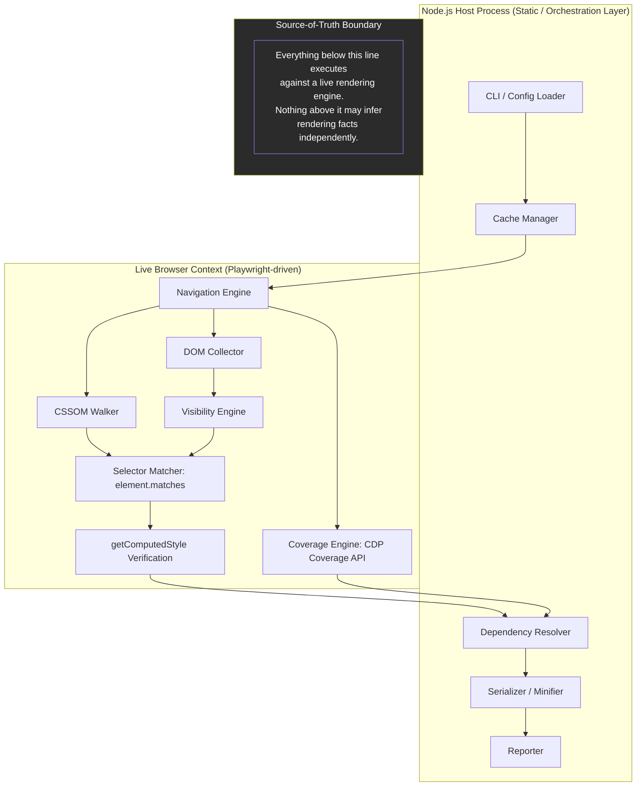
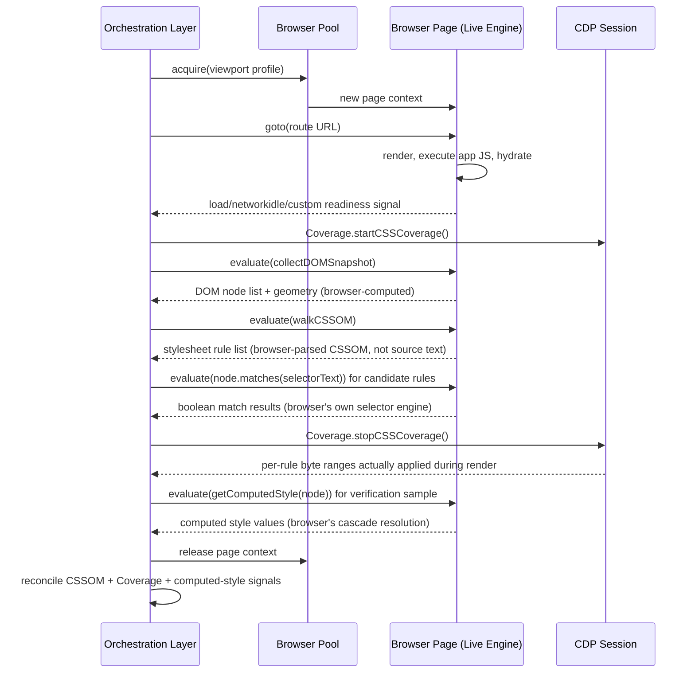
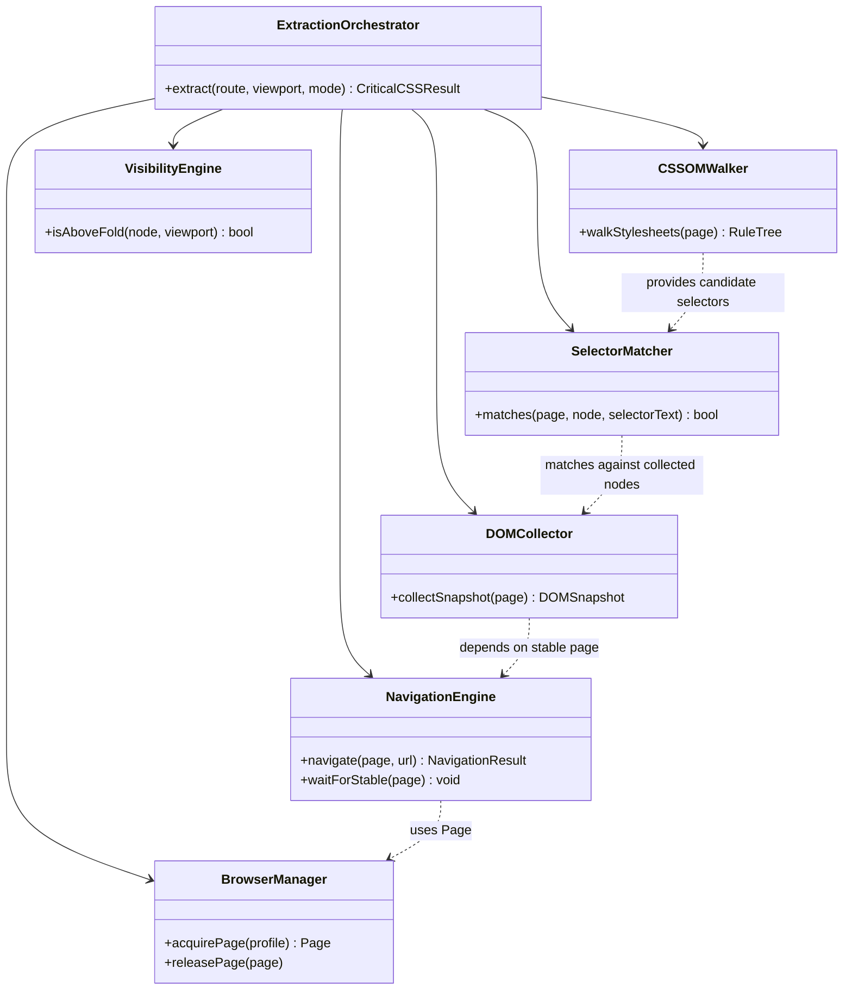

# ADR-0001: The Live Browser CSSOM Is the Source of Truth for Extraction

## Version

1.0.0 — 2026-07-09

## Purpose

This document records the foundational architectural decision of the Critical CSS Extraction Engine: that all determinations of "which CSS is required to render above-the-fold content" are made by querying a live, running browser engine (its DOM, CSSOM, layout, and rendering pipeline) rather than by statically parsing HTML and CSS source files. This decision underlies nearly every subsequent architectural choice in the system — from the selection of Playwright as the browser abstraction (ADR-0003) to the prohibition on hand-rolled selector engines (ADR-0002) to the Hybrid extraction mode (ADR-0005). Anyone implementing, extending, or auditing the engine must understand why this decision was made, what alternatives were rejected, and what consequences flow from it.

## Audience

- Core engine implementers (Browser Manager, Navigation Engine, DOM Collector, CSSOM Walker authors)
- Plugin authors who need to understand what guarantees the engine does and does not provide
- SSR integration authors evaluating whether framework-specific shortcuts are compatible with this model
- Engineering leadership evaluating build-vs-buy tradeoffs against existing tools (Critical, Penthouse, Critters)
- Future contributors proposing a static-analysis fast path (this ADR explains why that proposal must clear a very high bar)

## Prerequisites

Readers should be familiar with:
- The CSS Object Model (CSSOM) and how it differs from the CSS source text
- The distinction between the DOM tree, the render tree, and the layout tree
- Basic familiarity with existing critical-CSS tools (Critical, Penthouse, Critters) and their general approach (static HTML parsing + heuristic viewport simulation, or PostCSS-based AST rewriting)
- The concept of "above-the-fold" content in web performance engineering
- Basic knowledge of headless browser automation (Puppeteer/Playwright/Selenium family)

## Related Documents

- [ADR-0002-No-Custom-Selector-Parser](./ADR-0002-No-Custom-Selector-Parser.md) — direct consequence of this decision
- [ADR-0003-Playwright-As-Browser-Abstraction](./ADR-0003-Playwright-As-Browser-Abstraction.md) — chooses the concrete browser automation layer that implements this decision
- [ADR-0005-Hybrid-Extraction-Mode](./ADR-0005-Hybrid-Extraction-Mode.md) — builds on the browser-as-authority model to combine multiple in-browser signals
- [001-Vision](../architecture/001-Vision.md) — states the project vision that motivates this decision
- [006-Design-Principles](../architecture/006-Design-Principles.md) — enumerates the design principles this ADR instantiates
- [002-Problem-Statement](../architecture/002-Problem-Statement.md) — describes the correctness failures of static-parsing tools that this decision solves

## Overview

Critical CSS extraction is, at its core, a question about *runtime rendering behavior*: "for this specific document, in this specific viewport, with this specific set of stylesheets and this specific DOM state, which CSS rules are actually applied to which nodes, and which of those nodes are visible above the fold?" This is fundamentally a question that only a real rendering engine can answer with full fidelity, because the CSS specification's cascade, selector-matching, and layout algorithms are large, subtle, under constant revision, and — critically — are already correctly implemented in every modern browser engine.

Existing tools in this space (Critical, Penthouse, Critters, and their many forks) were built in an era where the DOM shape produced by a static HTML file was a reasonably faithful approximation of what a browser would render. That assumption has eroded substantially over the past decade:

- **CSS-in-JS** libraries (styled-components, Emotion, vanilla-extract, Stitches) generate class names and inject `<style>` tags at runtime, meaning the CSS that determines rendering does not exist in any static source file the extractor can read.
- **Shadow DOM** (Web Components, Lit, Stencil) encapsulates both markup and styles behind shadow boundaries invisible to a naive DOM parser walking `document.querySelectorAll`.
- **Dynamic class composition** (CSS Modules with computed hashes, Tailwind's JIT engine generating classes from arbitrary utility combinations, conditional class logic in React/Vue components) means the actual `class` attribute values on rendered nodes frequently do not match what is visible in the pre-render source.
- **Container queries, `:has()`, and other context-dependent selectors** require actual layout information (the size of an ancestor container, the presence of specific descendant patterns) that cannot be resolved by reading CSS text in isolation — they require a laid-out tree.
- **Media queries evaluated against actual viewport and device characteristics** (not just `min-width`, but `prefers-color-scheche`, `prefers-reduced-motion`, `hover`, dynamic viewport units like `100dvh`) require an environment that behaves like a real browser, because static parsers must simulate or guess these values.
- **Client-side hydration and progressive rendering** mean that what is visible "above the fold" at `DOMContentLoaded` may differ substantially from what is visible after JavaScript has run and hydrated interactive components.

Given these realities, this ADR commits the engine to using a live browser instance as the single source of truth for every fact the engine needs: DOM structure, computed styles, matched CSS rules, geometry, and visibility. No module in the engine is permitted to infer these facts from static analysis of source files when a browser-derived answer is available.

## Detailed Design

### Status

**Accepted.**

### Context

The engine's stated non-goal (see [002-Problem-Statement](../architecture/002-Problem-Statement.md)) is explicit: *do not use existing critical CSS generators, and do not rely on static CSS parsing to determine usage.* This ADR is the direct architectural translation of that non-goal into a concrete technical commitment.

Three categories of design were considered as the basis for the engine's "world model" — the mechanism by which the engine learns what CSS applies to what content:

1. **Static AST parsing** — Parse HTML with an HTML parser (e.g., `parse5`, `htmlparser2`) and CSS with a CSS AST parser (e.g., PostCSS, `css-tree`), building an in-memory representation of both trees, then writing a custom matching layer that walks the CSS AST's selectors against the HTML AST's nodes to determine which rules apply. This is, in essence, the architecture used by Penthouse and (partially) by Critical.
2. **Headless DOM emulation** — Use a JavaScript DOM implementation that does not render pixels but implements the DOM and CSSOM APIs in-process (jsdom being the canonical example), allowing the use of real browser-like APIs (`querySelector`, `getComputedStyle`, `element.matches()`) without the overhead of a full rendering engine.
3. **Full browser automation** — Launch and drive an actual browser engine (Chromium, Firefox, WebKit) via a remote-control protocol (CDP, WebDriver, or a wrapping library such as Playwright or Puppeteer), and query it in-process for DOM, CSSOM, geometry, and computed style facts *as the browser itself understands them*.

### Decision

The engine adopts **option 3: full browser automation** as the sole mechanism for determining rendering facts. Concretely:

- The Browser Manager module owns a pool of real browser instances (see [ADR-0003](./ADR-0003-Playwright-As-Browser-Abstraction.md) for the choice of Playwright as the automation layer).
- The Navigation Engine loads the target page (or route) into a real page context and waits for rendering to stabilize (network idle, paint quiescence, optional custom readiness signals).
- The DOM Collector, Visibility Engine, CSSOM Walker, and Selector Matcher all execute their logic either by evaluating JavaScript inside the live page context (via `page.evaluate()`/`page.evaluateHandle()`-style APIs) or by querying browser-exposed protocol data (e.g., the CDP Coverage domain, described in [ADR-0005](./ADR-0005-Hybrid-Extraction-Mode.md)).
- No module is permitted to open a `.css` or `.html` file and reason about its content directly for the purposes of determining what is "used" or "visible." Static file reads are permitted only for orthogonal purposes such as fingerprinting for the cache layer (see the Cache Manager module design, forthcoming in `docs/design/800-Cache-Overview.md`).

### Consequences

**Positive:**
- **Correctness by construction.** Every fact the engine reports (matched selector, computed style, visible node) is a fact the *browser itself* believes to be true, not an approximation computed by a secondary implementation. This eliminates an entire class of bugs where the extractor's model of CSS semantics diverges from the browser's.
- **Zero selector-spec maintenance burden.** As new selectors (`:has()`, nesting, container query syntax) ship in browsers, the engine gains support automatically, with no code changes (see [ADR-0002](./ADR-0002-No-Custom-Selector-Parser.md)).
- **Handles all dynamic-CSS scenarios uniformly.** CSS-in-JS, Shadow DOM, dynamically computed classes, and JS-driven DOM mutations are all handled identically, because the engine observes the *result* of all of this machinery rather than trying to statically predict it.
- **Multi-engine cross-validation becomes possible.** Because the abstraction is "a browser," not "Chromium specifically," the architecture leaves room for running extraction against Firefox/WebKit engines to detect engine-specific critical CSS divergence — valuable for sites targeting broad browser support.

**Negative:**
- **Per-page extraction is slower** than static parsing. Launching a browser context, navigating, waiting for stabilization, and executing in-page JavaScript is measured in hundreds of milliseconds to low seconds per (route × viewport) combination, versus low milliseconds for a pure AST-based approach operating on cached file reads.
- **Operational complexity of browser lifecycle management.** The engine must now manage a pool of browser processes: handle crashes, zombie processes, memory growth, sandboxing, and resource exhaustion under high concurrency (see the Browser Pool design in `docs/design/102-Browser-Pool.md`).
- **CI/CD environments must support headless browser execution**, which imposes dependencies (shared libraries for Chromium/WebKit, sufficient `/dev/shm`, appropriate sandboxing flags) that a pure Node.js static-analysis tool would not require.
- **Network and asset availability become extraction-time dependencies.** The page under extraction must actually be reachable and renderable (either against a live server, a local dev server, or file:// URLs with all assets resolvable), whereas a static tool can operate purely against files on disk with no live server requirement.

These consequences are accepted as the necessary cost of correctness. Section "Tradeoffs" below expands on how the engine mitigates the negative consequences without abandoning the core commitment.

## Architecture

The following diagram shows where the "browser as source of truth" boundary sits within the overall extraction pipeline. Every box below the boundary line executes logic *inside* a live browser context; every box above it operates on already-extracted, browser-verified facts.



### Sequence: A Single Extraction Request



Every arrow that crosses into the "Browser Page" or "CDP Session" lifelines represents a fact obtained from the live engine, never inferred by the host process's own logic.

### Class-Level View



## Algorithms

While this ADR is primarily a design decision rather than an algorithm specification, it is useful to state precisely the decision procedure the engine uses at extraction time to decide *how* to obtain a given fact, since this is the operational expression of "browser is source of truth."

### Fact Resolution Procedure

**Problem statement:** Given a request for a rendering fact `F` (e.g., "is selector `S` matched against node `N`?", "is node `N` visible above the fold?", "what stylesheets exist and in what cascade order?"), determine the correct procedure to resolve `F` such that the answer is guaranteed consistent with what the target browser would use to render the page.

**Inputs:**
- `F`: an enum of fact types the engine ever needs to know (`SELECTOR_MATCH`, `NODE_VISIBILITY`, `RULE_LIST`, `COMPUTED_STYLE`, `COVERAGE_APPLIED`, `LAYOUT_GEOMETRY`)
- `page`: an active, navigated, stabilized Playwright `Page` handle bound to a real browser context

**Output:** the resolved fact value, always obtained via an in-browser call, never via a secondary reimplementation.

**Pseudocode:**

```
function resolveFact(factType, page, args):
    switch factType:
        case SELECTOR_MATCH:
            # Delegate to the browser's own selector engine.
            return page.evaluate(
                (node, selectorText) => node.matches(selectorText),
                args.node, args.selectorText
            )

        case NODE_VISIBILITY:
            # Combine browser-computed geometry with browser-computed style.
            rect = page.evaluate(node => node.getBoundingClientRect(), args.node)
            style = page.evaluate(node => getComputedStyle(node), args.node)
            return VisibilityEngine.decide(rect, style, args.viewport, args.foldConfig)

        case RULE_LIST:
            # Walk document.styleSheets — the browser's own parsed CSSOM,
            # never the raw .css source text.
            return page.evaluate(() => CSSOMWalker.walkAllSheets())

        case COMPUTED_STYLE:
            return page.evaluate(
                (node, props) => {
                    const cs = getComputedStyle(node)
                    return props.reduce((acc, p) => { acc[p] = cs.getPropertyValue(p); return acc }, {})
                },
                args.node, args.properties
            )

        case COVERAGE_APPLIED:
            # Delegate entirely to the CDP Coverage domain.
            return CDPSession.send('CSS.takeCoverageDelta')

        case LAYOUT_GEOMETRY:
            return page.evaluate(node => node.getBoundingClientRect(), args.node)

    # INVARIANT: no branch of this function may compute an answer using a
    # locally-implemented CSS parser, selector matcher, or layout algorithm.
    # If such a branch is ever proposed, it is a violation of ADR-0001 and
    # must be rejected in review.
```

**Time complexity:** Each individual `resolveFact` call is O(1) plus the fixed cost of a round trip into the browser context (an `evaluate()` call), which is dominated by IPC/serialization overhead rather than algorithmic complexity. Batched variants (resolving facts for N nodes in a single `evaluate()` call) amortize this fixed cost across N, which is the standard optimization applied throughout the DOM Collector and CSSOM Walker (see Performance Optimizations, Section 2.14 of the brief).

**Memory complexity:** O(D + R) where D is the number of DOM nodes collected and R is the number of CSSOM rules walked, since both must be materialized in the host process to support downstream dependency resolution and serialization.

**Failure cases:**
- Browser context crash mid-evaluation (handled by Browser Pool retry logic, out of scope for this ADR)
- `page.evaluate()` timeout due to an infinite loop or extremely deep tree (mitigated via configurable per-call timeouts)
- Detached node references (a node collected in one snapshot becoming stale after a DOM mutation) — see Edge Cases below

**Optimization opportunities:** batch evaluation calls; memoize `SELECTOR_MATCH` results per (node, selector) pair within a single extraction run (see [ADR-0002](./ADR-0002-No-Custom-Selector-Parser.md) for the memoization strategy); prefer Coverage API bulk retrieval over per-rule polling.

## Implementation Notes

1. **Every module boundary must be auditable for this invariant.** Code review checklists for the Browser Manager, DOM Collector, Visibility Engine, CSSOM Walker, and Selector Matcher modules must include an explicit check: "does this function read/parse a `.css` or `.html` file, or a source string, to answer a rendering question?" If yes, it is a defect against this ADR.
2. **Static file reads remain legitimate for non-rendering purposes.** The Cache Manager fingerprints file contents (hashing raw file bytes) purely as a change-detection input, not to interpret CSS or HTML semantics. This is explicitly not a violation because no rendering fact is derived from the parse.
2a. Similarly, the Dependency Resolver may read a `package.json` or resolve a `node_modules` path to locate a stylesheet asset on disk for cache fingerprinting — again, this is file *location*, not file *interpretation*.
3. **`page.evaluate()` payloads should be pure functions with explicit serializable arguments.** Avoid closures over host-process state; pass all required data as function arguments to keep the browser/host boundary explicit and testable.
4. **Batch aggressively.** A naive implementation issuing one `page.evaluate()` per DOM node will not scale past a few hundred nodes without dominant IPC overhead; the DOM Collector must collect entire subtrees per call (see `docs/design/106-DOM-Snapshot.md`, forthcoming).
5. **Prefer `page.evaluateHandle()` and `JSHandle` retention over serialize/deserialize round-trips** when the same node must be queried multiple times across different fact types within a single extraction pass, to avoid repeated node-lookup cost.
6. **Version-pin the browser binary.** Because correctness now depends on the *specific* rendering engine's interpretation of the CSS spec, non-deterministic output can result from browser auto-updates. The Browser Manager must pin and record the exact browser build version used for each extraction run in diagnostics output (see Reporter module).

## Edge Cases

- **Detached DOM references across evaluate() calls.** If application JavaScript mutates the DOM between the DOM Collector's snapshot and a later Selector Matcher query against a previously-referenced node, the `JSHandle` may become stale. The engine must re-resolve node handles via stable identifiers (e.g., injected `data-ccss-id` attributes) rather than assuming handle longevity across asynchronous boundaries.
- **Shadow DOM boundaries.** `document.querySelectorAll` does not pierce shadow roots. The DOM Collector must explicitly recurse into `shadowRoot` when `element.shadowRoot` is non-null (open shadow roots only; closed shadow roots are an inherent, accepted blind spot — see Section "Tradeoffs").
- **Constructable Stylesheets (`CSSStyleSheet` adopted via `adoptedStyleSheets`).** These do not appear in `document.styleSheets` in the same way as `<link>`/`<style>`-originated sheets in all browser versions; the CSSOM Walker must separately enumerate `shadowRoot.adoptedStyleSheets` and `document.adoptedStyleSheets`.
- **Cross-origin stylesheets.** `document.styleSheets[i].cssRules` throws a `SecurityError` for cross-origin sheets without CORS headers. The CSSOM Walker must catch this per-sheet and fall back to Coverage-API-only knowledge for that sheet's contribution, flagging it in diagnostics as "opaque cross-origin sheet — coverage-only visibility."
- **Iframes.** Content inside same-origin iframes has its own `document` and `styleSheets`; cross-origin iframes are entirely opaque to the extraction engine and must be explicitly out of scope per extraction run configuration.
- **`display: contents` and zero-size elements.** These pass DOM presence but may or may not be considered "visible" depending on Visibility Engine configuration; the browser correctly reports their computed style and geometry, but the *interpretation* of visibility is an engine policy, not a browser fact — this must not be conflated.
- **Browser-version-specific CSS support divergence.** A selector like `:has()` might match in one Chromium build and not an older one. Because the engine trusts the browser, its "correctness" is bounded by *that specific browser build's* spec conformance — this is an accepted, documented characteristic, not a defect (see [ADR-0002](./ADR-0002-No-Custom-Selector-Parser.md)).
- **Dynamic content requiring interaction (hover, focus, scroll-triggered animations).** The engine, by default, captures a single rendering snapshot; :hover/:focus-triggered CSS is out of scope unless a plugin explicitly simulates the interaction via `beforeCollection`/`afterCollection` hooks (see [ADR-0004](./ADR-0004-Plugin-Lifecycle-Model.md)).
- **Print stylesheets and non-screen media.** `document.styleSheets` includes `media="print"` sheets; the CSSOM Walker must filter by the target media type consistent with the extraction's viewport/media profile, mirroring how the browser itself would apply them for `screen` rendering.

## Tradeoffs

| Dimension | Static Parsing (Rejected) | jsdom Emulation (Rejected) | Live Browser (Chosen) |
|---|---|---|---|
| Correctness for CSS-in-JS | Poor — requires bespoke integration per library | Partial — depends on jsdom's CSSOM completeness | Full — CSS-in-JS runs exactly as in production |
| Correctness for Shadow DOM | Poor — most static parsers do not model shadow roots | Partial — jsdom's Shadow DOM support is incomplete and diverges from spec in edge cases | Full — native browser Shadow DOM implementation |
| Selector spec coverage | Requires a hand-maintained selector matcher (see ADR-0002) | Depends on jsdom's selector engine (nwsapi), which lags browser engines | Full — native, always current with the target browser build |
| Layout / geometry accuracy | None — no layout engine | None — jsdom does not perform real layout (no `getBoundingClientRect` fidelity) | Full — real layout engine (Blink/Gecko/WebKit) |
| Speed per page | Fastest (milliseconds) | Fast (tens of milliseconds) | Slower (hundreds of ms to low seconds) |
| Operational complexity | Lowest — pure Node.js, no native binaries | Low-medium — pure JS but heavier dependency | Highest — browser binaries, sandboxing, process pool management |
| CI/CD footprint | Minimal | Small | Requires headless browser support in CI images |
| Handles container queries / `:has()` correctly | No | No (jsdom has no layout, cannot evaluate container queries) | Yes |
| Media feature evaluation (`prefers-color-scheme`, `hover`, dynamic viewport units) | Requires manual simulation, error-prone | Partial, jsdom approximates but does not fully implement CSSOM Media Queries Level 4/5 | Native |

**Why static AST parsing (PostCSS-based) was rejected:** It was the architecture used by the very tools this project exists to replace (Critical, Penthouse). Its fundamental limitation is that it can only reason about what is present in source text; it has no model of runtime DOM mutation, CSS-in-JS injection, or Shadow DOM. Any correctness gap here directly reproduces the known failure modes that motivated this project (see [002-Problem-Statement](../architecture/002-Problem-Statement.md)).

**Why jsdom-based headless DOM emulation was rejected:** jsdom is an impressive engineering effort, but it is explicitly *not* a rendering engine — it has no layout algorithm, meaning `getBoundingClientRect()` calls return degenerate/zero values unless extensively mocked, which defeats the purpose of a geometry-driven Visibility Engine. Its selector engine (`nwsapi`) and CSSOM implementation, while good, are secondary implementations that can and do diverge from browser behavior, especially for newly-shipped CSS features. Choosing jsdom would mean inheriting a *different* correctness gap from the one we are trying to close, merely a smaller one. It was seriously considered as a "fast mode" fallback for CI smoke tests, but was ultimately rejected even for that role in favor of running a real (if lightweight) headless browser, to avoid maintaining two divergent code paths with different fidelity guarantees.

**Why full browser automation was chosen despite its costs:** The project's explicit reason for existing is to fix correctness bugs in browser-facing tools that arise from not using the browser. Any compromise on this point reintroduces the original problem. The performance and operational costs are real but are addressable through engineering effort (pooling, caching, parallelization — see Performance section below and [ADR-0005](./ADR-0005-Hybrid-Extraction-Mode.md)), whereas correctness gaps from a secondary CSS/DOM implementation are not addressable without eventually converging back to "use the real browser," at which point the intermediate investment is wasted.

**Future implications:** This decision means every future extraction strategy (Coverage mode, Hybrid mode, computed-style verification) must be expressible as "a way of asking the live browser a question," never as "a way of avoiding asking the live browser a question." Proposals that attempt to introduce a static fast-path for "simple" pages must be evaluated with extreme skepticism, because the definition of "simple" is itself unreliable without first rendering the page to check.

## Performance

- **CPU complexity:** Per-route extraction cost is dominated by (a) browser process navigation/rendering time, which is largely outside the engine's control and is a function of the target page's own complexity, and (b) the number and granularity of `page.evaluate()` round trips, which the engine controls directly through batching.
- **Memory complexity:** Each active browser context consumes tens to low hundreds of MB depending on page complexity; the Browser Pool must cap concurrent contexts based on available system memory (see `docs/design/102-Browser-Pool.md`).
- **Caching strategy:** The Cache Manager fingerprints (HTML content hash, CSS asset hashes, viewport profile, extraction mode) and skips re-invoking the browser entirely when a fingerprint match is found (see Section 2.8 of the brief and the forthcoming `docs/design/800-Cache-Overview.md`). This is the primary lever for amortizing the inherent cost of browser-based extraction across CI runs where most routes are unchanged between commits.
- **Parallelization opportunities:** Multiple browser contexts (and, resource permitting, multiple browser processes) can run concurrently, since each route/viewport extraction is independent. The Browser Pool exposes a configurable concurrency limit; the CI/CD pipeline (Section 2.11 of the brief) is expected to shard routes across pool workers.
- **Incremental execution:** Because fingerprinting operates at the route+viewport+mode granularity, a change to a single component's CSS only invalidates the cache entries for routes that render that component, not the entire route manifest — provided the Dependency Resolver's graph correctly attributes CSS assets to routes (see forthcoming `docs/algorithms/507-Dependency-Graph-Construction.md`).
- **Profiling guidance:** Because browser-derived latency dominates, profiling should distinguish "time spent waiting on browser navigation/paint" from "time spent in `page.evaluate()` round trips" from "time spent in host-process post-processing (dependency resolution, serialization)." The Reporter's timing report (Section 2.12) must break down these three phases per extraction run to make regressions attributable.
- **Scalability limits:** Browser process count is bounded by host memory and CPU core count; beyond a certain concurrency, context-switching overhead and memory pressure degrade throughput. The engine should default to a concurrency ceiling derived from `os.cpus().length` and expose it as a configuration override, with guidance to horizontally scale via distributed workers (Phase 5 roadmap item, Section 2.17) rather than over-provisioning a single host.

## Testing

- **Unit tests:** Fact-resolution helper functions (e.g., pure functions that decide visibility given a rect+style+viewport, independent of how that rect/style was obtained) can and should be unit tested with mocked geometry/style inputs, without a real browser. This keeps the majority of business logic fast to test while the browser-dependent glue code is tested separately.
- **Integration tests:** A dedicated fixture suite (see Section 2.15 of the brief: Tailwind, Bootstrap, CSS Modules, Styled Components, Emotion, Shadow DOM, SVG, Container Queries, Nested CSS fixtures) must be extracted end-to-end against a real Playwright-driven browser in CI, asserting that known-correct critical CSS sets are produced. These tests exist specifically to catch violations of this ADR (i.e., any code path that silently starts trusting static analysis instead of the browser).
- **Visual regression tests:** Render pages with only the extracted critical CSS applied (in isolation) and screenshot-diff against a "known good above-the-fold" reference render, to catch cases where the browser-derived extraction nonetheless produced visually incorrect results (e.g., due to a Visibility Engine misconfiguration rather than a browser-fidelity issue).
- **Golden CSS snapshot tests:** For a fixed fixture set, snapshot the exact serialized critical CSS output and fail on unexpected diffs, with manual review required to accept intentional changes (e.g., after a browser version bump changes cascade behavior for an edge-case selector).
- **Performance benchmark tests:** Track wall-clock and memory cost per extraction across the fixture suite over time, specifically isolating the "browser-communication overhead" component described in the Performance section, to detect regressions introduced by, e.g., a change that inadvertently issues per-node `evaluate()` calls instead of batched calls.
- **Stress tests:** Extract against artificially large fixtures (enterprise-scale stylesheets with tens of thousands of rules, DOM trees with tens of thousands of nodes) to validate that the browser-based approach remains tractable at scale, and to find the practical ceiling referenced in "Scalability limits" above.
- **Regression tests:** Any bug filed against this architecture (e.g., "extraction missed a CSS-in-JS-injected rule") must be captured as a permanent fixture + expected-output pair, since these are exactly the bug classes this ADR exists to prevent from recurring.

## Future Work

- **Multi-engine consensus extraction.** Because the abstraction is "a browser," the architecture permits (but does not yet implement) running extraction against Chromium, Firefox, and WebKit concurrently and reporting divergences as a diagnostic signal for sites needing broad cross-browser critical CSS fidelity. This is a natural Phase 3+ extension (see Section 2.17, Phase 3).
- **Warm browser context reuse across routes** to amortize browser startup cost further, contingent on ensuring no state leakage (cookies, storage, injected globals) between extraction runs — a correctness-sensitive optimization requiring careful design.
- **Partial-DOM / component-level extraction** for micro-frontend architectures, where only a fragment of a page is owned by a given team; this requires rethinking what "the live browser" means when no single page owns the full route.
- **Investigate WebDriver BiDi** as a potential future replacement or complement to CDP-based control, once it reaches parity with CDP's Coverage domain across engines, which would reduce the current Chromium-centric bias for coverage-driven modes (see [ADR-0005](./ADR-0005-Hybrid-Extraction-Mode.md)).
- **Open question:** should the engine ever support a documented, clearly-labeled "unsafe fast mode" using static parsing for extremely simple pages (e.g., pure static HTML with a single stylesheet, no JS at all) as an opt-in performance tradeoff? This ADR's position is that such a mode, if ever built, must be an explicit, separately-branded feature with prominent correctness caveats, never the default, and never silently substituted by heuristics — to avoid reintroducing the exact ambiguity this project was created to eliminate.
- **Research idea:** explore whether a browser's own upcoming "Speculation Rules" / prerendering APIs could be leveraged to reduce navigation latency for batch route extraction, since many target routes share layout shells and initial CSS.

## References

- [001-Vision](../architecture/001-Vision.md)
- [002-Problem-Statement](../architecture/002-Problem-Statement.md)
- [006-Design-Principles](../architecture/006-Design-Principles.md)
- [ADR-0002-No-Custom-Selector-Parser](./ADR-0002-No-Custom-Selector-Parser.md)
- [ADR-0003-Playwright-As-Browser-Abstraction](./ADR-0003-Playwright-As-Browser-Abstraction.md)
- [ADR-0005-Hybrid-Extraction-Mode](./ADR-0005-Hybrid-Extraction-Mode.md)
- CSS Object Model (CSSOM) specification, W3C
- CSS Cascading and Inheritance specification, W3C
- Chrome DevTools Protocol, CSS domain and Coverage domain documentation
- jsdom project documentation and known limitations (layout, Shadow DOM, CSSOM completeness)
- Prior art: Critical, Penthouse, Critters — architecture and known issue trackers documenting static-parsing correctness gaps
