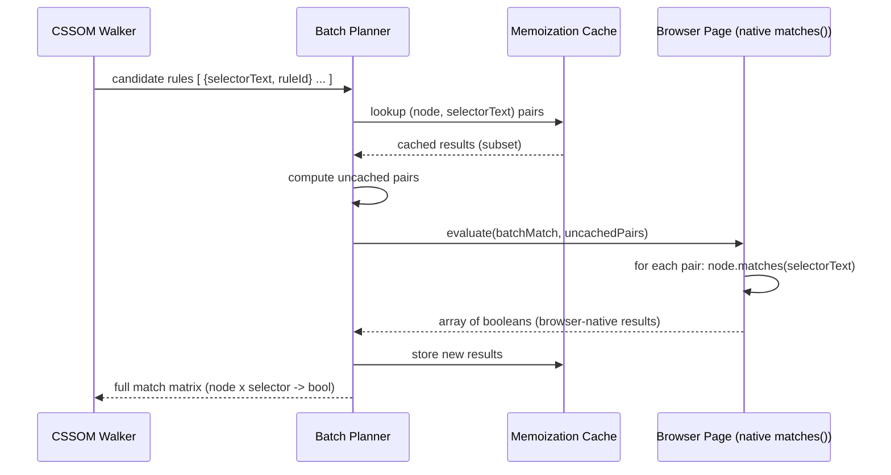
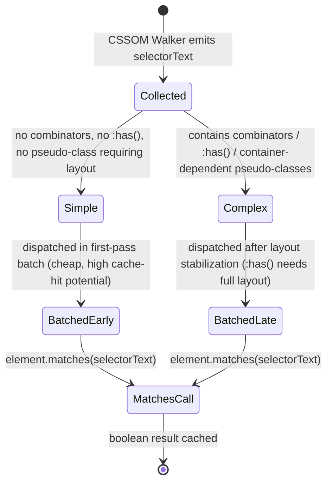

# ADR-0002: Never Implement a Custom CSS Selector Parser or Matcher

## Version

1.0.0 — 2026-07-09

## Purpose

This document records the decision to permanently forbid the implementation of a hand-rolled CSS selector parsing or matching engine anywhere in the Critical CSS Extraction Engine codebase, and to instead delegate all selector-matching decisions to the native `Element.prototype.matches()` API executed inside a real, live browser context. This is a direct corollary of [ADR-0001](./ADR-0001-Browser-Is-Source-of-Truth.md) but is significant enough, and tempting enough to violate under performance pressure, that it warrants its own explicit, standalone record.

## Audience

- Engineers implementing or optimizing the Selector Matcher module
- Engineers implementing the CSSOM Walker, which produces the candidate selector list fed into matching
- Performance engineers proposing selector-matching optimizations (memoization, indexing, pre-filtering)
- Reviewers auditing pull requests that touch selector logic
- Future contributors tempted to "just write a small selector matcher" for a performance win

## Prerequisites

- Familiarity with the CSS Selectors Level 3/4 specification and its ongoing evolution (Level 4 adds `:is()`, `:where()`, `:has()`; nesting and nesting nesting-context selectors are separately specified)
- Familiarity with `Element.prototype.matches(selectorText)` and its semantics
- Understanding of JavaScript selector-matching libraries such as `css-select`, `nwsapi`, and `sizzle`, and their design goals
- Context from [ADR-0001-Browser-Is-Source-of-Truth](./ADR-0001-Browser-Is-Source-of-Truth.md)

## Related Documents

- [ADR-0001-Browser-Is-Source-of-Truth](./ADR-0001-Browser-Is-Source-of-Truth.md) — the parent decision this ADR specializes
- [ADR-0005-Hybrid-Extraction-Mode](./ADR-0005-Hybrid-Extraction-Mode.md) — describes how selector matching results combine with Coverage and computed-style signals
- [006-Design-Principles](../architecture/006-Design-Principles.md)
- [001-Vision](../architecture/001-Vision.md)
- Forthcoming: `docs/design/400-Selector-Matching.md`, `docs/design/401-Selector-Memoization.md`, `docs/design/404-Is-Where-Has.md`

## Overview

CSS selector syntax is one of the largest and most actively evolving surfaces of the CSS specification ecosystem. It spans:

- Simple selectors (type, class, ID, universal)
- Attribute selectors with multiple matching operators (`=`, `~=`, `|=`, `^=`, `$=`, `*=`) and case-sensitivity flags
- Combinators (descendant, child `>`, adjacent sibling `+`, general sibling `~`, and the still-evolving column combinator `||`)
- Pseudo-classes, both static (`:hover`, `:first-child`, `:nth-child(An+B [of S]?)`) and dynamic/stateful (`:checked`, `:focus-within`, `:target`, `:defined`)
- Pseudo-elements (`::before`, `::after`, `::marker`, `::placeholder`, `::part()`, `::slotted()`)
- Logical combinators (`:is()`, `:where()`, `:not()` with complex selector lists, and the relational `:has()`)
- Namespace selectors for XML/SVG contexts
- CSS Nesting's implicit `&` parent-selector semantics
- Selectors scoped to `@scope` blocks
- Container query selector-adjacent syntax (`@container` conditions, which interact with selector matching indirectly through style recomputation)

Each of these has precise matching semantics defined across multiple W3C specifications, several of which are still Working Drafts subject to change, and all of which are already implemented — correctly, and kept up to date — inside every major browser engine. This ADR states plainly: the engine will never attempt to reimplement any part of this surface. Every selector-matching decision is delegated to `element.matches(selectorText)`, evaluated inside the live browser context established per [ADR-0001](./ADR-0001-Browser-Is-Source-of-Truth.md).

## Detailed Design

### Status

**Accepted.**

### Context

During early design discussions, two categories of proposals were raised as ways to improve selector-matching throughput, both of which implicitly required abandoning `element.matches()` as the exclusive matching mechanism:

1. **Adopt a JavaScript selector-matching library** (e.g., `css-select`, which powers Cheerio; or `nwsapi`, which powers jsdom) to match parsed selector ASTs against an in-memory DOM representation, run either in the host Node.js process or injected into the page context to replace native matching with a "faster" JS implementation.
2. **Write a custom, purpose-built selector matcher** scoped only to the subset of selector syntax believed to be common in real-world stylesheets, with a fallback to "unknown/unsupported" for exotic selectors, on the theory that a narrow, specialized matcher could be faster and more predictable than a general one.

Both proposals were motivated by legitimate performance concerns: `page.evaluate()` round trips carry serialization overhead, and matching potentially tens of thousands of CSS rules against thousands of DOM nodes is a combinatorially large workload (see Algorithms section below). However, both proposals were rejected.

### Decision

The engine will **exclusively use `element.matches(selectorText)`**, invoked inside the live browser page context, as the one and only selector-matching primitive. No JavaScript selector-matching library will be added as a dependency for matching purposes (such libraries may still appear transitively via other tooling, but must never be invoked to answer "does this rule apply to this node"). No custom selector parser or AST-based matcher will be implemented in this codebase, now or in the future, without a superseding ADR that explicitly revisits and overturns this decision with extraordinary justification.

Performance concerns are instead addressed through **batching and memoization at the orchestration layer**, not by replacing the matching primitive itself (see Algorithms and Performance sections below).

### Consequences

**Positive:**
- **Correctness is bounded by browser conformance, not by this codebase's engineering effort.** A selector-matching bug can only occur if the target browser itself has a conformance bug — an extremely rare and well-tested class of issue — rather than "this project's from-scratch reimplementation of fifteen years of CSS selector spec evolution has a gap."
- **Zero maintenance burden for new selector syntax.** When `:has()` shipped in Chromium, Firefox, and Safari, the engine gained correct `:has()` support with no code change whatsoever, because `element.matches(':has(...)')` simply started returning correct answers as soon as the browser under automation supported it.
- **No selector-subset limitations.** A hand-rolled matcher scoped to "common" selectors would, by construction, misclassify or reject exotic-but-valid selectors (complex `:nth-child(An+B of S)` syntax, deeply nested `:is()`/`:where()` combinations, namespaced SVG selectors) — exactly the kind of long-tail correctness gap this project exists to close (see [ADR-0001](./ADR-0001-Browser-Is-Source-of-Truth.md)).
- **Simplifies the codebase dramatically.** No selector tokenizer, parser, specificity calculator (specificity is needed for cascade resolution but is computed independently — see the Cascade Resolver design, not the matcher itself), or AST walker needs to be written, tested, or maintained.

**Negative:**
- **Matching throughput is bounded by `page.evaluate()` round-trip cost**, which is architecturally slower per-call than an equivalent in-process JS function call would be, though this is mitigated through batching (see Algorithms).
- **The engine cannot match selectors "offline"** (i.e., without an active browser page), which constrains certain hypothetical use cases like static CI linting of selector usage without a browser — such use cases are explicitly out of scope for this engine.
- **Matching behavior is coupled to the specific browser build in use.** Two different Chromium versions might disagree on a bleeding-edge selector's behavior. This is treated as an accepted, documented characteristic (see [ADR-0001](./ADR-0001-Browser-Is-Source-of-Truth.md), Edge Cases) rather than a defect, since the alternative (a from-scratch matcher) would not be "more correct" — it would simply be "differently wrong."

## Architecture

The Selector Matcher sits between the CSSOM Walker (which enumerates candidate rules) and the Cascade Resolver (which needs to know, for each DOM node, the full set of matched rules before computing final cascade winners).

```mermaid
flowchart LR
    subgraph Host["Host Process"]
        CSSOMW[CSSOM Walker\nenumerates rules + selectorText]
        BATCH[Batch Planner\ngroups (node, selector) pairs]
        MEMO[Match Memoization Cache\nkey: selectorText + node identity]
        CASCADE[Cascade Resolver]
    end
    subgraph Browser["Live Browser Page"]
        MATCHES["element.matches(selectorText)\n(native browser implementation)"]
    end

    CSSOMW --> BATCH
    BATCH --> MEMO
    MEMO -- cache miss --> MATCHES
    MATCHES -- boolean result --> MEMO
    MEMO -- cache hit or fresh result --> CASCADE

    style MATCHES fill:#1f6feb,color:#fff
```

### Sequence: Batched Matching Pass



### State View: Selector Classification for Batching (Not Matching Logic)

It is important to note that the following diagram governs *how selectors are grouped for efficient batched dispatch to the browser*, not any independent matching logic — the actual boolean decision always comes from `element.matches()`.



This classification is purely a scheduling optimization: `:has()` selectors are deferred until after layout has fully stabilized because their result can depend on descendant layout, but the classification never substitutes a different matching algorithm — it only changes *when* `element.matches()` is called, never *what* answers the question.

## Algorithms

### Problem Statement

Given a set of DOM nodes `N` (typically thousands, collected by the DOM Collector) and a set of CSSOM rules `R` (typically thousands to tens of thousands, enumerated by the CSSOM Walker), determine, for every `(n, r)` pair, whether `r.selectorText` matches `n`, using only `element.matches()` as the decision primitive, while minimizing the number and cost of `page.evaluate()` round trips.

### Inputs and Outputs

- **Input:** `nodes: NodeHandle[]`, `rules: {ruleId: string, selectorText: string}[]`
- **Output:** a sparse match matrix `matches: Map<NodeId, Set<RuleId>>` containing only true matches

### Pseudocode

```
function matchAll(nodes, rules, cache):
    # Step 1: Pre-filter candidate pairs cheaply using selector-independent
    # heuristics that do NOT reimplement selector semantics — only reduce
    # the number of matches() calls needed. E.g., a rule whose selector's
    # rightmost simple selector is a class selector ".foo" can only possibly
    # match nodes that have "foo" in their classList — this is a *filter*,
    # backed by native classList/tagName/id inspection, not a matcher.
    candidatePairs = []
    for rule in rules:
        keySelector = extractRightmostSimpleSelector(rule.selectorText)
        for node in nodes:
            if cheapPreFilterPasses(node, keySelector):   # classList/tagName/id check only
                candidatePairs.append((node, rule))

    # Step 2: Remove pairs already resolved in the memoization cache.
    uncached = []
    results = new Map()
    for (node, rule) in candidatePairs:
        key = (node.stableId, rule.selectorText)
        if cache.has(key):
            recordMatch(results, node, rule, cache.get(key))
        else:
            uncached.append((node, rule))

    # Step 3: Batch-dispatch remaining pairs to the browser in chunks
    # sized to stay within evaluate() payload limits.
    for chunk in chunked(uncached, BATCH_SIZE):
        payload = chunk.map(p => ({ nodeId: p.node.stableId, selectorText: p.rule.selectorText }))
        batchResults = page.evaluate((payload) => {
            return payload.map(p => {
                const el = resolveNodeById(p.nodeId)
                return el.matches(p.selectorText)   # <-- the ONLY matching primitive
            })
        }, payload)

        for i, (node, rule) in enumerate(chunk):
            key = (node.stableId, rule.selectorText)
            cache.set(key, batchResults[i])
            if batchResults[i]:
                recordMatch(results, node, rule, true)

    return results
```

**Time complexity:** Without pre-filtering, the naive approach is O(|N| × |R|) `matches()` calls. The cheap pre-filter (Step 1) reduces the *candidate* set substantially in practice — real-world stylesheets are dominated by class selectors, and most nodes carry only a handful of classes, so the effective candidate set is typically far smaller than |N| × |R|. The pre-filter itself runs in O(|N| × |R|) but with constant-time native property lookups (`classList.contains`), which is orders of magnitude cheaper than a cross-process `matches()` call, making it worthwhile even though it does not change the asymptotic bound.

**Memory complexity:** O(|N| × avgClassesPerNode + |R|) for the pre-filter index, plus O(cache hit count) for the memoization store, which is bounded by the number of distinct (node, selector) pairs seen across the extraction run — in practice bounded by application design (component reuse means many nodes share the same effective class sets).

**Failure cases:**
- Extremely large `|R|` (tens of thousands of rules, as with unpurged utility-CSS frameworks) combined with extremely large `|N|` can still produce a large candidate set even after pre-filtering, requiring chunked dispatch to avoid `evaluate()` payload size limits or timeouts.
- Selectors using `:has()` cannot be safely pre-filtered by rightmost-simple-selector heuristics alone, since `:has()` matching depends on descendant subtree state; these are placed in the "Complex" / late-batch class shown in the state diagram above and must be dispatched only after layout stabilization.
- Stale `nodeId` references if DOM mutates between DOM Collection and match dispatch (see [ADR-0001](./ADR-0001-Browser-Is-Source-of-Truth.md) Edge Cases) — mitigated by re-validating node identity inside the same `evaluate()` call via a stable, engine-injected attribute.

**Optimization opportunities:**
- Cache warm-start across viewport variants of the *same* route (Mobile/Tablet/Desktop extraction runs share the same DOM/CSSOM structure in the common case, differing only in which media-query rules are active), avoiding redundant `matches()` calls for selectors unrelated to the differing media queries.
- Group rules by their rightmost simple selector into an index (mirroring how real browser engines internally organize their own rule-matching indices, e.g., "class name to rule list" maps) to make the pre-filter itself O(1) per node per relevant selector rather than O(|R|) per node.
- Parallelize independent batches across multiple browser page contexts when the memoization cache is not yet warm, since match results for disjoint node sets are independent.

## Implementation Notes

1. **The pre-filter in Step 1 above must never be allowed to grow into a matcher.** Its only legitimate job is to shrink the candidate set before calling `element.matches()`. Any pre-filter logic that attempts to definitively conclude "this selector matches" without calling `matches()` is a violation of this ADR; the pre-filter may only produce false positives (over-inclusion), never false negatives that skip a needed `matches()` call, and it may never independently assert a positive match.
2. **Stable node identity** must be established before batched matching (e.g., via a `WeakMap<Node, string>` maintained in-page, or injected `data-ccss-id` attributes for nodes still present in the live tree) so that `evaluate()` payloads can reference nodes by serializable ID rather than passing `JSHandle` references individually, which is the primary enabler of batching.
3. **Selector text must be passed verbatim** to `matches()` — no normalization, minification, or rewriting of selector text before matching, since even whitespace-sensitive or vendor-prefixed constructs must be handled exactly as the browser's own parser handles them.
4. **`:is()`/`:where()`/`:has()` require no special-case matching code** — they are passed to `element.matches()` like any other selector. The only special handling required is *scheduling* (deferring `:has()`-containing selectors until after layout stabilization, per the state diagram above), not matching semantics.
5. **Namespace selectors** (used in SVG/XML contexts) must be matched using the same `element.matches()` call; no separate XML-namespace-aware matcher branch is needed, since the browser's own implementation already handles namespace resolution correctly for the document context.
6. **Do not vendor or transitively depend on `css-select`, `nwsapi`, `sizzle`, or similar JS selector engines** anywhere in the dependency tree of the `matcher` package. A dependency audit rule should flag their introduction in CI.

## Edge Cases

- **Browser version skew across a distributed extraction fleet.** If different workers in a horizontally-scaled extraction farm run slightly different browser binary versions, `element.matches()` results for bleeding-edge selectors could differ between workers. The Browser Manager's version-pinning requirement (see [ADR-0001](./ADR-0001-Browser-Is-Source-of-Truth.md), Implementation Notes) mitigates this at the fleet level.
- **`:has()` selector performance in the browser itself.** Even native `:has()` implementations carry non-trivial runtime cost in some browsers because they may require re-evaluation on subtree mutation. The engine does not attempt to work around this by approximating `:has()` semantics itself; it only controls *when* such selectors are evaluated relative to layout stabilization.
- **Custom pseudo-classes from experimental/vendor-prefixed proposals** (e.g., early Chromium-only pseudo-classes behind flags) will simply be matched (or fail to match, or throw a `SyntaxError` inside `matches()`) exactly as the browser under automation handles them; a `SyntaxError` from `element.matches()` for a selector the browser does not recognize is caught and reported as "unsupported by target browser," never silently reinterpreted.
- **Attribute selector case-sensitivity flags (`i`/`s`)**, added in Selectors Level 4, are honored automatically since they are part of what `matches()` evaluates natively.
- **Nesting (`&`) selectors** as processed by the browser's CSS Nesting implementation are, by the time the CSSOM Walker enumerates `cssRules`, already resolved/flattened by the browser's own CSSOM into concrete selector text — the matcher never needs nesting-aware logic itself.
- **Selector list forgiving parsing** (`:is()`/`:where()` silently drop invalid selectors within their argument list per spec, rather than invalidating the whole rule) is handled correctly and transparently because the browser's own parser already implements the forgiving-selector-list algorithm; no engine-side awareness of this rule is required.
- **Namespace-prefixed SVG selectors without a matching `@namespace` rule** will simply fail to match per spec, exactly mirroring browser behavior — no special-casing needed.
- **Extremely long selector lists inside `:is()`/`:not()`** (auto-generated by some utility frameworks) may hit browser-internal selector complexity limits; if `matches()` throws, the engine logs the failure per-rule and continues rather than aborting the whole extraction.

## Tradeoffs

| Dimension | JS Selector Library (Rejected) | Custom Matcher (Rejected) | Native `element.matches()` (Chosen) |
|---|---|---|---|
| Spec coverage completeness | Good but always trails browser releases | Only as complete as engineering time allows | Always matches the target browser's own conformance |
| Maintenance cost as CSS spec evolves | Must track upstream library updates | Must be extended manually for every new selector feature | Zero — inherited for free from browser updates |
| Risk of subtle mismatch vs. real rendering | Real — a JS library's edge-case behavior can diverge from the browser actually rendering the page | High — hand-written matchers are the most likely to have subtle bugs | None by construction — matching decision *is* the browser's own decision |
| Raw call latency | Fast (in-process) | Fast (in-process) | Slower per-call (cross-process), mitigated by batching |
| Handles `:has()`, container-dependent selectors | Only if the library implements layout-aware matching (most do not) | Would require reimplementing layout, infeasible | Yes, natively |
| Codebase complexity added | Moderate (dependency + adapter code) | High (parser + matcher + ongoing spec tracking) | Minimal (batching/memoization scaffolding only) |

**Why a JS selector library was rejected:** Libraries like `css-select` and `nwsapi` are excellent for their intended use cases (e.g., server-side HTML scraping without a browser), but they are, definitionally, *independent reimplementations* of selector semantics that can and do diverge from actual browser behavior at the margins — exactly the class of risk [ADR-0001](./ADR-0001-Browser-Is-Source-of-Truth.md) was written to eliminate. Introducing one here would mean the engine's correctness is bounded by two implementations (the library's and the real browser's) rather than one, and any divergence between them would be a source of exactly the bugs this project exists to fix. It would also not meaningfully outperform native `matches()` at the scale this engine operates, since the dominant cost is IPC batching overhead, not per-call matching algorithm speed.

**Why a custom matcher was rejected:** Beyond the obvious spec-coverage risk, a "selector matcher scoped to common patterns" is a moving target — what counts as "common" changes as CSS authoring practices evolve (utility-first frameworks, deeply nested `:is()` compositions, escalating use of `:has()` for parent-selection patterns all became common only in the last few years). A scoped matcher would require continuous, reactive maintenance to keep pace, is fundamentally the two-decade+ effort that browser vendors have already undertaken, and offers no correctness upside over the native primitive it would be approximating.

**Why native `element.matches()` was chosen despite latency cost:** Latency is an engineering problem addressable through batching, memoization, caching, and parallelization — all solvable without sacrificing correctness. Spec-coverage and correctness risk from a secondary implementation is not similarly solvable without eventually converging back to "just use the browser," making any intermediate investment in an alternative matcher a sunk cost with no long-term payoff.

**Future implications:** Any future proposal to add a JS selector library or custom matcher — even "just for a quick pre-filter check" — must be scrutinized against the Implementation Notes constraint above: pre-filtering that only narrows candidates is acceptable; pre-filtering (or anything else) that independently asserts positive matches is not.

## Performance

- **CPU complexity:** Dominated by the number of `page.evaluate()` round trips, not by matching algorithm complexity (which is delegated to native, highly optimized browser internals). The engine's own CPU cost is spent on pre-filtering, batching, and memoization bookkeeping, all of which are near-linear in the candidate pair count.
- **Memory complexity:** The memoization cache is the primary memory consumer; it is bounded per extraction run and should be scoped to the lifetime of a single route+viewport extraction (or optionally persisted across viewport variants of the same route — see Algorithms optimization opportunities) rather than retained indefinitely.
- **Caching strategy:** Two layers — (1) in-run memoization of (node, selector) match results to avoid redundant `matches()` calls within a single extraction; (2) cross-run reuse is deliberately *not* attempted at this layer, since DOM node identity does not persist across separate browser navigations — cross-run efficiency is instead achieved at the Cache Manager's fingerprint level (skipping extraction entirely when nothing changed), not at the selector-match level.
- **Parallelization opportunities:** Independent batches (disjoint node/rule subsets) can be dispatched to separate `page.evaluate()` calls concurrently if operating across multiple page contexts (e.g., different viewport profiles extracted in parallel), though within a single page context, `evaluate()` calls are inherently serialized by the browser's single-threaded JS execution model for that page.
- **Incremental execution:** When only a subset of stylesheets changed (per Dependency Resolver graph analysis), the engine can limit re-matching to rules originating from changed stylesheets, reusing cached match results for unaffected rules — provided node identity is stable across the incremental re-check.
- **Profiling guidance:** Instrument batch size vs. round-trip count vs. wall-clock time to find the practical `BATCH_SIZE` sweet spot per target environment; overly large batches risk `evaluate()` payload/timeout limits, overly small batches reintroduce per-call overhead.
- **Scalability limits:** For pages with pathologically large rule counts (unpurged utility CSS frameworks shipping 100k+ rules) combined with large DOM trees, even an efficient pre-filter can leave a large candidate set; the Reporter should surface a warning diagnostic when candidate-pair count exceeds a configurable threshold, prompting investigation into stylesheet hygiene (e.g., missing PurgeCSS/Tailwind JIT configuration) rather than treating it purely as an engine performance bug.

## Testing

- **Unit tests:** Test the pre-filter logic (Step 1 in Algorithms) in isolation using mocked classList/tagName/id data, asserting it never produces false negatives (i.e., every pair `matches()` would return true for must survive the pre-filter) — this is checked via property-based/fuzz testing against a real browser oracle in integration tests (below).
- **Integration tests:** Run the full matching pipeline against the fixture suite (Tailwind, Bootstrap, CSS Modules, Styled Components, Emotion, Shadow DOM, Container Queries, Nested CSS) and assert that the batched/memoized/pre-filtered pipeline produces identical results to a naive, unbatched, exhaustive `matches()` call over every `(node, rule)` pair — this is the critical correctness invariant: optimization must be provably result-preserving.
- **Visual tests:** Not directly applicable to selector matching in isolation, but covered transitively by the end-to-end visual regression suite described in [ADR-0001](./ADR-0001-Browser-Is-Source-of-Truth.md).
- **Stress tests:** Fixtures with 50,000+ CSS rules and 10,000+ DOM nodes to validate batching/chunking behavior does not exceed `evaluate()` payload limits and remains within acceptable wall-clock bounds.
- **Regression tests:** Every bug report of the form "selector X was incorrectly matched/unmatched" must become a permanent fixture, and — since this ADR guarantees correctness is bounded by browser conformance — such bugs should almost always be diagnosed as either (a) a Cascade/CSSOM Walker bug upstream of matching, (b) a stale-node-identity bug, or (c) a genuine browser conformance issue to report upstream; a true "matches() gave the wrong answer for a syntactically valid selector on a stable node" bug should be exceedingly rare and treated as a P0.
- **Benchmark tests:** Track round-trip count and wall-clock time per fixture across engine versions to catch batching-efficiency regressions (e.g., an accidental reversion to per-node `evaluate()` calls).

## Future Work

- **Investigate WebDriver BiDi's script execution model** as a potential alternative to CDP-driven `page.evaluate()` for dispatching batched match calls, if it offers materially lower round-trip overhead in future browser versions.
- **Explore browser-native batch matching APIs** should browser vendors ever expose a bulk "match this node against N selectors in one call" primitive beyond what `evaluate()`-wrapped loops currently achieve — this would reduce serialization overhead further without any change to the correctness model.
- **Research whether rule-index structures analogous to browser-internal "RuleSet" data structures** (bucketing rules by id/class/tag) could be safely mirrored in the host process purely for pre-filtering purposes (never for matching) to further shrink candidate sets for pathologically large stylesheets.
- **Open question:** as CSS `@scope` and future selector-adjacent proposals (e.g., possible future scoped/context-sensitive matching primitives) ship, will `element.matches()` alone remain sufficient, or will some proposals require matching to be evaluated in the context of a specific stylesheet/scope rather than purely element-relative? This must be monitored as the CSS Scoping specification matures.
- **Open question:** should the engine expose a plugin hook allowing custom pre-filter heuristics for domain-specific performance tuning (e.g., a design system with known selector patterns), while preserving the invariant that pre-filters may never produce false negatives? See [ADR-0004-Plugin-Lifecycle-Model](./ADR-0004-Plugin-Lifecycle-Model.md) for the general plugin hook model this would need to fit within.

## References

- [ADR-0001-Browser-Is-Source-of-Truth](./ADR-0001-Browser-Is-Source-of-Truth.md)
- [ADR-0005-Hybrid-Extraction-Mode](./ADR-0005-Hybrid-Extraction-Mode.md)
- [006-Design-Principles](../architecture/006-Design-Principles.md)
- W3C Selectors Level 3 and Level 4 specifications
- W3C CSS Nesting Module specification
- W3C CSS Scoping Module specification (`@scope`)
- MDN documentation: `Element.prototype.matches()`
- `css-select`, `nwsapi`, `sizzle` project documentation (evaluated and rejected as dependencies)
- Chrome DevTools Protocol CSS domain documentation
