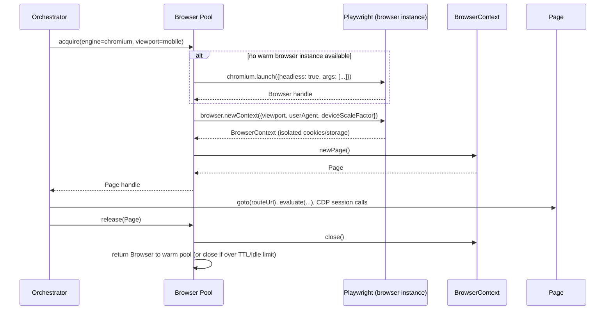
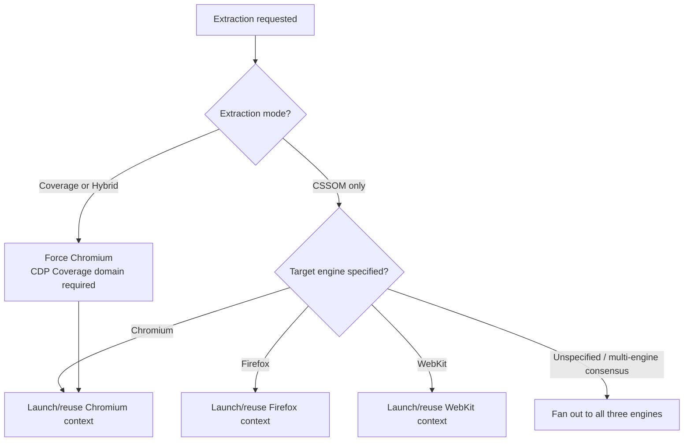

# ADR-0003: Playwright as the Browser Automation Abstraction Layer

## Version

1.0.0 — 2026-07-09

## Purpose

This document records the decision to adopt Playwright as the sole browser automation library used to implement [ADR-0001](./ADR-0001-Browser-Is-Source-of-Truth.md)'s "live browser is source of truth" architecture, in preference to Puppeteer, Selenium/WebDriver, or a raw Chrome DevTools Protocol (CDP) client implemented in-house. It defines what capabilities the engine specifically relies on Playwright to provide, which alternatives were evaluated, and what consequences and risks the choice carries.

## Audience

- Browser Manager and Navigation Engine implementers
- Engineers building SSR integration adapters that must launch or attach to browser instances
- Engineers evaluating whether to add multi-engine (Firefox/WebKit) extraction support
- Infrastructure/DevOps engineers responsible for CI images that must support headless browser execution
- Future contributors proposing a different automation layer or a raw-CDP optimization

## Prerequisites

- Familiarity with the Chrome DevTools Protocol (CDP) and its domains (Page, DOM, CSS, Coverage, Network, Runtime)
- Familiarity with the general shape of browser automation libraries: Puppeteer, Playwright, Selenium WebDriver
- Context from [ADR-0001-Browser-Is-Source-of-Truth](./ADR-0001-Browser-Is-Source-of-Truth.md), which establishes *why* the engine needs a live browser at all
- Basic understanding of headless vs. headed browser execution and browser process sandboxing models

## Related Documents

- [ADR-0001-Browser-Is-Source-of-Truth](./ADR-0001-Browser-Is-Source-of-Truth.md) — establishes the requirement this ADR fulfills
- [ADR-0002-No-Custom-Selector-Parser](./ADR-0002-No-Custom-Selector-Parser.md) — relies on the browser context this ADR provisions
- [ADR-0005-Hybrid-Extraction-Mode](./ADR-0005-Hybrid-Extraction-Mode.md) — relies on CDP Coverage API access exposed through Playwright
- [001-Vision](../architecture/001-Vision.md)
- [006-Design-Principles](../architecture/006-Design-Principles.md)
- Forthcoming: `docs/design/100-Browser-Abstraction.md`, `docs/design/101-Playwright-Adapter.md`, `docs/design/102-Browser-Pool.md`

## Overview

[ADR-0001](./ADR-0001-Browser-Is-Source-of-Truth.md) establishes that the engine must drive a real browser engine to obtain rendering facts. That decision does not, by itself, determine *which* automation library sits between the Node.js host process and the browser binary. This ADR evaluates the three realistic candidates — Puppeteer, Selenium/WebDriver, and raw CDP — against Playwright, and explains why Playwright was selected as the Browser Manager's implementation layer (see Section 2.4 of the brief, "Browser Manager: Playwright browser pool lifecycle").

The decision is significant because the automation layer determines: which browser engines can be driven (Chromium-only vs. multi-engine), what low-level protocol access is available (critically, the CDP Coverage domain needed for [ADR-0005](./ADR-0005-Hybrid-Extraction-Mode.md)'s Hybrid mode), the ergonomics and reliability of the async API surface the rest of the engine is built against, and the long-term maintenance trajectory of a core dependency the entire system rests on.

## Detailed Design

### Status

**Accepted.**

### Context

Four candidate approaches were evaluated:

1. **Puppeteer** — Google-maintained, Chromium/Chrome-first (with experimental Firefox support), CDP-based, mature and widely adopted.
2. **Selenium / WebDriver** — the long-standing W3C WebDriver standard, multi-browser via browser-vendor-maintained drivers (ChromeDriver, GeckoDriver, etc.), broad industry adoption, especially in traditional QA/test-automation contexts.
3. **Raw CDP client** — build a minimal, purpose-specific client speaking the Chrome DevTools Protocol directly (e.g., via `chrome-remote-interface` or a hand-rolled WebSocket client), bypassing any higher-level automation library.
4. **Playwright** — Microsoft-maintained, multi-engine (Chromium, Firefox, WebKit) via a unified API, built from the ground up around modern async/await patterns, with first-class support for browser contexts, network interception, tracing, and direct CDP session access when needed.

### Decision

The engine adopts **Playwright** as the exclusive browser automation library backing the Browser Manager module.

### Consequences

**Positive:**
- **Multi-engine support out of the box.** Playwright provides a single, consistent API surface across Chromium, Firefox, and WebKit. This directly enables the future-work item flagged in [ADR-0001](./ADR-0001-Browser-Is-Source-of-Truth.md) (multi-engine consensus extraction) without requiring a second automation library or a second adapter implementation later.
- **First-class `BrowserContext` isolation.** Playwright's context model (independent cookie jars, storage, permissions per context, all sharing one browser process) is precisely the isolation unit the Browser Pool needs for concurrent, independent route extractions without cross-contamination, and is more efficient than spawning a new browser process per extraction.
- **Direct CDP session access when needed.** Playwright exposes `page.context().newCDPSession(page)` (Chromium-only, as CDP is Chromium-specific), which the Coverage Engine uses directly to call `CSS.startRuleUsageTracking` / `CSS.takeCoverageDelta` (see [ADR-0005](./ADR-0005-Hybrid-Extraction-Mode.md)) — giving the engine both a high-level ergonomic API *and* an escape hatch to protocol-level primitives without needing a second library.
- **Modern async API and auto-waiting semantics.** Playwright's actionability checks and auto-waiting reduce (though do not eliminate — see Edge Cases) the amount of custom rendering-stabilization logic the Navigation Engine must implement itself.
- **Active, well-resourced maintenance.** Backed by Microsoft with a large open-source contributor base, frequent releases tracking new browser engine versions, and strong backward-compatibility discipline.
- **Built-in tracing and debugging tools** (Playwright Trace Viewer, video recording, screenshot-on-failure) directly benefit the engine's own test suite and the Diagnostics/Reporter module's ability to produce rich failure artifacts.

**Negative:**
- **CDP-specific features (notably the Coverage domain) are Chromium-only.** This means Coverage-based and Hybrid extraction modes are inherently Chromium-only capabilities; Firefox/WebKit extraction runs must fall back to CSSOM-only matching (see [ADR-0005](./ADR-0005-Hybrid-Extraction-Mode.md)) — a real capability gap that is inherent to the browser engines themselves, not to Playwright's design, but one that Playwright's abstraction does not paper over.
- **Bundled browser binaries increase install footprint.** Playwright manages its own downloaded browser builds (rather than relying on system-installed Chrome, as some Puppeteer configurations do), which increases CI image size and requires network access to Playwright's CDN during installation (or a self-hosted mirror in restricted environments).
- **A new, large dependency at the core of the system.** Any Playwright breaking change, regression, or deprecation directly impacts the engine's core extraction path; this is mitigated by pinning exact Playwright versions and running the fixture suite against every Playwright upgrade before adopting it.
- **Learning curve for contributors** more familiar with Puppeteer or Selenium's APIs, though this is a one-time cost.

## Architecture

```mermaid
flowchart TD
    subgraph EngineHost["Engine Host Process"]
        BM[Browser Manager]
        POOL[Browser Pool]
        NAV[Navigation Engine]
        COV[Coverage Engine]
    end

    subgraph PWLayer["Playwright Abstraction Layer"]
        PWAPI[Playwright High-Level API\nbrowser / context / page]
        CDPSESSION[Playwright CDP Session\n(Chromium only, escape hatch)]
    end

    subgraph Engines["Browser Engines"]
        CHROMIUM[Chromium]
        FIREFOX[Firefox]
        WEBKIT[WebKit]
    end

    BM --> POOL
    POOL --> PWAPI
    NAV --> PWAPI
    COV --> CDPSESSION
    PWAPI --> CHROMIUM
    PWAPI --> FIREFOX
    PWAPI --> WEBKIT
    CDPSESSION -. CDP protocol .-> CHROMIUM

    style CDPSESSION fill:#8a2be2,color:#fff
```

### Sequence: Browser Pool Acquiring and Using a Page



### Decision Tree: Engine Selection per Extraction Mode



## Algorithms

### Problem Statement

Given a stream of extraction requests, each specifying a target engine (or "any"/"all") and viewport profile, determine an efficient browser-instance and context-acquisition strategy that (a) respects Playwright's process/context lifecycle model, (b) bounds concurrent resource usage, and (c) minimizes cold-start (browser launch) overhead across a batch of requests.

### Inputs and Outputs

- **Input:** `requests: {engine, viewportProfile}[]`, `poolConfig: {maxBrowsersPerEngine, maxContextsPerBrowser, idleTTL}`
- **Output:** for each request, a ready `Page` handle bound to an isolated `BrowserContext`

### Pseudocode

```
function acquirePage(request, pool):
    engineKey = request.engine
    browser = pool.warmBrowsers[engineKey]

    if browser is null or browser.isClosed():
        # Cold start: expensive, amortized across many subsequent requests.
        browser = playwright[engineKey].launch({
            headless: true,
            args: sandboxArgsFor(engineKey)
        })
        pool.warmBrowsers[engineKey] = browser
        pool.metrics.recordColdStart(engineKey)

    if pool.activeContexts[engineKey] >= poolConfig.maxContextsPerBrowser:
        await pool.waitForAvailableSlot(engineKey)

    context = browser.newContext({
        viewport: request.viewportProfile.dimensions,
        deviceScaleFactor: request.viewportProfile.dpr,
        userAgent: request.viewportProfile.userAgent,
        colorScheme: request.viewportProfile.colorScheme
    })
    pool.activeContexts[engineKey] += 1

    page = context.newPage()
    pool.trackForCleanup(context, page)
    return page

function releasePage(page, pool):
    context = page.context()
    engineKey = pool.engineKeyFor(context)
    context.close()
    pool.activeContexts[engineKey] -= 1
    pool.maybeCloseIdleBrowser(engineKey)   # respects idleTTL
```

**Time complexity:** Browser cold-start is O(1) but with a large constant factor (hundreds of milliseconds to a few seconds depending on engine and host performance). Context/page creation once a browser is warm is O(1) with a small constant factor (tens of milliseconds). Overall batch throughput is therefore dominated by `min(coldStartAmortization, maxContextsPerBrowser × parallelism)`.

**Memory complexity:** O(activeContexts × avgContextMemory), with `avgContextMemory` varying substantially by page complexity; bounded by `maxContextsPerBrowser` and `maxBrowsersPerEngine` configuration.

**Failure cases:** browser process crash mid-batch (requires pool-level detection via Playwright's `browser.on('disconnected')` event and re-launch); context creation failure due to resource exhaustion (requires backpressure/queueing rather than unbounded context creation); zombie processes if the host process is killed without graceful `browser.close()` (mitigated via process-exit handlers and, in CI, container-level process reaping).

**Optimization opportunities:** pre-warm a fixed number of browser instances at orchestrator startup rather than lazily on first request; reuse contexts (not just browsers) across sequential same-viewport requests when isolation requirements permit (careful: storage/cookie leakage risk, must be opt-in); prefer Chromium as the default/primary engine to maximize warm-pool hit rate, reserving Firefox/WebKit launches for explicit multi-engine consensus runs.

## Implementation Notes

1. **Pin the exact Playwright version** (not a semver range) in `package.json`, and pin the browser binary versions Playwright downloads, recording both in the Reporter's diagnostics output per [ADR-0001](./ADR-0001-Browser-Is-Source-of-Truth.md) Implementation Notes, so that extraction runs are reproducible across time and across machines.
2. **CDP session access is isolated to the Coverage Engine module.** No other module should reach into `page.context().newCDPSession()` directly; this keeps the Chromium-specific escape hatch contained to one well-understood subsystem, making the Firefox/WebKit capability gap (see Consequences) explicit and auditable rather than accidentally smeared across the codebase.
3. **Sandbox args must be environment-aware.** Standard CI containers frequently require `--no-sandbox` (with attendant security tradeoffs, see Section 2.16 of the brief and the forthcoming security-review process) when `/dev/shm` or user-namespace sandboxing is unavailable; local developer machines should run with full sandboxing enabled by default.
4. **Use `browserContext`, not raw `page`, as the isolation unit** for anything involving cookies, localStorage, or authentication state, since two pages in the same context share this state — a correctness requirement when extracting authenticated routes.
5. **Wrap Playwright API calls behind an internal `BrowserAdapter` interface** (not calling Playwright APIs directly from Navigation Engine/DOM Collector/etc.) so that a future automation-layer change (see Future Work) requires touching one adapter module, not the entire codebase — this is a deliberate seam left open, even though this ADR commits to Playwright as the *only* implementation behind that seam for the foreseeable future.
6. **Respect Playwright's own recommended flags for CI stability** (`--disable-dev-shm-usage`, appropriate `timeout` configuration) as documented in Playwright's CI guides, since flaky browser launches in CI directly undermine the CI/CD gate described in Section 2.11 of the brief.

## Edge Cases

- **Firefox and WebKit lack CDP.** Coverage-mode and Hybrid-mode extraction (see [ADR-0005](./ADR-0005-Hybrid-Extraction-Mode.md)) are unavailable on these engines; the engine must detect the requested engine + mode combination at configuration-validation time and fail fast with an actionable error rather than silently degrading to CSSOM-only mode without informing the user.
- **WebKit's headless mode has historically had more platform-specific quirks** (particularly on Linux vs. macOS) than Chromium's; extraction runs targeting WebKit should be treated as lower-confidence for CI gating purposes until validated against the specific CI host platform.
- **Browser binary download failures in network-restricted environments** (e.g., air-gapped enterprise CI) require a self-hosted Playwright browser mirror (`PLAYWRIGHT_DOWNLOAD_HOST`) — this must be documented in the SSR/CI integration guides (forthcoming `docs/design/900-SSR-Overview.md` and CI docs).
- **Persistent contexts vs. ephemeral contexts.** Some SSR integration scenarios (Section 2.10 of the brief) may want to reuse a persistent authenticated context across multiple route extractions; this must be explicitly configured, since the default pooling model in the Algorithms section above assumes ephemeral, isolated contexts per extraction.
- **Playwright version upgrades changing default behavior** (e.g., changed default viewport, changed auto-wait heuristics) can silently shift extraction output between engine releases; the fixture-based golden-snapshot test suite (see [ADR-0001](./ADR-0001-Browser-Is-Source-of-Truth.md) Testing section) is the primary safeguard, and Playwright upgrades must be treated as a reviewable, potentially output-changing event, not a routine dependency bump.
- **Browser process resource leaks under sustained high-concurrency load** (e.g., a long-running CI worker processing hundreds of routes) require periodic full browser-instance recycling (not just context recycling) governed by `idleTTL`/max-requests-per-browser configuration, since even well-behaved browser engines can accumulate memory over very long uptimes.
- **`--single-process` and container `--shm-size` misconfiguration** are among the most common sources of flaky Chromium crashes in constrained CI containers; the Browser Pool should detect repeated crash-on-launch patterns and surface a specific, actionable diagnostic rather than a generic error.

## Tradeoffs

| Dimension | Puppeteer (Rejected) | Selenium/WebDriver (Rejected) | Raw CDP Client (Rejected) | Playwright (Chosen) |
|---|---|---|---|---|
| Multi-engine support | Chromium-first; Firefox support experimental/limited historically | True multi-engine via vendor drivers | Chromium-only (CDP is Chromium-specific) | Native multi-engine, unified API |
| Coverage API access | Yes (CDP-based) | No direct CDP access; would require a separate CDP client alongside Selenium | Yes, directly | Yes, via CDP session escape hatch (Chromium contexts only) |
| API modernity / async ergonomics | Good, promise-based | Historically callback/sync-heavy (WebDriver protocol is synchronous by design in classic Selenium; async wrappers exist but are not native) | None — must build all ergonomics from scratch | Excellent, designed around modern async/await and auto-waiting |
| Isolation model | Contexts exist but historically less central to the API design | New driver session per browser instance; heavier-weight isolation model | Must be built manually via target/session management | First-class `BrowserContext` as the primary isolation unit |
| Maintenance/backing | Google-maintained, mature | Broad community, W3C standard, but driver quality varies by vendor | None — fully owned and maintained by this project | Microsoft-maintained, actively developed, strong browser-version tracking |
| Engineering effort to adopt | Low | Medium (driver management complexity) | Very high (must reimplement session/target/protocol management) | Low |
| Risk of building on a "dead" dependency | Low, but single-engine focus limits future multi-engine roadmap | Low, but classic WebDriver's synchronous model is a poor fit for the engine's highly concurrent pooling needs | N/A — no external dependency risk, but very high internal maintenance burden | Low; considered the most actively-evolving option at time of decision |

**Why Puppeteer was rejected:** Puppeteer's Chromium-first design and historically limited/experimental Firefox support would have blocked the multi-engine consensus extraction capability flagged as valuable future work in [ADR-0001](./ADR-0001-Browser-Is-Source-of-Truth.md), without offering any capability Playwright lacks. Given both libraries are CDP-based for Chromium and broadly comparable in that mode, there was no offsetting advantage to choosing Puppeteer over Playwright.

**Why Selenium/WebDriver was rejected:** WebDriver's synchronous, session-oriented protocol model is a comparatively poor architectural fit for a system built around highly concurrent, short-lived, isolated browser contexts pooled across many parallel extraction requests. Additionally, WebDriver's standard protocol does not expose CDP-level primitives like the Coverage domain at all — achieving Hybrid mode would have required bolting on a *separate* CDP client alongside Selenium specifically for Chromium targets, effectively requiring two automation layers rather than one, with all the consistency and maintenance risk that implies.

**Why a raw CDP client was rejected:** Building directly against CDP would provide maximum control and the lowest possible per-call overhead, and was seriously considered given the Coverage Engine already needs raw CDP access regardless of the chosen abstraction. However, it would require this project to reimplement — and indefinitely maintain — target/session lifecycle management, page navigation lifecycle detection, robust error handling across CDP protocol version changes, and (critically) Firefox/WebKit support would be entirely unavailable, since CDP is a Chromium-specific protocol. This tradeoff mirrors, at the automation-layer level, the same reasoning [ADR-0002](./ADR-0002-No-Custom-Selector-Parser.md) applies at the selector-matching level: don't reimplement infrastructure that a well-maintained, purpose-built library already provides correctly.

**Why Playwright was chosen:** It uniquely satisfies all three hard requirements simultaneously — multi-engine support (for future consensus extraction), first-class CDP access for Coverage mode (via its Chromium-context escape hatch), and a context/page isolation and async API model that maps cleanly onto the Browser Pool's concurrency needs — without requiring this project to maintain any part of the underlying browser-protocol machinery itself.

**Future implications:** Because the `BrowserAdapter` seam (Implementation Notes, item 5) isolates Playwright-specific calls, a future migration — e.g., to WebDriver BiDi once it reaches feature parity with CDP's Coverage domain across engines — remains architecturally possible without a full rewrite, but is explicitly not planned unless such parity is reached (see Future Work).

## Performance

- **CPU complexity:** Browser process launch and page navigation costs are dominated by the underlying engine's own startup/rendering cost, not by Playwright's orchestration overhead, which is comparatively negligible.
- **Memory complexity:** Each `BrowserContext` carries incremental memory overhead beyond the base `Browser` process; the Browser Pool must budget `maxContextsPerBrowser` and `maxBrowsersPerEngine` against available host memory (see [ADR-0001](./ADR-0001-Browser-Is-Source-of-Truth.md) Performance section for the broader budget).
- **Caching strategy:** Warm-browser reuse (Algorithms section above) is the primary Playwright-specific caching lever; it eliminates repeated cold-start cost across a batch of extraction requests targeting the same engine.
- **Parallelization opportunities:** Playwright's context model allows many concurrent, isolated pages per browser process, enabling the Browser Pool to parallelize extraction across routes/viewports without a 1:1 browser-process-to-extraction ratio, substantially improving throughput versus a hypothetical one-process-per-extraction model.
- **Incremental execution:** Not directly applicable at the automation-layer level; incrementality is achieved above this layer by the Cache Manager (skipping browser interaction entirely on a fingerprint hit).
- **Profiling guidance:** Use Playwright's built-in tracing (`context.tracing.start/stop`) to capture detailed timelines of navigation, script execution, and network activity when diagnosing slow extractions; attach trace archives to CI failure artifacts for post-hoc analysis.
- **Scalability limits:** Practical concurrency ceilings are set by host CPU/memory, not by Playwright itself; horizontal scaling across multiple hosts/workers (Phase 5 roadmap, Section 2.17) is the intended path beyond a single host's practical context-pool ceiling.

## Testing

- **Unit tests:** The internal `BrowserAdapter` interface (Implementation Notes item 5) should be tested against a fake/mock implementation for logic that does not require a real browser (e.g., pool slot accounting, TTL expiry logic), keeping these tests fast and browser-independent.
- **Integration tests:** Real Playwright-driven launches across all three engines (Chromium, Firefox, WebKit) in CI, validating that context isolation, navigation, and CDP session access (Chromium only) behave as expected across the fixture suite.
- **Visual tests:** Screenshot comparisons across engines for the same fixture can surface engine-specific rendering divergence relevant to multi-engine consensus extraction (future work), even though this is not yet a shipped capability.
- **Stress tests:** Sustained high-concurrency launches (hundreds of sequential context acquisitions against a small warm-browser pool) to validate no resource leaks, zombie processes, or crash-loop behavior under load.
- **Regression tests:** Every Playwright version upgrade must run the full golden-snapshot fixture suite before being merged, per Implementation/Edge Cases guidance above; any output diff must be manually reviewed and either accepted (with fixture updates) or investigated as a genuine regression.
- **Benchmark tests:** Track cold-start latency, context-acquisition latency, and peak memory per concurrent-context-count across Playwright versions and host environments to catch performance regressions early.

## Future Work

- **Monitor WebDriver BiDi maturity**, specifically whether it gains a Coverage-domain equivalent usable across Chromium, Firefox, and WebKit, which would remove the current Chromium-only limitation on Coverage/Hybrid modes described in Consequences and Edge Cases.
- **Evaluate persistent, long-lived browser worker pools** shared across CI job runs (rather than per-job cold starts) for large-scale CI pipelines extracting hundreds of routes per build, contingent on solving state-leakage isolation concerns.
- **Investigate Playwright's experimental/preview APIs** (e.g., around network-condition emulation, CPU throttling) as they mature, for more accurate device-profile simulation in the Viewport Manager (see forthcoming `docs/design/105-Viewport-Manager.md`).
- **Research idea:** a lightweight "Playwright adapter conformance test suite" that could, in principle, be pointed at an alternative future automation layer (should one ever be adopted) to validate behavioral parity before switching — operationalizing the seam left open in Implementation Notes item 5.
- **Open question:** should the engine offer an official Docker base image pre-bundling pinned Playwright browser binaries, to reduce CI cold-start and network-dependency risk for adopters? This is a plausible Phase 4/CI-integration deliverable (Section 2.17, Phase 4).

## References

- [ADR-0001-Browser-Is-Source-of-Truth](./ADR-0001-Browser-Is-Source-of-Truth.md)
- [ADR-0002-No-Custom-Selector-Parser](./ADR-0002-No-Custom-Selector-Parser.md)
- [ADR-0005-Hybrid-Extraction-Mode](./ADR-0005-Hybrid-Extraction-Mode.md)
- [006-Design-Principles](../architecture/006-Design-Principles.md)
- Playwright official documentation: Browser, BrowserContext, Page, CDPSession APIs
- Chrome DevTools Protocol documentation: CSS domain, Coverage-related methods
- W3C WebDriver and WebDriver BiDi specifications
- Puppeteer project documentation (evaluated and rejected)
- Selenium/WebDriver project documentation (evaluated and rejected)
