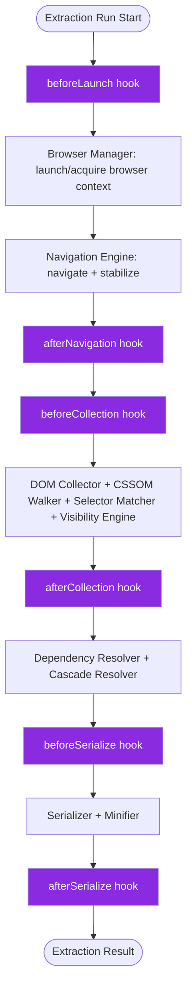
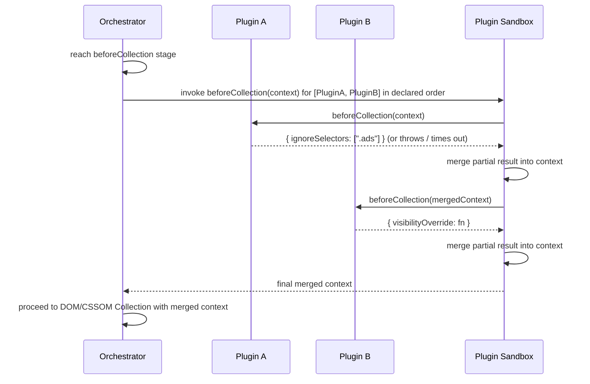
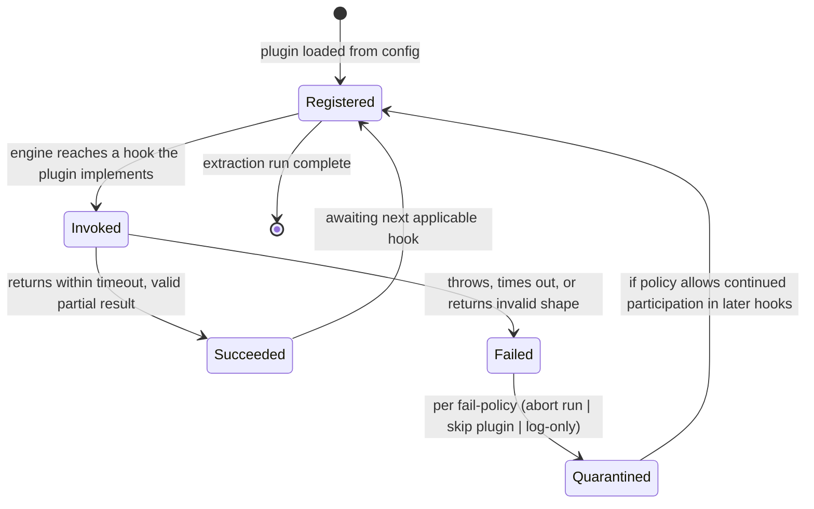

# ADR-0004: Discrete Lifecycle Hooks as the Plugin Extensibility Model

## Version

1.0.0 — 2026-07-09

## Purpose

This document records the decision to expose plugin extensibility through a fixed set of discrete, named lifecycle hooks — `beforeLaunch`, `afterNavigation`, `beforeCollection`, `afterCollection`, `beforeSerialize`, `afterSerialize` — rather than a general-purpose middleware chain or an unstructured event-emitter model. It explains the rationale for hook placement relative to the extraction pipeline, the sandboxing model applied to plugin execution, and the alternatives considered and rejected.

## Audience

- Plugin System implementers
- Plugin authors building extensions (selector ignore-lists, CSS rewriting, custom visibility rules, custom matching augmentation)
- SSR integration authors who may implement framework adapters as plugins
- Reviewers evaluating new hook-point proposals against this model
- Security reviewers assessing the plugin sandboxing boundary

## Prerequisites

- Familiarity with the overall extraction pipeline: navigation → DOM/CSSOM collection → matching/visibility → dependency resolution → serialization (see Section 2.4–2.7 of the brief)
- Familiarity with common Node.js extensibility patterns: middleware chains (Express/Koa-style), event emitters (Node's `EventEmitter`), and discrete lifecycle hooks (Webpack/Rollup/ESLint plugin models)
- Context from [ADR-0001-Browser-Is-Source-of-Truth](./ADR-0001-Browser-Is-Source-of-Truth.md) and [ADR-0003-Playwright-As-Browser-Abstraction](./ADR-0003-Playwright-As-Browser-Abstraction.md), since plugin hooks are placed relative to browser lifecycle events

## Related Documents

- [ADR-0001-Browser-Is-Source-of-Truth](./ADR-0001-Browser-Is-Source-of-Truth.md)
- [ADR-0003-Playwright-As-Browser-Abstraction](./ADR-0003-Playwright-As-Browser-Abstraction.md) — defines the browser lifecycle events hooks attach to
- [ADR-0005-Hybrid-Extraction-Mode](./ADR-0005-Hybrid-Extraction-Mode.md) — plugins may customize which extraction mode signals are trusted, via `beforeCollection`/`afterCollection`
- [001-Vision](../architecture/001-Vision.md)
- [006-Design-Principles](../architecture/006-Design-Principles.md)
- Forthcoming: `docs/plugins/000-Plugin-SDK-Overview.md`, `docs/plugins/001-Lifecycle-Hooks.md`, `docs/plugins/004-Sandboxing.md`

## Overview

Section 2.13 of the brief specifies six named plugin lifecycle hooks — `beforeLaunch`, `afterNavigation`, `beforeCollection`, `afterCollection`, `beforeSerialize`, `afterSerialize` — through which plugins may "ignore selectors, rewrite CSS, inject rules, customize visibility, [and] customize matching." This ADR is the architectural justification for that specific hook set and for the general decision to model extensibility as **discrete, pipeline-stage-anchored lifecycle hooks** rather than as a generic middleware chain (where each plugin wraps the *entire* pipeline call, `next()`-style) or an unstructured event emitter (where plugins subscribe to fine-grained internal events with no enforced ordering or pipeline-stage guarantees).

The choice of extensibility model has outsized long-term consequences: it determines what plugins *can* observe and mutate, what invariants the core engine can rely on regardless of which plugins are installed, how plugin execution order is reasoned about, and how much of the core pipeline's internal structure is exposed (and therefore frozen as a compatibility surface) to third-party code.

## Detailed Design

### Status

**Accepted.**

### Context

Three extensibility architectures were evaluated, drawing on precedent from widely-used JavaScript build/tooling ecosystems:

1. **Middleware chain** (Express/Koa/Redux-style): each plugin is a function `(context, next) => {}` that wraps the remainder of the pipeline; plugins can run code before *and* after the "rest of the pipeline" by choosing when to call `next()`, and can short-circuit by not calling it.
2. **Event emitter**: the engine emits fine-grained internal events (`node-collected`, `rule-matched`, `stylesheet-loaded`, etc.) on a shared `EventEmitter`-like bus; plugins subscribe to whichever events they care about, with no structural guarantee about how many events fire, in what order, or what pipeline stage is "in progress" when a given event fires.
3. **Discrete, named lifecycle hooks**: the engine defines a small, fixed, versioned set of named extension points, each corresponding to a specific, well-defined transition in the pipeline (e.g., "the browser has just been launched, before any navigation" or "the DOM/CSSOM collection pass has just completed, before dependency resolution begins"). Plugins implement zero or more of these named hooks as plain async functions; the engine, not the plugin, controls invocation order and pipeline flow.

### Decision

The engine adopts **discrete, named lifecycle hooks**, exactly the six specified in Section 2.13 of the brief: `beforeLaunch`, `afterNavigation`, `beforeCollection`, `afterCollection`, `beforeSerialize`, `afterSerialize`. Each hook:

- Is invoked by the core orchestrator at one, and only one, specific point in the pipeline.
- Receives a well-defined, versioned context object scoped to what is legitimately knowable/mutable at that pipeline stage (never the entire internal engine state).
- Returns (via `async`/`Promise`) either nothing (observation-only) or a partial mutation object merged back into the pipeline state under strict, documented rules (e.g., `beforeCollection` may return an updated visibility predicate; it may not return a serialized CSS string, since serialization has not happened yet).
- Cannot alter *which* hooks run or *in what order* — that control remains exclusively with the core orchestrator.

### Consequences

**Positive:**
- **The core pipeline's control flow is never surrendered to plugin code.** Unlike a middleware chain, where a buggy or malicious plugin can simply never call `next()` (silently hanging the entire extraction) or call it multiple times (causing double-execution of downstream stages), discrete hooks are invoked, awaited, and then the orchestrator unconditionally proceeds — a plugin can fail or throw (handled per the sandboxing model below) but cannot corrupt pipeline control flow itself.
- **Each hook's contract is independently documented, versioned, and testable.** A plugin author knows precisely what `beforeCollection` receives and may return without needing to understand the entire pipeline internals, unlike an event-emitter model where "which events exist, in what order, with what payload shape" is often only discoverable by reading engine source code.
- **Execution order across multiple installed plugins is well-defined and engine-controlled** (see Algorithms below): for a given hook, all installed plugins implementing it run in configuration-declared order, with the merged result passed to the next stage — this is not achievable in an event-emitter model without additional, separately-invented ordering machinery.
- **The hook set doubles as living pipeline documentation.** The six named hooks, read in order, describe the shape of the entire extraction pipeline at a glance — a valuable property for onboarding and for the Reporter module, which can attribute timing/diagnostics per hook.
- **New hooks can be added in minor/major version bumps without breaking existing plugins**, since a plugin simply does not implement a hook it doesn't know about; middleware chains are comparatively harder to extend with new insertion points without renegotiating the entire chain's structure.

**Negative:**
- **Less flexible than a middleware chain for cross-cutting concerns that genuinely want to wrap the entire pipeline** (e.g., a plugin wanting to measure "total wall-clock time from launch to serialize" could do so via `beforeLaunch`+`afterSerialize` timestamp differencing, but cannot literally wrap the call as a single function scope the way middleware could).
- **A fixed hook set requires a deliberate versioned extension process to add new hook points** — this is a feature from a stability standpoint but does add process overhead (an RFC/ADR-style discussion) compared to an event emitter's "just add a new event" model, which some plugin authors may find restrictive if they need a capability not yet exposed by an existing hook.
- **Hooks cannot fire multiple times per stage in a way the plugin controls** — e.g., a plugin cannot ask to be invoked once per DOM node during collection (fine-grained per-node hooks were explicitly rejected as a performance and complexity liability — see Tradeoffs).

## Architecture



### Sequence: Hook Invocation with Multiple Plugins



### State Diagram: A Single Plugin's Lifecycle Participation



## Algorithms

### Problem Statement

Given an ordered list of installed plugins `P = [p1, p2, ..., pn]` (ordering derived from configuration) and a hook name `H`, invoke every plugin in `P` that implements `H`, in declared order, sequentially threading a mutable-but-controlled context object through each invocation, while enforcing per-plugin timeouts and isolating failures according to a configurable failure policy.

### Inputs and Outputs

- **Input:** `plugins: Plugin[]`, `hookName: string`, `initialContext: HookContext`, `config: { timeoutMs, failurePolicy }`
- **Output:** `finalContext: HookContext` (merged result of all successful plugin invocations for this hook)

### Pseudocode

```
function runHook(hookName, initialContext, plugins, config):
    context = deepFreezeReadonlyView(initialContext)   # plugins never mutate shared state directly
    accumulatedPatch = {}

    for plugin in plugins:
        if not plugin.hooks[hookName]:
            continue   # plugin does not implement this hook; skip silently

        mergedContextView = applyPatch(context, accumulatedPatch)  # read-only view including prior plugins' patches

        try:
            result = await withTimeout(
                plugin.hooks[hookName](mergedContextView),
                config.timeoutMs
            )
            validatePatchShape(hookName, result)   # schema-checked per hook contract
            accumulatedPatch = mergePatch(accumulatedPatch, result)
            reportSuccess(plugin, hookName)

        catch (err):
            reportFailure(plugin, hookName, err)
            switch config.failurePolicy:
                case "abort":
                    throw new PluginHookError(plugin, hookName, err)
                case "skip":
                    continue   # this plugin's contribution to this hook is dropped; others still run
                case "log-only":
                    continue   # identical behavior to skip, differing only in reporting verbosity

    return applyPatch(context, accumulatedPatch)
```

**Time complexity:** O(n) plugin invocations per hook firing, where n is the number of plugins implementing that hook; O(1) hook firings per extraction run per hook name (each of the six hooks fires exactly once per extraction run, never per-node or per-rule, which is a deliberate granularity decision — see Tradeoffs).

**Memory complexity:** O(contextSize + patchSize × n) for the accumulated patch chain per hook; contexts are read-only views constructed via structural sharing where possible to avoid O(n) full-context copies.

**Failure cases:** a plugin throws synchronously or rejects its returned promise; a plugin times out (hangs indefinitely, e.g., awaiting an external network call with no timeout of its own); a plugin returns a value that fails schema validation against the hook's documented contract (e.g., returning a serialized CSS string from `beforeCollection`, which is not a valid patch shape for that hook); two plugins' patches conflict (e.g., both attempt to set the same visibility override) — resolved by declared-order precedence (later plugin wins) with a diagnostic warning logged.

**Optimization opportunities:** skip the per-plugin timeout-wrapper overhead entirely when only one plugin is installed and it has no async I/O (detectable via a fast-path for synchronous-looking hook implementations); cache the "which plugins implement which hooks" lookup at plugin-registration time rather than re-checking on every hook firing.

## Implementation Notes

1. **Hook context objects are stage-scoped and minimal by design.** `beforeLaunch` receives launch configuration (viewport profile, engine choice) but has no DOM/CSSOM to inspect, because none exists yet; `afterCollection` receives the full matched-rule/visibility dataset but cannot influence navigation, because navigation already happened. This scoping is deliberate and is the mechanism by which the model prevents plugins from depending on pipeline internals beyond what a given stage legitimately exposes.
2. **Patches, not direct mutation, are the only way plugins affect engine state.** Plugins never receive a mutable reference to internal engine data structures (DOM node handles, CSSOM rule trees); they receive read-only views and return declarative patch objects (e.g., `{ ignoreSelectors: [...] }`, `{ injectRules: [...] }`) that the orchestrator validates and applies. This is the mechanism that makes the "core pipeline never surrenders control" consequence concrete at the code level.
3. **Per-hook JSON-schema-like contracts must be versioned independently of the overall plugin API version**, so that adding an optional new field to, say, `beforeCollection`'s patch shape does not require a major version bump, while removing or renaming a field does.
4. **Plugin execution order is derived from declaration order in configuration**, not from installation/discovery order in `node_modules`, to keep ordering deterministic and explicit rather than incidental to filesystem/package-manager behavior.
5. **The `beforeLaunch`/`afterNavigation` hooks are the natural extension points for framework-specific SSR adapters** (React SSR, Next.js, Astro, Remix, Express, Fastify — Section 2.10 of the brief) to inject framework-aware readiness signals (e.g., "wait for hydration marker attribute") before the Navigation Engine's generic stabilization logic runs.
6. **Diagnostics must record per-hook, per-plugin timing and success/failure**, feeding directly into the Reporter's timing report (Section 2.12 of the brief), since plugin execution is a first-class contributor to total extraction latency and must not be an invisible cost.

## Edge Cases

- **A plugin implements a hook but has nothing meaningful to contribute for a given extraction run** (e.g., a route-specific plugin running against an unrelated route) — must return an empty/no-op patch (`{}` or `undefined`) rather than being forced to opt out entirely; the engine must treat "no patch" as strictly equivalent to "hook not implemented" for merging purposes.
- **Two plugins register for the same hook and produce conflicting patches** (e.g., both provide an `injectRules` array with overlapping selectors) — resolved via deterministic merge rules per patch field (arrays concatenate with declared-order precedence for dedup; scalar overrides use last-writer-wins by declared order) documented per-hook in the Plugin API reference (forthcoming `docs/plugins/002-Plugin-API.md`).
- **A plugin depends on another plugin's output within the same hook firing** — supported implicitly by declared-order sequencing (each plugin sees prior plugins' merged patches as part of its input context), but plugins must not assume a *specific* other plugin is present; explicit inter-plugin dependency declarations are out of scope for this model and flagged as a possible future extension (see Future Work).
- **A plugin needs to run logic conceptually "outside" any of the six defined stages** (e.g., wanting to intercept network requests during navigation) — this is intentionally not exposed as a seventh generic hook; such needs should instead be served by Playwright-level primitives exposed through a narrower, purpose-specific extension point if and when justified by real demand, keeping the core hook set small (see Tradeoffs).
- **Sandboxing limits on what a plugin can access.** Plugins execute in the same Node.js process (not a `vm`-isolated context or worker thread, by default) for performance reasons, but are restricted to the patch-based context-passing model described above; they do not receive direct references to live `Page`/`JSHandle` objects, browser process handles, or filesystem paths outside an explicitly granted plugin-config sandbox directory. A future hardened-sandbox mode (worker-thread or `vm.Context`-isolated plugin execution) is tracked as future work for untrusted third-party plugin scenarios.
- **Plugin exceptions during `afterSerialize`** (the last hook) must still allow the already-serialized output to be reported (per the `failurePolicy`), since a diagnostics-only plugin failure at the very end of the pipeline should not necessarily invalidate an otherwise-successful extraction — this is configurable, not hardcoded, because some organizations may want strict "any plugin failure fails the build" CI semantics.
- **Timeout interaction with the browser context lifecycle** — a hook that times out (e.g., `beforeCollection` hanging) must not leave the associated browser page/context in a leaked, unreleased state; the orchestrator's `finally`-equivalent cleanup must run regardless of hook outcome.

## Tradeoffs

| Dimension | Middleware Chain (Rejected) | Event Emitter (Rejected) | Discrete Lifecycle Hooks (Chosen) |
|---|---|---|---|
| Control-flow safety | Plugin controls `next()` — can hang or double-invoke downstream stages | No control-flow risk (events are fire-and-forget), but also no way to gate/block a stage on plugin completion in a well-defined way without extra machinery | Orchestrator retains full control; plugins can only contribute data via patches |
| API discoverability | Must read pipeline source to know what "the rest of the chain" does | Must discover event names/payloads by inspection; no enforced completeness | Fixed, documented set of six stages; self-describing |
| Execution order guarantees | Deterministic within a single chain, but nesting/short-circuiting semantics can get complex | Not guaranteed by default; requires bespoke ordering logic if needed | Deterministic, declared-order, engine-enforced |
| Extensibility for new pipeline stages | Requires renegotiating chain structure | Trivial — just emit a new event | Requires a versioned addition to the hook enum (deliberate friction) |
| Risk of plugin depending on unstable internals | High — middleware often needs to know pipeline internals to decide when to call `next()` | High — event payloads are often "whatever internal state happened to be available," encouraging accidental coupling to internals | Low — each hook's context is a deliberately scoped, documented contract |
| Fit for "wrap the whole pipeline" cross-cutting concerns (e.g., global timing) | Excellent — this is the model's core strength | Poor without extra bookkeeping | Adequate via first/last hook timestamp differencing, not as elegant but sufficient |
| Suitability for a small, curated hook set intended to remain stable across versions | Poor fit — middleware chains tend to expose more surface, not less, over time | Poor fit — event sets tend to grow unboundedly as internal features are added | Strong fit — matches the model's design intent directly |

**Why a middleware chain was rejected:** The core objection is control-flow safety. In a middleware model, a plugin author must remember to call `next()` — forgetting to do so (a common bug class in Express-style middleware) silently stalls the entire extraction with no clear error. Worse, a plugin *can* legitimately choose not to call `next()` for legitimate short-circuiting reasons in some designs, which means "did this extraction hang because of a bug, or because a plugin intentionally decided to stop the pipeline" becomes ambiguous. For a system where a single hung extraction could stall an entire CI pipeline (Section 2.11 of the brief), this ambiguity was judged unacceptable. Additionally, middleware chains tend to expose the "rest of the pipeline" as an opaque continuation, encouraging plugins to make assumptions about downstream behavior that are hard to version safely.

**Why an event emitter was rejected:** Event emitters are excellent for optional, fire-and-forget observation (and indeed, the engine's own internal diagnostics/logging subsystem may use one internally) but are a poor fit for *extensibility that must produce data the pipeline depends on*. There is no natural way in a pure event-emitter model to say "wait for all subscribers to finish and merge their contributions before proceeding" without effectively reinventing the discrete-hook model on top of the emitter — at which point, choosing an emitter as the foundation adds indirection without adding capability. Event emitters were also rejected because the event surface tends to grow organically and become a de facto stable API by accident (any internal event a plugin author discovers and subscribes to becomes something the engine can no longer freely rename without a breaking change), whereas discrete hooks make the extension surface a deliberate, curated decision.

**Why discrete lifecycle hooks were chosen:** They give the orchestrator unconditional control-flow ownership (no hang/double-invoke risk), a small and deliberately curated public extension surface (six named stages, each independently documented and versioned), deterministic multi-plugin ordering without extra bookkeeping, and a natural mapping onto the existing pipeline stages already defined by [ADR-0001](./ADR-0001-Browser-Is-Source-of-Truth.md) and [ADR-0003](./ADR-0003-Playwright-As-Browser-Abstraction.md) (launch, navigation, collection, serialization). The cost — reduced flexibility for cross-cutting "wrap everything" concerns, and process friction for adding new hooks — was judged acceptable because the six specified hooks already cover the plugin capabilities explicitly required by the brief (ignore selectors, rewrite CSS, inject rules, customize visibility, customize matching), and because API stability is a higher priority for a plugin ecosystem than maximal flexibility.

**Future implications:** Every future capability request from plugin authors must first be evaluated against "can this be expressed as a patch returned from one of the six existing hooks?" before a new hook is proposed. New hook proposals must go through a versioned RFC process (mirroring this ADR series) precisely because the hook set's small, stable size is treated as a feature, not a temporary limitation to be casually expanded.

## Performance

- **CPU complexity:** O(hooks × pluginsPerHook) invocations per extraction run, a small constant relative to the DOM/CSSOM collection and matching workloads described in [ADR-0001](./ADR-0001-Browser-Is-Source-of-Truth.md) and [ADR-0002](./ADR-0002-No-Custom-Selector-Parser.md); plugin execution is not expected to dominate total extraction time unless individual plugins perform expensive I/O.
- **Memory complexity:** Bounded by context size at each hook plus the accumulated patch chain; since contexts are stage-scoped and minimal (Implementation Notes item 1), memory overhead per hook firing is small relative to the DOM/CSSOM data structures already resident for the core pipeline.
- **Caching strategy:** Plugin hook results are not cached across extraction runs by default (each run's context differs), but plugin authors are encouraged to implement their own internal memoization for expensive, route-independent computations (e.g., a plugin loading a large ignore-list configuration file once at `beforeLaunch` and reusing it across the run rather than reloading it per hook).
- **Parallelization opportunities:** Plugins implementing the *same* hook could, in principle, run concurrently rather than sequentially if their patches are provably independent — this is explicitly not done by default (sequential, declared-order execution is chosen for determinism and simplicity, per the Algorithms section) but is flagged as a possible opt-in optimization for plugins declared as side-effect-free (see Future Work).
- **Incremental execution:** Not directly applicable to the hook-invocation mechanism itself, though plugins that wrap expensive external calls (e.g., a linting/reporting plugin calling an external API) should implement their own incremental/caching behavior; the engine does not currently provide a shared incremental-execution primitive for plugins.
- **Profiling guidance:** The Reporter's per-hook, per-plugin timing breakdown (Implementation Notes item 6) is the primary profiling tool; a plugin consistently appearing as the largest single contributor to a hook's total time should be flagged in CI diagnostics output.
- **Scalability limits:** With a large number of installed plugins all implementing all six hooks, sequential execution means total plugin overhead grows linearly; in practice, most real-world plugin configurations are expected to number in the low single digits to low tens, making this a non-issue at expected scale, but the timeout mechanism (Algorithms) bounds worst-case per-plugin cost regardless of plugin count.

## Testing

- **Unit tests:** Test `runHook` in isolation with mock plugins covering success, throw, timeout, and invalid-patch-shape scenarios, asserting correct behavior under each configured `failurePolicy`.
- **Integration tests:** Register real example plugins (selector-ignore plugin, CSS-injection plugin, custom-visibility plugin) against the fixture suite and assert their patches correctly propagate through to final serialized output.
- **Visual tests:** For plugins that alter visibility or inject rules affecting rendered output, run the standard visual-regression pipeline ([ADR-0001](./ADR-0001-Browser-Is-Source-of-Truth.md), Testing) with and without the plugin enabled, asserting the expected visual delta.
- **Stress tests:** Register a large number (tens) of synthetic no-op plugins across all six hooks to validate that per-hook overhead scales linearly and does not introduce pathological slowdown or memory growth.
- **Regression tests:** Every reported plugin-related bug (patch-merge conflict misbehavior, timeout not correctly releasing browser resources, ordering non-determinism) becomes a permanent fixture in the plugin test suite.
- **Benchmark tests:** Track total plugin-hook overhead as a percentage of total extraction time across CI runs, to catch cases where plugin overhead unexpectedly grows to dominate the pipeline.

## Future Work

- **Optional parallel execution for independent plugins within a single hook**, gated behind an explicit plugin-declared "side-effect-free / order-independent" flag, to improve throughput for configurations with many plugins on the same hook.
- **Explicit inter-plugin dependency declarations** (`dependsOn: ['other-plugin-name']`) to formalize ordering requirements currently handled only implicitly via declared configuration order, addressed as an Edge Case above.
- **A hardened sandbox execution mode** (worker-thread or `vm.Context` isolation) for untrusted third-party plugins, particularly relevant once a public plugin marketplace/registry exists, as flagged in the Edge Cases sandboxing discussion.
- **A narrower, purpose-specific "network interception" extension point** for plugins needing to intercept/mock navigation-time network requests, if real-world demand justifies it, without expanding the core six-hook set (per the Tradeoffs "future implications" guidance).
- **Research idea:** a formal, machine-checkable schema (e.g., JSON Schema or TypeScript branded types) for each hook's patch contract, enabling compile-time (for TypeScript plugin authors) or run-time validation errors with precise, actionable messages when a plugin returns a malformed patch.
- **Open question:** should hook contracts be allowed to evolve differently across major engine versions with an automated compatibility-shim layer for older plugins, similar to how some build tools (e.g., Webpack) have handled plugin API v4→v5 migrations? This would extend plugin ecosystem longevity across engine major versions but adds compatibility-layer maintenance burden.

## References

- [ADR-0001-Browser-Is-Source-of-Truth](./ADR-0001-Browser-Is-Source-of-Truth.md)
- [ADR-0003-Playwright-As-Browser-Abstraction](./ADR-0003-Playwright-As-Browser-Abstraction.md)
- [ADR-0005-Hybrid-Extraction-Mode](./ADR-0005-Hybrid-Extraction-Mode.md)
- [006-Design-Principles](../architecture/006-Design-Principles.md)
- Webpack Plugin API and Tapable hook system documentation (precedent for discrete named hooks)
- Rollup Plugin API documentation (precedent for discrete named hooks in a build-tool context)
- ESLint Plugin/Rule API documentation
- Express.js and Koa.js middleware model documentation (evaluated and rejected as a general model)
- Node.js `EventEmitter` documentation (evaluated and rejected as the primary extensibility mechanism)
