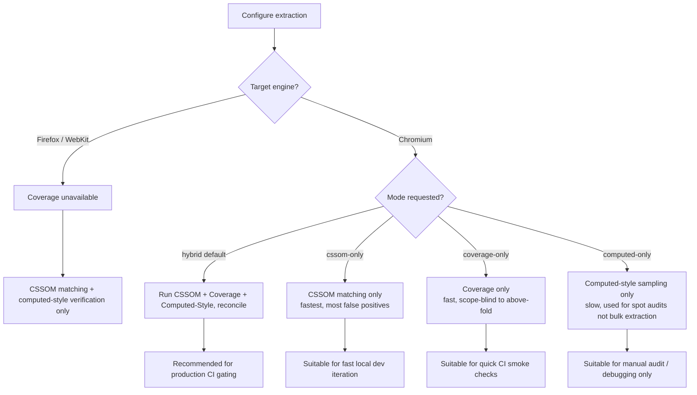

# ADR-0005: Hybrid Extraction Mode Combining CSSOM Matching, Coverage, and Computed-Style Verification

## Version

1.0.0 — 2026-07-09

## Purpose

This document records the decision to support a **Hybrid extraction mode** that combines three distinct signal sources — CSSOM selector matching (via `element.matches()`, per [ADR-0002](./ADR-0002-No-Custom-Selector-Parser.md)), the Chrome DevTools Protocol CSS Coverage API, and targeted `getComputedStyle` verification — rather than committing to any single strategy as the engine's sole extraction mechanism. It documents why each mode alone is insufficient, how the three signals are reconciled when they disagree, and the operational tradeoffs of running all three simultaneously.

## Audience

- Coverage Engine and Selector Matcher implementers
- Cascade Resolver implementers, who consume the reconciled output of Hybrid mode
- Engineers configuring extraction-mode selection for CI pipelines or SSR integrations
- Engineers debugging discrepancies between CSSOM-matched and Coverage-reported rule sets
- Future contributors proposing to drop one of the three signal sources for performance reasons

## Prerequisites

- Context from [ADR-0001-Browser-Is-Source-of-Truth](./ADR-0001-Browser-Is-Source-of-Truth.md) and [ADR-0002-No-Custom-Selector-Parser](./ADR-0002-No-Custom-Selector-Parser.md)
- Context from [ADR-0003-Playwright-As-Browser-Abstraction](./ADR-0003-Playwright-As-Browser-Abstraction.md), specifically the Chromium-only CDP session escape hatch
- Familiarity with the CSS cascade algorithm (origin, specificity, source order, `!important`, cascade layers)
- Familiarity with the Chrome DevTools Protocol `CSS` domain, specifically `CSS.startRuleUsageTracking`/`CSS.takeCoverageDelta` (the Coverage API)
- Familiarity with `window.getComputedStyle()` semantics

## Related Documents

- [ADR-0001-Browser-Is-Source-of-Truth](./ADR-0001-Browser-Is-Source-of-Truth.md)
- [ADR-0002-No-Custom-Selector-Parser](./ADR-0002-No-Custom-Selector-Parser.md)
- [ADR-0003-Playwright-As-Browser-Abstraction](./ADR-0003-Playwright-As-Browser-Abstraction.md)
- [ADR-0004-Plugin-Lifecycle-Model](./ADR-0004-Plugin-Lifecycle-Model.md) — plugins may influence which signals are trusted via `beforeCollection`/`afterCollection`
- [001-Vision](../architecture/001-Vision.md)
- [006-Design-Principles](../architecture/006-Design-Principles.md)
- Forthcoming: `docs/design/700-Coverage-Mode.md`, `docs/design/701-Hybrid-Mode.md`, `docs/design/702-Computed-Style-Mode.md`

## Overview

Section 2.7 of the brief specifies Hybrid extraction mode as combining: (1) CSSOM selector matching, (2) Chrome CSS Coverage, and (3) `getComputedStyle` verification. This ADR justifies why the engine treats this combination — rather than any single one of the three — as the recommended default extraction strategy for production use, while still exposing each individual mode as a standalone, lighter-weight option for scenarios where their respective blind spots are acceptable (e.g., Coverage-only mode for a quick CI smoke check, or CSSOM-only mode when targeting Firefox/WebKit, where Coverage is unavailable per [ADR-0003](./ADR-0003-Playwright-As-Browser-Abstraction.md)).

Each of the three signals answers a related but distinct question:

- **CSSOM matching** answers: "does this selector, as written, structurally match this DOM node, according to the browser's own selector engine?" It is comprehensive (every rule in every reachable stylesheet is considered) but can produce **false positives** relative to "was this rule's declaration actually the one that won the cascade for this property on this node" — specificity, source order, `!important`, and cascade layers can cause a structurally-matched rule to be entirely overridden and have zero actual visual effect.
- **Coverage** answers: "did the browser's rendering engine actually mark this byte range of this stylesheet as used while rendering this page?" It reflects genuine runtime application rather than mere structural matching, but has **false negatives** for rules that apply to content not yet triggered at coverage-snapshot time (content behind interaction states, rules whose effect is currently overridden by the cascade but would become active under a DOM/class change the engine doesn't simulate) and, more importantly for a *critical CSS* tool, Coverage reports usage across the **entire page**, not scoped to what is above the fold — it does not by itself distinguish "used because it's in the visible fold" from "used somewhere below the fold."
- **Computed-style verification** answers, for a specific node and property: "what is the final, cascade-resolved value the browser actually applied?" It is the most authoritative signal per node/property pair (it *is* the cascade's actual output) but is prohibitively expensive to run exhaustively across every node/property/rule combination on a real page, making it unsuitable as a standalone bulk-extraction strategy.

No single signal, alone, correctly answers "which specific CSS rules must be included in the critical CSS bundle so that above-the-fold content renders with full visual fidelity, and no more." Hybrid mode exists because the three signals' blind spots are largely non-overlapping, and reconciling them produces materially higher-confidence output than any one alone.

## Detailed Design

### Status

**Accepted.**

### Context

The engine considered three single-strategy designs before settling on Hybrid mode as the recommended default:

1. **CSSOM-matching-only mode**: use `element.matches()` (per [ADR-0002](./ADR-0002-No-Custom-Selector-Parser.md)) exhaustively against every stylesheet rule, include every rule that structurally matches an above-fold node, and rely on the Cascade Resolver's specificity/origin/layer computation to prune rules that are provably fully overridden.
2. **Coverage-only mode**: rely exclusively on the CDP Coverage API's reported used byte ranges, intersected with a heuristic mapping from covered rules to above-fold DOM nodes (e.g., via the rule's originating stylesheet's rules that also structurally match an above-fold node, effectively still requiring some matching).
3. **Computed-style-only mode**: for every above-fold node, query `getComputedStyle()` for every property of interest, and work backward to infer which declarations must have contributed — infeasible at scale (see Algorithms) but instructive as a ground-truth verification tool for a *sample* of nodes.

### Decision

The engine implements **Hybrid mode** as the combination and reconciliation of all three signals, and exposes it as the recommended default extraction mode for production critical-CSS generation, while retaining each signal's standalone mode as an explicitly configurable, lower-fidelity/lower-cost alternative (see Tradeoffs for when each standalone mode remains appropriate).

The reconciliation policy (detailed in Algorithms) is:

- A rule is a **strong include** if it is CSSOM-matched against an above-fold node AND Coverage reports its byte range as used.
- A rule is a **provisional include, flagged for verification** if it is CSSOM-matched but Coverage does not report it as used (this can legitimately happen — see Edge Cases — so it is not auto-excluded, but it is a candidate for computed-style spot-verification and diagnostic reporting).
- A rule is a **provisional exclude** if Coverage reports it used but it does not CSSOM-match any above-fold node (implying its usage is attributable to below-fold content) — excluded from the critical bundle but logged, not silently dropped, since dependency resolution (variables, keyframes referenced by such a rule) must still be considered per Section 2.5 of the brief.
- **Computed-style verification** is applied as a targeted, sampled check — not exhaustively over all nodes/properties, but over a bounded, configurable sample (e.g., all above-fold nodes for a curated set of layout-critical properties: `display`, `position`, `width`, `height`, `font-size`, `color`, visibility-relevant properties) — to catch cases where the CSSOM+Coverage reconciliation above disagrees with what the cascade actually resolved to, surfacing such disagreements as diagnostics rather than silently trusting either signal.

### Consequences

**Positive:**
- **Substantially higher output confidence than any single mode**, because the three signals' failure modes are largely orthogonal: CSSOM matching's false positives (structurally matched but cascade-overridden) are caught by computed-style verification; Coverage's scope-blindness (used-somewhere-on-page vs. used-above-fold) is corrected by intersecting with CSSOM's above-fold-node-matching; computed-style's per-node/property cost is bounded by using it only as a targeted verification pass rather than the primary extraction mechanism.
- **Rich diagnostic output for free.** The three-way reconciliation naturally produces exactly the "matched selector report" and "unmatched selector report" diagnostics required by Section 2.12 of the brief, since disagreements between signals are, by construction, the interesting cases worth surfacing to engineers.
- **Graceful degradation path.** When Coverage is unavailable (Firefox/WebKit, per [ADR-0003](./ADR-0003-Playwright-As-Browser-Abstraction.md)), the engine can fall back to CSSOM-matching-only mode with computed-style verification still available (both are engine-agnostic), rather than being an all-or-nothing capability.

**Negative:**
- **Highest per-page extraction cost of any supported mode**, since it requires running CSSOM matching (already the most expensive single signal per [ADR-0002](./ADR-0002-No-Custom-Selector-Parser.md)'s Algorithms analysis), a full Coverage session, and a targeted computed-style pass, all within a single extraction run.
- **Chromium-only**, inheriting the Coverage API's CDP dependency limitation described in [ADR-0003](./ADR-0003-Playwright-As-Browser-Abstraction.md).
- **Reconciliation logic is inherently more complex than any single-signal approach**, introducing its own class of potential bugs (e.g., an incorrect merge policy silently favoring one signal over another in a way that reintroduces exactly the correctness gap Hybrid mode exists to close) — mitigated by extensive fixture-based testing (see Testing section).
- **Requires careful timing coordination**: Coverage must be started before navigation/rendering begins and stopped after rendering stabilizes to capture accurate usage data (see Algorithms), adding sequencing constraints to the Navigation Engine integration that simpler modes do not require.

## Architecture

```mermaid
flowchart TD
    subgraph Signals["Three Independent Signal Sources"]
        CSSOM[CSSOM Selector Matching\nelement.matches() per ADR-0002]
        COV[Chrome CSS Coverage\nCDP CSS.takeCoverageDelta]
        COMPUTED[getComputedStyle Verification\ntargeted sample]
    end

    subgraph Reconciliation["Reconciliation Engine"]
        MERGE[Signal Reconciler]
        DIAG[Diagnostics: matched/unmatched/verified reports]
    end

    CSSOM --> MERGE
    COV --> MERGE
    COMPUTED --> MERGE
    MERGE --> STRONG[Strong Include Set]
    MERGE --> PROVI[Provisional Include Set\nflagged for verification]
    MERGE --> PROVE[Provisional Exclude Set\nlogged, dependency-checked]
    MERGE --> DIAG

    STRONG --> CASCADE[Cascade Resolver]
    PROVI --> CASCADE
    CASCADE --> SERIALIZER[Serializer]

    style MERGE fill:#8a2be2,color:#fff
```

### Sequence: Hybrid Extraction Run

```mermaid
sequenceDiagram
    participant Orch as Orchestrator
    participant CDP as CDP Session
    participant Page as Browser Page
    participant Matcher as Selector Matcher
    participant Recon as Signal Reconciler

    Orch->>CDP: CSS.enable(); CSS.startRuleUsageTracking()
    Orch->>Page: navigate(route)
    Page-->>Orch: rendering stabilized signal
    Orch->>Matcher: matchAll(aboveFoldNodes, allRules)
    Matcher-->>Orch: CSSOM match set
    Orch->>CDP: CSS.takeCoverageDelta()
    CDP-->>Orch: used byte ranges per stylesheet
    Orch->>Page: evaluate(getComputedStyle sample) for curated node/property set
    Page-->>Orch: computed style values
    Orch->>Recon: reconcile(CSSOMMatches, coverageRanges, computedSample)
    Recon-->>Orch: {strongInclude, provisionalInclude, provisionalExclude, diagnostics}
    Orch->>Orch: proceed to Cascade Resolver with strongInclude + provisionalInclude
```

### Decision Tree: Extraction Mode Selection



## Algorithms

### Problem Statement

Given (a) a set of above-fold DOM nodes `N`, (b) a set of CSSOM rules `R` with CSSOM-match results `M ⊆ N × R` (from [ADR-0002](./ADR-0002-No-Custom-Selector-Parser.md)'s matching algorithm), (c) a Coverage report `C ⊆ R` of rules with at least one used byte range, and (d) a bounded computed-style verification sample `V` over a curated `(node, property)` subset, produce a reconciled rule inclusion decision for every rule in `R`, along with diagnostic classifications for rules where signals disagree.

### Inputs and Outputs

- **Input:** `M: Map<NodeId, Set<RuleId>>`, `C: Set<RuleId>`, `V: {node, property, computedValue, expectedFromRule}[]`
- **Output:** `{ strongInclude: Set<RuleId>, provisionalInclude: Set<RuleId>, provisionalExclude: Set<RuleId>, diagnostics: DisagreementReport[] }`

### Pseudocode

```
function reconcile(M, C, V, aboveFoldNodes):
    matchedRuleIds = union of M[n] for all n in aboveFoldNodes
    strongInclude = matchedRuleIds ∩ C
    provisionalInclude = matchedRuleIds \ C     # CSSOM-matched, Coverage silent
    provisionalExclude = C \ matchedRuleIds     # Coverage-used, not CSSOM-matched above fold

    diagnostics = []

    # Cross-check provisionalInclude against computed-style verification sample.
    for entry in V:
        if entry.expectedFromRule in provisionalInclude:
            if entry.computedValue != expectedValueFromRule(entry.expectedFromRule, entry.property):
                # The rule structurally matches and Coverage doesn't report it used,
                # AND computed style confirms it had no visible effect on this sample node
                # -> likely a cascade-overridden rule; downgrade confidence but do not
                # silently drop it, since a different above-fold node might still need it.
                diagnostics.append({
                    type: "CSSOM_MATCH_LIKELY_OVERRIDDEN",
                    ruleId: entry.expectedFromRule,
                    node: entry.node,
                    property: entry.property
                })
            else:
                diagnostics.append({
                    type: "CSSOM_MATCH_CONFIRMED_BY_COMPUTED_STYLE",
                    ruleId: entry.expectedFromRule
                })

    # Cross-check provisionalExclude: confirm these are genuinely below-fold-only usages,
    # not a bug in above-fold node enumeration.
    for ruleId in provisionalExclude:
        relatedNodes = findNodesCoverageAttributesTo(ruleId)  # best-effort, via source-range -> selector mapping
        if any(node in aboveFoldNodes for node in relatedNodes):
            diagnostics.append({
                type: "INCONSISTENCY_COVERAGE_USED_BUT_NOT_CSSOM_MATCHED_ABOVE_FOLD",
                ruleId: ruleId,
                severity: "investigate"
            })

    return {
        strongInclude: strongInclude,
        provisionalInclude: provisionalInclude,
        provisionalExclude: provisionalExclude,
        diagnostics: diagnostics
    }
```

**Time complexity:** O(|R|) for the set operations (union, intersection, difference) over rule IDs, which is efficient using hash-set-backed identifiers; O(|V|) for the computed-style cross-check, where `|V|` is deliberately bounded (a curated sample, not exhaustive) per the Decision section above; O(|provisionalExclude| × avgNodesPerRule) for the best-effort reverse-mapping check, which is the most expensive part of reconciliation and is itself an optimization target (see below).

**Memory complexity:** O(|R| + |N| + |V|), dominated by the rule and node sets already resident in memory from the CSSOM matching and Coverage collection stages — reconciliation itself adds only the diagnostics list and a handful of derived sets.

**Failure cases:** Coverage byte ranges that span multiple logical rules (Coverage reports usage at a text-range granularity that does not always align perfectly with individual `CSSRule` boundaries, particularly for minified stylesheets) can cause imprecise rule-to-Coverage attribution — mitigated by mapping Coverage ranges back to `CSSRule` objects via the CSSOM Walker's own rule-boundary bookkeeping rather than naive text-offset arithmetic; computed-style sample nodes that are removed/mutated between the DOM Collector's snapshot and the verification pass (see [ADR-0001](./ADR-0001-Browser-Is-Source-of-Truth.md) Edge Cases) require re-validation of node identity before trusting a `getComputedStyle` result.

**Optimization opportunities:** limit the `findNodesCoverageAttributesTo` reverse-mapping check (the most expensive reconciliation step) to only rules flagged as high-impact by stylesheet size or selector generality, rather than running it for every provisional-exclude rule; cache reconciliation results per (route, viewport, mode) fingerprint identically to how the Cache Manager caches full extraction results (Section 2.8 of the brief), since reconciliation itself is deterministic given its three inputs.

## Implementation Notes

1. **Coverage must be started before the Navigation Engine begins navigation**, not after — starting late means early-loading, render-blocking stylesheet usage (exactly the usage most relevant to above-fold content) can be missed. This imposes a strict ordering requirement on the `beforeLaunch`/navigation sequence that the Coverage Engine module must enforce, coordinating with [ADR-0004](./ADR-0004-Plugin-Lifecycle-Model.md)'s `beforeLaunch` hook timing.
2. **The computed-style verification sample must be curated, not exhaustive**, per Algorithms above; the default curated property list (`display`, `position`, dimensional properties, typography-affecting properties, and visibility-relevant properties) should be configurable, since different sites' critical-rendering risk profiles differ (e.g., an image-heavy landing page may want `object-fit`/`aspect-ratio` included by default).
3. **Rule-to-Coverage attribution must go through the CSSOM Walker's rule-boundary tracking**, not raw byte-offset math against stylesheet source text, to correctly handle nested rules (media queries, layers, supports blocks) where a single Coverage-reported range may correspond to a rule nested several levels deep in the CSSOM tree.
4. **Diagnostics severity levels must distinguish "expected, benign disagreement" from "investigate."** Not every CSSOM-matched-but-Coverage-silent rule is a bug (see Edge Cases: legitimately overridden rules are common and expected); only rules crossing configurable thresholds (e.g., high specificity, `!important`, or user-authored allow-list membership) should be escalated to actionable diagnostics severity to avoid alert fatigue.
5. **Hybrid mode's provisionalInclude set should default to being included in the final critical CSS bundle**, not excluded, reflecting a deliberate bias toward rendering-fidelity-over-minimal-bundle-size (per Section 2.18 Acceptance Criteria: "rendering parity" is listed before implicit minimality concerns) — this default must be documented prominently since it means Hybrid mode's output is not the theoretical minimum, but the highest-confidence-of-correctness set.
6. **`CSS.startRuleUsageTracking`/`takeCoverageDelta` session lifecycle must be tied to the same `BrowserContext`/`Page` lifecycle managed by the Browser Pool** ([ADR-0003](./ADR-0003-Playwright-As-Browser-Abstraction.md)), and must be explicitly torn down (`CSS.stopRuleUsageTracking`) before page/context release to avoid leaking CDP session state across pooled page reuse.

## Edge Cases

- **Legitimately overridden CSSOM-matched rules are common, not rare.** A component library commonly ships many variant classes (`.btn-primary`, `.btn-secondary`, `.btn-large`) on the same element where only a subset's declarations ultimately win the cascade; CSSOM matching correctly reports all as structurally matching, while Coverage correctly reports only the cascade-winning declarations' byte ranges as "used" for properties that were actually overridden at the *declaration* level within a single matched rule (Coverage operates at rule/range granularity, not declaration granularity) — Hybrid mode's provisional-include-by-default policy (Implementation Notes item 5) exists specifically to handle this gracefully by erring toward inclusion.
- **Coverage's page-wide (not fold-scoped) usage tracking** means a rule Coverage reports as "used" might be used exclusively by below-fold content revealed only after a scroll or interaction the engine did not simulate; this is precisely why raw Coverage results are intersected with CSSOM above-fold matching rather than trusted standalone (see Decision).
- **Rules matched by CSSOM but never evaluated by Coverage due to `@media`/`@supports` short-circuiting** — a rule inside a `@media` block whose condition is false for the current viewport will correctly not CSSOM-match (the CSSOM Walker should already exclude inactive media-query branches per Section 2.5's dependency resolution guidance) and will correctly not appear in Coverage; this is expected agreement, not a disagreement to flag.
- **Cross-origin stylesheets** (per [ADR-0001](./ADR-0001-Browser-Is-Source-of-Truth.md) Edge Cases) are opaque to CSSOM rule enumeration in some configurations but Coverage, operating at the network-resource level via CDP, can still report usage for such sheets — meaning Hybrid mode can have partial signal (Coverage-only) for cross-origin CSS, which must be reflected accurately in diagnostics rather than treated as a full reconciliation.
- **Constructable/adopted stylesheets** (per [ADR-0001](./ADR-0001-Browser-Is-Source-of-Truth.md)) may not always be attributed correctly by Coverage depending on Chromium version, since Coverage's resource-tracking model was designed around traditional `<link>`/`<style>`-sourced sheets; this is a documented, version-dependent limitation requiring validation against the specific pinned Chromium build ([ADR-0003](./ADR-0003-Playwright-As-Browser-Abstraction.md) Implementation Notes).
- **Shadow DOM stylesheets and Coverage attribution** — Coverage reports usage per stylesheet resource regardless of shadow-root encapsulation, but mapping a covered range back to "which shadow tree's rule was this" requires the CSSOM Walker's shadow-root-aware enumeration (per [ADR-0001](./ADR-0001-Browser-Is-Source-of-Truth.md) Edge Cases) to correctly attribute.
- **Computed-style verification sample nodes going stale mid-run** due to client-side JS mutating the DOM between DOM Collection and the verification pass — mitigated by re-resolving stable node identity (per [ADR-0001](./ADR-0001-Browser-Is-Source-of-Truth.md) Implementation Notes) immediately before each verification `getComputedStyle` call rather than reusing possibly-stale handles.
- **`!important` and cascade layers interacting with Coverage** — Coverage correctly reflects the browser's actual cascade resolution including `!important` and layer ordering, since it observes real rendering; no special-case handling is needed in the Coverage signal itself, only in how the reconciler interprets provisional-include disagreements (Implementation Notes item 4).

## Tradeoffs

| Dimension | CSSOM-Only (standalone mode) | Coverage-Only (standalone mode) | Computed-Style-Only (standalone mode) | Hybrid (Chosen default) |
|---|---|---|---|---|
| False positives (includes unused CSS) | High — includes cascade-overridden rules | Low — reflects actual application | None by construction, but impractical at scale | Low — reconciled, provisional-include is a deliberate fidelity-biased tradeoff, not an uncontrolled false-positive rate |
| False negatives (excludes needed CSS) | Low — matching is comprehensive over structure | Moderate-High — scope-blind to fold, and rule/declaration granularity mismatches | Low per sampled node, but sampling itself risks missing unsampled nodes | Low — cross-validated across three independent signals |
| Engine support | All (Chromium/Firefox/WebKit) | Chromium only | All | Chromium only (inherits Coverage's constraint) |
| Per-page extraction cost | Moderate | Low-Moderate | High if exhaustive; Low if sampled | Highest (runs all three) |
| Diagnostic richness | Low (only match/no-match) | Low (only used/unused) | High per sampled node, but narrow coverage | Highest — cross-signal disagreement is itself diagnostic gold |
| Appropriate use case | Fast local dev iteration; non-Chromium targets | Quick CI smoke checks; scope-insensitive sanity check | Manual audit/debugging of a specific suspected discrepancy | Production CI gating; canonical/default extraction |

**Why CSSOM-matching alone was rejected as the sole strategy:** It systematically over-includes cascade-overridden rules (a real, common pattern per Edge Cases), producing critical CSS bundles larger than necessary and, more importantly, providing no independent signal to catch cases where the Cascade Resolver's own specificity/origin computation has a bug — CSSOM matching and the Cascade Resolver would otherwise be the only line of defense against each other's mistakes, an insufficiently independent verification story for a correctness-first project.

**Why Coverage alone was rejected as the sole strategy:** Its fundamental mismatch with the *fold-scoped* nature of critical CSS extraction — Coverage tells you what's used on the page, not what's used above the fold — makes it structurally unsuited as a standalone signal for this specific problem, regardless of its accuracy as a "was this rule applied at all" signal. It answers a related but different question than the one this engine exists to answer.

**Why computed-style verification alone was rejected as the sole strategy:** The combinatorial cost of exhaustively querying every property of every above-fold node (and, transitively, needing some independent way to know *which* rule/declaration is responsible for a given computed value, since `getComputedStyle` returns final values, not attribution) makes it computationally infeasible as a bulk-extraction mechanism, even though it is the single most authoritative signal per data point. It is retained specifically for its authority, used surgically rather than exhaustively.

**Why Hybrid mode was chosen despite its cost:** The three signals' blind spots are close to orthogonal (structural-match-without-cascade-context; page-wide-without-fold-context; authoritative-but-infeasible-at-scale), meaning combining them closes gaps that no single signal, no matter how well-implemented, could close alone. Section 2.18's Acceptance Criteria prioritizes "rendering parity with the original page" as the first-listed criterion, ahead of minimality/performance concerns, which directly justifies accepting Hybrid mode's higher cost as the default for production-grade extraction, while preserving cheaper single-signal modes for contexts (fast dev iteration, non-Chromium targets, CI smoke checks) where that tradeoff is explicitly acceptable.

**Future implications:** Any future proposal to introduce a *fourth* signal source (e.g., a hypothetical future browser API exposing direct cascade-attribution data) should be evaluated using the same framework this ADR establishes: does the new signal's blind spot meaningfully differ from the existing three, and does it justify its added extraction cost? Signals should never be added merely because they are available; they must close a demonstrated gap.

## Performance

- **CPU complexity:** Hybrid mode's total cost is approximately the sum of CSSOM matching's cost (per [ADR-0002](./ADR-0002-No-Custom-Selector-Parser.md) Algorithms: pre-filtered candidate-pair matching), Coverage session overhead (largely proportional to the number and size of stylesheets loaded, borne by the browser engine itself), and the bounded computed-style sample's cost (O(|V|) `getComputedStyle` calls, batched per [ADR-0001](./ADR-0001-Browser-Is-Source-of-Truth.md) batching guidance), plus the reconciliation step's near-linear cost described in Algorithms.
- **Memory complexity:** Dominated by the union of memory already required by CSSOM matching and Coverage collection independently; reconciliation adds a comparatively small incremental footprint (diagnostics lists, derived sets).
- **Caching strategy:** The full Hybrid-mode result (strongInclude/provisionalInclude/provisionalExclude/diagnostics) is cacheable under the same fingerprinting scheme as any other extraction mode (Section 2.8 of the brief); additionally, reconciliation itself can be cached independently of its three inputs' recomputation cost if inputs are unchanged, per the Algorithms Optimization Opportunities note.
- **Parallelization opportunities:** CSSOM matching and the computed-style sample pass can, in principle, run concurrently against the same stabilized page state, since neither depends on the other's output (only the final reconciliation step depends on both) — Coverage collection, however, must span the entire navigation-to-stabilization window and cannot be parallelized away from that timing requirement (Implementation Notes item 1).
- **Incremental execution:** When the Dependency Resolver's graph indicates that only a subset of stylesheets changed since the last cached extraction, Hybrid mode's reconciliation can, in principle, be limited to re-evaluating only rules originating from changed stylesheets — a valuable but non-trivial future optimization given Coverage's page-wide, non-rule-scoped collection model (see Future Work).
- **Profiling guidance:** The Reporter's timing report should break down Hybrid-mode wall-clock time into four phases — CSSOM matching, Coverage session (start-to-stop), computed-style sampling, and reconciliation — to make it clear which of the three signal-collection phases dominates for a given page, guiding whether a lighter-weight standalone mode might be acceptable for that specific site's CI pipeline.
- **Scalability limits:** For extremely large stylesheets (enterprise-scale, per the fixture requirements in Section 2.15 of the brief), Coverage's per-byte-range reporting granularity and the reconciliation step's reverse-mapping check (Algorithms, `findNodesCoverageAttributesTo`) are the most likely bottlenecks; the optimization noted in Algorithms (limiting reverse-mapping checks to high-impact rules) is the primary mitigation.

## Testing

- **Unit tests:** Test the `reconcile()` function in isolation with synthetic `M`, `C`, `V` inputs covering every combination described in the Algorithms section (strong include, provisional include with confirming/contradicting computed-style evidence, provisional exclude with/without above-fold attribution inconsistency).
- **Integration tests:** Run full Hybrid-mode extraction against the fixture suite (Section 2.15 of the brief), specifically including fixtures deliberately engineered to exercise cascade-override scenarios (multiple competing utility classes, `!important` overrides, cascade-layer interactions) to validate the reconciliation policy behaves as documented, not merely "some output is produced."
- **Visual tests:** Compare rendering fidelity of pages built from Hybrid-mode critical CSS against pages built from each standalone mode's output, quantifying the visual-fidelity improvement Hybrid mode provides — this is the most direct evidence justifying Hybrid mode's added cost, and should be tracked as a standing benchmark, not a one-time validation.
- **Stress tests:** Enterprise-scale stylesheet fixtures (tens of thousands of rules) under Hybrid mode, specifically measuring the reconciliation step's scaling behavior described in Performance/Scalability limits.
- **Regression tests:** Every reported Hybrid-mode reconciliation bug (e.g., a rule incorrectly classified as provisionalExclude when it should be strongInclude) becomes a permanent fixture with an explicit expected classification.
- **Benchmark tests:** Track the four-phase timing breakdown (CSSOM matching / Coverage / computed-style sampling / reconciliation) across the fixture suite over time to catch regressions in any individual phase.

## Future Work

- **Declaration-granularity Coverage attribution.** If future Chrome DevTools Protocol versions expose declaration-level (not just rule/byte-range-level) usage tracking, the reconciliation policy in Algorithms could be refined to distinguish "this specific declaration within a matched rule was actually applied" from the current rule-level granularity, reducing reliance on the provisional-include default-inclusion bias (Implementation Notes item 5).
- **Incremental, dependency-graph-scoped reconciliation** to avoid recomputing Hybrid-mode's full three-signal collection when only a small subset of stylesheets changed, as flagged in Performance/Incremental execution.
- **Multi-engine Hybrid-equivalent for Firefox/WebKit** should a Coverage-equivalent API ever become available outside CDP (tracked jointly with [ADR-0003](./ADR-0003-Playwright-As-Browser-Abstraction.md)'s WebDriver BiDi future-work item), which would remove Hybrid mode's current Chromium-only constraint.
- **Adaptive computed-style sampling** that dynamically expands the verification sample size specifically around nodes/properties where CSSOM/Coverage disagree most frequently for a given site, rather than using a single static curated property list for all sites.
- **Research idea:** a machine-assisted classifier trained on historical reconciliation diagnostics to predict, before running the (expensive) computed-style verification pass, which provisional-include rules are most likely to be genuinely necessary versus safely prunable — potentially reducing the verification sample size needed without sacrificing confidence.
- **Open question:** should Hybrid mode's provisional-include-by-default policy be configurable toward a "minimal bundle size" bias (excluding provisional-include rules unless explicitly confirmed) for organizations that prioritize bundle size over the current fidelity-first default, and if so, how should the CI gating threshold (Section 2.11 of the brief: "fail build if CSS grows beyond threshold") interact with that configuration choice?

## References

- [ADR-0001-Browser-Is-Source-of-Truth](./ADR-0001-Browser-Is-Source-of-Truth.md)
- [ADR-0002-No-Custom-Selector-Parser](./ADR-0002-No-Custom-Selector-Parser.md)
- [ADR-0003-Playwright-As-Browser-Abstraction](./ADR-0003-Playwright-As-Browser-Abstraction.md)
- [ADR-0004-Plugin-Lifecycle-Model](./ADR-0004-Plugin-Lifecycle-Model.md)
- [006-Design-Principles](../architecture/006-Design-Principles.md)
- Chrome DevTools Protocol documentation: CSS domain (`startRuleUsageTracking`, `takeCoverageDelta`)
- MDN documentation: `Window.getComputedStyle()`
- W3C CSS Cascading and Inheritance Level 4/5 specifications (specificity, layers, `!important`)
- W3C CSSOM specification
- Chromium DevTools Coverage panel documentation (user-facing analog of the underlying protocol feature)
