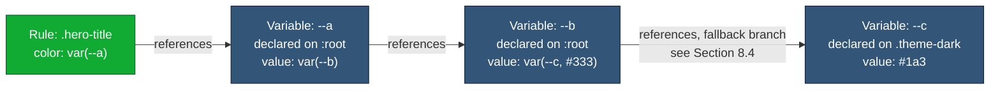
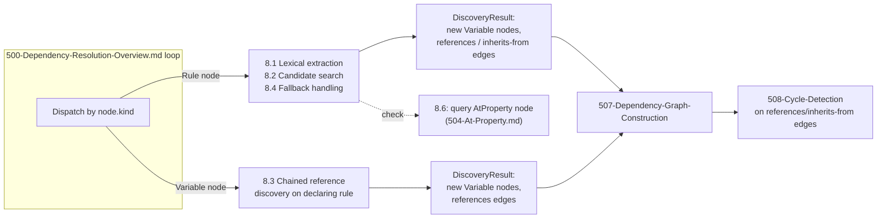

# 501 — CSS Variables Dependency Resolution

## 1. Title

**Critical CSS Extraction Engine — Custom Property (`var()`) Dependency Discovery Algorithm**

## 2. Version

| Field | Value |
|---|---|
| Document Version | 1.0.0 |
| Status | Draft — Phase 7 (Dependency Resolution) |
| Last Updated | 2026-07-09 |
| Owners | Core Architecture Working Group |
| Stability | Discovery algorithm stable; scoped explicitly to *candidate identification*, not cascade-winner selection (see Section 3) |

## 3. Purpose

This document specifies the concrete algorithm the Dependency Resolver uses to discover the `Variable`-kind dependencies of a matched CSS rule — the discovery routine that [500-Dependency-Resolution-Overview.md](../design/500-Dependency-Resolution-Overview.md)'s orchestration loop dispatches to whenever it encounters a node whose declarations use `var(--x)`. It is one of six sibling per-construct algorithm documents ([502-Keyframes.md](./502-Keyframes.md), [503-Font-Faces.md](./503-Font-Faces.md), [504-At-Property.md](./504-At-Property.md), [505-Counters.md](./505-Counters.md), [506-Cascade-Layers.md](./506-Cascade-Layers.md)) plugged into that loop as strategies, plus [507-Dependency-Graph-Construction.md](./507-Dependency-Graph-Construction.md) (the generic insertion procedure all of them feed) and [508-Cycle-Detection.md](./508-Cycle-Detection.md) (the generic cycle check all of them can trigger).

Custom properties are the single richest source of dependency complexity in this whole subsystem, for a structural reason worth stating precisely up front: **custom properties cascade and inherit exactly like ordinary CSS properties** (per the CSS Custom Properties for Cascading Variables specification), which means that "which rule declares the `--x` that applies to this element" is not a lexical question answerable by grep — it is a full cascade question, exactly as hard as "which rule's `color` declaration wins for this element." The Dependency Resolver, however, is explicitly **not** the Cascade Resolver (per [BRIEF.md](../../BRIEF.md) Section 2.4's module table, these are two distinct rows, bundled into the same package per `docs/architecture/007-Repository-Structure.md` but conceptually separate responsibilities). This document's algorithm therefore has a deliberately narrower job than "resolve the cascade for `--x`": it identifies every rule that is a **candidate** to be the declaring rule for a referenced custom property, adds each such candidate as a `Variable` node with a `references` edge from the referencing `Rule` node, and stops there — final cascade-winner selection (specificity, source order, origin, layer order all considered together) is deferred to the Cascade Resolver, which consumes this document's output alongside the `layered-under` edges produced by [506-Cascade-Layers.md](./506-Cascade-Layers.md).

This narrower scope is not a shortcut taken for convenience; it is the only architecturally sound division of labor available. The Dependency Resolver runs *before* final serialization decisions are made and its job is to guarantee **nothing needed is dropped** — false positives (an extra candidate `Variable` node that turns out not to be the actual cascade winner for any above-fold element) are safe, merely costing a few extra bytes of retained CSS; false negatives (failing to discover the actual winning declaration) are a correctness bug, producing critical CSS where a variable silently resolves to `initial` or an inherited default instead of its intended themed value. This document's algorithm is therefore deliberately over-inclusive by design, and Section 13 (Tradeoffs) returns to this point directly.

## 4. Audience

- Implementers of the `Variable`-kind branch of `DependencyDiscoverer` (per [500-Dependency-Resolution-Overview.md](../design/500-Dependency-Resolution-Overview.md) Section 8.3's strategy dispatch), who will write the code this document specifies.
- Implementers of the Cascade Resolver, who must understand precisely what guarantee this document's candidate set does and does not provide before building specificity/origin/layer-order resolution on top of it.
- Implementers of [504-At-Property.md](./504-At-Property.md), since `@property` registrations directly change this algorithm's inheritance-edge behavior (Section 8.4).
- Implementers of [508-Cycle-Detection.md](./508-Cycle-Detection.md), since chained variable references (Section 8.3) are the primary real-world source of cycles this subsystem must detect.
- Senior engineers auditing correctness of dependency resolution for custom-property-heavy design systems (design-token architectures, Tailwind's CSS-variable-based theming, Bootstrap 5's variable maps) — a common and high-stakes real-world case this algorithm must handle correctly.

## 5. Prerequisites

- [500-Dependency-Resolution-Overview.md](../design/500-Dependency-Resolution-Overview.md) — the orchestration loop this algorithm is dispatched from; this document assumes familiarity with the `DiscoveryResult{newNodes, newEdges}` contract and the node-state machine.
- `docs/architecture/014-Dependency-Graph.md` — `Variable` node kind definition (Section 8.1), `references`/`inherits-from`/`requires-registration` edge kinds (Section 8.2), and Section 8.5's browser-querying discipline this algorithm must follow.
- W3C CSS Custom Properties for Cascading Variables Module Level 1 — inheritance, cascading, and the guaranteed-invalid-value cycle-handling behavior this algorithm must mirror rather than reinvent.
- W3C CSS Properties and Values API Level 1 (`@property`) — governs whether a given custom property even participates in inheritance (Section 8.4).
- Familiarity with `getComputedStyle`, `CSSStyleDeclaration`, and the `CSSOM` traversal APIs (`document.styleSheets`, `CSSStyleRule.style`).

## 6. Related Documents

- [500-Dependency-Resolution-Overview.md](../design/500-Dependency-Resolution-Overview.md) — orchestration this algorithm plugs into.
- `docs/architecture/014-Dependency-Graph.md` — data model this algorithm's output populates.
- [502-Keyframes.md](./502-Keyframes.md), [503-Font-Faces.md](./503-Font-Faces.md), [505-Counters.md](./505-Counters.md), [506-Cascade-Layers.md](./506-Cascade-Layers.md) — sibling per-construct algorithms; this document's `Variable` nodes can themselves gain `renders-via`/`requires-registration` edges discovered by dispatching back into the same orchestration loop for those node kinds when a variable's own value references a font, animation, or registered property (rare but possible, e.g., `--icon-font: "Custom Icons"` used directly in a `font-family` declaration elsewhere).
- [504-At-Property.md](./504-At-Property.md) — governs `requires-registration` edges this document's algorithm emits.
- [507-Dependency-Graph-Construction.md](./507-Dependency-Graph-Construction.md) — generic node/edge insertion this document's `DiscoveryResult` output feeds.
- [508-Cycle-Detection.md](./508-Cycle-Detection.md) — cycle check triggered on this document's `references`/`inherits-from` edges.

## 7. Overview

When the orchestration loop ([500-Dependency-Resolution-Overview.md](../design/500-Dependency-Resolution-Overview.md) Section 10.1) dispatches a `Rule`-kind node to this algorithm's discovery function, the algorithm's job is: for every declaration in that rule whose value contains one or more `var(--name[, fallback])` references, find every rule in the page's CSSOM whose selector *could* match some element that the referencing rule also matches (or an ancestor of such an element, since custom properties inherit), and that declares `--name` — and add each as a `Variable` node with a `references` edge back to the referencing rule.

Three distinct sub-problems compose this algorithm, each covered in its own subsection of Section 8:

1. **Direct reference resolution** — finding candidate declaring rules for a single `var(--name)` reference (Section 8.1, 8.2).
2. **Chained references** — a candidate declaration's own value may itself contain `var(--other)`, requiring the same discovery to recurse (Section 8.3). This is handled not by this algorithm recursing internally, but by the orchestration loop's own fixed-point iteration: this algorithm returns the *newly discovered* `Variable` node as `pending`, and the orchestration loop enqueues it, later dispatching it back into this same discovery function (since a `Variable` node's own declaration is itself scanned for further `var()` references) or, more precisely, into a `Variable`-kind branch of the same discoverer that inspects the *declaring rule's* declaration block rather than the referencing rule's.
3. **Fallback values** — `var(--x, fallback)`'s second argument may be a literal (no dependency implication) or itself a `var()` reference (implies exactly the same discovery as a direct reference, Section 8.4).

The algorithm operates in two phases per rule, mirroring the split `docs/architecture/014-Dependency-Graph.md` Section 8.5 already mandates: a **lexical extraction phase** (find the literal `--name` tokens inside `var(...)` calls — a Principle-2-compatible use of text extraction, since it identifies *which property names to ask the browser about*, not *what their values resolve to*) and a **browser-query phase** (use `getComputedStyle` and CSSOM traversal to find actual candidate declaring rules, never re-deriving cascade behavior by hand).

## 8. Detailed Design

### 8.1 Lexical Extraction of Referenced Property Names

Given a `Rule` node's declaration block (obtained from the CSSOM, not re-parsed CSS text — the `CSSStyleDeclaration` object already exposes each declaration as a discrete `(property, value)` pair via `declaration.item(i)` / `declaration.getPropertyValue(...)`), the algorithm scans each declaration's value string for `var(` occurrences and extracts the custom property name token up to the next `,` or matching `)`, respecting nested parens (a fallback value can itself contain a function call, e.g. `var(--x, calc(1px + var(--y)))`).

This scan is bounded, simple, and does not attempt to evaluate anything — it only answers "which custom property names does this declaration's value reference, syntactically." Per `docs/architecture/014-Dependency-Graph.md` Section 8.5, this specific, narrow use of text extraction (identifying a token, not deciding a cascade outcome) is explicitly sanctioned as compatible with the "browser is source of truth" principle, since the *literal appearance* of `var(--x)` in a value string is not something the browser needs to be asked about — it is a syntactic fact about the stylesheet text as authored, directly observable via `CSSStyleDeclaration`, and only the *resolution* of `--x` (Section 8.2) is deferred to the browser.

### 8.2 Direct Reference Resolution — Finding Candidate Declaring Rules

For each `(propertyName, referencingRule)` pair extracted in Section 8.1, the algorithm must find every rule in the page's CSSOM that:

1. Declares `propertyName` in its own declaration block (a lexical fact, checkable the same way as Section 8.1, applied now to *every* rule in the CSSOM rather than just the referencing rule), **and**
2. Has a selector that could match either the same element(s) the referencing rule matches, or an ancestor of those elements (since custom properties inherit down the DOM tree, per the CSS Custom Properties specification, and a declaring rule need not match the same element the *using* rule matches — it need only match an ancestor).

Condition 2 is where the browser-query discipline matters most. The algorithm does **not** attempt to compute "does this candidate rule's selector match an ancestor of the referencing rule's matched elements" via a hand-rolled selector engine (that would violate `docs/architecture/006-Design-Principles.md` Principle 2, "never implement a custom selector parser," which extends by clear implication to never implementing a custom selector *matcher* either). Instead, it uses exactly the same primitive the Selector Matcher itself uses: `element.matches(candidateSelectorText)`, invoked against the referencing rule's actual matched element(s) *and every ancestor of those elements up to and including the document root* (walking `element.parentElement` — or, for shadow-DOM-crossing cases per Section 12, the composed tree via `getRootNode()`/host traversal). Any candidate rule whose selector matches any element in that ancestor-inclusive set is added as a candidate.

This is deliberately over-inclusive relative to true cascade-winner selection: if two rules both match an ancestor and both declare `--brand-color`, both become candidate `Variable` nodes, even though only one of them is the actual cascade winner for this specific element. This over-inclusion is intentional (Section 3, Section 13) — the Cascade Resolver, consuming this document's output alongside specificity/origin/source-order/layer information already captured elsewhere in the graph (`layered-under` edges from [506-Cascade-Layers.md](./506-Cascade-Layers.md), `origin`/`member-of` fields from `docs/architecture/014-Dependency-Graph.md` Section 8.1/8.4), performs the final narrowing; this document's job is only to guarantee the true winner is *somewhere* in the candidate set, never that the candidate set contains *only* the true winner.

**`:root`-scoped versus locally-scoped declarations.** A `:root { --brand-color: #1a3; }` declaration is not special-cased by this algorithm beyond the fact that `:root` matches the document root element, which is trivially an ancestor of every element in the document — so it participates in the "ancestor-inclusive matches" check exactly like any other selector, and in practice is very frequently a candidate because nearly every element's ancestor chain includes the root. This is correct and expected: `:root`-scoped custom properties are, by convention, global theme tokens, and the algorithm's over-inclusive design means they reliably show up as candidates without needing a special code path. A locally-scoped declaration (`.card { --card-padding: 1rem; }`) is handled by exactly the same matches-an-ancestor check; the only practical difference is that its candidate set is typically much smaller (it matches only where `.card` appears in the ancestor chain), which naturally narrows the graph without any extra logic.

### 8.3 Chained Variable References

`--a: var(--b);` declared somewhere, referenced by a matched rule as `color: var(--a);`. The discovery function, when dispatched against the referencing `Rule` node, finds `--a`'s candidate declaring rule(s) per Section 8.2 and returns each as a new `Variable` node (state `pending`). It does **not** itself look inside that `Variable` node's value to find `--b` — that would require this single dispatch call to recursively invoke itself an unbounded number of times, which is exactly the responsibility the orchestration loop's fixed-point iteration already owns ([500-Dependency-Resolution-Overview.md](../design/500-Dependency-Resolution-Overview.md) Section 8.1's state machine, Section 10.1's loop). Instead, this algorithm's `Variable`-node branch (distinct from its `Rule`-node branch, though implemented as the same discovery function with a small conditional on `node.kind`) is dispatched separately, later, when the orchestration loop dequeues the newly-added `--a` `Variable` node from the frontier: it applies Section 8.1's lexical extraction to `--a`'s *own* declaring rule's declaration block, finds `var(--b)`, and repeats Section 8.2's candidate-search for `--b`, adding a further `references` edge from the `--a` `Variable` node to the `--b` `Variable` node.

This chaining is what makes a `references` edge cycle possible (`--a: var(--b); --b: var(--a);` — each `Variable` node's own discovery finds a `references` edge back toward a node already in the graph), which is precisely why [500-Dependency-Resolution-Overview.md](../design/500-Dependency-Resolution-Overview.md) Section 8.4 mandates that cycle detection run interleaved, incrementally, per edge — a phased "chase every chain to completion first" design would not terminate on this input at all.



In this example, resolving `.hero-title`'s `color` requires walking three hops deep (`--a` → `--b` → `--c`) before reaching a variable whose value is a plain color literal with no further `var()` reference — each hop is one discovery-function dispatch, one orchestration-loop iteration, exactly as modeled by [500-Dependency-Resolution-Overview.md](../design/500-Dependency-Resolution-Overview.md) Section 9.2's flowchart.

### 8.4 Fallback Values

`var(--x, fallback)` — the second argument, if present, is used when `--x` is not set (not merely falsy — CSS custom properties have no "falsy," only "unset/invalid," per the specification) at the point of use. This algorithm treats the fallback argument as follows:

- **If the fallback is a literal** (a color, length, keyword, string, or any value containing no `var()` call), it introduces **no additional dependency**. The literal is retained as-is by the Serializer regardless of whether `--x` resolves; there is nothing for the Dependency Resolver to discover, since a literal has no declaring rule to find.
- **If the fallback itself contains a `var()` call** (`var(--x, var(--y))`, or nested inside a function like `var(--x, calc(1px + var(--y)))`), the algorithm applies Section 8.1's lexical extraction to the fallback expression exactly as it would to any other declaration value, discovering `--y` as a second candidate reference **in addition to** `--x`, both emitted as separate `references` edges from the same referencing rule. This is necessary because, at runtime, if `--x` is unset, the browser evaluates the fallback expression, which means `--y`'s declaring rule is just as required for correct rendering as `--x`'s would have been had `--x` been set — the Dependency Resolver cannot know, statically, which branch will actually be taken (that depends on runtime cascade state precisely as complex as the direct-reference case), so per this document's stated over-inclusive-by-design policy (Section 3), both are retained as candidates.

**Why not attempt to determine, ahead of time, whether `--x` is "actually" set (and skip discovering `--y`'s candidates if so):** doing so would require the Dependency Resolver to perform exactly the cascade computation this document has scoped away to the Cascade Resolver (Section 3) — and even if it could cheaply check "is `--x` set on this specific element via `getComputedStyle`," a critical-CSS extraction covers potentially many above-fold elements and, more importantly, the *extracted* CSS must remain correct even under future DOM/class changes within the fold that the extraction run didn't observe (e.g., a `.theme-dark` class toggled by JS after initial paint but still within the critical rendering path's concern). Retaining both branches' dependencies is the only choice consistent with the engine's rendering-fidelity mandate.

### 8.5 Inheritance Without an Explicit `var()` Call

Section 8.2's ancestor-matching walk already captures the mechanism by which `inherits-from` edges (as opposed to `references` edges) are discovered: `docs/architecture/014-Dependency-Graph.md` Section 8.2 defines `inherits-from` as the edge for "effective value is inherited from an ancestor's declaration, absent an explicit `var()` call." This case arises when a matched rule's *own* declaration doesn't reference `var()` at all, but the custom property's value still matters because some *other*, unmatched-by-this-rule descendant relies on inheriting it. Concretely: this algorithm additionally checks, for every custom property declared by the referencing rule's own selector-matched elements' ancestors (i.e., custom properties visible-by-inheritance at those elements, obtained via enumerating `getComputedStyle(element)`'s custom-property-valued entries — which reflects inherited values already, per the CSSOM computed-style specification — cross-referenced against declaring rules per Section 8.2's matching walk), whether that property is used anywhere transitively reachable from this rule's declarations. If the rule itself doesn't use it via `var()`, no edge is emitted from *this* rule for it — `inherits-from` edges are emitted from the perspective of whichever `Rule` or `Variable` node's value actually depends on the inherited value, not speculatively from every rule that happens to have an inheriting ancestor. This keeps the edge set precise: `inherits-from` fires only when Section 8.4's `@property`-registration check (below) confirms the property does inherit and some node in the graph genuinely needs its value.

### 8.6 `@property` Registration Interaction

A custom property registered via `@property --x { syntax: '<color>'; inherits: false; initial-value: #000; }` does not inherit at all, by explicit author declaration. This changes Section 8.5's inheritance-edge logic: before emitting an `inherits-from` edge for a given property name, the algorithm must first check whether an `AtProperty` node exists for that name (discovered by [504-At-Property.md](./504-At-Property.md)'s own algorithm, dispatched independently by the orchestration loop when a `Variable` node's `requires-registration` edge is discovered) and, if so, whether `inherits: false` is set. If the property is registered non-inheriting, no `inherits-from` edge is emitted for it under any circumstances — an element can only obtain that property's value from a rule that directly matches it (or its `initial-value`), never from an ancestor's declaration, exactly mirroring browser behavior per the CSS Properties and Values API specification. This algorithm emits a `requires-registration` edge from every `Variable` node to its corresponding `AtProperty` node whenever one exists, regardless of the `inherits` value, since the registration also governs the property's typed-value syntax (relevant to whether a given fallback or declared value is even valid) independent of inheritance.

## 9. Architecture

### 9.1 Placement Within the Discovery Dispatch Table

This algorithm is registered in [500-Dependency-Resolution-Overview.md](../design/500-Dependency-Resolution-Overview.md) Section 10.1's `discoverers` map under two keys conceptually (though possibly one function with an internal branch): `NodeKind.Rule` (Section 8.1–8.2, 8.4's referencing-side logic) and `NodeKind.Variable` (Section 8.3's chaining logic, applied to a `Variable` node's own declaring-rule value). Both branches produce the same `DiscoveryResult{newNodes, newEdges}` shape the orchestration loop expects.



### 9.2 Data Flow Against the Live Browser

```mermaid
sequenceDiagram
    participant Loop as FixedPointResolver
    participant Alg as 501 Discovery Fn
    participant CSSOM as CSSOM Rule Tree
    participant Browser as Live Browser Context

    Loop->>Alg: discover(ruleNode, ruleTree, browserContext)
    Alg->>CSSOM: enumerate declaration block (CSSStyleDeclaration)
    CSSOM-->>Alg: declarations with var() values
    Alg->>Alg: 8.1 lexical extraction of property names
    Alg->>CSSOM: enumerate all rules declaring candidate property names
    CSSOM-->>Alg: candidate rule list
    Alg->>Browser: element.matches(candidateSelector) for<br/>matched element + ancestor chain
    Browser-->>Alg: boolean per candidate
    Alg->>Browser: getComputedStyle(element) custom-property enumeration (8.5)
    Browser-->>Alg: inherited property values
    Alg-->>Loop: DiscoveryResult{newNodes, newEdges}
```

## 10. Algorithms

### 10.1 Algorithm: Candidate Declaring-Rule Discovery for a Single Property Reference

**Problem statement.** Given a property name `--x` referenced via `var()` inside a rule `R`'s declaration, find every rule that is a plausible declaring rule for `--x` as seen by any element `R` matches (or an ancestor thereof).

**Inputs.** `propertyName: string`; `referencingRule: Rule` (with its matched-element set, from the Selector Matcher's seed data); `ruleTree: CSSOMRuleTree` (indexed by declared custom-property name, per [507-Dependency-Graph-Construction.md](./507-Dependency-Graph-Construction.md)'s indexing contract); `browserContext`.

**Outputs.** `candidateRules: Rule[]` — every rule found to both declare `propertyName` and match an element in the ancestor-inclusive set.

**Pseudocode.**

```text
function findCandidateDeclaringRules(propertyName, referencingRule, ruleTree, browserContext) -> Rule[]:
    // Step 1: narrow to rules that lexically declare this property at all (cheap, no browser query)
    candidatesByDeclaration = ruleTree.rulesDeclaringCustomProperty(propertyName)
    if candidatesByDeclaration.isEmpty():
        return []   // no rule anywhere declares --x; browser will resolve to initial/inherited-default

    // Step 2: build the ancestor-inclusive element set for the referencing rule
    targetElements = referencingRule.matchedElements
    ancestorSet = new Set()
    for el in targetElements:
        ancestorSet.add(el)
        node = el
        while node.parentNode exists:              // composed-tree walk, crosses shadow boundaries (Section 12)
            node = node.parentComposedNode()
            ancestorSet.add(node)

    // Step 3: for each lexical candidate, check via element.matches() whether it matches
    //         any element in ancestorSet -- delegated to the browser, never hand-rolled (Principle 2)
    results = []
    for candidateRule in candidatesByDeclaration:
        for el in ancestorSet:
            if browserContext.matches(el, candidateRule.selectorText):
                results.add(candidateRule)
                break    // one match is enough to qualify this candidate rule
    return results
```

**Time complexity.** Let `P` be the number of rules in the page lexically declaring the referenced property name (typically very small — 1 to a handful, even in large stylesheets, since a given custom property name is rarely redeclared many times), and `A` be the size of the ancestor-inclusive element set (bounded by DOM depth, typically under 20). Step 1 is `O(1)` amortized given an index built once during CSSOM Walker traversal (per [507-Dependency-Graph-Construction.md](./507-Dependency-Graph-Construction.md)). Step 3 is `O(P * A)` `element.matches()` calls in the worst case (short-circuited by the `break` on first match per candidate). Since `P` and `A` are both small constants in practice, this is effectively `O(1)` per reference, and `O(references-per-rule)` overall for one `Rule` node's discovery call.

**Memory complexity.** `O(A)` for the ancestor set, `O(P)` for the candidate list — both small.

**Failure cases.** `propertyName` declared nowhere in the page (returns empty — this is not an error; the browser's own resolution for an undeclared custom property is well-defined: it resolves to the guaranteed-invalid value, treated as the property's initial value or inherited value per the specification's own fallback rules, and the algorithm's job is simply to report "no candidate exists," letting downstream consumers apply that spec-defined behavior rather than inventing an error). A candidate rule's selector triggering a `:has()` or other browser-permitting-but-potentially-expensive selector during `matches()` — bounded by the same performance characteristics already documented for ordinary selector matching in the CSSOM/Selector Matcher design documents, not a new risk this algorithm introduces.

**Optimization opportunities.** Batch all `element.matches()` calls for all candidate/ancestor pairs, across all `var()` references in the same rule's declaration block, into a single `page.evaluate()` round trip rather than one call per pair — directly analogous to [500-Dependency-Resolution-Overview.md](../design/500-Dependency-Resolution-Overview.md) Section 10.1's wave-batching, applied at finer grain within a single discovery call.

### 10.2 Algorithm: Fallback-Aware Reference Extraction

**Problem statement.** Given a declaration's value string as exposed by the CSSOM, extract every referenced custom property name, including those nested inside fallback expressions, without a general CSS value parser.

**Inputs.** `valueText: string` (from `CSSStyleDeclaration.getPropertyValue(prop)`).

**Outputs.** `references: { propertyName: string, isFallbackBranch: boolean }[]`.

**Pseudocode.**

```text
function extractVarReferences(valueText) -> Reference[]:
    references = []
    i = 0
    while (idx = valueText.indexOf('var(', i)) != -1:
        depth = 1
        cursor = idx + 4
        nameStart = cursor
        // scan to the first ',' at depth 1 (end of property name) or ')' at depth 0 (no fallback)
        while depth > 0:
            ch = valueText[cursor]
            if ch == '(': depth += 1
            elif ch == ')': depth -= 1
            elif ch == ',' and depth == 1:
                break
            cursor += 1
        propertyName = valueText[nameStart:cursor].trim()
        references.add({ propertyName, isFallbackBranch: false })

        if valueText[cursor] == ',':
            // there is a fallback expression; recurse into it for nested var() calls
            fallbackEnd = findMatchingCloseParen(valueText, idx + 4)  // depth-aware
            fallbackText = valueText[cursor+1 : fallbackEnd]
            nested = extractVarReferences(fallbackText)   // 8.4: nested var() in fallback
            for ref in nested:
                references.add({ propertyName: ref.propertyName, isFallbackBranch: true })
            i = fallbackEnd + 1
        else:
            i = cursor + 1
    return references
```

**Time complexity.** `O(n)` in the length of the value string, single pass plus bounded recursion depth equal to `var()` nesting depth (which is small in practice — nesting beyond 2-3 levels is exceedingly rare in authored CSS).

**Memory complexity.** `O(k)` where `k` is the number of `var()` occurrences in the value, for the returned reference list; `O(nesting depth)` additional stack frames for recursion.

**Failure cases.** Malformed CSS (unbalanced parens) — should not occur in browser-normalized `CSSStyleDeclaration.getPropertyValue()` output, since the browser itself would have rejected an unparseable declaration at parse time and it would not appear in the CSSOM at all; this function can therefore assume well-formed input and need not defensively handle unbalanced parens beyond a defensive bounds check to avoid an infinite loop on any future browser-normalization edge case.

**Optimization opportunities.** None significant; this is a cheap, purely local string scan, not a bottleneck relative to Section 10.1's browser-query-bound cost.

## 11. Implementation Notes

- Section 10.1's `ruleTree.rulesDeclaringCustomProperty(propertyName)` index must be built once, during CSSOM Walker traversal (before the Dependency Resolver runs at all), not lazily on first query — building it lazily would mean the first `var()` reference discovered pays an `O(all rules in the page)` scan cost, which defeats the whole purpose of keeping this algorithm's per-reference cost small and constant.
- The ancestor-inclusive element walk (Section 10.1 Step 2) must use the **composed tree** (crossing shadow-root boundaries via host traversal), not merely `parentElement`, to correctly handle the Shadow DOM inheritance edge case (Section 12) — this is a direct consequence of custom properties being explicitly exempted from Shadow DOM style encapsulation by specification.
- Because `isFallbackBranch` (Section 10.2) is tracked but this document's algorithm still emits a full `references` edge for fallback-nested references (Section 8.4 — no discount for being "just" a fallback), implementers should resist the temptation to deprioritize or special-case fallback-branch edges in the graph's edge-kind taxonomy; they are exactly as load-bearing as direct references for correctness purposes, even though they are conditionally activated at runtime.
- The `Variable`-kind branch of this discovery function (Section 8.3) must read the declaring rule's value using exactly the same Section 10.2 extraction routine as the `Rule`-kind branch — implementers must not write a second, subtly different extraction routine for the "variable value" case, since any divergence between the two would silently break chained-reference discovery in ways that are easy to miss in code review (both operate on the same syntactic shape, a CSS value string).

## 12. Edge Cases

- **Custom property cycles spanning multiple selector scopes** (`--a` on `.foo` referencing `var(--b)` on `.bar`, referencing `var(--a)` back) — per `docs/architecture/014-Dependency-Graph.md` Section 12's identically-worded edge case, this algorithm's node keying by `(propertyName, definingSelectorScope)` (not just `propertyName` alone) ensures cross-scope cycles are represented as distinct nodes chained together, which [508-Cycle-Detection.md](./508-Cycle-Detection.md) can then correctly identify as a cycle spanning the whole graph, not two independent, unrelated single-node "self-references."
- **Shadow DOM boundary crossing.** A `Variable` node's declaring rule inside a shadow root's `adoptedStyleSheets`, referenced by a light-DOM (or different shadow root's) rule — Section 10.1's composed-tree ancestor walk is what makes this discoverable; a naive `parentElement`-only walk would silently stop at the shadow boundary and miss the inheritance path entirely, producing a false negative (the correctness-critical failure mode this document is designed to avoid, per Section 3).
- **`@property`-registered typed custom properties with an invalid declared value.** If `@property --gap { syntax: '<length>'; }` is registered and some rule declares `--gap: not-a-length;`, the browser treats that declaration as invalid at computed-value time (per the Properties and Values API's typed-parsing rules) — this algorithm still adds the declaring rule as a candidate (it lexically declares `--gap`), since determining "is this specific value valid under this specific registered syntax" is itself a piece of browser-authoritative computation this algorithm defers rather than reimplements; an invalid candidate is simply a candidate that, per Section 3's over-inclusive-by-design policy, the Cascade Resolver or Serializer may later find contributes nothing, which is safe.
- **A `var()` reference to a property that is never declared anywhere in the page.** Handled explicitly in Section 10.1's failure-case discussion: returns no candidates, which is correct browser-mirroring behavior (guaranteed-invalid value, initial-value fallback), not an error.
- **Multiple candidate declaring rules with identical specificity and no clear textual tiebreak visible to this algorithm** (e.g., two `:root` rules in two different stylesheets, both declaring `--brand-color` with different values, and this algorithm has no way to know, without doing full cascade computation, which one the browser will actually pick) — by design (Section 3), both become candidates; this is the canonical case motivating this document's explicit non-goal of cascade-winner selection.
- **Constructable stylesheets** (`new CSSStyleSheet()` + `adoptedStyleSheets`) declaring custom properties — Section 10.1's CSSOM traversal must include these alongside ordinary `<link>`/`<style>`-sourced stylesheets, since the CSSOM Walker (upstream of this algorithm) is specified to enumerate all of `document.styleSheets` plus adopted sheets per the architecture-level CSSOM design documents; this algorithm itself does no special-casing here beyond relying on that upstream completeness guarantee.
- **Nested CSS** (native CSS nesting, `.card { --x: 1; & .title { color: var(--x); } }`) — the nested rule, once flattened by the browser's own CSSOM normalization into an ordinary `CSSStyleRule` with a resolved selector, is treated identically to any other rule by this algorithm; no special nested-CSS-aware logic is needed because the CSSOM Walker (per Principle 1) already presents nested rules in their browser-resolved, flattened form.

## 13. Tradeoffs

| Decision | Why | Alternative Considered | Tradeoff Accepted |
|---|---|---|---|
| Over-inclusive candidate set (find all plausible declaring rules, not the one true cascade winner) | Guarantees no false negatives, which is the correctness-critical failure mode; final narrowing is a natural fit for the dedicated Cascade Resolver, which already has specificity/origin/layer data this algorithm doesn't need to duplicate | Attempt full cascade-winner computation inline in this algorithm | Retained critical CSS may include a small number of "candidate but not actually winning" `Variable` declarations — a minor size cost, not a correctness cost |
| Recursion for chained references handled by the orchestration loop's fixed point, not by this algorithm's own recursive calls | Keeps this algorithm's single dispatch call bounded and simple; reuses the already-proven termination/cycle-safety machinery in [500-Dependency-Resolution-Overview.md](../design/500-Dependency-Resolution-Overview.md) rather than re-deriving it locally | Have this algorithm recursively chase the full chain itself, returning the complete transitive closure from one call | A self-recursing version would need to reimplement cycle detection and budget-limiting locally, duplicating machinery the orchestration loop already provides |
| Fallback-nested `var()` references treated identically to direct references (no discount, no separate handling downstream) | A fallback branch is a real runtime possibility, not a hypothetical; the extraction rule can't know in advance whether the primary or fallback branch will be taken | Skip fallback-nested references, or defer them to a lower-priority discovery pass | Slightly larger candidate sets in rules using extensive fallback chains (common in design-token systems layering theme overrides) |
| Composed-tree (shadow-crossing) ancestor walk rather than light-DOM-only | Custom properties are explicitly not encapsulated by Shadow DOM per specification; a light-DOM-only walk would produce false negatives across shadow boundaries | Restrict ancestor walk to the same root (light DOM or single shadow root) for simplicity | Slightly more complex tree-walk implementation, required for correctness in any page using Shadow DOM + theming via custom properties (a common combination, e.g. web-component design systems) |

## 14. Performance

- **CPU complexity.** Per Section 10.1, effectively `O(1)` per `var()` reference given small, bounded `P` (candidate rules declaring a given property) and `A` (ancestor set size), dominated by `element.matches()` browser round-trip cost when unbatched. Aggregate cost across a whole extraction run is `O(total var() references across all seed and transitively-discovered rules)`, itself bounded by the seed set's transitive closure per [500-Dependency-Resolution-Overview.md](../design/500-Dependency-Resolution-Overview.md) Section 14.
- **Memory complexity.** `O(P + A)` per reference resolved, transient; the `ruleTree.rulesDeclaringCustomProperty` index is `O(total custom property declarations in the page)`, built once and shared across all references' lookups within the run.
- **Caching strategy.** The `rulesDeclaringCustomProperty` index (Section 11) is itself a cache, amortizing what would otherwise be a full-page rule scan per reference into a single upfront build. Per-property candidate-resolution results are further memoizable across viewport passes within the same route (a `Variable` node's candidate set does not depend on viewport, only on the DOM structure, which is held stable across passes per [500-Dependency-Resolution-Overview.md](../design/500-Dependency-Resolution-Overview.md) Section 14's caching discussion), except where the referencing rule's *matched elements* differ across viewports (a responsive layout showing/hiding elements) — in that narrower case, the ancestor-set computation (Section 10.1 Step 2) must be redone per viewport even if the candidate rule index is reused.
- **Parallelization opportunities.** `element.matches()` calls across multiple candidate/ancestor pairs, and across multiple `var()` references within the same rule, can all be batched into one `page.evaluate()` round trip (Section 10.1's optimization), consistent with [500-Dependency-Resolution-Overview.md](../design/500-Dependency-Resolution-Overview.md)'s wave-batching philosophy applied at this algorithm's own internal grain.
- **Incremental execution.** Because this algorithm's cost scales with reference count, not stylesheet size, pages with large but mostly-unreferenced-by-above-fold-content variable maps (a common design-token pattern where a stylesheet declares hundreds of tokens but any given above-fold rule uses only a handful) incur cost proportional to actual usage, not declaration volume.
- **Scalability limits.** The one scenario where this algorithm's cost could grow unexpectedly large is a page with an extremely deep chained-reference tower (Section 8.3) combined with extremely wide fan-out at each link (many candidate declaring rules per property name, e.g. from many conflicting design-system versions loaded simultaneously) — bounded, as always, by the orchestration loop's resolution budget ([500-Dependency-Resolution-Overview.md](../design/500-Dependency-Resolution-Overview.md) Section 8.5), not by anything specific to this algorithm.

## 15. Testing

- **Unit tests.** Section 10.2's `extractVarReferences` tested in isolation against a table of value strings: no `var()`, single `var()` no fallback, `var()` with literal fallback, `var()` with nested `var()` fallback, multiply-nested fallbacks, malformed-but-browser-would-never-produce-this defensive cases.
- **Integration tests.** Fixtures with: a single-hop `var()` reference to a `:root`-scoped variable; a 3-hop chained reference (mirroring Section 8.3's Mermaid example); a fallback chain where the primary is unset and the fallback (itself a `var()`) is the one that actually renders; a locally-scoped variable shadowing a `:root`-scoped one of the same name (verifying both become candidates, since this algorithm does not attempt to determine which wins); a `@property inherits: false` case verifying no `inherits-from` edge is emitted (Section 8.6); a Shadow-DOM-crossing inheritance fixture (Section 12).
- **Visual tests.** Rendering-parity checks specifically on themed components (a themed button using 3+ chained custom properties) — a missed chain link manifests as a visibly wrong color/spacing in the critical-CSS-only render versus full-page render, an effective end-to-end oracle for this algorithm's correctness.
- **Stress tests.** A synthetic fixture with a 500-link `var()` chain (shared with [500-Dependency-Resolution-Overview.md](../design/500-Dependency-Resolution-Overview.md)'s own stress fixture, since this algorithm is what actually generates the chain traversal that document's budget mechanism is tested against) and a fixture with hundreds of candidate declaring rules for a single property name (wide-fan-out stress, distinct from deep-chain stress).
- **Regression tests.** Every production bug specific to this algorithm (a missed fallback-nested reference, an incorrect ancestor walk across Shadow DOM) gains a permanent fixture and golden-graph-snapshot test, per the project-wide golden-snapshot testing philosophy.
- **Benchmark tests.** Batched (Section 10.1's optimization) versus naive one-round-trip-per-reference timing on the `fixtures/enterprise-huge/` design-token-heavy variant, tracked in `benchmarks/`.

## 16. Future Work

- **Static narrowing heuristics to reduce candidate-set size without full cascade computation** — e.g., using specificity alone (computable without a live cascade, purely from selector text, per standard CSS specificity rules) to discard candidates that could never win regardless of source order or layer, shrinking the set the Cascade Resolver must consider without crossing into full cascade-winner selection. An open research question about where exactly the line between "safe narrowing" and "premature cascade computation" should sit.
- **Cross-route memoization of the candidate-rule index** (Section 14) — since `rulesDeclaringCustomProperty` depends only on the page's CSSOM, not on any particular route's above-fold seed set, a multi-route crawl of the same underlying stylesheet bundle could share this index across routes, not just across viewports within one route; not yet implemented, pending [500-Dependency-Resolution-Overview.md](../design/500-Dependency-Resolution-Overview.md)'s own cross-viewport-reuse future work landing first.
- **`@scope`-aware candidate narrowing.** As the CSS `@scope` proposal matures and gains broader browser support, scoped custom property declarations may allow tighter, spec-guaranteed narrowing of the ancestor-matching walk (Section 10.1) beyond what plain selector matching alone permits — tracked as a forward-looking research item pending browser support stabilization, analogous to the view-transition/scroll-timeline deferral in `docs/architecture/014-Dependency-Graph.md`.
- **Typed-value-aware candidate filtering** — using `@property`'s registered `syntax` (Section 8.6, [504-At-Property.md](./504-At-Property.md)) to discard candidate declarations whose value is syntactically invalid under the registered type, narrowing the candidate set safely (an invalid declaration can never be the cascade winner) without requiring full cascade computation; flagged as a promising, low-risk narrowing technique for future implementation.

## 17. References

- [500-Dependency-Resolution-Overview.md](../design/500-Dependency-Resolution-Overview.md)
- `docs/architecture/014-Dependency-Graph.md`
- [502-Keyframes.md](./502-Keyframes.md)
- [503-Font-Faces.md](./503-Font-Faces.md)
- [504-At-Property.md](./504-At-Property.md)
- [505-Counters.md](./505-Counters.md)
- [506-Cascade-Layers.md](./506-Cascade-Layers.md)
- [507-Dependency-Graph-Construction.md](./507-Dependency-Graph-Construction.md)
- [508-Cycle-Detection.md](./508-Cycle-Detection.md)
- [BRIEF.md](../../BRIEF.md) Section 2.5, Section 2.4
- `docs/architecture/006-Design-Principles.md` — Principle 1, Principle 2
- W3C CSS Custom Properties for Cascading Variables Module Level 1 — https://www.w3.org/TR/css-variables-1/
- W3C CSS Properties and Values API Level 1 — https://www.w3.org/TR/css-properties-values-api-1/
- W3C CSS Cascading and Inheritance Level 5 (inheritance model referenced for custom-property inheritance semantics) — https://www.w3.org/TR/css-cascade-5/
