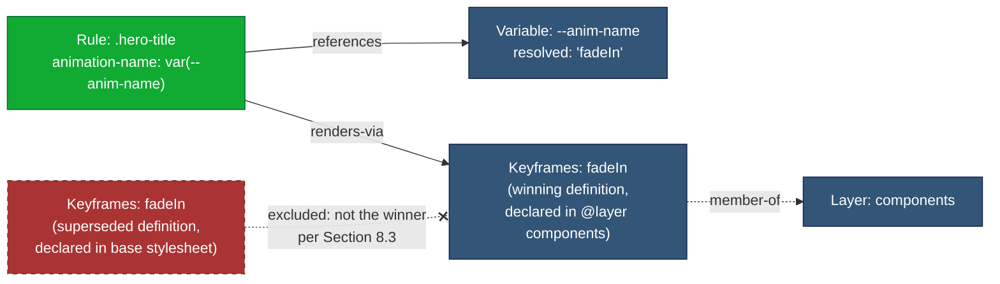

# 502 — Keyframes Dependency Resolution

## 1. Title

**Critical CSS Extraction Engine — `@keyframes` Dependency Resolution Algorithm**

## 2. Version

| Field | Value |
|---|---|
| Document Version | 1.0.0 |
| Status | Draft — Phase 7 (Dependency Resolution) |
| Last Updated | 2026-07-09 |
| Owners | Core Architecture Working Group |
| Stability | Algorithm-level; depends on the node/edge taxonomy frozen in `docs/architecture/014-Dependency-Graph.md` and the variable-resolution algorithm in `501-CSS-Variables.md` |

## 3. Purpose

This document specifies the algorithm the Dependency Resolver uses to answer one narrowly-scoped question: *given a matched `Rule` node whose computed style declares an `animation-name` (directly, via the `animation` shorthand, or indirectly via a custom property), which `@keyframes` at-rule(s) must be retained in the critical CSS output for that rule to animate correctly?*

`@keyframes` resolution is the simplest of the six per-construct discovery routines enumerated in `docs/architecture/014-Dependency-Graph.md` Section 9.2 (`DependencyDiscoverer`'s per-`NodeKind` strategy dispatch) in one respect — the graph edge it produces (`renders-via`) is, by that document's Section 8.2 taxonomy, "architecturally always exactly one hop deep" and never itself a source of cycles. It is simultaneously one of the more deceptively hazardous routines in practice, because CSS's keyframe-name resolution rules are not the ordinary cascade: multiple `@keyframes` rules sharing the same animation name do not merge or apply by specificity — the last one encountered in the effective rule order simply replaces all prior definitions of that name, in their entirety, as a single atomic unit. An engine that treats keyframe-name lookup as "find any rule with a matching name" rather than "find the one rule that wins the last-definition-replaces-all-prior-definitions resolution" will silently retain a stale, dead `@keyframes` block, omit the live one, or — worse — retain both and let the browser's own last-write-wins behavior at *render* time diverge from what the extractor decided was "the" keyframes rule at *extraction* time. This document exists to make that resolution procedure explicit, and to specify the compound case where the animation name itself is not a literal token but a `var()` reference that must first be resolved by the algorithm in `501-CSS-Variables.md` before keyframes lookup can even begin.

## 4. Audience

- Implementers of the `DependencyDiscoverer` component (`packages/dependency-graph`, per `docs/architecture/007-Repository-Structure.md`) building the `Keyframes` discovery routine referenced generically in `014-Dependency-Graph.md` Section 9.2.
- Implementers of `501-CSS-Variables.md`'s resolution routine, whose output this algorithm consumes when `animation-name` is expressed via `var()`.
- Authors of `docs/algorithms/507-Dependency-Graph-Construction.md`, who assemble all per-construct discovery routines (including this one) into the unified fixed-point loop specified architecturally in `014-Dependency-Graph.md` Section 10.1.
- Authors of `docs/algorithms/508-Cycle-Detection.md`, for confirmation that `renders-via` edges (which this algorithm produces) are excluded from the cycle-detection subgraph, per `014-Dependency-Graph.md` Section 8.2 and Section 8.7.
- Senior engineers auditing correctness of animation handling in critical CSS output before Phase 7 closes.

Readers are assumed to be comfortable with the CSS Animations Level 1/2 specification's keyframe-name resolution semantics, the CSSOM `CSSKeyframesRule`/`CSSKeyframeRule` interfaces, and the general fixed-point resolution model established in `014-Dependency-Graph.md`. This is not an introduction to CSS animations.

## 5. Prerequisites

- [BRIEF.md](../../BRIEF.md) Section 2.5 ("Dependency Resolution") — the requirement to "track... keyframes" as part of iteratively resolving the dependency graph to a fixed point, and Section 4 (Global Rules), which governs this document's structure and formatting.
- [014-Dependency-Graph.md](../architecture/014-Dependency-Graph.md) — the `Keyframes` node kind (Section 8.1), the `renders-via` edge kind (Section 8.2), the incremental construction model (Section 8.5), and the fixed-point resolution loop (Section 8.6) this algorithm plugs into.
- [500-Dependency-Resolution-Overview.md](../design/500-Dependency-Resolution-Overview.md) — the Phase 7 module-level design this algorithm document is a child of.
- [501-CSS-Variables.md](./501-CSS-Variables.md) — required reading for Section 8.4 of this document (the compound `var()`-driven animation-name case); this document forward-references its resolution procedure rather than restating it.
- Familiarity with `getComputedStyle`'s longhand expansion of the `animation` shorthand property, and with `CSSKeyframesRule.name`/`CSSKeyframesRule.cssRules` in the CSSOM.

## 6. Related Documents

- [014-Dependency-Graph.md](../architecture/014-Dependency-Graph.md) — architectural contract for the `Keyframes` node and `renders-via` edge.
- [500-Dependency-Resolution-Overview.md](../design/500-Dependency-Resolution-Overview.md) — parent design document for the whole Phase 7 dependency-resolution subsystem.
- [501-CSS-Variables.md](./501-CSS-Variables.md) — variable resolution, consumed here for the compound `var()`-driven case (Section 8.4).
- [503-Font-Faces.md](./503-Font-Faces.md) — sibling algorithm for `@font-face` resolution; shares this document's "conservative-inclusion vs. precise-matching" tension (Section 13) and its `renders-via` edge kind.
- [504-At-Property.md](./504-At-Property.md) — sibling algorithm for `@property` resolution.
- [505-Counters.md](./505-Counters.md) — sibling algorithm for `@counter-style` resolution.
- [506-Cascade-Layers.md](./506-Cascade-Layers.md) — sibling algorithm for cascade-layer ordering; relevant here because a `@keyframes` rule's own layer membership can affect which same-named definition "wins" (Section 8.2).
- [507-Dependency-Graph-Construction.md](./507-Dependency-Graph-Construction.md) — the umbrella algorithm that invokes this routine as one strategy in its per-`NodeKind` dispatch.
- [508-Cycle-Detection.md](./508-Cycle-Detection.md) — confirms `renders-via` edges are out of scope for cycle detection.

## 7. Overview

A matched `Rule` node's declaration block may include `animation-name` (directly or via the `animation` shorthand) whose value names one or more `@keyframes` rules. The algorithm's job, invoked once per matched `Rule` node during the fixed-point discovery loop described in `014-Dependency-Graph.md` Section 8.6, is:

1. Determine the resolved, longhand `animation-name` value(s) for the matched element, via `getComputedStyle`, never via textual parsing of shorthand syntax (Principle 2 compatibility, per `014-Dependency-Graph.md` Section 8.5).
2. For each resolved animation name, locate the `@keyframes` rule(s) registered under that name in the CSSOM Walker's at-rule registry (`docs/architecture/014-Dependency-Graph.md` Section 9.1's `ruleTree` input).
3. Apply CSS's keyframe-name resolution semantics — last-definition-wins, scoped by cascade layer and origin — to select exactly one winning `@keyframes` rule per name, not the naive "all rules with this name."
4. Emit a `Keyframes` node (if not already present in the graph) and a `renders-via` edge from the `Rule` node to it.
5. Handle three complicating cases: multiple animation names on one element (comma-separated `animation-name` list), vendor-prefixed keyframe names, and animation names supplied indirectly through a CSS custom property, which requires forward-referencing `501-CSS-Variables.md`'s resolution output before keyframes lookup can proceed at all.

This is a leaf-level discovery routine: it never discovers new nodes that themselves require further transitive discovery (Section 8.2 of `014-Dependency-Graph.md` establishes that `renders-via` edges are architecturally always exactly one hop deep), except for the compound var()-driven case, where the *variable* half of the dependency is transitive (handled by `501-CSS-Variables.md`) while the *keyframes* half remains a single hop once the variable's value is known.

## 8. Detailed Design

### 8.1 Extracting the Effective Animation Name(s)

The declaration `animation-name: fadeIn` is the simple case. The `animation` shorthand — `animation: fadeIn 300ms ease-in-out` — is not simple to parse by hand: the shorthand's grammar permits `animation-name`, `animation-duration`, `animation-timing-function`, `animation-delay`, `animation-iteration-count`, `animation-direction`, `animation-fill-mode`, and `animation-play-state` in an order-independent (for most sub-properties) sequence, with ambiguity between `<time>` values for duration/delay and keyword-shaped-but-not-reserved animation names (an animation literally named `ease` is legal, if inadvisable, CSS). Re-deriving which token is the name from shorthand text would be exactly the kind of hand-rolled parsing `docs/architecture/006-Design-Principles.md` Principle 2 warns against for selector semantics, and the same discipline is adopted here for property-value semantics: the engine never parses the `animation` shorthand's text. Instead, it queries `getComputedStyle(matchedElement).animationName`, which the browser guarantees is the fully-resolved longhand value regardless of whether the author wrote the shorthand or the longhand. This mirrors the identical technique `014-Dependency-Graph.md` Section 12 mandates for the same reason ("`@keyframes` referenced by a CSS animation shorthand rather than `animation-name` alone").

`animationName` (and, per the CSS Animations Level 2 addition, `animation-name` can itself be a comma-separated list when an element has multiple concurrent animations applied via the multi-value forms of `animation`) is read as a list. Each entry is resolved independently through the remainder of this algorithm; an element with `animation: fadeIn 1s, pulse 2s infinite` produces two `renders-via` edges, one per resolved name, not one edge to a synthetic combined node.

The literal value `none` is excluded from processing — it does not name a `@keyframes` rule and must not be looked up (a `@keyframes none { ... }` declaration, while syntactically constructible, is inert; the CSS Animations specification explicitly reserves `none` and browsers refuse to apply it as an animation name even if such a rule exists in the stylesheet).

### 8.2 Locating Candidate `@keyframes` Rules

The CSSOM Walker (`packages/collector`) registers every `CSSKeyframesRule` encountered while traversing `document.styleSheets`, keyed initially by name only, into the at-rule registry that `014-Dependency-Graph.md` Section 9.1 passes into the Dependency Resolver as `ruleTree`. Because a page can and frequently does declare multiple `@keyframes` rules with the same name — a common pattern is a base design-system stylesheet defining `@keyframes fadeIn` and a later theme override stylesheet redefining `@keyframes fadeIn` with different keyframe stops — this registry must retain **all** same-named definitions, in source order, rather than collapsing them at collection time. Collapsing early (e.g., "keep only the last one seen") would make the registry silently wrong the moment cascade-layer ordering (Section 8.3) or `@supports`/`@media` conditioning changes which definition is actually "last" in the *effective*, browser-resolved order rather than the raw *source* order.

### 8.3 Keyframe-Name Resolution Semantics — Last Wins, Not Cascade

This is the section that most distinguishes `@keyframes` resolution from every other dependency kind in this document set. The CSS cascade — specificity, origin, importance, layer order — governs which *declaration* wins for a given *property* on a given *element*. Keyframe-name resolution is a **different, simpler, name-scoped replacement rule**: per the CSS Animations specification, when multiple `@keyframes` rules share the same name, only the **last one in the rule order** (accounting for cascade-layer order exactly as it would for ordinary rules — a `@keyframes` rule in a higher-priority layer is treated as coming "later" for this purpose, per the interaction the CSS Cascade Layers specification defines between layers and other at-rules) is used; it entirely replaces all earlier same-named definitions rather than merging keyframe selectors (`0%`, `50%`, `to`, etc.) across them. There is no partial merge: if `@keyframes fadeIn` #1 defines stops at `0%` and `100%`, and `@keyframes fadeIn` #2 (declared later, or in a layer that wins) defines only a stop at `50%`, the effective animation uses **only** `#2`'s `50%` stop — `#1` is discarded wholesale, not merged with `#2`.

The algorithm therefore does not ask "which `@keyframes fadeIn` rules match" — it asks "which single `@keyframes fadeIn` rule wins," and the answer is obtained the same way every other winner-determination in this document set is obtained: by querying the browser rather than re-implementing the resolution logic. Two equally valid implementation strategies exist, and the engine adopts the second for reasons explained in Section 13:

1. **Re-derive winner from CSSOM order + layer order.** Sort all same-named `@keyframes` candidates by `(layerOrder, stylesheetIndex, ruleIndex)` using the same layer-order data the Cascade Resolver already obtains for ordinary rules (per `506-Cascade-Layers.md` and `014-Dependency-Graph.md` Section 8.5's "layer order... obtained from the browser's resolved layer order" language), and take the last. This requires the Dependency Resolver to correctly replicate the browser's layer-vs-source-order interaction for at-rules, which is subtle but already solved once, generically, by the Cascade Resolver for ordinary style rules — reusing that machinery rather than duplicating it.
2. **Probe the browser directly.** Construct (or reuse, if already present in the DOM) an offscreen probe element, apply `animation-name: <name>` to it, and read back which keyframe stops are actually active via `getKeyframes()` on the element's active `Animation` object (Web Animations API) or via `CSSAnimation.effect.getKeyframes()`. This sidesteps re-deriving layer-order interaction entirely, at the cost of an extra browser round trip per distinct animation name (not per element — the result is memoizable by name, since keyframe-name resolution is a stylesheet-wide, not per-element, fact, modulo the `@supports`/`@media` conditioning edge case in Section 12).

The engine adopts strategy 2 as the primary mechanism, with strategy 1's sorted-candidate-list retained as a fallback for browser contexts where `Element.getAnimations()`/Web Animations API introspection is unavailable or where no live element is convenient to probe with (e.g., resolving a `@keyframes` referenced only via a custom-property indirection on an element that is itself borderline-visible — see Section 8.4). This follows Principle 1 (`006-Design-Principles.md`): let the browser's own animation-application logic be the arbiter of "which keyframes rule actually applies," exactly as `element.matches()` is trusted over a re-implemented selector engine.

### 8.4 Vendor-Prefixed Keyframe Names

Historically, `@-webkit-keyframes fooAnim` (and, more rarely today, `@-moz-keyframes`) could define keyframes under the *same logical name* as an unprefixed `@keyframes fooAnim`, intended to serve engines that had not yet shipped unprefixed support. Modern evergreen browsers ignore the prefixed at-rule entirely once they support the unprefixed form; only the unprefixed rule is live. The CSSOM Walker's at-rule registry (Section 8.2) records `CSSKeyframesRule` instances regardless of whether they originated from a `@-webkit-keyframes`/`@-moz-keyframes` or unprefixed block — critically, in the browser context the engine runs in (a real, current Playwright-driven Chromium/Firefox/WebKit instance, per `docs/adr/ADR-0003-Playwright-As-Browser-Abstraction.md`), the prefixed at-rule is either not recognized at all (parsed as an unknown at-rule and dropped from `document.styleSheets`'s CSSOM reflection) or recognized but inert. Because the engine's Principle 1 commitment is to trust the browser's own applied behavior — obtained via the Web Animations API probe in Section 8.3, strategy 2 — a vendor-prefixed keyframes block that the running browser engine does not honor simply never surfaces as the "winning" rule, and the algorithm need not special-case prefix stripping or prefix-aware name matching at all. This is a direct, load-bearing consequence of adopting strategy 2 over strategy 1: strategy 1 (manual sort-and-take-last) would need explicit prefix-awareness logic to correctly exclude dead-prefixed rules from consideration, whereas strategy 2 gets this correctness for free because the browser has already made the same determination when computing the live `Animation` object's keyframes.

The one case this does not resolve automatically: if the *unprefixed* rule is entirely absent (a legacy stylesheet that only ever shipped a prefixed block, targeting a browser engine that never implemented the unprefixed form and is not the one the engine's Playwright instance uses) and the running browser therefore applies no animation at all, `getKeyframes()` returns an empty list, and the algorithm correctly concludes "this animation name resolves to nothing observable" — which is the correct, browser-faithful answer, not a bug in this algorithm's handling.

### 8.5 Compound Case — Keyframe Name Supplied via a Custom Property

`animation-name: var(--anim-name)` is a legal, increasingly common pattern (design systems parameterizing which animation a component uses via a themeable custom property). This is a genuinely compound dependency, spanning two of the six per-construct algorithms in this Phase 7 document set:

1. The `Rule` node's `animation-name` declaration references a `Variable` node (`--anim-name`), discovered and resolved by the `501-CSS-Variables.md` algorithm exactly as any other `var()` reference would be — this produces a `references` edge from the `Rule` to the `Variable` node, per `014-Dependency-Graph.md` Section 8.2, entirely independent of this document.
2. Once `--anim-name`'s resolved value is known (from `getComputedStyle(matchedElement).getPropertyValue('--anim-name')`, or, if `--anim-name` is not itself resolvable to a single static value — see below — from its set of possible values), *that* value is what feeds into Section 8.1's `animationName` lookup in place of a literal token.

In the common case, `getComputedStyle` already gives the engine the fully cascade-and-inheritance-resolved value of `--anim-name` for the specific matched element — there is no additional ambiguity, because `getComputedStyle` on the element with the `animation-name: var(--anim-name)` declaration returns `animationName` already substituted with the resolved custom-property value (browsers perform `var()` substitution as part of computing the `animation-name` longhand). This means that, in practice, **the compound case degenerates to the simple case at the point this algorithm runs**, provided discovery order guarantees the `Rule`'s computed style is queried after the page has stabilized (which it always is, per `014-Dependency-Graph.md` Section 12's DOM/CSSOM-snapshot-stability requirement). The engine does not need to symbolically "forward-reference" the variable's value through `501-CSS-Variables.md`'s own resolution machinery merely to determine *this specific element's* effective animation name — `getComputedStyle` already did that substitution.

Where the `501-CSS-Variables.md` forward reference genuinely matters is for the **graph edge**, not the **value**: the engine must still record that this `Rule` node's `renders-via` edge (to the `Keyframes` node) is *conditioned on* the `references` edge (to the `Variable` node) resolving the way it did, so that the Reporter's diagnostic output (per `014-Dependency-Graph.md` Section 8.1's `discoveredAt` and Section 11's full-fidelity serialization requirement) can explain, when asked "why is this `@keyframes` block retained," an answer of the form "because `.hero` declares `animation-name: var(--anim-name)`, `--anim-name` resolves to `fadeIn` per `--anim-name`'s definition on `:root`, and `@keyframes fadeIn` is the winning definition of that name" — a three-hop explanation chain spanning two of this document set's algorithms, not a single flat fact. Concretely, the discovery routine specified in Section 10.1 below emits **both** edges (`references` to the `Variable` node and `renders-via` to the `Keyframes` node) from the same `Rule` node, and it is the presence of both edges — not a merged compound edge type — that lets a graph consumer reconstruct the explanation chain by simple traversal. This keeps `014-Dependency-Graph.md`'s edge taxonomy (Section 8.2) unmodified: no new edge kind is introduced for the compound case, because the existing two edge kinds, both anchored at the same `Rule` node, already carry the necessary information jointly.

### 8.6 The Genuinely Dynamic / Unresolvable Case

`getComputedStyle` can fail to yield a single static answer in a narrower set of circumstances than variable resolution generally allows for (per `501-CSS-Variables.md`'s own treatment of unresolvable variables): specifically, when the *matched element itself* is not the element whose animation is actually observed (a common pattern: a parent rule sets `--anim-name` differently per state via a class toggled by JavaScript at runtime, e.g. `.card.is-flipping { --anim-name: flipOut; }` vs. the default `--anim-name: flipIn`, and the extractor's DOM snapshot captures only one such state). In this situation, `getComputedStyle` at extraction time returns whichever value is active in the *snapshotted* DOM state — which is correct and sufficient for that snapshot, but is not necessarily the *only* value this element's animation name could ever take across the interactive lifetime of the page.

This raises a genuine design fork, addressed in Section 13 (Tradeoffs) and summarized here: should the algorithm conservatively include `@keyframes` rules for *every* value `--anim-name` could plausibly take (requiring a static enumeration of the property's possible values across all rules that set it, an operation that is itself only heuristically possible — see `501-CSS-Variables.md`'s treatment of "possible value enumeration" for custom properties set conditionally via multiple selectors/states), or should it trust the single snapshotted value and accept that a state-dependent animation name not observed during the above-fold snapshot may be missing from critical CSS? The engine adopts a **configurable, conservative-by-default** policy: when discovery can determine, by inspecting the at-rule registry, that multiple rules assign different literal values to the same custom property name that feeds an `animation-name` declaration on a matched element (a heuristic, not a proof of reachability — see Section 12), it includes the `Keyframes` node for **every** such literal value, not only the one active in the current snapshot, trading some output bloat for resilience against invisible-at-snapshot-time state transitions. This mirrors, deliberately, the identical conservative-fallback policy `501-CSS-Variables.md` adopts for the same underlying reason applied to variables themselves, and generalizes it to this document's terminal construct.

## 9. Architecture

### 9.1 Position in the Dependency Resolver Pipeline

This algorithm is one strategy invoked by the generic `DependencyDiscoverer.discover(node, ruleTree, browserContext)` dispatch specified architecturally in `014-Dependency-Graph.md` Section 9.2, selected when the node under discovery is a `Rule` node whose computed style includes a non-`none` `animationName`. It executes entirely within the discovery step of the fixed-point loop (`014-Dependency-Graph.md` Section 8.6's `Discover` box), and — per that document's Section 8.2 taxonomy — never itself requires the fixed-point loop to revisit the `Keyframes` node it produces for further transitive discovery, except that a `Keyframes` node may still be `conditioned-by` a `@supports`/`@media` wrapper it is lexically nested inside (an ordinary containment fact, handled generically, not specific to this algorithm).

```mermaid
flowchart LR
    SM[Selector Matcher] -->|MatchedRule seed| DR[Dependency Resolver]
    DR -->|dequeue Rule node| KFD[Keyframes Discovery Routine<br/>this document]
    KFD -->|getComputedStyle().animationName| Browser[(Live Browser Context)]
    KFD -->|if var()-derived: consult| VarAlgo[501-CSS-Variables.md<br/>resolution output]
    KFD -->|getKeyframes probe, Section 8.3| Browser
    KFD -->|Keyframes node + renders-via edge| Graph[(DependencyGraph)]
    VarAlgo -->|Variable node + references edge| Graph
```

### 9.2 Animation-Name-to-Keyframes Dependency Edge

The following diagram shows the shape of the dependency edges this algorithm produces for a representative matched rule with a themed, custom-property-driven animation name, alongside a same-named but non-winning `@keyframes` definition that must **not** be retained.



`KF2` is shown only to make explicit that it is discovered (it exists in the at-rule registry, Section 8.2) but never added to the graph as a `Keyframes` node — it fails the winner-selection step in Section 8.3 and is discarded before `addNode`/`addEdge` is ever called for it. This is a deliberate divergence from the conservative-fallback policy of Section 8.6: Section 8.6's fallback applies only to genuinely *ambiguous* animation-name values (multiple possible *names*), never to same-named `@keyframes` rules where the winner is deterministically knowable from cascade-layer-and-source order or from a live browser probe. Conflating the two would defeat the entire purpose of Section 8.3.

## 10. Algorithms

### 10.1 Algorithm: Resolve Keyframes Dependencies for a Matched Rule

**Problem statement.** Given a matched `Rule` node and its associated DOM element, determine the complete set of `@keyframes` at-rules that must be retained for the element's animation(s) to render correctly, and emit the corresponding `Keyframes` nodes and `renders-via` edges into the dependency graph.

**Inputs.** `ruleNode: GraphNode` (kind `Rule`); `matchedElement: Element` (live DOM handle, per `docs/architecture/014-Dependency-Graph.md` Section 8.5); `keyframesRegistry: Map<string, CSSKeyframesRule[]>` (from the CSSOM Walker's at-rule registry, keyed by animation name, values in source order); `layerOrder: LayerOrderTable` (from the Cascade Resolver, per `506-Cascade-Layers.md`); `browserContext` (live page handle for Web Animations API probes); `variableResolver` (the `501-CSS-Variables.md` resolution interface, consulted only when the raw declaration is `var()`-based).

**Outputs.** `{ newNodes: GraphNode[], newEdges: GraphEdge[] }` — zero or more `Keyframes` nodes and one `renders-via` edge per resolved, non-`none` animation name, plus (in the compound case) the `references` edge to the relevant `Variable` node if not already present from `501-CSS-Variables.md`'s own discovery pass.

**Pseudocode.**

```text
function discoverKeyframesDependencies(ruleNode, matchedElement, keyframesRegistry,
                                        layerOrder, browserContext, variableResolver)
    -> DiscoveryResult:

    result = DiscoveryResult.empty()

    computedNames = browserContext.getComputedStyle(matchedElement).animationName
        // already var()-substituted by the browser; a comma-separated list,
        // each entry either a literal name or 'none'

    rawDeclaration = ruleNode.declarationBlock.getPropertyValue('animation-name')
                     ?? extractNameFromShorthand(ruleNode.declarationBlock, 'animation')
    usesCustomProperty = containsVarToken(rawDeclaration)  // lexical check only, Principle 2 compatible

    if usesCustomProperty:
        varRef = variableResolver.resolveReference(ruleNode, rawDeclaration)
        if varRef.edge is not already in graph:
            result.newEdges.push(varRef.edge)   // Rule --references--> Variable
        if varRef.hasMultiplePossibleValues:      // Section 8.6
            candidateNames = varRef.allPossibleValues
        else:
            candidateNames = computedNames        // snapshot value already reflects substitution
    else:
        candidateNames = computedNames

    for name in candidateNames:
        if name == 'none':
            continue

        candidates = keyframesRegistry.get(name) ?? []
        if candidates.isEmpty():
            emitDiagnostic(UnresolvedAnimationNameWarning(ruleNode, name))
            continue   // graceful degradation: no matching @keyframes exists at all

        winner = selectWinningKeyframesRule(candidates, layerOrder, browserContext, matchedElement)
            // Section 8.3: prefer live Web Animations API probe (getKeyframes()),
            // fall back to (layerOrder, stylesheetIndex, ruleIndex) sort-and-take-last

        kfNodeId = makeKeyframesNodeId(name, winner.origin)
        if not graph.hasNode(kfNodeId):
            kfNode = makeKeyframesNode(winner, discoveredAt = 'transitive')
            result.newNodes.push(kfNode)

        result.newEdges.push(makeEdge(
            source = ruleNode.id,
            target = kfNodeId,
            kind = 'renders-via'
        ))

    return result


function selectWinningKeyframesRule(candidates, layerOrder, browserContext, matchedElement)
    -> CSSKeyframesRule:

    probeResult = tryProbeViaWebAnimationsAPI(browserContext, matchedElement, candidates[0].name)
    if probeResult.available:
        return matchCandidateByObservedStops(candidates, probeResult.keyframeStops)

    // Fallback: manual sort-and-take-last using layer-aware ordering
    sorted = candidates.sortedBy(c => (
        layerOrder.rank(c.memberOf),   // higher rank = wins, per Cascade Layers spec
        c.origin.stylesheetIndex,
        c.origin.ruleIndex
    ))
    return sorted.last()
```

**Time complexity.** Let `k` be the number of distinct animation names referenced by the matched `Rule` (almost always `1`, occasionally a small constant for multi-animation elements), and let `m` be the maximum number of same-named `@keyframes` candidates for any one name (bounded in practice by the number of stylesheets/themes/overrides defining that name, typically single-digit). Per-name winner selection is `O(m log m)` in the fallback sort path, or `O(1)` amortized in the Web-Animations-API-probe path plus one browser round trip (batchable per Section 14). Total: `O(k × m log m)` per matched rule, dominated in real deployments by the browser round-trip cost of the probe, consistent with the dominant-cost characterization already established in `014-Dependency-Graph.md` Section 10.1.

**Memory complexity.** `O(k)` new nodes/edges per matched rule in the typical case; `O(k × v)` in the conservative-fallback compound case (Section 8.6) where `v` is the number of possible values a driving custom property can take — bounded by the number of distinct literal assignments to that property found in the stylesheet corpus, not unbounded.

**Failure cases.** No `@keyframes` rule exists for a resolved name (Section 8.6/11 graceful-degradation path — emits a diagnostic, does not throw); the Web Animations API probe is unavailable in the current browser context (falls back to manual sort, Section 8.3); the custom-property-driven name cannot be resolved to any concrete value at all by `501-CSS-Variables.md` (propagates that document's own unresolvable-value handling, which this algorithm treats as "no candidate names," producing zero `renders-via` edges and a diagnostic rather than a crash).

**Optimization opportunities.** Memoize `selectWinningKeyframesRule`'s result by `(name, layerOrder-fingerprint)` across all matched rules in the same extraction run — winner selection for a given animation name does not depend on which element or rule is asking, only on the stylesheet corpus and layer order, both fixed for the whole route/viewport pass; batch Web Animations API probes for multiple distinct animation names into a single `page.evaluate()` wave, mirroring the batching optimization `014-Dependency-Graph.md` Section 10.1 specifies generically for discovery queries.

### 10.2 Algorithm: Conservative Fallback Candidate Enumeration (Section 8.6)

**Problem statement.** When an `animation-name` is driven by a custom property whose value cannot be pinned to a single static literal across all reachable DOM states, enumerate the set of "safe" candidate names to include, favoring recall (avoid missing a `@keyframes` block that might be needed) over precision (avoid over-including unused ones).

**Inputs.** `variableNode: GraphNode` (kind `Variable`, the `--anim-name`-equivalent property); `stylesheetCorpus: CSSOMRuleTree`.

**Outputs.** `candidateNames: string[]` — literal animation-name values considered reachable.

**Pseudocode.**

```text
function enumeratePossibleAnimationNames(variableNode, stylesheetCorpus) -> string[]:
    assignments = stylesheetCorpus.findAllDeclarationsOf(variableNode.propertyName)
        // every rule anywhere in the corpus that sets this custom property to a literal value
        // (not itself another var() reference — chained indirection is 501-CSS-Variables.md's concern)

    literalValues = assignments
        .filter(a => isLiteralValue(a.value))   // excludes var(...)-valued assignments
        .map(a => a.value)
        .distinct()

    return literalValues
```

**Time complexity.** `O(R)` where `R` is the total number of rules in the stylesheet corpus that declare the target custom property — bounded above by total stylesheet rule count, not by graph size; this is the one place in this algorithm where cost can scale with whole-page CSS rather than the seed set's transitive closure, which is why it is gated (Section 8.6) behind detecting genuine multi-value ambiguity first, rather than run unconditionally for every custom-property-driven animation name.

**Memory complexity.** `O(v)` for the distinct literal value set, `v ≤ R`.

**Failure cases.** A custom property whose only assignments are themselves `var()`-chained (no literal ever appears) returns an empty candidate list, which this algorithm's caller (Section 10.1) treats identically to "no candidate names resolved" — a diagnostic, not a crash.

**Optimization opportunities.** This enumeration is memoizable by `variableNode.id` across all matched rules in the same extraction run that share the same driving custom property, avoiding redundant corpus scans.

## 11. Implementation Notes

- The `animation-name`/`animation` shorthand distinction (Section 8.1) must always be resolved via `getComputedStyle`'s `animationName` longhand property, never by inspecting `ruleNode.declarationBlock.cssText` for the shorthand form — the raw declaration text is consulted only for the narrow, non-decisional purpose of detecting the *presence* of a `var(...)` token (Section 8.5's `containsVarToken` check), exactly the same lexical-extraction-is-fine-but-semantic-parsing-is-not discipline `014-Dependency-Graph.md` Section 11 establishes for custom-property extraction generally.
- `selectWinningKeyframesRule`'s Web-Animations-API probe path requires a live, attached DOM element to apply a trial animation to; where the matched element itself is suitable (the common case — it already has the animation applied), no synthetic probe element is needed at all, and the routine can read `matchedElement.getAnimations()` directly rather than constructing an offscreen probe, which is strictly cheaper and should be attempted first.
- `Keyframes` node IDs (per `014-Dependency-Graph.md` Section 8.1's determinism requirement) must be derived from `(animationName, winningRule.origin)`, not from animation name alone — two same-named `@keyframes` rules occurring in genuinely independent, non-overriding contexts (e.g., scoped to different `@layer`s that never actually interact because no single element's animation-name resolution ever considers both) must still collapse to a single graph node if and only if they are, in fact, the same winning rule for every matched element that references that name; in practice this reduces to keying by `(animationName, stylesheetIndex, ruleIndex)` of the winning `CSSKeyframesRule` itself, since winner selection already deduplicates to one physical rule.
- The `UnresolvedAnimationNameWarning` and any conservative-fallback multi-candidate inclusion (Section 8.6) must be surfaced through the same Reporter diagnostic channel `014-Dependency-Graph.md` Section 8.6 uses for `CyclicDependencyWarning`, keeping all dependency-resolution diagnostics uniformly discoverable in one place (REQ-460/461 per that document).
- Discovery for `Keyframes` nodes must run strictly after any `501-CSS-Variables.md`-driven `Variable` node discovery for the same `Rule`, whenever `animation-name` is `var()`-based — not because of a graph-level ordering requirement (the fixed-point loop tolerates arbitrary discovery order per `014-Dependency-Graph.md` Section 10.2), but because `getComputedStyle`'s substituted `animationName` value is only meaningful once the browser itself has performed variable substitution, which it always has by the time any computed-style query runs; this is a non-issue in practice and is noted here only to preempt an incorrect implementation that tries to symbolically pre-resolve the variable before querying computed style, which is unnecessary work.

## 12. Edge Cases

- **`@keyframes` rules nested inside `@supports`/`@media` blocks whose condition is false.** The CSSOM Walker still registers such rules in the at-rule registry (collection is condition-agnostic, per `014-Dependency-Graph.md` Section 8.1's `SupportsBlock`/`MediaQuery` node kinds), but `selectWinningKeyframesRule`'s live-probe path (Section 8.3) never selects them as the winner, because the browser itself never applies an animation whose keyframes live inside an inactive conditional block — the live probe is condition-aware for free, whereas the manual sort-and-take-last fallback path must explicitly filter out candidates whose `member-of` chain includes an inactive `SupportsBlock`/`MediaQuery` node before sorting, or it will incorrectly select a dead candidate as "last."
- **Empty `@keyframes` blocks (`@keyframes fadeIn {}`).** Legal CSS; the resulting `Animation` object has no visible effect stops but is still a valid winner if it is the last-declared same-named rule — the algorithm must not special-case "empty" as "invalid" and skip to an earlier candidate, since that would deviate from actual browser behavior (an empty winning `@keyframes` block genuinely means the animation does nothing, and the extractor's output should faithfully reflect that rather than substituting a different definition the browser would not use).
- **Keyframe selectors using non-percentage-normalized forms (`from`/`to` vs. `0%`/`100%`).** Purely a CSSOM/serialization concern, not a resolution concern — `CSSKeyframesRule.cssRules` normalizes both forms to equivalent `CSSKeyframeRule` entries, and this algorithm does not need to distinguish them; noted here only because a naive text-based approach (explicitly avoided per Section 8.1) would need to.
- **Multiple `animation-name` values where some resolve and some do not.** `animation-name: fadeIn, ghostAnim` where `ghostAnim` has no matching `@keyframes` anywhere in the corpus — the algorithm processes each name independently (Section 10.1's per-name loop) and emits a partial result: `fadeIn`'s `Keyframes` node and edge are added normally, `ghostAnim` produces only a diagnostic. This is deliberate graceful degradation, not an error for the whole rule.
- **Animation name colliding with a CSS-wide keyword or reserved word.** An author-defined `@keyframes none {}` is simply never reachable — Section 8.1 already excludes the literal string `none` from lookup regardless of whether a same-named `@keyframes` rule technically exists in the corpus, matching browser behavior exactly.
- **Shadow DOM and `@keyframes` visibility.** Unlike custom properties (which inherit across shadow boundaries per `014-Dependency-Graph.md` Section 12), `@keyframes` names are **not** scoped by Shadow DOM in the way one might expect component encapsulation to suggest — a `<style>` inside a shadow root defining `@keyframes fadeIn` is visible only within that shadow tree's own cascade, and an element inside that shadow tree referencing `animation-name: fadeIn` resolves against that shadow tree's own stylesheets first. The discovery routine must therefore scope its `keyframesRegistry` lookup to the matched element's own shadow-tree-aware stylesheet scope (the CSSOM Walker must already partition its at-rule registry by shadow root per `014-Dependency-Graph.md`'s general Shadow DOM handling) rather than searching a single, flat, document-wide registry — a cross-shadow-boundary `animation-name` reference to a *light-DOM*-only keyframes name from inside a shadow tree will correctly fail to resolve unless the shadow tree's own stylesheets neither define nor override that name, mirroring real browser scoping.
- **`animation-name: revert` / `unset` / `initial`.** CSS-wide keywords are valid values for `animation-name`; `getComputedStyle` resolves these to their effective concrete value (often `none`, or an inherited/ancestor value depending on context) before this algorithm ever sees them, so no special-casing beyond the existing `none` exclusion (Section 8.1) and the already-generic reliance on computed style is required.
- **Future CSS: scroll-driven and view-transition keyframe-adjacent constructs.** As flagged architecturally in `014-Dependency-Graph.md` Section 8.1, `animation-timeline` (scroll-driven animations) and `::view-transition-*`-associated keyframe-like constructs are modeled as `Rule`-node annotations rather than graph nodes at this time; this algorithm's scope is limited to conventional `@keyframes`/`animation-name` resolution and does not yet resolve dependencies for those constructs — see Future Work.

## 13. Tradeoffs

| Decision | Why | Alternative Considered | Tradeoff Accepted |
|---|---|---|---|
| Prefer live Web Animations API probe over manual layer-aware sort for winner selection (Section 8.3) | Delegates last-definition-wins-with-layer-interaction semantics to the browser's own, already-correct implementation, avoiding re-derivation of a subtle spec interaction (layers × at-rule ordering) this engine would otherwise have to prove correct itself | Always use the manual sort-and-take-last fallback, reusing the Cascade Resolver's layer-order table directly, skipping the probe entirely | The probe path costs an extra browser round trip (amortized via batching, Section 14) in exchange for correctness guaranteed by construction rather than by a parallel re-implementation that could drift from actual spec behavior over time |
| Conservative multi-value inclusion for ambiguous `var()`-driven animation names (Section 8.6) | A state-dependent animation name not observed in the above-fold DOM snapshot could still be needed once client-side interaction occurs (e.g., a hover-triggered class toggle that changes `--anim-name`), and silently dropping its `@keyframes` block produces a worse failure mode (dead animation) than including an unused block (a few extra bytes) | Trust only the single value observed via `getComputedStyle` at snapshot time, discard the rest | Some output bloat when a themed/stateful animation name has several literal candidates, versus the risk of visibly broken animations on user interaction if only the snapshot-time value were trusted |
| Exclude non-winning same-named `@keyframes` rules entirely rather than including all same-named candidates "just in case" | Including a superseded `@keyframes fadeIn` alongside the winning one changes nothing about correctness (the browser would ignore the superseded one anyway) but adds dead weight, and — more importantly — retaining a superseded rule in the *serialized critical CSS output*, at a *different* rule-order position than the original stylesheet, could itself flip which one wins in the extracted output if the Serializer's rule-ordering logic does not perfectly replicate original layer/source order | Include every same-named `@keyframes` candidate found anywhere in the corpus, unconditionally, mirroring the conservative policy adopted for the genuinely-ambiguous `var()` case | Requires the winner-selection step (Section 8.3) to be correct, rather than deferring the decision to "include everything and let the browser sort it out again at critical-CSS-render time" — accepted because the latter reintroduces exactly the correctness risk (output-order-dependent re-resolution) the former avoids |
| Treat `renders-via` edges as architecturally acyclic and out of cycle-detection scope (inherited from `014-Dependency-Graph.md`) | A `@keyframes` block's own declarations (`from`/`to`/percentage stops) cannot themselves reference `animation-name`, so no cycle can originate from this edge kind | Include `renders-via` in the cycle-detection subgraph defensively, symmetric with `layered-under`'s inclusion despite being spec-impossible (`014-Dependency-Graph.md` Section 12) | Slightly less defensive than the `layered-under` precedent, accepted because `renders-via`'s acyclicity follows from CSS grammar itself (keyframe-stop declaration blocks have a restricted property set that structurally excludes `animation-name`), not merely from current spec behavior that a future spec revision could change |

## 14. Performance

- **CPU complexity.** Per Section 10.1, `O(k × m log m)` per matched rule in the fallback path, `O(k)` browser-round-trip-dominated in the probe path — negligible relative to overall extraction cost, consistent with `014-Dependency-Graph.md` Section 14's characterization of discovery-routine cost as browser-round-trip-bound rather than graph-algorithmics-bound.
- **Memory complexity.** `O(k)` per matched rule in the common case, bounded further by the total distinct animation-name count across the whole seed set — in practice single or low double digits even for animation-heavy pages, since above-fold hero/intro animations rarely number in the dozens.
- **Caching strategy.** Winner selection (Section 8.3) is memoizable by `(animationName, layer-order-fingerprint)` for the duration of a single extraction run, and — per `014-Dependency-Graph.md` Section 14's viewport-invariance observation — is additionally memoizable *across* the Mobile/Tablet/Desktop viewport passes of the same route, since neither the stylesheet corpus nor cascade-layer order changes between viewport passes, only which `Rule` nodes seed the graph.
- **Parallelization opportunities.** Web Animations API probes for multiple distinct animation names can be batched into a single `page.evaluate()` call per discovery-queue "wave," identical in spirit to the batching strategy `014-Dependency-Graph.md` Section 10.1 specifies generically; probes for *different* animation names are mutually independent and trivially parallelizable within that batch.
- **Incremental execution.** Because this routine only ever runs for `Rule` nodes already in the discovery queue (never scans the whole stylesheet corpus except in the bounded Section 10.2 fallback), its cost scales with the above-fold seed set's animated-rule subset, not total page CSS — directly inheriting `014-Dependency-Graph.md` Section 14's incremental-execution property.
- **Scalability limits.** The one sub-linear-in-seed-set-size cost center is Section 10.2's corpus scan for possible-value enumeration, gated behind detecting genuine ambiguity first (Section 8.6); a pathological page with thousands of rules setting the same custom property to distinct literal values could make this scan expensive, but this is bounded by the same `resolutionBudget` circuit breaker `014-Dependency-Graph.md` Section 10.1 defines for the outer fixed-point loop, converting a worst case into a diagnosable failure rather than an unbounded hang.

## 15. Testing

- **Unit tests.** Pure-function tests of `selectWinningKeyframesRule`'s fallback sort path against synthetic candidate lists with varied layer/source-order permutations, verifying last-wins semantics independent of insertion order; tests of `enumeratePossibleAnimationNames` against synthetic stylesheet fixtures with var()-chained and literal assignments mixed.
- **Integration tests.** Real Playwright-driven fixtures: (a) simple `animation-name` literal referencing a single `@keyframes` block; (b) `animation` shorthand form, verifying longhand-expansion-based extraction rather than shorthand text parsing; (c) two same-named `@keyframes` blocks in different stylesheets/layers, asserting only the winning one is retained; (d) vendor-prefixed `@-webkit-keyframes` alongside an unprefixed definition, asserting the prefixed one never wins in a modern engine; (e) `animation-name: var(--anim-name)` with a single static value, asserting the compound `references` + `renders-via` edge pair; (f) the same, but with `--anim-name` set differently by a toggled class not present in the above-fold snapshot, asserting conservative multi-value inclusion.
- **Visual tests.** Rendering-parity comparison of the critical-CSS-only render against the full-CSS render specifically for above-fold animated elements — a missing or wrong-winner `Keyframes` node manifests as a static (non-animating) or differently-animating element, making this the end-to-end correctness oracle for this algorithm, per the same philosophy `014-Dependency-Graph.md` Section 15 establishes generally.
- **Stress tests.** A fixture with a large number (50+) of distinct animation names each with 3–5 same-named override definitions across layered stylesheets, verifying winner-selection performance and correctness at scale; a fixture with a single custom property assigned hundreds of distinct literal animation-name values across many selectors, exercising Section 10.2's corpus-scan cost and the `resolutionBudget` circuit breaker.
- **Regression tests.** Every production bug involving mis-resolved keyframe winners (e.g., an early implementation naively including all same-named `@keyframes` rather than selecting one) gains a permanent golden-graph-snapshot fixture, per `014-Dependency-Graph.md` Section 15's regression philosophy.
- **Benchmark tests.** Track probe-batching efficiency (Section 14) in `fixtures/enterprise-huge/`'s animation-heavy variant against a naive one-probe-per-name baseline, per the same benchmarking convention `014-Dependency-Graph.md` Section 15 establishes for the graph overall.

## 16. Future Work

- **First-class support for `animation-timeline` (scroll-driven animations) and `::view-transition-*`-associated keyframes**, once these are promoted from `Rule`-node annotations to first-class graph constructs per `014-Dependency-Graph.md` Section 16's forward-looking note — this document's winner-selection logic (Section 8.3) would need a scroll-position-aware or transition-phase-aware analogue of the Web Animations API probe, which does not yet have a stable cross-engine equivalent.
- **Static, non-probe-based winner selection using a formally verified layer-and-order model**, removing the dependency on a live browser probe for the common case, once the Cascade Resolver's own layer-order derivation (`506-Cascade-Layers.md`) is proven correct against the full CSS Cascade Layers specification's at-rule interaction rules — currently deferred because proving that equivalence is nontrivial and the probe path is already correct by construction.
- **Investigate whether `getKeyframes()`/Web Animations API introspection can also disambiguate `@property`-typed animatable custom properties used as keyframe stop values**, tying this document's probe mechanism to `504-At-Property.md`'s concerns, as an open research question for a future revision once `@property`-typed animations become more prevalent in real-world stylesheets.
- **Open question: should conservative multi-value inclusion (Section 8.6) be scoped down using interaction-trace data from a future "interaction-aware" extraction mode** (e.g., an extractor variant that programmatically triggers common state transitions like `:hover`/class toggles before snapshotting) rather than unconditionally including every literal candidate? This is flagged as a precision-improving research direction contingent on such an interaction-simulation mode being built, which is out of scope for the current Phase 7/CSSOM-driven architecture.
- **Formal fixture corpus for cross-shadow-boundary keyframe-name scoping** (Section 12), expanding the existing Shadow DOM edge-case fixtures already planned generically in `014-Dependency-Graph.md` Section 15, specifically to exercise the "same name, different shadow scopes, no interaction" case this document's Section 12 identifies as distinct from custom-property shadow-crossing behavior.

## 17. References

- [014-Dependency-Graph.md](../architecture/014-Dependency-Graph.md) — `Keyframes` node kind, `renders-via` edge kind, fixed-point resolution architecture.
- [500-Dependency-Resolution-Overview.md](../design/500-Dependency-Resolution-Overview.md) — parent Phase 7 design document.
- [501-CSS-Variables.md](./501-CSS-Variables.md) — variable resolution algorithm, consumed for the compound `var()`-driven case.
- [503-Font-Faces.md](./503-Font-Faces.md) — sibling algorithm sharing the conservative-inclusion tradeoff discussion.
- [504-At-Property.md](./504-At-Property.md), [505-Counters.md](./505-Counters.md), [506-Cascade-Layers.md](./506-Cascade-Layers.md) — sibling per-construct algorithms; `506` specifically informs layer-aware winner selection (Section 8.3).
- [507-Dependency-Graph-Construction.md](./507-Dependency-Graph-Construction.md) — umbrella construction algorithm invoking this routine.
- [508-Cycle-Detection.md](./508-Cycle-Detection.md) — confirms `renders-via` edges are excluded from cycle-detection scope.
- W3C CSS Animations Level 1 (`@keyframes`, `animation-name` resolution, last-definition-wins semantics) — https://www.w3.org/TR/css-animations-1/
- W3C CSS Animations Level 2 (multiple `animation-name` values) — https://www.w3.org/TR/css-animations-2/
- W3C CSS Cascading and Inheritance Level 5 (interaction between cascade layers and at-rule ordering) — https://www.w3.org/TR/css-cascade-5/
- W3C Web Animations Level 1 (`Element.getAnimations()`, `AnimationEffect.getKeyframes()`) — https://www.w3.org/TR/web-animations-1/
