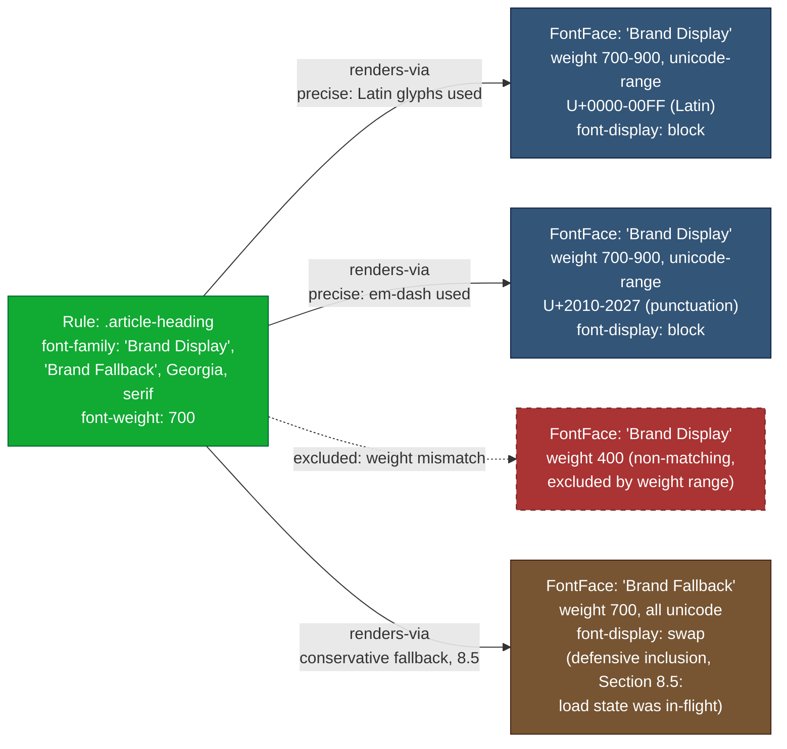

# 503 — Font Faces Dependency Resolution

## 1. Title

**Critical CSS Extraction Engine — `@font-face` Dependency Resolution Algorithm**

## 2. Version

| Field | Value |
|---|---|
| Document Version | 1.0.0 |
| Status | Draft — Phase 7 (Dependency Resolution) |
| Last Updated | 2026-07-09 |
| Owners | Core Architecture Working Group |
| Stability | Algorithm-level; depends on the node/edge taxonomy frozen in `docs/architecture/014-Dependency-Graph.md` and coordinates with `502-Keyframes.md`'s shared "conservative vs. precise inclusion" framing |

## 3. Purpose

This document specifies the algorithm the Dependency Resolver uses to answer: *given a matched `Rule` node whose computed `font-family` resolves (through a fallback stack) to one or more custom web font names, which `@font-face` at-rule(s) must be retained in the critical CSS output for the matched element's text to render with the correct glyphs, at the correct weight, style, and stretch, without a flash of unstyled or incorrectly-styled text?*

`@font-face` resolution is structurally the most involved of the six per-construct discovery routines this Phase 7 documentation set specifies, for a reason that has no close analogue among variables, keyframes, `@property`, counters, or layers: **a single `font-family` name does not identify a single `@font-face` rule.** It identifies a *family*, and the browser itself performs a secondary matching process — informally, "font matching" — across every `@font-face` rule declaring that family, selecting among them by `font-weight` range, `font-style`, `font-stretch`, and (per-glyph) `unicode-range`, to decide which physical font resource, if any, actually renders any given character of text. A heading styled `font-family: "Brand Sans"` with `font-weight: 700` might be served by one `@font-face` rule if the text is entirely Latin script and by an entirely different `@font-face` rule — declaring the same family name, the same weight, but a different `unicode-range` — if a single CJK character appears in an otherwise-Latin heading. This document treats font matching as a first-class resolution concern, not an incidental detail, and specifies both a conservative (include-everything-for-the-family) and a precise (match-against-actually-rendered-glyphs) strategy, with an explicit recommendation for which the engine adopts by default and why.

## 4. Audience

- Implementers of the `DependencyDiscoverer` component (`packages/dependency-graph`) building the `FontFace` discovery routine referenced generically in `docs/architecture/014-Dependency-Graph.md` Section 9.2.
- Implementers of the Visibility Engine and Selector Matcher, whose upstream computed-style and glyph-visibility data (conceptually, "which characters actually render" per `docs/design/200-Visibility-Engine-Overview.md`) this algorithm's precise-matching mode depends on.
- Authors of `docs/algorithms/507-Dependency-Graph-Construction.md`, assembling this routine into the unified fixed-point loop.
- Authors of `docs/design/600-Serialization-Overview.md` and its children, who must understand `font-display`'s interaction with critical-path CSS decisions (Section 8.6) when deciding output ordering and preload hints.
- Senior engineers auditing web-font correctness (FOIT/FOUT behavior, glyph coverage) in critical CSS output.

Readers are assumed to be comfortable with the CSS Fonts Module Level 4 font-matching algorithm, the CSSOM `CSSFontFaceRule` interface, the `document.fonts` (CSS Font Loading) API, and the general fixed-point resolution model established in `docs/architecture/014-Dependency-Graph.md`. This is not an introduction to web font loading.

## 5. Prerequisites

- [BRIEF.md](../../BRIEF.md) Section 2.5 ("Dependency Resolution") and Section 4 (Global Rules).
- [014-Dependency-Graph.md](../architecture/014-Dependency-Graph.md) — the `FontFace` node kind (Section 8.1, keyed by `(font-family, unicode-range, font-weight range, font-style)`), the `renders-via` edge kind (Section 8.2), and the fixed-point resolution loop (Section 8.6) this algorithm plugs into. Also Section 12's existing edge-case note on fallback-chain resolution, which this document expands into a full algorithm.
- [500-Dependency-Resolution-Overview.md](../design/500-Dependency-Resolution-Overview.md) — the Phase 7 module-level design this document is a child of.
- [502-Keyframes.md](./502-Keyframes.md) — sibling algorithm; this document's Section 13 tradeoff table directly parallels its "conservative vs. precise" framing and should be read alongside it for the shared design philosophy.
- Familiarity with the CSS Fonts Module Level 4 font-matching algorithm (family → weight/style/stretch → `unicode-range` per-glyph fallback) and with `font-display`'s FOIT/FOUT/FOFT timeline semantics.

## 6. Related Documents

- [014-Dependency-Graph.md](../architecture/014-Dependency-Graph.md) — architectural contract for the `FontFace` node and `renders-via` edge.
- [500-Dependency-Resolution-Overview.md](../design/500-Dependency-Resolution-Overview.md) — parent design document.
- [501-CSS-Variables.md](./501-CSS-Variables.md) — variable resolution, relevant when `font-family` itself is `var()`-driven (Section 8.5, analogous to `502-Keyframes.md`'s compound case).
- [502-Keyframes.md](./502-Keyframes.md) — sibling algorithm; shares this document's conservative-vs-precise tension and `renders-via` edge kind.
- [504-At-Property.md](./504-At-Property.md), [505-Counters.md](./505-Counters.md), [506-Cascade-Layers.md](./506-Cascade-Layers.md) — sibling per-construct algorithms.
- [507-Dependency-Graph-Construction.md](./507-Dependency-Graph-Construction.md) — umbrella construction algorithm.
- [508-Cycle-Detection.md](./508-Cycle-Detection.md) — confirms `renders-via` edges are out of cycle-detection scope.
- [200-Visibility-Engine-Overview.md](../design/200-Visibility-Engine-Overview.md) — conceptual source of "which text is actually visible/rendered above the fold," relevant to precise glyph-based matching (Section 8.4).
- [600-Serialization-Overview.md](../design/600-Serialization-Overview.md) — downstream consumer of `font-display` and ordering decisions from Section 8.6.

## 7. Overview

A matched `Rule` node's declaration block may include a `font-family` value naming one or more fonts in a fallback stack (`font-family: "Brand Sans", "Helvetica Neue", sans-serif`). The algorithm's job, invoked once per matched `Rule` node during the fixed-point discovery loop (`014-Dependency-Graph.md` Section 8.6), is:

1. Determine the resolved `font-family` fallback stack for the matched element, via `getComputedStyle`, and — critically, per `014-Dependency-Graph.md` Section 12's existing edge-case note — determine which entry in that stack is *actually* the one rendering, using `document.fonts` introspection, not merely assume the first-listed family always wins.
2. For each family name in the stack that corresponds to a custom, `@font-face`-declared family (as opposed to a generic keyword like `sans-serif` or a locally-installed system font with no `@font-face` backing), locate the candidate `@font-face` rule(s) declaring that family in the CSSOM Walker's at-rule registry.
3. Decide, per the conservative-vs-precise policy fork (Section 8.4), whether to retain *all* `@font-face` rules for that family or only the subset whose `font-weight`/`font-style`/`font-stretch`/`unicode-range` actually matches the rendered text.
4. Emit `FontFace` nodes and `renders-via` edges accordingly.
5. Record `font-display` metadata on the emitted `FontFace` node for downstream consumption by the Serializer's critical-path ordering decisions (Section 8.6).

Like `502-Keyframes.md`, this is architecturally a "one hop deep" discovery routine per `014-Dependency-Graph.md` Section 8.2's `renders-via` scoping — but unlike keyframes resolution, where exactly one winner is selected per name, font-face resolution routinely fans out to *multiple* simultaneously-relevant `@font-face` nodes per matched rule, because a real render can legitimately draw glyphs from several `@font-face` rules at once (different `unicode-range` partitions of the same logical family) or from several fallback-stack entries at once (if the primary custom font fails to load in time and `font-display` policy causes a fallback web font to render instead, for some or all text).

## 8. Detailed Design

### 8.1 Resolving the Effective Font-Family Fallback Stack

`getComputedStyle(matchedElement).fontFamily` returns the full, comma-separated fallback stack exactly as authored (browsers do not collapse it to a single resolved family at the computed-style level, unlike `animation-name`'s full substitution in `502-Keyframes.md` Section 8.1 — `font-family`'s cascade-level computation is substitution-of-variables-only; the *actual* family-selection-and-fallback process happens later, at font-matching/layout time, not at style-computation time). This means the algorithm cannot, as it could for keyframes, simply read one authoritative resolved value and stop — it must inspect every entry in the stack and determine, separately, which entries are:

- **Generic family keywords** (`serif`, `sans-serif`, `monospace`, `cursive`, `fantasy`, `system-ui`, `math`) — never backed by an `@font-face` rule, always excluded from lookup.
- **Named families with no matching `@font-face` rule anywhere in the corpus** — presumed to be locally-installed system fonts (e.g., `"Helvetica Neue"`, `"Segoe UI"`); excluded from lookup, since there is nothing to retain — the browser resolves these via the OS font store, entirely outside the CSS dependency graph's concern.
- **Named families with a matching `@font-face` rule** — the actual subject of this algorithm's remaining steps.

The generic-keyword and no-match exclusions are structural filters against the CSSOM Walker's `@font-face` registry (an O(1) membership check per stack entry, analogous to `502-Keyframes.md` Section 8.2's registry lookup), not heuristic guesses — if a family name has zero `@font-face` rules declaring it anywhere in the traversed stylesheets, it is definitionally a system/generic font as far as this graph is concerned, regardless of whether it happens to also be installed locally.

### 8.2 Determining Which Fallback Entry Actually Rendered

Per `014-Dependency-Graph.md` Section 12's existing edge-case note, "if 'Custom Font' fails to load... but 'Fallback Web Font' is itself also an `@font-face`-declared web font, the graph must still discover and retain the `FontFace` node for 'Fallback Web Font,' since it is the one actually rendering." This requires more than reading the first stack entry: the algorithm queries `document.fonts` (the CSS Font Loading API) for the actual `FontFace` objects loaded and in the `'loaded'` state at the moment the DOM/CSSOM snapshot was captured (per the same stabilized-snapshot discipline `014-Dependency-Graph.md` Section 12 requires for `MediaQuery`/`ContainerQuery` truth values), and cross-references which stack entries correspond to successfully-loaded fonts versus ones still `'unloaded'`/`'error'`.

Because font loading is asynchronous and load state can differ from element to element depending on `font-display` and network timing (a font that failed to load in time for one element's first paint might have finished loading by the time a later element needing the same family is painted, if the extraction pipeline's navigation-stabilization step, per `docs/design/104-Rendering-Stabilization.md`, waits long enough), the algorithm does not treat "which font rendered" as a single global fact — it is evaluated **per matched rule**, using the render state of the specific matched element at snapshot time. This is consistent with treating the browser's own font-application behavior, not a static textual reading of the `font-family` stack, as the source of truth (Principle 1, `docs/architecture/006-Design-Principles.md`).

Two outcomes follow from this per-element check:

1. **Primary custom font loaded successfully.** The first `@font-face`-backed stack entry is the one to resolve dependencies for; subsequent fallback entries are not currently rendering for this element, but see Section 8.6 for whether they should still be conservatively retained against a future navigation where load timing differs.
2. **Primary custom font failed or had not finished loading by paint time, and a fallback web font (itself `@font-face`-backed) rendered instead.** The fallback entry actually rendering must be resolved and retained — and, depending on the conservative-vs-precise policy (Section 8.4), the primary font's `@font-face` rule may also need to be retained, since a *subsequent* navigation/cache-state (a warm cache on a repeat visit) could easily result in the primary font loading successfully in time, making it the one that needs to be present in critical CSS for that visit.

### 8.3 The Font-Matching Sub-Algorithm — Weight, Style, Stretch, and Unicode-Range

Once a target family name is confirmed to have `@font-face` backing (Section 8.1) and confirmed relevant to a given matched element (Section 8.2), the algorithm must determine *which* `@font-face` rule(s) declaring that family actually supply the glyphs for this element's text — because, as this document's Purpose section states, multiple `@font-face` rules commonly share one family name while partitioning weights, styles, and Unicode code-point ranges among themselves. This is the CSS Fonts Module Level 4 font-matching algorithm, and — consistent with every other resolution routine in this document set — the engine does not re-implement it; it queries the browser.

The relevant computed-style facts for the matched element are `font-weight` (a resolved numeric value, even if the author used a keyword like `bold`), `font-style` (`normal`/`italic`/`oblique <angle>`), and `font-stretch` (a resolved percentage). Each `@font-face` candidate declaring the target family carries its own `font-weight` (a single value or a `<min> <max>` range, per the CSS Fonts 4 range syntax), `font-style` (similarly rangeable for oblique angles), `font-stretch` range, and `unicode-range` (a set of Unicode code-point range tokens, defaulting to `U+0-10FFFF`, i.e., "all code points," when omitted).

Weight/style/stretch matching against the computed values narrows the candidate set to those `@font-face` rules whose ranges contain the element's resolved values — this part of font matching is not per-glyph and can be resolved once per (family, computed-style-triple) combination. `unicode-range` matching, by contrast, is **inherently per-character**: a single element's text content can require glyphs from more than one `unicode-range` partition simultaneously (a heading mixing Latin and an em-dash character that happens to fall in a separate `unicode-range`-partitioned `@font-face` rule for punctuation, or genuinely mixed-script text). The algorithm therefore does not select a single winning `@font-face` rule the way `502-Keyframes.md` Section 8.3 selects a single winning `@keyframes` rule — it selects a **set**, one member per distinct code-point partition actually exercised by the element's rendered text, intersected with the weight/style/stretch-matched candidate subset.

### 8.4 The Core Policy Fork — Conservative Inclusion vs. Precise Glyph-Aware Matching

This is the central design decision this document must make explicit, because it trades output size against a data dependency the engine may or may not have reliable access to at the point this algorithm runs.

**Conservative strategy.** Include every `@font-face` rule anywhere in the corpus that declares the target family name and satisfies the weight/style/stretch-range match (Section 8.3's non-per-glyph half), regardless of `unicode-range`. This guarantees no glyph the element could ever render (for any character its text content might contain, including characters not present in the specific above-fold snapshot but potentially present after, say, a client-rendered i18n string substitution or a truncated-text expansion) will ever be missing a backing `@font-face` rule in the critical CSS output. Its cost is retaining `@font-face` rules — and, transitively, the `src` font resource references they name, though the engine's scope per `docs/architecture/003-Requirements.md` is CSS retention, not font-binary bundling — for `unicode-range` partitions that may never actually be exercised by the above-fold content, at the cost of a browser potentially issuing additional font-file network requests for those unused partitions if `font-display` policy causes eager loading (Section 8.6).

**Precise strategy.** Walk the actual rendered text content of the matched element (and, if inline-level formatting requires it, its rendered text runs after line-breaking — though the engine treats this as a character-set membership question, not a layout question, so line-breaking specifics do not matter) to determine which Unicode code points are actually present, then intersect that code-point set against each candidate `@font-face` rule's `unicode-range` to retain only genuinely-exercised partitions. This produces materially smaller critical CSS for typography-heavy pages using large icon-font-style `@font-face` families partitioned into many narrow `unicode-range` slices (a common pattern for multilingual sites serving separate `@font-face` rules per script), at the cost of requiring reliable, snapshot-time access to the element's actual rendered text content — data that is conceptually available from the same DOM Collector / Visibility Engine snapshot that already determined which elements are above-fold (per `docs/design/200-Visibility-Engine-Overview.md` and `docs/design/106-DOM-Snapshot.md`), but which this document does not itself define the extraction mechanism for; it treats "the set of Unicode code points present in this element's rendered text at snapshot time" as a fact supplied by that upstream snapshot data, tied conceptually rather than mechanically (this document does not re-specify DOM text extraction).

The engine adopts **precise matching as the default, with conservative inclusion as an explicit, per-run configurable fallback** — the mirror image of `502-Keyframes.md`'s default policy for the analogous "does this animation name have exactly one determinable value" question, and the mirror image because the two situations have opposite risk profiles: an under-included `@keyframes` block produces a visibly broken animation (an obvious, easily-flagged-in-visual-regression failure), whereas an under-included `@font-face` `unicode-range` partition produces, at worst, a fallback font substitution for a handful of characters not present at snapshot time but potentially appearing later (e.g., dynamically inserted internationalized content) — a comparatively low-severity, self-healing-at-next-paint failure mode once the non-critical CSS loads. Because the failure mode is milder, the engine can afford to default to the size-optimized strategy, whereas `502-Keyframes.md` cannot. This default is configurable per REQ-203's fallback-chain-inclusion language and per `docs/architecture/006-Design-Principles.md`'s general configurability principle, and engineering teams operating pages with highly dynamic, unpredictable post-load text content (chat widgets, live-updating dashboards) are expected to switch to the conservative policy for those routes.

### 8.5 Font Stacks with Multiple Custom-Font Fallback Names

`font-family: "Brand Display", "Brand Fallback", "Georgia", serif` — where both `"Brand Display"` and `"Brand Fallback"` are `@font-face`-backed — requires the algorithm to potentially resolve dependencies for **more than one** fallback-stack entry, not just whichever one is currently rendering (Section 8.2). The governing question, per Section 8.4's chosen precise-by-default policy with conservative fallback available, is the same load-outcome-sensitivity question raised in Section 8.2: should the engine retain only the currently-winning entry, or defensively retain the next fallback entry too, in case a different navigation's load-timing outcome makes it the winner instead?

The engine's answer, consistent with its overall precise-by-default posture, is to retain **the currently-winning entry's matched `@font-face` set precisely (Section 8.3/8.4), and every prior, higher-priority fallback-stack entry's `@font-face` set conservatively (Section 8.4's conservative mode, regardless of the run's global default) whenever that higher-priority entry is `@font-face`-backed and its load outcome is `'unloaded'` or in-flight at snapshot time** — because a higher-priority entry that has not yet resolved one way or the other is, by definition, still capable of becoming the winner under different timing, and the "self-healing at next paint" mitigation that justifies precise-by-default for `unicode-range` partitioning (Section 8.4) does not apply symmetrically here: if the *primary* font finishes loading a moment after critical CSS is already painted without its `@font-face` rule present, the visual result is a jarring, visible font swap exactly at the boundary between critical and non-critical CSS taking effect — a worse user-visible outcome than the steady-state `unicode-range` under-inclusion case. Fallback-stack entries confirmed `'error'` (a definitive load failure, not merely in-flight) at snapshot time are excluded even from this defensive inclusion, since a definitive failure cannot un-happen on the same page load, though it could on a subsequent navigation — which the engine treats as out of scope for a single extraction run, consistent with `014-Dependency-Graph.md` Section 12's snapshot-stability discipline.

### 8.6 `font-display` Interaction with Critical-Path Decisions

`font-display` (`auto`, `block`, `swap`, `fallback`, `optional`) governs the browser's own FOIT/FOUT timeline for a given `@font-face` rule — how long it blocks text rendering (the "block period") waiting for the font to load before falling back, and how long after that it will still swap in the custom font if it finishes loading late (the "swap period," absent for `block` policy fonts... conceptually, and absent entirely for `optional`). This is not, strictly, a *dependency-existence* question (a `@font-face` rule with `font-display: optional` is exactly as much a real dependency of a matched rule as one with `font-display: block`, if the matched rule's text uses that family) — but it is metadata this algorithm must attach to the `FontFace` node it emits, because it directly affects two downstream decisions outside this algorithm's own scope:

- **Serializer ordering / preload hints** (`docs/design/600-Serialization-Overview.md` and children): a `font-display: block`-policy `@font-face` rule for an above-fold heading is a much stronger candidate for an emitted `<link rel="preload">` hint or early placement in the critical CSS bundle than a `font-display: optional` one, since the former can visibly block first paint of that text for up to the browser's block-period ceiling if the resource is not prioritized, while the latter is architecturally permitted to never apply at all if the resource is not cached-and-ready near-instantly.
- **Reporter diagnostics** (REQ-460/461 per `014-Dependency-Graph.md`): explaining "why is this `@font-face` rule critical" is materially more useful to a page-performance-focused reader when it also surfaces "and it uses `font-display: block`, so it is actively contributing to font-blocking behavior on this route," versus a `font-display: optional` rule whose presence in critical CSS is more about correctness-if-cached than about blocking-risk.

This algorithm therefore reads `font-display`'s resolved value directly off the `CSSFontFaceRule`'s declaration block (a straightforward, single-property read requiring no browser-behavior arbitration the way `animation-name`/shorthand extraction did in `502-Keyframes.md` — `font-display` has no shorthand form and no ambiguity) and stores it as a `fontDisplay` field on the emitted `FontFace` node, without itself making the preload/ordering decision, which belongs downstream to the Serializer per that document's own tradeoffs.

## 9. Architecture

### 9.1 Position in the Dependency Resolver Pipeline

```mermaid
flowchart LR
    SM[Selector Matcher] -->|MatchedRule seed| DR[Dependency Resolver]
    DR -->|dequeue Rule node| FFD[Font-Face Discovery Routine<br/>this document]
    FFD -->|getComputedStyle().fontFamily<br/>full fallback stack| Browser[(Live Browser Context)]
    FFD -->|document.fonts introspection,<br/>Section 8.2| Browser
    FFD -->|if var()-derived: consult| VarAlgo[501-CSS-Variables.md<br/>resolution output]
    FFD -->|rendered text code points,<br/>Section 8.4 precise mode| Snapshot[(DOM/Visibility Snapshot<br/>200-Visibility-Engine-Overview.md)]
    FFD -->|FontFace node(s) + renders-via edges,<br/>fontDisplay metadata| Graph[(DependencyGraph)]
```

### 9.2 Font-Family-to-Multiple-@font-face Dependency Fan-Out

The following diagram shows the characteristic fan-out shape of font-face resolution for a representative matched rule whose text mixes scripts, whose primary custom font partially failed to load, and whose stack includes a second `@font-face`-backed fallback.



Note the fan-out to two simultaneously-included `FontFace` nodes for a single family name (`FF1`, `FF2`) driven by per-glyph `unicode-range` partitioning (Section 8.3) — the defining structural difference from `502-Keyframes.md`'s single-winner model — alongside a weight-mismatched candidate excluded outright (`FF3`) and a defensively-included fallback-stack entry (`FF4`, per Section 8.5) whose inclusion reason differs from `FF1`/`FF2`'s (load-timing risk, not glyph coverage).

## 10. Algorithms

### 10.1 Algorithm: Resolve Font-Face Dependencies for a Matched Rule

**Problem statement.** Given a matched `Rule` node and its associated DOM element, determine the complete set of `@font-face` at-rules that must be retained for the element's text to render with correct glyph coverage, weight, and style — across the element's full fallback stack, accounting for actual font-load outcomes and (in precise mode) actual rendered code-point coverage — and emit the corresponding `FontFace` nodes and `renders-via` edges.

**Inputs.** `ruleNode: GraphNode` (kind `Rule`); `matchedElement: Element`; `fontFaceRegistry: Map<string, CSSFontFaceRule[]>` (from the CSSOM Walker's at-rule registry, keyed by family name); `browserContext` (live page handle for `document.fonts` and computed-style queries); `renderedCodePoints: Set<number> | null` (from the Visibility Engine / DOM snapshot, supplied only when precise mode is active); `matchingMode: 'precise' | 'conservative'` (per-run configuration, Section 8.4).

**Outputs.** `{ newNodes: GraphNode[], newEdges: GraphEdge[] }` — zero or more `FontFace` nodes and `renders-via` edges.

**Pseudocode.**

```text
function discoverFontFaceDependencies(ruleNode, matchedElement, fontFaceRegistry,
                                       browserContext, renderedCodePoints, matchingMode)
    -> DiscoveryResult:

    result = DiscoveryResult.empty()

    stack = browserContext.getComputedStyle(matchedElement).fontFamily
        .split(',').map(trim)   // full fallback stack, no substitution collapse for font-family

    resolvedComputedFonts = browserContext.documentFonts.getLoadedFontsFor(matchedElement)
        // per Section 8.2: which FontFace objects (Font Loading API) are actually
        // 'loaded' and applicable to this element's computed style, in stack priority order

    winningEntryIndex = findFirstEntryIndexPresentIn(stack, resolvedComputedFonts)
        // the highest-priority stack entry that is @font-face-backed AND currently loaded;
        // -1 if none (pure system/generic font stack, or nothing loaded yet)

    for index, familyName in stack:
        if isGenericKeyword(familyName):
            continue

        candidates = fontFaceRegistry.get(familyName) ?? []
        if candidates.isEmpty():
            continue   // system/local font, not a graph dependency (Section 8.1)

        computedStyle = browserContext.getComputedStyle(matchedElement)
        weightStyleMatched = candidates.filter(c =>
            rangeContains(c.fontWeightRange, computedStyle.fontWeight) and
            rangeContains(c.fontStyleRange, computedStyle.fontStyle) and
            rangeContains(c.fontStretchRange, computedStyle.fontStretch)
        )

        if index == winningEntryIndex:
            // currently rendering entry: apply matching-mode policy fully (Section 8.4)
            selected = selectByPolicy(weightStyleMatched, renderedCodePoints, matchingMode)
        elif index < winningEntryIndex or winningEntryIndex == -1:
            // higher-priority entry not (yet) winning: defensive inclusion (Section 8.5)
            loadState = browserContext.documentFonts.getLoadStateFor(familyName, computedStyle)
            if loadState == 'error':
                continue   // definitively failed this navigation; not retained
            selected = selectByPolicy(weightStyleMatched, codePoints = null, mode = 'conservative')
                // always conservative for at-risk higher-priority entries, regardless of global mode
        else:
            // lower-priority than the winner and not currently applicable: skip
            continue

        for ffRule in selected:
            ffNodeId = makeFontFaceNodeId(familyName, ffRule.unicodeRange,
                                           ffRule.fontWeightRange, ffRule.fontStyleRange)
            if not graph.hasNode(ffNodeId):
                ffNode = makeFontFaceNode(ffRule, discoveredAt = 'transitive',
                                           fontDisplay = ffRule.fontDisplay)
                result.newNodes.push(ffNode)
            result.newEdges.push(makeEdge(ruleNode.id, ffNodeId, kind = 'renders-via'))

    return result


function selectByPolicy(weightStyleMatched, codePoints, mode) -> CSSFontFaceRule[]:
    if mode == 'conservative' or codePoints == null:
        return weightStyleMatched   // Section 8.4 conservative: all weight/style-matched candidates
    // precise mode (Section 8.3/8.4): intersect by unicode-range against actually-rendered code points
    return weightStyleMatched.filter(c =>
        codePoints.exists(cp => unicodeRangeContains(c.unicodeRange, cp))
    )
```

**Time complexity.** Let `f` be the fallback-stack length (typically 2–5) and `c` be the maximum number of `@font-face` candidates for any one family name (bounded by design-system font-partitioning practice, typically single-digit to low double-digit for heavily-`unicode-range`-partitioned families). Weight/style/stretch filtering is `O(c)` per stack entry; precise-mode `unicode-range` intersection is `O(c × |codePoints|)` per entry, where `|codePoints|` is the distinct code-point count in the element's rendered text (bounded by text length, in practice small for above-fold headings/labels). Total: `O(f × c × |codePoints|)` per matched rule, dominated by browser-round-trip cost for `document.fonts` queries in real deployments, consistent with `014-Dependency-Graph.md` Section 10.1's general cost characterization.

**Memory complexity.** `O(f × c)` new nodes/edges in the worst case per matched rule; in practice bounded much lower since most stack entries are either generic keywords (Section 8.1, zero cost) or resolve to a small selected subset.

**Failure cases.** `document.fonts` unavailable in the browser context (extremely rare in evergreen engines; falls back to treating `winningEntryIndex` as always the first `@font-face`-backed entry, i.e., conservative-by-necessity); `renderedCodePoints` unavailable from the upstream snapshot (falls back to conservative mode for that rule regardless of global `matchingMode` configuration, per the graceful-degradation principle this document shares with `502-Keyframes.md` Section 8.6); a family name matching zero candidates after weight/style/stretch filtering despite matching the family-name registry (a real `@font-face` exists for the family but none of its weight/style variants match — correctly produces zero `FontFace` nodes for that stack entry, falling through to the next stack entry, mirroring actual browser font-matching fallback behavior).

**Optimization opportunities.** Memoize weight/style/stretch filtering by `(familyName, computedWeight, computedStyle, computedStretch)` tuple across matched rules sharing identical computed font properties (common across many same-styled elements, e.g., every `<p>` in body copy); batch `document.fonts` load-state queries for multiple families into a single `page.evaluate()` wave, mirroring `014-Dependency-Graph.md` Section 10.1's generic batching guidance.

### 10.2 Algorithm: Rendered Code-Point Extraction (Precise Mode Input)

**Problem statement.** Determine the set of distinct Unicode code points actually present in a matched element's rendered text content, for use as the precise-mode `unicode-range` intersection input in Section 10.1.

**Inputs.** `matchedElement: Element`; `visibilitySnapshot` (the stabilized DOM/text-content snapshot conceptually supplied by the Visibility Engine / DOM Collector, per `docs/design/200-Visibility-Engine-Overview.md` and `docs/design/106-DOM-Snapshot.md` — this algorithm does not itself define snapshot extraction mechanics).

**Outputs.** `Set<number>` — distinct Unicode code points.

**Pseudocode.**

```text
function extractRenderedCodePoints(matchedElement, visibilitySnapshot) -> Set<number>:
    textContent = visibilitySnapshot.renderedTextFor(matchedElement)
        // text as actually laid out/visible at snapshot time, not raw textContent,
        // since display:none descendants or ::before/::after generated content
        // with a different font-family should not contaminate this element's set

    codePoints = new Set()
    for character in textContent.iterateByCodePoint():   // surrogate-pair-aware iteration
        codePoints.add(character.codePointAt(0))

    return codePoints
```

**Time complexity.** `O(|textContent|)` per matched element, linear in visible text length — negligible relative to browser round-trip costs elsewhere in this algorithm.

**Memory complexity.** `O(|distinct code points|)`, bounded by text length and typically very small for above-fold headings/labels.

**Failure cases.** Generated content (`::before`/`::after` with `content: attr(...)` or dynamic `content` values not resolvable from static snapshot data) may be undercounted if the snapshot mechanism does not already resolve generated-content text — this is a limitation of the upstream snapshot, not of this extraction routine, and is documented here as a dependency rather than solved in this document (see Section 12).

**Optimization opportunities.** None beyond the linear scan itself; this is cheap relative to every other cost center in this algorithm.

## 11. Implementation Notes

- `document.fonts`-based load-state introspection (Section 8.2) must be queried at the same stabilized-snapshot instant used for selector matching and all other computed-style queries in this pipeline (per `014-Dependency-Graph.md` Section 12's snapshot-stability discipline) — querying it lazily, at an arbitrary later point during the fixed-point loop, risks observing a font transition mid-resolution that the rest of the graph's computed-style facts do not reflect, producing an internally inconsistent graph.
- `FontFace` node IDs (per `014-Dependency-Graph.md` Section 8.1's stated key, `(font-family, unicode-range, font-weight range, font-style)`) must be derived purely from the `@font-face` rule's own declared range values, never from which matched rule discovered them — this is what allows two different matched rules (e.g., a heading and a byline both using `"Brand Display"` at different weights) to correctly collapse to the same `FontFace` node when they happen to match the identical weight/style/unicode-range partition, and to correctly diverge into distinct nodes when they match different partitions of the same family.
- The precise-mode code-point intersection (Section 10.2) should treat its snapshot dependency as an injected interface, not a hard compile-time dependency on the Visibility Engine's internal data structures — per this document's Audience section, the tie to visibility/computed-style data from earlier phases is conceptual; the concrete DTO shape crossing that boundary belongs to `docs/architecture/016-Data-Flow.md` and `docs/design/106-DOM-Snapshot.md`, not to this document.
- `getComputedStyle(...).fontFamily`'s comma-split (Section 10.1) must be quote-aware — family names containing commas are only possible when quoted (`font-family: "A, B", sans-serif` is one two-entry stack, not three), so a naive `split(',')` without quote-awareness will misparse; this is a narrowly-scoped, well-tested lexical operation on browser-returned, already-serialized text, not the kind of decisional parsing Principle 2 warns against (the browser has already resolved which text is the serialized `font-family` value; splitting a quoted CSS list is mechanical, not semantic).
- `font-display` metadata (Section 8.6) must be forwarded to the Serializer unmodified as a `FontFace` node field — this document's routine does not compute a preload/ordering decision from it, only records it, keeping the separation of concerns between dependency *existence* (this document) and dependency *treatment in output* (`docs/design/600-Serialization-Overview.md`) intact.

## 12. Edge Cases

- **Generated content (`::before`/`::after`) with its own, distinct `font-family`.** A pseudo-element can declare a different `font-family` from its originating element and can itself be a "matched rule" with its own `Rule` node in the graph (per `docs/design/402-Pseudo-Elements.md`) — this algorithm treats such pseudo-element rules identically to ordinary element rules, resolving `font-family` and rendered code points (Section 10.2) against the pseudo-element's own generated `content` text, not the originating element's text; a naive implementation that resolves font-face dependencies only for real DOM elements would silently miss icon-font `::before` glyphs, a common real-world pattern this document explicitly must not regress.
- **Unquoted, keyword-colliding family names.** `font-family: Georgia, serif;` — `serif` here is a generic keyword and correctly excluded (Section 8.1); but an author-defined `@font-face` rule with `font-family: Serif` (capitalized, a legal but confusing custom name) is a distinct, case-sensitive-per-CSSOM-but-case-insensitive-per-ASCII-CSS-matching family from the keyword `serif` — the registry lookup (Section 8.1) must use the same ASCII-case-insensitive family-name comparison the browser itself uses for `font-family` matching, not a case-sensitive string key, or it will either wrongly match the generic keyword against a custom rule or wrongly fail to match a validly-cased custom rule.
- **`unicode-range` gaps and overlaps across a family's `@font-face` partitions.** Authors sometimes leave gaps (no `@font-face` rule covers a given code point at all for a family) or accidental overlaps (two rules both claim the same code point range) — a gap means precise mode correctly finds zero matching `FontFace` candidates for that specific code point's `@font-face` half, which is not a bug in this algorithm but a genuine authoring gap the browser itself would also fail to serve custom-font glyphs for (falling through to the next fallback-stack entry); an overlap means precise mode may include more than one `FontFace` node for the same code point, which is technically slightly conservative within the "precise" mode but unavoidable without re-implementing the browser's own first-match-wins `unicode-range` resolution order, which this document deliberately does not attempt to replicate exactly (a minor, accepted imprecision — see Section 13).
- **Variable fonts (`font-variation-settings`, single `@font-face` rule spanning a continuous weight/stretch axis via `font-weight: 100 900`).** A single `@font-face` rule with a wide declared weight range can back many different rendered weights simultaneously (every `font-weight` value a matched rule anywhere on the page uses, from 100 to 900) — this is not a fan-out to multiple `FontFace` *nodes* the way `unicode-range` partitioning is; it is correctly represented as a single `FontFace` node whose declared range happens to be wide, matched by many different matched `Rule` nodes' `renders-via` edges converging on the same node, exactly as `014-Dependency-Graph.md`'s node-deduplication-by-structural-key design already handles.
- **Cross-origin `@font-face` `src` resources.** This algorithm's scope is CSS-rule retention, not the referenced font *binary*'s reachability — a `@font-face` rule pointing at a cross-origin font file is retained in the dependency graph identically to a same-origin one; cross-origin resource-loading concerns (CORS, network restrictions) are the province of `docs/architecture/003-Requirements.md`'s Security section (BRIEF.md Section 2.16) and are out of scope here, noted only so a reader does not expect this document to resolve them.
- **Shadow DOM font-face scoping.** Like `@keyframes` (per `502-Keyframes.md` Section 12) and unlike custom properties, `@font-face` declarations inside a shadow root's stylesheet are scoped to that shadow tree; a matched element inside a shadow root resolving `font-family` against a shadow-tree-local `@font-face` registry must not accidentally match a same-named light-DOM `@font-face` rule instead, requiring the same shadow-tree-aware registry partitioning `502-Keyframes.md` Section 12 specifies for keyframes.
- **Future CSS: `@font-palette-values` and COLR color-font palette selection.** Not currently modeled as a graph construct at all; a matched rule using `font-palette: --custom-palette` on a color font has an additional dependency this document's node taxonomy does not yet capture — flagged in Future Work rather than retrofitted here, consistent with `014-Dependency-Graph.md` Section 8.1's precedent of deferring not-yet-stable constructs (view transitions, scroll timelines) rather than prematurely committing to a schema.

## 13. Tradeoffs

| Decision | Why | Alternative Considered | Tradeoff Accepted |
|---|---|---|---|
| Default to precise, glyph-aware `unicode-range` matching (Section 8.4) rather than conservative include-everything | The failure mode of under-inclusion here (fallback-font substitution for a handful of not-yet-seen characters, self-healing once non-critical CSS loads) is materially milder than the equivalent under-inclusion failure mode in `502-Keyframes.md` (a visibly broken, non-self-healing animation), so the size-optimized default is affordable here in a way it is not there | Always conservative-include every same-family `@font-face` rule regardless of glyph usage, matching `502-Keyframes.md`'s asymmetric caution | Materially smaller critical CSS for `unicode-range`-partitioned font families, at the cost of requiring reliable rendered-text/code-point data from the Visibility Engine snapshot, and at the cost of a rare, low-severity FOUT-adjacent flash for genuinely-dynamic post-load text |
| Asymmetric defensive-inclusion policy for at-risk *higher-priority fallback-stack entries* (Section 8.5) even when the run's global mode is precise | A primary custom font finishing its load a moment after critical CSS has already painted, without its `@font-face` rule present, produces a jarring visible font swap exactly at the critical/non-critical CSS boundary — a worse outcome than `unicode-range` under-inclusion's self-healing failure mode, so this specific sub-case earns its own, stricter policy regardless of the global default | Apply the global `matchingMode` uniformly to every fallback-stack entry, including at-risk higher-priority ones | Slightly more complex per-entry policy logic (Section 10.1's `if index == winningEntryIndex` branch), in exchange for avoiding a specifically jarring, boundary-timed visual regression that the milder global-default rationale does not actually cover |
| Model `unicode-range` fan-out as multiple simultaneous `renders-via` edges from one `Rule` node, rather than a single-winner model like `502-Keyframes.md`'s | Font matching is genuinely per-glyph and multi-source for a single element's rendered text, unlike keyframe-name resolution which is genuinely single-valued per name; forcing a single-winner model here would be factually wrong, not merely a simplification | Select one "primary" `@font-face` rule per family per matched rule and ignore `unicode-range` partitioning entirely | Requires this document's discovery routine to be more structurally complex than `502-Keyframes.md`'s (a filter-and-intersect step rather than a sort-and-take-last step), accepted because the underlying CSS mechanism is genuinely more complex, not because of an arbitrary design preference |
| Treat cross-origin `@font-face` `src` resource reachability as out of scope for this algorithm | This document's responsibility, per `docs/architecture/003-Requirements.md`, is CSS-rule dependency retention, not binary asset delivery; conflating the two would duplicate concerns already owned by the Security section of the requirements doc (BRIEF.md Section 2.16) | Have this algorithm also validate/flag unreachable cross-origin font resources during dependency resolution | A `@font-face` rule can be "correctly retained" by this algorithm's logic while its referenced font binary is unreachable at serve time — accepted as a layering boundary, not a gap this document should close |

## 14. Performance

- **CPU complexity.** Per Section 10.1, `O(f × c × |codePoints|)` per matched rule — bounded in practice by small fallback-stack lengths, small per-family candidate counts, and small above-fold text lengths; dominated by `document.fonts` browser-round-trip cost, consistent with `014-Dependency-Graph.md` Section 14's general cost characterization for discovery routines.
- **Memory complexity.** `O(f × c)` new nodes/edges per matched rule in the worst case, deduplicated across matched rules sharing identical `(family, weight, style, unicode-range)` `FontFace` node keys (Section 11) — in practice, real pages have a small, bounded number of distinct `@font-face` partitions actually exercised above the fold, since above-fold content is itself a small subset of a page's total typography.
- **Caching strategy.** Weight/style/stretch filtering results are memoizable by `(familyName, computedWeight, computedStyle, computedStretch)` across matched rules sharing identical computed font properties (Section 10.1's optimization note); `document.fonts` load-state queries are memoizable by family name for the duration of a single extraction run, since font load state does not change mid-snapshot given the stabilized-snapshot discipline; the whole resolved `FontFace` subgraph is, like `502-Keyframes.md`'s `Keyframes` subgraph, viewport-invariant and therefore reusable across Mobile/Tablet/Desktop passes of the same route (per `014-Dependency-Graph.md` Section 14's viewport-invariance observation), **except** that which family/weight combinations are actually rendered above-the-fold can itself differ per viewport (a responsive heading rendered at a different `font-weight` on mobile vs. desktop via a media-query-scoped rule) — so only the *font-matching computation itself* is cacheable, not the *conclusion of which `FontFace` nodes are needed*, which must still be recomputed per viewport pass.
- **Parallelization opportunities.** `document.fonts` load-state and rendered-code-point queries for multiple matched rules can be batched into a single `page.evaluate()` wave, identical in spirit to `014-Dependency-Graph.md` Section 10.1's generic batching guidance and `502-Keyframes.md` Section 14's analogous note.
- **Incremental execution.** Cost scales with the above-fold seed set's text-bearing rule subset, not total page CSS or total page text content, inheriting `014-Dependency-Graph.md` Section 14's incremental-execution property; precise-mode code-point extraction (Section 10.2) specifically only ever processes visible, above-fold text, never the full document's text content.
- **Scalability limits.** A pathological page with an extremely large number of `unicode-range`-partitioned `@font-face` rules for a single family (hundreds of narrow slices, a real pattern for some CJK-optimized font-delivery systems) could make the weight/style/stretch pre-filter and `unicode-range` intersection step in Section 10.1 nontrivial in candidate count `c`; this is bounded by the same `resolutionBudget` circuit breaker `014-Dependency-Graph.md` Section 10.1 defines generically, and is additionally mitigated in practice by memoization (this section, above) since such large partition sets are typically shared identically across many matched rules on the same page.

## 15. Testing

- **Unit tests.** Pure-function tests of weight/style/stretch range matching and `unicode-range` code-point intersection against synthetic candidate sets, including deliberately overlapping and gapped `unicode-range` fixtures (Section 12); tests of quote-aware `font-family` stack splitting against fixtures with quoted comma-containing family names.
- **Integration tests.** Real Playwright-driven fixtures: (a) single custom family, single `@font-face` rule, simple case; (b) family partitioned across multiple `unicode-range` slices with mixed-script above-fold text, asserting multi-node fan-out in precise mode; (c) fallback stack with a primary custom font artificially delayed/blocked past its `font-display` block period, asserting the actually-rendering fallback `@font-face` is retained (Section 8.2); (d) the same delayed-primary-font scenario, asserting defensive inclusion of the primary font's `@font-face` rule per Section 8.5; (e) generated `::before` icon-font content with a distinct `font-family` from its host element (Section 12); (f) `font-family: var(--heading-font)` compound case, analogous to `502-Keyframes.md`'s test (e).
- **Visual tests.** Rendering-parity comparison of critical-CSS-only vs. full-CSS render for above-fold typography specifically — a missing `FontFace` node manifests as a visible fallback-font substitution (different glyph shapes, different metrics causing layout shift), making this the end-to-end correctness oracle for this algorithm, mirroring `502-Keyframes.md` Section 15's philosophy but for text rather than motion.
- **Stress tests.** A fixture with a single family partitioned into 100+ narrow `unicode-range` slices (a realistic CJK-optimized delivery pattern) to exercise Section 10.1's candidate-filtering performance at scale; a fixture with deeply nested fallback stacks (5+ custom-font entries, several `@font-face`-backed) to exercise Section 8.5's defensive-inclusion logic across multiple stack positions simultaneously.
- **Regression tests.** Every production bug involving incorrect font-face retention (e.g., an early implementation that resolved only the first fallback-stack entry, ignoring Section 8.2's actually-rendered-entry determination) gains a permanent golden-graph-snapshot fixture, per `014-Dependency-Graph.md` Section 15's regression philosophy.
- **Benchmark tests.** Track `document.fonts`-query batching efficiency in `fixtures/enterprise-huge/`'s typography-heavy, multi-script variant against a naive one-query-per-rule baseline, per the same benchmarking convention established in `014-Dependency-Graph.md` Section 15 and mirrored in `502-Keyframes.md` Section 15.

## 16. Future Work

- **Model `@font-palette-values`/COLR color-font palette selection as a first-class dependency** (Section 12), once color-font usage in above-fold critical paths becomes common enough to justify a dedicated node kind, following the same "wait for stabilization before committing a schema" discipline `014-Dependency-Graph.md` Section 8.1 applies to view transitions and scroll timelines.
- **Investigate variable-font axis-usage-aware retention** — for a variable `@font-face` rule spanning a wide weight/stretch/optical-size axis range, determine whether critical CSS retention could, in principle, also inform a *subsetting* recommendation (retain only the axis sub-range actually used above the fold) as a Reporter diagnostic, even though actual font-binary subsetting is out of this engine's stated scope (Section 13) — flagged as a research question for a possible future Reporter enhancement, not a resolver change.
- **Tie precise-mode code-point extraction to a formally specified DTO contract with the Visibility Engine**, replacing this document's current conceptual "supplied by upstream snapshot data" language (Section 8.4, Section 10.2) with a concrete interface once `docs/architecture/016-Data-Flow.md`'s DTO shapes are finalized for Phase 4's Visibility Engine output.
- **Open question: should the defensive higher-priority-fallback-entry inclusion policy (Section 8.5) be time-bounded** — e.g., only defensively include an in-flight font if it is plausibly a "warm cache, would have finished if not for network jitter" case versus a font that is architecturally always going to be slow (large file, low-priority `fetchpriority`)? Currently the policy is binary (in-flight vs. error) with no such nuance; refining it is flagged as a precision-improving research direction contingent on empirical data about how often defensive inclusion actually helps versus merely bloats output in production extraction runs.
- **Formal fixture corpus for cross-shadow-boundary `@font-face` scoping** (Section 12), expanding the Shadow DOM fixture set already planned generically in `014-Dependency-Graph.md` Section 15 and specifically mirrored for keyframes in `502-Keyframes.md` Section 16, applied here to font-face family-name scoping across shadow-tree boundaries.

## 17. References

- [014-Dependency-Graph.md](../architecture/014-Dependency-Graph.md) — `FontFace` node kind, `renders-via` edge kind, fixed-point resolution architecture, and Section 12's font-fallback-chain edge case this document expands into a full algorithm.
- [500-Dependency-Resolution-Overview.md](../design/500-Dependency-Resolution-Overview.md) — parent Phase 7 design document.
- [501-CSS-Variables.md](./501-CSS-Variables.md) — variable resolution, consumed for the compound `font-family: var(...)` case.
- [502-Keyframes.md](./502-Keyframes.md) — sibling algorithm; shares the conservative-vs-precise tradeoff framing (Section 13) and the `renders-via` edge kind.
- [504-At-Property.md](./504-At-Property.md), [505-Counters.md](./505-Counters.md), [506-Cascade-Layers.md](./506-Cascade-Layers.md) — sibling per-construct algorithms.
- [507-Dependency-Graph-Construction.md](./507-Dependency-Graph-Construction.md) — umbrella construction algorithm invoking this routine.
- [508-Cycle-Detection.md](./508-Cycle-Detection.md) — confirms `renders-via` edges are excluded from cycle-detection scope.
- [200-Visibility-Engine-Overview.md](../design/200-Visibility-Engine-Overview.md), [106-DOM-Snapshot.md](../design/106-DOM-Snapshot.md) — conceptual source of rendered-text/code-point data for precise-mode matching.
- [600-Serialization-Overview.md](../design/600-Serialization-Overview.md) — downstream consumer of `font-display` metadata for critical-path ordering decisions.
- W3C CSS Fonts Module Level 4 (`@font-face`, font-matching algorithm, `unicode-range`, variable font ranges) — https://www.w3.org/TR/css-fonts-4/
- W3C CSS Font Loading Module Level 3 (`document.fonts`, `FontFace`, load states) — https://www.w3.org/TR/css-font-loading-3/
- W3C `font-display` (CSS Fonts Module Level 4, Section on font-display descriptor) — https://www.w3.org/TR/css-fonts-4/#font-display-desc
- WHATWG/Unicode Technical Standard #18 (Unicode code-point ranges, surrogate-pair-aware text iteration) — https://www.unicode.org/reports/tr18/
