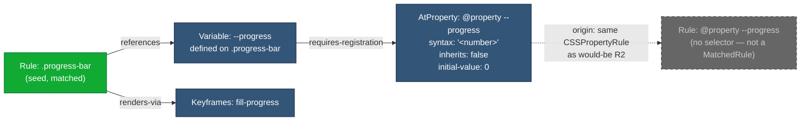
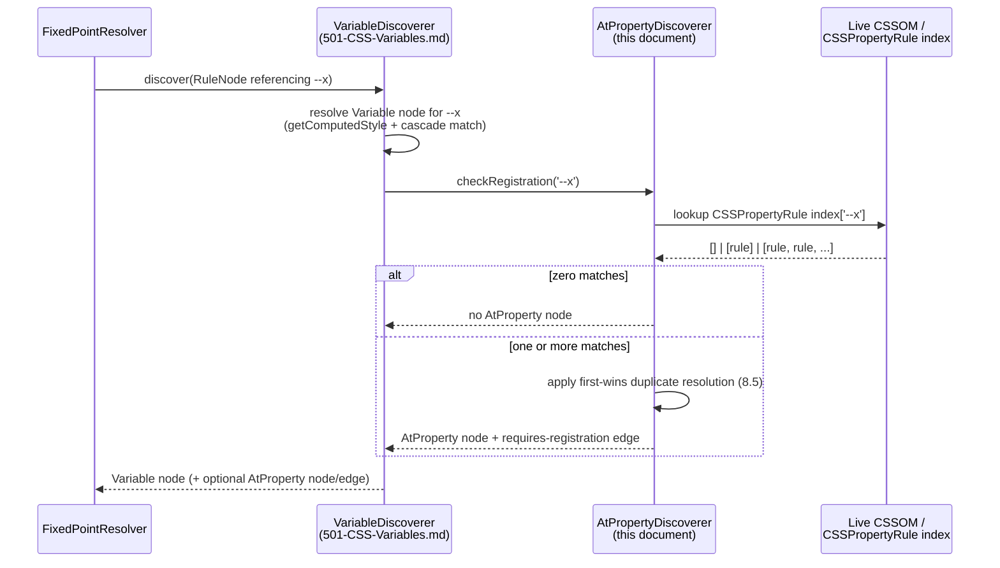

# 504 — `@property` Dependency Resolution

## 1. Title

**Critical CSS Extraction Engine — Resolving `@property` Custom-Property Registrations as Dependency Graph Nodes**

## 2. Version

| Field | Value |
|---|---|
| Document Version | 1.0.0 |
| Status | Draft — Phase 7 (Dependency Resolution) |
| Last Updated | 2026-07-09 |
| Owners | Core Architecture Working Group |
| Stability | Depends on [501-CSS-Variables.md](./501-CSS-Variables.md)'s variable-discovery algorithm being stable; this document's algorithm piggybacks on it rather than re-walking the CSSOM independently |

## 3. Purpose

This document specifies the algorithm the Dependency Resolver uses to discover, attach, and retain `@property` registrations as first-class dependencies of any matched rule that uses a registered custom property via `var()`.

`@property` is a CSS at-rule (CSS Properties and Values API Level 1) that upgrades an otherwise untyped, "guaranteed-invalid-on-cycle," always-inherited custom property into a **typed, animatable, cascade-aware custom property** with an explicit `syntax`, `inherits`, and `initial-value`. The registration itself contributes no visible declaration to any element — it is metadata that changes *how the browser interprets and animates* a custom property's value. This makes it uniquely dangerous to drop silently from critical CSS: a naive extractor that keeps a matched rule's `var(--gap)` reference and the `--gap: 8px` declaration, but discards the `@property --gap { syntax: '<length>'; inherits: true; initial-value: 0px; }` registration because no above-fold element structurally matched the `@property` rule's (nonexistent) selector, produces output that is *visually* often indistinguishable at first paint but *behaviorally* wrong the moment interpolation, animation, or `@supports(...)`-gated typed-value logic engages. A `--gap` that animates smoothly between `8px` and `16px` under a registered `<length>` syntax degrades to a hard, unanimated jump — or fails `@supports(at-rule(@property))`-gated feature detection — once the registration is missing. This is a correctness bug that a screenshot diff at first paint will not catch, and is exactly the class of "syntactically valid but semantically broken" output that [014-Dependency-Graph.md](../architecture/014-Dependency-Graph.md) (Section 3) identifies as the dependency graph's reason for existing.

This document is scoped to the **discovery and retention algorithm** for `AtProperty` nodes and the `requires-registration` edges connecting them to `Variable` nodes, per the node/edge taxonomy already defined in [014-Dependency-Graph.md](../architecture/014-Dependency-Graph.md) Sections 8.1–8.2. It does not redefine that taxonomy; it operationalizes the `AtProperty` node kind and `requires-registration` edge kind into a concrete, implementable procedure, and it documents the one significant discovery gap this construct introduces: JavaScript-registered properties via `CSS.registerProperty()`, which are invisible to any CSSOM-walking strategy.

## 4. Audience

- Implementers of `packages/dependency-graph`'s `DependencyDiscoverer` component (per [014-Dependency-Graph.md](../architecture/014-Dependency-Graph.md) Section 9.2), specifically whoever implements the `AtProperty`-kind discovery routine.
- Implementers of [501-CSS-Variables.md](./501-CSS-Variables.md)'s variable-discovery routine, since this algorithm is architected as a post-step attached to that routine's output, not an independent CSSOM walk.
- Authors of the Cascade Resolver and Serializer, who must understand why a retained `Rule` can pull in an `@property` block that has no matching selector and therefore cannot be "matched" in the ordinary sense.
- Senior engineers auditing correctness of custom-property-related critical CSS output, particularly around CSS animations and transitions that rely on typed custom properties.

Readers are assumed to be familiar with the CSS Custom Properties Level 1 specification (`var()`, cascade, inheritance, guaranteed-invalid values) and the CSS Properties and Values API Level 1 specification (`@property`, `CSS.registerProperty()`, `CSSPropertyRule`). This document does not re-explain those specifications from first principles; it explains how the engine's dependency resolver interacts with them.

## 5. Prerequisites

- [BRIEF.md](../../BRIEF.md) Section 2.5 ("Core Algorithms" → "Dependency Resolution"), which enumerates `@property` explicitly among the constructs the Dependency Resolver must track.
- [014-Dependency-Graph.md](../architecture/014-Dependency-Graph.md) — read in full for the `AtProperty` node kind (Section 8.1), the `requires-registration` edge kind (Section 8.2), the fixed-point resolution loop (Section 8.6), and the cycle-detection scoping argument (Section 8.2, Section 8.7) that explicitly *excludes* `requires-registration` edges from the cycle-detection subgraph because they are architecturally acyclic.
- [500-Dependency-Resolution-Overview.md](../design/500-Dependency-Resolution-Overview.md) — the Phase 7 umbrella document describing how the seven algorithm RFCs in this directory compose into the Dependency Resolver as a whole.
- [501-CSS-Variables.md](./501-CSS-Variables.md) — this document's algorithm is explicitly a continuation of that document's variable-usage discovery algorithm; read it first, since Section 8 below assumes its output shape (`Variable` nodes and `references` edges) as an input.
- Familiarity with the W3C CSS Properties and Values API Level 1 specification, particularly its rules on registration validity and duplicate registration (Section 12 below verifies and documents the precise spec behavior).

## 6. Related Documents

- [500-Dependency-Resolution-Overview.md](../design/500-Dependency-Resolution-Overview.md)
- [501-CSS-Variables.md](./501-CSS-Variables.md) — upstream algorithm this document piggybacks on
- [502-Keyframes.md](./502-Keyframes.md) — sibling algorithm; `@property`-typed custom properties frequently drive `@keyframes` interpolation, and the two constructs are often retained together for the same animated rule
- [503-Font-Faces.md](./503-Font-Faces.md) — sibling algorithm, same discovery pattern (terminal at-rule node reached from a `Rule` node)
- [505-Counters.md](./505-Counters.md) — sibling algorithm; structurally analogous ("resolve a named at-rule dependency of a used identifier") but for `@counter-style` instead of `@property`
- [506-Cascade-Layers.md](./506-Cascade-Layers.md)
- [507-Dependency-Graph-Construction.md](./507-Dependency-Graph-Construction.md) — the overall construction algorithm this document's routine plugs into as one `NodeKind`-specific discovery strategy
- [508-Cycle-Detection.md](./508-Cycle-Detection.md) — confirms `requires-registration` edges are out of cycle-detection scope
- [014-Dependency-Graph.md](../architecture/014-Dependency-Graph.md) — architectural definition of `AtProperty` node and `requires-registration` edge
- [402-Pseudo-Elements.md](../design/402-Pseudo-Elements.md) — generated content edge cases interact with `@property` when a registered custom property drives `content:` via `counter()`/animatable custom idents (cross-referenced conceptually)

## 7. Overview

`@property` registrations are structurally unlike ordinary `Rule` nodes: they have no selector, they match no element, and the Selector Matcher (`packages/matcher`) never produces a `MatchedRule` for one. Consequently an `AtProperty` node can only ever enter the dependency graph as a **transitively discovered** node (`discoveredAt: 'transitive'`, per [014-Dependency-Graph.md](../architecture/014-Dependency-Graph.md) Section 8.1) — it is never a seed. It is discovered exclusively by walking outward from a `Variable` node that a seed (or already-transitive) `Rule` node references.

This document's algorithm therefore does not perform an independent top-level walk of `document.styleSheets` looking for `CSSPropertyRule` instances and then trying to match them against something. Instead, it **hooks into the point in [501-CSS-Variables.md](./501-CSS-Variables.md)'s algorithm where a `Variable` node has just been created or confirmed** for a given custom property name, and asks a narrower, cheaper question: "is `--x` a *registered* custom property, and if so, what `AtProperty` node represents that registration, and does an edge to it already exist?" This is the forward-reference relationship called out in this document's brief: `@property` resolution piggybacks on variable-usage discovery rather than duplicating it.

The three principal concerns this document resolves are:

1. **Discovery**: given a custom property name `--x` that a `Rule` or `Variable` node references, determine whether `--x` has a registered `@property` rule, locate the `CSSPropertyRule` in the live CSSOM, and materialize it as an `AtProperty` node with a `requires-registration` edge from the referencing `Variable` node.
2. **JS-registered properties**: `CSS.registerProperty()` registers a custom property's syntax/inheritance/initial-value identically to `@property`, but does so via an imperative JS API call with **no corresponding CSSOM rule at all** — there is no `CSSPropertyRule` to walk to. This is a genuine, structural blind spot for a CSSOM-walking engine and is documented here as a known limitation, not silently glossed over.
3. **Duplicate/re-registration**: the CSS Properties and Values API specification has precise, non-obvious rules about what happens when the same custom property name is registered more than once (via multiple `@property` blocks, or a mix of `@property` and `CSS.registerProperty()`), and the discovery algorithm must reflect the browser's actual resolved registration, not naively take "the last `@property` rule in source order."

## 8. Detailed Design

### 8.1 Relationship to 501-CSS-Variables.md's Algorithm

[501-CSS-Variables.md](./501-CSS-Variables.md) specifies the algorithm that, for a given matched `Rule` node, lexically extracts `var(--x, fallback)` token occurrences from its declaration block (per [014-Dependency-Graph.md](../architecture/014-Dependency-Graph.md) Section 8.5's "lexical extraction, not selector-semantic parsing" carve-out from Principle 2), queries `getComputedStyle` to obtain the resolved value, and locates the declaring rule for `--x`, materializing a `Variable` node and a `references` edge from the consuming `Rule`.

This document's algorithm is invoked as a **secondary discovery step**, once per unique custom property name, immediately after that `Variable` node is created or looked up (whether the `Variable` node was just created for the first time, or an existing `Variable` node for the same property name was found and an additional `references` edge was added to it from a new consumer — the `@property` check is keyed by property name, not by edge, and runs at most once per property name per graph, guarded the same way node discovery is guarded elsewhere in this architecture: by a `resolutionState`-style "already checked" flag scoped to the property name rather than to the `Variable` node's own `resolutionState`, since a single property name can have multiple `Variable` nodes if [501-CSS-Variables.md](./501-CSS-Variables.md) scopes `Variable` nodes per defining-selector-scope; see Section 12's edge case on this).

Concretely: any rule that already resolved a `var(--x)` dependency has, by the time this algorithm runs, already told the Dependency Resolver "the string `--x` is a custom property name that matters to this extraction." That is the entirety of the input this algorithm needs to begin its own, independent check — it does not need to re-derive which properties matter; [501-CSS-Variables.md](./501-CSS-Variables.md) has already done that work.

### 8.2 Discovering the Registration

Given a custom property name `--x` (a bare string, without the `var()` wrapper, already extracted per Section 8.1), the algorithm:

1. Queries `CSS.supports('at-rule(@property)')` once per extraction run (cached at the `DependencyDiscoverer` level, not re-queried per property) to short-circuit the entire `AtProperty` discovery pathway on browser engines/versions that do not implement `@property` at all — in that case no `CSSPropertyRule` could ever exist, and the algorithm degrades to a no-op, which is the correct behavior (there is nothing to retain).
2. Walks the CSSOM Walker's already-produced rule tree (per [014-Dependency-Graph.md](../architecture/014-Dependency-Graph.md) Section 9.1, the Dependency Resolver consumes the CSSOM Walker's full rule tree, not merely the seed set) looking for `CSSPropertyRule` instances whose `.name` matches `--x` exactly (custom property names are case-sensitive and the match must be a strict string equality, per spec — `--X` and `--x` are different properties).
3. If **zero** matching `CSSPropertyRule` instances are found: `--x` is an ordinary, unregistered custom property. No `AtProperty` node is created, no edge is added. This is the common case and must be cheap — a single indexed lookup into a `Map<string, CSSPropertyRule[]>` built once during CSSOM Walker traversal (see Implementation Notes), not a fresh document-wide scan per property name.
4. If **exactly one** matching `CSSPropertyRule` is found and it is a **valid** registration (Section 8.4 defines validity), the algorithm materializes an `AtProperty` node keyed by the property name (`id = "atprop:--x"`, consistent with [014-Dependency-Graph.md](../architecture/014-Dependency-Graph.md) Section 8.1's deterministic, non-random ID convention) with fields:
   - `syntax: string` — the registered `syntax` descriptor's raw string value (e.g. `'<length>'`, `'<color># | none'`).
   - `inherits: boolean` — the registered `inherits` descriptor.
   - `initialValue: string | null` — the registered `initial-value` descriptor (nullable only when `syntax: '*'`, per spec, where `initial-value` is optional).
   - `origin: { stylesheetIndex, ruleIndex }` per the standard node origin convention.

   An edge `Variable --requires-registration--> AtProperty` is added from every `Variable` node representing `--x` (there may be more than one if [501-CSS-Variables.md](./501-CSS-Variables.md) scopes `Variable` nodes per defining-selector — Section 12 elaborates) to this new `AtProperty` node.
5. If **more than one** matching `CSSPropertyRule` is found, the algorithm invokes the duplicate-registration resolution procedure in Section 8.5 before proceeding to step 4 with the winning rule (if any).

### 8.3 Why the Registration Itself Must Be Retained (Not Just Noted)

It is tempting to treat `@property`'s effect as "purely informational" and reason that since the `--x: 8px` *declaration* is already retained (via the ordinary `Variable`-node / `references`-edge pathway from [501-CSS-Variables.md](./501-CSS-Variables.md)), the numeric/typed *value* is preserved regardless of whether the registration ships. This reasoning is incorrect, and is precisely the failure mode this document exists to prevent.

Without the `@property` rule present in the served critical CSS, the browser treats `--x` as an **unregistered** custom property: syntax `'*'` (any token sequence), always inherited, and — critically for the "why does this matter" question — **not animatable via standard interpolation**. A `transition: --x 0.3s` or a `@keyframes` block animating `--x` from `0px` to `100px` requires the browser to know `--x` is a `<length>` (or another interpolable, registered syntax) to compute intermediate frames; an unregistered custom property can only be *discretely* switched (matching the CSS Custom Properties spec's rule that untyped custom properties do not support smooth interpolation — the value flips at the 50% boundary of the transition rather than animating continuously). This is a rendering-fidelity regression that will not show up in a single-frame screenshot diff (per [014-Dependency-Graph.md](../architecture/014-Dependency-Graph.md) Section 15's note that visual regression is the correctness oracle for *missing* dependencies generally) but will show up in any frame-by-frame or mid-transition visual test, and will show up immediately to a real user watching the animation. The engine therefore must model `@property` as a hard dependency, not an optional enrichment.

### 8.4 Registration Validity

A `CSSPropertyRule` can exist in the CSSOM yet be an **invalid** registration per spec (e.g., a `syntax` descriptor with malformed grammar, or a missing `initial-value` when `syntax` is not `'*'`). An invalid registration does not register anything — the browser behaves as if the `@property` rule were absent entirely for that property name. The discovery algorithm must not blindly trust the presence of a `CSSPropertyRule` node in the CSSOM; it must confirm registration actually took effect. The most reliable, spec-compliant, browser-authoritative way to do this (consistent with Principle 1 in [006-Design-Principles.md](../architecture/006-Design-Principles.md) — never re-implement browser validation logic) is to query `CSS.registerProperty`'s own validation indirectly: since re-registering via `CSS.registerProperty()` throws on an already-validly-registered name, and since a validly-registered custom property is reflected in `getComputedStyle(document.documentElement).getPropertyValue('--x')`'s treatment of an *invalid* value for that property's syntax (an invalidly-registered property never applies its `initial-value` guarantee), the engine's validity check queries the live `CSSPropertyRule` object's descriptor values directly (`.syntax`, `.inherits`, `.initialValue`) — the browser only constructs a `CSSPropertyRule` object with these accessors populated for a rule it has already validated at parse time; a `@property` block with a syntactically malformed `syntax` string is dropped by the browser's CSS parser before a `CSSPropertyRule` object is even created for it, per the CSS Properties and Values API's own error-handling section. This means: **if a `CSSPropertyRule` object exists in the CSSOM Walker's traversal at all, its registration was already validated by the browser at parse time** — the engine does not need a separate validity re-check beyond confirming the object exists and its descriptors are non-`undefined`. This is a load-bearing simplification: it lets the engine trust CSSOM presence as a validity proxy, exactly the "browser as source of truth" principle this whole project is built on.

### 8.5 Duplicate / Re-Registration Handling

**Verified specification behavior** (CSS Properties and Values API Level 1, Custom Property Registration section): registering the same custom property name more than once is an error. Per spec, if a custom property with a given name has *already been successfully registered* — whether via a prior `@property` rule or a prior `CSS.registerProperty()` call — a subsequent attempt to register that same name **fails and is ignored**; the *original* registration remains in effect. This applies per registration *context* (the document, or a specific shadow root, since custom property registration is scoped per tree per the spec) — critically, this is **not** "last valid one wins" in the way some engineers assume by analogy with ordinary CSS cascade (where later same-specificity declarations win); it is **first valid one wins**, and every subsequent same-name registration attempt in the same tree is simply void, whether it appears in a later stylesheet, a later `@property` block in the same stylesheet, or a later `CSS.registerProperty()` call.

This has a direct, easily-miswritten implication for the discovery algorithm in Section 8.2 step 5: when multiple `CSSPropertyRule` instances for the same name `--x` are found in `document.styleSheets` traversal order, the algorithm must **not** select the one with the highest `(stylesheetIndex, ruleIndex)` (i.e., not "last in source order wins," which is the natural-but-wrong assumption carried over from ordinary cascade reasoning). It must select the **first, in document evaluation order**, that constitutes a valid registration attempt — and per Section 8.4's reasoning, every `CSSPropertyRule` object that exists in the CSSOM already represents a registration the browser accepted as syntactically valid at *parse* time, but only the *first* such rule, in the order the browser actually processed stylesheets, is the one whose registration *took effect* per the once-only registration rule. In practice, because CSS parsing and registration processing both proceed in document/stylesheet order, "first `CSSPropertyRule` encountered when walking `document.styleSheets` in index order, then rules within a sheet in rule-index order" is the correct, spec-faithful tiebreak — but the engine must explicitly document (as this section does) that this is a *first-wins*, not *last-wins*, rule, because a future contributor "fixing" this to last-wins by analogy with cascade behavior would silently reintroduce a spec-violating bug.

The practical consequence for dependency retention: if the second (or later) `@property --x { ... }` block is void, it must **not** be retained as the `AtProperty` node's representation, even if it happens to be closer to the matched rule in the stylesheet, or even if it is the one an engineer skimming source would assume is "the" registration. The algorithm retains exactly one `AtProperty` node per name, representing the browser's actual winning registration, and if a later, void `@property` block for the same name would otherwise have been individually retained by some other pathway (e.g., because an unrelated matched rule's selector happens to structurally fall inside its containing `@media`/`@layer` block), the Serializer must still only ever *treat* the winning registration's descriptors as authoritative — this is why the `AtProperty` node's identity is keyed purely by property name (`atprop:--x`), not by stylesheet/rule position, ensuring at most one `AtProperty` node per name can ever exist in the graph regardless of how many `CSSPropertyRule` objects reference that name in the underlying CSSOM.

### 8.6 JS-Registered Properties — Known Limitation

`CSS.registerProperty({ name: '--x', syntax: '<color>', inherits: false, initialValue: 'black' })` registers `--x` with identical runtime effect to an equivalent `@property --x { ... }` block, but does so via a JavaScript call with **no CSSOM rule reflection whatsoever** — there is no `CSSPropertyRule` object, no entry in `document.styleSheets`, nothing for the CSSOM Walker to traverse. This is a genuine architectural blind spot, not a bug to be fixed within this algorithm's scope: a CSSOM-walking strategy (per [001-Vision.md](../architecture/001-Vision.md)'s "browser as source of truth via CSSOM" commitment) has, by construction, no rule-tree artifact to discover for a JS-only registration.

The engine's mitigation is **detection without full recovery**: the discovery algorithm, having found *no* `CSSPropertyRule` for `--x`, additionally probes whether `--x` is nonetheless a registered property by a behavioral side channel — `CSS.registerProperty()` throws a `DOMException` if called again for an already-registered name, so the engine can, at extraction setup time (once per run, not per property), enumerate *candidate* registered names, if and only if the target application exposes them (e.g., via a documented convention or a debug hook), but **cannot enumerate them purely from the browser's public API surface** — there is no `CSS.getRegisteredProperties()` or equivalent introspection method in the specification as of this writing. Consequently:

- If a matched rule uses `var(--x)` where `--x` is registered only via `CSS.registerProperty()`, the Dependency Resolver **cannot discover or retain an `AtProperty` node for it**, because no such node-shaped artifact exists to discover.
- The practical, correct-per-architecture consequence is: the resulting critical CSS is missing the registration, and if the target page's JS bundle (which performed the `CSS.registerProperty()` call) is *not* re-executed in the context where the critical CSS is later served standalone (e.g., a static above-the-fold CSS snippet inlined before the page's JS has run), the property genuinely will behave as unregistered until that JS executes. If the JS *does* run before or alongside the critical CSS being applied (the common case, since `CSS.registerProperty()` calls typically live in application bootstrap code that runs regardless of which CSS was inlined), the registration will in practice take effect correctly at runtime even though the Dependency Resolver's graph has no record of it — this is a case where the **runtime outcome is fine but the dependency graph is incomplete/inaccurate as a diagnostic artifact**, which is itself worth flagging distinctly from "runtime is broken."
- This is documented in Section 12 (Edge Cases) as a known, spec-inherent limitation, and the Reporter (per [014-Dependency-Graph.md](../architecture/014-Dependency-Graph.md) Section 9.1) should surface a best-effort diagnostic warning — `PossibleUndiscoverableRegistrationWarning` — whenever a `Variable` node's computed value pattern is consistent with a typed/animatable custom property (e.g., the computed value is always a well-formed `<length>`/`<color>` and `getComputedStyle` never returns an unregistered custom property's characteristic behavior under a synthetic invalid-value probe) but no `AtProperty` node was found, prompting a human to check for a JS-side registration.

### 8.7 Dependency Graph Diagram



The dashed node `R2` is included only to make an easily-confused point explicit: `@property --progress { ... }` is never itself a `Rule` node, because the Selector Matcher never evaluates it (it has no selector to match against any element). The `AtProperty` node is the graph's *only* representation of that at-rule; there is no parallel `Rule` node for it to be confused with.

## 9. Architecture

### 9.1 Where This Discovery Routine Sits

This algorithm is one `NodeKind`-specific strategy inside the `DependencyDiscoverer` component defined in [014-Dependency-Graph.md](../architecture/014-Dependency-Graph.md) Section 9.2, specifically the strategy invoked as a secondary step of the `Variable`-kind discovery routine specified in [501-CSS-Variables.md](./501-CSS-Variables.md), rather than being dispatched directly from the outer `FixedPointResolver` loop as its own top-level `NodeKind` case. This is a deliberate architectural choice: `AtProperty` nodes have no independent "seed" pathway (Section 7), so giving this routine its own top-level dispatch slot in the `DependencyDiscoverer`'s per-`NodeKind` strategy table (as `502-Keyframes.md` and `503-Font-Faces.md`'s routines have, since `Rule` nodes reference keyframes/fonts directly) would misrepresent how discovery is actually triggered.



### 9.2 Interaction with the Cascade Resolver

The Cascade Resolver (per [014-Dependency-Graph.md](../architecture/014-Dependency-Graph.md) Section 9.1) does not need to compute specificity or layer order for `AtProperty` nodes — they participate in the cascade only insofar as their *presence* changes how `--x`'s value is interpreted, not through ordinary cascade competition (there is exactly one winning registration per name per tree, per Section 8.5, and the browser resolves that independently of stylesheet origin/specificity/layer ordering — registration order is a distinct, separate resolution axis from ordinary cascade order). The Cascade Resolver therefore treats every retained `AtProperty` node as unconditionally emitted, in its own stable position (see Implementation Notes on serialization ordering), rather than subjecting it to the same origin/specificity/layer machinery it applies to `Rule` nodes.

## 10. Algorithms

### 10.1 Algorithm: `@property` Registration Discovery

**Problem statement.** Given a custom property name `--x` already known to be referenced by at least one `Variable` node (via [501-CSS-Variables.md](./501-CSS-Variables.md)'s algorithm), determine whether `--x` has a valid, currently-winning `@property` registration reflected in the CSSOM, and if so, materialize an `AtProperty` node and `requires-registration` edge(s) from every `Variable` node representing `--x`.

**Inputs.**
- `propertyName: string` — the custom property name, e.g. `'--x'`.
- `variableNodes: VariableNode[]` — every `Variable` node in the graph currently representing `propertyName` (there may be more than one across different defining scopes; see Section 12).
- `propertyRuleIndex: Map<string, CSSPropertyRule[]>` — a pre-built index of every `CSSPropertyRule` in the page's CSSOM, keyed by registered name, built once during the CSSOM Walker's traversal (per Implementation Notes) in document/stylesheet/rule traversal order.
- `alreadyChecked: Set<string>` — property names already processed by this routine in the current extraction run (idempotency guard).

**Outputs.** Zero or one `AtProperty` node added to the graph, plus zero or more `requires-registration` edges from `variableNodes` to it. No return value beyond graph mutation (consistent with the mutation-based contract of sibling discovery routines in [014-Dependency-Graph.md](../architecture/014-Dependency-Graph.md) Section 10.1).

**Pseudocode.**

```text
function discoverAtPropertyRegistration(propertyName, variableNodes, propertyRuleIndex, alreadyChecked, graph) -> void:
    if propertyName in alreadyChecked:
        return   // idempotent: registration check runs at most once per name per run
    alreadyChecked.add(propertyName)

    candidateRules = propertyRuleIndex.get(propertyName) or []
    if candidateRules.isEmpty():
        return   // ordinary, unregistered custom property — no AtProperty node

    // candidateRules is already in document/stylesheet/rule traversal order
    // (built that way at index-construction time — see Implementation Notes).
    // Per 8.5: first candidate in this order is the browser's winning registration;
    // every CSSPropertyRule object present already passed browser parse-time
    // validation (8.4), so no further validity check is needed here.
    winningRule = candidateRules[0]

    nodeId = "atprop:" + propertyName
    if not graph.hasNode(nodeId):
        atPropertyNode = new AtPropertyNode(
            id = nodeId,
            syntax = winningRule.syntax,
            inherits = winningRule.inherits,
            initialValue = winningRule.initialValue,
            origin = originOf(winningRule),
            discoveredAt = 'transitive',
            resolutionState = 'resolved'   // architecturally acyclic — resolved immediately (8.2 taxonomy note)
        )
        graph.addNode(atPropertyNode)
    else:
        atPropertyNode = graph.getNode(nodeId)

    for variableNode in variableNodes:
        edge = new GraphEdge(
            sourceId = variableNode.id,
            targetId = atPropertyNode.id,
            kind = 'requires-registration'
        )
        graph.addEdge(edge)   // deduplicated by (source, target, kind) at addEdge time
```

**Time complexity.** `O(1)` amortized per property name, given the pre-built `propertyRuleIndex` (an `O(1)` map lookup) — the expensive part (finding *all* `CSSPropertyRule`s across every stylesheet) is paid exactly once, up front, during CSSOM Walker traversal (`O(P)` where `P` is the total number of `@property` rules on the page, typically tiny — low tens at most even in large design systems), not once per queried property name. Across an entire extraction run, if `K` distinct custom property names are referenced by the seed set's transitive closure (bounded, per [014-Dependency-Graph.md](../architecture/014-Dependency-Graph.md) Section 10.1, by the seed set's closure size `D`, not total page CSS size), this routine contributes `O(K)` total work, i.e. `O(D)`.

**Memory complexity.** `O(P)` for the one-time index, `O(K)` for the `alreadyChecked` set, `O(1)` additional `AtProperty` nodes per distinct registered name actually referenced (bounded above by `min(K, P)`).

**Failure cases.**
- `propertyRuleIndex` missing a `CSSPropertyRule` that exists in a cross-origin stylesheet the CSSOM Walker could not introspect (`sheet.cssRules` throws a `SecurityError` for a cross-origin stylesheet without CORS-compatible loading) — per [014-Dependency-Graph.md](../architecture/014-Dependency-Graph.md) Section 12's general cross-origin caveat, this routine cannot discover registrations defined in an inaccessible cross-origin sheet; degrades to "no registration found," which is a silent under-approximation, not a crash. Flagged as a diagnostic (`CrossOriginStylesheetSkippedWarning`, shared infrastructure with [501-CSS-Variables.md](./501-CSS-Variables.md) and [503-Font-Faces.md](./503-Font-Faces.md)).
- JS-registered-only properties (Section 8.6): structurally undiscoverable; not a "failure" of this algorithm so much as a documented limitation of the CSSOM-walking strategy as a whole.
- A `winningRule.syntax`/`.inherits`/`.initialValue` accessor throwing or returning `undefined` on a non-compliant browser engine — guarded defensively; treated as "no valid registration found" rather than propagating an exception that would abort the whole fixed-point loop, consistent with graceful-degradation guidance elsewhere in this document set.

**Optimization opportunities.** The `propertyRuleIndex` is viewport-invariant (an `@property` registration does not change between Mobile/Tablet/Desktop passes of the same route), making it a direct candidate for the same cross-viewport memoization strategy [014-Dependency-Graph.md](../architecture/014-Dependency-Graph.md) Section 10.1's "Optimization opportunities" already recommends for `Variable`-node discovery results — build the index once per route, reuse across all viewport passes.

### 10.2 Algorithm: Duplicate Registration Resolution (First-Wins Tiebreak)

**Problem statement.** Given multiple `CSSPropertyRule` candidates for the same name, deterministically select the one representing the browser's actually-winning registration, per Section 8.5's verified first-wins spec semantics.

**Inputs.** `candidateRules: CSSPropertyRule[]`, each with an `origin: { stylesheetIndex, ruleIndex }` reflecting its position in the browser's own stylesheet processing order (not an engine-invented order).

**Outputs.** `winningRule: CSSPropertyRule` — exactly one element of the input, or `null` if the input is empty.

**Pseudocode.**

```text
function resolveWinningRegistration(candidateRules) -> CSSPropertyRule | null:
    if candidateRules.isEmpty():
        return null
    // First-wins per CSS Properties and Values API Level 1 registration semantics (8.5).
    // NOTE: this is intentionally NOT sortedBy(...).last() — that would implement
    // last-wins, which is a spec violation for @property registration (distinct from
    // ordinary cascade, where later same-specificity declarations do win).
    return candidateRules
        .sortedBy(rule => (rule.origin.stylesheetIndex, rule.origin.ruleIndex))
        .first()
```

**Time complexity.** `O(C log C)` where `C` is the (very small, typically 1) number of candidate rules for a given name — negligible.

**Memory complexity.** `O(C)`.

**Failure cases.** If the engine's `origin` tuple does not faithfully preserve the browser's true stylesheet-load/parse order (e.g., due to dynamically inserted `<style>` tags reordering `document.styleSheets` relative to source-document order), the tiebreak could select the wrong "first" rule. This is called out explicitly rather than assumed away — see Section 12.

**Optimization opportunities.** None significant; `C` is bounded by a small constant in virtually every real page.

## 11. Implementation Notes

- The `propertyRuleIndex` (Section 10.1) should be built as a side effect of the CSSOM Walker's single top-to-bottom traversal of `document.styleSheets` (the same traversal that builds the `ruleTree` consumed elsewhere per [014-Dependency-Graph.md](../architecture/014-Dependency-Graph.md) Section 10.1's inputs) — do not perform a second, independent traversal solely for `@property` discovery; that would duplicate the (potentially expensive, cross-origin-sensitive) work of enumerating `cssRules` across every sheet.
- The index must be built by appending each `CSSPropertyRule` encountered *in traversal order* to the array for its name — this ordering property is exactly what Section 10.2's tiebreak relies on; do not use a `Map` overwrite pattern (`index.set(name, rule)`) that would silently keep only the *last*-seen rule, which is both the wrong semantics (Section 8.5) and destroys the information needed to detect and diagnostically report "this property was registered more than once" (worth surfacing to the Reporter even though only one registration wins, since duplicate registration is often an authoring mistake worth flagging).
- `AtPropertyNode.resolutionState` is set to `'resolved'` immediately upon creation (Section 10.1), never `'pending'` — unlike `Variable`, `Keyframes`, or `FontFace` nodes, an `AtProperty` node has no further dependencies of its own to discover (its `syntax`/`inherits`/`initial-value` descriptors are terminal, self-contained values, not references to other graph constructs), consistent with [014-Dependency-Graph.md](../architecture/014-Dependency-Graph.md) Section 8.2's observation that `requires-registration` edges are "architecturally acyclic by construction."
- Emit the `CrossOriginStylesheetSkippedWarning` and `PossibleUndiscoverableRegistrationWarning` diagnostics (Sections 10.1 and 8.6) through the same Reporter diagnostic channel used by sibling algorithm RFCs, tagged with a `source: '504-At-Property'` field so the Reporter's aggregated diagnostics view (REQ-460/461) can group related warnings.
- Serialize the winning `AtProperty` node's `@property` block verbatim from its original CSSOM-observed descriptor values (`syntax`, `inherits`, `initialValue`), not by re-stringifying a parsed-and-reconstructed AST — this avoids reintroducing a hand-rolled CSS-generation step for a construct whose only correct source of truth is what the browser itself already validated (Principle 1).

## 12. Edge Cases

- **Multiple `Variable` nodes for the same property name across different defining scopes.** If [501-CSS-Variables.md](./501-CSS-Variables.md) scopes `Variable` nodes per `(propertyName, definingSelectorScope)` (per [014-Dependency-Graph.md](../architecture/014-Dependency-Graph.md) Section 8.1's `Variable` node key), a single `--x` registered once via `@property` may still correspond to several distinct `Variable` nodes (one per scope where `--x` is independently declared, e.g. `:root { --x: 1; }` and `.card { --x: 2; }`). This algorithm's discovery routine (Section 10.1) correctly handles this by accepting `variableNodes: VariableNode[]` (plural) and adding a `requires-registration` edge from *every* such node to the single, shared `AtProperty` node — registration is a property-name-global fact, not scoped per declaration, and the graph must not create duplicate `AtProperty` nodes per scope.
- **`syntax: '*'` (untyped) registrations.** A `@property --x { syntax: '*'; inherits: true; }` (no `initial-value`, which is spec-legal only for `syntax: '*'`) still constitutes a real registration with retention consequences — even though `'*'` syntax does not enable smooth interpolation (Section 8.3's animation argument does not directly apply), it still changes `inherits` semantics potentially, and more importantly, dropping it still changes whether the browser treats a guaranteed-invalid value as producing the registered `initial-value` vs. the ordinary custom-property "no initial value, becomes invalid" behavior. The algorithm makes no special case for `'*'` syntax — it is retained identically to any other syntax value.
- **`@property` inside a conditional block (`@media`, `@supports`, `@layer`).** A registration nested inside a `@media`/`@supports` block whose condition currently evaluates false is, per spec, not "active" — its registration does not take effect. The `propertyRuleIndex` must therefore be built from `CSSPropertyRule`s reachable through the browser's own condition-evaluation (i.e., only include a `CSSPropertyRule` if its containing conditional group rule(s) are currently matching, mirroring the `conditioned-by` edge logic in [014-Dependency-Graph.md](../architecture/014-Dependency-Graph.md) Section 8.2), not merely "exists somewhere in `cssRules` regardless of nesting." A registration inside a currently-false `@media` block must be treated identically to "no registration found" by this algorithm, even though the `CSSPropertyRule` object is technically present in the CSSOM.
- **`@property` inside a cascade layer.** Registration order (Section 8.5) is independent of `@layer` ordering — cascade layers affect which *declaration* wins for an ordinary property, but `@property` registration's first-wins rule is a separate, non-cascade axis (Section 9.2). A later-declared `@property --x` inside a higher-priority `@layer` does **not** override an earlier-declared `@property --x` in a lower-priority layer; first-wins by registration order applies regardless of layer.
- **Dynamically inserted `<style>` tags reordering effective registration order.** If the target page inserts a `<style>` element containing a competing `@property --x` block via JS *after* initial page load, and the DOM snapshot the extraction is stabilized against (per [014-Dependency-Graph.md](../architecture/014-Dependency-Graph.md) Section 12's "stabilized DOM/CSSOM snapshot" requirement) was captured at a point where that dynamic insertion had already happened, `document.styleSheets`' traversal order at snapshot time is what this algorithm uses — it does not attempt to reconstruct a "what would have happened if processed strictly in original-document order" counterfactual; it trusts the browser's *current* resolved state, which already reflects first-wins correctly for whatever insertion sequence actually occurred, per Principle 1.
- **JS-registered properties, restated as a first-class edge case** (Section 8.6): the single most significant limitation this document has to offer no algorithmic fix for, only detection-and-diagnostic mitigation.
- **Shadow DOM–scoped registration.** Per spec, `CSS.registerProperty()`/`@property` registration is scoped per *tree* (document or shadow root) in some implementations' interpretation, though as of this writing browser behavior here is still an area of active specification refinement; the discovery algorithm's `propertyRuleIndex` must be built per shadow root the CSSOM Walker traverses into (consistent with [014-Dependency-Graph.md](../architecture/014-Dependency-Graph.md) Section 12's shadow-DOM-crossing custom-property edge case), and a `Variable` node whose consuming `Rule` lives in a different tree than the `@property` rule must not be linked via `requires-registration` unless the registration's scope is confirmed (via computed-style probing, not assumption) to actually apply across that boundary.

## 13. Tradeoffs

| Decision | Why | Alternative Considered | Tradeoff Accepted |
|---|---|---|---|
| Piggyback `AtProperty` discovery on `Variable` discovery rather than giving it an independent top-level `NodeKind` dispatch | `AtProperty` nodes have no seed pathway of their own (Section 7); an independent dispatch slot would misrepresent how discovery is actually triggered and would require re-deriving "which property names matter," duplicating [501-CSS-Variables.md](./501-CSS-Variables.md)'s work | Give `AtProperty` its own top-level discovery routine that independently walks all `Variable` nodes after the fact | Slightly tighter coupling between this document's algorithm and 501's internal sequencing, in exchange for avoiding duplicated traversal work |
| Trust CSSOM `CSSPropertyRule` presence as a validity proxy (Section 8.4) rather than independently re-validating `syntax` grammar | Consistent with Principle 1 (browser as source of truth); the browser has already performed this validation at parse time | Re-implement CSS syntax-string grammar validation in the engine to double-check | Re-implementing grammar validation would be a Principle-1/2-violating, maintenance-heavy duplication of browser parser logic for no correctness benefit |
| First-wins tiebreak for duplicate registrations (Section 8.5), verified against spec rather than assumed | Getting this backwards (last-wins) silently produces incorrect retained descriptors whenever a page has (even accidentally) duplicate `@property` blocks for the same name | Assume last-wins by analogy with ordinary cascade behavior | Requires this document to explicitly call out the non-obvious spec detail so a future contributor does not "fix" it into a bug |
| Document JS-registered properties as a hard limitation rather than attempting heuristic recovery (Section 8.6) | There is no reliable, general, spec-provided introspection API to enumerate `CSS.registerProperty()`-only registrations; any heuristic recovery risks false positives/negatives worse than a clearly documented gap | Attempt to detect registration via synthetic invalid-value probing on every custom property, heuristically, for every extraction | Heuristic probing adds nontrivial per-property browser round-trip cost (Section 14) for a signal that is inherently unreliable; a documented limitation plus a best-effort diagnostic warning is judged more honest and cheaper than an unreliable heuristic dressed up as detection |
| `AtPropertyNode.resolutionState` set to `'resolved'` immediately, never `'pending'` | `@property` descriptors are terminal values with no further references to chase (Section 11) | Model it as `'pending'` and run it through the same generic discovery-queue cycle as every other node kind, for architectural uniformity | Uniformity is nice but would add a wasted queue round-trip per `AtProperty` node for zero discovery benefit |

## 14. Performance

- **CPU complexity.** `O(P)` one-time index construction (Section 10.1) plus `O(K)` amortized lookups, where `P` is total `@property` rules on the page and `K` is distinct property names referenced by the seed set's transitive closure — both quantities are small in virtually every real page (low tens, occasionally low hundreds for extreme design-system-heavy enterprise stylesheets), and this stage's cost is dwarfed by the browser-round-trip-dominated cost of the outer fixed-point loop generally, per [014-Dependency-Graph.md](../architecture/014-Dependency-Graph.md) Section 14.
- **Memory complexity.** `O(P + K)`, negligible relative to the DOM/CSSOM snapshot memory held concurrently by the Visibility Engine and CSSOM Walker.
- **Caching strategy.** The `propertyRuleIndex` is viewport-invariant within a route (Section 10.1's "Optimization opportunities") and is a natural candidate for the same route-scoped memoization the Dependency Resolver already applies to `Variable`/`Keyframes`/`FontFace` discovery results across Mobile/Tablet/Desktop passes, per [014-Dependency-Graph.md](../architecture/014-Dependency-Graph.md) Section 14's caching strategy and Section 16's "incremental (non-restart) graph updates" future-work item — `AtProperty` subgraph reuse across viewport passes is one of the concrete cases that future-work item anticipates.
- **Parallelization opportunities.** Index construction happens inline during the CSSOM Walker's existing single-pass traversal (Section 11); there is no additional parallelism opportunity specific to this algorithm beyond what the CSSOM Walker itself already exploits (per [015-Runtime-Model.md](../architecture/015-Runtime-Model.md)).
- **Incremental execution.** Because discovery is gated by `alreadyChecked` per property name (Section 10.1), re-running this routine for the same property name within a single extraction run is `O(1)` (idempotent short-circuit); across cache-hit fingerprint matches (route/viewport unchanged since last run), the entire Dependency Resolver stage — including this routine — is skipped per [014-Dependency-Graph.md](../architecture/014-Dependency-Graph.md) Section 14's Cache Manager integration.
- **Scalability limits.** The only scalability concern specific to this construct is pathological duplicate-registration counts (many `@property` blocks for the same name, e.g. a misconfigured design system emitting the same registration in dozens of stylesheet chunks) — bounded trivially by `O(C log C)` sort cost in Section 10.2, which remains negligible even at `C` in the low thousands, well beyond any realistic page.

## 15. Testing

- **Unit tests.** `resolveWinningRegistration` (Section 10.2) tested against synthetic candidate arrays in various orders, asserting first-wins (not last-wins) selection; `discoverAtPropertyRegistration` (Section 10.1) tested against an in-memory fake `propertyRuleIndex` with zero/one/many candidates, verifying correct node creation, edge deduplication, and idempotency via `alreadyChecked`.
- **Integration tests.** A dedicated fixture with a `@property`-registered, `<length>`-typed custom property driving a `@keyframes` animation must assert the resolved graph contains the `AtProperty` node and `requires-registration` edge, and that the *serialized* critical CSS includes the verbatim `@property` block — not merely that the animation "looks right" in a screenshot, per the same "assert on graph shape, not just final output" discipline [014-Dependency-Graph.md](../architecture/014-Dependency-Graph.md) Section 15 mandates generally.
- **Visual tests.** A frame-by-frame (not single-frame) visual regression comparing critical-CSS-only render vs. full-CSS render, specifically at the mid-transition point of an `@property`-typed animated custom property, is the correctness oracle that catches a *missing* `AtProperty` node — a single-frame-at-rest screenshot diff will not catch this class of bug, which is precisely why this document calls it out as dangerous in Section 3.
- **Stress tests.** A fixture with dozens of duplicate `@property --x` blocks for the same name spread across multiple stylesheets and `@layer`/`@media` nesting levels, verifying the first-wins tiebreak holds under realistic-scale duplication and that the diagnostic warning about duplicate registration fires exactly once per duplicated name, not once per duplicate.
- **Regression tests.** Any production incident where critical CSS shipped without a needed `@property` block (causing a customer-visible animation regression) must gain a permanent fixture + golden-graph snapshot, per the golden-snapshot philosophy established in [014-Dependency-Graph.md](../architecture/014-Dependency-Graph.md) Section 15.
- **Benchmark tests.** Include an `@property`-heavy variant in the `fixtures/enterprise-huge/` high-fan-out benchmark (per [014-Dependency-Graph.md](../architecture/014-Dependency-Graph.md) Section 15) with hundreds of registered custom properties, to confirm the `O(P + K)` index-based approach holds its constant-factor advantage over a naive per-property full-document scan at scale.

## 16. Future Work

- **Investigate a documented convention or debug hook for surfacing `CSS.registerProperty()`-only registrations** (Section 8.6) — e.g., a plugin-system hook (per `BRIEF.md` Section 2.13) that lets application authors explicitly declare their JS-registered properties to the extraction engine, closing part of the structural blind spot without requiring a general browser introspection API that does not currently exist.
- **Monitor the CSS Properties and Values API specification for a future `CSS.getRegisteredProperties()`-style introspection primitive** — if browsers eventually add one, Section 8.6's limitation could be substantially narrowed or eliminated; track alongside [014-Dependency-Graph.md](../architecture/014-Dependency-Graph.md) Section 16's general pattern of promoting currently-unsupported constructs once browser support stabilizes.
- **Shadow-DOM-scoped registration semantics** (Section 12) should be revisited once cross-engine behavior for per-tree `@property` scoping is more consistently specified and implemented; this document's current per-tree index-building approach is a best current understanding, not a permanently settled design.
- **Property-based testing of the first-wins tiebreak** across randomly generated candidate orderings, as a stronger guarantee than the example-based unit tests in Section 15 currently provide, mirroring the property-based testing research direction flagged generally in [014-Dependency-Graph.md](../architecture/014-Dependency-Graph.md) Section 16.
- **Open question: should the Reporter's diagnostic view distinguish "registration found and retained" from "registration checked and confirmed absent" from "registration check skipped due to cross-origin restriction"?** Currently all three collapse into "no `AtProperty` node," which is correct for graph *construction* purposes but may be insufficiently informative for a human debugging why an animation regressed — worth revisiting once `apps/visualizer` (Phase 5 roadmap ambition, per [014-Dependency-Graph.md](../architecture/014-Dependency-Graph.md) Section 16) exists to present this distinction usefully.

## 17. References

- [500-Dependency-Resolution-Overview.md](../design/500-Dependency-Resolution-Overview.md)
- [501-CSS-Variables.md](./501-CSS-Variables.md) — upstream algorithm this document's discovery routine is attached to
- [502-Keyframes.md](./502-Keyframes.md)
- [503-Font-Faces.md](./503-Font-Faces.md)
- [505-Counters.md](./505-Counters.md)
- [506-Cascade-Layers.md](./506-Cascade-Layers.md)
- [507-Dependency-Graph-Construction.md](./507-Dependency-Graph-Construction.md)
- [508-Cycle-Detection.md](./508-Cycle-Detection.md)
- [014-Dependency-Graph.md](../architecture/014-Dependency-Graph.md) — `AtProperty` node kind (Section 8.1), `requires-registration` edge kind (Section 8.2)
- [402-Pseudo-Elements.md](../design/402-Pseudo-Elements.md) — generated-content handling that can interact with registered custom properties driving `content:`
- [001-Vision.md](../architecture/001-Vision.md) — Principle: browser as source of truth
- [006-Design-Principles.md](../architecture/006-Design-Principles.md) — Principles 1, 2, 5, 6 referenced throughout
- W3C CSS Properties and Values API Level 1 (`@property`, `CSS.registerProperty()`, registration semantics, duplicate-registration handling) — https://www.w3.org/TR/css-properties-values-api-1/
- W3C CSS Custom Properties for Cascading Variables Module Level 1 — https://www.w3.org/TR/css-variables-1/
- W3C Web Animations / CSS Animations interaction with registered custom properties (interpolation of typed custom properties) — https://www.w3.org/TR/css-properties-values-api-1/#animation-behavior-of-custom-properties
- MDN: `CSS.registerProperty()` — https://developer.mozilla.org/en-US/docs/Web/API/CSS/registerProperty_static
- MDN: `@property` — https://developer.mozilla.org/en-US/docs/Web/CSS/@property
