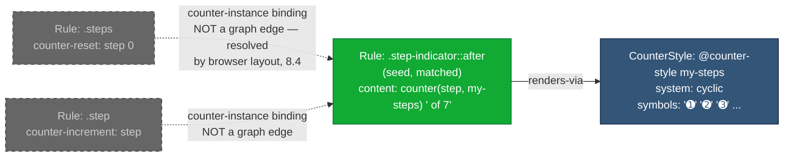

# 505 — CSS Counter Dependency Resolution

## 1. Title

**Critical CSS Extraction Engine — Resolving `@counter-style`, `counter-reset`, `counter-increment`, and `counter()`/`counters()` Dependencies**

## 2. Version

| Field | Value |
|---|---|
| Document Version | 1.0.0 |
| Status | Draft — Phase 7 (Dependency Resolution) |
| Last Updated | 2026-07-09 |
| Owners | Core Architecture Working Group |
| Stability | Depends on [500-Dependency-Resolution-Overview.md](../design/500-Dependency-Resolution-Overview.md)'s per-`NodeKind` dispatch model and [014-Dependency-Graph.md](../architecture/014-Dependency-Graph.md)'s `CounterStyle` node kind (already defined); this document operationalizes discovery for that existing node kind |

## 3. Purpose

This document specifies the algorithm the Dependency Resolver uses to discover and retain `@counter-style` dependencies of any matched rule that uses `counter()` or `counters()` with a custom counter-style name — most commonly inside a `content:` declaration on a `::before`/`::after` pseudo-element, per the CSS Lists and Counters specification.

Counters are CSS's built-in mechanism for numbering things (ordered list items, section headings, custom "Step 3 of 7" UI patterns) without requiring the DOM or JavaScript to compute and inject the numbers. Three declarations cooperate to make a counter work: `counter-reset` (initializes a named counter at the start of a scope), `counter-increment` (advances it), and the `counter()`/`counters()` functional notation (renders its current value, typically inside `content:`). The rendering *style* of that value — whether it renders as `1, 2, 3`, `a, b, c`, `一, 二, 三`, or a fully custom glyph sequence — is governed by a **counter style**, which is either one of roughly 120 browser-native predefined styles (`decimal`, `disc`, `lower-roman`, `cjk-decimal`, etc., defined by the UA and requiring zero extraction-time dependency work) or a page-authored `@counter-style` at-rule that must be retained verbatim if any surviving rule's `counter()`/`counters()` call references it by name.

Dropping a referenced `@counter-style` definition from critical CSS does not make the counter disappear — `counter()` degrades gracefully to the `decimal` style's numbering per spec fallback behavior — but it silently changes what renders. A step indicator authored to show `Step ➊ of ➐` using a custom `@counter-style` with `symbols()`-defined glyphs instead renders `Step 1 of 7`. This is exactly the "syntactically valid but semantically/visually wrong" failure mode [014-Dependency-Graph.md](../architecture/014-Dependency-Graph.md) (Section 3) identifies as the dependency graph's reason for existing, and — like the `@property` case in [504-At-Property.md](./504-At-Property.md) — it is a class of bug that a coarse, first-paint-only visual check will often miss if the counter's *numeral shape* rather than its *position* is what changed.

This document is scoped to the discovery algorithm for `CounterStyle` nodes and their governing edge kind, the relationship between counter scoping and the unrelated concept of CSS variable scoping (a distinction contributors frequently blur), the `symbols()` inline alternative to `@counter-style`, and the interaction with generated content on `::before`/`::after` (cross-referencing [402-Pseudo-Elements.md](../design/402-Pseudo-Elements.md) conceptually, without duplicating that document's content).

## 4. Audience

- Implementers of `packages/dependency-graph`'s `DependencyDiscoverer` component, specifically the `CounterStyle`-kind discovery routine.
- Implementers of the Selector Matcher and CSSOM Walker, since counter usage is discovered from `content:` computed-value inspection on generated-content pseudo-elements, a surface those components already have partial responsibility for per [402-Pseudo-Elements.md](../design/402-Pseudo-Elements.md).
- Authors of the Serializer, who must know that a retained `CounterStyle` node has no selector and is emitted unconditionally, structurally analogous to (but independently discovered from) the `AtProperty` node documented in [504-At-Property.md](./504-At-Property.md).
- Senior engineers auditing correctness of ordered-list, numbered-heading, or custom step-indicator UI patterns in extracted critical CSS.

Readers are assumed to be familiar with the CSS Lists and Counters Module Level 3 specification (`@counter-style`, `counter-reset`, `counter-increment`, `counter()`, `counters()`, `symbols()`, counter scoping rules) at a working level. This document does not re-teach counter semantics from first principles beyond what is necessary to justify the resolution algorithm's design.

## 5. Prerequisites

- [BRIEF.md](../../BRIEF.md) Section 2.5 ("Core Algorithms" → "Dependency Resolution"), which lists `@counter-style` among the tracked constructs.
- [014-Dependency-Graph.md](../architecture/014-Dependency-Graph.md) — read in full for the `CounterStyle` node kind (Section 8.1: "keyed by counter-style name," "discovered via `CSSCounterStyleRule` traversal") and the general fixed-point resolution architecture (Section 8.6) this algorithm plugs into.
- [500-Dependency-Resolution-Overview.md](../design/500-Dependency-Resolution-Overview.md) — the Phase 7 umbrella document.
- [504-At-Property.md](./504-At-Property.md) — structurally the closest sibling algorithm ("resolve a named at-rule dependency of a used identifier, with no selector of its own"); this document reuses several of its architectural patterns (terminal, non-`pending` node state; first-class handling of a construct with no `Rule`-node representation) and calls out where counters diverge.
- [402-Pseudo-Elements.md](../design/402-Pseudo-Elements.md) (Phase 6) — conceptual cross-reference for how generated content on `::before`/`::after` is discovered and matched at all; this document does not duplicate that content, only references it for where `content:` computed values are surfaced to the Dependency Resolver.
- Familiarity with the CSS Lists and Counters Module Level 3 specification, particularly its counter-scoping rules (Section 8.4 below documents the distinction from variable scoping precisely).

## 6. Related Documents

- [500-Dependency-Resolution-Overview.md](../design/500-Dependency-Resolution-Overview.md)
- [501-CSS-Variables.md](./501-CSS-Variables.md) — sibling algorithm; Section 8.4 below explicitly contrasts counter scoping with variable scoping
- [502-Keyframes.md](./502-Keyframes.md) — sibling algorithm, same "named at-rule referenced by an identifier used in a declaration" discovery shape
- [503-Font-Faces.md](./503-Font-Faces.md) — sibling algorithm
- [504-At-Property.md](./504-At-Property.md) — closest structural sibling; read together with this document
- [506-Cascade-Layers.md](./506-Cascade-Layers.md)
- [507-Dependency-Graph-Construction.md](./507-Dependency-Graph-Construction.md) — overall construction algorithm this document's routine plugs into
- [508-Cycle-Detection.md](./508-Cycle-Detection.md)
- [014-Dependency-Graph.md](../architecture/014-Dependency-Graph.md) — architectural definition of `CounterStyle` node
- [402-Pseudo-Elements.md](../design/402-Pseudo-Elements.md) — generated content handling on `::before`/`::after`, cross-referenced conceptually per this document's brief

## 7. Overview

Counter dependency resolution differs from the `@property` case in one structurally important way: a matched `Rule` node's relationship to a counter is not discovered through a single `var()`-style reference lexically embedded in one declaration's value. It requires reasoning about **three separate declaration properties** (`counter-reset`, `counter-increment`, `content`) that may live on **three different rules matching three different elements** (an ancestor establishing the counter scope, a sibling incrementing it, and the `::before`/`::after` pseudo-element actually rendering it via `counter()`), only the last of which carries the counter-style *name* the Dependency Resolver actually needs to chase to an `@counter-style` definition.

This document's algorithm therefore does not attempt to reconstruct the full counter-scoping relationship between `counter-reset`/`counter-increment` declarations (that is a rendering-correctness concern already handled by the browser's own layout/paint pipeline, which the engine relies on per Principle 1 — the engine does not need to simulate counter *value* computation, only ensure the *style definition* used to render whatever value the browser computes is retained). It needs to solve a narrower problem: **for every `content:` computed value that includes a `counter()`/`counters()` invocation naming a non-predefined counter style, find and retain the `@counter-style` rule defining that style name.** This is a one-hop, terminal lookup structurally identical in shape to [504-At-Property.md](./504-At-Property.md)'s registration lookup, but triggered from `content:` inspection rather than from `var()` inspection, and with a distinct scoping model that must not be confused with the custom-property scoping model.

## 8. Detailed Design

### 8.1 Where Counter Usage Is Discovered

Per [402-Pseudo-Elements.md](../design/402-Pseudo-Elements.md), generated content on `::before`/`::after` requires the engine to synthesize a queryable target for `getComputedStyle` (pseudo-elements are not real DOM nodes and cannot be queried by `matches()` the way ordinary elements are; the Selector Matcher's handling of this is that document's concern, not this one). This document's algorithm assumes, as an input contract, that by the time counter discovery runs, the pipeline has already produced, for every matched `::before`/`::after` rule whose declaration block sets a `content` property, the **resolved computed value** of that `content` property via `getComputedStyle(pseudoElementTarget, '::before').content` (or `::after`), obtained through whatever synthesis mechanism [402-Pseudo-Elements.md](../design/402-Pseudo-Elements.md) specifies (that document owns exactly how a queryable pseudo-element target is constructed; this document only consumes its output).

Given that resolved `content` computed value string, the algorithm performs a narrowly-scoped lexical scan — analogous in spirit and in Principle-2-compatibility justification to [504-At-Property.md](./504-At-Property.md) Section 8.2's `var(--x, ...)` token extraction — for `counter(` and `counters(` functional-notation occurrences, extracting:

- The **counter name** (first argument) — not itself a dependency-graph node; counter names are not at-rules, they are ordinary identifiers whose *value* is computed by the browser's layout engine, never retained as a CSS construct in their own right.
- The **counter-style argument** (second argument to `counter()`/`counters()`, comma-separated, e.g. `counter(step, lower-roman)` or `counter(section, my-custom-style)`) — this is the identifier this algorithm actually cares about, since it names either a predefined style (no dependency) or a custom `@counter-style` (a dependency to resolve).
- The **separator string** (for `counters()`'s required middle argument, e.g. `counters(section, ".", decimal)`) — irrelevant to dependency resolution, ignored.

If `counter()`/`counters()` is called with **no** counter-style argument at all (e.g. bare `counter(section)`), the default style is `decimal` per spec — a predefined style requiring no dependency resolution (Section 8.2).

### 8.2 Predefined vs. Custom Counter Styles

The CSS Counter Styles Level 3 specification defines roughly 120 predefined counter styles (`decimal`, `decimal-leading-zero`, `arabic-indic`, `armenian`, `disc`, `circle`, `square`, `lower-roman`, `upper-roman`, `lower-alpha`, `lower-latin`, `cjk-decimal`, `cjk-ideographic`, `hiragana`, `katakana`, `ethiopic-numeric`, and many more), all of which are implemented natively by the browser's rendering engine with no author-supplied CSS required. This algorithm must recognize any of these names and treat them as requiring **zero** dependency resolution — no `CounterStyle` node, no edge, nothing to retain, because there is nothing to retain: the browser already knows how to render `decimal` and `disc` without any CSS being served at all.

Critically, this recognition must not be done via a hardcoded engine-side enumeration of "the ~120 predefined names" checked against a string literal list, for the same Principle-1 reason [504-At-Property.md](./504-At-Property.md) Section 8.4 gives for trusting CSSOM presence over reimplementing browser validation: predefined counter-style names are UA-defined and could in principle vary or be extended between browser versions/engines, and hardcoding a snapshot of "the list as of this writing" risks silent staleness. Instead, the algorithm asks the browser directly: **if no `CSSCounterStyleRule` with the queried name exists anywhere in the page's CSSOM, the name is either a predefined style or an unrecognized/invalid identifier — in either case, there is no author-defined `@counter-style` dependency to resolve**, and the algorithm's job is done without needing to distinguish "predefined" from "typo/unrecognized" any further, because both cases resolve to the same action: no `CounterStyle` node. This mirrors [504-At-Property.md](./504-At-Property.md) Section 8.2 step 3's "zero matches means nothing to retain" logic exactly, and is the same architectural move: let CSSOM presence (or absence) answer the question, rather than encoding spec knowledge that could drift from the browser's actual implementation.

### 8.3 `symbols()` — The Inline Alternative

CSS Counter Styles Level 3 provides `symbols()` as a functional-notation shorthand that defines an **anonymous, inline** counter style directly inside a `counter()`/`counters()` call or a `list-style-type` value — e.g. `list-style-type: symbols(cyclic "★" "☆");` or, relevant to this document, potentially as the second argument position in contexts that accept an inline style definition. Unlike a named `@counter-style` at-rule, `symbols()` has **no separate rule to discover or retain**: its entire definition is inline, inside the very declaration that uses it, and is therefore already captured in full by the ordinary declaration-retention pathway (the `Rule` node itself, already retained because it structurally matched) — there is nothing transitive to chase.

This means the counter-discovery algorithm must correctly distinguish `counter(section, symbols(cyclic "★" "☆"))`-shaped values (no dependency to resolve — the "style" is inline and self-contained) from `counter(section, my-custom-style)`-shaped values (a named identifier requiring the lookup in Section 8.2). The lexical extraction in Section 8.1 handles this naturally: if the counter-style argument position's value is itself a nested function call (`symbols(...)`) rather than a bare identifier, the algorithm skips dependency lookup entirely for that occurrence — there is no name to look up, because there is no name at all, only an inline definition. This is analogous to how [504-At-Property.md](./504-At-Property.md) never needs to consider "inline custom property definitions," since no such construct exists for `@property` — `symbols()` is a counter-specific escape hatch to a real `@counter-style` block that has no `@property` analogue, and is worth calling out explicitly since an implementer porting patterns from [504-At-Property.md](./504-At-Property.md) might otherwise assume every referenced-by-name construct requires the same at-rule lookup unconditionally.

### 8.4 Counter Scoping vs. Custom Property Scoping — A Necessary Distinction

This is the single most important conceptual clarification this document must make, because the two scoping models are easy to conflate and getting it wrong leads directly to incorrect dependency edges.

**Custom property scoping** (per [501-CSS-Variables.md](./501-CSS-Variables.md) and [014-Dependency-Graph.md](../architecture/014-Dependency-Graph.md) Section 8.1's `Variable` node key `(propertyName, definingSelectorScope)`) is a **cascade-and-inheritance** concept: a custom property's *value* is resolved per element via ordinary CSS cascade rules, and its *availability* to a descendant is governed by CSS inheritance (unless `@property`'s `inherits: false` opts out, per [504-At-Property.md](./504-At-Property.md) Section 12). There is no notion of "the same property name meaning something structurally different" depending on DOM position beyond ordinary specificity/inheritance — `--x` is `--x` everywhere; only its *resolved value* varies by element.

**Counter scoping**, by contrast, is a **structural, nesting-based nominal nesting concept entirely independent of the cascade**. Per the CSS Lists and Counters specification, `counter-reset` creates a **new counter instance in a new scope** rooted at the element it's declared on; a counter with the same *name* declared via `counter-reset` on a descendant element creates a genuinely separate, independently-tracked counter instance that shadows the ancestor's counter of the same name for that subtree, in a manner structurally closer to lexical variable shadowing in a programming language than to CSS cascade/inheritance. Two elements each running `counter-reset: item;` in unrelated subtrees have two completely independent counters that never interact, regardless of specificity, source order, or `!important` — none of the ordinary cascade machinery applies to *which counter instance* a given `counter-increment: item;` or `counter(item)` binds to; that binding is resolved purely by DOM tree structure (nearest ancestor-or-self `counter-reset` for that name, walking up the tree, an entirely separate resolution algorithm from cascade resolution).

**Why this distinction matters for this algorithm specifically**: it means the Dependency Resolver's job here is narrower, not broader, than the `Variable` case. Because counter *scoping* (which `counter-reset` a given `counter-increment`/`counter()` binds to) is a rendering-time, browser-computed structural fact this engine never needs to model or resolve itself — the engine does not need a `Counter` node kind analogous to `Variable` representing "this specific counter-reset instance," and does not need `inherits-from`-style edges modeling counter-instance binding at all. The *only* thing requiring graph representation is the **counter-style name lookup** (Section 8.2), which is a flat, global, non-scoped namespace lookup (`@counter-style` names are not nested/scoped the way counter *instances* are — a `@counter-style my-style { ... }` rule defines `my-style` globally for the whole document, full stop, no DOM-position-dependent shadowing at all). This document's algorithm is therefore free to treat counter-style name resolution exactly as flatly as [504-At-Property.md](./504-At-Property.md) treats property-name registration resolution — a global `Map<string, CSSCounterStyleRule>` lookup — precisely because counter-style *names* do not participate in the tree-structural scoping that counter *values* do. Conflating these two scoping concepts is the most likely mistake a future contributor could make when extending this algorithm, hence this section's length.

### 8.5 Dependency Graph Diagram



Note the two dashed relationships from `R2`/`R3` to `R1`: these represent the counter-*instance* binding (which `counter-reset`/`counter-increment` a given `counter()` call's value derives from) and are deliberately **not** modeled as dependency-graph edges at all, per Section 8.4 — they are rendering-time structural facts the browser resolves independently, not extraction-time facts this graph needs to encode. `R2` and `R3` are retained in the critical CSS output (if they are themselves matched, above-fold rules) through the ordinary Selector Matcher seeding pathway, on their own merits, not because this algorithm discovered them as counter dependencies of `R1`. If `R2`/`R3` are *not* matched (e.g. `.steps`/`.step` are below the fold), the counter's *numeric value* on the retained, above-fold `R1` may render incorrectly (starting from an unresolved base) — but this is a **visibility/matching-boundary correctness concern**, structurally identical to any other case where an above-fold element's rendering depends on below-fold DOM/CSS state, and is explicitly out of scope for the Dependency Resolver (whose job is "what CSS constructs does a retained rule need," not "is the retained rule's *rendered value* correct given what else was excluded") — see Section 12 for this edge case discussed explicitly.

## 9. Architecture

### 9.1 Where This Discovery Routine Sits

```mermaid
sequenceDiagram
    participant FPR as FixedPointResolver
    participant PE as Pseudo-Element content<br/>resolution (402-Pseudo-Elements.md)
    participant CD as CounterStyleDiscoverer<br/>(this document)
    participant CSSOM as Live CSSOM /<br/>CSSCounterStyleRule index

    FPR->>PE: resolve computed content: value<br/>for matched ::before/::after Rule
    PE-->>FPR: resolved content string
    FPR->>CD: discover(RuleNode, resolvedContentString)
    CD->>CD: lexically extract counter()/counters()<br/>occurrences (8.1); skip symbols() (8.3)
    loop for each named counter-style argument
        CD->>CSSOM: lookup CSSCounterStyleRule index[name]
        CSSOM-->>CD: none | rule
        alt none found
            CD-->>FPR: predefined or unrecognized — no CounterStyle node
        else rule found
            CD-->>FPR: CounterStyle node + renders-via edge
        end
    end
```

Unlike [504-At-Property.md](./504-At-Property.md), where discovery is triggered as a secondary step attached to `Variable`-node discovery, this routine is triggered directly from `Rule`-node discovery (specifically, the subset of `Rule` nodes matching `::before`/`::after` with a `content` declaration containing `counter()`/`counters()`), because there is no intermediate node analogous to `Variable` in the counter case — the counter *name* itself is not a graph node (Section 8.4), so there is nothing for this routine to attach to except the `Rule` node directly. This is dispatched as its own `NodeKind`-adjacent strategy within `DependencyDiscoverer` (per [014-Dependency-Graph.md](../architecture/014-Dependency-Graph.md) Section 9.2), conditioned on the `Rule` node's matched pseudo-element type and declaration set, coordinating with whatever routine [402-Pseudo-Elements.md](../design/402-Pseudo-Elements.md) specifies for resolving `content:` computed values in the first place.

### 9.2 Interaction with the Cascade Resolver and Serializer

Exactly as with `AtProperty` nodes (per [504-At-Property.md](./504-At-Property.md) Section 9.2), a `CounterStyle` node has no selector and does not participate in ordinary cascade competition — there is at most one `@counter-style` rule per name in a well-formed page (the CSS Counter Styles specification does define behavior for duplicate `@counter-style` names — later declarations with the same name in the same cascade origin/layer context override earlier ones, which is the **opposite** convention from `@property`'s first-wins rule, and is called out explicitly in Section 12 to avoid the reverse mistake of assuming counter styles follow `@property`'s first-wins rule by analogy). The Cascade Resolver treats every retained `CounterStyle` node as unconditionally emitted; the Serializer emits it verbatim from CSSOM-observed descriptor values, never reconstructing it from a re-parsed AST, consistent with Principle 1.

## 10. Algorithms

### 10.1 Algorithm: Counter-Style Dependency Discovery

**Problem statement.** Given a matched `Rule` node representing a `::before`/`::after` declaration block whose `content` property's resolved computed value contains one or more `counter()`/`counters()` invocations, determine which invocations name a custom, author-defined counter style (as opposed to a predefined style, an unrecognized name, or an inline `symbols()` definition), and for each such name, materialize a `CounterStyle` node and a `renders-via` edge from the `Rule` node.

**Inputs.**
- `ruleNode: RuleNode` — the matched `::before`/`::after` rule.
- `resolvedContent: string` — the computed value of `content` for this pseudo-element, obtained per [402-Pseudo-Elements.md](../design/402-Pseudo-Elements.md)'s resolution mechanism.
- `counterStyleRuleIndex: Map<string, CSSCounterStyleRule>` — a pre-built index of every `@counter-style` rule in the page's CSSOM, keyed by name, built once during CSSOM Walker traversal (analogous to [504-At-Property.md](./504-At-Property.md) Section 10.1's `propertyRuleIndex`, but with duplicate-handling semantics per Section 12's "later wins" clarification, opposite of the `@property` case).

**Outputs.** Zero or more `CounterStyle` nodes added to the graph, plus a `renders-via` edge from `ruleNode` to each.

**Pseudocode.**

```text
function discoverCounterStyleDependencies(ruleNode, resolvedContent, counterStyleRuleIndex, graph) -> void:
    invocations = extractCounterInvocations(resolvedContent)
    // extractCounterInvocations performs the lexical scan of 8.1:
    // finds every counter(...) / counters(...) occurrence, and for each,
    // returns { counterName, styleArgument } where styleArgument is either:
    //   - null                (no style argument given -> defaults to 'decimal')
    //   - { kind: 'identifier', name: string }   (named style, e.g. 'my-steps')
    //   - { kind: 'inline-symbols', raw: string } (symbols(...) call, 8.3)

    for invocation in invocations:
        styleArg = invocation.styleArgument

        if styleArg == null:
            continue   // defaults to 'decimal' — predefined, no dependency

        if styleArg.kind == 'inline-symbols':
            continue   // 8.3 — self-contained, already part of ruleNode's own declaration

        // styleArg.kind == 'identifier'
        name = styleArg.name
        counterStyleRule = counterStyleRuleIndex.get(name)   // O(1)

        if counterStyleRule == null:
            continue   // predefined browser-native style, or unrecognized/typo — 8.2

        nodeId = "counterstyle:" + name
        if not graph.hasNode(nodeId):
            counterStyleNode = new CounterStyleNode(
                id = nodeId,
                name = name,
                system = counterStyleRule.system,
                symbols = counterStyleRule.symbols,        // where applicable to `system`
                fallback = counterStyleRule.fallback,
                origin = originOf(counterStyleRule),
                discoveredAt = 'transitive',
                resolutionState = 'resolved'   // terminal, no further references — 11
            )
            graph.addNode(counterStyleNode)
        else:
            counterStyleNode = graph.getNode(nodeId)

        edge = new GraphEdge(sourceId = ruleNode.id, targetId = counterStyleNode.id, kind = 'renders-via')
        graph.addEdge(edge)   // deduplicated by (source, target, kind)
```

**Time complexity.** `O(1)` amortized per `counter()`/`counters()` invocation, given the pre-built index — the expensive part (enumerating every `@counter-style` rule across every stylesheet) is paid once, up front, at `O(C)` where `C` is the total number of `@counter-style` rules on the page (typically very small — single digits to low tens even in counter-heavy design systems). Per matched `Rule` node with generated content, invocation extraction is `O(L)` where `L` is the length of the resolved `content` string (bounded, trivial). Across the whole seed set's transitive closure, this routine contributes `O(D)` total work, consistent with the bound established generally in [014-Dependency-Graph.md](../architecture/014-Dependency-Graph.md) Section 10.1.

**Memory complexity.** `O(C)` for the one-time index; `O(1)` additional `CounterStyle` nodes per distinct custom style name actually referenced (bounded above by `C`).

**Failure cases.**
- A `counter()`/`counters()` invocation inside a cross-origin, non-introspectable stylesheet's declaration — the `content` computed value is still readable via `getComputedStyle` regardless of which stylesheet declared it (computed style is not subject to the same-origin CSSOM read restriction that `sheet.cssRules` is), so the *invocation* is always discoverable; only the *target* `@counter-style` rule's own stylesheet being cross-origin could make it unindexable, degrading identically to [504-At-Property.md](./504-At-Property.md) Section 10.1's cross-origin failure case (silent under-approximation plus a shared `CrossOriginStylesheetSkippedWarning` diagnostic).
- Malformed or engine-nonconformant `counter()`/`counters()` syntax in authored CSS that nonetheless produces a non-empty computed `content` value on some non-compliant browser engine — guarded defensively; unparseable invocations are skipped rather than aborting discovery for the whole rule.
- A counter-style name colliding with a predefined name (e.g., an author mistakenly defines `@counter-style decimal { ... }`, attempting to override a UA-predefined style) — per spec this is legal and the author's `@counter-style decimal` *does* override the predefined one for that document; the index-lookup approach (Section 8.2) handles this correctly automatically, since the index would contain an entry for `"decimal"` in this case, and the algorithm would correctly retain it as a dependency rather than assuming "decimal is always predefined, never look it up," which is precisely why this document insists on always checking CSSOM presence rather than hardcoding predefined-name knowledge.

**Optimization opportunities.** Same cross-viewport memoization opportunity as [504-At-Property.md](./504-At-Property.md) Section 10.1: `counterStyleRuleIndex` is viewport-invariant within a route and can be built once, reused across Mobile/Tablet/Desktop passes.

### 10.2 Algorithm: Duplicate `@counter-style` Resolution (Last-Wins, Contrasted with `@property`'s First-Wins)

**Problem statement.** Determine which `CSSCounterStyleRule` wins when multiple `@counter-style` rules share the same name, and build the index (Section 10.1's `counterStyleRuleIndex`) to reflect the correct winner — explicitly contrasted with [504-At-Property.md](./504-At-Property.md) Section 8.5/10.2's first-wins rule for `@property`, since the two constructs resolve duplicates in **opposite** directions and this is a documented, easily-inverted trap.

**Verified specification behavior.** Per CSS Counter Styles Level 3, `@counter-style` participates in the ordinary cascade the way most at-rules that define named, reusable constructs do for this purpose: when multiple `@counter-style` rules declare the same name, normal CSS cascade-like "later declaration wins" behavior applies (subject to the same origin/layer/media-condition-active considerations that apply to ordinary style rules) — this is **not** a once-only registration model like `@property`'s (Section 9.2's earlier note); it is closer to how, e.g., a later `@font-face` for the same `font-family` name with an overlapping `unicode-range` would be considered by descriptor-matching rather than by a single global "first taken" rule. For the purposes of this document's index-construction algorithm, the practical, implementable rule is: **the last `@counter-style` rule for a given name, in document/stylesheet/rule traversal order, among those whose containing conditional blocks (`@media`/`@supports`/`@layer`) are currently active, wins** and should be the value stored in `counterStyleRuleIndex` for that name.

**Inputs.** `candidateRules: CSSCounterStyleRule[]`, in document/stylesheet/rule traversal order, already filtered to only those inside currently-active conditional blocks (mirroring [504-At-Property.md](./504-At-Property.md) Section 12's conditional-block edge case).

**Outputs.** `winningRule: CSSCounterStyleRule | null`.

**Pseudocode.**

```text
function resolveWinningCounterStyle(candidateRules) -> CSSCounterStyleRule | null:
    if candidateRules.isEmpty():
        return null
    // LAST-WINS, in contrast to 504-At-Property.md's FIRST-WINS for @property.
    // Do not copy 504's tiebreak here — the two constructs have opposite
    // duplicate-resolution semantics per spec (10.2 above).
    return candidateRules
        .sortedBy(rule => (rule.origin.stylesheetIndex, rule.origin.ruleIndex))
        .last()
```

**Time complexity.** `O(C log C)` for the (typically tiny) candidate set per name; negligible.

**Memory complexity.** `O(C)`.

**Failure cases.** If layer ordering interacts with source order in a way that inverts naive "later in document order" reasoning (a `@counter-style` in a lower-priority layer declared later in the document could still lose to one in a higher-priority layer declared earlier, mirroring ordinary cascade layer precedence over source order for equal-specificity competition) — the index-construction routine must consult resolved layer order (obtained the same way [014-Dependency-Graph.md](../architecture/014-Dependency-Graph.md) Section 8.5 obtains it for ordinary rules: from the browser's resolved cascade behavior, not by re-deriving `@layer` declaration order by hand) rather than assuming pure source order is sufficient once `@layer` is in play. This is flagged as a required correctness refinement to the naive pseudocode above, addressed at the implementation level (see Implementation Notes).

**Optimization opportunities.** None beyond the sort itself; `C` is bounded by a small constant in virtually every real page.

## 11. Implementation Notes

- The `counterStyleRuleIndex` (Section 10.1) should be built as a side effect of the CSSOM Walker's existing single traversal of `document.styleSheets`, exactly per [504-At-Property.md](./504-At-Property.md) Section 11's guidance for `propertyRuleIndex` — do not perform an independent second traversal solely for counter-style discovery.
- Unlike [504-At-Property.md](./504-At-Property.md)'s index (which must preserve *first*-occurrence order to support first-wins), this index's construction should, for correctness robustness against the layer-ordering subtlety in Section 10.2's failure case, delegate the actual winner determination to a browser-observable signal wherever feasible — e.g., cross-checking the index's naive last-wins pick against `getComputedStyle`-observable rendering behavior of a synthetic probe element using that counter style, rather than trusting pure source-order sorting unconditionally, mirroring the general principle (per [014-Dependency-Graph.md](../architecture/014-Dependency-Graph.md) Section 8.5) of preferring browser-resolved cascade facts over hand-derived declaration-order reasoning wherever layers are involved.
- `CounterStyleNode.resolutionState` is set to `'resolved'` immediately upon creation, never `'pending'` — a `@counter-style` rule's descriptors (`system`, `symbols`, `fallback`, `range`, `pad`, `additive-symbols`, `negative`, `prefix`, `suffix`, `speak-as`) are terminal values with no further graph-node references of their own to chase, exactly analogous to [504-At-Property.md](./504-At-Property.md) Section 11's identical note for `AtPropertyNode`. One caveat: a `@counter-style`'s `fallback` descriptor names *another* counter style (used when the primary system runs out of symbols, e.g. an `alphabetic` system exhausting its symbol list) — this is itself a potential transitive dependency and must be chased: if `fallback: my-other-style` names a custom style, the discovery routine must recursively look up `my-other-style` in the same index and add a `renders-via` edge from the first `CounterStyle` node to the second, mirroring the general fixed-point discovery pattern rather than treating `@counter-style` nodes as unconditionally leaf-only. (This is a refinement to the "terminal, no further references" claim above — terminal with respect to `Rule`-triggered discovery shape, not terminal with respect to `fallback` chains specifically.)
- Emit the shared `CrossOriginStylesheetSkippedWarning` diagnostic (per [504-At-Property.md](./504-At-Property.md) Section 11) tagged `source: '505-Counters'` when a counter-style lookup cannot be resolved due to cross-origin stylesheet restrictions.
- Serialize the winning `@counter-style` rule verbatim from CSSOM-observed descriptor values, never from a re-parsed/reconstructed AST, per Principle 1 — identical guidance to [504-At-Property.md](./504-At-Property.md) Section 11.

## 12. Edge Cases

- **`@counter-style` duplicate resolution is last-wins, opposite of `@property`'s first-wins.** Restated here as an explicit edge case (beyond Section 10.2's algorithmic treatment) because it is the single most likely copy-paste bug an implementer familiar with [504-At-Property.md](./504-At-Property.md) could introduce: applying that document's first-wins tiebreak to this document's index construction would silently select the wrong counter style whenever a page legitimately overrides a counter style later in its stylesheet cascade (a common, intentional pattern — e.g., a base design-system stylesheet defines a default numbering style, and a page-specific override stylesheet loaded later redefines it).
- **Counter scoping is not modeled in the graph at all — restated as an edge case, not just a design note (Section 8.4).** A below-fold `counter-reset` establishing the scope for an above-fold `counter()` usage is a real rendering-correctness risk (the retained, above-fold rule may render an incorrect counter value, e.g. starting from browser-default `0` instead of an authored non-zero starting value) that this algorithm does **not** detect or fix, by design — it is a visibility-boundary concern (does the extraction correctly capture what's needed for above-fold rendering *given* what's below the fold is excluded), analogous to a below-fold ancestor's `display: flex` affecting an above-fold child's layout, and is explicitly the Visibility Engine's and Cascade Resolver's joint concern, not this algorithm's. This document only guarantees the counter-*style definition* is retained if referenced; it makes no claim about counter *value* correctness across the fold boundary.
- **`symbols()` nested inside `list-style-type` rather than `counter()`'s style argument.** `symbols()` is valid in multiple grammar positions (`list-style-type: symbols(...)`, and as the style argument to `counter()`/`counters()`); this algorithm's lexical scan (Section 8.1) is scoped specifically to the `content:` property's `counter()`/`counters()` occurrences, per this document's stated scope (generated content on `::before`/`::after`) — `list-style-type: symbols(...)` on an ordinary list element is a separate, simpler case with no `@counter-style` lookup needed at all (there is no named identifier to look up), and does not require this algorithm's involvement, though it is worth noting explicitly so an implementer does not assume this routine needs to also scan `list-style-type` values; it does not, because `list-style-type`'s only *named* counter-style reference (`list-style-type: my-custom-style;`, a bare identifier, not a `symbols()` call) is a distinct discovery surface this document's Section 8.1 scan (scoped to `content:`) does not cover and which is flagged as a related-but-out-of-scope gap in Future Work.
- **`counter-reset`/`counter-increment` referencing `all` (the reserved "all counters" keyword).** `counter-reset: all;` resets every currently-known counter in scope to its initial value; this has no interaction with `@counter-style` name resolution whatsoever (it affects counter *instances*, not counter *style definitions*, per Section 8.4's scoping distinction) and requires no special handling by this algorithm.
- **A `content:` value using `counter()` inside a CSS `@supports`/`@media`-conditioned rule that is not currently active.** If the containing conditional block is inactive at extraction time, the rule is not in the matched seed set (or its `conditioned-by` edge target evaluates false) and this algorithm never runs for it at all — consistent with the general `conditioned-by` handling in [014-Dependency-Graph.md](../architecture/014-Dependency-Graph.md) Section 8.2; no special-casing needed here beyond what the general pipeline already guarantees.
- **Nested/chained `fallback` counter styles forming a cycle** (e.g. `@counter-style a { fallback: b; }` / `@counter-style b { fallback: a; }`) — per Implementation Notes' caveat, `fallback` chains are chased transitively; a cyclic fallback chain is spec-legal in the sense that the browser has defined, non-crashing behavior for it (falls back to `decimal` once a fallback cycle is detected at render time, per spec), but this algorithm's own transitive-chase logic must guard against infinite recursion when building `renders-via` edges for `fallback` chains — bounded by a small, fixed recursion-depth guard (not the full generic cycle-detection machinery of [508-Cycle-Detection.md](./508-Cycle-Detection.md), since per [014-Dependency-Graph.md](../architecture/014-Dependency-Graph.md) Section 8.2's scoping argument, `renders-via` edges are declared architecturally acyclic and out of that document's cycle-detection scope; a `fallback`-chain cycle would be a rare exception to that general architectural assumption, worth flagging as a narrow, self-contained guard local to this algorithm rather than escalating to the general-purpose cycle detector).

## 13. Tradeoffs

| Decision | Why | Alternative Considered | Tradeoff Accepted |
|---|---|---|---|
| Model counter-style *name* resolution as a flat, global lookup with no counter-*scoping* modeling in the graph (Section 8.4) | Counter-style names are genuinely global/unscoped per spec, unlike counter *instances*; modeling instance-scoping would require simulating browser layout logic the engine has no need to duplicate (Principle 1) | Model counter-reset/counter-increment/counter() bindings as graph edges analogous to `inherits-from` for variables | Would add substantial graph complexity and violate Principle 1 (re-deriving browser-computed structural facts) for a correctness dimension (counter *value*) this graph does not claim to guarantee anyway (Section 12) |
| Distinguish `symbols()` inline definitions from named `@counter-style` lookups explicitly (Section 8.3) rather than treating every style argument uniformly | `symbols()` has no separate rule to discover; treating it as a lookup target would either error or silently no-op incorrectly | Attempt to treat `symbols(...)` as a synthetic, on-the-fly `CounterStyle` node for uniformity | Unnecessary complexity — the inline definition is already fully captured by the retained `Rule` node itself; a synthetic node would just be redundant bookkeeping |
| Last-wins duplicate resolution for `@counter-style` (Section 10.2), explicitly contrasted with `@property`'s first-wins | Verified against spec; the two constructs are governed by different resolution models (cascade-like vs. once-only registration) and conflating them produces a real correctness bug | Apply a single, uniform duplicate-resolution rule across all named at-rule constructs for implementation simplicity | Simplicity is not available here without sacrificing correctness — the spec genuinely does specify opposite behaviors, and this document documents the divergence explicitly rather than picking a false uniformity |
| Chase `fallback` chains transitively with a narrow, local recursion guard rather than escalating to the general cycle detector (Section 12) | `fallback` cycles are a rare, narrow exception to the otherwise-safe "renders-via is acyclic" architectural assumption in [014-Dependency-Graph.md](../architecture/014-Dependency-Graph.md); a small local guard is proportionate | Escalate `fallback` edges into the general `references`/`inherits-from`/`layered-under` cycle-detection scope | Would force a scope change to the general cycle detector's architecture (per [014-Dependency-Graph.md](../architecture/014-Dependency-Graph.md) Section 8.2) for a narrow, low-frequency case better handled locally |

## 14. Performance

- **CPU complexity.** `O(C)` one-time index construction plus `O(D)` amortized lookups across the seed set's transitive closure, where `C` is total `@counter-style` rules on the page (typically very small) and `D` is the transitively-discovered node count — negligible relative to the browser-round-trip-dominated cost of the outer fixed-point loop, consistent with [014-Dependency-Graph.md](../architecture/014-Dependency-Graph.md) Section 14 and [504-At-Property.md](./504-At-Property.md) Section 14's identically-shaped analysis.
- **Memory complexity.** `O(C)` for the index; negligible additional `CounterStyle` node memory.
- **Caching strategy.** `counterStyleRuleIndex` is viewport-invariant within a route and should be memoized across Mobile/Tablet/Desktop passes exactly as [504-At-Property.md](./504-At-Property.md) Section 14 recommends for `propertyRuleIndex`; the whole resolved graph remains a candidate for the engine's fingerprint-keyed extraction cache per [014-Dependency-Graph.md](../architecture/014-Dependency-Graph.md) Section 14.
- **Parallelization opportunities.** Index construction happens inline during the CSSOM Walker's existing single-pass traversal; no additional parallelism opportunity beyond what that traversal already exploits.
- **Incremental execution.** Discovery is naturally idempotent per `Rule` node (each matched generated-content rule is only discovered once, guarded the same way as every other node in the fixed-point loop per [014-Dependency-Graph.md](../architecture/014-Dependency-Graph.md) Section 8.6); a cache-hit on the overall extraction fingerprint skips this stage entirely.
- **Scalability limits.** Bounded by `@counter-style` count (`C`, small in practice) and `fallback`-chain depth (Section 12's recursion guard bounds pathological cases); no scenario in realistic pages approaches a scalability concern at this layer.

## 15. Testing

- **Unit tests.** `extractCounterInvocations` tested against a battery of `content:` computed-value strings covering bare `counter()`, `counter()` with a named style, `counter()` with `symbols()` inline, `counters()` with a separator and named style, and malformed/edge-case strings; `resolveWinningCounterStyle` tested against candidate orderings to confirm last-wins (not first-wins) selection, explicitly asserting the opposite result from [504-At-Property.md](./504-At-Property.md)'s equivalent test to guard against the copy-paste risk flagged in Section 12.
- **Integration tests.** A dedicated fixture with a custom `@counter-style` (custom `system`/`symbols`) driving a `::before`/`::after` step-indicator pattern must assert the resolved graph contains the `CounterStyle` node and `renders-via` edge, and that serialized critical CSS includes the verbatim `@counter-style` block — asserting on graph shape, not merely final rendered output, per the discipline established in [014-Dependency-Graph.md](../architecture/014-Dependency-Graph.md) Section 15.
- **Visual tests.** Rendering-parity comparison between critical-CSS-only and full-CSS renders, specifically checking the *glyph shapes* rendered by a custom counter style (not just numeral position/spacing) — a missing `CounterStyle` node degrades to `decimal` fallback per spec, which can be visually subtle (a small circled-number glyph becoming a plain digit) and easy for a coarse visual diff threshold to miss; this test must be tuned to catch glyph-level, not just layout-level, divergence.
- **Stress tests.** A fixture with a long `fallback` chain (non-cyclic, e.g. 20 links) to verify the transitive chase terminates correctly within the local recursion guard's bound, and a separate fixture with a deliberate `fallback` cycle to verify the guard catches it without infinite recursion or a crash.
- **Regression tests.** Any production incident involving a missing/incorrect counter-style in critical CSS output must gain a permanent fixture + golden-graph-snapshot regression test, per the golden-snapshot philosophy in [014-Dependency-Graph.md](../architecture/014-Dependency-Graph.md) Section 15.
- **Benchmark tests.** Include a counter-heavy variant (numbered headings, ordered-list-like custom UI, step indicators) in the `fixtures/enterprise-huge/` benchmark suite to confirm the index-based lookup approach's constant-factor advantage holds at scale, per [014-Dependency-Graph.md](../architecture/014-Dependency-Graph.md) Section 15's benchmarking conventions.

## 16. Future Work

- **Extend discovery to `list-style-type: my-custom-style;` (bare named counter-style references outside `counter()`/`counters()`)** — flagged in Section 12 as a related-but-currently-out-of-scope gap; this is a legitimate additional discovery surface for the same `CounterStyle` node kind and should be added as a second trigger pathway (from ordinary `list-style-type` computed-value inspection on `<li>`/other list-affecting elements, not solely from `content:` on generated-content pseudo-elements) in a future revision of this document or a companion algorithm note.
- **Investigate whether counter *value* correctness across the visibility fold boundary (Section 12's second edge case) warrants a dedicated diagnostic** — e.g., a `PossibleIncorrectCounterValueWarning` emitted by the Reporter when an above-fold `counter()` usage's nearest matching `counter-reset`/`counter-increment` ancestor chain includes a below-fold, unmatched element, even though this document's Dependency Resolver does not attempt to fix the underlying rendering-fidelity question itself.
- **Formal verification or property-based testing of the `fallback`-chain recursion guard** against arbitrary, randomly generated `@counter-style` graphs, mirroring the property-based testing research direction flagged generally in [014-Dependency-Graph.md](../architecture/014-Dependency-Graph.md) Section 16 and specifically in [504-At-Property.md](./504-At-Property.md) Section 16.
- **Open question: should predefined counter-style names be explicitly enumerated and cross-checked against a bundled reference list purely for diagnostic purposes** (e.g., to distinguish, in Reporter output, "recognized predefined style" from "unrecognized name, likely a typo") **without using that list for correctness decisions** (which per Section 8.2 must remain CSSOM-presence-driven, not hardcoded-list-driven)? This would be a diagnostics-only enhancement, not a change to the resolution algorithm itself, and should be considered once `apps/visualizer` (Phase 5 roadmap ambition) needs richer "why was this kept / why did this render differently" explanations.
- **Monitor CSS Counter Styles specification evolution for layer-interaction clarifications** relevant to Section 10.2's failure case (duplicate resolution under `@layer` ordering) — the interaction between cascade layers and non-style-rule at-rules like `@counter-style` is a comparatively newer area of the specification and worth periodic re-verification as browser implementations mature.

## 17. References

- [500-Dependency-Resolution-Overview.md](../design/500-Dependency-Resolution-Overview.md)
- [501-CSS-Variables.md](./501-CSS-Variables.md) — contrasted scoping model, Section 8.4
- [502-Keyframes.md](./502-Keyframes.md)
- [503-Font-Faces.md](./503-Font-Faces.md)
- [504-At-Property.md](./504-At-Property.md) — closest structural sibling; first-wins vs. last-wins contrast, Section 10.2
- [506-Cascade-Layers.md](./506-Cascade-Layers.md)
- [507-Dependency-Graph-Construction.md](./507-Dependency-Graph-Construction.md)
- [508-Cycle-Detection.md](./508-Cycle-Detection.md)
- [014-Dependency-Graph.md](../architecture/014-Dependency-Graph.md) — `CounterStyle` node kind (Section 8.1), `renders-via` edge kind (Section 8.2)
- [402-Pseudo-Elements.md](../design/402-Pseudo-Elements.md) — generated content on `::before`/`::after`, cross-referenced conceptually per this document's brief
- [001-Vision.md](../architecture/001-Vision.md) — Principle: browser as source of truth
- [006-Design-Principles.md](../architecture/006-Design-Principles.md) — Principles 1, 2, 5, 6 referenced throughout
- W3C CSS Lists and Counters Module Level 3 (`counter-reset`, `counter-increment`, `counter()`, `counters()`, counter scoping) — https://www.w3.org/TR/css-lists-3/
- W3C CSS Counter Styles Level 3 (`@counter-style`, `symbols()`, predefined styles, `fallback`, `system`) — https://www.w3.org/TR/css-counter-styles-3/
- MDN: `@counter-style` — https://developer.mozilla.org/en-US/docs/Web/CSS/@counter-style
- MDN: `counter()` / `counters()` — https://developer.mozilla.org/en-US/docs/Web/CSS/counter
- MDN: `symbols()` — https://developer.mozilla.org/en-US/docs/Web/CSS/symbols
