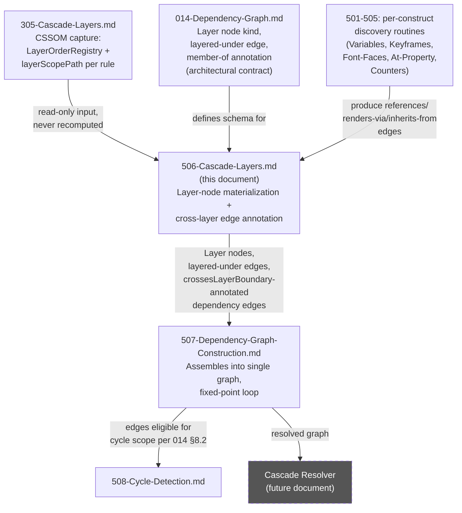
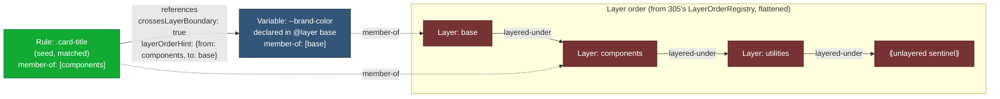

# 506 — Cascade Layers as a Dependency-Graph Edge Type

## 1. Title

**Dependency Resolution Algorithm RFC: Cascade Layers (`layered-under` Edge Semantics and Fixed-Point Interaction)**

## 2. Version

| Field | Value |
|---|---|
| Document Version | 1.0.0 |
| Status | Draft — Phase 7 (Dependency Resolution) |
| Last Updated | 2026-07-09 |
| Owners | Dependency Resolver Working Group |
| Stability | Depends on [014-Dependency-Graph.md](../architecture/014-Dependency-Graph.md) Section 8.2/8.7 (stable contract) and [305-Cascade-Layers.md](../design/305-Cascade-Layers.md) (stable CSSOM-capture contract). Algorithm details herein may be refined as [507-Dependency-Graph-Construction.md](./507-Dependency-Graph-Construction.md) and [508-Cycle-Detection.md](./508-Cycle-Detection.md) are finalized in the same phase. |

## 3. Purpose

This document specifies how cascade-layer membership and cascade-layer *order* — already captured, per rule, by the CSSOM Walker as documented in [305-Cascade-Layers.md](../design/305-Cascade-Layers.md) — are consumed by the **Dependency Resolver** and turned into dependency-graph structure: specifically, the `layered-under` edge type first introduced architecturally in [014-Dependency-Graph.md](../architecture/014-Dependency-Graph.md) Section 8.2, and the `member-of` containment annotation described in that same document's Section 8.4.

The question this document answers is narrower and more operational than either of its two prerequisite documents: **given a matched `Rule` node inside layer `L`, and given that this rule depends (via `references`, `renders-via`, or `inherits-from`) on some construct declared inside a *different* layer `L2`, what must the Dependency Resolver do with that fact during fixed-point resolution, and what must it record for the downstream Cascade Resolver to later use correctly?**

This is an algorithm-RFC-depth treatment, per [007-Repository-Structure.md](../architecture/007-Repository-Structure.md)'s docs-tree convention: it includes pseudocode, complexity bounds, and failure-case analysis for the specific procedure of annotating dependency edges with layer-ordering metadata as they are discovered by the fixed-point loop specified architecturally in [014-Dependency-Graph.md](../architecture/014-Dependency-Graph.md) Section 8.6 and concretely in [507-Dependency-Graph-Construction.md](./507-Dependency-Graph-Construction.md).

## 4. Audience

- Implementers of the `DependencyDiscoverer`'s layer-aware discovery routine within `packages/dependency-graph` (the component named in [014-Dependency-Graph.md](../architecture/014-Dependency-Graph.md) Section 9.2).
- Implementers of the future Cascade Resolver, who are the direct downstream consumer of every artifact this document produces.
- Implementers of [305-Cascade-Layers.md](../design/305-Cascade-Layers.md)'s `LayerOrderRegistry`, who need to understand how their artifact is consumed one stage further down the pipeline than their own document scopes.
- Authors of [507-Dependency-Graph-Construction.md](./507-Dependency-Graph-Construction.md) and [508-Cycle-Detection.md](./508-Cycle-Detection.md), since this document's edge-annotation procedure is one of the per-`NodeKind` discovery routines that the outer construction algorithm dispatches to, and its `layered-under` edges fall within cycle detection's declared scope.
- Senior engineers auditing correctness of dependency resolution under real-world layered stylesheets (design systems built on Cascade Layers being the primary motivating case).

Readers are assumed to have already read [014-Dependency-Graph.md](../architecture/014-Dependency-Graph.md) in full and [305-Cascade-Layers.md](../design/305-Cascade-Layers.md) in full; this document does not restate their content except where necessary to disambiguate.

## 5. Prerequisites

- [014-Dependency-Graph.md](../architecture/014-Dependency-Graph.md) — the architectural node/edge taxonomy this document operationalizes, specifically Section 8.1 (node kinds, especially `Layer`), Section 8.2 (`layered-under` and `member-of` edge semantics), Section 8.4 (membership-vs-dependency distinction), and Section 8.7 (cycle-detection scope contract).
- [305-Cascade-Layers.md](../design/305-Cascade-Layers.md) — the CSSOM-capture layer this document builds directly on top of, specifically its `LayerOrderRegistry` data structure (Algorithms section), its `layerScopePath` per-rule annotation (Detailed Design → "Layer membership"), and its unlayered-sentinel model (Detailed Design → "Unlayered styles' implicit position").
- [500-Dependency-Resolution-Overview.md](../design/500-Dependency-Resolution-Overview.md) — the Phase 7 overview document establishing the fixed-point resolution loop this document's algorithm plugs into as one discovery routine among several.
- [501-CSS-Variables.md](./501-CSS-Variables.md) and [502-Keyframes.md](./502-Keyframes.md) — sibling per-construct discovery algorithms; this document's `references`/`renders-via` interaction with layers assumes familiarity with how those edges are discovered in the first place, since this document only adds layer *annotation* to edges those algorithms already produce.
- Working knowledge of the CSS Cascading and Inheritance Level 5 specification's cascade-layer ordering algorithm, at the level assumed by [305-Cascade-Layers.md](../design/305-Cascade-Layers.md)'s own Prerequisites section.

## 6. Related Documents

- [014-Dependency-Graph.md](../architecture/014-Dependency-Graph.md)
- [305-Cascade-Layers.md](../design/305-Cascade-Layers.md)
- [500-Dependency-Resolution-Overview.md](../design/500-Dependency-Resolution-Overview.md)
- [501-CSS-Variables.md](./501-CSS-Variables.md)
- [502-Keyframes.md](./502-Keyframes.md)
- [503-Font-Faces.md](./503-Font-Faces.md)
- [504-At-Property.md](./504-At-Property.md)
- [505-Counters.md](./505-Counters.md)
- [507-Dependency-Graph-Construction.md](./507-Dependency-Graph-Construction.md)
- [508-Cycle-Detection.md](./508-Cycle-Detection.md)
- [006-Design-Principles.md](../architecture/006-Design-Principles.md) — Principle 1 (Browser Is Source of Truth) and Principle 3 (Correctness Over Premature Optimization) both govern the central design decision in Section 8.4 of this document.

## 7. Overview

### 7.1 The disambiguation this document exists to state explicitly

Two documents in this repository discuss cascade layers, and a reader landing on either without the other risks conflating them. State it plainly, up front:

- [305-Cascade-Layers.md](../design/305-Cascade-Layers.md) is a **CSSOM-capture** document. It answers: "as the CSSOM Walker traverses a page's stylesheets, how does it discover that `@layer` blocks exist, what order are they in, and which rule belongs to which layer?" Its output is a `LayerOrderRegistry` (a nested first-occurrence order tree) and a `layerScopePath` annotation on every surviving rule-tree node. It runs once, early in the pipeline (Phase 5, CSSOM stage), before selector matching and before dependency resolution even begin. It has no concept of "dependency" at all — it never asks whether a rule's declarations reference anything outside the rule.
- **This document** is a **dependency-resolution-algorithm** document. It answers a completely different question: "given that a matched rule inside layer `L` has already been discovered (by [501-CSS-Variables.md](./501-CSS-Variables.md), [502-Keyframes.md](./502-Keyframes.md), etc.) to depend on some construct declared in layer `L2`, what does the fixed-point resolution loop need to do with that fact, and what metadata must it attach to the resulting dependency-graph edge so the Cascade Resolver can later use it?" It runs during Phase 7, consuming [305-Cascade-Layers.md](../design/305-Cascade-Layers.md)'s `LayerOrderRegistry` and `layerScopePath` annotations as already-correct inputs, never recomputing them.

Put differently: 305 tells you *what layer a rule is in and what order layers are in*. 506 tells you *what to do, in the dependency graph, when a dependency crosses a layer boundary*. 305 never mentions `var()`, `@keyframes`, or fixed-point iteration. 506 never re-derives layer order — it only reads it.

### 7.2 Why this is a real problem, not a bookkeeping footnote

Consider a matched `Rule` node `R1` in `@layer components`, with a declaration `color: var(--brand-color)`, where `--brand-color` is declared inside `@layer base`. The Dependency Resolver, per [501-CSS-Variables.md](./501-CSS-Variables.md), discovers a `references` edge from `R1` to the `Variable` node for `--brand-color`. Nothing about *that* discovery process depends on layers at all — the variable resolves to whatever value `getComputedStyle` reports, regardless of which layer declared it, because custom-property resolution and cascade-layer resolution are, per specification, largely orthogonal mechanisms operating over the same declarations.

So why does layer information need to attach to this edge at all? Because the dependency graph is not merely a "what CSS text needs to be included" artifact — it is also the **only** structure in this engine that will, eventually, feed the Cascade Resolver's layer-ordering computation (per [014-Dependency-Graph.md](../architecture/014-Dependency-Graph.md) Section 9.1's pipeline diagram, `DR --> CR` with the graph as payload). If a *different*, unmatched rule also declares `--brand-color` inside `@layer utilities`, and `utilities` is ordered after `base`, the Cascade Resolver needs to know which declaration of `--brand-color` actually wins before it can correctly serialize `R1`'s effective color. Custom-property "winning" is itself governed by ordinary cascade rules (including layer order) applied to the `--brand-color` declaration itself, exactly as it would be for any other property. If the dependency graph discovered *a* `Variable` node for `--brand-color` but discarded which layer it came from, the Cascade Resolver would have no way to determine, later, whether it grabbed the winning declaration or a shadowed one — it would be flying blind on exactly the piece of context it most needs.

This is the central claim this document defends and operationalizes: **dropping layer context off a cross-layer dependency edge is not a simplification, it is a silent correctness break**, because the information is not redundant with anything else recoverable later — once the fixed-point loop has moved on and the discovery queue for that node is empty, the *specific* declaring rule chosen (out of potentially several same-named candidates in different layers) is a decision that was made using layer information: it must be justified, and it must be re-derivable using that same information downstream.

## 8. Detailed Design

### 8.1 Restating the two artifacts this document consumes as given

Per [305-Cascade-Layers.md](../design/305-Cascade-Layers.md), this document takes as fixed, correct inputs:

1. `layerScopePath: string[] | null` on every rule-tree node (including at-rule-body nodes such as a `Variable`'s declaring rule, a `Keyframes` block's declaring rule, etc. — every CSSOM construct that can be "declared inside a layer" carries this same annotation, populated by the same CSSOM-walk pass).
2. `LayerOrderRegistry` — the nested first-occurrence order tree, with its explicit unlayered sentinel ranked last (highest normal-importance priority), as specified in [305-Cascade-Layers.md](../design/305-Cascade-Layers.md) Detailed Design → "Unlayered styles' implicit position."

Neither of these is recomputed, re-walked, or re-derived by the Dependency Resolver. This is a direct instance of [006-Design-Principles.md](../architecture/006-Design-Principles.md)'s general discipline (already applied once in [014-Dependency-Graph.md](../architecture/014-Dependency-Graph.md) Section 8.4/Implementation Notes for the `member-of` field) of never duplicating a walk another stage has already performed correctly, to avoid two independently-maintained implementations silently diverging.

### 8.2 The `Layer` node and the `layered-under` edge, precisely

[014-Dependency-Graph.md](../architecture/014-Dependency-Graph.md) Section 8.1 defines a `Layer` node kind and Section 8.2 defines `layered-under` as a `Layer`-to-`Layer` edge ("A's layer is layered under (loses to) B's layer"), with `Rule`-to-`Layer` attachment handled separately via the non-traversed `member-of` annotation (Section 8.4). This document's job is to specify exactly how and when `Layer` nodes and `layered-under` edges get created during the fixed-point loop, given that [305-Cascade-Layers.md](../design/305-Cascade-Layers.md)'s registry already knows the full layer order before dependency resolution even starts.

**Design decision: `Layer` nodes are materialized eagerly from the `LayerOrderRegistry`, not discovered lazily during traversal.**

Unlike `Variable`, `Keyframes`, or `FontFace` nodes — which are only added to the graph when something in the seed set's transitive closure actually references them — `Layer` nodes for every layer that has *any* surviving rule-tree node (matched or not, since an unmatched rule elsewhere in the same layer still establishes that layer's existence and rank) are created once, up front, when the Dependency Resolver initializes, by flattening the `LayerOrderRegistry`'s nested tree into a flat ordered list of `Layer` nodes plus the unlayered sentinel, and creating `layered-under` edges between every adjacent pair in that flattened order (and, per the specification's transitivity, an edge is only strictly required between adjacent layers — non-adjacent ordering is derivable by transitive closure, so the graph need not store an edge for every pair, only for the total order's adjacent links, which the Cascade Resolver can walk to answer any pairwise comparison in the flattened sequence).

*Why (justification against the alternative of lazy, per-reference `Layer`-node discovery).* The alternative — creating a `Layer` node only the first time some `references`/`renders-via` edge happens to cross into it, mirroring how `Variable`/`Keyframes` nodes are discovered lazily — was considered and rejected. Layer order is a page-wide structural fact, not a per-rule discovery; [305-Cascade-Layers.md](../design/305-Cascade-Layers.md) already computed the complete, correct order for the *entire* page before the Dependency Resolver ever runs. Re-deriving it lazily, one `Layer` node at a time, driven by which cross-layer edges happen to be discovered during this particular extraction's seed-set walk, would risk producing an **incomplete** total order — e.g., if no matched rule happens to cross into `@layer utilities` at all, a lazy scheme would never materialize a `utilities` `Layer` node, and the Cascade Resolver, needing to rank *all* layers relevant to the final rule set (including layers containing only unmatched-but-still-relevant declarations, per the `--brand-color` shadowing example in Section 7.2), would be missing structure it needs. Eager materialization from the already-complete registry costs `O(L)` (total distinct layer count, bounded and small per [305-Cascade-Layers.md](../design/305-Cascade-Layers.md) Performance) and entirely avoids this incompleteness risk. This is a direct instance of "correctness over premature optimization" (`BRIEF.md` Section 2.2 Non-Goals; [006-Design-Principles.md](../architecture/006-Design-Principles.md) Principle 3): lazy discovery would be marginally cheaper in the common case but wrong in an easy-to-hit case (any extraction where the seed set happens not to touch every declared layer, which is the *normal*, not the exceptional, case for above-fold-only critical CSS).

**Design decision: `member-of` is copied, not recomputed, from `layerScopePath`.**

Every `Rule` node added to the dependency graph (whether seed or transitive) has its `member-of` field populated directly from that rule's pre-existing `layerScopePath` (translated from [305-Cascade-Layers.md](../design/305-Cascade-Layers.md)'s array-of-strings path representation into whichever `Layer`-node-ID reference format [014-Dependency-Graph.md](../architecture/014-Dependency-Graph.md) Section 8.1's `member-of` field expects), at the moment the `Rule` node is created — never by a separate lookup pass. This mirrors [014-Dependency-Graph.md](../architecture/014-Dependency-Graph.md)'s own Implementation Notes instruction that `member-of` "must be populated at CSSOM-walk time... and passed through... not recomputed by the Dependency Resolver," extended here explicitly to cover the case this document is about: a *transitively discovered* node (e.g., a `Variable` node pulled in because some seed rule referenced it) also carries a `member-of`, sourced the same way, from the declaring rule's own `layerScopePath` — not synthesized or inferred by the Dependency Resolver from any other signal.

### 8.3 Annotating cross-layer dependency edges

This is the operational core of this document. When the fixed-point loop (specified in [507-Dependency-Graph-Construction.md](./507-Dependency-Graph-Construction.md)) discovers a `references`, `renders-via`, or `inherits-from` edge from node `A` to node `B` (via one of the per-construct discovery routines in [501](./501-CSS-Variables.md)–[505](./505-Counters.md)), the layer-aware annotation step performs exactly one additional check, described here as a discrete post-processing step attached to every qualifying edge's creation:

1. Read `A.memberOf` and `B.memberOf` (each either a `Layer`-node-ID array representing a nested scope path, or the unlayered sentinel).
2. If `A.memberOf == B.memberOf` (same layer scope, including "both unlayered"), no cross-layer annotation is needed; the edge is recorded as-is. This is the common case — most dependencies are declared in the same stylesheet region as their dependents, especially for `Variable` nodes defined at `:root` inside the same layer as the bulk of a design system's component rules.
3. If `A.memberOf != B.memberOf`, the edge is annotated with a `crossesLayerBoundary: true` flag and a `layerOrderHint: { from: LayerRef, to: LayerRef }` field recording the two distinct scopes — **not** a resolved "who wins" verdict (that is Cascade Resolver logic, explicitly out of scope here, exactly as [305-Cascade-Layers.md](../design/305-Cascade-Layers.md) deferred cascade-winner computation) but simply the raw fact of which two layers are involved, so the Cascade Resolver does not need to re-discover this relationship by re-walking the dependency graph itself looking for scope mismatches.
4. Regardless of whether the edge crosses a layer boundary, if node `B`'s layer scope is not yet represented as a `Layer` node in the graph (should not happen under Section 8.2's eager-materialization design, but is defensively checked), the edge annotation step raises an internal consistency diagnostic rather than silently proceeding — a defensive check consistent with [006-Design-Principles.md](../architecture/006-Design-Principles.md) Principle 6 (fail loud, not silent).

**Why annotate every cross-layer edge rather than only ones the Cascade Resolver "asks about" on demand?** Because the dependency graph, once fixed-point resolution completes, is handed off wholesale to the Cascade Resolver and to the Reporter (per [014-Dependency-Graph.md](../architecture/014-Dependency-Graph.md) Section 9.1's pipeline diagram) as a static, resolved artifact — the Dependency Resolver does not remain "live" to answer follow-up queries. Annotating eagerly, at discovery time, when the layer-scope information for both endpoints is already in hand (no extra browser round trip — this is pure in-memory `memberOf` comparison, `O(1)` per edge given interned scope-path arrays per [305-Cascade-Layers.md](../design/305-Cascade-Layers.md) Implementation Notes), is strictly cheaper than requiring the Cascade Resolver to re-walk every edge later to rediscover the same fact from `memberOf` fields it would have to fetch anyway.

### 8.4 Unlayered dependencies and layered dependents

A specific, easily-mishandled case: a matched `Rule` node `R1` inside `@layer components` depends (via `references`) on a `Variable` node `V1` whose declaring rule is **unlayered** (`memberOf` is the unlayered sentinel, not any named/anonymous layer).

Per [305-Cascade-Layers.md](../design/305-Cascade-Layers.md)'s "Unlayered styles' implicit position" section, unlayered declarations are treated, for cascade purposes, as belonging to an implicit final layer ordered *after* every explicitly declared layer — i.e., unlayered = highest normal-importance priority, not lowest. This document's edge-annotation step (Section 8.3) does not special-case this — the unlayered sentinel is simply one more valid value of `memberOf`, already correctly ranked last in the flattened `Layer`-node order established in Section 8.2, so `layerOrderHint` correctly reports "V1's layer (unlayered) outranks R1's layer (components)" using the exact same comparison logic as any other pair.

What *would* be a mistake, and what this document explicitly rules out, is treating "unlayered" as equivalent to "no layer information, therefore no annotation needed" — i.e., skipping step 3 of Section 8.3 whenever either endpoint is unlayered, on the theory that "there's no real layer to record." This would be wrong for exactly the reason [305-Cascade-Layers.md](../design/305-Cascade-Layers.md) insists `layerScopePath: null` is "not merely 'no layer information available'... it is a fully meaningful, first-class value." An edge from a layered dependent to an unlayered dependency is still a cross-layer edge in every sense the Cascade Resolver cares about — it is simply one where one side happens to be the implicit final layer. The annotation logic in Section 8.3 treats the unlayered sentinel as a first-class member of the flattened `Layer`-node list precisely so no such special-casing is needed; this is a direct, deliberate reuse of [305-Cascade-Layers.md](../design/305-Cascade-Layers.md)'s own design choice to reserve an explicit sentinel rather than leaving unlayered as an implicit absence.

### 8.5 Does discovering a layer boundary pull in the whole layer, or just the declaring rule?

This is the second central question this document must answer decisively, because it has real performance and correctness implications for the fixed-point loop's termination behavior.

**Position taken: only the specific declaring rule (and its own further transitive dependencies) is pulled into the graph. Discovering that a dependency crosses into `@layer utilities` never triggers pulling in every other rule that happens to also live in `@layer utilities`.**

*Argument for this position, tied to correctness-over-premature-optimization (`BRIEF.md` Section 2.2; [006-Design-Principles.md](../architecture/006-Design-Principles.md) Principle 3).* One might initially suspect the opposite is required for correctness — reasoning that "if a rule in `@layer utilities` can override my dependency, don't I need the whole layer to know what actually wins?" This reasoning conflates two different questions the way Section 8.4 warned against: *which specific declaration* provides the value a dependent rule's declaration resolves to (a question already fully answered by the browser via `getComputedStyle`, per [014-Dependency-Graph.md](../architecture/014-Dependency-Graph.md) Section 8.5's governing principle that resolved values always come from the browser's own cascade computation, never from engine-side re-derivation) versus *whether other, unrelated rules in the same layer are independently critical*. The dependency graph's job, per its own charter in [014-Dependency-Graph.md](../architecture/014-Dependency-Graph.md) Section 7, is to answer "what does *this seed set* transitively need to render correctly" — not "what is everything that happens to share a layer with something the seed set needs." A sibling rule in `@layer utilities` that has nothing to do with any matched element is out of scope for critical CSS by definition (Selector Matcher already excluded it), and layer co-membership with a genuine dependency does not change that: the browser's `getComputedStyle` call that discovered `V1`'s resolved value already accounted for every declaration in every layer that could have contended for `--brand-color`'s value at the matched element, including declarations the dependency graph never materializes as nodes at all (an unmatched, non-dependency rule in a losing layer that also happens to declare `--brand-color` contributes nothing once the browser has already picked a winner — its non-existence in the graph does not change the resolved value, because the value was never computed by the graph in the first place).

Pulling in the whole layer would be **premature over-inclusion**, not a correctness fix — it would inflate the critical CSS output with rules that have no bearing on any matched element, directly contradicting the acceptance criterion in `BRIEF.md` Section 2.18 ("Rendering parity" achieved via the *minimum* CSS needed, not an over-broad superset) and the general design posture that the graph's job is to find what is *necessary*, not to conservatively over-collect whatever happens to be nearby.

*The one governing exception, already covered by existing edge kinds, not a new mechanism.* If some *other* rule in `@layer utilities` genuinely does affect a matched element's rendering — e.g., because it also matches the element and structurally competes for the same property — it is either already in the seed set (the Selector Matcher would have matched it directly) or it becomes a graph node through the ordinary `references`/`renders-via`/`inherits-from` discovery mechanisms already specified in [501](./501-CSS-Variables.md)–[505](./505-Counters.md), triggered by its own genuine dependency relationship, not by layer co-membership. Layer co-membership alone is never, on its own, a reason to add a node to the graph — the only mechanisms that add nodes are (a) direct selector match (seed set) or (b) a discovered dependency edge from an already-in-graph node. This document introduces no third mechanism.

### 8.6 Interaction with the fixed-point loop's termination

Because Section 8.5 establishes that layer-boundary crossing never expands the discovery frontier beyond the specific declaring rule already being pulled in by ordinary dependency discovery, this document's edge-annotation step has **no effect on fixed-point loop termination behavior** as specified in [014-Dependency-Graph.md](../architecture/014-Dependency-Graph.md) Section 8.6 and concretely implemented in [507-Dependency-Graph-Construction.md](./507-Dependency-Graph-Construction.md). It is a pure post-processing annotation on edges that were going to be created anyway; it adds `O(1)` work per qualifying edge and enqueues no additional nodes. This is a deliberate, load-bearing property: it means the presence or absence of cascade layers in a target page's stylesheet has no asymptotic effect on the resolution budget (Section 10.1 of [014-Dependency-Graph.md](../architecture/014-Dependency-Graph.md)) required for convergence, only a small constant-factor annotation cost.

## 9. Architecture

### 9.1 Where this fits relative to 014, 305, 507, and 508



### 9.2 Cross-layer dependency edge — worked Mermaid example

The following diagram shows the concrete scenario from Section 7.2: a matched rule in `@layer components` depending on a variable in `@layer base`, with the `layerOrderHint` annotation and the page-wide `layered-under` chain shown alongside it.



Note that `base` is layered-under `components` in the page's declared order, meaning `base`'s declarations lose to `components`' declarations when both apply with equal specificity — but this has no bearing on whether `R1`'s reference to `V1` is discovered or retained; it only affects what value the Cascade Resolver eventually treats as authoritative if a *competing* declaration of `--brand-color` also exists in a higher-ranked layer. The dependency edge and the layer-order chain are two independent structures that happen to share endpoints, exactly as [014-Dependency-Graph.md](../architecture/014-Dependency-Graph.md) Section 8.4 establishes for `member-of` versus dependency edges generally.

## 10. Algorithms

### 10.1 Algorithm: Layer Node Materialization from `LayerOrderRegistry`

**Problem statement.** Given [305-Cascade-Layers.md](../design/305-Cascade-Layers.md)'s already-constructed `LayerOrderRegistry` (a nested first-occurrence order tree) for the current extraction's CSS assets, produce a flat, totally-ordered sequence of `Layer` dependency-graph nodes (including the unlayered sentinel, ranked last) and the `layered-under` edges connecting adjacent members of that sequence, before dependency-graph fixed-point resolution begins.

**Inputs.** `registry: LayerOrderRegistry` (per [305-Cascade-Layers.md](../design/305-Cascade-Layers.md) Algorithms section); the target `DependencyGraph` instance (per [014-Dependency-Graph.md](../architecture/014-Dependency-Graph.md) Section 9.2) to populate.

**Outputs.** The `DependencyGraph` populated with one `Layer` node per distinct registry node plus one unlayered-sentinel `Layer` node, and `layered-under` edges between every adjacent pair in the flattened depth-first, sibling-order-preserving traversal order.

**Pseudocode.**

```text
function materializeLayerNodes(registry, graph) -> void:
    flatOrder: LayerRef[] = []

    // Depth-first, sibling-order-preserving flatten, mirroring the flattening
    // procedure 305-Cascade-Layers.md explicitly defers to the future
    // Cascade Resolver -- here we perform the *same* flatten, but only to
    // establish node identity and adjacency for the dependency graph, not
    // to compute cascade winners.
    function visit(node: LayerNode):
        if node is not root:
            flatOrder.push(node.scopePath)
        for child in node.children.values() sorted by siblingOrder:
            visit(child)

    visit(registry.root)
    flatOrder.push(UNLAYERED_SENTINEL)   // always appended last, per 305's ranking

    previousLayerId = null
    for scopePath in flatOrder:
        layerId = makeLayerNodeId(scopePath)          // deterministic, per 006 Principle 5
        if not graph.hasNode(layerId):
            graph.addNode(LayerNode(id: layerId, kind: 'Layer', scopePath: scopePath))
        if previousLayerId != null:
            graph.addEdge(GraphEdge(
                sourceId: previousLayerId,
                targetId: layerId,
                kind: 'layered-under'
            ))
        previousLayerId = layerId
```

**Time complexity.** `O(L)` where `L` is the total distinct layer count (registry node count plus one for the sentinel) — a single depth-first traversal of the registry tree plus one linear pass to create nodes/edges. `L` is bounded and small in practice per [305-Cascade-Layers.md](../design/305-Cascade-Layers.md) Performance ("real-world stylesheets rarely declare more than a handful of top-level layers").

**Memory complexity.** `O(L)` for the `Layer` nodes and `O(L)` for the adjacent `layered-under` edges (one fewer edge than nodes, since it is a simple chain, not a complete graph — pairwise, non-adjacent comparisons are answered by walking this chain, not by storing `O(L²)` edges).

**Failure cases.** A malformed or incomplete `LayerOrderRegistry` (e.g., if [305-Cascade-Layers.md](../design/305-Cascade-Layers.md)'s construction failed silently upstream) would propagate as missing or misordered `Layer` nodes; this algorithm performs no independent validation of the registry's correctness — it trusts the upstream artifact completely, consistent with the general "do not duplicate a walk another stage already performed correctly" discipline (Section 8.1) and with [305-Cascade-Layers.md](../design/305-Cascade-Layers.md)'s own explicit refusal to add defensive reordering logic for the analogous stylesheet-load-order precondition.

**Optimization opportunities.** This materialization is cacheable exactly as [305-Cascade-Layers.md](../design/305-Cascade-Layers.md)'s Performance section notes for the registry itself — since `Layer` node identity and `layered-under` edges are a pure function of CSS-asset content, not of viewport, DOM, or the seed set, this step's output can be computed once per CSS-asset fingerprint and reused across every viewport pass and every route sharing the same CSS assets, independent of dependency-graph resolution (which does vary per seed set).

### 10.2 Algorithm: Layer-Aware Dependency Edge Annotation

**Problem statement.** Given a newly discovered `references`, `renders-via`, or `inherits-from` edge `(A, B, kind)` produced by one of the per-construct discovery routines ([501](./501-CSS-Variables.md)–[505](./505-Counters.md)) during fixed-point resolution, annotate the edge with cross-layer metadata if `A` and `B` have different layer scopes, using only already-available `member-of` data — performing no additional browser queries and no graph traversal beyond the two endpoints.

**Inputs.** `edge: GraphEdge` (freshly created, not yet inserted); `graph: DependencyGraph` (to look up `A.memberOf` and `B.memberOf`, and to verify both endpoints' `Layer` nodes exist per Section 10.1).

**Outputs.** The same `edge`, augmented with `crossesLayerBoundary: boolean` and, if true, `layerOrderHint: { from: LayerRef, to: LayerRef }`.

**Pseudocode.**

```text
function annotateLayerCrossing(edge, graph) -> GraphEdge:
    nodeA = graph.getNode(edge.sourceId)
    nodeB = graph.getNode(edge.targetId)

    scopeA = nodeA.memberOf   // LayerRef | UNLAYERED_SENTINEL
    scopeB = nodeB.memberOf

    if scopeA == scopeB:                     // reference equality on interned scope paths, O(1)
        edge.crossesLayerBoundary = false
        return edge

    layerIdA = makeLayerNodeId(scopeA)
    layerIdB = makeLayerNodeId(scopeB)

    if not graph.hasNode(layerIdA) or not graph.hasNode(layerIdB):
        // Defensive: should be unreachable given 10.1 runs before fixed-point
        // resolution begins (see 507-Dependency-Graph-Construction.md ordering).
        raiseInternalConsistencyDiagnostic(
            "Layer node missing for edge endpoint; layer materialization (10.1) " +
            "must run before dependency discovery."
        )

    edge.crossesLayerBoundary = true
    edge.layerOrderHint = { from: layerIdA, to: layerIdB }
    return edge
```

**Time complexity.** `O(1)` per edge — two node lookups (hash-map, `O(1)` amortized per [014-Dependency-Graph.md](../architecture/014-Dependency-Graph.md) Section 9.2's `DependencyGraph.getNode`), one reference-equality comparison on interned scope-path arrays (per [305-Cascade-Layers.md](../design/305-Cascade-Layers.md) Implementation Notes' interning discipline), and constant-size field writes. Applied across the whole graph, total cost is `O(E)` where `E` is the total edge count already bounded in [014-Dependency-Graph.md](../architecture/014-Dependency-Graph.md) Section 10.1's complexity analysis — this document adds no new asymptotic term to that bound, only a constant per-edge factor.

**Memory complexity.** `O(1)` additional fields per edge; no new node allocations (Section 8.5 established that layer-boundary crossing never triggers new node discovery).

**Failure cases.** The internal-consistency diagnostic case above (materialization-ordering bug); a `memberOf` value that is neither a valid interned scope-path reference nor the unlayered sentinel (a data-integrity bug from an upstream stage, since [305-Cascade-Layers.md](../design/305-Cascade-Layers.md) guarantees `layerScopePath` is always one or the other) — this document's algorithm treats such a value as an upstream contract violation to be diagnosed loudly (Principle 6), not silently defaulted to "unlayered."

**Optimization opportunities.** None beyond what Section 10.1 already provides (interned scope-path reference-equality as the fast path); this step is already minimal-cost by construction, and its cost is dominated entirely by the discovery routines that produce the edges in the first place, not by this annotation step.

## 11. Implementation Notes

- Layer node materialization (Section 10.1) MUST run to completion before the fixed-point discovery loop begins processing any seed rule, per the ordering dependency flagged in Section 10.2's failure case — [507-Dependency-Graph-Construction.md](./507-Dependency-Graph-Construction.md) specifies this ordering constraint explicitly as part of its own construction-phase sequencing.
- The `crossesLayerBoundary`/`layerOrderHint` annotation fields belong on the `GraphEdge` type itself (per [014-Dependency-Graph.md](../architecture/014-Dependency-Graph.md) Section 9.2's `GraphEdge` class), not on a side-table keyed by edge identity, so that the Reporter's diagnostic serialization (REQ-460) can render them without a secondary lookup.
- The layer-materialization step and the edge-annotation step must both consume the *same* interned scope-path array instances [305-Cascade-Layers.md](../design/305-Cascade-Layers.md) already produces — re-parsing or re-allocating scope-path arrays anywhere in the Dependency Resolver would break the `O(1)` reference-equality fast path this document's complexity analysis depends on, silently degrading it to a path-segment-by-segment comparison.
- `makeLayerNodeId` (referenced in both algorithms) must be a pure, deterministic function of `scopePath` alone, consistent with [014-Dependency-Graph.md](../architecture/014-Dependency-Graph.md) Implementation Notes' general node-ID discipline — this is what allows the same `Layer` node to be safely looked up from both the eager materialization pass and later edge-annotation calls without risk of ID drift.
- Anonymous-layer synthesized identifiers (per [305-Cascade-Layers.md](../design/305-Cascade-Layers.md) Detailed Design → "Named vs. anonymous layers") flow through into `Layer` node IDs unchanged; this document introduces no additional synthesis step and must not, under any circumstance, attempt to "merge" two anonymous layers at the dependency-graph level even if they happen to contain textually identical dependency structures — anonymous-layer non-merging is a specification-level identity rule inherited from [305-Cascade-Layers.md](../design/305-Cascade-Layers.md), not a Dependency Resolver decision.

## 12. Edge Cases

- **A dependency whose declaring rule lives in a nested sublayer (`@layer components.buttons`) referenced from a rule in a top-level sibling layer.** `memberOf` scope-path comparison (Section 10.2) correctly treats `[components, buttons]` and `[utilities]` as unequal without needing to understand nesting semantics itself — nesting only matters for how [305-Cascade-Layers.md](../design/305-Cascade-Layers.md)'s flatten (Section 10.1 here) orders `components.buttons` relative to siblings of `components`, not for whether this document's edge annotation fires.
- **A `Variable` node whose declaring rule is itself reachable via two different `Rule`s in two different layers (the same named custom property redeclared per-layer, e.g., both `@layer base { :root { --x: 1; } }` and `@layer utilities { :root { --x: 2; } }`).** Per [014-Dependency-Graph.md](../architecture/014-Dependency-Graph.md) Section 8.1, `Variable` nodes are keyed by `(propertyName, definingSelectorScope)` — since these are two textually distinct declaring rules, they produce two distinct `Variable` graph nodes with different `memberOf` values, and the browser's own `getComputedStyle`-driven discovery (per [501-CSS-Variables.md](./501-CSS-Variables.md)) determines which one is actually the resolved source for any given referencing rule; only the actually-resolved one is added as a `references` target, never both speculatively.
- **A `renders-via` edge (e.g., `Rule` to `Keyframes`) crossing a layer boundary.** Section 8.3's annotation logic applies identically to `renders-via` edges as to `references` edges — `@keyframes` blocks can themselves be declared inside `@layer` blocks per specification, and a rule's `animation-name` can point at a keyframes block in a different layer than the rule itself. Unlike variable shadowing, keyframes names do not "compete" across layers in quite the same value-resolution sense, but the *existence* of the keyframes block used is still resolved by the browser (via computed `animation-name`, per [014-Dependency-Graph.md](../architecture/014-Dependency-Graph.md) Section 8.5), so the same "trust the browser's resolution, only annotate the crossing" logic applies without modification.
- **`@supports`/`@media` wrappers nested around a `@layer` block, or vice versa.** Per [305-Cascade-Layers.md](../design/305-Cascade-Layers.md) Detailed Design → "Interaction with `@supports` pruning," `layerScopePath` is transparent through such wrappers already at CSSOM-capture time; this document's `memberOf` comparison therefore never needs to reason about `@supports`/`@media` nesting itself — it only ever sees the already-resolved `layerScopePath`/`memberOf` value, which has already accounted for wrapper transparency upstream.
- **A cycle that spans a layer boundary (e.g., `--a` in `@layer base` references `--b` in `@layer utilities`, which references `--a` back).** This document's edges (`references`, annotated with `crossesLayerBoundary`) fall within [014-Dependency-Graph.md](../architecture/014-Dependency-Graph.md) Section 8.2/8.7's cycle-detection scope regardless of whether they cross a layer boundary — layer annotation is orthogonal to cycle eligibility, and [508-Cycle-Detection.md](./508-Cycle-Detection.md)'s algorithm must not special-case cross-layer edges out of its traversal; this document does not alter that scope, only adds metadata riding alongside edges already in scope.
- **`layered-under` edges themselves participating in a (spec-impossible but defensively checked) cycle.** Per [014-Dependency-Graph.md](../architecture/014-Dependency-Graph.md) Section 12's own edge case entry, `layered-under` cycles should be spec-impossible given [305-Cascade-Layers.md](../design/305-Cascade-Layers.md)'s correctly-ordered flatten, but Section 10.1's chain-construction algorithm here produces a simple linear chain by construction (each node linked only to the next in flattened order), which cannot itself introduce a cycle regardless of upstream correctness — the defensive cycle-detection coverage in [014-Dependency-Graph.md](../architecture/014-Dependency-Graph.md) Section 8.7 remains a backstop against a hypothetical [305-Cascade-Layers.md](../design/305-Cascade-Layers.md) implementation bug, not against anything this document's own algorithm could introduce.

## 13. Tradeoffs

| Decision | Why | Alternative Considered | Tradeoff Accepted |
|---|---|---|---|
| Eager, up-front `Layer` node materialization from the complete `LayerOrderRegistry` (Section 8.2, 10.1) | Layer order is page-wide and already fully known before resolution starts; lazy discovery risks an incomplete total order when the seed set doesn't touch every layer | Lazy `Layer` node creation only when a cross-layer edge is first discovered, mirroring `Variable`/`Keyframes` discovery | Slightly more up-front work (`O(L)`, small) even for extractions where cascade layers turn out to be irrelevant to the final seed set |
| Annotate cross-layer edges with `crossesLayerBoundary`/`layerOrderHint` at discovery time, not on-demand by the Cascade Resolver later | The Dependency Resolver has both endpoints' `memberOf` in hand for free at discovery time; re-deriving this later requires the Cascade Resolver to re-walk every edge | Leave edges unannotated; let the Cascade Resolver inspect `memberOf` on both endpoints itself when it needs to | Marginally larger edge objects (two extra fields), in exchange for avoiding duplicated re-derivation logic in a second module |
| Discovering a cross-layer dependency pulls in only the specific declaring rule, never the whole layer (Section 8.5) | The graph's charter is "what does the seed set transitively need," not "what shares a layer with something needed"; over-inclusion contradicts the minimal-critical-CSS acceptance criterion | Pull in every rule in a layer once any dependency crosses into it, as a conservative "make sure nothing is missed" heuristic | Requires trusting that the browser's own `getComputedStyle`/cascade computation (already used for value resolution) correctly accounts for all layer contenders — rejected the conservative alternative because it produces bloated, non-minimal output for no correctness gain, contradicting Principle 3 |
| Treat the unlayered sentinel as a first-class member of the flattened `Layer`-node order rather than special-casing "no layer" (Section 8.4) | Consistent with [305-Cascade-Layers.md](../design/305-Cascade-Layers.md)'s own explicit modeling choice; avoids a second special-case code path in edge annotation | Special-case `memberOf == null` in the annotation algorithm to skip `layerOrderHint` construction | None of substance — this is a strict simplification with no correctness cost, since reusing the existing sentinel-as-value model removes a branch rather than adding one |

## 14. Performance

- **CPU complexity.** Layer node materialization (Section 10.1) is `O(L)`, a one-time cost per extraction dominated by [305-Cascade-Layers.md](../design/305-Cascade-Layers.md)'s already-`O(L+R)` upstream cost. Edge annotation (Section 10.2) is `O(1)` per qualifying edge, contributing `O(E)` total, strictly subsumed within [014-Dependency-Graph.md](../architecture/014-Dependency-Graph.md) Section 10.1's existing `O((S+D) × c)` bound for the outer fixed-point loop — this document adds a constant factor, not a new asymptotic term.
- **Memory complexity.** `O(L)` for `Layer` nodes and their chain edges; `O(1)` additional fields per dependency edge for annotation. Both are negligible relative to the dominant `O(S+D)` node/edge memory already accounted for architecturally.
- **Caching strategy.** Section 10.1's materialization step is cacheable at the same CSS-asset-fingerprint granularity as [305-Cascade-Layers.md](../design/305-Cascade-Layers.md)'s own `LayerOrderRegistry` cache (Performance section of that document) — since `Layer` nodes and `layered-under` edges depend only on CSS-asset content, not on the seed set, they can be computed once and reused across every route/viewport combination sharing the same CSS assets, independent of the per-route dependency-graph cache.
- **Parallelization opportunities.** Layer materialization (Section 10.1) is a small, sequential, one-time pass with no meaningful parallelization opportunity given its already-negligible `O(L)` cost. Edge annotation (Section 10.2) could, in principle, be applied to a batch of newly-discovered edges in parallel (it touches only its own edge and two already-resolved `memberOf` fields, no shared mutable state beyond graph reads) — but per [014-Dependency-Graph.md](../architecture/014-Dependency-Graph.md) Section 11's single-writer discipline, graph mutation (including edge insertion, which annotation is bundled with here) remains sequential; this is consistent with that document's existing constraint and introduces no new parallelization tension.
- **Incremental execution.** Because `Layer` node materialization depends only on CSS-asset content, an incremental-extraction scenario (per the multi-viewport reuse note in [014-Dependency-Graph.md](../architecture/014-Dependency-Graph.md) Section 16's Future Work) can safely reuse the materialized `Layer` node/edge set across viewport passes for the same route, recomputing only the per-seed-set `references`/`renders-via`/`inherits-from` edges (and their annotations) that vary with which rules are matched.
- **Scalability limits.** Bounded entirely by `L` (total distinct layers, small per real-world authoring patterns) and `E` (total dependency edges, already bounded architecturally); this document introduces no new scalability ceiling beyond what [014-Dependency-Graph.md](../architecture/014-Dependency-Graph.md) Section 14 already establishes for the graph as a whole.

## 15. Testing

- **Unit tests.** Test `materializeLayerNodes` (10.1) against synthetic `LayerOrderRegistry` fixtures (flat, nested, sentinel-only/no-layers-at-all cases) asserting the resulting `Layer` node set and `layered-under` chain match a hand-derived expected order. Test `annotateLayerCrossing` (10.2) against synthetic edge fixtures covering: same-layer (no annotation), cross-layer between two named layers, cross-layer between a named layer and the unlayered sentinel in both directions, and the defensive missing-`Layer`-node diagnostic path.
- **Integration tests.** Real Playwright-driven extraction against a fixture combining a design-system-style layered stylesheet (`@layer reset, base, components, utilities;`) with above-fold rules in `components` depending on variables declared in `base` and an unlayered page override depending on a keyframes block declared inside `utilities` — assert the resolved graph's cross-layer edges carry correct `layerOrderHint` values matching the fixture's known declared order.
- **Visual tests.** Because this document, like [305-Cascade-Layers.md](../design/305-Cascade-Layers.md), explicitly defers cascade-winner computation to the future Cascade Resolver, direct visual-parity assertions of "did the right declaration win" belong to that future document's test suite; this document's own visual smoke test is limited to confirming that critical CSS output includes all cross-layer dependencies needed for the extracted page to render without a visible flash-of-unstyled-content for animated/variable-driven above-fold content specifically exercising a layered dependency chain.
- **Stress tests.** A fixture with a large number of layers (tens) and a seed set whose dependencies deliberately cross every layer boundary at least once, to confirm annotation cost remains `O(1)` per edge in practice (no accidental `O(L)` re-scan per edge from a non-interned scope-path comparison regression).
- **Regression tests.** Any production bug of the form "critical CSS included/excluded the wrong variable declaration across a layer boundary" or "Cascade Resolver picked the wrong cross-layer winner because layer context was missing from an edge" must become a permanent golden-graph-snapshot fixture, per the golden-snapshot philosophy already established in [014-Dependency-Graph.md](../architecture/014-Dependency-Graph.md) Testing section.
- **Benchmark tests.** Track annotation-step wall-clock contribution on the `fixtures/enterprise-huge/` layered-CSS variant (per [007-Repository-Structure.md](../architecture/007-Repository-Structure.md) benchmark conventions) to confirm it remains a negligible fraction of total dependency-resolution time, consistent with the `O(1)`-per-edge claim in Section 10.2.

## 16. Future Work

- Once the future Cascade Resolver document is written, revisit whether `layerOrderHint`'s raw `{from, to}` pair is sufficient input, or whether the Cascade Resolver would benefit from this document exposing a precomputed pairwise-comparison helper (e.g., `compareLayers(a, b) -> -1|0|1`) built directly on the `layered-under` chain from Section 10.1, to avoid the Cascade Resolver re-implementing chain traversal itself.
- Investigate whether `crossesLayerBoundary` edges deserve a distinct visual treatment in the Reporter's planned dependency-graph diagnostic view ([014-Dependency-Graph.md](../architecture/014-Dependency-Graph.md) Section 16's open question about `discoveredAt: 'transitive'` visualization) — cross-layer edges are plausibly the single most useful subset to highlight for an engineer debugging an unexpected cascade outcome, since they are exactly the edges where "which declaration actually won" is least obvious from reading the source stylesheet alone.
- Revisit the "pull in only the declaring rule, never the whole layer" position (Section 8.5) if real-world usage surfaces a class of bugs where browser-side `getComputedStyle` resolution and the engine's serialized-output subset diverge in a way traceable to an excluded same-layer sibling rule — this is not currently anticipated (the position is grounded in the browser being the sole source of resolved values, per Principle 1), but the assumption should be revisited empirically once Phase 7 has a working implementation to stress-test against real enterprise stylesheets.
- Open question: should `Layer` node materialization (Section 10.1) be moved even earlier in the pipeline — e.g., performed once by [305-Cascade-Layers.md](../design/305-Cascade-Layers.md)'s own stage and handed to the Dependency Resolver as a ready-made `Layer`-node list, rather than re-flattened here — to avoid two modules independently walking the same `LayerOrderRegistry` tree structure? This is flagged, consistent with [305-Cascade-Layers.md](../design/305-Cascade-Layers.md)'s own Future Work note on the same question, as an open coupling-versus-duplication tradeoff pending Phase 7 implementation experience.
- Monitor whether future CSS specification work on `revert-layer` and layer-aware `!important` interaction (explicitly deferred by both this document and [305-Cascade-Layers.md](../design/305-Cascade-Layers.md) to the future Cascade Resolver) introduces any new dependency-discovery implication this document would need to account for — at present, `revert-layer` is treated as a pure cascade-resolution-time concern with no bearing on which nodes/edges the dependency graph must discover.

## 17. References

- [014-Dependency-Graph.md](../architecture/014-Dependency-Graph.md)
- [305-Cascade-Layers.md](../design/305-Cascade-Layers.md)
- [500-Dependency-Resolution-Overview.md](../design/500-Dependency-Resolution-Overview.md)
- [501-CSS-Variables.md](./501-CSS-Variables.md)
- [502-Keyframes.md](./502-Keyframes.md)
- [503-Font-Faces.md](./503-Font-Faces.md)
- [504-At-Property.md](./504-At-Property.md)
- [505-Counters.md](./505-Counters.md)
- [507-Dependency-Graph-Construction.md](./507-Dependency-Graph-Construction.md)
- [508-Cycle-Detection.md](./508-Cycle-Detection.md)
- [006-Design-Principles.md](../architecture/006-Design-Principles.md) — Principles 1, 3, 5, 6
- [007-Repository-Structure.md](../architecture/007-Repository-Structure.md)
- W3C CSS Cascading and Inheritance Level 5 (Cascade Layers) — https://www.w3.org/TR/css-cascade-5/
- W3C CSS Custom Properties for Cascading Variables Module Level 1 — https://www.w3.org/TR/css-variables-1/
- W3C CSSOM specification — `CSSLayerBlockRule`, `CSSLayerStatementRule` interfaces
