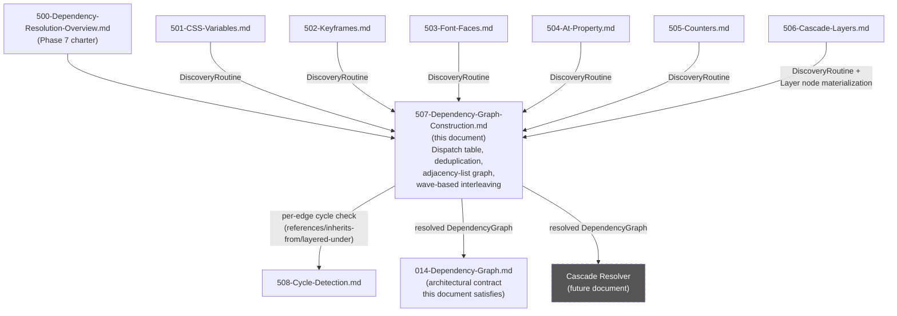
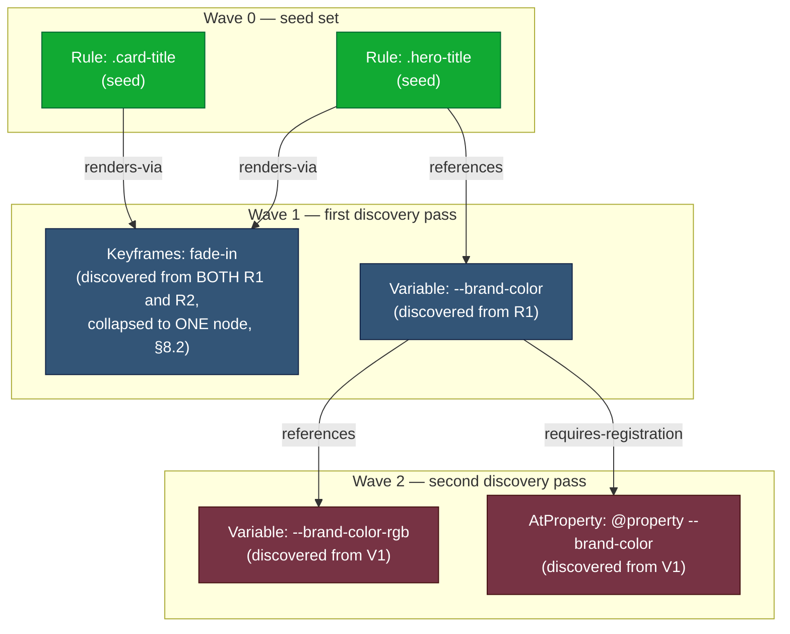

# 507 — Dependency Graph Construction

## 1. Title

**Dependency Resolution Algorithm RFC: Incremental Dependency Graph Construction and the Fixed-Point Loop**

## 2. Version

| Field | Value |
|---|---|
| Document Version | 1.0.0 |
| Status | Draft — Phase 7 (Dependency Resolution) |
| Last Updated | 2026-07-09 |
| Owners | Dependency Resolver Working Group |
| Stability | Implements the architectural contract of [014-Dependency-Graph.md](../architecture/014-Dependency-Graph.md) Sections 8.5–8.7, 9.2, and 10; consumes [501-CSS-Variables.md](./501-CSS-Variables.md) through [506-Cascade-Layers.md](./506-Cascade-Layers.md) as per-construct discovery routines and hands off to [508-Cycle-Detection.md](./508-Cycle-Detection.md) for cycle-check internals. |

## 3. Purpose

This document specifies the **concrete graph-construction algorithm** that assembles the outputs of every per-type dependency-resolution algorithm in this repository — [501-CSS-Variables.md](./501-CSS-Variables.md), [502-Keyframes.md](./502-Keyframes.md), [503-Font-Faces.md](./503-Font-Faces.md), [504-At-Property.md](./504-At-Property.md), [505-Counters.md](./505-Counters.md), and [506-Cascade-Layers.md](./506-Cascade-Layers.md) — into the single, unified runtime CSS dependency graph described architecturally in [014-Dependency-Graph.md](../architecture/014-Dependency-Graph.md).

Where [014-Dependency-Graph.md](../architecture/014-Dependency-Graph.md) establishes *what* the graph is (node/edge taxonomy) and the *architectural contract* the fixed-point loop must satisfy (Section 8.6's flowchart, Section 8.7's cycle-handling contract), and where [501](./501-CSS-Variables.md)–[506](./506-Cascade-Layers.md) each specify *how one specific kind of dependency fact* is discovered, this document specifies the **orchestration layer**: how discovery results from all six of those routines are merged into one mutable graph structure without duplicating nodes, what concrete data structure backs that graph, and — critically — how construction is interleaved with, rather than strictly sequenced after, the fixed-point resolution loop for performance reasons this document justifies concretely.

This document is the direct implementation target for the `FixedPointResolver`, `DependencyGraph`, `DiscoveryQueue`, and `DependencyDiscoverer` components named (but not algorithmically detailed) in [014-Dependency-Graph.md](../architecture/014-Dependency-Graph.md) Section 9.2's class diagram.

## 4. Audience

- Implementers of `packages/dependency-graph`'s core orchestration logic — the engineers who will write the `FixedPointResolver` class itself.
- Implementers of [501](./501-CSS-Variables.md)–[506](./506-Cascade-Layers.md), who need to know the exact contract their per-`NodeKind` discovery routines must satisfy to plug into this document's construction loop (return shape, idempotency requirements, node-ID discipline).
- Implementers of [508-Cycle-Detection.md](./508-Cycle-Detection.md), who need to know precisely when and how their `CycleDetector.checkForCycle` is invoked from within this document's loop.
- Implementers of the Cascade Resolver and Reporter, the two downstream consumers of this document's output graph, who need to understand its concrete representation to consume it efficiently.
- Performance engineers evaluating the graph-representation choice (Section 8.3) against real-world stylesheet corpora.

Readers are assumed to have read [014-Dependency-Graph.md](../architecture/014-Dependency-Graph.md) in full, and to be at least broadly familiar with [501](./501-CSS-Variables.md)–[506](./506-Cascade-Layers.md) (this document forward-references each but does not restate their discovery logic).

## 5. Prerequisites

- [014-Dependency-Graph.md](../architecture/014-Dependency-Graph.md) — the full architectural contract, especially Section 8.1 (node taxonomy), 8.2 (edge taxonomy), 8.5 (incremental construction principle), 8.6 (fixed-point flowchart), 8.7 (cycle-handling contract), 9.2 (component class diagram), and 10.1 (the architecture-level pseudocode this document refines into an implementation-grade algorithm).
- [500-Dependency-Resolution-Overview.md](../design/500-Dependency-Resolution-Overview.md) — the Phase 7 overview establishing how the six per-construct algorithms and this construction algorithm relate as a family.
- [501-CSS-Variables.md](./501-CSS-Variables.md), [502-Keyframes.md](./502-Keyframes.md), [503-Font-Faces.md](./503-Font-Faces.md), [504-At-Property.md](./504-At-Property.md), [505-Counters.md](./505-Counters.md), [506-Cascade-Layers.md](./506-Cascade-Layers.md) — the six discovery routines this document dispatches to; familiarity with their input/output contracts (a `DiscoveryResult` of new nodes and new edges per node processed) is assumed.
- [006-Design-Principles.md](../architecture/006-Design-Principles.md) — Principle 1 (Browser Is Source of Truth), Principle 3 (Correctness Over Premature Optimization), Principle 5 (Determinism of Output).
- Working familiarity with graph representations (adjacency list vs. adjacency matrix), amortized hash-map analysis, and producer/consumer queue-based iterative algorithms.

## 6. Related Documents

- [014-Dependency-Graph.md](../architecture/014-Dependency-Graph.md)
- [500-Dependency-Resolution-Overview.md](../design/500-Dependency-Resolution-Overview.md)
- [501-CSS-Variables.md](./501-CSS-Variables.md)
- [502-Keyframes.md](./502-Keyframes.md)
- [503-Font-Faces.md](./503-Font-Faces.md)
- [504-At-Property.md](./504-At-Property.md)
- [505-Counters.md](./505-Counters.md)
- [506-Cascade-Layers.md](./506-Cascade-Layers.md)
- [508-Cycle-Detection.md](./508-Cycle-Detection.md)
- [015-Runtime-Model.md](../architecture/015-Runtime-Model.md) — worker-thread/browser-round-trip batching model this document's interleaving strategy (Section 8.5) depends on.
- [016-Data-Flow.md](../architecture/016-Data-Flow.md) — DTO shapes for `MatchedRule`, `GraphNode`, `GraphEdge` this document manipulates.

## 7. Overview

[014-Dependency-Graph.md](../architecture/014-Dependency-Graph.md) Section 10.1 already provides architecture-level pseudocode for "Fixed-Point Graph Resolution" — a single `resolveDependencyGraph` function that dequeues nodes, calls a generic `DependencyDiscoverer.discover`, and adds results to the graph. That pseudocode is correct as far as it goes, but it treats `DependencyDiscoverer.discover` as an opaque black box and treats "construction" and "resolution" as happening in lockstep, one node at a time, with no discussion of *how the six different per-construct routines actually get dispatched to*, *how duplicate node discovery across different discovering rules is prevented*, *what concrete data structure the graph itself is*, or *why processing one node at a time, rather than batching, is or isn't the right granularity given that each discovery step is dominated by browser round-trip latency* (per [014-Dependency-Graph.md](../architecture/014-Dependency-Graph.md) Section 14's performance framing).

This document fills exactly that gap. It is, in effect, the "systems" layer sitting between the six algorithm-specific documents (which specify *what a `Variable` node's discovery routine does when asked*) and the architectural contract (which specifies *what correctness properties the overall process must satisfy*). Three concerns dominate this document's scope:

1. **Dispatch and deduplication** — given a discovery request touching a `Variable`, `Keyframes`, `FontFace`, `AtProperty`, `CounterStyle`, or `Layer` construct, route it to the correct one of [501](./501-CSS-Variables.md)–[506](./506-Cascade-Layers.md)'s discovery logic, and guarantee that the same logical construct discovered from two different rules collapses into exactly one graph node, never two.
2. **Graph representation** — choose and justify a concrete in-memory representation (adjacency list, chosen over adjacency matrix, per Section 8.3's density argument) sized correctly for the graph sizes this engine actually produces.
3. **Construction/resolution interleaving for performance** — batch discovery across a "wave" of frontier nodes into a single round trip rather than strictly processing one node fully (browser query, node insertion, edge insertion, cycle check) before starting the next, and justify why this interleaving is both correct and materially faster.

## 8. Detailed Design

### 8.1 The dispatch problem: one graph, six discovery algorithms

Each of [501](./501-CSS-Variables.md)–[506](./506-Cascade-Layers.md) specifies, for exactly one `NodeKind`, how to discover that construct's dependency facts from a matched element/rule. None of those documents specifies how the outer loop decides *which* of the six to invoke for a given pending node, nor how a single `Rule` node — which might simultaneously reference a variable, animate via keyframes, and use a custom font — gets *all* of its relevant discovery routines invoked rather than just one.

**Decision.** `DependencyDiscoverer` (the component named in [014-Dependency-Graph.md](../architecture/014-Dependency-Graph.md) Section 9.2) is implemented as a **strategy table keyed by `NodeKind`**, not a single monolithic function with an internal `switch`. Each entry is one of the six sibling algorithm documents' discovery routine, imported as a pure function conforming to a shared interface:

```text
interface DiscoveryRoutine:
    discover(node: GraphNode, ruleTree: CSSOMRuleTree, browserContext, graph: DependencyGraph readonly-view)
        -> DiscoveryResult { newNodes: GraphNode[], newEdges: GraphEdge[] }
```

For a `Rule` node specifically — the one `NodeKind` that can simultaneously carry multiple *kinds* of outgoing dependency (a variable reference AND a keyframes reference AND a font-face reference AND layer membership, all at once) — the dispatch table's entry for `kind == 'Rule'` is itself a small fixed sequence that invokes the `Rule`-relevant subset of [501](./501-CSS-Variables.md)'s, [502](./502-Keyframes.md)'s, [503](./503-Font-Faces.md)'s, and [506](./506-Cascade-Layers.md)'s routines (custom-property references, animation-name lookups, font-family fallback resolution, and layer-crossing annotation respectively) against the *same* matched element in one batched pass, concatenating their individual `DiscoveryResult`s before returning to the outer loop. `AtProperty` and `CounterStyle` discovery ([504](./504-At-Property.md), [505](./505-Counters.md)) are instead triggered as *downstream* discovery steps — invoked when a `Variable` node's `requires-registration` edge or a `Rule`'s counter-related computed-style read surfaces a candidate, respectively — rather than being dispatched directly from a `Rule` node's own top-level discovery pass, mirroring the edge-kind distinctions [014-Dependency-Graph.md](../architecture/014-Dependency-Graph.md) Section 8.2 already draws between `references`/`renders-via` (always exactly one hop from a `Rule`) and `requires-registration` (one hop further, from a `Variable`).

*Why a strategy table rather than a single function with branching logic.* This mirrors [014-Dependency-Graph.md](../architecture/014-Dependency-Graph.md) Section 9.2's own framing of `DependencyDiscoverer` as "internally... a small strategy dispatch — one discovery routine per `NodeKind`, mirroring the per-construct algorithm RFCs." The alternative — one large function branching on `node.kind` with all six discovery bodies inlined — was never seriously considered as an implementation strategy because it would recreate, inside a single file, exactly the module boundary the documentation tree already establishes between [501](./501-CSS-Variables.md) and [506](./506-Cascade-Layers.md); keeping the code boundary aligned with the documentation boundary means a change to, say, font-fallback-chain discovery logic touches only [503-Font-Faces.md](./503-Font-Faces.md)'s corresponding module, with no risk of an unrelated merge conflict against variable-discovery logic living in the same function body.

### 8.2 Deduplication: the same construct discovered from multiple matched rules

**The problem, concretely.** Suppose `.hero-title` and `.card-title` are two independently matched `Rule` nodes in the seed set, and both declare `animation-name: fade-in`, referencing the *same* `@keyframes fade-in` block. [502-Keyframes.md](./502-Keyframes.md)'s discovery routine will be invoked once for each `Rule` node (once from `.hero-title`'s discovery pass, once from `.card-title`'s). Naively, this produces two separate "discover `@keyframes fade-in`" events. The graph must end up with **exactly one** `Keyframes` node for `fade-in`, with two `renders-via` edges pointing at it (one from each `Rule`), not two duplicate `Keyframes` nodes.

**Decision.** Deduplication is handled entirely by the `DependencyGraph.addNode` operation being defined as **idempotent-by-ID**, not by requiring any discovery routine to check for prior existence itself. Every `GraphNode`'s `id` is computed by a pure, deterministic function of the node's structural key alone — exactly the discipline [014-Dependency-Graph.md](../architecture/014-Dependency-Graph.md) Implementation Notes already mandates ("Node IDs... must be computed identically regardless of discovery order... so that the same logical node discovered via two different reference paths... collapses to the same graph node rather than being duplicated"). This document's construction algorithm operationalizes that mandate concretely:

```text
function addNode(graph: DependencyGraph, candidateNode: GraphNode) -> { node: GraphNode, wasNew: bool }:
    if graph.nodesById.has(candidateNode.id):
        existing = graph.nodesById.get(candidateNode.id)
        return { node: existing, wasNew: false }   // collapse; discard candidateNode
    graph.nodesById.set(candidateNode.id, candidateNode)
    candidateNode.resolutionState = 'pending'
    return { node: candidateNode, wasNew: true }
```

Because `makeKeyframesNodeId('fade-in')` (per [502-Keyframes.md](./502-Keyframes.md)'s own ID-construction rule, itself required to be a pure function of the animation name) produces the identical string regardless of which `Rule`'s discovery pass triggered it, the second call's `addNode` is a guaranteed no-op that returns the pre-existing node — the caller (this document's construction loop) then simply adds a *second* `renders-via` edge from `.card-title` to that same existing node, and — critically — does **not** re-enqueue the node onto the discovery queue a second time, since `wasNew: false` signals that its own dependency discovery either already ran or is already pending.

*Why idempotent-`addNode` rather than a pre-check in every discovery routine.* Requiring each of the six discovery routines ([501](./501-CSS-Variables.md)–[506](./506-Cascade-Layers.md)) to itself query "does this node already exist?" before constructing a candidate node would duplicate the same existence-check logic six times, and — more importantly — would create a race-prone contract if any future discovery routine forgot the check or implemented it against a stale graph snapshot. Centralizing idempotency in the single `addNode` chokepoint (which per Section 8.5's single-writer discipline is called from exactly one place in the construction loop) makes deduplication a structural guarantee of the data structure itself, not a discipline every discovery-routine author must remember to uphold — directly analogous to why [014-Dependency-Graph.md](../architecture/014-Dependency-Graph.md) centralizes graph mutation behind a single-writer boundary in the first place (Section 11 of that document).

**Deduplication scope: nodes, not edges.** Per [014-Dependency-Graph.md](../architecture/014-Dependency-Graph.md) Section 8.2, "edges are... not deduplicated purely by endpoint pair — two nodes may be connected by edges of different kinds simultaneously, and this is meaningful, not redundant." This document's `addEdge` therefore performs **no** deduplication against existing edges with the same `(sourceId, targetId)` but different `kind` — a `references` edge and a `conditioned-by` edge between the same two nodes are both kept. What *is* rejected is a literal duplicate — same `sourceId`, `targetId`, *and* `kind` — which can arise legitimately (e.g., two independent declarations on the same `Rule` node both resolving to the same `var()` reference target) and is collapsed to a single edge instance via a `Set`-backed membership check keyed on the edge's own deterministic composite key `${sourceId}::${kind}::${targetId}`, an `O(1)` amortized check per edge insertion.

### 8.3 Graph representation: adjacency list, not adjacency matrix

**Decision.** The `DependencyGraph` is backed by an **adjacency list** — concretely, a `Map<NodeId, GraphNode>` for node storage (as already specified in [014-Dependency-Graph.md](../architecture/014-Dependency-Graph.md) Section 9.2's class diagram) plus a `Map<NodeId, GraphEdge[]>` keyed by source node ID for outgoing-edge storage (`edgesBySource`, also already named in that same diagram), and a symmetric `Map<NodeId, GraphEdge[]>` keyed by target node ID for incoming-edge lookups (`edgesByTarget`, needed by the Cascade Resolver's "what depends on this node" queries and by [508-Cycle-Detection.md](./508-Cycle-Detection.md)'s traversal, and introduced explicitly here as this document's own addition to the class diagram, since [014-Dependency-Graph.md](../architecture/014-Dependency-Graph.md) names `edgesBySource` but does not commit to whether reverse lookups are needed — this document commits to yes, for the reason given below).

**Why adjacency list over adjacency matrix, justified by expected graph size and density.** An adjacency matrix's chief appeal is `O(1)` edge-existence queries and vectorizable operations, at the cost of `O(N²)` memory regardless of actual edge count, where `N` is the node count. Per [014-Dependency-Graph.md](../architecture/014-Dependency-Graph.md) Section 10.1's own complexity analysis, `D` (the transitively-discovered node count) "rarely exceeds a few hundred nodes even for large enterprise stylesheets," and Section 14 characterizes the edge count as "a small constant multiple of `D`" — i.e., this graph is **sparse**: `E = O(D)`, not `E = O(D²)`. For a graph with, say, `D = 500` nodes and `E = 2000` edges (a generous real-world estimate for a large above-fold rule set with heavy custom-property and layer usage), an adjacency matrix would require `500 × 500 = 250,000` matrix cells (a `Bool`/pointer per cell, i.e. hundreds of KB to low MB depending on encoding) to represent what an adjacency list represents in `O(2000)` edge-object allocations — roughly two orders of magnitude less memory for the sparsity ratio this graph actually exhibits (`2000 / 250000 = 0.8%` density). At larger, more pathological graph sizes (the `resolutionBudget`-bounded worst case, [014-Dependency-Graph.md](../architecture/014-Dependency-Graph.md) Section 10.1's failure-case discussion), the matrix's `O(N²)` cost would scale far worse than the list's `O(N + E)` cost, and this engine explicitly treats such cases as *abort-and-diagnose* scenarios (the resolution budget circuit breaker), not cases to optimize a data structure around.

The matrix's `O(1)`-edge-existence advantage is also not decisive here: this document's own deduplication logic (Section 8.2) needs edge-existence checks only during insertion, and a `Set`-backed composite-key check against the adjacency list already provides `O(1)` amortized lookup for that specific need, without paying the matrix's memory cost for the vast majority of node pairs that will never have an edge between them at all. The one operation an adjacency matrix would make faster — "does *any* edge exist between arbitrary nodes A and B, of any kind" — is not a query this engine's downstream consumers (Cascade Resolver, Reporter, [508-Cycle-Detection.md](./508-Cycle-Detection.md)) actually need to perform at scale; they consume the graph via traversal (walk outgoing/incoming edges from a known node), which adjacency lists serve directly and efficiently.

*Alternative considered and rejected: a hybrid — adjacency list for storage, with a computed matrix as a derived cache for a specific hot-path query.* This was considered for [508-Cycle-Detection.md](./508-Cycle-Detection.md)'s benefit (SCC algorithms sometimes benefit from matrix representations for certain optimizations), but rejected here as premature — [508-Cycle-Detection.md](./508-Cycle-Detection.md) is scoped to its own document and, per that document's forthcoming algorithm choice, standard DFS-based SCC algorithms (Tarjan's, as flagged in [014-Dependency-Graph.md](../architecture/014-Dependency-Graph.md) References) operate efficiently over adjacency lists directly with no matrix requirement; introducing a derived matrix cache "just in case" a future algorithm wants it would violate Principle 3 (Correctness Over Premature Optimization) by adding real memory/maintenance cost against a hypothetical future need rather than a demonstrated one.

### 8.4 Incremental node/edge insertion, restated as this document's own construction procedure

[014-Dependency-Graph.md](../architecture/014-Dependency-Graph.md) Section 8.5 already establishes the *principle* of incremental, seed-driven construction. This document's contribution is the concrete procedure by which "incremental" is realized as actual insertion operations against the adjacency-list structure from Section 8.3, coordinated with the dispatch table from Section 8.1 and the deduplication guarantee from Section 8.2, across **iterations of the fixed-point loop** — where "iteration" here specifically means one *wave* of frontier-node processing, not one node at a time (justified fully in Section 8.5 below).

At a high level, each iteration:

1. Takes the current discovery queue's full contents as the current "wave" (not just its head).
2. Batches all of that wave's browser-dependent queries into as few round trips as the runtime model ([015-Runtime-Model.md](../architecture/015-Runtime-Model.md)) permits.
3. For each node in the wave, dispatches to the Section 8.1 strategy table, collecting `DiscoveryResult`s.
4. Inserts all newly-discovered nodes via the idempotent `addNode` (Section 8.2), collecting which ones were genuinely new (`wasNew: true`) into the *next* wave.
5. Inserts all newly-discovered edges via `addEdge`, invoking [508-Cycle-Detection.md](./508-Cycle-Detection.md)'s `checkForCycle` for every qualifying edge kind (`references`, `inherits-from`, `layered-under`, per [014-Dependency-Graph.md](../architecture/014-Dependency-Graph.md) Section 8.7's scope) as each edge is inserted, exactly as architecturally mandated (cycle checks must be incremental, not a batch pass at the end).
6. Marks every wave member `resolved` (or `cyclic`, if implicated) once its own discovery step and all of its edges' cycle checks have completed.
7. Advances to the next wave (the set of genuinely-new nodes from step 4), or terminates if that set is empty.

### 8.5 Why construction interleaves with, rather than strictly follows, the fixed-point loop

[014-Dependency-Graph.md](../architecture/014-Dependency-Graph.md) Section 10.1's own pseudocode processes exactly one node per outer-loop iteration: dequeue, discover, insert, cycle-check, mark resolved, repeat. That pseudocode is architecturally correct — nothing about "one node per iteration" would produce a wrong graph — but this document's job is to specify the *implementation-grade* algorithm, and at implementation grade, one-node-per-iteration is a meaningfully worse choice than wave-based batching, for a reason [014-Dependency-Graph.md](../architecture/014-Dependency-Graph.md) Section 14 already flags as the dominant cost driver: **discovery is bounded by browser round-trip latency, not by in-memory graph operations.**

**The core argument.** Each of [501](./501-CSS-Variables.md)–[506](./506-Cascade-Layers.md)'s discovery routines needs to query the live browser context (`getComputedStyle`, `document.fonts`, `matchMedia`, `CSS.supports`, per [014-Dependency-Graph.md](../architecture/014-Dependency-Graph.md) Section 8.5) for at least some of their discovery facts. If the construction loop processes nodes strictly one at a time — dequeue one node, issue its browser query, await the round trip, insert results, *then* dequeue the next — every node's discovery pays a full round-trip latency cost serially. For a graph with `D = 500` transitively-discovered nodes and a round trip cost of even a conservative 2ms (batched Playwright `page.evaluate()` calls are not free, especially across a Node-host-to-browser-process IPC boundary), strict one-at-a-time processing costs `500 × 2ms = 1000ms` — a full second added to a *single route/viewport extraction*, which directly threatens the CI-pipeline timeout budget (`BRIEF.md` Section 2.11, REQ-554 referenced in [014-Dependency-Graph.md](../architecture/014-Dependency-Graph.md) Section 14).

**Wave-based batching instead:** collect the *entire current frontier* (every node currently in `pending` state that has not yet had its own discovery invoked) into a single wave, and issue **one** `page.evaluate()` call carrying all of that wave's discovery requests, returning all of their results in a single round trip. This changes the round-trip cost from `O(D)` round trips to `O(waves)` round trips, where `waves` is the *depth* of the transitive dependency chain (how many "hops" deep the deepest reference chain goes), not its *breadth* (how many total nodes exist at any given hop). For realistic CSS dependency graphs — [014-Dependency-Graph.md](../architecture/014-Dependency-Graph.md) Section 8.2 already notes `renders-via` edges are "architecturally always exactly one hop deep," and `references`/`inherits-from` chains (variable-to-variable) are rarely more than two or three hops deep in practice even in elaborate design systems — `waves` is typically a small constant (single digits), while `D` can be in the hundreds. This converts the dominant cost term from `O(D) × roundTripLatency` to `O(waves) × roundTripLatency`, a reduction of one to two orders of magnitude for realistic inputs, which is precisely the "batched serialization"/"parallel stylesheet traversal" performance goal `BRIEF.md` Section 2.14 calls for and which [014-Dependency-Graph.md](../architecture/014-Dependency-Graph.md) Section 10.1's own Optimization Opportunities note already flags as the intended direction, without fully specifying the mechanism — this document is that specification.

**Why this is "interleaving," not merely "batching within a single phase."** The critical nuance is that wave `k+1`'s membership is not known until wave `k`'s discovery results have been inserted into the graph (a node discovered in wave `k` might itself have dependencies, discoverable only in wave `k+1`). This means construction (node/edge insertion) and resolution (marking nodes `resolved`/`cyclic`, deciding whether the loop continues) are not two separable phases — "construct everything, then resolve" is not an available strategy, because you cannot know what to construct next without having resolved (in the sense of "having discovery return") the previous wave. This is the precise sense in which this document's algorithm "interleaves with, rather than strictly follows, the fixed-point loop": each wave's construction step *is* one iteration of resolution, and the two are the same operation viewed from two angles, exactly as [014-Dependency-Graph.md](../architecture/014-Dependency-Graph.md) Section 8.6 already states at the architectural level — this document simply makes that interleaving concrete at wave granularity rather than leaving it ambiguous at node granularity.

**Cycle checks remain per-edge, not per-wave, even under batching.** Batching applies to the browser-query step (which is what dominates cost); it does not relax [014-Dependency-Graph.md](../architecture/014-Dependency-Graph.md) Section 8.7's requirement that cycle detection run incrementally "as new edges are added," not as a single end-of-wave batch pass. Within a wave's insertion step (construction procedure step 5, Section 8.4), every new edge still triggers an individual `checkForCycle` call as it is inserted — this keeps cycle detection's incrementality guarantee intact (a cycle completed by the *last* edge inserted within a wave is still caught immediately, not after the whole wave's edges are all present, which matters because a cycle could otherwise transiently exist across two edges inserted in the same wave before either one's individual check would have caught it under a naive "insert all edges in a wave, only then check" ordering — this document's procedure explicitly forbids that ordering).

## 9. Architecture

### 9.1 This document's place among the Phase 7 family



### 9.2 Wave-based interleaved construction — sequence diagram

```mermaid
sequenceDiagram
    participant SM as Selector Matcher
    participant FR as FixedPointResolver
    participant DG as DependencyGraph (adjacency list)
    participant DD as DependencyDiscoverer (dispatch table)
    participant B as Browser Context
    participant CD as CycleDetector

    SM->>FR: seed MatchedRule[]
    FR->>DG: addNode(RuleNode) for each seed rule
    Note over FR,DG: Wave 0 = all seed nodes

    loop while currentWave not empty
        FR->>B: batched page.evaluate() for entire currentWave
        B-->>FR: batched dependency facts (one round trip)
        FR->>DD: dispatch per node.kind, using batched facts
        DD-->>FR: DiscoveryResult[] (newNodes, newEdges) per node

        loop for each newNode
            FR->>DG: addNode(newNode)
            DG-->>FR: {node, wasNew}
            Note over FR: wasNew=true nodes -> nextWave
        end

        loop for each newEdge
            FR->>DG: addEdge(newEdge)
            alt edge.kind in {references, inherits-from, layered-under}
                FR->>CD: checkForCycle(graph, newEdge)
                CD-->>FR: CycleReport
                opt cycle found
                    FR->>DG: mark implicated nodes cyclic
                end
            end
        end

        FR->>DG: mark currentWave nodes resolved (if not cyclic)
        Note over FR: currentWave = nextWave; nextWave = []
    end

    FR-->>SM: resolved DependencyGraph (fixed point reached)
```

### 9.3 Incremental graph growth across fixed-point iterations — worked example

The following diagram shows the graph's shape after three successive waves for a small seed set: wave 0 is the seed `Rule` nodes; wave 1 discovers a shared `Keyframes` node (deduplicated, per Section 8.2, from two different `Rule`s) and a `Variable` node; wave 2 discovers that the `Variable` node itself references a second variable and requires an `@property` registration.



Note that `KF1` receives two incoming `renders-via` edges from two different wave-0 nodes but exists as a single node — this is the deduplication guarantee from Section 8.2 rendered visually: had deduplication not been applied, wave 1 would have (incorrectly) produced two separate `Keyframes: fade-in` nodes, one per discovering `Rule`.

## 10. Algorithms

### 10.1 Algorithm: Wave-Based Incremental Graph Construction

**Problem statement.** Given a seed set of matched `Rule` nodes and the six per-`NodeKind` discovery routines from [501](./501-CSS-Variables.md)–[506](./506-Cascade-Layers.md), construct the complete runtime CSS dependency graph to a fixed point, deduplicating nodes discovered via multiple paths, using an adjacency-list representation, and batching browser-dependent discovery queries by wave rather than by individual node, while preserving [014-Dependency-Graph.md](../architecture/014-Dependency-Graph.md) Section 8.7's requirement that cycle detection run incrementally per qualifying edge.

**Inputs.** `seedRules: MatchedRule[]`; `ruleTree: CSSOMRuleTree`; `browserContext`; `resolutionBudget: number` (max total waves × wave-size product, or an equivalent total-node ceiling — see Failure Cases); `discoveryTable: Map<NodeKind, DiscoveryRoutine>` (the Section 8.1 strategy table, pre-populated from [501](./501-CSS-Variables.md)–[506](./506-Cascade-Layers.md)); `layerOrderRegistry` (per [506-Cascade-Layers.md](./506-Cascade-Layers.md) Section 10.1, materialized before this algorithm begins, per that document's ordering requirement).

**Outputs.** `DependencyGraph` (adjacency-list-backed, per Section 8.3) with every node `resolved` or `cyclic`, or a thrown `ResolutionBudgetExceededError`.

**Pseudocode.**

```text
function constructDependencyGraph(seedRules, ruleTree, browserContext, resolutionBudget,
                                    discoveryTable, layerOrderRegistry) -> DependencyGraph:

    graph = new DependencyGraph()   // nodesById: Map, edgesBySource: Map, edgesByTarget: Map, edgeKeys: Set
    materializeLayerNodes(layerOrderRegistry, graph)   // 506-Cascade-Layers.md §10.1, precondition

    currentWave: GraphNode[] = []
    for rule in seedRules.sortedBy(canonicalOrder):     // determinism, per 014 §10.2
        result = graph.addNode(makeRuleNode(rule, discoveredAt: 'seed'))
        if result.wasNew:
            currentWave.push(result.node)

    totalProcessed = 0

    while currentWave.length > 0:
        totalProcessed += currentWave.length
        if totalProcessed > resolutionBudget:
            raise ResolutionBudgetExceededError(graph.pendingNodes())

        // --- batched browser query for the ENTIRE wave, one round trip ---
        batchedFacts = browserContext.evaluateBatch(
            currentWave.map(node => buildDiscoveryQuery(node, ruleTree))
        )

        nextWave: GraphNode[] = []

        for node in currentWave:                         // deterministic order preserved
            routine = discoveryTable.get(node.kind)
            discovery = routine.discover(node, ruleTree, batchedFacts.get(node.id), graph)

            for candidateNode in discovery.newNodes:
                result = graph.addNode(candidateNode)
                if result.wasNew:
                    nextWave.push(result.node)
                // if not wasNew: collapsed onto existing node (§8.2); do NOT re-enqueue

            for candidateEdge in discovery.newEdges:
                edgeKey = `${candidateEdge.sourceId}::${candidateEdge.kind}::${candidateEdge.targetId}`
                if graph.edgeKeys.has(edgeKey):
                    continue   // literal duplicate edge; skip (§8.2)
                graph.addEdge(candidateEdge)
                graph.edgeKeys.add(edgeKey)

                if candidateEdge.kind in {'references', 'inherits-from', 'layered-under'}:
                    cycleReport = CycleDetector.checkForCycle(graph, candidateEdge)  // 508, per-edge
                    if cycleReport.foundCycle:
                        for cyclicId in cycleReport.nodeIds:
                            graph.getNode(cyclicId).resolutionState = 'cyclic'
                        emitDiagnostic(CyclicDependencyWarning(cycleReport))

            if node.resolutionState == 'pending':
                node.resolutionState = 'resolved'

        currentWave = nextWave     // next iteration = next wave; interleaving, per §8.5

    return graph
```

**Time complexity.** Let `S` = seed set size, `D` = total transitively-discovered node count, `E` = total edge count (`O(D)` per Section 8.3's density argument), `W` = number of waves (transitive-dependency-chain depth, typically a small constant per Section 8.5). Graph operations (`addNode`, `addEdge`, membership checks) are `O(1)` amortized each via hash-map-backed storage, contributing `O(S + D + E)` total across the whole run — identical to [014-Dependency-Graph.md](../architecture/014-Dependency-Graph.md) Section 10.1's bound, since batching changes *when* work happens, not *how much* in-memory graph work happens. The distinguishing improvement is in round-trip count: `O(W)` batched round trips instead of `O(S + D)` individual round trips, where `W ≪ (S + D)` for realistic inputs (Section 8.5). Cycle-check cost is, as in [014-Dependency-Graph.md](../architecture/014-Dependency-Graph.md) Section 10.1, deferred to [508-Cycle-Detection.md](./508-Cycle-Detection.md) but bounded by `O(E)` invocations.

**Memory complexity.** `O(S + D)` for nodes (`nodesById`), `O(E)` for edges split across `edgesBySource` and `edgesByTarget` (a small constant-factor duplication of edge references — each `GraphEdge` object is stored once but referenced from two index maps — trading `O(E)` extra pointer storage for `O(1)` reverse-lookup, a favorable trade given `E`'s small absolute size per Section 8.3), `O(E)` for the `edgeKeys` deduplication `Set`, and `O(waveWidth)` peak additional memory for `currentWave`/`nextWave`, where `waveWidth` is bounded by per-node fan-out exactly as characterized in [014-Dependency-Graph.md](../architecture/014-Dependency-Graph.md) Section 10.1.

**Failure cases.** All three failure modes from [014-Dependency-Graph.md](../architecture/014-Dependency-Graph.md) Section 8.6 apply unchanged (fixed point reached; cycle detected and contained; resolution budget exceeded) — this document's `resolutionBudget` check is expressed as a running total across waves (`totalProcessed`) rather than per-dequeue-iteration count, which is an equivalent formulation given that every node is still processed exactly once regardless of wave batching. An additional, wave-specific failure case: a **partial batch failure**, where `browserContext.evaluateBatch` succeeds for most of a wave's nodes but throws or returns an error sentinel for a subset (e.g., one matched element in the wave was detached from the DOM between collection and this discovery pass, mirroring the failure case already documented in [014-Dependency-Graph.md](../architecture/014-Dependency-Graph.md) Section 10.1's Failure Cases for the non-batched case) — this document's algorithm requires per-node error isolation within a batch result (each wave member's discovery result is independently either a `DiscoveryResult` or an error sentinel), so that one detached element does not fail the entire wave's batch and does not abort discovery for the wave's other, healthy nodes; the affected node is marked `resolutionState: 'unresolved-error'` (per [014-Dependency-Graph.md](../architecture/014-Dependency-Graph.md) Section 8.1's state enum) and a diagnostic is emitted, while the rest of the wave proceeds normally.

**Optimization opportunities.** Memoize `DiscoveryRoutine` results keyed by structural node key across viewport passes within the same route (identical opportunity to the one named in [014-Dependency-Graph.md](../architecture/014-Dependency-Graph.md) Section 10.1, now expressible per-wave: an entire wave's batched query can be skipped if every member's memoized result is already available from a prior viewport pass in the same route, collapsing that wave's round trip to zero); further reduce `W` by speculatively over-fetching one additional hop's worth of discovery facts within the same batched round trip when the runtime model's round-trip cost dominates the marginal cost of querying slightly more data than the current wave strictly needs — flagged here as an optimization to profile empirically (see Future Work) rather than commit to prematurely, since over-fetching too aggressively risks querying facts for nodes that a cycle check would have excluded anyway.

### 10.2 Algorithm: Structural-Key Node ID Derivation (Deduplication Primitive)

**Problem statement.** Provide the deterministic, collision-free identifier function that Section 10.1's `addNode` idempotency (Section 8.2) depends on, given that six different discovery routines each construct candidate nodes independently and must agree, without coordination, on the same ID for the same logical construct.

**Inputs.** A `NodeKind` and that kind's structural key fields, as already defined per-kind in [014-Dependency-Graph.md](../architecture/014-Dependency-Graph.md) Section 8.1's node taxonomy table (e.g., `Variable` keys on `(propertyName, definingSelectorScope)`; `Keyframes` keys on animation name; `FontFace` keys on `(fontFamily, unicodeRange, weightRange, style)`).

**Outputs.** A stable string ID.

**Pseudocode.**

```text
function makeNodeId(kind: NodeKind, structuralKey: Record<string, string>) -> string:
    // Canonical, sorted-key serialization -- never dependent on object
    // property insertion order, discovery order, or any counter.
    sortedFields = structuralKey.entries().sortedBy(fieldName)
    serialized = sortedFields.map(([k, v]) => `${k}=${encodeKeyComponent(v)}`).join('&')
    return `${kind}:${serialized}`

// Examples (all six discovery routines call this same shared primitive,
// never inventing their own ad hoc ID scheme):
//   makeNodeId('Variable', {propertyName: '--brand-color', scope: ':root'})
//     -> "Variable:propertyName=--brand-color&scope=%3Aroot"
//   makeNodeId('Keyframes', {name: 'fade-in'})
//     -> "Keyframes:name=fade-in"
//   makeNodeId('Layer', {scopePath: 'base.buttons'})
//     -> "Layer:scopePath=base.buttons"
```

**Time complexity.** `O(k log k)` where `k` is the number of structural-key fields for the given `NodeKind` — a small, bounded constant (at most four, for `FontFace`), so effectively `O(1)` per node ID computation.

**Memory complexity.** `O(k)` per generated ID string; negligible.

**Failure cases.** Two structurally distinct constructs colliding on the same serialized ID would be a correctness-fatal bug (an incorrect deduplication merging two genuinely different nodes); this is guarded by requiring every `NodeKind`'s structural-key field set to be exhaustive enough to distinguish all specification-meaningful distinctions for that construct type (e.g., `FontFace`'s four-field key exists specifically because `font-family` alone is insufficient — two `@font-face` rules for the same family but different `unicode-range` are genuinely distinct constructs, per [014-Dependency-Graph.md](../architecture/014-Dependency-Graph.md) Section 8.1's node taxonomy) — this document does not re-derive which fields are sufficient per kind (that is each of [501](./501-CSS-Variables.md)–[506](./506-Cascade-Layers.md)'s own responsibility), it only provides the shared serialization primitive all of them must route through.

**Optimization opportunities.** Cache `encodeKeyComponent` results for frequently-repeated structural key values (e.g., `:root` as a `definingSelectorScope` recurs across the vast majority of `Variable` nodes in typical design-system CSS) to avoid redundant string-encoding work across a large wave; negligible in absolute terms given `k`'s small bound, included here only for completeness per Global Rule 4.5's mandate that every algorithm section address optimization opportunities explicitly.

## 11. Implementation Notes

- The `discoveryTable` (Section 8.1) must be assembled at module-initialization time from explicit imports of [501](./501-CSS-Variables.md)–[506](./506-Cascade-Layers.md)'s exported discovery routines, never via dynamic/reflective discovery of "whatever discovery modules happen to be registered" — this keeps the dependency between this document's dispatch logic and its six sibling algorithm documents statically analyzable and refactor-safe.
- `graph.edgeKeys` (the `Set`-backed literal-duplicate-edge guard from Section 8.2/10.1) must use the same string-composite-key scheme as `makeNodeId` for consistency, even though edges are not nodes — reusing one canonical serialization discipline across both node IDs and edge keys reduces the number of distinct "how do we build a deterministic string key" implementations in the codebase to one.
- Per Section 8.5's single-writer discipline (inherited directly from [014-Dependency-Graph.md](../architecture/014-Dependency-Graph.md) Section 11), the batched browser query step (`browserContext.evaluateBatch`) is the only point in this algorithm safe to execute with any concurrency (e.g., splitting a very large wave across multiple `page.evaluate()` calls if a single call would exceed a serialization-size limit); every step following it — `addNode`, `addEdge`, cycle checks — must execute strictly sequentially in the deterministic per-wave-member order established by Section 10.2 of [014-Dependency-Graph.md](../architecture/014-Dependency-Graph.md).
- Worker-thread-parallelized route batches (per [015-Runtime-Model.md](../architecture/015-Runtime-Model.md)) each construct and own an entirely independent `DependencyGraph` instance; this document's algorithm never shares `nodesById`/`edgesBySource`/`edgesByTarget` maps across routes, consistent with [014-Dependency-Graph.md](../architecture/014-Dependency-Graph.md) Section 14's explicit statement that "there is no cross-route graph sharing."
- The `buildDiscoveryQuery`/`evaluateBatch` boundary (Section 10.1) is the seam where [015-Runtime-Model.md](../architecture/015-Runtime-Model.md)'s specific Playwright batching mechanics plug in; this document treats that boundary as an injected dependency (an interface), not something it implements itself, keeping this document's algorithm portable to a hypothetical future non-Playwright browser abstraction per [ADR-0003](../adr/ADR-0003-Playwright-As-Browser-Abstraction.md)'s multi-engine ambitions.

## 12. Edge Cases

- **A wave containing both a node whose discovery succeeds and a node whose discovery reveals a cycle involving a node from an *earlier*, already-resolved wave.** Section 10.1's per-edge cycle check (invoked at edge-insertion time, not end-of-wave) correctly catches this regardless of which wave introduced which endpoint — cycle detection operates over the whole graph's accumulated edge set, not per-wave subgraphs, consistent with [014-Dependency-Graph.md](../architecture/014-Dependency-Graph.md) Section 12's explicit edge case about cross-scope cycles.
- **Extremely wide waves (a single wave containing hundreds of frontier nodes at once) causing a single batched browser round trip to become the new bottleneck.** This is a real tension this document's design accepts explicitly: batching trades many-small-round-trips for few-large-round-trips, and a sufficiently wide wave could make one round trip itself slow (large serialized payload, large `page.evaluate()` argument). [015-Runtime-Model.md](../architecture/015-Runtime-Model.md) is the owning document for any wave-splitting/chunking policy needed to bound individual round-trip payload size; this document's algorithm is written to be agnostic to whether `evaluateBatch` internally chunks a very wide wave into multiple physical round trips, as long as it returns one logically complete `batchedFacts` result for the whole wave.
- **A discovery routine for one `NodeKind` returning a candidate node whose `kind` doesn't match the `discoveryTable` entry that produced it** (e.g., a bug where [501-CSS-Variables.md](./501-CSS-Variables.md)'s routine accidentally constructs a `Keyframes`-kind candidate node). This is treated as a programming-contract violation, not a runtime condition to gracefully handle — `addNode` does not validate that a candidate's `kind` matches any particular expectation beyond its own ID being well-formed, so such a bug would silently succeed at the graph-construction layer and manifest downstream instead; each of [501](./501-CSS-Variables.md)–[506](./506-Cascade-Layers.md) is responsible for its own construction correctness, and this document recommends (Testing, below) contract tests at the discovery-routine boundary specifically to catch this class of bug before it reaches this document's integration surface.
- **Zero-width waves partway through resolution (a wave whose every member's discovery returns no new nodes/edges at all).** This is not a failure — it simply means `nextWave` is empty and the outer loop terminates at the fixed point, exactly as intended; no special-casing is needed, and this is the common, expected termination path for the majority of extractions (most seed rules' dependency chains are shallow).
- **A `Rule` node in the seed set that is also, independently, discovered as a transitive dependency of a different seed rule** (e.g., two above-fold elements match two different rules, and one rule's `inherits-from` chain happens to point back at a rule that was *also* directly seeded). `addNode`'s idempotency (Section 8.2) handles this correctly by construction — the node's ID is identical regardless of whether it entered as `discoveredAt: 'seed'` or would have been discovered transitively, and the first insertion wins (`seed`, since seed nodes are inserted before wave 0 processing begins), so `discoveredAt` never flips from `'seed'` to `'transitive'` retroactively, preserving the Reporter's matched/transitively-included split (REQ-461/462) correctly.

## 13. Tradeoffs

| Decision | Why | Alternative Considered | Tradeoff Accepted |
|---|---|---|---|
| Strategy-table dispatch keyed by `NodeKind` (Section 8.1) rather than one monolithic discovery function | Keeps the code boundary aligned with the documentation boundary across six independently-owned algorithm RFCs | A single large function with inline branching for all six discovery bodies | Slightly more indirection (table lookup + interface conformance) for a real gain in modularity and merge-conflict avoidance |
| Idempotent `addNode` as the sole deduplication chokepoint (Section 8.2) rather than per-routine existence checks | Centralizes a correctness-critical guarantee in one place rather than trusting six independent implementations to each uphold it | Require every discovery routine to check graph state before constructing candidate nodes | A small amount of "wasted" candidate-node construction for nodes that turn out to already exist, in exchange for a structural rather than disciplinary guarantee |
| Adjacency list over adjacency matrix (Section 8.3) | Real-world dependency graphs are sparse (`E = O(D)`, density well under 1% at realistic sizes); matrix's `O(N²)` memory cost is not justified by any hot-path query this engine actually needs | Adjacency matrix for `O(1)` arbitrary-pair edge-existence queries | Arbitrary-pair "does any edge exist" queries (not actually needed downstream) would be `O(degree)` instead of `O(1)` — accepted since no consumer performs that query pattern |
| Wave-based batched discovery, interleaved with resolution (Section 8.5) rather than strictly sequential single-node processing | Discovery cost is dominated by browser round-trip latency; batching reduces round-trip count from `O(D)` to `O(W)`, `W ≪ D` for realistic chains | [014-Dependency-Graph.md](../architecture/014-Dependency-Graph.md) Section 10.1's literal one-node-per-iteration pseudocode | More complex per-wave bookkeeping (batched query construction, per-node error isolation within a batch) in exchange for a one-to-two-order-of-magnitude latency reduction |
| Maintain both `edgesBySource` and `edgesByTarget` indices (Section 8.3) rather than only the source-keyed index [014-Dependency-Graph.md](../architecture/014-Dependency-Graph.md) names | Cascade Resolver and [508-Cycle-Detection.md](./508-Cycle-Detection.md) both need efficient reverse traversal ("what depends on this node") | Single source-keyed index only, with reverse lookups computed on demand via a full edge scan | `O(E)` extra pointer storage (small, given sparse `E`) in exchange for `O(1)` reverse lookups instead of `O(E)` scans per query |

## 14. Performance

- **CPU complexity.** `O(S + D + E)` for all in-memory graph operations, unchanged in asymptotic terms from [014-Dependency-Graph.md](../architecture/014-Dependency-Graph.md) Section 10.1's bound — this document's contribution is reducing the *dominant* real-world cost term (browser round trips) from `O(S+D)` to `O(W)`, not changing the in-memory algorithmic complexity, which was never the bottleneck.
- **Memory complexity.** `O(S + D)` nodes, `O(E)` edges stored once but indexed twice (source and target), `O(E)` for the deduplication key set, `O(waveWidth)` peak queue memory — all consistent with, and no worse than, [014-Dependency-Graph.md](../architecture/014-Dependency-Graph.md) Section 14's existing memory characterization.
- **Caching strategy.** Per-node and, as introduced in this document's Section 10.1 Optimization Opportunities, per-wave memoization across viewport passes within a route; the whole constructed graph remains a candidate for the route/viewport fingerprint-keyed Cache Manager entry exactly as [014-Dependency-Graph.md](../architecture/014-Dependency-Graph.md) Section 14 already establishes.
- **Parallelization opportunities.** Within a wave, the *browser-query* step may itself be internally parallelized or chunked by [015-Runtime-Model.md](../architecture/015-Runtime-Model.md) (Edge Cases, above); the *graph-mutation* step (addNode/addEdge/cycle-check) remains strictly sequential per wave member, per the single-writer discipline this document inherits unchanged from [014-Dependency-Graph.md](../architecture/014-Dependency-Graph.md) Section 11. Across routes, each worker thread owns a fully independent graph instance with zero shared state, making cross-route parallelization embarrassingly parallel at the process/thread level.
- **Incremental execution.** Wave-level memoization (Section 10.1) is this document's primary incremental-execution contribution beyond what [014-Dependency-Graph.md](../architecture/014-Dependency-Graph.md) already specifies: an entire wave can be skipped (zero round trips) if every member's discovery result is already memoized from a prior pass over the same route's other viewport profiles.
- **Scalability limits.** Governed by the same `resolutionBudget` circuit breaker as [014-Dependency-Graph.md](../architecture/014-Dependency-Graph.md) Section 14, now expressed as a running total across waves; additionally bounded by whatever per-round-trip payload-size ceiling [015-Runtime-Model.md](../architecture/015-Runtime-Model.md) imposes on `evaluateBatch`, which becomes the practical ceiling on single-wave width before internal chunking is required.

## 15. Testing

- **Unit tests.** Test `addNode`'s idempotency directly (two candidate nodes with identical structural keys but constructed independently must collapse to one, with the second call returning `wasNew: false`); test `makeNodeId`'s determinism (field-order independence, correct escaping of key-component values containing the field-separator characters); test the adjacency-list `edgesBySource`/`edgesByTarget` symmetry (every inserted edge must be retrievable from both indices); test literal-duplicate-edge suppression versus legitimate same-endpoint-different-kind edge preservation, per Section 8.2's distinction.
- **Integration tests.** Real Playwright-driven extraction against the fixture family in [014-Dependency-Graph.md](../architecture/014-Dependency-Graph.md) Testing section, with an added assertion specific to this document: a fixture engineered so that two independently matched seed rules both transitively reference the *same* `Keyframes`/`Variable`/`FontFace` construct (mirroring Section 9.3's worked example) must produce exactly one graph node for that construct with two incoming edges, never two duplicate nodes.
- **Visual tests.** As in [014-Dependency-Graph.md](../architecture/014-Dependency-Graph.md), rendering-parity visual regression remains the end-to-end correctness oracle; this document adds no new visual-test surface of its own since it is a pure orchestration/data-structure layer with no independent visual effect.
- **Stress tests.** A fixture with a deliberately wide wave 0 (a large seed set, e.g., a page with hundreds of above-fold matched rules) to exercise the batched-query path at realistic scale and confirm round-trip count scales with wave depth, not seed-set width; a fixture with a deliberately deep dependency chain (many waves) to confirm the `resolutionBudget` running-total check fires correctly at the expected point.
- **Regression tests.** Any production bug of the form "a construct was duplicated in the graph" or "a cross-wave cycle was missed" becomes a permanent golden-graph-snapshot fixture, per the golden-snapshot philosophy in [014-Dependency-Graph.md](../architecture/014-Dependency-Graph.md) Testing section, extended here to specifically snapshot wave-boundary node/edge counts, not merely the final graph shape.
- **Benchmark tests.** The `fixtures/enterprise-huge/` "high dependency fan-out" variant (named in [014-Dependency-Graph.md](../architecture/014-Dependency-Graph.md) Testing section) should specifically benchmark this document's wave-based batching against a synthetic one-round-trip-per-node baseline reimplementing [014-Dependency-Graph.md](../architecture/014-Dependency-Graph.md) Section 10.1's literal pseudocode, to produce a concrete, tracked measurement of the latency-reduction claim made in Section 8.5 above, rather than leaving it an unverified asymptotic argument.

## 16. Future Work

- **Empirically validate the `W ≪ D` claim (Section 8.5) against real enterprise stylesheets once fixtures are available**, and use that data to decide whether the speculative-over-fetch optimization (Section 10.1 Optimization Opportunities) is worth its added complexity, or whether wave-depth is already shallow enough in practice that it provides negligible additional benefit.
- **Revisit whether `edgesByTarget` (Section 8.3, this document's addition beyond [014-Dependency-Graph.md](../architecture/014-Dependency-Graph.md)'s named class diagram) should be formally added to that architecture document's own class diagram**, to keep the two documents' data-structure descriptions from drifting — currently this document is the sole source of truth for the reverse-index's existence, which is a documentation-consistency risk worth closing once Phase 7 stabilizes.
- **Investigate whether wave-chunking policy (Edge Cases, "extremely wide waves") should be specified concretely in this document rather than deferred entirely to [015-Runtime-Model.md](../architecture/015-Runtime-Model.md)** — at present this is a deliberate scope boundary (this document treats `evaluateBatch` as an injected black box), but if chunking policy turns out to materially affect this document's own correctness guarantees (e.g., partial-batch-failure semantics), the boundary may need to move.
- **Explore a property-based test that generates random discovery-result graphs and asserts the wave-based construction algorithm always terminates and always produces the same final graph regardless of wave-internal processing order**, as a formal complement to the determinism testing already called for in Section 15, extending the analogous future-work item already flagged in [014-Dependency-Graph.md](../architecture/014-Dependency-Graph.md) Section 16.
- **Open question: should the adjacency-list-vs-matrix decision (Section 8.3) be revisited if a future extraction mode (e.g., whole-page, non-critical-CSS-scoped dependency analysis for the Reporter's diagnostic mode) produces meaningfully denser graphs than the above-fold-seeded case this document is optimized for?** Flagged as a condition under which this document's sparsity assumption should be re-examined, not a currently anticipated need.

## 17. References

- [014-Dependency-Graph.md](../architecture/014-Dependency-Graph.md)
- [500-Dependency-Resolution-Overview.md](../design/500-Dependency-Resolution-Overview.md)
- [501-CSS-Variables.md](./501-CSS-Variables.md)
- [502-Keyframes.md](./502-Keyframes.md)
- [503-Font-Faces.md](./503-Font-Faces.md)
- [504-At-Property.md](./504-At-Property.md)
- [505-Counters.md](./505-Counters.md)
- [506-Cascade-Layers.md](./506-Cascade-Layers.md)
- [508-Cycle-Detection.md](./508-Cycle-Detection.md)
- [015-Runtime-Model.md](../architecture/015-Runtime-Model.md)
- [016-Data-Flow.md](../architecture/016-Data-Flow.md)
- [006-Design-Principles.md](../architecture/006-Design-Principles.md) — Principles 1, 3, 5
- [007-Repository-Structure.md](../architecture/007-Repository-Structure.md)
- [ADR-0003-Playwright-As-Browser-Abstraction](../adr/ADR-0003-Playwright-As-Browser-Abstraction.md)
- Cormen, Leiserson, Rivest, Stein, *Introduction to Algorithms* — adjacency list vs. adjacency matrix tradeoffs for sparse graphs
- Tarjan, R. (1972), "Depth-First Search and Linear Graph Algorithms" — candidate algorithmic foundation for [508-Cycle-Detection.md](./508-Cycle-Detection.md), cited here for continuity
