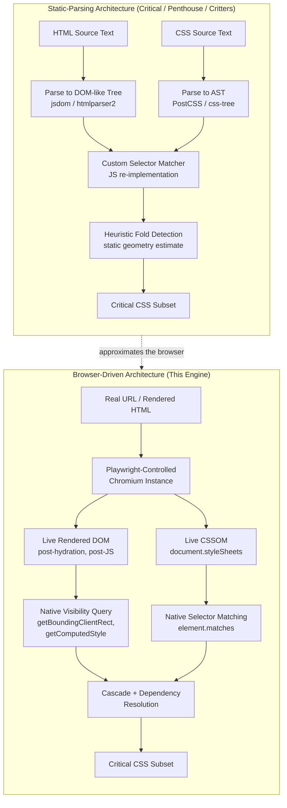
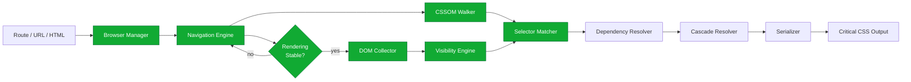

# 001 — Vision

## 1. Title

**Critical CSS Extraction Engine — Project Vision**

## 2. Version

| Field | Value |
|---|---|
| Document Version | 1.0.0 |
| Status | Accepted |
| Last Updated | 2026-07-09 |
| Owners | Core Architecture Working Group |
| Stability | Stable (foundational document; changes require RFC + ADR) |

## 3. Purpose

This document establishes the north-star vision for the Critical CSS Extraction Engine (hereafter "the Engine"). It exists to answer, once and authoritatively, the question every contributor and every downstream integrator will eventually ask: *why does this project exist when mature critical-CSS tools already exist, and why does it make the architectural bets that it makes?*

The Engine is a from-scratch, production-grade system that determines — for a given URL, route, or HTML document, across one or more viewport/device profiles — the minimal set of CSS rules required to render above-the-fold content without a flash of unstyled content (FOUC), without layout shift attributable to missing styles, and without visual divergence from the fully-styled page. It does this by treating a real, controlled browser instance as the *sole source of truth* for layout, cascade resolution, and selector matching, rather than attempting to re-implement any part of the CSS engine in JavaScript or another host language.

This document is intentionally opinionated. It is not a balanced survey of the critical-CSS tooling landscape; it is a statement of belief, backed by engineering reasoning, about the only architecture the maintainers consider defensible for this problem domain at production scale. Every subsequent design document in this repository — the [Problem Statement](002-Problem-Statement.md), the [Requirements](003-Requirements.md), and the [Design Principles](006-Design-Principles.md) — inherits its authority from the position taken here.

## 4. Audience

This document is written for:

- **Performance engineers** responsible for Core Web Vitals (LCP, CLS, INP) at organizations serving high-traffic, template-driven, or dynamically-styled web applications.
- **SSR framework authors** (Next.js, Remix, Astro, custom Express/Fastify render pipelines) evaluating whether to integrate critical CSS extraction as a first-class build or request-time step.
- **CI/CD platform engineers** who need to understand what guarantees the Engine can and cannot make before wiring it into a release gate.
- **Autonomous coding agents** implementing this system from the documentation repository, who need not just *what* to build but *why*, so that ambiguous implementation decisions default to the correct philosophy rather than the path of least resistance.
- **New contributors and reviewers** who need a shared mental model before reading design documents for individual subsystems (Browser Manager, CSSOM Walker, Selector Matcher, etc.).

Readers are assumed to be senior engineers with working knowledge of the CSS cascade, the DOM, browser rendering pipelines, and the general shape of a Node.js/TypeScript toolchain. This is not an onboarding tutorial.

## 5. Prerequisites

Before reading further, the reader should be familiar with:

- The CSS Object Model (CSSOM) and how it differs from the raw CSS text an author writes.
- The distinction between the "specified", "computed", "used", and "actual" values of a CSS property, per the CSS Cascade specification.
- Basic familiarity with headless browser automation (Puppeteer, Playwright) and the Chrome DevTools Protocol (CDP).
- The general goals of "critical CSS" / "above-the-fold CSS" extraction as a web performance technique, and its relationship to Largest Contentful Paint (LCP) and Cumulative Layout Shift (CLS).
- Passing familiarity with existing tools in this space (Critical, Penthouse, Critters) is helpful but not required — this document explains their relevant limitations inline.

No prior familiarity with this repository's other documents is required, but this document should be read *first*, before [002-Problem-Statement.md](002-Problem-Statement.md), since it establishes the value system against which the problem statement's failure scenarios are judged.

## 6. Related Documents

- [002-Problem-Statement.md](002-Problem-Statement.md) — precise definition of the extraction problem and why static analysis fails.
- [003-Requirements.md](003-Requirements.md) — functional and non-functional requirements derived from this vision.
- [006-Design-Principles.md](006-Design-Principles.md) — the concrete engineering principles (e.g. "the browser is the source of truth", "never implement a custom selector parser") that operationalize this vision.
- [../adr/ADR-0001-Browser-Is-Source-of-Truth.md](../adr/ADR-0001-Browser-Is-Source-of-Truth.md) — the formal decision record for the central architectural bet described in Section 9 of this document.
- [../adr/ADR-0002-No-Custom-Selector-Parser.md](../adr/ADR-0002-No-Custom-Selector-Parser.md) — the decision record forbidding reimplementation of selector matching.
- [../adr/ADR-0003-Playwright-As-Browser-Abstraction.md](../adr/ADR-0003-Playwright-As-Browser-Abstraction.md) — why Playwright specifically was chosen as the browser automation layer.
- [../adr/ADR-0005-Hybrid-Extraction-Mode.md](../adr/ADR-0005-Hybrid-Extraction-Mode.md) — the decision to combine CSSOM matching with Coverage-API-based validation.

## 7. Overview

At its core, the Engine performs one job: given a page and a viewport, produce the smallest correct CSS payload that lets the browser paint the above-the-fold region correctly on the very first render pass, with everything else deferred.

Every existing popular tool in this space — Critical, Penthouse, Critters — performs some variant of this job by parsing HTML and CSS as text or as an AST, building an approximate model of "which selectors could match which elements," and approximating "which elements are above the fold" using a headless browser only for viewport measurement, if at all. This approach was reasonable in 2013–2018, when the CSS surface area was small (no container queries, no cascade layers, no `:has()`, limited CSS-in-JS, no Shadow DOM in mainstream frameworks) and when component-driven, runtime-generated styling was the exception rather than the rule.

That world no longer exists. Modern production frontends routinely combine:

- Utility-first frameworks (Tailwind) generating tens of thousands of atomic classes, most unused per-page.
- CSS-in-JS libraries (Styled Components, Emotion, vanilla-extract) that inject `<style>` tags and class names at runtime, sometimes hashed per build, sometimes per render.
- Web Components and Shadow DOM, which scope stylesheets in ways invisible to a naive DOM/CSS text scan.
- Cascade layers (`@layer`), container queries (`@container`), `@supports`, `@property`, custom counters, and view transitions — CSS features whose semantics are defined by algorithms, not string patterns.
- Client-side JavaScript that mutates layout after initial paint (hydration, lazy image loading, dynamic component mounting) such that "the DOM at parse time" and "the DOM the user actually sees" diverge.

A static-analysis tool cannot correctly resolve any of these without re-implementing meaningful fragments of a browser's CSS engine — cascade resolution, layer ordering, selector specificity, media/container query evaluation, layout and geometry. This is not a matter of one more edge case handled with one more regex; it is a fundamental mismatch between the artifact being analyzed (source text) and the ground truth (rendered pixels arbitrated by a browser engine).

The Engine's founding proposition is this: **stop approximating the browser. Use the browser.** A real, sandboxed Chromium instance (via Playwright) is the only entity in the entire toolchain that is contractually guaranteed to implement the CSS and DOM specifications correctly. Every extraction decision — which elements are visible, which selectors match which elements, which cascade layer wins, which custom property resolves to which value — is delegated to native browser algorithms (`Element.matches()`, `getComputedStyle()`, layout geometry APIs, the Chrome DevTools Coverage API) rather than reimplemented.

This is not a performance optimization decision. It is a *correctness* decision, from which performance-engineering decisions (caching, parallelism, incremental extraction) are layered on top, never ahead of.

## 8. Detailed Design

### 8.1 The Core Philosophical Commitment: Rendering Fidelity

We define **rendering fidelity** as the property that the Engine's model of "what CSS is required" is derived from the same execution path that produces the pixels the end user sees — not from a parallel, approximate model built by re-reading source artifacts.

Static-analysis critical-CSS tools implicitly assume that HTML structure plus CSS source text plus a small amount of viewport arithmetic is sufficient to predict what the browser will render. This assumption was always an approximation, but it degrades non-linearly as CSS and DOM complexity increases. Rendering fidelity means the Engine refuses to make that assumption: it does not predict the browser's behavior, it *observes* it, using the browser's own introspection APIs.

Concretely, rendering fidelity manifests as a set of hard constraints:

1. **Visibility is measured, not inferred.** Whether an element is above the fold is determined by querying live geometry (`getBoundingClientRect()`, computed `overflow`, `transform`, `position`, `opacity`, `visibility`, and `display` values) inside the real rendered page, after the page has reached a defined stability point (see [../design/104-Rendering-Stabilization.md](../design/104-Rendering-Stabilization.md), forthcoming). It is never inferred from HTML source order or static CSS box-model arithmetic.

2. **Selector matching is delegated, not reimplemented.** Whether a CSS rule applies to a given element is determined by calling `element.matches(selectorText)` inside the page context — the exact algorithm the browser itself uses for cascade resolution — rather than by writing a JavaScript or TypeScript CSS selector engine. This is formalized in [ADR-0002](../adr/ADR-0002-No-Custom-Selector-Parser.md) and is treated as a near-inviolable rule throughout this documentation set.

3. **The CSSOM, not CSS source text, is the traversal surface.** The Engine walks `document.styleSheets`, `CSSRule` subtypes, and their computed relationships (media conditions, layer membership, `@supports` results) as the browser has already parsed and normalized them — including resolving `@import`, expanding shorthand where the browser does, and reflecting the effect of Constructable Stylesheets and adopted stylesheets in Shadow Roots. It does not re-parse `.css` files with a custom tokenizer as a primary strategy.

4. **Dynamic and post-hydration state is captured, not assumed.** Because real applications mutate the DOM and inject styles after initial HTML parse (hydration, client-side routing, CSS-in-JS runtime injection), the Engine's Navigation Engine drives the page to an application-defined or heuristically-detected stability point before any extraction step runs (see forthcoming [../design/104-Rendering-Stabilization.md](../design/104-Rendering-Stabilization.md)).

### 8.2 Why Not Existing Libraries

The brief's non-goals explicitly exclude building on Critical, Critters, or Penthouse. This is elaborated here rather than merely asserted, because the reasoning shapes many downstream design decisions.

**Critical** (addyosmani/critical) and **Penthouse** both use a headless browser primarily as a *rendering + measurement* tool — to determine layout and viewport intersection — but then fall back to text-based or AST-based CSS parsing (historically via PostCSS) combined with a JavaScript selector-matching layer to decide which rules to keep. This hybrid was a reasonable compromise a decade ago but inherits two structural weaknesses: (a) the selector matcher is a second, independently-maintained implementation of CSS selector semantics that will always lag the specification and the browser's own implementation, especially for newly shipped selectors (`:has()`, `:is()`/`:where()` specificity forwarding, nested CSS); and (b) treating the browser as a measurement oracle but not a matching oracle means two sources of truth must stay in sync, and in practice they don't — this is precisely the class of bug this project exists to eliminate.

**Critters** (the Google-authored webpack/Vite plugin, now with several community forks) takes a more purely static approach: it operates on the rendered HTML output and the compiled CSS, but does not drive a real browser at all for most of its critical path — it uses jsdom or pure DOM/CSS text heuristics for element and selector reasoning in many configurations. This makes it fast and dependency-light, which is exactly right for its target use case (static site generators with simple, mostly-utility-class CSS), but it inherits every failure mode enumerated in [002-Problem-Statement.md](002-Problem-Statement.md) Section 8: it cannot correctly reason about Shadow DOM encapsulation, cannot evaluate container queries against real layout, and cannot observe JavaScript-driven DOM mutation after the static snapshot it inspects.

None of this is a claim that these tools are poorly engineered — within their design envelope they are effective, widely deployed, and have materially improved web performance for years. The claim is narrower: their design envelope excludes the workloads this Engine is chartered to serve — large, JavaScript-framework-heavy, component-library-driven, multi-viewport, CI-gated production sites where an incorrect critical CSS payload is a shipped regression, not a cosmetic imperfection.

### 8.3 "The Browser as Source of Truth" — What It Means and What It Costs

Adopting the browser as source of truth is not free. It is explicitly a tradeoff, and this document is dishonest if it does not name the cost:

- **Latency.** Launching and driving a real Chromium instance per route/viewport combination is orders of magnitude slower than parsing text with a regex or a lightweight AST. A static tool can process a stylesheet in milliseconds; the Engine's floor latency per page/viewport is bounded by browser launch, navigation, and script execution time — realistically tens to hundhundreds of milliseconds to low seconds per unit of work, even with pooling.
- **Operational complexity.** A browser automation dependency (Playwright) introduces a much larger and more failure-prone runtime dependency than a pure-JS/TS static analyzer: sandboxing requirements, headless-Chromium OS package dependencies, flakiness classes that don't exist in static tools (navigation timeouts, detached frames, crashed renderer processes).
- **Resource footprint.** Running potentially many browser contexts in parallel for CI-scale route crawling requires materially more CPU and memory than static analysis, with direct implications for CI runner sizing and cost.

The vision explicitly accepts these costs as the price of correctness, and treats every subsequent performance-oriented design decision (browser pooling, incremental caching, worker-thread parallelism, coverage-mode as an optional cheaper mode) as an *optimization applied on top of a correct baseline*, never as a substitute for it. This ordering — correctness first, speed second, achieved through engineering rather than through relaxing the source-of-truth commitment — is the single most important inheritance this document passes to every other document in the repository.

### 8.4 Comparison to Static-Parsing Approaches: A Structural View

The following diagram contrasts the two architectural families at the level of what each treats as authoritative.



The structural difference is not cosmetic: in the static family, every box after "Parse" is a re-implementation of behavior the browser already implements correctly. In the browser-driven family, every box after "Chromium Instance" is a *query against* behavior the browser has already correctly computed. The Engine's architecture is, in a sense, a refusal to write a second CSS engine.

## 9. Architecture

This document is the vision layer and intentionally does not specify module boundaries — that is the responsibility of [../architecture/010-System-Overview.md](../architecture/010-System-Overview.md) (forthcoming) and [003-Requirements.md](003-Requirements.md). It is nonetheless useful to visualize the vision as a top-level pipeline shape, to ground the abstract claims above.



Every shaded stage in the diagram executes inside, or against introspection APIs exposed by, the live browser context. Only the Dependency Resolver, Cascade Resolver, and Serializer operate purely in the host (Node.js) process, and even they consume data (computed cascade-layer order, resolved custom property values) that originated from browser queries. This is the architectural signature of "the browser as source of truth" made concrete, and it is the pattern every subsequent design document must preserve: **push decisions into the browser; keep the host process as an orchestrator and post-processor, never a re-implementer.**

## 10. Algorithms

This is a vision document, not an algorithm specification, and per [006-Design-Principles.md](006-Design-Principles.md) detailed algorithms belong in [../algorithms/](../algorithms/) and module design docs. However, the vision does impose one algorithmic constraint worth stating precisely here because it is foundational rather than incidental:

**Constraint: Selector-to-element matching MUST be performed via `Element.matches(selectorText)` (or `Document.querySelectorAll` equivalent) executed inside the browser context, for every candidate (selector, element) pair, never via a host-side re-implementation of CSS selector semantics.**

- **Problem statement:** Given a CSS rule with selector list `S` and a set of candidate DOM elements `E` (the above-fold visible set produced by the Visibility Engine), determine the subset of `S × E` pairs where the selector matches the element, in order to decide whether the rule must be retained.
- **Inputs:** A `CSSStyleRule`'s `selectorText` (string); a live `Element` reference in the page context.
- **Outputs:** Boolean match per (selector, element) pair; aggregated, a rule is retained if at least one of its element matches is in the above-fold set (subject to Section 8's dependency-resolution follow-up for at-rules, keyframes, custom properties referenced by retained rules).
- **Pseudocode:**

```text
function isRuleCritical(rule: CSSStyleRule, criticalElements: Set<ElementHandle>) -> boolean:
    selectorList = splitTopLevelSelectors(rule.selectorText)  // structural split only, not semantic parsing
    for selector in selectorList:
        for element in criticalElements:
            if browserContext.evaluate(el => el.matches(selector), element):
                return true
    return false
```

  Note that `splitTopLevelSelectors` performs only a syntactic split on top-level commas (respecting bracket/paren nesting) so that each branch of a selector list can be matched and memoized independently — it performs no semantic interpretation of combinators, pseudo-classes, or specificity. All semantic work remains delegated to `matches()`.

- **Time complexity:** Naively `O(S × E)` browser round-trips per stylesheet. This is the central performance risk the Engine's design must address (see [Selector Memoization](../design/401-Selector-Memoization.md), forthcoming), typically via batched in-page evaluation (`page.evaluate` executing the full double loop natively in V8 inside the page, incurring one Node↔browser IPC round trip instead of `S × E`) and per-selector memoization keyed on selector text when the same selector recurs across stylesheets (e.g. utility classes).
- **Memory complexity:** `O(S)` for memoization cache, `O(E)` for the live element handle set held for the duration of a single page's extraction pass.
- **Failure cases:** Detached elements (removed from DOM between collection and matching — must be guarded against via a single atomic in-page evaluation rather than separate collection and matching round trips); selectors referencing pseudo-elements (`::before`, `::after`) which `matches()` cannot evaluate directly and require a documented fallback (see [../design/402-Pseudo-Elements.md](../design/402-Pseudo-Elements.md), forthcoming); browser engine bugs or unimplemented selectors (e.g. partial `:has()` support in some Chromium channels) requiring a capability-detection and graceful-degradation path.
- **Optimization opportunities:** Batch evaluation inside a single `page.evaluate` call; index selectors by tag name / class / id prefix before attempting `matches()` to skip obviously non-matching pairs without a browser call (a host-side *filter*, not a host-side *matcher* — this distinction matters and is discussed further in [../design/400-Selector-Matching.md](../design/400-Selector-Matching.md), forthcoming); reuse of matching results across viewport passes when the DOM and CSSOM are provably unchanged (see [Incremental Cache](../design/800-Cache-Overview.md), forthcoming).

## 11. Implementation Notes

- The vision's "never re-implement browser behavior" rule extends beyond selector matching to: cascade-layer ordering (must be read from the browser's resolved layer order, not recomputed from `@layer` declaration order by hand where ambiguous), media/container query evaluation (must use `window.matchMedia` / container query result inspection, not manual breakpoint arithmetic), and computed custom property resolution (must use `getComputedStyle(el).getPropertyValue()`, not manual `var()` substitution).
- Implementers should treat any pull request that adds a hand-written CSS parsing or selector-matching routine as a design violation requiring an ADR-level discussion, not a routine code review comment. The existence of [ADR-0002](../adr/ADR-0002-No-Custom-Selector-Parser.md) is meant to make this an easy, low-debate rejection rather than a judgment call each time.
- Because rendering fidelity depends on driving the page to a stable state, implementers must not assume `page.goto()`'s default `load`/`networkidle` events are sufficient signals of stability for JavaScript-heavy applications; this is elaborated in the forthcoming Navigation Engine and Rendering Stabilization design documents, but the vision-level implication is that "stability" is itself something the Engine must actively detect and configure per target application, not something it can assume.
- The commitment to Playwright specifically (see [ADR-0003](../adr/ADR-0003-Playwright-As-Browser-Abstraction.md)) is downstream of this vision but not identical to it: the vision requires *a* real browser as source of truth; Playwright is the chosen concrete mechanism, chosen for multi-engine support, robust context isolation, and first-class TypeScript ergonomics, not because Playwright is uniquely mandated by the philosophy itself.

## 12. Edge Cases

Because this is a vision document, edge cases are treated at the level of "classes of scenario that motivate the philosophy" rather than exhaustive enumeration (which belongs in module-level design docs and [002-Problem-Statement.md](002-Problem-Statement.md)):

- **Shadow DOM encapsulation:** Adopted stylesheets and `:host`/`::slotted()` selectors are scoped in ways a text-based scanner cannot see without walking shadow roots explicitly; the vision requires the DOM Collector and CSSOM Walker to traverse open (and, where policy allows, closed) shadow trees natively.
- **Constructable Stylesheets:** CSS-in-JS libraries increasingly use `CSSStyleSheet` construction and `adoptedStyleSheets` rather than `<style>` tag injection; these are only visible via `document.styleSheets` / shadow root `adoptedStyleSheets` introspection, not via HTML source scanning.
- **Cross-origin stylesheets:** A `<link>` to a CDN-hosted stylesheet may throw a `SecurityError` when its `CSSStyleSheet.cssRules` is accessed without CORS headers; the vision requires graceful degradation (documented in [../architecture/003-Requirements.md](003-Requirements.md) and elaborated in the security section of module docs) rather than a hard failure.
- **Nested CSS and future syntax:** As CSS gains native nesting, `@scope`, and other constructs, a browser-driven architecture inherits correct support automatically as the underlying Chromium version updates; a static parser requires a synchronized grammar update. This is treated as a first-class argument for the architecture's long-term maintainability, not merely a nicety.
- **Non-deterministic runtime styling:** Animations, randomized A/B test class names, or client-side personalization can make "the" critical CSS a moving target; the vision does not claim to solve non-determinism, but requires that the Engine's extraction step is itself deterministic given a fixed, stabilized snapshot (see [Acceptance Criteria](../architecture/003-Requirements.md)).

## 13. Tradeoffs

| Decision | Why | Alternative Considered | Tradeoff Accepted |
|---|---|---|---|
| Browser as source of truth | Only guaranteed spec-correct implementation available | Static AST parsing (PostCSS/css-tree) + custom matcher | Higher latency, heavier runtime dependency, more operational surface area, in exchange for correctness that does not degrade as CSS/DOM complexity grows |
| Delegate selector matching to `element.matches()` | Avoids a second, perpetually-lagging selector engine | Hand-rolled selector matcher (as in Critical/Penthouse) | Cannot match pseudo-elements directly; requires documented fallback strategy |
| Treat correctness as prerequisite to performance work | Wrong-but-fast critical CSS is a shipped regression, not a usable optimization | Ship a fast heuristic mode first, correctness later | Slower initial time-to-value; mitigated by phased roadmap (Phase 1 MVP still browser-driven, just narrower in scope) |
| CSSOM traversal over CSS source re-parsing | Reflects the browser's actual parsed/normalized understanding of stylesheets, including cross-origin and constructed sheets | Parse raw `.css` files from disk/network as a primary strategy | Cannot inspect stylesheets the browser itself cannot access (opaque cross-origin without CORS); this is treated as a security-consistent limitation, not a bug |

Every one of these rows is elaborated further, with concrete implementation consequences, in [006-Design-Principles.md](006-Design-Principles.md) and the corresponding ADRs.

## 14. Performance

A vision document does not specify concrete performance budgets — see [../performance/000-Performance-Overview.md](../performance/000-Performance-Overview.md) (forthcoming) for that — but it does establish the performance *philosophy*:

- **CPU complexity:** The vision accepts that per-unit-of-work (one route × one viewport) CPU cost is dominated by browser process overhead, not host-side computation. Performance engineering therefore focuses on amortizing that overhead (pooling, reuse, batching) rather than avoiding it.
- **Memory complexity:** Running N browser contexts in parallel has memory cost proportional to N times a single Chromium renderer's footprint; the vision requires this to be a tunable, explicit configuration (max concurrency) rather than an emergent, unmanaged property of the system.
- **Caching strategy:** Because browser-driven extraction is expensive per unit, the vision treats incremental caching (fingerprinting HTML/CSS/viewport/mode, see [Incremental Cache](../design/800-Cache-Overview.md)) not as an optional nicety but as a load-bearing requirement for the system to be usable at CI scale across hundreds or thousands of routes.
- **Parallelization opportunities:** Route-level and viewport-level extraction are embarrassingly parallel across independent browser contexts; this parallelism is the primary lever for making a correctness-first architecture practically fast enough for CI budgets.
- **Incremental execution:** Re-extraction should be skippable when fingerprints match a prior run; this is a hard requirement flowing directly from accepting higher per-unit cost as the price of correctness.
- **Profiling guidance:** Implementers should expect that, unlike static tools, the dominant cost centers will be browser launch/navigation time and IPC round-trips (`page.evaluate` calls), not JavaScript execution time within the host process; profiling effort should be weighted accordingly.
- **Scalability limits:** At sufficiently large route counts, wall-clock time is bounded by available browser-context concurrency and machine resources; the vision anticipates a future distributed-crawler mode (Phase 5 of the roadmap) as the eventual answer to horizontal scaling, rather than attempting to make a single-machine browser pool infinitely scalable.

## 15. Testing

Testing strategy in detail belongs to [../testing/000-Testing-Strategy.md](../testing/000-Testing-Strategy.md) (forthcoming), but the vision imposes one non-negotiable testing philosophy: **the Engine's own test suite must never validate correctness against a hand-written "expected critical CSS" derived from human reasoning about selectors; it must validate against observed rendering behavior** (golden screenshots, golden CSS snapshots generated and re-verified against real browser renders, and visual regression diffing). This mirrors, at the meta level, the same "browser as source of truth" commitment: even the test oracle should be the browser, not a human's mental model of CSS semantics. Concretely this implies:

- **Unit tests** for host-side logic (dependency graph construction, serialization, cache fingerprinting) that do not require a browser.
- **Integration tests** that run real Playwright-driven extraction against fixture pages (Tailwind, Bootstrap, CSS Modules, Styled Components, Emotion, Shadow DOM, container queries — per the brief's fixture list) and assert against golden CSS output.
- **Visual regression tests** that render a page with only the extracted critical CSS applied and diff it against the fully-styled page's above-fold region, catching correctness regressions that a CSS-text diff alone would miss.
- **Stress/benchmark tests** validating that performance optimizations (memoization, batching, caching) do not silently change extraction *results*, only extraction *speed* — a regression test class specific to a system where speed and correctness are deliberately decoupled concerns.

## 16. Future Work

- **IntersectionObserver-assisted visibility mode**, layering observed intersection events on top of static geometry queries for pages with complex scroll-driven or virtualized layouts (see roadmap Phase 5 and [../design/207-Virtualized-Lists.md](../design/207-Virtualized-Lists.md), forthcoming).
- **Distributed crawling** for extremely large route manifests, extending the single-machine browser-pool model to a fleet of workers coordinated by a shared cache store (see [../design/806-Distributed-Cache.md](../design/806-Distributed-Cache.md), forthcoming).
- **Visual debugger / IDE integration** (roadmap Phase 5) to make the "why was this rule kept/dropped" question interactively inspectable, directly serving the rendering-fidelity philosophy by making the browser's ground truth visible to humans, not just consumed internally.
- **Formal fidelity metrics**: a longer-term research direction (tracked in [../research/](../research/), forthcoming) is quantifying "rendering fidelity" itself — e.g., pixel-diff scores between full-page and critical-CSS-only renders — as a first-class, continuously measured project metric rather than a qualitative claim.
- **Open question:** how should the Engine behave when the target browser engine itself has a spec-non-compliance bug (e.g., a Chromium `:has()` implementation quirk)? The current position (accept the browser's behavior as ground truth, even if it deviates from spec) is philosophically consistent but has not yet been stress-tested against a concrete such bug; this is flagged as an open question for [../research/](../research/) rather than resolved here.

## 17. References

- [002-Problem-Statement.md](002-Problem-Statement.md) — detailed failure analysis of static-parsing approaches.
- [003-Requirements.md](003-Requirements.md) — functional/non-functional requirements derived from this vision.
- [006-Design-Principles.md](006-Design-Principles.md) — concrete engineering principles operationalizing this vision.
- [../adr/ADR-0001-Browser-Is-Source-of-Truth.md](../adr/ADR-0001-Browser-Is-Source-of-Truth.md)
- [../adr/ADR-0002-No-Custom-Selector-Parser.md](../adr/ADR-0002-No-Custom-Selector-Parser.md)
- [../adr/ADR-0003-Playwright-As-Browser-Abstraction.md](../adr/ADR-0003-Playwright-As-Browser-Abstraction.md)
- [../adr/ADR-0005-Hybrid-Extraction-Mode.md](../adr/ADR-0005-Hybrid-Extraction-Mode.md)
- W3C CSS Object Model (CSSOM) specification — https://www.w3.org/TR/cssom-1/
- W3C CSS Cascading and Inheritance Level 5 (cascade layers) — https://www.w3.org/TR/css-cascade-5/
- W3C Selectors Level 4 (`:is()`, `:where()`, `:has()`) — https://www.w3.org/TR/selectors-4/
- Chrome DevTools Protocol, `CSS` and `Profiler.Coverage` domains — https://chromedevtools.github.io/devtools-protocol/
- Prior art (for contrast, not reuse): Critical (addyosmani/critical), Penthouse (pocketjoso/penthouse), Critters (GoogleChromeLabs/critters).
- Web Vitals documentation on LCP, CLS, FOUC-adjacent regressions — https://web.dev/vitals/
