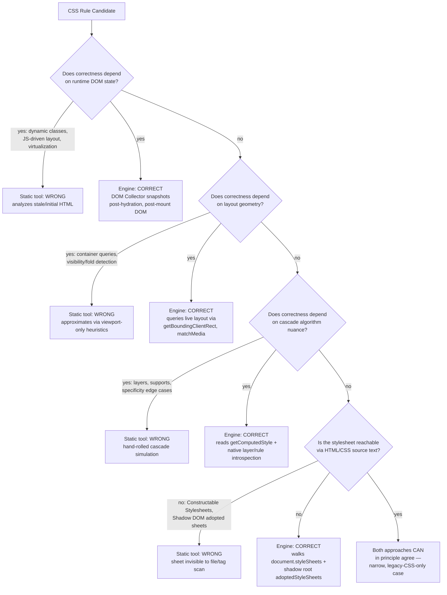

# 002 — Problem Statement

## 1. Title

**Critical CSS Extraction Engine — Problem Statement**

## 2. Version

| Field | Value |
|---|---|
| Document Version | 1.0.0 |
| Status | Accepted |
| Last Updated | 2026-07-09 |
| Owners | Core Architecture Working Group |
| Stability | Stable (foundational document; changes require RFC + ADR) |

## 3. Purpose

This document precisely defines the problem the Engine solves, and — more importantly for an architecture that deliberately rejects existing tooling — precisely characterizes *why* the dominant existing approach (static HTML/CSS parsing) produces incorrect results on modern production frontends. It exists so that every module design document downstream can point to a concrete failure scenario as justification for a specific engineering decision, rather than re-arguing first principles in every file.

Where [001-Vision.md](001-Vision.md) makes the philosophical case for a browser-driven architecture, this document makes the empirical and technical case: it enumerates, with mechanism, the classes of modern CSS and DOM behavior that a static analyzer cannot correctly model, and it quantifies the downstream cost of extraction errors in terms of the Core Web Vitals metrics (LCP, CLS) and user-visible artifacts (FOUC) that critical CSS extraction exists to prevent in the first place.

## 4. Audience

Same primary audience as [001-Vision.md](001-Vision.md): performance engineers, SSR framework authors, CI/CD platform engineers, and autonomous coding agents implementing this system. This document is written with a slightly higher bar for technical precision than the vision document, since it will be cited as the justification for specific design decisions in module-level RFCs (e.g., "see [002-Problem-Statement.md](002-Problem-Statement.md) §8.3 for why Shadow DOM requires explicit traversal").

## 5. Prerequisites

- Working knowledge of the CSS cascade algorithm (origin, specificity, order, layers, `!important`).
- Familiarity with the DOM mutation lifecycle in modern JavaScript frameworks (hydration, client-side rendering, lazy mounting).
- Basic familiarity with Core Web Vitals: Largest Contentful Paint (LCP), Cumulative Layout Shift (CLS), and the concept of flash-of-unstyled-content (FOUC) as a perceptual/UX defect.
- Read [001-Vision.md](001-Vision.md) first — this document assumes the reader already accepts (or is evaluating) the browser-as-source-of-truth position and wants the detailed evidence base.

## 6. Related Documents

- [001-Vision.md](001-Vision.md) — the philosophical and architectural response to the problem defined here.
- [003-Requirements.md](003-Requirements.md) — requirements derived directly from the failure scenarios enumerated in Section 8 below.
- [006-Design-Principles.md](006-Design-Principles.md) — engineering principles that operationalize the response to this problem statement.
- [../adr/ADR-0001-Browser-Is-Source-of-Truth.md](../adr/ADR-0001-Browser-Is-Source-of-Truth.md) — formal decision record citing this document as motivating evidence.
- [../adr/ADR-0002-No-Custom-Selector-Parser.md](../adr/ADR-0002-No-Custom-Selector-Parser.md) — decision record directly addressing the selector-matching failure class in Section 8.2.
- [../design/200-Visibility-Engine-Overview.md](../design/200-Visibility-Engine-Overview.md) (forthcoming) — the subsystem responding to the visibility-detection failure class in Section 8.6.
- [../design/300-CSSOM-Walker.md](../design/300-CSSOM-Walker.md) (forthcoming) — the subsystem responding to the CSSOM traversal failure classes in Sections 8.1–8.5.

## 7. Overview

Critical CSS extraction is the technique of computing, for a given page and viewport, the minimal set of CSS declarations required to correctly render the content visible without scrolling (the "above-the-fold" region) at first paint, so that this minimal CSS can be inlined into the initial HTML response (or injected synchronously) while the remainder of the page's stylesheet is deferred (loaded asynchronously, or lazily). Done correctly, this eliminates the render-blocking cost of downloading and parsing a full application stylesheet before the browser can paint anything meaningful, directly improving First Contentful Paint (FCP) and Largest Contentful Paint (LCP), and — if the "critical" set is *complete* — avoids any visible re-layout or restyle (and thus CLS and FOUC) once the deferred stylesheet arrives.

The word "correctly" in the preceding paragraph is the entire problem. Critical CSS extraction has two ways to fail, and they are asymmetric in consequence:

1. **Under-inclusion** — omitting a rule that actually affects an above-fold element. This produces FOUC and/or layout shift when the deferred stylesheet loads and the browser must repaint/relayout with the correct styles applied, moving content the user has already started reading or interacting with.
2. **Over-inclusion** — including a rule that does not affect any above-fold element. This bloats the critical payload, which is itself render-blocking (it is inlined), directly working against the technique's entire purpose. Excessive over-inclusion, in the limit, is equivalent to not extracting critical CSS at all — the theoretical "safe" degenerate solution (include the entire stylesheet as "critical") produces zero rendering errors but zero performance benefit either.

A correct extractor must therefore compute a *precise* set: neither too small (introducing FOUC/CLS) nor too large (eliminating the perf benefit). This document's central claim is that static analysis of HTML and CSS source text structurally cannot compute this precise set for the class of applications this Engine targets, because the true answer depends on cascade resolution, selector-matching, and layout algorithms that are only defined operationally by browser engine implementations — not recoverable from source text by pattern-matching or AST traversal alone.

## 8. Detailed Design — Failure Analysis of Static Approaches

This section is the technical core of the document. Each subsection identifies a specific modern CSS/DOM feature or authoring pattern, explains the mechanism by which static analysis fails on it, and gives a concrete failure scenario.

### 8.1 Dynamically Generated / Runtime Class Names

**Mechanism.** Utility-first frameworks (Tailwind) and CSS-in-JS libraries (Emotion, Styled Components, vanilla-extract, CSS Modules with content hashing) frequently generate class names that either (a) do not exist in the static HTML markup emitted at build time because they are applied conditionally by client-side logic (`className={isActive ? styles.active : styles.inactive}`), or (b) are hashed per-build in a way that a static extractor analyzing a stale HTML snapshot and a fresh CSS bundle (or vice versa) will silently fail to correlate.

**Failure scenario.** A React component renders a hero banner whose "featured" state (`is-featured` class, applied via client-side A/B assignment logic that runs after hydration) changes its background color and padding. A static tool inspecting the server-rendered HTML before hydration sees only the default-state class. It correctly extracts the default-state rule as critical and — having no way to observe the post-hydration class change — never even considers the `is-featured` rule as a candidate, regardless of how sophisticated its selector matcher is. The rule is dropped not because of a selector-matching bug but because the *element it would apply to hasn't taken on that class yet* in the artifact being analyzed.

**Why browser-driven extraction avoids this.** The Engine's Navigation Engine drives the page through its real lifecycle (navigation → hydration → configured stability point) before the DOM Collector takes its snapshot, so the DOM inspected for critical-CSS purposes is the DOM the user actually sees, with all client-side class mutations already applied.

### 8.2 CSS-in-JS Runtime Injection and Constructable Stylesheets

**Mechanism.** Emotion and Styled Components inject `<style>` tags at runtime as components mount, often generating class names non-deterministically per render or per build. Newer approaches use `CSSStyleSheet` construction plus `document.adoptedStyleSheets` (or shadow-root `adoptedStyleSheets`) rather than `<style>` tag injection at all — these stylesheets have no textual representation anywhere in the served HTML or any static `.css` file the extractor could locate on disk.

**Failure scenario.** A design-system component library ships styles exclusively via Constructable Stylesheets adopted into each component's shadow root. A static tool that globs for `.css` files in the build output, or scans `<style>`/`<link>` tags in HTML, finds nothing for this component — because there is nothing to find outside of a live document's `adoptedStyleSheets` array. The tool cannot extract critical rules for this component at all; the component either renders unstyled (FOUC) until its stylesheet is somehow loaded, or — more commonly — the static tool's authors special-cased "unrecognized" content as always-critical, defeating the point of extraction for that entire component tree.

**Why browser-driven extraction avoids this.** The CSSOM Walker enumerates `document.styleSheets` and, for every element with a shadow root, that root's `adoptedStyleSheets`, exactly as the browser sees them — Constructable Stylesheets and traditional `<style>`/`<link>`-sourced sheets are indistinguishable once resolved into `CSSStyleSheet` objects, which is precisely the abstraction level the CSSOM Walker operates at (see [../design/307-Constructable-Stylesheets.md](../design/307-Constructable-Stylesheets.md), forthcoming).

### 8.3 Shadow DOM Style Encapsulation

**Mechanism.** Web Components (native Custom Elements + Shadow DOM) scope styles to the shadow root: a selector defined inside a shadow root's stylesheet only matches elements within that shadow tree (subject to `:host`, `::slotted()`, and `part`/`theme` exceptions), and — critically — a selector in the *outer* document's stylesheet does not pierce into a shadow root at all (again subject to specific exceptions). A static text/AST scanner that treats the entire document as one flat DOM+CSS namespace will produce two distinct classes of error: it may attribute an outer-document rule as matching an element that is actually shadow-encapsulated and unreachable by that selector, or fail to associate a shadow-scoped rule with its true (encapsulated) matching elements because it never descends into shadow roots during DOM traversal.

**Failure scenario.** A page uses a native `<user-avatar>` custom element whose shadow root contains an `` styled by a shadow-scoped rule `img { border-radius: 50%; }`. A static DOM walker built on `htmlparser2` or jsdom's default traversal (without explicit shadow-root-aware walking) never enters the shadow tree — the `` is invisible to it as a traversal target, so the rule is never even considered as a match candidate, regardless of the geometry of the avatar or whether it's above the fold. The avatar renders as an unstyled square momentarily (FOUC) if this rule is dropped from critical CSS.

**Why browser-driven extraction avoids this.** The DOM Collector explicitly traverses open (and, per configured security policy, closed) shadow roots as first-class traversal targets, and the CSSOM Walker independently walks each shadow root's `adoptedStyleSheets`/`<style>` contents, preserving the encapsulation boundary that governs real matching (see forthcoming [../design/300-CSSOM-Walker.md](../design/300-CSSOM-Walker.md) and [../spec/004-Shadow-DOM.md](../spec/004-Shadow-DOM.md)).

### 8.4 Media Queries and Container Queries

**Mechanism.** Media queries have always required *some* runtime evaluation (viewport width/height, `prefers-color-scheme`, etc.), which static tools have historically approximated by hand-checking a `@media` condition's breakpoint numbers against a configured "viewport size." Container queries (`@container`), a more recent CSS feature, make this approximation categorically impossible: whether a container-query rule applies depends on the *inline size of a specific ancestor container element*, which is a layout-dependent quantity that can only be known after the browser has performed layout — it cannot be derived from the viewport size or from CSS/HTML source text at all, because it depends on the interaction of arbitrarily many ancestor elements' box models, their content, applied margins/padding/borders, and any container-type declarations.

**Failure scenario.** A card component uses `@container (min-width: 400px) { .card-title { font-size: 1.5rem; } }` where the containment context is a sidebar that is narrower than 400px on desktop (because of an adjacent navigation panel) but wider than 400px on a tablet layout where the sidebar is full-width. A static tool with a single "assume desktop viewport = 1280px, therefore likely matches" heuristic gets this backwards for this specific component, because the relevant dimension is the *container's* resolved width, not the viewport's. The rule is either wrongly included (bloat) or wrongly excluded (FOUC-causing font-size jump) depending on which arbitrary heuristic direction the static tool guessed.

**Why browser-driven extraction avoids this.** The Engine renders the real page at a real viewport size and queries the resolved container query state via the browser's own container-query evaluation (reflected in matched-rule results from the live CSSOM/layout engine), so container query resolution is exactly as correct as Chromium's own implementation — because it *is* Chromium's own implementation, not an approximation of it.

### 8.5 Cascade Layers, `@supports`, and `@layer` Ordering

**Mechanism.** Cascade layers (`@layer`) allow authors to explicitly control which stylesheet "wins" in the cascade independent of specificity and source order — a rule in a later-declared layer can be overridden by an earlier-declared layer's rule with lower specificity, which inverts the intuition most static analyzers (including humans) bring to "later rule wins" reasoning. `@supports` blocks conditionally include rules based on runtime feature-detection queries that require the actual browser engine's feature support matrix to evaluate correctly (a static tool must hard-code a feature support table per browser/version, which immediately goes stale).

**Failure scenario.** A design system declares `@layer reset, base, components, overrides;` and defines a high-specificity `.button` rule inside the `base` layer plus a low-specificity `.button` rule inside `overrides`. Per the cascade-layers specification, the `overrides` layer's rule wins regardless of specificity, because layer order is evaluated before specificity. A static tool computing "which rule wins" using ordinary specificity math (as virtually every hand-rolled CSS cascade simulator does, because layers are a relatively recent and algorithmically distinct addition to the cascade) will pick the `base` layer's higher-specificity rule — the opposite of the browser's actual resolution — and extract the wrong declaration values into the critical payload, producing a visible style mismatch the instant the deferred (correct) stylesheet loads.

**Why browser-driven extraction avoids this.** The Cascade Resolver consumes cascade-layer order and winner determination as reported by browser-native computation (`getComputedStyle()` on the resolved element reflects the true post-cascade value; layer membership and order are independently retrievable from `CSSLayerBlockRule`/`CSSLayerStatementRule` objects in the live CSSOM), so layer-ordering semantics are correct by construction rather than by re-implementation (see forthcoming [../design/305-Cascade-Layers.md](../design/305-Cascade-Layers.md) and [../algorithms/506-Cascade-Layers.md](../algorithms/506-Cascade-Layers.md)).

### 8.6 Pseudo-Elements and JS-Driven Layout

**Mechanism.** `::before`/`::after` pseudo-elements are generated content with no corresponding DOM node at all — there is no `Element` object to call `.matches()` against directly, and no node for a naive DOM walker to enumerate as "the thing this rule affects." Separately, many modern frameworks perform layout-affecting DOM mutation asynchronously after initial paint: lazy-loaded above-fold images that reflow siblings once their intrinsic dimensions resolve, skeleton-loader components that swap to real content (with different box dimensions) once data arrives, and virtualized lists that only materialize DOM nodes for the currently-scrolled-to range. A static tool analyzing the *initial* server-rendered HTML has no way to observe any of this, because none of it exists yet at the point the static snapshot was taken.

**Failure scenario.** A product listing page uses a virtualized list library that, in its initial (pre-hydration) server-rendered HTML, renders only a lightweight placeholder for all but the first 3 visible rows (a common SSR optimization for virtualization libraries). A static extractor analyzing this HTML correctly identifies the first 3 rows as above-fold but has no information at all about rows 4–8, which are *also* above-the-fold once the virtualization library mounts client-side and measures the actual viewport, because the viewport can fit 8 rows, not 3. The rules governing rows 4–8's styling are never extracted as critical, and those rows flash unstyled the moment the library finishes mounting and materializing them — even though, from the end user's perspective, they were "above the fold" the entire time.

**Why browser-driven extraction avoids this.** The Navigation Engine's stability-detection step (waiting past hydration and configured async-mount signals) ensures the DOM Collector's snapshot reflects the fully-mounted, fully-virtualized-and-measured state of the page, not the SSR placeholder state; pseudo-elements are handled via a documented fallback strategy that queries `getComputedStyle(el, '::before')` directly against the real element rather than requiring a corresponding DOM node (see forthcoming [../design/402-Pseudo-Elements.md](../design/402-Pseudo-Elements.md)).

## 9. Architecture

The following diagram summarizes, as a decision tree, why each failure class above is unrecoverable for a purely static pipeline, contrasted with the corresponding browser-driven resolution path.



The diagram's terminal node — "both approaches can in principle agree" — is deliberately narrow: it represents the shrinking subset of real-world stylesheets that use no cascade layers, no container queries, no CSS-in-JS runtime injection, no Shadow DOM, and no JS-driven post-load layout changes. This subset was close to "most production CSS" a decade ago; it is a minority case for the application classes this Engine is chartered to serve today (see [001-Vision.md](001-Vision.md) §8.1).

## 10. Algorithms

This document's algorithmic content is deliberately limited to characterizing *why* an algorithm is required, rather than specifying the algorithm itself (that is the responsibility of module design docs and [../algorithms/](../algorithms/)). One diagnostic algorithm is specified here because it is the primary tool this document's claims rely on and that CI pipelines built on the Engine will use to detect regressions:

**Algorithm: Static-vs-Dynamic Divergence Detection**

- **Problem statement:** Given a page, quantify the degree to which a hypothetical static-analysis extraction would diverge from the Engine's browser-driven extraction, in order to validate (and continuously re-validate, as the target application evolves) the claims in Section 8.
- **Inputs:** A target route/URL; a reference "naive static" rule set (e.g., all rules whose selector text matches any class/id/tag present in the raw server-rendered HTML, computed via simple string containment); the Engine's browser-driven critical rule set for the same route/viewport.
- **Outputs:** A divergence report: rules present in the static set but absent from the dynamic set (over-inclusion risk), and rules present in the dynamic set but absent from the static set (under-inclusion risk — the FOUC/CLS-causing class of error).
- **Pseudocode:**

```text
function computeDivergence(route, viewport) -> DivergenceReport:
    staticHtml = fetchRawServerRenderedHtml(route)
    staticCandidateRules = allStylesheetRules(route).filter(rule =>
        selectorReferencesAnyOf(rule, extractClassesAndIds(staticHtml)))

    dynamicCriticalRules = Engine.extract(route, viewport).rules

    missedByStatic = dynamicCriticalRules - staticCandidateRules
    falsePositivesInStatic = staticCandidateRules - dynamicCriticalRules

    return DivergenceReport(missedByStatic, falsePositivesInStatic)
```

- **Time complexity:** Dominated by the Engine's own extraction cost for the dynamic side (see [001-Vision.md](001-Vision.md) §10); the static side is `O(rules × candidateSelectors)` string containment checks, which is fast but is exactly the naive approximation being critiqued.
- **Memory complexity:** `O(rules)` for both rule sets held simultaneously for set-difference computation.
- **Failure cases:** The "naive static" reference implementation is deliberately simplistic and is not a fair stand-in for the most sophisticated static tools' heuristics (which may include some limited runtime measurement); this algorithm is a documentation/diagnostic device to make divergence *visible*, not a rigorous head-to-head benchmark against any specific competing tool.
- **Optimization opportunities:** This report can be generated as an optional CI diagnostic artifact (see [../design/1004-Visualization.md](../design/1004-Visualization.md), forthcoming) to give teams migrating from a static tool concrete, per-route evidence of what they were getting wrong previously.

## 11. Implementation Notes

- Every failure class in Section 8 should have a corresponding fixture in `fixtures/` (per the brief's Section 2.15 fixture list: Tailwind, Bootstrap, CSS Modules, Styled Components, Emotion, Shadow DOM, Container Queries, Nested CSS, huge enterprise stylesheets) and a corresponding integration test asserting the Engine handles it correctly — see [../testing/001-Fixtures.md](../testing/001-Fixtures.md) (forthcoming).
- Implementers building the Navigation Engine's stability-detection logic (referenced throughout Section 8) should treat "stability" as inherently application-specific: a configurable hook (e.g. `waitForStable: async (page) => {...}` or a declarative selector/timeout combination) is required rather than a single hard-coded heuristic, because the JS-driven-layout failure class (Section 8.6) has no universal fixed-delay solution.
- The Cascade Resolver's reliance on `getComputedStyle()` (Section 8.5) has a specific implementation nuance: computed style reflects the *final* cascade result for a property, but does not, by itself, tell you *which rule* produced that value when multiple rules could plausibly apply — the Engine additionally needs `CSSStyleDeclaration`-level rule attribution (via CDP's `CSS.getMatchedStylesForNode` or equivalent) to know which specific rule to retain, not merely that some rule produced the correct final value. This is elaborated in [../design/305-Cascade-Layers.md](../design/305-Cascade-Layers.md) (forthcoming).

## 12. Edge Cases

- **`:has()` and forward-looking selector combinators:** correctness depends on descendant subtree state at match time; must be evaluated live, never approximated.
- **`prefers-reduced-motion`, `prefers-color-scheme`, and other user/environment media features:** the "correct" critical CSS may legitimately differ per user preference; the Engine must support extracting per-preference-profile critical sets, not assume a single canonical environment.
- **Cross-origin stylesheets without CORS headers:** `cssRules` access throws `SecurityError`; must degrade gracefully (documented in [../design/300-CSSOM-Walker.md](../design/300-CSSOM-Walker.md), forthcoming) rather than crash the extraction pipeline for the whole page.
- **Closed Shadow Roots:** `shadowRoot` is `null` for elements using `{mode: 'closed'}`; the Engine cannot traverse into these via standard DOM APIs and must document this as a known, spec-consistent limitation (see [../spec/004-Shadow-DOM.md](../spec/004-Shadow-DOM.md), forthcoming) rather than a bug.
- **Nested CSS and future syntax (`@scope`, native CSS nesting):** static parsers require grammar updates to even parse these without erroring; a browser-driven pipeline inherits correct parsing automatically from the underlying engine version.
- **Nondeterministic runtime state (animations mid-flight, randomized experiment classes):** the Engine can only be as deterministic as its input; this is a documented limitation of the *problem*, not solvable by any architecture, but browser-driven extraction at least makes the *the* answer for a *given, fixed* snapshot correct, where static tools may be wrong even for a fixed snapshot.

## 13. Tradeoffs

| Static-Analysis Approach | Browser-Driven Approach (this Engine) |
|---|---|
| Fast (milliseconds per page) | Slow per unit, but correct (seconds per page/viewport, offset by caching/pooling) |
| Zero runtime dependency beyond a JS/TS toolchain | Heavy dependency on Playwright/Chromium |
| Fails silently and unpredictably on modern CSS features (Sections 8.1–8.6) | Correct by construction for any feature the underlying browser engine supports |
| Cannot observe JS-driven post-load DOM/CSS mutation | Observes real, stabilized, post-hydration state |
| Well-suited to simple static sites with legacy CSS | Well-suited to complex, framework-heavy, component-library-driven production applications — the explicit target of this project |

This table is the empirical complement to the tradeoff table in [001-Vision.md](001-Vision.md) §13: the vision states the philosophical bet; this document supplies the failure-mode evidence justifying it.

## 14. Performance

The performance implication of this document's findings is specific: **every static-analysis shortcut this Engine declines to take is a shortcut that a competing tool takes at the cost of correctness on the failure classes enumerated in Section 8.** This reframes "the Engine is slower than Critical/Critters" from a weakness into an expected and accepted consequence of a different, and for this project's target audience, more important optimization target: correctness under CSS/DOM complexity, not raw throughput on simple inputs. Concrete performance budgets, caching strategy, and parallelization design are specified in [../performance/000-Performance-Overview.md](../performance/000-Performance-Overview.md) (forthcoming); this document's contribution to the performance conversation is establishing why the Engine does not compete on the same axis as static tools in the first place.

## 15. Testing

Because this document's core claims are empirical assertions about *how* static tools fail, the Engine's test suite has an obligation not present in a typical project: it must maintain regression fixtures that concretely demonstrate each Section 8 failure class, so that (a) the Engine's own correctness against these cases is continuously verified, and (b) the documentation's claims remain falsifiable and checked, not just asserted in prose. Concretely:

- **Unit tests** for the dependency graph and cascade resolver components in isolation against synthetic cascade-layer and `@supports` inputs.
- **Integration tests** running the full pipeline against Shadow DOM, Constructable Stylesheet, and container-query fixtures, asserting extracted rule sets match browser-observed computed styles.
- **Visual regression tests** rendering fixture pages with extracted critical CSS only, diffing against fully-styled renders, per failure class in Section 8.
- **Divergence-detection tests** (Section 10's algorithm) run against the fixture corpus as a standing regression suite, so that any future change that accidentally reintroduces static-parsing-like behavior is caught automatically.

## 16. Future Work

- **Quantitative, continuously-updated divergence benchmarking** against publicly available production site CSS corpora (with permission/opt-in), to keep this document's claims grounded in current, not merely historical, evidence.
- **Formal taxonomy of CSS features by "static-analyzability"** — a research question (tracked in [../research/](../research/), forthcoming) of whether some subset of CSS features could be proven statically decidable, which would justify a future hybrid fast-path for pages provably restricted to that subset.
- **User-preference-profile-aware extraction** (`prefers-color-scheme`, `prefers-reduced-motion`, `prefers-contrast`) as a first-class multi-profile dimension alongside multi-viewport extraction (see roadmap Phase 3, and forthcoming [../design/105-Viewport-Manager.md](../design/105-Viewport-Manager.md)).
- **Open question:** how should the divergence-detection diagnostic (Section 10) be productized as a migration tool for teams moving off Critical/Critters/Penthouse, to give them concrete, route-level evidence of what changes rather than requiring them to trust this document's prose claims?

## Appendix: Quantifying the Cost of Getting It Wrong

Critical CSS extraction errors are not cosmetic — they translate directly into the Core Web Vitals metrics that govern search ranking signals, conversion-rate-sensitive user experience, and, for e-commerce and publisher clients, directly measurable revenue.

**Cumulative Layout Shift (CLS).** CLS is calculated from the impact fraction and distance fraction of unexpected layout shifts occurring during a page's lifecycle, weighted most heavily for shifts that happen during and shortly after the initial render. Under-inclusion errors (Section 8, all subsections) systematically produce exactly this shift pattern: content renders with default or entirely absent styling at first paint, then snaps to its correct box dimensions, position, or typography the instant the deferred (non-critical) stylesheet finishes loading and applying — a shift that is, by construction, "unexpected" from the rendering engine's perspective because nothing in the DOM changed, only styling did. A single missed `font-family`/`font-size` rule on an above-fold heading can shift every element below it; a missed `container`-driven width rule can reflow an entire grid. Google's Core Web Vitals thresholds classify a CLS score above 0.25 as "poor," and industry data consistently shows font/style-driven shifts as one of the most common real-world CLS contributors — precisely the failure mode this Engine's correctness-first design targets.

**Largest Contentful Paint (LCP).** LCP measures the render time of the largest visible content element. Over-inclusion errors (bloated critical CSS payloads, Section 7's second failure mode) directly harm LCP because the inlined/critical CSS is by definition parsed and applied before the browser can proceed with paint — a critical payload padded with unnecessary rules (because a static tool's approximate matcher erred toward "keep it, just in case" to avoid the more visible under-inclusion failure) is extra render-blocking bytes sitting directly in the LCP-critical path. This is the mechanism by which conservative-but-imprecise static tools trade one visible defect (FOUC) for a subtler but still real one (delayed LCP).

**FOUC (Flash of Unstyled/Mis-styled Content).** Unlike CLS, FOUC has no single standardized Web Vitals metric, but it is a well-documented, directly user-perceptible defect: content appearing briefly in default browser styling (or, worse, styled by the wrong cascade-layer winner per Section 8.5) before snapping to final appearance. For brand-sensitive above-fold content — hero banners, navigation, primary CTAs — even a single-frame FOUC is disproportionately noticeable because it occurs at the exact moment a user forms their first impression of the page, and it is precisely the defect critical CSS extraction exists to eliminate; an extraction system that reintroduces it via under-inclusion errors has failed at its one job regardless of how much it improved raw load-time metrics.

The common thread across all three costs: they are triggered specifically by *incorrect* extraction, not by *slow* extraction. A build pipeline that takes ten extra seconds to run the Engine correctly has a fixed, budgetable, one-time cost. A production site silently shipping under-inclusive critical CSS accrues CLS/LCP/FOUC cost on every single page view, indefinitely, until someone notices — which is the economic argument, alongside the philosophical one in [001-Vision.md](001-Vision.md), for why this project treats correctness as non-negotiable and performance as an engineering problem to be solved on top of it.

## 17. References

- [001-Vision.md](001-Vision.md) — architectural response to the problem defined here.
- [003-Requirements.md](003-Requirements.md) — requirements derived from the failure scenarios above.
- [006-Design-Principles.md](006-Design-Principles.md) — engineering principles operationalizing the response.
- [../adr/ADR-0001-Browser-Is-Source-of-Truth.md](../adr/ADR-0001-Browser-Is-Source-of-Truth.md)
- [../adr/ADR-0002-No-Custom-Selector-Parser.md](../adr/ADR-0002-No-Custom-Selector-Parser.md)
- [../spec/004-Shadow-DOM.md](../spec/004-Shadow-DOM.md) (forthcoming) — Shadow DOM specification reference.
- [../spec/006-Container-Queries.md](../spec/006-Container-Queries.md) (forthcoming) — container query specification reference.
- [../spec/002-Cascade.md](../spec/002-Cascade.md) (forthcoming) — cascade/layers specification reference.
- W3C CSS Cascading and Inheritance Level 5 (cascade layers) — https://www.w3.org/TR/css-cascade-5/
- W3C CSS Containment Module Level 3 (container queries) — https://www.w3.org/TR/css-contain-3/
- W3C Shadow DOM / DOM Standard (WHATWG) — https://dom.spec.whatwg.org/#shadow-trees
- web.dev, "Cumulative Layout Shift (CLS)" — https://web.dev/cls/
- web.dev, "Largest Contentful Paint (LCP)" — https://web.dev/lcp/
- Prior art referenced for contrast: Critical (addyosmani/critical), Penthouse (pocketjoso/penthouse), Critters (GoogleChromeLabs/critters).
