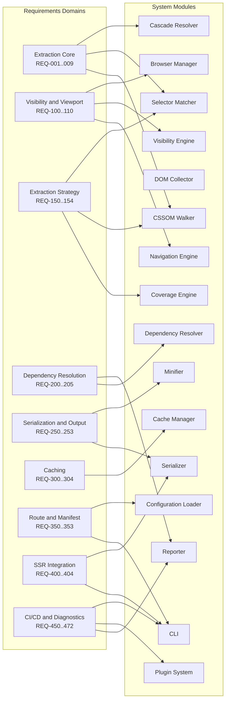
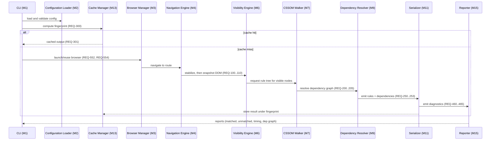

# Requirements Specification

## Version

- **Document Version:** 1.0.0
- **Status:** Draft — Phase 1 (Repository Foundation)
- **Last Updated:** 2026-07-09
- **Applies To:** Critical CSS Extraction Engine, all packages under `packages/` and `apps/` as defined in [007-Repository-Structure](./007-Repository-Structure.md)

## Purpose

This document enumerates the functional and non-functional requirements of the Critical CSS Extraction Engine, derived directly from Section 2.3 (High-Level Requirements) and Section 2.18 (Acceptance Criteria) of the project brief. It exists to give every downstream design document — architecture, module design, algorithm RFCs, plugin SDK, testing strategy — a single, versioned, traceable source of truth for *what the system must do* before any document describes *how* it does it.

Every requirement in this document carries a stable identifier (`REQ-NNN`), a priority classification under the MoSCoW framework, and a traceability link to one or more of the fifteen system modules defined in Section 2.4 of the brief (see [001-Vision](./001-Vision.md) for the module table reproduced there, and [007-Repository-Structure](./007-Repository-Structure.md) for where each module physically lives in the monorepo). No design document may introduce a capability that is not backed by a requirement here; conversely, every requirement here must eventually be satisfied by at least one design document, algorithm RFC, and test plan. Where a requirement is not yet traceable to a design document (because that document has not been written in this phase), the traceability table marks it `PENDING` rather than inventing a forward reference.

## Audience

- Core engine implementers writing the Browser Manager, CSSOM Walker, Selector Matcher, Cascade Resolver, Cache Manager, and other modules in `packages/`.
- Plugin authors extending the engine via the Plugin System (Section 2.13).
- SSR framework integrators (React, Next.js, Astro, Remix, Express, Fastify).
- CI/CD platform engineers wiring the engine into build pipelines.
- Technical reviewers auditing the project for architectural soundness before Phase 2 (Architecture) design work begins.
- Future contributors performing gap analysis between shipped functionality and the original specification.

This document assumes the reader is a senior engineer familiar with browser rendering, the CSS Object Model, and CI/CD pipeline design. It does not explain what CSSOM is; see [004-Terminology](./004-Terminology.md) for precise definitions of terms used throughout.

## Prerequisites

Readers should have already read, or have access to:

- [001-Vision](./001-Vision.md) — why this engine exists and what "critical CSS" means in this project's context.
- [002-Problem-Statement](./002-Problem-Statement.md) — the specific failure modes of static-analysis critical CSS tools that motivate a browser-driven approach.
- [004-Terminology](./004-Terminology.md) — conceptual vocabulary (fold, viewport profile, fingerprint, hybrid extraction, etc.).
- [005-Glossary](./005-Glossary.md) — acronym and proper-noun reference (CSSOM, Coverage API, LCP, CLS, etc.).
- Familiarity with the CSS Object Model, the Chrome DevTools Protocol Coverage domain, and Playwright's browser automation model is helpful but not required to read this document; it is required to implement against it.

## Related Documents

- [001-Vision](./001-Vision.md)
- [002-Problem-Statement](./002-Problem-Statement.md)
- [004-Terminology](./004-Terminology.md)
- [005-Glossary](./005-Glossary.md)
- [006-Design-Principles](./006-Design-Principles.md)
- [007-Repository-Structure](./007-Repository-Structure.md)
- Forward references (not yet written, referenced for traceability only): `../design/200-Visibility-Engine-Overview.md`, `../design/300-CSSOM-Walker.md`, `../design/400-Selector-Matching.md`, `../design/500-Dependency-Resolution-Overview.md`, `../design/800-Cache-Overview.md`, `../design/900-SSR-Overview.md`, `../algorithms/507-Dependency-Graph-Construction.md`, `../testing/000-Testing-Strategy.md`

## Overview

The brief's Section 2.3 lists ten high-level requirements in prose form: CSSOM-driven extraction, pluggable extraction strategies, multi-viewport support, device profiles, route-level generation, incremental caching, SSR integration, CI/CD integration, dependency graph generation, and rich diagnostics/reporting. Section 2.18 lists seven acceptance criteria that constrain *how well* those requirements must be satisfied: rendering parity, deterministic output, configurable viewport/fold, robust dependency resolution, high test coverage, extensible architecture, and enterprise CI suitability.

This document decomposes those seventeen prose statements into a numbered, testable requirements catalog. Each requirement is atomic — a single verifiable capability, not a bundle of related behaviors — because atomic requirements are the unit that test plans, task cards (see `docs/tasks/`), and acceptance tests (see `docs/implementation/003-Acceptance-Tests.md`, to be written in Phase 16) will reference. We separate **Functional Requirements** (what the system does) from **Non-Functional Requirements** (qualities the system must exhibit while doing it), because the two categories are verified by fundamentally different test strategies: functional requirements are verified by golden-snapshot and integration tests; non-functional requirements are verified by benchmark, stress, and static-analysis tooling (coverage thresholds, determinism replay tests, architecture-fitness tests).

We adopt MoSCoW (Must have, Should have, Could have, Won't have — this phase) rather than a numeric priority scale because MoSCoW maps directly onto the brief's Roadmap (Section 2.17): "Must" requirements are Phase 1–2 MVP scope, "Should" requirements are Phase 3–4, "Could" requirements are Phase 5 and beyond, and "Won't" requirements are explicit non-goals carried over from Section 2.2 of the brief. This alignment lets the roadmap and the requirements catalog stay mutually consistent without duplicating scheduling information in two places.

## Detailed Design

### 8.1 Requirement Taxonomy

Requirements are grouped into nine functional domains that mirror the module boundaries in Section 2.4, plus two non-functional domains:

1. **Extraction Core** — CSSOM traversal, selector matching, cascade resolution (modules: CSSOM Walker, Selector Matcher, Cascade Resolver).
2. **Visibility & Viewport** — above-fold determination, multi-viewport, device profiles (modules: Visibility Engine, Navigation Engine, Browser Manager).
3. **Extraction Strategy** — pluggable CSSOM/Coverage/Hybrid modes (modules: Coverage Engine, CSSOM Walker, Selector Matcher).
4. **Dependency Resolution** — variables, keyframes, fonts, layers, etc. (module: Dependency Resolver).
5. **Serialization & Output** — rule ordering, dedup, minification (modules: Serializer, Minifier).
6. **Caching** — fingerprinting, invalidation, reuse (module: Cache Manager).
7. **Route & Manifest Management** — route-level generation, manifest schema (modules: CLI, Configuration Loader).
8. **SSR Integration** — framework adapters, middleware (cross-cutting; no dedicated module in Section 2.4, implemented as adapters over CLI + Serializer).
9. **CI/CD & Diagnostics** — pipeline stages, reporting, plugin hooks (modules: Reporter, Plugin System, CLI).
10. **Non-Functional: Performance & Determinism.**
11. **Non-Functional: Extensibility, Testability, Enterprise Fitness.**

### 8.2 Requirement ID Convention

Each requirement has the form `REQ-<NNN>: <statement>`. IDs are assigned sequentially at authoring time and are **never reused or renumbered**, even if a requirement is later deprecated — a deprecated requirement is marked `[DEPRECATED]` in place and superseded by a new ID, preserving audit history across the document's git log. IDs are grouped by hundred-block per domain to leave room for insertions without renumbering:

- `REQ-001`–`REQ-099`: Extraction Core
- `REQ-100`–`REQ-149`: Visibility & Viewport
- `REQ-150`–`REQ-199`: Extraction Strategy
- `REQ-200`–`REQ-249`: Dependency Resolution
- `REQ-250`–`REQ-299`: Serialization & Output
- `REQ-300`–`REQ-349`: Caching
- `REQ-350`–`REQ-399`: Route & Manifest Management
- `REQ-400`–`REQ-449`: SSR Integration
- `REQ-450`–`REQ-499`: CI/CD & Diagnostics
- `REQ-500`–`REQ-549`: Non-Functional (Performance/Determinism)
- `REQ-550`–`REQ-599`: Non-Functional (Extensibility/Testability/Enterprise)

### 8.3 Functional Requirements Catalog

#### Extraction Core (CSSOM-driven extraction, Section 2.3 item 1)

| ID | Requirement | Priority | Module(s) |
|---|---|---|---|
| REQ-001 | The engine MUST derive the set of applicable CSS rules exclusively from the live browser CSSOM (`document.styleSheets` and descendants), never from a static parse of source CSS text. | Must | CSSOM Walker |
| REQ-002 | The engine MUST use the browser's native `Element.prototype.matches()` (or equivalent DOM API) as the sole selector-matching primitive. It MUST NOT implement a custom CSS selector parser or matcher. | Must | Selector Matcher |
| REQ-003 | The engine MUST correctly resolve cascade origin (user-agent, user, author), specificity, and source order when two or more rules apply to the same element and property. | Must | Cascade Resolver |
| REQ-004 | The engine MUST support modern selector forms delegated to the browser, including combinators, `:is()`, `:where()`, `:has()` (where supported by the target browser engine), attribute selectors, and namespaced selectors. | Must | Selector Matcher |
| REQ-005 | The engine MUST correctly order rules originating from CSS cascade layers (`@layer`) per the CSS Cascade Layers specification. | Should | Cascade Resolver |
| REQ-006 | The engine MUST traverse nested stylesheets reachable via `@import`, including cross-origin stylesheets where CORS permits CSSOM access. | Must | CSSOM Walker |
| REQ-007 | The engine MUST degrade gracefully (log a diagnosable warning, exclude the sheet, continue extraction) when a stylesheet's `cssRules` are inaccessible due to cross-origin restrictions. | Must | CSSOM Walker |
| REQ-008 | The engine MUST support extraction from Constructable Stylesheets (`CSSStyleSheet` objects adopted via `adoptedStyleSheets`), including those used inside Shadow DOM. | Should | CSSOM Walker |
| REQ-009 | The engine MUST traverse open and closed Shadow DOM trees for both DOM collection and CSSOM resolution where the extraction context has access. | Should | CSSOM Walker, DOM Collector |

#### Visibility & Viewport (multi-viewport, device profiles; Section 2.3 items 3–4)

| ID | Requirement | Priority | Module(s) |
|---|---|---|---|
| REQ-100 | The engine MUST determine, for each DOM node, whether it is visible within a configurable "fold" boundary using geometry (bounding box), intersection with viewport, non-zero dimensions, `display`, and `visibility` computed style. | Must | Visibility Engine |
| REQ-101 | The fold boundary MUST be configurable independently of raw viewport height (e.g., a fold offset or explicit pixel value distinct from `window.innerHeight`). | Must | Visibility Engine |
| REQ-102 | Opacity-based hiding (`opacity: 0`) MUST be configurable as either "counts as visible" or "counts as hidden," since both interpretations are legitimate depending on animation use cases. | Should | Visibility Engine |
| REQ-103 | The engine MUST support excluding elements that are positioned off-screen via CSS transforms, as a configurable option rather than a default, since transform-based visibility is heuristic. | Could | Visibility Engine |
| REQ-104 | The engine MUST support generating critical CSS independently for multiple named device/viewport profiles (at minimum: Mobile, Tablet, Desktop) in a single invocation. | Must | Navigation Engine, Browser Manager |
| REQ-105 | Each viewport profile MUST be independently configurable for width, height, device pixel ratio, user agent string, and fold offset. | Must | Configuration Loader |
| REQ-106 | The engine MUST provide a merge strategy that combines per-viewport critical CSS outputs into a single deliverable, deduplicating identical rules and normalizing media queries. | Must | Serializer |
| REQ-107 | The engine SHOULD support an IntersectionObserver-assisted visibility mode as an alternative to pure geometric computation, for pages with dynamic post-load layout shifts. | Could | Visibility Engine |
| REQ-108 | The engine SHOULD support layout-shift-aware rescanning, re-evaluating visibility after a configurable settle delay or `requestAnimationFrame` count. | Could | Visibility Engine, Navigation Engine |
| REQ-109 | The engine MUST handle `position: fixed` and `position: sticky` elements as always potentially above-fold regardless of their document-order geometric position, subject to configuration. | Must | Visibility Engine |
| REQ-110 | The engine SHOULD provide dedicated handling for virtualized list containers so that only currently-rendered (not virtually-scrolled) items are considered for visibility. | Could | Visibility Engine |

#### Extraction Strategy (pluggable strategies; Section 2.3 item 2, Section 2.7)

| ID | Requirement | Priority | Module(s) |
|---|---|---|---|
| REQ-150 | The engine MUST support at least three extraction strategies selectable via configuration: CSSOM-only, Coverage-only, and Hybrid. | Must | CSSOM Walker, Coverage Engine |
| REQ-151 | Coverage-mode extraction MUST use the Chrome DevTools Protocol CSS Coverage domain to determine which rules were exercised during page load and interaction. | Must | Coverage Engine |
| REQ-152 | Hybrid-mode extraction MUST combine CSSOM selector matching, Coverage API results, and `getComputedStyle` verification, resolving disagreements per a documented precedence policy. | Must | Coverage Engine, Selector Matcher |
| REQ-153 | The strategy interface MUST be pluggable such that a new strategy can be added without modifying the Cascade Resolver or Serializer. | Should | Plugin System |
| REQ-154 | The engine MUST record, per rule, which strategy(ies) determined it as "used," to support diagnostic reporting (see REQ-470). | Should | Reporter |

#### Dependency Resolution (Section 2.3 item 9, Section 2.5 "Dependency Resolution")

| ID | Requirement | Priority | Module(s) |
|---|---|---|---|
| REQ-200 | The engine MUST construct a dependency graph capturing relationships between matched CSS rules and the at-rules/constructs they depend on: CSS custom properties, `@keyframes`, `@font-face`, `@property`, `@counter-style`, `@layer`, `@supports`, media queries, container queries, view transitions, and scroll timelines. | Must | Dependency Resolver |
| REQ-201 | Dependency resolution MUST proceed iteratively until reaching a fixed point (i.e., resolving a dependency must not miss transitive dependencies introduced by that dependency itself, such as a custom property whose value references another custom property). | Must | Dependency Resolver |
| REQ-202 | The engine MUST detect cycles in the dependency graph (e.g., custom properties that reference each other) and terminate resolution deterministically rather than looping indefinitely. | Must | Dependency Resolver |
| REQ-203 | The engine MUST include all `@font-face` rules transitively required by matched elements' computed `font-family`, including fallback chains. | Must | Dependency Resolver |
| REQ-204 | The engine MUST include `@keyframes` rules referenced by matched elements' `animation-name`, even where the animated element itself is not currently mid-animation at snapshot time. | Must | Dependency Resolver |
| REQ-205 | The dependency graph MUST be exposed as a first-class diagnostic artifact (see REQ-460), not only as internal state. | Should | Reporter |

#### Serialization & Output (implied by acceptance criteria: deterministic output)

| ID | Requirement | Priority | Module(s) |
|---|---|---|---|
| REQ-250 | The Serializer MUST produce byte-for-byte identical output across repeated runs against unchanged input (HTML, CSS, viewport, extraction mode). | Must | Serializer |
| REQ-251 | The Serializer MUST deduplicate rules that are structurally identical after normalization (whitespace, property order within a declaration block where order is not semantically significant is preserved, not reordered, to avoid altering cascade behavior). | Must | Serializer |
| REQ-252 | The engine MUST provide a Minifier stage that is separable from the Serializer, selectable via configuration (minified vs. human-readable output). | Should | Minifier |
| REQ-253 | The Serializer MUST preserve source order for rules where cascade order is semantically significant (equal specificity, equal origin). | Must | Serializer, Cascade Resolver |

#### Caching (Section 2.3 item 6, Section 2.8)

| ID | Requirement | Priority | Module(s) |
|---|---|---|---|
| REQ-300 | The engine MUST compute a fingerprint over HTML content, referenced CSS asset contents, viewport profile, and extraction mode sufficient to detect any input change that could alter output. | Must | Cache Manager |
| REQ-301 | The engine MUST reuse a prior extraction result without re-invoking the browser when the current fingerprint matches a cached fingerprint. | Must | Cache Manager |
| REQ-302 | The engine MUST provide explicit cache invalidation (manual and TTL-based) and MUST NOT silently serve stale output past a configured TTL. | Must | Cache Manager |
| REQ-303 | The cache SHOULD support per-route and per-viewport granularity so that a change to one route's HTML does not invalidate unrelated routes' cache entries. | Should | Cache Manager |
| REQ-304 | The engine COULD support a distributed cache backend (e.g., shared object storage or Redis) for multi-node CI environments. | Could | Cache Manager |

#### Route & Manifest Management (Section 2.3 item 5, Section 2.9)

| ID | Requirement | Priority | Module(s) |
|---|---|---|---|
| REQ-350 | The engine MUST accept a route manifest mapping route patterns (including wildcard patterns) to output CSS bundle identifiers. | Must | Configuration Loader, CLI |
| REQ-351 | The engine MUST generate critical CSS independently per route entry in the manifest. | Must | CLI |
| REQ-352 | The engine MUST support wildcard route patterns (e.g., `/blog/*`) that share a single generated bundle across matching routes. | Should | Configuration Loader |
| REQ-353 | The engine MUST report, per route, which viewport profiles were processed and their individual output sizes. | Should | Reporter |

#### SSR Integration (Section 2.3 item 7, Section 2.10)

| ID | Requirement | Priority | Module(s) |
|---|---|---|---|
| REQ-400 | The engine MUST expose a framework-agnostic core API that SSR adapters can call to retrieve critical CSS for a given route/viewport combination at request time or build time. | Must | CLI (as library entry point) |
| REQ-401 | The engine MUST provide a reference adapter for React SSR (`renderToString`/`renderToPipeableStream` injection points). | Should | (adapter layer, no Section 2.4 module — see Tradeoffs) |
| REQ-402 | The engine MUST provide a reference adapter for Next.js. | Should | (adapter layer) |
| REQ-403 | The engine SHOULD provide reference adapters for Astro, Remix, Express, and Fastify. | Could | (adapter layer) |
| REQ-404 | Every SSR adapter MUST support automatic `<style>` injection into the document `<head>` without requiring manual template edits by the integrating application, beyond adapter installation. | Should | (adapter layer) |

#### CI/CD & Diagnostics (Section 2.3 items 8, 10; Sections 2.11, 2.12, 2.13)

| ID | Requirement | Priority | Module(s) |
|---|---|---|---|
| REQ-450 | The engine MUST expose a CI-runnable pipeline covering: build, crawl routes, generate critical CSS, compare against baseline, publish artifacts, upload reports. | Must | CLI, Reporter |
| REQ-451 | The pipeline MUST fail the build (non-zero exit code) when generated CSS size exceeds a configured growth threshold relative to baseline. | Must | CLI |
| REQ-452 | The pipeline MUST fail the build when required dependencies (fonts, keyframes, variables) are detected as missing or unresolved. | Must | Dependency Resolver, CLI |
| REQ-453 | The pipeline MUST fail the build on unhandled extraction errors rather than silently producing partial output. | Must | CLI |
| REQ-460 | The engine MUST produce a dependency graph report as a structured, machine-readable artifact (e.g., JSON). | Must | Reporter |
| REQ-461 | The engine MUST produce a matched-selector report and an unmatched-selector report per extraction run. | Must | Reporter |
| REQ-462 | The engine MUST produce a per-stylesheet contribution report quantifying how much of each source stylesheet was retained. | Should | Reporter |
| REQ-463 | The engine MUST produce a timing report breaking down time spent per pipeline stage (navigation, collection, matching, resolution, serialization). | Should | Reporter |
| REQ-464 | The engine SHOULD produce a full extraction trace suitable for offline debugging of a single run. | Could | Reporter |
| REQ-465 | The engine COULD produce an HTML visualization highlighting above-fold DOM nodes and their matched CSS rules. | Could | Reporter (with `apps/visualizer`) |
| REQ-470 | The engine MUST expose lifecycle hooks — `beforeLaunch`, `afterNavigation`, `beforeCollection`, `afterCollection`, `beforeSerialize`, `afterSerialize` — to a plugin system. | Must | Plugin System |
| REQ-471 | Plugins MUST be able to ignore selectors, rewrite CSS, inject rules, customize visibility determination, and customize selector matching without modifying core module source. | Must | Plugin System |
| REQ-472 | Plugin execution MUST be sandboxed such that a misbehaving plugin cannot crash the host process or corrupt extraction state for unrelated routes. | Should | Plugin System |

### 8.4 Non-Functional Requirements Catalog

#### Performance & Determinism (Section 2.18 items 1, 2, 3, 4)

| ID | Requirement | Priority |
|---|---|---|
| REQ-500 | For a fixed input (HTML, CSS, viewport, mode), the engine MUST produce identical output CSS across repeated runs on the same engine version, with no non-deterministic ordering, timestamps, or random identifiers embedded in the output. | Must |
| REQ-501 | The engine MUST preserve rendering parity: applying the generated critical CSS to the above-fold region of the page MUST NOT produce a visually distinguishable result from the original full-CSS render, within a configurable pixel-diff tolerance. | Must |
| REQ-502 | Viewport and fold boundaries MUST be fully configurable per Section 2.3 items 3–4 and REQ-101/REQ-105 above; no hardcoded viewport assumptions are permitted anywhere in extraction-core modules. | Must |
| REQ-503 | Dependency resolution MUST be robust: a missing or unresolvable dependency MUST be surfaced as a diagnosable error (REQ-452), never silently dropped. | Must |
| REQ-510 | Selector matching MUST be memoized within a single extraction run so that repeated matches against structurally identical selector/element pairs are not recomputed. | Should |
| REQ-511 | Stylesheet traversal SHOULD be parallelizable across independent stylesheets within a single page extraction. | Could |
| REQ-512 | Route batch processing SHOULD support worker-thread or multi-process parallelism to scale CI throughput linearly with available cores, up to browser-instance resource limits. | Could |
| REQ-513 | The engine SHOULD support streaming output for large route sets rather than buffering all results in memory before writing. | Could |

#### Extensibility, Testability, Enterprise Fitness (Section 2.18 items 5, 6, 7)

| ID | Requirement | Priority |
|---|---|---|
| REQ-550 | The architecture MUST allow a new extraction strategy, a new SSR adapter, or a new diagnostic report to be added as an isolated package without modifying unrelated packages' public interfaces. | Must |
| REQ-551 | The project MUST maintain automated test coverage across unit, integration, visual-regression, and golden-CSS-snapshot layers as defined in [../testing/000-Testing-Strategy.md](../testing/000-Testing-Strategy.md) (pending). | Must |
| REQ-552 | The engine MUST be operable in a headless, non-interactive CI environment with no manual browser interaction, configurable timeouts on every network- or browser-bound operation, and structured (non-TTY-dependent) log output. | Must |
| REQ-553 | The engine MUST provide configurable network restrictions (e.g., blocking third-party origins) suitable for security-conscious enterprise CI environments. | Should |
| REQ-554 | The engine MUST enforce timeout protection on every browser operation (navigation, script evaluation, coverage collection) to prevent CI pipeline hangs. | Must |
| REQ-555 | The engine SHOULD expose a stable, semantically versioned public API (CLI flags, config schema, plugin hook signatures) such that minor version upgrades do not break existing enterprise CI integrations. | Should |

### 8.5 Requirements Traceability Diagram

The following diagram shows how functional requirement domains map onto the fifteen system modules from Section 2.4 of the brief. This is the canonical traceability view; individual module design documents (Phase 3 onward) will refine per-module requirement coverage further.



## Architecture

Requirements are enforced architecturally, not merely by convention, through three mechanisms:

1. **Package boundaries.** Each module in Section 2.4 corresponds to a package under `packages/` (see [007-Repository-Structure](./007-Repository-Structure.md)). Requirements that mandate isolation (REQ-153, REQ-550) are verified by dependency-direction lint rules that forbid, for example, the Serializer package from importing the Coverage Engine package directly — all cross-module communication flows through documented interfaces defined in each module's design document.

2. **Pipeline stage contracts.** The CI/CD pipeline (REQ-450) is modeled as a strict sequential state machine; each stage consumes a typed input and produces a typed output, allowing REQ-451/452/453 (fail-the-build conditions) to be implemented as stage-boundary assertions rather than scattered error handling.

3. **Fingerprint-gated execution.** Caching requirements (REQ-300–304) are architecturally centered on the Cache Manager sitting *in front of* the Browser Manager in the execution pipeline, so that a cache hit can short-circuit browser launch entirely — this is a load-bearing design decision that will be elaborated in [../architecture/011-Execution-Pipeline.md](../architecture/011-Execution-Pipeline.md) (pending, Phase 2).



## Algorithms

Requirements themselves are not algorithmic, but two derived processes governing this document are:

### 8.6 Requirement Conflict Detection

**Problem statement:** As requirements accumulate across phases, later documents may introduce a design that implicitly contradicts an earlier "Must" requirement (e.g., a caching design that reuses output across viewport profiles, contradicting REQ-105's per-profile configurability). We need a lightweight, repeatable check.

**Inputs:** The full requirements catalog (this document) as a table; a candidate design document's stated behaviors.

**Outputs:** A list of `(REQ-ID, conflicting-statement)` pairs, or empty if none found.

**Pseudocode:**
```
function detectConflicts(requirements, designDoc):
    conflicts = []
    for req in requirements:
        if req.priority in {MUST, SHOULD}:
            for statement in designDoc.statements:
                if statement.contradicts(req.text):
                    conflicts.append((req.id, statement))
    return conflicts
```

**Time complexity:** O(R × S) where R is the number of requirements and S is the number of design statements under review; in practice this is performed manually during document review, not executed as code, so the complexity bound describes reviewer effort, not runtime.

**Memory complexity:** O(R + S) to hold both sets during review.

**Failure cases:** Natural-language "contradicts" is not mechanically decidable; this process is a reviewer checklist, not an automated gate, until a future RFC formalizes requirements in a machine-checkable DSL (see Future Work).

**Optimization opportunities:** Tag requirements with structured predicates (e.g., `viewport.perProfile == true`) in a future schema so that at least the mechanically-checkable subset of conflicts can be linted automatically in CI.

### 8.7 Traceability Closure Check

**Problem statement:** Verify that every module in Section 2.4 has at least one traced requirement, and every "Must" requirement traces to at least one module.

**Inputs:** Requirements catalog with `Module(s)` column; module list from Section 2.4.

**Outputs:** Set of orphaned modules (no requirements) and orphaned Must-requirements (no module).

**Pseudocode:**
```
function traceabilityClosure(requirements, modules):
    coveredModules = set()
    orphanRequirements = []
    for req in requirements:
        if req.modules is empty and req.priority == MUST:
            orphanRequirements.append(req.id)
        coveredModules.update(req.modules)
    orphanModules = modules - coveredModules
    return (orphanModules, orphanRequirements)
```

**Time complexity:** O(R + M) where R is requirement count, M is module count.

**Memory complexity:** O(M) for the covered-module set.

**Failure cases:** A module referenced only by non-functional requirements (which do not carry a `Module(s)` column in this schema) would appear falsely orphaned; the SSR adapter layer is a known such case (see Tradeoffs below) since it is not a Section 2.4 module at all.

**Optimization opportunities:** None needed at current catalog scale (~90 requirements); would benefit from tabular tooling (a small script over a YAML export of this table) once the catalog exceeds a few hundred entries across all architecture documents.

## Implementation Notes

- This document is a **specification artifact**, not source code, but it is expected to be kept in sync with an eventual machine-readable export (e.g., `requirements.yaml`) consumed by CI to validate that acceptance tests (Phase 16) reference valid `REQ-ID`s. That export does not exist yet in Phase 1; it is called out in Future Work.
- The SSR adapter layer (REQ-400–404) is intentionally **not** mapped to any Section 2.4 module because the brief's module table does not include an "SSR Adapters" row. We treat SSR adapters as a thin, framework-specific consumption layer over the CLI's programmatic API and the Serializer's output, living in `packages/` alongside but outside the core fifteen modules. This is a deliberate scope clarification, not an omission — see Tradeoffs.
- Requirement priorities were assigned by cross-referencing the Roadmap (Section 2.17): anything listed as Phase 1–2 scope is `Must`, Phase 3–4 is `Should`, Phase 5-and-beyond is `Could`. Where the brief's acceptance criteria (Section 2.18) apply universally regardless of phase (e.g., deterministic output), those are `Must` regardless of roadmap phase, because acceptance criteria are meta-requirements that gate every phase's exit.
- Numbering leaves 50-ID gaps between domains specifically so that future phases (2 through 17) can insert requirements discovered during detailed module design without renumbering already-referenced IDs in test plans or task cards.

## Edge Cases

- **Requirement discovered mid-implementation that has no ID yet.** Implementers must not silently implement it; they must first amend this document with a new `REQ-ID` in the appropriate hundred-block, then implement. This preserves traceability closure (Section 8.7 above).
- **A module satisfies a requirement only partially under certain browser engines** (e.g., `:has()` support varies by Chromium version). REQ-004 explicitly says "where supported by the target browser engine" — such conditional support is not a violation of the requirement but must be surfaced via feature-detection diagnostics (ties to REQ-461's unmatched-selector report, which should distinguish "unmatched because unused" from "unmatched because unsupported").
- **Conflicting requirements across viewport profiles**, e.g., REQ-106 (merge strategy dedups identical rules) versus REQ-105 (per-profile independent configuration) — these are not actually in conflict because merging happens *after* independent per-profile extraction, not instead of it, but this exact ordering must be preserved by any implementation; an implementation that merges configuration *before* extraction would violate REQ-105.
- **Cross-origin stylesheets that are fully inaccessible** (REQ-007) mean some "Must" requirements (REQ-001, "derive rules exclusively from CSSOM") cannot be satisfied for that specific sheet. The requirement is scoped to "rules the engine can access via CSSOM"; total inaccessibility is an explicit, documented degradation path, not a specification violation.
- **Shadow DOM requirements (REQ-008, REQ-009) marked "Should," not "Must"** — closed Shadow DOM trees may be fully inaccessible to any external script including a Playwright-driven extraction, in which case the requirement is unsatisfiable for that specific page and must degrade to a diagnosable exclusion, mirroring the cross-origin case.
- **Determinism (REQ-500) versus browser non-determinism.** Browsers do not guarantee identical internal rule ordering or hash-map iteration order across runs; determinism at the *output* layer must be enforced by the Serializer applying a canonical sort, not assumed as a free property of CSSOM traversal. This is a load-bearing constraint on the Serializer's design (Phase 8).

## Tradeoffs

- **MoSCoW versus numeric priority (P0/P1/P2).** MoSCoW was chosen because it maps directly onto roadmap phases without an extra translation table, at the cost of being coarser-grained than a numeric scale — two "Must" requirements cannot be further ranked against each other within this document. We accept this because within-phase ordering is a scheduling concern owned by `docs/implementation/002-Milestones.md` (Phase 16), not by the requirements catalog itself.
- **Per-module traceability versus per-package traceability.** We traced requirements to Section 2.4's fifteen conceptual modules rather than to concrete package names under `packages/`, because the module list is stable (defined in the brief) while package names could still shift during Phase 2 architecture design. The cost is an extra mental mapping step for implementers; the benefit is that this document does not need to be revised if `007-Repository-Structure` renames a package.
- **Explicit non-goals (Won't) are inherited, not restated.** Rather than duplicating Section 2.2's non-goals ("do not use existing critical CSS generators," "do not rely on static CSS parsing") as `REQ-xxx: Won't` entries, we reference them by pointer to [002-Problem-Statement](./002-Problem-Statement.md). The tradeoff: a reader of only this document might miss the non-goals; we accept this because non-goals are architectural stance, not requirements, and belong in the problem statement.
- **Atomicity versus readability.** Highly atomic requirements (one behavior each) produce a long, table-heavy document that is harder to read start-to-end but far easier to test and cite precisely in code review ("this violates REQ-251"). We chose atomicity because this document's primary consumers are automated test suites and PR reviewers doing precise citation, not newcomers seeking a narrative introduction (that role belongs to [001-Vision](./001-Vision.md)).
- **No machine-readable schema yet.** We could have authored this catalog directly as YAML/JSON with Markdown generated from it, guaranteeing consistency. We chose Markdown-first for Phase 1 because the catalog is still being discovered and revised rapidly across early phases; premature schema formalization would create churn. The generated-YAML approach is deferred to Future Work once the catalog stabilizes past Phase 4.

## Performance

Requirements themselves have no runtime, but this document directly shapes runtime performance requirements elsewhere:

- **CPU complexity implications:** REQ-510 (memoized selector matching) and REQ-511 (parallel stylesheet traversal) exist specifically because naive re-matching of every selector against every visible node, per viewport, per route, is the dominant cost center identified in the brief's Section 2.14 (Performance Optimizations). This document's role is to make that optimization a first-class, testable requirement rather than an implementation afterthought discovered late.
- **Memory complexity implications:** REQ-513 (streaming output) exists to bound memory for large route manifests (thousands of routes); without it, a naive "buffer everything, write once" implementation has O(routes × avg-output-size) peak memory, which is unacceptable for enterprise-scale sites with tens of thousands of routes (REQ-553/enterprise fitness).
- **Caching strategy:** REQ-300–304 collectively define the caching contract that the Cache Manager module must implement; the performance payoff is avoiding a full browser navigation-and-extraction cycle (typically 200ms–2s per route per viewport) on unchanged inputs, which is the single largest lever for CI pipeline duration at scale.
- **Parallelization opportunities:** REQ-512 anticipates that route batches are independent (no shared mutable state across routes in the same run, per REQ-153/550's isolation mandate), which is what makes worker-thread or multi-process parallelism safe to introduce later without a requirements-level redesign.
- **Incremental execution:** REQ-303 (per-route, per-viewport cache granularity) is the requirement that makes incremental CI runs (only re-extract routes whose HTML/CSS changed) possible; without this granularity, any single content change would force a full-site re-extraction.
- **Profiling guidance:** REQ-463 (timing report per pipeline stage) is deliberately a "Should," not a "Could," because without per-stage timing, performance regressions introduced by later phases (e.g., an expensive plugin hook) would be invisible until aggregate CI duration alarms fire — far too late for root-causing.
- **Scalability limits:** This document does not itself define numeric scalability targets (e.g., "must process 10,000 routes in under N minutes"); those targets belong in [../performance/005-Benchmarks.md](../performance/005-Benchmarks.md) (pending, Phase 14) and must be traceable back to REQ-512/513/553 as the qualitative requirements those numeric targets satisfy.

## Testing

- **Unit tests:** Each atomic requirement with a "Must" or "Should" priority must have at least one unit test asserting the specific module behavior in isolation (e.g., a Cache Manager unit test asserting fingerprint equality for identical inputs, tracing to REQ-300).
- **Integration tests:** Cross-module requirements (e.g., REQ-106, merge strategy across viewport profiles) require integration tests spanning Navigation Engine, Visibility Engine, and Serializer together, since no single module's unit tests can validate the merge behavior.
- **Visual tests:** REQ-501 (rendering parity) is fundamentally a visual-regression requirement; it cannot be validated by DOM/CSS diffing alone and requires pixel-diff tooling comparing full-CSS vs. critical-CSS renders across all configured viewport profiles.
- **Stress tests:** REQ-553 (enterprise CI suitability) and REQ-512 (worker-thread scaling) require stress tests against large fixture sets (the "huge enterprise stylesheets" fixture category named in Section 2.15 of the brief) to validate the engine does not degrade catastrophically (e.g., superlinear time complexity) as input size grows.
- **Regression tests:** Every requirement that is later found violated by a shipped defect must gain a permanent regression test citing its `REQ-ID` in the test name or description, per the golden-snapshot strategy defined in [../testing/003-Golden-Files.md](../testing/003-Golden-Files.md) (pending, Phase 15).
- **Benchmark tests:** REQ-510/511/512/513 require dedicated benchmark suites (not just pass/fail tests) tracked over time to detect performance regressions, per [../performance/005-Benchmarks.md](../performance/005-Benchmarks.md) (pending).
- **Traceability tests:** A CI lint step (to be implemented once the machine-readable schema exists, see Future Work) should verify every acceptance test in `docs/implementation/003-Acceptance-Tests.md` cites a valid, non-deprecated `REQ-ID` from this document.

## Future Work

- **Machine-readable requirements schema.** Export this catalog to YAML/JSON so that CI can programmatically validate traceability closure (Section 8.7) and detect dangling references from test plans, rather than relying on manual review.
- **Formal conflict-detection DSL.** Section 8.6's conflict detection is currently a manual reviewer process; a future RFC could define a small predicate language for requirements (e.g., `viewport.perProfile == true`) enabling automated contradiction detection across design documents as they accumulate through Phases 2–17.
- **Numeric performance targets.** This document intentionally avoids hardcoding numeric SLAs (e.g., specific millisecond budgets); Phase 14 (`docs/performance/`) should backfill measurable targets and link them here as refinements of REQ-510–513.
- **Requirement deprecation policy formalization.** The `[DEPRECATED]` convention mentioned in Section 8.2 is asserted but not yet exercised; once a real deprecation occurs, this document should gain a worked example.
- **Open question: closed Shadow DOM extraction.** REQ-009's "Should" priority reflects genuine uncertainty about whether closed Shadow DOM content can be reliably accessed via Playwright/CDP at all; this needs a spike investigation before Phase 4 (Visibility Engine) design can commit to a concrete approach.
- **Open question: `:has()` cross-browser variance.** REQ-004's browser-permitting qualifier needs a concrete feature-detection and fallback policy, to be resolved in [../design/404-Is-Where-Has.md](../design/404-Is-Where-Has.md) (pending, Phase 6).
- **Open question: SSR adapter versioning independence.** Should SSR adapters (REQ-401–404) version independently of the core engine, given that framework release cadences (Next.js, Remix) differ significantly from the core engine's own cadence? This affects REQ-555's semantic versioning guarantee and should be resolved before Phase 11 (SSR Integration) design begins.

## References

- Project Brief, Section 2.3 (High-Level Requirements), Section 2.4 (System Modules), Section 2.5 (Core Algorithms), Section 2.18 (Acceptance Criteria) — `BRIEF.md` at repository root.
- [001-Vision](./001-Vision.md)
- [002-Problem-Statement](./002-Problem-Statement.md)
- [004-Terminology](./004-Terminology.md)
- [005-Glossary](./005-Glossary.md)
- [006-Design-Principles](./006-Design-Principles.md)
- [007-Repository-Structure](./007-Repository-Structure.md)
- W3C CSS Object Model (CSSOM) specification: https://www.w3.org/TR/cssom-1/
- W3C CSS Cascading and Inheritance Level 5 (cascade layers): https://www.w3.org/TR/css-cascade-5/
- Chrome DevTools Protocol, CSS domain (Coverage): https://chromedevtools.github.io/devtools-protocol/tot/CSS/
- Playwright documentation: https://playwright.dev/docs/intro
