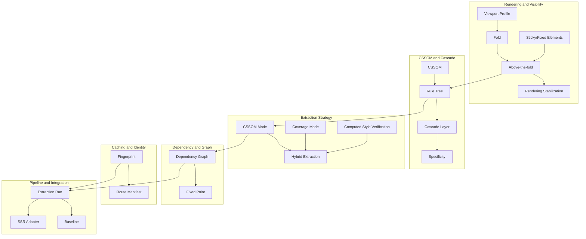

# Terminology

## Version

- **Document Version:** 1.0.0
- **Status:** Draft — Phase 1 (Repository Foundation)
- **Last Updated:** 2026-07-09
- **Applies To:** All documentation under `docs/`, all packages under `packages/` and `apps/`

## Purpose

Precise, shared vocabulary is the single highest-leverage investment a documentation set can make in a project this architecturally dense. This document defines the conceptual terms — as opposed to acronyms and proper nouns, which belong in [005-Glossary](./005-Glossary.md) — that recur throughout every design document, algorithm RFC, and API reference in this repository. Each entry states not just *what* the term means but *why this specific term* was chosen over plausible alternatives, and how it is disambiguated from adjacent, easily-confused concepts.

This document exists because critical CSS extraction sits at the intersection of several fields — CSS cascade semantics, browser rendering internals, graph algorithms, and CI/CD tooling — each with its own overloaded vocabulary. The word "critical" alone means something different to a performance engineer (render-blocking-avoidance) than to a systems engineer (mission-critical reliability). Without a canonical definition layer, every subsequent design document would either re-define terms locally (causing drift) or assume a shared understanding that does not actually exist across a multi-contributor, multi-phase documentation effort spanning seventeen planned phases.

## Audience

- All contributors authoring or reviewing documentation in this repository, especially those writing Phase 2 onward architecture and design documents that will use these terms without re-defining them.
- Engineers implementing modules who need the precise semantic boundary of a term (e.g., exactly what counts as "the fold") before writing a conformance test.
- New contributors onboarding to the project who need a single entry point to the project's conceptual vocabulary before reading module-level design documents.

## Prerequisites

- [001-Vision](./001-Vision.md) — the motivating vision that gives these terms their purpose.
- [002-Problem-Statement](./002-Problem-Statement.md) — the problems that make precise terminology necessary (ambiguity in "above-the-fold" is itself a documented failure mode of prior tools).
- General familiarity with CSS and browser rendering is assumed; this document defines project-specific and precise-technical usage, not introductory CSS concepts.

## Related Documents

- [001-Vision](./001-Vision.md)
- [002-Problem-Statement](./002-Problem-Statement.md)
- [003-Requirements](./003-Requirements.md)
- [005-Glossary](./005-Glossary.md) — acronym/proper-noun companion reference
- [006-Design-Principles](./006-Design-Principles.md)
- [007-Repository-Structure](./007-Repository-Structure.md)
- Forward references: `../design/200-Visibility-Engine-Overview.md`, `../design/300-CSSOM-Walker.md`, `../design/305-Cascade-Layers.md`, `../design/700-Coverage-Mode.md`, `../design/701-Hybrid-Mode.md`, `../design/800-Cache-Overview.md`, `../design/801-Fingerprinting.md`

## Overview

Terms in this document are organized into six conceptual clusters that mirror the engine's design domains: (1) rendering and visibility concepts, (2) CSSOM and cascade concepts, (3) extraction strategy concepts, (4) dependency and graph concepts, (5) caching and identity concepts, (6) pipeline and integration concepts. Within each cluster, terms are ordered so that foundational terms precede terms that build on them — for example, "fold" is defined before "viewport profile," because a viewport profile is partly defined in terms of a fold.

Every entry follows a fixed four-part structure: **Definition** (the precise, testable meaning), **Chosen Because** (why this term, specifically, was selected), **Distinguished From** (adjacent terms that are commonly conflated with this one), and **Used In** (a forward pointer to the design document(s) that treat this concept in depth).

## Detailed Design

### Cluster 1: Rendering and Visibility

#### Above-the-fold

**Definition:** The subset of a rendered page's content that is visible within the initial viewport without user interaction (scrolling, clicking, or other input), as determined by geometric intersection between an element's rendered bounding box and the fold boundary for a given viewport profile.

**Chosen Because:** "Above-the-fold" is the industry-standard term inherited from print newspaper layout (content visible without unfolding the paper), and is already universally understood by web performance engineers. Inventing a novel term would create unnecessary friction with the target audience of senior engineers who already use this phrase daily in performance discussions.

**Distinguished From:** "Visible" alone — an element can be geometrically above-the-fold yet not "visible" in the CSS sense (`visibility: hidden`, `display: none`, zero opacity depending on configuration). This project treats "above-the-fold" as a *geometric* predicate and "visible" as a *computed-style* predicate; an element must satisfy both to be included in critical CSS extraction. See [../design/200-Visibility-Engine-Overview.md](../design/200-Visibility-Engine-Overview.md).

**Used In:** `../design/200-Visibility-Engine-Overview.md`, `../design/201-Geometry-Engine.md`, `../design/202-Intersection-Engine.md`

#### Fold / Fold boundary

**Definition:** The horizontal (or, for non-standard writing modes, orientation-appropriate) line demarcating the above-the-fold region for a given viewport profile. In this project, the fold boundary is a configurable value — not strictly `window.innerHeight` — because a project may define its fold as "innerHeight minus a fixed sticky header height" or as an explicit pixel constant independent of any single viewport dimension.

**Chosen Because:** "Fold" (short for "the fold") is retained from print media terminology, matching "above-the-fold," rather than a more literal term like "cutoff line" or "critical boundary," because it composes naturally with "above-the-fold" and is the term practitioners already search for.

**Distinguished From:** "Viewport height." These are related but not identical: the viewport height is a raw device/browser dimension; the fold is a *derived, configurable* boundary that may be smaller than, equal to, or (rarely, in configurations designed to slightly over-fetch) larger than the raw viewport height. Conflating the two is a common source of bugs in naive critical-CSS tools that hardcode `innerHeight` as the fold. See REQ-101 in [003-Requirements](./003-Requirements.md).

**Used In:** `../design/200-Visibility-Engine-Overview.md`, `../design/105-Viewport-Manager.md`

#### Viewport profile

**Definition:** A named, versioned configuration bundle describing everything the Browser Manager and Navigation Engine need to render a page under one specific rendering condition: width, height, device pixel ratio, user agent string, and an associated fold boundary (and optionally emulated media features such as `prefers-color-scheme` or `prefers-reduced-motion`).

**Chosen Because:** "Profile" (as opposed to "preset," "config," or "target") was chosen to evoke the established meaning from device emulation tooling (e.g., Chrome DevTools' "device toolbar" device list uses "profile"-like presets), signaling to readers that this is a reusable, named unit rather than a one-off inline setting.

**Distinguished From:** "Device profile" — in this project's usage, a *device profile* is a real or synthetic hardware/software identity (e.g., "iPhone 14," "generic Android tablet") that a viewport profile can be *derived from*, but a viewport profile is the concrete rendering parameters actually passed to the browser. A device profile without an associated fold boundary is incomplete for extraction purposes; a viewport profile always has one. In practice, most viewport profiles in this project's default configuration are generated *from* a device profile plus a fold policy.

**Used In:** `../design/105-Viewport-Manager.md`, `../architecture/003-Requirements.md` (REQ-104–110)

#### Rendering stabilization

**Definition:** The process of waiting, after navigation, until the page's rendered output has reached a state suitable for reliable DOM/CSSOM snapshotting — accounting for asynchronous layout shifts caused by web fonts loading, lazy images resolving intrinsic size, client-side hydration, and animation-driven initial-paint transitions.

**Chosen Because:** "Stabilization" was chosen over "settling" or "readiness" because it specifically connotes an *active, monitored process with a defined termination condition* (e.g., N consecutive animation frames with no layout mutation), rather than a passive fixed-delay wait, which is the naive and unreliable approach this project explicitly rejects.

**Distinguished From:** "Page load" (the browser's `load`/`DOMContentLoaded` events) — rendering stabilization is a superset concern that continues *after* load events fire, because CSS animations, web font swaps (FOUT/FOIT), and JavaScript-driven hydration can all mutate layout well after `load`. A tool that snapshots at `load` without stabilization produces non-deterministic extraction results, violating REQ-500 in [003-Requirements](./003-Requirements.md).

**Used In:** `../design/104-Rendering-Stabilization.md`, `../design/103-Navigation-Engine.md`

#### Sticky element / Fixed element (visibility treatment)

**Definition:** DOM elements with computed `position: sticky` or `position: fixed`. For critical CSS purposes, these are treated as a special visibility category because their effective screen position is not fully determined by their document-order geometric bounding box alone — a `position: sticky` element may be off-screen in its "natural" document position yet become above-the-fold as the user scrolls, and a `position: fixed` header is always above-the-fold by construction regardless of scroll offset.

**Chosen Because:** These terms are taken directly from the CSS Positioned Layout specification's own terminology, ensuring zero translation overhead between this project's documentation and the underlying CSS specification any implementer will also need to read.

**Distinguished From:** "Above-the-fold" as a general geometric predicate — sticky/fixed elements are a *special case* requiring dedicated handling (REQ-109) precisely because the general geometric predicate is insufficient for them.

**Used In:** `../design/205-Sticky-Elements.md`, `../design/206-Fixed-Elements.md`

### Cluster 2: CSSOM and Cascade

#### CSSOM (CSS Object Model)

**Definition:** The live, browser-maintained tree of objects representing all stylesheets currently associated with a document — `document.styleSheets`, each `CSSStyleSheet`'s `cssRules`, and all descendant rule objects (`CSSStyleRule`, `CSSMediaRule`, `CSSKeyframesRule`, `CSSLayerBlockRule`, etc.) — as distinct from the *source text* of the CSS files that produced it.

**Chosen Because:** This is the exact term used by the W3C CSSOM specification; using any synonym would create a permanent translation burden between this project's documents and the specification every implementer must consult directly.

**Distinguished From:** "Static CSS" or "source CSS" — the entire premise of this project (see [002-Problem-Statement](./002-Problem-Statement.md)) is that the CSSOM, as computed by a real browser engine after full cascade and `@import` resolution, is authoritative in a way that a static text parse of source `.css` files can never be, because the CSSOM reflects browser-specific parsing quirks, vendor-prefixed rule handling, and runtime-mutated stylesheets (e.g., Constructable Stylesheets) that static analysis cannot see.

**Used In:** `../design/300-CSSOM-Walker.md`, `../spec/000-CSSOM.md`

#### Rule tree

**Definition:** The project's internal, in-memory representation of the subset of the CSSOM that has been walked and indexed by the CSSOM Walker module — a tree (technically a forest, rooted per stylesheet) of rule nodes annotated with source stylesheet identity, cascade layer membership, containing at-rule context (media/supports/container query chain), and a stable node identifier used for memoization keys.

**Chosen Because:** "Rule tree" distinguishes the project's *own* derived data structure from "CSSOM," which refers specifically to the browser-native object graph. Reusing "CSSOM" for both would make every design document ambiguous about whether it discusses browser state or engine-internal state.

**Distinguished From:** "CSSOM" (see above) — the rule tree is built *from* the CSSOM by the CSSOM Walker but is a project-owned, serializable, engine-side structure; it can outlive the browser page that produced it (e.g., persisted to cache) whereas the CSSOM cannot.

**Used In:** `../design/302-Rule-Tree.md`

#### Cascade layer

**Definition:** A named or anonymous ordering group introduced via the CSS `@layer` rule, which establishes a cascade-priority tier that takes precedence over specificity and source order for rules within different layers — rules in a later-declared layer win over rules in an earlier-declared layer regardless of selector specificity, except that unlayered author styles always win over any layered style.

**Chosen Because:** Direct adoption of the CSS Cascade Layers specification's own term; this project introduces no new vocabulary here because layer semantics are exactly and only what the specification defines — any paraphrase risks subtly misstating the actual cascade algorithm.

**Distinguished From:** "Specificity" — cascade layers and specificity are independent axes of the cascade algorithm; layer ordering is evaluated *before* specificity is consulted (per CSS Cascade 5), so a low-specificity selector in a later layer beats a high-specificity selector in an earlier layer. Confusing the two leads to incorrect Cascade Resolver implementations. See REQ-005 in [003-Requirements](./003-Requirements.md).

**Used In:** `../design/305-Cascade-Layers.md`, `../algorithms/506-Cascade-Layers.md`

#### Specificity

**Definition:** The CSS specification's algorithm for ranking selectors by a three-part tuple (ID count, class/attribute/pseudo-class count, type/pseudo-element count) used to resolve conflicts between rules of equal cascade origin and equal cascade layer.

**Chosen Because:** Standard CSS specification terminology; this project does not reimplement specificity computation manually (per ADR-0002, no custom selector parser) but must still *reason about* specificity results returned implicitly by browser cascade behavior when reconciling matched-rule ordering in the Serializer.

**Distinguished From:** "Source order" — source order is the tiebreaker used only when specificity (and layer, and origin) are all equal; it is a distinct, lower-priority axis of the cascade algorithm, not a synonym for specificity.

**Used In:** `../design/601-Rule-Ordering.md`, `../architecture/003-Requirements.md` (REQ-003)

### Cluster 3: Extraction Strategy

#### CSSOM extraction (mode)

**Definition:** An extraction strategy that determines rule applicability purely by walking the rule tree and testing each rule's selector against the collected above-fold DOM nodes via `element.matches()`, with no reliance on runtime coverage instrumentation.

**Chosen Because:** Named directly after the underlying mechanism (the CSSOM) to keep the three strategy names — CSSOM, Coverage, Hybrid — maximally distinguishable and self-describing without requiring a reader to consult a lookup table to know what each mode does.

**Distinguished From:** "Coverage mode" (below) — CSSOM mode is purely declarative/structural (does this selector match this node, statically evaluable at any point after DOM/CSSOM are available) whereas Coverage mode is runtime-observational (was this rule actually exercised during a real paint cycle).

**Used In:** `../design/300-CSSOM-Walker.md`

#### Coverage mode

**Definition:** An extraction strategy that uses the Chrome DevTools Protocol's CSS Coverage domain to record which CSS rules were actually applied (contributed to at least one rendered pixel or matched element) during a real page load and interaction sequence, as opposed to statically determining selector-match potential.

**Chosen Because:** Named after the underlying browser feature ("CSS Coverage") it wraps, consistent with the naming pattern for CSSOM mode above.

**Distinguished From:** "CSSOM mode" — Coverage mode can, in principle, diverge from CSSOM mode's results: a rule can match an element via `element.matches()` (CSSOM mode says "used") yet be overridden by a higher-priority rule and therefore contribute nothing visually (Coverage mode's underlying signal is about applied style contribution, filtered through this project's above-fold node set — see [../design/700-Coverage-Mode.md](../design/700-Coverage-Mode.md) for exactly how coverage data is scoped to above-fold nodes). This divergence is *why* Hybrid mode exists.

**Used In:** `../design/700-Coverage-Mode.md`

#### Hybrid extraction

**Definition:** An extraction strategy that runs CSSOM-mode selector matching, Coverage-mode runtime observation, and `getComputedStyle`-based verification together for the same extraction run, then reconciles disagreements between the three signals via a documented precedence policy, to produce a result more robust than any single signal alone.

**Chosen Because:** "Hybrid" is the term used directly in the brief (Section 2.7) and accurately conveys that this is a composition of existing strategies rather than a fourth independent mechanism.

**Distinguished From:** Simply "running all three modes and taking the union" — hybrid extraction is not a naive union; it has a defined reconciliation policy (see [../design/701-Hybrid-Mode.md](../design/701-Hybrid-Mode.md), pending) because a naive union would over-include rules that matched structurally but never actually rendered, defeating the purpose of critical CSS (minimality).

**Used In:** `../design/701-Hybrid-Mode.md`

#### Computed style verification

**Definition:** A confirmatory extraction step using `window.getComputedStyle(element)` to check that a property this project believes is contributed by a matched rule is actually reflected in the browser's final computed value for that element, catching cases where cascade interactions (overrides, `!important`, layer ordering) would make a structurally-matched rule's declarations irrelevant.

**Chosen Because:** Directly named after the DOM API it wraps (`getComputedStyle`), avoiding any invented abstraction name for what is fundamentally a direct API call with a well-known name.

**Distinguished From:** "Coverage" — computed style verification checks final *value* correctness per property, while Coverage checks whether a *rule* was exercised at all; they operate at different granularities (property-level vs. rule-level) and catch different classes of false positives.

**Used In:** `../design/702-Computed-Style-Mode.md`

### Cluster 4: Dependency and Graph Concepts

#### Dependency graph

**Definition:** A directed graph, constructed per extraction run, whose nodes are CSS constructs (matched rules, CSS custom properties, `@keyframes` blocks, `@font-face` blocks, `@property` registrations, `@counter-style` definitions, cascade layers, media/container/supports query contexts) and whose edges represent a "requires" relationship — e.g., a matched rule referencing `var(--brand-color)` has an edge to the custom-property node defining `--brand-color`.

**Chosen Because:** "Dependency graph" is the standard computer-science term for exactly this structure (analogous to build-system dependency graphs), immediately legible to the intended senior-engineer audience without a project-specific coinage.

**Distinguished From:** "Rule tree" (Cluster 2) — the rule tree is a structural representation of *where rules live* in the CSSOM's stylesheet hierarchy; the dependency graph is a semantic representation of *what each rule needs to render correctly*, spanning across rule-tree boundaries (a rule in one stylesheet can depend on a `@font-face` declared in a different stylesheet).

**Used In:** `../design/500-Dependency-Resolution-Overview.md`, `../algorithms/507-Dependency-Graph-Construction.md`

#### Fixed point (dependency resolution)

**Definition:** The termination condition for iterative dependency resolution: a graph state reached when resolving all currently-known dependencies introduces no new nodes or edges, i.e., another resolution pass would be a no-op.

**Chosen Because:** "Fixed point" is the standard term from iterative algorithm theory (as in fixed-point iteration, data-flow analysis) and precisely describes the termination semantics required by REQ-201 in [003-Requirements](./003-Requirements.md); no more descriptive alternative exists that is equally concise.

**Distinguished From:** "Complete" or "done" — a fixed point is a *provable* termination condition reached by comparing successive graph states, not merely a subjective sense that resolution is finished; this distinction matters for correctness testing (a resolver could stop too early without reaching an actual fixed point, silently under-resolving transitive dependencies).

**Used In:** `../algorithms/507-Dependency-Graph-Construction.md`, `../algorithms/508-Cycle-Detection.md`

### Cluster 5: Caching and Identity

#### Fingerprint

**Definition:** A deterministic hash (or composite hash tuple) computed over all inputs that could affect extraction output for a given route and viewport profile: normalized HTML content, the content (not just URL) of every referenced CSS asset, the full viewport profile configuration, and the selected extraction mode.

**Chosen Because:** "Fingerprint" is the standard term in build-caching and content-addressable-storage systems (e.g., npm's lockfile integrity hashes, Bazel's action fingerprints) for a value that uniquely identifies a specific input configuration for cache-lookup purposes; using this established term signals to engineers familiar with build caching exactly what invariants to expect.

**Distinguished From:** "Checksum" or "hash" alone — a fingerprint in this project's usage is specifically a *composite* identity spanning multiple heterogeneous inputs (HTML + CSS + viewport + mode), not a single file's hash; using "hash" alone would understate that compositional aspect and could mislead an implementer into fingerprinting only one input dimension.

**Used In:** `../design/801-Fingerprinting.md`, `../architecture/003-Requirements.md` (REQ-300)

#### Route manifest

**Definition:** A configuration artifact (see the brief's Section 2.9 example) mapping route path patterns — including exact paths and wildcard patterns — to output CSS bundle identifiers, used by the CLI and Configuration Loader to determine which routes to crawl and how to group their generated output.

**Chosen Because:** "Manifest" is the conventional term for a declarative mapping/inventory file in build tooling (webpack's asset manifest, PWA manifests); "route" specifies the domain. The combination is self-explanatory to any web engineer without further explanation.

**Distinguished From:** "Sitemap" — a sitemap (in the SEO/XML sitemap sense) is a discovery mechanism for search engines listing *all* known URLs; a route manifest is a build-time configuration input specifically for *this engine*, mapping routes to CSS bundle grouping, and has no relationship to XML sitemaps.

**Used In:** `../architecture/003-Requirements.md` (REQ-350–353), Section 2.9 of the brief

### Cluster 6: Pipeline and Integration

#### Extraction run

**Definition:** One complete execution of the extraction pipeline (navigate → stabilize → collect → match → resolve dependencies → serialize) for a single (route, viewport profile, extraction mode) triple, producing one critical CSS output artifact plus associated diagnostic reports.

**Chosen Because:** "Run" is the natural unit of work terminology already used across CI/CD tooling generally (a "test run," a "build run"); scoping it explicitly to a single route/viewport/mode triple disambiguates it from a full CI pipeline invocation, which typically comprises many extraction runs batched together.

**Distinguished From:** "Pipeline" — the CI/CD *pipeline* (Section 2.11 of the brief) is the outer orchestration process (build, crawl, generate, compare, publish, upload) that invokes potentially thousands of individual extraction runs; a pipeline failure can occur even if every individual extraction run succeeds (e.g., a baseline-comparison failure at the pipeline level).

**Used In:** `../architecture/011-Execution-Pipeline.md` (pending, Phase 2)

#### Baseline (CI comparison)

**Definition:** The previously-accepted (typically, most recent successfully-merged) critical CSS output for a given route and viewport, against which a new extraction run's output is diffed during the CI pipeline's "compare against baseline" stage, to detect unexpected growth or unexpected structural changes.

**Chosen Because:** "Baseline" is standard CI/CD and performance-testing vocabulary (baseline vs. candidate comparison) with zero ambiguity for the target audience.

**Distinguished From:** "Golden file" (a testing-strategy term, see [../testing/003-Golden-Files.md](../testing/003-Golden-Files.md), pending) — a golden file is a testing artifact intentionally committed and manually reviewed/approved as correct; a baseline is an operational CI artifact that updates automatically on every successful merge, without necessarily implying manual review of that specific output. A golden file could, however, also serve as a baseline in some pipeline configurations; the terms are related but serve different governance purposes.

**Used In:** `../architecture/003-Requirements.md` (REQ-450–453)

#### SSR integration (adapter)

**Definition:** A thin, framework-specific integration layer that calls the engine's core programmatic API at server-render time (or build time, for static-generation frameworks) to retrieve and inject critical CSS into the document `<head>` before the response is sent to the client, without requiring the integrating application to manually manage extraction invocation.

**Chosen Because:** "Adapter" follows the well-established software design pattern name (Adapter pattern) for a component that translates a generic interface into a framework-specific one, an intentional signal that these components are thin translation layers, not reimplementations of core extraction logic.

**Distinguished From:** "Plugin" — an SSR adapter operates *outside* the extraction pipeline, at the consumption boundary (deciding when/how to invoke the engine and how to inject its output), whereas a Plugin (Section 2.13 of the brief) hooks *into* the extraction pipeline's internal lifecycle (`beforeLaunch`, `afterCollection`, etc.) to modify extraction behavior itself. An SSR adapter may internally use plugins, but the two concepts operate at different architectural layers.

**Used In:** `../design/900-SSR-Overview.md`, `../architecture/003-Requirements.md` (REQ-400–404)

## Architecture

The following diagram shows the relationships between the terminology clusters defined above — which concepts are inputs to which, and which documents (existing or forward-referenced) own the authoritative deep-dive for each.



## Algorithms

Terminology definitions are not themselves algorithmic, but two supporting processes are needed to keep this document authoritative over time:

### Term Consistency Check

**Problem statement:** As Phases 2–17 introduce new design documents, authors may introduce new terminology that overlaps with or contradicts an existing term defined here (e.g., calling the rule tree a "style graph" in a later document).

**Inputs:** This document's term list; the text of a new or revised design document.

**Outputs:** A list of candidate synonym collisions requiring reviewer judgment.

**Pseudocode:**
```
function checkTermConsistency(termList, newDocText):
    flagged = []
    for term in termList:
        aliases = findLikelySynonyms(term, newDocText)
        for alias in aliases:
            if alias not in term.knownAliases:
                flagged.append((term.name, alias, locationIn(newDocText, alias)))
    return flagged
```

**Time complexity:** O(T × W) where T is the number of defined terms and W is the word count of the new document; in practice performed by human review, not automated execution, in Phase 1.

**Memory complexity:** O(T) to hold the term list during review.

**Failure cases:** Synonym detection is inherently fuzzy; this is a manual editorial checklist item, not a deterministic algorithm, until glossary tooling matures (see Future Work).

**Optimization opportunities:** A future documentation lint tool could flag exact-string collisions automatically (e.g., grep for defined term names appearing without a link to this document), even without solving the harder fuzzy-synonym problem.

### Term Resolution Precedence

**Problem statement:** When a word used in a document could plausibly refer to either a Terminology entry (conceptual) or a Glossary entry (acronym/proper noun) — for example, "Coverage" could mean the conceptual "Coverage mode" extraction strategy defined here, or the proper noun "Coverage API" (the Chrome DevTools Protocol feature) defined in the Glossary — readers need a deterministic resolution rule.

**Inputs:** An ambiguous term occurrence; both this document and [005-Glossary](./005-Glossary.md).

**Outputs:** The correct referent.

**Pseudocode:**
```
function resolveTerm(word, context):
    if context.isProperNounUsage(word):       // e.g., capitalized API name, code identifier
        return Glossary.lookup(word)
    else:
        return Terminology.lookup(word)        // conceptual usage
```

**Time complexity:** O(1) lookup in either document given the word, dominated by human reading comprehension, not computation.

**Memory complexity:** N/A (not a runtime algorithm).

**Failure cases:** Genuinely ambiguous phrasing in a document is a documentation defect, not a resolvable case; such occurrences should be fixed at the source by adding a disambiguating link, not left to reader inference.

**Optimization opportunities:** Every occurrence of a dual-meaning word like "Coverage" should, per this project's editorial convention, be written with an explicit qualifier ("Coverage mode" vs. "the Coverage API") specifically to avoid needing this resolution algorithm in the first place; this algorithm exists as a fallback for cases that slip through editorial review.

## Implementation Notes

- Every subsequent design document (Phase 2 onward) should link a term's *first occurrence per document* to its entry in this file, using the relative-path convention `[term](../architecture/004-Terminology.md#anchor)`, where the anchor matches the markdown-generated heading slug (e.g., `#above-the-fold`).
- Terms that are also code identifiers (e.g., a `Fingerprint` class, a `RuleTree` type) should keep this document's prose definition as the normative source of truth; code comments and API documentation should reference this document rather than restating the definition, to avoid definition drift between prose and code documentation.
- This document deliberately does not define terms that are purely implementation-internal with no cross-module significance (e.g., a private helper function's name); such terms belong in module-level design documents' own local vocabulary sections, not here. The bar for inclusion here is: "does more than one module or more than one document need to agree on this term's meaning?"

## Edge Cases

- **A term's meaning shifts subtly between extraction strategies.** For example, "matched" means "selector-matches via `element.matches()`" in CSSOM mode but could colloquially be conflated with "recorded as covered" in Coverage mode. This document's Cluster 3 entries exist specifically to prevent that conflation; any design document using "matched" without qualification when discussing Coverage or Hybrid mode should be treated as a documentation defect.
- **Browser-vendor-specific terminology diverges from specification terminology.** For instance, Chromium DevTools Protocol documentation sometimes uses slightly different phrasing than the W3C Coverage-adjacent specifications. Where such divergence exists, this document defers to the specification's terminology as normative and notes vendor-specific phrasing only where practically necessary (e.g., in [005-Glossary](./005-Glossary.md)'s "Coverage API" entry).
- **A term used identically in this project and in general web development, but with a narrower scope here.** "Fold," for example, is used loosely and inconsistently across the industry (some tools treat it as synonymous with raw viewport height). This document's Cluster 1 "Fold" entry explicitly narrows the term to this project's configurable-boundary semantics; readers coming from other tools must not assume industry-general usage applies here.
- **Future CSS specification terms not yet stable.** Terms like "scroll timelines" and "view transitions" (named in Section 2.5 of the brief as dependency-graph inputs) are drawn from CSS specifications that were still evolving at authoring time; this document intentionally does not give them dedicated entries yet, deferring to the relevant spec documents in `docs/spec/` (Phase 17) once those specifications and this project's handling of them stabilize.

## Tradeoffs

- **Reusing specification terminology verbatim versus inventing project-specific names.** Wherever a W3C or WHATWG specification already has an authoritative term (CSSOM, cascade layer, specificity), this project reuses it verbatim rather than inventing a friendlier alias, at the cost of some terms being less immediately intuitive to newcomers unfamiliar with CSS specification language. We accept this cost because the audience is senior engineers who will need to read the underlying specifications directly regardless, and term-reuse minimizes translation overhead between this project's docs and those specifications.
- **Coining new terms only where the project introduces genuinely new concepts.** "Hybrid extraction," "rule tree," and "fingerprint" (in this project's composite sense) are project-specific coinages because no existing specification term precisely captures them. The tradeoff is that these terms are not searchable in outside documentation — a reader cannot "look them up" elsewhere — but this is unavoidable for genuinely novel architectural concepts, and this document is deliberately positioned as their canonical source.
- **Splitting Terminology (conceptual) from Glossary (acronyms/proper nouns) into two files rather than one.** This creates a minor lookup-ambiguity risk (Section "Algorithms" above addresses this) but was chosen because the two document types serve different reading patterns: Terminology is read start-to-end by newcomers building a mental model, while the Glossary is read via point lookups ("what does LCP stand for") by any reader mid-document. Combining them into a single, longer file would degrade both use cases.
- **Cluster ordering versus strict alphabetical ordering.** This document orders terms by conceptual cluster and dependency (foundational terms first) rather than alphabetically, unlike the Glossary, which is alphabetical by design (Section 4 convention for reference documents). The tradeoff is that a reader looking for one specific term must use in-document search rather than visual scanning; we accept this because Terminology's primary use case is sequential comprehension, while the Glossary's primary use case is point lookup — matching structure to purpose.

## Performance

Terminology has no runtime performance profile of its own, but imprecise terminology has a measurable *engineering* performance cost that motivates this document's existence:

- **Review latency:** Ambiguous terms in design documents historically (in comparable large documentation efforts) increase PR review round-trips because reviewers must ask clarifying questions before they can assess correctness. A shared terminology reference is a fixed upfront cost that amortizes across every subsequent document review in Phases 2–17.
- **Onboarding cost:** New contributor ramp-up time is dominated by vocabulary acquisition in dense technical domains; this document is designed to be read once, in full, by a new contributor before they read any module design document, reducing per-document onboarding friction to near zero for vocabulary (though not for architectural understanding, which still requires reading the architecture documents themselves).
- **Caching strategy:** N/A — this is a static reference document; there is no runtime caching concern. Editorial "caching" (keeping this document as the single edit point for definitions, rather than duplicating definitions across documents) is the relevant analog and is enforced by the Implementation Notes convention above.
- **Scalability limits:** As the term count grows across seventeen planned phases, this single-file structure may become unwieldy; see Future Work for a proposed mitigation (splitting by cluster into multiple files) if the term count exceeds roughly 80–100 entries.

## Testing

Terminology correctness is verified editorially, not by automated test execution, but the following checks apply:

- **Consistency tests (manual, per-PR):** Every new design document PR should be reviewed against this document's term list using the Term Consistency Check pseudocode in the Algorithms section, to catch synonym drift before merge.
- **Link integrity tests (automatable):** A markdown-link-checker CI step should verify that every relative link to `004-Terminology.md#anchor` resolves to an actual heading anchor in this file, catching stale links after any heading rename.
- **Cross-reference completeness (manual, periodic):** Periodically (e.g., at the close of each documentation phase), audit whether every term with a "Used In" forward reference has, by that point, had its target document actually written, and update the reference to a real link once available.
- **Regression tests:** If a term's definition is revised (not just extended) after other documents already cite it, those citing documents must be reviewed for continued accuracy — a definition change is a breaking change to this document's implicit contract with dependents.

## Future Work

- **Split by cluster if term count grows unwieldy.** If future phases push this document past a comfortable single-file size, consider splitting into `004a-Terminology-Rendering.md`, `004b-Terminology-CSSOM.md`, etc., while keeping `004-Terminology.md` as an index — mirroring the "Part-N" convention in Section 4.11 of the brief, though using a semantic split rather than an arbitrary length-based split.
- **Automated term-link linting.** Build a documentation lint tool (likely a small Node.js script run in CI) that scans all markdown under `docs/` for occurrences of defined term names lacking a link to this document on first occurrence per file.
- **Terminology stability guarantee.** Once the engine reaches a public 1.0 API, consider a formal policy (analogous to API semantic versioning) for how terminology changes are communicated, since renamed concepts in documentation can be as disruptive to a mature contributor base as renamed API symbols.
- **Open question: scroll timelines and view transitions terminology.** These CSS features were still specification-track at authoring time; once `docs/spec/` (Phase 17) formalizes this project's handling of them, backfill dedicated Cluster 4 entries here.
- **Open question: should "extraction run" also model partial/resumable runs** for very large route manifests where a run might be checkpointed and resumed? If REQ-513 (streaming output) and incremental cache resumability become tightly coupled in later design, this term's definition may need to be extended to cover partial-run semantics.

## References

- Project Brief, Section 2 (Engine Design Reference) in full — `BRIEF.md` at repository root.
- [001-Vision](./001-Vision.md)
- [002-Problem-Statement](./002-Problem-Statement.md)
- [003-Requirements](./003-Requirements.md)
- [005-Glossary](./005-Glossary.md)
- W3C CSS Object Model (CSSOM) specification: https://www.w3.org/TR/cssom-1/
- W3C CSS Cascading and Inheritance Level 5: https://www.w3.org/TR/css-cascade-5/
- W3C CSS Positioned Layout Level 3 (sticky/fixed positioning): https://www.w3.org/TR/css-position-3/
- Chrome DevTools Protocol, CSS Coverage domain: https://chromedevtools.github.io/devtools-protocol/tot/CSS/
