# Glossary

## Version

- **Document Version:** 1.0.0
- **Status:** Draft — Phase 1 (Repository Foundation)
- **Last Updated:** 2026-07-09
- **Applies To:** All documentation under `docs/`

## Purpose

This document is the alphabetized reference glossary for the Critical CSS Extraction Engine documentation set. Where [004-Terminology](./004-Terminology.md) is a conceptual, dependency-ordered treatment of project-specific vocabulary with "why this term" reasoning, this document is a broader, flatter, exhaustive index of every acronym, proper noun, browser API, CSS at-rule, and third-party tool name that appears anywhere in the project brief or in this documentation set. Its purpose is point lookup: a reader mid-sentence in a Phase 6 design document who encounters "CLS" or "`@container`" without full context should be able to jump here, get a precise one-to-three-sentence answer, and return to what they were reading.

Every entry links, where applicable, to the detailed design or specification document that treats the concept in depth. Many of those target documents do not yet exist at the time of this Phase 1 writing — they are scheduled in Phases 2 through 17 per the brief's Section 5 (Documentation Generation Phases). Forward links are included anyway, using the exact file-naming convention defined in Section 4.11 of the brief, so that this glossary does not need to be revisited and re-linked after every future phase; it is written once, correctly anticipating the target paths.

## Audience

- Any reader of any document in this repository who needs a fast, precise definition of an acronym or proper noun without leaving their current reading context.
- Implementers cross-referencing browser API names against their authoritative specification.
- New contributors performing a first pass over the vocabulary landscape of browser rendering, CSS specifications, and CI/CD tooling this project depends on.

## Prerequisites

- None strictly required to use this document as a point-lookup reference. Readers building a sequential mental model of the project's own conceptual vocabulary should read [004-Terminology](./004-Terminology.md) first; this document assumes no particular reading order and can be consulted out of sequence.

## Related Documents

- [001-Vision](./001-Vision.md)
- [002-Problem-Statement](./002-Problem-Statement.md)
- [003-Requirements](./003-Requirements.md)
- [004-Terminology](./004-Terminology.md) — conceptual companion to this exhaustive reference
- [006-Design-Principles](./006-Design-Principles.md)
- [007-Repository-Structure](./007-Repository-Structure.md)
- Forward references (pending, later phases): `../design/100-Browser-Abstraction.md`, `../design/101-Playwright-Adapter.md`, `../design/200-Visibility-Engine-Overview.md`, `../design/300-CSSOM-Walker.md`, `../design/303-Media-Rules.md`, `../design/304-Supports-Rules.md`, `../design/305-Cascade-Layers.md`, `../design/307-Constructable-Stylesheets.md`, `../design/400-Selector-Matching.md`, `../design/404-Is-Where-Has.md`, `../design/405-Container-Queries.md`, `../design/700-Coverage-Mode.md`, `../design/701-Hybrid-Mode.md`, `../algorithms/501-CSS-Variables.md`, `../algorithms/502-Keyframes.md`, `../algorithms/503-Font-Faces.md`, `../algorithms/504-At-Property.md`, `../algorithms/505-Counters.md`, `../spec/000-CSSOM.md` through `../spec/008-Constructable-Stylesheets.md`

## Overview

Entries below are alphabetized strictly by their entry heading (ignoring leading `@` and punctuation for sort order, but the `@`-prefixed form is retained in the heading itself since that is how CSS at-rules are conventionally written). Each entry is deliberately short — one to three sentences — because exhaustiveness and brevity-per-entry are the design goals here, in contrast to Terminology's depth-per-entry approach. Where a term also has a deep conceptual entry in [004-Terminology](./004-Terminology.md), this glossary entry cross-links to it rather than duplicating the "why this term" reasoning.

## Detailed Design

### @counter-style

A CSS at-rule (CSS Counter Styles Level 3) that defines a custom counter numbering system (e.g., custom bullet/numbering schemes for lists). The Dependency Resolver must track `@counter-style` definitions referenced by matched elements' `list-style-type` or explicit `counter()`/`counters()` functions. See [../algorithms/505-Counters.md](../algorithms/505-Counters.md).

### @font-face

A CSS at-rule declaring a downloadable font resource and the conditions (weight, style, unicode-range) under which it applies. Critical to dependency resolution because omitting a required `@font-face` rule from critical CSS causes FOUT/FOIT or invisible text on initial paint. See [../algorithms/503-Font-Faces.md](../algorithms/503-Font-Faces.md).

### @import

A CSS at-rule that inlines the rules of another stylesheet at the point of the `@import` statement, potentially recursively and potentially cross-origin. The CSSOM Walker must traverse `@import` chains as part of building the rule tree. See [../design/306-At-Import.md](../design/306-At-Import.md).

### @keyframes

A CSS at-rule defining named animation keyframe sequences, referenced by the `animation-name` property. The Dependency Resolver must include `@keyframes` rules referenced by matched elements even if the element is not mid-animation at snapshot time. See [../algorithms/502-Keyframes.md](../algorithms/502-Keyframes.md); conceptually related to [004-Terminology](./004-Terminology.md#dependency-graph).

### @layer

The CSS Cascade Layers at-rule, used to declare and order named cascade layers. See [004-Terminology](./004-Terminology.md#cascade-layer) for the conceptual definition and [../design/305-Cascade-Layers.md](../design/305-Cascade-Layers.md) for implementation treatment.

### @property

A CSS at-rule (CSS Properties and Values API) that registers a custom property with a defined syntax, initial value, and inheritance behavior, enabling type-checked custom properties and animatable custom properties. See [../algorithms/504-At-Property.md](../algorithms/504-At-Property.md).

### @supports

A CSS conditional-group at-rule that gates a block of rules on feature-support detection (e.g., `@supports (display: grid)`). The Dependency Resolver must evaluate `@supports` conditions in the actual target browser context, never via static heuristic, per this project's browser-is-source-of-truth principle (see ADR-0001, `../adr/ADR-0001-Browser-Is-Source-of-Truth.md`). See [../design/304-Supports-Rules.md](../design/304-Supports-Rules.md).

### Above-the-fold

See the full conceptual definition in [004-Terminology](./004-Terminology.md#above-the-fold-fold). This glossary entry exists only as a pointer since the term is conceptual, not an acronym or proper noun.

### Astro

An open-source web framework emphasizing server-first rendering with an "islands architecture" for partial client-side hydration. One of six planned SSR integration targets (Section 2.10 of the brief). See [../design/904-Astro.md](../design/904-Astro.md).

### Beanstalkd

A simple, fast work-queue service. Named in the brief's Section 2.11-adjacent job-queue context as one of the supported queue backends for distributing extraction work across CI workers, alongside Kafka. Not a CSS/browser concept; purely an infrastructure dependency for job distribution.

### CDP (Chrome DevTools Protocol)

The protocol used to instrument and control Chromium-based browsers programmatically — the protocol underlying both Playwright's browser automation and the CSS Coverage domain this project depends on for Coverage-mode extraction. See [../design/700-Coverage-Mode.md](../design/700-Coverage-Mode.md).

### CI/CD

Continuous Integration / Continuous Delivery — the automated build-test-deploy pipeline model this engine integrates into per Section 2.11 of the brief (build, crawl routes, generate critical CSS, compare against baseline, publish artifacts, upload reports). See [003-Requirements](./003-Requirements.md) REQ-450–472 and future `../architecture/011-Execution-Pipeline.md`.

### CLS (Cumulative Layout Shift)

A Core Web Vitals metric measuring unexpected visual layout movement during page load. Relevant to this project because incorrect critical CSS (missing dimension-affecting rules) can itself *cause* CLS regressions — a failure mode this engine must avoid, tying to REQ-501 (rendering parity) in [003-Requirements](./003-Requirements.md).

### Container queries

A CSS feature (`@container`) allowing style rules to respond to the size of a containing element rather than the viewport. Adds a dimension to selector matching and dependency resolution beyond simple viewport-based media queries. See [../design/405-Container-Queries.md](../design/405-Container-Queries.md).

### Constructable Stylesheets

A browser API (`new CSSStyleSheet()`, `document.adoptedStyleSheets`, `shadowRoot.adoptedStyleSheets`) allowing JavaScript to create and share stylesheet objects programmatically, commonly used by CSS-in-JS libraries and Shadow DOM components. The CSSOM Walker must traverse adopted stylesheets as first-class CSSOM sources. See [../design/307-Constructable-Stylesheets.md](../design/307-Constructable-Stylesheets.md) and [../spec/008-Constructable-Stylesheets.md](../spec/008-Constructable-Stylesheets.md).

### Coverage API

Shorthand for the Chrome DevTools Protocol's CSS Coverage domain (`CSS.startRuleUsageTracking` / `CSS.takeCoverageDelta` in older CDP versions, superseded by `CSS.startRuleUsageTracking` in current CDP), which reports which CSS rules were used during a browser session. Distinguish from the conceptual "Coverage mode" extraction strategy defined in [004-Terminology](./004-Terminology.md#coverage-mode), which is this project's *use* of the Coverage API. See [../spec/005-Coverage-API.md](../spec/005-Coverage-API.md).

### CSSOM (CSS Object Model)

See the full conceptual definition in [004-Terminology](./004-Terminology.md#cssom-css-object-model). Specification reference: [../spec/000-CSSOM.md](../spec/000-CSSOM.md).

### Determinism

Not an acronym, included here as a cross-reference convenience: the property that identical inputs always produce identical outputs. See REQ-500 in [003-Requirements](./003-Requirements.md) and the "Rendering stabilization" and "Fixed point" entries in [004-Terminology](./004-Terminology.md).

### DOM (Document Object Model)

The browser's live tree representation of a document's structure and content, distinct from the CSSOM (style representation) though the two are cross-referenced constantly during selector matching (`element.matches()` operates on DOM nodes against CSSOM-derived selectors). See [../design/106-DOM-Snapshot.md](../design/106-DOM-Snapshot.md).

### Emotion

A CSS-in-JS library that generates styles at runtime, often via Constructable Stylesheets or injected `<style>` tags with dynamically generated class names. Named in Section 2.15 of the brief as a required test fixture category. See [../testing/001-Fixtures.md](../testing/001-Fixtures.md).

### Express

A minimal Node.js web application framework. One of six planned SSR integration targets. See [../design/902-Express.md](../design/902-Express.md).

### Fastify

A performance-focused Node.js web framework. One of six planned SSR integration targets. See [../design/906-Fastify.md](../design/906-Fastify.md).

### Fingerprint

See the full conceptual definition in [004-Terminology](./004-Terminology.md#fingerprint). Design treatment: [../design/801-Fingerprinting.md](../design/801-Fingerprinting.md).

### Fixed element

See [004-Terminology](./004-Terminology.md#sticky-element--fixed-element-visibility-treatment). Design treatment: [../design/206-Fixed-Elements.md](../design/206-Fixed-Elements.md).

### FOIT (Flash of Invisible Text)

A web font loading behavior where text using a not-yet-loaded custom web font is rendered invisible until the font loads (as opposed to FOUT). Relevant to `@font-face` dependency resolution correctness — omitting critical `@font-face` rules can turn a FOUT scenario in the full page into a worse FOIT-like blank-text scenario in the critical-CSS-only render. See [../algorithms/503-Font-Faces.md](../algorithms/503-Font-Faces.md).

### Fold

See [004-Terminology](./004-Terminology.md#fold--fold-boundary).

### FOUC (Flash of Unstyled Content)

A rendering artifact where a page briefly displays unstyled (or default-styled) HTML before its CSS finishes loading and applying. Critical CSS extraction exists precisely to eliminate FOUC on above-fold content by inlining the CSS needed for first paint. Central motivating problem — see [002-Problem-Statement](./002-Problem-Statement.md).

### FOUT (Flash of Unstyled Text)

A web font loading behavior where text renders immediately in a fallback font, then swaps to the custom web font once loaded, producing a visible "flash" of font-swap. Contrast with FOIT above.

### Gearman

A legacy job-queue/distributed-task system. Named in the brief as a legacy-supported queue backend alongside Beanstalkd and Kafka; treated as a lower-priority/legacy integration path.

### getComputedStyle

The DOM API (`window.getComputedStyle(element)`) returning the fully resolved, cascade-and-inheritance-applied style values for an element, used in this project's Hybrid extraction mode for property-level verification. See [004-Terminology](./004-Terminology.md#computed-style-verification) and [../design/702-Computed-Style-Mode.md](../design/702-Computed-Style-Mode.md).

### Hybrid extraction

See [004-Terminology](./004-Terminology.md#hybrid-extraction). Design treatment: [../design/701-Hybrid-Mode.md](../design/701-Hybrid-Mode.md).

### `:is()`, `:where()`, `:has()`

CSS selector-list pseudo-classes: `:is()` and `:where()` match any selector in a list (differing only in the specificity they contribute — `:where()` contributes zero), and `:has()` (the "relational pseudo-class") matches an element if any selector in its argument matches at least one descendant/relative. This project delegates evaluation of all three entirely to the browser's native `element.matches()`, per ADR-0002 (no custom selector parser). See [../design/404-Is-Where-Has.md](../design/404-Is-Where-Has.md).

### Kafka

A distributed event-streaming platform. Named in the brief as a stub integration for the message-queue layer, used for distributing crawl/extraction jobs and/or publishing pipeline events in enterprise CI deployments at scale.

### LCP (Largest Contentful Paint)

A Core Web Vitals metric measuring the render time of the largest visible content element within the viewport. One of the primary real-world performance metrics that correct, minimal critical CSS is intended to improve, by ensuring the LCP element's styling is available without waiting for full stylesheet download. See [001-Vision](./001-Vision.md) for the motivating performance narrative.

### Memoization (selector matching)

A caching technique storing the result of a selector-match computation keyed by (selector, element) or by a structural equivalence class, to avoid recomputing identical matches within a single extraction run. See [../design/401-Selector-Memoization.md](../design/401-Selector-Memoization.md) and REQ-510 in [003-Requirements](./003-Requirements.md).

### Next.js

A React-based web framework supporting SSR, static generation, and hybrid rendering modes. One of six planned SSR integration targets, explicitly named alongside React SSR itself in Section 2.10 of the brief. See [../design/903-NextJS.md](../design/903-NextJS.md).

### Penthouse

A third-party critical CSS generation tool. Explicitly named in Section 2.2 of the brief as a tool this project does **not** use, wrap, or derive logic from — this project's CSSOM-driven, browser-authoritative approach is a deliberate architectural departure from Penthouse's static-analysis-plus-headless-render model. See [002-Problem-Statement](./002-Problem-Statement.md).

### Playwright

A browser automation library (Microsoft) supporting Chromium, Firefox, and WebKit through a unified API, selected as this project's Browser Manager abstraction target. See ADR-0003 (`../adr/ADR-0003-Playwright-As-Browser-Abstraction.md`) and [../design/101-Playwright-Adapter.md](../design/101-Playwright-Adapter.md).

### Plugin lifecycle hooks

The six named extension points — `beforeLaunch`, `afterNavigation`, `beforeCollection`, `afterCollection`, `beforeSerialize`, `afterSerialize` — exposed by the Plugin System module for extending or customizing extraction behavior without modifying core module source. See [../plugins/001-Lifecycle-Hooks.md](../plugins/001-Lifecycle-Hooks.md) and ADR-0004 (`../adr/ADR-0004-Plugin-Lifecycle-Model.md`).

### Predis

A PHP Redis client library — **not** part of this project's own technology stack; noted here only because it appears in the broader Shiksha codebase context this documentation effort is adjacent to. Not referenced elsewhere in this project's design documents; included for disambiguation completeness only. (Cross-reference caution: do not confuse with this project's own Cache Manager backend choices, which are language/runtime-appropriate for the engine's actual implementation stack, to be determined in `../design/802-Cache-Store.md`.)

### React SSR

Server-side rendering of React applications via `ReactDOMServer.renderToString`, `renderToPipeableStream`, or related APIs. The first of six planned SSR integration targets. See [../design/901-React-SSR.md](../design/901-React-SSR.md).

### Remix

A full-stack React framework with a strong server-rendering and nested-routing model. One of six planned SSR integration targets. See [../design/905-Remix.md](../design/905-Remix.md).

### Rendering stabilization

See [004-Terminology](./004-Terminology.md#rendering-stabilization). Design treatment: [../design/104-Rendering-Stabilization.md](../design/104-Rendering-Stabilization.md).

### Route manifest

See [004-Terminology](./004-Terminology.md#route-manifest). Referenced in Section 2.9 of the brief.

### Rule tree

See [004-Terminology](./004-Terminology.md#rule-tree). Design treatment: [../design/302-Rule-Tree.md](../design/302-Rule-Tree.md).

### Scroll timelines

A CSS/Web Animations feature (`scroll-timeline`, `view-timeline`) allowing animations to be driven by scroll position rather than wall-clock time. Named in Section 2.5 of the brief as a dependency-graph tracking target; treated as an emerging-specification concern pending formalization in `docs/spec/` (Phase 17).

### Shadow DOM

A DOM encapsulation feature allowing a subtree (a "shadow tree") to be attached to an element with separate styling and markup scope from the main document, in "open" or "closed" mode. Both the DOM Collector and CSSOM Walker must handle Shadow DOM traversal, with closed-mode trees posing a known accessibility challenge (see Edge Cases in [004-Terminology](./004-Terminology.md)). See [../spec/004-Shadow-DOM.md](../spec/004-Shadow-DOM.md).

### Solr / Elasticsearch

Search-indexing platforms — **not** part of this project's own technology stack; noted here only for disambiguation, as these terms appear in the broader Shiksha codebase this documentation session's environment is adjacent to. This project's own Reporter module output is not indexed by either; any future search-indexing of diagnostic reports would be a distinct, unplanned integration.

### Specificity

See [004-Terminology](./004-Terminology.md#specificity).

### Sticky element

See [004-Terminology](./004-Terminology.md#sticky-element--fixed-element-visibility-treatment). Design treatment: [../design/205-Sticky-Elements.md](../design/205-Sticky-Elements.md).

### Styled Components

A CSS-in-JS library that generates class names and injects styles at runtime, typically via classic `<style>` tag injection rather than Constructable Stylesheets. Named in Section 2.15 of the brief as a required test fixture category. See [../testing/001-Fixtures.md](../testing/001-Fixtures.md).

### Tailwind (Tailwind CSS)

A utility-class-first CSS framework producing very large numbers of small, highly reused selectors. Named in Section 2.15 of the brief as a required test fixture category specifically because its scale and selector density stress-test the Selector Matcher's memoization strategy (REQ-510). See [../testing/001-Fixtures.md](../testing/001-Fixtures.md).

### View transitions

A browser API (`document.startViewTransition()` and the `::view-transition-*` pseudo-elements) enabling animated transitions between DOM states, including cross-document transitions. Named in Section 2.5 of the brief as a dependency-graph tracking target; treated as an emerging-specification concern pending formalization in `docs/spec/`.

### Viewport profile

See [004-Terminology](./004-Terminology.md#viewport-profile). Design treatment: [../design/105-Viewport-Manager.md](../design/105-Viewport-Manager.md).

## Architecture

Because a glossary is fundamentally a flat, alphabetized reference rather than a structured system, the "architecture" most relevant here is the *cross-reference graph* connecting glossary entries to their deep-dive documents. The diagram below shows this document's role as a hub connecting brief-derived terminology to the (mostly forward-referenced, pending) design and specification documents that will treat each concept in depth.

```mermaid
graph TD
    G[005-Glossary.md]

    G -->|CSSOM, Rule Tree| D1["../design/300-CSSOM-Walker.md"]
    G -->|Cascade Layers| D2["../design/305-Cascade-Layers.md"]
    G -->|Constructable Stylesheets| D3["../design/307-Constructable-Stylesheets.md"]
    G -->|is/where/has| D4["../design/400-Selector-Matching.md"]
    G -->|Container Queries| D5["../design/405-Container-Queries.md"]
    G -->|Coverage API, Coverage Mode| D6["../design/700-Coverage-Mode.md"]
    G -->|Hybrid Extraction| D7["../design/701-Hybrid-Mode.md"]
    G -->|Fingerprint| D8["../design/801-Fingerprinting.md"]
    G -->|font-face, keyframes, property, counters| D9["../algorithms/50x-*.md"]
    G -->|CSSOM spec, Shadow DOM spec, Coverage API spec| D10["../spec/000-008-*.md"]
    G -->|SSR framework adapters| D11["../design/90x-*.md"]
    G -.conceptual depth.-> T["../architecture/004-Terminology.md"]
```



## Algorithms

A glossary has no runtime algorithm, but maintaining one across seventeen documentation phases requires two lightweight editorial processes:

### Alphabetization and Insertion

**Problem statement:** As new acronyms/proper nouns are introduced in later-phase documents, they must be inserted into this glossary in correct alphabetical position without disturbing existing entries' anchors (which other documents may already link to).

**Inputs:** Existing glossary (ordered list of entries with anchors); a new term to insert.

**Outputs:** Updated glossary with the new entry in correct position; no existing anchors change.

**Pseudocode:**
```
function insertGlossaryEntry(glossary, newTerm):
    key = normalizeForSort(newTerm.heading)   // strip leading @ and punctuation
    index = binarySearchInsertionPoint(glossary, key)
    glossary.insertAt(index, newTerm)
    // Existing entries' anchors are heading-derived and unaffected by insertion position
    return glossary
```

**Time complexity:** O(log N) to find insertion point via binary search over N existing entries, O(N) to physically insert in a markdown file (array insertion), performed manually by an editor, not programmatically, in current practice.

**Memory complexity:** O(N) to hold the full entry list during an edit pass.

**Failure cases:** Two terms that normalize to the same sort key (e.g., case-insensitive collision) require manual disambiguation in heading text (e.g., "CSS (general)" vs. "CSS-in-JS") rather than silent overwrite.

**Optimization opportunities:** A future documentation build script could auto-sort a YAML-sourced glossary and generate this markdown file, eliminating manual alphabetization entirely (see Future Work).

### Duplicate/Overlap Detection Against Terminology

**Problem statement:** Because [004-Terminology](./004-Terminology.md) and this Glossary intentionally have overlapping subject matter (e.g., both mention "Fold," "CSSOM," "Fingerprint"), there is a risk of the two documents' definitions silently diverging over time as one is edited without the other.

**Inputs:** Both documents' entry lists and definitions.

**Outputs:** A list of shared terms whose definitions differ in substance (not just phrasing) between the two documents.

**Pseudocode:**
```
function detectDefinitionDrift(terminology, glossary):
    drifted = []
    sharedTerms = terminology.termNames() ∩ glossary.termNames()
    for term in sharedTerms:
        if glossary.isPointerOnly(term):
            continue   // glossary entry is a deliberate cross-reference, not a redefinition
        if semanticDiff(terminology.define(term), glossary.define(term)) > threshold:
            drifted.append(term)
    return drifted
```

**Time complexity:** O(min(T, Gl)) where T and Gl are the term counts of each document, for the intersection step; the semantic diff itself is manual review, not computed.

**Memory complexity:** O(T + Gl) to hold both term sets.

**Failure cases:** This project's convention (see Implementation Notes below) is that shared terms should be pointer-only in the Glossary, deferring to Terminology as the sole normative source — when this convention is followed correctly, `isPointerOnly` should be true for every shared term and this check should never actually fire in practice; a triggered check indicates an editorial convention violation to fix, not a tooling bug.

**Optimization opportunities:** Enforce the pointer-only convention structurally (e.g., a lint rule requiring shared-term glossary entries to be under a fixed word count and contain a link to Terminology) rather than relying on periodic manual audit.

## Implementation Notes

- **Pointer-only convention for shared terms.** Where a term is defined in depth in [004-Terminology](./004-Terminology.md), this Glossary's entry is intentionally a one-line pointer (see "Above-the-fold," "Fold," "Fingerprint," "Rule tree," etc. above) rather than a redefinition, specifically to avoid the definition-drift failure mode described in the Algorithms section above. Only terms with *no* Terminology entry get a full standalone definition here.
- **Forward references are written against the brief's canonical file-naming scheme (Section 4.11), not guessed.** Every pending-document link in this glossary (e.g., `../design/700-Coverage-Mode.md`) matches an entry explicitly listed in Section 5 of the brief's phase breakdown, so these links are expected to resolve correctly once those phases execute, without requiring this glossary to be revisited.
- **Non-project terms are deliberately included for disambiguation, not endorsement.** Entries like "Predis" and "Solr / Elasticsearch" exist purely to prevent cross-contamination of vocabulary from the adjacent Shiksha codebase environment this documentation session happens to run within; they are explicitly marked as not part of this project's stack.

## Edge Cases

- **A term is both an acronym and has significant conceptual depth (e.g., CSSOM).** Handled by giving it a short glossary entry here that points to the full [004-Terminology](./004-Terminology.md) entry, satisfying both the point-lookup use case (glossary) and the deep-comprehension use case (terminology) without duplicating prose.
- **A brief-mentioned technology is explicitly a non-goal or exclusion** (e.g., Penthouse, Critical, Critters as named exclusions in Section 2.2 of the brief). These still warrant glossary entries — for disambiguation and to make the exclusion traceable — but their entries explicitly state their non-use status rather than describing integration details, since no integration exists.
- **A term's canonical browser API surface changes across CDP/spec versions** (e.g., Coverage API method names have changed across Chrome DevTools Protocol versions historically). This glossary notes version-sensitivity narratively where known but defers the authoritative, version-pinned detail to `../spec/005-Coverage-API.md`, since a glossary entry is the wrong granularity for tracking API version history.
- **Case-sensitivity and punctuation collisions in alphabetization** (e.g., "@layer" vs. "layer" as a bare word) — resolved by the sort-key normalization rule in the Algorithms section (strip leading `@`, sort by remaining alphabetic content) with the `@`-prefixed spelling retained in the visible heading for specification fidelity.

## Tradeoffs

- **Exhaustiveness versus entry depth.** This document intentionally sacrifices depth for coverage breadth — every acronym or proper noun that appears anywhere in the brief gets an entry, even ones (like Predis, Solr/Elasticsearch) that are not part of this project's own stack, at the cost of some entries feeling like clutter to a reader only interested in this project's core vocabulary. We accept this because a glossary that fails to resolve a term a reader encountered is worse than a glossary with a few low-relevance entries; completeness is the design goal, not curation.
- **Flat alphabetical structure versus clustered structure (as Terminology uses).** A flat structure makes point lookup trivial (scan or search for the exact heading) but sacrifices any sense of conceptual relatedness between entries, which is why the companion Terminology document exists with its clustered, dependency-ordered structure. This is a deliberate division of labor between the two documents rather than a limitation of either.
- **Including non-existent (pending) target documents as links rather than omitting them.** We chose to link forward to documents that do not exist yet (e.g., `../design/700-Coverage-Mode.md`), trading a temporarily "broken" link experience (until that phase completes) for long-term stability — this glossary will not need repeated editing passes as each phase lands, since the links were correct on day one. The alternative (omitting links until targets exist) would require revisiting every entry across sixteen future phases.
- **Single-file glossary versus per-cluster glossary files.** As with Terminology, we chose one file for Phase 1 to minimize premature structural complexity; see Future Work for the size-triggered split plan.

## Performance

As with [004-Terminology](./004-Terminology.md), this document has no runtime performance profile, but its existence has a measurable effect on engineering throughput:

- **Point-lookup latency for readers:** The alphabetized, single-file structure is optimized for O(1) perceived lookup time via in-editor/in-browser text search (Ctrl+F), which is the dominant access pattern for a glossary, as opposed to sequential reading.
- **Maintenance cost as a function of term count:** Insertion cost (Algorithms section) is O(log N) to locate plus O(1) amortized to insert in a version-controlled markdown file, but the *human* cost of maintaining alphabetical order manually grows with contributor count and edit frequency; see Future Work for eventual generation tooling.
- **Cross-reference validation cost:** Every forward link in this document is a potential future maintenance burden if target file names are ever renamed during Phases 2–17; a documentation-wide link checker (see Testing section) amortizes this cost across all documents rather than requiring per-glossary-entry manual verification.
- **Scalability limits:** A single markdown file remains comfortably navigable up to a few hundred entries; beyond that, both file size (affecting editor/CI performance) and manual-alphabetization error rate degrade, motivating the split plan in Future Work.

## Testing

- **Link integrity tests:** A CI-integrated markdown link checker must verify every relative link in this document resolves to an existing file once that file's phase has landed, and must not fail the build for *documented pending* links (this requires either a pending-link allowlist keyed to the brief's Section 5 phase schedule, or deferring link-checking enforcement for this file until all seventeen phases complete).
- **Alphabetization tests:** A simple script can verify entries are in strict alphabetical order by heading (post sort-key normalization), catching manual insertion errors automatically; this is a good first candidate for lightweight documentation CI given how mechanically checkable it is.
- **Duplicate-definition drift tests:** Per the Algorithms section's `detectDefinitionDrift` process, periodically (manually, until tooling exists) verify shared terms with [004-Terminology](./004-Terminology.md) remain pointer-only here and have not silently grown into competing redefinitions.
- **Completeness tests:** Periodically grep the brief (`BRIEF.md`) and all existing documentation for capitalized acronyms or proper nouns (e.g., matching a regex for all-caps tokens or `@`-prefixed at-rule names) and diff against this document's entry list to catch omissions.
- **Regression tests:** If a future phase's design document introduces a new acronym without a corresponding glossary entry, treat this as a documentation regression to be fixed in the same PR that introduces the term, not deferred.

## Future Work

- **Generate this file from a structured YAML/JSON source.** Once term count and contributor count justify the tooling investment, move to a `glossary.yaml` source of truth with a build step generating this markdown file, guaranteeing alphabetization and enabling automated cross-reference validation against [004-Terminology](./004-Terminology.md).
- **Split by initial letter or cluster if the file exceeds a comfortable size.** Mirrors the Future Work item in [004-Terminology](./004-Terminology.md); trigger point is roughly 150–200 entries or noticeable single-file navigation friction.
- **Version-pin browser API entries.** Entries like "Coverage API" note version-sensitivity narratively; a future revision could add explicit "as of Chrome M<version>" annotations once the engine pins a minimum supported browser version (a decision expected in Phase 3, Browser Layer design).
- **Automated brief-diff completeness checking.** Build a script that diffs this glossary's term list against a curated extraction of all-caps tokens and `@`-rule names in `BRIEF.md`, to catch missing entries automatically rather than relying on periodic manual grep (as described in Testing).
- **Open question: should non-project disambiguation entries (Predis, Solr/Elasticsearch) eventually be removed** once the documentation set has matured and the risk of cross-contamination from the adjacent Shiksha environment is no longer a live concern? Revisit at the end of Phase 17.

## References

- Project Brief, full document, all sections — `BRIEF.md` at repository root, particularly Section 2 (Engine Design Reference) and Section 5 (Documentation Generation Phases) for the forward-reference file-naming basis.
- [001-Vision](./001-Vision.md)
- [002-Problem-Statement](./002-Problem-Statement.md)
- [003-Requirements](./003-Requirements.md)
- [004-Terminology](./004-Terminology.md)
- W3C CSS Object Model (CSSOM): https://www.w3.org/TR/cssom-1/
- W3C CSS Cascading and Inheritance Level 5: https://www.w3.org/TR/css-cascade-5/
- W3C CSS Counter Styles Level 3: https://www.w3.org/TR/css-counter-styles-3/
- W3C CSS Properties and Values API Level 1: https://www.w3.org/TR/css-properties-values-api-1/
- W3C CSS Containment Module Level 3 (container queries): https://www.w3.org/TR/css-contain-3/
- WHATWG DOM Standard (Shadow DOM): https://dom.spec.whatwg.org/
- Chrome DevTools Protocol, CSS domain: https://chromedevtools.github.io/devtools-protocol/tot/CSS/
- web.dev Core Web Vitals (LCP, CLS): https://web.dev/vitals/
- Playwright documentation: https://playwright.dev/docs/intro
