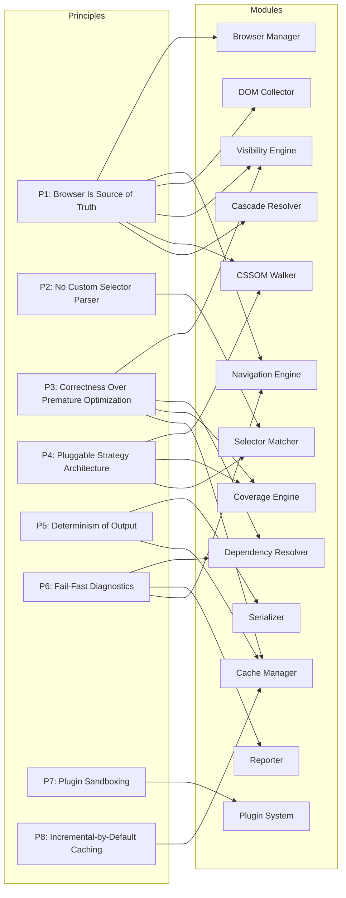
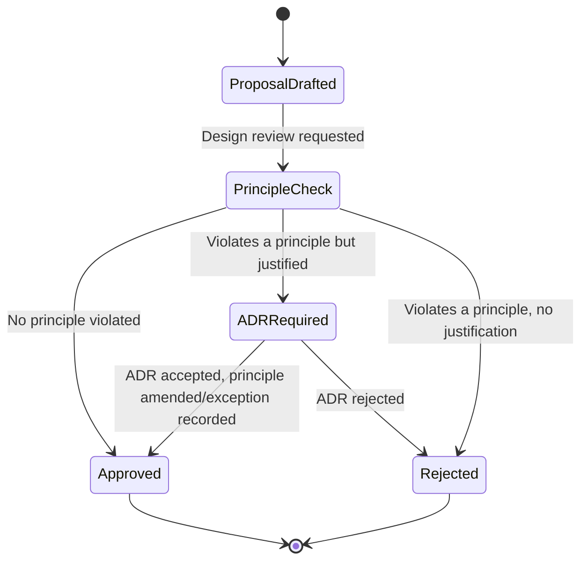

# Design Principles

## Version

1.0.0 — Phase 1 (Repository Foundation)

## Purpose

This document enumerates the non-negotiable engineering principles that govern every module, package, and pull request in the Critical CSS Extraction Engine. It exists so that any contributor — human or autonomous coding agent — can evaluate a design proposal or implementation without re-deriving first principles from scratch. Where a proposed change conflicts with a principle in this document, the change must either be rejected, or the principle must be revised through an ADR with explicit consequences analysis. Principles here are deliberately opinionated and, in several cases, deliberately restrictive: they exist to prevent the project from regressing into the static-analysis-based tooling it was built to replace.

## Audience

Senior engineers and autonomous coding agents implementing, reviewing, or extending the engine. Familiarity with browser rendering internals (CSSOM, layout, paint), CI/CD pipeline design, and plugin/extension architecture is assumed. This is not an onboarding tutorial; it is a normative reference.

## Prerequisites

- Familiarity with the project vision in [001-Vision.md](./001-Vision.md)
- Familiarity with the functional and non-functional requirements in [003-Requirements.md](./003-Requirements.md)
- Familiarity with project terminology in [004-Terminology.md](./004-Terminology.md)
- A working understanding of the CSSOM, the Selectors API (`Element.matches()`), and the Chrome DevTools Protocol Coverage domain

## Related Documents

- [001-Vision.md](./001-Vision.md) — why this engine exists and what "correct" means for it
- [003-Requirements.md](./003-Requirements.md) — the requirements these principles are designed to satisfy
- [004-Terminology.md](./004-Terminology.md) — canonical vocabulary used throughout this document
- [007-Repository-Structure.md](./007-Repository-Structure.md) — how these principles map onto the physical package layout
- [ADR-0001-Browser-Is-Source-of-Truth](../adr/ADR-0001-Browser-Is-Source-of-Truth.md) — formal decision record for Principle 1
- [ADR-0002-No-Custom-Selector-Parser](../adr/ADR-0002-No-Custom-Selector-Parser.md) — formal decision record for Principle 2
- [ADR-0003-Playwright-As-Browser-Abstraction](../adr/ADR-0003-Playwright-As-Browser-Abstraction.md) — the concrete browser automation choice that implements Principle 1
- [ADR-0004-Plugin-Lifecycle-Model](../adr/ADR-0004-Plugin-Lifecycle-Model.md) — formal decision record for the plugin sandboxing principle
- [ADR-0005-Hybrid-Extraction-Mode](../adr/ADR-0005-Hybrid-Extraction-Mode.md) — formal decision record informing the pluggable-strategy principle

## Overview

The Critical CSS Extraction Engine exists because every predecessor tool in this space (Critical, Critters, Penthouse) approximates "what CSS is needed to render the above-the-fold content" by statically parsing HTML and CSS and heuristically deciding what "looks" visible. This approach is fundamentally unsound: CSS visibility, cascade resolution, and layout are defined by the browser's rendering algorithms, not by a JavaScript regex engine's understanding of a stylesheet. Any tool that reimplements those algorithms outside a real browser is building a second, inevitably divergent, rendering engine.

This project takes the opposite position from the outset: the browser itself is the only legitimate authority on what is visible, what CSS applies, and how it cascades. Every principle in this document is a specific consequence of committing to that position, plus the operational principles (determinism, extensibility, fail-fast diagnostics, sandboxing, incremental caching) required to turn "ask the browser" into a production-grade, CI-integrated tool rather than a one-off script.

There are eight principles, presented in the order a contributor is most likely to violate them:

1. The Browser Is the Source of Truth
2. Never Implement a Custom Selector Parser
3. Correctness Over Premature Optimization
4. Pluggable, Strategy-Based Extraction Architecture
5. Determinism of Output
6. Fail-Fast Diagnostics
7. Plugin Sandboxing
8. Incremental-by-Default Caching

Each is stated as an imperative, followed by rationale, concrete permitted/forbidden examples, and consequences for module design. A Mermaid diagram at the end of the Architecture section maps each principle to the modules from [003-Requirements.md](./003-Requirements.md) and the module table it most constrains.

## Detailed Design

### Principle 1 — The Browser Is the Source of Truth

**Statement.** Every judgment about what CSS rules apply to the page, what is visible above the fold, and how styles cascade MUST be derived by querying a real, unmodified browser engine at runtime. The engine MUST NOT contain a parallel implementation of layout, paint, cascade resolution, or geometry computation that operates independently of the browser.

**Rationale.** CSS is not a data format that can be interpreted correctly by pattern-matching on its syntax; it is a programming model whose semantics are defined operationally by user-agent behavior, which itself is standardized by evolving specifications (CSSOM, CSS Cascade, CSS Containment, CSS Nesting) and subject to engine-specific quirks (Chromium vs. WebKit vs. Gecko rounding, subpixel layout, font-metric-dependent reflow). A static analyzer that tries to determine "is this selector's specificity higher" or "is this element within the viewport" without a real layout engine will diverge from actual rendering in exactly the cases that matter most: media queries evaluated against real container sizes, `:has()` and other relational pseudo-classes, transform-based positioning, `content-visibility`, shadow DOM encapsulation, and font-metric-dependent line wrapping that shifts what falls "above the fold." Existing tools (Critical, Critters, Penthouse) have accumulated years of GitHub issues that are, at their root, "our static approximation disagreed with the browser." This project's entire reason to exist is to not repeat that mistake.

**What this permits.**
- Driving a real, unmodified Chromium (or other browser engine, see [ADR-0003](../adr/ADR-0003-Playwright-As-Browser-Abstraction.md)) instance via a browser automation protocol (CDP) to execute `document.querySelectorAll`, `Element.matches()`, `getComputedStyle()`, `getBoundingClientRect()`, and the CSSOM APIs (`document.styleSheets`, `CSSRule` subtypes) directly in-page.
- Using the browser's Coverage domain to record actually-executed style rules during a real paint cycle (see [ADR-0005](../adr/ADR-0005-Hybrid-Extraction-Mode.md)).
- Using `IntersectionObserver`, `ResizeObserver`, and layout timing APIs (all real browser primitives) to detect visibility and layout shift.

**What this forbids.**
- Parsing HTML with a JS DOM emulation library (jsdom, cheerio, linkedom) as the primary extraction mechanism. These libraries do not implement layout, so any geometry-derived decision made against them is fabricated, not observed.
- Parsing CSS with a standalone CSS parser (postcss, css-tree) to compute cascade or specificity for extraction decisions. Parsing CSS for *non-decisional* bookkeeping (e.g., pretty-printing, source-map generation in the Serializer) is acceptable because it does not decide which rules are critical — see Principle 2 for the specific carve-out around selector matching.
- Any "visibility heuristic" implemented purely in terms of DOM tree position, without a real computed layout backing it (e.g., "assume anything in the first N DOM nodes is above the fold").

**Consequences for module design.** The Browser Manager and Navigation Engine (see [003-Requirements.md](./003-Requirements.md) module table) become foundational, load-bearing infrastructure rather than a convenience layer — nearly every other module (Visibility Engine, CSSOM Walker, Selector Matcher, Dependency Resolver, Coverage Engine) executes its core logic *inside* a live page context via `page.evaluate()`-style bridges, not in Node.js against serialized data. This has a structural implication for the package graph (see [007-Repository-Structure.md](./007-Repository-Structure.md)): `packages/browser` sits at the base of nearly every extraction-path dependency, and any package that needs DOM/CSSOM facts must express that need as a function shipped into the browser context, not as a Node-side reimplementation.

### Principle 2 — Never Implement a Custom Selector Parser

**Statement.** Selector-to-element matching MUST be delegated to the browser's native `Element.matches()` (or `document.querySelectorAll` where enumeration is needed). The engine MUST NOT parse CSS selector syntax to build its own matching engine, and MUST NOT maintain a hand-written grammar for selector combinators, pseudo-classes, or pseudo-elements.

**Rationale.** This is a corollary of Principle 1, but it is important enough, and easy enough to violate under performance pressure, to warrant its own principle and its own ADR ([ADR-0002](../adr/ADR-0002-No-Custom-Selector-Parser.md)). Modern CSS selector syntax is large and still growing: combinators (`>`, `+`, `~`, ` `), the functional pseudo-classes `:is()`, `:where()`, `:has()`, `:not()` with complex selector lists, attribute selectors with case-sensitivity flags, namespace selectors, and nesting introduced by CSS Nesting. A hand-rolled parser/matcher — the approach taken by libraries like Penthouse's internal selector splitting — is a permanent maintenance liability: every new CSS feature requires a matching update to the custom engine, and the custom engine trails browser support rather than following it. Browsers already contain a fully spec-compliant, continuously updated selector engine. Re-deriving it in JavaScript is strictly worse in correctness, worse in future-proofing, and only theoretically better in raw throughput — and even that theoretical throughput advantage is generally recoverable through indexing and memoization (see [401-Selector-Memoization.md](../design/401-Selector-Memoization.md), planned) rather than through reimplementation.

**What this permits.**
- Calling `element.matches(selector)` per candidate element, or `root.querySelectorAll(selector)` for enumeration, from within the browser context.
- Building a rule index (selector string → candidate element set) as a *performance cache* over matching results, as long as the underlying truth for any individual match is still `Element.matches()`.
- Splitting a comma-separated selector list (`a, b, c`) into individual selectors as a purely syntactic, delimiter-based operation for the purpose of independently tracking which branch of a selector list matched, *without* parsing the internal structure of each branch. This is bookkeeping over browser-verified results, not selector semantics.

**What this forbids.**
- Writing a tokenizer/parser that understands the internal grammar of a compound or complex selector (e.g., decomposing `div.card > a:hover::before` into type/class/combinator/pseudo-element tokens) in order to *decide* whether it matches an element.
- Reimplementing specificity calculation by parsing selector text. Specificity comparisons needed for the Cascade Resolver must be derived by browser-observable behavior (`getComputedStyle` cross-checks) or by delegating to well-vetted, browser-validated logic — never by a bespoke specificity parser that could silently diverge from the CSS Cascade specification's edge cases (e.g., `:where()` has zero specificity, `:is()` takes the specificity of its most specific argument).
- Using a third-party static selector-matching library (e.g., a Node.js CSS selector engine ported for server-side use) as a substitute for `Element.matches()`, even if it claims spec compliance — it is still a second implementation subject to divergence, and it fails Principle 1 by definition since it does not execute inside a real browser.

**Consequences for module design.** The Selector Matcher module is explicitly a thin, memoizing wrapper around browser-native matching primitives, not an engine in its own right. `packages/matcher` therefore has a hard dependency on `packages/browser` and must not depend on any CSS-parsing package for matching decisions (it may depend on a parsing package solely for non-decisional purposes, such as generating human-readable diagnostics — see Edge Cases).

### Principle 3 — Correctness Over Premature Optimization

**Statement.** When a correctness-preserving design and a faster-but-approximate design conflict, the correctness-preserving design MUST be chosen by default. Performance optimizations MUST be introduced as additive, benchmarked, and toggleable layers on top of a correct baseline — never as replacements that trade away correctness implicitly.

**Rationale.** This project's entire market position is "the accurate one," per [002-Problem-Statement.md](../architecture/002-Problem-Statement.md) (planned) and the Non-Goals in the brief: existing tools already offer fast-but-approximate critical CSS extraction, and their approximations are the reason critical CSS extraction has a reputation for being unreliable (missing rules causing flash-of-unstyled-content, or overly broad extraction defeating the optimization's purpose). If this engine reintroduces the same tradeoff under time pressure, it has no reason to exist. This does not mean the engine should be slow — Section 2.14 of the brief (Rule indexing, selector memoization, parallel stylesheet traversal, worker threads, streaming output) is an extensive and mandatory performance program — but every one of those optimizations must be provably equivalent to the naive-correct baseline, not an approximation of it.

**What this permits.**
- Memoizing `Element.matches()` results keyed by (selector, element identity) within a single extraction run, since the underlying truth value does not change mid-run for a stable DOM snapshot.
- Parallelizing independent stylesheet traversal across worker threads, since traversal of stylesheet A does not affect the correctness of traversal of stylesheet B.
- Building rule indexes (e.g., grouping selectors by rightmost simple selector) to prune candidate elements before calling `Element.matches()`, as long as the index is provably a superset filter (never excludes a true match).
- Caching extraction results keyed by content fingerprints (Principle 8), since a fingerprint match is a proof of input equivalence, not a heuristic guess.

**What this forbids.**
- Skipping visibility recomputation for a subset of nodes as a default behavior to save time, without an explicit, opt-in configuration flag and documented accuracy tradeoff.
- Defaulting to a sampling-based Coverage mode that only observes a fraction of paint frames, when the Hybrid mode's purpose (per [ADR-0005](../adr/ADR-0005-Hybrid-Extraction-Mode.md)) is cross-verification, not sampling.
- Truncating dependency graph resolution (Section 2.5 of the brief: CSS variables, keyframes, font faces, `@property`, `@counter-style`, `@layer`, `@supports`, media/container queries) before reaching a fixed point, purely to bound running time, without surfacing a diagnostic warning that resolution was incomplete (see Principle 6, Fail-Fast Diagnostics).

**Consequences for module design.** Every module that ships a "fast path" MUST also ship the naive-correct path as a fallback and as the target of golden-snapshot regression tests (see [Testing](#testing)). The Cache Manager and Coverage Engine, in particular, must be designed so their fast paths are invalidated correctly rather than merely quickly (see Principle 8).

### Principle 4 — Pluggable, Strategy-Based Extraction Architecture

**Statement.** The three extraction strategies — CSSOM, Coverage, and Hybrid — MUST be implemented as interchangeable strategy objects behind a single extraction interface, not as three independent code paths with divergent behavior. Any module that needs to select or compose an extraction strategy MUST do so through this interface, and new strategies MUST be addable without modifying consumers of the interface.

**Rationale.** Section 2.4 and 2.7 of the brief require CSSOM-only extraction (fast, structural), Coverage-based extraction (paint-verified, via Chrome DevTools Coverage API), and a Hybrid mode that combines CSSOM selector matching, Coverage data, and `getComputedStyle` verification. These are not merely three configuration values — they are three different runtime data sources with different performance characteristics, different failure modes (Coverage requires CDP session support; CSSOM works in any Playwright-supported engine), and different accuracy profiles. Hardcoding this as an if/else chain inside the extraction pipeline would make Hybrid mode (the recommended default per the Roadmap's Phase 3) an unmaintainable special case rather than a natural composition of the other two. The Strategy pattern is chosen deliberately over alternatives such as a single monolithic extractor with feature flags (rejected: flags multiply combinatorially and blur ownership of correctness) or a plugin-only approach where strategies are just plugins (rejected: strategies are core, load-bearing, and must be swappable without going through the untrusted, sandboxed plugin boundary — see Principle 7).

**What this permits.**
- Defining an `ExtractionStrategy` interface with a uniform contract (e.g., `execute(context: ExtractionContext): Promise<ExtractionResult>`) that CSSOM, Coverage, and Hybrid strategies each implement independently.
- Composing Hybrid mode as an orchestrator that internally invokes the CSSOM and Coverage strategies and reconciles their results, rather than duplicating their logic.
- Adding a fourth strategy (e.g., a future `ComputedStyleMode`, per Phase 9 of the roadmap) without modifying the CLI, Reporter, or Cache Manager, because they only depend on the `ExtractionStrategy` interface and the `ExtractionResult` DTO.

**What this forbids.**
- Branching on `config.mode === 'coverage'` inside shared pipeline code (e.g., inside the Serializer or Cache Manager) instead of at the single strategy-selection point.
- Strategy implementations that reach into each other's private state instead of communicating through the shared `ExtractionResult` / dependency graph DTOs.

**Consequences for module design.** `packages/collector` (housing the CSSOM Walker, Visibility Engine, and DOM Collector) and `packages/coverage` are peers under a shared strategy interface owned by a coordination layer (see [007-Repository-Structure.md](./007-Repository-Structure.md)), not a hierarchy where one depends on the other. The Hybrid strategy lives alongside them and depends on both, which is the one place in the dependency graph where "sibling" packages are composed by a third package rather than depending on each other directly.

### Principle 5 — Determinism of Output

**Statement.** Given identical inputs (HTML, CSS assets, viewport/device profile, extraction mode, and engine version), the engine MUST produce byte-identical critical CSS output across repeated runs, across machines, and across process restarts. Non-determinism from iteration order, timing-dependent races, or unstable sort order is a correctness bug, not an acceptable variance.

**Rationale.** This engine's primary integration point is CI/CD (Section 2.11 of the brief): "Compare against baseline" is only a meaningful gate if two runs against unchanged inputs produce unchanged output. Nondeterministic output — e.g., because rule serialization order depends on `Set` iteration order, or because parallel worker threads complete in a race-dependent sequence and append results in completion order — produces false-positive diffs that erode trust in the baseline comparison and eventually cause teams to disable the check entirely. Determinism must be an architectural property, not a hopeful side effect of "usually stable" JavaScript engine behavior.

**What this permits.**
- Sorting rules by a stable, explicit key (source order index, then selector text, then property name) before serialization, regardless of which worker thread or async task produced them.
- Running stylesheet traversal in parallel for performance, as long as results are re-assembled into a canonical order before the Serializer consumes them (parallelism affects *when* work finishes, never *what order* output appears in).
- Using content-addressed identifiers (fingerprints, see Principle 8) rather than object-insertion-order identifiers anywhere a stable ordering is needed across runs.

**What this forbids.**
- Serializing directly from a `Map`/`Set`/`Object` whose iteration order is an incidental consequence of insertion timing from concurrent operations.
- Embedding wall-clock timestamps, random UUIDs, or absolute filesystem paths in the *content* of the output CSS (a separate, explicitly-timestamped metadata/report artifact is fine and expected — see the Reporter module — but it must not be mixed into the deterministic CSS payload).
- Allowing plugin hook ordering to depend on filesystem directory listing order rather than an explicit, declared registration order (see Principle 7).

**Consequences for module design.** The Serializer (`packages/serializer`) owns canonicalization and is the single point through which all extraction strategies' results must pass before becoming output; it must define and document a total order over rules, and every other module that produces intermediate collections (Dependency Resolver, Coverage Engine) must treat its own internal ordering as an implementation detail that the Serializer is responsible for normalizing.

### Principle 6 — Fail-Fast Diagnostics

**Statement.** The engine MUST surface extraction ambiguity, partial failure, and unresolved dependencies as loud, structured diagnostics at the earliest possible point, rather than silently degrading to a "best effort" result. Silent partial success is treated as a defect class equal in severity to a crash.

**Rationale.** A critical CSS extractor that silently ships incomplete CSS is worse than one that fails outright, because the failure mode (visible flash-of-unstyled-content, or a broken above-the-fold render) manifests in production, for real users, at a point disconnected from the CI run that generated the artifact. Section 2.12 of the brief mandates rich diagnostics (dependency graphs, matched/unmatched selector reports, timing, extraction traces) precisely so that ambiguity is visible and actionable rather than absorbed. "Fail fast" here does not always mean "abort the process" — for a CI pipeline, a missing dependency should ideally fail the build (Section 2.11: "Fail build if... missing dependencies detected") rather than silently omit a rule.

**What this permits.**
- Structured error/warning types (e.g., `UnresolvedDependencyWarning`, `SelectorMatchTimeoutError`, `CrossOriginStylesheetSkipped`) attached to the `ExtractionResult` and surfaced through the Reporter, with configurable severity thresholds that a CI pipeline can turn into hard failures.
- A "strict mode" (default in CI-oriented presets) that turns any unresolved dependency-graph fixed-point failure into a nonzero exit code.
- Timeouts on individual navigation/collection steps that produce a specific, attributable error (which route, which stylesheet, which selector) rather than a generic timeout.

**What this forbids.**
- Catching an exception during dependency resolution and continuing with a partial graph without recording *that* it was partial and *why*.
- Returning an empty or truncated critical CSS payload without a corresponding error/warning in the same `ExtractionResult`.
- Logging diagnostics only to stdout in a format not consumable by the Reporter — diagnostics are data (see [003-Requirements.md](./003-Requirements.md) DTOs), not incidental console noise.

**Consequences for module design.** Every module boundary that can fail partially (Navigation Engine, CSSOM Walker, Dependency Resolver, Coverage Engine) must return a result type that separates "success value" from "diagnostics" rather than throwing away diagnostics on the happy path or swallowing them on the unhappy path — effectively a `Result<T, Diagnostic[]>` shape threaded through the pipeline into `packages/reporter`.

### Principle 7 — Plugin Sandboxing

**Statement.** Plugins (Section 2.13 of the brief: `beforeLaunch`, `afterNavigation`, `beforeCollection`, `afterCollection`, `beforeSerialize`, `afterSerialize`) MUST execute under explicit capability restrictions and MUST NOT be able to compromise the determinism, correctness, or security guarantees of the core pipeline. A plugin bug or malicious plugin must degrade gracefully (isolated failure, clear attribution) rather than corrupt shared state or silently alter output in ways invisible to diagnostics.

**Rationale.** The plugin system is a deliberate extensibility point (Section 2.13: "Plugins may: ignore selectors, rewrite CSS, inject rules, customize visibility, customize matching") — which means plugins are granted power over exactly the decisions this document treats as core correctness surface. Without sandboxing, a third-party plugin could reintroduce every failure mode Principles 1–6 exist to prevent (e.g., a plugin that "customizes visibility" using a static heuristic instead of browser-derived geometry). Sandboxing does not mean plugins run in a literal OS-level sandbox for every hook (though network and filesystem restrictions are in scope, per Section 2.16 of the brief) — it means plugins interact with the pipeline exclusively through well-typed, narrow hook contracts, their side effects are attributable and logged, and a plugin exception at any hook is caught, reported with plugin identity, and does not crash or silently skip the rest of the pipeline.

**What this permits.**
- A hook contract where each lifecycle hook receives an immutable-by-default context object and returns an explicit, typed patch/decision (e.g., `afterCollection` returns a list of node IDs to exclude, rather than being handed a mutable DOM reference to mutate arbitrarily).
- Per-plugin timeout budgets and per-plugin error isolation, with failures surfaced through the same diagnostics channel as Principle 6.
- Declarative capability requests (e.g., "this plugin needs network access") that the host can deny by policy, consistent with Section 2.16's "configurable network restrictions."

**What this forbids.**
- Handing plugins direct, unrestricted access to the live Playwright `Page` object in hooks whose contract does not require it (e.g., `beforeSerialize` should receive the rule set/dependency graph, not raw page access).
- Allowing a single plugin's unhandled exception to abort extraction for all routes/viewports in a batch run without isolation.
- Letting plugin execution order be nondeterministic (ties back to Principle 5): registration order must be explicit and stable.

**Consequences for module design.** `packages/plugins` defines the hook contracts and sandbox boundary as its own package, separate from `packages/collector`/`packages/serializer`, so that the pipeline packages depend on a narrow plugin *interface* rather than plugins depending on (and thereby coupling themselves to) pipeline internals. This inversion is what keeps the plugin surface stable across internal refactors.

### Principle 8 — Incremental-by-Default Caching

**Statement.** The engine MUST default to incremental execution: given a route/viewport/mode combination whose content fingerprint (HTML, CSS assets, viewport, extraction mode — Section 2.8 of the brief) is unchanged since a prior run, the engine MUST reuse the prior extraction result rather than recomputing it, unless caching is explicitly disabled.

**Rationale.** Section 2.6 (multi-viewport) and Section 2.9 (route manifests with wildcard patterns) imply that production usage scales to many routes × many viewports × many CI runs per day. Recomputing every combination from a cold browser on every run is both wasteful and, at enterprise scale (Section 2.18: "Suitable for enterprise CI pipelines"), a throughput bottleneck that pushes teams back toward the static, approximate tools this project displaces. Caching must be a default, not an opt-in feature, because opt-in performance features are systematically under-adopted; but it must be *correctness-preserving* caching (a direct instance of Principle 3), keyed on content fingerprints that are proven, not assumed, to capture every input that affects the output.

**What this permits.**
- Fingerprinting inputs as a composite hash of: normalized HTML content, resolved CSS asset content (post-bundling, pre-critical-extraction), the active viewport/device profile, the extraction mode, and the engine's own semantic version (so an engine upgrade invalidates stale caches by default).
- Storing cache entries content-addressed by fingerprint, with pluggable backends (local filesystem for developer workflows, distributed/remote store for CI fleets — see Phase 10 roadmap, `806-Distributed-Cache.md`).
- Cache invalidation strategies that are explicit and testable (see [Testing](#testing)) rather than time-based expiry alone.

**What this forbids.**
- Caching keyed only on route path or file mtimes, both of which can be identical while semantically relevant content differs (mtime is not content-addressed) or can differ while content is identical (a rebuild that changes mtimes but not bytes must be a cache hit).
- Treating cache reuse as silently equivalent to a hit-or-miss binary with no diagnostic trail — a cache hit must be visible in the extraction trace (Principle 6) so that "why didn't this rerun" is always answerable.

**Consequences for module design.** `packages/cache` is a first-class package, not a bolt-on: the CLI orchestration path (`apps/cli`) must consult the Cache Manager *before* invoking any extraction strategy, and every extraction strategy must produce output that is fingerprint-reproducible (a direct consequence of Principle 5 — determinism is a precondition for caching to be sound at all).

## Architecture

The following diagram maps each of the eight principles to the primary system modules (from the module table referenced in [003-Requirements.md](./003-Requirements.md), sourced from Section 2.4 of the brief) whose design they most directly constrain. An arrow from a principle to a module indicates "this principle is a binding constraint on this module's design," not a data-flow relationship.



Note that the Browser Manager, Navigation Engine, DOM Collector, Visibility Engine, and Cascade Resolver all sit downstream of Principle 1 because they either execute inside, or derive facts directly from, a live browser context. The Selector Matcher is the sole primary owner of Principle 2. The Serializer and Cache Manager jointly own Principle 5 because determinism is meaningless without a canonicalizing consumer (Serializer) and meaningless to exploit without a consumer that depends on reproducibility (Cache Manager).

A second view — principle enforcement as a decision gate in the pull-request/design-review workflow — is shown below as a state diagram. This is the process by which principles are *enforced*, not merely documented.



## Algorithms

Design principles are not themselves algorithms, but two of them (Determinism and Incremental Caching) imply concrete, specifiable procedures that every conforming module must follow. These are specified here so "determinism" and "incremental-by-default" are testable properties, not aspirations.

### Algorithm: Canonical Ordering for Deterministic Serialization

**Problem statement.** Given an unordered (or non-deterministically ordered) collection of extracted CSS rules produced by potentially-parallel traversal, produce a total order that is stable across runs, machines, and thread-scheduling variance.

**Inputs.** A list of `MatchedRule` records, each with: `sourceStylesheetIndex` (position of the owning stylesheet in document order), `sourceRuleIndex` (position of the rule within its stylesheet's rule list, itself browser-reported and therefore already stable per Principle 1), `selectorText`, and `declarationBlock`.

**Outputs.** A totally ordered list of `MatchedRule` suitable for direct serialization.

**Pseudocode.**
```
function canonicalOrder(rules: MatchedRule[]): MatchedRule[]
    return stableSort(rules, compareRules)

function compareRules(a: MatchedRule, b: MatchedRule): Ordering
    if a.sourceStylesheetIndex != b.sourceStylesheetIndex:
        return a.sourceStylesheetIndex - b.sourceStylesheetIndex
    if a.sourceRuleIndex != b.sourceRuleIndex:
        return a.sourceRuleIndex - b.sourceRuleIndex
    // Defensive tiebreaker; should not trigger given browser-stable indices,
    // but guards against future strategies that merge rules from
    // non-stylesheet-ordered sources (e.g., synthesized @property rules).
    return lexicographicCompare(a.selectorText, b.selectorText)
```

**Time complexity.** O(n log n) for the sort, where n is the number of matched rules; this dominates the otherwise O(n) collection cost.

**Memory complexity.** O(n) for the working copy sorted; no additional structures beyond the comparator's constant-space tiebreak.

**Failure cases.** If two rules share `sourceStylesheetIndex` and `sourceRuleIndex` (only possible if a strategy synthesizes rules outside the browser's native rule-index space, e.g., a plugin-injected rule via `beforeSerialize`), the lexicographic tiebreak applies; plugin-injected rules must additionally be assigned a stable synthetic index by the Plugin System (Principle 7) so this case is rare and documented, not silently ambiguous.

**Optimization opportunities.** For very large rule sets (enterprise stylesheets, Section 2.15 fixtures), sorting can be partitioned by `sourceStylesheetIndex` first (already contiguous from parallel per-stylesheet traversal) and merged in O(n) using the already-sorted per-stylesheet sublists, reducing effective cost to O(n log k) where k is the number of stylesheets, k << n.

### Algorithm: Fingerprint Computation for Incremental Cache Lookup

**Problem statement.** Given the inputs that affect extraction output (HTML, resolved CSS assets, viewport/device profile, extraction mode, engine version), compute a fingerprint such that fingerprint equality is both necessary and sufficient for output equivalence — no false cache hits, and no unnecessary cache misses.

**Inputs.** `htmlContent: string`, `cssAssets: Asset[]` (each with resolved, post-bundle content), `viewportProfile: ViewportProfile`, `extractionMode: 'cssom' | 'coverage' | 'hybrid'`, `engineVersion: string`.

**Outputs.** `fingerprint: string` (a fixed-length content hash).

**Pseudocode.**
```
function computeFingerprint(input: FingerprintInput): string
    normalizedHtml = normalizeWhitespace(input.htmlContent)     // whitespace-only diffs must not bust cache
    assetHashes = input.cssAssets
        .sortBy(asset => asset.canonicalUrl)                    // order-independent input must yield order-independent hash
        .map(asset => sha256(asset.content))
    composite = concat(
        sha256(normalizedHtml),
        assetHashes.join(':'),
        serializeViewportProfile(input.viewportProfile),
        input.extractionMode,
        input.engineVersion
    )
    return sha256(composite)
```

**Time complexity.** O(m) where m is total byte length of HTML + CSS assets, dominated by hashing; sorting assets is O(a log a) where a is asset count, a << m.

**Memory complexity.** O(m) transient during hashing; O(1) for the resulting fingerprint.

**Failure cases.** Whitespace-insensitive normalization must not eliminate semantically significant whitespace (e.g., inside `<pre>` or in CSS string literals) — `normalizeWhitespace` is scoped to HTML structural whitespace only, and CSS asset content is hashed verbatim (unnormalized) because CSS whitespace can be semantically load-bearing in edge cases (rare, but out of scope for "safe" normalization, per Principle 3: correctness over the minor cache-hit-rate gain of aggressive normalization).

**Optimization opportunities.** Asset hashes can be memoized keyed by `(canonicalUrl, mtime, size)` as a fast-path pre-check before a full content hash, falling back to full-content hashing only when the fast-path key changes — this is itself an instance of Principle 3's required pattern: a fast path that is provably equivalent (mtime/size change is a superset trigger; content hash is the ground truth) rather than an approximation.

## Implementation Notes

- Principles 1 and 2 should be enforced partly through code review and partly through static lint rules: the monorepo's ESLint configuration (shared via `packages/shared`, per [007-Repository-Structure.md](./007-Repository-Structure.md)) should ban imports of jsdom, cheerio, css-tree's selector-matching APIs, and similar packages from any file under `packages/matcher` or `packages/collector`'s decision-making code paths, with an explicit allowlist exception for non-decisional diagnostic formatting.
- Principle 5's determinism should be verified by a dedicated CI job that runs the same fixture extraction twice (with forced randomized worker-thread scheduling, e.g., artificially staggered thread start delays) and byte-diffs the output; any diff fails CI. This is a stronger, engine-owned analogue of the "compare against baseline" CI stage described in Section 2.11 of the brief.
- Principle 6's diagnostics types should be defined once in `packages/shared` (see [007-Repository-Structure.md](./007-Repository-Structure.md)) so that every producing module and the single consuming `packages/reporter` share the same DTO shapes, preventing drift between what modules report and what the Reporter can render.
- Principle 7's hook contracts should be versioned independently of the core engine's internal APIs (a public, semver-stable plugin API surface), because plugin authors are external to this repository and cannot be assumed to upgrade in lockstep with internal refactors.
- Principle 8's cache backends should be defined behind a `CacheStore` interface (local filesystem, remote/distributed) from day one, even though only the local backend ships in early roadmap phases, so that Phase 10's `806-Distributed-Cache.md` is an additive backend implementation, not a breaking interface change.

## Edge Cases

- **Shadow DOM.** `Element.matches()` and `querySelectorAll` do not cross shadow boundaries by default; Principle 1 requires that visibility and matching decisions for shadow-encapsulated content be made by explicitly traversing into `shadowRoot` contexts inside the browser, never by flattening shadow DOM into a synthetic light-DOM approximation outside the browser.
- **Constructable Stylesheets.** Stylesheets attached via `document.adoptedStyleSheets` or a shadow root's `adoptedStyleSheets` may not appear in `document.styleSheets` in the same way as `<link>`/`<style>`-sourced sheets; the CSSOM Walker must enumerate adopted stylesheets explicitly per Principle 1 (query the browser for the actual attached sheet set) rather than assuming `document.styleSheets` is exhaustive.
- **Cross-origin stylesheets.** A cross-origin `<link>` stylesheet without appropriate CORS headers exposes a CSSOM whose `cssRules` throws a `SecurityError` when accessed from page script. Principle 6 requires this to surface as an explicit, attributed diagnostic ("stylesheet X skipped: cross-origin, CORS not permitted") rather than a silent empty rule list, consistent with Section 2.16 of the brief.
- **`:has()` browser support variance.** Principle 2 explicitly delegates `:has()` matching to the browser "browser permitting" (Section 2.5) — on an engine/version without `:has()` support, `Element.matches()` throws a `SyntaxError` for that selector rather than silently returning false. This must be caught and reported (Principle 6) as an unsupported-selector diagnostic, not swallowed as a non-match, since "no match" and "cannot evaluate" are semantically different and the latter risks a false negative in extraction.
- **Determinism under floating-point geometry.** `getBoundingClientRect()` can return subpixel values that differ by floating-point noise between runs on different hardware/GPU configurations in rare cases (e.g., subpixel text rendering affecting inline layout). The Visibility Engine must apply an explicit, documented epsilon/rounding rule before geometry values feed into any pass/fail visibility decision, so that Principle 5's determinism guarantee holds even though the underlying browser measurement has inherent minor variance.
- **Plugin hook idempotency.** A plugin's `beforeSerialize` hook that injects a rule must be re-invoked identically on a cache-hit re-run path in a way that does not depend on external plugin-side state (e.g., a plugin using `Math.random()` internally breaks Principle 5 regardless of core-engine determinism); the Plugin System should document and, where feasible, lint for use of nondeterministic APIs within hook implementations.
- **Nested CSS.** Native CSS nesting resolves to flattened selectors at the CSSOM level in a browser-defined way; the CSSOM Walker must read the browser-resolved `selectorText` of nested rules (Principle 1) rather than attempting to flatten nesting syntax itself (which would violate Principle 2's boundary if it required selector-syntax parsing).

## Tradeoffs

| Principle | Primary Cost Accepted | Primary Benefit Gained | Chosen Because |
|---|---|---|---|
| Browser Is Source of Truth | Every extraction run requires a real browser process (heavier than a pure-Node static parser; slower cold start, higher memory) | Rendering-parity correctness; immunity to spec-edge-case divergence | Correctness is the project's entire value proposition (Principle 3); the cost is amortized via Browser Pool reuse and Incremental Caching (Principle 8) |
| No Custom Selector Parser | Cannot micro-optimize matching below what `Element.matches()` allows; cannot run matching outside a browser context (e.g., pure server-side prematch without any browser) | Immunity to selector-spec divergence and zero maintenance burden as CSS selector syntax evolves | A custom matcher's maintenance and correctness risk was judged to outweigh any raw-throughput gain, recoverable instead via indexing/memoization |
| Pluggable Strategy Architecture | Additional abstraction layer (interface indirection) versus a single hardcoded pipeline; slightly higher initial implementation cost | Coverage/Hybrid modes and future strategies (e.g., computed-style-only mode) are additive, not rewrites | Section 2.4/2.7 of the brief mandates three strategies from the outset; retrofitting pluggability later is strictly more expensive |
| Determinism of Output | Forecloses certain naive-parallel implementations (e.g., "first thread to finish wins" merge strategies) in favor of explicit canonical ordering | CI baseline comparison (Section 2.11) is trustworthy; no flaky diffs | A CI gate that produces false positives is worse than no gate; teams disable unreliable gates |
| Fail-Fast Diagnostics | More verbose result types (Result/Diagnostic wrapping) throughout the codebase versus simple return values or exceptions | Silent incorrect output is structurally impossible; every partial failure is attributable | The failure mode of silent bad output (production FOUC) is strictly worse than a loud build failure |
| Plugin Sandboxing | Plugin authors have a narrower, more indirect API than "just give me the Page object" | Core pipeline correctness/determinism cannot be compromised by third-party plugin code; plugin API is a stable, versionable contract | Section 2.13 explicitly grants plugins power over correctness-sensitive decisions, which must be bounded |
| Incremental-by-Default Caching | Fingerprinting logic itself becomes safety-critical (a bad fingerprint causes stale/wrong cache hits) | Enterprise-scale CI throughput (Section 2.18) without recomputing unchanged routes | Section 2.9's route manifests imply potentially large route counts; recompute-everything does not scale |

## Performance

- **CPU complexity.** Principles here do not themselves impose asymptotic complexity beyond what individual algorithms specify (see Algorithms section); however, Principle 1 imposes a *constant-factor* cost floor (real browser execution) that a pure static-analysis approach would not have. This is accepted deliberately (Principle 3) and mitigated architecturally (Browser Pool reuse, parallel stylesheet traversal, worker threads — Section 2.14).
- **Memory complexity.** Fail-Fast Diagnostics (Principle 6) adds O(d) memory overhead per run for the diagnostics collection, where d is the number of diagnostic events; this is negligible relative to DOM/CSSOM snapshot memory and is justified unconditionally.
- **Caching strategy.** Principle 8 is itself the caching strategy at the architectural level; its performance characteristics are detailed in the Fingerprint Computation algorithm above and in the forthcoming `800-Cache-Overview.md` (Phase 10).
- **Parallelization opportunities.** Principle 5 (Determinism) is deliberately designed to *not* block parallelization — it requires that parallel results be reassembled deterministically, not that work happen serially. Principle 1's browser-execution cost is the main target of parallelization (multiple browser contexts/tabs per pool, per the Browser Manager design in Phase 3).
- **Incremental execution.** Principle 8 is the incremental-execution principle; its interaction with Principle 5 (fingerprint reproducibility depends on deterministic output) is the key architectural coupling to preserve across future changes.
- **Profiling guidance.** Because Principle 1 concentrates cost in real browser execution, profiling should prioritize Navigation Engine wait strategies (Rendering Stabilization, Phase 3) and CSSOM/Coverage collection round-trip counts (each `page.evaluate()` call carries serialization overhead) over Node-side CPU profiling, which will typically show the engine's own logic as a minority of wall-clock time.
- **Scalability limits.** The Browser Manager's pool size is the primary horizontal scalability lever; Principle 8's cache hit rate is the primary lever for reducing the *number* of browser-bound extractions needed per CI run as route/viewport counts grow.

## Testing

- **Unit tests.** Each principle that implies a concrete algorithm (Canonical Ordering, Fingerprint Computation) must have dedicated unit tests covering: stable output under input permutation (for ordering), and hash equality/inequality under controlled input mutation (for fingerprinting — e.g., changing one CSS asset byte must change the fingerprint; reordering asset array input must not).
- **Integration tests.** A cross-module integration suite must assert that a full extraction run against a fixture page produces a diagnostics payload consistent with injected failure conditions (e.g., a fixture with a deliberately cross-origin, CORS-blocked stylesheet must produce the expected `CrossOriginStylesheetSkipped` diagnostic, verifying Principle 6 end-to-end).
- **Visual tests.** Not directly applicable to this document's principles in isolation, but every principle that touches visibility/geometry (Principle 1, 3) is ultimately validated by the Visual Regression layer described in [003-Requirements.md](./003-Requirements.md) and Phase 15 testing docs.
- **Stress tests.** Determinism (Principle 5) must be stress-tested under artificially perturbed thread/task scheduling (forced delays, reordered promise resolution) to catch latent nondeterminism that would not surface under normal low-contention test runs.
- **Regression tests.** Golden-snapshot fixtures (Tailwind, Bootstrap, CSS Modules, Styled Components, Emotion, Shadow DOM, SVG, Container Queries, Nested CSS, huge enterprise stylesheets — Section 2.15) serve as the primary regression suite for Principles 1–4 collectively: any change that alters output on these fixtures without an accompanying, reviewed rationale is treated as a regression by default.
- **Benchmark tests.** Principle 3's "additive, benchmarked" requirement means every performance optimization PR must include a benchmark comparing the optimized path against the naive-correct baseline on the huge-enterprise-stylesheet fixture, with both throughput numbers and an equivalence proof/test.

## Future Work

- Formalize an automated "principle linter" that statically flags imports/patterns known to violate Principles 1 and 2 (jsdom/cheerio/css-tree selector APIs in decisional code paths) as part of CI, rather than relying solely on code review.
- Investigate whether a WPT (Web Platform Tests)-derived selector conformance fixture set can be used to continuously verify that Principle 2's delegation to `Element.matches()` remains behaviorally correct across supported browser engine versions (relevant given [ADR-0003](../adr/ADR-0003-Playwright-As-Browser-Abstraction.md)'s multi-engine ambitions).
- Explore formal/property-based testing (e.g., fast-check style generators) for the canonical ordering and fingerprint algorithms to strengthen the determinism guarantees beyond example-based unit tests.
- Revisit whether Principle 8's fingerprint scope should eventually include plugin configuration/version as a fingerprint input, once the Plugin System (Phase 12) is fully specified — plugins that affect output must affect the fingerprint, or incremental caching could silently serve stale results after a plugin upgrade.
- Open question: should Principle 6's "fail build" default severity be configurable per-diagnostic-type out of the box, or should that policy surface live entirely in CI configuration outside the engine? Current lean is "engine defines diagnostic severity taxonomy; CI configuration maps taxonomy to pass/fail," to be formalized in a future ADR.

## References

- [001-Vision.md](./001-Vision.md)
- [003-Requirements.md](./003-Requirements.md)
- [004-Terminology.md](./004-Terminology.md)
- [007-Repository-Structure.md](./007-Repository-Structure.md)
- [ADR-0001-Browser-Is-Source-of-Truth](../adr/ADR-0001-Browser-Is-Source-of-Truth.md)
- [ADR-0002-No-Custom-Selector-Parser](../adr/ADR-0002-No-Custom-Selector-Parser.md)
- [ADR-0003-Playwright-As-Browser-Abstraction](../adr/ADR-0003-Playwright-As-Browser-Abstraction.md)
- [ADR-0004-Plugin-Lifecycle-Model](../adr/ADR-0004-Plugin-Lifecycle-Model.md)
- [ADR-0005-Hybrid-Extraction-Mode](../adr/ADR-0005-Hybrid-Extraction-Mode.md)
- CSSOM specification (W3C) — governing document tree and stylesheet object model behavior referenced throughout Principle 1 and 2
- CSS Selectors Level 4 specification (W3C) — governing `:is()`, `:where()`, `:has()` semantics referenced in Principle 2 and Edge Cases
- Chrome DevTools Protocol, Coverage domain documentation — referenced in Principle 4 and the Hybrid mode discussion
- Section 2 ("Engine Design Reference") and Section 4 ("Global Rules") of the Documentation Agent Brief, the authoritative source for all requirements and constraints cited in this document
