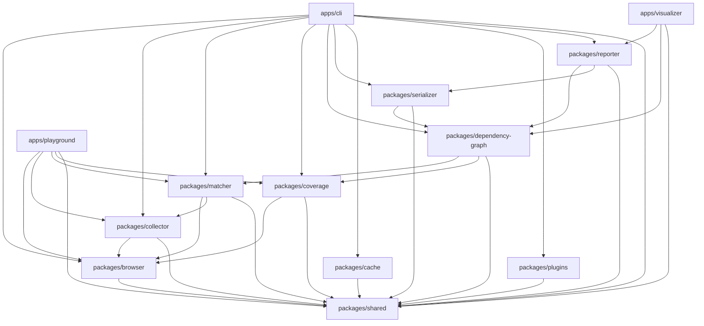
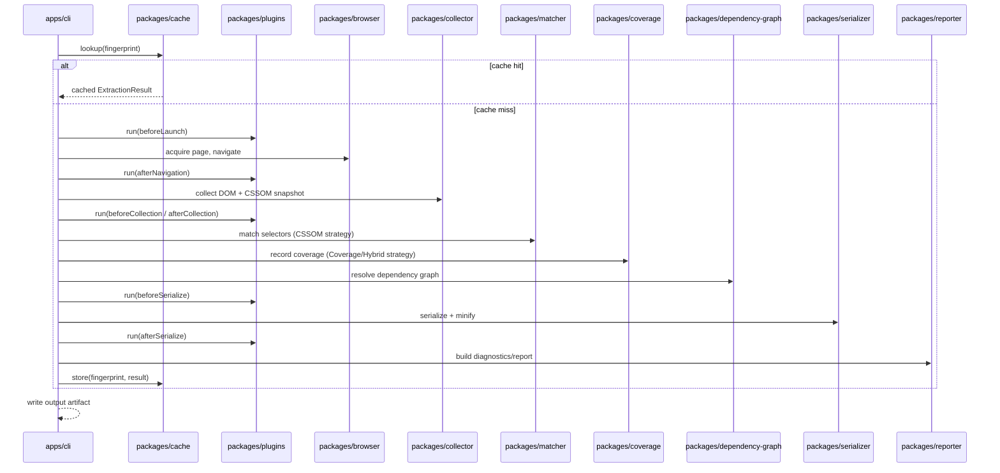

# Repository Structure

## Version

1.0.0 — Phase 1 (Repository Foundation)

## Purpose

This document specifies the canonical monorepo layout for the Critical CSS Extraction Engine: the physical package boundaries, their responsibilities, their permitted dependency relationships, the build tooling conventions that hold the monorepo together, and the layout of the `docs/` tree that documents it. It is the single authoritative reference an autonomous coding agent should consult before creating any new file, package, or top-level directory. Any deviation from this layout requires an ADR, since package boundaries encode the architectural principles in [006-Design-Principles.md](./006-Design-Principles.md) directly into the filesystem.

## Audience

Senior engineers and autonomous coding agents scaffolding, extending, or refactoring the repository. Assumes familiarity with npm/pnpm/yarn workspace monorepo conventions, TypeScript project references, and the module responsibilities described in [003-Requirements.md](./003-Requirements.md).

## Prerequisites

- [001-Vision.md](./001-Vision.md) — why the system is decomposed the way it is
- [003-Requirements.md](./003-Requirements.md) — the module responsibility table (Section 2.4 of the brief) that this layout implements
- [006-Design-Principles.md](./006-Design-Principles.md) — the principles (especially Principle 1, Principle 2, and Principle 4) that this layout's dependency graph must not violate
- Familiarity with the concept of a "workspace protocol" dependency (`workspace:*`) as used by pnpm/Yarn Berry monorepos

## Related Documents

- [001-Vision.md](./001-Vision.md)
- [003-Requirements.md](./003-Requirements.md)
- [004-Terminology.md](./004-Terminology.md)
- [006-Design-Principles.md](./006-Design-Principles.md) — the principle-to-package mapping formalized here
- [ADR-0001-Browser-Is-Source-of-Truth](../adr/ADR-0001-Browser-Is-Source-of-Truth.md)
- [ADR-0002-No-Custom-Selector-Parser](../adr/ADR-0002-No-Custom-Selector-Parser.md)
- [ADR-0003-Playwright-As-Browser-Abstraction](../adr/ADR-0003-Playwright-As-Browser-Abstraction.md) — motivates why `packages/browser` exists as its own package rather than being inlined into `packages/collector`
- [ADR-0004-Plugin-Lifecycle-Model](../adr/ADR-0004-Plugin-Lifecycle-Model.md) — motivates the `packages/plugins` boundary
- [ADR-0005-Hybrid-Extraction-Mode](../adr/ADR-0005-Hybrid-Extraction-Mode.md) — motivates why `packages/coverage` is a sibling of, not a dependency of, `packages/matcher`

## Overview

The repository is a single monorepo rooted at `critical-css-engine/`, containing four top-level concerns: `apps/` (user-facing entry points that consume the engine), `packages/` (the engine itself, decomposed into independently versioned, independently testable units), supporting non-code directories (`fixtures/`, `benchmarks/`, `examples/`), and `docs/` (this documentation tree). This structure is prescribed verbatim by Section 2.19 of the brief; this document's job is to make every design decision embedded in that structure explicit, to specify the dependency graph between packages precisely enough that a build tool's workspace linker and TypeScript's project references can enforce it, and to describe the docs tree layout from Section 3 of the brief in full.

The core design tension resolved by this layout is: the extraction pipeline has a *natural* linear-feeling flow (navigate → collect → match → resolve dependencies → serialize), but Principle 4 in [006-Design-Principles.md](./006-Design-Principles.md) requires that CSSOM and Coverage extraction be peer, swappable strategies rather than sequential stages of one pipeline. The package graph therefore is not a single chain; it is a small DAG with `packages/shared` and `packages/browser` at the base, `packages/matcher`/`packages/coverage` as peer strategy-input producers, `packages/dependency-graph` and `packages/serializer` as convergent consumers, and `packages/cache`, `packages/plugins`, `packages/reporter` as cross-cutting packages that touch the pipeline at defined seams rather than being embedded inside it.

## Detailed Design

### Top-Level Layout

```
critical-css-engine/
├── apps/
│   ├── cli/
│   ├── visualizer/
│   └── playground/
├── packages/
│   ├── shared/
│   ├── browser/
│   ├── collector/
│   ├── matcher/
│   ├── coverage/
│   ├── dependency-graph/
│   ├── serializer/
│   ├── cache/
│   ├── plugins/
│   └── reporter/
├── fixtures/
├── docs/
├── benchmarks/
└── examples/
```

Package listing order above follows dependency depth (base → leaf-consumer), not alphabetical order, deliberately, to make the DAG readable at a glance; the actual directory listing on disk may be alphabetical per filesystem convention, but this document's canonical description orders by dependency layer.

### `apps/` — Consumers of the Engine

Apps are executable entry points. They MUST NOT contain extraction logic themselves; they orchestrate `packages/*` and provide a user-facing surface (CLI flags, a web UI, a sandbox). This separation exists so the engine's core logic is testable and reusable independent of any particular front end — an SSR framework adapter (Phase 11 roadmap) is a future consumer of the same `packages/*` surface that `apps/cli` uses, without needing to depend on `apps/cli` itself.

- **`apps/cli`** — The primary entry point (Section 2.4 of the brief: "CLI: Entry point, argument parsing, orchestration"). Owns argument parsing, configuration file resolution (delegating validation to a Configuration Loader that lives conceptually alongside the CLI but may be implemented as a thin module within `apps/cli` or promoted to `packages/shared` if reused — see Future Work), route manifest expansion (Section 2.9), and orchestration of the extraction pipeline via `packages/*` public APIs. It is the module most directly responsible for wiring together the CI/CD pipeline stages in Section 2.11 of the brief (Build → Crawl routes → Generate critical CSS → Compare against baseline → Publish artifacts → Upload reports).
- **`apps/visualizer`** — The optional HTML visualization surface from Section 2.12 of the brief ("Optional HTML visualization highlighting above-fold nodes and matched rules"). Consumes `packages/reporter`'s diagnostic output and `packages/dependency-graph`'s graph structure to render an interactive debugging view. This is a genuinely optional, deferred-priority app per the Roadmap's Phase 5 ("Visual debugger"), but its package boundary is reserved from Phase 1 so that reporter/dependency-graph DTOs are designed with a visual consumer in mind from the start.
- **`apps/playground`** — A local sandbox app for interactively exercising the engine against ad-hoc HTML/CSS input during development, without needing a full CI-style route manifest. Useful for plugin authors iterating on `beforeCollection`/`afterCollection` hooks (see [006-Design-Principles.md](./006-Design-Principles.md) Principle 7) against a live, hot-reloading page.

**Why apps are separated from packages at all** (rather than, e.g., a single `cli/` at the repo root): keeping every executable under `apps/` and every library under `packages/` gives the workspace tooling and CI a single, uniform glob (`apps/*` vs `packages/*`) for "things that get published to a registry" (packages) versus "things that get built and deployed/run directly" (apps), which materially simplifies release tooling (see Implementation Notes).

### `packages/` — The Engine

Each package below is named to match Section 2.19 of the brief exactly, with its responsibility drawn from the module table in Section 2.4 of the brief and [003-Requirements.md](./003-Requirements.md).

- **`packages/shared`** — Common types, DTOs, error/diagnostic taxonomies, configuration schema types, and small pure utilities used across every other package (e.g., the `ExtractionResult`, `Diagnostic`, `ViewportProfile`, `MatchedRule` shapes referenced throughout [006-Design-Principles.md](./006-Design-Principles.md)). Has **no internal dependency** on any other `packages/*` — it is, by construction, the base of the dependency graph. It intentionally contains no browser-dependent or Node-runtime-dependent code, so it can theoretically be consumed in any JS runtime context, including inside a browser-evaluated function body.
- **`packages/browser`** — The Browser Manager, Navigation Engine, and the low-level browser-automation abstraction described in [ADR-0003](../adr/ADR-0003-Playwright-As-Browser-Abstraction.md). Owns browser process/context pooling, page navigation, rendering-stabilization heuristics (waiting for network idle, font loading, layout stability), and viewport/device-profile application. This is the direct implementation surface of Principle 1 in [006-Design-Principles.md](./006-Design-Principles.md) — every other package that needs a browser-derived fact does so by calling into `packages/browser`'s page-context bridge, never by spinning up its own browser handle. Depends only on `packages/shared`.
- **`packages/collector`** — The DOM Collector, Visibility Engine, and CSSOM Walker (Section 2.4: "DOM Collector," "Visibility Engine," "CSSOM Walker"). Given a live page from `packages/browser`, produces an above-fold DOM/CSSOM snapshot: enumerated nodes, their geometry/visibility classification, and the traversed stylesheet rule tree. Depends on `packages/browser` (to obtain the live page/context) and `packages/shared` (for DTOs).
- **`packages/matcher`** — The Selector Matcher (Section 2.4). A thin, memoizing wrapper around `Element.matches()`/`querySelectorAll`, per Principle 2 in [006-Design-Principles.md](./006-Design-Principles.md). Consumes the rule tree produced by `packages/collector`'s CSSOM Walker and the node set produced by its DOM Collector, and produces the matched-rule set. Depends on `packages/browser` (matching executes in-page) and `packages/collector` (consumes its output shapes) and `packages/shared`.
- **`packages/coverage`** — The Coverage Engine (Section 2.4), wrapping the Chrome DevTools Protocol Coverage domain to record actually-painted style rules. A peer strategy input to `packages/matcher`, not a dependent of it — per Principle 4, Coverage and CSSOM-based matching are composed by the Hybrid strategy, not chained. Depends on `packages/browser` and `packages/shared`. Deliberately does **not** depend on `packages/matcher`, and `packages/matcher` does **not** depend on it; both are combined only by the Hybrid extraction strategy orchestration layer (implemented within `packages/collector`'s public strategy surface or a dedicated strategy-composition module — see Implementation Notes).
- **`packages/dependency-graph`** — The Dependency Resolver (Section 2.4/2.5): builds and iteratively resolves the dependency graph for CSS variables, keyframes, font faces, `@property`, `@counter-style`, `@layer`, `@supports`, media/container queries, view transitions, and scroll timelines, to a fixed point. Also houses the Cascade Resolver's graph-adjacent concerns (specificity/origin/layer ordering interacts with `@layer` dependency structure). Depends on `packages/matcher` and `packages/coverage` (it consumes matched-rule output from whichever strategy produced it) and `packages/shared`.
- **`packages/serializer`** — The Serializer and Minifier (Section 2.4): rule ordering (implementing the canonical-ordering algorithm specified in [006-Design-Principles.md](./006-Design-Principles.md)), deduplication, output formatting, and compression. The single convergence point through which every extraction strategy's result must pass before becoming a final artifact, per Principle 5. Depends on `packages/dependency-graph` (needs the resolved dependency set to know what must be included alongside matched rules) and `packages/shared`.
- **`packages/cache`** — The Cache Manager (Section 2.4/2.8): fingerprinting (implementing the fingerprint algorithm in [006-Design-Principles.md](./006-Design-Principles.md)), route cache, viewport cache, and cache invalidation, behind a pluggable `CacheStore` backend interface. Depends on `packages/shared` only — it deliberately does not depend on `packages/browser`, `packages/collector`, `packages/matcher`, or `packages/serializer`, because the Cache Manager's job is to decide *whether to invoke* the pipeline, which requires it to sit outside the pipeline it gates, consulted by `apps/cli` before any pipeline package is invoked.
- **`packages/plugins`** — The Plugin System (Section 2.4/2.13): hook lifecycle contracts, the sandboxing boundary described in Principle 7 of [006-Design-Principles.md](./006-Design-Principles.md), and the plugin registration/execution runtime. Depends on `packages/shared` only, for the same architectural reason as `packages/cache`: pipeline packages depend on the *plugin interface* that `packages/plugins` defines (an inversion — see [006-Design-Principles.md](./006-Design-Principles.md) Principle 7 consequences), and `packages/plugins` itself must not depend on pipeline internals or it could not offer a stable contract independent of pipeline refactors.
- **`packages/reporter`** — The Reporter (Section 2.4/2.12): dependency graph visualization data, matched/unmatched selector reports, stylesheet contribution reports, timing reports, and extraction traces. Depends on `packages/dependency-graph`, `packages/serializer`, and `packages/shared` — it is a terminal consumer of pipeline output and diagnostics, and nothing depends on it (aside from `apps/visualizer` and `apps/cli`'s report-printing paths, which are apps, not packages).

### Dependency Graph

The following Mermaid graph is the authoritative, enforceable package dependency graph. It is acyclic by construction: `packages/shared` is the unique source (in-degree 0 for outgoing dependency edges — i.e., zero dependencies), and `packages/reporter` and `apps/*` are sinks (nothing internal depends on them).



Two properties of this graph are load-bearing and must be preserved under any future refactor:

1. **`packages/matcher` and `packages/coverage` share no edge between them.** Neither depends on the other. This is the graph-level encoding of Principle 4 in [006-Design-Principles.md](./006-Design-Principles.md): CSSOM-based matching and Coverage-based extraction are peer strategies. If a future change introduces an import from one into the other, it is a design violation requiring an ADR, not a routine refactor.
2. **`packages/cache` and `packages/plugins` depend on nothing but `packages/shared`.** This is the graph-level encoding of the "gate/interface inversion" described in [006-Design-Principles.md](./006-Design-Principles.md) (Principle 7 and Principle 8 consequences): the pipeline packages may come to depend on `packages/cache`'s and `packages/plugins`' *interfaces* transitively via `apps/cli`'s orchestration, but the reverse dependency — cache or plugins depending on pipeline internals — must never appear, or the pipeline could no longer be gated/extended from outside itself.

### `apps/cli` Orchestration Sequence

The following sequence diagram shows how `apps/cli` composes the packages above for a single route/viewport extraction, making explicit where `packages/cache` and `packages/plugins` sit relative to the pipeline packages (outside/around it, per the graph above, rather than inside it).



### `fixtures/`

Houses the golden-snapshot and stress-test HTML/CSS fixtures enumerated in Section 2.15 of the brief: Tailwind, Bootstrap, CSS Modules, Styled Components, Emotion, Shadow DOM, SVG, Container Queries, Nested CSS, and huge enterprise stylesheets. Structured one subdirectory per fixture family (e.g., `fixtures/tailwind/`, `fixtures/shadow-dom/`, `fixtures/enterprise-huge/`), each containing a runnable static page plus a `expected/` subdirectory of golden critical-CSS output per viewport profile. Fixtures are consumed by the regression and benchmark suites referenced in [006-Design-Principles.md](./006-Design-Principles.md) Testing section and by the forthcoming `docs/testing/001-Fixtures.md` (Phase 15).

### `benchmarks/`

Houses the benchmark harnesses that exercise `packages/*` against `fixtures/` (particularly `fixtures/enterprise-huge/`) to produce the throughput numbers required by Principle 3's "additive, benchmarked" optimization rule in [006-Design-Principles.md](./006-Design-Principles.md). Each benchmark is runnable standalone (`node benchmarks/rule-indexing.bench.js`) and emits structured JSON results consumable by CI trend-tracking, feeding the forthcoming `docs/performance/005-Benchmarks.md` (Phase 14).

### `examples/`

Houses small, runnable, annotated example projects demonstrating end-to-end usage: a plain CLI invocation against a static site, a Next.js SSR middleware integration (anticipating Phase 11's `903-NextJS.md`), and a plugin example (anticipating Phase 12's `003-Plugin-Examples.md`). Examples are documentation-adjacent code, not test fixtures — they are optimized for readability by a human or agent learning the API, not for exhaustive edge-case coverage.

### `docs/`

The documentation tree, per Section 3 of the brief, lives entirely under `docs/` at the repository root:

```
docs/
├── README.md
├── SUMMARY.md
├── TOC.md
├── STATUS.md
├── ROADMAP.md
├── spec/
├── adr/
├── architecture/
├── design/
├── algorithms/
├── api/
├── plugins/
├── testing/
├── performance/
├── implementation/
├── tasks/
├── research/
└── examples/
```

- **`docs/README.md`** — Entry point/orientation for the documentation tree.
- **`docs/SUMMARY.md`** — Full table of contents, updated after every documentation phase (Section 7 of the brief).
- **`docs/TOC.md`** — A navigational table of contents distinct from `SUMMARY.md`'s changelog-style listing; intended for a rendered docs site's sidebar.
- **`docs/STATUS.md`** — Live status of which documentation phases/files are complete, in progress, or planned.
- **`docs/ROADMAP.md`** — Documentation phases mapped to implementation milestones (Section 5 of the brief's 17 phases).
- **`docs/spec/`** — Browser specification references the engine's correctness depends on (CSSOM, CSS Variables, Cascade, Media Queries, Shadow DOM, Coverage API, Container Queries, Nested CSS, Constructable Stylesheets — Phase 17). These exist so that every correctness claim in design docs can cite an authoritative spec section rather than folk knowledge of browser behavior.
- **`docs/adr/`** — Architectural Decision Records, including [ADR-0001](../adr/ADR-0001-Browser-Is-Source-of-Truth.md) through [ADR-0005](../adr/ADR-0005-Hybrid-Extraction-Mode.md) and future ADRs raised whenever a design proposal conflicts with [006-Design-Principles.md](./006-Design-Principles.md).
- **`docs/architecture/`** — This document's home directory: system overview, pipelines, data flow, and the design-principles/repository-structure documents that ground everything else (Phases 1–2).
- **`docs/design/`** — Module-level design documents, one cluster per subsystem (Browser Layer, Visibility Engine, CSSOM, Selector Engine, Dependency Resolution, Serialization, Advanced Extraction, Caching, SSR Integration, Diagnostics — Phases 3–13), each mapping onto exactly one or more `packages/*` directories described above.
- **`docs/algorithms/`** — Algorithm-focused RFCs that go deeper than a design document's Algorithms section warrants (e.g., `docs/algorithms/508-Cycle-Detection.md` for dependency-graph cycle detection, Phase 7).
- **`docs/api/`** — Public API surface documentation: interfaces, DTOs, and configuration schema exposed by each package to `apps/cli` and external consumers (SSR adapters, plugin authors).
- **`docs/plugins/`** — The Plugin SDK documentation (Phase 12), documenting exactly the `packages/plugins` public contract.
- **`docs/testing/`** — Testing strategy, fixture catalog, golden-file conventions (Phase 15), directly describing how `fixtures/` and `benchmarks/` are consumed.
- **`docs/performance/`** — Benchmarks, profiling guidance, memory optimization notes (Phase 14), directly describing how `benchmarks/` results are interpreted and acted on.
- **`docs/implementation/`** — Task breakdown, milestones, acceptance tests, definition of done (Phase 16) — the bridge from documentation to an implementation backlog.
- **`docs/tasks/`** — One file per atomic implementation task, generated as an autonomous coding agent's actionable backlog (Phase 16).
- **`docs/research/`** — Open questions and future research not yet ready for an ADR or a design document (e.g., some items listed in this document's own Future Work section).
- **`docs/examples/`** — Annotated documentation-facing usage examples, cross-referencing but distinct from the runnable `examples/` directory at the repo root — `docs/examples/` explains *why* an example is structured as it is; the root `examples/` directory is the runnable code itself.

## Architecture

### Package-to-Module Responsibility Mapping

The diagram below restates the Section 2.4 module table from the brief as a direct mapping onto the physical `packages/*` directories, making explicit which package owns which module(s). This complements the dependency graph above (which shows *build-time* relationships) by showing *responsibility ownership*.

```mermaid
flowchart TB
    subgraph pkg_shared["packages/shared"]
        m_shared["DTOs, Diagnostics, Config Schema Types"]
    end
    subgraph pkg_browser["packages/browser"]
        m_bm["Browser Manager"]
        m_ne["Navigation Engine"]
    end
    subgraph pkg_collector["packages/collector"]
        m_dc["DOM Collector"]
        m_ve["Visibility Engine"]
        m_cw["CSSOM Walker"]
    end
    subgraph pkg_matcher["packages/matcher"]
        m_sm["Selector Matcher"]
    end
    subgraph pkg_coverage["packages/coverage"]
        m_ce["Coverage Engine"]
    end
    subgraph pkg_depgraph["packages/dependency-graph"]
        m_dr["Dependency Resolver"]
        m_cr["Cascade Resolver"]
    end
    subgraph pkg_serializer["packages/serializer"]
        m_sr["Serializer"]
        m_min["Minifier"]
    end
    subgraph pkg_cache["packages/cache"]
        m_cm["Cache Manager"]
    end
    subgraph pkg_plugins["packages/plugins"]
        m_ps["Plugin System"]
    end
    subgraph pkg_reporter["packages/reporter"]
        m_rp["Reporter"]
    end
    subgraph app_cli["apps/cli"]
        m_cli["CLI"]
        m_cl["Configuration Loader"]
    end
```



### Build Tooling Conventions

The monorepo uses workspace-protocol package management (pnpm workspaces or Yarn Berry workspaces — the specific tool choice is deferred to an implementation-phase ADR, but the *convention* is fixed here): every intra-repo dependency in a package's `package.json` MUST be declared as `"workspace:*"` (or the equivalent supported range) rather than a pinned registry version, so that the dependency graph in this document is enforced literally by the workspace linker — a package cannot accidentally depend on a stale published version of a sibling package during local development.

Each package and app owns its own `package.json`, `tsconfig.json` (extending a shared base config from `packages/shared` or a root-level `tsconfig.base.json`), and test configuration. TypeScript project references (`"references"` in `tsconfig.json`) MUST mirror the dependency graph in the Architecture section exactly — a package's `tsconfig.json` references field is a compile-time-enforced restatement of its runtime dependency declarations, giving a second, independent enforcement mechanism (build-graph-level, not just package.json-level) against accidental cycles or unauthorized cross-strategy imports (e.g., `packages/matcher` referencing `packages/coverage`).

A root-level build orchestrator (e.g., Turborepo, Nx, or a simpler custom script — again, tool choice deferred) runs builds/tests in dependency order derived from the same graph, enabling incremental builds: a change to `packages/serializer` need not rebuild `packages/browser`, but a change to `packages/shared` invalidates every downstream package's build cache, consistent with `packages/shared` being the common base.

## Algorithms

Repository structure is not itself algorithmic, but two structural properties — acyclicity of the package graph and correct dependency-order build scheduling — are specifiable as algorithms and must be continuously verified as the codebase grows.

### Algorithm: Dependency Graph Cycle Detection (Structural Lint)

**Problem statement.** Given the declared workspace dependencies across all `packages/*` and `apps/*` manifests, verify that the resulting directed graph is acyclic, and that it matches the graph specified in this document (no undeclared edges, no missing edges).

**Inputs.** The set of all `package.json` files under `packages/*` and `apps/*`, each contributing a node and a set of outgoing edges (its `workspace:*` dependencies).

**Outputs.** Either a confirmation that the graph is acyclic and matches the canonical graph, or a list of violating edges (cycle-forming edges, or edges absent from/extra relative to the canonical graph in this document).

**Pseudocode.**
```
function verifyDependencyGraph(packages: PackageManifest[], canonicalEdges: Edge[]): VerificationResult
    graph = buildGraphFromManifests(packages)
    cycles = detectCycles(graph)              // e.g., Tarjan's SCC algorithm
    if cycles.length > 0:
        return VerificationResult.failure("cycle detected", cycles)

    actualEdges = graph.edges()
    extraEdges = actualEdges - canonicalEdges
    missingEdges = canonicalEdges - actualEdges   // informational: canonical edges not yet implemented

    if extraEdges.length > 0:
        return VerificationResult.failure("undeclared edge, requires ADR or doc update", extraEdges)

    return VerificationResult.success(missingEdges)   // missing edges are OK pre-implementation, not a failure

function detectCycles(graph: Graph): Cycle[]
    // Tarjan's strongly connected components algorithm
    index = 0
    stack = []
    indices = new Map(), lowlink = new Map(), onStack = new Map()
    sccs = []

    function strongConnect(v):
        indices[v] = lowlink[v] = index++
        stack.push(v); onStack[v] = true
        for w in graph.successors(v):
            if indices[w] is undefined:
                strongConnect(w)
                lowlink[v] = min(lowlink[v], lowlink[w])
            else if onStack[w]:
                lowlink[v] = min(lowlink[v], indices[w])
        if lowlink[v] == indices[v]:
            scc = popSCCFromStack(stack, v)
            sccs.push(scc)

    for v in graph.nodes():
        if indices[v] is undefined:
            strongConnect(v)

    return sccs.filter(scc => scc.length > 1 or hasSelfLoop(scc[0]))
```

**Time complexity.** O(V + E) for Tarjan's algorithm, where V is the number of packages/apps (small, low tens) and E is the number of declared workspace dependency edges (also small); this is effectively constant-time at the scale of this monorepo but scales linearly if the package count grows substantially (e.g., under the future-work item of splitting `packages/collector` further).

**Memory complexity.** O(V + E) for the graph representation plus O(V) for the recursion stack in the worst case (a single deep chain).

**Failure cases.** A cycle is always a hard failure (the graph in this document is designed to be acyclic; any cycle is a bug in either the code or this document, requiring an ADR to resolve). An "extra edge" (an edge present in code but not in this document) is a hard failure requiring either a code fix or a documentation update via ADR — it must never be silently accepted, per the fail-fast diagnostics principle in [006-Design-Principles.md](./006-Design-Principles.md).

**Optimization opportunities.** This check is cheap enough (small V, E) that it should simply run unconditionally on every CI build rather than being incrementalized; no optimization is needed at current scale.

### Algorithm: Dependency-Order Build Scheduling

**Problem statement.** Given the acyclic package dependency graph, compute a build order (or a maximally parallel build schedule) such that every package is built only after all of its dependencies have been built.

**Inputs.** The verified acyclic graph from the previous algorithm.

**Outputs.** Either a single topologically sorted build order (for a simple sequential build) or a leveled schedule (for parallel builds), where each level contains packages whose dependencies are all in prior levels.

**Pseudocode.**
```
function computeBuildLevels(graph: Graph): Package[][]
    inDegree = new Map()
    for v in graph.nodes():
        inDegree[v] = graph.predecessors(v).length   // number of things v depends on, remaining

    levels = []
    remaining = new Set(graph.nodes())

    while remaining.size > 0:
        currentLevel = [v for v in remaining if inDegree[v] == 0]
        if currentLevel.length == 0:
            throw Error("cycle present; should have been caught by verifyDependencyGraph")
        levels.push(currentLevel)
        for v in currentLevel:
            remaining.delete(v)
            for w in graph.successors(v):
                inDegree[w] -= 1

    return levels
```

**Time complexity.** O(V + E), a standard Kahn's-algorithm topological sort variant producing levels instead of a flat order.

**Memory complexity.** O(V + E) for the in-degree map and level lists.

**Failure cases.** If a cycle has slipped through (defensive check, should be unreachable given the prior algorithm runs first), the algorithm throws rather than silently producing a partial or incorrect order — consistent with fail-fast diagnostics.

**Optimization opportunities.** The leveled schedule directly informs how many parallel build workers are useful at each stage; e.g., level 2 in the current graph (`packages/collector`, `packages/coverage` both depending only on level-1 `packages/browser`/`shared`) can build in parallel, while `packages/serializer` cannot start until `packages/dependency-graph` (level 3) completes.

## Implementation Notes

- The Configuration Loader module (Section 2.4 of the brief) is deliberately not assigned its own top-level package in Section 2.19's canonical layout. It should initially live inside `apps/cli` as the component responsible for resolving config from file/CLI/env, since configuration resolution is inherently CLI-orchestration-adjacent. If SSR adapters (Phase 11) or `apps/playground` later need the same resolution logic independent of the CLI's argument-parsing concerns, it should be extracted into `packages/shared` (schema types already live there) or a new `packages/config` package — this is flagged explicitly in Future Work rather than pre-emptively created, to avoid an empty, premature package.
- `packages/collector` intentionally bundles three Section 2.4 modules (DOM Collector, Visibility Engine, CSSOM Walker) rather than being split into three packages, because they share a single browser-context collection pass and are never independently versioned or independently consumed — splitting them would add workspace-linking overhead without a corresponding benefit. If this changes (e.g., the Visibility Engine becomes reusable outside critical-CSS extraction, per the Roadmap's Phase 5 visual debugger ambitions), it should be split at that point, not preemptively.
- `packages/dependency-graph` similarly bundles the Dependency Resolver and Cascade Resolver, because cascade ordering (layers, origin, specificity) is entangled with `@layer` dependency resolution — Section 2.5's dependency types list `@layer` explicitly, and cascade layer *ordering* is a dependency-graph-shaped problem, not an independent concern.
- Every package's public API must be exported from a single `src/index.ts` (or equivalent) barrel file, and internal modules must not be imported by path from outside the package (`packages/matcher/src/internal/foo.ts` must never be imported directly by `packages/dependency-graph`) — this is enforced by treating each package's `package.json` `"exports"` field as the sole sanctioned entry point, giving the dependency graph teeth beyond a documentation convention.
- The Hybrid extraction strategy, which composes `packages/matcher` and `packages/coverage` outputs, should be implemented as its own exported strategy object within `packages/dependency-graph` or a small dedicated module (evaluate during Phase 3/9 implementation which is more natural); it must not be implemented by having `packages/matcher` import `packages/coverage` or vice versa, per the dependency graph invariant in the Architecture section.

## Edge Cases

- **Circular fixture dependencies.** `fixtures/` content must never import from `packages/*` at fixture-authoring time (fixtures are static HTML/CSS, consumed by test code, not consumers of the engine themselves) — this is a naming/discipline edge case rather than a graph one, but worth stating explicitly since `examples/` (which *does* depend on `packages/*`) and `fixtures/` (which does not) are easy to conflate.
- **`apps/playground` depending on unpublished package versions.** Because `apps/playground` is a development tool, not a published artifact, it may reference in-progress, not-yet-stable package APIs; this must be reflected in its own `package.json` engines/workspace declarations so it is never mistaken for a production consumer example (that role belongs to `examples/`).
- **Shared TypeScript config drift.** If `packages/shared`'s base `tsconfig.json` changes in a way that is not backward compatible (e.g., stricter compiler flags), every downstream package's build breaks simultaneously, by design (per the "shared is the common base" build-cache-invalidation rule in Build Tooling Conventions) — this is expected, not a bug, but must be communicated clearly (e.g., via a major version bump of `packages/shared` under semver-like internal versioning) so it is not mistaken for an unrelated regression.
- **Documentation-code drift.** Because `docs/architecture/007-Repository-Structure.md` (this file) is a hand-authored specification, not generated from the actual `package.json` graph, it can drift from reality if a package adds an undeclared dependency without a corresponding ADR/doc update. The Cycle Detection algorithm above exists specifically to catch this drift automatically in CI, rather than relying on documentation review alone.
- **Nested module boundaries inside a package.** Some packages (`packages/collector`) bundle multiple Section 2.4 modules internally (see Implementation Notes); care must be taken that internal module boundaries (DOM Collector vs. Visibility Engine vs. CSSOM Walker) are still expressed as separate internal source directories with their own barrel exports, so that a future split into independent packages (Future Work) is a mechanical extraction, not a redesign.
- **Version skew between `apps/cli` and published `packages/*`.** If `packages/*` are independently published (e.g., for third-party SSR adapter consumption) while `apps/cli` always builds against workspace-local versions, a future external consumer pinning an old `packages/matcher` against a new `packages/dependency-graph` could violate assumptions; public package `package.json` files should declare explicit peer-dependency version ranges on sibling packages to guard against this once packages are published independently.

## Tradeoffs

| Decision | Alternative Considered | Why Rejected | Cost Accepted |
|---|---|---|---|
| Ten packages under `packages/*`, matching Section 2.19 exactly | A single monolithic `packages/engine` package | Loses independent testability/versioning per Principle 4's strategy-pluggability requirement; makes the matcher/coverage peer-non-dependency invariant unenforceable by tooling | More workspace-linking/build-orchestration overhead than a monolith |
| `packages/cache` and `packages/plugins` depend only on `packages/shared` | Letting `packages/cache` depend on `packages/serializer` directly (since it caches serialized output) | Would create a dependency inversion where the gating layer depends on the gated pipeline, making it impossible to reason about caching without the full pipeline's type surface, and risking accidental cycles as the pipeline evolves | Cache/plugin packages must operate on `packages/shared` DTOs (e.g., a serialized-output DTO type defined in `shared`, not the `serializer` package's internal types) — a small abstraction tax |
| Bundling DOM Collector + Visibility Engine + CSSOM Walker into one `packages/collector` | One package per Section 2.4 module (16 packages total) | 16 packages for what Section 2.19 specifies as ~10 is inconsistent with the brief's canonical layout and adds workspace overhead disproportionate to any independent-versioning benefit at this project stage | Coarser-grained package boundaries mean a change to, e.g., the Visibility Engine triggers a rebuild of the whole `packages/collector` unit, not just that sub-concern |
| Configuration Loader living in `apps/cli` rather than its own package | A dedicated `packages/config` package from day one | Section 2.19's canonical layout does not list a config package; creating one preemptively risks an empty/underused package before a second consumer exists | Configuration Loader logic may need to be extracted later (see Future Work) if SSR adapters need it independently |
| Workspace-protocol (`workspace:*`) internal dependencies | Pinned semver ranges even for intra-repo packages | Pinned ranges would let a package silently depend on a stale published version during local development, defeating the purpose of a monorepo and risking the dependency-graph invariants going unverified until publish time | Requires consistent workspace tooling (pnpm/Yarn Berry) rather than plain npm, which has weaker workspace protocol support |

## Performance

- **CPU complexity.** Repository structure does not itself have runtime CPU cost, but it directly determines *build* cost: the leveled build schedule (see Algorithms) bounds how much of the monorepo must rebuild on a given change, and a well-layered graph (this one has 4 levels: shared → browser → {collector, coverage, cache, plugins} → {matcher} → {dependency-graph} → {serializer} → {reporter}) minimizes unnecessary rebuild cascades relative to a flatter or more tangled graph.
- **Memory complexity.** Not directly applicable to structure; however, package granularity affects the memory footprint of `apps/cli`'s process, since importing `packages/collector`, `packages/matcher`, and `packages/coverage` together (as the CLI must) loads all three into one process's module graph regardless of package boundaries — package splitting here is about maintainability/testability, not runtime memory isolation (that isolation comes from Principle 7's sandboxing for plugins, and from browser process isolation for Principle 1, not from package boundaries).
- **Caching strategy.** Build-level caching (Turborepo/Nx-style content-addressed build cache) is the direct performance benefit of a well-specified dependency graph: unchanged packages' build/test outputs are reused across CI runs, keyed by the same content-fingerprinting philosophy described for the engine's own `packages/cache` in [006-Design-Principles.md](./006-Design-Principles.md) Principle 8 — the monorepo's build tooling and the engine's runtime caching are conceptually the same idea applied at different layers.
- **Parallelization opportunities.** The leveled build schedule algorithm directly identifies which packages can build/test in parallel (e.g., `packages/collector`, `packages/coverage`, `packages/cache`, and `packages/plugins` are all immediately buildable in parallel once `packages/browser`/`packages/shared` complete).
- **Incremental execution.** Package-level build caching is the incremental-execution mechanism at the repository-structure layer, complementing (but distinct from) the engine's own route/viewport-level incremental extraction caching (Principle 8).
- **Profiling guidance.** When CI build times regress, profile at the package-build-level first (which package's build/test step grew, and does its position in the dependency graph explain a cascade) before profiling within a single package's internals.
- **Scalability limits.** The current 10-package, 4-level graph scales comfortably to dozens of packages before build-orchestration overhead becomes a concern; if the module count doubles (e.g., via the Implementation Notes' flagged future splits), revisit whether a build orchestrator upgrade (from a simple script to Turborepo/Nx-class tooling) is warranted, and document that decision via ADR.

## Testing

- **Unit tests.** Each package owns its own unit test suite, colocated under its `src/` tree (e.g., `packages/matcher/src/**/*.test.ts`), testing that package's public API in isolation using fixtures from `fixtures/` where relevant, or synthetic in-memory DOM/CSSOM structures for pure-logic paths that do not require Principle 1's real-browser execution (e.g., the canonical-ordering algorithm's sort logic, tested directly on synthetic `MatchedRule` arrays).
- **Integration tests.** A dedicated integration test suite (likely under a top-level `integration/` directory, or within `apps/cli`'s test suite) exercises multiple packages together against real fixtures, verifying the sequence-diagram flow in the Architecture section end-to-end, including cache-hit/cache-miss branching and plugin hook firing order.
- **Visual tests.** Owned primarily by `apps/visualizer` and the fixture-driven visual regression suite described in [003-Requirements.md](./003-Requirements.md) and forthcoming Phase 15 docs; not a repository-structure concern per se, but the structure must ensure `apps/visualizer` can consume `packages/reporter` output without a circular dependency back into `apps/cli`.
- **Stress tests.** `fixtures/enterprise-huge/` combined with `benchmarks/` exercises the package graph under realistic large-input load; this is where the leveled build/execution concurrency claims in Performance are validated against real timing data, not just asymptotic argument.
- **Regression tests.** The dependency-graph Cycle Detection algorithm (see Algorithms) should run as a mandatory CI regression check on every commit that touches any `package.json`, guarding specifically against this document's graph invariants (matcher/coverage non-dependency, cache/plugins base-only dependency) silently eroding over time.
- **Benchmark tests.** `benchmarks/` results, tracked over time, validate that repository restructuring (e.g., a future package split flagged in Future Work) does not regress build or extraction throughput; any restructuring PR should include a before/after benchmark comparison.

## Future Work

- Evaluate splitting `packages/collector` into independent `packages/dom-collector`, `packages/visibility`, and `packages/cssom-walker` packages once/if the Visibility Engine gains an independent consumer (e.g., a future standalone "above-fold detector" tool, or deeper integration with `apps/visualizer`'s Phase 5 visual debugger ambitions) — flagged in Implementation Notes as a mechanical extraction if internal module boundaries are kept clean now.
- Evaluate promoting the Configuration Loader out of `apps/cli` into a new `packages/config` (or into `packages/shared`) once a second consumer (an SSR adapter, Phase 11) needs config resolution independent of CLI argument parsing.
- Formalize the build-tool choice (pnpm workspaces + Turborepo, vs. Yarn Berry + Nx, vs. a minimal custom script) via a dedicated ADR once implementation begins; this document intentionally leaves the specific tool unfixed while fixing the *conventions* (workspace protocol, project references mirroring the dependency graph, leveled build scheduling) that any tool choice must satisfy.
- Investigate whether `packages/dependency-graph`'s bundling of the Dependency Resolver and Cascade Resolver should eventually split, given Section 2.5's growing list of dependency types (view transitions, scroll timelines) — if cascade-layer-ordering logic grows substantially more complex than variable/keyframe/font-face resolution, a split may improve testability.
- Open question: should `packages/reporter`'s dependency on both `packages/dependency-graph` and `packages/serializer` be narrowed to a single shared "reportable result" DTO defined in `packages/shared`, eliminating the direct package-level dependencies in favor of a pure data contract? This would make `packages/reporter` buildable/testable with zero pipeline package dependencies, at the cost of `packages/dependency-graph` and `packages/serializer` each needing to map their internal state into the shared reportable DTO explicitly. To be resolved via ADR once `docs/design/1000-Diagnostics-Overview.md` (Phase 13) specifies the Reporter's exact data needs.
- Investigate automated generation of this document's Mermaid dependency graph directly from `package.json`/`tsconfig.json` project references, so the diagram in this file cannot silently drift from the enforced build graph (closing the "documentation-code drift" edge case above).

## References

- [001-Vision.md](./001-Vision.md)
- [003-Requirements.md](./003-Requirements.md)
- [004-Terminology.md](./004-Terminology.md)
- [006-Design-Principles.md](./006-Design-Principles.md)
- [ADR-0001-Browser-Is-Source-of-Truth](../adr/ADR-0001-Browser-Is-Source-of-Truth.md)
- [ADR-0002-No-Custom-Selector-Parser](../adr/ADR-0002-No-Custom-Selector-Parser.md)
- [ADR-0003-Playwright-As-Browser-Abstraction](../adr/ADR-0003-Playwright-As-Browser-Abstraction.md)
- [ADR-0004-Plugin-Lifecycle-Model](../adr/ADR-0004-Plugin-Lifecycle-Model.md)
- [ADR-0005-Hybrid-Extraction-Mode](../adr/ADR-0005-Hybrid-Extraction-Mode.md)
- Section 2.4 ("System Modules"), Section 2.19 ("Canonical Repository Layout"), and Section 3 ("Documentation Repository Layout") of the Documentation Agent Brief, the authoritative source for the module table and directory layout formalized in this document
- pnpm Workspaces documentation — reference for the workspace-protocol dependency convention adopted in Build Tooling Conventions
- TypeScript Project References documentation — reference for the build-graph enforcement mechanism described in Build Tooling Conventions
- Tarjan, R. (1972), "Depth-First Search and Linear Graph Algorithms" — source algorithm for the Dependency Graph Cycle Detection procedure
- Kahn, A. B. (1962), "Topological sorting of large networks" — source algorithm for the Dependency-Order Build Scheduling procedure
