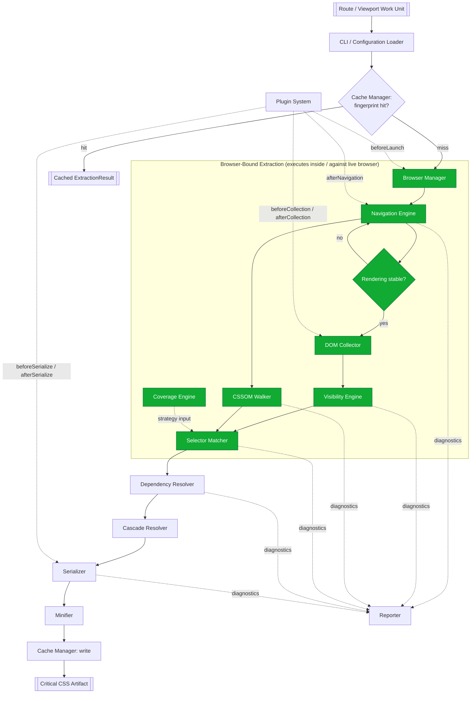
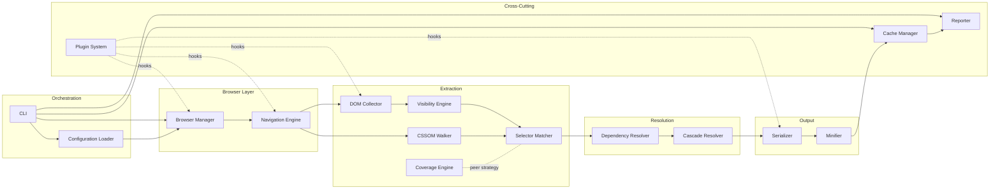

# 010 — System Overview

## 1. Title

**Critical CSS Extraction Engine — System Overview**

## 2. Version

| Field | Value |
|---|---|
| Document Version | 1.0.0 |
| Status | Accepted |
| Last Updated | 2026-07-09 |
| Owners | Core Architecture Working Group |
| Stability | Stable (Phase 2 architecture foundation; changes require RFC + ADR) |

## 3. Purpose

This document is the single artifact a new engineer, or an autonomous coding agent beginning implementation, should read first to build an accurate end-to-end mental model of the Critical CSS Extraction Engine before descending into any subsystem design document. It exists to answer one question precisely: *how do the fifteen-plus modules enumerated in the brief's Section 2.4, and formalized as ten packages in [007-Repository-Structure.md](007-Repository-Structure.md), compose into a single working system that turns a URL and a viewport profile into a critical CSS artifact?*

Every other Phase 2 document — [011-Execution-Pipeline.md](011-Execution-Pipeline.md), [012-Module-Interaction.md](012-Module-Interaction.md), [013-Component-Diagram.md](013-Component-Diagram.md), [014-Dependency-Graph.md](014-Dependency-Graph.md), [015-Runtime-Model.md](015-Runtime-Model.md), and [016-Data-Flow.md](016-Data-Flow.md) — assumes the reader already has the pipeline shape and module taxonomy established here. This document deliberately trades depth for breadth: it names every stage, states its typed input and output, and shows how control and data move between stages, but defers algorithmic detail to the execution-pipeline document and defers exhaustive interface signatures to the module-interaction and component documents. Where this document and a more detailed downstream document appear to disagree, the downstream document is authoritative for its subsystem and this document should be corrected via PR, since drift here is the single highest-cost documentation defect in the repository — everything else cites it.

## 4. Audience

- Newly onboarding engineers and autonomous coding agents who need an end-to-end map before touching any single package.
- Reviewers evaluating whether a proposed module change respects established stage boundaries and typed contracts.
- SSR integration authors and CI/CD platform engineers who need to understand which stages execute at build time versus request time, and where their integration point sits in the pipeline.
- Authors of the six sibling Phase 2 documents, who should treat this document's stage names, module names, and diagram conventions as canonical vocabulary to avoid drift across the architecture set.

Readers are assumed to have already read [001-Vision.md](001-Vision.md), [003-Requirements.md](003-Requirements.md), [006-Design-Principles.md](006-Design-Principles.md), and [007-Repository-Structure.md](007-Repository-Structure.md). This document does not re-derive *why* the browser is the source of truth, or *why* selector matching is delegated to `Element.matches()` — it assumes that reasoning as settled and shows only *where* those commitments manifest in the running system.

## 5. Prerequisites

Before reading further, confirm familiarity with:

- The module responsibility table in [001-Vision.md](001-Vision.md) Section 9 and [003-Requirements.md](003-Requirements.md) Section 8.1 (the fifteen-plus modules and their requirement domains).
- The eight design principles in [006-Design-Principles.md](006-Design-Principles.md), especially Principle 1 (Browser Is Source of Truth), Principle 4 (Pluggable Strategy Architecture), and Principle 5 (Determinism of Output), all three of which shape this document's stage boundaries directly.
- The package-level dependency graph in [007-Repository-Structure.md](007-Repository-Structure.md) Section "Dependency Graph," which this document's component diagram restates from a runtime-composition perspective rather than a build-dependency perspective.
- Basic familiarity with the CSSOM, `Element.matches()`, and the Chrome DevTools Protocol Coverage domain, as established in [001-Vision.md](001-Vision.md) Section 5.

## 6. Related Documents

- [001-Vision.md](001-Vision.md) — why the system exists and why it is browser-driven.
- [003-Requirements.md](003-Requirements.md) — the requirements catalog this system satisfies, with module traceability.
- [006-Design-Principles.md](006-Design-Principles.md) — the eight non-negotiable principles this overview's stage boundaries encode.
- [007-Repository-Structure.md](007-Repository-Structure.md) — the physical package layout this document's runtime view is built on top of.
- [011-Execution-Pipeline.md](011-Execution-Pipeline.md) — the precise, single-invocation state machine this document's pipeline diagram summarizes at a higher level.
- [012-Module-Interaction.md](012-Module-Interaction.md) — detailed inter-module call contracts and sequencing for each stage boundary introduced here.
- [013-Component-Diagram.md](013-Component-Diagram.md) — a deeper structural (class/interface-level) decomposition of each component grouping introduced in this document's Architecture section.
- [014-Dependency-Graph.md](014-Dependency-Graph.md) — the CSS-level dependency graph (variables, keyframes, fonts, layers) produced by the Dependency Resolver stage, as distinct from the package build-dependency graph in [007-Repository-Structure.md](007-Repository-Structure.md).
- [015-Runtime-Model.md](015-Runtime-Model.md) — process, thread, and browser-context lifecycle model underlying the Browser Manager stage.
- [016-Data-Flow.md](016-Data-Flow.md) — the typed DTO flow through every stage boundary, elaborating the "typed inputs/outputs" claim made throughout this document.

## 7. Overview

The Engine is best understood as a **linear pipeline with two cross-cutting strategy inputs and three cross-cutting infrastructure concerns**, not as a graph of loosely coupled services. For a single route and a single viewport profile, twelve ordered stages transform a route identifier into a critical CSS artifact:

```
CLI/Config Loader → Browser Manager → Navigation Engine → DOM Collector →
Visibility Engine → CSSOM Walker → Selector Matcher → Dependency Resolver →
Cascade Resolver → Serializer → Minifier → Cache Manager
```

Three modules do not sit on this line but touch it at defined seams: the **Coverage Engine** is a peer data source to the CSSOM Walker/Selector Matcher pair, consumed by the Hybrid extraction strategy (per Principle 4 in [006-Design-Principles.md](006-Design-Principles.md)); the **Reporter** is a terminal consumer of diagnostics emitted at every stage boundary, not a stage itself; and the **Plugin System** exposes six lifecycle hooks (`beforeLaunch`, `afterNavigation`, `beforeCollection`, `afterCollection`, `beforeSerialize`, `afterSerialize`) that interleave with the linear pipeline without becoming part of its dependency graph.

This shape is a direct consequence of decisions made in prior documents, not a fresh architectural choice made here:

- The linear ordering mirrors the natural data dependency of the problem — you cannot match selectors before you have both a rule tree (CSSOM Walker) and a candidate element set (Visibility Engine, which itself depends on the DOM Collector's snapshot), and you cannot resolve cascade order before you know which rules matched. [006-Design-Principles.md](006-Design-Principles.md) Principle 1 forces every one of the first seven stages after Navigation to either execute inside, or query, the live browser context — this is why the Mermaid diagram below shades that entire span as "browser layer."
- The Coverage Engine's peer (not sequential) relationship to CSSOM Walker/Selector Matcher is the runtime manifestation of the `packages/matcher` / `packages/coverage` non-dependency invariant established in [007-Repository-Structure.md](007-Repository-Structure.md) — two packages that must never import each other, because Principle 4 treats them as interchangeable strategy implementations.
- The Cache Manager appears at the *end* of the stage list in the per-invocation pipeline, but architecturally it also sits in *front of* the entire pipeline as a short-circuit gate — an invocation that hits the cache never instantiates a Browser Manager at all. This dual position (gate at entry, writer at exit) is elaborated fully in [011-Execution-Pipeline.md](011-Execution-Pipeline.md); this document's job is only to flag that the linear stage list above describes the cache-miss path, not the only path.

The remainder of this document works through each of the twelve pipeline stages plus the three cross-cutting concerns, states each stage's typed input/output contract, and then presents two diagrams: a top-level pipeline flowchart (control and data flow for one extraction) and a component diagram grouping every module by architectural concern (orchestration, browser layer, extraction, resolution, output, cross-cutting).

## 8. Detailed Design

### 8.1 Stage 1 — CLI / Configuration Loader

**Responsibility.** Parse CLI arguments or accept a programmatic invocation (for SSR integration, per REQ-400 in [003-Requirements.md](003-Requirements.md)); resolve configuration from file, CLI flags, and environment in a defined precedence order; expand the route manifest (Section 2.9 of the brief) into a concrete list of `(route, viewportProfile, extractionMode)` work units; validate the resolved configuration against a schema before any browser is launched.

**Typed input.** `RawInvocation` — CLI argv, or a `EngineInvocationOptions` object for programmatic callers (SSR adapters).

**Typed output.** `ResolvedConfig` (validated, fully defaulted configuration) plus a `WorkUnit[]` list, each `WorkUnit` carrying `{ route, viewportProfile, extractionMode, fingerprint: undefined }` — the fingerprint field is intentionally unpopulated at this stage; it is computed by the Cache Manager, not the Configuration Loader, keeping fingerprinting logic in one place (Principle 8 in [006-Design-Principles.md](006-Design-Principles.md)).

**Why this stage exists as a distinct boundary, not inlined into the CLI's `main()`.** Configuration resolution has three independent sources (file, flag, env) with a merge policy that must be unit-testable without invoking a browser at all — collapsing it into `main()` would force every configuration test to be an integration test. The alternative considered was folding configuration resolution directly into each SSR adapter's own bootstrap code, duplicating precedence logic per adapter; this was rejected because [007-Repository-Structure.md](007-Repository-Structure.md) explicitly reserves the Configuration Loader's promotion to `packages/shared` or a dedicated `packages/config` once a second consumer needs it — keeping it as a clean, separately testable unit inside `apps/cli` now makes that future extraction mechanical rather than a rewrite.

### 8.2 Stage 2 — Browser Manager

**Responsibility.** Own the Playwright browser process/context pool lifecycle: launch, warm, health-check, and recycle browser instances; hand out an isolated `BrowserContext` per work unit (never a shared context across routes, to prevent cross-route CSSOM/cookie contamination); enforce configured concurrency limits and per-operation timeouts (REQ-554).

**Typed input.** `ResolvedConfig.browserOptions` (engine choice, headless flag, concurrency limit, launch args) plus a request for one context matching a given `ViewportProfile`.

**Typed output.** A `PageHandle` — an internal abstraction wrapping a live Playwright `Page` plus a CDP session handle (needed later by the Coverage Engine), scoped to the lifetime of one work unit's extraction.

**Why a pool, not a fresh launch per route.** [001-Vision.md](001-Vision.md) Section 8.3 names browser launch latency as an explicitly accepted cost of the "browser as source of truth" commitment; the Browser Manager's entire reason to exist as its own stage (rather than being inlined into Navigation) is to amortize that cost across many work units via reuse, which is the primary lever named in [001-Vision.md](001-Vision.md) Section 14 for making a correctness-first architecture practically fast. The alternative — a fresh `launch()` per route — was rejected outright; it is correct but multiplies the single largest cost center in the system by the route count with no mitigation, which [003-Requirements.md](003-Requirements.md) REQ-553 (enterprise CI suitability) treats as disqualifying at scale.

### 8.3 Stage 3 — Navigation Engine

**Responsibility.** Drive the acquired `PageHandle` to the target route (`page.goto` or equivalent) and then to an *application-defined or heuristically-detected stability point* — the point at which hydration, client-side routing, and CSS-in-JS runtime injection have settled, per [001-Vision.md](001-Vision.md) Section 8.1 item 4. This stage owns rendering-stabilization strategy selection (network-idle, custom `window.__CRITICAL_CSS_READY__` signal, `requestAnimationFrame` settle count, or a configurable composite).

**Typed input.** `PageHandle`, `route: string`, `StabilizationPolicy` (from `ResolvedConfig`).

**Typed output.** `StablePage` — a `PageHandle` refined with a proof-of-stability marker (a timestamp and the policy that was satisfied), consumed by every subsequent browser-layer stage. Emits `NavigationDiagnostic` events (timeouts, redirect chains, console errors observed during navigation) to the Reporter regardless of success/failure.

**Why stabilization is a distinct, configurable stage rather than a fixed wait.** [001-Vision.md](001-Vision.md) Section 8.1 explicitly forbids assuming Playwright's default `load`/`networkidle` events are sufficient for JavaScript-heavy applications. Making stabilization a first-class, swappable policy (rather than a hardcoded `waitForTimeout(N)`) is the only design that satisfies both correctness (REQ-100's visibility determination requires a settled DOM) and the requirement that the engine be configurable per target application, since no single heuristic is universally sufficient — this exact tradeoff is elaborated further in the forthcoming `104-Rendering-Stabilization.md` (Phase 3).

### 8.4 Stage 4 — DOM Collector

**Responsibility.** Enumerate every DOM node reachable from `document`, including open (and where policy allows, closed) Shadow DOM subtrees (REQ-009), producing a flat, stable-ordered node list annotated with tag name, attributes needed for later diagnostics, and a handle usable for subsequent in-page queries.

**Typed input.** `StablePage`.

**Typed output.** `DomSnapshot` — `{ nodes: NodeRecord[], shadowRoots: ShadowRootRecord[] }`, where each `NodeRecord` carries a stable synthetic index (assigned in document order) used later by the Serializer's canonical-ordering algorithm (see [006-Design-Principles.md](006-Design-Principles.md) Algorithms section) as a defensive tiebreak.

**Why enumeration is separated from visibility classification (the next stage), rather than fused into one query.** A single fused "enumerate and classify" pass was considered and rejected: it would force every future consumer that only needs the raw node set (e.g., a future diagnostic visualization tool, per Roadmap Phase 5) to also pay for, and depend on, visibility-classification logic. Separating collection from classification also lets the Visibility Engine be independently swapped (e.g., IntersectionObserver-assisted mode, REQ-107) without touching collection at all.

### 8.5 Stage 5 — Visibility Engine

**Responsibility.** Classify each `NodeRecord` from the `DomSnapshot` as above-fold-visible or not, using live geometry (`getBoundingClientRect()`), computed `display`/`visibility`/`opacity`, overflow and transform handling, and fixed/sticky-element special-casing (REQ-109), per the configurable policy in REQ-100–REQ-110.

**Typed input.** `DomSnapshot`, `ViewportProfile` (fold offset, width, height, DPR).

**Typed output.** `VisibilitySet` — `{ criticalNodes: NodeHandle[], excludedNodes: NodeHandle[], diagnostics: VisibilityDiagnostic[] }`.

**Why visibility classification happens entirely in-browser rather than being computed from serialized geometry in the host process.** Serializing every node's bounding rect to the host process and computing fold-intersection in Node.js was considered as a way to reduce `page.evaluate()` round-trip count. It was rejected because it does not reduce round-trips meaningfully (the geometry itself must still be queried in-page) and it reintroduces a host-side re-implementation of "is this visible," which [006-Design-Principles.md](006-Design-Principles.md) Principle 1 forbids for any decisional computation, not merely for selector matching — visibility is exactly the kind of decisional computation Principle 1 exists to keep inside the browser.

### 8.6 Stage 6 — CSSOM Walker

**Responsibility.** Traverse `document.styleSheets` and all reachable descendants — `@import`-linked sheets, Constructable Stylesheets adopted via `adoptedStyleSheets` at document and shadow-root scope (REQ-008), and every `CSSRule` subtype (style rules, media rules, supports rules, layer block/statement rules, keyframes, font-face, property, counter-style) — producing a browser-normalized rule tree. Degrades gracefully (REQ-007) on cross-origin `SecurityError`.

**Typed input.** `StablePage` (executes independently of, and in parallel with, the Visibility Engine's pass over `DomSnapshot`, since CSSOM traversal does not depend on DOM node classification).

**Typed output.** `RuleTree` — a normalized, index-stable representation of every reachable `CSSRule`, annotated with `sourceStylesheetIndex`/`sourceRuleIndex` (the same indices consumed by the Serializer's canonical-ordering algorithm), plus `CssomDiagnostic[]` for skipped/inaccessible sheets.

**Why the CSSOM Walker runs against the browser's parsed representation rather than re-parsing source `.css` files.** This is Principle 1's most direct instantiation and is elaborated exhaustively in [001-Vision.md](001-Vision.md) Section 8.1 item 3; it is restated here only to anchor it as a pipeline stage with a concrete typed contract. The alternative (fetch and parse raw `.css` text via PostCSS as a primary strategy) was the founding non-goal of the entire project (brief Section 2.2) and is not re-litigated per document.

### 8.7 Stage 7 — Selector Matcher

**Responsibility.** For each `CSSStyleRule` in the `RuleTree` and each `NodeHandle` in `VisibilitySet.criticalNodes`, determine whether the rule's selector matches the node, using `Element.matches()` executed in-page, batched into as few `page.evaluate()` round trips as possible (per the algorithm in [001-Vision.md](001-Vision.md) Section 10) and memoized per selector text within the run (REQ-510).

**Typed input.** `RuleTree`, `VisibilitySet`.

**Typed output.** `MatchedRuleSet` — `{ matched: MatchedRule[], unmatched: UnmatchedRule[] }`, where `MatchedRule` additionally records *which* strategy (CSSOM, Coverage, or both, in Hybrid mode — REQ-154) determined the match.

**Why the Coverage Engine is not a preceding or following stage in this list but a peer strategy input here.** Per [006-Design-Principles.md](006-Design-Principles.md) Principle 4 and [007-Repository-Structure.md](007-Repository-Structure.md)'s explicit non-dependency invariant between `packages/matcher` and `packages/coverage`, Hybrid mode invokes both the Selector Matcher and the Coverage Engine independently and reconciles their `MatchedRuleSet`/`CoverageResult` outputs at this seam, rather than the Coverage Engine feeding the Selector Matcher or vice versa. This is why Section 8 of the Architecture diagram below shows Coverage Engine as a side input into this stage rather than an earlier or later stage in the main spine.

### 8.8 Stage 8 — Dependency Resolver

**Responsibility.** Given `MatchedRuleSet`, iteratively resolve every referenced CSS variable, `@keyframes`, `@font-face` (with fallback chains, REQ-203), `@property`, `@counter-style`, `@layer`, `@supports`, media/container query, view transition, and scroll timeline dependency to a fixed point (REQ-200–REQ-205), detecting and terminating cycles deterministically (REQ-202).

**Typed input.** `MatchedRuleSet`, `RuleTree` (needed to look up at-rule definitions referenced by matched rules but not themselves style rules).

**Typed output.** `DependencyGraph` — a directed graph of `MatchedRule` and `Dependency` nodes, plus `ResolvedDependencySet` (the flattened, deduplicated set of at-rules that must accompany the matched rules in the final output), and `DependencyDiagnostic[]` for unresolved/cyclic cases. Full graph structure and construction algorithm are specified in [014-Dependency-Graph.md](014-Dependency-Graph.md).

**Why resolution is iterative-to-fixed-point rather than single-pass.** A single pass over matched rules' direct dependencies would miss transitive cases — e.g., a custom property whose value references another custom property, or a `@keyframes` rule whose declarations reference a variable defined in a different cascade layer. [003-Requirements.md](003-Requirements.md) REQ-201 makes fixed-point iteration a Must requirement precisely because single-pass resolution was the failure mode observed informally in ad hoc static tools' variable handling; this document treats that as settled and only restates the pipeline-position consequence: the Dependency Resolver stage's runtime cost is not bounded by rule count alone but by graph diameter, discussed further in Section 10 below.

### 8.9 Stage 9 — Cascade Resolver

**Responsibility.** Determine, for every matched rule and every property it declares, whether it survives cascade competition against other matched rules applying to the same element — resolving origin, specificity, source order, and cascade-layer order (REQ-003, REQ-005) using browser-observed layer ordering rather than hand-computed `@layer` declaration-order arithmetic (per [001-Vision.md](001-Vision.md) Section 11's implementation-notes constraint).

**Typed input.** `MatchedRuleSet`, `ResolvedDependencySet` (layer membership and `@supports` results feed cascade decisions).

**Typed output.** `CascadeResolvedRuleSet` — the subset of `MatchedRuleSet` (plus required dependency rules) that must be retained in the final output, each annotated with resolved specificity/layer-order metadata used by the Serializer for canonical ordering.

**Why Cascade Resolution is a distinct stage from Dependency Resolution despite both being conceptually "graph-shaped" problems, and why they are nonetheless bundled into one package.** [007-Repository-Structure.md](007-Repository-Structure.md) bundles the Cascade Resolver into `packages/dependency-graph` alongside the Dependency Resolver because `@layer` ordering is itself a dependency-graph-shaped concern (a rule's effective priority depends on which layer it is declared in, which is a form of dependency on layer-declaration order). This document preserves that packaging decision but keeps the two as separate *pipeline stages* because their typed outputs are semantically distinct: the Dependency Resolver answers "what else must be included," while the Cascade Resolver answers "which declarations actually win," and conflating the two stage contracts would make the Serializer's input ambiguous about which concern a given diagnostic belongs to.

### 8.10 Stage 10 — Serializer

**Responsibility.** Apply the canonical-ordering algorithm (specified in [006-Design-Principles.md](006-Design-Principles.md) Algorithms section) to `CascadeResolvedRuleSet`, deduplicate structurally identical rules (REQ-251) without reordering semantically significant declarations, merge per-viewport outputs when multiple viewport profiles were processed in one invocation (REQ-106), and emit a deterministic, unminified CSS text artifact plus a source-mappable rule manifest.

**Typed input.** `CascadeResolvedRuleSet` (one per viewport profile, if multiple were requested), `ResolvedDependencySet`.

**Typed output.** `SerializedOutput` — `{ css: string, ruleManifest: RuleManifestEntry[], viewportMergeReport: MergeReport }`.

**Why determinism is the Serializer's responsibility, not an emergent property of upstream stages.** [006-Design-Principles.md](006-Design-Principles.md) Principle 5 explicitly assigns canonicalization to the Serializer as "the single point through which all extraction strategies' results must pass," precisely because upstream stages (especially parallelized stylesheet traversal in the CSSOM Walker) are permitted to complete in a non-deterministic order for performance reasons — determinism must be re-imposed once, at the narrowest possible seam, rather than defended at every stage.

### 8.11 Stage 11 — Minifier

**Responsibility.** Given `SerializedOutput.css`, produce a compressed variant (whitespace removal, shorthand-safe compaction) when configured, as a strictly separable, optional stage (REQ-252).

**Typed input.** `SerializedOutput`.

**Typed output.** `MinifiedOutput` — `{ css: string, sizeBytes: number }`, alongside the unminified `SerializedOutput.css` retained for diagnostics/debugging regardless of whether minification is enabled.

**Why Minifier is a separate stage from the Serializer rather than a Serializer option flag.** REQ-252 requires minification to be "separable," and [007-Repository-Structure.md](007-Repository-Structure.md)'s package table lists Minifier as a distinct Section 2.4 module bundled into `packages/serializer`. Keeping it a distinct *pipeline stage* (even though co-packaged) matters because it is the natural seam for future output-format stages (e.g., a future source-map emission stage per Phase 8's `605-Source-Maps.md`) to attach without perturbing the Serializer's own canonicalization contract.

### 8.12 Stage 12 — Cache Manager

**Responsibility.** Compute the input fingerprint (per the algorithm in [006-Design-Principles.md](006-Design-Principles.md)) either before Stage 2 (as a gate) or, on a cache miss, store the final `MinifiedOutput`/`SerializedOutput` pair keyed by that fingerprint after Stage 11 completes.

**Typed input (gate position).** `WorkUnit` (route, viewport, mode) plus resolved HTML/CSS asset content needed for fingerprinting.
**Typed output (gate position).** `CacheLookupResult` — either `{ hit: true, result: ExtractionResult }` (short-circuiting the rest of the pipeline entirely) or `{ hit: false, fingerprint: string }` (passed through to the write position).

**Typed input (write position).** `fingerprint`, `SerializedOutput`, `MinifiedOutput`, `DiagnosticBundle`.
**Typed output (write position).** `CacheWriteAck`.

**Why the Cache Manager is listed last in the linear stage sequence yet described as a gate at the front.** This apparent contradiction is intentional and is the single most important structural fact in this document: the twelve-stage list in Section 7 describes data dependency order on the *cache-miss* path, but the Cache Manager's actual position in the control-flow graph is *outside* the browser-bound pipeline, consulted first. [011-Execution-Pipeline.md](011-Execution-Pipeline.md) models this precisely as a state machine with a cache-check state preceding browser acquisition; this document flags the distinction so no reader mistakes the linear list for a strict temporal order.

### 8.13 Cross-Cutting Concern — Coverage Engine

Not a pipeline stage; a peer strategy data source consumed at Stage 7 (Selector Matcher) under Coverage or Hybrid extraction mode (REQ-150–REQ-152), using the Chrome DevTools Protocol CSS Coverage domain via the CDP session handle carried on the `PageHandle` since Stage 2. See Section 8.7 above and [007-Repository-Structure.md](007-Repository-Structure.md)'s explicit non-dependency invariant with the Selector Matcher package.

### 8.14 Cross-Cutting Concern — Reporter

Not a pipeline stage; a diagnostics sink that every stage above emits typed `*Diagnostic` events into (REQ-460–REQ-465), assembling the dependency-graph report, matched/unmatched-selector report, per-stylesheet contribution report, timing report, and optional extraction trace. Architecturally the Reporter has no outgoing edges into the pipeline — it is a pure consumer, consistent with [007-Repository-Structure.md](007-Repository-Structure.md)'s dependency graph, where `packages/reporter` is a sink with in-degree from `packages/dependency-graph` and `packages/serializer` only.

### 8.15 Cross-Cutting Concern — Plugin System

Not a pipeline stage; six named lifecycle hooks (`beforeLaunch`, `afterNavigation`, `beforeCollection`, `afterCollection`, `beforeSerialize`, `afterSerialize` — REQ-470) interleaved between Stages 2/3, 3/4, 4/5, and 9/10 respectively. Plugins receive narrow, typed, immutable-by-default context objects per hook (Principle 7 in [006-Design-Principles.md](006-Design-Principles.md)) and return explicit decisions/patches rather than mutating shared pipeline state directly.

## 9. Architecture

### 9.1 Top-Level Pipeline Flowchart



This diagram is intentionally at a coarser grain than [011-Execution-Pipeline.md](011-Execution-Pipeline.md)'s sequence and state diagrams — it exists to fix vocabulary and stage boundaries, not to specify retry/error transitions, which belong to that document.

### 9.2 Component Diagram — Grouped by Architectural Concern



This grouping restates the same fifteen-plus modules from a *concern* axis rather than a *data-flow* axis, and is the view every subsequent Phase 2 document should reuse when describing where a given module sits conceptually — [013-Component-Diagram.md](013-Component-Diagram.md) elaborates each subgraph above into a full class/interface diagram; this document only establishes the grouping itself.

## 10. Algorithms

This document is an overview, not an algorithm specification — per [006-Design-Principles.md](006-Design-Principles.md), individual algorithms belong to module design docs and [../algorithms/](../algorithms/). However, one system-level algorithmic property must be stated here because it governs how the twelve stages compose, and every downstream document assumes it: **the pipeline is a strict DAG of typed transformations with no stage consuming a DTO it did not either receive as declared input or derive from one it received.**

**Problem statement.** Given the twelve-stage pipeline and its cross-cutting concerns, verify that stage composition is well-typed: every stage's declared input type is satisfiable purely from the outputs of stages that causally precede it (or from `ResolvedConfig`), with no hidden side-channel dependency.

**Inputs.** The stage table in Section 8 (each stage's typed input/output), and the flowchart edges in Section 9.1.

**Outputs.** A boolean "well-typed" result, or a list of edges whose target stage's declared input is not satisfiable from its declared predecessors.

**Pseudocode.**

```text
function verifyPipelineTyping(stages: StageSpec[], edges: Edge[]) -> TypingResult:
    producedTypes = { CFG: {ResolvedConfig, WorkUnit[]} }
    violations = []
    for stage in topologicalOrder(stages, edges):
        availableTypes = union(producedTypes[p] for p in predecessors(stage, edges))
        for requiredType in stage.inputTypes:
            if requiredType not in availableTypes:
                violations.append((stage.name, requiredType))
        producedTypes[stage.name] = stage.outputTypes
    return TypingResult(violations)
```

**Time complexity.** O(V + E) over the stage graph, where V is the stage count (fixed, ~12 plus 3 cross-cutting) and E the edge count (small, bounded); this is effectively constant at the system's current scale.

**Memory complexity.** O(V) to hold the `producedTypes` map across the topological walk.

**Failure cases.** A violation surfaces exactly the class of bug this document exists to prevent architecturally: a stage silently reaching into a non-adjacent stage's internal state (e.g., the Serializer reading raw DOM geometry directly instead of consuming `CascadeResolvedRuleSet`) rather than composing through declared DTOs. Such a violation is a Principle 1/Principle 4 consistency defect and, per [007-Repository-Structure.md](007-Repository-Structure.md)'s package-boundary enforcement, should also be unrepresentable at the package-dependency level, giving this check a second, independent enforcement surface.

**Optimization opportunities.** This check is currently a documentation-level manual review discipline (this section, plus [016-Data-Flow.md](016-Data-Flow.md)'s DTO catalog); a future CI lint could parse `packages/shared`'s exported DTO types and the actual call graph to verify this mechanically, mirroring the dependency-graph cycle-detection lint described in [007-Repository-Structure.md](007-Repository-Structure.md).

## 11. Implementation Notes

- Every stage boundary in Section 8 corresponds to a DTO defined once in `packages/shared`, per [007-Repository-Structure.md](007-Repository-Structure.md)'s Implementation Notes; implementers must not define a parallel, stage-local type for a DTO that crosses a package boundary, or the typing-verification discipline in Section 10 becomes unenforceable.
- The Browser Manager's `PageHandle` is the one object that legitimately threads through *most* browser-layer stages (Navigation Engine, DOM Collector, Visibility Engine, CSSOM Walker, Selector Matcher, Coverage Engine) rather than being narrowed at each boundary; this is a deliberate, documented exception to "narrow typed contracts per stage," justified because all of these stages fundamentally need live page access, and forcing a fresh handle type per stage would only add indirection without added safety. The Serializer, Minifier, and Cache Manager, by contrast, never receive a `PageHandle` — this is enforced by [007-Repository-Structure.md](007-Repository-Structure.md)'s package graph, where `packages/serializer` and `packages/cache` do not depend on `packages/browser`.
- Implementers adding a new extraction strategy (future roadmap item, e.g., `ComputedStyleMode` per Phase 9) should model it exactly like the Coverage Engine in this document: a peer input into Stage 7, never a new sequential stage inserted elsewhere in the spine, to preserve Principle 4.
- The Reporter's diagnostic-sink relationship to every stage (Section 8.14) should be implemented as a shared `DiagnosticSink` interface injected into each stage's execution context, not as direct imports of `packages/reporter` from every pipeline package — this preserves `packages/reporter`'s sink-only position in the build graph.

## 12. Edge Cases

- **Single-viewport vs. multi-viewport invocations.** The twelve-stage pipeline in Section 7 is described per `(route, viewport)` work unit; a multi-viewport invocation (REQ-104) runs the entire Browser-through-Cascade-Resolver span once per viewport profile and only *merges* at the Serializer (REQ-106) — the Serializer is the sole stage aware of "more than one viewport," and every earlier stage's contract is written as if only one viewport exists. Implementers must not leak multi-viewport awareness into earlier stages.
- **Coverage-only mode with no CSSOM matching.** When `extractionMode === 'coverage'`, Stage 7's `MatchedRuleSet` is produced entirely from `CoverageResult` translation rather than `Element.matches()` calls; the CSSOM Walker (Stage 6) still runs, because the Dependency Resolver (Stage 8) needs the `RuleTree` to look up at-rule definitions referenced by coverage-identified rules — CSSOM traversal is never skippable even in Coverage-only mode.
- **Cache hit mid-multi-route batch run.** In a batch invocation covering many routes, the Cache Manager's gate check happens per work unit, not once per batch; a batch can be a mix of cache hits and misses, and the Browser Manager pool must be sized for the worst case (all misses), not the expected case, since cache hit rate is data-dependent and not knowable at pool-sizing time.
- **Plugin hook failure mid-pipeline.** A plugin exception at, say, `afterCollection` must not corrupt the `DomSnapshot`/`VisibilitySet` handed to the Visibility Engine for other, unrelated routes running concurrently in the same batch — this is a direct consequence of Principle 7's isolation requirement and is why the Plugin System's hook invocation is modeled as a side-channel in Section 9.1's flowchart (dotted lines) rather than an inline stage that could block or corrupt the main data-flow edges.
- **Cross-origin CSSOM inaccessibility mid-walk.** If the CSSOM Walker (Stage 6) cannot access a subset of stylesheets, it must still produce a valid (partial) `RuleTree` plus diagnostics (REQ-007) — a partial CSSOM must never abort the entire pipeline, per Principle 6's fail-fast-but-attributable philosophy, which favors "loud partial success with diagnostics" over "silent full failure" for this specific, expected-to-occur case.
- **Shadow DOM traversal reaching a closed root the automation layer cannot enter.** Both the DOM Collector and CSSOM Walker must record this as a diagnosable exclusion (REQ-009's "Should," not "Must," priority reflects this genuine limitation) rather than silently omitting the subtree with no trace — this is the browser-layer analogue of the cross-origin case above.

## 13. Tradeoffs

| Decision | Why | Alternative Considered | Tradeoff Accepted |
|---|---|---|---|
| Twelve linear stages plus three cross-cutting concerns, rather than a single monolithic "extract()" function | Matches the natural data dependency of the problem; gives every subsequent design document (Phase 3–13) an unambiguous single-stage home | One large orchestrator function inlining all logic | More inter-stage typed-DTO overhead; mitigated by keeping DTOs in `packages/shared` (Section 11) |
| Coverage Engine modeled as a peer strategy input at Stage 7, not a sequential Stage 6.5 | Preserves the `packages/matcher`/`packages/coverage` non-dependency invariant from [007-Repository-Structure.md](007-Repository-Structure.md); keeps Hybrid mode a composition, not a special case | Sequential stage: CSSOM match, then Coverage-verify, then reconcile | Slightly more complex reconciliation logic at the Stage 7 seam versus a simple two-step pipeline |
| Cache Manager described as both a stage (Section 8.12) and a gate (Section 8.12's "why listed last") | Accurately reflects its dual runtime position without inventing a thirteenth pipeline stage just for the gate | Model cache-check as its own separate "Stage 0" | Slight documentation awkwardness (one module, two described positions) traded for not overstating the linear-pipeline metaphor's literalness |
| Cascade Resolver kept as a distinct pipeline stage despite being co-packaged with Dependency Resolver | Keeps "what must be included" and "what actually wins" as separately reasoned-about, separately diagnosable concerns | Merge into one "Resolution" stage | Slightly more stage-boundary bookkeeping for two concerns that share a package anyway |
| Plugin hooks modeled as dotted side-channel edges into the pipeline, not as inline stages | Preserves Principle 5 (determinism) and Principle 7 (sandboxing): plugin invocation must not become an unbounded, ordering-fragile pipeline stage | Model each hook as a full pipeline stage with its own typed contract | Plugin hooks are less visually prominent in the top-level diagram than their practical importance might suggest; mitigated by [012-Module-Interaction.md](012-Module-Interaction.md) giving them full sequence-diagram treatment |

## 14. Performance

- **CPU complexity.** The system-level cost profile is dominated by the browser-layer span (Stages 2–7), consistent with [001-Vision.md](001-Vision.md) Section 14's claim that per-unit-of-work cost is bounded by browser process overhead, not host-side computation; the Dependency Resolver (Stage 8) is the second-largest cost center at scale because fixed-point iteration's cost is bounded by dependency-graph diameter, not merely matched-rule count (see [014-Dependency-Graph.md](014-Dependency-Graph.md) for the precise bound).
- **Memory complexity.** Peak memory during a single work unit's extraction is dominated by the live `DomSnapshot`/`RuleTree` pair (proportional to page complexity) held simultaneously with the active `PageHandle`'s browser-process footprint; batch runs must bound concurrent work-unit count to avoid multiplying this footprint unboundedly (see [015-Runtime-Model.md](015-Runtime-Model.md) for concurrency-limit modeling).
- **Caching strategy.** The Cache Manager's gate position (Section 8.12) is the single highest-leverage performance mechanism in the system: a cache hit skips Stages 2–11 entirely, per [006-Design-Principles.md](006-Design-Principles.md) Principle 8 and [003-Requirements.md](003-Requirements.md) REQ-301.
- **Parallelization opportunities.** Independent work units (different routes, or different viewport profiles of the same route) are embarrassingly parallel across separate `PageHandle`s, bounded only by Browser Manager pool concurrency; within a single work unit, CSSOM traversal across independent stylesheets (Stage 6) is internally parallelizable per REQ-511, while stages with a single, sequential data dependency (DOM Collector → Visibility Engine → Selector Matcher) are not.
- **Incremental execution.** REQ-303's per-route, per-viewport cache granularity means an incremental CI run touches only the work units whose fingerprint changed; this document's stage list does not itself change under incremental execution — incrementality is entirely a Cache Manager gating property, not a pipeline-shape property.
- **Profiling guidance.** Per [001-Vision.md](001-Vision.md) Section 14, profiling effort should weight Navigation Engine wait time and `page.evaluate()` round-trip counts (Stages 3, 6, 7) over host-side CPU time in the Dependency Resolver/Serializer, which is comparatively cheap.
- **Scalability limits.** At the system level, wall-clock scalability is bounded first by Browser Manager pool concurrency (a single-machine ceiling) and second, at very large route counts, by the eventual need for the distributed-crawler mode named in the Roadmap Phase 5 and [007-Repository-Structure.md](007-Repository-Structure.md)'s `806-Distributed-Cache.md` future work — this document's twelve-stage pipeline is agnostic to single-machine-vs-distributed execution, which is a property that must be preserved as that future work lands.

## 15. Testing

- **Unit tests** exercise each stage's typed transformation in isolation using synthetic DTOs (e.g., feeding a hand-constructed `RuleTree` and `VisibilitySet` directly into the Selector Matcher's public API without a real browser), consistent with [006-Design-Principles.md](006-Design-Principles.md)'s testing philosophy for host-side logic.
- **Integration tests** run the full twelve-stage pipeline against real fixture pages (per the fixture catalog referenced in [007-Repository-Structure.md](007-Repository-Structure.md)) and assert on `SerializedOutput`/`MinifiedOutput` against golden snapshots, validating that the stage composition described in Section 8 holds end-to-end, not merely per-stage.
- **Visual tests** apply `MinifiedOutput.css` to a fixture's above-fold region and pixel-diff against the fully-styled render, validating REQ-501 (rendering parity) at the system level, as the ultimate arbiter that no stage boundary silently dropped a needed rule.
- **Stress tests** run the pipeline against `fixtures/enterprise-huge/` to validate that no stage exhibits worse-than-documented complexity (Section 10's typing-verification discipline plus each stage's own complexity bounds in its dedicated design document) as input size grows.
- **Regression tests** pin the twelve-stage/three-cross-cutting-concern shape itself: a structural test should assert that the module list in [003-Requirements.md](003-Requirements.md)'s traceability table and this document's Section 8 stage list stay in agreement, catching silent architectural drift between documents.
- **Benchmark tests** track per-stage timing (surfaced via the Reporter's timing report, REQ-463) across releases, so a regression introduced in, say, the Dependency Resolver's fixed-point iteration is attributable to a specific stage rather than an undifferentiated "extraction got slower."

## 16. Future Work

- **Formal DTO schema generation.** Generate the `packages/shared` DTO catalog referenced throughout this document as a machine-readable schema (JSON Schema or a TypeScript-to-schema exporter), enabling the typing-verification algorithm in Section 10 to run automatically in CI rather than as a documentation-review discipline.
- **Stage-level pluggability beyond extraction strategy.** Principle 4 currently scopes pluggability to the CSSOM/Coverage/Hybrid strategy seam at Stage 7; a future RFC could explore whether the Visibility Engine (Stage 5) should be similarly pluggable (e.g., a future IntersectionObserver-assisted mode per REQ-107 as a peer strategy rather than a configuration flag on the existing Visibility Engine), which would add a second cross-cutting strategy seam to this document's model.
- **Distributed execution model.** As flagged in Performance above, extending this single-machine pipeline description to a distributed-crawler topology (Roadmap Phase 5) will require this document to gain a companion "distributed system overview" or a revision that generalizes the Browser Manager's pool concept to a fleet-coordination concept — tracked as an open question for [../research/](../research/).
- **Visual/interactive pipeline debugger.** The `apps/visualizer` app (per [007-Repository-Structure.md](007-Repository-Structure.md)) is a natural consumer of exactly the stage-boundary diagnostics this document catalogs; a future design document should specify how the Reporter's per-stage diagnostic stream maps onto an interactive, stage-by-stage replay UI.
- **Open question: should the Minifier become a pluggable output-stage family (e.g., alternative compression backends) analogous to the extraction-strategy pluggability at Stage 7?** Currently Minifier is a single, configurable-on/off stage; as output-format requirements grow (source maps, alternative minifiers), this may warrant its own strategy interface, to be resolved via ADR once Phase 8 (`docs/design/600-Serialization-Overview.md` et seq.) is authored.

## 17. References

- [001-Vision.md](001-Vision.md)
- [003-Requirements.md](003-Requirements.md)
- [006-Design-Principles.md](006-Design-Principles.md)
- [007-Repository-Structure.md](007-Repository-Structure.md)
- [011-Execution-Pipeline.md](011-Execution-Pipeline.md)
- [012-Module-Interaction.md](012-Module-Interaction.md)
- [013-Component-Diagram.md](013-Component-Diagram.md)
- [014-Dependency-Graph.md](014-Dependency-Graph.md)
- [015-Runtime-Model.md](015-Runtime-Model.md)
- [016-Data-Flow.md](016-Data-Flow.md)
- W3C CSS Object Model (CSSOM) specification — https://www.w3.org/TR/cssom-1/
- W3C CSS Cascading and Inheritance Level 5 — https://www.w3.org/TR/css-cascade-5/
- Chrome DevTools Protocol, CSS and Profiler.Coverage domains — https://chromedevtools.github.io/devtools-protocol/
- Playwright documentation — https://playwright.dev/docs/intro
- Section 2.4 ("System Modules") and Section 2.19 ("Canonical Repository Layout") of the Documentation Agent Brief — `BRIEF.md` at repository root
