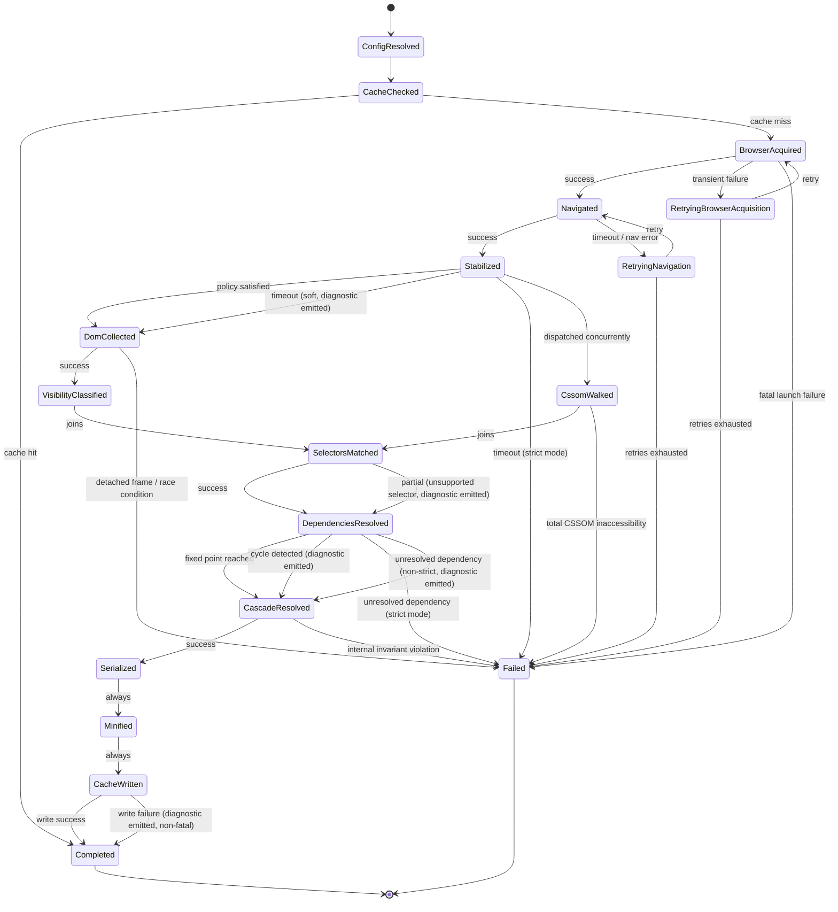

# 011 — Execution Pipeline

## 1. Title

**Critical CSS Extraction Engine — Execution Pipeline (Single Work-Unit State Machine)**

## 2. Version

| Field | Value |
|---|---|
| Document Version | 1.0.0 |
| Status | Accepted |
| Last Updated | 2026-07-09 |
| Owners | Core Architecture Working Group |
| Stability | Stable (Phase 2 architecture foundation; changes require RFC + ADR) |

## 3. Purpose

[010-System-Overview.md](010-System-Overview.md) establishes the twelve pipeline stages and their typed contracts at the level a new engineer needs to orient themselves. This document goes one level deeper: it specifies the **precise execution semantics** of a single `cli extract` invocation for one `(route, viewportProfile)` work unit, modeled as a state machine with explicit states, transitions, retry policy, and error/failure states — the level of detail an implementer needs to write the orchestration code in `apps/cli` correctly, and the level of detail a reviewer needs to determine whether a proposed change to error handling, retries, or timeout policy is consistent with the rest of the system.

Where [010-System-Overview.md](010-System-Overview.md) treats the Cache Manager's dual position (gate and writer) as a documented asymmetry to be aware of, this document resolves that asymmetry completely by placing the cache-check as the explicit first state of the machine. Where the system overview shows Plugin System hooks as dotted side-channel edges, this document places each hook invocation as a first-class transition with its own success/failure semantics. This document is deliberately narrower in scope than [010-System-Overview.md](010-System-Overview.md) — it describes one work unit's lifecycle exhaustively rather than the whole system's module taxonomy — and it is deliberately more exhaustive within that scope, because orchestration bugs (wrong retry policy, wrong error propagation, wrong timeout scoping) are exactly the class of defect that a state-machine specification is designed to make impossible to get subtly wrong.

## 4. Audience

- Implementers of `apps/cli`'s orchestration logic, who need the exact state transition table, not just the informal pipeline shape from [010-System-Overview.md](010-System-Overview.md).
- Implementers of SSR adapters (Phase 11 roadmap) invoking the engine's programmatic API at request time, who need to understand exactly which states can produce user-visible latency and which can fail in ways the adapter must handle gracefully.
- CI/CD platform engineers configuring retry, timeout, and fail-build policy (REQ-451–REQ-453), who need the precise state at which each failure mode is detected in order to wire the correct exit codes and diagnostics.
- Reviewers evaluating a proposed change to error handling, retry policy, or stage sequencing, who should use the state diagram in this document as the reference against which a proposed diff is checked for consistency.

Readers should already be comfortable with the twelve pipeline stages and module taxonomy from [010-System-Overview.md](010-System-Overview.md); this document does not re-explain what each module does, only how its invocation is sequenced, retried, and failed.

## 5. Prerequisites

- [010-System-Overview.md](010-System-Overview.md) — the pipeline stage list, typed DTOs, and module taxonomy this document sequences precisely.
- [006-Design-Principles.md](006-Design-Principles.md) Principle 6 (Fail-Fast Diagnostics) and Principle 8 (Incremental-by-Default Caching) — this document is, in large part, those two principles made mechanical.
- [003-Requirements.md](003-Requirements.md) REQ-450–REQ-465 (CI/CD pipeline and diagnostics requirements) and REQ-552–REQ-554 (timeout/headless operability requirements), which this document's retry/timeout states directly implement.
- Familiarity with finite state machine notation and Mermaid's `stateDiagram-v2` syntax.
- Familiarity with Playwright's page/context lifecycle and the Chrome DevTools Protocol session model, since several states below are directly scoped to Playwright/CDP operations.

## 6. Related Documents

- [010-System-Overview.md](010-System-Overview.md) — the pipeline stage taxonomy this document sequences into a state machine.
- [006-Design-Principles.md](006-Design-Principles.md) — Principles 3, 5, 6, and 8 are the direct sources of this document's retry-safety, determinism, diagnostics, and caching-gate design decisions.
- [003-Requirements.md](003-Requirements.md) — REQ-450–REQ-465 (CI/CD and diagnostics) and REQ-552–REQ-554 (enterprise operability) are the requirements this state machine satisfies.
- [007-Repository-Structure.md](007-Repository-Structure.md) — the `apps/cli` orchestration sequence diagram this document's sequence diagram extends with explicit state/error semantics.
- [012-Module-Interaction.md](012-Module-Interaction.md) — detailed per-stage call contracts (method signatures, error types) that this document's transitions invoke; this document specifies *when* and *in what order* those interactions occur, [012-Module-Interaction.md](012-Module-Interaction.md) specifies exactly *how*.
- [013-Component-Diagram.md](013-Component-Diagram.md) — structural decomposition of the components each state below invokes.
- [014-Dependency-Graph.md](014-Dependency-Graph.md) — detail on the Dependency Resolution state's internal fixed-point algorithm.
- [015-Runtime-Model.md](015-Runtime-Model.md) — the process/thread/browser-context model underlying the Browser Acquisition and Navigation states, including how this single-work-unit state machine is instantiated many times concurrently.
- [016-Data-Flow.md](016-Data-Flow.md) — the DTO catalog flowing through each transition below.

## 7. Overview

A single work unit's execution is modeled as a state machine with fourteen primary states plus three retry/error super-states, entered by the CLI (or a programmatic caller) upon dispatching one `WorkUnit`, and exited either by producing a `CriticalCssArtifact` or by terminating in a `Failed` state with an attributed `Diagnostic`. The states, in nominal (no-retry, no-error) execution order, are:

1. `ConfigResolved` — entry state, `ResolvedConfig` and `WorkUnit` available.
2. `CacheChecked` — fingerprint computed, lookup performed.
3. `BrowserAcquired` — a `PageHandle` obtained from the Browser Manager's pool.
4. `Navigated` — `page.goto` completed for the target route.
5. `Stabilized` — the configured `StabilizationPolicy` is satisfied.
6. `DomCollected` — `DomSnapshot` produced.
7. `VisibilityClassified` — `VisibilitySet` produced.
8. `CssomWalked` — `RuleTree` produced (this state's entry can race with, or precede, `DomCollected`/`VisibilityClassified`, since CSSOM traversal has no DOM dependency — see Section 9.2).
9. `SelectorsMatched` — `MatchedRuleSet` produced (waits on both `VisibilityClassified` and `CssomWalked`, and on `CoverageRecorded` if the mode is Coverage or Hybrid).
10. `DependenciesResolved` — `DependencyGraph`/`ResolvedDependencySet` produced, fixed point reached.
11. `CascadeResolved` — `CascadeResolvedRuleSet` produced.
12. `Serialized` — `SerializedOutput` produced.
13. `Minified` — `MinifiedOutput` produced (skipped, not failed, if minification is disabled — see Edge Cases).
14. `CacheWritten` — result persisted under its fingerprint; terminal success state, transitions to `Completed`.

Layered onto this nominal sequence are:

- **Plugin hook transitions**, occurring at four points (`beforeLaunch` before state 3, `afterNavigation` after state 5, `beforeCollection`/`afterCollection` bracketing state 6, `beforeSerialize`/`afterSerialize` bracketing state 12), each itself a sub-state with its own timeout and error-isolation semantics.
- **Retry super-states**, entered from `BrowserAcquired`, `Navigated`, and `Stabilized` on transient failure (browser crash, navigation timeout, stabilization timeout), governed by a bounded exponential backoff policy.
- **Diagnostic emission**, occurring as a side effect of every state transition (success or failure) into the Reporter's diagnostic stream, per Principle 6.
- **A single `Failed` terminal state**, reachable from any state on an unrecoverable error, always carrying an attributed `Diagnostic` and, in CI-strict mode (REQ-451–REQ-453), producing a nonzero process exit code once all work units in the batch have been attempted.

This document presents the pipeline in two complementary Mermaid views: a **sequence diagram** across the nine principal collaborating components (CLI, Cache Manager, Browser Manager, Navigation Engine, Collector, Matcher, Dependency Resolver/Serializer, Cache Manager write path), and a **state diagram** over the fourteen states plus retry/error super-states. The sequence diagram is the right tool for understanding *who calls whom and in what order*; the state diagram is the right tool for understanding *what can go wrong at each point and what happens next*. Both describe the same execution; neither subsumes the other.

## 8. Detailed Design

### 8.1 State: `ConfigResolved`

**Entry condition.** The CLI (or a programmatic `EngineInvocationOptions` caller) has produced a `ResolvedConfig` and expanded the route manifest into `WorkUnit[]`; this state is entered once per work unit as that unit is dispatched into the pipeline (batch dispatch may run many work units' state machines concurrently, bounded by Browser Manager pool concurrency — see [015-Runtime-Model.md](015-Runtime-Model.md)).

**Exit transition.** Unconditional transition to `CacheChecked` once the work unit's `route`, `viewportProfile`, and `extractionMode` are validated against the resolved config's schema. A schema validation failure here is not a pipeline failure in the `Failed`-state sense — it is rejected before entering the state machine at all, at CLI argument-parsing time, and is out of scope for this document (see [010-System-Overview.md](010-System-Overview.md) Section 8.1).

**Why this is a distinct state rather than pipeline-external setup.** Making `ConfigResolved` an explicit state (rather than treating configuration as a precondition outside the machine) lets the Reporter's timing report (REQ-463) attribute time spent in manifest expansion and validation separately from browser-bound time, which matters at CI scale when manifest expansion itself can be nontrivial for large wildcard route sets (REQ-352).

### 8.2 State: `CacheChecked`

**Entry condition.** From `ConfigResolved`. The Cache Manager computes the fingerprint (per the algorithm in [006-Design-Principles.md](006-Design-Principles.md)) over the work unit's resolved HTML/CSS asset content, viewport profile, extraction mode, and engine version, then performs a lookup.

**Exit transitions.**
- **Cache hit** → `Completed` directly, bypassing all of states 3–14 entirely. This is the short-circuit behavior flagged as an asymmetry in [010-System-Overview.md](010-System-Overview.md) Section 8.12, now made precise: a cache hit is a transition straight from `CacheChecked` to `Completed`, never touching `BrowserAcquired`.
- **Cache miss** → `BrowserAcquired` (via the Browser Acquisition sub-procedure, including the `beforeLaunch` plugin hook — Section 8.3).

**Why fingerprinting happens before any browser interaction, not after Navigation.** Fingerprinting only requires already-resolved HTML/CSS asset content, viewport profile, and mode — none of which require a live browser. Computing it earlier, before Browser Acquisition, is what makes the short-circuit possible at all; computing it after Navigation (as a hypothetical alternative, using the *rendered* page's content as the fingerprint basis) was considered and rejected specifically because it would defeat the entire performance purpose of caching per [001-Vision.md](001-Vision.md) Section 14 — the point is to *avoid* the cost of navigation on a hit, not to pay for navigation and then discover the result was cacheable.

### 8.3 State: `BrowserAcquired`

**Entry condition.** From `CacheChecked` (cache miss). The `beforeLaunch` plugin hook fires first (with a bounded timeout and isolated error handling per Principle 7), then the Browser Manager is asked for a `PageHandle` scoped to the work unit's `ViewportProfile`.

**Exit transitions.**
- **Success** → `Navigated`.
- **Transient failure** (pool exhaustion timeout, browser process crash during acquisition) → `RetryingBrowserAcquisition` super-state (Section 8.15).
- **Fatal failure** (browser engine fails to launch at all, e.g., missing OS dependency) → `Failed`, attributed as a launch-level diagnostic distinguishable from a per-route navigation failure.

**Why `beforeLaunch` fires before, not after, pool acquisition.** REQ-470 lists `beforeLaunch` first in hook order for exactly this reason: plugins that need to influence launch arguments (e.g., a plugin that injects custom Chromium flags for a specific test harness) must run before the Browser Manager commits to a concrete launch configuration, not after a context already exists.

### 8.4 State: `Navigated`

**Entry condition.** From `BrowserAcquired`. The Navigation Engine calls `page.goto(route)` (or the CLI's configured navigation primitive) against the acquired `PageHandle`, under a configurable, mandatory timeout (REQ-554).

**Exit transitions.**
- **Success** (navigation completes within timeout, no unhandled page-level exception) → `Stabilized` sub-procedure begins (the `afterNavigation` hook fires here — see Section 8.5).
- **Timeout or navigation error** (DNS failure, redirect loop, 5xx response depending on policy) → `RetryingNavigation` super-state (Section 8.15), bounded by a configurable retry count.
- **Repeated failure past retry budget** → `Failed`, attributed as a `NavigationDiagnostic` with the route, elapsed time, and last error observed.

**Why navigation failures are retried but launch failures generally are not.** Navigation failures are frequently transient (a flaky origin server, a momentary network blip) and retrying a `page.goto` against an already-acquired, already-warm `PageHandle` is cheap; browser *launch* failures are far more often structural (a missing shared library, an incompatible OS) and retrying them blindly wastes the CI pipeline's time budget on a failure mode retries cannot fix. This asymmetry is deliberate and documented here so a future contributor does not "fix" the apparent inconsistency by making launch failures retry-happy by default.

### 8.5 State: `Stabilized`

**Entry condition.** From `Navigated`, immediately after the `afterNavigation` plugin hook completes (or times out/errors in isolation, per Principle 7). The Navigation Engine applies the configured `StabilizationPolicy` (network-idle heuristic, custom application-signaled readiness, `requestAnimationFrame` settle count, or a composite) in a wait loop.

**Exit transitions.**
- **Policy satisfied within budget** → `DomCollected` sub-procedure begins (with the `beforeCollection` hook firing first).
- **Policy not satisfied within configured stabilization timeout** → this is treated as a *soft* failure by default: per REQ-108's "Should" priority on layout-shift-aware rescanning and [001-Vision.md](001-Vision.md) Section 8.1's acknowledgment that stability is an actively-detected, application-specific property, a stabilization timeout emits a `StabilizationTimeoutDiagnostic` and proceeds to `DomCollected` anyway using the best-available snapshot, **unless** `strictStabilization` is configured (a CI-oriented preset per Principle 6), in which case it transitions to `Failed`.
- This is the one state in the machine whose failure-handling policy is itself configurable between "proceed with a diagnostic" and "fail fast," and this is intentional — see Tradeoffs.

**Why stabilization timeout defaults to "proceed with a loud diagnostic" rather than "always fail."** A hard failure on every stabilization-timeout case would make the engine unusable against applications whose "settled" state is inherently fuzzy (e.g., a page with a genuinely continuous background animation that never triggers an idle-network signal). Principle 6 requires *loud* diagnostics, not necessarily *fatal* ones, when the ambiguity is inherent to the target rather than a bug in the engine; strict mode exists precisely so CI pipelines that want zero tolerance for this ambiguity can opt into treating it as fatal, per REQ-453.

### 8.6 State: `DomCollected`

**Entry condition.** From `Stabilized`, after the `beforeCollection` hook. The DOM Collector enumerates all reachable nodes (including accessible Shadow DOM subtrees) into a `DomSnapshot`.

**Exit transitions.**
- **Success** → `VisibilityClassified` (the `afterCollection` hook fires between `DomCollected` and `VisibilityClassified`).
- **Failure** (detached frame, page navigated away mid-collection — a known Playwright race condition class) → `Failed` directly; this failure class is *not* retried at this state, because retrying collection without first re-navigating and re-stabilizing would collect against a now-inconsistent page state, violating Principle 5's determinism guarantee. A full work-unit-level retry (re-entering from `BrowserAcquired` or even `ConfigResolved`) is the only correctness-preserving recovery, and is a CLI-level batch-retry policy decision, outside this per-work-unit state machine's own transitions (see Section 12 Edge Cases).

### 8.7 State: `VisibilityClassified`

**Entry condition.** From `DomCollected`, after `afterCollection`. The Visibility Engine classifies every node in `DomSnapshot` against the `ViewportProfile`'s fold boundary using live geometry.

**Exit transitions.** Unconditional success transition to `SelectorsMatched`'s wait-join (Section 8.9), since visibility classification over an already-collected, in-memory-referenced node set is not expected to fail in ordinary operation; any exception here (e.g., a detached-node access) is treated identically to a `DomCollected` failure — attributed and routed to `Failed` without in-state retry, for the same determinism reason.

### 8.8 State: `CssomWalked`

**Entry condition.** From `Navigated` (not from `Stabilized`/`DomCollected`) — the CSSOM Walker's traversal has no dependency on DOM collection or visibility classification, only on a navigated, stable page, so it is dispatched concurrently with the `Stabilized`→`DomCollected`→`VisibilityClassified` chain in implementations that choose to parallelize independent browser-side work. It waits on `Stabilized` (not raw `Navigated`) in the reference implementation, since stylesheet injection via CSS-in-JS runtime libraries is itself part of what "stabilization" waits for — walking the CSSOM before hydration-injected styles exist would silently under-collect.

**Exit transitions.**
- **Success** (including a partial success carrying `CssomDiagnostic[]` for cross-origin-inaccessible sheets, per REQ-007) → joins `SelectorsMatched`'s wait-join.
- **Total failure** (e.g., `document.styleSheets` itself throws, an exceptionally rare browser-level anomaly) → `Failed`.

**Why partial CSSOM access is success, not failure, at this state.** Per Principle 6 and REQ-007, a cross-origin `SecurityError` on an individual stylesheet is an expected, documented degradation, not a defect; escalating every such case to `Failed` would make the engine unusable against any page referencing third-party CDN stylesheets without matching CORS headers, which is common in production. The diagnostic is loud (attributed per-stylesheet) but the state machine proceeds.

### 8.9 State: `SelectorsMatched`

**Entry condition.** A **join** state: waits on `VisibilityClassified` and `CssomWalked` unconditionally, and additionally on a `CoverageRecorded` sub-procedure (not modeled as a numbered primary state above because it is a peer strategy input, per [010-System-Overview.md](010-System-Overview.md) Section 8.13) when `extractionMode` is `coverage` or `hybrid`. The Selector Matcher executes `Element.matches()` calls (batched, memoized) against the joined `VisibilitySet`/`RuleTree`, and, in Coverage/Hybrid mode, reconciles against `CoverageResult` per the documented precedence policy (REQ-152).

**Exit transitions.**
- **Success** → `DependenciesResolved`.
- **Partial failure** (e.g., a selector `matches()` call throws `SyntaxError` for an unsupported selector like an unimplemented `:has()` variant) → does **not** transition to `Failed`; it is recorded as an `UnsupportedSelectorDiagnostic` distinguishing "cannot evaluate" from "did not match" (per [006-Design-Principles.md](006-Design-Principles.md) Edge Cases), and the state machine proceeds with that selector excluded from `MatchedRuleSet` but flagged.
- **Reconciliation conflict in Hybrid mode** (CSSOM says matched, Coverage says never executed, or vice versa) is resolved per the documented precedence policy and recorded as a `StrategyDisagreementDiagnostic`, not a failure — Hybrid mode's entire purpose (per [ADR-0005](../adr/ADR-0005-Hybrid-Extraction-Mode.md)) is cross-verification, and a disagreement is exactly the signal it exists to surface, not an error condition.

### 8.10 State: `DependenciesResolved`

**Entry condition.** From `SelectorsMatched`. The Dependency Resolver iterates to a fixed point over `MatchedRuleSet` and `RuleTree`, per the algorithm detailed in [014-Dependency-Graph.md](014-Dependency-Graph.md).

**Exit transitions.**
- **Fixed point reached** → `CascadeResolved`.
- **Cycle detected** → not a failure; per REQ-202, cycle detection must terminate resolution deterministically, recorded as a `DependencyCycleDiagnostic`, with the cyclic dependency excluded (or resolved to a defined fallback, per the cycle-breaking policy in [014-Dependency-Graph.md](014-Dependency-Graph.md)) rather than looping indefinitely.
- **Unresolvable dependency** (a referenced custom property or `@font-face` that genuinely does not exist anywhere in the `RuleTree`) → recorded as an `UnresolvedDependencyDiagnostic` (REQ-503); this is a **CI-fatal** condition by default policy (REQ-452 mandates the *build*, not necessarily this per-work-unit state machine, fails), so this state transitions to `Failed` when `strictDependencies` policy is active (the default in CI presets), and proceeds with a downgraded/omitted rule under non-strict/local-development presets.

### 8.11 State: `CascadeResolved`

**Entry condition.** From `DependenciesResolved`. The Cascade Resolver determines, for the retained rule/dependency set, which declarations survive cascade competition, using browser-observed layer order.

**Exit transitions.** Unconditional success transition to `Serialized`; this stage operates on already-validated, already-joined data with no external I/O, so it is not expected to fail independently — any exception here is attributed and routed to `Failed` as an internal-invariant violation (a bug, not an expected runtime condition), consistent with treating it differently from the browser-I/O-bound states above.

### 8.12 State: `Serialized`

**Entry condition.** From `CascadeResolved`, after the `beforeSerialize` plugin hook. The Serializer applies canonical ordering and deduplication (per [006-Design-Principles.md](006-Design-Principles.md)) and, if this work unit is one of several viewport profiles for the same route being merged in one invocation, performs the viewport merge (REQ-106).

**Exit transitions.** Success → `Minified`, after the `afterSerialize` hook fires. No expected failure mode beyond internal-invariant violations, handled identically to `CascadeResolved`.

### 8.13 State: `Minified`

**Entry condition.** From `Serialized`. If minification is enabled in `ResolvedConfig`, the Minifier compresses `SerializedOutput.css`; if disabled, this state is entered and immediately exited with `MinifiedOutput` set to a pass-through of the unminified CSS (REQ-252's separability means "disabled" is a no-op transition, not a skip in the state-machine sense — the state is always visited so the Reporter's timing report has a consistent state list to report against).

**Exit transitions.** Unconditional success transition to `CacheWritten`.

### 8.14 State: `CacheWritten`

**Entry condition.** From `Minified`. The Cache Manager stores `SerializedOutput`/`MinifiedOutput` and the accumulated `DiagnosticBundle` under the fingerprint computed in `CacheChecked`.

**Exit transitions.** Unconditional transition to `Completed`. A cache-write failure (e.g., a distributed cache backend unreachable) is recorded as a `CacheWriteDiagnostic` but does **not** transition to `Failed` — the extraction itself succeeded and produced a valid artifact; failing to persist it for future reuse is a performance regression for subsequent runs, not a correctness failure for the current one, and per Principle 3 correctness must not be held hostage to an optimization's own failure.

### 8.15 Retry Super-States

Three states — `BrowserAcquired`, `Navigated`, and (conditionally) `Stabilized` — have an associated `Retrying*` super-state entered on transient failure. Retry policy is uniform in shape across all three:

- Bounded attempt count (configurable, default 3).
- Exponential backoff with jitter between attempts (default base 250ms, cap 4s).
- Each retry attempt re-enters the *same* state fresh (a retried `Navigated` re-runs `page.goto` against the same `PageHandle`, not a newly acquired one, unless the underlying browser context itself has crashed, in which case retry escalates one level to `BrowserAcquired`'s retry).
- Exhausting the retry budget transitions unconditionally to `Failed`, with a `RetryExhaustedDiagnostic` recording every attempt's individual failure reason.

**Why retries are scoped per-state rather than as a single outer "retry the whole work unit" wrapper.** A single outer retry (re-running the entire fourteen-state sequence from `ConfigResolved` on any failure) was considered and rejected: it would silently re-run the Cache Manager's fingerprint check redundantly, and worse, it would retry deterministic, non-transient failures (like an `UnresolvedDependencyDiagnostic`) exactly as eagerly as genuinely transient ones (a navigation timeout), wasting retry budget on failures no retry can fix. Per-state retry scoping, restricted specifically to the three states with I/O characteristics known to be flaky (browser process acquisition, network navigation, application-side stabilization signals), is the design that respects Principle 3's requirement that optimizations (here, retry-driven resilience) never mask or substitute for correctness — a dependency-resolution failure is a correctness signal and must not be retried away.

## 9. Architecture

### 9.1 Sequence Diagram — Single Work-Unit Extraction

```mermaid
sequenceDiagram
    participant CLI as CLI
    participant Cache as Cache Manager
    participant Browser as Browser Manager
    participant Nav as Navigation Engine
    participant Coll as Collector
    (DOM + Visibility + CSSOM)
    participant Match as Selector Matcher
    participant Cov as Coverage Engine
    participant Res as Dependency + Cascade Resolver
    participant Ser as Serializer
    participant CacheW as Cache Manager (write)

    CLI->>Cache: computeFingerprint(workUnit)
    alt cache hit
        Cache-->>CLI: cached ExtractionResult
    else cache miss
        CLI->>Browser: beforeLaunch hook, then acquire(viewportProfile)
        Browser-->>CLI: PageHandle
        CLI->>Nav: navigate(route)
        Nav->>Nav: afterNavigation hook
        Nav->>Nav: stabilize(policy)
        Nav-->>CLI: StablePage
        CLI->>Coll: beforeCollection hook, then collect()
        Coll->>Coll: enumerate DOM + classify visibility
        Coll->>Coll: walk CSSOM (parallel, joins later)
        Coll->>Coll: afterCollection hook
        Coll-->>CLI: DomSnapshot + VisibilitySet + RuleTree
        CLI->>Match: match(RuleTree, VisibilitySet)
        opt coverage or hybrid mode
            CLI->>Cov: record(PageHandle)
            Cov-->>Match: CoverageResult
        end
        Match-->>CLI: MatchedRuleSet
        CLI->>Res: resolveDependencies(MatchedRuleSet)
        Res->>Res: resolveCascade(ResolvedDependencySet)
        Res-->>CLI: CascadeResolvedRuleSet
        CLI->>Ser: beforeSerialize hook, then serialize()
        Ser->>Ser: minify() [if enabled]
        Ser->>Ser: afterSerialize hook
        Ser-->>CLI: SerializedOutput + MinifiedOutput
        CLI->>CacheW: write(fingerprint, output, diagnostics)
        CacheW-->>CLI: CacheWriteAck
    end
    CLI-->>CLI: emit CriticalCssArtifact + DiagnosticBundle
```

This diagram elaborates [007-Repository-Structure.md](007-Repository-Structure.md)'s `apps/cli` orchestration sequence diagram with explicit hook placement and the Collector's internal DOM/Visibility/CSSOM sub-sequencing, both of which that earlier document intentionally left implicit.

### 9.2 State Diagram — Pipeline Stage Transitions with Retry/Error States



Two properties of this diagram are load-bearing:

1. **`Failed` is reachable from a specific, enumerable set of states**, never from `CascadeResolved`, `Serialized`, `Minified`, or `CacheWritten` for anything other than an internal-invariant violation or the strict-mode dependency case. This is a direct encoding of Principle 3 — everything past `SelectorsMatched` operates on already-validated data, so failures there are bugs, not expected runtime conditions, and are treated with categorically different severity than browser-I/O failures earlier in the machine.
2. **Every transition into `Completed` other than the cache-hit shortcut passes through `CacheWritten`**, meaning a successful extraction is *always* persisted before being reported as complete (barring the non-fatal cache-write-failure case) — this is the state-machine-level guarantee that backs REQ-301's cache-reuse requirement for the *next* invocation.

## 10. Algorithms

### 10.1 Bounded Retry with Exponential Backoff and Jitter

**Problem statement.** Given a transient-failure-prone operation (browser acquisition, navigation) and a bounded retry budget, decide whether to retry, and if so, after what delay, such that retries neither overwhelm a struggling downstream resource (thundering-herd risk across many concurrently retrying work units) nor exceed a bounded total wall-clock cost per work unit.

**Inputs.** `attempt: number` (1-indexed), `maxAttempts: number` (config default 3), `baseDelayMs: number` (default 250), `capDelayMs: number` (default 4000).

**Outputs.** `shouldRetry: boolean`, and if true, `delayMs: number`.

**Pseudocode.**

```text
function retryDecision(attempt, maxAttempts, baseDelayMs, capDelayMs) -> RetryDecision:
    if attempt >= maxAttempts:
        return RetryDecision(shouldRetry=false)
    rawDelay = min(capDelayMs, baseDelayMs * 2^(attempt - 1))
    jitter = uniformRandom(0, rawDelay * 0.2)
    return RetryDecision(shouldRetry=true, delayMs=rawDelay + jitter)
```

**Time complexity.** O(1) per decision; total worst-case wall-clock cost across all retries for one state is bounded by `sum(min(cap, base*2^(i-1)) for i in 0..maxAttempts-1)`, a small constant (roughly base·(2^maxAttempts − 1) capped by `capDelayMs · maxAttempts`).

**Memory complexity.** O(1); no state beyond the attempt counter and the per-attempt failure reason list retained for the eventual `RetryExhaustedDiagnostic`.

**Failure cases.** If `maxAttempts` is misconfigured to 0, the function must still return `shouldRetry=false` on the first call rather than throwing, degrading to "no retry" rather than crashing the orchestrator; jitter must never be negative (guarded by `uniformRandom(0, ...)`'s lower bound) or backoff could degenerate to zero delay, defeating the thundering-herd mitigation.

**Optimization opportunities.** At batch scale (many concurrent work units retrying simultaneously against a shared, possibly resource-constrained Browser Manager pool), a future refinement could coordinate jitter across work units via a shared rate-limiter rather than independent per-work-unit randomization, to more tightly bound aggregate retry load — flagged in Future Work, not required for current scale per [003-Requirements.md](003-Requirements.md)'s enterprise-fitness requirements.

### 10.2 Fail-Fast Severity Classification

**Problem statement.** Given a `Diagnostic` emitted at some state transition, determine whether it should (a) be recorded and the state machine proceeds, (b) be recorded and the state machine transitions to `Failed`, with the answer depending on both the diagnostic's intrinsic class and the active policy preset (`strict` for CI, `lenient` for local development).

**Inputs.** `diagnostic: Diagnostic` (carrying a `class` field, e.g., `CrossOriginStylesheetSkipped`, `UnresolvedDependency`, `StabilizationTimeout`), `policy: SeverityPolicy` (a map from diagnostic class to `{proceed, fail}`).

**Outputs.** `Decision: 'proceed' | 'fail'`.

**Pseudocode.**

```text
function classifySeverity(diagnostic, policy) -> Decision:
    if diagnostic.class in policy.alwaysFail:
        return 'fail'
    if diagnostic.class in policy.alwaysProceed:
        return 'proceed'
    // default: consult the active preset's per-class table
    return policy.presetTable[diagnostic.class] or policy.defaultDecision
```

**Time complexity.** O(1) with a hash-map-backed policy table; independent of pipeline size.

**Memory complexity.** O(k) for the policy table, where k is the fixed, small number of diagnostic classes catalogued in [003-Requirements.md](003-Requirements.md) REQ-460–REQ-465's reporting requirements.

**Failure cases.** An unrecognized `diagnostic.class` (e.g., introduced by a plugin without registering its severity) must fall back to `policy.defaultDecision`, which per Principle 6 defaults to `'fail'` in strict/CI presets — an unknown diagnostic class is treated as maximally suspicious, not silently ignored, consistent with fail-fast philosophy; in lenient/local-development presets it defaults to `'proceed'` with a loud warning, to avoid blocking iterative local development on an unclassified plugin diagnostic.

**Optimization opportunities.** None needed at current scale; this is a lookup-table operation. A future machine-readable severity taxonomy (referenced in [003-Requirements.md](003-Requirements.md) Future Work) could let this policy table be generated from, and validated against, a shared schema rather than hand-maintained per preset.

## 11. Implementation Notes

- The state machine described here should be implemented as an explicit, inspectable state object (not an implicit `async`/`await` call chain with try/catch scattered through it), so that the Reporter's extraction trace (REQ-464) can serialize the exact state sequence, including retries, for offline debugging — this is a direct implementation consequence of treating the pipeline as a first-class state machine rather than an informal control-flow shape.
- Plugin hooks, though modeled as sub-transitions within their bracketing states (Sections 8.3–8.12), must be implemented with their own timeout budget distinct from the bracketing state's own timeout, so that a slow plugin cannot silently consume the navigation timeout's budget and produce a misleading `NavigationDiagnostic` when the actual cause was `afterNavigation` hook latency.
- The `CssomWalked` state's concurrency with the `DomCollected`→`VisibilityClassified` chain (Section 8.8) should be implemented as two independent async operations joined at `SelectorsMatched`'s entry, not as truly parallel execution if the underlying Playwright page context does not safely support concurrent `page.evaluate()` calls in the target browser engine — implementers should confirm this per-engine (see [ADR-0003](../adr/ADR-0003-Playwright-As-Browser-Abstraction.md)) before relying on true concurrency versus a safely interleaved async sequence that merely avoids blocking on unrelated I/O.
- Batch-level retry (re-running an entire work unit's state machine from `ConfigResolved`, as distinct from the per-state retries in Section 8.15) is a CLI-level policy, not a state within this machine; it should be implemented in `apps/cli` as "re-dispatch the same `WorkUnit` into a fresh state machine instance," and its own retry budget must be tracked separately from any individual state's retry budget to avoid multiplicative retry blowup (a work unit retried 3 times at the batch level, each hitting a state that itself retries 3 times, must not silently become 9 browser-acquisition attempts without that being an explicit, reviewed policy).

## 12. Edge Cases

- **`DomCollected` failure due to mid-collection navigation.** As noted in Section 8.6, this failure class deliberately does not retry in-state; recovering requires re-entering from `BrowserAcquired` (a fresh page) or even `ConfigResolved` at the batch-retry level, never a bare re-attempt of `collect()` against the same, now-inconsistent page — retrying in place would silently violate Principle 5's determinism guarantee by potentially collecting against a different page state than any single, coherent snapshot.
- **Cache hit for one viewport profile but not another, within a multi-viewport invocation.** Per [010-System-Overview.md](010-System-Overview.md) Section 12, multi-viewport invocations run independent per-viewport state machines that only converge at the Serializer's merge step; it is fully valid, and expected, for one viewport's work unit to short-circuit at `CacheChecked` while a sibling viewport's work unit runs the full machine — the merge step (REQ-106) must be implemented to accept a mix of freshly-computed and cache-retrieved `CascadeResolvedRuleSet`s without distinguishing their provenance in the merge logic itself.
- **Plugin hook throwing during a retry.** If a `beforeLaunch` hook throws on the *first* browser-acquisition attempt, causing a transient failure and a retry, the hook re-fires on each retry attempt (since `beforeLaunch` is bracketing that state, not a one-time entry action) — a plugin that is not idempotent under retries (e.g., one that increments an external counter as a side effect) will therefore fire multiple times; this is a documented plugin-authoring constraint (plugins must tolerate being invoked more than once per logical work unit) rather than a state-machine defect, and should be called out explicitly in the forthcoming Plugin SDK documentation (Phase 12).
- **`strictStabilization` and `strictDependencies` interacting.** A work unit could simultaneously hit a soft stabilization timeout (proceeding under lenient stabilization policy) and then, downstream, hit a hard dependency-resolution failure under strict dependency policy — these two policy flags are independently configurable and their interaction is intentional: an engineer might reasonably want tolerance for imperfect stabilization detection while still wanting zero tolerance for missing fonts/keyframes, and the state machine must not couple these two severity decisions.
- **Cache-write failure combined with process termination before the next scheduled write retry.** Since cache-write failure is non-fatal to the current work unit (Section 8.14), a batch run that is killed (CI job timeout) immediately after a cache-write failure will simply re-do that work unit's full extraction on the next run, which is correct but wasteful; this is accepted as a known, bounded cost rather than something this state machine needs to guard against with its own write-retry logic (write-retry, if desired, is a Cache Manager-internal concern per [007-Repository-Structure.md](007-Repository-Structure.md), not a pipeline-state-machine concern).
- **Coverage recording failure in Hybrid mode when the target browser/CDP session does not support the Coverage domain.** This must be surfaced as a `CoverageUnavailableDiagnostic` and Hybrid mode must gracefully degrade to CSSOM-only matching for that work unit (with the degradation itself loudly flagged, per Principle 6) rather than failing the entire work unit — the alternative (treating Coverage unavailability as fatal in Hybrid mode) would make Hybrid mode unusable on any Playwright-supported engine lacking full CDP Coverage support, which is too strict a coupling to the CSS engine's overarching goal of correctness without brittleness.

## 13. Tradeoffs

| Decision | Why | Alternative Considered | Tradeoff Accepted |
|---|---|---|---|
| Cache-check as the explicit first state, not a wrapper outside the state machine | Makes the short-circuit-to-`Completed` transition a first-class, diagnosable state transition rather than an implicit early return | Model caching as an orchestration-layer decision entirely outside any per-work-unit state machine | Slightly more state-machine complexity (an extra state and branch) in exchange for a single, complete model that the Reporter's trace can describe uniformly for both cache-hit and cache-miss runs |
| Per-state retry scoping (Section 8.15) rather than a single outer work-unit retry | Avoids retrying non-transient, correctness-signaling failures (dependency resolution, cascade) as eagerly as genuinely transient I/O failures | Single outer retry wrapping the whole fourteen-state sequence | More retry-policy code (three independent retry super-states) versus one; justified by Principle 3's ban on masking correctness failures with blind retries |
| Stabilization timeout defaults to soft/proceed rather than hard/fail | Keeps the engine usable against applications with inherently fuzzy "settled" signals | Always treat stabilization timeout as fatal | Risk of extracting against a marginally-under-stabilized page in lenient mode; mitigated by the loud diagnostic and the `strictStabilization` opt-in for CI pipelines that want zero tolerance |
| `CssomWalked` dispatched concurrently with the DOM/Visibility chain rather than strictly sequential after it | Reduces wall-clock latency per work unit, since CSSOM traversal has no data dependency on DOM collection | Strictly sequential: collect DOM, classify visibility, then walk CSSOM | Slightly more complex join logic at `SelectorsMatched`'s entry, and a per-engine verification burden (Implementation Notes) to confirm safe concurrent `page.evaluate()` usage |
| Cache-write failure treated as non-fatal to the current work unit | Correctness of the current extraction is independent of whether it can be persisted for future reuse | Treat any cache-write failure as fatal, forcing the whole work unit to fail | Accepts a "worked but not persisted" outcome silently degrading only *future* run performance, never current correctness — consistent with Principle 3 |

## 14. Performance

- **CPU complexity.** The state machine itself adds negligible CPU overhead (state transition bookkeeping is O(1) per transition, and there are a bounded, small number of states); the dominant cost remains the browser-bound states (`BrowserAcquired` through `SelectorsMatched`), exactly as characterized in [010-System-Overview.md](010-System-Overview.md) Section 14.
- **Memory complexity.** Each in-flight work unit's state machine instance holds references to its current-state DTO plus an accumulating `DiagnosticBundle`; at batch scale, memory is O(concurrent work units × per-unit snapshot size), bounded by the Browser Manager's concurrency limit (see [015-Runtime-Model.md](015-Runtime-Model.md)).
- **Caching strategy.** The `CacheChecked` state's short-circuit is the single largest lever on aggregate batch wall-clock time; its performance payoff is precisely "skip states 3–14 entirely," which at a typical 200ms–2s per-route-per-viewport browser-bound cost (per [001-Vision.md](001-Vision.md) Section 14) dominates any other single optimization available to the system.
- **Parallelization opportunities.** Independent work units' state machines run fully in parallel, bounded by pool concurrency; within one work unit, the `CssomWalked` / `DomCollected`-chain concurrency (Section 8.8) is the only intra-work-unit parallelism this document specifies — the remaining states are strictly sequential due to genuine data dependency (e.g., `SelectorsMatched` cannot begin before both its join predecessors complete).
- **Incremental execution.** This document's state machine is per-work-unit; incremental execution at the batch level is entirely a function of how many work units hit `CacheChecked`'s cache-hit branch, which is itself a function of the Cache Manager's fingerprinting granularity (REQ-303), not of anything in this document's transition logic.
- **Profiling guidance.** The Reporter's per-stage timing report (REQ-463) should attribute time to each *state*, not merely each *module*, since a single module (e.g., Navigation Engine) spans two states (`Navigated`, `Stabilized`) with meaningfully different performance characteristics and different retry policies — conflating them in a report would hide, for instance, a regression specifically in stabilization-wait time versus raw navigation time.
- **Scalability limits.** Retry super-states impose a bounded worst-case latency multiplier per work unit (Section 10.1's backoff sum); at very high batch concurrency, the aggregate retry load against a constrained Browser Manager pool is the practical scalability ceiling, motivating the future coordinated-jitter refinement noted in Section 10.1's Optimization Opportunities.

## 15. Testing

- **Unit tests** exercise the retry-decision (Section 10.1) and severity-classification (Section 10.2) algorithms directly with synthetic inputs, asserting exact backoff timing bounds and severity outcomes per policy preset, without any browser involvement.
- **Integration tests** drive the full state machine against real fixture pages under deliberately injected failure conditions — a fixture server configured to time out on the Nth navigation attempt, a fixture with an intentionally cyclic custom-property chain, a fixture referencing a genuinely cross-origin, CORS-blocked stylesheet — and assert the state machine reaches the expected terminal state (`Completed` with specific diagnostics, or `Failed` with a specific attributed diagnostic) under both strict and lenient policy presets.
- **Visual tests** are not directly applicable to state-transition correctness but remain the ultimate arbiter (per [010-System-Overview.md](010-System-Overview.md) Testing) that a `Completed` state's artifact is actually correct, not merely that the state machine terminated in the expected state.
- **Stress tests** run many concurrent work-unit state machines against `fixtures/enterprise-huge/` with artificially injected transient failures at a configured rate, validating that the retry super-states behave correctly under contention (no retry storms, bounded aggregate latency) rather than only in isolation.
- **Regression tests** pin the state diagram itself: a dedicated test should walk every documented transition in Section 9.2 and assert the implementation recognizes it (and rejects undocumented transitions), catching silent drift between this document and the orchestration code — this is the execution-pipeline analogue of [007-Repository-Structure.md](007-Repository-Structure.md)'s dependency-graph cycle-detection lint.
- **Benchmark tests** measure end-to-end wall-clock time per work unit under cache-hit versus cache-miss conditions, and under zero-retry versus worst-case-retry conditions, to keep the performance claims in Section 14 empirically grounded rather than purely asymptotic.

## 16. Future Work

- **Coordinated cross-work-unit retry jitter**, as flagged in Section 10.1, to bound aggregate retry load against a shared Browser Manager pool more tightly than independent per-work-unit randomization at very large batch concurrency.
- **Formal state-machine specification language.** This document's state diagram is authored by hand in Mermaid; a future refinement could define the state machine in a small formal DSL (e.g., XState-style configuration) that both generates the Mermaid diagram and *is* the executable orchestration logic, eliminating the drift risk named in the Testing section's regression-test discussion.
- **Configurable per-diagnostic-class retry eligibility**, generalizing Section 8.15's currently-fixed set of three retryable states to a policy-driven table (mirroring Section 10.2's severity-classification table), so that future states (e.g., a future Coverage-recording state, should it be promoted to a primary numbered state rather than a peer sub-procedure) can declare their own retry eligibility without a state-machine-shape change.
- **Batch-level retry budget coupling**, formalizing the multiplicative-retry-blowup guard mentioned in Implementation Notes into an explicit, testable policy (e.g., a global retry-attempt ceiling shared across all states within one batch-level retry of a work unit) rather than an implementation discipline.
- **Open question: should `Stabilized`'s soft-timeout default be mode-dependent** (e.g., defaulting to strict for `hybrid`/`coverage` modes, which are already paying the cost of a full paint cycle for Coverage recording and might reasonably want higher confidence in stabilization before that recording begins) **rather than a single global default?** This is flagged for resolution alongside the forthcoming `104-Rendering-Stabilization.md` (Phase 3) design document, which will own the precise stabilization-policy taxonomy this document currently only references at the state-transition level.

## 17. References

- [010-System-Overview.md](010-System-Overview.md)
- [006-Design-Principles.md](006-Design-Principles.md)
- [003-Requirements.md](003-Requirements.md)
- [007-Repository-Structure.md](007-Repository-Structure.md)
- [012-Module-Interaction.md](012-Module-Interaction.md)
- [013-Component-Diagram.md](013-Component-Diagram.md)
- [014-Dependency-Graph.md](014-Dependency-Graph.md)
- [015-Runtime-Model.md](015-Runtime-Model.md)
- [016-Data-Flow.md](016-Data-Flow.md)
- [../adr/ADR-0005-Hybrid-Extraction-Mode.md](../adr/ADR-0005-Hybrid-Extraction-Mode.md)
- [../adr/ADR-0003-Playwright-As-Browser-Abstraction.md](../adr/ADR-0003-Playwright-As-Browser-Abstraction.md)
- Chrome DevTools Protocol, CSS and Profiler.Coverage domains — https://chromedevtools.github.io/devtools-protocol/
- Playwright documentation, page lifecycle and navigation events — https://playwright.dev/docs/navigations
- Section 2.11 ("CI/CD Pipeline") and Section 2.16 ("Security") of the Documentation Agent Brief — `BRIEF.md` at repository root
