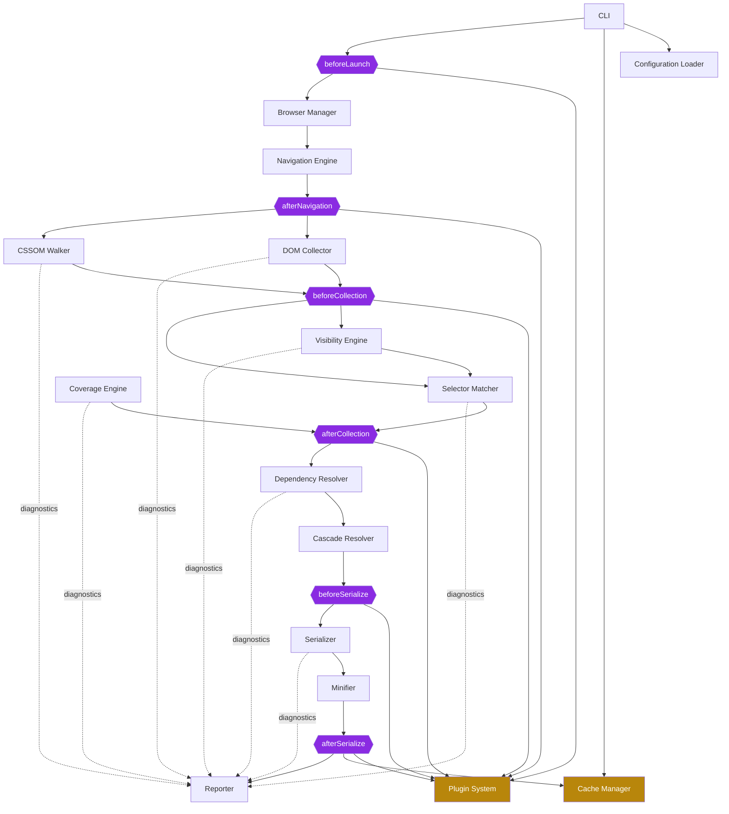
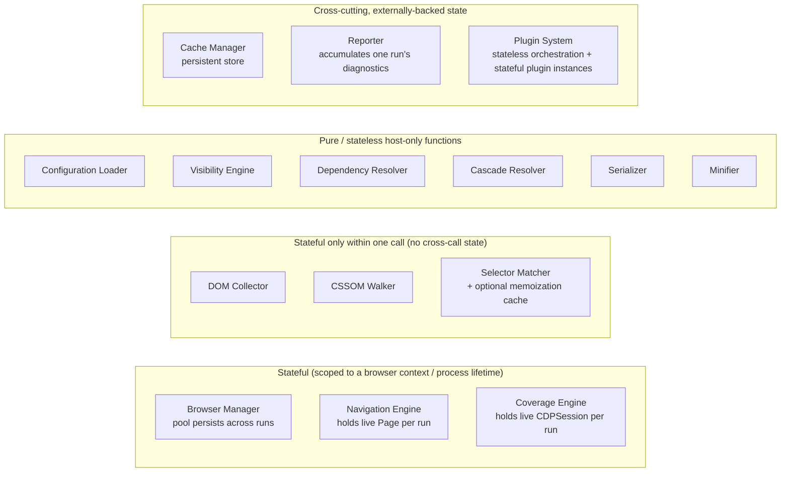

# 012 — Module Interaction

## 1. Title

**Critical CSS Extraction Engine — Module Interaction Model**

## 2. Version

| Field | Value |
|---|---|
| Document Version | 1.0.0 |
| Status | Accepted |
| Last Updated | 2026-07-09 |
| Owners | Core Architecture Working Group |
| Stability | Stable (Phase 2 architecture document; changes to hook placement require an ADR) |

## 3. Purpose

[010-System-Overview.md](010-System-Overview.md) establishes the pipeline's stages at a coarse grain, and [011-Execution-Pipeline.md](011-Execution-Pipeline.md) walks the temporal sequence of a single extraction run. Neither document is the right place to answer a narrower but equally load-bearing question: *for any two modules that must exchange information, what exactly crosses the boundary, is the call synchronous or event-driven, and who owns the data afterward?*

This document answers that question exhaustively for all fifteen modules enumerated in Section 2.4 of the Documentation Agent Brief: CLI, Configuration Loader, Browser Manager, Navigation Engine, DOM Collector, Visibility Engine, CSSOM Walker, Selector Matcher, Dependency Resolver, Cascade Resolver, Serializer, Minifier, Cache Manager, Coverage Engine, Reporter, and Plugin System. It is the module-interaction contract that an implementer reads before writing the function signature of any inter-module call, and the document a code reviewer consults when judging whether a proposed change introduces an undocumented coupling.

It exists as a companion to, and is intentionally narrower than, [007-Repository-Structure.md](007-Repository-Structure.md)'s package dependency graph. That graph answers "which package's `package.json` may declare a dependency on which other package," a *build-time* and *ownership* question. This document answers "when module A calls module B (or emits an event B listens for) during a live extraction run, what is the shape of the data, is it a function call or an event, and what invariants hold on either side of the call." Two packages can have a legitimate build-time dependency edge while, at runtime, interacting through several distinct call shapes (a synchronous DTO handoff for one purpose, an event subscription for diagnostics, a shared read-only context object for a third) — this document is where those distinctions are made explicit.

## 4. Audience

- Implementers writing the concrete TypeScript interfaces for any of the fifteen modules, who need the authoritative signature contract before writing code that another module will depend on.
- Plugin System implementers and plugin authors, who need to understand precisely where in the module interaction graph a lifecycle hook is permitted to intervene, and what it can and cannot see.
- Reviewers auditing a pull request that adds a new call path between two modules, who need a normative reference for "is this call shape consistent with the rest of the system."
- Autonomous coding agents implementing this system from the documentation repository, for whom this document is the primary source of interface signatures prior to the formal API documentation in `docs/api/` (a later phase).

Readers are assumed to have already read [001-Vision.md](001-Vision.md), [006-Design-Principles.md](006-Design-Principles.md), and [007-Repository-Structure.md](007-Repository-Structure.md) in full, and should read [010-System-Overview.md](010-System-Overview.md) and [011-Execution-Pipeline.md](011-Execution-Pipeline.md) either immediately before or immediately after this document, since the three form a single continuous account of the system's runtime shape at increasing levels of detail.

## 5. Prerequisites

- The eight Design Principles in [006-Design-Principles.md](006-Design-Principles.md), especially Principle 1 (Browser Is the Source of Truth), Principle 4 (Pluggable Strategy Architecture), Principle 5 (Determinism), Principle 6 (Fail-Fast Diagnostics), and Principle 7 (Plugin Sandboxing) — every module boundary described below is a direct consequence of one or more of these.
- The package dependency graph in [007-Repository-Structure.md](007-Repository-Structure.md), particularly the invariant that `packages/matcher` and `packages/coverage` share no edge, and that `packages/cache`/`packages/plugins` depend on nothing but `packages/shared`.
- The lifecycle hook model formalized in [ADR-0004-Plugin-Lifecycle-Model.md](../adr/ADR-0004-Plugin-Lifecycle-Model.md): the six named hooks, the patch-based mutation model, and the "orchestrator retains control-flow ownership" invariant.
- Basic familiarity with the distinction between a synchronous call contract (caller awaits a typed return value) and an event-driven hook (caller invokes zero-or-more listeners and does not depend on a return value for control flow).

## 6. Related Documents

- [001-Vision.md](001-Vision.md) — why the browser is treated as source of truth, which explains why so many module boundaries are "bridges into a live page context" rather than ordinary in-process function calls.
- [006-Design-Principles.md](006-Design-Principles.md) — the eight principles this document operationalizes at the interaction-contract level.
- [007-Repository-Structure.md](007-Repository-Structure.md) — the build-time package graph, distinct from and complementary to this document's runtime interaction graph.
- [ADR-0004-Plugin-Lifecycle-Model.md](../adr/ADR-0004-Plugin-Lifecycle-Model.md) — the formal decision record for the plugin hook model this document places onto the interaction graph.
- [010-System-Overview.md](010-System-Overview.md) — the coarse-grained pipeline shape this document elaborates.
- [011-Execution-Pipeline.md](011-Execution-Pipeline.md) — the temporal/sequential account of a single run, which this document complements with a boundary-by-boundary contract view.
- [013-Component-Diagram.md](013-Component-Diagram.md) — the provided/required-interface (port) formalization of the same fifteen modules, one level more formal than this document's call-contract description.
- [014-Dependency-Graph.md](014-Dependency-Graph.md) — a deeper treatment of the acyclicity and layering properties of both the build-time and runtime graphs.
- [015-Runtime-Model.md](015-Runtime-Model.md) — process/thread/browser-context boundaries that this document's synchronous-call-vs-event distinction must respect (an in-process function call and a `page.evaluate()` round trip are both "synchronous" from the caller's point of view but have very different runtime costs, covered there).
- [016-Data-Flow.md](016-Data-Flow.md) — the end-to-end data lineage of specific fields (e.g., how a single `MatchedRule.selectorText` value flows from the CSSOM Walker to the Serializer), a complementary lens to this document's boundary-by-boundary contract view.

## 7. Overview

The fifteen modules divide into three interaction categories, and understanding which category a module belongs to is the single most useful fact for predicting how it communicates with its neighbors:

1. **Orchestration-layer modules** (CLI, Configuration Loader) sit outside the extraction pipeline proper. They call into pipeline modules via synchronous, awaited function calls with typed DTO arguments and return values; they are callers, never callees, from the pipeline's perspective.

2. **Browser-bridged modules** (Browser Manager, Navigation Engine, DOM Collector, Visibility Engine, CSSOM Walker, Selector Matcher, Coverage Engine) execute logic partly or wholly inside a live Playwright-controlled page context. Their inter-module calls are synchronous from the host-process caller's perspective (an `await`ed Promise), but the *implementation* of that call is a round trip into the browser (`page.evaluate()` or a CDP session command), a cost profile elaborated in [015-Runtime-Model.md](015-Runtime-Model.md). This category is stateful in a specific, scoped sense: each holds a live handle (a `Page`, a `CDPSession`, a set of `ElementHandle`s) that is valid only for the duration of one extraction run and one browser context.

3. **Host-only, stateless pipeline modules** (Dependency Resolver, Cascade Resolver, Serializer, Minifier) never touch the browser directly; they consume DTOs produced by browser-bridged modules and produce new DTOs. They are, by design, pure functions of their inputs (a direct consequence of Principle 5, Determinism), which makes them the easiest modules in the system to unit test without any browser dependency.

Two modules do not fit cleanly into this three-way split because they are cross-cutting by design: the **Cache Manager**, which sits *outside* the pipeline and decides whether to invoke it at all (a synchronous gate call before any browser-bridged module runs), and the **Plugin System**, which does not perform extraction work itself but intercepts the boundaries between every other module pair at exactly six named points, per [ADR-0004](../adr/ADR-0004-Plugin-Lifecycle-Model.md). The **Reporter** is a fourteenth kind of terminal, write-only consumer: every other module reports diagnostics *to* it, but nothing depends on data flowing *from* it during a live run (its output is consumed only by the CLI's final report-printing step and, optionally, `apps/visualizer`).

The remainder of this document specifies, boundary by boundary, the call shape and data contract for every edge in the runtime interaction graph, distinguishes stateful modules from stateless ones precisely, and places the six plugin hooks onto the graph at their exact interception points.

## 8. Detailed Design

### 8.1 Call Contract Taxonomy

Before enumerating boundaries, this document fixes vocabulary for the three call shapes that recur throughout:

- **Synchronous call contract (SCC).** Module A calls an exported async function on module B's public interface, awaits a typed `Result<T, Diagnostic[]>` (per Principle 6), and B's function has fully completed (including any browser round trips) before A's `await` resolves. This is the default and dominant shape in the pipeline; the vast majority of edges below are SCC edges.
- **Event/callback contract (ECC).** Module A registers a listener with module B; B invokes the listener zero or more times during its own execution, and the listener's return value (if any) does not gate B's control flow — it is fire-and-forget from B's perspective. This shape is deliberately rare in the core pipeline (per Principle 4's rejection of unstructured event emitters as a *primary* extensibility mechanism, formalized in [ADR-0004](../adr/ADR-0004-Plugin-Lifecycle-Model.md)) but is used internally for diagnostics/logging propagation to the Reporter, where fire-and-forget semantics are correct because the Reporter's output is never a pipeline-blocking dependency.
- **Lifecycle hook contract (LHC).** A specialization of ECC used exclusively by the Plugin System at the six named points from [ADR-0004](../adr/ADR-0004-Plugin-Lifecycle-Model.md). Unlike a generic ECC, an LHC *does* gate control flow (the orchestrator awaits all applicable plugins before proceeding) and *does* produce a typed, schema-validated patch that is merged into the pipeline's context — making it a constrained hybrid: synchronous in effect, but structurally distinct from an SCC because the "callee" is an open-ended, configuration-supplied list rather than one fixed module.

### 8.2 Module-by-Module Interaction Contracts

#### CLI

**Role:** Orchestration entry point; never itself performs extraction logic (per [007-Repository-Structure.md](007-Repository-Structure.md)'s `apps/*` separation rule).

**Calls (all SCC, all outbound):**
- `ConfigurationLoader.resolve(sources: ConfigSource[]): Result<ResolvedConfig, Diagnostic[]>` — first call of any invocation.
- `CacheManager.lookup(fingerprint: Fingerprint): Result<CachedExtractionResult | CacheMiss, Diagnostic[]>` — consulted before any browser-bridged module is touched.
- `BrowserManager.acquireContext(profile: ViewportProfile): Result<BrowserContextHandle, Diagnostic[]>` — the first pipeline call on a cache miss.
- `PluginSystem.runHook(hookName, context)` — six calls interleaved at the fixed points in [ADR-0004](../adr/ADR-0004-Plugin-Lifecycle-Model.md), detailed in §8.3.
- `Reporter.finalize(diagnostics: Diagnostic[], result: ExtractionResult): Report` — last call of any invocation.

**State:** Stateless across runs; holds only the in-flight run's context object for the duration of a single `apps/cli` process invocation. Multiple routes/viewports within a single CLI invocation are handled by repeating the full sequence per unit of work (per the sequence diagram in [007-Repository-Structure.md](007-Repository-Structure.md) §"`apps/cli` Orchestration Sequence"), not by the CLI accumulating cross-run state.

#### Configuration Loader

**Role:** Validates and resolves configuration from file/CLI-flag/environment-variable sources into a single `ResolvedConfig` DTO.

**Interface:**
```
resolve(sources: ConfigSource[]): Result<ResolvedConfig, Diagnostic[]>
```

**Calls:** None outward into other pipeline modules — it is a pure, host-only, stateless function of its input sources. It is the only module in the entire system with zero SCC dependencies on any other module besides `packages/shared` for DTO types, a direct consequence of the "no top-level package assigned" decision recorded in [007-Repository-Structure.md](007-Repository-Structure.md) Implementation Notes (it currently lives inside `apps/cli`).

**Consumers:** CLI (SCC, at start of run); indirectly, every downstream module receives fields of `ResolvedConfig` (viewport profiles, extraction mode, plugin list, cache backend selection) passed through by the CLI's orchestration, not by direct calls into the Configuration Loader.

#### Browser Manager

**Role:** Owns the Playwright browser process/context pool lifecycle (per [006-Design-Principles.md](006-Design-Principles.md) Principle 1's foundational-infrastructure status).

**Interface:**
```
acquireContext(profile: ViewportProfile): Result<BrowserContextHandle, Diagnostic[]>
releaseContext(handle: BrowserContextHandle): Result<void, Diagnostic[]>
```

**Calls:** None into other pipeline modules (it is the base of the runtime graph, mirroring its base position in the build-time graph).

**Consumers (all SCC):** CLI (acquire/release bracketing a run); Navigation Engine (consumes the `BrowserContextHandle` to obtain a `Page`); every browser-bridged module downstream (DOM Collector, Visibility Engine, CSSOM Walker, Selector Matcher, Coverage Engine) receives a `Page`/`CDPSession` reference *transitively*, via the Navigation Engine, never by calling the Browser Manager directly a second time — this is a deliberate narrowing: only the Navigation Engine is permitted to convert a `BrowserContextHandle` into an active `Page`, so that "which module owns page lifecycle" has exactly one answer.

**State:** Genuinely stateful and long-lived relative to a single extraction run — the pool itself persists across many runs within one CLI invocation, deliberately, so that browser process launch cost (per [001-Vision.md](001-Vision.md) §8.3's named cost) is amortized. Each `BrowserContextHandle` is scoped to one route/viewport unit of work and is released, not destroyed, back to the pool.

#### Navigation Engine

**Role:** Drives page navigation and rendering stabilization (per [001-Vision.md](001-Vision.md) §8.1 item 4).

**Interface:**
```
navigate(context: BrowserContextHandle, target: NavigationTarget): Result<StablePage, Diagnostic[]>
```

Where `StablePage` is a typed wrapper around a Playwright `Page` reference, tagged with a `stabilityProof` field (timestamp, stabilization strategy used, retry count) so that downstream modules can attribute any subsequent failure to "instability was declared but was wrong" versus "collection logic is broken," per Principle 6.

**Calls:** `BrowserManager` is not called again here (the context is passed in, already acquired by the CLI); internally invokes Playwright's own navigation primitives, which are outside this module graph (they belong to `packages/browser`'s Playwright-adapter internals, covered in the Phase 3 design documents).

**Consumers (SCC):** DOM Collector and CSSOM Walker both receive the same `StablePage` handle from the orchestrator after this call resolves — they do not call the Navigation Engine themselves; the CLI passes the `StablePage` to both. This is a fan-out, not a chain: DOM Collector and CSSOM Walker execute independently against the same stable page (and, per [007-Repository-Structure.md](007-Repository-Structure.md), are bundled into the same `packages/collector` unit precisely because they share this one collection pass).

**Plugin interception:** The `afterNavigation` hook fires immediately after this call resolves and before any collector module runs (§8.3).

#### DOM Collector

**Role:** Enumerates DOM nodes and produces the above-fold candidate node set (Section 2.4 of the brief).

**Interface:**
```
collectNodes(page: StablePage, foldConfig: FoldConfig): Result<NodeSnapshot, Diagnostic[]>
```

`NodeSnapshot` is a typed collection of `CollectedNode` records — each carrying a stable synthetic node ID (not a live `ElementHandle`, to avoid the detached-element failure case named in [001-Vision.md](001-Vision.md) §10), tag name, class list, and a serialized geometry summary already computed inside the single `page.evaluate()` round trip that produced it (per the batching optimization named in [001-Vision.md](001-Vision.md) §10).

**Calls:** None into other collector-family modules directly; it is invoked by the orchestrator in the same fan-out step as CSSOM Walker (both operate against the same `StablePage`).

**Consumers (SCC):** Visibility Engine (consumes `NodeSnapshot` to classify visibility); Selector Matcher (consumes `NodeSnapshot` as the candidate element set for matching, per the algorithm in [001-Vision.md](001-Vision.md) §10).

**State:** Stateless across invocations; the `NodeSnapshot` it returns is the only artifact carried forward, and it holds no live browser handles after `collectNodes` resolves (this is the concrete mechanism by which Principle 1's requirement to avoid detached-element races is met — collection is a single atomic in-page evaluation, per [001-Vision.md](001-Vision.md) §10's failure-case discussion).

#### Visibility Engine

**Role:** Classifies which collected nodes are above-fold-visible (geometry, intersection, overflow, transforms — Section 2.4/2.5 of the brief).

**Interface:**
```
classifyVisibility(snapshot: NodeSnapshot, viewport: ViewportProfile, options: VisibilityOptions): Result<VisibilitySet, Diagnostic[]>
```

`VisibilitySet` is a typed subset of node IDs from the input `NodeSnapshot`, each tagged with the specific criterion that admitted or excluded it (`intersectsFold`, `nonZeroDimensions`, `notDisplayNone`, `notVisibilityHidden`, `opacityPolicy`, `transformOffscreenPolicy`), so that the Reporter can later explain, per node, *why* it was or was not classified as critical (a direct instance of Principle 6).

**Calls:** None into other modules; it is a pure function of `NodeSnapshot` plus configuration, even though the `NodeSnapshot` it consumes was itself produced by a browser round trip — the classification step itself does not need to re-enter the browser context in the common case, an optimization opportunity noted in [001-Vision.md](001-Vision.md)'s discussion of geometry batching, though a fallback re-query path into the live page is retained for cases where committed geometry data proves insufficient (e.g., disambiguating `content-visibility: auto` state, covered in [015-Runtime-Model.md](015-Runtime-Model.md)).

**Consumers (SCC):** Selector Matcher (uses `VisibilitySet` to bound the `criticalElements` argument of the `isRuleCritical` algorithm specified in [001-Vision.md](001-Vision.md) §10); Reporter (receives the full `VisibilitySet` with per-node rationale for the matched/unmatched-selector and visibility diagnostics named in Section 2.12 of the brief).

**Plugin interception:** `beforeCollection` may return a `visibilityOverride` patch (per [ADR-0004](../adr/ADR-0004-Plugin-Lifecycle-Model.md) §"Edge Cases") that this module must honor as an override function layered on top of its default classification predicate, not a replacement for the module's own geometry-fetching responsibility.

#### CSSOM Walker

**Role:** Traverses `document.styleSheets` and the `CSSRule` tree, including adopted/constructable stylesheets and shadow roots (Section 2.4/2.5, and [001-Vision.md](001-Vision.md) §8.1 item 3).

**Interface:**
```
walkStylesheets(page: StablePage, options: WalkOptions): Result<RuleTree, Diagnostic[]>
```

`RuleTree` is an ordered collection of `StylesheetNode` records, each preserving `sourceStylesheetIndex` and `sourceRuleIndex` (the fields the canonical-ordering algorithm in [006-Design-Principles.md](006-Design-Principles.md) depends on), plus resolved at-rule metadata (media condition text, `@layer` membership, `@supports` result — all read from the browser's already-resolved understanding, per Principle 1, never recomputed).

**Calls:** None into Selector Matcher or Dependency Resolver directly; both are downstream *consumers* of `RuleTree`, not modules the Walker calls into. This one-directional shape is what keeps the CSSOM Walker a producer-only node in the graph.

**Consumers (SCC):** Selector Matcher (consumes `RuleTree` as the `S` side of the `S × E` matching problem in [001-Vision.md](001-Vision.md) §10); Dependency Resolver (consumes `RuleTree` to locate `@property`, `@layer`, keyframe, and custom-property-producing rules independent of whether their containing selector list matched anything, since dependencies can be referenced by rules outside the matched set); Reporter (stylesheet contribution report, Section 2.12).

**State:** Stateless; produces one `RuleTree` per invocation and retains no cross-call state, though internally it may reuse a browser-side rule index (per Principle 3's permitted memoization) as a performance cache that does not change output, only speed.

#### Selector Matcher

**Role:** Thin, memoizing wrapper around `Element.matches()` (Section 2.4/2.5; [006-Design-Principles.md](006-Design-Principles.md) Principle 2).

**Interface:**
```
matchRules(ruleTree: RuleTree, visibilitySet: VisibilitySet, page: StablePage): Result<MatchedRuleSet, Diagnostic[]>
```

`MatchedRuleSet` is the set of `MatchedRule` records — each a `(rule, matchedElementIds)` pair — that is critical per the `isRuleCritical` definition in [001-Vision.md](001-Vision.md) §10.

**Calls:** Re-enters the live page context (it is a browser-bridged module, requiring the `StablePage` reference, unlike the purely host-side Visibility Engine classification step) to execute the batched `element.matches()` double loop described in [001-Vision.md](001-Vision.md) §10's pseudocode. It does not call CSSOM Walker or DOM Collector directly — both of their outputs are handed to it by the orchestrator as arguments, keeping the Matcher a pure consumer of upstream DTOs plus one live page handle.

**Consumers (SCC):** Dependency Resolver (consumes `MatchedRuleSet` as the seed set for dependency-graph construction); Coverage Engine, in Hybrid mode only, as a peer input to be reconciled rather than a dependency (per Principle 4 and the graph invariant in [007-Repository-Structure.md](007-Repository-Structure.md) — the Selector Matcher never calls into, nor is called by, the Coverage Engine; both are invoked independently by the Hybrid strategy orchestrator, covered in [013-Component-Diagram.md](013-Component-Diagram.md)); Reporter (matched/unmatched selector report).

**Plugin interception:** `beforeCollection`'s `ignoreSelectors` patch (per [ADR-0004](../adr/ADR-0004-Plugin-Lifecycle-Model.md)) is applied by this module as a pre-filter on the `RuleTree` input before the `S × E` loop runs, not as a post-filter on `MatchedRuleSet` — filtering before the expensive double loop is both a performance optimization and the semantically correct interpretation of "ignore," since an ignored selector should not appear in the matched/unmatched report as "unmatched," it should be reported as "ignored by plugin," a distinct diagnostic category.

#### Coverage Engine

**Role:** Wraps the Chrome DevTools Protocol Coverage domain (Section 2.4/2.7; [ADR-0005-Hybrid-Extraction-Mode.md](../adr/ADR-0005-Hybrid-Extraction-Mode.md)).

**Interface:**
```
recordCoverage(page: StablePage, window: CoverageWindow): Result<CoverageReport, Diagnostic[]>
```

`CoverageReport` is a set of `(styleSheetId, ranges)` pairs reflecting actually-applied CSS byte ranges during the recorded paint window, independent of any selector-matching computation.

**Calls:** None into Selector Matcher (peer-only relationship, per the graph invariant discussed above); calls into the Browser Manager's CDP session accessor to start/stop the Coverage domain recording, a narrower browser-bridge surface than the general `page.evaluate()` bridge used by other collector-family modules.

**Consumers (SCC):** Dependency Resolver, only when the active extraction strategy is Coverage or Hybrid (per Principle 4's strategy interface — the Dependency Resolver's public contract accepts either a `MatchedRuleSet`, a `CoverageReport`, or both, reconciled by the Hybrid strategy orchestrator before this module is called, so the Dependency Resolver itself remains agnostic to which strategy produced its input, a property elaborated in [013-Component-Diagram.md](013-Component-Diagram.md)); Reporter (coverage-derived diagnostics, e.g., rules matched by CSSOM but never painted, or vice versa — the cross-verification purpose named in [ADR-0005](../adr/ADR-0005-Hybrid-Extraction-Mode.md)).

#### Dependency Resolver

**Role:** Builds and iteratively resolves the dependency graph to a fixed point (Section 2.4/2.5).

**Interface:**
```
resolveDependencies(seed: MatchedRuleSet | CoverageReport, ruleTree: RuleTree): Result<DependencyGraph, Diagnostic[]>
```

`DependencyGraph` is a directed graph of `DependencyNode`s (variables, keyframes, font faces, `@property`, `@counter-style`, `@layer`, `@supports`, media/container queries, view transitions, scroll timelines) with edges representing "rule R references dependency D," resolved iteratively until no new edges are discovered (per the fixed-point requirement in Section 2.5 of the brief, and Principle 3's prohibition on truncating this process silently).

**Calls:** None into browser-bridged modules directly for the common case; it operates on the already-collected `RuleTree` and matched-rule seed. It may, in edge cases documented in §12, request an additional, narrowly-scoped browser query (e.g., `getComputedStyle().getPropertyValue()` for custom-property resolution, per [001-Vision.md](001-Vision.md) §11) — this is the one place a nominally "host-only" module retains a conditional SCC edge back into the browser bridge, and it is deliberately narrow (a single accessor, not general page access) to avoid diluting the host-only/browser-bridged distinction elsewhere in this document.

**Consumers (SCC):** Cascade Resolver (needs the resolved `@layer` membership graph to determine cascade-layer ordering, per Section 2.5 and [007-Repository-Structure.md](007-Repository-Structure.md)'s note that Cascade Resolver's concerns are "entangled with" dependency resolution); Serializer (needs the full `DependencyGraph` to know which non-directly-matched rules — e.g., a `@keyframes` block referenced by a matched `animation-name` — must also be included in output); Reporter (the dependency graph visualization data named in Section 2.12).

**Plugin interception:** `afterCollection` fires before this module runs, giving plugins a final chance to inject or exclude rules (via `injectRules`/`ignoreSelectors` patches) before dependency resolution consumes the matched-rule seed, ensuring plugin-injected rules participate in dependency resolution rather than bypassing it.

#### Cascade Resolver

**Role:** Determines specificity, origin, and cascade-layer ordering (Section 2.4/2.5).

**Interface:**
```
resolveCascade(dependencyGraph: DependencyGraph, matchedRules: MatchedRuleSet): Result<OrderedRuleSet, Diagnostic[]>
```

`OrderedRuleSet` attaches a cascade-priority key to each `MatchedRule`, derived from browser-observed layer order (never recomputed by hand, per Principle 1's Implementation Notes in [006-Design-Principles.md](006-Design-Principles.md)) and specificity (obtained via `getComputedStyle` cross-checks, never a bespoke specificity parser, per Principle 2).

**Calls:** A conditional, narrow browser re-entry for layer-order queries, structurally identical in kind to the Dependency Resolver's conditional edge above — both are exceptions to the "host-only" classification that must be flagged explicitly (§12) rather than left as an implicit assumption.

**Consumers (SCC):** Serializer (consumes `OrderedRuleSet` directly — this is the sole input the Serializer needs to determine output rule order, per the canonical-ordering algorithm in [006-Design-Principles.md](006-Design-Principles.md)).

#### Serializer

**Role:** Rule ordering, deduplication, output formatting (Section 2.4; the canonicalization owner per Principle 5).

**Interface:**
```
serialize(orderedRules: OrderedRuleSet, dependencyGraph: DependencyGraph, format: OutputFormat): Result<SerializedOutput, Diagnostic[]>
```

**Calls:** None into any other module; a pure function of its typed inputs, by design (Principle 5 requires the Serializer to be the single canonicalizing convergence point, which is only achievable if it has no side channel back into upstream modules that could reintroduce nondeterminism).

**Consumers (SCC):** Minifier (consumes `SerializedOutput` for compression); Reporter (stylesheet contribution and timing reports); Cache Manager (the final `SerializedOutput`, wrapped in an `ExtractionResult`, is what gets stored against the run's fingerprint).

**Plugin interception:** `beforeSerialize` fires immediately before this module runs, with a context scoped to the resolved rule/dependency data (never raw page access, per [ADR-0004](../adr/ADR-0004-Plugin-Lifecycle-Model.md)'s Implementation Notes item 1); `afterSerialize` fires immediately after, receiving the `SerializedOutput` for post-processing patches (e.g., a plugin-driven rewrite pass).

#### Minifier

**Role:** Compression, whitespace removal (Section 2.4).

**Interface:**
```
minify(output: SerializedOutput, options: MinifyOptions): Result<SerializedOutput, Diagnostic[]>
```

**Calls/Consumers:** A single-purpose, stateless transform sitting immediately after the Serializer and before the final `ExtractionResult` is assembled; it is the smallest module in the graph by interaction surface, with exactly one upstream producer (Serializer) and one downstream consumer (the orchestrator assembling the final `ExtractionResult` for the Cache Manager and Reporter).

#### Cache Manager

**Role:** Fingerprinting, route/viewport cache, invalidation (Section 2.4/2.8; Principle 8).

**Interface:**
```
lookup(fingerprint: Fingerprint): Result<CachedExtractionResult | CacheMiss, Diagnostic[]>
store(fingerprint: Fingerprint, result: ExtractionResult): Result<void, Diagnostic[]>
```

**Calls:** None into any pipeline module — per the [007-Repository-Structure.md](007-Repository-Structure.md) invariant, `packages/cache` depends on nothing but `packages/shared`, and this is enforced at the interaction level too: the Cache Manager never reaches into the Serializer or any browser-bridged module to "compute" a fingerprint's ingredients itself; the CLI computes the `Fingerprint` (per the algorithm in [006-Design-Principles.md](006-Design-Principles.md)) from `ResolvedConfig` and pre-extraction asset content, and passes it in.

**Consumers:** CLI only (both `lookup`, gating the entire pipeline, and `store`, terminating a run). No pipeline module downstream of the CLI ever calls the Cache Manager directly — this exclusivity is what makes the Cache Manager a true outside-the-pipeline gate rather than an embedded pipeline stage.

#### Reporter

**Role:** Aggregates diagnostics, dependency graph visualization data, matched/unmatched selector reports, timing, and traces (Section 2.4/2.12).

**Interface:**
```
record(event: DiagnosticEvent): void   // ECC — fire-and-forget, called by every module
finalize(): Report                     // SCC — called once by CLI at the end of a run
```

**Calls:** None outward.

**Producers (ECC, inbound to Reporter):** every other module in the system, without exception, emits `DiagnosticEvent`s to the Reporter as a side channel alongside its primary SCC return value — this is the concrete mechanism by which Principle 6's "diagnostics are data, not console noise" requirement is met structurally: the Reporter is the one legitimate ECC sink in the core pipeline, and it is a sink specifically because nothing depends on its `record()` call completing before pipeline execution proceeds (a deliberate relaxation of Principle 5's synchronous determinism guarantee, since diagnostic *ordering* need not be as strictly canonical as CSS output ordering, though `finalize()`'s report generation is itself deterministic given a fixed diagnostic event log).

#### Plugin System

**Role:** Lifecycle hooks, sandboxing, extensibility (Section 2.4/2.13; the full formal model in [ADR-0004](../adr/ADR-0004-Plugin-Lifecycle-Model.md)).

**Interface:**
```
runHook(hookName: HookName, context: HookContext, plugins: Plugin[]): Result<HookContext, Diagnostic[]>
```

**Calls:** Into each registered plugin's implementation of the named hook (LHC, per §8.1), sequentially, in declared order, per the `runHook` algorithm in [ADR-0004](../adr/ADR-0004-Plugin-Lifecycle-Model.md).

**Consumers:** CLI, exclusively — no pipeline module calls `PluginSystem.runHook` directly; the CLI orchestrator is the sole caller, at the six fixed points, and the *result* of each call (a merged patch) is threaded by the CLI into the next pipeline module's arguments. This indirection is deliberate: it keeps every pipeline module's own interface pluggable-hook-agnostic (a Visibility Engine implementation does not need to know the Plugin System exists; it simply receives a `VisibilityOptions` argument that happens to have been assembled, upstream, from a merged plugin patch by the CLI).

### 8.3 Plugin Hooks on the Interaction Graph

Mapping [ADR-0004](../adr/ADR-0004-Plugin-Lifecycle-Model.md)'s six hooks onto the module boundaries above:

| Hook | Fires Between | Patch Consumed By |
|---|---|---|
| `beforeLaunch` | CLI → Browser Manager | Browser Manager's `acquireContext` viewport/engine-choice arguments |
| `afterNavigation` | Navigation Engine → {DOM Collector, CSSOM Walker} | Passed through as amended `NavigationTarget`-adjacent context to the collector fan-out |
| `beforeCollection` | {DOM Collector, CSSOM Walker} → {Visibility Engine, Selector Matcher} | Visibility Engine's `VisibilityOptions.visibilityOverride`; Selector Matcher's pre-filter `ignoreSelectors` |
| `afterCollection` | Selector Matcher/Coverage Engine → Dependency Resolver | Dependency Resolver's seed set (`injectRules`, further `ignoreSelectors`) |
| `beforeSerialize` | Cascade Resolver → Serializer | Serializer's `OrderedRuleSet`/`DependencyGraph` inputs (rule injection/rewriting) |
| `afterSerialize` | Serializer/Minifier → Cache Manager/Reporter | Final `SerializedOutput` post-processing patch |

Every hook, without exception, sits at a boundary already present in the non-plugin interaction graph — this is not incidental; it is the direct consequence of [ADR-0004](../adr/ADR-0004-Plugin-Lifecycle-Model.md)'s rejection of per-node/per-rule fine-grained hooks in favor of six pipeline-stage-anchored ones. No module's public interface signature changes based on whether plugins are installed; only the *values* passed into that signature are amended by a preceding `runHook` call, owned exclusively by the CLI.

## 9. Architecture

The following diagram is the authoritative runtime module-interaction graph — distinct from the build-time package graph in [007-Repository-Structure.md](007-Repository-Structure.md). Solid arrows are SCC edges; the dashed arrows are the Reporter's ECC inbound edges (shown collapsed to one representative arrow per module category to keep the diagram legible, since in reality every module reports to it); the six plugin hook interception points are rendered as diamond nodes on the edges they intercept.



Two structural properties are worth naming explicitly because they are easy to lose sight of once the diagram is dense:

1. **Every hook diamond is a detour through the Plugin System, not a direct plugin-to-module edge.** No plugin ever calls `VisibilityEngine.classifyVisibility` or any other module method directly; the CLI always intermediates via `PluginSystem.runHook`, and the pipeline module always receives its (possibly patched) arguments from the CLI, never from a plugin reference held internally. This is the runtime-graph expression of Principle 7's sandboxing requirement.
2. **The Cache Manager and Plugin System are the only two nodes with no incoming edges from mid-pipeline modules** (both are called exclusively by the CLI), which is the runtime-graph restatement of the "cache/plugins depend on nothing but shared" build-time invariant from [007-Repository-Structure.md](007-Repository-Structure.md) — here it appears as "cache/plugins are called by nothing but the orchestrator," the interaction-level mirror of that same architectural commitment.

### 9.1 Stateful vs. Stateless Modules — Consolidated View



This classification is not academic: it directly determines test strategy (§15) and which modules are safe to parallelize without additional synchronization (§14). Stateless modules can be instantiated fresh per call with no shared mutable state; stateful, browser-bridged modules require careful handle lifecycle management, covered in depth in [015-Runtime-Model.md](015-Runtime-Model.md).

## 10. Algorithms

### Algorithm: Patch Threading Across the Orchestration Graph

**Problem statement.** Given the sequence of module calls in §9's diagram and six interception points, compute, for each pipeline module invocation, the exact argument set it receives, accounting for zero-or-more plugin patches accumulated at the most recent preceding hook.

**Inputs.** `pipelineSteps: OrderedStep[]` (the fixed sequence CLI→...→Reporter); `hookPlacements: Map<StepBoundary, HookName>`; `plugins: Plugin[]`.

**Outputs.** For each step, a `resolvedArgs` object equal to the step's nominal upstream DTO merged with the most recent applicable patch.

**Pseudocode:**
```text
function threadPipeline(pipelineSteps, hookPlacements, plugins):
    context = initialContext()
    for step in pipelineSteps:
        boundary = precedingBoundaryOf(step)
        if hookPlacements.has(boundary):
            hookName = hookPlacements.get(boundary)
            patchResult = PluginSystem.runHook(hookName, context, plugins)
            context = applyPatch(context, patchResult)   # per ADR-0004's runHook semantics
        stepResult = invoke(step.module, step.method, projectArgsFrom(context))
        context = mergeStepResult(context, stepResult)
    return context
```

**Time complexity.** O(steps + hooks × pluginsPerHook), i.e., the fixed thirteen-step pipeline (fifteen modules minus the CLI/Reporter bookends counted separately) plus the six-hook overhead already bounded in [ADR-0004](../adr/ADR-0004-Plugin-Lifecycle-Model.md)'s own algorithm. This is dominated, in practice, by the cost of the individual `invoke` calls (particularly browser-bridged ones), not by the threading logic itself.

**Memory complexity.** O(contextSize), since `context` accumulates monotonically through the run but is bounded by the size of one route/viewport's DOM/CSSOM/diagnostic data, discarded after the run completes (or persisted only in the Cache Manager's content-addressed form).

**Failure cases.** A step's `invoke` call returns a `Result` with diagnostics but no fatal error — threading continues, diagnostics accumulate; a step's `invoke` call throws or returns a fatal `Result` — threading halts immediately, and Reporter's `finalize()` is still called (per Principle 6, a partial run must still produce an attributable report, never a silent abort).

**Optimization opportunities.** `projectArgsFrom(context)` can be memoized per step-shape (which fields a given step actually reads) to avoid deep-cloning the entire accumulated context on every step, relevant at scale when `context` grows large for pages with tens of thousands of collected nodes.

## 11. Implementation Notes

- Every SCC-shaped interface in §8.2 should be defined once in `packages/shared` as a TypeScript interface (the `Result<T, Diagnostic[]>` wrapper, and every named DTO — `NodeSnapshot`, `VisibilitySet`, `RuleTree`, `MatchedRuleSet`, `CoverageReport`, `DependencyGraph`, `OrderedRuleSet`, `SerializedOutput`, `Fingerprint`, `ExtractionResult`) so that no two modules independently redefine an overlapping shape, a direct implementation of [007-Repository-Structure.md](007-Repository-Structure.md)'s claim that `packages/shared` sits at the base of every dependency edge.
- The conditional browser-bridge edges noted for Dependency Resolver and Cascade Resolver (§8.2) should be implemented as a single, narrow `ComputedStyleAccessor` interface injected into both modules, rather than each module independently acquiring its own `Page` reference — this keeps the "host-only except for one narrow accessor" property auditable at the interface level rather than buried in implementation detail.
- The Reporter's `record()` ECC contract must be non-blocking in implementation, not merely in specification — an accidental `await` on `record()` calls inside a hot loop (e.g., per-node diagnostic emission in the Visibility Engine) would silently reintroduce a synchronous dependency on Reporter throughput, defeating the purpose of choosing ECC for this one edge.
- Plugin patch merge conflicts (two plugins both patching `ignoreSelectors` at the same `beforeCollection` firing) are resolved entirely within `PluginSystem.runHook`, per [ADR-0004](../adr/ADR-0004-Plugin-Lifecycle-Model.md); no pipeline module downstream needs its own conflict-resolution logic, since by the time a pipeline module receives its arguments, exactly one merged patch has already been produced.

## 12. Edge Cases

- **Conditional host-to-browser edges.** The Dependency Resolver's and Cascade Resolver's narrow `getComputedStyle` accessor calls (§8.2) are the one place this document's otherwise-clean "browser-bridged vs. host-only" split blurs; implementers must not let this conditional edge grow into a general page-access backdoor for these modules — any expansion beyond the single documented accessor requires a design-review discussion per [006-Design-Principles.md](006-Design-Principles.md) Principle 1's enforcement posture.
- **Shadow DOM traversal spanning DOM Collector and CSSOM Walker.** Both modules must independently traverse into shadow roots (per [001-Vision.md](001-Vision.md) §12) without a shared traversal-state handoff between them — they run against the same `StablePage` but are not permitted to pass live shadow-root references to each other, since neither module retains live handles past its own call (§8.2's DOM Collector state note); each re-traverses shadow roots independently, a deliberate redundancy accepted in exchange for keeping both modules free of cross-call state.
- **Coverage Engine and Selector Matcher producing genuinely conflicting results in Hybrid mode.** Since neither calls the other, reconciliation happens exclusively in the Hybrid strategy orchestrator (covered fully in [013-Component-Diagram.md](013-Component-Diagram.md)); this document's graph deliberately shows both as peer inputs to Dependency Resolver without prescribing the reconciliation algorithm itself, which belongs to [ADR-0005](../adr/ADR-0005-Hybrid-Extraction-Mode.md) and Phase 9 design docs.
- **Plugin hook context immutability under concurrent route/viewport extraction.** When the CLI runs multiple route/viewport units in parallel (per the parallelization strategy in [015-Runtime-Model.md](015-Runtime-Model.md)), each unit's `PluginSystem.runHook` invocation must operate on an independently-scoped `HookContext`; plugin authors relying on any form of shared mutable state across concurrent hook firings violate Principle 5 and are explicitly unsupported, per [ADR-0004](../adr/ADR-0004-Plugin-Lifecycle-Model.md)'s determinism-under-perturbed-scheduling requirement.
- **Reporter ECC ordering under diagnostics from parallel stylesheet traversal.** Because the Reporter's `record()` contract does not guarantee ordering across concurrent emitters (per §8.2), the Reporter's `finalize()` must independently re-sort diagnostics by a stable key (timestamp plus emitting-module plus sequence number) before producing a deterministic report, mirroring the Serializer's canonical-ordering responsibility for CSS output but applied to the diagnostics stream.
- **A pipeline module invocation that fails before any hook has fired for its boundary.** E.g., `BrowserManager.acquireContext` itself throws before `beforeLaunch` completes its patch application. The orchestrator's `threadPipeline` algorithm (§10) must ensure the Reporter still receives an attributable, structured failure diagnostic even when the failure occurs mid-hook-application, not only mid-module-invocation — this is a corner case in the pseudocode's failure-case handling worth stress-testing explicitly.

## 13. Tradeoffs

| Decision | Why | Alternative Considered | Tradeoff Accepted |
|---|---|---|---|
| CLI is the sole caller of `PluginSystem.runHook`; no pipeline module invokes hooks itself | Keeps every pipeline module's interface plugin-agnostic, per Principle 7's sandboxing intent | Letting each module (e.g., Visibility Engine) call its own relevant hook directly | An extra indirection layer in the CLI's orchestration code; a plugin cannot easily discover "which module is about to run" without documentation, since it only sees hook context, not a module reference |
| Reporter uses ECC (fire-and-forget) rather than SCC for diagnostic recording | Diagnostics must never become a pipeline-blocking dependency or a bottleneck under high-volume per-node diagnostic emission | Making every `record()` call an awaited SCC, guaranteeing stronger ordering | Diagnostic ordering is not free — `finalize()` must re-sort, adding a small O(d log d) cost, and misuse (accidentally awaiting `record()` in a hot path) is a real implementation risk (§11) |
| Dependency Resolver and Cascade Resolver retain a narrow, conditional browser-bridge edge rather than being purely host-only | Some cascade/dependency facts (resolved custom property values, browser-observed layer order) are only obtainable from the browser, per Principle 1 | Forcing 100% of cascade/dependency data to be pre-computed and packaged by CSSOM Walker/Cascade-adjacent browser calls upstream, keeping these two modules purely host-only | A conditional edge that blurs this document's otherwise-clean stateful/stateless module classification, requiring the explicit callout in §12 |
| Coverage Engine and Selector Matcher share no edge (peer-only) | Direct encoding of Principle 4's strategy-pluggability requirement and the [007-Repository-Structure.md](007-Repository-Structure.md) graph invariant | Letting Hybrid mode be implemented as Coverage calling into Matcher (or vice versa) for convenience | Reconciliation logic must live in a third place (the Hybrid orchestrator), adding one more component to reason about, in exchange for both strategies remaining independently swappable |

## 14. Performance

- **CPU complexity.** The dominant cost centers, per [001-Vision.md](001-Vision.md) §14, remain browser round trips inside the browser-bridged module boundaries (Browser Manager, Navigation Engine, DOM Collector, CSSOM Walker, Selector Matcher, Coverage Engine); the host-only modules' interaction overhead (argument marshaling, patch merging) is asymptotically dominated by these round trips for any realistic page size, and should not be a profiling priority ahead of them.
- **Memory complexity.** The `context` object threaded through `threadPipeline` (§10) grows monotonically across the run; for very large pages (the "huge enterprise stylesheet" fixture family, per Section 2.15 of the brief), this argues for the memoization/partial-projection optimization noted in §10 rather than accepting O(fullContextSize) copies at every step boundary.
- **Caching strategy.** The interaction graph's caching-relevant edge is the single Cache Manager gate at the very start (CLI → Cache Manager); every other module-to-module edge in this document is unaffected by caching, by design, since caching is a whole-pipeline bypass, not a per-module memoization strategy (per-module memoization, e.g., in Selector Matcher, is a separate, complementary performance lever, covered in [performance/](../../docs/performance/) documents in a later phase).
- **Parallelization opportunities.** DOM Collector and CSSOM Walker's fan-out from the Navigation Engine (§8.2, §9) is the primary intra-run parallelization opportunity at the module-interaction level, since both consume the same `StablePage` independently and produce independent outputs consumed later by different downstream modules; Coverage Engine and Selector Matcher's peer relationship (no shared edge) similarly permits concurrent execution when both are active (Hybrid mode).
- **Incremental execution.** Not a property of individual module boundaries but of the whole-pipeline Cache Manager gate; no module below the Cache Manager in the graph has an incremental-execution responsibility of its own (per [007-Repository-Structure.md](007-Repository-Structure.md)'s explicit exclusion of `packages/cache` from pipeline internals).
- **Profiling guidance.** Instrument at exactly the boundaries drawn in §9's diagram (each solid-arrow edge is a natural span-start/span-end pair for distributed tracing, per the timing report requirement in Section 2.12 of the brief); the six hook diamonds should be instrumented as their own spans too, since [ADR-0004](../adr/ADR-0004-Plugin-Lifecycle-Model.md)'s Performance section already requires per-hook, per-plugin timing visibility.
- **Scalability limits.** The interaction graph itself imposes no scalability ceiling beyond what individual browser-bridged modules already face (per [001-Vision.md](001-Vision.md) §14); the graph's shape is designed to be replicated per parallel worker/route without modification, which is the property that makes route-level and viewport-level horizontal scaling (per the roadmap's distributed-crawler ambitions) an additive change to orchestration, not a redesign of the module contracts described here.

## 15. Testing

- **Unit tests.** Every SCC interface in §8.2 must have a contract test asserting its declared input/output DTO shapes independent of any real module implementation (mock producer, mock consumer, assert the `Result<T, Diagnostic[]>` shape round-trips correctly) — this catches interface drift before it surfaces as an integration failure.
- **Integration tests.** A dedicated "interaction graph" integration suite should assert, against real fixture pages, that the actual sequence of module invocations matches §9's diagram (e.g., via injected tracing spies) for at least one representative run per extraction mode (CSSOM, Coverage, Hybrid), catching accidental new edges (a module calling another module not shown in this document) as a build-breaking regression, mirroring the cycle-detection discipline in [007-Repository-Structure.md](007-Repository-Structure.md) but applied to the runtime graph instead of the build-time one.
- **Visual tests.** Not directly applicable to interaction contracts themselves, but any change to a hook's patch-consumption point (e.g., moving where `ignoreSelectors` is applied) must be validated against the standard visual-regression suite to confirm the *effect* of the patch is unchanged even if its application point moved.
- **Stress tests.** Register the maximal plausible number of concurrent plugins across all six hooks (per [ADR-0004](../adr/ADR-0004-Plugin-Lifecycle-Model.md)'s own stress-test guidance) while running the full module interaction graph end-to-end, to validate that patch-threading overhead (§10) does not degrade non-linearly as plugin count grows.
- **Regression tests.** Any bug where a module was found reaching into another module's internals directly (bypassing the documented DTO boundary) becomes a permanent architectural regression test, ideally enforced via the same lint-rule mechanism proposed in [006-Design-Principles.md](006-Design-Principles.md) Implementation Notes for Principles 1/2, extended to cover this document's boundary contracts.
- **Benchmark tests.** Track per-boundary latency (the same spans named in §14's profiling guidance) over time in CI, specifically watching for the conditional browser-bridge edges in Dependency Resolver/Cascade Resolver (§12) becoming a larger-than-expected fraction of total run time, which would indicate those "narrow" accessors are being called more often than the single-accessor design intends.

## 16. Future Work

- Formalize `threadPipeline` (§10) as an actual, shared orchestration primitive in `apps/cli` (or a promoted `packages/orchestrator`) rather than leaving it as an implicit pattern each CLI command reimplements — flagged here as a design question for the Phase 16 implementation task breakdown.
- Investigate whether the Reporter's ECC contract should gain an optional, opt-in SCC "flush" call for scenarios (e.g., a CI gate that wants diagnostics-so-far before the run fully completes, for early-abort decisions) without compromising the fire-and-forget default.
- Revisit whether the Dependency Resolver's and Cascade Resolver's conditional browser-bridge edges (§12) should be formalized into their own tiny named module (e.g., a `ComputedStyleBridge`) with its own entry in this document's module table, once Phase 7's dependency-resolution design documents make the frequency and shape of these calls concrete.
- Explore automated generation of §9's Mermaid diagram directly from a runtime tracing capture of a real extraction run (an interaction-graph analogue to the build-graph-drift concern raised in [007-Repository-Structure.md](007-Repository-Structure.md) Future Work), so this document's diagram cannot silently drift from actual invocation behavior.
- Open question: should the six lifecycle hooks eventually support an opt-in parallel-execution mode for order-independent plugins (per [ADR-0004](../adr/ADR-0004-Plugin-Lifecycle-Model.md) Future Work), and if so, does that change any edge in §9's diagram, or only the internal implementation of the `PluginSystem` node? Current analysis suggests the latter (the diagram's shape is unaffected), but this should be revisited once that feature is actually specified.

## 17. References

- [001-Vision.md](001-Vision.md)
- [006-Design-Principles.md](006-Design-Principles.md)
- [007-Repository-Structure.md](007-Repository-Structure.md)
- [ADR-0004-Plugin-Lifecycle-Model.md](../adr/ADR-0004-Plugin-Lifecycle-Model.md)
- [ADR-0005-Hybrid-Extraction-Mode.md](../adr/ADR-0005-Hybrid-Extraction-Mode.md)
- [010-System-Overview.md](010-System-Overview.md)
- [011-Execution-Pipeline.md](011-Execution-Pipeline.md)
- [013-Component-Diagram.md](013-Component-Diagram.md)
- [014-Dependency-Graph.md](014-Dependency-Graph.md)
- [015-Runtime-Model.md](015-Runtime-Model.md)
- [016-Data-Flow.md](016-Data-Flow.md)
- Section 2.4 ("System Modules") and Section 2.13 ("Plugin System Hooks") of the Documentation Agent Brief, the authoritative source for the module list and hook set formalized in this document
- Chrome DevTools Protocol documentation, `CSS` and `Profiler.Coverage` domains — referenced for the Coverage Engine's browser-bridge shape
- W3C CSS Object Model (CSSOM) specification — referenced for the CSSOM Walker's `RuleTree` shape
