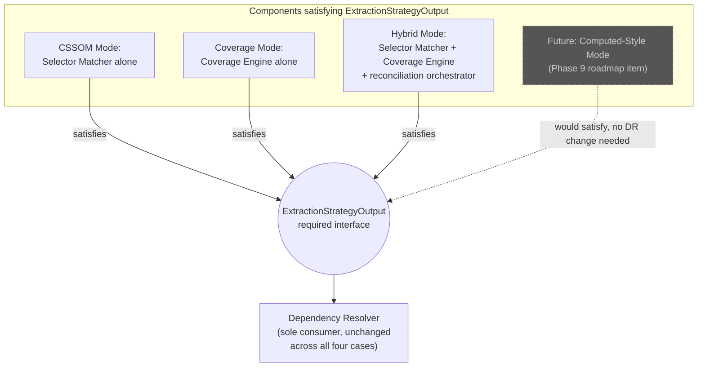
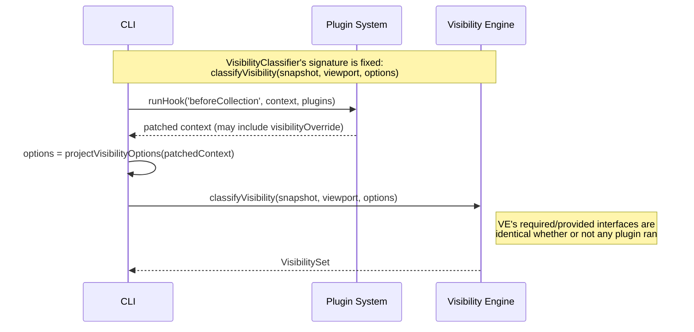

# 013 — Component Diagram

## 1. Title

**Critical CSS Extraction Engine — Component Diagram and Port Contracts**

## 2. Version

| Field | Value |
|---|---|
| Document Version | 1.0.0 |
| Status | Accepted |
| Last Updated | 2026-07-09 |
| Owners | Core Architecture Working Group |
| Stability | Stable (Phase 2 architecture document; adding/removing a provided or required interface requires an ADR) |

## 3. Purpose

[012-Module-Interaction.md](012-Module-Interaction.md) documents *how* modules talk to each other at runtime: call shapes, DTOs, statefulness. This document formalizes *what each module exposes and depends on*, at the level of detail C4 calls the "Component" diagram: each of the fifteen modules from Section 2.4 of the Documentation Agent Brief is treated as a component with an explicit set of **provided interfaces** (ports it exposes for others to call) and **required interfaces** (ports it depends on from others). This is a stricter, more formal artifact than [012-Module-Interaction.md](012-Module-Interaction.md)'s narrative call-contract description — it exists so that "can module X be replaced without touching module Y" is answerable by inspecting a table, not by re-reading prose.

This document's second purpose is to make the connection between component boundaries and the two extensibility mechanisms this project is built around — the Plugin System ([ADR-0004-Plugin-Lifecycle-Model.md](../adr/ADR-0004-Plugin-Lifecycle-Model.md)) and the pluggable CSSOM/Coverage/Hybrid extraction strategies (Principle 4 of [006-Design-Principles.md](006-Design-Principles.md), [ADR-0005-Hybrid-Extraction-Mode.md](../adr/ADR-0005-Hybrid-Extraction-Mode.md)) — explicit at the interface level: both mechanisms work *because* consumers depend on a required interface, never on a concrete implementing component, and this document is where that claim is demonstrated component-by-component rather than merely asserted.

## 4. Audience

- Implementers defining the concrete TypeScript `interface`/`type` declarations for each module's public API surface, one step upstream of the eventual `docs/api/` documentation (a later phase) that will specify full type bodies.
- Architects and reviewers evaluating a proposed new extraction strategy (e.g., a future `ComputedStyleMode`, per the roadmap's Phase 9) or a proposed new module, who need to check which existing required interfaces the new component must satisfy or consume.
- Plugin SDK authors (Phase 12) who need the precise shape of the interfaces a plugin sits between, prior to writing plugin-facing documentation.
- Autonomous coding agents scaffolding package `src/index.ts` barrel exports, for whom this document's provided-interface tables are the direct source of what belongs in each package's public export surface.

Assumes the reader has already internalized [012-Module-Interaction.md](012-Module-Interaction.md)'s call-contract taxonomy (SCC, ECC, LHC) and [006-Design-Principles.md](006-Design-Principles.md) Principle 4's Strategy pattern rationale.

## 5. Prerequisites

- [012-Module-Interaction.md](012-Module-Interaction.md) — the runtime call-shape and DTO-flow document this one formalizes into ports.
- [006-Design-Principles.md](006-Design-Principles.md) Principle 4 — the Strategy-pattern justification for treating CSSOM, Coverage, and Hybrid as interchangeable implementations behind one interface.
- [ADR-0004-Plugin-Lifecycle-Model.md](../adr/ADR-0004-Plugin-Lifecycle-Model.md) — the hook contract this document places at specific component ports.
- Familiarity with the C4 model's "Component" level of detail (components within a container, their responsibilities, and their interface boundaries) — this document does not require C4 tooling, only the conceptual level of granularity C4 defines for this layer.
- Familiarity with the "dependency inversion" pattern (consumers depend on abstractions, not concrete implementations) as it appears in TypeScript via `interface` types.

## 6. Related Documents

- [001-Vision.md](001-Vision.md) — the browser-as-source-of-truth commitment that shapes which components require a live page handle as part of their required interface.
- [006-Design-Principles.md](006-Design-Principles.md) — Principle 4 (Pluggable Strategy Architecture) is this document's primary organizing concern; Principle 7 (Plugin Sandboxing) is the second.
- [007-Repository-Structure.md](007-Repository-Structure.md) — the package-level DAG; this document's component ports are the interface-level detail underlying each edge in that graph.
- [ADR-0004-Plugin-Lifecycle-Model.md](../adr/ADR-0004-Plugin-Lifecycle-Model.md) — the formal hook contract.
- [ADR-0005-Hybrid-Extraction-Mode.md](../adr/ADR-0005-Hybrid-Extraction-Mode.md) — the decision record for the strategy composition this document's `ExtractionStrategy` port formalizes.
- [012-Module-Interaction.md](012-Module-Interaction.md) — runtime call/event contracts, one level less formal than this document's port declarations.
- [014-Dependency-Graph.md](014-Dependency-Graph.md) — deeper acyclicity analysis of both the build-time package graph and this document's component-port graph.
- [015-Runtime-Model.md](015-Runtime-Model.md) — process/thread boundaries that determine which required interfaces are "free" (in-process function calls) versus costly (cross-process/browser round trips).
- [016-Data-Flow.md](016-Data-Flow.md) — end-to-end field-level data lineage across the ports defined here.

## 7. Overview

A component, in this document's usage, is one of the fifteen Section-2.4 modules, described by exactly three things: its **provided interface** (the method signatures other components may call on it — its public API surface, matching what a `src/index.ts` barrel file would export), its **required interfaces** (the method signatures it calls on other components, expressed as abstract interface types it depends on, not concrete component references), and its **internal state model** (already classified in [012-Module-Interaction.md](012-Module-Interaction.md) §9.1 as stateful, ephemeral, stateless, or cross-cutting).

The central architectural claim this document defends is: **every dependency edge in the system is a dependency on an interface type, never on a concrete component.** This is not a stylistic preference; it is the mechanism by which two of this project's most important extensibility requirements are satisfiable at all:

1. **Plugin System extensibility (Principle 7, [ADR-0004](../adr/ADR-0004-Plugin-Lifecycle-Model.md)).** A plugin never receives a reference to a concrete component (a live `BrowserManager` instance, a live `Page`); it receives a `HookContext` — itself a plain data interface — and returns a typed patch. The Plugin System component's required interface, from the perspective of every pipeline component, is uniform and narrow regardless of which plugins are installed.
2. **Pluggable extraction strategies (Principle 4, [ADR-0005](../adr/ADR-0005-Hybrid-Extraction-Mode.md)).** The Dependency Resolver's required interface is `ExtractionStrategyOutput` (a union/intersection type any of CSSOM, Coverage, or Hybrid can satisfy), never a concrete reference to "the CSSOM Walker" or "the Coverage Engine." Swapping which strategy produced that output, or adding a fourth strategy, requires zero changes to the Dependency Resolver's required-interface declaration.

The remainder of this document works through all fifteen components' provided/required interface tables, a consolidated Mermaid class-diagram view of the whole system's ports, and a dedicated treatment (§8.4) of how the `ExtractionStrategy` abstraction and the plugin hook contracts both reduce, in the end, to the same underlying pattern: **narrow, versioned, data-only interfaces standing between components, so that any component behind a required interface is replaceable without its consumers' code changing.**

## 8. Detailed Design

### 8.1 Component Notation

Each component below is described with:

- **Provided interface** — method signatures (names and parameter/return shapes; full type bodies are deferred to `docs/api/`, per this document's brief-mandated scope) that other components may call.
- **Required interfaces** — the abstract interface types (not concrete component names) this component depends on to do its job.
- **State classification** — carried over from [012-Module-Interaction.md](012-Module-Interaction.md) §9.1.
- **Package** — the `packages/*` or `apps/*` unit from [007-Repository-Structure.md](007-Repository-Structure.md) that implements this component.

### 8.2 Component Catalog

#### CLI

- **Package:** `apps/cli`
- **Provided interface:** `run(args: CliArgs): Promise<ExitCode>` — the only provided interface, since nothing in the system calls into the CLI (it is a pure entry point).
- **Required interfaces:** `ConfigurationSource` (from Configuration Loader), `CacheGate` (from Cache Manager), `BrowserContextProvider` (from Browser Manager), `PluginHookRunner` (from Plugin System), `DiagnosticSink & ReportFinalizer` (from Reporter), plus every pipeline stage's provided interface transitively (`VisibilityClassifier`, `RuleTreeWalker`, `SelectorMatcher`, `CoverageRecorder`, `DependencyResolver`, `CascadeResolver`, `RuleSerializer`, `RuleMinifier`).
- **State:** Stateless across invocations of `run()`.

#### Configuration Loader

- **Package:** `apps/cli` (per [007-Repository-Structure.md](007-Repository-Structure.md) Implementation Notes; a candidate for promotion to `packages/config` per that document's Future Work)
- **Provided interface:** `ConfigurationSource { resolve(sources: ConfigSource[]): Result<ResolvedConfig, Diagnostic[]> }`
- **Required interfaces:** None beyond `packages/shared` type definitions — this is the system's unique zero-required-interface component, a direct restatement of [012-Module-Interaction.md](012-Module-Interaction.md)'s observation that it is the only module with no outward SCC edges.
- **State:** Stateless.

#### Browser Manager

- **Package:** `packages/browser`
- **Provided interface:** `BrowserContextProvider { acquireContext(profile: ViewportProfile): Result<BrowserContextHandle, Diagnostic[]>; releaseContext(handle: BrowserContextHandle): Result<void, Diagnostic[]> }`
- **Required interfaces:** None at the component-port level (its internal dependency on the Playwright library itself is an external, not intra-system, dependency and is out of scope for this document's port catalog — it belongs to the Phase 3 design documents, e.g., forthcoming `docs/design/101-Playwright-Adapter.md`).
- **State:** Stateful; owns the pool, long-lived across many `acquireContext`/`releaseContext` cycles within one process.

#### Navigation Engine

- **Package:** `packages/browser`
- **Provided interface:** `PageNavigator { navigate(context: BrowserContextHandle, target: NavigationTarget): Result<StablePage, Diagnostic[]> }`
- **Required interfaces:** `BrowserContextProvider` (consumes the handle produced by Browser Manager, though notably the handle is *passed in* by the orchestrator rather than fetched by this component itself — see §12 for why this is deliberately not a direct required-interface call).
- **State:** Stateful within one call's lifetime (holds the live `Page` reference for the duration of `navigate`, and the returned `StablePage` remains valid for the caller's subsequent use, but the Navigation Engine itself retains no cross-call memory).

#### DOM Collector

- **Package:** `packages/collector`
- **Provided interface:** `NodeCollector { collectNodes(page: StablePage, foldConfig: FoldConfig): Result<NodeSnapshot, Diagnostic[]> }`
- **Required interfaces:** None beyond the `StablePage` type contract itself (a data interface, not a component reference — it does not call back into Navigation Engine).
- **State:** Ephemeral (no cross-call state).

#### Visibility Engine

- **Package:** `packages/collector`
- **Provided interface:** `VisibilityClassifier { classifyVisibility(snapshot: NodeSnapshot, viewport: ViewportProfile, options: VisibilityOptions): Result<VisibilitySet, Diagnostic[]> }`
- **Required interfaces:** `ComputedStyleBridge` (optional, narrow, for the fallback geometry re-query case named in [012-Module-Interaction.md](012-Module-Interaction.md) §8.2 and formalized in §12 below).
- **State:** Stateless (pure function of `NodeSnapshot` plus configuration in the common case).

#### CSSOM Walker

- **Package:** `packages/collector`
- **Provided interface:** `RuleTreeWalker { walkStylesheets(page: StablePage, options: WalkOptions): Result<RuleTree, Diagnostic[]> }`
- **Required interfaces:** None (a producer-only component, per [012-Module-Interaction.md](012-Module-Interaction.md) §8.2).
- **State:** Ephemeral, with an internal, non-load-bearing browser-side rule index cache (per Principle 3's permitted-memoization carve-out).

#### Selector Matcher

- **Package:** `packages/matcher`
- **Provided interface:** `SelectorMatcher { matchRules(ruleTree: RuleTree, visibilitySet: VisibilitySet, page: StablePage): Result<MatchedRuleSet, Diagnostic[]> }`
- **Required interfaces:** `RuleTree` and `VisibilitySet` are consumed as data (not component calls); the one genuine required-interface dependency is on the `StablePage` bridge to execute the in-page `element.matches()` batch. This component satisfies part of the `ExtractionStrategy` contract for CSSOM mode (§8.4).
- **State:** Ephemeral, with a per-run memoization cache keyed on selector text (Principle 2's permitted performance layer).

#### Coverage Engine

- **Package:** `packages/coverage`
- **Provided interface:** `CoverageRecorder { recordCoverage(page: StablePage, window: CoverageWindow): Result<CoverageReport, Diagnostic[]> }`
- **Required interfaces:** A `CDPSessionProvider` sub-interface of the browser bridge, narrower than the general `StablePage` interface Selector Matcher uses, since Coverage Engine's needs are CDP-domain-specific rather than general `page.evaluate()` access. This component satisfies part of the `ExtractionStrategy` contract for Coverage mode (§8.4).
- **State:** Stateful within one call (holds an active CDP recording session for the duration of the coverage window).

#### Dependency Resolver

- **Package:** `packages/dependency-graph`
- **Provided interface:** `DependencyResolver { resolveDependencies(seed: ExtractionStrategyOutput, ruleTree: RuleTree): Result<DependencyGraph, Diagnostic[]> }`
- **Required interfaces:** `ExtractionStrategyOutput` (the abstract union type satisfied by `MatchedRuleSet`, `CoverageReport`, or their Hybrid reconciliation — see §8.4); optionally `ComputedStyleBridge` for the narrow custom-property-resolution case.
- **State:** Stateless (pure function of its typed inputs, modulo the narrow conditional browser call).

#### Cascade Resolver

- **Package:** `packages/dependency-graph`
- **Provided interface:** `CascadeResolver { resolveCascade(dependencyGraph: DependencyGraph, matchedRules: MatchedRuleSet): Result<OrderedRuleSet, Diagnostic[]> }`
- **Required interfaces:** `ComputedStyleBridge` (optional, for browser-observed layer-order queries, per Principle 1).
- **State:** Stateless.

#### Serializer

- **Package:** `packages/serializer`
- **Provided interface:** `RuleSerializer { serialize(orderedRules: OrderedRuleSet, dependencyGraph: DependencyGraph, format: OutputFormat): Result<SerializedOutput, Diagnostic[]> }`
- **Required interfaces:** None (pure function of typed inputs; the canonicalization owner per Principle 5, deliberately isolated from any component reference that could reintroduce nondeterminism).
- **State:** Stateless.

#### Minifier

- **Package:** `packages/serializer`
- **Provided interface:** `RuleMinifier { minify(output: SerializedOutput, options: MinifyOptions): Result<SerializedOutput, Diagnostic[]> }`
- **Required interfaces:** None.
- **State:** Stateless.

#### Cache Manager

- **Package:** `packages/cache`
- **Provided interface:** `CacheGate { lookup(fingerprint: Fingerprint): Result<CachedExtractionResult | CacheMiss, Diagnostic[]>; store(fingerprint: Fingerprint, result: ExtractionResult): Result<void, Diagnostic[]> }`
- **Required interfaces:** `CacheStore` (the pluggable backend interface named in [006-Design-Principles.md](006-Design-Principles.md) Principle 8's Implementation Notes — local filesystem today, distributed backend in Phase 10) — notably, this is the Cache Manager's *only* required interface; per [007-Repository-Structure.md](007-Repository-Structure.md), it requires nothing from any pipeline component.
- **State:** Cross-cutting; backed by a persistent external store, not in-process state.

#### Reporter

- **Package:** `packages/reporter`
- **Provided interface:** `DiagnosticSink { record(event: DiagnosticEvent): void }; ReportFinalizer { finalize(): Report }`
- **Required interfaces:** `DependencyGraph` and `SerializedOutput` data shapes (consumed as data, not as calls back into Dependency Resolver/Serializer — per [012-Module-Interaction.md](012-Module-Interaction.md), the Reporter is a terminal consumer, so these are "required data shapes" rather than "required behavioral interfaces" in the strict sense, a distinction worth preserving precisely because it is what makes the Reporter safely a pure sink with zero behavioral coupling to upstream components).
- **State:** Cross-cutting; accumulates one run's diagnostic event log, discarded (or persisted only via its own output artifact) after `finalize()`.

#### Plugin System

- **Package:** `packages/plugins`
- **Provided interface:** `PluginHookRunner { runHook(hookName: HookName, context: HookContext, plugins: Plugin[]): Result<HookContext, Diagnostic[]> }`
- **Required interfaces:** None beyond `packages/shared` — mirroring the Cache Manager's isolation, and for the identical architectural reason (per [007-Repository-Structure.md](007-Repository-Structure.md) and [006-Design-Principles.md](006-Design-Principles.md) Principle 7's "interface inversion").
- **State:** The orchestration logic itself is stateless per call; individual plugin instances registered with it may hold their own internal state (e.g., a loaded ignore-list configuration), which is opaque to and unmanaged by the Plugin System component itself beyond lifecycle attribution (per-plugin timing/error isolation, [ADR-0004](../adr/ADR-0004-Plugin-Lifecycle-Model.md)).

### 8.3 Consolidated Port Table

| Component | Provided Interface | Required Interfaces |
|---|---|---|
| CLI | `CliEntrypoint` | `ConfigurationSource`, `CacheGate`, `BrowserContextProvider`, `PluginHookRunner`, `DiagnosticSink`, `ReportFinalizer`, + all pipeline provided interfaces |
| Configuration Loader | `ConfigurationSource` | — |
| Browser Manager | `BrowserContextProvider` | — |
| Navigation Engine | `PageNavigator` | (consumes `BrowserContextHandle` data type) |
| DOM Collector | `NodeCollector` | (consumes `StablePage` data type) |
| Visibility Engine | `VisibilityClassifier` | `ComputedStyleBridge` (optional) |
| CSSOM Walker | `RuleTreeWalker` | — |
| Selector Matcher | `SelectorMatcher` | (consumes `StablePage` data type) |
| Coverage Engine | `CoverageRecorder` | `CDPSessionProvider` |
| Dependency Resolver | `DependencyResolver` | `ExtractionStrategyOutput`, `ComputedStyleBridge` (optional) |
| Cascade Resolver | `CascadeResolver` | `ComputedStyleBridge` (optional) |
| Serializer | `RuleSerializer` | — |
| Minifier | `RuleMinifier` | — |
| Cache Manager | `CacheGate` | `CacheStore` |
| Reporter | `DiagnosticSink`, `ReportFinalizer` | (consumes DependencyGraph/SerializedOutput as data) |
| Plugin System | `PluginHookRunner` | — |

Five components — Configuration Loader, Browser Manager, CSSOM Walker, Serializer, Minifier, Cache Manager, Plugin System — have **no behavioral required interface at all** (Cache Manager and Plugin System require only their own pluggable-backend/plugin-instance abstractions, which are configuration-supplied, not intra-pipeline dependencies). This is not an accident of enumeration; it is the direct, visible consequence of the layering enforced in [007-Repository-Structure.md](007-Repository-Structure.md): the base of any dependency graph is, definitionally, the set of nodes with no outgoing edges, and a system designed with correctness and testability as primary goals (Principles 3 and 5) should have as many such nodes as the problem domain allows.

### 8.4 How Component Boundaries Enable the Two Extensibility Mechanisms

**Pluggable extraction strategies.** The `ExtractionStrategy` abstraction named in [006-Design-Principles.md](006-Design-Principles.md) Principle 4 is, in this document's vocabulary, a required interface — `ExtractionStrategyOutput` — declared once by the Dependency Resolver and satisfiable by any component (or composition of components) that produces a value of that shape. Concretely:

```
interface ExtractionStrategyOutput {
    matchedRules?: MatchedRuleSet   // present for CSSOM and Hybrid
    coverageReport?: CoverageReport // present for Coverage and Hybrid
    provenance: 'cssom' | 'coverage' | 'hybrid'
}
```

- **CSSOM mode** is satisfied by Selector Matcher alone (`coverageReport` absent).
- **Coverage mode** is satisfied by Coverage Engine alone (`matchedRules` absent).
- **Hybrid mode** is satisfied by a small orchestrating function (living in `packages/dependency-graph` or a dedicated module, per [007-Repository-Structure.md](007-Repository-Structure.md) Implementation Notes) that calls both Selector Matcher and Coverage Engine independently — neither aware of the other, per the peer-only invariant — and reconciles their outputs into one `ExtractionStrategyOutput` value.

The Dependency Resolver's provided/required interface declaration (§8.2) does not change across any of these three cases. This is the concrete, verifiable proof of Principle 4's claim that "new strategies MUST be addable without modifying consumers of the interface": adding a fourth strategy (e.g., a future `ComputedStyleMode` per the roadmap's Phase 9) means writing a new component that produces a valid `ExtractionStrategyOutput` value and wiring it into the CLI's strategy-selection point — zero changes to Dependency Resolver, Cascade Resolver, Serializer, Minifier, Cache Manager, or Reporter's port declarations.

**Plugin System extensibility.** Every pipeline component that is subject to a plugin hook (per [012-Module-Interaction.md](012-Module-Interaction.md) §8.3's hook-placement table) receives its patched arguments as ordinary typed parameters of its existing provided interface — never as an additional required interface pointing at "the Plugin System" or at any specific plugin. Concretely, Visibility Engine's `classifyVisibility(snapshot, viewport, options)` signature contains a `VisibilityOptions.visibilityOverride?: (node: CollectedNode) => boolean | undefined` field whether or not any plugin is installed; when a plugin's `beforeCollection` hook returns a `visibilityOverride` patch, the CLI's orchestration populates that field before calling Visibility Engine — the component's required-interface surface is completely unaffected by plugin presence. This is the interface-level proof of Principle 7's sandboxing claim that "plugins interact with the pipeline exclusively through well-typed, narrow hook contracts": plugins never become a required interface of any pipeline component; they only ever influence the *values* passed across an unchanged provided-interface boundary, mediated exclusively by the Plugin System component and the CLI.

**Why this matters architecturally.** Both mechanisms achieve openness for extension (new strategies, new plugins) while remaining closed for modification (no existing component's interface changes) — the classical Open/Closed Principle, achieved here specifically through the discipline of "required interfaces are abstract types satisfiable by multiple implementations, never concrete component references," which is this document's single unifying design rule and the reason it is worth stating as its own document distinct from [012-Module-Interaction.md](012-Module-Interaction.md)'s narrower call-shape focus.

## 9. Architecture

### 9.1 Component/Port Class Diagram

The following Mermaid class diagram renders every component as a class with its provided interface's method signatures (method names, not full type bodies, per this document's mandated scope — full DTO type bodies belong to `docs/api/`) and its required-interface dependencies as association arrows.

```mermaid
classDiagram
    class CLI {
        +run(args) ExitCode
    }
    class ConfigurationLoader {
        <<provides ConfigurationSource>>
        +resolve(sources) ResolvedConfig
    }
    class BrowserManager {
        <<provides BrowserContextProvider>>
        +acquireContext(profile) BrowserContextHandle
        +releaseContext(handle) void
    }
    class NavigationEngine {
        <<provides PageNavigator>>
        +navigate(context, target) StablePage
    }
    class DOMCollector {
        <<provides NodeCollector>>
        +collectNodes(page, foldConfig) NodeSnapshot
    }
    class VisibilityEngine {
        <<provides VisibilityClassifier>>
        +classifyVisibility(snapshot, viewport, options) VisibilitySet
    }
    class CSSOMWalker {
        <<provides RuleTreeWalker>>
        +walkStylesheets(page, options) RuleTree
    }
    class SelectorMatcher {
        <<provides SelectorMatcher>>
        +matchRules(ruleTree, visibilitySet, page) MatchedRuleSet
    }
    class CoverageEngine {
        <<provides CoverageRecorder>>
        +recordCoverage(page, window) CoverageReport
    }
    class DependencyResolver {
        <<provides DependencyResolver>>
        +resolveDependencies(seed, ruleTree) DependencyGraph
    }
    class CascadeResolver {
        <<provides CascadeResolver>>
        +resolveCascade(dependencyGraph, matchedRules) OrderedRuleSet
    }
    class Serializer {
        <<provides RuleSerializer>>
        +serialize(orderedRules, dependencyGraph, format) SerializedOutput
    }
    class Minifier {
        <<provides RuleMinifier>>
        +minify(output, options) SerializedOutput
    }
    class CacheManager {
        <<provides CacheGate>>
        +lookup(fingerprint) CachedExtractionResult
        +store(fingerprint, result) void
    }
    class Reporter {
        <<provides DiagnosticSink, ReportFinalizer>>
        +record(event) void
        +finalize() Report
    }
    class PluginSystem {
        <<provides PluginHookRunner>>
        +runHook(hookName, context, plugins) HookContext
    }
    class ExtractionStrategyOutput {
        <<interface>>
        matchedRules
        coverageReport
        provenance
    }
    class CacheStore {
        <<interface>>
    }
    class ComputedStyleBridge {
        <<interface>>
    }

    CLI ..> ConfigurationLoader : requires
    CLI ..> CacheManager : requires
    CLI ..> BrowserManager : requires
    CLI ..> PluginSystem : requires
    CLI ..> Reporter : requires
    CLI ..> NavigationEngine : requires
    CLI ..> DOMCollector : requires
    CLI ..> VisibilityEngine : requires
    CLI ..> CSSOMWalker : requires
    CLI ..> SelectorMatcher : requires
    CLI ..> CoverageEngine : requires
    CLI ..> DependencyResolver : requires
    CLI ..> CascadeResolver : requires
    CLI ..> Serializer : requires
    CLI ..> Minifier : requires

    SelectorMatcher ..|> ExtractionStrategyOutput : satisfies
    CoverageEngine ..|> ExtractionStrategyOutput : satisfies
    DependencyResolver ..> ExtractionStrategyOutput : requires

    VisibilityEngine ..> ComputedStyleBridge : requires optional
    DependencyResolver ..> ComputedStyleBridge : requires optional
    CascadeResolver ..> ComputedStyleBridge : requires optional

    CacheManager ..> CacheStore : requires
```



### 9.2 Strategy Substitutability View

The following diagram isolates the `ExtractionStrategyOutput` port to show, concretely, how three (and, in the future, a fourth) implementations can satisfy one required interface without the consuming component (Dependency Resolver) changing.



### 9.3 Plugin Interception at the Port Level



## 10. Algorithms

### Algorithm: Required-Interface Satisfiability Check (Strategy Substitution Validity)

**Problem statement.** Given a candidate new or modified component claiming to implement the `ExtractionStrategyOutput` interface (or any other required interface catalogued in §8.3), determine whether it can be substituted for an existing implementation without requiring changes to any consumer's provided-interface declaration.

**Inputs.** `candidateComponent: ComponentSpec` (its own provided interface, and the shape of the value it produces); `requiredInterface: InterfaceSpec` (the structural type the consumer depends on); `consumers: ComponentSpec[]` (components whose required-interface declarations must remain unchanged).

**Outputs.** A boolean `isSubstitutable`, plus, on failure, the specific structural mismatch (missing field, incompatible type, or an implicit dependency the candidate has on the *previous* implementation's internals rather than on the interface).

**Pseudocode:**
```text
function checkSubstitutability(candidateComponent, requiredInterface, consumers):
    producedShape = inferOutputShape(candidateComponent)
    structuralMismatch = diffShapes(producedShape, requiredInterface)
    if structuralMismatch is not empty:
        return { isSubstitutable: false, reason: "structural mismatch", detail: structuralMismatch }

    for consumer in consumers:
        # A consumer is disqualified from "substitution-safe" status if its own
        # source imports the candidate's sibling/previous implementation directly,
        # rather than depending solely on the abstract interface type.
        if consumer.importsConcreteImplementation(candidateComponent.siblingImplementations):
            return { isSubstitutable: false, reason: "consumer depends on concrete implementation, not interface" }

    return { isSubstitutable: true }
```

**Time complexity.** O(fields(requiredInterface) + consumers × importsChecked), dominated by the structural diff, which is linear in the interface's field count — small and constant in practice (the `ExtractionStrategyOutput` interface has three fields).

**Memory complexity.** O(1) beyond the structural diff's transient representation.

**Failure cases.** A candidate component produces a structurally compatible shape but achieves it by depending on a *sibling* implementation's internals (e.g., a hypothetical fourth strategy that internally imports Selector Matcher's private memoization cache rather than only its provided interface) — this passes the naive structural check but violates the substitutability guarantee in spirit; the second loop in the pseudocode exists specifically to catch this class of violation by checking consumer import graphs, not just produced-value shapes.

**Optimization opportunities.** This check is inexpensive enough to run as a static lint rule (import-graph analysis) in CI on every pull request touching a component satisfying a catalogued required interface, rather than as a runtime check — it is fundamentally a structural/static-analysis problem, not a data-dependent one.

## 11. Implementation Notes

- Every required interface in §8.3 (`ExtractionStrategyOutput`, `ComputedStyleBridge`, `CacheStore`, `CDPSessionProvider`) must be declared as a named TypeScript `interface` in `packages/shared`, exported from its barrel file, and imported by name everywhere it is used — never inlined as an anonymous object type at each call site, since an anonymous type cannot be the target of the substitutability check in §10 or of the import-graph lint rule proposed there.
- Components with zero required interfaces (Configuration Loader, Browser Manager, CSSOM Walker, Serializer, Minifier) should have this property enforced by the same ESLint import-restriction mechanism proposed in [006-Design-Principles.md](006-Design-Principles.md) Implementation Notes: their package's `tsconfig.json` "references" field should list only `packages/shared`, making an accidental new required interface a build-time reference-graph violation, not merely a documentation violation.
- The Hybrid strategy's reconciliation orchestrator (§8.4) should itself be documented with its own provided/required interface pair once Phase 9 design documents (`docs/design/701-Hybrid-Mode.md`) are written — this document intentionally treats it as "a small function inside `packages/dependency-graph`" per [007-Repository-Structure.md](007-Repository-Structure.md) Implementation Notes, rather than promoting it to a full sixteenth component, since its job is composition, not independent responsibility ownership.
- Plugin authors consuming the Plugin SDK (Phase 12) should be given a subset view of this document's port catalog — specifically, the exact shape of `HookContext` at each of the six hook points — without exposure to the full internal required-interface graph, since plugin authors' mental model should be "I receive a data context and return a data patch," never "I depend on component X's interface."

## 12. Edge Cases

- **`ComputedStyleBridge` as a shared optional required interface across three components.** Visibility Engine, Dependency Resolver, and Cascade Resolver all optionally require `ComputedStyleBridge` (per §8.2, §8.3) for narrow browser-observed-fact queries. This interface must be defined once, in `packages/shared`, and not re-derived independently by each of the three components, or the "narrow, single accessor" property claimed in [012-Module-Interaction.md](012-Module-Interaction.md) §12 silently erodes into three independent, potentially divergent browser-access surfaces.
- **`StablePage` is a data type, not a component reference, even though it originates from a component (Navigation Engine).** DOM Collector, CSSOM Walker, and Selector Matcher all consume a `StablePage` value but declare no required interface on Navigation Engine itself — they receive the value as an ordinary function parameter, supplied by the orchestrator. This is a deliberate and important distinction this document maintains throughout §8.2: consuming a value *produced by* a component is not the same as requiring that component's *interface*, and conflating the two would incorrectly inflate the required-interface graph with edges that do not actually constrain substitutability (Navigation Engine could be replaced by any other component capable of producing a valid `StablePage`, and none of DOM Collector/CSSOM Walker/Selector Matcher's declarations would need to change).
- **Reporter's "required data shapes" versus true required interfaces.** As flagged in §8.2, Reporter consumes `DependencyGraph` and `SerializedOutput` shapes without a behavioral required interface on Dependency Resolver or Serializer. If a future refactor (flagged as an open question in [007-Repository-Structure.md](007-Repository-Structure.md) Future Work) introduces a dedicated "reportable result" DTO in `packages/shared`, this document's port table would need updating to reflect Reporter depending on that new shared type instead of directly on `DependencyGraph`/`SerializedOutput` — tracked here as a forward-compatibility note, not a current inconsistency.
- **Plugin instances as opaque state within the Plugin System component.** Section 8.2 notes that individual plugins may hold internal state invisible to the Plugin System's own state classification. A plugin that violates Principle 5 by holding nondeterministic internal state (e.g., a random-number seed) is a plugin-author error, not a Plugin System component defect, and this document's port model has no mechanism to statically prevent it — only the runtime diagnostics/timeout machinery in [ADR-0004](../adr/ADR-0004-Plugin-Lifecycle-Model.md) can detect its symptoms.
- **A required interface satisfied by a *composition* of components, not a single one.** The Hybrid strategy is the only case in this catalog where one required interface (`ExtractionStrategyOutput`) is satisfied by the joint behavior of two independently-existing components (Selector Matcher, Coverage Engine) plus a small orchestrator, rather than by one component's provided interface directly. This is intentional (§8.4) but must not be mistaken for Selector Matcher or Coverage Engine themselves declaring `ExtractionStrategyOutput` as part of their own provided interface — neither does; each has its own narrower provided interface (`MatchedRuleSet`, `CoverageReport` respectively), and only the Hybrid orchestrator's output is typed as `ExtractionStrategyOutput`.

## 13. Tradeoffs

| Decision | Why | Alternative Considered | Tradeoff Accepted |
|---|---|---|---|
| Required interfaces are abstract types, never concrete component references, everywhere in the catalog | The load-bearing mechanism for both extensibility axes (§8.4); without it, Principle 4's and Principle 7's extensibility claims would be aspirational rather than structurally enforced | Allowing components to reference concrete sibling components directly when "it's obviously fine" (e.g., Dependency Resolver importing Selector Matcher's class directly since, today, CSSOM mode is common) | A small amount of upfront indirection (defining `ExtractionStrategyOutput` even before a fourth strategy exists) for a large reduction in future refactor cost |
| `StablePage`/`RuleTree`/`VisibilitySet` etc. are treated as data, not producing-component references (§12) | Keeps the required-interface graph reflecting genuine behavioral coupling, not incidental data provenance | Modeling every data-producing relationship as a required interface too, for maximal explicitness | A less "complete" but more actionable graph — the distinction requires readers to understand it (documented explicitly here) rather than being self-evident from the diagram alone |
| `ComputedStyleBridge` is one shared optional interface across three components rather than three separate narrow interfaces | A single definition is easier to audit for "is this accessor staying narrow" (per [012-Module-Interaction.md](012-Module-Interaction.md) §12's concern) | Three independent, module-specific browser-access interfaces, each tailored slightly differently | Some components may receive a slightly more general interface than their specific need, in exchange for one auditable definition |
| Hybrid mode is a composition, not a fourth peer component with its own catalog entry | Matches [007-Repository-Structure.md](007-Repository-Structure.md)'s explicit decision not to promote it to a full package/component until it has independent responsibility ownership | Giving Hybrid mode its own full component entry now, symmetrically with CSSOM and Coverage | The port catalog under-represents Hybrid mode's real complexity today, deferred explicitly to Phase 9 design documents rather than resolved here |

## 14. Performance

- **CPU complexity.** Component boundaries themselves add negligible CPU overhead (an interface-typed function call is not meaningfully more expensive than a concretely-typed one in a compiled/JIT'd JavaScript runtime); the performance-relevant boundaries remain the browser-bridged ones already identified in [012-Module-Interaction.md](012-Module-Interaction.md) §14.
- **Memory complexity.** The `ExtractionStrategyOutput` union type's optional fields (`matchedRules?`, `coverageReport?`) mean CSSOM-mode runs never allocate a `CoverageReport` and vice versa — a small but real memory benefit of the union-shaped interface over a hypothetical always-both-populated alternative.
- **Caching strategy.** Not directly affected by component/port structure; the Cache Manager's `CacheStore` required interface (§8.2) is itself the pluggability point for swapping local-filesystem versus distributed cache backends (Phase 10 roadmap) without any change to `CacheGate`'s provided interface — a second, smaller instance of the same substitutability pattern demonstrated for extraction strategies in §8.4.
- **Parallelization opportunities.** Components with no required interfaces on each other (e.g., Selector Matcher and Coverage Engine, per §9.2) can execute concurrently with no synchronization concerns beyond what [012-Module-Interaction.md](012-Module-Interaction.md) §14 already specifies; the port catalog makes this concurrency-safety claim auditable — any future accidental required-interface edge between the two would immediately flag a violation of the documented independence.
- **Incremental execution.** The Cache Manager's port isolation (requiring only `CacheStore`) is what allows the CLI to consult it *before* instantiating any pipeline component's required-interface dependencies at all — a cold cache-hit path never even needs to construct a `StablePage` or acquire a browser context, which is a direct performance consequence of the port graph's shape, not merely of the caching *logic*.
- **Profiling guidance.** When investigating unexpectedly high latency in a specific extraction mode, first check whether the `ExtractionStrategyOutput`-satisfying implementation in use (CSSOM/Coverage/Hybrid) is the expected one — a misconfigured strategy selection is a common, cheap-to-diagnose cause of performance regressions given how interchangeable the implementations are structurally.
- **Scalability limits.** Not directly a function of component/port structure; see [012-Module-Interaction.md](012-Module-Interaction.md) §14 and [001-Vision.md](001-Vision.md) §14 for the substantive scalability discussion, which this document's port catalog does not alter.

## 15. Testing

- **Unit tests.** Each component's provided interface should have a dedicated contract test suite that instantiates the component with mock required-interface implementations (mock `ComputedStyleBridge`, mock `CacheStore`, etc.) and asserts the provided interface's behavior in isolation — this is the direct testing payoff of the dependency-inversion discipline: any component can be unit tested without a real browser, real cache backend, or real plugin, by substituting a test double for its required interfaces.
- **Integration tests.** A "strategy substitutability" integration test should run the full pipeline three times against the same fixture (once per CSSOM/Coverage/Hybrid mode) and assert that Dependency Resolver, Cascade Resolver, Serializer, and Minifier's behavior — not merely their final output — is otherwise identical in structure (same call count, same interface shapes observed), directly validating §8.4's central claim.
- **Visual tests.** Not directly applicable to the port catalog itself, though any new implementation of `ExtractionStrategyOutput` should pass the same visual-regression fixture suite as existing implementations before being considered a valid substitute, per the substitutability check's spirit even where the check itself (§10) is purely structural/static.
- **Stress tests.** Register a large number of mock plugins that touch every hook and assert, per §9.3's sequence diagram, that no pipeline component's required-interface set changes shape under load — this catches a specific regression class where a well-intentioned "quick fix" leaks a Plugin System reference into a pipeline component's constructor under time pressure.
- **Regression tests.** Any pull request that adds a new required interface to a component in the "zero required interfaces" set (§8.3: Configuration Loader, Browser Manager, CSSOM Walker, Serializer, Minifier, Cache Manager, Plugin System) should trigger a mandatory documentation update to this file and, ideally, an ADR discussion, mirroring the "extra edge" hard-failure policy for the build-time graph in [007-Repository-Structure.md](007-Repository-Structure.md).
- **Benchmark tests.** Not a primary concern of the port catalog itself, but the substitutability-check algorithm (§10), if implemented as an actual CI lint step, should itself be benchmarked to confirm it remains sub-second even as the interface catalog grows, since it is intended to run on every relevant pull request.

## 16. Future Work

- Promote the substitutability check in §10 from a documented algorithm to an actual static-analysis CI tool (an import-graph linter specific to the interfaces catalogued here), extending the general "principle linter" idea raised in [006-Design-Principles.md](006-Design-Principles.md) Future Work to this document's specific port contracts.
- Formalize the Hybrid strategy's reconciliation orchestrator as its own documented component (with its own provided/required interface entry) once Phase 9's `docs/design/701-Hybrid-Mode.md` specifies its exact responsibilities, resolving the current "composition, not component" treatment flagged in §12/§13.
- Investigate whether `ComputedStyleBridge`'s three consumers (Visibility Engine, Dependency Resolver, Cascade Resolver) should be consolidated behind a single shared internal component (a small "Computed Style Facade") rather than three independent optional-dependency declarations, simplifying the port catalog's treatment of this one recurring edge case.
- Extend this document's provided-interface method-name-only signatures into the full, type-body-complete API reference once `docs/api/` (a later phase) is written, at which point this document should be updated to link into, rather than partially duplicate, that reference.
- Open question: should the `ExtractionStrategyOutput` interface itself be versioned independently of the overall engine version (mirroring [ADR-0004](../adr/ADR-0004-Plugin-Lifecycle-Model.md)'s treatment of per-hook patch-contract versioning), to allow third-party strategy implementations to declare compatibility with a specific interface version rather than an entire engine release? This is likely necessary once/if strategies become independently publishable, per the roadmap's longer-term extensibility ambitions, but is not yet resolved.

## 17. References

- [001-Vision.md](001-Vision.md)
- [006-Design-Principles.md](006-Design-Principles.md)
- [007-Repository-Structure.md](007-Repository-Structure.md)
- [ADR-0004-Plugin-Lifecycle-Model.md](../adr/ADR-0004-Plugin-Lifecycle-Model.md)
- [ADR-0005-Hybrid-Extraction-Mode.md](../adr/ADR-0005-Hybrid-Extraction-Mode.md)
- [010-System-Overview.md](010-System-Overview.md)
- [011-Execution-Pipeline.md](011-Execution-Pipeline.md)
- [012-Module-Interaction.md](012-Module-Interaction.md)
- [014-Dependency-Graph.md](014-Dependency-Graph.md)
- [015-Runtime-Model.md](015-Runtime-Model.md)
- [016-Data-Flow.md](016-Data-Flow.md)
- Section 2.4 ("System Modules"), Section 2.7 ("Hybrid Extraction Mode"), and Section 2.13 ("Plugin System Hooks") of the Documentation Agent Brief
- C4 Model documentation (Simon Brown) — reference for the "Component" level of architectural detail this document targets
- Gang of Four, *Design Patterns: Elements of Reusable Object-Oriented Software* — Strategy pattern, referenced in [006-Design-Principles.md](006-Design-Principles.md) Principle 4 and formalized here at the interface level
- Martin, R. C., "The Dependency Inversion Principle" — the underlying discipline this document's required-interface treatment is built on
