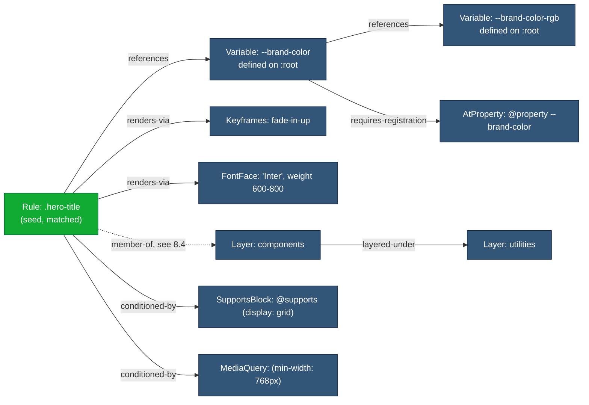
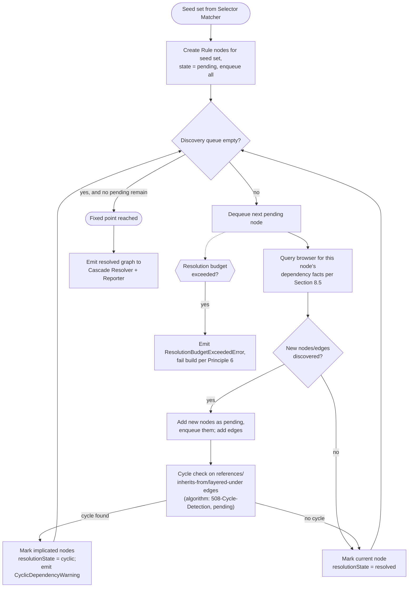
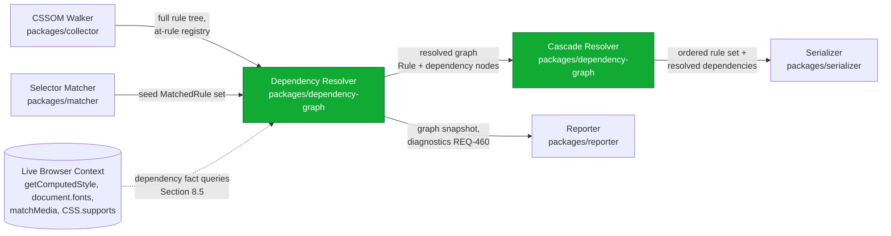
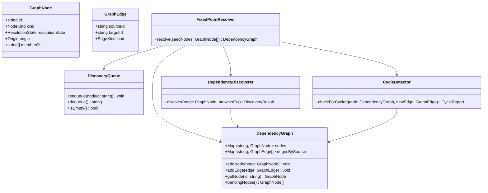

# 014 — Dependency Graph

## 1. Title

**Critical CSS Extraction Engine — Runtime CSS Dependency Graph Architecture**

## 2. Version

| Field | Value |
|---|---|
| Document Version | 1.0.0 |
| Status | Draft — Phase 2 (Architecture) |
| Last Updated | 2026-07-09 |
| Owners | Core Architecture Working Group |
| Stability | Stable core model; algorithmic details subject to refinement in Phase 7 (`docs/design/500-Dependency-Resolution-Overview.md`, `docs/algorithms/507-Dependency-Graph-Construction.md`) |

## 3. Purpose

This document specifies the architecture of the **runtime CSS dependency graph** — the in-memory graph the engine constructs, once per extraction run, to answer the question: *"given the set of CSS rules that structurally match above-fold elements, what additional CSS constructs must also be retained for those rules to render correctly?"*

A matched `CSSStyleRule` is rarely self-contained. Its declarations may reference a custom property (`var(--brand-color)`) whose defining rule lives in a completely different, possibly-unmatched part of the cascade. Its `animation-name` may point at a `@keyframes` block. Its `font-family` may resolve, through a fallback chain, to an `@font-face` rule guarded by a `unicode-range`. It may live inside a `@layer` whose ordering relative to other layers determines whether it even wins the cascade. Extracting *only* the structurally matched rules and discarding everything else produces critical CSS that is syntactically valid but semantically broken — variables resolve to `initial`, animations run unstyled, custom fonts silently fall back, layered rules apply in the wrong order. The dependency graph exists to make these transitive requirements explicit, discoverable, and provably fully resolved before serialization.

This document is scoped to **architecture**: node/edge taxonomy, construction strategy, resolution strategy (iteration to a fixed point), and how cycles are handled at the level of system behavior. It intentionally does not specify the cycle-detection algorithm itself — that belongs to a dedicated algorithm RFC, `docs/algorithms/508-Cycle-Detection.md` (not yet written; forward-referenced throughout this document as *pending*), which will specify the precise graph-traversal algorithm, its complexity, and its failure semantics in the depth appropriate for an algorithm-focused RFC. This document instead specifies the architectural contract cycle detection must satisfy: where in the pipeline it runs, what inputs and outputs it exchanges with the rest of the system, and how the system behaves when a cycle is found.

### 3.1 Disambiguation — Two Different Graphs Named "Dependency Graph" in This Repository

This repository uses the phrase "dependency graph" for two structurally unrelated things, and conflating them is the single most likely comprehension error a new reader of this document set will make. Both are legitimate, both are called "dependency graph" informally in casual conversation among contributors, and both appear in Mermaid diagrams in this `docs/architecture/` directory. They must be kept mentally separate:

1. **The package build-time dependency graph**, documented in [007-Repository-Structure.md](./007-Repository-Structure.md). That graph's nodes are npm workspace packages (`packages/shared`, `packages/browser`, `packages/matcher`, etc.) and its edges are `workspace:*` import relationships enforced by the monorepo's build tooling and TypeScript project references. It is a **static, compile-time, engine-source-code artifact**. It exists once, is checked into `package.json`/`tsconfig.json` files, and does not change during an extraction run. Its purpose is to keep the *engine's own codebase* maintainable and acyclic.

2. **The runtime CSS dependency graph**, specified in *this* document. Its nodes are CSS constructs discovered inside a *target page under extraction* — rules, custom properties, keyframes, font faces, `@property` registrations, counter styles, cascade layers, `@supports` blocks, media queries, and container queries. Its edges are semantic relationships (`references`, `inherits-from`, `layered-under`) discovered by walking the live CSSOM of the page being extracted, and its resolution happens **fresh, every extraction run**, driven by the Dependency Resolver module (Section 2.4 of `BRIEF.md`; see also Section 2.5 "Dependency Resolution"). It exists transiently, in the Node.js host process's memory, for the duration of a single route/viewport extraction, and is discarded (or persisted only as a diagnostic artifact, per REQ-460 in [003-Requirements.md](./003-Requirements.md)) once serialization completes.

If a reader ever finds themselves asking "wait, does this graph include `packages/coverage`?" — they have accidentally switched to thinking about graph (1) while reading a document about graph (2). Every node and edge type defined in this document refers exclusively to graph (2), the runtime CSS dependency graph. Where this document needs to reference the package-level graph (e.g., to note which package owns dependency-graph construction), it says so explicitly and links to [007-Repository-Structure.md](./007-Repository-Structure.md) rather than reusing bare terms like "node" or "edge" ambiguously.

## 4. Audience

- Implementers of the Dependency Resolver module (`packages/dependency-graph`, per [007-Repository-Structure.md](./007-Repository-Structure.md)), who will build this graph in code.
- Implementers of the Cascade Resolver (bundled in the same package per the same document), whose specificity/origin/layer-ordering logic consumes the graph's `layered-under` edges.
- Implementers of the CSSOM Walker (`packages/collector`) and Selector Matcher (`packages/matcher`), who produce the initial "matched rule" seed set that this graph's construction phase starts from.
- Authors of the Reporter module (`packages/reporter`), who must render this graph as a diagnostic artifact (REQ-460, REQ-205).
- Authors of the forthcoming `docs/algorithms/508-Cycle-Detection.md`, who need the architectural contract this document establishes before they can specify a concrete algorithm against it.
- Senior engineers auditing correctness claims about dependency resolution before Phase 7 (`docs/design/500-Dependency-Resolution-Overview.md` and its algorithm children) begins.

Readers are assumed to be senior engineers comfortable with graph algorithms (topological sort, fixed-point iteration, cycle detection via DFS/SCC) and with the CSS constructs enumerated in Section 2.5 of `BRIEF.md`. This is not a CSS tutorial.

## 5. Prerequisites

- [BRIEF.md](../../BRIEF.md) Section 2.5 ("Core Algorithms" → "Dependency Resolution") and Section 2.14 ("Performance Optimizations") — the two sections this document operationalizes architecturally.
- [001-Vision.md](./001-Vision.md) — the "browser as source of truth" commitment that governs how graph nodes are discovered (via CSSOM/`getComputedStyle`, never via re-parsing CSS text).
- [003-Requirements.md](./003-Requirements.md) — REQ-200 through REQ-205 (Dependency Resolution domain) are the direct requirements this architecture satisfies.
- [006-Design-Principles.md](./006-Design-Principles.md) — Principle 1 (Browser Is Source of Truth), Principle 2 (No Custom Selector Parser), Principle 3 (Correctness Over Premature Optimization), and Principle 5 (Determinism of Output) all constrain this graph's construction and resolution.
- [007-Repository-Structure.md](./007-Repository-Structure.md) — package boundaries, and critically, the disambiguation in Section 3.1 above.
- Familiarity with the CSS Custom Properties, CSS Cascade Layers, CSS `@property`, and CSS Counter Styles specifications is assumed at a working level.

## 6. Related Documents

- [001-Vision.md](./001-Vision.md)
- [003-Requirements.md](./003-Requirements.md) — REQ-200–205
- [006-Design-Principles.md](./006-Design-Principles.md)
- [007-Repository-Structure.md](./007-Repository-Structure.md) — see Section 3.1 disambiguation above; also defines `packages/dependency-graph`
- [010-System-Overview.md](./010-System-Overview.md) — where the Dependency Resolver sits in the whole-system module map
- [011-Execution-Pipeline.md](./011-Execution-Pipeline.md) — where dependency-graph construction and resolution sit as pipeline stages relative to Selector Matching and Serialization
- [012-Module-Interaction.md](./012-Module-Interaction.md) — the call/data contracts between the Dependency Resolver and its upstream (Selector Matcher, CSSOM Walker) and downstream (Cascade Resolver, Serializer, Reporter) collaborators
- [013-Component-Diagram.md](./013-Component-Diagram.md) — internal component decomposition of `packages/dependency-graph` itself
- [015-Runtime-Model.md](./015-Runtime-Model.md) — where graph construction executes (Node host vs. browser context) and how it interacts with worker-thread parallelism
- [016-Data-Flow.md](./016-Data-Flow.md) — the DTO shapes that carry graph nodes/edges between pipeline stages
- Forward references (not yet written): `docs/design/500-Dependency-Resolution-Overview.md` (Phase 7), `docs/algorithms/501-CSS-Variables.md` through `docs/algorithms/507-Dependency-Graph-Construction.md` (Phase 7), and **`docs/algorithms/508-Cycle-Detection.md`** (Phase 7) — the algorithm RFC this document explicitly defers cycle-detection procedure to.

## 7. Overview

The runtime CSS dependency graph is a directed graph, `G = (N, E)`, constructed fresh at the start of every route/viewport extraction after the Selector Matcher (`packages/matcher`) has produced an initial **seed set** of structurally matched `MatchedRule` records (see [016-Data-Flow.md](./016-Data-Flow.md) for the DTO shape). The graph's job is to answer, transitively and to a fixed point, "what else does this seed set need?"

The graph is built **incrementally**, not in one pass: each node added to the graph may itself introduce new edges to nodes not yet discovered (a matched rule referencing `var(--x)` discovers the node defining `--x`; that node's value may itself reference `var(--y)`, discovering a third node; and so on). This is precisely the "iteratively resolve until fixed point" requirement from `BRIEF.md` Section 2.5 and REQ-201 in [003-Requirements.md](./003-Requirements.md). The graph's edges also encode **structural** relationships that are not "reference" relationships in the variable-substitution sense — most importantly `layered-under`, which encodes cascade-layer ordering constraints the Cascade Resolver needs downstream, and `inherits-from`, which encodes CSS custom property inheritance semantics distinct from `var()` reference semantics (a custom property can be inherited by a descendant element without any `var()` call appearing in that descendant's own rule, and the graph must still capture that a rule's *effective* value depends on an ancestor's declaration).

Construction and resolution are conceptually two phases operating over the same mutable graph structure, but they are interleaved, not sequential: every node discovered during construction is immediately queued for its own dependency discovery, and the process terminates only when the discovery queue is empty (a fixed point has been reached) or a configured resolution budget is exhausted (a fail-fast diagnostic condition, per Principle 6 in [006-Design-Principles.md](./006-Design-Principles.md)). Cycles are structurally possible — two custom properties can reference each other, e.g. `--a: var(--b); --b: var(--a);` — and must be detected before they cause the discovery queue to iterate indefinitely. This document specifies *where* cycle detection sits in this architecture and *what* the system does with a detected cycle; the precise detection algorithm is deferred to `docs/algorithms/508-Cycle-Detection.md` (pending).

## 8. Detailed Design

### 8.1 Node Taxonomy

Every node in the runtime CSS dependency graph carries a discriminated `kind` field. The ten node kinds below are drawn directly from `BRIEF.md` Section 2.5's dependency-tracking list plus the necessary structural nodes (`Rule`, `MediaQuery`, `Layer`) that the tracked constructs attach to.

| Node Kind | Represents | Discovered Via | Primary Producer |
|---|---|---|---|
| `Rule` | A single `CSSStyleRule` (or `CSSPageRule`, etc.) that matched at least one above-fold element, or that is pulled in transitively as a dependency of another node | `CSSOMWalker` traversal + `SelectorMatcher` match result | Selector Matcher (seed), Dependency Resolver (transitive) |
| `Variable` | A CSS custom property **declaration** (`--x: value` inside some rule's declaration block), keyed by `(propertyName, definingSelectorScope)` | `getComputedStyle(el).getPropertyValue('--x')` cross-checked against the declaring rule's own declaration block via CSSOM | Dependency Resolver |
| `Keyframes` | A `@keyframes` at-rule, keyed by animation name | `CSSKeyframesRule` in `document.styleSheets` traversal | CSSOM Walker (registered), Dependency Resolver (linked) |
| `FontFace` | An `@font-face` at-rule, keyed by `(font-family, unicode-range, font-weight range, font-style)` | `CSSFontFaceRule` traversal + `document.fonts` cross-check | CSSOM Walker, Dependency Resolver |
| `AtProperty` | A `@property` registration, keyed by custom property name | `CSSPropertyRule` traversal | CSSOM Walker, Dependency Resolver |
| `CounterStyle` | A `@counter-style` at-rule, keyed by counter-style name | `CSSCounterStyleRule` traversal | CSSOM Walker, Dependency Resolver |
| `Layer` | A named or anonymous cascade layer (`@layer name { ... }` or nested layer path) | `CSSLayerBlockRule` / `CSSLayerStatementRule` traversal, plus browser-resolved layer order | CSSOM Walker, Cascade Resolver (ordering) |
| `SupportsBlock` | A `@supports` conditional block whose condition was evaluated `true` for the current browser/context | `CSSSupportsRule` traversal + `CSS.supports()` cross-check | CSSOM Walker |
| `MediaQuery` | A `@media` conditional block, keyed by the normalized media condition text and its `window.matchMedia(...).matches` result at extraction time | `CSSMediaRule` traversal + `matchMedia` | CSSOM Walker |
| `ContainerQuery` | A `@container` conditional block, keyed by container name/condition | `CSSContainerRule` traversal + browser-evaluated container query state | CSSOM Walker |

Two node kinds anticipated by `BRIEF.md` Section 2.5 — **view transitions** and **scroll timelines** — are explicitly modeled as *edge annotations on `Rule` nodes* rather than as distinct node kinds in this Phase 2 architecture. Rationale: `::view-transition-*` pseudo-elements and `@scroll-timeline`/`animation-timeline` constructs do not currently have a stable, universally-supported CSSOM reflection surface across target browser engines (see [ADR-0003](../adr/ADR-0003-Playwright-As-Browser-Abstraction.md) on multi-engine ambitions), so treating them as first-class graph nodes prematurely would encode assumptions this document cannot yet verify are stable. They are tracked (satisfying REQ-200's textual requirement) as a `dependsOnTimeline: TimelineRef[]` annotation on the relevant `Rule` node, with promotion to a first-class node kind deferred to a future revision once browser support stabilizes (see Future Work).

Every node additionally carries:

- `id: string` — a stable, deterministic identifier (never a random UUID, per Principle 5 in [006-Design-Principles.md](./006-Design-Principles.md)) derived from the node's structural key (e.g., for a `Variable` node, `var:${propertyName}@${scopeSelector}`).
- `origin: { stylesheetIndex, ruleIndex }` — the browser-reported position used for canonical ordering downstream (see [006-Design-Principles.md](./006-Design-Principles.md) Algorithm: Canonical Ordering).
- `discoveredAt: 'seed' | 'transitive'` — whether the node entered the graph as a directly-matched rule or was pulled in by dependency discovery; this distinction feeds the Reporter's matched/transitively-included/unmatched reporting split (REQ-461, REQ-462).
- `resolutionState: 'pending' | 'resolved' | 'cyclic' | 'unresolved-error'` — the state machine field cycle detection and the fixed-point loop both read and write (Section 9.3).

### 8.2 Edge Taxonomy

Edges are directed, typed, and (unlike nodes) not deduplicated purely by endpoint pair — two nodes may be connected by edges of different kinds simultaneously, and this is meaningful, not redundant.

| Edge Kind | Semantics | Direction Convention | Example |
|---|---|---|---|
| `references` | Source node's value/behavior textually or computationally depends on target node's resolved value | `A --references--> B` means "A needs B resolved first" | A `Rule` referencing `var(--brand-color)` → `references` → the `Variable` node defining `--brand-color` |
| `inherits-from` | Source node's effective value is inherited from an ancestor scope's declaration of the same custom property, absent an explicit `var()` call | `A --inherits-from--> B` | A `Rule` matching a descendant element → `inherits-from` → the `Variable` node declared on an ancestor's matched (or unmatched-but-structurally-necessary) rule |
| `layered-under` | Source node's cascade layer is ordered before (loses to) target node's cascade layer in the browser-resolved layer order | `A --layered-under--> B` means "A's layer is layered under (loses to) B's layer" | A `Rule` in `@layer base` → `layered-under` → a `Rule` in `@layer utilities`, reflecting that `utilities` was declared after `base` in the browser's resolved order |
| `conditioned-by` | Source node is only active/reachable when target `MediaQuery`/`SupportsBlock`/`ContainerQuery` node's condition holds | `A --conditioned-by--> B` | A `Rule` inside `@media (min-width: 768px) { ... }` → `conditioned-by` → the corresponding `MediaQuery` node |
| `requires-registration` | Source `Variable` node's typed-value syntax and inheritance behavior is governed by a target `AtProperty` node | `A --requires-registration--> B` | A `Variable` node for `--gap` → `requires-registration` → the `AtProperty` node registering `@property --gap` |
| `renders-via` | Source `Rule` node's visual effect is only realized through a target `Keyframes`/`FontFace`/`CounterStyle` node | `A --renders-via--> B` | A `Rule` with `animation-name: fade-in` → `renders-via` → the `Keyframes` node for `fade-in` |

`references` and `renders-via` overlap conceptually (both mean "needs this to render correctly") but are kept distinct because they are discovered through different mechanisms and have different fixed-point implications: `references` edges can chain arbitrarily deep and can cycle (variable-to-variable chains); `renders-via` edges are architecturally always exactly one hop deep from a `Rule` to a terminal at-rule construct (a `@keyframes` block does not itself `renders-via` anything further in this model, though it may itself `conditioned-by` a `@supports`/`@media` wrapper). This distinction matters for the cycle-detection algorithm's scope (Section 9.3): cycle detection need only ever consider `references`, `inherits-from`, and `layered-under` edges, never `renders-via` or `requires-registration`, which are architecturally acyclic by construction — narrowing the cycle-detection algorithm's search space is a direct, load-bearing consequence of this taxonomy choice, and `docs/algorithms/508-Cycle-Detection.md` should take this scoping as a given rather than rediscovering it.

### 8.3 Example Graph

The following Mermaid graph shows a representative dependency graph for a hypothetical above-fold hero section: a `Rule` matching `.hero-title` that uses a themed custom property, animates in via keyframes, uses a web font, and lives inside a named cascade layer that is itself conditioned by a `@supports` check for a modern layout feature.



Note the dashed `member-of` edge from `R1` to `L1`: this is a structural containment relationship (which layer a rule was declared inside), distinct from the six dependency-edge kinds in Section 8.2, and is discussed further in Section 8.4.

### 8.4 Membership vs. Dependency — A Necessary Third Relationship Kind

While building this graph, the architecture must resolve an easily-overlooked ambiguity: "which layer is a rule declared inside" is not itself a *dependency* in the same sense as "this rule references that variable." A rule does not "depend on" its own containing layer resolving first — rather, its layer membership is an intrinsic structural fact about the rule, used by the Cascade Resolver to compute cascade order, not something the fixed-point resolution loop needs to "discover and chase." We therefore model layer/media/container/supports **containment** (which conditional or layered block a rule is lexically nested inside) as a lightweight, non-traversed `member-of` annotation carried directly on the `Rule` node (an array of ancestor block IDs in nesting order), separate from the `conditioned-by` edge (which the Selector Matcher and Cascade Resolver *do* traverse to decide whether a block's contents are reachable at all, given the current viewport/feature context).

This separation exists because conflating the two would force the fixed-point resolution algorithm to treat "is nested inside" and "requires resolving X" identically, when the former is a fixed, O(1)-lookup structural fact known immediately at CSSOM-walk time (no iteration needed) and the latter is exactly the kind of relationship that can chain and cycle. Keeping them separate keeps the fixed-point loop's traversal scope minimal (Section 8.2's cycle-detection scoping argument depends on this) and keeps the Cascade Resolver's layer-ordering computation (which needs `member-of` for every rule, always, not just transitively-discovered ones) independent of whether resolution has converged yet.

### 8.5 Incremental Construction Against the Live CSSOM

Because Principle 1 in [006-Design-Principles.md](./006-Design-Principles.md) forbids re-implementing browser behavior, graph construction is not "parse the stylesheet and build a graph from the parsed AST." It is: walk the live, browser-normalized CSSOM (as already produced by the CSSOM Walker, `packages/collector`, per [007-Repository-Structure.md](./007-Repository-Structure.md)) and, for each `Rule` node in the seed set, query the browser for its actual dependency facts:

- **Custom property references**: rather than regex-scanning `declarationBlock.cssText` for `var(--...)` occurrences (which would be a Principle-2-adjacent violation — deciding "what this rule depends on" via text pattern matching, rather than via browser-observable behavior), the engine queries `getComputedStyle(matchedElement).getPropertyValue(propertyName)` for every custom-property-valued declaration found on the matched element, and separately walks `document.styleSheets` to locate the `Variable` node(s) that could plausibly have produced that computed value, using cascade-order-aware matching identical in spirit to ordinary rule matching (Section 8.1's `Rule` node discovery). The declaration's raw `var(--x, fallback)` *is* read syntactically to identify which property names to query — this is unavoidable and does not violate Principle 2, since identifying the literal token `--x` inside a `var()` call is lexical extraction, not selector-semantic parsing — but the *resolved value* and *which declaration wins* are always obtained from the browser's own cascade computation, never computed by the engine.
- **Keyframe/font-face/counter-style references**: read directly off computed style properties (`animation-name`, `font-family` resolved fallback chain via `document.fonts.check()`/`FontFace` introspection, `list-style-type`/`counter-reset` for counter styles) on the matched element, then matched against the corresponding at-rule nodes discovered during the CSSOM Walker's traversal.
- **Layer membership and ordering**: `member-of` is read directly from the CSSOM's rule-nesting structure (a rule's ancestor chain of `CSSLayerBlockRule`s); layer *order* (which layer beats which) is obtained from the browser's resolved layer order, exposed indirectly via cascade behavior probes rather than by re-deriving `@layer` declaration order by hand (per the "must be read from the browser's resolved layer order" implementation note in [001-Vision.md](./001-Vision.md) Section 11).

Construction is **incremental** in the specific sense that the graph does not attempt to enumerate every possible dependency of every stylesheet in the page up front. It starts from the seed set only, and each node, once added, is pushed onto a **discovery queue**; discovery for a node runs exactly once (guarded by `resolutionState` transitioning out of `pending`), and any new node it discovers is itself pushed onto the queue. This bounds the work done to (in the common case) a small multiple of the seed set's size, rather than the full stylesheet corpus's size — a direct performance consequence discussed further in Section 14.

### 8.6 Resolution to a Fixed Point

"Resolution" and "construction" are, in this architecture, the same loop viewed from two angles: construction adds nodes/edges; resolution is the guarantee that the loop continues until no node remains in the `pending` state (or a cycle/budget-exhaustion terminates it early — Section 8.7). Concretely:



The loop terminates in exactly one of three ways, all of which are architecturally significant and none of which is "silently give up":

1. **Fixed point reached** — the discovery queue empties with every node in `resolved` or `cyclic` state. This is the success path and satisfies REQ-201.
2. **Cycle detected and contained** — a specific subset of nodes is marked `cyclic` (Section 8.7) but the *rest* of the graph continues resolving normally; a cycle in one custom-property chain does not abort resolution of an unrelated `@keyframes` reference elsewhere in the same rule set.
3. **Resolution budget exceeded** — a configurable ceiling on total discovery iterations (a defensive circuit breaker independent of cycle detection, guarding against pathological inputs that are not cyclic but are extremely deep, e.g., a 10,000-link custom-property reference chain) is hit; this aborts the entire extraction for the affected route/viewport with a diagnosable, build-failing error, per Principle 6 in [006-Design-Principles.md](./006-Design-Principles.md) and REQ-452/453.

### 8.7 Cycle Handling — Architectural Contract (Detection Algorithm Deferred)

This document specifies the **contract** that cycle handling must satisfy; it deliberately does not specify the traversal algorithm (Tarjan's SCC, Johnson's algorithm, incremental cycle detection, or another approach) used to satisfy it — that is the explicit responsibility of the forthcoming **`docs/algorithms/508-Cycle-Detection.md`** (Phase 7, not yet written). The contract:

- **Scope**: cycle detection operates only over `references`, `inherits-from`, and `layered-under` edges (Section 8.2's scoping argument). `renders-via`, `conditioned-by`, and `requires-registration` edges are excluded from the cycle-detection subgraph because they are architecturally acyclic by construction (a `Rule` can `renders-via` a `Keyframes` node, but a `Keyframes` node never `renders-via` anything back).
- **Trigger point**: cycle detection MUST run incrementally as new edges are added during the discovery loop (Section 8.6's `CycleCheck` step), not as a single batch pass after the entire graph is constructed. This is required because a fixed-point loop that does not check for cycles as it goes could iterate indefinitely on a cyclic subgraph before ever reaching a "final" state to check — an incremental check is what allows the loop in Section 8.6 to terminate deterministically rather than relying on the separate, coarser resolution-budget circuit breaker as its only defense.
- **Containment, not global abort**: per Section 8.6, a detected cycle marks only the implicated nodes `cyclic` and emits a `CyclicDependencyWarning` diagnostic (Principle 6) identifying the exact node chain; resolution continues for the rest of the graph. This mirrors REQ-202's requirement to "terminate resolution deterministically rather than looping indefinitely" — termination is local to the cyclic subgraph, not global to the whole extraction.
- **Value semantics for cyclic nodes**: a `Variable` node marked `cyclic` must be treated, for serialization purposes, the same way a browser treats a genuinely cyclic `var()` reference at the specification level — the custom property computes to its guaranteed-invalid value, which becomes the property's initial value (or the inherited value, if the property is for an inherited property) per the CSS Custom Properties specification's cycle-handling rules. The Dependency Resolver must reflect this browser-specified behavior rather than inventing its own fallback policy, again per Principle 1.
- **Determinism under cycles**: because cycle detection can, depending on traversal order, identify different "representative" nodes as the entry point into a reported cycle, the eventual algorithm specified in `508-Cycle-Detection.md` MUST produce a deterministic, canonically-ordered cycle report (e.g., the lexicographically-smallest node ID in the cycle chosen as the reported entry point) to satisfy Principle 5 (Determinism of Output) — this requirement is stated here as a binding constraint on the future algorithm document, not as the algorithm itself.

## 9. Architecture

### 9.1 Where the Graph Sits in the Larger System

This document does not re-derive the whole-pipeline architecture (see [010-System-Overview.md](./010-System-Overview.md) and [011-Execution-Pipeline.md](./011-Execution-Pipeline.md) for that); it situates the dependency graph precisely within it. The graph is constructed and resolved entirely within the Dependency Resolver component of `packages/dependency-graph` (per [007-Repository-Structure.md](./007-Repository-Structure.md)), consuming the Selector Matcher's seed set and producing input for both the Cascade Resolver (same package, per that document's bundling rationale) and the Serializer.



Note that the Dependency Resolver queries the live browser context directly (dashed edge), not merely the static output of the CSSOM Walker — this is a deliberate architectural choice, not redundancy: the CSSOM Walker's rule tree tells the Dependency Resolver *what at-rules exist*, but only a live `getComputedStyle`/`matchMedia`/`document.fonts` query against the actual matched element tells it *which of those at-rules actually apply, resolved, right now*, consistent with Principle 1.

### 9.2 Internal Component Shape

Within `packages/dependency-graph`, the runtime CSS dependency graph is owned by a small set of internal components (detailed further in [013-Component-Diagram.md](./013-Component-Diagram.md)):



`FixedPointResolver` is the component that implements the Section 8.6 flowchart's loop; `DependencyDiscoverer` is the component that implements Section 8.5's browser-querying discovery logic per node kind (internally, it is itself a small strategy dispatch — one discovery routine per `NodeKind`, mirroring the per-construct algorithm RFCs planned for Phase 7: `501-CSS-Variables.md`, `502-Keyframes.md`, `503-Font-Faces.md`, `504-At-Property.md`, `505-Counters.md`, `506-Cascade-Layers.md`); `CycleDetector` is the seam `docs/algorithms/508-Cycle-Detection.md` will fill in with a concrete algorithm behind this interface.

## 10. Algorithms

This section specifies the two architecture-level algorithms that are this document's own responsibility: seed-set expansion (the outer fixed-point loop) and the discovery-queue processing order. Per-construct discovery algorithms (variables, keyframes, font-faces, `@property`, counters, layers) and the cycle-detection algorithm itself are explicitly out of scope here and deferred to their respective Phase 7 documents, per Section 3.1's stated deferral.

### 10.1 Algorithm: Fixed-Point Graph Resolution

**Problem statement.** Given a seed set of matched `Rule` nodes, construct and resolve the full runtime CSS dependency graph such that every node reachable via `references`, `inherits-from`, `renders-via`, `conditioned-by`, or `requires-registration` edges from the seed set is discovered and marked `resolved` (or `cyclic`), with no node left in `pending` state at termination (absent budget exhaustion).

**Inputs.** `seedRules: MatchedRule[]` (from Selector Matcher); `ruleTree: CSSOMRuleTree` (from CSSOM Walker, providing the full at-rule registry to match discovered references against); `browserContext` (a live page/frame handle for `getComputedStyle`/`matchMedia`/`document.fonts`/`CSS.supports` queries); `resolutionBudget: number` (max discovery iterations, configurable, defaulting to a generous multiple of `seedRules.length`).

**Outputs.** `DependencyGraph` with every node's `resolutionState` set to `resolved` or `cyclic`, or a thrown `ResolutionBudgetExceededError` diagnostic.

**Pseudocode.**

```text
function resolveDependencyGraph(seedRules, ruleTree, browserContext, resolutionBudget) -> DependencyGraph:
    graph = new DependencyGraph()
    queue = new DiscoveryQueue()

    for rule in seedRules:
        node = graph.addNode(makeRuleNode(rule, discoveredAt = 'seed'))
        queue.enqueue(node.id)

    iterations = 0
    while not queue.isEmpty():
        iterations += 1
        if iterations > resolutionBudget:
            raise ResolutionBudgetExceededError(graph.pendingNodes())

        nodeId = queue.dequeue()
        node = graph.getNode(nodeId)
        if node.resolutionState != 'pending':
            continue  // already resolved via another discovery path

        discovery = DependencyDiscoverer.discover(node, ruleTree, browserContext)
        // discovery.newNodes: nodes not yet in graph
        // discovery.newEdges: edges from `node` to (new or existing) nodes

        for newNode in discovery.newNodes:
            if not graph.hasNode(newNode.id):
                graph.addNode(newNode)  // state = pending
                queue.enqueue(newNode.id)

        for edge in discovery.newEdges:
            graph.addEdge(edge)
            if edge.kind in {'references', 'inherits-from', 'layered-under'}:
                cycleReport = CycleDetector.checkForCycle(graph, edge)  // see 508-Cycle-Detection (pending)
                if cycleReport.foundCycle:
                    for cyclicNodeId in cycleReport.nodeIds:
                        graph.getNode(cyclicNodeId).resolutionState = 'cyclic'
                    emitDiagnostic(CyclicDependencyWarning(cycleReport))

        if node.resolutionState == 'pending':
            node.resolutionState = 'resolved'

    return graph
```

**Time complexity.** Let `S` be the seed set size and `D` be the total number of transitively-discovered nodes. Each node is dequeued and discovered at most once (guarded by the `resolutionState != 'pending'` check), so the outer loop runs `O(S + D)` times. Each discovery call's own cost is bounded by the per-construct discovery algorithm (deferred to Phase 7 documents) but is architecturally assumed `O(1)` browser round-trips amortized via the batching techniques described in [015-Runtime-Model.md](./015-Runtime-Model.md) (batched `page.evaluate()` calls rather than one round trip per node). Cycle detection's own cost is deferred to `508-Cycle-Detection.md`, but this algorithm invokes it once per new qualifying edge, so its total contribution is `O(E_cyclic-scope × cost-of-one-check)`, where `E_cyclic-scope` is the number of `references`/`inherits-from`/`layered-under` edges — bounded above by `O(D)` in practice, since each transitively-discovered node contributes a small constant number of such edges. Overall: `O((S + D) × c)` where `c` is the per-node discovery + cycle-check cost, dominated in real deployments by browser round-trip latency, not asymptotic graph size (`D` for realistic pages rarely exceeds a few hundred nodes even for large enterprise stylesheets, since it is bounded by the *transitive closure of the above-fold seed set*, not the whole stylesheet corpus — see Section 8.5's incrementality argument).

**Memory complexity.** `O(S + D)` for graph nodes, `O(E)` for edges where `E` is the total edge count across all six edge kinds — bounded by a small constant multiple of `D` in practice since each node typically contributes a handful of outgoing edges. `O(D)` for the discovery queue at its peak (bounded by the graph's "frontier" width, which is architecturally bounded by fan-out per node, itself small — a `Rule` typically references a handful of variables/keyframes/fonts, not hundreds).

**Failure cases.** Resolution budget exceeded (pathologically deep, non-cyclic reference chains); a discovery query throwing (e.g., a detached element between collection and dependency discovery — mirrors the failure case documented in [001-Vision.md](./001-Vision.md) Section 10 for selector matching, and is guarded the same way: single atomic in-page evaluation batches rather than separate round trips wherever feasible); a cycle spanning nodes discovered via two different, concurrently-processed discovery paths before either's edge is added to the graph (a race only possible if discovery itself is parallelized across nodes — see Section 14 and [015-Runtime-Model.md](./015-Runtime-Model.md) for how this is architected to avoid such races via a single-writer graph-mutation discipline even when discovery *queries* are parallelized).

**Optimization opportunities.** Batch discovery queries for multiple frontier nodes into a single `page.evaluate()` call per iteration "wave" rather than one call per node (directly addressing `BRIEF.md` Section 2.14's "batched serialization" and "parallel stylesheet traversal" performance goals, elaborated in [015-Runtime-Model.md](./015-Runtime-Model.md)); memoize `DependencyDiscoverer` results keyed by node structural key across viewport passes within the same route, since a `Variable` node's definition does not change between Mobile/Tablet/Desktop extraction passes even though which `Rule` nodes seed the graph does change (ties to the multi-viewport merge strategy in REQ-106).

### 10.2 Algorithm: Discovery Queue Ordering (Determinism Constraint)

**Problem statement.** The order in which frontier nodes are dequeued and discovered must not affect the final graph's node/edge set (correctness), but *should* be deterministic across runs to keep diagnostic traces (REQ-464) reproducible, per Principle 5.

**Inputs.** The seed set, in the canonical order already established by the Selector Matcher (source order, per [006-Design-Principles.md](./006-Design-Principles.md) Canonical Ordering algorithm).

**Outputs.** A deterministic dequeue order.

**Pseudocode.**

```text
function enqueueOrder(seedRules: MatchedRule[]) -> string[]:
    // Seed nodes enqueued in canonical source order (stylesheetIndex, ruleIndex)
    return seedRules
        .sortedBy(r => (r.sourceStylesheetIndex, r.sourceRuleIndex))
        .map(r => makeRuleNodeId(r))
    // Transitively-discovered nodes are enqueued in the order their
    // discovering edge was added, which is itself deterministic because
    // it derives from the deterministic seed order plus each node's
    // discovery producing edges in a fixed, declared order per NodeKind
    // (e.g., always custom-property references before renders-via edges).
```

**Time complexity.** `O(S log S)` for the initial sort; `O(1)` amortized per subsequent enqueue.

**Memory complexity.** `O(S)` for the sort's working set.

**Failure cases.** If a future discovery routine introduces nondeterministic internal ordering (e.g., iterating a `Map` whose insertion order depended on `Promise.all` completion order across parallel browser queries), the *graph's node/edge set* remains correct (order doesn't affect fixed-point correctness) but the *diagnostic trace* becomes non-reproducible, violating the spirit (though not the letter) of Principle 5. This is called out explicitly as an implementation discipline in Section 11.

**Optimization opportunities.** None beyond the sort itself; this is a cheap, one-time cost relative to discovery's browser-round-trip-dominated cost.

## 11. Implementation Notes

- The `DependencyDiscoverer`'s per-`NodeKind` discovery routines must each be implemented as pure functions of `(node, ruleTree, browserQueryResults)` with no shared mutable state between routines, so that Section 10.1's batching optimization (querying multiple nodes' dependency facts in a single `page.evaluate()` wave) can safely parallelize the *querying* step while keeping the *graph mutation* step (adding nodes/edges, invoking `CycleDetector`) strictly single-threaded and sequential in the deterministic order from Section 10.2. This single-writer discipline is what makes Section 10.1's "Failure cases" race condition avoidable by construction rather than by locking.
- Custom-property lexical extraction (identifying `var(--x, fallback)` token occurrences inside a declaration's raw value string, per Section 8.5) should be implemented with the browser's own `CSSStyleDeclaration` API surface (e.g., iterating `declaration.getPropertyValue()` results) rather than a hand-rolled regex over `cssText`, wherever the browser exposes a sufficient primitive — falling back to a narrowly-scoped, well-tested regex only for the literal "extract the property name token between `var(` and the next `,`/`)`" operation, which is documented in [006-Design-Principles.md](./006-Design-Principles.md) as a non-decisional, Principle-2-compatible use of text extraction.
- The `member-of` array on `Rule` nodes (Section 8.4) must be populated at CSSOM-walk time (by `packages/collector`) and passed through to `packages/dependency-graph` as part of the seed `MatchedRule` DTO, not recomputed by the Dependency Resolver — recomputing it would require the Dependency Resolver to re-walk stylesheet nesting structure the CSSOM Walker has already walked, duplicating work and risking divergence between the two walks.
- Node IDs (Section 8.1) must be computed identically regardless of discovery order — i.e., `makeVariableNodeId('--brand-color', scope)` must be a pure function of its arguments, never incorporating a discovery-time counter or insertion index, so that the same logical node discovered via two different reference paths (e.g., two different `Rule`s both referencing `--brand-color`) collapses to the same graph node rather than being duplicated.
- The Reporter's dependency-graph diagnostic artifact (REQ-460) should serialize this graph directly (nodes + edges, with `resolutionState` and `discoveredAt` intact) rather than a lossy summary, since the primary consumer of that artifact — a future `apps/visualizer` per [007-Repository-Structure.md](./007-Repository-Structure.md) — needs the full structure, including `cyclic` nodes, to render a meaningful "why was this kept" debugging view (Phase 5 roadmap ambition).

## 12. Edge Cases

- **Custom property cycles spanning multiple selector scopes.** `--a` defined on `.foo` referencing `var(--b)` defined on `.bar`, which references `var(--a)` back — a cycle can span nodes with entirely different defining selector scopes, not just a single element's declaration block; the graph's node keying (`(propertyName, definingScope)`) must ensure these are recognized as distinct nodes when scopes differ, and the cycle detector (deferred to `508-Cycle-Detection.md`) must operate over the full graph, not per-scope subgraphs, to catch cross-scope cycles.
- **`@property`-registered custom properties with non-inherited semantics.** A `@property --x { inherits: false; }` registration changes whether an `inherits-from` edge is even valid — a non-inherited custom property cannot produce an `inherits-from` edge from a descendant rule to an ancestor's declaration, because the browser's own resolution would not inherit it. The `requires-registration` edge (Section 8.2) exists precisely so the `DependencyDiscoverer`'s inheritance-edge logic can consult the `AtProperty` node before emitting an `inherits-from` edge.
- **Constructable stylesheets and Shadow DOM scoping of dependency targets.** A `Variable` node's defining rule may live inside a shadow root's `adoptedStyleSheets`, while the referencing `Rule` node lives in the light DOM (or a different shadow root) — custom properties do cross shadow boundaries via inheritance (they are not encapsulated the way normal style rules are), so the graph must be able to represent an `inherits-from` edge crossing a shadow-root boundary, which requires the discovery routine to walk the *composed* ancestor chain (light DOM + shadow hosts), not just a single document's/shadow-root's rule set — consistent with the Shadow DOM edge case already flagged in [001-Vision.md](./001-Vision.md) Section 12 and [006-Design-Principles.md](./006-Design-Principles.md) Edge Cases.
- **`@font-face` fallback chains where only a non-first fallback is actually used.** `font-family: "Custom Font", "Fallback Web Font", sans-serif` — if "Custom Font" fails to load (network error, `font-display: block` timeout) but "Fallback Web Font" is itself also an `@font-face`-declared web font, the graph must still discover and retain the `FontFace` node for "Fallback Web Font," since it is the one actually rendering; this requires the discovery routine to query `document.fonts` for the *actually resolved* font, not merely the first-listed family, per REQ-203's "including fallback chains" language.
- **`@keyframes` referenced by a CSS animation shorthand rather than `animation-name` alone.** The `animation` shorthand property's computed value must be decomposed (via `getComputedStyle`'s longhand expansion, not manual shorthand parsing, per Principle 2's spirit) to extract the effective `animation-name`, since relying on `element.style.animation` textual parsing would reintroduce a hand-rolled parsing step for a construct that has a perfectly good longhand-expansion browser primitive.
- **Media/container queries whose truth value changes between DOM-collection time and dependency-resolution time.** If a container query's condition depends on a container size that could shift during resolution (e.g., a font loading and reflowing the page mid-extraction), a `MediaQuery`/`ContainerQuery` node's cached truth value could go stale; the architecture requires dependency resolution to run against the same stabilized DOM/CSSOM snapshot used for selector matching (see [001-Vision.md](./001-Vision.md) Section 8.1, item 4, on post-hydration stability), not to re-query condition truth lazily at arbitrary points during the fixed-point loop.
- **Cyclic `@layer` ordering is not actually possible per spec, but engine bugs are not ruled out.** The CSS Cascade Layers specification defines a strict, acyclic resolution for layer order (first-declaration-wins for ordering purposes), so a `layered-under` cycle should be spec-impossible; nonetheless, the architecture includes `layered-under` in the cycle-detection scope (Section 8.2) defensively, consistent with [001-Vision.md](./001-Vision.md)'s open question about behavior under a hypothetical non-compliant browser engine bug — detecting and reporting such a cycle as a diagnosable anomaly is preferable to an undefined infinite loop, even though the spec guarantees it should never occur.

## 13. Tradeoffs

| Decision | Why | Alternative Considered | Tradeoff Accepted |
|---|---|---|---|
| Model `member-of` (containment) separately from `conditioned-by`/`layered-under` (dependency) | Keeps the fixed-point loop's traversal scope minimal and keeps Cascade Resolver's need for containment facts independent of resolution convergence | A single unified "structural" edge kind covering both containment and conditional reachability | Two extra concepts to teach new contributors, versus a simpler-looking but operationally conflated model |
| Treat view transitions / scroll timelines as `Rule`-node annotations, not first-class node kinds (Section 8.1) | Cross-engine CSSOM reflection for these constructs is not yet stable enough to commit to a node schema | First-class `ViewTransition`/`ScrollTimeline` node kinds from day one | Textual dependency tracking (REQ-200) is technically satisfied but less structurally rich for these two construct types until a future revision |
| Defer cycle-detection algorithm to a separate RFC (`508-Cycle-Detection.md`) rather than specifying it here | This document is architecture-scoped; algorithm RFCs live in `docs/algorithms/` per [007-Repository-Structure.md](./007-Repository-Structure.md)'s docs-tree layout, and cycle detection deserves algorithm-RFC-depth treatment (complexity proofs, SCC algorithm choice) that would bloat this document past its architectural purpose | Specify Tarjan's SCC inline in this document, as [007-Repository-Structure.md](./007-Repository-Structure.md) did for its own (different!) graph's cycle check | This document's Section 10 and Section 8.7 must be read as a binding contract for a not-yet-written document, which is a forward-reference dependency a reader must track |
| Incremental, seed-driven construction (Section 8.5) rather than whole-stylesheet-corpus graph construction | Bounds work to the transitive closure of the above-fold seed set, not the whole page's CSS | Build the full dependency graph for every rule in every stylesheet, then filter to the seed set's closure afterward | The "build everything, filter after" alternative would trivially avoid ever missing a transitive dependency by construction, at the cost of doing browser-query work proportional to total stylesheet size rather than seed-set size — rejected because Section 2.14 of `BRIEF.md` explicitly prioritizes avoiding exactly this kind of unbounded-corpus cost |
| Cycle containment (mark implicated nodes `cyclic`, keep resolving the rest) rather than global abort | A cycle in one custom-property chain should not prevent completely unrelated `@keyframes`/`@font-face` dependencies elsewhere in the same rule set from resolving normally | Abort the entire extraction run on first cycle detected | Slightly more complex resolution-state bookkeeping (per-node states rather than a single graph-wide flag), in exchange for materially better resilience and better diagnostics granularity |

## 14. Performance

- **CPU complexity.** Dominated by browser round-trip cost for discovery queries (Section 10.1's complexity analysis), not by graph algorithmics themselves — the graph's own operations (node/edge insertion, queue management) are `O(S + D)` and negligible relative to `page.evaluate()` latency, consistent with the profiling guidance already established in [001-Vision.md](./001-Vision.md) Section 14 for the pipeline overall.
- **Memory complexity.** `O(S + D)` nodes and a small constant multiple of that in edges, held in the Node.js host process for the duration of a single route/viewport extraction (see [015-Runtime-Model.md](./015-Runtime-Model.md) for exactly which process holds this state and for how long); this is a small structure relative to the DOM/CSSOM snapshot memory the Visibility Engine and CSSOM Walker hold concurrently.
- **Caching strategy.** Per-node discovery results (Section 10.1's optimization opportunities) are memoizable across viewport passes within a single route (a `Variable` node's definition is viewport-invariant), and the whole resolved graph is itself a candidate for the engine's route/viewport fingerprint-keyed cache (Cache Manager, [006-Design-Principles.md](./006-Design-Principles.md) Principle 8) — a cache hit on the overall extraction fingerprint means this entire construction/resolution process is skipped, not merely optimized.
- **Parallelization opportunities.** Discovery *queries* for multiple frontier nodes in the same "wave" of the fixed-point loop can be batched into a single `page.evaluate()` round trip (Section 10.1), directly analogous to the batched selector-matching optimization in [001-Vision.md](./001-Vision.md) Section 10; graph *mutation* (node/edge insertion, cycle checks) remains single-threaded per Section 11's single-writer discipline, so parallelism here is confined to the browser-query boundary, not the in-memory graph structure itself. See [015-Runtime-Model.md](./015-Runtime-Model.md) for how this interacts with worker-thread-parallelized route batches (each worker owns its own independent graph instance; there is no cross-route graph sharing).
- **Incremental execution.** The incremental, seed-driven construction strategy (Section 8.5) is itself the primary incremental-execution lever at this layer — work scales with the above-fold seed set's transitive closure, not total page CSS size, which is what keeps this stage's cost roughly proportional to "how much is actually critical," a desirable property as pages grow arbitrarily large non-critical stylesheets (e.g., enterprise design systems) without growing above-fold complexity proportionally.
- **Scalability limits.** Pathological cases (extremely deep, non-cyclic reference chains; degenerate synthetic fixtures with thousands of interdependent custom properties) are bounded by the `resolutionBudget` circuit breaker (Section 10.1), which converts an unbounded worst case into a bounded, diagnosable failure rather than an unbounded hang — this is the mechanism that keeps this stage's worst-case behavior compatible with the CI timeout-protection requirement (REQ-554).

## 15. Testing

- **Unit tests.** `FixedPointResolver`, `DiscoveryQueue`, and `DependencyGraph`'s own data-structure operations (add/get node, add edge, pending-node enumeration) should be tested against synthetic, in-memory graph fixtures with no browser dependency at all, verifying fixed-point termination, node-ID collapsing (same logical node discovered via two paths yields one node), and `member-of`/edge-kind bookkeeping in isolation — consistent with [006-Design-Principles.md](./006-Design-Principles.md)'s general unit-testing guidance for host-side logic.
- **Integration tests.** Real Playwright-driven extraction against fixtures specifically engineered to exercise each node kind (a fixture with a custom-property chain, a fixture with `@keyframes` + `animation` shorthand, a fixture with `@font-face` fallback chains, a fixture with nested `@layer`s, a fixture with Shadow-DOM-crossing inheritance) must assert on the *resolved graph's* shape (node/edge counts and kinds), not merely on final serialized CSS output, so that a regression in dependency *discovery* that happens to not (yet) affect final output on a particular fixture is still caught.
- **Visual tests.** Rendering-parity visual regression (per [001-Vision.md](./001-Vision.md) Section 15) is the ultimate check that this graph's resolution is *complete* — a missing `FontFace` or `Keyframes` dependency manifests as a visible rendering divergence between the critical-CSS-only render and the full-CSS render, making visual diffing an end-to-end correctness oracle for this entire document's architecture, not merely a CSS-text-diff check.
- **Stress tests.** A dedicated fixture with a deliberately deep (but non-cyclic) custom-property reference chain (e.g., 500 links) and a dedicated fixture with a deliberate cycle must both be exercised to verify, respectively, that resolution completes within the configured budget and that cycle containment (Section 8.7) correctly isolates only the cyclic nodes without aborting resolution of the rest of the graph.
- **Regression tests.** Every discovered production bug in dependency resolution (a missed `@font-face` fallback, an incorrectly-scoped `inherits-from` edge across a shadow boundary) must gain a permanent fixture + golden-graph-snapshot regression test, per the golden-snapshot philosophy established across this documentation set.
- **Benchmark tests.** The `fixtures/enterprise-huge/` fixture (per [007-Repository-Structure.md](./007-Repository-Structure.md)) should include a "high dependency fan-out" variant specifically to benchmark the batched-discovery optimization (Section 10.1) against a naive one-round-trip-per-node baseline, tracked over time per [007-Repository-Structure.md](./007-Repository-Structure.md)'s `benchmarks/` conventions.

## 16. Future Work

- **Promote view transitions and scroll timelines to first-class node kinds** (Section 8.1) once cross-engine CSSOM support for `::view-transition-*` and `@scroll-timeline`/`animation-timeline` stabilizes sufficiently to commit to a schema — tracked as an open question pending browser-engine feature-parity research.
- **Write `docs/algorithms/508-Cycle-Detection.md`** (Phase 7) to fill the seam this document deliberately leaves open in Section 8.7 and Section 9.2's `CycleDetector` interface — this is the single most important forward dependency this document creates, and Phase 7 work should treat this document's Section 8.2 edge-scoping and Section 8.7 contract as binding inputs, not open questions to re-litigate.
- **Investigate incremental (non-restart) graph updates for repeated extraction within a single CLI invocation** — e.g., when the same route is extracted across three viewport profiles in sequence, could the `Variable`/`Keyframes`/`FontFace`/`AtProperty` subgraph (viewport-invariant parts) be constructed once and reused across all three passes, with only `Rule`, `MediaQuery`, and `ContainerQuery` nodes rebuilt per viewport? This is flagged as a performance research direction rather than committed architecture, pending profiling data from Phase 7 implementation.
- **Formal proof or property-based test that the fixed-point loop always terminates** given the resolution-budget circuit breaker, as a stronger guarantee than example-based stress tests currently provide — a natural candidate for the property-based testing research direction already flagged in [006-Design-Principles.md](./006-Design-Principles.md) Future Work.
- **Open question: should `layered-under` edges be derived once globally per page (since layer order is a page-wide, not per-rule, property) and shared across all `Rule` nodes' membership, rather than being edge-per-rule?** The current model (Section 8.2) treats `layered-under` as a `Layer`-to-`Layer` edge, with `Rule`s linked to layers via `member-of`, which already avoids the naive per-rule duplication — this note is a reminder to verify, during Phase 7 implementation, that the current design does not regress into per-rule duplication under real code pressure.
- **Open question: does the diagnostic value of exposing `discoveredAt: 'transitive'` nodes in the Reporter's default output outweigh the visual noise for very large graphs?** A future `apps/visualizer` UX study (Phase 5 roadmap) should inform whether transitively-discovered nodes need a collapsed/expandable presentation by default.

## 17. References

- [001-Vision.md](./001-Vision.md)
- [003-Requirements.md](./003-Requirements.md) — REQ-200 through REQ-205
- [006-Design-Principles.md](./006-Design-Principles.md) — Principles 1, 2, 3, 5, 6
- [007-Repository-Structure.md](./007-Repository-Structure.md) — Section 3.1 disambiguation; `packages/dependency-graph` definition
- [010-System-Overview.md](./010-System-Overview.md)
- [011-Execution-Pipeline.md](./011-Execution-Pipeline.md)
- [012-Module-Interaction.md](./012-Module-Interaction.md)
- [013-Component-Diagram.md](./013-Component-Diagram.md)
- [015-Runtime-Model.md](./015-Runtime-Model.md)
- [016-Data-Flow.md](./016-Data-Flow.md)
- Forward reference (pending, Phase 7): `docs/design/500-Dependency-Resolution-Overview.md`
- Forward references (pending, Phase 7): `docs/algorithms/501-CSS-Variables.md`, `502-Keyframes.md`, `503-Font-Faces.md`, `504-At-Property.md`, `505-Counters.md`, `506-Cascade-Layers.md`, `507-Dependency-Graph-Construction.md`, **`508-Cycle-Detection.md`**
- W3C CSS Custom Properties for Cascading Variables Module Level 1 (`var()` and cyclic-reference resolution semantics) — https://www.w3.org/TR/css-variables-1/
- W3C CSS Properties and Values API Level 1 (`@property`) — https://www.w3.org/TR/css-properties-values-api-1/
- W3C CSS Cascading and Inheritance Level 5 (cascade layers) — https://www.w3.org/TR/css-cascade-5/
- W3C CSS Counter Styles Level 3 (`@counter-style`) — https://www.w3.org/TR/css-counter-styles-3/
- W3C CSS Fonts Module Level 4 (`@font-face`, fallback chains) — https://www.w3.org/TR/css-fonts-4/
- Tarjan, R. (1972), "Depth-First Search and Linear Graph Algorithms" — candidate algorithmic foundation for the forthcoming `508-Cycle-Detection.md`, cited here for continuity with the analogous algorithm already used in [007-Repository-Structure.md](./007-Repository-Structure.md) for the unrelated package-level graph
