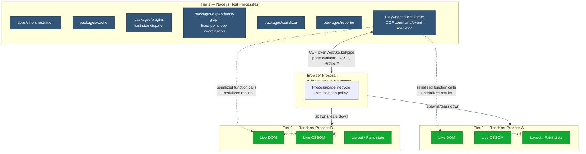
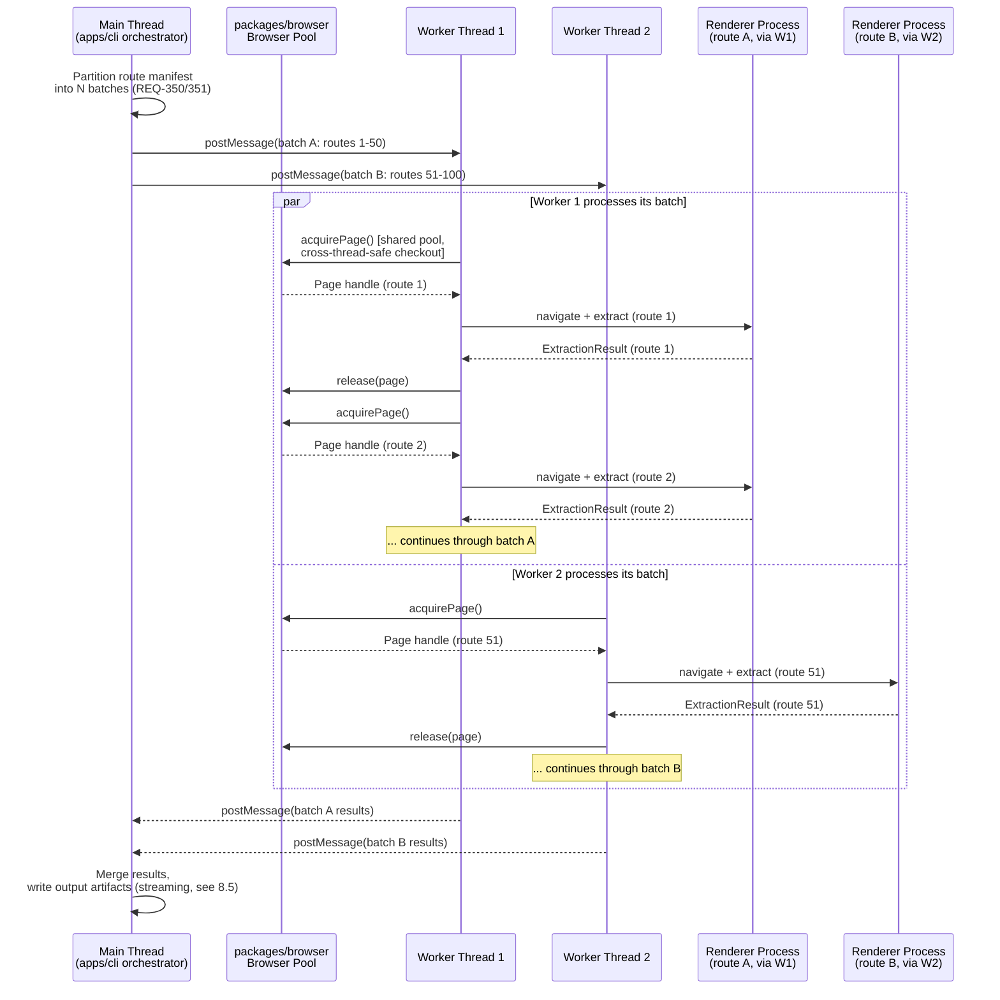
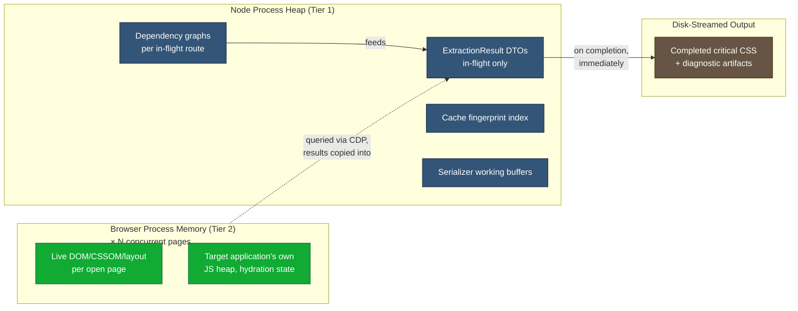
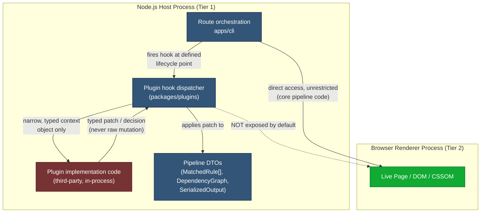
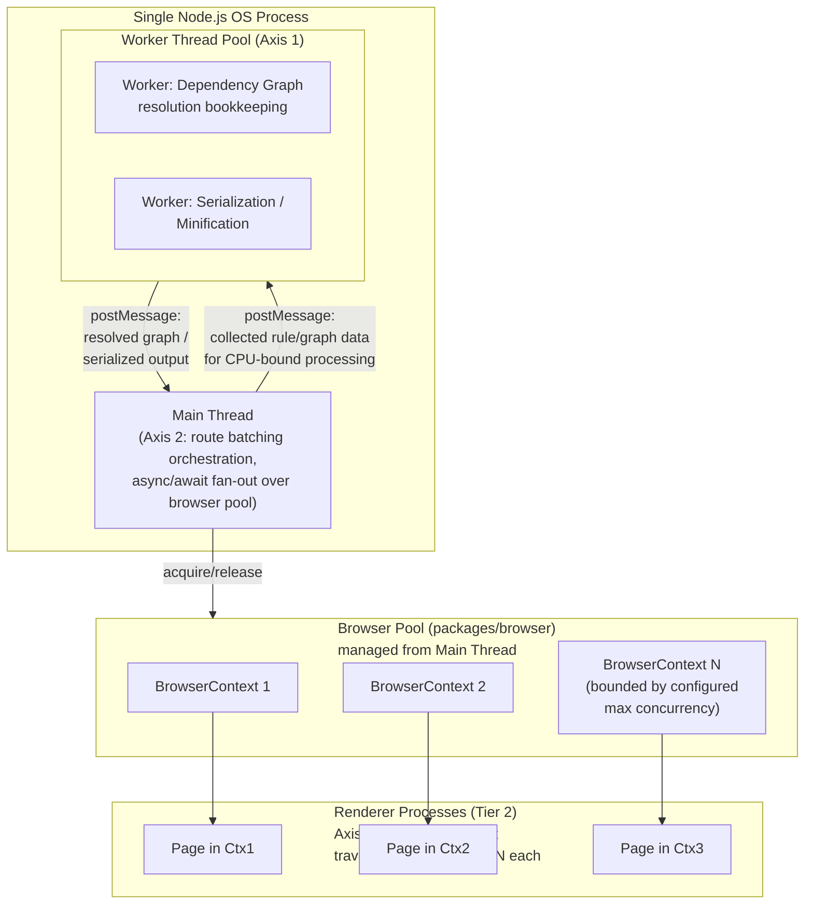

# 015 — Runtime Model

## 1. Title

**Critical CSS Extraction Engine — Runtime and Process Model**

## 2. Version

| Field | Value |
|---|---|
| Document Version | 1.0.0 |
| Status | Draft — Phase 2 (Architecture) |
| Last Updated | 2026-07-09 |
| Owners | Core Architecture Working Group |
| Stability | Stable core model; concurrency tuning parameters subject to refinement in Phase 14 (`docs/performance/`) |

## 3. Purpose

This document specifies **where code runs** and **who owns what memory** across the lifetime of an extraction run: the boundary between the Node.js host process and the browser-controlled renderer processes it drives; the browser pool's process/page lifecycle; the concurrency model spanning worker threads, route batching, and parallel stylesheet traversal (per `BRIEF.md` Section 2.14); the memory model describing what lives in the Node heap, what lives in browser process memory, and what is streamed to disk; and how plugin execution is sandboxed from a runtime-execution perspective — what process, what context, what a plugin can and cannot touch while it runs.

Every other architecture document in this set (`010`–`014`, `016`) describes *what* the system computes and *in what order*. This document is the one that answers *in which OS process, and against which memory, does that computation actually execute* — a question [001-Vision.md](./001-Vision.md) Section 9 gestures at ("Only the Dependency Resolver, Cascade Resolver, and Serializer operate purely in the host process") but does not formalize. Formalizing it matters because every performance claim in `BRIEF.md` Section 2.14 (worker threads, route batching, parallel stylesheet traversal, streaming output, memory profiling) is a claim about *this* model, and cannot be implemented correctly without it being unambiguous.

## 4. Audience

- Implementers of the Browser Manager (`packages/browser`), who own the process/page lifecycle this document specifies.
- Implementers of `apps/cli`'s route-batch orchestration, who own worker-thread and route-batching concurrency.
- Implementers of the Plugin System (`packages/plugins`), who must enforce the sandboxing boundary described here at a runtime-execution level, distinct from (but consistent with) the lifecycle-hook-contract level already specified in [006-Design-Principles.md](./006-Design-Principles.md) Principle 7 and the forthcoming [ADR-0004](../adr/ADR-0004-Plugin-Lifecycle-Model.md)-adjacent `docs/plugins/004-Sandboxing.md` (Phase 12).
- Performance engineers profiling the system, who need to know which process to attach a profiler to for which symptom.
- CI/CD platform engineers sizing runners (CPU, memory, process-count limits) for the engine's worker-thread and browser-pool concurrency.
- Senior engineers and autonomous coding agents implementing `packages/browser`'s pool and `apps/cli`'s batch orchestrator from this specification.

Readers are assumed to be senior engineers with working knowledge of Node.js's process/worker-thread model, V8's memory model (heap, external memory), and the Chrome DevTools Protocol's process architecture (browser process vs. renderer process vs. GPU process). This is not an introduction to Node.js concurrency primitives.

## 5. Prerequisites

- [BRIEF.md](../../BRIEF.md) Section 2.14 ("Performance Optimizations": worker threads, route batching, parallel stylesheet traversal, streaming output, memory profiling) and Section 2.16 (Security: browser sandboxing, network restrictions) — the two brief sections this document operationalizes.
- [001-Vision.md](./001-Vision.md) Section 9 — the "push decisions into the browser; keep the host process as an orchestrator" architectural signature this document formalizes into a concrete process model.
- [006-Design-Principles.md](./006-Design-Principles.md) — Principle 1 (Browser Is Source of Truth, which is *why* a separate browser process exists at all) and Principle 7 (Plugin Sandboxing, whose runtime-execution enforcement this document specifies).
- [007-Repository-Structure.md](./007-Repository-Structure.md) — package boundaries; `packages/browser` in particular.
- [ADR-0003-Playwright-As-Browser-Abstraction](../adr/ADR-0003-Playwright-As-Browser-Abstraction.md) — the choice of Playwright as the concrete browser-automation mechanism this runtime model is built around.
- Working familiarity with Node.js `worker_threads`, Chromium's multi-process architecture, and Chrome DevTools Protocol (CDP) sessions.

## 6. Related Documents

- [001-Vision.md](./001-Vision.md)
- [003-Requirements.md](./003-Requirements.md) — REQ-510 through REQ-513 (performance non-functionals), REQ-552/554 (CI operability, timeout protection)
- [006-Design-Principles.md](./006-Design-Principles.md) — Principles 1, 3, 7
- [007-Repository-Structure.md](./007-Repository-Structure.md) — `packages/browser`, `packages/plugins`
- [010-System-Overview.md](./010-System-Overview.md) — whole-system module map this document places into OS-process context
- [011-Execution-Pipeline.md](./011-Execution-Pipeline.md) — the logical pipeline stages this document assigns to concrete execution contexts
- [012-Module-Interaction.md](./012-Module-Interaction.md) — module call contracts; this document specifies which of those calls cross a process boundary (an IPC round trip) versus stay in-process
- [013-Component-Diagram.md](./013-Component-Diagram.md) — internal component decomposition; this document is the cross-cutting view of where those components physically execute
- [014-Dependency-Graph.md](./014-Dependency-Graph.md) — Section 11 and Section 14 of that document depend on this document's batching/single-writer discipline for the dependency-resolution discovery loop
- [016-Data-Flow.md](./016-Data-Flow.md) — the DTOs that must cross the Node↔browser boundary this document defines, and the serialization cost that implies
- `docs/adr/ADR-0004-Plugin-Lifecycle-Model.md` (Phase 1, existing) and forthcoming `docs/plugins/004-Sandboxing.md` (Phase 12) — the plugin contract/sandboxing documents this document's Section 8.6 anticipates and is consistent with
- Forthcoming `docs/design/102-Browser-Pool.md` (Phase 3) and `docs/performance/001-Worker-Threads.md` (Phase 14) — deeper implementation-level treatment of the pool and concurrency model this document introduces at the architecture level

## 7. Overview

Every extraction run spans, at minimum, two distinct execution contexts with fundamentally different capabilities, lifetimes, and failure characteristics: the **Node.js host process**, which is the engine's own long-lived (or per-invocation) process running `apps/cli` and every `packages/*` module's host-side logic; and one or more **browser-controlled renderer processes**, spawned and torn down by Chromium (or another engine, per [ADR-0003](../adr/ADR-0003-Playwright-As-Browser-Abstraction.md)) as pages navigate, each holding the actual DOM, CSSOM, layout tree, and paint state for a single page/tab.

The host process never has direct memory access into a renderer process — by design, per Chromium's own multi-process sandboxing model, which is a security property this engine benefits from for free (Section 2.16 of `BRIEF.md`) rather than one it must implement itself. All communication crosses this boundary through the Chrome DevTools Protocol, mediated in this codebase by Playwright's API surface: `page.evaluate()` (serialize a function + arguments into the page, execute, serialize the result back), CDP domain calls (`CSS.*`, `Profiler.*` for Coverage), and event subscriptions (navigation lifecycle events, console messages, page crashes). Every one of Principle 1's "push decisions into the browser" operations from [006-Design-Principles.md](./006-Design-Principles.md) is, concretely, one or more of these boundary crossings, and every boundary crossing carries a serialization cost proportional to the data crossing it — a fact this document's Section 14 (Performance) treats as a first-class design constraint, not an implementation detail to optimize away later.

On top of this two-tier process boundary, the engine layers a **concurrency model** for scaling across many routes and viewports: worker threads (Node.js `worker_threads`, sharing the host process's memory space but running independent JS execution contexts) parallelize route-batch processing, while the Browser Manager's pool parallelizes browser-context/page acquisition within (and potentially across) those worker threads. Getting this layering right — worker threads for host-side parallelism, browser contexts/pages for target-side parallelism, and a clear rule for how many of each nest inside the other — is the primary subject of Section 9.

## 8. Detailed Design

### 8.1 The Two-Tier Process Boundary

**Tier 1 — Node.js Host Process(es).** Runs `apps/cli`'s orchestration logic, the Configuration Loader, the Cache Manager (`packages/cache`), the Plugin System's host-side lifecycle-hook dispatch (`packages/plugins`), the Dependency Resolver and Cascade Resolver's host-side coordination logic (`packages/dependency-graph` — the *coordination* of the fixed-point loop from [014-Dependency-Graph.md](./014-Dependency-Graph.md) Section 10.1 runs here, even though its *discovery queries* execute inside the browser), the Serializer and Minifier (`packages/serializer`), and the Reporter (`packages/reporter`). This tier also hosts the Playwright *client* library, which is the Node-side API surface that issues CDP commands and receives CDP events/responses — the Playwright client itself is Tier 1 code, distinct from the browser it controls.

**Tier 2 — Browser-Controlled Renderer Process(es).** Each Playwright `BrowserContext`/`Page` corresponds, under the hood, to Chromium's own process allocation (a full page navigation typically gets its own renderer process, per Chromium's site-isolation model, though Chromium may share processes across same-site pages depending on its own internal policy — this engine does not control or need to control that allocation directly; it is Chromium's concern, consistent with Principle 1's "the browser handles browser things"). This tier holds the actual live DOM, live CSSOM (`document.styleSheets` and everything reachable from it), layout geometry, and paint state — everything the DOM Collector, Visibility Engine, CSSOM Walker, Selector Matcher, and Coverage Engine query against, per [001-Vision.md](./001-Vision.md) Section 9's "shaded stages" diagram.



Every module in Tier 1 that appears to "need" DOM/CSSOM facts (Visibility Engine, CSSOM Walker, Selector Matcher, Coverage Engine — nominally `packages/collector`/`packages/matcher`/`packages/coverage`) is architecturally split across the boundary: a thin Tier-1 coordination layer that decides *what* to ask and *what to do with the answer*, and a Tier-2 payload — a function serialized into the page via `page.evaluate()` — that does the actual DOM/CSSOM querying using live browser primitives (`Element.matches()`, `getBoundingClientRect()`, `getComputedStyle()`, `document.styleSheets`). This split is the runtime-execution-level restatement of Principle 1: it is not merely a *design intent* that decisions are delegated to the browser, it is a *process-boundary fact* that the code making those decisions physically executes inside a renderer process's V8 isolate, not inside the Node host's V8 isolate.

### 8.2 Browser Pool Lifecycle

The Browser Manager (`packages/browser`) owns a pool of Playwright `Browser` instances, each hosting some number of `BrowserContext`s, each hosting some number of `Page`s. The pool's lifecycle states:

```mermaid
stateDiagram-v2
    [*] --> Cold: Pool constructed, no browsers launched
    Cold --> Launching: First acquire() call
    Launching --> Warm: Browser process ready,<br/>CDP session established
    Warm --> ContextAcquired: acquireContext() —<br/>new BrowserContext created<br/>(isolated cookies/storage/cache)
    ContextAcquired --> PageAcquired: acquirePage() —<br/>new Page within context
    PageAcquired --> Navigating: page.goto(route)
    Navigating --> Stable: Rendering-stabilization<br/>signal reached (see 104-Rendering-Stabilization, pending)
    Stable --> InUse: Extraction pipeline<br/>stages execute against this page
    InUse --> Releasing: Extraction complete<br/>for this route/viewport
    Releasing --> PageAcquired: Page reset/reused<br/>(same context, next route)
    Releasing --> ContextAcquired: Context reset/reused<br/>(next context checkout)
    ContextAcquired --> Cooling: Idle timeout reached,<br/>no pending work
    Cooling --> Warm: Context closed,<br/>browser instance retained
    Warm --> ShuttingDown: Pool drain requested<br/>(CLI run complete, or SIGTERM)
    ShuttingDown --> [*]: Browser process terminated
    InUse --> Crashed: Renderer process crash<br/>(OOM, engine bug)
    Crashed --> PageAcquired: Crash isolated to one page;<br/>context/browser survive, page recreated
```



Two lifecycle properties are load-bearing for the rest of this document:

1. **`BrowserContext` is the isolation unit, not `Page`.** Each `BrowserContext` gets independent cookies, storage, and cache, which is what lets the pool safely reuse a single underlying `Browser` process across many unrelated routes without cross-route state leakage (a route's `localStorage` mutation must not be visible to the next route extracted in the pool) — this is the mechanism, not the browser-process boundary itself, that provides route-to-route isolation within a shared browser process.
2. **A renderer crash is isolated to the page/context that crashed.** Chromium's site-isolation model means one page's renderer process crashing (a real, observed failure mode with complex enterprise stylesheets or pathological CSS, per Section 2.16 of `BRIEF.md`) does not take down the browser process itself, nor other pages/contexts in the pool. The pool's `Crashed` state (above) is a first-class, expected transition — a crash produces a diagnosable, attributable error for the affected route/viewport (per Principle 6 in [006-Design-Principles.md](./006-Design-Principles.md)) and the pool recovers by allocating a fresh page, not by restarting the whole pool. This is elaborated further in the forthcoming `docs/design/102-Browser-Pool.md` (Phase 3); this document establishes only that crash isolation is an architectural property the pool must preserve, not an incidental behavior.

### 8.3 Concurrency Model — Three Independent Axes

`BRIEF.md` Section 2.14 lists "worker threads," "route batching," and "parallel stylesheet traversal" as three separate performance levers. Architecturally, they are three genuinely independent axes of parallelism, each solving a different bottleneck, and conflating them (treating "concurrency" as one undifferentiated pool of parallel work) is a common design mistake this document exists to head off.

**Axis 1 — Worker threads (host-side, CPU-bound Node work).** Node's `worker_threads` module provides genuine parallelism for CPU-bound work that would otherwise block the single-threaded Node event loop: dependency-graph fixed-point resolution's host-side bookkeeping ([014-Dependency-Graph.md](./014-Dependency-Graph.md) Section 8.6's loop), Serializer canonical-ordering sorts, and Minifier compression work are all candidates, per REQ-512. Each worker thread is a separate V8 isolate with its own heap, communicating with the main thread only via structured-clone message passing (or `SharedArrayBuffer` for specific hot paths, if profiling justifies it) — worker threads do **not** share a JS object heap with the main thread or with each other, which is the property that makes Section 8.5's memory-model reasoning tractable per-worker.

**Axis 2 — Route batching (host-side, I/O/browser-bound orchestration).** Independent of whether worker threads are used for CPU-bound host work, `apps/cli` must decide how many *routes* are being extracted concurrently at the orchestration level — i.e., how many outstanding `acquirePage()` → navigate → extract → release cycles are in flight simultaneously (REQ-512's "route batch processing"). This is fundamentally an I/O-concurrency question (waiting on browser round trips), which Node's single-threaded event loop already handles well via `async`/`await` and `Promise.all`-style fan-out **without** necessarily needing worker threads at all — a single Node event loop can have dozens of routes' browser-bound `await`s outstanding concurrently, limited by browser pool capacity (Section 8.2), not by CPU.

**Axis 3 — Parallel stylesheet traversal (browser-context-internal).** Within a *single* page's CSSOM Walker pass (per [014-Dependency-Graph.md](./014-Dependency-Graph.md) and [013-Component-Diagram.md](./013-Component-Diagram.md)), traversal of independent stylesheets can be parallelized — but this parallelism, per Principle 3 in [006-Design-Principles.md](./006-Design-Principles.md)'s explicit example ("Parallelizing independent stylesheet traversal across worker threads, since traversal of stylesheet A does not affect the correctness of traversal of stylesheet B"), is most naturally implemented as *concurrent async work inside a single `page.evaluate()` call* (native `Promise.all` over stylesheets, executing inside the browser's own V8 instance, in the renderer process, not the Node host) — batching the round trip, per [014-Dependency-Graph.md](./014-Dependency-Graph.md) Section 10.1's optimization notes — rather than as Node-side worker-thread parallelism, since the data being traversed (the CSSOM) lives in Tier 2, not Tier 1, and shipping stylesheet contents across the process boundary just to parallelize their traversal in Node would be strictly worse than parallelizing in-place where the data already lives.

The critical architectural rule this taxonomy implies: **Axis 1 (worker threads) and Axis 2 (route batching) compose as "N worker threads, each running M concurrently-batched routes," while Axis 3 is internal to each individual route's browser-side execution and does not interact with Axis 1/2 concurrency at all** — it is bounded purely by how many stylesheets a single page has, which is independent of how many routes are running in parallel elsewhere.

### 8.4 Worker-Thread-Parallelized Route Batch — Sequence



A subtlety this sequence diagram makes explicit: the **Browser Pool itself is a shared resource accessed from multiple worker threads**, which means `packages/browser`'s pool implementation must be safe under concurrent `acquirePage()`/`release()` calls originating from different worker threads, not just from concurrent `async` calls within one thread. Playwright's own client objects are not inherently shareable across `worker_threads` (each thread has its own JS heap and cannot hold a reference to another thread's Playwright object graph directly), so the practical architecture is one of two patterns, both consistent with this document's model: **(a)** each worker thread owns its own independent `Browser` connection (its own Playwright client instance connected to the same or a separate browser process via CDP), with the Browser Manager coordinating *capacity* (how many total pages across all workers) via a shared counter/semaphore in the main thread rather than sharing live page handles; or **(b)** all browser control stays in the main thread (a single Playwright client), and worker threads are used *only* for Axis 1's CPU-bound host-side work (dependency resolution bookkeeping, serialization), with route navigation/extraction itself orchestrated from the main thread's event loop (Axis 2) and delegated to workers only for the post-collection CPU-bound stages. Pattern (b) is the architecture this document recommends as the Phase 1–2 default, because it avoids the cross-thread pool-coordination complexity of pattern (a) entirely while still satisfying REQ-512's throughput goal for the CPU-bound stages that actually benefit from true parallelism; pattern (a) is flagged in Future Work as a scaling path once profiling data (Phase 14) shows the main thread's single-event-loop capacity for Axis 2 route batching is itself the bottleneck, not the CPU-bound stages.

### 8.5 Memory Model

Three distinct memory pools exist simultaneously during a batch run, and conflating them is the second common design mistake this document heads off:

**Node process heap (Tier 1, per-worker-thread or main-thread).** Holds: `ExtractionResult` DTOs, the runtime CSS dependency graph ([014-Dependency-Graph.md](./014-Dependency-Graph.md) — one instance per in-flight route/viewport, discarded after serialization unless retained for diagnostics), Cache Manager's in-memory index of fingerprint→cache-entry mappings (not the cache *content* itself, which is typically disk/remote-backed per [006-Design-Principles.md](./006-Design-Principles.md) Principle 8), Serializer working buffers, and Reporter's aggregated diagnostics across the batch. This heap is subject to normal V8 garbage collection and is the pool most directly under this engine's own code's control — and therefore the pool most amenable to the streaming-output mitigation in REQ-513.

**Browser process memory (Tier 2, one allocation per renderer process, managed by Chromium).** Holds: the live DOM tree, live CSSOM object graph, layout tree, paint surfaces, and any JavaScript heap belonging to the target page's own application code (React/Vue/etc. runtime state, hydration data) — none of which this engine's code allocates directly; it is a consequence of navigating to the target page at all, and its size is a property of the target application, not of this engine. This is the memory pool that scales with **pool concurrency** (Section 8.2): N concurrently-open pages means, to a first approximation, N times a single page's renderer memory footprint, which is why [001-Vision.md](./001-Vision.md) Section 14 already flags "max concurrency" as a required tunable configuration rather than an emergent property — this document is the architectural specification that tunable maps onto (pool size in `packages/browser`).

**Disk-streamed output (neither Tier 1 nor Tier 2, a deliberate escape valve).** For large route manifests (REQ-513, "streaming output for large route sets rather than buffering all results in memory before writing"), completed `ExtractionResult`s should be written to their output artifact location as soon as they are finalized, rather than accumulated in the Node heap until the entire batch completes. This changes the Node-heap memory profile from `O(routes × avg-result-size)` (naive buffer-everything) to `O(concurrency-level × avg-result-size)` (only in-flight results held in memory at any moment), which is the direct performance payoff [003-Requirements.md](./003-Requirements.md)'s Performance section already attributes to REQ-513 — this document is where that requirement's *mechanism* (stream-to-disk-on-completion, not batch-then-write) is specified architecturally.



### 8.6 Plugin Sandboxing — Runtime-Execution Angle

[006-Design-Principles.md](./006-Design-Principles.md) Principle 7 specifies the *contract*-level sandboxing model (narrow, typed hook signatures; no raw `Page` access by default; per-plugin timeout/error isolation). This section specifies where that contract is enforced in terms of this document's process model — i.e., what process and what execution context a plugin's hook implementation actually runs in, and what memory it can and cannot reach.

Plugin hook implementations (`beforeLaunch`, `afterNavigation`, `beforeCollection`, `afterCollection`, `beforeSerialize`, `afterSerialize`) execute **in the Node.js host process (Tier 1), in the same thread that is orchestrating the route currently being processed** — not inside the browser/renderer process, and not (by default) in a dedicated worker thread of their own. This placement is deliberate: plugins operate on host-side DTOs (the matched-rule set, the dependency graph, the serialized output) per Principle 7's "receives context object, returns typed patch/decision" model, and those DTOs already live in Tier 1 memory by the time any hook fires — there is no reason to cross the Node↔browser boundary again just to hand a plugin author's code the data it needs.

Because plugins run in-process (sharing the host's V8 isolate and event loop) rather than in a separate OS process or a `vm`-module isolate by default, "sandboxing" here is a **capability and API-surface restriction**, not a hard memory-isolation guarantee — this is stated plainly so implementers do not overclaim security properties the architecture does not provide:

- A plugin **cannot** obtain a reference to the live Playwright `Page`/`BrowserContext` object unless a specific hook's contract explicitly grants it (per Principle 7's forbidding of "unrestricted access... in hooks whose contract does not require it"); the hook dispatcher passes only the narrow, typed context object for each hook, never the full pipeline state.
- A plugin **can**, in principle, exhaust the Node process's CPU or memory if its own code is pathological (an infinite loop, an unbounded allocation), because it shares the host's resources — this is why Principle 7's per-plugin timeout budget is enforced via a runtime mechanism (a wall-clock deadline checked around each hook invocation, causing the dispatcher to abandon waiting and report a `PluginTimeoutError`, per Principle 6) rather than a resource-quota mechanism that would require OS-level process isolation to implement properly. A future hardening path (true OS-process or V8-isolate-per-plugin sandboxing) is discussed in Future Work; it is explicitly **not** part of the Phase 1–2 architecture, and this document should not be read as claiming it is.
- A plugin's declared capability requests (network access, per Section 2.16 of `BRIEF.md` and Principle 7's "declarative capability requests") are enforced at the boundary of whatever Node APIs the plugin would need to use to exercise that capability (e.g., the plugin runtime provides a capability-gated `fetch` wrapper rather than letting the plugin call the global `fetch` directly) — again, a capability-surface restriction enforced by what the plugin dispatcher exposes to plugin code, not a kernel-level network sandbox.



## 9. Architecture

### 9.1 Placement Within the Whole-System Pipeline

This document's Tier 1/Tier 2 split is the runtime-execution lens on the pipeline already described in [011-Execution-Pipeline.md](./011-Execution-Pipeline.md); the table below is the canonical cross-reference every implementer should consult when asking "does this stage's code run in Node or in the browser":

| Pipeline Stage (per [011-Execution-Pipeline.md](./011-Execution-Pipeline.md)) | Primary Execution Tier | Notes |
|---|---|---|
| Configuration Loading, Route Manifest expansion | Tier 1 | Pure host-side logic, no browser needed |
| Cache fingerprint lookup | Tier 1 | May short-circuit before any Tier 2 work occurs at all |
| Browser/context/page acquisition | Tier 1 (orchestration) → spawns Tier 2 | The pool lifecycle from Section 8.2 |
| Navigation, rendering stabilization | Tier 1 issues `page.goto()`; stabilization *detection* logic partly Tier 1 (polling/event subscription), partly Tier 2 (in-page readiness signals) | See forthcoming `104-Rendering-Stabilization.md` |
| DOM Collection, Visibility determination | Tier 2 (querying) with Tier 1 coordination | Geometry/visibility primitives execute in-page per Principle 1 |
| CSSOM Walking, Selector Matching | Tier 2 (querying) with Tier 1 coordination | `Element.matches()` calls execute in-page |
| Coverage recording | Tier 2 (CDP `Profiler`/`CSS` domain, browser-process-internal instrumentation) surfaced to Tier 1 | Coverage data is collected by the browser engine itself, not queried via `page.evaluate()` |
| Dependency graph construction/resolution | Tier 1 coordination, Tier 2 discovery queries | Per [014-Dependency-Graph.md](./014-Dependency-Graph.md) Section 9.1's explicit browser-query dependency |
| Cascade resolution | Tier 1, consuming browser-resolved facts already gathered | Layer order itself was obtained from Tier 2 upstream; the resolution *computation* over already-gathered facts is Tier 1 |
| Serialization, Minification | Tier 1 | Pure host-side string/data processing |
| Plugin hook execution | Tier 1 (Section 8.6) | Never Tier 2 by default |
| Caching (store), Reporting | Tier 1 | Pure host-side |

### 9.2 Worker-Thread and Browser-Pool Nesting — Canonical Diagram



This diagram is the architectural resolution of Section 8.3's three-axis taxonomy: worker threads (Axis 1) live inside the single Node OS process, alongside (not instead of) the main thread's Axis-2 route-batching orchestration over the browser pool; Axis 3 parallelism is invisible at this diagram's granularity because it happens entirely within each individual renderer process, orthogonal to how many renderer processes exist concurrently.

## 10. Algorithms

### 10.1 Algorithm: Bounded-Concurrency Route Batch Scheduling

**Problem statement.** Given a route manifest of size `R` and a browser pool with a configured maximum concurrency `C` (max simultaneously-open pages), schedule route extractions such that at most `C` routes are ever mid-extraction simultaneously, while keeping the pool continuously saturated (no idle pool capacity while routes remain unscheduled) and preserving REQ-500's determinism for the *content* of each route's output (scheduling order may affect *when* a result is ready, never *what* the result is, mirroring [006-Design-Principles.md](./006-Design-Principles.md)'s Canonical Ordering discipline).

**Inputs.** `routes: RouteDescriptor[]` (from expanded route manifest, REQ-350–352); `maxConcurrency: number` (configured pool size); `extractRoute: (route) => Promise<ExtractionResult>`.

**Outputs.** A stream/array of `ExtractionResult`, each written to disk as it completes (Section 8.5's streaming model), in no particular completion order, but each internally deterministic per Principle 5.

**Pseudocode.**

```text
function scheduleRouteBatch(routes, maxConcurrency, extractRoute) -> AsyncIterable<ExtractionResult>:
    queue = routes.slice()          // FIFO, preserves manifest order as scheduling preference only
    inFlight = new Set()
    results = new AsyncQueue()      // consumer-facing stream

    function launchNext():
        if queue.isEmpty():
            return
        route = queue.shift()
        promise = extractRoute(route)
            .then(result => {
                inFlight.delete(promise)
                results.push(result)     // triggers immediate disk write (Section 8.5)
                launchNext()              // refill: keep pool saturated
            })
            .catch(error => {
                inFlight.delete(promise)
                results.push(ExtractionResult.failed(route, error))  // fail-fast diagnostic, Principle 6
                launchNext()
            })
        inFlight.add(promise)

    for i in range(min(maxConcurrency, routes.length)):
        launchNext()

    // results stream closes once queue empty and inFlight empty
    return results.asAsyncIterable()
```

**Time complexity.** `O(R)` scheduling overhead (each route launched and completed exactly once); wall-clock time is bounded below by `ceil(R / C) × avg-per-route-latency` under ideal saturation, and this algorithm's "refill on completion" pattern (rather than fixed batch-of-`C`-then-wait-for-all) is what achieves that bound rather than a strictly worse `ceil(R / C) × max-per-route-latency` bound a naive fixed-batch scheduler would produce (one slow route in a fixed batch of `C` would otherwise stall the other `C - 1` slots from being refilled until the whole batch completes).

**Memory complexity.** `O(C)` for in-flight state (Section 8.5's "only in-flight results held in memory" property) plus `O(R - C)` for the remaining queue, which is lightweight `RouteDescriptor` metadata, not `ExtractionResult` payloads — the queue holds *work to do*, not *completed results*, so its memory cost is small and roughly constant per entry regardless of `R`'s scale.

**Failure cases.** A single route's extraction hanging indefinitely (a page that never reaches a stability signal) would, without a per-route timeout, permanently occupy one of the `C` concurrency slots — this is why REQ-554 (timeout protection on every browser operation) is a hard dependency of this algorithm's liveness guarantee, not an independent, optional hardening measure; `extractRoute` itself must be timeout-guarded internally (at the Navigation Engine layer, per forthcoming `103-Navigation-Engine.md`) so that this scheduler's `launchNext()` refill loop is never blocked indefinitely by one misbehaving route.

**Optimization opportunities.** Priority-ordering the queue (e.g., extracting routes with a known-larger CSS payload first, if that information is available from a previous run's cache metadata) so that long-tail slow routes start earlier rather than being scheduled last and extending the batch's total wall-clock time; this is flagged as a future refinement, not required for correctness.

### 10.2 Algorithm: Cross-Boundary Call Batching

**Problem statement.** Minimize the number of Node↔browser (Tier 1↔Tier 2) round trips for a set of `K` independent queries against the same page (e.g., the `K` frontier nodes in a single "wave" of [014-Dependency-Graph.md](./014-Dependency-Graph.md)'s fixed-point loop, or `K` candidate elements needing visibility geometry), since each round trip carries fixed serialization/IPC overhead independent of payload size.

**Inputs.** `queries: Query[]` (each independently answerable given only in-page state); `page: Page` (Playwright handle).

**Outputs.** `results: Result[]`, one per query, in input order.

**Pseudocode.**

```text
function batchedEvaluate(page, queries) -> Result[]:
    // Serialize the *entire* query set into a single page.evaluate call;
    // the loop over queries executes natively inside the browser's V8,
    // not via K separate round trips.
    serializedQueries = queries.map(q => q.toSerializableForm())
    return page.evaluate((queriesInPage) => {
        return queriesInPage.map(q => {
            // Runs inside the renderer process, using live DOM/CSSOM
            // primitives per query kind (matches(), getComputedStyle(), etc.)
            return executeQueryInPage(q)
        })
    }, serializedQueries)
```

**Time complexity.** `O(1)` round trips (versus the naive `O(K)`), with in-page execution cost `O(K × c)` where `c` is the per-query in-page cost — this is the same total in-page work as the naive approach, but the fixed per-round-trip overhead (serialization, IPC scheduling, V8 context-switch cost between Node and the renderer) is paid once instead of `K` times, which is the entire performance win, consistent with [001-Vision.md](./001-Vision.md) Section 10's identical optimization for selector matching and [014-Dependency-Graph.md](./014-Dependency-Graph.md) Section 10.1's identical optimization for dependency discovery — this document is where that recurring pattern's general form is specified once, for reuse by every module that needs it.

**Memory complexity.** `O(K)` for the serialized query batch and result batch, transiently held on both sides of the boundary during the single round trip.

**Failure cases.** A single query within the batch throwing inside the page (e.g., a detached-element error) must not abort the entire batch's results — `executeQueryInPage` must catch per-query errors and return a per-query `Result.failure(...)` rather than letting one bad query fail the whole `page.evaluate()` call, mirroring the atomicity concern already raised in [001-Vision.md](./001-Vision.md) Section 10's "Failure cases" for detached elements.

**Optimization opportunities.** Chunking very large `K` into sub-batches bounded by a maximum serialized-payload size, to avoid a single pathologically large `page.evaluate()` call itself becoming a latency outlier — a defensive measure analogous to [014-Dependency-Graph.md](./014-Dependency-Graph.md)'s resolution-budget circuit breaker, applied here to payload size rather than iteration count.

## 11. Implementation Notes

- `packages/browser`'s pool implementation must expose an `acquireConcurrencyPermit()`/`releaseConcurrencyPermit()` pair (a semaphore, effectively) as the single point where Section 10.1's `maxConcurrency` bound is enforced, independent of whether the caller is the main thread's route-batching loop or (in a future pattern-(a) worker-per-browser-connection architecture, Section 8.4) a worker thread — this keeps the concurrency-limiting logic in one place regardless of which threading pattern is eventually adopted.
- The Section 8.4 recommendation (pattern (b): browser control stays in the main thread; worker threads used only for CPU-bound host-side stages) should be encoded as the default in `apps/cli`'s orchestrator, with the worker-thread pool sized independently of the browser-pool concurrency setting — these are two separate configuration knobs (`maxBrowserConcurrency`, `workerThreadCount`) and must not be conflated into a single "concurrency" setting in the Configuration Loader's schema.
- Every `page.evaluate()` call site across `packages/collector`, `packages/matcher`, `packages/coverage`, and `packages/dependency-graph` should be implemented against the shared `batchedEvaluate` utility from Section 10.2 (living in `packages/browser` or `packages/shared`, per [007-Repository-Structure.md](./007-Repository-Structure.md)'s package-boundary conventions), rather than each module independently reinventing round-trip batching — this is the direct implementation-level consequence of Section 10.2 being specified once, generically, in this document.
- Plugin hook dispatch (Section 8.6) should record, for every hook invocation, wall-clock duration and any thrown error into the same diagnostics channel used elsewhere (per Principle 6 in [006-Design-Principles.md](./006-Design-Principles.md)), so that a slow or failing plugin is visible in the Reporter's timing report (REQ-463) with per-plugin attribution, not folded anonymously into "Serializer stage" timing just because the hook happened to fire around that stage.
- Streaming output (Section 8.5) requires the Serializer/Reporter's output-writing code to be structured as "write as soon as ready" rather than "collect all, then write" from the outset — retrofitting this after an implementation has already been written around an in-memory array of all results is a larger refactor than building it in from the start, so this should be treated as a Phase 8/16 implementation-order constraint, not a later optimization pass.

## 12. Edge Cases

- **Renderer process crash mid-extraction (Section 8.2's `Crashed` state).** The Node host process receives a Playwright `page.on('crash')` event (or an equivalent CDP disconnect signal); the in-flight `ExtractionResult` for that route must be marked failed with an attributable `RendererCrashedError` (Principle 6), and Section 10.1's scheduler must treat this identically to any other `extractRoute` rejection — the pool recovers the *page* (Section 8.2), the *scheduler* recovers the *route slot*, and these are two independent recovery actions at two different layers of this document's model.
- **Worker thread crash or unhandled exception.** Unlike a renderer crash, a worker thread crash (an uncaught exception terminating the worker) is a Tier-1, not Tier-2, failure; the main thread must detect worker termination (Node's `worker.on('exit')`) and treat any work that worker was midway through as failed, re-queuing it if idempotent (dependency-graph resolution and serialization are both idempotent, pure functions of their inputs, so re-queuing is always safe here) rather than assuming partial worker output is valid.
- **Browser pool exhaustion under a sudden spike in route concurrency demand.** If `apps/cli` is invoked with a `maxConcurrency` exceeding what the host machine can actually support (memory pressure from too many concurrent renderer processes, Section 8.5's Tier-2 memory scaling), the failure mode should be a slow, diagnosable degradation (OS-level memory pressure surfacing as elevated navigation timeouts, caught by REQ-554's timeout protection) rather than an OOM-killed host process; this motivates the Cache Manager's fingerprint-gated short-circuit (Section 9.1's table, first row) being checked *before* any pool acquisition, since a well-tuned cache hit rate directly reduces how often the pool's concurrency ceiling is actually tested under real load.
- **Plugin code performing genuinely async, long-running work (e.g., calling an external API in `afterCollection`).** Because plugins run on the main thread's event loop (Section 8.6), a plugin `await`ing a slow network call does not block other JS execution (Node's event loop keeps servicing other pending work), but it does extend that specific route's wall-clock extraction time and must be counted against that plugin's per-hook timeout budget (Principle 7) — the timeout is wall-clock-based specifically because CPU-bound blocking and I/O-bound waiting both need to be bounded, and a CPU-time-based budget would not catch the latter.
- **Cross-thread structured-clone limits for worker-thread message passing (Axis 1).** Not every DTO in this system is trivially structured-clonable (e.g., if a DTO were to accidentally retain a reference to a Playwright `Page` object, structured clone would fail) — this is a concrete architectural reason, beyond Principle 7's sandboxing rationale, why pipeline DTOs crossing the worker-thread boundary (dependency graphs, serialized output) must be plain data (per [016-Data-Flow.md](./016-Data-Flow.md)'s DTO shapes) with no live browser handles embedded anywhere in their structure.
- **Coverage Engine's CDP session lifetime versus page/context lifetime (Section 8.2).** The Chrome DevTools Coverage domain requires an active CDP session scoped to a specific page target; if a page is reused across multiple routes within the same `BrowserContext` (Section 8.2's `Releasing → PageAcquired` reuse transition) for efficiency, the Coverage session's start/stop lifecycle must be re-scoped per route (stopped and restarted), not assumed to persist correctly across a page reset — an easy-to-miss detail given that most *other* per-page state (DOM, CSSOM) is naturally reset by the next `page.goto()`, while a stale CDP session subscription is not automatically reset by navigation alone in every CDP domain.

## 13. Tradeoffs

| Decision | Why | Alternative Considered | Tradeoff Accepted |
|---|---|---|---|
| Plugins execute in-process (Tier 1 main/worker thread), not in a separate OS process or `vm`-isolate | Plugins need low-latency access to already-in-memory pipeline DTOs; a separate process would require serializing those DTOs across another IPC boundary for every hook invocation | `vm` module isolation, or a full child-process-per-plugin sandbox | Weaker security/resource isolation than a true sandbox (Section 8.6's explicit caveat); mitigated by capability restriction and timeout budgets rather than hard isolation, with true isolation deferred to Future Work |
| Browser control stays on the main thread by default (pattern (b), Section 8.4), worker threads reserved for CPU-bound stages | Avoids cross-thread Playwright-object-sharing complexity entirely for the Phase 1–2 architecture | Give each worker thread its own independent browser connection (pattern (a)) for maximal parallelism | Route-batching throughput (Axis 2) is bounded by a single event loop's async-scheduling capacity rather than true multi-thread parallelism; acceptable because Axis 2's bottleneck is I/O wait (browser round trips), which a single event loop already handles well, not CPU |
| Streaming output to disk as each route completes (Section 8.5), rather than buffering the whole batch | Bounds Node-heap memory to `O(concurrency)` rather than `O(routes)`, required for enterprise-scale route manifests (REQ-513) | Buffer all `ExtractionResult`s, write once at the end (simpler implementation) | More complex output-writing code (must handle partial-batch failure/resume semantics) in exchange for materially better memory scalability |
| Cross-boundary call batching (Section 10.2) as a shared, generic utility rather than per-module reimplementation | Every module that queries the browser benefits identically; a single well-tested implementation reduces the chance of one module accidentally reverting to per-item round trips | Let each module (`collector`, `matcher`, `coverage`, `dependency-graph`) implement its own batching | A shared utility must be generic enough to serve all four call sites' differing query shapes, adding a small abstraction cost versus a bespoke, call-site-specific batching implementation |
| Renderer-crash isolation relied upon as a Chromium-provided property (Section 8.2) rather than re-implemented | Chromium's multi-process, site-isolated architecture already provides this; re-implementing crash containment at the application level would be redundant and error-prone | Run every page in its own OS-level container/VM for isolation, independent of Chromium's own process model | Accepts Chromium's crash-isolation granularity (per-renderer-process) as sufficient, rather than paying for a stronger (and much more expensive) isolation boundary this project's threat model does not require |

## 14. Performance

- **CPU complexity.** Tier-1 CPU cost is dominated, per route, by dependency-graph fixed-point bookkeeping ([014-Dependency-Graph.md](./014-Dependency-Graph.md) Section 10.1: `O(S+D)`) and Serializer canonical sorting (`O(n log n)`, per [006-Design-Principles.md](./006-Design-Principles.md)); Tier-2 CPU cost (layout, paint, script execution for the target page) is entirely outside this engine's control and is a property of the page under test, not something this document's model optimizes, beyond bounding how many Tier-2 processes run concurrently (pool size).
- **Memory complexity.** Section 8.5's three-pool model is this document's central memory-complexity claim: Tier 1 scales with `O(concurrency)` given streaming output; Tier 2 scales with `O(pool-size × avg-page-memory-footprint)`, where `avg-page-memory-footprint` is target-page-dependent and not under this engine's control beyond the pool-size lever; disk-streamed output scales with `O(routes)` but on disk, not in either process's memory, which is the entire point of the streaming design.
- **Caching strategy.** The Cache Manager's fingerprint-gated short-circuit (Section 9.1's pipeline-stage table) is the single highest-leverage intervention in this whole runtime model, because a cache hit avoids *all* Tier-2 process allocation for that route entirely — no browser context, no page, no renderer memory — which is a fundamentally larger win than any concurrency tuning within the Tier-2-bound path, consistent with [006-Design-Principles.md](./006-Design-Principles.md) Principle 8's framing of caching as load-bearing rather than incidental.
- **Parallelization opportunities.** This document's Section 8.3 three-axis taxonomy *is* the parallelization-opportunities answer: Axis 1 for CPU-bound host work, Axis 2 for I/O-bound route orchestration, Axis 3 for in-page stylesheet traversal — each has a distinct scaling ceiling (available CPU cores for Axis 1, browser pool size and host memory for Axis 2, per-page stylesheet count for Axis 3), and tuning one axis without regard for the others (e.g., maximizing worker-thread count without regard for how much Tier-2 memory the browser pool concurrently consumes) is the most common performance-tuning mistake this model anticipates.
- **Incremental execution.** Incrementality at this layer is entirely inherited from the Cache Manager (route/viewport-granular reuse, per REQ-303) and from [014-Dependency-Graph.md](./014-Dependency-Graph.md)'s own incremental, seed-driven graph construction; this document does not introduce a new incrementality mechanism of its own, only the process/memory substrate those mechanisms execute against.
- **Profiling guidance.** Tier-1 CPU profiling (Node's `--prof`/`--inspect`, or `worker_threads`-aware profilers) should target the dependency-graph and serializer stages specifically, since those are this tier's actual CPU-bound hot paths; Tier-2 "profiling" is more accurately *browser resource monitoring* (renderer process memory/CPU via CDP's `Performance`/`Memory` domains or OS-level process monitoring of the browser's child processes), and conflating the two — e.g., running a Node CPU profiler and being confused that it shows near-zero CPU usage during a slow extraction — is a common misdiagnosis this document's Tier 1/Tier 2 split exists to prevent; a slow extraction with idle Node CPU almost always indicates the bottleneck is Tier 2 (page load, layout, or a slow Tier-2 query) or network I/O, not Tier-1 computation.
- **Scalability limits.** The practical ceiling for a single host machine is `min(available_RAM / avg_page_memory_footprint, available_CPU_cores_for_worker_threads, configured_maxConcurrency)`; beyond that ceiling, the architecture's answer (per [001-Vision.md](./001-Vision.md) Section 14's own forward reference) is horizontal scaling via a future distributed-crawler mode (Phase 5 roadmap), not further vertical tuning of this single-machine model — this document's scope is explicitly the single-host-process runtime model, with multi-host distribution deferred as a distinct, not-yet-specified architecture layer on top of it.

## 15. Testing

- **Unit tests.** Section 10.1's scheduling algorithm and Section 10.2's batching utility should each be unit-tested against mock `extractRoute`/mock `page.evaluate` implementations, verifying concurrency-bound adherence (never more than `C` in flight), refill-on-completion behavior (a slow route does not stall other slots), and per-query error isolation within a batch, all without needing a real browser.
- **Integration tests.** Real Playwright-driven tests must verify the `Crashed` pool-lifecycle transition (Section 8.2) by deliberately navigating to a fixture page engineered to crash the renderer (e.g., a pathological CSS/JS combination known to trigger a V8/Blink crash in the target engine version), asserting that the pool recovers a fresh page and that the affected route's result is a diagnosable failure, not a silent hang or a whole-pool outage.
- **Visual tests.** Not directly applicable to this document's runtime-model concerns; visual regression testing (per [001-Vision.md](./001-Vision.md) Section 15) validates *output correctness*, which this document's model supports but does not itself determine.
- **Stress tests.** A dedicated stress test should run the full worker-thread + browser-pool concurrency model against `fixtures/enterprise-huge/` (per [007-Repository-Structure.md](./007-Repository-Structure.md)) at a configured `maxConcurrency` deliberately set near the host's memory ceiling, verifying graceful degradation (elevated latency, timeout-triggered failures per REQ-554) rather than an OOM crash of the host process itself — this is the primary test validating Section 8.5's memory-model claims under realistic load, not merely under synthetic unit-test conditions.
- **Regression tests.** Any production incident involving a hung extraction, an OOM, or a worker-thread crash should produce a permanent regression test reproducing the triggering condition (a specific route/fixture/concurrency combination) against Section 10.1's scheduler and Section 8.2's pool lifecycle, per this repository's general golden-regression philosophy.
- **Benchmark tests.** `benchmarks/` (per [007-Repository-Structure.md](./007-Repository-Structure.md)) should include a dedicated concurrency-scaling benchmark sweeping `maxConcurrency` and `workerThreadCount` independently against a fixed large route manifest, producing the empirical throughput-vs-resource-usage curves that Phase 14's `docs/performance/001-Worker-Threads.md` and `002-Parallelization-Strategy.md` will need as their primary input data.

## 16. Future Work

- **Evaluate pattern (a) (per-worker-thread independent browser connections, Section 8.4)** once real profiling data from Phase 14 shows the main thread's single-event-loop Axis-2 capacity, not Tier-2 memory or CPU, is the binding constraint on total throughput — this document commits to pattern (b) as the Phase 1–2 default specifically to defer this more complex alternative until evidence justifies it.
- **Investigate stronger plugin sandboxing** (a `vm`-module-based isolate, or a genuine child-process-per-plugin model) once the plugin ecosystem (Phase 12) has real third-party plugins in production use and the current in-process, capability-restricted model's actual risk profile can be assessed empirically rather than speculatively — flagged explicitly as deferred, not rejected, hardening.
- **Distributed, multi-host execution model** as the architectural answer to single-machine scalability limits (Section 14's "Scalability limits" forward reference to the Phase 5 roadmap's distributed crawler) — this document's Tier 1/Tier 2 model would need to be extended to a Tier 0 (a coordinator distributing route batches across multiple Tier 1 host processes on different machines, likely coordinating through the same fingerprint-cache substrate described in [006-Design-Principles.md](./006-Design-Principles.md) Principle 8), which is out of scope for this document but should treat this document's per-host model as the unit of replication.
- **Explore `SharedArrayBuffer`-based zero-copy sharing** for specific hot-path data structures between worker threads (e.g., a read-mostly rule index shared across all worker threads processing a batch) as a refinement of Axis 1's structured-clone-based message passing, once benchmark data (Phase 14) identifies message-passing serialization overhead as a meaningful cost rather than a theoretical one.
- **Open question: should Coverage Engine sessions be pooled/reused independently of page reuse** (per Section 12's CDP-session-lifetime edge case), given that CDP session setup/teardown itself carries measurable overhead at scale — this needs a spike investigation before Phase 9's `700-Coverage-Mode.md` design can commit to a concrete session-lifecycle policy.
- **Open question: formalize a memory-pressure backpressure signal** from the Browser Pool back into Section 10.1's scheduler, so that `maxConcurrency` could in principle be dynamically reduced under detected host memory pressure rather than being a single static configuration value — current architecture treats `maxConcurrency` as static per run, and adaptive tuning is noted here as an unexplored refinement.

## 17. References

- [001-Vision.md](./001-Vision.md)
- [003-Requirements.md](./003-Requirements.md) — REQ-510 through REQ-513, REQ-552, REQ-554
- [006-Design-Principles.md](./006-Design-Principles.md) — Principles 1, 3, 7
- [007-Repository-Structure.md](./007-Repository-Structure.md) — `packages/browser`, `packages/plugins`
- [010-System-Overview.md](./010-System-Overview.md)
- [011-Execution-Pipeline.md](./011-Execution-Pipeline.md)
- [012-Module-Interaction.md](./012-Module-Interaction.md)
- [013-Component-Diagram.md](./013-Component-Diagram.md)
- [014-Dependency-Graph.md](./014-Dependency-Graph.md)
- [016-Data-Flow.md](./016-Data-Flow.md)
- [ADR-0003-Playwright-As-Browser-Abstraction](../adr/ADR-0003-Playwright-As-Browser-Abstraction.md)
- `docs/adr/ADR-0004-Plugin-Lifecycle-Model.md` (Phase 1, existing)
- Forward references (pending): `docs/design/102-Browser-Pool.md` (Phase 3), `docs/design/104-Rendering-Stabilization.md` (Phase 3), `docs/design/700-Coverage-Mode.md` (Phase 9), `docs/plugins/004-Sandboxing.md` (Phase 12), `docs/performance/001-Worker-Threads.md`, `docs/performance/002-Parallelization-Strategy.md` (Phase 14)
- Node.js `worker_threads` documentation — https://nodejs.org/api/worker_threads.html
- Chrome DevTools Protocol documentation — https://chromedevtools.github.io/devtools-protocol/
- Chromium multi-process architecture / site isolation design documentation — https://www.chromium.org/developers/design-documents/site-isolation/
- Playwright documentation, Browser/BrowserContext/Page lifecycle — https://playwright.dev/docs/api/class-browser
