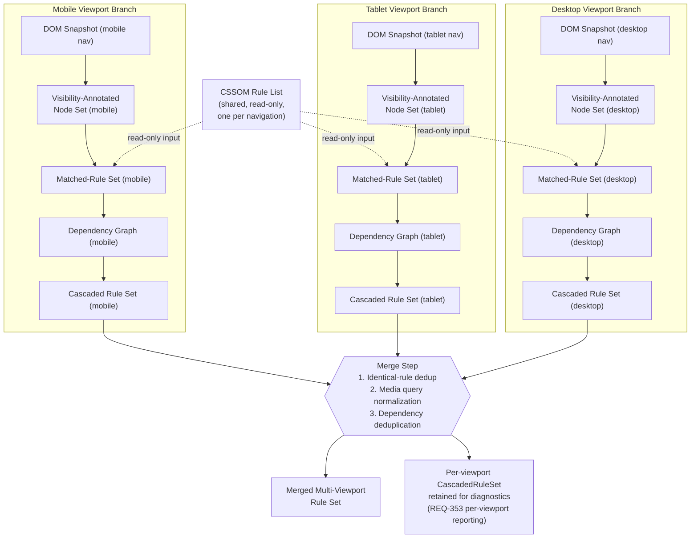

# 016 — Data Flow

## 1. Title

**Critical CSS Extraction Engine — End-to-End Data Flow**

## 2. Version

| Field | Value |
|---|---|
| Document Version | 1.0.0 |
| Status | Accepted |
| Last Updated | 2026-07-09 |
| Owners | Core Architecture Working Group |
| Stability | Stable (foundational architecture document; changes require RFC) |

## 3. Purpose

This document traces the **data**, not the control flow, that moves through the Engine during a full multi-viewport, multi-route extraction run. [011-Execution-Pipeline.md](./011-Execution-Pipeline.md) answers "what stage runs, in what order, under what triggering conditions." This document answers a different question: "what is the concrete shape of the information at each boundary between stages, what happens to it structurally as it crosses that boundary, and where does it fan out into parallel branches and fan back into a single stream." A reader who understands [010-System-Overview.md](./010-System-Overview.md)'s module map and [011-Execution-Pipeline.md](./011-Execution-Pipeline.md)'s stage sequencing still cannot answer, from those documents alone, "is the DOM snapshot mutated in place by the Visibility Engine, or is a new structure allocated?" or "at the merge step, is the per-viewport rule set discarded after merging, or retained for diagnostics?" Those are data-lifecycle questions, and this document exists to answer them precisely enough that an implementer never has to guess at ownership, mutability, or fan-out/fan-in shape.

This document intentionally does not define TypeScript interfaces — those are the responsibility of the forthcoming `docs/api/` tree, per [007-Repository-Structure.md](./007-Repository-Structure.md). Every data shape described here is conceptual: a named structure with a described set of fields, immutability posture, and lifetime, sufficient for an autonomous coding agent to derive a concrete interface later without having to re-derive the underlying data model from scratch.

## 4. Audience

- Implementers of `packages/collector`, `packages/matcher`, `packages/coverage`, `packages/dependency-graph`, `packages/serializer`, and `packages/cache`, who need to know exactly what data structure they receive, what they may mutate, and what they must hand downstream.
- Authors of the forthcoming `docs/api/` interface specifications, who will translate the conceptual shapes here into concrete TypeScript types.
- Plugin authors (see [ADR-0004-Plugin-Lifecycle-Model](../adr/ADR-0004-Plugin-Lifecycle-Model.md)) who need to understand what data a lifecycle hook actually receives and what mutating it does or does not affect downstream.
- Performance engineers reasoning about memory footprint and copy cost at each pipeline boundary, particularly across the multi-viewport fan-out.
- Autonomous coding agents implementing the pipeline, who need the data-shape contract nailed down before writing the control-flow code that moves data between stages.

Readers are assumed to have already read [001-Vision.md](./001-Vision.md), [003-Requirements.md](./003-Requirements.md), [006-Design-Principles.md](./006-Design-Principles.md), and [007-Repository-Structure.md](./007-Repository-Structure.md), and ideally [010-System-Overview.md](./010-System-Overview.md) and [011-Execution-Pipeline.md](./011-Execution-Pipeline.md) for control-flow context. This is a senior-engineer RFC, not a tutorial.

## 5. Prerequisites

- Familiarity with the CSSOM (`document.styleSheets`, `CSSRule` subtypes) and the DOM.
- Familiarity with the module responsibility table in [003-Requirements.md](./003-Requirements.md) (Section 8.1/8.2) and the package layout in [007-Repository-Structure.md](./007-Repository-Structure.md).
- Familiarity with Principle 1 (Browser Is Source of Truth), Principle 5 (Determinism of Output), and Principle 8 (Incremental-by-Default Caching) from [006-Design-Principles.md](./006-Design-Principles.md), since this document's data shapes are direct consequences of those principles — determinism in particular constrains how data may be reordered or merged.
- Familiarity with BRIEF.md Section 2.6 (Multi-Viewport Strategy), 2.7 (Hybrid Extraction Mode), and 2.9 (Route Manifest), which this document operationalizes at the data level.
- Awareness that this document assumes, but does not re-derive, the control-flow sequencing defined in [011-Execution-Pipeline.md](./011-Execution-Pipeline.md) — read that document first if the *order* of operations (as opposed to the *shape* of data) is the open question.

## 6. Related Documents

- [001-Vision.md](./001-Vision.md) — why browser-observed data is treated as authoritative at every transformation boundary described here.
- [003-Requirements.md](./003-Requirements.md) — REQ-100–110 (visibility data), REQ-150–154 (strategy data), REQ-200–205 (dependency graph data), REQ-250–253 (serialization data), REQ-300–304 (cache data), REQ-500 (determinism of the data produced at every boundary).
- [006-Design-Principles.md](./006-Design-Principles.md) — Principle 5 (Determinism) and Principle 8 (Incremental Caching) directly constrain the fingerprinting and merge data flows described in Sections 9–10 below.
- [007-Repository-Structure.md](./007-Repository-Structure.md) — the package boundaries (`packages/collector`, `packages/matcher`, `packages/coverage`, `packages/dependency-graph`, `packages/serializer`, `packages/cache`, `packages/reporter`) across which the data described here physically flows.
- [010-System-Overview.md](./010-System-Overview.md) — the module map this document's data boundaries correspond to.
- [011-Execution-Pipeline.md](./011-Execution-Pipeline.md) — the control-flow sequencing of the stages whose data transformations are described here; read together, the two documents form a complete picture (control flow + data flow).
- [012-Module-Interaction.md](./012-Module-Interaction.md) — how modules call one another; this document describes what they pass, not how the call is dispatched.
- [013-Component-Diagram.md](./013-Component-Diagram.md) — static component boundaries that host the data transformations described here.
- [014-Dependency-Graph.md](./014-Dependency-Graph.md) — the internal structure of the dependency graph data object introduced in Section 8.6 of this document, described here only at the level needed for data-flow purposes; that document is the authority on graph construction algorithms.
- [015-Runtime-Model.md](./015-Runtime-Model.md) — the process/thread/browser-context runtime boundaries that data crosses (e.g., serialization cost when data crosses a Node↔browser IPC boundary), which motivates several of the "concrete shape" decisions below.
- BRIEF.md, Section 2.6 (Multi-Viewport Strategy), Section 2.7 (Hybrid Extraction Mode), Section 2.9 (Route Manifest) — the authoritative source for the merge strategy and manifest schema this document operationalizes.

## 7. Overview

A single invocation of the Engine against a route manifest performs, conceptually, one long transformation chain per (route, viewport) pair, followed by a fan-in merge per route, followed by a fan-out into cached artifacts and diagnostics per route. The chain, restated as a sequence of **data states** rather than **processing stages**, is:

1. **Route Manifest Entry** (input) — a route pattern and its target bundle identifier, per BRIEF.md Section 2.9.
2. **Raw HTML / Live Page** — the navigated, stabilized browser page, not yet a data structure the host process holds directly.
3. **DOM Snapshot** — an enumerated, host-addressable set of node handles/records describing the page's DOM at a stability point.
4. **Visibility-Annotated Node Set** — the DOM Snapshot augmented with per-node visibility classification, geometry, and fold-relative metadata.
5. **CSSOM Rule List** — the full traversed stylesheet rule tree for the page, independent of any particular viewport's visibility outcome.
6. **Matched-Rule Set (per viewport)** — the subset of the CSSOM Rule List determined to apply to at least one visibility-annotated node, for one specific viewport profile.
7. **Dependency Graph** — the closure of at-rule and custom-construct dependencies (variables, keyframes, fonts, `@property`, layers, etc.) reachable from the Matched-Rule Set.
8. **Resolved / Cascaded Rule Set (per viewport)** — the Matched-Rule Set plus its dependency closure, with cascade order, specificity, and layer ordering annotated, still scoped to one viewport.
9. **Merged Multi-Viewport Rule Set** — the fan-in point: independent per-viewport Resolved Rule Sets combined per BRIEF.md Section 2.6's merge strategy (identical-rule deduplication, media query normalization, dependency deduplication).
10. **Serialized CSS AST** — a canonically ordered, textual/structural representation ready for formatting.
11. **Minified Output** — the compressed, final CSS payload.
12. **Cached Artifact + Route Manifest Entry** — the persisted, fingerprint-addressed output plus its manifest linkage.
13. **Diagnostics / Report Data** — the parallel, non-authoritative stream of structured metadata (timings, matched/unmatched selectors, dependency graph export) produced as a byproduct of every stage above, converging separately at the Reporter.

Two structural properties recur throughout and are worth stating up front because they discipline every section below:

- **Fan-out happens once, at Stage 6, and persists through Stage 8.** From the moment the CSSOM Rule List is available, each configured viewport profile proceeds through Selector Matching, Dependency Resolution, and Cascade Resolution as an **independent branch** operating on its own copy of viewport-scoped visibility data, sharing only the immutable CSSOM Rule List and DOM Snapshot as read-only inputs. No branch observes or mutates another branch's intermediate state. This is the direct data-level consequence of BRIEF.md Section 2.6 ("Generate critical CSS independently for Mobile, Tablet, Desktop") and of Principle 4 in [006-Design-Principles.md](./006-Design-Principles.md) (pluggable, non-interfering strategies).
- **Fan-in happens exactly once, at Stage 9**, and is the only point in the entire chain where data from multiple independent branches is combined into a single structure. Every stage after Stage 9 operates on one unified stream again.

The remainder of this document elaborates the concrete shape of data at each of these thirteen boundaries, states what is immutable versus mutated in place, and provides two Mermaid diagrams: a left-to-right transformation flowchart covering the whole chain, and a dedicated fan-out/fan-in diagram for the multi-viewport branch.

## 8. Detailed Design

### 8.1 Route Manifest Entry → Live Page

**Shape of the input.** Per BRIEF.md Section 2.9, the route manifest is a flat mapping of route pattern strings (including wildcard patterns such as `/blog/*`) to output bundle identifiers:

```json
{ "/": "home.css", "/products": "products.css", "/blog/*": "blog.css" }
```

At execution time, the CLI expands this into a list of **Route Work Items**, each a small immutable record: `{ routePattern: string, resolvedUrl: string, bundleId: string, viewportProfiles: ViewportProfile[] }`. This expansion is a pure, host-side transformation — no browser involvement yet — and it is the first point at which "one manifest entry" becomes "N pieces of work" (one per concrete route instance matching a wildcard, if the crawler enumerates concrete URLs) crossed with "M viewport profiles." The Route Work Item is immutable for the remainder of the run; nothing downstream mutates it, only reads from it (e.g., the bundle identifier is threaded, unchanged, all the way to Stage 12).

**Why immutable at this boundary.** Determinism (Principle 5) requires that the same manifest, expanded twice, produce identical Route Work Items in identical order; mutation here would risk order-dependent identity drift across runs.

**Transformation to a Live Page.** The Route Work Item's `resolvedUrl` is handed to the Browser Manager / Navigation Engine, which produces a live, stabilized Playwright `Page` handle. This is **not** a data structure the host process can serialize or copy — it is a live handle into a browser process's renderer, and it is explicitly excluded from the "data" this document otherwise tracks structurally, because from this point until the DOM Snapshot is taken (Stage 8.2), the authoritative state lives inside the browser, not in any host-side object. This is the concrete embodiment of Principle 1 ([006-Design-Principles.md](./006-Design-Principles.md)): the host does not hold a shadow copy of page state to keep in sync; it queries the live page directly whenever it needs data.

### 8.2 Live Page → DOM Snapshot

**Shape of the output.** A **DOM Snapshot** is a host-addressable, flat enumeration of node records, produced by a single batched `page.evaluate()` call (per the batching guidance in [001-Vision.md](./001-Vision.md) Section 10) rather than N individual round trips. Conceptually:

```
DomSnapshot {
  snapshotId: string                // fingerprint-derived, stable within a run
  capturedAt: LogicalTimestamp      // monotonic counter, not wall-clock (Principle 5)
  nodes: DomNodeRecord[]            // flat array, index = stable within-snapshot node id
}

DomNodeRecord {
  nodeId: number                    // index into nodes[]; stable handle surrogate
  tagName: string
  classList: string[]
  attributes: Record<string, string>
  shadowRootId: number | null       // reference to a nested snapshot if this node hosts a shadow root
  parentNodeId: number | null
  childNodeIds: number[]
}
```

Note what this structure deliberately omits: it holds no live `ElementHandle` references at rest. A live handle is acquired transiently, per Principle 1's "query, don't cache" posture, only when a downstream stage (Selector Matching, Visibility) needs to re-enter the page context — the DOM Snapshot itself is a **plain, serializable, host-side record set**, safe to hold across the lifetime of a multi-viewport extraction run without pinning browser memory. This is a deliberate design choice elaborated in Tradeoffs (Section 13): the alternative (holding live handles) would be faster per-access but would tie the snapshot's lifetime to the page's lifetime, which is incompatible with the fan-out model in Section 9, where the DOM Snapshot is read concurrently (conceptually) by multiple viewport branches while the underlying page may already have navigated to the next viewport profile (see [015-Runtime-Model.md](./015-Runtime-Model.md) for whether this is literal concurrency or sequential reuse of one page across profiles).

**Mutability.** The DOM Snapshot is **immutable once captured**. Shadow-root nested snapshots (`shadowRootId`) are themselves independently immutable DomSnapshot-shaped structures, linked, not inlined, so that a page with many shadow roots does not require deep-copying on every partial read.

**Fan-out implication.** Because visibility is viewport-dependent (a node visible at 1920×1080 may not be visible at 375×667) but DOM structure is not, the Engine captures **one DOM Snapshot per viewport navigation**, not one shared snapshot reused across viewports — see Section 9. What *is* shared read-only across viewport branches is the CSSOM Rule List (Section 8.4), because stylesheet content does not change with viewport, only which rules match.

### 8.3 DOM Snapshot → Visibility-Annotated Node Set

**Shape of the output.** The Visibility Engine consumes a DOM Snapshot and produces a **Visibility-Annotated Node Set**: not a mutation of the DOM Snapshot in place, but a **parallel, indexed overlay**:

```
VisibilityAnnotatedNodeSet {
  snapshotId: string                 // back-reference to the DomSnapshot this overlays
  viewportProfileId: string
  annotations: VisibilityAnnotation[] // one per DomNodeRecord, same index space
}

VisibilityAnnotation {
  nodeId: number                     // matches DomNodeRecord.nodeId
  boundingBox: Rect                  // getBoundingClientRect() result, epsilon-rounded (Principle 5 edge case)
  intersectsFold: boolean
  computedDisplay: string
  computedVisibility: string
  computedOpacity: number
  isFixedOrSticky: boolean
  visibilityClass: "critical" | "excluded" | "ambiguous"
}
```

**Why an overlay, not a mutation.** The DOM Snapshot is immutable (Section 8.2); annotating it in place would violate that invariant and, more importantly, would prevent computing multiple VisibilityAnnotatedNodeSets against structurally-related-but-distinct snapshots (one per viewport) without duplicating the (potentially large) node record array. An overlay keyed by `nodeId` is a small, independently garbage-collectable structure per viewport, discarded once the corresponding Matched-Rule Set (Stage 8.6) has been produced, unless retained for diagnostics (Section 8.13).

**`visibilityClass` versus a boolean.** REQ-100/REQ-102/REQ-103 in [003-Requirements.md](./003-Requirements.md) require configurable treatment of opacity and transform-based offscreen positioning; collapsing visibility to a plain boolean at this stage would discard the information needed for a downstream configuration toggle to reinterpret a node's status without re-querying the browser. `"ambiguous"` exists specifically for nodes whose classification depends on a configuration flag not yet applied at annotation time (e.g., `opacity: 0` under a not-yet-resolved config) — the Selector Matcher's consumer of this data resolves `"ambiguous"` against the active configuration deterministically and without a second browser round trip.

### 8.4 Live Page → CSSOM Rule List

**Shape of the output.** Independently of the DOM Snapshot/Visibility pipeline (they can execute in either order or concurrently against the same stabilized page, per [011-Execution-Pipeline.md](./011-Execution-Pipeline.md)), the CSSOM Walker produces a **CSSOM Rule List**:

```
CssomRuleList {
  snapshotId: string                  // shared correlation id with the DomSnapshot from the same navigation
  stylesheets: StylesheetRecord[]
}

StylesheetRecord {
  stylesheetIndex: number             // stable, browser-reported document.styleSheets order
  origin: "author" | "user-agent" | "user"
  href: string | null
  accessible: boolean                 // false if cross-origin/CORS-blocked (REQ-007)
  rules: CssomRuleRecord[]
}

CssomRuleRecord {
  ruleIndex: number                   // stable, browser-reported position within its stylesheet
  ruleType: "style" | "media" | "supports" | "layer" | "keyframes" | "font-face" | "property" | "counter-style" | "import"
  selectorText: string | null         // present for style rules only
  declarationText: string             // raw, browser-serialized cssText of the declaration block
  mediaConditionText: string | null
  layerName: string | null
  parentRuleIndex: number | null      // for nested at-rules (media/supports/layer wrapping style rules)
}
```

**Why this is viewport-independent and computed once per navigation, not once per run.** The brief's non-goal ("do not rely on static CSS parsing") does not mean the CSSOM Rule List is read once for the entire multi-viewport run and reused blindly — CSS-in-JS runtime injection (per [001-Vision.md](./001-Vision.md) Section 8.1's rendering-fidelity commitment) means the set of stylesheets present can, in principle, differ across viewport navigations if the application renders different components at different breakpoints. The Engine therefore captures a CSSOM Rule List **per viewport navigation**, correlated by `snapshotId`, rather than treating it as a single global constant reused unchanged across all viewport branches. In the common case (no viewport-conditional component mounting) the resulting CssomRuleList objects across viewports are structurally identical, and the Cache Manager's fingerprinting (Section 8.11) can detect and exploit that identity, but the data flow never *assumes* it.

**Mutability and lifetime.** Immutable once captured, for the same reasons as the DOM Snapshot. `ruleIndex` and `stylesheetIndex` are the browser-reported, already-stable ordering values that the Serializer's canonical-ordering algorithm ([006-Design-Principles.md](./006-Design-Principles.md), Algorithm: Canonical Ordering) depends on — this is the specific data field that makes downstream determinism possible without the Serializer re-deriving order from scratch.

**Cross-origin degradation.** When `accessible: false` (REQ-007), `rules` is an empty array and the record itself, not its absence, is the diagnostic signal: the Reporter (Section 8.13) surfaces stylesheets with `accessible: false` explicitly as `CrossOriginStylesheetSkipped` diagnostics, rather than the CSSOM Rule List silently omitting the stylesheet entry entirely. This is a direct data-shape consequence of Principle 6 (Fail-Fast Diagnostics).

### 8.5 Selector Matching: (Visibility-Annotated Node Set, CSSOM Rule List) → Matched-Rule Set

This is the first true join in the pipeline: two independently-produced structures (Sections 8.3 and 8.4) are combined by the Selector Matcher, per viewport, into a single output.

**Shape of the output.**

```
MatchedRuleSet {
  viewportProfileId: string
  strategy: "cssom" | "coverage" | "hybrid"
  matches: MatchedRule[]
}

MatchedRule {
  stylesheetIndex: number             // carried through unchanged from CssomRuleRecord's parent stylesheet
  ruleIndex: number                   // carried through unchanged
  selectorText: string
  matchedSelectorBranches: string[]   // the subset of comma-separated top-level branches that matched at least one critical node
  matchedNodeIds: number[]            // which VisibilityAnnotation nodeIds matched, for diagnostics
  declarationText: string
  strategyEvidence: StrategyEvidence  // see below
}

StrategyEvidence {
  cssomMatched: boolean | null        // null if CSSOM strategy was not run
  coverageObserved: boolean | null    // null if Coverage strategy was not run
  computedStyleVerified: boolean | null
}
```

**Why `stylesheetIndex`/`ruleIndex` are carried through unchanged rather than re-derived.** This is the load-bearing detail that lets the Serializer's canonical ordering (Section 8.9) work without re-correlating rules back to their stylesheet position later — a `MatchedRule` is traceable to its origin `CssomRuleRecord` by these two fields alone, without needing a back-reference pointer that would complicate serialization across the Node↔browser IPC boundary described in [015-Runtime-Model.md](./015-Runtime-Model.md).

**Why `StrategyEvidence` is a structured record, not a single boolean.** REQ-152 requires Hybrid mode to reconcile CSSOM matching, Coverage API results, and `getComputedStyle` verification per a documented precedence policy; a single collapsed boolean would discard the information needed to (a) implement that precedence policy at Stage 8.5 itself, and (b) produce REQ-154's per-rule "which strategy determined it as used" diagnostic. This record is the concrete data structure BRIEF.md Section 2.7's "Hybrid Extraction Mode" three-way combination compiles down to.

**Immutability.** `MatchedRuleSet` is produced once per viewport branch and is not mutated after production; the Dependency Resolver (Section 8.6) treats it as a read-only input and produces a new structure rather than appending fields onto it in place. This separation exists so that the Matched-Rule Set remains independently inspectable in diagnostics (REQ-461, matched/unmatched selector report) exactly as it existed before dependency resolution potentially adds more rules — the unmatched-selector report specifically needs "matched by selector, before dependency inclusion" as a distinct data point from "included in final output because a matched rule depended on it."

### 8.6 Dependency Resolution: Matched-Rule Set → Dependency Graph

**Shape of the output.** Per REQ-200/REQ-201/REQ-202 and [014-Dependency-Graph.md](./014-Dependency-Graph.md) (which owns the construction algorithm in full detail), the data-flow-relevant shape is:

```
DependencyGraph {
  viewportProfileId: string
  nodes: DependencyNode[]             // one per matched rule plus one per discovered dependency
  edges: DependencyEdge[]             // directed: dependent -> dependency
  cycles: DependencyCycle[]           // detected and terminated, not silently dropped (REQ-202)
  unresolved: UnresolvedDependency[]  // REQ-503: surfaced, never silently dropped
}

DependencyNode {
  nodeId: string                       // e.g., "rule:3:12" or "var:--brand-color" or "keyframes:fade-in"
  kind: "matched-rule" | "css-variable" | "keyframes" | "font-face" | "property" | "counter-style" | "layer" | "media-query" | "container-query"
  payload: MatchedRule | CssomRuleRecord | LayerOrderingFact
}

DependencyEdge {
  from: string                         // dependent nodeId
  to: string                           // dependency nodeId
  reason: "var-reference" | "animation-name" | "font-family" | "layer-membership" | "counter-name"
}
```

**Why the graph is additive over the Matched-Rule Set rather than replacing it.** The Matched-Rule Set (Section 8.5) becomes the initial node frontier (`kind: "matched-rule"` nodes); resolution is the iterative process of discovering and adding dependency nodes/edges until fixed point (REQ-201), never removing or rewriting a matched-rule node. This additive-only property is what makes fixed-point termination decidable: the node set is monotonically non-decreasing, and termination is detected when an iteration adds zero new nodes, not by a heuristic iteration cap (a cap would violate Principle 3, correctness over premature optimization, unless explicitly configured and diagnosably flagged per Principle 6).

**Fixed-point resolution as a data-flow loop, not a single transformation.** Unlike every other boundary in this document, Stage 8.6 is not a single input→output arrow; it is `graph_(n+1) = resolve(graph_n)`, applied until `graph_(n+1) == graph_n` in node/edge count. This is the one place in the pipeline where the "data flow" is more accurately described as a fixed-point iteration over a mutable accumulator (the in-progress graph, mutated in place across iterations for performance — this is the one explicit, documented exception to the "immutable at rest" pattern used elsewhere, justified because the accumulator never leaves the Dependency Resolver's exclusive ownership during the loop and is frozen into an immutable `DependencyGraph` only upon fixed-point termination, at which point it is handed downstream as read-only).

**`unresolved` as first-class output, not an exception.** Per Principle 6 and REQ-503, a dependency the resolver cannot satisfy (e.g., a `var()` reference to a custom property that is never defined by any accessible stylesheet) is recorded as an `UnresolvedDependency` entry in the graph's own output, not thrown as an exception that would need to be caught, translated, and re-attached to diagnostics by a separate mechanism. This keeps the "diagnostics travel with the data" property (Section 8.13) uniform across the whole pipeline.

### 8.7 Cascade Resolution: Dependency Graph → Resolved / Cascaded Rule Set

**Shape of the output.**

```
CascadedRuleSet {
  viewportProfileId: string
  rules: CascadedRule[]                // superset of MatchedRuleSet.matches, plus dependency-graph-included rules
}

CascadedRule {
  stylesheetIndex: number
  ruleIndex: number
  selectorText: string
  declarationText: string
  origin: "author" | "user-agent" | "user"
  layerOrder: number | null            // browser-resolved cascade layer position, per Principle 1 (never hand-computed)
  specificityVector: [number, number, number] | null  // [id, class/attr/pseudo-class, type] — null for :where()-only selectors per spec
  inclusionReason: "directly-matched" | "dependency-of" 
  dependencyOf: string[]               // nodeIds from the DependencyGraph, empty if directly-matched
}
```

**Why cascade facts (`layerOrder`, `specificityVector`) are attached per-rule here rather than computed later by the Serializer.** Principle 1 requires that layer ordering be read from the browser's resolved order, not recomputed by the host; this stage is where that browser-derived fact (obtained via a `page.evaluate()` query against the live page, correlated back by `stylesheetIndex`/`ruleIndex`) is joined onto the rule data, while the page is still available. The Serializer (Section 8.9) consumes `layerOrder` and `specificityVector` as already-resolved facts and never re-derives them — this division of labor is what keeps the Serializer a pure, browser-independent, host-only transformation (a property that matters for [015-Runtime-Model.md](./015-Runtime-Model.md)'s discussion of which stages can run outside a browser-attached process at all, e.g., during cache-hit replay).

**`inclusionReason`/`dependencyOf` as retained provenance.** These fields exist purely for REQ-460/REQ-461/REQ-462 diagnostic reporting; they are never consulted by the Serializer's ordering or deduplication logic (Section 8.9), which treats every `CascadedRule` uniformly regardless of why it was included. This is a deliberate separation: correctness-critical fields (`layerOrder`, `specificityVector`, `stylesheetIndex`, `ruleIndex`) and diagnostics-only fields (`inclusionReason`, `dependencyOf`) coexist in the same record but are consumed by disjoint downstream code paths, so that a future change to diagnostic granularity cannot accidentally perturb serialization determinism.

## 9. Architecture

### 9.1 Full Left-to-Right Data Transformation Flow

```mermaid
flowchart LR
    RM[Route Manifest Entry] --> LP["Live Page
(navigated, stabilized)"]

    LP --> DS["DOM Snapshot
(flat DomNodeRecord[])"]
    LP --> CRL["CSSOM Rule List
(StylesheetRecord[] -> CssomRuleRecord[])"]

    DS --> VAN["Visibility-Annotated
Node Set (per viewport)"]

    VAN --> MRS["Matched-Rule Set
(per viewport)"]
    CRL --> MRS

    MRS --> DG["Dependency Graph
(fixed-point closure)"]

    DG --> CRS["Cascaded Rule Set
(per viewport, cascade-annotated)"]

    CRS --> MERGE["Merged Multi-Viewport
Rule Set (fan-in)"]

    MERGE --> AST["Serialized CSS AST
(canonical order)"]

    AST --> MIN["Minified Output"]

    MIN --> ARTIFACT["Cached Artifact +
Route Manifest Entry"]

    MRS -.diagnostics.-> REPORT["Diagnostics / Report Data"]
    DG -.diagnostics.-> REPORT
    CRS -.diagnostics.-> REPORT
    MERGE -.diagnostics.-> REPORT
    ARTIFACT -.diagnostics.-> REPORT

    classDef fanpoint fill:#a33,stroke:#722,color:#fff;
    class MERGE fanpoint;
```



The diagram deliberately draws `MERGE` as the single highlighted fan-in node: every arrow into it originates from a per-viewport-branch `CRS`, and every arrow out of it feeds a single, unified downstream chain. The dashed arrows into `REPORT` denote that diagnostics data is captured as a **side channel** at each stage, not extracted from the primary artifact after the fact — this is the data-flow expression of Principle 6 (Fail-Fast Diagnostics): diagnostics accompany data at the moment of production, they are not reconstructed retrospectively.

### 9.2 Multi-Viewport Fan-Out / Fan-In Detail



Two properties of this diagram are load-bearing:

1. **Every branch is structurally identical and mutually non-interfering.** No branch reads another branch's `VisibilityAnnotatedNodeSet`, `MatchedRuleSet`, `DependencyGraph`, or `CascadedRuleSet`. This is what makes the branches safe to execute with any concurrency model [015-Runtime-Model.md](./015-Runtime-Model.md) chooses (sequential reuse of one browser context, parallel browser contexts, or worker-thread-distributed) without a data-flow-level redesign — concurrency is a runtime-scheduling decision layered on top of an already-independent data shape, not a precondition for that independence.
2. **The only genuinely shared input is the CSSOM Rule List**, and it is shared strictly read-only. If a future requirement demanded per-viewport-conditional stylesheet sets (Section 8.4's caveat about CSS-in-JS runtime injection varying by breakpoint), each branch would instead hold its own `CssomRuleList` correlated to its own navigation, and the "shared" arrow in this diagram would be replaced by three independent arrows — the diagram represents the common case, and the data shapes in Section 8.4 already accommodate the uncommon case without modification.

### 9.3 Merge Step Internal Data Flow

The merge step (BRIEF.md Section 2.6) deserves its own decomposition because "merge" is not a single operation but three sequential sub-transformations applied to the union of all per-viewport `CascadedRuleSet.rules` arrays:

1. **Identical-rule deduplication.** Two `CascadedRule` records from different viewport branches are identical if their `(selectorText, declarationText, origin, layerOrder)` tuple matches exactly. Where they match, the merge retains a single `MergedRule` record and records which viewport(s) contributed it (`contributingViewports: string[]`), rather than arbitrarily keeping one copy and discarding provenance — REQ-353 (per-route, per-viewport reporting) depends on this provenance surviving the merge.
2. **Media query normalization.** Rules that differ only in that they originated inside viewport-specific `@media` wrapping (e.g., a rule present in the Mobile branch's cascade wrapped in `@media (max-width: 767px)` and an equivalent Desktop-branch rule wrapped in `@media (min-width: 1024px)`) are **not** collapsed into one rule with a synthesized combined media condition; each retains its own `mediaConditionText` (carried through from Section 8.4's `CssomRuleRecord.mediaConditionText`) into the `MergedRule`, and normalization here means canonicalizing the *textual form* of equivalent media conditions (e.g., `(min-width: 1024px)` versus `(min-width:1024px)`) so that Stage 8.1's dedup comparison in step 1 is not defeated by insignificant whitespace/ordering differences in the condition text — normalization is a precondition for correct deduplication, not a separate rule-merging operation.
3. **Dependency deduplication.** Each viewport branch produced its own `DependencyGraph` (Section 8.6); the merge step unions their `nodes`/`edges` by `nodeId`, since dependency identity (a CSS variable name, a keyframes name) is viewport-independent even though *which rules reference it* may differ per viewport. The unioned dependency set becomes part of the `MergedMultiViewportRuleSet`'s own dependency manifest, ensuring Stage 8.10 (Serialization) emits each `@font-face`/`@keyframes`/`@property` at-rule exactly once regardless of how many viewport branches independently discovered a dependency on it.

```
MergedMultiViewportRuleSet {
  routeWorkItemId: string
  rules: MergedRule[]
  dependencyManifest: DependencyGraph        // post-union, viewport-agnostic
  perViewportRetained: Map<string, CascadedRuleSet>  // for REQ-353 diagnostics, discarded after report generation unless --keep-intermediate is set
}

MergedRule {
  selectorText: string
  declarationText: string
  origin: "author" | "user-agent" | "user"
  layerOrder: number | null
  mediaConditionText: string | null          // normalized, per step 2 above
  contributingViewports: string[]
  stylesheetIndex: number                     // from whichever contributing CascadedRule was first in canonical order (tie-break rule, see Algorithms)
  ruleIndex: number
}
```

## 10. Algorithms

### 10.1 Multi-Viewport Merge Algorithm

**Problem statement.** Given N independent `CascadedRuleSet` objects (one per configured viewport profile), produce a single `MergedMultiViewportRuleSet` satisfying BRIEF.md Section 2.6's three merge criteria (identical-rule dedup, media query normalization, dependency dedup) while preserving Principle 5's determinism (the merge result must not depend on the order in which viewport branches complete).

**Inputs.** `cascadedSets: CascadedRuleSet[]`, one per viewport profile, each internally already in the canonical per-viewport order established in Section 8.7.

**Outputs.** `MergedMultiViewportRuleSet` as defined in Section 9.3.

**Pseudocode.**

```
function mergeViewports(cascadedSets: CascadedRuleSet[]): MergedMultiViewportRuleSet
    // Step 0: sort input branches by a stable key (viewportProfileId) so that
    // merge behavior never depends on completion order, only on configured identity.
    sortedSets = cascadedSets.sortBy(set => set.viewportProfileId)

    ruleIndex: Map<MergeKey, MergedRule> = new Map()   // insertion order = first-seen order

    for set in sortedSets:
        for rule in set.rules:
            normalizedMedia = normalizeMediaQueryText(rule.mediaConditionText)
            key = (rule.selectorText, rule.declarationText, rule.origin, rule.layerOrder, normalizedMedia)
            if ruleIndex.has(key):
                existing = ruleIndex.get(key)
                existing.contributingViewports.push(set.viewportProfileId)
            else:
                ruleIndex.set(key, MergedRule.from(rule, normalizedMedia, [set.viewportProfileId]))

    mergedRules = canonicalOrder(Array.from(ruleIndex.values()))  // reuse Serializer's canonical ordering (006-Design-Principles.md)

    dependencyManifest = unionDependencyGraphs(sortedSets.map(set => set.dependencyGraphRef))

    return MergedMultiViewportRuleSet {
        rules: mergedRules,
        dependencyManifest: dependencyManifest,
        perViewportRetained: buildRetainedMap(sortedSets)
    }

function unionDependencyGraphs(graphs: DependencyGraph[]): DependencyGraph
    nodeMap: Map<string, DependencyNode> = new Map()
    edgeSet: Set<string> = new Set()          // serialized (from,to,reason) for dedup
    mergedEdges: DependencyEdge[] = []

    for graph in graphs (sorted by viewportProfileId, same discipline as above):
        for node in graph.nodes:
            if not nodeMap.has(node.nodeId):
                nodeMap.set(node.nodeId, node)
        for edge in graph.edges:
            edgeKey = `${edge.from}|${edge.to}|${edge.reason}`
            if not edgeSet.has(edgeKey):
                edgeSet.add(edgeKey)
                mergedEdges.push(edge)

    return DependencyGraph {
        nodes: Array.from(nodeMap.values()),
        edges: mergedEdges,
        cycles: unionCycles(graphs),          // cycles are per-graph facts, unioned by identity, not recomputed
        unresolved: unionUnresolved(graphs)
    }
```

**Time complexity.** O(V × R) for the rule merge, where V is the number of viewport profiles (small, typically 3–6) and R is the average number of cascaded rules per viewport; the `Map`-based key lookup makes each insertion O(1) amortized, so the dominant cost is the final `canonicalOrder` sort at O(V·R · log(V·R)). Dependency graph union is O(V × (N_v + E_v)) where N_v/E_v are per-viewport node/edge counts, again linear in total dependency-graph size across branches.

**Memory complexity.** O(V × R) transiently (all per-viewport rules held before merging), collapsing to O(U) where U is the count of unique merged rules (U ≤ V×R) after merge completes. The `perViewportRetained` map is the one place memory is *not* automatically reclaimed — it is explicitly retained for REQ-353 diagnostics and is a deliberate, bounded-by-V memory cost (V is small) accepted for reporting fidelity, and is dropped once the Reporter (Section 8.13) has consumed it, unless `--keep-intermediate` is passed.

**Failure cases.** Two rules with identical `(selectorText, declarationText, origin, layerOrder)` but *inequivalent* (not merely differently-formatted) media conditions must not be merged — this is why `normalizedMedia` is part of the key, not discarded after normalization; a normalization bug that over-canonicalizes distinct conditions into the same normalized text is a correctness bug in `normalizeMediaQueryText`, not in the merge algorithm itself, and must be caught by dedicated unit tests (Section 15) rather than relying on the merge algorithm to detect it structurally.

**Optimization opportunities.** For very large per-viewport rule counts, the `Map`-keyed merge can be sharded by `selectorText`'s first character or hash prefix and merged in parallel shards before a final canonical sort, mirroring the Serializer's own partition-and-merge optimization described in [006-Design-Principles.md](./006-Design-Principles.md)'s Canonical Ordering algorithm — this is a direct reuse of that document's optimization strategy at the multi-viewport-merge layer rather than a new technique.

### 10.2 Fingerprint-to-Cache-Entry Data Mapping

**Problem statement.** Given a computed fingerprint (per [006-Design-Principles.md](./006-Design-Principles.md)'s Fingerprint Computation algorithm) for a specific (route, viewport-set, mode) combination, determine what data is written to, or read from, the Cache Manager, and in what shape.

**Inputs.** `fingerprint: string`, `artifact: MinifiedOutput`, `manifestEntry: RouteWorkItem`.

**Outputs.** A `CacheEntry` record persisted by `packages/cache`, or, on a hit, the same shape read back.

**Pseudocode.**

```
CacheEntry {
    fingerprint: string
    bundleId: string                 // from RouteWorkItem, threaded through since Stage 8.1
    css: string                      // MinifiedOutput content
    sourceRouteWorkItemId: string
    perViewportSizes: Map<string, number>   // REQ-353
    createdAtLogical: LogicalTimestamp      // not wall-clock, per Principle 5's "no timestamps in deterministic payload" — this metadata field is exempt because it lives in the cache envelope, not the CSS payload itself
}

function storeCacheEntry(fingerprint, artifact, manifestEntry, perViewportSizes) -> void
    entry = CacheEntry { fingerprint, bundleId: manifestEntry.bundleId, css: artifact.content,
                          sourceRouteWorkItemId: manifestEntry.id, perViewportSizes,
                          createdAtLogical: nextLogicalTimestamp() }
    cacheStore.put(fingerprint, entry)

function lookupCacheEntry(fingerprint) -> CacheEntry | null
    return cacheStore.get(fingerprint)
```

**Time complexity.** O(1) amortized for a content-addressed store lookup/write (hash-map or key-value backend); O(size of CSS payload) for the actual byte write/read, which dominates in practice.

**Memory complexity.** O(size of CSS payload) per entry; aggregate cache memory/disk footprint is O(number of distinct fingerprints ever seen), bounded operationally by TTL/eviction policy (REQ-302), which is `packages/cache`'s own concern, not this document's.

**Failure cases.** A cache write racing a concurrent identical-fingerprint write from a parallel route/viewport batch (REQ-512) must be idempotent — writing the same fingerprint twice with byte-identical content (guaranteed by Principle 5's determinism) is safe; a `CacheStore` backend that is not last-write-idempotent-safe for identical content is a backend defect, not a data-flow defect, and out of scope here.

**Optimization opportunities.** Store `perViewportSizes` and other small metadata separately from the (potentially larger) `css` payload in a column-oriented cache backend, so that Reporter queries (REQ-353) that only need sizes do not pay the cost of reading full CSS payloads — flagged in Future Work rather than mandated, since it is a backend-internal optimization invisible to this document's data-shape contract.

## 11. Implementation Notes

- Every data structure in Sections 8.1–8.7 that crosses the Node↔browser IPC boundary (i.e., is constructed by evaluating something inside `page.evaluate()`) must be a plain, JSON-serializable object — no functions, no live handles, no circular references — because Playwright's evaluation bridge serializes return values across that boundary. This is why `DomNodeRecord`, `CssomRuleRecord`, and `VisibilityAnnotation` are defined as flat records with primitive/array fields and index-based cross-references (`nodeId`, `stylesheetIndex`) rather than nested object graphs with pointer-like references — index-based correlation survives serialization; object identity does not. See [015-Runtime-Model.md](./015-Runtime-Model.md) for the runtime-process boundary this constraint is derived from.
- The correlation identifiers introduced across this document (`snapshotId`, `viewportProfileId`, `nodeId`, `stylesheetIndex`/`ruleIndex`, `routeWorkItemId`) form a small set of join keys that every stage must propagate unchanged. Implementers should treat accidental key regeneration (e.g., a stage that reassigns `nodeId` instead of propagating the incoming value) as a correctness bug equivalent to a broken foreign key in a relational schema — diagnostics correlation (Section 12) depends on these keys remaining stable end to end.
- The "overlay, not mutation" pattern used for `VisibilityAnnotatedNodeSet` (Section 8.3) should be the default pattern for any future annotation-style stage added to the pipeline (e.g., a hypothetical future accessibility-annotation pass) — it is the pattern that keeps upstream immutable structures reusable across the multi-viewport fan-out without deep copying.
- Plugin hooks (`beforeCollection`, `afterCollection`, `beforeSerialize`, `afterSerialize` — [ADR-0004](../adr/ADR-0004-Plugin-Lifecycle-Model.md)) receive read-only views of the data shapes at their corresponding boundary and return an explicit patch/decision object, per Principle 7 in [006-Design-Principles.md](./006-Design-Principles.md); they never receive a mutable reference to, e.g., the `CssomRuleList` itself. Implementers should model plugin hook I/O as its own small DTO (e.g., `AfterCollectionPatch { excludeNodeIds: number[] }`) rather than exposing the internal pipeline structures directly to plugin code, both for sandboxing and so that internal structure changes (this document's evolution) do not silently break the plugin API surface.
- The `perViewportRetained` map (Section 9.3) is the one data structure in this document whose retention is configuration-dependent (`--keep-intermediate`); implementers must default it to being dropped promptly after Reporter consumption to avoid an unbounded-by-default memory cost proportional to V × R held for the lifetime of a batch run across many routes.

## 12. Edge Cases

- **Zero-viewport-profile configuration.** If a misconfiguration yields an empty viewport profile list, Stage 9's fan-out has zero branches, and the merge step (Section 10.1) receives an empty `cascadedSets` array; `mergeViewports([])` must return an empty-but-well-formed `MergedMultiViewportRuleSet` (not throw), with this condition surfaced as a `Diagnostic` (Principle 6) rather than producing silently empty CSS output indistinguishable from "legitimately no critical CSS needed."
- **Single-viewport configuration.** The merge step must be a no-op-equivalent identity transformation when V=1 (no cross-viewport rule can exist to deduplicate), but it still executes the full algorithm rather than special-casing V=1, so that the code path exercised in the common single-viewport case is the same code path validated for the general multi-viewport case (a testability argument, not a performance one — V=1 through the general algorithm is cheap).
- **A rule identical in every field except `layerOrder` across two viewport branches.** This can occur if a `@layer` declaration is conditionally present depending on viewport-triggered component mounting (Section 8.4's CSS-in-JS caveat). Per the merge key definition in Section 10.1, this produces two distinct `MergedRule` entries, not one — the merge algorithm treats differing cascade-layer position as a semantically significant difference, never collapsing it, because doing so could silently change cascade behavior for one of the contributing viewports.
- **Shadow DOM nested snapshots referenced by `shadowRootId` that are never subsequently visited by the Visibility Engine** (e.g., a closed shadow root the Engine cannot access, per REQ-009's "Should" priority and [006-Design-Principles.md](./006-Design-Principles.md)'s Edge Cases). The `DomSnapshot.nodes` entry for the shadow host still exists with `shadowRootId` set, but there is no corresponding nested `DomSnapshot` object; downstream consumers must treat a `shadowRootId` that fails to resolve as an explicit "inaccessible shadow root" diagnostic condition (Principle 6), not a null-pointer-style failure.
- **Coverage-mode data arriving asynchronously relative to CSSOM matching.** In Hybrid mode (Section 8.5), Coverage API results (per [ADR-0005-Hybrid-Extraction-Mode](../adr/ADR-0005-Hybrid-Extraction-Mode.md)) are collected via a separate CDP session that may report results after CSSOM matching's `page.evaluate()` call has already returned. The `MatchedRule.strategyEvidence.coverageObserved` field must therefore be nullable and is populated in a distinct join step after both the CSSOM-matching data and the Coverage recording have independently completed, not assumed to be co-available at Stage 8.5's initial construction — the data shape supports this by making both matching sources optional in the same record from the outset, rather than the Coverage strategy overwriting an already-finalized `MatchedRule`.
- **Constructable Stylesheets adopted after the DOM Snapshot was captured but before the CSSOM Rule List query runs** (a data-flow-visible instance of Principle 1's stability requirement). Because Sections 8.2 and 8.4 are captured from the same stabilized page state per [011-Execution-Pipeline.md](./011-Execution-Pipeline.md)'s stability gate, this should not occur under correct navigation-engine behavior; if it does (a stabilization-detection gap), the `snapshotId` correlation field allows downstream consumers to detect a DOM Snapshot and CSSOM Rule List pair that were not actually captured atomically together, which should be flagged as a `StabilityViolationWarning` diagnostic rather than silently proceeding with a data-flow assumption of atomicity that did not actually hold.
- **Rule text containing characters that break naive string-keyed deduplication** (e.g., unicode-normalized versus non-normalized selector text for internationalized class names). The merge key in Section 10.1 uses raw `selectorText`/`declarationText` string equality as reported by the browser's own `cssText`/`selectorText` serialization, which is already normalized by the browser consistently (Principle 1) — this sidesteps a whole class of custom-normalization bugs a static tool would need to solve independently.

## 13. Tradeoffs

| Decision | Why | Alternative Considered | Tradeoff Accepted |
|---|---|---|---|
| DOM Snapshot as plain serializable records, not live `ElementHandle`s at rest | Keeps snapshot lifetime decoupled from page/browser-context lifetime; safe to hold across a multi-viewport run and across cache-hit replay paths that have no live page at all | Hold live handles for faster incidental re-access | Any stage needing to re-enter the page (e.g., a plugin hook needing live geometry) must re-acquire a handle via `nodeId`, an extra indirection |
| Visibility annotations as an overlay keyed by `nodeId`, not an in-place mutation of `DomNodeRecord` | Preserves DOM Snapshot immutability so multiple viewport branches (and diagnostics) can reference the same underlying node records without deep-copying | Mutate DomNodeRecord in place, add visibility fields directly | Slightly more indirection when reading "visibility of node X" (two-map lookup instead of one), justified by cross-viewport shareability |
| CSSOM Rule List captured per viewport navigation, not once globally | Correctly handles viewport-conditional CSS-in-JS injection without a special case; uniform data shape regardless of whether the common case (identical CSSOM across viewports) or uncommon case (viewport-conditional stylesheets) holds | Capture once, reuse across all viewport branches as an optimization | Redundant re-capture cost in the common case, mitigated by the Cache Manager's fingerprinting detecting and being able to skip redundant work at a higher level |
| Merge step retains `perViewportRetained` map for diagnostics by default (config-gated to drop) | REQ-353 requires per-viewport, per-route reporting; dropping per-viewport data immediately after merge would make that requirement unsatisfiable without re-running extraction | Discard per-viewport CascadedRuleSets immediately after merge, unconditionally | Bounded-by-V additional memory retained per route until the Reporter consumes it |
| Dependency graph fixed-point loop mutates its accumulator in place during iteration, frozen to immutable only at termination | Avoids O(iterations × graph size) copying cost during a potentially multi-iteration fixed-point search | Immutable accumulator, new graph object per iteration | The one explicit exception to "immutable at rest" in this document; scoped tightly to a single resolver's exclusive, non-shared ownership window |
| Merge algorithm treats `layerOrder`/media-condition differences as always semantically significant, never heuristically collapsed | Protects cascade-behavior correctness (Principle 3) even at the cost of a slightly larger merged output than a more aggressive, riskier collapsing strategy would produce | Attempt to synthesize a single combined media condition (e.g., OR of two viewport-specific conditions) to shrink output further | Marginally larger merged CSS payload in exchange for guaranteed non-divergence from viewport-specific cascade behavior |

## 14. Performance

- **CPU complexity.** The dominant per-route-per-viewport cost, per [001-Vision.md](./001-Vision.md) Section 10's analysis, is the `O(S×E)` selector-matching join at Stage 8.5, mitigated by batched in-page evaluation and memoization; every other data transformation in this document (annotation overlay construction, dependency graph fixed-point iteration, cascade annotation, merge) is at worst `O(n log n)` in the size of its own input and is not the primary cost center. The multi-viewport fan-out multiplies this per-branch cost by V (viewport count), which is the direct, expected cost of BRIEF.md Section 2.6's requirement, not an accidental inefficiency.
- **Memory complexity.** Peak memory during a single route's extraction is bounded by `O(V × (DomSnapshot + CssomRuleList + VisibilityOverlay + MatchedRuleSet + DependencyGraph + CascadedRuleSet))` while all viewport branches' intermediate data is simultaneously live (worst case: fully parallel branch execution, per [015-Runtime-Model.md](./015-Runtime-Model.md)), collapsing to `O(MergedRuleSet size)` plus the retained diagnostics map immediately after the merge step. Sequential-per-viewport execution trades peak memory for wall-clock time by holding only one branch's intermediate data live at a time, discarding it into its `CascadedRuleSet` form (much smaller than the full DOM/CSSOM snapshot it was derived from) before starting the next branch — this is a concrete, data-shape-enabled optimization: because `CascadedRuleSet` does not retain a reference to the full `DomSnapshot`/`CssomRuleList` it was derived from, the larger upstream structures are eligible for garbage collection immediately after Stage 8.7 completes for a given branch, even under sequential execution.
- **Caching strategy.** The fingerprint-to-cache-entry mapping (Section 10.2) is the mechanism by which the entire chain described in Sections 8.1–9.3 is skipped entirely on a cache hit; the data-flow implication is that `apps/cli`'s orchestration must be able to short-circuit before Stage 8.1's Live Page acquisition, not merely before Stage 8.10's serialization, to realize the full latency benefit described in [001-Vision.md](./001-Vision.md) Section 14.
- **Parallelization opportunities.** The fan-out structure in Section 9.2 is the primary parallelization surface: viewport branches share no mutable state and can be scheduled onto separate worker threads or separate browser contexts with zero data-flow changes (per REQ-511/REQ-512). Within a single branch, stylesheet traversal (Section 8.4, across `StylesheetRecord` entries) is independently parallelizable for the same reason — no `StylesheetRecord` depends on another's traversal result.
- **Incremental execution.** Because `MergedRule.contributingViewports` and `perViewportRetained` preserve per-viewport provenance through the merge, a future incremental-extraction mode (REQ-704, Phase 9 roadmap) that needs to re-extract only one viewport profile (e.g., only Mobile changed) has, in principle, enough retained structure to re-run only that branch and re-merge, rather than re-running the full fan-out — this document's data shapes are compatible with that future optimization even though it is not implemented in the phases covered so far (flagged again in Future Work).
- **Profiling guidance.** Because the multi-viewport fan-out is the largest lever on both cost and parallel opportunity, profiling should report per-viewport-branch timing distinctly (already required by REQ-463's per-stage timing report, extended here to be per-stage-per-viewport), so that a slow branch (e.g., a viewport profile whose page triggers unusually large stylesheet injection) is attributable rather than averaged away in an aggregate number.
- **Scalability limits.** At large route counts, the per-route peak memory bound above, multiplied by the batch's configured concurrency (REQ-512), is the operative sizing constraint for CI runner memory; this document's data shapes are what a capacity-planning exercise (Phase 14, `../performance/005-Benchmarks.md`, pending) would need to instantiate with concrete size measurements per fixture category (Section 2.15 of the brief).

## 15. Testing

- **Unit tests.** Each transformation boundary in Section 8 should have a dedicated unit test suite operating on synthetic, hand-constructed input structures (a synthetic `DomSnapshot`, a synthetic `CssomRuleList`) rather than requiring a real browser, verifying structural properties: that the Visibility overlay never mutates its input `DomSnapshot`, that the Dependency Graph's node set is monotonically non-decreasing across fixed-point iterations, that the merge algorithm's output is invariant under permuting the input `cascadedSets` array order (the concrete determinism property from Principle 5, tested directly against Section 10.1's pseudocode).
- **Integration tests.** A real-browser integration suite should assert, end to end, that `snapshotId` correlation survives across the DOM Snapshot and CSSOM Rule List captured from the same navigation, and that `stylesheetIndex`/`ruleIndex` values threaded from `CssomRuleRecord` through `MatchedRule` through `CascadedRule` through `MergedRule` remain byte-identical to the browser-reported originals at every hop — a "provenance chain" test class specific to this document's join-key discipline.
- **Visual tests.** Not directly exercised by data-flow structure tests, but the Merged Multi-Viewport Rule Set's correctness is ultimately validated visually per [001-Vision.md](./001-Vision.md) Section 15 — a rendering-parity check applying `MergedMultiViewportRuleSet`'s serialized output to each viewport's above-fold region and diffing against the full-CSS render for that same viewport, confirming that the merge step's deduplication did not accidentally drop a viewport-specific rule that only that viewport actually needed.
- **Stress tests.** Run the multi-viewport merge algorithm (Section 10.1) against the `fixtures/enterprise-huge/` fixture family across all configured viewport profiles simultaneously, verifying that peak memory stays within the bound described in Performance and that merge wall-clock time scales as `O(V×R log(V×R))` as predicted, not worse.
- **Regression tests.** Any change to a data shape defined in Section 8 (adding/removing a field) must be accompanied by an update to this document and a corresponding golden-snapshot regression test verifying that downstream consumers of the changed shape still receive the fields they depend on — this is the data-flow-layer analogue of the requirements-traceability closure check in [003-Requirements.md](./003-Requirements.md) Section 8.7.
- **Benchmark tests.** Track the wall-clock and memory cost of the merge step (Section 10.1) and the dependency-graph union sub-step specifically as V (viewport count) grows from 1 to a realistic upper bound (e.g., 6 device profiles), to validate the linear-in-V scaling claimed in Performance and catch any accidental superlinear regression introduced by a future change to the merge key computation.

## 16. Future Work

- **Streaming data shapes for `docs/design/704-Incremental-Extraction.md` (Phase 9).** This document's shapes are batch-oriented (a whole `DomSnapshot`, a whole `CssomRuleList` per navigation); a future incremental-extraction mode may require these to become diff-oriented structures (e.g., `DomSnapshotDelta` against a previous run's snapshot) rather than full snapshots recomputed each time — an open design question flagged here for that future document to resolve, informed by this document's join-key discipline (`nodeId`, `snapshotId`) which a delta representation would need to preserve.
- **Formalizing `perViewportRetained` as a queryable structure rather than an in-memory map.** For very large route batches, retaining per-viewport diagnostic data in memory for the Reporter's later consumption (Section 9.3) may need to spill to a temporary store; this is flagged as an implementation-phase concern for `packages/reporter`'s design document (Phase 13), not resolved here.
- **Investigate whether the merge key in Section 10.1 should be extended to include a content-hash of `declarationText` rather than raw string equality**, to make the merge robust to browser-serialization differences across Playwright-supported engines (Chromium vs. WebKit vs. Firefox, per [ADR-0003-Playwright-As-Browser-Abstraction](../adr/ADR-0003-Playwright-As-Browser-Abstraction.md)'s multi-engine ambition) that might serialize semantically identical declaration blocks with superficially different `cssText` — currently assumed not to occur within a single engine, but cross-engine extraction (a future capability) may need to revisit this assumption.
- **Open question: should the Dependency Graph union in Section 10.1's `unionDependencyGraphs` deduplicate cycles by structural identity (same node set) or by first-detected identity?** Currently specified as identity-based union without a precise cycle-equality definition; this needs resolution in coordination with [014-Dependency-Graph.md](./014-Dependency-Graph.md)'s cycle-detection algorithm before Phase 7 implementation begins.
- **Open question: should `CascadedRuleSet` retain a lazy, on-demand-reconstructable reference back to its source `DomSnapshot`/`CssomRuleList`** (e.g., for a future debugging tool that wants to re-render "why was this rule included" from a cached, no-longer-live extraction), rather than fully severing the reference as currently specified for memory-efficiency reasons (Performance section)? This is in tension with the visual-debugger ambitions of Roadmap Phase 5 and should be revisited once `apps/visualizer` (Phase 13/1004-Visualization.md) requirements are concrete.
- **Research direction: formal data-flow verification.** Investigate whether the join-key/provenance discipline described throughout Section 8 and Section 11 could be checked mechanically (e.g., a lint rule verifying every stage's output type includes the correlation keys its documented predecessor's output type defined), rather than relying on documentation-review discipline alone — a data-flow analogue of [007-Repository-Structure.md](./007-Repository-Structure.md)'s dependency-graph cycle-detection lint.

## 17. References

- [001-Vision.md](./001-Vision.md)
- [003-Requirements.md](./003-Requirements.md)
- [006-Design-Principles.md](./006-Design-Principles.md)
- [007-Repository-Structure.md](./007-Repository-Structure.md)
- [010-System-Overview.md](./010-System-Overview.md)
- [011-Execution-Pipeline.md](./011-Execution-Pipeline.md)
- [012-Module-Interaction.md](./012-Module-Interaction.md)
- [013-Component-Diagram.md](./013-Component-Diagram.md)
- [014-Dependency-Graph.md](./014-Dependency-Graph.md)
- [015-Runtime-Model.md](./015-Runtime-Model.md)
- [ADR-0001-Browser-Is-Source-of-Truth](../adr/ADR-0001-Browser-Is-Source-of-Truth.md)
- [ADR-0002-No-Custom-Selector-Parser](../adr/ADR-0002-No-Custom-Selector-Parser.md)
- [ADR-0003-Playwright-As-Browser-Abstraction](../adr/ADR-0003-Playwright-As-Browser-Abstraction.md)
- [ADR-0004-Plugin-Lifecycle-Model](../adr/ADR-0004-Plugin-Lifecycle-Model.md)
- [ADR-0005-Hybrid-Extraction-Mode](../adr/ADR-0005-Hybrid-Extraction-Mode.md)
- Project Brief, Section 2.6 (Multi-Viewport Strategy), Section 2.7 (Hybrid Extraction Mode), Section 2.9 (Route Manifest) — `BRIEF.md` at repository root.
- W3C CSS Object Model (CSSOM) specification — https://www.w3.org/TR/cssom-1/
- W3C CSS Cascading and Inheritance Level 5 (cascade layers) — https://www.w3.org/TR/css-cascade-5/
- Chrome DevTools Protocol, CSS and Profiler.Coverage domains — https://chromedevtools.github.io/devtools-protocol/
- Playwright documentation, `page.evaluate()` serialization semantics — https://playwright.dev/docs/evaluating
