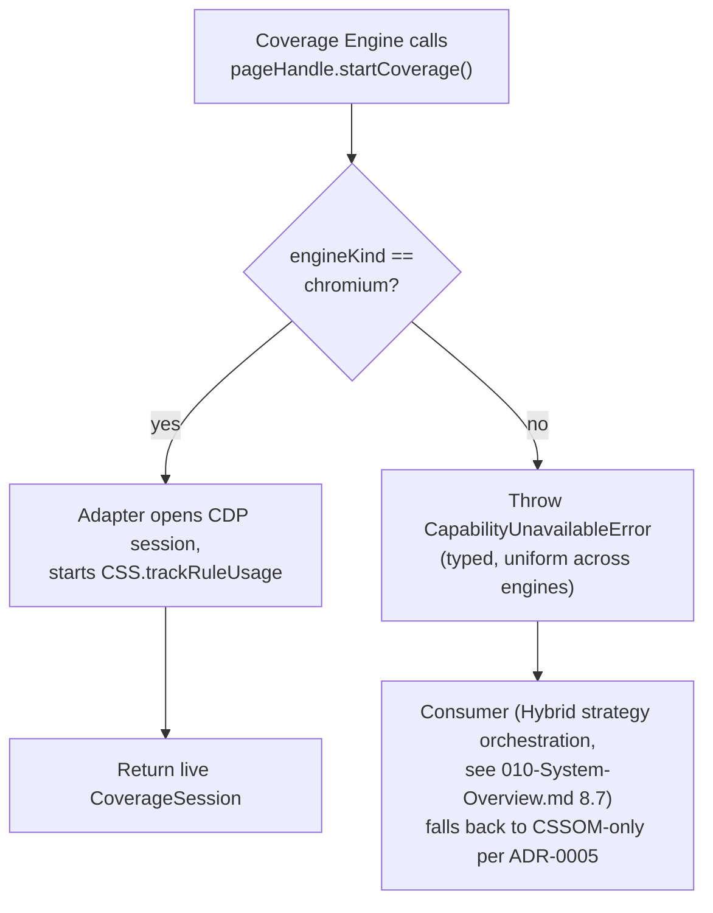
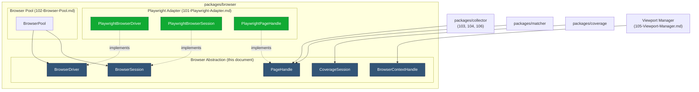
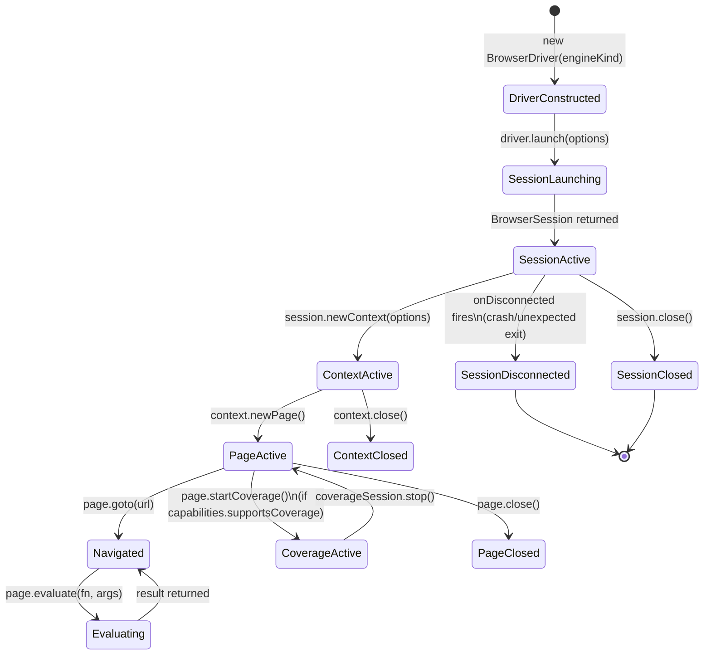
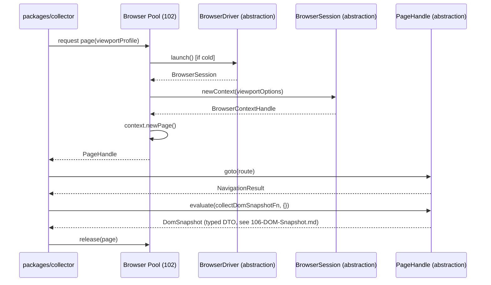

# 100 — Browser Abstraction

## 1. Title

**Critical CSS Extraction Engine — Browser Abstraction Layer (`packages/browser` Core Interface)**

## 2. Version

| Field | Value |
|---|---|
| Document Version | 1.0.0 |
| Status | Draft — Phase 3 (Browser Layer) |
| Last Updated | 2026-07-09 |
| Owners | Core Architecture Working Group |
| Stability | Stable interface contract; concrete adapter (Playwright) may evolve independently per [101-Playwright-Adapter.md](./101-Playwright-Adapter.md) |

## 3. Purpose

This document specifies the design of the browser-engine-agnostic abstraction interface that sits at the base of `packages/browser`, beneath every module that needs to observe or manipulate a live browser: the Browser Manager, the Navigation Engine, the DOM Collector, the Visibility Engine, the CSSOM Walker, the Selector Matcher, and the Coverage Engine (per [007-Repository-Structure.md](../architecture/007-Repository-Structure.md)'s package table and [010-System-Overview.md](../architecture/010-System-Overview.md)'s stage list). It exists to answer one question with precision: *what is the minimal, stable, vendor-neutral interface surface through which the rest of the engine asks a browser to do something*, such that the concrete browser automation library backing that surface — today, exclusively Playwright, per [ADR-0003-Playwright-As-Browser-Abstraction](../adr/ADR-0003-Playwright-As-Browser-Abstraction.md) — can be swapped, extended to additional engines, or partially replaced without every consuming module changing in lockstep.

This document is deliberately scoped to the *abstraction* — the interface, its types, its lifecycle contract, and the architectural reasoning for its existence — and not to the concrete Playwright implementation behind it, which is the subject of [101-Playwright-Adapter.md](./101-Playwright-Adapter.md). Readers should treat this document and 101 as a matched pair: this one specifies "what any adapter must provide," and 101 specifies "how the one adapter that exists today provides it." Every other Phase 3 document — [102-Browser-Pool.md](./102-Browser-Pool.md), [103-Navigation-Engine.md](./103-Navigation-Engine.md), [104-Rendering-Stabilization.md](./104-Rendering-Stabilization.md), [105-Viewport-Manager.md](./105-Viewport-Manager.md), and [106-DOM-Snapshot.md](./106-DOM-Snapshot.md) — is written against this document's interface names, not against Playwright's API surface directly, and implementers should treat any direct Playwright import outside `packages/browser`'s adapter boundary as a design defect.

## 4. Audience

- Implementers of `packages/browser`, who must build both this abstraction's type definitions and at least one conforming adapter.
- Implementers of `packages/collector`, `packages/matcher`, and `packages/coverage`, who consume this abstraction's `PageHandle`/`BrowserSession` types but must never depend on Playwright types directly, per [007-Repository-Structure.md](../architecture/007-Repository-Structure.md)'s dependency graph invariant that only `packages/browser` may import Playwright.
- Future contributors evaluating a second concrete adapter (e.g., a raw-CDP adapter, or a future WebDriver BiDi adapter, per [ADR-0003](../adr/ADR-0003-Playwright-As-Browser-Abstraction.md)'s Future Work) who need to know exactly what contract a new adapter must satisfy.
- Senior engineers and autonomous coding agents implementing Phase 3 modules end-to-end, who need the interface names and lifecycle guarantees fixed before writing `102`–`106`.

Readers are assumed to have read [ADR-0003-Playwright-As-Browser-Abstraction](../adr/ADR-0003-Playwright-As-Browser-Abstraction.md) in full and to be familiar with the Tier 1 / Tier 2 process boundary established in [015-Runtime-Model.md](../architecture/015-Runtime-Model.md). This document does not re-argue why a live browser is necessary — that is [ADR-0001-Browser-Is-Source-of-Truth](../adr/ADR-0001-Browser-Is-Source-of-Truth.md)'s and [006-Design-Principles.md](../architecture/006-Design-Principles.md) Principle 1's settled ground — it only specifies the seam through which that commitment is exercised in code.

## 5. Prerequisites

- [006-Design-Principles.md](../architecture/006-Design-Principles.md), especially Principle 1 (Browser Is Source of Truth) and Principle 3 (Correctness Over Premature Optimization), both of which bound what this abstraction is permitted to hide behind an interface and what it must expose faithfully.
- [007-Repository-Structure.md](../architecture/007-Repository-Structure.md) Section "Detailed Design — `packages/browser`," which establishes this package as the sole dependency-graph base for every browser-touching package.
- [010-System-Overview.md](../architecture/010-System-Overview.md) Section 8.2–8.7, which names the pipeline stages (Browser Manager, Navigation Engine, DOM Collector, Visibility Engine, CSSOM Walker, Selector Matcher) that consume this abstraction's types.
- [015-Runtime-Model.md](../architecture/015-Runtime-Model.md) Section 8.1, the Tier 1 / Tier 2 process boundary this abstraction's `evaluate`-style methods cross.
- [ADR-0003-Playwright-As-Browser-Abstraction](../adr/ADR-0003-Playwright-As-Browser-Abstraction.md), the decision record this document operationalizes into a concrete TypeScript-level interface.
- Familiarity with the general shape of browser automation libraries (Playwright, Puppeteer, WebDriver) sufficient to recognize which operations are common across all of them versus specific to one.

## 6. Related Documents

- [006-Design-Principles.md](../architecture/006-Design-Principles.md)
- [007-Repository-Structure.md](../architecture/007-Repository-Structure.md)
- [010-System-Overview.md](../architecture/010-System-Overview.md)
- [015-Runtime-Model.md](../architecture/015-Runtime-Model.md)
- [ADR-0001-Browser-Is-Source-of-Truth](../adr/ADR-0001-Browser-Is-Source-of-Truth.md)
- [ADR-0003-Playwright-As-Browser-Abstraction](../adr/ADR-0003-Playwright-As-Browser-Abstraction.md)
- [101-Playwright-Adapter.md](./101-Playwright-Adapter.md) — the concrete implementation of this document's interface
- [102-Browser-Pool.md](./102-Browser-Pool.md) — the pooling layer built on top of `BrowserDriver.launch()`
- [103-Navigation-Engine.md](./103-Navigation-Engine.md) — the primary consumer of `PageHandle.goto()`/navigation events
- [104-Rendering-Stabilization.md](./104-Rendering-Stabilization.md) — consumes `PageHandle.evaluate()` and event subscriptions for readiness detection
- [105-Viewport-Manager.md](./105-Viewport-Manager.md) — consumes `BrowserSession.newContext()`'s viewport/device-profile parameters
- [106-DOM-Snapshot.md](./106-DOM-Snapshot.md) — the heaviest consumer of `PageHandle.evaluate()`'s batched cross-boundary call pattern

## 7. Overview

`packages/browser` is architecturally the single load-bearing seam between "the rest of the engine" and "an actual browser engine," per [007-Repository-Structure.md](../architecture/007-Repository-Structure.md)'s dependency graph, in which every extraction-path package (`collector`, `matcher`, `coverage`) depends on `packages/browser` and nothing downstream depends on a browser automation library directly. This document's core claim is that *within* `packages/browser`, there is a further seam that matters just as much: between a **browser-engine-agnostic interface** (`BrowserDriver`, `BrowserSession`, `PageHandle`, `CoverageSession`) and the **concrete implementation of that interface** for a specific automation library. Today, and for the foreseeable future per [ADR-0003](../adr/ADR-0003-Playwright-As-Browser-Abstraction.md), there is exactly one implementation — the Playwright Adapter, specified in [101-Playwright-Adapter.md](./101-Playwright-Adapter.md) — but the interface is designed, named, and typed as if a second implementation could exist tomorrow, because the cost of designing it that way is small and the cost of *not* designing it that way, discovered only when a second implementation is actually needed, is large and diffuse across every consuming package.

This is not a hedge against "maybe we'll switch away from Playwright" in the sense of distrust in the choice recorded in [ADR-0003](../adr/ADR-0003-Playwright-As-Browser-Abstraction.md) — that ADR's reasoning is sound and is not revisited here. The abstraction exists for three concrete, present-tense reasons, elaborated in Detailed Design below: (1) Playwright itself already supports three engines (Chromium, Firefox, WebKit) behind one API, and the engine needs its own internal contract to express "I need a browser" without every call site re-deriving which of Playwright's three `BrowserType` objects to use and how; (2) Coverage-mode capability is engine-specific (Chromium-only, per [ADR-0003](../adr/ADR-0003-Playwright-As-Browser-Abstraction.md) Consequences), and that capability boundary needs to be expressed as a first-class, queryable fact of the abstraction rather than discovered ad hoc by consumers catching exceptions; and (3) [ADR-0003](../adr/ADR-0003-Playwright-As-Browser-Abstraction.md) Implementation Notes item 5 explicitly commits to "wrap Playwright API calls behind an internal `BrowserAdapter` interface" as a named, load-bearing design decision — this document is that interface's formal specification, and [101-Playwright-Adapter.md](./101-Playwright-Adapter.md) is that decision's fulfillment.

The abstraction's guiding design precedent is the pattern already established for CSS selector matching in [ADR-0002-No-Custom-Selector-Parser](../adr/ADR-0002-No-Custom-Selector-Parser.md) and for browser delegation generally in [ADR-0001-Browser-Is-Source-of-Truth](../adr/ADR-0001-Browser-Is-Source-of-Truth.md): *delegate the hard problem to the party best equipped to solve it correctly, but do not let that party's specific API vocabulary leak into the rest of the system's vocabulary*. ADR-0001 delegates rendering/layout/cascade to the browser engine itself, not to a Node-side reimplementation. ADR-0002 delegates selector matching to `Element.matches()`, not to a hand-rolled parser. This document delegates *browser process orchestration* to Playwright, not to a hand-rolled CDP client — but, critically, it does not delegate the *vocabulary* the rest of the engine uses to talk about browsers. The rest of the engine says "give me a page," "evaluate this function in the page," "start coverage tracking" — never "give me a Playwright `Page`," never "call `page.context().newCDPSession()`." The vocabulary is this document's `BrowserDriver`/`PageHandle`/`CoverageSession` interface; the delegation target behind that vocabulary is Playwright, per [101-Playwright-Adapter.md](./101-Playwright-Adapter.md).

## 8. Detailed Design

### 8.1 Why an Abstraction Exists Despite a Single Backing Implementation

It is worth stating the objection plainly before answering it, because it is the most likely design-review challenge this document will face: *if Playwright is the only implementation, and [ADR-0003](../adr/ADR-0003-Playwright-As-Browser-Abstraction.md) does not anticipate replacing it, why pay the abstraction tax at all? Why not have `packages/collector` import Playwright's `Page` type directly?*

**Reason 1 — Playwright itself is already multi-engine, and the engine's own configuration surface must express that without leaking Playwright's `BrowserType` vocabulary everywhere.** [ADR-0003](../adr/ADR-0003-Playwright-As-Browser-Abstraction.md)'s Decision Tree diagram (Section "Architecture") already shows extraction requests specifying `engine: chromium | firefox | webkit | unspecified`. If every consuming module imported Playwright's `chromium`/`firefox`/`webkit` singletons directly to resolve this, three problems follow: every module gains a compile-time dependency on Playwright's package, not just `packages/browser`'s adapter; every module must independently implement the "Coverage mode forces Chromium" decision rule from [ADR-0003](../adr/ADR-0003-Playwright-As-Browser-Abstraction.md)'s decision tree, risking drift; and testing every module requires either a real Playwright browser or a Playwright-shaped mock, rather than a small, purpose-built fake implementing this document's narrower interface. The abstraction collapses all three problems into one place.

**Reason 2 — Coverage capability is a *capability of the engine*, not an accident of the automation library, and the abstraction is where that capability gets modeled as data.** [ADR-0003](../adr/ADR-0003-Playwright-As-Browser-Abstraction.md) Edge Cases states plainly: "Firefox and WebKit lack CDP... the engine must detect the requested engine + mode combination at configuration-validation time and fail fast." This detection needs a place to live that is not "every consumer tries to call a Coverage API and catches whatever Playwright throws when it's unsupported." Section 8.4 below defines `BrowserSession.capabilities` as exactly this place — a structural, queryable fact, not an exception-handling convention.

**Reason 3 — The seam is explicitly pre-committed in [ADR-0003](../adr/ADR-0003-Playwright-As-Browser-Abstraction.md) Implementation Notes item 5** ("Wrap Playwright API calls behind an internal `BrowserAdapter` interface... this is a deliberate seam left open, even though this ADR commits to Playwright as the *only* implementation behind that seam for the foreseeable future"). This document is not proposing a new abstraction from scratch against an already-settled decision; it is fulfilling an explicit, named obligation that decision already created. Treating that obligation as optional because "only one implementation exists" would be a direct, un-reviewed reversal of an accepted ADR.

**Alternatives considered and rejected.**
- *Import Playwright types directly everywhere, revisit if a second engine is ever needed.* Rejected because the retrofit cost is not merely "add an interface later" — it is "audit every call site across `packages/collector`, `packages/matcher`, `packages/coverage`, and `apps/cli` for accidental dependence on Playwright-specific behavior (e.g., a specific error class, a specific default timeout value, a specific event name) that a second adapter would not replicate identically." That audit is far more expensive after the fact than designing the boundary up front, and it is exactly the kind of cost [006-Design-Principles.md](../architecture/006-Design-Principles.md) Principle 3 asks contributors to avoid deferring under time pressure.
- *A thin re-export module that simply renames Playwright's types without changing their shape.* Rejected because a re-export is not an abstraction — it still ties every consumer to Playwright's exact method signatures and error taxonomy, and provides none of Reason 1 or Reason 2's benefits; it would satisfy the *letter* of [ADR-0003](../adr/ADR-0003-Playwright-As-Browser-Abstraction.md) item 5 while defeating its purpose.
- *Full engine-agnostic reimplementation with no CDP escape hatch at all.* Rejected because [ADR-0003](../adr/ADR-0003-Playwright-As-Browser-Abstraction.md) explicitly relies on Playwright's CDP-session escape hatch for the Coverage Engine; an abstraction that refused to expose *any* engine-specific capability would be unable to support Coverage/Hybrid mode at all, contradicting [ADR-0005-Hybrid-Extraction-Mode](../adr/ADR-0005-Hybrid-Extraction-Mode.md). Section 8.5 below shows how the abstraction accommodates this without abandoning engine-neutrality for the 95% of operations that do not need it.

### 8.2 Core Interface Surface

The abstraction is expressed as four cooperating interfaces, each corresponding to a lifecycle stage already implied by [015-Runtime-Model.md](../architecture/015-Runtime-Model.md) Section 8.2's pool lifecycle state diagram and [ADR-0003](../adr/ADR-0003-Playwright-As-Browser-Abstraction.md)'s Algorithms section:

```
interface BrowserDriver {
  readonly engineKind: 'chromium' | 'firefox' | 'webkit'
  launch(options: LaunchOptions): Promise<BrowserSession>
  isAvailable(): Promise<boolean>   // pre-flight check: binary present, launchable
}

interface BrowserSession {
  readonly engineKind: 'chromium' | 'firefox' | 'webkit'
  readonly capabilities: EngineCapabilities
  newContext(options: ContextOptions): Promise<BrowserContextHandle>
  close(): Promise<void>
  isConnected(): boolean
  onDisconnected(listener: () => void): Disposable
}

interface BrowserContextHandle {
  newPage(): Promise<PageHandle>
  close(): Promise<void>
}

interface PageHandle {
  goto(url: string, options: NavigationOptions): Promise<NavigationResult>
  evaluate<TArgs, TResult>(fn: (args: TArgs) => TResult, args: TArgs): Promise<TResult>
  waitForEvent(event: PageEventName, options: WaitOptions): Promise<PageEvent>
  onConsoleMessage(listener: (msg: ConsoleMessage) => void): Disposable
  onCrash(listener: (info: CrashInfo) => void): Disposable
  startCoverage(): Promise<CoverageSession>   // throws CapabilityUnavailableError if unsupported
  close(): Promise<void>
}

interface CoverageSession {
  stop(): Promise<CoverageResult>
}
```

Each interface corresponds to exactly one rung of the lifecycle already diagrammed in [015-Runtime-Model.md](../architecture/015-Runtime-Model.md) Section 8.2 (`Cold → Launching → Warm → ContextAcquired → PageAcquired → Navigating → Stable → InUse → Releasing`): `BrowserDriver.launch()` takes the pool from `Cold`/`Launching` to `Warm`; `BrowserSession.newContext()` takes it to `ContextAcquired`; `BrowserContextHandle.newPage()` takes it to `PageAcquired`; `PageHandle.goto()` takes it to `Navigating`; and everything downstream (DOM Collector, Visibility Engine, CSSOM Walker, Selector Matcher per [010-System-Overview.md](../architecture/010-System-Overview.md) Sections 8.4–8.7) operates against the resulting `PageHandle` exclusively via `evaluate()`. This is a deliberate 1:1 mapping — the abstraction's shape is not invented independently of the runtime model already specified; it is the runtime model's lifecycle states reified as an interface's method signatures.

**Why `evaluate()` is the single, universal cross-boundary primitive rather than a family of typed convenience methods** (e.g., a hypothetical `getBoundingClientRect(selector)` method on `PageHandle`). [015-Runtime-Model.md](../architecture/015-Runtime-Model.md) Section 10.2's `batchedEvaluate` algorithm and Implementation Notes' recommendation that "every `page.evaluate()` call site... should be implemented against the shared `batchedEvaluate` utility" already establishes that the engine's performance model depends on *batching many logically distinct queries into one round trip*. A family of narrow typed convenience methods (one round trip per method call) would actively work against that batching discipline by encouraging call sites to issue one `evaluate`-equivalent per query. Keeping `evaluate()` as the sole, generic primitive — taking an arbitrary serializable function and argument payload — pushes every consumer toward composing its own batched query sets (as [106-DOM-Snapshot.md](./106-DOM-Snapshot.md) and the Selector Matcher do) rather than being tempted into a chatty, one-round-trip-per-fact pattern that a richer convenience API would passively encourage.

**Why `startCoverage()` lives on `PageHandle`, returning a distinct `CoverageSession`, rather than being a top-level `BrowserSession` method.** Coverage recording is inherently scoped to a single page's lifetime (a single navigation's worth of style-rule usage), not to a context or browser, per the CDP Coverage domain's own page-target scoping described in [015-Runtime-Model.md](../architecture/015-Runtime-Model.md) Section 12's edge case on CDP-session lifetime versus page/context reuse. Modeling `startCoverage()`/`CoverageSession.stop()` at the `PageHandle` level, rather than as a loose function taking a page as a parameter, makes this scoping structurally explicit: a `CoverageSession` object cannot outlive the `PageHandle` it was created from without the type system making that relationship visible to the caller.

### 8.3 Relationship to ADR-0003

[ADR-0003](../adr/ADR-0003-Playwright-As-Browser-Abstraction.md) records *which* automation library implements this abstraction and *why* Playwright specifically was chosen over Puppeteer, Selenium/WebDriver, and a raw CDP client. This document does not re-litigate that choice; it takes the ADR's Implementation Notes item 5 ("wrap Playwright API calls behind an internal `BrowserAdapter` interface") as a direct mandate and specifies exactly what that internal interface looks like. The naming deliberately diverges slightly from the ADR's own placeholder name (`BrowserAdapter`) to `BrowserDriver`/`PageHandle`/etc., reflecting that the ADR used an informal placeholder name to gesture at the *existence* of the seam, while this document is the seam's actual, binding specification — [101-Playwright-Adapter.md](./101-Playwright-Adapter.md) is the artifact the ADR's item 5 was actually asking for.

Three specific ADR-0003 commitments map directly onto this document's interface:

1. ADR-0003's Consequences ("Direct CDP session access when needed... `page.context().newCDPSession(page)`") maps onto `PageHandle.startCoverage()`, which — per [101-Playwright-Adapter.md](./101-Playwright-Adapter.md) — is implemented internally via exactly that Playwright call, but exposed to consumers as an engine-neutral method that simply throws a typed `CapabilityUnavailableError` on Firefox/WebKit rather than requiring every consumer to know that CDP sessions are a Playwright/Chromium-specific concept.
2. ADR-0003's Implementation Notes item 3 ("Sandbox args must be environment-aware") maps onto `LaunchOptions` in Section 8.2's interface, which carries an abstract `sandboxPolicy` field rather than a raw Playwright `args: string[]` array — [101-Playwright-Adapter.md](./101-Playwright-Adapter.md) is responsible for translating `sandboxPolicy` into the concrete `--no-sandbox`/`--disable-dev-shm-usage` flags Playwright's `launch()` expects.
3. ADR-0003's Decision Tree (engine selection per extraction mode) maps onto `BrowserSession.capabilities.supportsCoverage: boolean`, letting `apps/cli`'s configuration validation (per [010-System-Overview.md](../architecture/010-System-Overview.md) Section 8.1) implement ADR-0003's fail-fast rule generically, against the abstraction, rather than against a Playwright-specific capability check.

### 8.4 The `EngineCapabilities` Contract

```
interface EngineCapabilities {
  readonly supportsCoverage: boolean       // true only for chromium today
  readonly supportsCdpEscape: boolean      // true only for chromium today
  readonly engineKind: 'chromium' | 'firefox' | 'webkit'
}
```

This is the structural answer to Reason 2 in Section 8.1: rather than every consumer of a `PageHandle` needing to know, out of band, "Coverage only works on Chromium," the capability is attached to the `BrowserSession` the page descends from and is queryable before any coverage-related call is attempted. `apps/cli`'s Configuration Loader (per [010-System-Overview.md](../architecture/010-System-Overview.md) Section 8.1) consults `capabilities.supportsCoverage` at configuration-validation time — before any browser launch, before any route is processed — to implement [ADR-0003](../adr/ADR-0003-Playwright-As-Browser-Abstraction.md)'s Edge Cases requirement that an unsupported engine+mode combination "fail fast with an actionable error rather than silently degrading."

**Why capabilities are modeled as booleans on a static-per-engine-kind object, rather than as a runtime capability-negotiation protocol.** A more elaborate design was considered — asking the browser itself, at launch time, "what protocol domains do you support" and building the capability set dynamically from that response. This was rejected under [006-Design-Principles.md](../architecture/006-Design-Principles.md) Principle 3: it substitutes a discoverable-but-uncertain runtime probe for a fact that is already statically knowable (which engine kind was launched, and which engine kinds support CDP at all, per [ADR-0003](../adr/ADR-0003-Playwright-As-Browser-Abstraction.md)'s Consequences section, is fixed knowledge about the engines themselves, not something that varies release-to-release in a way that needs runtime discovery). A static, engine-kind-keyed capability table is simpler, testable without a real browser, and — per [006-Design-Principles.md](../architecture/006-Design-Principles.md) Principle 5 — deterministic, whereas a runtime probe introduces a new source of run-to-run variance for no corresponding benefit.

### 8.5 Accommodating an Engine-Specific Escape Hatch Without Breaking Neutrality

Section 8.1's Reason 3 objection has a sharper version: if the abstraction must expose a Chromium-only Coverage capability, is it really engine-neutral at all, or is it just Playwright's Chromium-first design wearing a thin disguise? The answer is that engine-neutrality does not mean "every method behaves identically on every engine" — CSS itself does not behave identically on every engine (per [006-Design-Principles.md](../architecture/006-Design-Principles.md)'s own acknowledgment of "Chromium vs. WebKit vs. Gecko rounding" quirks) and the abstraction's job is not to paper over real capability differences, only to make them explicit, typed, and centrally located rather than implicit, ad hoc, and smeared across call sites.

The concrete mechanism is that `startCoverage()` is present on every `PageHandle` regardless of engine — the *method exists* uniformly — but its runtime behavior on an incapable engine is a well-typed rejection (`CapabilityUnavailableError`), not a missing method, not a silent no-op, and not an engine-specific exception type a consumer would need engine-specific `catch` logic to recognize. This is the abstraction-layer analogue of [006-Design-Principles.md](../architecture/006-Design-Principles.md) Principle 6 (Fail-Fast Diagnostics): an unsupported operation must be a loud, attributable, uniformly-typed failure, not a silent degradation, regardless of which engine produced it.



### 8.6 What the Abstraction Deliberately Does Not Hide

Consistent with [006-Design-Principles.md](../architecture/006-Design-Principles.md) Principle 1's forbidding of "a parallel implementation of layout, paint, cascade resolution, or geometry computation that operates independently of the browser," this abstraction hides *automation-library vocabulary* (Playwright's specific class names, method names, and option-object shapes), not *browser semantics*. It explicitly does not:

- Provide a synthetic DOM or CSSOM representation in the host process — every fact about the page still round-trips through `evaluate()` into a real browser; the abstraction changes *how the call is spelled*, never *where the computation happens*.
- Normalize away real behavioral differences between engines (e.g., subpixel geometry rounding, `:has()` support) — those differences are real and must surface as real diagnostics per [006-Design-Principles.md](../architecture/006-Design-Principles.md)'s Edge Cases, not be silently smoothed over by the abstraction layer pretending all engines behave identically.
- Attempt to abstract over Coverage-mode's fundamental Chromium-only nature (Section 8.5) — it exposes that constraint as typed data, but does not pretend the constraint does not exist.

## 9. Architecture

### 9.1 Position in the Package and Pipeline Graph



This diagram restates, at implementation-interface granularity, the same invariant [007-Repository-Structure.md](../architecture/007-Repository-Structure.md) establishes at the package granularity: `packages/collector`, `packages/matcher`, and `packages/coverage` depend on the interfaces in the `Abstraction` subgraph, never on the `Adapter` subgraph directly. Only `packages/browser`'s own internal wiring (the Browser Pool, specified in [102-Browser-Pool.md](./102-Browser-Pool.md)) is permitted to import the concrete Playwright adapter and hand out interface-typed handles to everything else.

### 9.2 Lifecycle State Diagram (Abstraction-Level View)



This is the abstraction-level restatement of [015-Runtime-Model.md](../architecture/015-Runtime-Model.md) Section 8.2's pool lifecycle, narrowed to exactly the states this document's four interfaces expose; [102-Browser-Pool.md](./102-Browser-Pool.md) layers pooling, reuse, and recycling policy on top of this same state machine without changing its shape.

### 9.3 Sequence — A Consumer's View of One Extraction



Note that `Collector` never touches `Driver` or `Session` directly — it receives a ready `PageHandle` from the Pool, consistent with [015-Runtime-Model.md](../architecture/015-Runtime-Model.md) Implementation Notes' observation that `PageHandle` is "the one object that legitimately threads through most browser-layer stages."

## 10. Algorithms

### 10.1 Algorithm: Capability-Gated Dispatch

**Problem statement.** Given a requested operation that may not be supported by every engine kind (currently: Coverage), determine whether to proceed, and if not, fail with an attributable, typed error before any wasted work (browser launch, navigation) occurs, per [006-Design-Principles.md](../architecture/006-Design-Principles.md) Principle 6.

**Inputs.** `requestedMode: 'cssom' | 'coverage' | 'hybrid'`, `requestedEngine: EngineKind | 'unspecified'`, `capabilityTable: Record<EngineKind, EngineCapabilities>`.

**Outputs.** Either a resolved `EngineKind` to launch, or a `ConfigurationError` naming the specific incompatibility.

**Pseudocode.**
```
function resolveEngineForMode(requestedMode, requestedEngine, capabilityTable):
    needsCoverage = requestedMode in ('coverage', 'hybrid')

    if requestedEngine == 'unspecified':
        if needsCoverage:
            return 'chromium'   # only engine with supportsCoverage == true today
        else:
            return 'chromium'   # default engine choice, per ADR-0003 decision tree

    caps = capabilityTable[requestedEngine]
    if needsCoverage and not caps.supportsCoverage:
        throw ConfigurationError(
            `mode '${requestedMode}' requires Coverage support, ` +
            `but engine '${requestedEngine}' does not provide it`
        )
    return requestedEngine
```

**Time complexity.** O(1) — a single table lookup and a handful of comparisons; this runs once per work unit at configuration-resolution time, not per browser operation.

**Memory complexity.** O(1) beyond the fixed-size, engine-count-keyed `capabilityTable`.

**Failure cases.** The single failure case is the incompatibility described above; per [006-Design-Principles.md](../architecture/006-Design-Principles.md) Principle 6, this must surface as a `ConfigurationError` raised during Configuration Loading (per [010-System-Overview.md](../architecture/010-System-Overview.md) Stage 1), not as a runtime exception thrown deep inside the Coverage Engine after a browser has already been launched and a route already navigated — catching the mismatch this early is exactly what Section 8.4's static `EngineCapabilities` table enables.

**Optimization opportunities.** None meaningful at this scale (a handful of engines, a handful of modes); the value of this algorithm is correctness and fail-fast placement, not throughput.

### 10.2 Algorithm: Interface Conformance Verification (Adapter Contract Test)

**Problem statement.** Given a candidate `BrowserDriver` implementation (today, only the Playwright adapter; potentially, in the future, an additional adapter per [ADR-0003](../adr/ADR-0003-Playwright-As-Browser-Abstraction.md) Future Work), verify mechanically that it satisfies every behavioral guarantee this document's interface implies — not merely that it type-checks against the TypeScript interface shapes in Section 8.2, since a structurally-conforming implementation could still violate a behavioral contract (e.g., returning a `PageHandle` whose `evaluate()` silently swallows in-page exceptions instead of propagating them).

**Inputs.** A candidate adapter's `BrowserDriver` implementation; a shared, adapter-agnostic conformance test suite (a "golden behavior" suite, distinct from and complementary to the fixture-based golden-CSS-output suite described in [006-Design-Principles.md](../architecture/006-Design-Principles.md) Testing section).

**Outputs.** Pass/fail per conformance test case, with named failures identifying which behavioral guarantee (e.g., "crash isolation," "capability reporting accuracy," "evaluate() error propagation") was violated.

**Pseudocode.**
```
function runAdapterConformanceSuite(driverFactory: () => BrowserDriver): ConformanceReport
    results = []
    for testCase in CONFORMANCE_CASES:
        driver = driverFactory()
        try:
            testCase.run(driver)
            results.push(Pass(testCase.name))
        catch (e):
            results.push(Fail(testCase.name, e))
        finally:
            driver.dispose()
    return ConformanceReport(results)

CONFORMANCE_CASES = [
    "launch() resolves to a BrowserSession with correct engineKind",
    "capabilities.supportsCoverage matches known-true-only-for-chromium fact",
    "evaluate() propagates in-page thrown errors as typed EvaluationError",
    "onCrash() fires exactly once per renderer crash, not per page",
    "close() is idempotent (second call does not throw)",
    "startCoverage() throws CapabilityUnavailableError on non-chromium engineKind",
    ... // full enumeration lives in the adapter conformance suite itself
]
```

**Time complexity.** O(k) where k is the number of conformance cases (fixed, small); each case's own cost is dominated by real browser launch/navigation latency where applicable, not by the harness logic.

**Memory complexity.** O(1) beyond whatever the individual test case under execution needs (typically one browser session at a time, torn down between cases).

**Failure cases.** A conformance failure on the *only* existing adapter (Playwright) is itself a valuable signal — it indicates the abstraction's documented contract and the adapter's actual behavior have drifted, which is exactly the "documentation-code drift" failure mode [007-Repository-Structure.md](../architecture/007-Repository-Structure.md) Edge Cases warns about at the package level, recurring here at the interface-behavior level.

**Optimization opportunities.** This suite is not currently a throughput concern (per the fixed, small case count); its main opportunity is *coverage* growth — enumerating more behavioral edge cases (timeout semantics, partial-navigation-failure semantics) as they are discovered in production, not runtime optimization.

## 11. Implementation Notes

- The abstraction's types (`BrowserDriver`, `BrowserSession`, `BrowserContextHandle`, `PageHandle`, `CoverageSession`, `EngineCapabilities`, and their associated option/result DTOs) should live in `packages/browser`'s public `src/index.ts` barrel export, per [007-Repository-Structure.md](../architecture/007-Repository-Structure.md) Implementation Notes' "single sanctioned entry point" rule — internal adapter implementation modules (e.g., a `src/adapters/playwright/` subtree, per [101-Playwright-Adapter.md](./101-Playwright-Adapter.md)) must not be imported by path from `packages/collector`/`packages/matcher`/`packages/coverage`.
- Error types thrown across this interface (`CapabilityUnavailableError`, `EvaluationError`, `NavigationTimeoutError`, `ConfigurationError`) should be defined in `packages/shared` per [006-Design-Principles.md](../architecture/006-Design-Principles.md) Implementation Notes' guidance that diagnostics DTOs live once, centrally, so that the Reporter (per [010-System-Overview.md](../architecture/010-System-Overview.md) Section 8.14) can render them uniformly regardless of which stage or adapter raised them.
- `evaluate()`'s function argument must be serializable in the sense Playwright (or any future adapter) requires — a plain function with no closures over non-serializable state; this constraint should be documented directly on the interface's TSDoc, since it is easy for a contributor unfamiliar with the Tier 1/Tier 2 boundary (per [015-Runtime-Model.md](../architecture/015-Runtime-Model.md) Section 8.1) to accidentally write an `evaluate()` callback that closes over a Node-side object, which will fail at the adapter level with a confusing serialization error rather than a clear interface-level one — a defensive runtime check (inspecting the function's captured scope where feasible) is a candidate future hardening, tracked in Future Work.
- `BrowserSession.onDisconnected()` and `PageHandle.onCrash()` must both be implemented as `Disposable`-returning subscriptions (an explicit unsubscribe handle), not bare event-emitter `.on()` calls with no unsubscribe path, to avoid listener leaks across the high-churn page-acquire/release cycles described in [015-Runtime-Model.md](../architecture/015-Runtime-Model.md) Section 8.2.
- Consumers must treat every method on this interface as potentially throwing a timeout-shaped error (per [003-Requirements.md](../architecture/003-Requirements.md) REQ-554's engine-wide timeout-protection requirement) even where a specific method's signature does not enumerate it explicitly — the abstraction's option objects (`LaunchOptions`, `NavigationOptions`, `WaitOptions`) each carry a `timeoutMs` field precisely so this is a uniform, explicit contract rather than an implicit assumption.

## 12. Edge Cases

- **A future second adapter reports different default timeouts than Playwright's.** Because `LaunchOptions`/`NavigationOptions` require explicit `timeoutMs` values rather than relying on adapter-specific defaults, this class of drift is structurally prevented — the abstraction's option types must never have optional timeout fields with adapter-dependent implicit defaults, precisely to avoid this.
- **An adapter's `evaluate()` implementation cannot fully guarantee serialization-boundary parity with another adapter's** (e.g., how `undefined` versus `null` round-trips, or how a thrown `DOMException` subclass serializes back to Tier 1). This is flagged explicitly as an inherent limitation of *any* cross-process JS bridge, not specific to Playwright; the conformance suite (Section 10.2) is the primary defense, and the interface's TSDoc must document the exact serialization contract (JSON-structured-clone-compatible values only) rather than leaving it to adapter-specific behavior to define implicitly.
- **Coverage capability could, in principle, become available on Firefox/WebKit in a future browser/protocol version** (per [ADR-0003](../adr/ADR-0003-Playwright-As-Browser-Abstraction.md) Future Work's WebDriver BiDi monitoring item). Because `EngineCapabilities` is queried from the adapter at session-launch time rather than hardcoded into consumer logic, this change would only require updating the Playwright adapter's capability-reporting logic (per [101-Playwright-Adapter.md](./101-Playwright-Adapter.md)), not any consumer of this abstraction.
- **A `PageHandle` outliving its parent `BrowserContextHandle`'s `close()` call** (a use-after-close bug). The abstraction must specify that any method call on a `PageHandle` after its owning context has closed throws a specific `HandleClosedError` rather than a generic, adapter-specific null-reference-style error, so that this class of lifecycle bug is diagnosable uniformly regardless of which adapter is in use.
- **Shadow DOM and closed shadow roots** (per [006-Design-Principles.md](../architecture/006-Design-Principles.md) Edge Cases and [010-System-Overview.md](../architecture/010-System-Overview.md) Section 12) are not a concern of this abstraction layer directly — `evaluate()`'s function payload is responsible for shadow-DOM-aware traversal logic, per [106-DOM-Snapshot.md](./106-DOM-Snapshot.md); this abstraction only guarantees that whatever function is handed to `evaluate()` executes with full in-page access, including to shadow roots the page's own script could reach.
- **Constructable Stylesheets and `adoptedStyleSheets`** (per [006-Design-Principles.md](../architecture/006-Design-Principles.md) Edge Cases) are, similarly, not directly modeled by this abstraction — they are queried via `evaluate()` payloads implemented in [106-DOM-Snapshot.md](./106-DOM-Snapshot.md) and the CSSOM Walker's own logic, not by a dedicated abstraction method, since they are DOM/CSSOM-level facts, not browser-process-lifecycle facts.
- **Cross-origin stylesheet access restrictions** surface as in-page `SecurityError` thrown by `document.styleSheets[i].cssRules`, which propagates through `evaluate()` as a per-query failure (per [015-Runtime-Model.md](../architecture/015-Runtime-Model.md) Section 10.2's per-query error isolation within a batch) — the abstraction's `evaluate()` contract must guarantee that an in-page exception in *part* of a batched query does not silently corrupt or discard results for the rest of the batch.

## 13. Tradeoffs

| Decision | Alternative Considered | Why Rejected | Cost Accepted |
|---|---|---|---|
| A dedicated `BrowserDriver`/`PageHandle` abstraction over Playwright, even with one backing implementation | Import Playwright types directly across all consuming packages | Retrofit cost after a second engine/adapter is needed is far higher than up-front interface design; violates [ADR-0003](../adr/ADR-0003-Playwright-As-Browser-Abstraction.md) Implementation Notes item 5's explicit commitment | One extra layer of indirection and a small set of DTOs to maintain in parallel with Playwright's own types |
| `evaluate()` as the sole generic cross-boundary primitive | A family of narrow, typed convenience methods (`getRect()`, `matches()`, etc.) | Convenience methods would erode the batching discipline [015-Runtime-Model.md](../architecture/015-Runtime-Model.md) Section 10.2 depends on for performance | Consumers must compose their own batched query payloads rather than calling ready-made methods; more upfront work per consumer module |
| Coverage capability modeled as static, engine-kind-keyed data (`EngineCapabilities`) | Runtime capability negotiation/probing at session launch | Violates [006-Design-Principles.md](../architecture/006-Design-Principles.md) Principle 5 (determinism) for no benefit, since the underlying fact is already statically known | Capability table must be manually updated if a future browser version changes support (mitigated: this is rare and reviewable) |
| Uniform `startCoverage()` method present on every `PageHandle`, throwing on incapable engines | Only expose `startCoverage()` conditionally (e.g., via a capability-gated sub-interface, `PageHandle & CoverageCapable`) | A conditional-interface design pushes type-narrowing complexity onto every consumer and every adapter; a uniform method with a typed throw is simpler to implement and simpler to test against | Consumers must handle a possible `CapabilityUnavailableError` at every `startCoverage()` call site rather than relying on the type system to rule it out entirely at compile time |
| Interface conformance verified by a dedicated behavioral test suite (Section 10.2), not just TypeScript structural typing | Rely solely on TypeScript's structural type-checking to "verify" adapter conformance | TypeScript structural typing cannot express behavioral guarantees (crash isolation, error propagation semantics); a structurally-valid but behaviorally-wrong adapter would pass type-checking and still be broken | Additional test-suite authoring and maintenance burden, justified by this being the only mechanism that actually protects the abstraction's guarantees |

## 14. Performance

- **CPU complexity.** The abstraction layer itself adds negligible CPU overhead — it is a thin method-dispatch indirection over the adapter's real implementation; per [ADR-0003](../adr/ADR-0003-Playwright-As-Browser-Abstraction.md) Performance section, "Playwright's orchestration overhead... is comparatively negligible" relative to actual browser engine costs, and this document's abstraction sits one layer above even that, adding at most a few extra function-call frames per operation.
- **Memory complexity.** O(1) additional memory per `PageHandle`/`BrowserSession` object beyond whatever the underlying adapter object already retains (a thin wrapper struct holding a reference to the adapter's native handle plus this abstraction's own bookkeeping, such as registered `Disposable` listeners).
- **Caching strategy.** Not directly applicable at this layer — caching (fingerprint-gated extraction reuse) happens above `packages/browser` entirely, per [006-Design-Principles.md](../architecture/006-Design-Principles.md) Principle 8 and [010-System-Overview.md](../architecture/010-System-Overview.md) Section 8.12; a cache hit means this abstraction's methods are never invoked at all for that work unit.
- **Parallelization opportunities.** The abstraction is designed to be safely usable from multiple concurrent call sites operating on independent `PageHandle`s (per [015-Runtime-Model.md](../architecture/015-Runtime-Model.md) Section 8.3's Axis 2 route-batching model); it does not itself introduce any additional serialization/locking beyond what the underlying adapter's own concurrency model requires, which [101-Playwright-Adapter.md](./101-Playwright-Adapter.md) specifies concretely for Playwright.
- **Incremental execution.** Not applicable directly; this layer is invoked identically on every cache miss regardless of incremental-execution status elsewhere in the system.
- **Profiling guidance.** Because this layer is a thin pass-through, profiling time spent "inside the abstraction" versus "inside the adapter" is rarely a meaningful distinction; per [015-Runtime-Model.md](../architecture/015-Runtime-Model.md) Section 14's profiling guidance, attribute slow `evaluate()` calls to Tier 2 (browser-side) cost, not to this interface's dispatch overhead, unless a profiler specifically isolates time spent in this package's own wrapper code (which should be near-zero in any healthy implementation).
- **Scalability limits.** None imposed by this layer specifically; scalability limits are inherited entirely from the adapter and the pool built on top of it (per [102-Browser-Pool.md](./102-Browser-Pool.md)) and from host CPU/memory, per [015-Runtime-Model.md](../architecture/015-Runtime-Model.md) Section 14.

## 15. Testing

- **Unit tests.** The interface types themselves are not directly unit-testable (they are contracts, not implementations), but a hand-written `FakeBrowserDriver`/`FakePageHandle` pair implementing this interface purely in-memory (no real browser) should exist in `packages/browser`'s test utilities, enabling every consumer package (`collector`, `matcher`, `coverage`) to unit-test its own logic against this abstraction without launching a real browser — this fake is a first-class deliverable of this document's design, not an afterthought.
- **Integration tests.** The conformance suite specified in Section 10.2 is run against the real Playwright adapter (per [101-Playwright-Adapter.md](./101-Playwright-Adapter.md)) in CI, using real browser launches across all three engine kinds, verifying the abstraction's documented guarantees hold against the concrete implementation.
- **Visual tests.** Not directly applicable to this document; visual regression is validated at the pipeline-output level, far above this layer, per [006-Design-Principles.md](../architecture/006-Design-Principles.md) Testing section.
- **Stress tests.** Repeated rapid launch/close cycles against the `FakeBrowserDriver` validate that this layer's own bookkeeping (listener registration/disposal, handle lifecycle tracking) does not leak memory independent of whatever the real adapter does — isolating whether a leak is in this abstraction's own wrapper logic versus the underlying adapter.
- **Regression tests.** Any behavioral guarantee added to the conformance suite (Section 10.2) after a production incident (e.g., a discovered case where `evaluate()` silently swallowed an in-page error) becomes a permanent conformance test case, preventing the same defect from recurring in either the current adapter or any future one.
- **Benchmark tests.** Dispatch-overhead benchmarks (calling a no-op `evaluate()` through the abstraction versus calling Playwright's `page.evaluate()` directly) should be tracked to confirm the "negligible overhead" performance claim in Section 14 remains true as the abstraction's implementation evolves, per [007-Repository-Structure.md](../architecture/007-Repository-Structure.md) Testing section's benchmark-tracking philosophy.

## 16. Future Work

- **A second concrete adapter as a conformance-suite stress test.** Even without a production need to switch away from Playwright, building a minimal second adapter (e.g., a raw-CDP-based adapter covering only the Chromium subset of the interface) purely as an internal exercise would validate that this abstraction's boundaries are drawn correctly — [ADR-0003](../adr/ADR-0003-Playwright-As-Browser-Abstraction.md) Future Work's "lightweight Playwright adapter conformance test suite... pointed at an alternative future automation layer" is exactly this idea, and this document's Section 10.2 conformance suite is the concrete mechanism that would make such an exercise meaningful rather than speculative.
- **WebDriver BiDi monitoring.** Per [ADR-0003](../adr/ADR-0003-Playwright-As-Browser-Abstraction.md) Future Work, if WebDriver BiDi gains a cross-engine Coverage-equivalent, `EngineCapabilities.supportsCoverage` could become `true` for Firefox/WebKit without any interface change — only an adapter-level capability-reporting update — validating that this document drew the capability boundary at the right level of abstraction.
- **Capability negotiation beyond Coverage.** As new engine-specific features are considered (e.g., CPU/network throttling for device-profile emulation, referenced in [ADR-0003](../adr/ADR-0003-Playwright-As-Browser-Abstraction.md) Future Work), `EngineCapabilities` should grow additional typed fields following the same pattern established for `supportsCoverage`, rather than each new capability inventing its own ad hoc detection mechanism.
- **Structural serialization-contract enforcement.** A future static-analysis lint (mirroring [006-Design-Principles.md](../architecture/006-Design-Principles.md) Implementation Notes' proposed "principle linter") could flag `evaluate()` call sites whose callback closes over non-serializable values at build time, rather than relying on the runtime error described in Section 11's Implementation Notes.
- **Open question: should `PageHandle.evaluate()` support a batched-array overload natively** (accepting an array of independent query descriptors and returning an array of results, formalizing [015-Runtime-Model.md](../architecture/015-Runtime-Model.md) Section 10.2's `batchedEvaluate` pattern as part of the abstraction's own contract rather than a convention layered on top by each consumer)? Current design leaves batching as consumer-side discipline; promoting it into the interface itself would make the performance-critical pattern harder to accidentally skip, at the cost of a more complex core interface. To be resolved via a follow-up RFC once [106-DOM-Snapshot.md](./106-DOM-Snapshot.md) and the Selector Matcher's actual batching call sites are implemented and their patterns can be compared.

## 17. References

- [006-Design-Principles.md](../architecture/006-Design-Principles.md)
- [007-Repository-Structure.md](../architecture/007-Repository-Structure.md)
- [010-System-Overview.md](../architecture/010-System-Overview.md)
- [015-Runtime-Model.md](../architecture/015-Runtime-Model.md)
- [ADR-0001-Browser-Is-Source-of-Truth](../adr/ADR-0001-Browser-Is-Source-of-Truth.md)
- [ADR-0002-No-Custom-Selector-Parser](../adr/ADR-0002-No-Custom-Selector-Parser.md)
- [ADR-0003-Playwright-As-Browser-Abstraction](../adr/ADR-0003-Playwright-As-Browser-Abstraction.md)
- [ADR-0005-Hybrid-Extraction-Mode](../adr/ADR-0005-Hybrid-Extraction-Mode.md)
- [101-Playwright-Adapter.md](./101-Playwright-Adapter.md)
- [102-Browser-Pool.md](./102-Browser-Pool.md)
- [103-Navigation-Engine.md](./103-Navigation-Engine.md)
- [104-Rendering-Stabilization.md](./104-Rendering-Stabilization.md)
- [105-Viewport-Manager.md](./105-Viewport-Manager.md)
- [106-DOM-Snapshot.md](./106-DOM-Snapshot.md)
- Playwright documentation, Browser/BrowserContext/Page/CDPSession API reference — https://playwright.dev/docs/api/class-browser
- Chrome DevTools Protocol documentation, CSS/Profiler.Coverage domains — https://chromedevtools.github.io/devtools-protocol/
- W3C WebDriver and WebDriver BiDi specifications — referenced in [ADR-0003](../adr/ADR-0003-Playwright-As-Browser-Abstraction.md) Future Work as a candidate future abstraction target
- Section 2.4 ("System Modules") of the Documentation Agent Brief — `BRIEF.md` at repository root, "Browser Manager: Playwright browser pool lifecycle"
