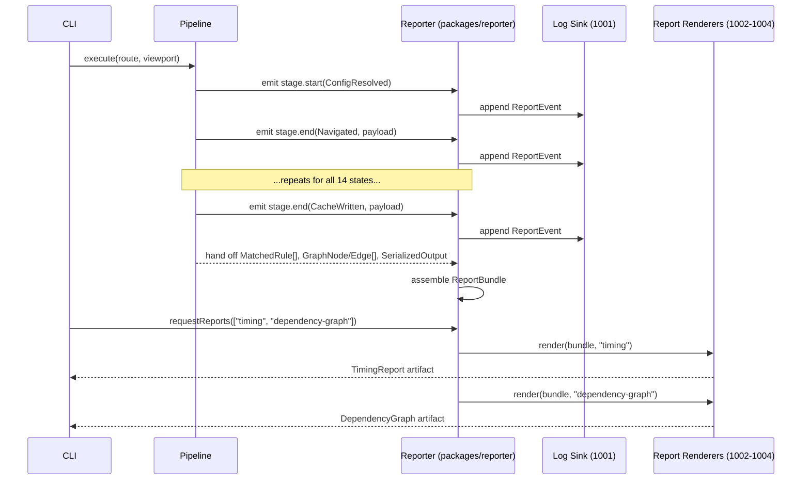
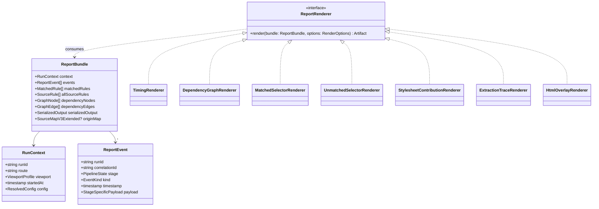

# 1000 — Diagnostics Overview

## 1. Title

**Critical CSS Extraction Engine — Reporter Module: Diagnostics and Reporting System Design**

## 2. Version

| Field | Value |
|---|---|
| Document Version | 1.0.0 |
| Status | Draft — Phase 13 (Diagnostics) |
| Last Updated | 2026-07-10 |
| Owners | Core Architecture Working Group |
| Stability | The report taxonomy and cross-pipeline data-collection contract are stable; individual report renderers (JSON schema, HTML layout, terminal formatting) are expected to evolve independently under this contract |

## 3. Purpose

Every other document in this repository specifies how the engine produces a correct critical stylesheet. None of them specify how an engineer, staring at a critical CSS output that is wrong — too big, missing a rule, or simply mysterious — finds out *why*. `BRIEF.md` Section 2.4 names a `Reporter` module in the system module table with the one-line responsibility "Dependency graph, matched/unmatched selectors, timing," and Section 2.12 enumerates seven concrete diagnostic artifacts the engine must be able to produce. Until this document, no design file has specified what the Reporter module actually *is* as a subsystem: its inputs, its internal architecture, how it is populated during a run without becoming a performance tax on the common case, and how its outputs relate to each other.

This document is that specification, at the level this repository calls an "Overview": it defines the full scope of the Reporter module, enumerates every report type `BRIEF.md` Section 2.12 requires, describes the shared data-collection substrate every report type draws from, and then explicitly delegates each report type's internal design to a sibling document (1001 through 1005) rather than attempting to specify all of them here. A single 3,000–5,000-word file cannot give the matched/unmatched selector report, the stylesheet-contribution report, the timing report, the extraction trace, and an HTML visualizer each the depth their algorithms deserve — so, following the precedent set by [500-Dependency-Resolution-Overview.md](../design/500-Dependency-Resolution-Overview.md) for the Dependency Resolver and [600-Serialization-Overview.md](../design/600-Serialization-Overview.md) for the Serializer, this document is the connective tissue: it tells you what the Reporter module *is*, and where to go for how each piece of it *works*.

A second purpose, made necessary by the existence of [605-Source-Maps.md](../design/605-Source-Maps.md), is disambiguation. That document specifies **origin-mapping**: a per-rule provenance record (source stylesheet, rule index, inclusion cause) threaded through the Serializer and emitted, opt-in, as a sidecar source-map artifact. It is easy to conflate "the thing that explains where a rule came from" with "the Reporter module" as a whole, because origin-mapping is one of the most detailed provenance mechanisms in the entire design and because 605 explicitly names the Reporter as its primary consumer. That conflation would be wrong, and this document exists partly to correct it: origin-mapping is a **Reporter input** — one of several data feeds the Reporter consumes to build its reports — not the Reporter itself. The Reporter also consumes data that has nothing to do with per-rule origin (aggregate timing numbers, selector match/no-match tallies, cache hit/miss counts, plugin hook durations) and origin-mapping data that has nothing to do with the Reporter (the sidecar source map is a standalone artifact useful to browser devtools and editor plugins with no Reporter involved at all). Section 7.1 works through this boundary in detail.

## 4. Audience

- Implementers of `packages/reporter`, the workspace package this document and its Phase 13 siblings collectively specify.
- Authors of [1001-Logging.md](../design/1001-Logging.md), [1002-Metrics.md](../design/1002-Metrics.md), [1003-Tracing.md](../design/1003-Tracing.md), [1004-Visualization.md](../design/1004-Visualization.md), and [1005-Debug-UI.md](../design/1005-Debug-UI.md), who must treat this document's report taxonomy and data-collection contract (Sections 8 and 9) as the stable interface their own documents implement against.
- Implementers of every upstream pipeline stage (Navigation Engine, DOM Collector, Visibility Engine, CSSOM Walker, Selector Matcher, Dependency Resolver, Cascade Resolver, Serializer, Cache Manager), each of which must emit the instrumentation events this document's data-collection contract requires of it.
- Implementers of `apps/visualizer` and any CI-integration tooling (per `BRIEF.md` Section 2.11) that consumes Reporter JSON output to render dashboards or gate a build.
- Senior engineers auditing the engine against `BRIEF.md` Section 2.4's Reporter row and Section 2.12's Diagnostics list, and against `docs/architecture/006-Design-Principles.md` Principle 6 (Fail-Fast Diagnostics).

Readers are assumed to have read `docs/architecture/011-Execution-Pipeline.md` (the pipeline state machine this document instruments) and `docs/architecture/014-Dependency-Graph.md` (the graph vocabulary several report types visualize). Readers are not assumed to have read 605-Source-Maps.md first, though doing so clarifies Section 7.1's boundary discussion.

## 5. Prerequisites

- `BRIEF.md` Section 2.4 (Reporter module row) and Section 2.12 (Diagnostics) — the two requirement passages this entire phase exists to satisfy.
- `docs/architecture/011-Execution-Pipeline.md` — the fourteen-state pipeline (`ConfigResolved` through `CacheWritten`) whose transitions are the Reporter's primary event source.
- `docs/architecture/014-Dependency-Graph.md` — the node/edge data model the dependency-graph report visualizes verbatim.
- `docs/architecture/016-Data-Flow.md` — DTO shapes (`MatchedRule`, `GraphNode`, `GraphEdge`, `SerializedOutput`) that the Reporter reads rather than redefines.
- [605-Source-Maps.md](../design/605-Source-Maps.md) — the origin-mapping subsystem this document positions as one Reporter input among several (Section 7.1).
- [604-Output-Validation.md](../design/604-Output-Validation.md) — the validation gate whose findings are themselves a Reporter input (a validation report is a specialization of the reports this document catalogs).
- `docs/architecture/006-Design-Principles.md` Principle 6 (Fail-Fast Diagnostics) and Principle 5 (Determinism of Output) — the two principles the Reporter exists to make actionable.

## 6. Related Documents

- [1001-Logging.md](../design/1001-Logging.md) — structured, level-based, per-stage event log; the append-only, human-and-machine-readable narrative of a single run.
- [1002-Metrics.md](../design/1002-Metrics.md) — aggregate numeric telemetry (timing, counts, sizes) across runs; the quantitative side of the timing report and stylesheet-contribution report named in Section 2.12.
- [1003-Tracing.md](../design/1003-Tracing.md) — the extraction trace named in Section 2.12: a structured, replayable record of every decision the pipeline made for a single element/rule/dependency, at a granularity finer than logging.
- [1004-Visualization.md](../design/1004-Visualization.md) — the dependency-graph visualization and the optional HTML above-fold/matched-rule overlay named in Section 2.12.
- [1005-Debug-UI.md](../design/1005-Debug-UI.md) — the interactive `apps/visualizer` surface that composes logging, metrics, tracing, and visualization data into a browsable debugging session.
- [605-Source-Maps.md](../design/605-Source-Maps.md) — per-rule origin/provenance data, a Reporter input, distinct from the Reporter itself.
- [604-Output-Validation.md](../design/604-Output-Validation.md) — the validation gate, whose pass/fail findings are surfaced through the Reporter's reporting channel rather than a separate one.
- [600-Serialization-Overview.md](../design/600-Serialization-Overview.md) — the serialization pipeline the stylesheet-contribution report instruments.
- `docs/architecture/011-Execution-Pipeline.md`, `docs/architecture/014-Dependency-Graph.md`, `docs/architecture/016-Data-Flow.md`.

## 7. Overview

### 7.1 Reporter vs. Origin-Mapping: Drawing the Boundary

[605-Source-Maps.md](../design/605-Source-Maps.md) Section 7 already establishes that origin-mapping is "diagnostics, not production delivery" and that its consumer is "the Reporter (Phase 13)." Read in isolation, that could suggest the Reporter is *built on top of* origin-mapping, or worse, that origin-mapping subsumes what the Reporter does. Neither is true, and the distinction matters enough to state plainly before anything else in this document:

- **Origin-mapping (605) answers one question**: for an emitted output rule, what source rule and what inclusion cause produced it? It is scoped to the Serializer, threaded through exactly one subsystem, gated behind exactly one opt-in flag, and its artifact (a Source Map v3 file plus extension field) is useful standalone — a browser devtools panel can consume it with zero Reporter code present.
- **The Reporter (this document and 1001–1005) answers a broader family of questions** that has nothing to do with per-rule provenance in most cases: How long did navigation take? How many DOM nodes were classified visible? What fraction of matched selectors came from `bootstrap.css` versus `app.css`? Did the dependency-resolution fixed point converge in three iterations or eleven? Which selectors in the input stylesheets never matched anything, meaning they are candidates for dead-code removal from the *original* site, not just exclusion from the critical subset? These questions span every pipeline stage from `ConfigResolved` to `CacheWritten`, not just the Serializer.

The relationship is: **the Reporter consumes origin-mapping data as one of its inputs**, specifically for two of its seven report types (the dependency graph, which annotates nodes with origin where available, and the matched-selector report, which can optionally show source-stylesheet attribution per matched rule). The other five report types (unmatched selectors, stylesheet contribution, timing, extraction trace, HTML visualization's above-fold overlay) draw from entirely different instrumentation and would exist even if origin-mapping's opt-in flag were permanently off. Table 7.1 makes this explicit.

**Table 7.1 — Report Type to Data Source Mapping**

| Report Type (BRIEF §2.12) | Primary Data Source | Uses Origin-Mapping (605)? | Specified In |
|---|---|---|---|
| Dependency graph | Dependency Resolver's resolved `GraphNode`/`GraphEdge` set | Optional annotation only | [1004-Visualization.md](../design/1004-Visualization.md) |
| Matched selector report | Selector Matcher's `MatchedRule` stream | Optional per-rule attribution | [1002-Metrics.md](../design/1002-Metrics.md) (aggregate counts), [1004-Visualization.md](../design/1004-Visualization.md) (per-element view) |
| Unmatched selector report | CSSOM Walker's full rule enumeration minus `MatchedRule` set | No | [1002-Metrics.md](../design/1002-Metrics.md) |
| Stylesheet contribution report | Serializer's per-rule byte accounting, joined to source stylesheet identity | No (uses stylesheet identity directly, not origin-mapping's richer inclusion-cause model) | [1002-Metrics.md](../design/1002-Metrics.md) |
| Timing report | Pipeline stage transition timestamps ([011-Execution-Pipeline.md](../architecture/011-Execution-Pipeline.md) states) | No | [1002-Metrics.md](../design/1002-Metrics.md), [1003-Tracing.md](../design/1003-Tracing.md) |
| Extraction trace | Per-decision event stream across all stages | No | [1003-Tracing.md](../design/1003-Tracing.md) |
| HTML visualization | DOM snapshot + Visibility Engine classifications + `MatchedRule` set | Optional overlay | [1004-Visualization.md](../design/1004-Visualization.md) |

The practical consequence: a build that runs with `--source-map` off (the common, zero-overhead production path per 605 Section 8.5) still gets all seven report types at full fidelity except the two optional origin-mapping annotations. Diagnostics is not gated behind source-map generation; it is the reverse relationship — source-mapping is one enrichment *within* diagnostics, not its prerequisite.

### 7.2 Why a Separate Reporter Module Rather Than Ad Hoc Logging

The straightforward alternative to a dedicated Reporter module is what most CLI tools start with: scattered `console.log` calls at points of interest, perhaps upgraded to a logging library, with no unifying data model. This was rejected for the same reason `BRIEF.md`'s non-goals reject static CSS parsing: it optimizes for the first afternoon of use and fails the production requirement. Three concrete failures of the ad hoc approach motivate a real module:

1. **No queryability.** A scattered log line "matched 340 rules against 28 nodes in 12ms" cannot be joined against "rule 47 came from bootstrap.css" to answer "how many milliseconds did bootstrap.css's rules take to match, in aggregate, across all viewports in this CI run?" A dedicated data model with stable identifiers (rule IDs, stage names, run IDs) makes this join possible; string-formatted log lines make it, at best, a fragile regex exercise.
2. **No cross-run comparison.** `BRIEF.md` Section 2.11 requires the CI pipeline to "fail build if CSS grows beyond threshold" — this requires comparing *this* run's stylesheet-contribution report against a *baseline* run's, which requires both to be structured, versioned, machine-readable artifacts, not console transcripts.
3. **No consistent correlation across concurrent work.** The engine processes multiple routes and multiple viewports, frequently in parallel (per `BRIEF.md` Section 2.14's "parallel stylesheet traversal" and "route batching"). Ad hoc logging from concurrent workers interleaves into an unreadable stream unless every event already carries a correlation identifier tying it back to a specific (route, viewport, run) tuple — which is exactly what [1001-Logging.md](../design/1001-Logging.md) Section 8.3 specifies as a first-class concept, not an afterthought bolted onto string formatting.

The Reporter module is therefore designed, from this document down, as a **structured event and metric collection substrate with pluggable renderers**, not a logging convenience wrapper. Section 8 specifies that substrate; Section 9's architecture diagram shows how every pipeline stage feeds it; Sections 1001–1005 specify the renderers (log sink, metrics aggregator, trace recorder, visualizer, interactive UI) that consume the substrate to produce `BRIEF.md` Section 2.12's seven named artifacts.

### 7.3 The Seven Report Types, Restated with Purpose

`BRIEF.md` Section 2.12 lists the seven diagnostic artifacts tersely. Restated with the question each answers:

1. **Dependency graph** — "What CSS constructs (variables, keyframes, font faces, `@property`, counters, layers) does the critical set depend on, and via what edges?" A visualization of the exact data structure [014-Dependency-Graph.md](../architecture/014-Dependency-Graph.md) and [500-Dependency-Resolution-Overview.md](../design/500-Dependency-Resolution-Overview.md) resolve internally, made human-legible.
2. **Matched selector report** — "Which selectors, from which stylesheets, matched at least one above-fold element, and which element(s)?" Confirms the extraction did what was intended.
3. **Unmatched selector report** — "Which selectors in the crawled stylesheets matched *nothing* above-fold?" The complement of (2); useful both to confirm correct exclusion and, secondarily, as a dead-CSS-candidate signal for the site owner (out of engine scope to act on, but useful to surface).
4. **Stylesheet contribution report** — "Of the final critical CSS's N bytes, how many came from `stylesheet-a.css` versus `stylesheet-b.css` versus inline `<style>` blocks?" Answers "which of my source stylesheets is bloating the critical path" — the report `BRIEF.md` Section 2.12 names explicitly and that Section 9's architecture diagram traces to the Serializer's per-rule byte accounting joined with source stylesheet identity.
5. **Timing report** — "Where did the wall-clock time go?" Per-stage duration breakdown across the fourteen pipeline states.
6. **Extraction trace** — "Show me, in order, every decision the engine made for this specific run" — a full causal replay log at finer grain than the timing report's aggregate numbers.
7. **Optional HTML visualization** — "Show me the actual page, with above-fold nodes and matched rules highlighted" — a rendered artifact for visual sanity-checking, distinct from the graph visualization in (1).

Note that (2) and (3) are complements of a single underlying set operation (matched vs. total selectors) and are natural to compute together; (4), (5), and (6) are progressively finer-grained views of "what did the pipeline spend its effort on" (bytes, wall-clock stage duration, per-decision causality); and (1) and (7) are the two visualization-heavy artifacts that share a renderer family in [1004-Visualization.md](../design/1004-Visualization.md). This grouping is why the five sibling documents split the way they do (Section 7.4) rather than one document per report type.

### 7.4 How This Overview Splits Into Five Siblings

A Reporter module specified as one document would either fall short of the 3,000–5,000-word floor's *intent* (adequate depth per topic) while satisfying its letter, or balloon past what a single RFC-style document can hold together coherently. Following the split precedent of Phase 7 (`500` orchestration + `501`–`508` per-construct algorithms) and Phase 8 (`600` overview + `601`–`606` per-concern documents), this phase splits as:

- **1000 (this document) — Overview.** Scope, taxonomy, the origin-mapping boundary, the shared data-collection contract (Section 8), and the architecture diagram tying every pipeline stage to every report type (Section 9).
- **[1001-Logging.md](../design/1001-Logging.md) — Logging.** The event-log substrate: levels, per-stage log events, correlation IDs, redaction, sink pluggability. This is the substrate every other sibling's data ultimately rides on as its lowest-common-denominator transport.
- **[1002-Metrics.md](../design/1002-Metrics.md) — Metrics.** Aggregate numeric telemetry: the timing report and stylesheet-contribution report's quantitative machinery, counters and histograms, cross-run comparison for CI gating.
- **[1003-Tracing.md](../design/1003-Tracing.md) — Tracing.** The extraction trace: fine-grained, replayable, per-decision causal records, structured as spans rather than flat log lines.
- **[1004-Visualization.md](../design/1004-Visualization.md) — Visualization.** The dependency-graph rendering and the optional HTML above-fold/matched-rule overlay; also the home for the matched/unmatched selector report's visual presentation.
- **[1005-Debug-UI.md](../design/1005-Debug-UI.md) — Debug UI.** `apps/visualizer`: the interactive surface that composes all of the above into a single browsable session, with navigation between a route's timing, its dependency graph, its trace, and its rendered overlay.

Each sibling is written to be independently readable (per Global Rule 4.2) but all five share this document's Section 8 data model as their common substrate — none of them redefines what a `ReportEvent` or a `RunContext` is; they consume this document's definitions.

## 8. Detailed Design

### 8.1 The Shared Collection Substrate

Every report type in Section 7.3 is a *view* over a common substrate collected once, during the run, regardless of which reports are ultimately rendered. This mirrors the design already used successfully in [605-Source-Maps.md](../design/605-Source-Maps.md) Section 8.5's cheap/expensive tiering: cheap identity and event data is always collected (because upstream stages need stable identifiers for their own correctness anyway); expensive rendering happens only for the reports actually requested.

The substrate has three layers:

```text
RunContext {
  runId: string                 // stable identifier for one full CLI invocation
  route: string                 // e.g. "/products"
  viewport: ViewportProfile     // e.g. { name: "mobile", width: 375, height: 812 }
  startedAt: timestamp
  config: ResolvedConfig        // the fully-resolved config this run executed under
}

ReportEvent {
  runId: string                 // ties back to RunContext
  correlationId: string         // see 1001 §8.3: runId + route + viewport, stable per work-unit
  stage: PipelineState          // one of the 14 states in 011-Execution-Pipeline.md
  kind: 'stage.start' | 'stage.end' | 'count' | 'decision' | 'error'
  timestamp: timestamp
  payload: StageSpecificPayload // see per-stage payload shapes, Section 8.2
}

ReportBundle {
  context: RunContext
  events: ReportEvent[]          // append-only, ordered by timestamp
  matchedRules: MatchedRule[]    // from Selector Matcher, per 016-Data-Flow.md
  allSourceRules: SourceRule[]   // from CSSOM Walker's full enumeration (unmatched = allSourceRules - matchedRules)
  dependencyGraph: { nodes: GraphNode[], edges: GraphEdge[] }  // from Dependency Resolver, per 014-Dependency-Graph.md
  serializedOutput: SerializedOutput // from Serializer, with per-rule byte sizes and source stylesheet identity
  originMap?: SourceMapV3Extended     // optional, present only if --source-map was enabled (605)
}
```

`ReportEvent` is the atomic unit every pipeline stage emits; `ReportBundle` is the run-scoped aggregate the Reporter assembles from the event stream plus the pipeline's already-existing DTOs (`MatchedRule`, `GraphNode`/`GraphEdge`, `SerializedOutput`) — the Reporter does not duplicate these DTOs, it borrows them by reference, exactly as [605-Source-Maps.md](../design/605-Source-Maps.md) Section 8.1 borrows dependency-graph vocabulary rather than inventing new provenance vocabulary. This is a deliberate, repeated design stance across this repository: diagnostics subsystems consume the pipeline's real data structures; they do not maintain parallel shadow copies that could drift out of sync with what the pipeline actually did.

**Why an event stream plus borrowed DTOs, rather than one flat report struct per report type.** A tempting alternative is for each report type to be computed independently, at the point the relevant pipeline stage finishes, and handed directly to a renderer — no shared `ReportBundle` at all. This was rejected for two reasons. First, several report types need data from *multiple* stages (the stylesheet-contribution report needs the Serializer's byte accounting *and* the CSSOM Walker's stylesheet identity mapping; the extraction trace needs events from every stage). A per-stage-only design would force each stage to reach forward into stages that have not run yet, inverting the pipeline's natural data flow. Second, decoupling collection (append events, borrow DTOs, cheap) from rendering (compute a human-facing report, potentially expensive) is what lets [1005-Debug-UI.md](../design/1005-Debug-UI.md)'s interactive UI recompute *any* report on demand, live, from a single already-collected `ReportBundle`, instead of only being able to show whichever reports were pre-rendered at CLI-flag time.

### 8.2 Per-Stage Payload Contract

Each of the fourteen `PipelineState` transitions in `docs/architecture/011-Execution-Pipeline.md` emits at minimum a `stage.start` and `stage.end` event (the substrate [1002-Metrics.md](../design/1002-Metrics.md)'s timing report is built from), and additionally a stage-specific `count` or `decision` event carrying the payload that stage is best positioned to produce cheaply, since it already holds the relevant data in memory:

| Stage | `stage.end` payload highlights |
|---|---|
| `Navigated` | final URL (after redirects), navigation duration, HTTP status |
| `Stabilized` | stabilization strategy used, number of stabilization retries |
| `DomCollected` | total node count, above-fold candidate count |
| `VisibilityClassified` | visible/hidden/offscreen counts, per-reason breakdown (per `docs/design/200-Visibility-Engine-Overview.md`) |
| `CssomWalked` | stylesheets discovered, total rules enumerated, cross-origin stylesheets skipped |
| `SelectorsMatched` | matched rule count, unmatched rule count, memoization hit rate (per [401-Selector-Memoization.md](../design/401-Selector-Memoization.md)) |
| `DependenciesResolved` | fixed-point iteration count, nodes discovered per construct kind, cycles detected |
| `CascadeResolved` | rule reordering/override count |
| `Serialized` | output rule count, output byte size pre-compression, per-source-stylesheet byte contribution |
| `Minified` | output byte size post-compression, bytes saved |
| `CacheWritten` | cache key, cache hit/miss, fingerprint |

This table is the contract every pipeline stage's implementer must honor: emit `stage.start`/`stage.end` always (cheap, a timestamp write), and emit the stage-specific payload whenever running with any diagnostics-consuming flag enabled. Section 8.4 specifies exactly when "always" versus "opt-in" applies, mirroring the two-tier cost split 605 already established for origin-mapping.

### 8.3 Report Rendering as a Pure Function of `ReportBundle`

Every report type in Section 7.3 is specified, at the architecture level, as a pure function `render: (ReportBundle, RenderOptions) -> Artifact`. This is what makes the Section 7.4 sibling split safe: [1002-Metrics.md](../design/1002-Metrics.md)'s timing-report renderer, [1004-Visualization.md](../design/1004-Visualization.md)'s graph renderer, and [1003-Tracing.md](../design/1003-Tracing.md)'s trace renderer all take the *same* `ReportBundle` as input and can be developed, tested, and invoked independently of one another. None of them mutates the bundle; none of them depends on another renderer having already run. A CLI invocation that requests `--report=timing,dependency-graph` runs exactly those two pure functions against one already-assembled bundle; a CLI invocation that requests all seven runs all of them; the marginal cost of an additional requested report is exactly that report's own rendering cost, never a re-collection cost.

### 8.4 Collection Cost Tiering

Following the pattern 605 Section 8.5 established (and generalizing it beyond origin-mapping to the whole Reporter):

- **Tier 0 (always on, unconditional):** `stage.start`/`stage.end` timestamps and the DTOs the pipeline already produces for its own correctness (`MatchedRule`, resolved graph, `SerializedOutput`). Cost: negligible — a handful of timestamp writes and references to data that exists regardless of diagnostics.
- **Tier 1 (on by default, cheap, disightable via `--no-diagnostics`):** stage-specific `count` payloads (Section 8.2's table) and the full `allSourceRules` enumeration needed for the unmatched-selector report. Cost: low — mostly counting operations over data already in memory; the unmatched-selector complement is an O(n) set difference.
- **Tier 2 (opt-in, per report type):** origin-mapping enrichment (605's `--source-map`), the extraction trace's full `decision` event stream ([1003-Tracing.md](../design/1003-Tracing.md)'s `--trace` flag, since per-decision events can be an order of magnitude more numerous than per-stage events), and the HTML visualization's rendered overlay ([1004-Visualization.md](../design/1004-Visualization.md)'s `--visualize` flag, since it requires re-rendering the page with overlay markup). Cost: potentially significant — full-fidelity provenance, full-fidelity causal trace, or a rendered artifact, respectively.

A production CI run pays Tier 0 and Tier 1 costs unconditionally (both are cheap enough that `BRIEF.md` Section 2.18's performance acceptance criteria are unaffected) and Tier 2 costs only when a developer is actively debugging a specific route locally, or when the CI pipeline is explicitly configured to retain full traces for a failing run's post-mortem.

## 9. Architecture

### 9.1 Report Types and Their Pipeline Data Sources

```mermaid
flowchart TB
    subgraph Pipeline["Execution Pipeline (011-Execution-Pipeline.md)"]
        NAV["Navigated"]
        STAB["Stabilized"]
        DOM["DomCollected"]
        VIS["VisibilityClassified"]
        CSSOM["CssomWalked"]
        MATCH["SelectorsMatched"]
        DEP["DependenciesResolved"]
        CASC["CascadeResolved"]
        SER["Serialized"]
        MIN["Minified"]
        CACHE["CacheWritten"]
    end

    subgraph Substrate["Reporter Collection Substrate (1000 §8.1)"]
        EVENTS["ReportEvent stream"]
        BUNDLE["ReportBundle"]
    end

    subgraph OriginMap["Origin-Mapping (605-Source-Maps.md)"]
        OM["OriginRecord[] (opt-in)"]
    end

    NAV -->|stage.start/end| EVENTS
    STAB -->|stage.start/end| EVENTS
    DOM -->|node counts| EVENTS
    VIS -->|visibility counts| EVENTS
    CSSOM -->|rule enumeration| EVENTS
    MATCH -->|MatchedRule[]| BUNDLE
    DEP -->|GraphNode/Edge[]| BUNDLE
    CASC -->|reorder counts| EVENTS
    SER -->|SerializedOutput + byte accounting| BUNDLE
    SER -.->|opt-in| OM
    MIN -->|compressed size| EVENTS
    CACHE -->|hit/miss + fingerprint| EVENTS

    EVENTS --> BUNDLE
    OM -.->|optional enrichment| BUNDLE

    BUNDLE --> R1["1. Dependency Graph<br/>(1004-Visualization.md)"]
    BUNDLE --> R2["2. Matched Selector Report<br/>(1002-Metrics.md)"]
    BUNDLE --> R3["3. Unmatched Selector Report<br/>(1002-Metrics.md)"]
    BUNDLE --> R4["4. Stylesheet Contribution Report<br/>(1002-Metrics.md)"]
    BUNDLE --> R5["5. Timing Report<br/>(1002-Metrics.md / 1003-Tracing.md)"]
    BUNDLE --> R6["6. Extraction Trace<br/>(1003-Tracing.md)"]
    BUNDLE --> R7["7. HTML Visualization<br/>(1004-Visualization.md)"]

    R1 & R2 & R3 & R4 & R5 & R6 & R7 --> UI["apps/visualizer Debug UI<br/>(1005-Debug-UI.md)"]
```

### 9.2 Sequence Diagram — One Route/Viewport Work-Unit's Reporter Interaction



### 9.3 Class Diagram — Core Reporter Types



## 10. Algorithms

### 10.1 `ReportBundle` Assembly

**Problem statement.** Given the append-only `ReportEvent` stream collected over one work-unit's run, plus references to the pipeline's own DTOs, assemble a single `ReportBundle` that every renderer can consume, without re-traversing any pipeline data structure more than once.

**Inputs:** `events: ReportEvent[]` (already ordered by timestamp, since each stage appends synchronously as it transitions), `matchedRules`, `allSourceRules`, `dependencyGraph`, `serializedOutput`, optional `originMap`.

**Outputs:** one `ReportBundle`.

```text
function assembleBundle(context, events, pipelineOutputs):
    bundle = new ReportBundle(context)
    bundle.events = events                      # already ordered; O(1) reference assignment
    bundle.matchedRules = pipelineOutputs.matchedRules
    bundle.allSourceRules = pipelineOutputs.allSourceRules
    bundle.dependencyNodes = pipelineOutputs.dependencyGraph.nodes
    bundle.dependencyEdges = pipelineOutputs.dependencyGraph.edges
    bundle.serializedOutput = pipelineOutputs.serializedOutput
    if pipelineOutputs.originMap present:
        bundle.originMap = pipelineOutputs.originMap
    return bundle
```

**Time complexity:** O(1) beyond the reference assignments — no copying, no re-traversal. The actual O(n) work (enumerating rules, walking the graph) already happened in the producing pipeline stages; this function only aggregates references.

**Memory complexity:** O(1) additional beyond what the pipeline already holds; the bundle is a thin aggregate struct, not a deep copy. This is the direct payoff of the "borrow DTOs by reference" decision in Section 8.1.

**Failure cases:** a stage that failed to emit its `stage.end` event (e.g., the process crashed mid-stage) leaves the bundle with a truncated event stream; renderers must treat a missing `stage.end` for a started stage as "in-progress or crashed," not as zero duration (Section 12 elaborates).

**Optimization opportunities:** none needed at this step — the cost has already been pushed to O(1) by design. The optimization opportunities live in the *renderers* (Section 10.2 and the sibling documents), not in assembly.

### 10.2 Unmatched Selector Computation (Report Type 3)

**Problem statement.** Given the full set of rules the CSSOM Walker enumerated across all crawled stylesheets, and the subset the Selector Matcher confirmed as matched, compute the complement.

**Inputs:** `allSourceRules: SourceRule[]` (each with a stable `(stylesheetUrl, ruleIndex)` identity), `matchedRules: MatchedRule[]` (same identity scheme, per `docs/architecture/016-Data-Flow.md`).

**Outputs:** `unmatchedRules: SourceRule[]`.

```text
function computeUnmatched(allSourceRules, matchedRules):
    matchedIds = new HashSet()
    for rule in matchedRules:
        matchedIds.add(rule.identity)          # (stylesheetUrl, ruleIndex) tuple
    unmatched = []
    for rule in allSourceRules:
        if rule.identity not in matchedIds:
            unmatched.append(rule)
    return unmatched
```

**Time complexity:** O(m + n) where m = |matchedRules|, n = |allSourceRules| — one hash-set build pass over matched rules, one linear scan over all rules with O(1) membership checks.

**Memory complexity:** O(m) for the hash set, O(k) for the output where k = |unmatched| ≤ n.

**Failure cases:** at-rule bodies (rules nested inside `@media`, `@supports`, `@layer`) must use an identity scheme that disambiguates nesting context, or two textually identical selectors in different media blocks will incorrectly collide; the identity tuple must therefore include the full at-rule nesting path, not just a flat rule index (this reuses the identity scheme [601-Rule-Ordering.md](../design/601-Rule-Ordering.md) already defines for deterministic ordering, rather than inventing a second one).

**Optimization opportunities:** this computation is trivially cacheable per stylesheet fingerprint (per `BRIEF.md` Section 2.8) since a stylesheet's total rule enumeration does not change between runs unless the stylesheet itself changes — only the *matched* subset changes per route/viewport. A future optimization ([1002-Metrics.md](../design/1002-Metrics.md) Future Work) could cache `allSourceRules` per stylesheet fingerprint and only recompute the set difference per run.

## 11. Implementation Notes

- `packages/reporter` is a standalone workspace package (per `BRIEF.md` Section 2.19's canonical layout) with no dependency on any specific renderer's output format — it defines `ReportEvent`, `ReportBundle`, and the `ReportRenderer` interface, and the CLI (`apps/cli`) and visualizer (`apps/visualizer`) both depend on it, not the reverse.
- Every pipeline stage implementer instruments their own stage by calling a single injected `reporter.emit(stage, kind, payload)` function; the Reporter itself owns ordering, correlation-ID stamping, and buffering, so pipeline stage code never manually constructs a full `ReportEvent`.
- The `stage.start`/`stage.end` pair is emitted by a thin wrapper (`reporter.instrument(stage, fn)`) that pipeline orchestration code (per `docs/architecture/011-Execution-Pipeline.md`'s state machine driver) wraps around each state transition, so instrumentation is structural (impossible to forget one half of a pair) rather than manually paired by each stage author.
- `ReportBundle` is per-work-unit (one route × one viewport). A full multi-route, multi-viewport CI run holds an array of `ReportBundle`s, one per work-unit; cross-run and cross-work-unit aggregation (e.g., "average navigation time across all routes") is a [1002-Metrics.md](../design/1002-Metrics.md) concern, built by folding over that array, not a `ReportBundle`-internal concept.
- Renderers must be side-effect-free with respect to the bundle (Section 8.3); this is enforced by convention and code review, not by a language-level immutability guarantee, since the target runtime (per `docs/architecture/007-Repository-Structure.md`'s Node.js/TypeScript baseline) has no first-class deep-immutability primitive cheap enough to impose universally. `Object.freeze` at the top level of `ReportBundle` is used as a shallow guard against accidental renderer mutation of the bundle's own fields; deep mutation of nested arrays is a renderer-authoring discipline, checked via review and via the regression tests in Section 15 that assert a bundle round-trips unchanged in identity checks after every renderer runs against it in sequence.

## 12. Edge Cases

- **Crashed run mid-pipeline.** A `stage.start` with no corresponding `stage.end` means the process died mid-stage. Renderers (especially the timing report, [1002-Metrics.md](../design/1002-Metrics.md)) must render this as an explicit "incomplete — crashed during `<stage>`" state, never silently omit the stage or report a fabricated zero/negative duration.
- **Empty above-fold set.** A route where the Visibility Engine classifies zero nodes as visible (e.g., a fully client-side-rendered shell not yet hydrated at snapshot time) produces an empty `matchedRules` set; the unmatched-selector report then correctly reports *all* source rules as unmatched — this is correct behavior, not a bug, and documentation/tooling must not treat "100% unmatched" as an error signal on its own.
- **Rules matched but zero-byte contribution.** A rule fully deduplicated away by [602-Deduplication.md](../design/602-Deduplication.md) still needs to appear in the matched-selector report (it *did* match) even though its byte contribution in the stylesheet-contribution report is folded into whichever rule absorbed it, per 605 Section 8.4's `mergedFrom` semantics — the two reports must not be expected to have identical rule counts.
- **Cross-origin stylesheets skipped by policy** (per `BRIEF.md` Section 2.16). These never enter `allSourceRules` and therefore never appear in the unmatched-selector report; the timing report must instead surface a distinct `stage.end(CssomWalked)` payload field (`crossOriginSkipped: count`) so their absence is explained rather than silently invisible.
- **Origin-mapping disabled.** `bundle.originMap` is `undefined`; every renderer that optionally enriches with origin data (Table 7.1) must degrade gracefully to its non-enriched form, never throw or silently omit the whole report.
- **Very large stylesheets producing very large `allSourceRules`.** For an enterprise stylesheet with tens of thousands of rules (per `BRIEF.md` Section 2.15's fixture list), the unmatched-selector report itself can be enormous; renderers must support pagination/truncation with an explicit "N of M shown" indicator rather than either OOM-ing or silently truncating without saying so.
- **Concurrent work-units writing to a shared sink.** When route batching / parallel workers (per `BRIEF.md` Section 2.14) run concurrently, `ReportEvent`s from different work-units may interleave at the sink layer; correlation IDs (Section 8.1, detailed in [1001-Logging.md](../design/1001-Logging.md) Section 8.3) are what let a consumer de-interleave them, and no renderer may assume single-work-unit exclusivity of the underlying sink.

## 13. Tradeoffs

- **Shared substrate vs. per-report bespoke collection.** Chosen: one substrate (Section 8.1), many pure-function renderers. Alternative: each report type collects exactly the data it needs, independently. The chosen approach costs a small amount of always-on Tier 0/1 collection even for reports nobody requests this run, but buys renderer independence, testability in isolation, and the live-recompute capability [1005-Debug-UI.md](../design/1005-Debug-UI.md) depends on. Given Tier 0/1 cost is demonstrably low (Section 8.4), this tradeoff favors the shared substrate.
- **Borrowing pipeline DTOs by reference vs. Reporter-owned copies.** Chosen: borrow by reference. This guarantees the Reporter's view can never drift from what the pipeline actually did (a correctness guarantee) at the cost of coupling the Reporter's type definitions to `docs/architecture/016-Data-Flow.md`'s DTO shapes — a schema change there requires updating the Reporter's consumers. Accepted because the alternative (independent copies) trades a one-time coupling cost for an ongoing drift-risk cost, which is worse over the project's lifetime.
- **Seven distinct report types vs. one unified "diagnostics dump."** Chosen: seven named types (Section 7.3), each independently requestable. A unified dump is simpler to implement but forces every consumer (a CI gate that only cares about the stylesheet-contribution report, say) to parse and discard the other six; named, independently renderable reports let `BRIEF.md` Section 2.11's CI pipeline request exactly what it needs.
- **Splitting into five sibling documents vs. one large document.** Discussed in Section 7.4; the tradeoff is document-count overhead (five files to keep mutually consistent) against per-topic depth (each sibling can go deep on its own algorithms, e.g., trace-span sampling strategies in 1003, without crowding out the metrics-aggregation algorithms in 1002). Given this repository's Global Rule 4.2 word-count floor per file, splitting is the only way to give five substantially different concerns (logging mechanics, metrics aggregation, tracing, visualization rendering, interactive UI composition) adequate individual treatment.

## 14. Performance

- **CPU complexity.** Tier 0/1 collection (Section 8.4) is O(1) per pipeline stage transition plus O(n) for the one-time unmatched-selector set difference (Section 10.2) — negligible relative to the pipeline's own O(rules × nodes) matching cost. Tier 2 costs (full trace, HTML overlay) are opt-in and excluded from the production hot path entirely.
- **Memory complexity.** A `ReportBundle` is O(1) additional memory beyond the pipeline's own working set (Section 10.1) for Tier 0/1; Tier 2's extraction trace is the main outlier, since a full per-decision event stream for a large page can be O(rules × nodes) in the worst case — [1003-Tracing.md](../design/1003-Tracing.md) Section 12 (Edge Cases) specifies sampling and truncation strategies for this.
- **Caching strategy.** `allSourceRules` enumeration is cacheable per stylesheet fingerprint (Section 10.2's Optimization Opportunities); `ReportBundle` itself is not cached across runs (it is inherently run-scoped), but its Tier 1 numeric summaries feed [1002-Metrics.md](../design/1002-Metrics.md)'s cross-run comparison store, which *is* persisted for CI baseline diffing.
- **Parallelization opportunities.** Renderers are pure functions of an already-assembled bundle (Section 8.3) and are therefore trivially parallelizable across report types within one work-unit, and across work-units for a multi-route batch — both are embarrassingly parallel with no shared mutable state.
- **Incremental execution.** A `ReportBundle` is naturally incremental in the sense that Section 10.1's assembly is O(1); what is not incremental is re-rendering a specific report after a *later* pipeline stage's data changes (e.g., re-running just `Serialized` onward after a Serializer code change) — this is out of scope for the Reporter itself and belongs to [704-Incremental-Extraction.md](../design/704-Incremental-Extraction.md)'s stage-level incrementality model.
- **Profiling guidance.** Because every `ReportEvent` already carries a stage and a timestamp, the timing report ([1002-Metrics.md](../design/1002-Metrics.md)) *is* the primary profiling tool for the engine's own pipeline — engineers profiling a slow route should reach for `--report=timing` before reaching for an external profiler, since it already has stage-level granularity with zero additional instrumentation.
- **Scalability limits.** The event stream is append-only and grows linearly with pipeline stage count (fixed, small) at Tier 0/1, and with rule/node count at Tier 2; for CI runs crawling thousands of routes, the aggregate memory footprint across all `ReportBundle`s in a batch is the practical scalability limit, addressed by streaming reports to disk per work-unit rather than retaining all bundles in memory simultaneously (elaborated in [1002-Metrics.md](../design/1002-Metrics.md) Section 14).

## 15. Testing

- **Unit tests.** `assembleBundle` (Section 10.1) produces a bundle whose fields are reference-identical (not deep-equal, reference-identical) to the pipeline outputs passed in, for every DTO field; `computeUnmatched` (Section 10.2) against synthetic `allSourceRules`/`matchedRules` fixtures covering the nested-at-rule identity collision edge case (Section 12).
- **Integration tests.** A full pipeline run against a fixture page (from `BRIEF.md` Section 2.15's fixture list) produces a `ReportBundle` whose event stream contains exactly one `stage.start`/`stage.end` pair per pipeline state, in the correct order, with no gaps, for both a successful run and a deliberately-crashed run (Section 12's crash edge case).
- **Visual tests.** Deferred to [1004-Visualization.md](../design/1004-Visualization.md), which owns the only visually-rendered report types (dependency graph, HTML overlay).
- **Stress tests.** A synthetic stylesheet fixture with tens of thousands of rules (per `BRIEF.md` Section 2.15) exercises the unmatched-selector report's pagination/truncation behavior (Section 12) and confirms Tier 0/1 collection overhead stays within an agreed percentage (e.g., under 5%) of total pipeline wall-clock time.
- **Regression tests.** A golden `ReportBundle` fixture (serialized to JSON) is checked into `docs/testing`/`fixtures` equivalents and diffed on every CI run against a freshly-generated bundle for the same fixture page, catching accidental schema drift in `ReportEvent`/`ReportBundle` shapes before it breaks downstream renderers.
- **Benchmark tests.** Measure `assembleBundle`'s wall-clock cost in isolation (expected: sub-millisecond, per Section 10.1's O(1) analysis) and the marginal cost of adding an additional renderer to a `--report=` request (expected: linear in number of renderers requested, with no cross-renderer interference).

## 16. Future Work

- **Streaming `ReportBundle` construction** for very long-running batch crawls, so a CI dashboard can show partial results before the full route set finishes, rather than only after the last work-unit completes.
- **A stable, versioned `ReportBundle` JSON Schema** published alongside the engine's npm package, so third-party CI integrations and dashboards (beyond `apps/visualizer`) can consume Reporter output without depending on internal TypeScript types.
- **Cross-report correlation queries** — e.g., "show me the trace events for the specific rule that contributed the most bytes in the stylesheet-contribution report" — which would require a formal query layer over `ReportBundle` rather than each renderer independently indexing the data it needs, an idea deferred to whichever of the sibling documents ends up owning [1005-Debug-UI.md](../design/1005-Debug-UI.md)'s interactive query surface.
- **Sampling-based Tier 2 collection for production canary runs** — collecting full extraction traces for, say, 1% of production CI routes rather than an all-or-nothing opt-in flag, to catch rare defects without paying full Tier 2 cost on every run.
- **Open question:** should the unmatched-selector report's dead-CSS signal (Section 7.3, item 3) grow into a first-class "site CSS health" report distinct from critical-CSS diagnostics, given it is arguably answering a question about the *original* site rather than about the engine's own extraction correctness? This document takes no position beyond noting the question exists; resolving it is a product-scope decision for whoever owns `BRIEF.md`'s roadmap beyond Phase 13.

## 17. References

- `BRIEF.md` Section 2.4 (System Modules — Reporter row), Section 2.11 (CI/CD Pipeline), Section 2.12 (Diagnostics), Section 2.14 (Performance Optimizations), Section 2.15 (Testing Strategy), Section 2.16 (Security), Section 2.18 (Acceptance Criteria), Section 2.19 (Canonical Repository Layout).
- `docs/architecture/006-Design-Principles.md` — Principle 5 (Determinism of Output), Principle 6 (Fail-Fast Diagnostics).
- `docs/architecture/011-Execution-Pipeline.md` — the fourteen-state pipeline instrumented by this document's collection substrate.
- `docs/architecture/014-Dependency-Graph.md` — dependency graph data model visualized by report type 1.
- `docs/architecture/016-Data-Flow.md` — `MatchedRule`, `GraphNode`/`GraphEdge`, `SerializedOutput` DTO shapes borrowed by reference (Section 8.1).
- [500-Dependency-Resolution-Overview.md](../design/500-Dependency-Resolution-Overview.md) — precedent for an overview document delegating to numbered sibling algorithm documents.
- [600-Serialization-Overview.md](../design/600-Serialization-Overview.md), [601-Rule-Ordering.md](../design/601-Rule-Ordering.md), [602-Deduplication.md](../design/602-Deduplication.md) — rule ordering/dedup semantics the stylesheet-contribution and unmatched-selector reports rely on.
- [604-Output-Validation.md](../design/604-Output-Validation.md) — validation findings surfaced through the same reporting channel.
- [605-Source-Maps.md](../design/605-Source-Maps.md) — origin-mapping, a Reporter input (Section 7.1), not the Reporter itself.
- [1001-Logging.md](../design/1001-Logging.md), [1002-Metrics.md](../design/1002-Metrics.md), [1003-Tracing.md](../design/1003-Tracing.md), [1004-Visualization.md](../design/1004-Visualization.md), [1005-Debug-UI.md](../design/1005-Debug-UI.md) — Phase 13 siblings this document delegates to.
