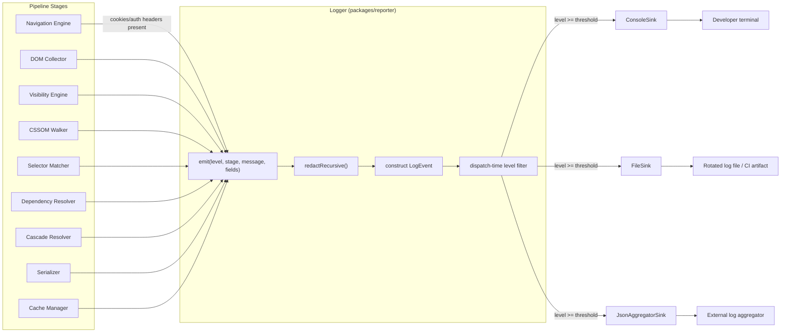
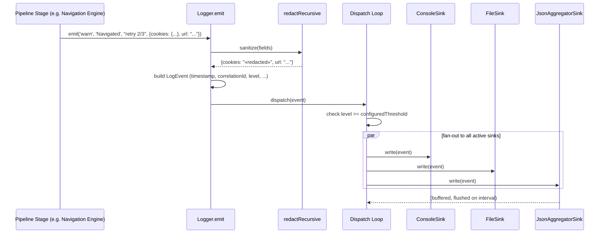
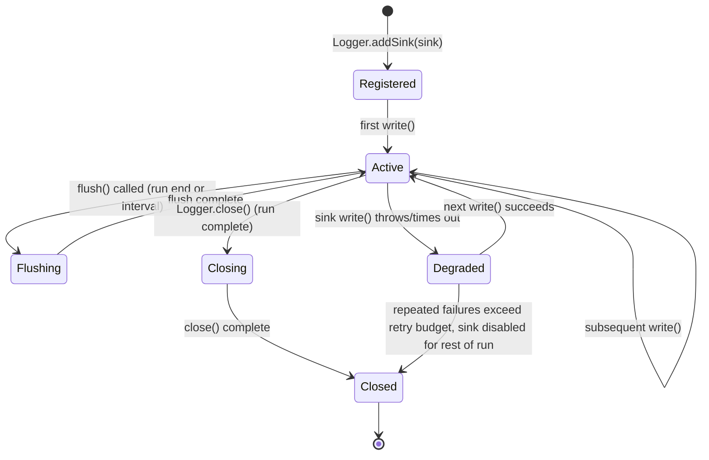

# 1001 — Logging

## 1. Title

**Critical CSS Extraction Engine — Reporter Module: Structured Logging Design**

## 2. Version

| Field | Value |
|---|---|
| Document Version | 1.0.0 |
| Status | Draft — Phase 13 (Diagnostics) |
| Last Updated | 2026-07-10 |
| Owners | Core Architecture Working Group |
| Stability | The `LogEvent` schema and correlation-ID scheme are stable; sink implementations (console, file, JSON-aggregator) are expected to grow in number without breaking this contract |

## 3. Purpose

[1000-Diagnostics-Overview.md](../design/1000-Diagnostics-Overview.md) Section 8.1 establishes that every pipeline stage emits `ReportEvent`s into a shared collection substrate, and Section 7.2 argues that ad hoc `console.log` calls are inadequate for a production engine that must answer cross-run, cross-route, concurrent-worker questions. This document specifies the concrete mechanism that turns that argument into an implementable subsystem: the **logging** layer of the Reporter — the append-only, timestamped, leveled, correlated event narrative of a single engine invocation, and the pluggable sink architecture that decides where those events end up (a developer's terminal, a rotated file, or a structured payload shipped to a log aggregator such as Datadog, Elastic, or CloudWatch).

Logging is deliberately scoped narrowly here, in a way that matters for how this document relates to its siblings. Logging is the **substrate**, not the **analysis**. [1002-Metrics.md](../design/1002-Metrics.md) aggregates numeric summaries (which could be computed by scanning a log, but are specified independently as a first-class typed model, not a log-parsing exercise). [1003-Tracing.md](../design/1003-Tracing.md) records fine-grained per-decision causality at a volume and structure (parent/child spans) that a flat log stream is a poor fit for. This document's job is narrower and more foundational: define what a **log event** is, what **levels** mean in this engine's vocabulary, what **correlation IDs** are and how they are constructed, what must never appear in a log line (**redaction**), and how a log event reaches a **sink** without the emitting code caring which sink is active. Every other Reporter concern in Phase 13 either emits events through this layer's `LogEvent` shape or defines its own richer shape while still reusing this document's correlation-ID and redaction machinery, because inventing separate correlation and redaction logic per subsystem would be the exact kind of duplicated-vocabulary mistake [605-Source-Maps.md](../design/605-Source-Maps.md) Section 8.1 explicitly rejected for provenance data.

## 4. Audience

- Implementers of `packages/reporter`'s `Logger`, `LogEvent`, `Sink` interface, and the concrete `ConsoleSink`, `FileSink`, and `JsonAggregatorSink` classes this document specifies.
- Implementers of every pipeline stage (Navigation Engine, DOM Collector, Visibility Engine, CSSOM Walker, Selector Matcher, Dependency Resolver, Cascade Resolver, Serializer, Cache Manager) who call `logger.emit(...)` at the per-stage points [1000-Diagnostics-Overview.md](../design/1000-Diagnostics-Overview.md) Section 8.2 enumerates.
- Implementers of [1002-Metrics.md](../design/1002-Metrics.md) and [1003-Tracing.md](../design/1003-Tracing.md), who reuse this document's correlation-ID scheme rather than defining their own.
- Operators integrating the engine's CI pipeline (`BRIEF.md` Section 2.11) with an external log aggregator, who need the `JsonAggregatorSink` wire format specified here.
- Security reviewers auditing the engine against `BRIEF.md` Section 2.16 (Security), specifically the redaction guarantees Section 8.5 of this document specifies for Navigation Engine cookies and auth headers.

Readers are assumed to have read [1000-Diagnostics-Overview.md](../design/1000-Diagnostics-Overview.md) in full, since this document reuses its `RunContext`, `ReportEvent`, and pipeline-stage vocabulary without re-deriving it.

## 5. Prerequisites

- [1000-Diagnostics-Overview.md](../design/1000-Diagnostics-Overview.md) — the shared collection substrate (`RunContext`, `ReportEvent`, the fourteen pipeline states) this document's `LogEvent` specializes.
- `docs/architecture/011-Execution-Pipeline.md` — the fourteen `PipelineState` values this document's per-stage log events are keyed on.
- `docs/architecture/103-Navigation-Engine.md` (see `docs/design/103-Playwright-Adapter.md` and sibling Browser Abstraction documents) — the subsystem whose request/response headers and cookies Section 8.5's redaction rules apply to.
- `BRIEF.md` Section 2.16 (Security) — the requirement this document's redaction design satisfies.
- [605-Source-Maps.md](../design/605-Source-Maps.md) Section 8.5 — the cheap/expensive tiering precedent this document's own always-on-vs-opt-in log verbosity levels follow.

## 6. Related Documents

- [1000-Diagnostics-Overview.md](../design/1000-Diagnostics-Overview.md) — parent overview; defines the `ReportEvent`/`ReportBundle` substrate this document's `LogEvent` rides within.
- [1002-Metrics.md](../design/1002-Metrics.md) — consumes the same correlation IDs to aggregate numeric summaries across log events; does not parse rendered log text, it consumes the same structured events this document defines before they reach a sink.
- [1003-Tracing.md](../design/1003-Tracing.md) — a higher-fidelity sibling for per-decision causality; uses this document's correlation IDs as its own span-context anchor.
- [1004-Visualization.md](../design/1004-Visualization.md) — may render a timeline view directly from a `JsonAggregatorSink`-captured event stream.
- [1005-Debug-UI.md](../design/1005-Debug-UI.md) — the interactive UI's live log tail view is a thin presentation layer over a `ConsoleSink`/`JsonAggregatorSink`-equivalent feed.
- [604-Output-Validation.md](../design/604-Output-Validation.md) — validation findings are emitted as `error`/`warn`-level log events in addition to being surfaced in the dedicated validation report.
- [605-Source-Maps.md](../design/605-Source-Maps.md) — origin-mapping is a separate, opt-in provenance mechanism; it does not flow through the logging layer, per [1000-Diagnostics-Overview.md](../design/1000-Diagnostics-Overview.md) Section 7.1's boundary.

## 7. Overview

A logging subsystem for a browser-driven, multi-route, multi-viewport, potentially-parallel extraction engine has to satisfy three requirements simultaneously that a simple CLI tool's logging does not: it must be **machine-parseable** (so `BRIEF.md` Section 2.11's CI pipeline can programmatically inspect a run's log for pass/fail signals), it must remain **human-legible** in a terminal during local development (so an engineer running the CLI directly sees a readable narrative, not raw JSON), and it must be **safe to persist and transmit** even though one of its inputs — the Navigation Engine's HTTP request/response cycle — routinely carries cookies and authorization headers that must never leave the process boundary in a log artifact.

These three requirements are not naturally in tension, but naive designs make them so. A design that logs pre-formatted human strings (`"Navigated to /products in 340ms"`) satisfies legibility but fails machine-parseability (a consumer must regex-parse `340ms` back out) and tends toward accidental redaction failures (string interpolation makes it easy to forget that a URL fragment might contain a session token). A design that logs raw structured objects with no formatting layer satisfies parseability but produces an unreadable terminal experience for local development. This document's answer, worked out in Section 8, is the same shape used successfully elsewhere in this repository's diagnostics design (605's dual Source-Map-v3-plus-extension-field format, [1000-Diagnostics-Overview.md](../design/1000-Diagnostics-Overview.md)'s event-stream-plus-borrowed-DTOs substrate): **emit one structured event, format it differently per sink**. The `LogEvent` object is the single source of truth; a `ConsoleSink` formats it as a colorized, human-readable line; a `FileSink` writes it as newline-delimited JSON; a `JsonAggregatorSink` batches and ships it to whatever aggregator the operator configured. Redaction is applied once, to the structured event, before any sink sees it — so no sink-specific formatting code path can accidentally leak an unredacted field, because the field was never populated with sensitive data past the redaction boundary in the first place.

The correlation-ID scheme (Section 8.3) exists because of a fact `BRIEF.md` Section 2.14 states as a requirement rather than a possibility: the engine performs "parallel stylesheet traversal" and "route batching." A single process may be interleaving log events from several concurrent (route, viewport) work-units. Without a stable identifier threading every event from a given work-unit together, a consumer — human or machine — cannot reconstruct "what happened, in order, for route `/products` at the mobile viewport" from an interleaved stream. The correlation ID is that thread.

## 8. Detailed Design

### 8.1 Log Levels

The engine defines five levels, ordered by severity, matching the vocabulary senior engineers already carry from mainstream structured-logging libraries (so no new mental model is imposed) while giving each level an engine-specific operational meaning:

| Level | Numeric | Engine-Specific Meaning | Example |
|---|---|---|---|
| `trace` | 10 | Per-decision detail; volume comparable to [1003-Tracing.md](../design/1003-Tracing.md)'s spans but rendered as flat log lines for tools that only understand logs | "Selector `.hero__cta` evaluated against node #482: match" |
| `debug` | 20 | Per-stage internal detail useful when diagnosing a specific defect, off by default | "Fixed-point iteration 3: discovered 2 new keyframe nodes" |
| `info` | 30 | Per-stage start/end summaries; the default production verbosity | "CssomWalked: 4 stylesheets, 3,204 rules enumerated in 88ms" |
| `warn` | 40 | Recoverable anomalies that do not stop the run but merit attention | "Cross-origin stylesheet skipped: `https://cdn.example.com/x.css`" |
| `error` | 50 | Failures that abort the current work-unit (route/viewport) or the whole run, per Principle 6 (Fail-Fast Diagnostics) | "Navigation timeout after 30000ms; retry budget exhausted" |

**Why five levels, not the common `fatal`-through-`trace` six, and not a minimal three (`info`/`warn`/`error`).** Six levels (adding `fatal` above `error`) was considered and rejected: this engine's failure model, per `docs/architecture/011-Execution-Pipeline.md` Section 9.2's retry/error states, distinguishes failures only by whether they are *work-unit-scoped* (a single route fails, the batch continues) or *run-scoped* (the whole invocation aborts) — a distinction already carried by which pipeline state emitted the `error` event and by a `scope: 'work-unit' | 'run'` field on the payload, not by a separate severity tier. Adding `fatal` would duplicate information already present in `scope`. A minimal three-level scheme was rejected because it collapses `trace` and `debug` into `info`-adjacent noise that a production operator must then filter out with post-hoc heuristics rather than a level threshold — the whole point of graduated verbosity (Section 8.4) is to make "give me everything" versus "give me the executive summary" a single configuration knob.

### 8.2 The `LogEvent` Shape

```text
LogEvent {
  timestamp:      ISO8601 string          // wall-clock, not monotonic — for cross-machine correlation
  level:          'trace'|'debug'|'info'|'warn'|'error'
  correlationId:  string                  // see 8.3
  stage:          PipelineState | 'orchestration'   // 'orchestration' for cross-stage/CLI-level events
  message:        string                  // human-readable summary, redaction-safe by construction (8.5)
  fields:         Record<string, JSONValue>  // structured payload; the machine-consumable half
  error?:         { name: string, message: string, stack?: string }  // present only for level='error'
}
```

`message` and `fields` are deliberately both present rather than message-only or fields-only. `message` is what a `ConsoleSink` prints directly; `fields` is what a `JsonAggregatorSink` indexes. This mirrors [1000-Diagnostics-Overview.md](../design/1000-Diagnostics-Overview.md) Section 8.2's per-stage payload table — `fields` is exactly that stage-specific payload, carried here rather than duplicated with a separate schema.

**Why wall-clock timestamps, not monotonic.** A monotonic clock is more correct for computing durations *within* one process, and indeed duration computation ([1002-Metrics.md](../design/1002-Metrics.md)'s timing report) uses a monotonic clock internally for that purpose. But a `LogEvent`'s `timestamp` field exists for a different purpose: correlating events across a distributed CI run where multiple engine processes (potentially on multiple machines, per `BRIEF.md` Section 2.19's `distributed crawler` roadmap item and [806-Distributed-Cache.md](../design/806-Distributed-Cache.md)) need a common time reference for a log aggregator to order them. Wall-clock, synchronized via standard NTP assumptions, is the only clock that means the same thing across machines; monotonic clocks are process-local by definition and cannot serve this cross-machine role.

### 8.3 Correlation IDs

A correlation ID is a deterministic string built from three components, in a fixed order, joined by a delimiter reserved from appearing in any component:

```text
correlationId = runId + "::" + routeSlug + "::" + viewportName
```

where `runId` is a UUID generated once per CLI invocation (shared with [1000-Diagnostics-Overview.md](../design/1000-Diagnostics-Overview.md)'s `RunContext.runId`), `routeSlug` is the route path with path separators replaced by a safe token (`/products` → `products`; `/` → `root`) to keep the ID filesystem- and log-query-safe, and `viewportName` is the configured viewport profile's name (`mobile`, `tablet`, `desktop`, or a custom profile name).

**Why a composite string key rather than a separate opaque UUID per work-unit with a lookup table mapping it back to (route, viewport).** An opaque UUID is more conventional in distributed tracing systems (where a trace ID is meaningless without its backing store) and was considered. It was rejected here because the whole point of a correlation ID in this engine's context is to let an engineer *read a log line and immediately know what work-unit it belongs to*, including in a raw-text `ConsoleSink` or `FileSink` context with no lookup infrastructure available — e.g., grepping a log file for `::products::mobile` must work with zero additional tooling. An opaque UUID would require that lookup infrastructure to exist and be reachable at debugging time, which is precisely the kind of dependency this document's Section 7 legibility requirement rules out. The cost of the composite scheme — it leaks route-path structure into the ID, which is a non-issue since route paths are not sensitive (Section 8.5 covers what *is* sensitive) — is strictly smaller than the benefit.

Every `LogEvent` emitted during a work-unit's execution carries that work-unit's correlation ID. Events emitted at run-orchestration scope, before any specific route/viewport is selected (e.g., "config resolved," "browser pool initialized"), carry a correlation ID with only the `runId` component and empty route/viewport placeholders (`runId::-::-`), so the field is always present and always parses the same way, never conditionally absent.

### 8.4 Verbosity Configuration and the Cheap/Expensive Split

Following [1000-Diagnostics-Overview.md](../design/1000-Diagnostics-Overview.md) Section 8.4's tiering, log verbosity is a single configuration knob (`--log-level=<level>`, default `info`) that filters at the point of **sink dispatch**, not at the point of **emission** — every `logger.emit(...)` call constructs the full `LogEvent` regardless of configured level, and the `Logger`'s dispatch loop checks `event.level >= configuredThreshold` before handing the event to any sink.

**Why filter at dispatch, not at emission (i.e., why not skip constructing a `trace`-level `LogEvent` at all when the threshold is `info`).** This was debated, because constructing an object that will be immediately discarded is, on its face, wasted work. The reason dispatch-time filtering wins: [1003-Tracing.md](../design/1003-Tracing.md)'s extraction trace and [1002-Metrics.md](../design/1002-Metrics.md)'s aggregate counters both want to observe the *full* event stream regardless of what the human-facing sink verbosity is configured to — a developer might run with `--log-level=warn` for a quiet terminal while still wanting `--report=timing` to reflect full-fidelity stage counts. If emission itself were suppressed by level, those other consumers would silently lose data whenever the console verbosity was turned down, coupling two independent configuration concerns (what a human sees vs. what the Reporter collects) that must stay decoupled per [1000-Diagnostics-Overview.md](../design/1000-Diagnostics-Overview.md) Section 8.3's pure-function-of-bundle design. The actual cost of constructing a discarded `LogEvent` object is a small, fixed allocation — negligible next to the pipeline's own per-rule/per-node work — so the "wasted work" concern does not survive a complexity comparison; see Section 14.

`trace`-level events are the one exception: because their volume can be genuinely large (Section 12), emission itself — not just dispatch — is gated behind an explicit `--log-level=trace` *or* `--trace` flag check at the call site in hot loops (selector matching, dependency discovery), so that the common case never pays even the allocation cost for events nobody, including other Reporter consumers, has asked for. This is the same two-tier reasoning [605-Source-Maps.md](../design/605-Source-Maps.md) Section 8.5 applies to origin-mapping: cheap identifiers always on, expensive materialization opt-in and skipped entirely (not just filtered) when off.

### 8.5 Redaction

The Navigation Engine (`docs/design/103-Playwright-Adapter.md` and siblings) routinely handles HTTP request/response cycles that carry `Cookie`, `Set-Cookie`, `Authorization`, and custom auth headers (e.g., `X-API-Key`), because crawling authenticated routes is a real, supported use case (`BRIEF.md` Section 2.6's route-level generation implies routes behind auth in enterprise deployments). None of this may ever reach a `LogEvent`'s `fields` or `message`, a persisted `FileSink` artifact, or a `JsonAggregatorSink` payload shipped to a third-party service.

Redaction is implemented as a **denylist applied at the point of `LogEvent` construction**, inside the `Logger.emit` function itself — not as a downstream sink-level scrub, and not as a discipline left to each call site to remember. Concretely:

```text
REDACTED_HEADER_NAMES = { "cookie", "set-cookie", "authorization", "x-api-key", "x-auth-token", ... }
REDACTED_FIELD_KEYS   = { "cookies", "authHeader", "sessionToken", ... }

function emit(level, stage, message, fields):
    sanitizedFields = deepClone(fields)
    redactRecursive(sanitizedFields, REDACTED_FIELD_KEYS, REDACTED_HEADER_NAMES)
    event = LogEvent(now(), level, currentCorrelationId(), stage, message, sanitizedFields)
    dispatch(event)

function redactRecursive(obj, fieldDenylist, headerDenylist):
    for key, value in obj:
        if lowercase(key) in fieldDenylist or lowercase(key) in headerDenylist:
            obj[key] = "«redacted»"
        else if value is object or array:
            redactRecursive(value, fieldDenylist, headerDenylist)
```

**Why redact centrally in `emit`, rather than trust the Navigation Engine to never pass sensitive fields into `fields` in the first place.** Trusting call sites was rejected outright: it is a single-point-of-failure design where one call site, anywhere in the codebase, forgetting this discipline is a security incident (per `BRIEF.md` Section 2.16). Centralizing redaction in `emit` means the guarantee holds even if a future contributor, unaware of this document, logs a raw response-headers object out of convenience while debugging — the denylist catches it regardless of who wrote the call site or when. The cost is a deep-clone-and-walk on every log event's `fields` object, which is a real but small and bounded cost (Section 14), and one this document judges strictly worth paying for a security guarantee that must hold unconditionally rather than "as long as everyone remembers."

**Why an explicit denylist rather than an allowlist ("only these fields may ever be logged").** An allowlist is more conservative and was considered, but it does not compose with this engine's plugin system (`BRIEF.md` Section 2.13): plugins may inject arbitrary `fields` payloads via hooks like `afterNavigation`, and a static allowlist would either reject all plugin-supplied fields (defeating the purpose of a plugin hook that wants to log something) or require a plugin-registration-time allowlist extension mechanism, which is significant additional complexity for a benefit (slightly more conservative default) that the fixed, well-known denylist of HTTP auth-adjacent field/header names already captures for the concrete, named threat (`BRIEF.md` Section 2.16's "cookies/auth headers from Navigation Engine"). If the threat model later expands beyond HTTP auth material, the denylist is the extension point (Section 16).

### 8.6 Sink Pluggability

```text
interface Sink {
  write(event: LogEvent): void | Promise<void>
  flush(): void | Promise<void>
  close(): void | Promise<void>
}
```

Three sinks are specified as the initial, always-available set; the interface is designed so a fourth (a Kafka sink, per `BRIEF.md` Section 2.4's Kafka integration note in the Common module, or a vendor-specific aggregator adapter) is a pure addition, never a modification to `Logger`:

- **`ConsoleSink`** — formats `message` with ANSI color by `level`, appends a compact rendering of `fields` (e.g., `key=value` pairs) only at `debug`/`trace` verbosity to keep `info`-level terminal output scannable; this is the default sink for local CLI runs.
- **`FileSink`** — writes newline-delimited JSON (one `LogEvent` per line), the full structured object with no formatting loss, suitable for `grep`/`jq` post-hoc analysis and for attaching to a CI job's artifact storage; supports rotation by size or by run, per the existing cron/log-rotation conventions this codebase already uses elsewhere (`/etc/config/crontab`-style `--rotate-log` precedent, generalized here to the Reporter's own file sink).
- **`JsonAggregatorSink`** — batches events (configurable batch size/flush interval) and POSTs them as a JSON array to a configured HTTP endpoint, in the shape most log aggregators (Datadog, Elastic, CloudWatch Logs via an HTTP intake) already accept; authentication to the aggregator itself is out of this document's scope (a separate, already-redacted configuration secret, never derived from anything this document's redaction rules would otherwise strip from application data).

Multiple sinks may be active simultaneously (`ConsoleSink` for the developer's terminal and `FileSink` for CI artifact capture, concurrently), because `Logger.emit` dispatches to every registered sink independently — sinks do not know about each other, and a slow or failing sink (e.g., a `JsonAggregatorSink` whose HTTP endpoint is briefly unreachable) must not block or crash the others, per the standard fire-and-forget-with-bounded-retry discipline sinks are individually responsible for implementing (Section 12 covers the failure mode explicitly).

## 9. Architecture

### 9.1 Log Events Flowing From Pipeline Stages to Sinks



### 9.2 Sequence Diagram — Emission Through Redaction to Multi-Sink Dispatch



### 9.3 State Diagram — Sink Lifecycle



## 10. Algorithms

### 10.1 Structured Log-Event Emission

**Problem statement.** Given a pipeline stage's call `emit(level, stage, message, fields)`, produce a fully redacted, correlated, leveled `LogEvent` and deliver it to every active sink whose configured threshold the event's level meets, without blocking the calling stage on slow sinks.

**Inputs:** `level`, `stage`, `message: string`, `fields: object`, plus ambient state (`currentCorrelationId()`, the registered sink list, each sink's configured threshold).

**Outputs:** none directly (fire-and-forget from the caller's perspective); side effect is delivery to zero or more sinks.

```text
function emit(level, stage, message, fields):
    if level == 'trace' and not traceEnabled():
        return                                    # emission-level gate, 8.4

    sanitized = redactRecursive(deepClone(fields), REDACTED_FIELD_KEYS, REDACTED_HEADER_NAMES)
    event = LogEvent {
        timestamp: nowISO8601(),
        level: level,
        correlationId: currentCorrelationId(),
        stage: stage,
        message: message,
        fields: sanitized,
        error: (level == 'error') ? extractErrorInfo(fields) : undefined
    }

    for sink in registeredSinks:
        if levelRank(level) >= levelRank(sink.threshold):
            enqueue(sink, event)                   # non-blocking; sink's own queue/backpressure applies

    return
```

`enqueue` hands the event to a per-sink bounded queue drained by that sink's own worker (synchronous for `ConsoleSink`, batched-async for `FileSink` and `JsonAggregatorSink`), which is what decouples a slow sink from the emitting pipeline stage's own critical path.

**Time complexity:** O(f) for the redaction walk, where f is the number of keys in `fields` (typically small and bounded — a handful of stage-specific counters or header names, not proportional to page size), plus O(s) for the sink fan-out, where s is the number of registered sinks (a small, fixed, configuration-time constant, typically 1–3).

**Memory complexity:** O(f) for the deep clone (bounded by the same small `fields` size) plus O(1) additional for the `LogEvent` wrapper itself; per-sink queue memory is O(queue depth), bounded by each sink's configured backpressure policy (Section 12).

**Failure cases:** a sink whose `write()` throws or hangs must not propagate that failure back to the emitting pipeline stage — `enqueue` isolates each sink's failure domain (Section 9.3's `Degraded` state); a `fields` object containing a circular reference must be handled by the deep-clone step (a standard cycle-safe clone, e.g., tracking visited object identities) rather than crashing the whole pipeline stage over a logging bug, since a logging subsystem crashing the extraction it is meant to observe would be a strictly worse failure mode than a slightly malformed log line.

**Optimization opportunities:** the redaction denylist lookup (`key in REDACTED_FIELD_KEYS`) is O(1) via a hash set, already optimal; a further optimization for very hot call sites (e.g., inside the Selector Matcher's per-rule loop, if `trace`-level logging were ever left enabled in a benchmark) would be to memoize the "does this fields-shape contain any denylisted key" check per call site key-shape, since the same call site typically passes structurally identical `fields` shapes across many invocations — deferred to Future Work (Section 16) since Section 8.4's emission-level `trace` gate already prevents this from mattering in the common case.

## 11. Implementation Notes

- `Logger` is a singleton-per-run object created at `ConfigResolved` (the first pipeline state) and threaded through every stage via dependency injection, not a module-level global — this keeps concurrent work-units (`BRIEF.md` Section 2.14's parallelism) from sharing mutable logger state beyond the intentionally-shared sink list.
- `currentCorrelationId()` is implemented via an async-local-context mechanism (e.g., Node.js `AsyncLocalStorage`) scoped per work-unit's execution, so pipeline stage code never manually threads a correlation ID through every function call — it is ambient within a work-unit's async call graph, set once when the work-unit begins and read implicitly by `emit`.
- The redaction denylists (`REDACTED_FIELD_KEYS`, `REDACTED_HEADER_NAMES`) are configuration, not hardcoded constants, so an operator with additional sensitive header conventions (a custom internal auth scheme) can extend them via `config.logging.redact` without a code change — but the shipped defaults must cover the standard HTTP auth surface unconditionally, so a misconfigured deployment that never touches this setting is still safe by default.
- `ConsoleSink`'s color output must degrade to plain text when `process.stdout.isTTY` is false (CI log capture, piping to a file) — colorized ANSI codes in a CI artifact are a common, avoidable annoyance and a five-line check.
- `FileSink` rotation follows the same `--rotate-log=yes`-style convention already established by this codebase's cron infrastructure (`cron.php --rotate-log`), for operator familiarity, rather than inventing a new rotation configuration vocabulary for the Reporter alone.

## 12. Edge Cases

- **Known browser quirks / rendering edge cases.** Out of scope for this document directly — logging only records what the Navigation Engine, DOM Collector, and Visibility Engine already observed; any quirk-handling logic lives in those subsystems' own documents. This document's only obligation is to log their `warn`/`error` events faithfully, including quirk-triggered retries.
- **Shadow DOM.** No special handling needed at the logging layer; DOM Collector/Visibility Engine events about shadow-root traversal are logged like any other stage event, with `fields` carrying whatever shadow-specific counters those subsystems choose to report.
- **Cross-origin constraints.** A cross-origin stylesheet fetch failure is logged at `warn` (not `error`, since it is a policy-driven skip per `BRIEF.md` Section 2.16, not a crash) with `fields.stylesheetUrl` present — the URL itself is not sensitive and is not subject to redaction, only header/cookie *values* are.
- **Constructable stylesheets and dynamically-injected `<style>` elements.** These have no stable URL; the CSSOM Walker assigns a synthetic identifier (per [307-Constructable-Stylesheets.md](../design/307-Constructable-Stylesheets.md)) that the logging layer treats as an opaque string like any other stylesheet identity — no special-casing required here.
- **Nested CSS / future CSS specifications.** Logging is agnostic to CSS syntax entirely; it only ever sees already-parsed stage outputs (counts, identifiers), so new CSS features requiring new *parsing* logic never require changes to this document, only to the CSSOM Walker/Dependency Resolver documents that would emit new `fields` keys through the existing `emit` contract.
- **Circular references in a stage's `fields` payload.** Handled by a cycle-safe deep clone (Section 10.1's Failure Cases); this is treated as a defensive measure against a future call-site bug, not an expected occurrence.
- **A sink endpoint (JsonAggregatorSink's HTTP target) unreachable for the whole run.** The sink enters and remains in the `Degraded` state (Section 9.3) after exceeding its retry budget; the run itself is unaffected (logging failures never abort extraction, per the general principle that observability must be strictly additive, never a new failure mode for the thing it observes) but a final `warn`-level "logging sink X disabled after N failures" event is emitted through the *remaining* healthy sinks so the operator is not left silently blind.
- **Extremely high-frequency `trace`-level emission in a pathological page** (e.g., tens of thousands of selector-match attempts). Mitigated by the emission-level gate (Section 8.4) and, if `--trace` is explicitly requested against such a page, by sampling strategies deferred to [1003-Tracing.md](../design/1003-Tracing.md) Section 12, which this document's logging layer does not itself implement (logging always emits every gated-in event; sampling is a tracing-specific concern for volumes logging was never meant to carry).

## 13. Tradeoffs

- **Central redaction in `emit` vs. call-site discipline.** Discussed in Section 8.5; chosen for unconditional safety at the cost of a per-event deep-clone/walk. Given `fields` payloads are small (Section 10.1), this cost is judged negligible relative to the security guarantee gained.
- **Dispatch-time level filtering vs. emission-time filtering.** Discussed in Section 8.4; chosen to keep human-facing verbosity decoupled from other Reporter consumers' need for full-fidelity Tier 0/1 data, at the cost of constructing (small, bounded) objects that may be immediately discarded by a `ConsoleSink` at `info` threshold.
- **Wall-clock vs. monotonic timestamps.** Discussed in Section 8.2; wall-clock chosen for cross-machine correlation at the cost of vulnerability to clock skew between machines in a distributed run — mitigated by NTP-synchronized infrastructure being a standard operational assumption this document does not attempt to relax.
- **Composite string correlation IDs vs. opaque UUIDs with a lookup table.** Discussed in Section 8.3; chosen for zero-infrastructure debuggability at the cost of leaking route-path structure into the ID string, judged non-sensitive and therefore an acceptable, one-sided tradeoff.
- **Denylist-based redaction vs. allowlist-based.** Discussed in Section 8.5; denylist chosen for plugin-system compatibility at the cost of being reactive rather than proactive against unanticipated sensitive-field naming — mitigated by the denylist's own configurability (Section 11).

## 14. Performance

- **CPU complexity.** Per Section 10.1: O(f) redaction plus O(s) sink fan-out per emitted event, both small, bounded constants in practice; the dominant cost driver is *event volume*, not per-event cost, which is why the emission-level `trace` gate (Section 8.4) is the primary lever for keeping logging overhead low on pathological pages.
- **Memory complexity.** O(f) per event plus O(queue depth) per sink; bounded, configurable backpressure prevents unbounded growth if a sink stalls (Section 12).
- **Caching strategy.** Not directly applicable to logging (each event is unique by construction); however, the redaction denylist lookup is itself a cached hash-set membership check, already O(1).
- **Parallelization opportunities.** Sink dispatch is fully parallel across sinks (Section 9.2's `par` block) since sinks share no mutable state; across concurrent work-units, the async-local correlation-ID mechanism (Section 11) means no cross-work-unit coordination is needed at the logging layer at all — this is one of the cleanest embarrassingly-parallel points in the whole Reporter design.
- **Incremental execution.** Not applicable — logging is inherently append-only and per-run; there is no "incremental re-log" concept.
- **Profiling guidance.** If logging overhead is ever suspected of affecting extraction wall-clock time (it should not, per the complexity analysis above), the first diagnostic step is checking whether `trace`-level emission was accidentally left enabled in a hot loop despite Section 8.4's gate — this is the one place per-event cost could scale with rule/node count rather than stage count.
- **Scalability limits.** For CI runs crawling thousands of routes, the primary scalability concern is `FileSink`/`JsonAggregatorSink` I/O throughput, not the `Logger`'s own CPU cost; batching (Section 8.6) is the mitigation, and very large runs should prefer streaming sinks with bounded in-memory buffers over accumulating the full run's log in memory.

## 15. Testing

- **Unit tests.** Redaction correctness: fixtures with nested `fields` objects containing denylisted keys at various nesting depths, confirming every occurrence is replaced with `«redacted»` and no sibling data is affected; correlation-ID construction for both work-unit-scoped and orchestration-scoped events; level-threshold filtering logic for all five levels against all five configured thresholds (25 combinations).
- **Integration tests.** A full pipeline run against a fixture route that requires an authenticated request (cookie-bearing) confirms the resulting `FileSink` artifact contains zero occurrences of the test fixture's known cookie value, verified by a literal string search over the artifact, not just a schema check.
- **Visual tests.** `ConsoleSink` output rendering, snapshot-tested for both TTY (colorized) and non-TTY (plain) modes against a fixed `LogEvent` fixture set.
- **Stress tests.** A synthetic run emitting a very high volume of `trace`-level events (with `--trace` forced on) against a large fixture page, confirming the emission-level gate and sink backpressure keep memory bounded rather than growing unboundedly.
- **Regression tests.** A golden `LogEvent` JSON fixture set checked against the current schema on every CI run, catching accidental field renames/removals that would break downstream `JsonAggregatorSink` consumers depending on field stability.
- **Benchmark tests.** Per-event `emit()` wall-clock cost at each configured verbosity level, confirming the cost model in Section 14 (near-zero when filtered at dispatch, small-and-bounded when delivered).

## 16. Future Work

- **Configurable, per-deployment-extensible redaction rule sets** beyond the shipped denylist defaults, potentially expressed as a small rule DSL (regex-based key matching, value-shape matching) rather than an exact-match denylist, for organizations with bespoke sensitive-field naming conventions.
- **Adaptive sampling for `trace`-level emission** on pathological pages, referenced in Section 12, deferred here as a concrete algorithm design (e.g., reservoir sampling keyed by correlation ID) rather than specified in this document, since it more properly belongs alongside [1003-Tracing.md](../design/1003-Tracing.md)'s span-volume management.
- **A native OpenTelemetry log-record exporter** as a fourth built-in sink, given OpenTelemetry's growing status as a vendor-neutral observability standard — deferred rather than included in the initial three because it introduces an external dependency this phase's scope did not require.
- **Structured redaction audit reporting** — a report (itself a Reporter output, ironically) that confirms, per run, which fields were redacted and how often, as a periodic self-check that the denylist is actually catching what it is meant to, rather than silently missing a newly introduced sensitive field name.
- **Open question:** should log-level verbosity be independently configurable per pipeline stage (e.g., `trace` for the Dependency Resolver while `info` elsewhere, to debug one subsystem without drowning in unrelated noise) rather than a single global threshold? This would materially help targeted debugging but adds configuration surface area whose complexity-to-benefit ratio has not yet been evaluated against real debugging sessions; left open for a future revision once the engine has enough production usage history to judge.

## 17. References

- `BRIEF.md` Section 2.4 (Reporter module row), Section 2.6 (Route-Level Generation, implying authenticated routes), Section 2.14 (Performance Optimizations — parallel traversal, route batching), Section 2.16 (Security).
- `docs/architecture/006-Design-Principles.md` — Principle 6 (Fail-Fast Diagnostics).
- `docs/architecture/011-Execution-Pipeline.md` — the fourteen `PipelineState` values this document's per-stage events are keyed on, and Section 9.2's retry/error state model referenced in Section 8.1.
- [1000-Diagnostics-Overview.md](../design/1000-Diagnostics-Overview.md) — parent overview; `RunContext`/`ReportEvent` substrate this document specializes.
- [1002-Metrics.md](../design/1002-Metrics.md) — consumes this document's correlation IDs and event stream for aggregate numeric reporting.
- [1003-Tracing.md](../design/1003-Tracing.md) — the finer-grained sibling for per-decision causal records, referenced throughout for the logging/tracing boundary.
- [1004-Visualization.md](../design/1004-Visualization.md), [1005-Debug-UI.md](../design/1005-Debug-UI.md) — downstream consumers of captured log streams for timeline and live-tail views.
- [604-Output-Validation.md](../design/604-Output-Validation.md) — validation findings emitted as `warn`/`error` log events.
- [605-Source-Maps.md](../design/605-Source-Maps.md) — the cheap/expensive tiering precedent (Section 8.5) this document's verbosity gating follows, and the explicit boundary (its Section 7, restated in [1000-Diagnostics-Overview.md](../design/1000-Diagnostics-Overview.md) Section 7.1) that origin-mapping does not flow through this logging layer.
- `docs/design/103-Playwright-Adapter.md` and sibling Browser Abstraction documents — the Navigation Engine subsystem whose cookies/auth headers Section 8.5 redacts.
