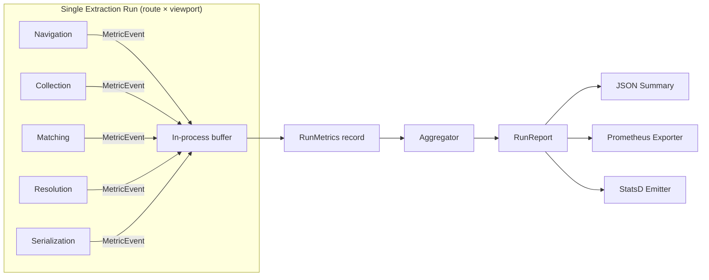
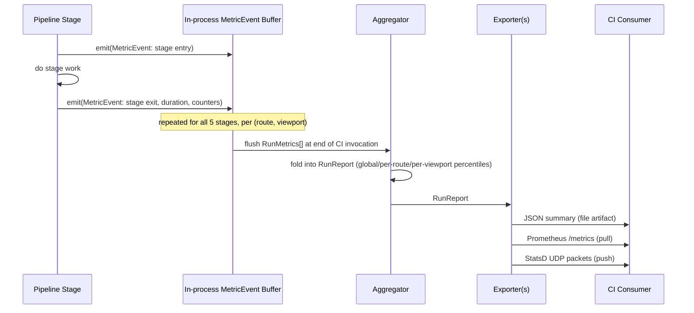
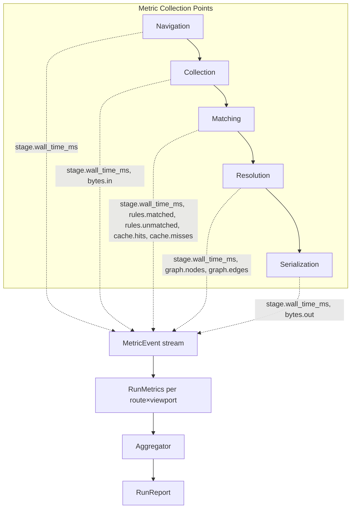

# 1002 — Metrics

## 1. Title

**Critical CSS Extraction Engine — Quantitative Metrics Collection: Per-Stage Timing, Counters, Cross-Run Aggregation, and CI Export Formats**

## 2. Version

| Field | Value |
|---|---|
| Document Version | 1.0.0 |
| Status | Draft — Phase 13 (Diagnostics) |
| Last Updated | 2026-07-10 |
| Owners | Diagnostics & Observability Working Group |
| Stability | The `MetricEvent` envelope and the five canonical stage names (`navigation`, `collection`, `matching`, `resolution`, `serialization`) defined in Section 8 are **stable** and are the interface every exporter (Prometheus, StatsD, JSON summary) and every downstream consumer ([1004-Visualization.md](./1004-Visualization.md), [1005-Debug-UI.md](./1005-Debug-UI.md)) must accept. Exporter wire formats may evolve independently. |

## 3. Purpose

`BRIEF.md` §2.12 requires a "timing report" as one of the diagnostics artifacts the engine must produce, and §2.14 lists a set of performance optimizations (rule indexing, selector memoization, parallel stylesheet traversal, browser-side execution, batched serialization, worker threads, route batching, streaming output) whose entire justification is quantitative: they exist to make some number smaller. Without a metrics system, both of these are unfalsifiable. A "timing report" that isn't backed by structured, machine-readable numbers is just a log line a human reads once; an optimization that isn't measured before and after is a guess dressed as an improvement.

This document defines that metrics system: what gets measured, at what granularity, how measurements from a single extraction combine into a report for a full multi-route, multi-viewport CI run, and in what wire formats that report leaves the process for consumption by dashboards, alerting, and regression gates. It is deliberately scoped to **quantitative, numeric** signals — durations, counts, ratios, byte sizes. Structured event narration (what happened, in what order, with what payload) is the concern of [1001-Logging.md](./1001-Logging.md); the "why was this specific rule included" causal record is the concern of [1003-Tracing.md](./1003-Tracing.md). The three systems are complementary views over the same run and are correlated by a shared `runId`/`spanId` scheme (Section 8.4), but this document only specifies the numeric layer.

The problem this layer solves, precisely: **every pipeline execution must emit a bounded, structured, aggregable set of numbers that answers "was this run fast, was it faster or slower than last time, and if slow, which stage/route/viewport was the bottleneck" without requiring a human to read prose.** A CI system that runs the engine against 200 routes across 3 viewports nightly needs to answer "did p95 collection time regress by more than 10%" as an automated gate, not as a Slack message someone reads three days later.

## 4. Audience

- Implementers of `packages/metrics`, the shared instrumentation core that every pipeline stage (Navigation Engine, CSSOM Walker, Selector Matcher, Dependency Resolver, Serializer) calls into to record timings and counters.
- CI/platform engineers wiring the engine's metrics export into existing observability stacks (Prometheus/Grafana, Datadog via StatsD, or a flat JSON artifact consumed by a custom dashboard).
- Performance engineers investigating regressions surfaced by [2.14 Performance Optimizations] work — they need per-stage, per-route breakdowns, not just a single wall-clock number.
- Authors of [1004-Visualization.md](./1004-Visualization.md), which renders these metrics as charts, and [1005-Debug-UI.md](./1005-Debug-UI.md), which surfaces them interactively during local debugging.
- Reviewers verifying that a proposed optimization actually improves the numbers this document defines, rather than shifting cost to an unmeasured stage.

Readers are assumed to understand basic statistics (percentiles, histograms), the shape of the extraction pipeline (navigation → collection → matching → resolution → serialization, per [011-Execution-Pipeline.md](../architecture/011-Execution-Pipeline.md)), and the operational difference between a counter, a gauge, and a duration histogram (the three metric kinds Prometheus and StatsD both converge on).

## 5. Prerequisites

- [011-Execution-Pipeline.md](../architecture/011-Execution-Pipeline.md) — the five-stage pipeline this document instruments. Stage boundaries here are identical to those defined there; this document does not redefine pipeline structure, only what is measured at each boundary.
- [1000-Diagnostics-Overview.md](./1000-Diagnostics-Overview.md) — the umbrella document enumerating all diagnostics artifacts (dependency graph, matched/unmatched selector reports, timing report, extraction trace, HTML visualization) from `BRIEF.md` §2.12, and how they relate to one another. This document is the detailed design for the "timing report" and "counters" slice of that overview.
- [1001-Logging.md](./1001-Logging.md) — the structured event log this metrics system is correlated with via `runId`.
- [800-Cache-Overview.md](./800-Cache-Overview.md) — defines cache hit/miss semantics that Section 8.2's cache-ratio counters report on.
- [500-Dependency-Resolution-Overview.md](./500-Dependency-Resolution-Overview.md) — defines the dependency graph whose node/edge counts this document counts.
- Familiarity with the "Route Manifest" and "Route Batching" concepts from `BRIEF.md` §2.9 and §2.14 — multi-route runs are the primary aggregation unit this document addresses.

## 6. Related Documents

- [1000-Diagnostics-Overview.md](./1000-Diagnostics-Overview.md) — parent document for all Phase 13 diagnostics artifacts.
- [1001-Logging.md](./1001-Logging.md) — structured event logging; correlated via shared `runId`.
- [1003-Tracing.md](./1003-Tracing.md) — causal, per-decision trace tree; correlated via shared `runId`/`spanId`.
- [1004-Visualization.md](./1004-Visualization.md) — renders the metrics defined here (and the graph/trace data from siblings) as HTML/SVG visualizations.
- [1005-Debug-UI.md](./1005-Debug-UI.md) — interactive local UI surfacing live metrics during a debugging session.
- [011-Execution-Pipeline.md](../architecture/011-Execution-Pipeline.md) — the pipeline stages this document instruments.
- [800-Cache-Overview.md](./800-Cache-Overview.md), [803-Route-Cache.md](./803-Route-Cache.md) — cache hit/miss source of the ratio counters in Section 8.2.
- [500-Dependency-Resolution-Overview.md](./500-Dependency-Resolution-Overview.md) — dependency graph whose size this document counts.
- `BRIEF.md` §2.12 (Diagnostics — timing report), §2.14 (Performance Optimizations), §2.9 (Route Manifest), §2.15 (Testing Strategy — Performance benchmarks).

## 7. Overview

The metrics system is a single append-only event stream produced during a run, plus a stateless aggregator that folds that stream into a report. Every pipeline stage, on entry and exit, emits a `MetricEvent` (Section 8.1) carrying a stage name, a route/viewport identifier, a duration, and zero or more counter deltas. Stages do not know about aggregation, storage, or export — they only know how to emit events into an in-process buffer (or, in a distributed worker-thread configuration, a shared-memory ring buffer or IPC channel back to a collector process). This separation matters for the same reason it matters in every well-designed metrics system (Prometheus client libraries, StatsD clients, OpenTelemetry SDKs all converge on it): instrumentation code must be cheap and side-effect-free at the call site, because it runs on the hot path of every extraction, potentially thousands of times per CI run.

A single extraction (one route, one viewport) produces one `RunMetrics` record: five stage durations, a handful of counters (rules matched, rules unmatched, cache hits/misses, bytes in/out, graph node/edge counts), and metadata (route path, viewport dimensions, timestamp, engine version). A CI invocation that processes N routes × M viewports produces N×M such records. The **aggregator** (Section 10.1) folds this collection into a `RunReport`: per-stage percentile distributions (p50/p95/p99), per-route and per-viewport breakdowns, and run-wide totals — without ever holding more than O(N×M) records in memory at once, and without requiring a second pass over raw per-extraction data once percentiles are computed via a streaming quantile sketch (Section 10.1's complexity discussion covers the exact/approximate tradeoff).

Three export paths consume the `RunReport`: a flat JSON summary (the default, zero-dependency path, suitable for archiving as a CI artifact and for [1004-Visualization.md](./1004-Visualization.md) to render directly); a Prometheus text-exposition-format `/metrics` endpoint (for engines run as a long-lived service, e.g., behind an SSR adapter per [900-SSR-Overview.md](./900-SSR-Overview.md)); and a StatsD UDP emitter (for engines run as short-lived CLI invocations inside an existing StatsD-instrumented CI fleet, where push semantics fit the process lifecycle better than pull-based scraping).



## 8. Detailed Design

### 8.1 The `MetricEvent` Envelope

Every measurement, regardless of stage or kind, is emitted as one instance of a single envelope type:

```typescript
interface MetricEvent {
  runId: string;           // shared with Logging (1001) and Tracing (1003)
  spanId?: string;         // present when a Tracing span is active; correlates the two systems
  stage: StageName;        // "navigation" | "collection" | "matching" | "resolution" | "serialization"
  route: string;           // route manifest key, e.g. "/products/:id"
  viewport: ViewportKey;   // e.g. "desktop-1440x900" — see 105-Viewport-Manager.md
  kind: "duration" | "counter" | "gauge";
  name: string;            // e.g. "stage.wall_time_ms", "rules.matched", "cache.hit_ratio"
  value: number;
  unit: "ms" | "count" | "bytes" | "ratio";
  timestamp: number;       // epoch ms, monotonic-clock-derived for duration events
}
```

**Why a single flat envelope rather than typed events per stage?** Alternatives considered: (a) one TypeScript interface per stage (`NavigationMetric`, `CollectionMetric`, ...) with stage-specific fields; (b) a free-form `Record<string, number>` bag per stage with no shared schema. Option (a) gives compile-time safety per stage but forces every consumer (aggregator, exporters) to special-case five types instead of folding over one; it also makes adding a sixth stage (hypothetically, a future "coverage" stage per [700-Coverage-Mode.md](./700-Coverage-Mode.md)) a breaking change to every consumer. Option (b) is maximally flexible but loses the `unit`/`kind` discipline that keeps the Prometheus and StatsD exporters simple — both of those wire formats fundamentally distinguish counters from gauges from histograms, and an untyped bag pushes that classification decision into the exporter, where it is easy to get wrong per-metric. The flat envelope with a `kind` discriminant gives the aggregator and exporters one fold function each, at the cost of a slightly more verbose call site (`emit({stage, route, viewport, kind, name, value, unit})` vs. a stage-specific helper). This cost is paid once, inside thin per-stage wrapper functions (`recordStageDuration(stage, ms)`) that the actual pipeline code calls, so the verbosity is contained to `packages/metrics` internals, not spread across five pipeline modules.

**Why carry `route` and `viewport` on every event instead of only on the enclosing `RunMetrics`?** Because CI aggregation (Section 8.3) must be able to compute per-route and per-viewport breakdowns without re-associating events with their enclosing run after the fact — carrying the dimension on the event itself makes the aggregator a pure fold with no join step. The per-event redundancy (the same route/viewport string repeated across ~15-20 events per extraction) is a few hundred bytes per extraction, negligible against typical page sizes this engine processes (tens of KB to low MB of CSS/HTML), and is never serialized to disk in this denormalized form — it exists only in the in-process buffer before folding into `RunMetrics`.

### 8.2 Per-Stage Timing

Exactly one `duration` event per stage per extraction is recorded, named `stage.wall_time_ms`, using `process.hrtime.bigint()` (Node) or `performance.now()` (in-browser-context measurements, see Principle 1's browser-authority stance in [006-Design-Principles.md](../architecture/006-Design-Principles.md)) for monotonic timing — wall-clock `Date.now()` is never used for interval measurement because it is subject to NTP adjustment and cannot be trusted for sub-millisecond deltas, only for the event `timestamp` field (an absolute point in time, not an interval).

The five canonical stages and what each duration covers:

| Stage | Starts | Ends | Typical magnitude |
|---|---|---|---|
| `navigation` | `page.goto()` invocation | Rendering-stabilization signal fires (per [104-Rendering-Stabilization.md](./104-Rendering-Stabilization.md)) | 200ms–3s (network-bound) |
| `collection` | CSSOM walk begins | All stylesheets/rules enumerated into the Rule Tree (per [302-Rule-Tree.md](./302-Rule-Tree.md)) | 5ms–200ms (proportional to stylesheet size) |
| `matching` | First `element.matches()` call | Last candidate element checked | 10ms–500ms (proportional to rule count × DOM size, mitigated by [401-Selector-Memoization.md](./401-Selector-Memoization.md)) |
| `resolution` | Dependency graph construction begins | Graph fully resolved (per [500-Dependency-Resolution-Overview.md](./500-Dependency-Resolution-Overview.md)) | 1ms–50ms |
| `serialization` | Final rule set handed to Serializer | Output string/buffer produced (per [600-Serialization-Overview.md](./600-Serialization-Overview.md)) | 1ms–100ms |

Sub-stage timing (e.g., time spent specifically in selector memoization cache lookups within `matching`) is intentionally **not** part of this document's canonical five; it belongs to `spanId`-nested trace events in [1003-Tracing.md](./1003-Tracing.md), which supports arbitrary nesting depth without polluting the fixed five-row timing report every consumer expects. This is a deliberate boundary: metrics answer "how long did each stage take, aggregated across many runs, cheaply"; tracing answers "what exactly happened inside this one run's matching stage." Conflating them would force every metrics consumer to handle a variable-depth tree instead of a fixed five-column table, which breaks the flat-JSON/Prometheus/StatsD export story this document is built around (all three formats are fundamentally poor at representing recursive structure).

### 8.3 Counters

Four counter families, each emitted as `kind: "counter"` events with monotonically increasing values within a single extraction (never decremented — a decrement, if ever needed, e.g., for a gauge like "rules currently held in memory," uses `kind: "gauge"` instead):

1. **Rule counters** — `rules.matched`, `rules.unmatched` (per selector-matching decision, aggregated across all stylesheets for the route/viewport). These directly back the Matched/Unmatched Selector Reports from `BRIEF.md` §2.12; this document only defines the *count*, the reports themselves (per-selector detail) are [1000-Diagnostics-Overview.md](./1000-Diagnostics-Overview.md)'s concern.
2. **Cache counters** — `cache.hits`, `cache.misses`, combined at report time into `cache.hit_ratio = hits / (hits + misses)`. Source: every lookup against the Route Cache ([803-Route-Cache.md](./803-Route-Cache.md)) or Selector Memoization cache ([401-Selector-Memoization.md](./401-Selector-Memoization.md)) emits exactly one of the two.
3. **Byte counters** — `bytes.in` (total size of all stylesheets fetched/parsed for the route), `bytes.out` (size of the final serialized critical CSS artifact). The ratio `bytes.out / bytes.in` is the single most externally meaningful number this system produces — it is the number a stakeholder unfamiliar with the pipeline's internals will ask for first ("how much smaller did you make it") and is the KPI most directly tied to the engine's value proposition (`BRIEF.md` §2.14's optimizations exist to shrink `bytes.out` without growing `stage.wall_time_ms`).
4. **Graph counters** — `graph.nodes`, `graph.edges` — the size of the dependency graph constructed during `resolution` (per [500-Dependency-Resolution-Overview.md](./500-Dependency-Resolution-Overview.md)). These are the leading indicator for `resolution` stage duration: graph algorithms in that stage are typically O(V+E) or O(E log V), so a spike in edge count without a corresponding spike in `stage.wall_time_ms` signals either an unusually sparse graph or a measurement gap worth investigating.

### 8.4 Correlation with Logging and Tracing

Every `MetricEvent`, `LogEvent` (per [1001-Logging.md](./1001-Logging.md)), and `TraceSpan` (per [1003-Tracing.md](./1003-Tracing.md)) emitted during one invocation of the pipeline shares a single `runId` — a UUIDv4 generated once at the top of the CLI/programmatic entry point and threaded through every module via the same context-propagation mechanism already used for cancellation and timeout signaling (see [015-Runtime-Model.md](../architecture/015-Runtime-Model.md)). Where a Tracing span is active for the current stage, its `spanId` is additionally attached to the `MetricEvent`, so a dashboard showing "matching stage p99 spiked on route X" can pivot directly to the trace tree for that exact span without a secondary lookup — this is the same correlation pattern OpenTelemetry uses between its Metrics and Traces signals, and this document deliberately mirrors it rather than inventing a bespoke scheme, on the theory that a future migration to a real OpenTelemetry SDK (Section 16) should require changing exporters, not changing the correlation identifiers themselves.

### 8.5 Multi-Route, Multi-Viewport Aggregation

A CI run's unit of work is the Route Manifest (`BRIEF.md` §2.9) crossed with the configured viewport set (per [105-Viewport-Manager.md](./105-Viewport-Manager.md)). Each (route, viewport) pair produces one `RunMetrics` record as described in Section 7. The aggregator (Section 10.1) consumes the full set of `RunMetrics` for a CI invocation and produces a `RunReport` with three levels of rollup:

- **Global**: percentile distributions per stage across every (route, viewport) pair — answers "is the engine, as a whole, fast this run."
- **Per-route**: the same percentiles restricted to one route across its viewports — answers "is this specific route slow," useful because route-specific pathologies (a route with a pathologically large stylesheet, or one triggering a slow third-party font load during `navigation`) are common and a global percentile can hide a single bad route inside an otherwise healthy distribution.
- **Per-viewport**: the same percentiles restricted to one viewport across all routes — answers "is mobile extraction systematically slower than desktop," which is the shape of regression most directly caused by viewport-dependent work (e.g., `matching` re-run per viewport because visibility differs, per [200-Visibility-Engine-Overview.md](./200-Visibility-Engine-Overview.md)).

## 9. Architecture





## 10. Algorithms

### 10.1 Aggregation

**Problem statement.** Given N×M `RunMetrics` records (N routes, M viewports), produce a `RunReport` containing, for each of the three rollup levels (global, per-route, per-viewport) and each of the five stages: count, mean, p50, p95, p99, min, max of `stage.wall_time_ms`; plus summed counters (`rules.matched`, `rules.unmatched`, `cache.hits`, `cache.misses`, `bytes.in`, `bytes.out`, `graph.nodes`, `graph.edges`) and derived ratios (`cache.hit_ratio`, `bytes.out / bytes.in`).

**Inputs.** `RunMetrics[]`, one per (route, viewport) pair, each containing five stage durations and eight counter values.

**Outputs.** `RunReport` — a nested structure `{ global: StageStats[5], byRoute: Map<route, StageStats[5]>, byViewport: Map<viewport, StageStats[5]> }` plus counter totals and ratios at each of the three levels.

**Pseudocode:**

```
function aggregate(records: RunMetrics[]) -> RunReport:
    # Pass 1: partition records into the three rollup buckets.
    # This is O(N*M) and touches each record exactly once.
    globalBucket = records
    routeBuckets = groupBy(records, r => r.route)        # O(N*M)
    viewportBuckets = groupBy(records, r => r.viewport)   # O(N*M)

    report = RunReport()
    report.global = computeStats(globalBucket)
    for route, bucket in routeBuckets:
        report.byRoute[route] = computeStats(bucket)
    for viewport, bucket in viewportBuckets:
        report.byViewport[viewport] = computeStats(bucket)
    return report

function computeStats(bucket: RunMetrics[]) -> StageStats[5]:
    result = new StageStats[5]
    for stageIndex in 0..4:
        durations = bucket.map(r => r.stageDurations[stageIndex])  # O(|bucket|)
        durations.sort()                                          # O(|bucket| log |bucket|)
        result[stageIndex] = {
            count: durations.length,
            mean:  sum(durations) / durations.length,
            p50:   percentile(durations, 0.50),   # index into sorted array, O(1)
            p95:   percentile(durations, 0.95),
            p99:   percentile(durations, 0.99),
            min:   durations[0],
            max:   durations[durations.length - 1],
        }
    counters = sumCounters(bucket)   # O(|bucket|)
    result.counters = counters
    result.ratios = {
        cacheHitRatio: counters.cacheHits / (counters.cacheHits + counters.cacheMisses),
        bytesRatio: counters.bytesOut / counters.bytesIn,
    }
    return result
```

**Time complexity.** The dominant cost is the per-bucket sort for exact percentiles: O(B log B) per bucket where B is bucket size, summed across all buckets. In the worst case (global bucket, B = N×M), this is O(NM log(NM)). For a CI run with, say, 200 routes × 3 viewports = 600 records, this is trivial (600 log 600 ≈ 5,400 comparisons) and exact percentiles are strictly preferable to an approximation at this scale — there is no reason to reach for a streaming quantile sketch (t-digest, HDRHistogram) until B grows into the tens of thousands, which would require either a vastly larger route manifest or per-request (not per-CI-run) aggregation in a long-lived service context (see Section 16).

**Memory complexity.** O(N×M) to hold all records plus O(N×M) transiently for each bucket's sorted duration array (the global bucket dominates at O(N×M), route/viewport buckets are disjoint partitions summing to the same total). This is bounded and predictable — a CI job can budget memory precisely as a linear function of manifest size × viewport count, which matters for CI runner sizing.

**Failure cases.** Empty bucket (a route present in the manifest but for which navigation failed before any stage emitted a duration) — `computeStats` must special-case a zero-length `durations` array and emit `null`/`NaN`-safe stats rather than dividing by zero; the aggregator surfaces this as a distinct `incomplete: true` flag on that route's stats rather than silently omitting the route, per the Fail-Fast Diagnostics principle ([006-Design-Principles.md](../architecture/006-Design-Principles.md) Principle 6) — a missing route in a report is a worse failure mode than a report entry flagged incomplete, because the former is invisible.

**Optimization opportunities.** If route/viewport bucket computation is parallelized (one worker thread per bucket), the O(NM log NM) global-bucket sort can run concurrently with the per-route and per-viewport sorts since they read the same immutable `records` array — this is a natural fit for the worker-thread architecture `BRIEF.md` §2.14 already calls for elsewhere in the pipeline, and reuses the same worker pool rather than spinning up a dedicated one for aggregation.

### 10.2 Streaming Emission (Buffer Management)

**Problem statement.** Bound the in-process `MetricEvent` buffer's memory footprint during a long CI run without dropping events or blocking the pipeline's hot path.

**Pseudocode:**

```
function emit(event: MetricEvent):
    buffer.push(event)                 # O(1) amortized
    if buffer.length >= FLUSH_THRESHOLD:  # e.g. 5,000 events
        flushToAggregatorInput(buffer)  # async, non-blocking
        buffer.clear()
```

**Time complexity.** O(1) amortized per event; the occasional flush is O(FLUSH_THRESHOLD) but runs off the critical path (fire-and-forget into an async queue feeding the aggregator's input, or, in worker-thread mode, an IPC `postMessage`).

**Memory complexity.** O(FLUSH_THRESHOLD), a constant independent of total run size — this is what makes the metrics system safe to run unmodified whether the manifest has 10 routes or 10,000.

**Failure cases.** A crash between buffer accumulation and flush loses at most `FLUSH_THRESHOLD` events (bounded, not unbounded, data loss) — acceptable for a metrics system (unlike the Logging system in [1001-Logging.md](./1001-Logging.md), which has stronger durability requirements for post-incident forensics) because metrics are intended for aggregate trend analysis, where losing a small window of one CI run's raw events does not change the aggregate result materially.

## 11. Implementation Notes

- `packages/metrics` exposes exactly two public entry points: `recordDuration(stage, ms, ctx)` / `recordCounter(name, delta, ctx)` for producers, and `aggregate(records): RunReport` for consumers. Every pipeline stage wraps its own timing with a thin helper (`withTiming(stage, ctx, fn)`) rather than calling `recordDuration` manually at every call site, to guarantee the start/end pair is never unbalanced by an early return or thrown exception (the helper uses try/finally).
- The monotonic clock source is injected (not hardcoded to `process.hrtime`) so that unit tests can supply a fake clock and assert exact durations deterministically — a direct consequence of the Determinism of Output principle ([006-Design-Principles.md](../architecture/006-Design-Principles.md) Principle 5) extended to diagnostics, not just extraction output.
- Counter emission for `rules.matched`/`rules.unmatched` happens at the same call site that produces the Matched/Unmatched Selector Reports ([1000-Diagnostics-Overview.md](./1000-Diagnostics-Overview.md)) — the count is a projection of that report's row count, computed once and shared, never recomputed independently, to avoid the two numbers silently drifting apart under future refactors.
- Worker-thread configurations (per `BRIEF.md` §2.14) route `MetricEvent`s through the same `postMessage` channel already used to return extraction results, tagged with a `workerId`, so the aggregator can additionally report a per-worker breakdown useful for diagnosing uneven work distribution across a worker pool — this is an optional fourth rollup dimension, layered on top of Section 8.5's three, not a required one.

## 12. Edge Cases

- **Zero-duration stages.** A stage that is a complete no-op for a given route (e.g., `resolution` when the dependency graph has zero cross-stylesheet dependencies) legitimately emits a duration of 0 or 1ms; the aggregator must not treat this as a missing/failed measurement.
- **Route with only cache hits, no misses.** `cache.hit_ratio` is well-defined (1.0) but the aggregator must guard the `hits + misses == 0` case (a route that never touched the cache at all, e.g., first run with no cache yet) to avoid NaN propagating into the JSON export, which breaks strict-JSON consumers.
- **Concurrent extraction of the same route across viewports.** If multiple viewports for one route run concurrently (worker threads), their `MetricEvent`s interleave in the shared buffer; correctness depends only on each event carrying its own `route`/`viewport` tag, never on emission order, since the aggregator groups after the fact rather than relying on positional/temporal adjacency.
- **Clock skew across worker threads/processes.** Duration measurements taken with each worker's own monotonic clock are safe to compare (durations, not absolute timestamps, are what's aggregated); only the `timestamp` field, used for log/trace correlation, is sensitive to skew, and that field's precision requirements are addressed in [1001-Logging.md](./1001-Logging.md), not here.
- **Extremely large stylesheets driving `bytes.in` into the hundreds of MB.** `bytes.in`/`bytes.out` are stored as JS `number` (safe integer up to 2^53), which is far beyond any realistic stylesheet size; no special-casing needed, but the JSON exporter must not silently truncate via a fixed-width integer assumption if a future Rust/WASM reimplementation of a hot-path module is introduced (Section 16).
- **A CI run with a manifest of exactly one route.** Per-route and global rollups become numerically identical; this is correct, not a bug, and the report should not suppress the (redundant) per-route section, since dashboard code should not have to special-case manifest size.

## 13. Tradeoffs

- **Exact percentiles vs. streaming quantile sketches.** Chosen: exact, via full sort, justified in Section 10.1 by realistic CI-scale bucket sizes. Alternative: t-digest/HDRHistogram for O(1)-memory streaming percentiles. Tradeoff: exact sort is simpler to implement, test, and reason about, and is only asymptotically worse at scales this system does not currently operate at; adopting a sketch preemptively would add a dependency and an approximation-error surface for no present benefit. Future implication: if the engine is ever run as a long-lived service handling thousands of requests per minute (rather than a CI batch job), Section 16 flags this as the point to revisit.
- **Push (StatsD) vs. pull (Prometheus) as the primary export path.** Chosen: support both, with JSON as the actual default. Alternative: pick one. Tradeoff: supporting three formats triples exporter maintenance surface, but the engine's deployment contexts genuinely vary (short-lived CLI invocation in CI favors push-and-exit or a flat file; a long-lived SSR-adapter deployment favors pull-based scraping) such that forcing one format would push translation work onto every downstream consumer instead of once, centrally, here.
- **Per-event route/viewport tagging vs. hierarchical event nesting.** Chosen: flat tagging (Section 8.1). Alternative: nest events under a route/viewport parent event, mirroring a trace tree. Tradeoff: flat tagging keeps the aggregator a simple group-by-and-fold, at the cost of some redundancy per event; hierarchical nesting is more space-efficient but requires every consumer to walk a tree, which is exactly the complexity this document defers to [1003-Tracing.md](./1003-Tracing.md) rather than duplicating here.
- **Bounded buffer with possible small data loss vs. guaranteed-durable emission (e.g., synchronous disk append per event).** Chosen: bounded in-memory buffer with async flush. Alternative: synchronous durable write per event. Tradeoff: durable-per-event emission would materially slow the hot path (a disk or network write per `MetricEvent`, of which there are ~15-20 per extraction) for a signal class (aggregate trend metrics) that does not need single-event durability guarantees; the Logging system ([1001-Logging.md](./1001-Logging.md)) makes the opposite tradeoff where durability matters more.

## 14. Performance

- **CPU complexity.** Emission is O(1) amortized per event on the hot path (Section 10.2); aggregation is O(NM log NM) per CI run (Section 10.1), dwarfed in practice by the extraction work itself (network navigation, CSSOM traversal, selector matching), which is the actual bottleneck the metrics system exists to measure, not compete with.
- **Memory complexity.** O(FLUSH_THRESHOLD) steady-state for the emission buffer; O(NM) transient during aggregation, released after `RunReport` is produced.
- **Caching strategy.** Not directly applicable to the metrics system itself (it has no cache of its own), but Section 8.3's cache counters are the primary observability window into the Route Cache and Selector Memoization cache's effectiveness — a `cache.hit_ratio` trending toward zero across CI runs is the earliest available signal that a cache invalidation bug ([805-Cache-Invalidation.md](./805-Cache-Invalidation.md)) is silently degrading the optimizations `BRIEF.md` §2.14 depends on.
- **Parallelization opportunities.** Per-route and per-viewport bucket aggregation (Section 10.1) partitions cleanly across a worker pool since buckets are read-only views over the same immutable record set; emission itself is inherently parallel since each pipeline stage/worker thread only ever appends to its own buffer, with no cross-thread lock contention until the periodic flush.
- **Incremental execution.** Because `RunMetrics` records are per-(route, viewport) and self-contained, an incremental CI run that only re-extracts routes changed since the last run (per [704-Incremental-Extraction.md](./704-Incremental-Extraction.md)) can reuse unchanged routes' prior `RunMetrics` records verbatim and re-aggregate the merged set, rather than re-running the full manifest to get a comparable report — this is a direct requirement flowing from the Incremental-by-Default Caching principle ([006-Design-Principles.md](../architecture/006-Design-Principles.md) Principle 8).
- **Profiling guidance.** When `stage.wall_time_ms` for `matching` regresses, cross-reference `rules.matched + rules.unmatched` and `cache.hit_ratio` for the same route/viewport before assuming an algorithmic regression — a falling hit ratio (cache invalidation issue) produces the same symptom (slower matching) as a genuine matching-algorithm regression, and the counters are what disambiguate the two without needing a full trace ([1003-Tracing.md](./1003-Tracing.md)).
- **Scalability limits.** The documented approach (exact-percentile, in-memory aggregation) comfortably scales to CI manifests in the low tens of thousands of (route, viewport) pairs on typical CI runner memory (a few GB); beyond that, Section 16's streaming-sketch migration becomes the relevant scaling lever, not a redesign of the event model itself.

## 15. Testing

- **Unit tests.** `computeStats` against hand-constructed `RunMetrics[]` fixtures with known percentiles (verify p50/p95/p99 against manually computed expected values for odd/even bucket sizes); `emit`/flush buffer-threshold behavior with a fake clock and a mock aggregator-input sink; ratio computation's zero-denominator guards.
- **Integration tests.** A full pipeline run (via the existing fixture corpus — Tailwind, Bootstrap, CSS Modules, per `BRIEF.md` §2.15) instrumented end-to-end, asserting that exactly one duration event per stage per (route, viewport) is emitted and that counters sum to values independently verifiable against the Matched/Unmatched Selector Reports and the Dependency Graph node/edge counts produced by those subsystems directly.
- **Visual tests.** Not directly applicable to this document; the rendered charts produced from `RunReport` data are [1004-Visualization.md](./1004-Visualization.md)'s testing concern.
- **Stress tests.** A synthetic manifest of 10,000 (route, viewport) pairs to validate the O(NM log NM) aggregation cost stays within CI time budgets and the O(NM) memory footprint stays within typical CI runner limits (e.g., 4-8GB).
- **Regression tests.** A golden `RunReport` JSON fixture for a fixed input `RunMetrics[]` set, diffed byte-for-byte on every change to `computeStats` or the exporters, to catch accidental percentile-formula or rounding changes — this is the same "golden snapshot" discipline `BRIEF.md` §2.15 applies to CSS output, applied here to metrics output.
- **Benchmark tests.** Micro-benchmarks for `emit()` overhead (must stay sub-microsecond to avoid perturbing the very durations it measures — a classic observer-effect risk for any instrumentation system) and for `aggregate()` wall time across a range of bucket sizes (10, 100, 1,000, 10,000 records) to empirically validate the O(NM log NM) model and catch any accidental quadratic regression introduced by a future refactor of `groupBy`.

## 16. Future Work

- **OpenTelemetry Metrics SDK adoption.** The `MetricEvent` envelope and the counter/gauge/duration `kind` discriminant are deliberately shaped to be a straightforward mapping onto the OTel Metrics data model (Counter, UpDownCounter, Histogram instruments), so that a future migration to a real OTel SDK — likely bundled with the Tracing migration discussed in [1003-Tracing.md](./1003-Tracing.md) — replaces the exporter layer only, not the instrumentation call sites throughout the pipeline.
- **Streaming quantile sketches for service-mode deployments.** If the engine is deployed as a long-lived service (via an SSR adapter, per [900-SSR-Overview.md](./900-SSR-Overview.md)) handling per-request extractions rather than batch CI runs, Section 13's exact-percentile approach should be revisited in favor of a t-digest or HDRHistogram-backed rolling window, to bound memory under unbounded request volume.
- **Per-worker rollup as a first-class dimension.** Currently optional (Section 11); promoting it to a required fourth rollup alongside global/per-route/per-viewport would help diagnose worker-pool load imbalance directly from the standard `RunReport`, once worker-thread parallelization ([BRIEF.md §2.14]) is fully implemented across all five stages.
- **Anomaly detection / automated regression gating.** A natural consumer of the JSON export is a CI gate that fails a build when p95 for any stage regresses beyond a configurable threshold relative to a baseline `RunReport` stored from the last known-good run — this document defines the data the gate would consume but does not yet specify the gate itself, which is a natural companion to [1004-Visualization.md](./1004-Visualization.md)'s dashboard.
- **Cardinality control for the `route` dimension.** Very large route manifests (tens of thousands of dynamic routes) risk high-cardinality label explosion in the Prometheus exporter specifically (StatsD and JSON tolerate it better); a future revision should define a route-bucketing or sampling strategy for the Prometheus path once real-world manifest sizes exceed Prometheus's practical per-label cardinality guidance.

## 17. References

- [1000-Diagnostics-Overview.md](./1000-Diagnostics-Overview.md)
- [1001-Logging.md](./1001-Logging.md)
- [1003-Tracing.md](./1003-Tracing.md)
- [1004-Visualization.md](./1004-Visualization.md)
- [1005-Debug-UI.md](./1005-Debug-UI.md)
- [011-Execution-Pipeline.md](../architecture/011-Execution-Pipeline.md)
- [006-Design-Principles.md](../architecture/006-Design-Principles.md)
- [015-Runtime-Model.md](../architecture/015-Runtime-Model.md)
- [800-Cache-Overview.md](./800-Cache-Overview.md), [803-Route-Cache.md](./803-Route-Cache.md), [805-Cache-Invalidation.md](./805-Cache-Invalidation.md)
- [401-Selector-Memoization.md](./401-Selector-Memoization.md)
- [500-Dependency-Resolution-Overview.md](./500-Dependency-Resolution-Overview.md)
- [704-Incremental-Extraction.md](./704-Incremental-Extraction.md)
- [900-SSR-Overview.md](./900-SSR-Overview.md)
- `BRIEF.md` §2.9 (Route Manifest), §2.12 (Diagnostics), §2.14 (Performance Optimizations), §2.15 (Testing Strategy)
- Prometheus Exposition Format specification (`https://prometheus.io/docs/instrumenting/exposition_formats/`)
- StatsD protocol specification (`https://github.com/statsd/statsd/blob/master/docs/metric_types.md`)
- OpenTelemetry Metrics API/SDK specification (`https://opentelemetry.io/docs/specs/otel/metrics/`)
