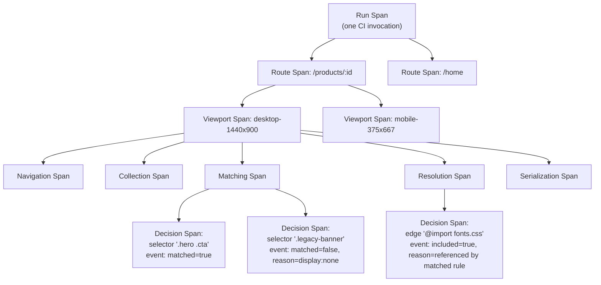
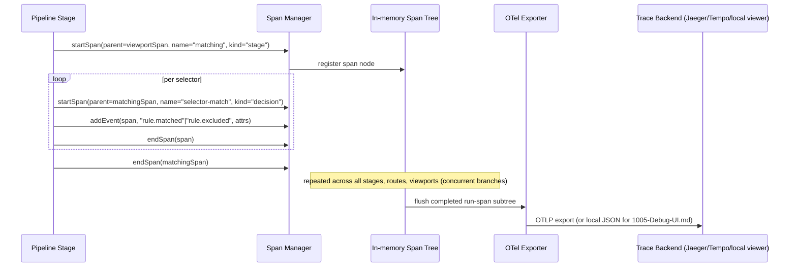
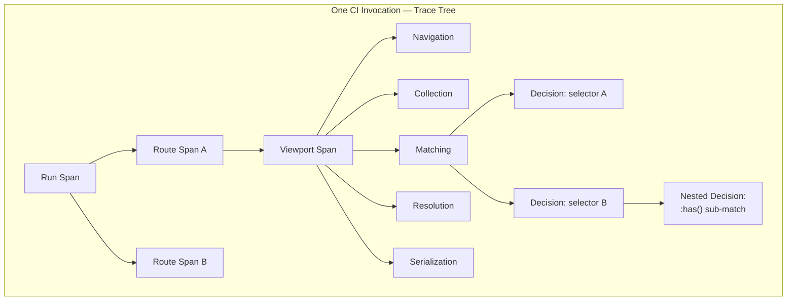

# 1003 — Tracing

## 1. Title

**Critical CSS Extraction Engine — Distributed-Trace-Style Extraction Tracing: Per-Run Span Trees, OpenTelemetry-Compatible Export, and Rule-Inclusion Decision Attribution**

## 2. Version

| Field | Value |
|---|---|
| Document Version | 1.0.0 |
| Status | Draft — Phase 13 (Diagnostics) |
| Last Updated | 2026-07-10 |
| Owners | Diagnostics & Observability Working Group |
| Stability | The `Span` data model and the parent/child nesting contract defined in Section 8 are **stable** and are the interface every stage instrumentation call, every exporter, and every downstream consumer ([1004-Visualization.md](./1004-Visualization.md), [1005-Debug-UI.md](./1005-Debug-UI.md)) must accept. The specific set of decision-event names attached to spans (Section 8.4) may grow over time without being a breaking change. |

## 3. Purpose

`BRIEF.md` §2.12 requires an "extraction trace" among the engine's diagnostics artifacts. §2.14's performance optimizations (rule indexing, selector memoization, parallel stylesheet traversal, worker threads, route batching, streaming output) all introduce *concurrency and nesting* into what would otherwise be a simple linear pipeline: multiple viewports for a route may execute concurrently, multiple routes may batch across worker threads, and within a single `matching` stage, thousands of individual selector-match decisions occur. A single flat duration number per stage ([1002-Metrics.md](./1002-Metrics.md)) tells you *that* something was slow; it cannot tell you *which specific selector, on which specific stylesheet, at which specific nesting depth* was the actual cause, nor can it answer the single most common diagnostic question engineers ask of this tool: **"why is this rule in (or missing from) my critical CSS output?"**

This document defines the tracing system that answers that question: a per-run tree of nested spans, one per pipeline stage/route/viewport/decision, correlated with the Logging ([1001-Logging.md](./1001-Logging.md)) and Metrics ([1002-Metrics.md](./1002-Metrics.md)) systems via a shared `runId`, exported in an OpenTelemetry-compatible wire format so existing trace-viewing tooling (Jaeger, Zipkin, Grafana Tempo) can visualize it without a bespoke viewer — while [1005-Debug-UI.md](./1005-Debug-UI.md) also provides a purpose-built local viewer for the CSS-specific decision events this document attaches to spans.

The problem this layer solves, precisely: **every extraction run must produce a navigable causal record — not just "matching took 340ms" but "selector `.hero .cta` was matched against 3 candidate elements, 1 matched, therefore this rule was included; selector `.legacy-banner` was matched against 0 elements because the banner is `display:none` above the fold, therefore this rule was excluded" — attached to the exact point in the pipeline where that decision was made, and structured so a human or tool can walk from "the final output" backward to "the specific decision that put this byte there."**

## 4. Audience

- Implementers of `packages/tracing`, the shared span-management core that Navigation, Collection, Matching, Resolution, and Serialization stages instrument.
- Engineers debugging "why is rule X in/missing from my critical CSS" support requests or CI regressions — the primary end-user-facing motivation for this document existing at all.
- Authors of [1004-Visualization.md](./1004-Visualization.md) (renders trace trees as interactive flame graphs / waterfall charts) and [1005-Debug-UI.md](./1005-Debug-UI.md) (live, local, per-run trace inspection during development).
- Platform engineers wiring trace export into an existing OpenTelemetry Collector pipeline for teams that already run Jaeger/Tempo/Zipkin for their broader service mesh and want the engine's traces to appear alongside their other service traces.
- Reviewers verifying that new pipeline code correctly opens/closes spans and attaches decision events, rather than silently becoming an unobserved black box within the trace tree.

Readers are assumed to be familiar with distributed tracing concepts (span, trace, parent/child relationship, the W3C Trace Context propagation header format) at the level a backend engineer who has instrumented a microservice with OpenTelemetry would have, plus the extraction pipeline stages from [011-Execution-Pipeline.md](../architecture/011-Execution-Pipeline.md).

## 5. Prerequisites

- [1001-Logging.md](./1001-Logging.md) — structured event log this tracing system correlates with via `runId`; a trace span's start/end is itself typically also logged as a pair of log events, and this document does not duplicate the durability/retention discussion already covered there.
- [1002-Metrics.md](./1002-Metrics.md) — the numeric-only sibling; read that document's Section 8.4 for the exact correlation-key scheme (`runId`/`spanId`) this document extends into a full tree.
- [011-Execution-Pipeline.md](../architecture/011-Execution-Pipeline.md) — the five-stage pipeline whose stages become the top two levels of the span tree.
- [400-Selector-Matching.md](./400-Selector-Matching.md) and [401-Selector-Memoization.md](./401-Selector-Memoization.md) — the specific subsystem whose per-selector decisions are the primary payload of the "why was this rule included" use case this document is built around.
- [500-Dependency-Resolution-Overview.md](./500-Dependency-Resolution-Overview.md) — dependency-graph decisions (a rule pulled in transitively because of an `@import` or a `:has()` relationship) are a second major source of inclusion/exclusion decision events.
- Familiarity with OpenTelemetry's trace data model (Span, SpanContext, Events, Attributes, Links) — this document's export format targets that model directly rather than inventing a parallel one.

## 6. Related Documents

- [1000-Diagnostics-Overview.md](./1000-Diagnostics-Overview.md) — parent document for all Phase 13 diagnostics artifacts, including the "extraction trace" line item this document implements.
- [1001-Logging.md](./1001-Logging.md) — structured event logging; correlated via shared `runId`.
- [1002-Metrics.md](./1002-Metrics.md) — quantitative per-stage timing/counters; correlated via shared `runId`/`spanId`.
- [1004-Visualization.md](./1004-Visualization.md) — renders trace trees as flame graphs/waterfalls.
- [1005-Debug-UI.md](./1005-Debug-UI.md) — interactive local trace inspection, including the "why was this rule included" drill-down this document's decision events power.
- [400-Selector-Matching.md](./400-Selector-Matching.md), [401-Selector-Memoization.md](./401-Selector-Memoization.md) — source of per-selector decision events.
- [500-Dependency-Resolution-Overview.md](./500-Dependency-Resolution-Overview.md) — source of dependency-graph inclusion decision events.
- [011-Execution-Pipeline.md](../architecture/011-Execution-Pipeline.md) — pipeline stages mapped onto the top-level span tree.
- `BRIEF.md` §2.12 (Diagnostics — extraction trace), §2.14 (Performance Optimizations — parallel/worker-thread/route-batching concurrency this document's nesting model must represent).

## 7. Overview

A trace is a tree of `Span` objects rooted at one **run span** (one CI invocation, potentially spanning many routes and viewports). Beneath the run span, the tree branches per route, then per viewport, then per pipeline stage (navigation, collection, matching, resolution, serialization, mirroring [1002-Metrics.md](./1002-Metrics.md)'s five canonical stages), then — uniquely to tracing, not present in the metrics system — per fine-grained decision point within a stage: an individual selector-match attempt, an individual dependency-graph edge resolution, an individual cache lookup. Each span records a start time, an end time, a parent-span pointer, and zero or more **events** — point-in-time annotations attached to the span that record *why* something happened, not just *how long* it took.

This is the load-bearing distinction between this document and [1002-Metrics.md](./1002-Metrics.md): metrics answer "how long, how many, aggregated across many runs, cheaply enough to always be on"; tracing answers "in this one specific run, what exactly happened and why, at a level of detail expensive enough that it may be sampled rather than always-on in production, but always-on in CI and local debugging where the extraction run count is naturally bounded." A span's `matched: boolean` event with attributes `{selector: ".hero .cta", matchedElementCount: 1, reason: "querySelectorAll returned 1 candidate, above fold per Visibility Engine"}` is the atomic unit that lets a debugging engineer answer "why is `.hero .cta` in my output" by finding that one event in the tree — a question the aggregate percentile-only Metrics system cannot answer at all, by design.

Trace export targets the OpenTelemetry wire format (OTLP, or the simpler Jaeger Thrift/JSON if OTLP tooling is unavailable in a given deployment) specifically so that teams already running a trace backend (Jaeger, Tempo, Zipkin) get this engine's traces "for free" in their existing viewer, without the engine needing to ship and maintain its own general-purpose trace visualization — that specialized, CSS-decision-aware visualization is instead the job of [1005-Debug-UI.md](./1005-Debug-UI.md), which layers the "why was this rule included" question directly on top of the generic OTel-compatible span tree this document defines.



## 8. Detailed Design

### 8.1 The `Span` Data Model

```typescript
interface Span {
  runId: string;             // shared with Logging (1001) and Metrics (1002)
  traceId: string;           // OTel-compatible 128-bit trace identifier; derived from runId
  spanId: string;            // OTel-compatible 64-bit span identifier
  parentSpanId?: string;     // absent only for the root run span
  name: string;              // e.g. "matching.selector-match", "resolution.edge-resolve"
  kind: SpanKind;             // "run" | "route" | "viewport" | "stage" | "decision"
  startTime: number;          // epoch ms
  endTime?: number;           // epoch ms; absent while span is open
  attributes: Record<string, string | number | boolean>;
  events: SpanEvent[];        // point-in-time annotations within the span's lifetime
  status: "unset" | "ok" | "error";
}

interface SpanEvent {
  name: string;               // e.g. "rule.matched", "rule.excluded", "cache.hit"
  timestamp: number;
  attributes: Record<string, string | number | boolean>;
}
```

**Why derive `traceId` from `runId` rather than generating an independent identifier?** Alternatives considered: (a) an entirely independent `traceId` generated by the tracing subsystem, requiring an explicit cross-reference table to `runId` for correlation with Logging/Metrics; (b) deriving `traceId` deterministically from `runId` (e.g., a fixed hash/padding scheme that produces a valid 128-bit OTel trace ID from the existing UUIDv4 `runId`). Option (a) is what a from-scratch OTel integration would naturally do, since `runId` predates this document and isn't itself OTel-shaped, but it introduces a second identifier a human must carry around when moving between a log line, a metric data point, and a trace view for the same run — precisely the friction Section 8's correlation design in [1002-Metrics.md](./1002-Metrics.md) exists to eliminate. Option (b), the chosen approach, costs a one-time deterministic transform (documented in Section 11) and guarantees that "grep the logs for `runId=abc123`, look at the metrics for `abc123`, open the trace for `abc123`" is one identifier, one lookup, everywhere.

**Why a five-level `SpanKind` enum (run/route/viewport/stage/decision) rather than unbounded free-form nesting?** Alternatives considered: (a) unbounded nesting depth with no fixed vocabulary, letting each subsystem nest as deeply as it likes; (b) the fixed five-level enum. Unbounded nesting is more flexible — a future subsystem might want to nest decision spans three levels deep (e.g., a decision-within-a-decision for `:has()` relational matching, which itself triggers sub-matches) — but it makes every generic consumer (the OTel exporters, [1004-Visualization.md](./1004-Visualization.md)'s flame graph renderer) unable to assume a fixed depth when laying out a view, and makes "show me all decision spans" a recursive tree walk rather than a flat filter by `kind`. The fixed enum is chosen with an explicit escape hatch: `kind: "decision"` spans may nest arbitrarily deep among themselves (a decision span's children may themselves be `kind: "decision"` spans, e.g., a `:has()` match decision containing nested sub-selector match decisions) — the fixed vocabulary constrains the top four levels (run/route/viewport/stage), which are structurally fixed by the pipeline itself, while leaving genuine flexibility exactly where new complexity (relational pseudo-classes, see [404-Is-Where-Has.md](./404-Is-Where-Has.md)) is expected to appear.

### 8.2 Span Lifecycle and Nesting

A span is opened when its corresponding unit of work begins and closed when it ends, following strict LIFO nesting within a single logical thread of execution (a route/viewport's five-stage sequence) but permitting genuine concurrency across routes/viewports/worker threads, each of which is its own independent branch of the tree rooted at the same run span. This mirrors exactly how a distributed trace across microservices works — concurrent service calls are sibling spans under a common parent, not serialized — except here the "services" are pipeline stages and worker threads within a single logical run rather than network-separated processes.

Opening a span requires: the parent span's `spanId` (or none, for the root); a `name`; a `kind`. Closing a span requires: the span's own reference (returned at open time) and an optional `status`. Attaching an event to an open span (Section 8.4) requires only the span reference and does not affect the span's open/closed state.

### 8.3 Correlation with Logging and Metrics

Every span, on close, MAY emit a corresponding `MetricEvent` duration ([1002-Metrics.md](./1002-Metrics.md) Section 8.1) tagged with the same `spanId` — this is how a dashboard user pivoting from "matching stage p99 spiked" (a metrics view) can jump directly to "show me the trace for that exact span" without a secondary lookup, exactly as described from the Metrics side in that document's Section 8.4. Every span's open/close and every event attached to it MAY also emit a corresponding structured log line ([1001-Logging.md](./1001-Logging.md)) at debug verbosity — spans are the superset of information; logs and metrics are two different lossy projections of the same underlying facts, chosen for their own cost/verbosity tradeoffs (logs are human-readable narration at moderate volume; metrics are numeric-only at minimal volume; traces are complete but highest in volume and therefore, in production long-lived-service deployments, the one signal class that may be sampled — see Section 13).

### 8.4 Decision Events: Attaching "Why" to a Span

The feature that makes tracing uniquely useful for the "why was this rule included/excluded" question is the **decision event**, a `SpanEvent` attached to a `kind: "decision"` span at the exact moment a pipeline stage makes an inclusion/exclusion judgment. Three canonical decision-event families:

1. **Selector-match decisions** (attached within `matching` stage decision spans, one per selector evaluated): `{name: "rule.matched" | "rule.excluded", attributes: {selector, matchedElementCount, cacheHit: boolean, visibilityReason?}}`. When `rule.excluded`, the `visibilityReason` attribute carries the specific cause sourced from the Visibility Engine ([200-Visibility-Engine-Overview.md](./200-Visibility-Engine-Overview.md)) — e.g., `"display:none"`, `"below-fold-per-intersection-observer"`, `"zero-opacity"` — because "the selector matched zero elements" and "the selector matched elements, but none were above the fold" are different causal stories a debugging engineer needs distinguished.
2. **Dependency-graph inclusion decisions** (attached within `resolution` stage decision spans, one per graph edge traversed): `{name: "dependency.included" | "dependency.pruned", attributes: {edgeType: "@import" | "custom-property" | "font-face" | "keyframes", sourceRule, targetRule, reason}}`, sourced from [500-Dependency-Resolution-Overview.md](./500-Dependency-Resolution-Overview.md) — this answers "why is this seemingly-unrelated `@font-face` rule in my critical CSS" (because a matched rule referenced it via `font-family`, and the resolver's edge-inclusion policy propagates dependencies of matched rules).
3. **Cache decisions** (attached within any stage that consults a cache): `{name: "cache.hit" | "cache.miss", attributes: {cacheKey, cacheName: "route-cache" | "selector-memoization"}}` — this is the same raw signal [1002-Metrics.md](./1002-Metrics.md)'s `cache.hits`/`cache.misses` counters aggregate, but here retained per-decision so a specific "why did this run take longer than usual" investigation can see *which* lookups missed, not just how many.

Decision events are deliberately modeled as span **events** (point-in-time, attached to an enclosing span) rather than as their own zero-duration spans, because OTel's data model reserves spans for units of work with meaningful duration and events for instantaneous facts — a selector-match check does have a small duration, but the *decision* about its outcome is the instantaneous fact worth recording; the enclosing `kind: "decision"` span (Section 8.1) is what carries the duration, and the event is what carries the "why."

## 9. Architecture





## 10. Algorithms

### 10.1 Span Creation and Nesting

**Problem statement.** Provide O(1) span creation/closure at arbitrary nesting depth, safe under concurrent creation from multiple worker threads/async branches, while preserving a correct parent/child tree that can later be serialized to OTLP without a separate reconstruction pass.

**Inputs.** A parent span reference (or none, for root), a name, a kind, and, at close time, a status.

**Outputs.** A `Span` object with a unique `spanId`, correctly linked to its parent via `parentSpanId`, appended to the run's in-memory span collection.

**Pseudocode:**

```
function startSpan(parent: Span | null, name: string, kind: SpanKind) -> Span:
    span = Span {
        runId: currentRunId(),                       # O(1), from async-local/thread-local context
        traceId: deriveTraceId(currentRunId()),       # O(1), deterministic transform, see 11
        spanId: generateSpanId(),                     # O(1), random 64-bit
        parentSpanId: parent?.spanId,
        name: name,
        kind: kind,
        startTime: monotonicNowMs(),
        attributes: {},
        events: [],
        status: "unset",
    }
    runSpanCollection.append(span)   # O(1) amortized append to a thread-safe collection
    return span

function endSpan(span: Span, status: "ok" | "error" = "ok"):
    span.endTime = monotonicNowMs()   # O(1)
    span.status = status

function addEvent(span: Span, name: string, attributes: object):
    span.events.append({name, timestamp: monotonicNowMs(), attributes})  # O(1) amortized
```

**Time complexity.** O(1) amortized for every operation (create, close, add event). The tree structure itself is never explicitly walked during creation — it is implicit in each span's `parentSpanId` pointer — so nesting depth does not affect the cost of any individual operation. Building the explicit tree (for export or visualization) is a separate O(S) pass over all S spans in the run, performed once at flush time (Section 10.2), not on the hot path.

**Memory complexity.** O(S) total for a run with S spans, plus O(E) for the total events attached across all spans. For a route with, say, 2,000 CSS rules across 3 viewports, S is on the order of a few thousand decision spans per route — bounded by rule count × viewport count × pipeline stage count, not by anything unbounded like DOM size, since decision spans are created per *selector*, not per *element* (element-level detail, e.g., which of several matched elements were above fold, is carried as event *attributes*, not as additional spans, specifically to keep S linear in rule count rather than in rule count × element count).

**Failure cases.** A span opened but never closed (e.g., an exception thrown mid-stage before `endSpan` runs) — the Span Manager wraps every stage's instrumentation in the same try/finally discipline as [1002-Metrics.md](./1002-Metrics.md)'s `withTiming` helper (Section 11), guaranteeing `endSpan` always runs with `status: "error"` if the wrapped function throws, so the exported trace never contains a span with `endTime: undefined`, which would otherwise render as an infinite-duration span in most trace viewers and corrupt aggregate views.

**Optimization opportunities.** Because decision-span volume (Section 8.4) can be large for stylesheets with many rules, a sampling knob (Section 13) can downsample decision-level spans specifically (e.g., "record full decision detail for the first 100 excluded rules, then sample 1-in-10 thereafter") while always retaining the four higher-level kinds (run/route/viewport/stage) unsampled, since those are cheap (bounded by manifest size × viewport count × 5, not by rule count) and are what most dashboard-level trace navigation depends on.

### 10.2 Tree Reconstruction and OTLP Export

**Problem statement.** Given a flat collection of S spans (each carrying only a `parentSpanId` pointer, not a list of children), reconstruct the explicit parent→children tree and serialize it to OTLP for export.

**Pseudocode:**

```
function buildTreeAndExport(spans: Span[]) -> void:
    byId = indexById(spans)              # O(S)
    childrenOf = new Map()                # spanId -> Span[]
    for span in spans:                    # O(S)
        if span.parentSpanId:
            childrenOf[span.parentSpanId].append(span)   # O(1) amortized
    root = spans.find(s => s.parentSpanId == null)        # O(S), or O(1) if root tracked directly

    otlpBatch = []
    for span in spans:                    # O(S)
        otlpBatch.append(toOtlpSpan(span))   # O(1) per span, pure field mapping
    exporter.send(otlpBatch)              # network I/O, batched
```

**Time complexity.** O(S) — a single linear pass to index, a single linear pass to bucket children, a single linear pass to convert to OTLP wire format. No span is visited more than a constant number of times regardless of tree depth or branching factor, because OTLP itself is a flat list of spans with parent pointers (not a nested JSON tree) — the "tree" is a viewer-side reconstruction concern ([1004-Visualization.md](./1004-Visualization.md), or the trace backend's own UI), not something this exporter needs to materialize as nested structures before sending.

**Memory complexity.** O(S) for the index and children map, released after export completes.

**Failure cases.** Orphaned spans (a `parentSpanId` referencing a span that was somehow dropped, e.g., a partial flush under memory pressure) — the exporter must not fail the entire batch; OTLP tolerates a span whose parent is absent from the current batch (a common occurrence in real distributed tracing when parent and child are exported from different batches/processes), rendering it as a root in the viewer, which is a degraded-but-safe outcome consistent with the Fail-Fast Diagnostics principle's preference for a visibly-incomplete trace over a silently-dropped one.

## 11. Implementation Notes

- `deriveTraceId(runId)`: since `runId` is a UUIDv4 (128 bits) and OTel `traceId` is also 128 bits, the transform is the identity function on the UUID's raw bytes (with hyphens stripped) — no actual hashing is needed, which keeps the derivation trivially reversible for debugging (a human can read a `traceId` in a trace backend and immediately recognize the `runId` it came from).
- `packages/tracing` exposes `startSpan`/`endSpan`/`addEvent` plus a `withSpan(parent, name, kind, fn)` convenience wrapper mirroring [1002-Metrics.md](./1002-Metrics.md)'s `withTiming`, used identically for the same try/finally-safety reason.
- Worker-thread deployments propagate the current span context (the currently-open parent span's `spanId`) across the `postMessage` boundary as a plain serializable field, analogous to W3C Trace Context header propagation across an HTTP boundary in a real distributed system — the worker thread is, conceptually, a "remote service" from the tracing system's point of view, even though it's in-process.
- The default exporter target is a local newline-delimited JSON file (one OTLP-shaped span per line) for CI-archived traces and for [1005-Debug-UI.md](./1005-Debug-UI.md) to read directly without requiring a running Collector; an OTLP/HTTP or OTLP/gRPC exporter is provided as an opt-in for teams with an existing OpenTelemetry Collector endpoint.
- Decision-event attribute values are always primitives (string/number/boolean) per the OTel attribute type constraints — a selector list or a full computed style object is never attached directly as an attribute; where richer payloads are useful (e.g., the full computed style that led to a visibility judgment), the event attribute is a reference/key that [1005-Debug-UI.md](./1005-Debug-UI.md) can look up from the correlated log record ([1001-Logging.md](./1001-Logging.md)), rather than duplicating large payloads into every exported span.

## 12. Edge Cases

- **Concurrent viewports for the same route racing to close their stage spans.** Each viewport's span subtree is independent (their common ancestor is the route span, closed only after all viewport subtrees close), so no cross-viewport ordering constraint exists; the Span Manager's append-only collection is safe under concurrent writers by construction (no read-modify-write on shared state beyond an atomic append).
- **A stage that is skipped entirely for a given route** (e.g., `resolution` is a no-op when there are zero cross-stylesheet dependencies) still opens and closes a zero-or-near-zero-duration span, for the same reason [1002-Metrics.md](./1002-Metrics.md)'s edge cases document zero-duration stage metrics: a missing span is indistinguishable from a crash, whereas a present, brief span is unambiguous.
- **Extremely wide fan-out** (a stylesheet with 50,000 selectors, producing 50,000 decision spans under one `matching` stage span) — the sampling knob (Section 10.1's optimization opportunity, formalized in Section 13) exists specifically for this case; without it, trace volume for a single pathological stylesheet could dwarf trace volume for the rest of a CI run combined.
- **Cross-process worker-thread crash mid-span.** If a worker thread crashes before its open spans are closed and flushed, those spans are permanently lost from that run's trace (not merely delayed) — this is flagged as a known gap addressed by requiring the worker supervisor to detect the crash and inject a synthetic `status: "error"`, `endTime: crashDetectedAt` span closure on the worker's behalf, so the trace at least shows an errored, closed span rather than an invisible gap.
- **Clock non-monotonicity across processes/workers.** As in [1002-Metrics.md](./1002-Metrics.md)'s equivalent edge case, cross-process span nesting relies on parent/child *pointers*, not on comparing timestamps across processes to infer nesting — a child span's `startTime` may, in pathological clock-skew scenarios, appear to precede its parent's `startTime` in absolute terms; viewers should render nesting based on the pointer relationship, not re-derive it from timestamps.
- **A run with only one route and one viewport (local `npx critical-css extract` invocation).** The tree degenerates to run→route→viewport→stage→decision with no sibling branching at the route/viewport levels; this is the common case for [1005-Debug-UI.md](./1005-Debug-UI.md)'s primary use (a developer debugging one page locally), and the tree/export machinery must not assume multi-route fan-out is present.

## 13. Tradeoffs

- **Always-on full-detail tracing (CI/local) vs. sampled tracing (long-lived service deployments).** Chosen: full detail by default, with an opt-in sampling knob targeted specifically at decision-level spans (Section 10.1). Alternative: sample uniformly across all span kinds, as most general-purpose tracing systems default to under high request volume. Tradeoff: this engine's dominant deployment context (CI batch runs, local debugging) has naturally bounded, moderate trace volume where full detail is affordable and, crucially, is exactly what the "why was this rule included" use case needs — sampling at the decision level specifically, rather than uniformly, preserves that use case's fidelity for the routes/viewports that are actually being investigated while still bounding worst-case volume for pathological stylesheets.
- **OTLP as the export target vs. a bespoke trace format.** Chosen: OTLP (or Jaeger-compatible as a fallback). Alternative: define a project-specific trace JSON schema optimized purely for the CSS-decision use case, with no external tooling compatibility goal. Tradeoff: OTLP carries some impedance mismatch (its attribute-type constraints, its span-vs-event distinction) that a bespoke format would not need to accommodate, but the payoff — free interoperability with Jaeger/Tempo/Zipkin/any OTel Collector pipeline a consuming team already operates — is judged worth that friction; the bespoke, CSS-decision-aware view is still built, just at the presentation layer ([1005-Debug-UI.md](./1005-Debug-UI.md)) on top of the standard-shaped underlying data, rather than by forking the wire format itself.
- **Decision-span granularity: one span per selector vs. one span per (selector, candidate element) pair.** Chosen: one span per selector, with per-element detail (which of several matched elements were above fold) folded into event attributes rather than child spans. Alternative: a child decision span per matched element for full fidelity. Tradeoff: element-level spans would make S scale with rule count × average matched-element count rather than just rule count, which for large DOM trees with broad selectors (e.g., a utility-class framework selector matching hundreds of elements) would make trace volume balloon disproportionately to the actual diagnostic value — knowing *that* 340 elements matched and *which one* triggered above-fold inclusion is answerable from event attributes without needing 340 separate spans.
- **Deriving `traceId` from `runId` vs. independent generation.** Already covered in Section 8.1; the tradeoff is one-time correlation simplicity against a very slight loss of "true" independence between the two identifier spaces, judged strongly in favor of correlation simplicity given how central cross-system correlation is to this entire Phase 13 diagnostics suite.

## 14. Performance

- **CPU complexity.** O(1) amortized per span/event operation (Section 10.1); O(S) for tree reconstruction and export at flush time (Section 10.2) — both dwarfed by the actual browser-driven extraction work (navigation, CSSOM traversal, real selector matching against the live DOM) the trace is merely observing.
- **Memory complexity.** O(S + E) for the full in-memory span/event collection of one run, where S is bounded by rule count × viewport count × 5 stages (plus a small constant for run/route/viewport container spans) and E is bounded by the number of decision events, itself bounded by rule count (Section 10.1).
- **Caching strategy.** Not applicable to spans themselves; however, `deriveTraceId` (a pure, cheap function) needs no caching, and the `byId` index built during tree reconstruction (Section 10.2) is discarded after each flush rather than retained, since traces are per-run and not queried repeatedly in-process after export.
- **Parallelization opportunities.** Span creation and event attachment are inherently parallel across concurrent routes/viewports/worker threads (Section 8.2); tree reconstruction (Section 10.2) can itself be parallelized by first partitioning spans by their route-span ancestor (a single O(S) pass) and then reconstructing each route's subtree concurrently, since disjoint route subtrees share no state.
- **Incremental execution.** Unlike Metrics, traces are not typically diffed or merged across incremental CI runs — each run's trace is a complete, self-contained artifact for that run's routes; an incremental run (per [704-Incremental-Extraction.md](./704-Incremental-Extraction.md)) that skips unchanged routes simply produces a smaller trace (fewer route subtrees) rather than needing to merge with a prior run's trace tree, which would raise awkward questions about stitching together traces from different points in time.
- **Profiling guidance.** When investigating a slow `matching` stage flagged by Metrics ([1002-Metrics.md](./1002-Metrics.md)), pivot to the trace for that exact `spanId` and look for either (a) an unusually large number of `cache.miss` decision events (pointing at a cache invalidation regression, [805-Cache-Invalidation.md](./805-Cache-Invalidation.md)) or (b) an unusually deep nested-decision subtree under a `:has()`-driven relational selector (pointing at combinatorial matching cost, [404-Is-Where-Has.md](./404-Is-Where-Has.md)) — the trace is what disambiguates these two very different root causes that would look identical in the aggregate metrics view alone.
- **Scalability limits.** Full-detail tracing scales comfortably to the CI batch-run scale this engine primarily targets (hundreds of routes, low thousands of rules per stylesheet); the decision-level sampling knob (Section 13) is the documented lever once either dimension grows an order of magnitude further, or once the engine is deployed as a high-request-volume long-lived service (Section 16).

## 15. Testing

- **Unit tests.** `startSpan`/`endSpan`/`addEvent` lifecycle correctness (parent linkage, monotonic ordering, try/finally closure under a thrown exception); `deriveTraceId` determinism and round-trip readability; decision-event attribute-type validation (rejecting a non-primitive attribute value at the API boundary rather than silently serializing something OTLP will reject downstream).
- **Integration tests.** A full pipeline run against the existing fixture corpus (Tailwind, Bootstrap, CSS Modules, per `BRIEF.md` §2.15) asserting the resulting span tree has the expected shape (one run span, N route spans, N×M viewport spans, N×M×5 stage spans, and a decision-span count matching the known rule count of each fixture) and that every decision span's event correctly identifies a rule known (from the fixture's expected output) to be included or excluded.
- **Visual tests.** Not this document's concern directly; covered by [1004-Visualization.md](./1004-Visualization.md)'s flame-graph rendering tests.
- **Stress tests.** A synthetic stylesheet with 50,000 selectors to validate the sampling knob correctly bounds decision-span volume while the higher-level (run/route/viewport/stage) spans remain fully present and correctly linked.
- **Regression tests.** A golden OTLP JSON export fixture for a fixed small fixture page, diffed on every change to the span model or exporter, analogous to [1002-Metrics.md](./1002-Metrics.md)'s golden `RunReport` — catching accidental span-shape or attribute-naming drift that would silently break external trace-backend compatibility.
- **Benchmark tests.** Micro-benchmarks for `startSpan`/`endSpan`/`addEvent` overhead (must remain negligible relative to the real selector-matching work being traced, avoiding the same observer-effect risk flagged in [1002-Metrics.md](./1002-Metrics.md)) and for `buildTreeAndExport` wall time across span counts from hundreds to tens of thousands, validating the O(S) model.

## 16. Future Work

- **Full OpenTelemetry SDK adoption.** This document's `Span`/`SpanEvent` model is deliberately a minimal subset of the OTel SDK's richer API (Links, multiple-parent spans for fan-in scenarios, baggage propagation); a future revision may replace the custom `packages/tracing` core with the actual `@opentelemetry/api` SDK once the project's PHP 5.6-adjacent-in-spirit "keep dependencies minimal" constraint (this being a Node/browser-automation project, not the legacy PHP Shiksha codebase, but still favoring a lean dependency graph per [006-Design-Principles.md](../architecture/006-Design-Principles.md)) is judged worth relaxing for this subsystem specifically.
- **Adaptive sampling based on Metrics feedback.** Rather than a static decision-level sampling rate (Section 13), a future version could dynamically raise sampling detail for routes/viewports that [1002-Metrics.md](./1002-Metrics.md) flags as regressed (p95 spike), giving full trace detail exactly where it is most likely to be needed and minimal detail elsewhere — a closed loop between the two sibling diagnostics systems.
- **Trace-based automated regression bisection.** Given two `RunReport`s (before/after a code change) showing a regression, and the corresponding traces for both, a future tool could automatically diff the two decision-event sequences for a given route/selector to highlight exactly which decision flipped (e.g., a selector that used to hit the memoization cache now misses) — turning a currently-manual trace comparison into an automated regression bisector.
- **Long-lived-service trace volume management.** As flagged in Section 13/14, if the engine moves toward a persistent SSR-adapter deployment ([900-SSR-Overview.md](./900-SSR-Overview.md)) handling continuous request volume rather than batch CI runs, the always-on full-detail tracing default should be revisited in favor of head-based or tail-based sampling strategies standard in production distributed tracing, likely arriving together with the OTel SDK adoption above.
- **Cross-run trace comparison UI.** A natural [1005-Debug-UI.md](./1005-Debug-UI.md) feature: loading two traces (e.g., last known-good vs. current) side by side and visually diffing the decision-event sets per route, rather than requiring an engineer to manually read two separate flame graphs and mentally diff them.

## 17. References

- [1000-Diagnostics-Overview.md](./1000-Diagnostics-Overview.md)
- [1001-Logging.md](./1001-Logging.md)
- [1002-Metrics.md](./1002-Metrics.md)
- [1004-Visualization.md](./1004-Visualization.md)
- [1005-Debug-UI.md](./1005-Debug-UI.md)
- [011-Execution-Pipeline.md](../architecture/011-Execution-Pipeline.md)
- [006-Design-Principles.md](../architecture/006-Design-Principles.md)
- [400-Selector-Matching.md](./400-Selector-Matching.md), [401-Selector-Memoization.md](./401-Selector-Memoization.md), [404-Is-Where-Has.md](./404-Is-Where-Has.md)
- [200-Visibility-Engine-Overview.md](./200-Visibility-Engine-Overview.md)
- [500-Dependency-Resolution-Overview.md](./500-Dependency-Resolution-Overview.md)
- [805-Cache-Invalidation.md](./805-Cache-Invalidation.md)
- [704-Incremental-Extraction.md](./704-Incremental-Extraction.md)
- [900-SSR-Overview.md](./900-SSR-Overview.md)
- `BRIEF.md` §2.12 (Diagnostics), §2.14 (Performance Optimizations), §2.15 (Testing Strategy)
- OpenTelemetry Tracing Specification (`https://opentelemetry.io/docs/specs/otel/trace/`)
- W3C Trace Context specification (`https://www.w3.org/TR/trace-context/`)
- Jaeger Thrift/JSON trace format documentation (`https://www.jaegertracing.io/docs/`)
