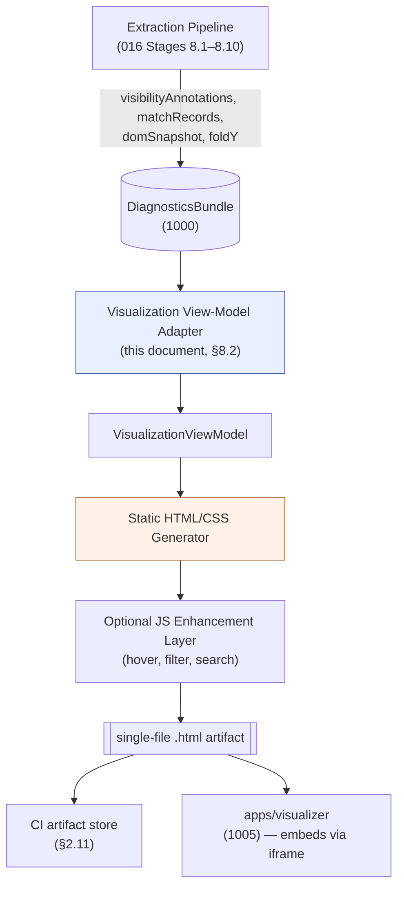
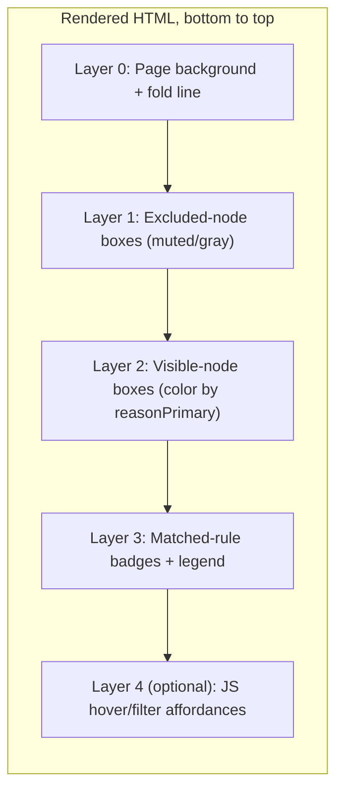
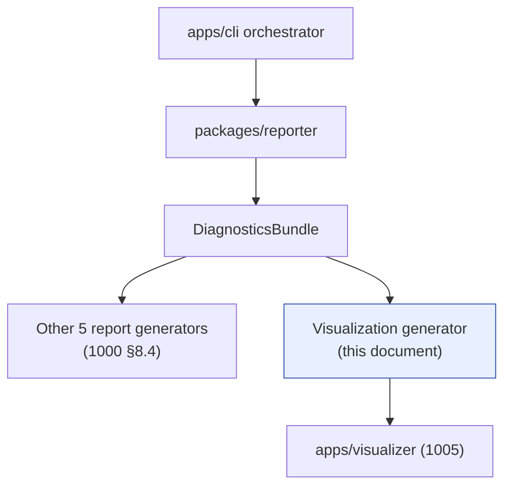

# 1004 — Visualization

## 1. Title

**Critical CSS Extraction Engine — Diagnostic HTML Visualization: Fold-Overlay and Matched-Rule Rendering**

## 2. Version

| Field | Value |
|---|---|
| Document Version | 1.0.0 |
| Status | Draft — Phase 13 (Diagnostics) |
| Last Updated | 2026-07-10 |
| Owners | Diagnostics Working Group |
| Stability | The data-model boundary (this document consumes the `DiagnosticsBundle` defined in [1000-Diagnostics-Overview.md](./1000-Diagnostics-Overview.md) and produces zero new facts) is stable. The rendering format (single-file HTML/CSS, with an optional embedded JS layer) is a Draft posture and may be revisited once `apps/visualizer` (Section 6, and [1005-Debug-UI.md](./1005-Debug-UI.md)) ships and real usage data on the static artifact exists. |

## 3. Purpose

BRIEF.md Section 2.12 lists, among six mandatory diagnostic reports, one item marked optional: "Optional HTML visualization highlighting above-fold nodes and matched rules." This document specifies that visualization precisely enough to implement it: what it renders, what data it consumes, how it is generated, and — because it is explicitly optional — why it is worth building at all given that every fact it displays is already available in the six other reports as structured data.

The answer this document gives, elaborated in Section 7, is that structured reports (JSON dependency graphs, CSV-shaped selector tables, timing traces) are excellent for programmatic consumption and CI gating, but they are poor for the single highest-value diagnostic question a human asks when critical CSS extraction produces a surprising result: *"why does the engine think this element is above the fold, and which rules does it think apply to it?"* That question is fundamentally spatial and visual — it is about the *page*, not about a table row — and no amount of structured-report literacy substitutes for looking at an annotated picture of the page with the fold line drawn on it. This document exists to make that picture reproducible, deterministic, and inspectable without opening a browser devtools session against a since-changed live page.

This document does not specify:
- The underlying visibility classification algorithm (a term of the predicate defined in [200-Visibility-Engine-Overview.md](./200-Visibility-Engine-Overview.md) Section 7.1) — this document only *renders* the classification's output, it does not compute it.
- The selector-matching algorithm that produces matched-rule records — that is [400-Selector-Matching.md](./400-Selector-Matching.md)'s subject; this document renders its output.
- The `DiagnosticsBundle` schema, its assembly, or the other five report types it backs — that is [1000-Diagnostics-Overview.md](./1000-Diagnostics-Overview.md)'s subject, which this document depends on as a fixed upstream contract.
- The interactive multi-run browsing experience (route picker, side-by-side render, dependency-graph explorer) — that is `apps/visualizer`, specified in [1005-Debug-UI.md](./1005-Debug-UI.md). This document's output is one artifact `apps/visualizer` can embed (Section 8.6), but this document's scope is the single-run, single-artifact case: one HTML file per (route, viewport, mode) extraction.

## 4. Audience

- Implementers of the Reporter (`packages/reporter`) who add a `renderVisualization()` capability alongside the module's five other report generators.
- Engineers debugging a specific extraction result — "this above-the-fold hero image's CSS didn't make it into the critical bundle, why?" — who need a concrete artifact to open in a browser, not a log to grep.
- Implementers of `apps/visualizer` ([1005-Debug-UI.md](./1005-Debug-UI.md)), who embed this document's static output as one view inside a larger multi-run browsing UI and need to know this artifact's exact data dependencies and file shape to embed it without re-deriving it.
- CI/CD pipeline authors (BRIEF.md Section 2.11) deciding whether to publish this artifact alongside the mandatory reports for failed or flagged builds.
- Reviewers evaluating a proposed change to the Visibility Engine or Selector Matcher, who should be able to render this visualization for a fixture page before and after the change as a fast, high-bandwidth correctness check that complements unit tests.

Readers should already be familiar with [200-Visibility-Engine-Overview.md](./200-Visibility-Engine-Overview.md) Section 7.1's canonical visibility predicate and its six contributing sub-engines (201–207), with [400-Selector-Matching.md](./400-Selector-Matching.md)'s notion of a matched-rule record, and with [1000-Diagnostics-Overview.md](./1000-Diagnostics-Overview.md)'s `DiagnosticsBundle` as the single upstream data contract every Phase 13 report — including this one — renders from.

## 5. Prerequisites

- [1000-Diagnostics-Overview.md](./1000-Diagnostics-Overview.md) — the `DiagnosticsBundle` DTO, the Reporter module boundary, and the principle that every report (including this visualization) is a pure, side-effect-free projection of that bundle, never a second computation path.
- [200-Visibility-Engine-Overview.md](./200-Visibility-Engine-Overview.md) Section 7.1 — the visibility predicate and its per-node `reasonPrimary`/`reasonChain` classification vocabulary (geometry, intersection, overflow-clip, transform, sticky, fixed), which this document's color-coding legend (Section 8.3) renders directly.
- [400-Selector-Matching.md](./400-Selector-Matching.md) — the shape of a matched-rule record (`nodeId`, `ruleId`, specificity, source stylesheet) that this document's per-node highlight and legend consume.
- [106-DOM-Snapshot.md](./106-DOM-Snapshot.md) Section 8.2 — the `DomSnapshot`/`DomNodeRecord` structure (bounding boxes, computed-style allow-list) that supplies this document's overlay geometry; this document performs no new browser interrogation.
- [105-Viewport-Manager.md](./105-Viewport-Manager.md) Section 8.3 — fold computation, whose output scalar this document draws as a horizontal line.
- [1002-Metrics.md](./1002-Metrics.md) and [1003-Tracing.md](./1003-Tracing.md) — optional but recommended reading for the size/timing annotations this visualization may surface per node (Section 8.7), since those numbers originate there, not here.
- Working familiarity with generating self-contained HTML/CSS artifacts (inline styles, data URIs) without a build step, and with the general shape of "DOM mirror" debugging tools (browser devtools' own inspector overlay, Percy/Chromatic visual-diff overlays) as a point of prior art this design deliberately does not reinvent from scratch.

## 6. Related Documents

- [1000-Diagnostics-Overview.md](./1000-Diagnostics-Overview.md) — upstream `DiagnosticsBundle` contract and Reporter module charter.
- [1001-Logging.md](./1001-Logging.md) — structured logging this visualization's generation step emits (e.g., "visualization skipped: node count exceeds cap") for operational visibility into the optional feature's own health.
- [1002-Metrics.md](./1002-Metrics.md) — per-node and per-stylesheet size/timing metrics optionally annotated onto the overlay (Section 8.7).
- [1003-Tracing.md](./1003-Tracing.md) — extraction trace spans; the visualization can embed a per-node "computed during span X" backlink for cross-navigation into a trace viewer.
- [1005-Debug-UI.md](./1005-Debug-UI.md) — `apps/visualizer`, the multi-run interactive application that embeds this document's per-run artifact as one of several views.
- [200-Visibility-Engine-Overview.md](./200-Visibility-Engine-Overview.md) and its six siblings (201–207) — the source of every visibility-reason classification this document colors and labels.
- [400-Selector-Matching.md](./400-Selector-Matching.md) — the source of every matched-rule record this document highlights.
- [500-Dependency-Resolution-Overview.md](./500-Dependency-Resolution-Overview.md) — the dependency graph that determines which *rules* a node's matched selectors pull transitively into the critical bundle; referenced for the "why is this rule here" drill-down (Section 12).
- [106-DOM-Snapshot.md](./106-DOM-Snapshot.md), [105-Viewport-Manager.md](./105-Viewport-Manager.md) — geometry and fold-boundary sources.
- [006-Design-Principles.md](../architecture/006-Design-Principles.md) — Principle 5 (Determinism) and Principle 6 (Diagnosability by Default), both of which this document operationalizes directly.

## 7. Overview

### 7.1 Why a visualization, given six structured reports already exist

BRIEF.md Section 2.12's other five reports — dependency graph, matched selector report, unmatched selector report, stylesheet contribution report, timing report, extraction trace — are all naturally tabular or graph-shaped data. A human can `jq` them, diff them across builds, or feed them into a CI gate. But every one of them answers a *rule-centric* or *timing-centric* question ("which rules matched," "how long did stage N take"). None of them, on their own, answers the *node-centric, spatial* question that is usually the actual trigger for opening a diagnostic session in the first place: "I looked at the rendered page and this specific visible element's styling broke after the critical-CSS build — what does the engine think is true about *this element*, right here, on the page?"

Answering that question from the matched-selector JSON report alone requires a human to mentally re-render the page: reading `nodeId: "n482"` and picturing where on the page that opaque identifier sits, cross-referencing its bounding box coordinates by hand, and repeating for every node of interest. This is exactly the kind of translation work computers do better than humans, and BRIEF.md Section 2.12 flags it as worth doing — optionally, because it is genuinely more expensive to build and maintain than a JSON serializer, and because (per Section 13) not every CI consumer needs it.

### 7.2 What the visualization is, precisely

The visualization is a **single, self-contained HTML file** per (route, viewport, mode) extraction, produced on demand from an already-computed `DiagnosticsBundle` (never from a fresh browser session), that renders:

1. A **DOM-mirror overlay**: one absolutely-positioned box per node present in the `DomSnapshot`, positioned and sized using the same bounding-box coordinates the Visibility Engine itself used, in the same coordinate space ([201-Geometry-Engine.md](./201-Geometry-Engine.md)'s normalized document space).
2. A **fold line**: a single horizontal rule drawn at the fold's y-coordinate ([105-Viewport-Manager.md](./105-Viewport-Manager.md) Section 8.3's output), with a light shaded region below it.
3. **Color-coded borders/fills per visibility reason**: every node classified as above-the-fold-visible is outlined in a color keyed to its `reasonPrimary` (Section 8.3's palette: geometry, intersection, sticky, fixed — matching [200-Visibility-Engine-Overview.md](./200-Visibility-Engine-Overview.md)'s taxonomy), and nodes excluded by overflow-clipping or `display:none`/`visibility:hidden` are rendered in a muted "excluded" style rather than omitted, so their *absence from the critical set* is itself visible and explained.
4. **Matched-rule highlighting**: nodes with one or more matched selectors carry a visual marker (Section 8.4) and, on the same page, a companion data table mapping each visible node to its matched rule IDs, selector text, source stylesheet, and specificity — reusing exactly the matched-selector report's records ([1000-Diagnostics-Overview.md](./1000-Diagnostics-Overview.md)), not recomputing them.
5. A **legend** explaining the color/marker vocabulary, so the artifact is self-describing without this document open beside it.

### 7.3 What the visualization deliberately is not

- It is **not** a pixel-faithful screenshot. It does not attempt to reproduce fonts, images, gradients, or exact anti-aliasing — it reproduces *box geometry and classification*, which is what the diagnostic question actually needs. Section 13 discusses the screenshot-underlay alternative and why it is deferred rather than adopted as the default.
- It is **not** a second visibility-computation path. Every color, every included/excluded box, every matched-rule label is a direct rendering of a `DiagnosticsBundle` field already computed by the real pipeline. If the visualization ever disagreed with the JSON matched-selector report for the same run, that would be a rendering bug in this module, never a "second opinion" — Principle 5 (Determinism) and Principle 6 (Diagnosability by Default) both require that diagnostics be a faithful window onto one computation, not an independent one.
- It is **not**, by default, a live/interactive browser session against the original page. Section 8.1 discusses the static-vs-interactive rendering-approach decision in full; the short version is that the *default* output is inert HTML+CSS that renders correctly with JavaScript disabled, with an optional embedded vanilla-JS enhancement layer for interactive exploration when the consumer's environment permits it.

## 8. Detailed Design

### 8.1 Rendering approach: static HTML+CSS overlay, optional embedded JS widget

Two candidate rendering approaches were considered:

- **Static HTML+CSS overlay only.** The Reporter emits one `.html` file containing inline `<style>` and absolutely-positioned `<div>` elements, no `<script>` tag at all. Every fact (which node, what color, what matched rules) is baked into markup and CSS classes at generation time.
- **Interactive JS widget.** The Reporter emits an HTML file with an embedded vanilla-JS layer that supports hover tooltips (show matched rules for the node under the cursor), toggleable visibility-reason layers (hide/show `sticky`-colored boxes independently of `fixed`-colored ones), and a search box to jump to a node by CSS selector or matched rule.

The chosen design ships **both, layered**: the static markup and CSS are the load-bearing, always-present layer (every fact is visible without JS), and a small (`<20KB` uncompressed, zero external dependencies) inline `<script>` is added by default to upgrade hover/toggle/search interactions where the artifact is opened in a normal browser tab. This is a progressive-enhancement posture, not an either/or:

- **Why static-first is non-negotiable.** This artifact must be attachable to a CI job, opened from an email, previewed inside artifact-storage UIs (GitLab/GitHub's own HTML preview, if sandboxed, frequently strips `<script>` tags or executes them in a locked-down frame with unpredictable behavior), or archived for months and still be legible. A visualization whose *legend and highlighting* only appear when JavaScript runs is not diagnostically trustworthy in exactly the contexts (a CI artifact browser, a security-hardened viewer) it most needs to work in.
- **Why the interactive layer is still worth including.** With dozens or hundreds of visible nodes, a fully static page becomes visually noisy — every matched rule listed inline for every node is unreadable. Hover-to-reveal and click-to-filter meaningfully improve usability when JS is available, and because they are strictly additive (they never *remove* static information, only add affordances to navigate it), there is no correctness cost to including them.
- **Alternative rejected: a small React/Vue single-page bundle.** This would allow richer interaction (search, virtualized rendering of huge node counts) but reintroduces a build step and a framework runtime dependency into what is otherwise a dependency-free `packages/reporter` output, and it is disproportionate for a single-run artifact. `apps/visualizer` ([1005-Debug-UI.md](./1005-Debug-UI.md)) is where that investment belongs, because it amortizes across many runs; a per-run artifact should stay minimal.

### 8.2 Data model: a pure projection of the `DiagnosticsBundle`

This document defines no new upstream data; it defines the *view model* that adapts [1000-Diagnostics-Overview.md](./1000-Diagnostics-Overview.md)'s `DiagnosticsBundle` into renderable shape:

```
interface DiagnosticsBundle {                     // defined in 1000, reproduced here as the sole input
  route: RouteDescriptor
  viewportProfile: ViewportProfile
  mode: 'cssom' | 'coverage' | 'hybrid'
  domSnapshot: DomSnapshot                        // 106
  foldY: number                                   // 105 §8.3
  visibilityAnnotations: Record<NodeId, VisibilityAnnotation>
  matchRecords: Record<NodeId, MatchedRuleRecord[]>
  ruleRegistry: Record<RuleId, RuleMeta>          // selector text, source stylesheet, specificity
  dependencyGraph: DependencyGraphSummary          // 500, referenced not embedded
}

interface VisibilityAnnotation {                  // produced by 200-series sub-engines
  visible: boolean
  reasonPrimary: 'geometry' | 'intersection' | 'sticky' | 'fixed' | 'overflow-clip' | 'display-none' | 'hidden' | 'transform-offscreen'
  reasonChain: string[]                            // full predicate trace, e.g. ["intersection:pass","sticky:override"]
}

interface MatchedRuleRecord {
  ruleId: string
  specificity: [number, number, number]
  sourceStylesheet: string
}

interface RuleMeta {
  selectorText: string
  sourceStylesheet: string
  mediaContext?: string                            // 303
  layerContext?: string                            // 305
}

// The view model this document constructs from the bundle above:
interface VisualizationViewModel {
  nodes: VisNode[]                                 // one per DomSnapshot node, filtered per 8.5
  legend: LegendEntry[]                             // static, derived from the reasonPrimary enum
  foldY: number
  viewport: { width: number; height: number }
  matchTable: MatchTableRow[]                       // flattened nodeId → rule rows for the companion table
}

interface VisNode {
  id: NodeId
  box: { x: number; y: number; width: number; height: number }   // 201's normalized coordinate space
  visible: boolean
  reasonPrimary: VisibilityAnnotation['reasonPrimary']
  matchedRuleCount: number
  tagName: string                                   // for the legend/tooltip label only, not for matching
}
```

The adapter that builds `VisualizationViewModel` from `DiagnosticsBundle` is the entirety of this module's own logic (Section 10); it performs no geometry computation, no visibility re-evaluation, and no selector re-matching. It is, deliberately, "dumb" in the same sense [800-Cache-Overview.md](./800-Cache-Overview.md) Section 7.3 uses the word for the Cache Manager: a thin, testable, side-effect-free transform whose correctness is trivially checkable by construction (every field traces to exactly one `DiagnosticsBundle` field).

### 8.3 Color-coding taxonomy: one color per `reasonPrimary`

The palette is fixed and documented in the legend, mirroring [200-Visibility-Engine-Overview.md](./200-Visibility-Engine-Overview.md)'s sub-engine decomposition one-to-one so a reader who has read that document recognizes the vocabulary immediately:

| `reasonPrimary` | Color (default theme) | Sub-engine source |
|---|---|---|
| `geometry` | Blue outline | [201-Geometry-Engine.md](./201-Geometry-Engine.md) |
| `intersection` | Green outline | [202-Intersection-Engine.md](./202-Intersection-Engine.md) |
| `sticky` | Purple outline | [205-Sticky-Elements.md](./205-Sticky-Elements.md) |
| `fixed` | Orange outline | [206-Fixed-Elements.md](./206-Fixed-Elements.md) |
| `overflow-clip` (excluded) | Gray, dashed, low-opacity fill | [203-Overflow-Handling.md](./203-Overflow-Handling.md) |
| `transform-offscreen` (excluded) | Gray, dotted outline | [204-Transform-Handling.md](./204-Transform-Handling.md) |
| `display-none` / `hidden` (excluded) | Not rendered as a box; listed in a collapsed "excluded, non-rendered" summary row | computed-style read, [200-Visibility-Engine-Overview.md](./200-Visibility-Engine-Overview.md) §7.1 |

Note that `reasonPrimary` is the *first* term in the predicate conjunction that determined the node's classification, not necessarily the "most important" one semantically — Section 8.2's `reasonChain` field carries the full trace (e.g., a node might pass `intersection` but be excluded by `overflow-clip`), and both the static table and the interactive tooltip surface the full chain, not just the primary color. The single-color-per-box constraint is a rendering necessity (a `<div>` has one outline), not a claim that visibility has only one cause; this is stated explicitly in the legend to avoid the artifact being misread as claiming visibility is single-cause when [200-Visibility-Engine-Overview.md](./200-Visibility-Engine-Overview.md) §7.1 explicitly models it as a conjunction of independent terms.

### 8.4 Matched-rule highlighting

Every `VisNode` with `matchedRuleCount > 0` receives a small numeric badge (e.g., a corner label "3 rules") rendered via CSS `::after` content — no JS required for the badge itself. The companion `matchTable` beneath the overlay lists, per visible node: node tag/id, matched rule count, and an expandable (in the JS-enhanced build; a plain `<details>` element in the static-only build, which needs no JS at all since `<details>`/`<summary>` is native HTML) list of `{selectorText, sourceStylesheet, specificity}` triples drawn straight from `ruleRegistry`.

This is a deliberate detail: using `<details>`/`<summary>` for the expandable per-node rule list means the "interactive" affordance of expand/collapse requires **zero JavaScript** — it is native to HTML5. The embedded `<script>` layer (Section 8.1) is reserved for affordances that genuinely need scripting (hover-linking a table row to its overlay box, live text search/filter across nodes), keeping the JS surface as small as the "optional enhancement, not required for correctness" posture demands.

### 8.5 Node inclusion policy and the size cap

Rendering one absolutely-positioned `<div>` per `DomSnapshot` node is fine for typical pages (hundreds to low thousands of nodes) but becomes both visually useless and browser-taxing for pages with tens of thousands of nodes (BRIEF.md Section 2.15's "huge enterprise stylesheets" fixture category implies correspondingly large pages in some deployments). The policy:

1. Below a configurable node-count threshold (default 4,000), render every node.
2. Above the threshold, render every **visible** node unconditionally (these are the diagnostically interesting ones — above-the-fold classification is exactly what a reader came to inspect) and render a **sampled** subset of excluded nodes (default: every Nth excluded node, N chosen so the total excluded-node count rendered stays under a second cap, default 2,000) with an explicit banner: "N of M excluded nodes shown; full list available in the JSON `DiagnosticsBundle`." This keeps the artifact both honest (it says what it omitted) and usable (it never silently truncates the diagnostically load-bearing "why is this visible" information).
3. If even the visible-node count alone exceeds a hard ceiling (default 20,000), generation fails closed with a clear message rather than producing a multi-hundred-megabyte, browser-crashing HTML file; the JSON reports remain available regardless, since they have no such rendering ceiling.

### 8.6 Single-file packaging

The output is one `.html` file with all CSS inlined in a `<style>` block and all JS (if enabled) inlined in a `<script>` block — no external `.css`/`.js`/image assets, no CDN references, matching the same "self-contained artifact" posture as this documentation's own Artifact-publishing convention. This is required, not merely convenient: CI artifact stores frequently serve a single HTML file at an isolated path with no sibling assets reachable, and a visualization that 404s on an external stylesheet the moment it is moved off local disk is not a reliable diagnostic tool. `apps/visualizer` ([1005-Debug-UI.md](./1005-Debug-UI.md)) can still embed this file (via `<iframe srcdoc="...">` or a same-origin `<iframe src="...">`) without needing to unpack or rehost anything.

### 8.7 Optional metric/trace annotations

When [1002-Metrics.md](./1002-Metrics.md) and [1003-Tracing.md](./1003-Tracing.md) data is present in the bundle (it is optional upstream — a minimal `DiagnosticsBundle` need not carry it), the visualization may additionally annotate: per-stylesheet contribution size on hover over a matched rule's source, and a "computed during span `matcherPhase#3`" backlink label that, in `apps/visualizer`'s embedded context, is a clickable deep link into the timing waterfall (Section 12 of [1005-Debug-UI.md](./1005-Debug-UI.md)). In the standalone static file, this backlink renders as plain (non-clickable) text, since the waterfall view does not exist as a target outside `apps/visualizer`.

## 9. Architecture

### 9.1 Visualization data pipeline



The diagram makes the "pure projection" claim from Section 8.2 structurally visible: exactly one arrow enters the module (`BUNDLE → ADAPT`), and the adapter has no back-edge into the extraction pipeline — it cannot request re-computation, only re-render what already exists.

### 9.2 Node classification rendering as a layered composition



Layering bottom-to-top mirrors the predicate's own conjunction order intuitively: geometry/fold is the substrate everything else is tested against, exclusions are shown before inclusions so an included box always visually "wins" the stacking order at a given pixel, and interactivity is the topmost, optional, subtractable layer.

### 9.3 Module placement



The visualization generator is a sibling of the other five report generators inside `packages/reporter`, not a separate package — it shares the same input contract and the same "optional, pure projection" posture, differing only in output format (HTML instead of JSON/CSV) and in being opt-in by default (Section 11).

## 10. Algorithms

### 10.1 Algorithm: bundle-to-view-model projection

**Problem statement.** Given a `DiagnosticsBundle`, produce a `VisualizationViewModel` containing exactly the fields the HTML generator needs, applying the node-inclusion policy (Section 8.5) so oversized pages degrade gracefully rather than producing unusable or unbounded output.

**Inputs.** `bundle: DiagnosticsBundle`, `config: { nodeCap: number, excludedSampleCap: number, hardCeiling: number }`.

**Outputs.** `VisualizationViewModel` or a `VisualizationSkipped` result (with a logged reason, per [1001-Logging.md](./1001-Logging.md)) if the hard ceiling is exceeded.

**Pseudocode.**
```
function buildViewModel(bundle, config) -> VisualizationViewModel | VisualizationSkipped
    visibleNodes = []
    excludedNodes = []
    for node in bundle.domSnapshot.nodes:                      // O(n)
        ann = bundle.visibilityAnnotations[node.id]
        if ann.visible:
            visibleNodes.push(toVisNode(node, ann, bundle.matchRecords[node.id]))
        else if ann.reasonPrimary not in ('display-none', 'hidden'):
            excludedNodes.push(toVisNode(node, ann, []))
        // display-none/hidden nodes are never boxed; counted only in a summary row

    if len(visibleNodes) > config.hardCeiling:
        log(WARN, "visualization skipped: visible node count exceeds hard ceiling", ...)
        return VisualizationSkipped(reason = "hard-ceiling-exceeded")

    if len(visibleNodes) + len(excludedNodes) > config.nodeCap:
        excludedNodes = sample(excludedNodes, targetSize = config.excludedSampleCap)  // O(k)
        truncationBanner = true
    else:
        truncationBanner = false

    matchTable = flattenMatchRecords(visibleNodes, bundle.ruleRegistry)   // O(m), m = total matched rules

    return VisualizationViewModel(
        nodes = visibleNodes ++ excludedNodes,
        legend = STATIC_LEGEND,
        foldY = bundle.foldY,
        viewport = bundle.viewportProfile.dimensions,
        matchTable = matchTable,
        truncationBanner = truncationBanner
    )
```

**Time complexity.** `O(n + m)` where `n` is the `DomSnapshot` node count and `m` is the total number of matched-rule records across all visible nodes. The sampling step is `O(k)` for a target sample size `k`, dominated by `O(n)` overall.

**Memory complexity.** `O(n + m)` for the view model, held transiently during generation; no persistent state is retained by this module between runs (it is stateless per invocation).

**Failure cases.**
- *Hard ceiling exceeded* — degrades to `VisualizationSkipped` rather than producing a file that crashes a browser tab; the five mandatory JSON reports are unaffected and remain the source of truth.
- *Missing `matchRecords` for a visible node* (should not happen if the Matcher ran to completion, but the bundle assembly in 1000 tolerates partial data for crashed pipelines) — treated as zero matched rules, not an error, so a partial bundle still yields a partial-but-honest visualization.
- *`foldY` absent* (viewport profile misconfigured) — generation fails with a clear error; a visualization without a fold line is not the degraded-but-useful case, it is a config bug that should surface immediately.

**Optimization opportunities.** Pre-sorting nodes by `y` coordinate once (`O(n log n)`) allows the HTML generator to emit boxes in paint order without an extra pass, and allows a future streaming generator (Section 16) to emit above-the-fold boxes first for progressive rendering of very large files.

### 10.2 Algorithm: static HTML/CSS emission

**Problem statement.** Given a `VisualizationViewModel`, emit a single self-contained HTML string.

**Inputs.** `VisualizationViewModel`.
**Outputs.** `string` (complete HTML document).

**Pseudocode.**
```
function renderHtml(vm) -> string
    css = buildInlineCss(vm.legend)                       // O(1), fixed palette + generated per-node position rules
    boxesHtml = ""
    for node in vm.nodes:                                  // O(n)
        boxesHtml += renderBoxDiv(node)                     // absolutely-positioned div, inline style for x/y/w/h
    foldHtml = renderFoldLine(vm.foldY)
    tableHtml = renderMatchTable(vm.matchTable)             // O(m)
    legendHtml = renderLegend(vm.legend)
    js = ENABLE_JS ? buildEnhancementScript() : ""          // fixed-size template, O(1)
    return assembleDocument(css, boxesHtml, foldHtml, tableHtml, legendHtml, js)
```

**Time complexity.** `O(n + m)`, dominated by string concatenation over nodes and match-table rows; negligible relative to the extraction pipeline's own cost.

**Memory complexity.** `O(n + m)` for the output string; for the default caps (Section 8.5) this stays in the low megabytes even for large pages.

**Failure cases.** None beyond standard string-building errors; this function has no I/O and cannot itself fail on valid input — malformed input is rejected earlier, in Section 10.1.

**Optimization opportunities.** Streaming the HTML directly to the output file handle instead of building one large string in memory, relevant only near the hard ceiling (Section 8.5) where the view model itself is already at its largest permitted size.

## 11. Implementation Notes

- **Opt-in by default, per BRIEF.md's "optional."** The Reporter's five mandatory reports are always generated; this visualization is generated only when a `--visualize` flag (or config equivalent) is set, or automatically for CI runs flagged as failed/regressed (a natural place to spend the extra generation cost, since that is precisely when a human is about to look).
- **No new browser interrogation.** This module must not import or invoke anything from `packages/browser`; enforce with the same package-boundary lint style [800-Cache-Overview.md](./800-Cache-Overview.md) Section 11 mandates for `packages/cache`. A violation here would silently reintroduce a second, potentially divergent visibility computation.
- **Deterministic output.** For a fixed `DiagnosticsBundle`, `renderHtml` must produce byte-identical output (stable node ordering, stable color assignment) — this is what makes the artifact diffable across builds and cacheable alongside the `CacheEntry` it was generated from ([800-Cache-Overview.md](./800-Cache-Overview.md)).
- **CSS-only fallback must be tested with JS disabled.** CI for this module should render the artifact in a JS-disabled context and assert every fact (colors, badges, expandable rule lists via native `<details>`) remains inspectable, per Section 8.1's non-negotiable static-first posture.
- **Coordinate space must exactly match [201-Geometry-Engine.md](./201-Geometry-Engine.md)'s normalized document space**, not viewport-relative coordinates, so that a scrolled page's fold line and node boxes stay mutually consistent regardless of the (hypothetical, since this is a static rendering) scroll position of the viewer's own browser.
- **The legend's palette values live in one shared constant** consumed by both the CSS generator here and any future `apps/visualizer` re-implementation of the same legend, so the two never visually drift apart (a real risk once two independent renderers exist).

## 12. Edge Cases

- **Node with zero-area bounding box but `visible: true`.** Rare but possible if geometry classification passed before a subsequent CSS change zeroed dimensions inconsistently — rendered as a 1px-minimum-size marker dot rather than an invisible zero-size box, so it is not silently unrenderable in the overlay.
- **Nodes inside shadow DOM or cross-origin iframes.** Per [106-DOM-Snapshot.md](./106-DOM-Snapshot.md), shadow-DOM content is flattened into the same coordinate space and rendered normally; cross-origin iframe *content* is not capturable by the snapshot at all (a browser security boundary, not a limitation of this document), so the iframe itself is rendered as a single opaque box labeled "cross-origin iframe: content not captured," which is more honest than silently omitting it.
- **Overlapping boxes obscuring each other.** Deeply nested layouts produce many overlapping boxes; the design uses outline-only rendering with no fill (or very low-opacity fill) by default specifically so nested boxes remain visually distinguishable, and z-index in the overlay follows DOM tree depth (deeper nodes drawn later/on top) so the innermost, most specific node is always reachable at the top of the stack for hover/click.
- **Multiple visibility reasons chained (e.g., `sticky` AND `intersection`).** `reasonPrimary` picks the first-failing-or-defining term per [200-Visibility-Engine-Overview.md](./200-Visibility-Engine-Overview.md)'s predicate evaluation order; the full `reasonChain` remains available in the tooltip/table so the single-color simplification never hides the complete picture.
- **Very wide pages / horizontal overflow.** The static file's outer container scrolls horizontally rather than compressing the coordinate space, to keep box positions numerically identical to the source `DomSnapshot` (no rescaling that would make positions non-comparable to the JSON reports).
- **Multiple viewport profiles for one route.** Each (route, viewport, mode) triple gets its own artifact; this document does not attempt a combined multi-viewport overlay, which would conflate different fold positions and different visibility outcomes into one confusing image. `apps/visualizer` (1005) is where a side-by-side, multi-viewport comparison view belongs.
- **Thousands of matched rules on a single node** (e.g., a deeply cascaded utility-class-heavy Tailwind build, per BRIEF.md Section 2.15's fixture list). The companion table truncates the expandable list per node at a configurable cap (default 50) with a "+N more, see JSON report" note, rather than rendering an unbounded `<details>` list.
- **RTL layouts.** Bounding boxes are captured in the same logical coordinate space regardless of text direction ([106-DOM-Snapshot.md](./106-DOM-Snapshot.md)); no RTL-specific mirroring is applied to the overlay, since the overlay must match the box model the Visibility Engine actually evaluated, not a visually "corrected" one.
- **Viewer's dark-mode browser preference.** The artifact ships both a light and dark palette variant selected via `prefers-color-scheme`, since it is frequently opened directly in a browser tab (not just embedded in `apps/visualizer`) and should not force a jarring bright-white page in a dark-themed viewing environment.
- **Print/PDF export of the artifact.** Explicitly out of scope for v1; the absolutely-positioned overlay does not currently define print media rules, and multi-page pagination of an above-the-fold-focused artifact is of limited diagnostic value in the first place (Section 16 flags a future print stylesheet if requested).

## 13. Tradeoffs

| Decision | Why | Alternative | Tradeoff accepted |
|---|---|---|---|
| DOM-mirror div overlay over `DomSnapshot` geometry | Reuses already-captured data, no new screenshot capture step, small file size, deterministic | Screenshot-underlay (overlay boxes on a captured PNG) | Loses pixel-level visual fidelity (fonts, gradients, real image content); accepted because the diagnostic question is about classification, not appearance |
| Static HTML+CSS as the load-bearing layer, JS as optional enhancement | Must remain legible in CI artifact viewers, emails, sandboxed previews where `<script>` may be stripped or restricted | JS-required interactive-only artifact | Native-HTML affordances (`<details>`) do the interactivity JS would otherwise be required for; richer interactions (search, cross-highlighting) unavailable without JS |
| One report generator inside `packages/reporter`, not a separate package | Shares the exact same `DiagnosticsBundle` input as the other five reports, avoiding contract drift | Standalone `packages/visualizer-html` package | Slightly larger `packages/reporter` surface; accepted for contract-sharing simplicity |
| Opt-in generation (flag or CI-failure trigger) | Avoids paying HTML-generation and node-cap-checking cost on every one of potentially thousands of routes per build | Always-on generation alongside the five mandatory reports | CI must remember to request it when debugging is actually needed; mitigated by "auto-generate for flagged/regressed routes" default |
| Sampling excluded nodes above a size cap, with an explicit truncation banner | Keeps the artifact usable and honest at enterprise page scale | Render every node unconditionally | Some excluded-node detail is only available via the JSON report at very large page sizes |
| Single color per node (`reasonPrimary`) with full chain in a tooltip/table | A `<div>` outline can only show one color; keeps the visual legend simple | Multi-color striped border encoding the full reason chain | Slight information loss in the at-a-glance view, recovered on hover/expand |

## 14. Performance

- **CPU.** `O(n + m)` for both the view-model adapter and the HTML emitter (Section 10), where `n` is snapshot node count and `m` is total matched-rule records; negligible relative to the browser-driven extraction pipeline's own cost (per [800-Cache-Overview.md](./800-Cache-Overview.md) Section 7.1's 200 ms–2 s figure), typically single-digit milliseconds to tens of milliseconds even for large pages under the default caps.
- **Memory.** `O(n + m)` transient during generation; bounded above by the hard ceiling (Section 8.5), keeping worst-case output in the low tens of megabytes rather than unbounded.
- **Caching strategy.** The generated HTML file can itself be treated as a cache-derived artifact: since it is a pure, deterministic function of the `DiagnosticsBundle`, and the bundle is itself keyed by the same fingerprint as the `CacheEntry` ([801-Fingerprinting.md](./801-Fingerprinting.md)), the visualization file can be lazily generated on first request and cached alongside the `CacheEntry` rather than regenerated on every access, avoiding repeat cost for a bundle opened multiple times during one debugging session.
- **Parallelization.** Generation for distinct routes/viewports is embarrassingly parallel, same as the other report generators; there is no shared mutable state across invocations.
- **Incremental execution.** Because generation is opt-in and triggered per specific run, there is no meaningful "incremental" mode distinct from the underlying cache-hit/miss behavior of the extraction it visualizes.
- **Scalability limits.** The primary limit is the node-count hard ceiling (Section 8.5), a deliberate, configurable guardrail rather than an accidental one; beyond it, the JSON reports remain the scalable fallback.

## 15. Testing

- **Unit tests.**
  - View-model adapter maps a fixture `DiagnosticsBundle` to the expected `VisualizationViewModel` field-for-field (this is the module's core correctness surface, per Section 8.2's "pure projection" claim).
  - Node-inclusion policy: exact-cap, one-over-cap, and hard-ceiling-exceeded fixtures produce the expected `VisualizationSkipped` or sampled output.
  - Deterministic ordering: two identical bundles produce byte-identical HTML output.
- **Integration tests.**
  - End-to-end from a real (small) fixture page extraction through to a rendered HTML file; assert the fold line's pixel position matches [105-Viewport-Manager.md](./105-Viewport-Manager.md)'s computed value, and that every visible node in the JSON matched-selector report has a corresponding highlighted box.
  - JS-disabled rendering test: load the artifact with scripting disabled in a headless browser and assert all static facts (colors, badges, `<details>` expansion) remain accessible.
- **Visual tests.**
  - Golden-image comparison of the rendered artifact for a stable fixture set (Tailwind, Bootstrap fixtures per BRIEF.md Section 2.15), flagging unintended visual regressions in the overlay itself (as distinct from regressions in the underlying extraction, which golden CSS snapshots already cover).
- **Stress tests.**
  - Huge fixture page (tens of thousands of nodes) exercising the sampling and hard-ceiling paths; assert generation completes within a bounded time and the output file size stays under its documented ceiling.
- **Regression tests.**
  - A previously reported "visualization disagrees with JSON report" defect class gets a permanent fixture-based regression test asserting field-for-field equivalence between the two outputs for the same bundle.
- **Benchmark tests.**
  - Track `renderHtml` wall-clock time versus node count across releases to catch accidental superlinear regressions in string-building or CSS-rule generation.

## 16. Future Work

- **Screenshot-underlay mode.** An opt-in mode that overlays the DOM-mirror boxes on top of an actual page screenshot (if [104-Rendering-Stabilization.md](./104-Rendering-Stabilization.md) is extended to optionally capture one), trading file size and an extra capture step for pixel-faithful context. Deferred pending real user demand, since Section 7.3 argues the classification-first view already answers the primary diagnostic question.
- **Streaming/progressive generation** for very large pages, emitting above-the-fold content first (per Section 10.1's sorted-node optimization note) so a human can start inspecting before the full file finishes writing.
- **Print/PDF stylesheet** for archiving a visualization as a static document outside a browser context, if compliance or audit workflows request it.
- **Cross-run diff overlay**: rendering two runs' visualizations superimposed (e.g., before/after a CSS refactor) to highlight *changed* classifications rather than requiring a human to compare two separate files side by side — a natural extension point for `apps/visualizer` (1005) rather than this single-run artifact.
- **Open question:** should the artifact embed a compact copy of the relevant `ruleRegistry` CSS source text (not just selector strings) so a reader can inspect the actual declaration block inline, at the cost of a larger file? Deferred pending feedback on whether the existing stylesheet contribution report (1000) already serves that need adequately.
- **Open question:** should this module expose a stable, versioned "visualization schema" contract of its own (distinct from `DiagnosticsBundle`) so third-party tools could render alternative visualizations from the same view model without depending on this module's HTML generator internals? Deferred until `apps/visualizer` (1005) has shipped and demonstrated whether the view-model shape is stable enough to externalize.

## 17. References

- [1000-Diagnostics-Overview.md](./1000-Diagnostics-Overview.md) — `DiagnosticsBundle` DTO and Reporter module charter.
- [1001-Logging.md](./1001-Logging.md) — structured logging for visualization generation outcomes (skipped/truncated).
- [1002-Metrics.md](./1002-Metrics.md) — optional size/timing annotations.
- [1003-Tracing.md](./1003-Tracing.md) — optional trace-span backlinks.
- [1005-Debug-UI.md](./1005-Debug-UI.md) — `apps/visualizer`, the multi-run application embedding this artifact.
- [200-Visibility-Engine-Overview.md](./200-Visibility-Engine-Overview.md) and siblings 201–207 — source of every visibility classification rendered here.
- [400-Selector-Matching.md](./400-Selector-Matching.md) — source of every matched-rule record rendered here.
- [500-Dependency-Resolution-Overview.md](./500-Dependency-Resolution-Overview.md) — dependency-graph context referenced for future drill-down work.
- [106-DOM-Snapshot.md](./106-DOM-Snapshot.md) — `DomSnapshot` geometry source.
- [105-Viewport-Manager.md](./105-Viewport-Manager.md) — fold computation source.
- [800-Cache-Overview.md](./800-Cache-Overview.md) — precedent for "mechanism, dumb by design" module framing and package-boundary lint practice.
- [006-Design-Principles.md](../architecture/006-Design-Principles.md) — Principle 5 (Determinism), Principle 6 (Diagnosability by Default).
- BRIEF.md Section 2.12 (Diagnostics) — the requirement text this document operationalizes.
