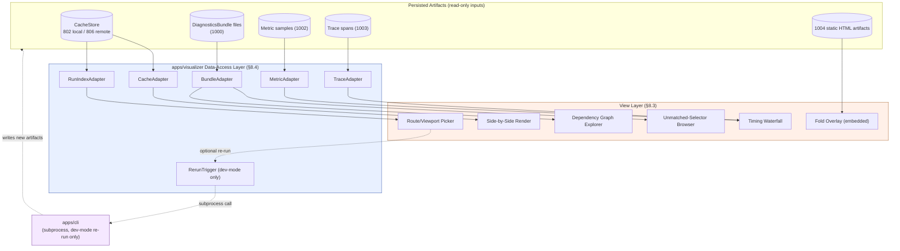
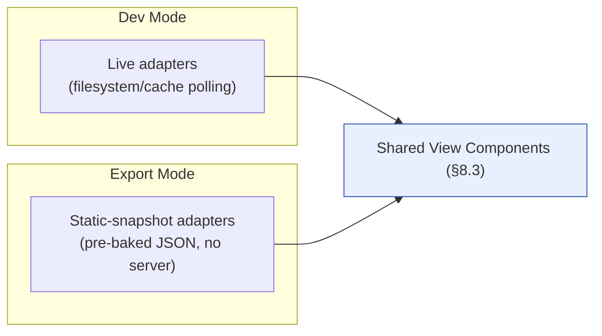
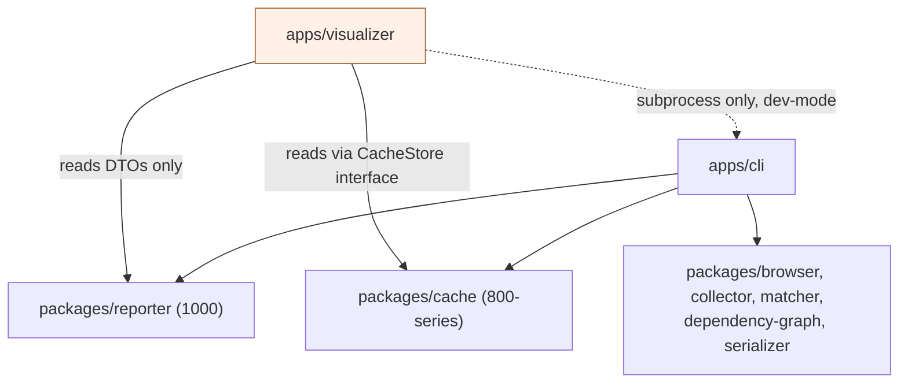

# 1005 — Debug UI

## 1. Title

**Critical CSS Extraction Engine — `apps/visualizer`: Interactive Multi-Run Diagnostic Application**

## 2. Version

| Field | Value |
|---|---|
| Document Version | 1.0.0 |
| Status | Draft — Phase 13 (Diagnostics) |
| Last Updated | 2026-07-10 |
| Owners | Diagnostics Working Group |
| Stability | The architectural boundary (`apps/visualizer` is a read-only consumer of Reporter and Cache Manager artifacts; it never imports or invokes extraction logic directly) is stable and load-bearing. The specific view set (Section 8.3) is a Draft-stage list of the views BRIEF.md Section 2.19 and Roadmap Phase 5 imply are needed; individual views may be added, merged, or reshaped without affecting the architectural boundary. |

## 3. Purpose

BRIEF.md Section 2.19's canonical repository layout names `apps/visualizer` as one of three first-class applications, alongside `apps/cli` and `apps/playground`. BRIEF.md Section 2.17's Roadmap assigns it to Phase 5 ("Visual debugger, IDE support, distributed crawler"). Neither passage specifies what the application does; this document is that specification.

`apps/visualizer` is a local, browsable web application for exploring the *history and detail* of extraction runs across routes, viewports, and builds: picking a route and viewport, viewing a side-by-side render of the full-CSS page against the critical-CSS-only page, exploring the dependency graph interactively, browsing the unmatched-selector report, and inspecting a timing waterfall of the extraction pipeline's stages. Every one of these views is, in substance, an interactive rendering of data that already exists — produced by the Reporter ([1000-Diagnostics-Overview.md](./1000-Diagnostics-Overview.md)) and persisted by the Cache Manager ([800-Cache-Overview.md](./800-Cache-Overview.md)) — across potentially many runs, not the single-run artifact [1004-Visualization.md](./1004-Visualization.md) produces. The central architectural commitment this document makes, and defends at length in Section 8.1, is that `apps/visualizer` is a **thin consumer**: it reads cached artifacts and diagnostics bundles that already exist on disk (or in a distributed cache backend, per [806-Distributed-Cache.md](./806-Distributed-Cache.md)) and renders them; it does not re-implement, embed, or re-invoke any part of the extraction pipeline (`packages/browser`, `packages/collector`, `packages/matcher`, `packages/dependency-graph`, `packages/serializer`).

This document does not specify:
- The extraction pipeline itself, or any of the algorithms `apps/visualizer` merely visualizes — those are owned by their respective design documents (200-series, 400-series, 500-series, 700-series).
- The `DiagnosticsBundle` schema or the Reporter's report-generation logic — owned by [1000-Diagnostics-Overview.md](./1000-Diagnostics-Overview.md) and consumed here unchanged.
- The Cache Manager's storage format or fingerprinting — owned by the 800-series documents and consumed here unchanged, read-only.
- The single-run static HTML visualization — owned by [1004-Visualization.md](./1004-Visualization.md); this document specifies how that artifact is *embedded* as one view (Section 8.3.5) inside the larger multi-run application, not how it is generated.

## 4. Audience

- Implementers of `apps/visualizer`, who need the application's architectural boundary, view inventory, and data-flow contract before writing a single React/Vue/vanilla component.
- Engineers debugging a specific extraction anomaly across a whole route manifest (not just one route, which [1004-Visualization.md](./1004-Visualization.md) already serves), who need a browsing surface rather than a single static file.
- CI/CD pipeline authors deciding whether to publish a static-export build of `apps/visualizer` (Section 8.6) as a CI artifact alongside the mandatory JSON reports, for post-hoc investigation of a failed build without re-running extraction locally.
- Reviewers evaluating whether a proposed extraction-engine change is architecturally sound to expose through `apps/visualizer` without violating the thin-consumer boundary (Section 8.1) — e.g., whether a "re-run this route" button is acceptable (Section 8.2) and under what constraints.
- Future implementers of Roadmap Phase 5's "IDE support" item, who will likely want to embed or link into specific `apps/visualizer` views from an editor extension and need a stable URL/routing contract (Section 8.7) to target.

Readers should already be familiar with [1000-Diagnostics-Overview.md](./1000-Diagnostics-Overview.md)'s `DiagnosticsBundle` contract, [800-Cache-Overview.md](./800-Cache-Overview.md)'s `CacheStore` interface and fingerprint-keyed artifact model, [1002-Metrics.md](./1002-Metrics.md) and [1003-Tracing.md](./1003-Tracing.md)'s metric/span data shapes, and [1004-Visualization.md](./1004-Visualization.md)'s single-run static artifact, since this document's central design move is composing all four into one browsing surface without re-deriving any of them.

## 5. Prerequisites

- [1000-Diagnostics-Overview.md](./1000-Diagnostics-Overview.md) — `DiagnosticsBundle` DTO, and the six report types (dependency graph, matched/unmatched selector, stylesheet contribution, timing, extraction trace) this application's views render.
- [800-Cache-Overview.md](./800-Cache-Overview.md) through [806-Distributed-Cache.md](./806-Distributed-Cache.md) — `CacheStore` interface, fingerprint-as-key model, and the local-filesystem (802) versus remote (806) backend split this application must read from without caring which backend is active.
- [1002-Metrics.md](./1002-Metrics.md) and [1003-Tracing.md](./1003-Tracing.md) — the metric samples and trace spans feeding the timing waterfall view (Section 8.3.4).
- [1004-Visualization.md](./1004-Visualization.md) — the single-run static HTML artifact embedded as one view.
- [500-Dependency-Resolution-Overview.md](./500-Dependency-Resolution-Overview.md) — the dependency graph structure rendered interactively (Section 8.3.3).
- [007-Repository-Structure.md](../architecture/007-Repository-Structure.md) — the `apps/` versus `packages/` boundary convention this application must respect (apps consume packages, packages never depend on apps).
- [006-Design-Principles.md](../architecture/006-Design-Principles.md) — Principle 4 (Extensibility via stable interfaces) and Principle 6 (Diagnosability by Default), both directly relevant to why this application is architected as a thin consumer rather than a reimplementation.
- General familiarity with local-first developer-tooling UI patterns (Storybook, browser devtools' own Network/Performance panels, bundler visualizers such as `webpack-bundle-analyzer`) as prior art this design deliberately follows rather than reinvents.

## 6. Related Documents

- [1000-Diagnostics-Overview.md](./1000-Diagnostics-Overview.md) — upstream `DiagnosticsBundle` and Reporter charter; this application's primary data source alongside the Cache Manager.
- [1001-Logging.md](./1001-Logging.md) — structured logs `apps/visualizer`'s own server component emits (index-build progress, artifact read failures) — distinguished from the extraction engine's own logs it displays.
- [1002-Metrics.md](./1002-Metrics.md) — metric samples feeding the timing waterfall and stylesheet-contribution views.
- [1003-Tracing.md](./1003-Tracing.md) — trace spans feeding the timing waterfall's per-stage bars.
- [1004-Visualization.md](./1004-Visualization.md) — single-run static HTML artifact, embedded as the "Fold Overlay" view (Section 8.3.5).
- [500-Dependency-Resolution-Overview.md](./500-Dependency-Resolution-Overview.md) — dependency graph structure rendered by the graph explorer view.
- [800-Cache-Overview.md](./800-Cache-Overview.md), [802-Cache-Store.md](./802-Cache-Store.md), [803-Route-Cache.md](./803-Route-Cache.md), [804-Viewport-Cache.md](./804-Viewport-Cache.md), [806-Distributed-Cache.md](./806-Distributed-Cache.md) — the artifact storage this application reads, at whatever granularity and backend is configured.
- [200-Visibility-Engine-Overview.md](./200-Visibility-Engine-Overview.md) — conceptual source of the visibility-reason vocabulary surfaced wherever this application displays node classification (embedded via the 1004 view, not re-derived).
- [007-Repository-Structure.md](../architecture/007-Repository-Structure.md) — `apps/` vs `packages/` dependency-direction convention.
- [006-Design-Principles.md](../architecture/006-Design-Principles.md) — Principles 4 and 6.

## 7. Overview

### 7.1 What problem this application solves

The JSON/CSV reports and the per-run static visualization ([1004-Visualization.md](./1004-Visualization.md)) each answer a question about *one run*. Real debugging sessions are rarely about one run in isolation — they are about comparisons and patterns across a manifest: "which of our 400 routes regressed in critical-CSS size this build," "show me every route where the unmatched-selector count jumped," "why did route `/course/mba` take 1.8 seconds when the p95 across the manifest is 400ms," "walk me through the dependency graph for this one stubborn `@import` chain." Answering these well requires a browsing UI with search, filtering, and comparison affordances that a flat file collection cannot provide on its own.

`apps/visualizer` exists to be that browsing UI, and BRIEF.md Section 2.19's repository layout places it as a peer of `apps/cli` for a reason: it is a distinct *application* with its own UI concerns, not a mode of the CLI or a flag on the Reporter.

### 7.2 The central architectural commitment: thin consumer, not a second pipeline

The single most important design decision in this document, elaborated fully in Section 8.1, is that `apps/visualizer` must never import `packages/browser`, `packages/collector`, `packages/matcher`, `packages/dependency-graph`, or `packages/serializer` as libraries. It reads only:

1. **Cached artifacts** via the `CacheStore` interface ([802-Cache-Store.md](./802-Cache-Store.md)) — read-only, using the same interface the extraction pipeline's own cache-hit path uses, never a bespoke re-implementation of cache-directory parsing.
2. **`DiagnosticsBundle`s and generated reports** written by the Reporter ([1000-Diagnostics-Overview.md](./1000-Diagnostics-Overview.md)), including the embeddable static visualization ([1004-Visualization.md](./1004-Visualization.md)).

Everything the UI shows — the dependency graph, the matched/unmatched selectors, the timing waterfall, the side-by-side render — is data already computed and persisted by a prior extraction run. If a route has never been extracted, `apps/visualizer` shows an explicit "not yet extracted" state (Section 12) rather than silently extracting it itself. An optional, clearly separated "trigger re-run" affordance (Section 8.2) exists for convenience, but it operates by shelling out to `apps/cli` as a *subprocess*, across a process boundary, never as an in-process library call — preserving the architectural guarantee that `apps/visualizer`'s own code has zero build-time or runtime dependency on the extraction packages.

### 7.3 Two deployment shapes: dev server and static export

`apps/visualizer` ships in two modes that share one codebase and one view set:

- **Dev mode**: a local server (bound to `localhost` only, Section 12) that polls the configured cache/reports directory for changes and serves a live-updating UI — the mode used during active local development or CI-triage sessions where an engineer runs the extraction and wants to inspect results as they land.
- **Export mode**: a fully static site bundle (HTML/CSS/JS plus a bundled snapshot of the relevant `DiagnosticsBundle`/cache data, no server required) generated from a fixed set of runs — the mode used to publish a browsable diagnostic report as a CI artifact (BRIEF.md Section 2.11's "Publish artifacts") that a reviewer can open without running any local server at all.

Both modes render the same views from the same view-model layer (Section 8.4); the only difference is whether the data-access layer reads from a live, polling filesystem/cache backend or from a pre-baked static JSON snapshot bundled at export time. This mirrors the same "one computation, multiple presentations" discipline [1004-Visualization.md](./1004-Visualization.md) Section 7.3 insists on for its own static-vs-JS-enhanced layering.

## 8. Detailed Design

### 8.1 Architecture: thin app over Reporter/Cache Manager output

Three candidate architectures were considered for how `apps/visualizer` obtains the data it displays:

- **(Rejected) Embed the extraction engine as a library**, letting the UI trigger extraction directly in-process and render results as they stream out. This would make "click a route, see fresh results" maximally convenient, but it means `apps/visualizer` depends on `packages/browser` (and therefore on a real browser binary being installed, on the full dependency chain of the extraction packages, and on every version bump of those packages potentially breaking the UI build). It also blurs the "diagnostics tool" boundary: a debugging UI that can silently kick off expensive browser-driven extraction on every navigation is surprising and hard to reason about in a shared or CI-hosted deployment.
- **(Rejected) A generic file browser over the cache directory**, with no domain-specific views — effectively a directory listing UI. This satisfies the "thin consumer" property trivially but fails the actual requirement (BRIEF.md Section 2.19 clearly intends a *visualizer*, i.e., a domain-aware rendering of dependency graphs, selector reports, and timing data, not raw JSON browsing).
- **(Chosen) A thin domain-aware application**: a small API/read layer that knows the shape of `DiagnosticsBundle`, `CacheEntry`, trace spans, and metric samples (Sections 8.4–8.5), paired with view components that render those shapes richly (graph layout, waterfall layout, side-by-side iframes), but with **zero dependency on the packages that produce that data**. The application is coupled to *data shapes* (DTOs, already stable interfaces per Principle 4), never to the *algorithms* that produce them.

This is the same mechanism/policy-style boundary discipline [800-Cache-Overview.md](./800-Cache-Overview.md) Section 7.3 established for the Cache Manager versus the incremental-extraction strategy, applied one layer up: `apps/visualizer` is a client of stable DTOs, and the packages that produce those DTOs can evolve their internals freely as long as the DTO contracts documented in 1000/1002/1003/800-series hold.

### 8.2 The optional "trigger re-run" affordance, and why it stays a subprocess boundary

Some workflows genuinely want "extract this route right now and show me the result" from within the UI. This is supported, but deliberately implemented as: the UI shells out to `apps/cli` (e.g., `node apps/cli/bin/critical-css extract --route=/x --viewport=mobile`) as a child process, waits for it to exit, and then re-reads the resulting cache entry/`DiagnosticsBundle` from disk exactly as it would have if a human had run that command in a terminal and refreshed the page. No extraction package is imported by `apps/visualizer`'s own process. This preserves three properties: (1) `apps/visualizer` can be deployed (e.g., as a read-only CI artifact viewer) in an environment with no browser binary installed, since the re-run affordance simply won't be available/enabled there; (2) a bug in the re-run trigger cannot corrupt the visualizer's own process state, since it lives in a separate OS process; (3) the exact same code path (`apps/cli`) is exercised whether a human runs it interactively or the UI runs it on their behalf, so there is no "UI-only" extraction code path to drift from the CLI's behavior.

### 8.3 View inventory

The application ships five core views, each mapped to a specific upstream data source:

**8.3.1 Route/viewport picker.** A searchable, filterable index over every (route, viewport, mode) combination that has at least one cache entry or `DiagnosticsBundle` on the configured backend. Built from the `CacheStore.entries()` enumeration ([802-Cache-Store.md](./802-Cache-Store.md)) joined against the route manifest (BRIEF.md Section 2.9) for human-readable route labels. Supports filtering by staleness (fingerprint mismatch against current source, Section 12), by regression flags (size or timing delta versus a baseline build, if the CI pipeline recorded one), and free-text route search.

**8.3.2 Side-by-side full-CSS vs. critical-CSS render.** Two `<iframe>`s, one loading the original page with its full stylesheet bundle, one loading the same HTML with only the generated critical CSS injected inline (reusing exactly the CSS the Serializer produced — [1000-Diagnostics-Overview.md](./1000-Diagnostics-Overview.md)'s bundle references the serialized output, and the underlying page HTML/asset references come from the cached `CacheEntry`). This view is a **render**, not a re-extraction: it never asks a browser to compute visibility or matching again, it only asks a browser (the viewer's own, via the iframe) to *display* two known HTML/CSS payloads for visual comparison. A synchronized-scroll toggle keeps the two panes aligned for easier visual diffing.

**8.3.3 Dependency graph explorer.** An interactive rendering of the dependency graph summary from [500-Dependency-Resolution-Overview.md](./500-Dependency-Resolution-Overview.md), laid out as a directed graph (Section 10.2's layout algorithm) with pan/zoom, node search by selector or stylesheet, and click-to-highlight of a node's transitive dependents/dependencies. This view renders the graph the Dependency Resolution module already computed and the Reporter already serialized; it performs no graph algorithm of its own beyond layout.

**8.3.4 Unmatched-selector browser.** A sortable, filterable table over the unmatched-selector report ([1000-Diagnostics-Overview.md](./1000-Diagnostics-Overview.md)), grouped by source stylesheet, with a "why unmatched" hint derived from data already present in the report (e.g., "no matching element in DOM," "matched element but excluded by visibility," "excluded by plugin rule" per [500-Dependency-Resolution-Overview.md](./500-Dependency-Resolution-Overview.md)/plugin-hook diagnostics) — again, purely a rendering of existing fields, adding no new classification logic.

**8.3.5 Timing waterfall.** A Gantt-style horizontal-bar chart over trace spans from [1003-Tracing.md](./1003-Tracing.md), one row per pipeline stage (navigation, DOM snapshot, visibility classification, CSSOM walk, selector matching, dependency resolution, serialization — mirroring [016-Data-Flow.md](../architecture/016-Data-Flow.md)'s stage list), annotated with the metric samples from [1002-Metrics.md](./1002-Metrics.md) (e.g., node count processed, rule count matched) at each stage boundary. Supports comparing two runs' waterfalls side by side to spot which stage regressed.

**8.3.6 Fold overlay (embedded).** The single-run static HTML artifact from [1004-Visualization.md](./1004-Visualization.md), embedded via a same-origin `<iframe src="...">` pointing at the artifact file the Reporter already generated. `apps/visualizer` does not re-implement any part of the overlay rendering — it is purely a navigation target ("open the fold overlay for this route/viewport") into an artifact that already exists as a file.

### 8.4 Data-access layer: one adapter per upstream contract

To keep the "thin consumer" property enforceable rather than aspirational, all filesystem/cache reads go through a small internal data-access layer with one adapter per upstream contract, and view components never read files directly:

```
interface RunIndexAdapter {
  listRuns(filter?: RunFilter): RunSummary[]           // reads CacheStore.entries() + route manifest
}

interface BundleAdapter {
  loadBundle(fingerprint: string): DiagnosticsBundle    // reads Reporter output for a given run
}

interface CacheAdapter {
  loadEntry(fingerprint: string): CacheEntry            // delegates to CacheStore (802/806), read-only
}

interface TraceAdapter {
  loadSpans(fingerprint: string): TraceSpan[]           // reads 1003 trace output
}

interface MetricAdapter {
  loadMetrics(fingerprint: string): MetricSample[]      // reads 1002 metric output
}

interface RerunTrigger {                                 // optional, dev-mode only
  trigger(route: RouteDescriptor, viewport: ViewportProfile): Promise<ExitCode>  // subprocess call to apps/cli
}
```

Every view component depends only on these interfaces, never on `fs` calls or `CacheStore` internals directly. This makes the static-export mode (Section 7.3) a matter of substituting a different implementation of these same five read interfaces (backed by a pre-baked JSON snapshot instead of a live filesystem/cache backend) without touching a single view component — the same seam discipline [800-Cache-Overview.md](./800-Cache-Overview.md) Section 8.1 uses for `CacheStore` itself.

### 8.5 Handling large graphs and manifests

Enterprise deployments (BRIEF.md Section 2.15's "huge enterprise stylesheets," Section 2.18's "suitable for enterprise CI pipelines") imply route manifests with hundreds of routes and dependency graphs with thousands of nodes. The picker view (8.3.1) is virtualized (renders only visible rows) and paginated/searchable rather than rendering every run row at once. The dependency graph explorer (8.3.3) applies the same layered-DAG-with-collapsing strategy discussed in Section 10.2: collapsed clusters by default, with drill-down expansion, so an initial render of a 5,000-node graph stays interactively responsive.

### 8.6 Static export mode

`apps/visualizer export --out=./report --runs=<manifest-or-glob>` produces a self-contained static directory: the same compiled UI bundle, plus a `data/` directory of pre-serialized JSON snapshots (one per run, matching the shapes the adapters in Section 8.4 would otherwise fetch live) and any embedded [1004-Visualization.md](./1004-Visualization.md) artifacts, copied alongside. The exported bundle has no server component and no `RerunTrigger` (that affordance is compiled out entirely in export builds, not merely hidden in the UI, since a static CI artifact must never attempt to shell out to anything). This mode is what makes `apps/visualizer` usable as a CI-published artifact per BRIEF.md Section 2.11, directly analogous to how tools like `webpack-bundle-analyzer` or Playwright's HTML reporter ship a static, dependency-free report bundle.

### 8.7 Routing and deep-linking

Views are addressed by a stable URL scheme (`/run/:fingerprint/graph`, `/run/:fingerprint/waterfall`, `/run/:fingerprint/overlay`, etc.) so that a CI job or a future IDE extension (Roadmap Phase 5) can link directly to a specific view of a specific run — for example, a PR comment bot could link straight to `/run/<fingerprint>/waterfall` for a route whose timing regressed. This routing scheme is stable across both dev and export modes (Section 7.3), since export mode's static files preserve the same path structure via pre-rendered index files per route.

## 9. Architecture

### 9.1 Data flow from cached artifacts to UI views



The diagram makes the thin-consumer boundary (Section 8.1) structurally explicit: every solid arrow flows *out of* storage and *into* views through the data-access layer; the only arrow that can cause new computation (`RT → CLI`) is dashed, optional, and crosses a process boundary rather than an in-process import edge — there is no solid arrow from any view back into the extraction pipeline packages.

### 9.2 Dev-mode vs. export-mode substitution



Both adapter implementations satisfy the same five interfaces from Section 8.4; the view layer is written once and is unaware of which mode is active.

### 9.3 Package/app dependency direction



Note the absence of any edge from `apps/visualizer` to `EXTRACTPKGS` — the architectural invariant this document exists to establish and preserve.

## 10. Algorithms

### 10.1 Algorithm: run-index construction

**Problem statement.** Given a `CacheStore` enumeration and a route manifest, build a searchable, filterable list of runs for the picker view (8.3.1), including staleness and regression flags.

**Inputs.** `entries: Iterable<CacheEntryMeta>` (from `CacheStore.entries()`), `manifest: RouteManifest`, `baseline?: RunIndexSnapshot` (a previous build's index, for regression comparison).

**Outputs.** `RunSummary[]`.

**Pseudocode.**
```
function buildRunIndex(entries, manifest, baseline) -> RunSummary[]
    index = []
    for meta in entries:                                    // O(k), k = cache entry count
        route = manifest.lookup(meta.routeId)                // O(1) with a manifest hash map
        currentFingerprint = computeFingerprintFromCurrentSource(route, meta.viewport)  // O(m), delegates to 801
        stale = (currentFingerprint != meta.fingerprint)
        regression = null
        if baseline:
            prior = baseline.find(meta.routeId, meta.viewport)   // O(1) with a baseline index map
            if prior:
                regression = compareSizeAndTiming(meta, prior)    // O(1), simple deltas
        index.push(RunSummary(meta, route, stale, regression))
    return index
```

**Time complexity.** `O(k * m)` where `k` is the number of cache entries and `m` is the per-entry fingerprint recomputation cost (dominated by hashing route source content, per [801-Fingerprinting.md](./801-Fingerprinting.md)); in practice this can be optimized to `O(k)` amortized using the asset-hash memoization fast path 801 already defines, since the visualizer is re-deriving the same "is this still current" check the Cache Manager's own lookup path performs.

**Memory complexity.** `O(k)` for the resulting index.

**Failure cases.** A route present in cache entries but removed from the current manifest (deleted page) — flagged as `orphaned` rather than silently omitted, since "this route used to exist" is itself diagnostically relevant during a migration.

**Optimization opportunities.** Incremental index updates (recompute only entries whose underlying files changed since last poll, using filesystem mtimes as a cheap pre-filter before falling back to full fingerprint recomputation) — relevant for the dev-mode live-polling path at large manifest sizes.

### 10.2 Algorithm: layered-DAG layout for the dependency graph explorer

**Problem statement.** Given the dependency graph summary from [500-Dependency-Resolution-Overview.md](./500-Dependency-Resolution-Overview.md) (a DAG, since dependency resolution runs to a fixed point without cycles), compute a 2D layout suitable for interactive rendering, with clustering/collapsing for graphs exceeding an interactive-size threshold.

**Inputs.** `graph: { nodes: RuleNode[], edges: DependencyEdge[] }`, `collapseThreshold: number`.

**Outputs.** `LayoutResult { positions: Record<NodeId, {x,y}>, clusters: Cluster[] }`.

**Pseudocode.**
```
function layoutDependencyGraph(graph, collapseThreshold) -> LayoutResult
    layers = topologicalLayering(graph.nodes, graph.edges)     // O(V + E), Kahn's algorithm variant
    if len(graph.nodes) > collapseThreshold:
        clusters = clusterByStylesheetOrigin(graph.nodes)       // O(V), group by sourceStylesheet
        collapsedNodes = [representativeNodeFor(c) for c in clusters]
        layers = topologicalLayering(collapsedNodes, inducedEdges(clusters, graph.edges))  // O(V' + E')
        return LayoutResult(positions = assignGridPositions(layers), clusters = clusters)
    return LayoutResult(positions = assignGridPositions(layers), clusters = [])
```

**Time complexity.** `O(V + E)` for the topological layering (a standard Kahn's-algorithm layered DAG layout, the same class of algorithm used by build-dependency visualizers), plus `O(V)` for clustering when the collapse threshold is exceeded. Well below the `O(V^2)` cost of a naive force-directed layout, and deliberately chosen over force-directed layout for that reason (Section 13).

**Memory complexity.** `O(V + E)` for the layer assignment and position map.

**Failure cases.** A cycle in the input graph would break topological layering entirely — this should be structurally impossible per [500-Dependency-Resolution-Overview.md](./500-Dependency-Resolution-Overview.md)'s fixed-point resolution guarantee, so its presence here is treated as a hard error surfaced prominently ("dependency graph contains a cycle — this indicates an upstream resolution defect, not a rendering issue"), not silently worked around.

**Optimization opportunities.** Caching the computed layout keyed by the graph's own content hash (the same fingerprint discipline as 801) so re-opening the same run's graph view does not recompute layout; incremental re-layout when only a small subgraph changes between two runs being compared side by side.

## 11. Implementation Notes

- **No import from any extraction package.** Enforce with a dependency-cruiser (or equivalent) rule identical in spirit to [800-Cache-Overview.md](./800-Cache-Overview.md) Section 11's `packages/cache` boundary lint, applied to `apps/visualizer`: it may depend on `packages/reporter`'s DTO types and `packages/cache`'s `CacheStore` interface, and nothing else under `packages/`.
- **The `RerunTrigger` must be compiled out of export builds**, not merely hidden by a UI flag — a static CI artifact must not ship code capable of spawning a subprocess, both for security (Section 12) and to keep export bundles genuinely static and side-effect-free when opened.
- **Bind the dev-mode server to `localhost` by default**, and require an explicit opt-in flag to bind to a non-loopback address, since the server has read access to potentially sensitive cached HTML/CSS content and (in dev mode) subprocess-spawning capability.
- **View components consume only the five adapter interfaces (Section 8.4)**, never `fs`/`CacheStore` directly, enforced by the same lint rule — this is what makes the dev/export mode substitution (Section 9.2) a pure implementation swap rather than a UI rewrite.
- **The picker's staleness check reuses [801-Fingerprinting.md](./801-Fingerprinting.md)'s algorithm exactly**, not a bespoke "has this file changed" heuristic, so "stale" in the UI means precisely what "would miss the cache on next build" means in the real pipeline — any drift between the two would make the UI actively misleading.
- **Export mode's static snapshot generation is itself deterministic** given a fixed set of runs, mirroring the determinism discipline [1004-Visualization.md](./1004-Visualization.md) Section 11 requires of its own HTML output, so exported reports are diffable across CI builds.

## 12. Edge Cases

- **Route selected in the picker has no cache entry at all (never extracted).** Shown as an explicit "not yet extracted" state with an optional (dev-mode only) "run now" button, never as an empty or broken view.
- **Cache entry present but stale** (source changed since the cached fingerprint was computed, per Section 10.1). Shown with a visible staleness banner across every view for that run, so a reviewer doesn't mistake a stale artifact for a currently-accurate one.
- **Concurrent extraction writes while the UI is open.** Dev mode polls the backend on an interval (not a filesystem watch alone, since the remote backend, 806, may not support push notifications) and re-renders the affected run's views if its fingerprint changes underfoot; in-flight view state (e.g., a zoomed graph position) is preserved across a data refresh where possible.
- **Huge dependency graphs (thousands of nodes).** Handled by the clustering/collapse strategy in Section 10.2; a user can drill into a cluster to reveal its members, avoiding an unusable hairball render.
- **Massive route manifests (hundreds to thousands of routes).** The picker view is virtualized and paginated (Section 8.5); the run-index build itself (Section 10.1) is the dominant cost at this scale and is optimized via fingerprint memoization.
- **Distributed cache backend unavailable** (806's remote store down). The `CacheAdapter` surfaces a clear "backend unavailable" state per affected view rather than a generic error, and the picker still shows whatever local partial data (if any) is available.
- **Cross-origin asset references inside the side-by-side render** (8.3.2). Since both iframes render real page HTML with real asset URLs, cross-origin stylesheets/images/fonts referenced by the original page load exactly as they would in production; this view does not attempt to proxy or rewrite those URLs, and a route relying on since-decommissioned external assets will render with those specific assets missing — a faithful, not a synthetic, reproduction of the cached HTML.
- **Path traversal via a crafted fingerprint or route parameter.** The dev-mode server must validate that any file path derived from a URL parameter resolves within the configured cache/report root before reading it, to prevent an attacker (or a misbehaving link) from reading arbitrary filesystem paths; this is a required hardening step precisely because the server, even though localhost-bound by default, still parses untrusted-shaped input from its own URL routing.
- **Export bundle opened from `file://` instead of served over HTTP.** Some browsers restrict `fetch`/XHR against `file://` origins; the static export's data-loading adapter must tolerate this by inlining the JSON snapshots directly into the compiled JS bundle (rather than fetching sibling `.json` files at runtime) when a `file://`-safe build is requested, at the cost of a larger single bundle versus multiple small fetched files.

## 13. Tradeoffs

| Decision | Why | Alternative | Tradeoff accepted |
|---|---|---|---|
| Thin consumer of Reporter/Cache Manager DTOs, zero import of extraction packages | Keeps the debug UI usable without a browser binary installed, decouples its release cadence from the extraction engine's, and prevents an "extraction bug only reproduces via the UI" class of defect | Embed extraction engine as a library for live re-extraction in-UI | The optional re-run affordance is slower (subprocess spawn + full CLI startup) than an in-process call would be; accepted for the architectural isolation it buys |
| Re-run via subprocess call to `apps/cli`, never in-process | Preserves process-level isolation and guarantees UI-triggered extraction is byte-for-byte the same code path as CLI-triggered extraction | In-process extraction call with a shared module | Slightly higher latency and no fine-grained progress streaming without additional IPC; deferred to future work (Section 16) |
| Layered-DAG layout (topological) for the dependency graph, not force-directed | `O(V+E)`, deterministic, and matches the graph's actual DAG structure (dependency resolution is acyclic by construction) | Force-directed physics simulation layout | Less "organic" visual layout aesthetically; accepted because determinism (stable, diffable layout across runs) matters more than visual novelty here |
| Two deployment modes (dev server + static export) sharing one view layer via an adapter interface | Lets the same tool serve both interactive local debugging and static CI-artifact publishing (BRIEF.md Section 2.11) without two codebases | Dev-server-only, requiring CI consumers to run a local server against downloaded artifacts | Extra engineering investment in the adapter abstraction (Section 8.4) up front; accepted as a one-time cost for two first-class deployment targets |
| Fold-overlay view embeds the 1004 artifact via iframe rather than re-implementing overlay rendering | Avoids a second implementation of the exact same rendering logic drifting from 1004's | Re-implement the overlay natively as a React/Vue component for tighter visual integration | Slightly less seamless visual integration (an iframe boundary is visible); accepted to keep 1004 the single source of overlay-rendering truth |

## 14. Performance

- **CPU.** Run-index construction is `O(k * m)` worst case, amortized to near `O(k)` with fingerprint memoization (Section 10.1); dependency-graph layout is `O(V + E)` (Section 10.2); both are negligible relative to the extraction pipeline's own cost and dominated, in practice, by UI rendering and network/disk I/O rather than the visualizer's own algorithms.
- **Memory.** Bounded by the size of the currently-viewed run's `DiagnosticsBundle`/trace/metric data, not by the whole manifest — the picker view holds only lightweight `RunSummary` records for the full manifest, and detail views lazily load full bundles only for the selected run.
- **Caching strategy.** Computed layouts (Section 10.2) and run indices (Section 10.1) are themselves cacheable, keyed by the same content-hash discipline as [801-Fingerprinting.md](./801-Fingerprinting.md), so re-opening a previously-viewed run or graph avoids recomputation within a session.
- **Parallelization.** Loading bundles/traces/metrics for distinct runs is independent and can be fetched concurrently by the data-access layer when the picker pre-fetches summary data for visible rows; the dev-mode poll loop for manifest-wide staleness checks is embarrassingly parallel across routes.
- **Incremental execution.** Dev-mode polling recomputes only affected runs' `RunSummary` entries on each poll cycle (via mtime/fingerprint pre-filtering, Section 10.1's optimization note), not the full manifest on every tick.
- **Scalability limits.** The picker and graph views' virtualization/clustering strategies (Section 8.5) are the primary scalability levers; beyond very large manifests (tens of thousands of routes), a paginated server-side search (rather than a fully client-side index) would become necessary — flagged as future work (Section 16) rather than solved in v1, since current expected scale (per BRIEF.md Section 2.18) is "hundreds of routes," not tens of thousands.

## 15. Testing

- **Unit tests.**
  - Each of the five data-access adapters (Section 8.4) against fixture cache/report directories, asserting correct DTO shapes and correct handling of missing/partial data.
  - Run-index staleness computation against fixtures with matching and mismatched fingerprints.
  - Layered-DAG layout algorithm against small fixture graphs, including a cyclic-graph fixture asserting the hard-error path (Section 10.2) fires correctly.
- **Integration tests.**
  - Full picker → detail-view navigation against a fixture cache directory populated by a real (small) extraction run, asserting every view (8.3.1–8.3.6) renders without error and reflects the fixture's actual `DiagnosticsBundle` contents.
  - Dev-mode polling: mutate a fixture cache directory mid-session and assert the affected run's views refresh.
  - Re-run trigger: assert the subprocess call invokes `apps/cli` with the expected arguments and that the UI re-reads fresh artifacts after the subprocess exits (using a stubbed `apps/cli` binary in test).
- **Visual tests.**
  - Golden-image/screenshot comparisons of each view against fixture data, catching unintended layout regressions independent of the underlying extraction engine's own visual-diff testing ([703-Visual-Diff.md](./703-Visual-Diff.md)).
- **Stress tests.**
  - Large fixture manifest (thousands of routes) and large fixture dependency graph (thousands of nodes), asserting the virtualization/clustering strategies keep initial render time and memory within documented bounds.
- **Regression tests.**
  - Export-mode determinism: exporting the same fixture run set twice produces byte-identical static bundles (excluding intentionally volatile fields like a build timestamp banner, which must be isolated to a clearly labeled location).
- **Benchmark tests.**
  - Track run-index build time and dependency-graph layout time versus manifest/graph size across releases.
- **Cross-references.** These tests assume the upstream `DiagnosticsBundle`, `CacheEntry`, trace, and metric fixtures are themselves valid per 1000/800-series/1002/1003's own test suites; `apps/visualizer`'s tests do not re-validate upstream correctness, only correct *rendering* of already-valid upstream data — the same "pure projection" testing philosophy [1004-Visualization.md](./1004-Visualization.md) Section 15 applies to its own single-run artifact.

## 16. Future Work

- **In-process, streaming re-extraction with live progress.** A future iteration could replace the subprocess `RerunTrigger` with an IPC-based progress stream (still process-isolated, e.g., over a local socket to a running `apps/cli` daemon) to show live per-stage progress during a triggered re-run, without crossing the "no extraction package imports" line, since the extraction logic would still run in a separate `apps/cli` process.
- **Server-side search/pagination for very large manifests**, replacing the fully client-side virtualized index (Section 8.5) once real deployments exceed the current design's assumed scale.
- **IDE integration (Roadmap Phase 5).** The stable per-view routing scheme (Section 8.7) is designed as the seam a future editor extension would link into (e.g., "jump to the unmatched-selector browser for the route open in this editor tab"); the extension itself is out of scope here.
- **Cross-run comparison view**, generalizing the timing-waterfall side-by-side comparison (8.3.5) into a first-class "diff two runs" mode spanning all views (graph diff, selector-report diff, overlay diff per [1004-Visualization.md](./1004-Visualization.md) Section 16's own cross-run diff idea) — deferred pending demand signal once the single-run views have shipped and been used.
- **Open question:** should `apps/visualizer` support a hosted, multi-tenant deployment mode (shared across a team, backed by 806's distributed cache) with authentication, rather than remaining a strictly local/CI-artifact tool? This would change the "bind to localhost by default" security posture (Section 12) substantially and is deferred pending product-requirements input outside this document's scope.
- **Open question:** should the exported static bundle (Section 8.6) support incremental updates (append new runs to an existing export directory) rather than full regeneration, to support long-lived, continuously-updated CI dashboards? Deferred pending real usage patterns from early CI adopters of the export mode.

## 17. References

- [1000-Diagnostics-Overview.md](./1000-Diagnostics-Overview.md) — `DiagnosticsBundle` DTO and Reporter module charter, this application's primary data contract.
- [1001-Logging.md](./1001-Logging.md) — structured logging for the visualizer's own server/adapter operations.
- [1002-Metrics.md](./1002-Metrics.md) — metric samples feeding the timing waterfall.
- [1003-Tracing.md](./1003-Tracing.md) — trace spans feeding the timing waterfall.
- [1004-Visualization.md](./1004-Visualization.md) — single-run static HTML artifact embedded as the fold-overlay view.
- [500-Dependency-Resolution-Overview.md](./500-Dependency-Resolution-Overview.md) — dependency graph structure rendered by the graph explorer.
- [800-Cache-Overview.md](./800-Cache-Overview.md), [802-Cache-Store.md](./802-Cache-Store.md), [806-Distributed-Cache.md](./806-Distributed-Cache.md) — `CacheStore` interface and backend variants this application reads from.
- [200-Visibility-Engine-Overview.md](./200-Visibility-Engine-Overview.md) — conceptual source of the visibility vocabulary surfaced via the embedded fold-overlay view.
- [703-Visual-Diff.md](./703-Visual-Diff.md) — the extraction engine's own visual-diff testing, distinguished from this application's UI visual-regression testing (Section 15).
- [007-Repository-Structure.md](../architecture/007-Repository-Structure.md) — `apps/` vs `packages/` boundary convention.
- [006-Design-Principles.md](../architecture/006-Design-Principles.md) — Principle 4 (Extensibility via stable interfaces), Principle 6 (Diagnosability by Default).
- BRIEF.md Section 2.19 (Canonical Repository Layout) and Section 2.17 (Roadmap, Phase 5) — the requirement source naming `apps/visualizer`.
