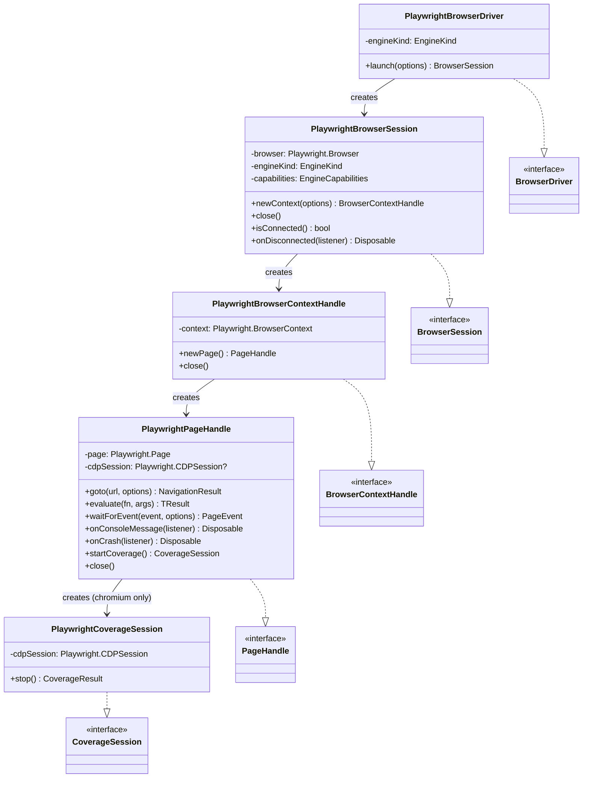
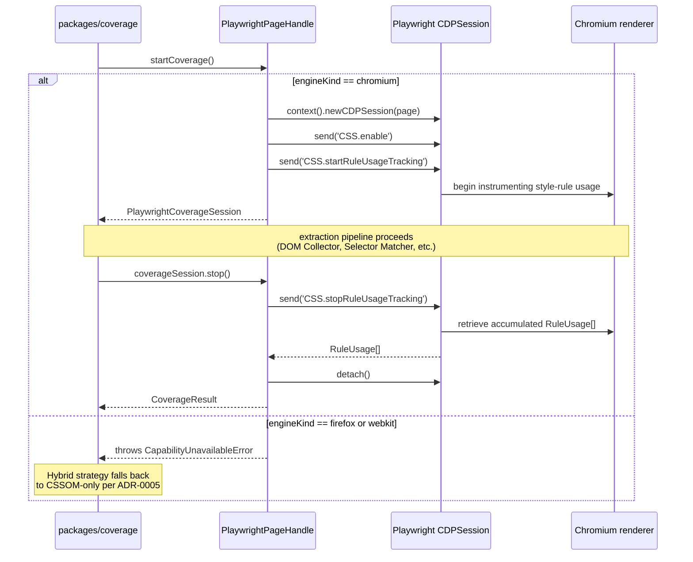
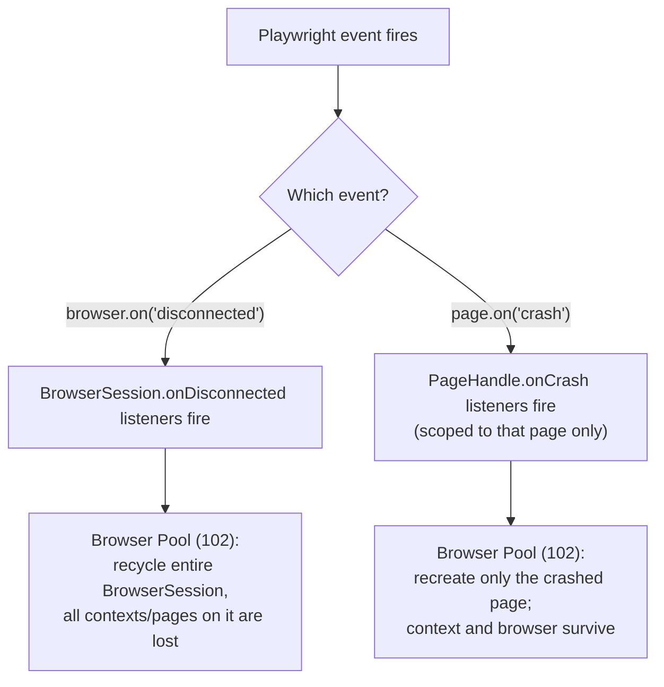
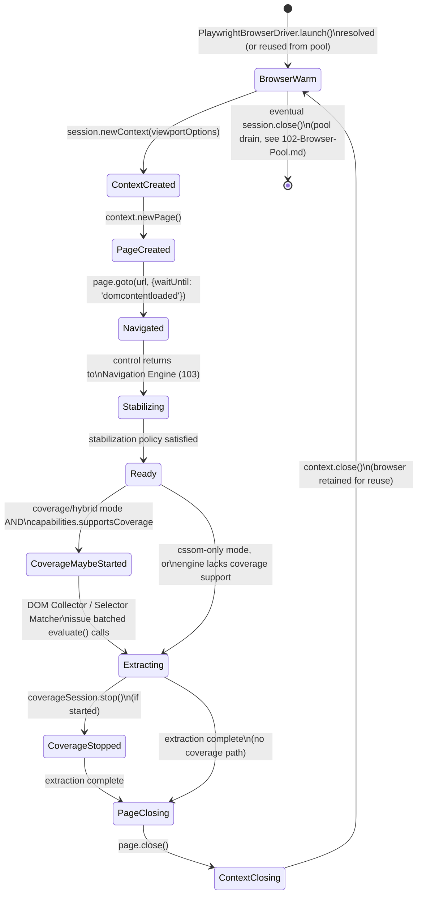

# 101 — Playwright Adapter

## 1. Title

**Critical CSS Extraction Engine — Playwright Adapter (Concrete Implementation of the Browser Abstraction)**

## 2. Version

| Field | Value |
|---|---|
| Document Version | 1.0.0 |
| Status | Draft — Phase 3 (Browser Layer) |
| Last Updated | 2026-07-09 |
| Owners | Core Architecture Working Group |
| Stability | Stable interface conformance target; internal adapter code may evolve with Playwright version upgrades per [ADR-0003](../adr/ADR-0003-Playwright-As-Browser-Abstraction.md) Testing guidance |

## 3. Purpose

This document specifies the concrete implementation of the [100-Browser-Abstraction.md](./100-Browser-Abstraction.md) interface (`BrowserDriver`, `BrowserSession`, `BrowserContextHandle`, `PageHandle`, `CoverageSession`) in terms of Playwright's own API surface (`BrowserType`, `Browser`, `BrowserContext`, `Page`, `CDPSession`), as mandated by [ADR-0003-Playwright-As-Browser-Abstraction](../adr/ADR-0003-Playwright-As-Browser-Abstraction.md). Where [100-Browser-Abstraction.md](./100-Browser-Abstraction.md) specifies *what any adapter must provide* and *why an adapter boundary exists at all*, this document specifies *how the one adapter that exists today provides it*: the exact mapping from abstraction methods to Playwright calls, how the adapter launches Chromium/Firefox/WebKit, how it manages one `BrowserContext` per extraction job for isolation, how it wires the CDP Coverage API for Chromium and degrades gracefully elsewhere, and how it handles the Playwright-specific operational quirks (protocol timeouts, headless-vs-headed defaults, sandboxing flags) that any real deployment of this engine must get right.

This document assumes [100-Browser-Abstraction.md](./100-Browser-Abstraction.md)'s interface as fixed and does not re-derive it; it also assumes [ADR-0003](../adr/ADR-0003-Playwright-As-Browser-Abstraction.md)'s choice of Playwright over Puppeteer/Selenium/raw-CDP as settled and does not re-argue it. Its job is narrower and more concrete: to be the document an implementer opens when actually writing the code in `packages/browser/src/adapters/playwright/`.

## 4. Audience

- Implementers writing the actual Playwright adapter code in `packages/browser`.
- Implementers of the Browser Pool ([102-Browser-Pool.md](./102-Browser-Pool.md)), who consume this adapter's `BrowserDriver` implementation but interact with it only through the [100-Browser-Abstraction.md](./100-Browser-Abstraction.md) interface.
- Implementers of the Coverage Engine (`packages/coverage`), who need to understand precisely how `PageHandle.startCoverage()` maps onto Playwright's CDP session and the `CSS.startRuleUsageTracking`/`CSS.takeCoverageDelta` methods, per [ADR-0005-Hybrid-Extraction-Mode](../adr/ADR-0005-Hybrid-Extraction-Mode.md).
- CI/DevOps engineers responsible for container images that must run Playwright's bundled browser binaries reliably (sandboxing flags, `/dev/shm` sizing).
- Future contributors evaluating a second adapter, who can use this document as the template for what a comparable "adapter specification" document must cover.

Readers are assumed to have read [100-Browser-Abstraction.md](./100-Browser-Abstraction.md) in full, and [ADR-0003-Playwright-As-Browser-Abstraction](../adr/ADR-0003-Playwright-As-Browser-Abstraction.md), particularly its Algorithms section (pool acquisition pseudocode) and Edge Cases (sandboxing, WebKit quirks, CDP session lifetime), both of which this document elaborates into implementation-level detail.

## 5. Prerequisites

- [100-Browser-Abstraction.md](./100-Browser-Abstraction.md) — the interface this document implements.
- [ADR-0003-Playwright-As-Browser-Abstraction](../adr/ADR-0003-Playwright-As-Browser-Abstraction.md) — the decision record and its Algorithms/Edge Cases/Implementation Notes sections, which this document treats as binding constraints.
- [ADR-0005-Hybrid-Extraction-Mode](../adr/ADR-0005-Hybrid-Extraction-Mode.md) — the consumer of this adapter's Coverage wiring.
- [015-Runtime-Model.md](../architecture/015-Runtime-Model.md) Section 8.2 (Browser Pool Lifecycle) and Section 8.5 (Memory Model), which this adapter's process/context/page management must satisfy.
- [006-Design-Principles.md](../architecture/006-Design-Principles.md), particularly Principle 6 (Fail-Fast Diagnostics), which governs how this adapter must surface Playwright-specific failures (crashes, timeouts, launch failures).
- Working familiarity with Playwright's `BrowserType`/`Browser`/`BrowserContext`/`Page`/`CDPSession` API surface and the Chrome DevTools Protocol's CSS and Profiler/Coverage domains.

## 6. Related Documents

- [100-Browser-Abstraction.md](./100-Browser-Abstraction.md) — the abstraction this document implements.
- [102-Browser-Pool.md](./102-Browser-Pool.md) — the pooling policy layer that consumes this adapter's `BrowserDriver`/`BrowserSession` implementations.
- [103-Navigation-Engine.md](./103-Navigation-Engine.md) — the consumer of `PageHandle.goto()` as implemented here against Playwright's `page.goto()`.
- [104-Rendering-Stabilization.md](./104-Rendering-Stabilization.md) — consumes this adapter's event subscriptions (`onConsoleMessage`, navigation lifecycle events) to detect readiness.
- [105-Viewport-Manager.md](./105-Viewport-Manager.md) — consumes this adapter's `newContext()` implementation, specifically how `ContextOptions` map onto Playwright's `browser.newContext({ viewport, deviceScaleFactor, userAgent, colorScheme })`.
- [106-DOM-Snapshot.md](./106-DOM-Snapshot.md) — the heaviest consumer of this adapter's `evaluate()` implementation against Playwright's `page.evaluate()`.
- [006-Design-Principles.md](../architecture/006-Design-Principles.md)
- [007-Repository-Structure.md](../architecture/007-Repository-Structure.md)
- [010-System-Overview.md](../architecture/010-System-Overview.md)
- [015-Runtime-Model.md](../architecture/015-Runtime-Model.md)
- [ADR-0003-Playwright-As-Browser-Abstraction](../adr/ADR-0003-Playwright-As-Browser-Abstraction.md)
- [ADR-0005-Hybrid-Extraction-Mode](../adr/ADR-0005-Hybrid-Extraction-Mode.md)

## 7. Overview

The Playwright Adapter is the sole place in the entire codebase, per [ADR-0003](../adr/ADR-0003-Playwright-As-Browser-Abstraction.md) Implementation Notes item 5 and [100-Browser-Abstraction.md](./100-Browser-Abstraction.md) Section 9.1's dependency diagram, where Playwright's package is imported. Every method on [100-Browser-Abstraction.md](./100-Browser-Abstraction.md)'s four interfaces has exactly one implementation here, and that implementation's entire job is to translate between the abstraction's engine-neutral vocabulary and Playwright's concrete, occasionally engine-specific, API surface.

Four concerns dominate this document's Detailed Design, corresponding to the four things the task explicitly requires this adapter to get right: (1) the mapping from `BrowserType`/`Browser`/`BrowserContext`/`Page`/`CDPSession` onto `BrowserDriver`/`BrowserSession`/`BrowserContextHandle`/`PageHandle`/`CoverageSession`; (2) how the adapter launches each of Chromium, Firefox, and WebKit, and why a context — not a page, and not a fresh browser process — is the per-extraction-job isolation unit; (3) how the adapter wires the Coverage API for Chromium and produces a well-typed, uniform degradation for Firefox/WebKit; and (4) the Playwright-specific operational quirks — protocol timeouts, headless-vs-headed defaults, sandboxing flags — that a naive implementation would get wrong in exactly the ways [ADR-0003](../adr/ADR-0003-Playwright-As-Browser-Abstraction.md)'s Edge Cases section already anticipates.

Throughout, the guiding discipline is that this adapter is *allowed* to be Playwright-specific internally — that is its entire purpose — but every externally-visible behavior it produces must conform to [100-Browser-Abstraction.md](./100-Browser-Abstraction.md)'s documented contract, verified mechanically by that document's Section 10.2 conformance suite. Where Playwright's own behavior is ambiguous, surprising, or version-dependent (a recurring theme in [ADR-0003](../adr/ADR-0003-Playwright-As-Browser-Abstraction.md) Edge Cases), this adapter's job is to normalize that surprise into the abstraction's well-typed, documented failure modes, not to pass Playwright's raw exception types or raw default behaviors through untouched.

## 8. Detailed Design

### 8.1 API Surface Mapping

The table below is the adapter's core specification: for each [100-Browser-Abstraction.md](./100-Browser-Abstraction.md) interface method, the concrete Playwright call(s) that implement it.

| Abstraction Method | Playwright Call(s) | Notes |
|---|---|---|
| `BrowserDriver.launch(options)` | `playwright[engineKind].launch({ headless, args, timeout })` | `engineKind` selects Playwright's `chromium`/`firefox`/`webkit` namespace object at the call site, per Section 8.2 |
| `BrowserDriver.isAvailable()` | Attempts a short-lived `launch()` + immediate `close()`, or inspects Playwright's installed-browsers manifest | Used as a pre-flight CI sanity check, not on the extraction hot path |
| `BrowserSession.newContext(options)` | `browser.newContext({ viewport, deviceScaleFactor, userAgent, colorScheme, ...})` | See [105-Viewport-Manager.md](./105-Viewport-Manager.md) for the full `ContextOptions → Playwright context options` field mapping |
| `BrowserSession.close()` | `browser.close()` | Idempotent wrapper; Playwright itself tolerates repeated `close()` calls, but the adapter enforces this explicitly per [100-Browser-Abstraction.md](./100-Browser-Abstraction.md) conformance case "close() is idempotent" |
| `BrowserSession.isConnected()` | `browser.isConnected()` | Direct pass-through |
| `BrowserSession.onDisconnected(listener)` | `browser.on('disconnected', listener)`, returning an unsubscribe `Disposable` wrapping `browser.off(...)` | Fires on renderer-process-independent browser-process exit; distinct from per-page crash |
| `BrowserContextHandle.newPage()` | `context.newPage()` | Direct pass-through |
| `BrowserContextHandle.close()` | `context.close()` | Direct pass-through, idempotency-wrapped |
| `PageHandle.goto(url, options)` | `page.goto(url, { timeout, waitUntil })` | `waitUntil` defaults per Section 8.5; result wrapped into `NavigationResult` DTO, never returning Playwright's raw `Response` object |
| `PageHandle.evaluate(fn, args)` | `page.evaluate(fn, args)` | Errors thrown in-page are caught and re-wrapped as `EvaluationError`, per Section 8.6 |
| `PageHandle.waitForEvent(event, options)` | `page.waitForEvent(mappedEventName, { timeout })` | Abstraction event names are mapped to Playwright's event names via a fixed lookup table, never passed through as raw strings |
| `PageHandle.onConsoleMessage(listener)` | `page.on('console', listener)` | Wrapped to produce the abstraction's `ConsoleMessage` DTO, not Playwright's `ConsoleMessage` class instance |
| `PageHandle.onCrash(listener)` | `page.on('crash', listener)` | See Section 8.7 for crash-isolation semantics |
| `PageHandle.startCoverage()` | `page.context().newCDPSession(page)` + `CSS.enable` + `CSS.startRuleUsageTracking` | Chromium-only; see Section 8.4 |
| `PageHandle.close()` | `page.close()` | Idempotency-wrapped |
| `CoverageSession.stop()` | `CSS.stopRuleUsageTracking` (or `takeCoverageDelta`) via the retained `CDPSession` | Result translated into the abstraction's `CoverageResult` DTO |

**Why every method wraps its Playwright call rather than re-exporting Playwright's return value directly.** This is the single most important discipline in this document, and it recurs at every row of the table above: Playwright's own return types (`Response`, `ConsoleMessage`, `Error` subclasses) are Playwright's types, versioned and evolved on Playwright's own schedule, not this engine's. If this adapter returned them directly, [100-Browser-Abstraction.md](./100-Browser-Abstraction.md)'s claim that "no consumer package depends on Playwright directly" would be false in practice even while true in the `package.json` dependency graph sense — a consumer inspecting a returned `Response` object's shape would be coupling itself to Playwright's API without an explicit import. Every method therefore translates Playwright's result into a DTO owned by `packages/shared` or `packages/browser`'s own public types, per [100-Browser-Abstraction.md](./100-Browser-Abstraction.md) Implementation Notes.

### 8.2 Engine Selection and Launch

Playwright exposes three top-level `BrowserType` singletons — `chromium`, `firefox`, `webkit` — each with an identical `.launch()` method signature but engine-specific behavior underneath. The adapter's `PlaywrightBrowserDriver` constructor takes an `engineKind` and resolves it to the corresponding Playwright namespace at construction time:

```
class PlaywrightBrowserDriver implements BrowserDriver {
  constructor(private engineKind: 'chromium' | 'firefox' | 'webkit') {}

  private get playwrightEngine(): PlaywrightBrowserType {
    switch (this.engineKind) {
      case 'chromium': return playwright.chromium
      case 'firefox':  return playwright.firefox
      case 'webkit':   return playwright.webkit
    }
  }

  async launch(options: LaunchOptions): Promise<BrowserSession> {
    const browser = await this.playwrightEngine.launch({
      headless: options.headless,
      args: buildLaunchArgs(this.engineKind, options.sandboxPolicy),
      timeout: options.launchTimeoutMs,
    })
    return new PlaywrightBrowserSession(browser, this.engineKind, capabilitiesFor(this.engineKind))
  }
}
```

`capabilitiesFor(engineKind)` is the concrete implementation of [100-Browser-Abstraction.md](./100-Browser-Abstraction.md) Section 8.4's static capability table:

```
function capabilitiesFor(engineKind: EngineKind): EngineCapabilities {
  return {
    engineKind,
    supportsCoverage: engineKind === 'chromium',
    supportsCdpEscape: engineKind === 'chromium',
  }
}
```

**Why the capability table is a pure function of `engineKind`, hardcoded in the adapter, rather than derived from a runtime probe.** This directly implements the reasoning already settled in [100-Browser-Abstraction.md](./100-Browser-Abstraction.md) Section 8.4 — CDP availability is a structural property of the engine, not a runtime-variable one — and places the *one* place this fact is asserted for real, against real Playwright behavior, inside this adapter, where it can be updated in one line if a future Playwright/engine version changes it (per [100-Browser-Abstraction.md](./100-Browser-Abstraction.md) Section 16's WebDriver BiDi forward-looking note).

### 8.3 BrowserContext as the Per-Job Isolation Unit

Per [ADR-0003](../adr/ADR-0003-Playwright-As-Browser-Abstraction.md) Consequences ("First-class `BrowserContext` isolation... is precisely the isolation unit the Browser Pool needs for concurrent, independent route extractions without cross-contamination") and [015-Runtime-Model.md](../architecture/015-Runtime-Model.md) Section 8.2's lifecycle property #1, the adapter enforces a strict rule: **every extraction job (one work unit — one route at one viewport, per [010-System-Overview.md](../architecture/010-System-Overview.md) Section 7) gets exactly one fresh `BrowserContext`, never a shared or reused context across jobs, and a single underlying `Browser` process is shared across many sequential/concurrent contexts.**



**Why context, not page, is the reuse boundary, and why context, not a fresh browser process, is the isolation boundary.** A fresh `Browser` process per job would be maximally isolated but reintroduces exactly the cold-start cost [ADR-0003](../adr/ADR-0003-Playwright-As-Browser-Abstraction.md) Algorithms section's cost model identifies as the dominant, "large constant factor" cost in the system — this was already rejected at the ADR level. Reusing a single `Page` across jobs (resetting it via re-navigation only) was considered and rejected here specifically: cookies, `localStorage`, `sessionStorage`, and cache state persist at the `BrowserContext` level in Playwright, not the `Page` level, so reusing a page within the *same* context would be safe only if the context itself were also job-scoped — meaning context-level isolation is the necessary and sufficient granularity regardless of page-reuse policy, and page-level reuse without context-level isolation would not actually solve the cross-contamination problem at all. This is why [015-Runtime-Model.md](../architecture/015-Runtime-Model.md) Section 8.2 states the isolation unit is `BrowserContext`, and this adapter is where that architectural rule becomes an actual, enforced code path: `PlaywrightBrowserSession.newContext()` is called once per work unit by the Browser Pool ([102-Browser-Pool.md](./102-Browser-Pool.md)), never reused across work units, while the underlying `browser` object is retained and reused across many `newContext()` calls.

### 8.4 Coverage API Wiring

Coverage recording is exposed to consumers via `PageHandle.startCoverage()`/`CoverageSession.stop()`, per [100-Browser-Abstraction.md](./100-Browser-Abstraction.md) Section 8.2. The Playwright implementation:

```
class PlaywrightPageHandle implements PageHandle {
  private cdpSession: Playwright.CDPSession | null = null

  async startCoverage(): Promise<CoverageSession> {
    if (!this.capabilities.supportsCoverage) {
      throw new CapabilityUnavailableError('coverage', this.capabilities.engineKind)
    }
    // Coverage is scoped to this specific page target; a fresh CDP session
    // is opened per call, never retained across navigations (see 8.7's
    // crash/navigation-reset discussion and 015-Runtime-Model.md Section 12).
    this.cdpSession = await this.page.context().newCDPSession(this.page)
    await this.cdpSession.send('CSS.enable')
    await this.cdpSession.send('CSS.startRuleUsageTracking')
    return new PlaywrightCoverageSession(this.cdpSession)
  }
}

class PlaywrightCoverageSession implements CoverageSession {
  constructor(private cdpSession: Playwright.CDPSession) {}

  async stop(): Promise<CoverageResult> {
    const { ruleUsage } = await this.cdpSession.send('CSS.stopRuleUsageTracking')
    await this.cdpSession.detach()
    return translateRuleUsageToCoverageResult(ruleUsage)
  }
}
```

`translateRuleUsageToCoverageResult` maps CDP's raw `CSS.RuleUsage[]` (each entry keyed by `styleSheetId`, `startOffset`, `endOffset`, `used`) into the abstraction/Coverage-Engine-facing `CoverageResult` DTO, resolving `styleSheetId` back to the same `sourceStylesheetIndex` numbering the CSSOM Walker uses (per [010-System-Overview.md](../architecture/010-System-Overview.md) Section 8.6), so that the Dependency Resolver and Cascade Resolver can correlate Coverage-identified byte ranges with CSSOM-Walker-identified rules without either module needing to know CDP's own indexing scheme.

**Graceful degradation on Firefox/WebKit.** As specified structurally in [100-Browser-Abstraction.md](./100-Browser-Abstraction.md) Section 8.5, the *method exists* uniformly on every `PlaywrightPageHandle` regardless of `engineKind`, but its body's first line is the capability check, and it throws the same `CapabilityUnavailableError` type Firefox and WebKit adapters would throw (there being no separate Firefox/WebKit adapter class — one `PlaywrightPageHandle` class serves all three engines, differentiated only by the `capabilities` object it was constructed with). This means the Hybrid extraction strategy orchestration (per [010-System-Overview.md](../architecture/010-System-Overview.md) Section 8.7's discussion of the Coverage Engine as a peer strategy input) can implement its "fall back to CSSOM-only on unsupported engines" logic once, against the abstraction's error type, without any Playwright-specific or Firefox/WebKit-specific branching.



### 8.5 Navigation and `waitUntil` Defaults

`PageHandle.goto()` maps to Playwright's `page.goto(url, { timeout, waitUntil })`. [ADR-0001-Browser-Is-Source-of-Truth](../adr/ADR-0001-Browser-Is-Source-of-Truth.md) and [010-System-Overview.md](../architecture/010-System-Overview.md) Section 8.3 already establish that Playwright's own `load`/`networkidle` events are insufficient signals for JavaScript-heavy applications and that rendering-stabilization policy selection belongs to the Navigation Engine ([103-Navigation-Engine.md](./103-Navigation-Engine.md)), not to this adapter. This adapter's responsibility is narrower and more mechanical: it must not silently pick a "convenient" `waitUntil` default that quietly biases stabilization detection.

The adapter's default is `waitUntil: 'domcontentloaded'` — deliberately the *weakest* Playwright-native signal, not `'load'` or `'networkidle'` — because [104-Rendering-Stabilization.md](./104-Rendering-Stabilization.md)'s configurable stabilization policies run *after* `goto()` resolves and are expected to do the real readiness detection work themselves (via `evaluate()`-based polling, custom-signal detection, or `requestAnimationFrame` settle-counting). Defaulting to a stronger built-in Playwright wait condition here would risk the Navigation Engine's own stabilization logic starting from an already-over-waited baseline, which could mask real stabilization-policy configuration bugs during testing (a policy that does nothing would appear to work, because `goto()`'s own `'networkidle'` wait already did the job by coincidence, on some test fixtures but not others). Choosing the weakest default here forces [104-Rendering-Stabilization.md](./104-Rendering-Stabilization.md)'s policies to be the actual, sole source of stabilization truth, consistent with [006-Design-Principles.md](../architecture/006-Design-Principles.md) Principle 3.

`NavigationResult` (the abstraction DTO returned from `goto()`) carries `{ finalUrl, statusCode, redirectChain, timedOut }`, deliberately omitting Playwright's raw `Response` object (per Section 8.1's translation discipline) and omitting body content entirely, since no consumer of this abstraction needs response body bytes — only navigation metadata.

### 8.6 `evaluate()` Error Propagation

Playwright's `page.evaluate()` already propagates in-page thrown errors back to the Node caller as a rejected promise, but the error it produces is a Playwright-specific error class whose message format embeds Playwright's own stack-trace conventions. The adapter's `evaluate()` implementation catches this and re-wraps it:

```
async evaluate<TArgs, TResult>(fn: (args: TArgs) => TResult, args: TArgs): Promise<TResult> {
  try {
    return await this.page.evaluate(fn, args)
  } catch (playwrightError) {
    throw new EvaluationError({
      message: extractInPageMessage(playwrightError),
      cause: playwrightError,
      pageUrl: this.page.url(),
    })
  }
}
```

`extractInPageMessage` strips Playwright's added stack-frame noise (which references Playwright's own internal call path, not the actual in-page failure site) down to the underlying in-page exception's message, so that diagnostics surfaced through the Reporter (per [010-System-Overview.md](../architecture/010-System-Overview.md) Section 8.14) are attributable to the actual failing selector/query, not to Playwright's internal plumbing. The original Playwright error is preserved as `cause` for engineers who need the full trace during debugging, satisfying both [006-Design-Principles.md](../architecture/006-Design-Principles.md) Principle 6's attribution requirement and ordinary debuggability.

### 8.7 Crash and Disconnection Handling

Playwright fires two logically distinct events this adapter must not conflate: `browser.on('disconnected')` (the entire browser process has exited or lost its connection — a `BrowserSession`-level event) and `page.on('crash')` (a single renderer process backing one page has crashed — a `PageHandle`-level event, per [ADR-0003](../adr/ADR-0003-Playwright-As-Browser-Abstraction.md) Consequences' reliance on Chromium's site-isolation model and [015-Runtime-Model.md](../architecture/015-Runtime-Model.md) Section 8.2's `Crashed` pool-lifecycle state).

The adapter maps each to its corresponding abstraction-level subscription (`BrowserSession.onDisconnected`, `PageHandle.onCrash`) without collapsing them into a single generic "something went wrong" event — [102-Browser-Pool.md](./102-Browser-Pool.md)'s recovery logic depends on this distinction to decide whether to recreate a single page (crash) or recycle the entire browser instance (disconnect), per [015-Runtime-Model.md](../architecture/015-Runtime-Model.md) Section 12's edge case discussion.



### 8.8 Sandboxing and Launch Argument Construction

`buildLaunchArgs(engineKind, sandboxPolicy)` (referenced in Section 8.2) is where [ADR-0003](../adr/ADR-0003-Playwright-As-Browser-Abstraction.md) Implementation Notes item 3 and item 6 ("Sandbox args must be environment-aware," "Respect Playwright's own recommended flags for CI stability") become concrete code, translating the abstraction's `sandboxPolicy: 'full' | 'ci-container' | 'unsafe-no-sandbox'` enum (defined in [100-Browser-Abstraction.md](./100-Browser-Abstraction.md)'s `LaunchOptions`) into real Chromium/Firefox/WebKit launch flags:

```
function buildLaunchArgs(engineKind: EngineKind, policy: SandboxPolicy): string[] {
  if (engineKind !== 'chromium') {
    return []   // Firefox/WebKit sandbox flags differ and are rarely needed for this engine's use case
  }
  switch (policy) {
    case 'full':
      return []   // default Chromium sandboxing, safe on developer machines with user namespaces
    case 'ci-container':
      return ['--disable-dev-shm-usage']   // avoids /dev/shm exhaustion in constrained containers, sandbox retained
    case 'unsafe-no-sandbox':
      return ['--no-sandbox', '--disable-dev-shm-usage']   // required in some restrictive containers; security tradeoff, must be explicit opt-in
  }
}
```

**Why `unsafe-no-sandbox` requires explicit opt-in rather than being auto-detected.** An earlier design considered having the adapter probe the environment (check for user-namespace availability, detect known-restrictive container runtimes) and silently choose `--no-sandbox` when needed. This was rejected: per [006-Design-Principles.md](../architecture/006-Design-Principles.md) Principle 6 and the brief's Section 2.16 security posture, silently disabling a security boundary is exactly the kind of "silent degradation" the engine's diagnostics philosophy forbids elsewhere, and it should not be treated differently just because the degradation is a launch flag rather than an extraction-correctness shortcut. Requiring the caller (typically CI configuration, per [ADR-0003](../adr/ADR-0003-Playwright-As-Browser-Abstraction.md) Edge Cases) to explicitly request `unsafe-no-sandbox` makes the tradeoff visible in configuration, reviewable in a pull request, and attributable in diagnostics output, rather than an invisible runtime auto-detection.

**Headless-vs-headed defaults.** `LaunchOptions.headless` defaults to `true` for CI/production use per the engine's primary CI-integration use case (Section 2.11 of the brief), but the adapter must respect an explicit `headless: false` override without special-casing it — headed mode is a legitimate, supported configuration for local debugging (visually observing what the Navigation Engine's stabilization policy is waiting on) and Playwright's own headed/headless behavioral differences (e.g., some GPU-rendering-path differences) are treated as an accepted, documented source of run-to-run variance for *debugging* sessions only — [006-Design-Principles.md](../architecture/006-Design-Principles.md) Principle 5's determinism guarantee is explicitly scoped to identical configuration, and headless/headed are different configurations, not a violation of determinism between them.

### 8.9 Protocol Timeout Handling

Every Playwright call that can hang (`launch()`, `newContext()`, `goto()`, `evaluate()`, CDP `send()` calls) is wrapped with the `timeoutMs` value carried on the corresponding abstraction option object (per [100-Browser-Abstraction.md](./100-Browser-Abstraction.md) Implementation Notes' "every method... potentially throwing a timeout-shaped error"), satisfying [003-Requirements.md](../architecture/003-Requirements.md) REQ-554's engine-wide timeout-protection requirement referenced throughout [ADR-0003](../adr/ADR-0003-Playwright-As-Browser-Abstraction.md). Playwright's own per-call `timeout` option handles most of these natively; for CDP `send()` calls (used in Coverage wiring, Section 8.4), which do not always expose a per-call timeout parameter uniformly across CDP methods, the adapter wraps the call in a `Promise.race` against an explicit timer, ensuring uniform timeout behavior across every operation this adapter exposes, regardless of whether the underlying Playwright/CDP call natively supports a timeout parameter.

## 9. Architecture

### 9.1 Adapter Mediation Between Abstraction and Playwright — Class Diagram

(See Section 8.3's class diagram above for the full type-level mapping; it is the canonical Architecture artifact for this document's "adapter mediates between abstract interface and Playwright's concrete API" requirement.)

### 9.2 Whole-Adapter Component View

```mermaid
flowchart TB
    subgraph Consumers["Consumers (via 100-Browser-Abstraction.md interfaces only)"]
        Pool["Browser Pool (102)"]
        Collector["packages/collector"]
        Matcher["packages/matcher"]
        Coverage["packages/coverage"]
    end

    subgraph AdapterPkg["Playwright Adapter (packages/browser/src/adapters/playwright)"]
        Driver["PlaywrightBrowserDriver"]
        Session["PlaywrightBrowserSession"]
        Ctx["PlaywrightBrowserContextHandle"]
        Page["PlaywrightPageHandle"]
        CovSession["PlaywrightCoverageSession"]
        LaunchArgs["buildLaunchArgs()"]
        Caps["capabilitiesFor()"]
        ErrTranslate["Error translation layer\n(EvaluationError, CapabilityUnavailableError,\nNavigationTimeoutError)"]
    end

    subgraph PW["Playwright Library"]
        PWTypes["chromium / firefox / webkit\nBrowserType singletons"]
        PWBrowser["Browser"]
        PWContext["BrowserContext"]
        PWPage["Page"]
        PWCDP["CDPSession"]
    end

    Pool --> Driver
    Pool --> Session
    Collector --> Page
    Matcher --> Page
    Coverage --> CovSession

    Driver --> PWTypes
    Driver --> LaunchArgs
    Driver --> Caps
    Session --> PWBrowser
    Ctx --> PWContext
    Page --> PWPage
    Page --> ErrTranslate
    CovSession --> PWCDP
    Page --> PWCDP

    classDef abstraction fill:#357,stroke:#124,color:#fff;
    classDef adapter fill:#1a3,stroke:#063,color:#fff;
    classDef pw fill:#733,stroke:#411,color:#fff;
    class Pool,Collector,Matcher,Coverage abstraction;
    class Driver,Session,Ctx,Page,CovSession,LaunchArgs,Caps,ErrTranslate adapter;
    class PWTypes,PWBrowser,PWContext,PWPage,PWCDP pw;
```



### 9.3 State Diagram — Adapter-Level View of a Single Job



## 10. Algorithms

### 10.1 Algorithm: Engine-Specific Launch Argument Resolution

**Problem statement.** Given an abstract `sandboxPolicy` and target `engineKind`, deterministically resolve the concrete Playwright launch argument list, ensuring no policy silently degrades security posture and no engine receives flags it does not understand (Firefox/WebKit do not share Chromium's `--no-sandbox`/`--disable-dev-shm-usage` vocabulary).

**Inputs.** `engineKind: EngineKind`, `sandboxPolicy: 'full' | 'ci-container' | 'unsafe-no-sandbox'`.

**Outputs.** `args: string[]` suitable for Playwright's `launch({ args })`.

**Pseudocode.** (Given in full in Section 8.8 above; restated here for the Algorithms section's required structure.)
```
function buildLaunchArgs(engineKind, policy) -> string[]:
    if engineKind != 'chromium':
        return []
    return match policy:
        'full'              -> []
        'ci-container'       -> ['--disable-dev-shm-usage']
        'unsafe-no-sandbox'  -> ['--no-sandbox', '--disable-dev-shm-usage']
```

**Time complexity.** O(1) — a fixed, small lookup table keyed by two enum values.

**Memory complexity.** O(1) — returns a small, fixed-size array.

**Failure cases.** An unrecognized `sandboxPolicy` value (a configuration bug, since the type is a closed enum) must throw a `ConfigurationError` rather than silently falling through to Chromium's unmodified default args — a closed `switch`/`match` with no default fallthrough case is the concrete implementation discipline that prevents this.

**Optimization opportunities.** None meaningful; this is a startup-time, once-per-launch computation with negligible cost relative to the browser launch itself.

### 10.2 Algorithm: Coverage-to-CSSOM Rule Correlation

**Problem statement.** Given raw CDP `CSS.RuleUsage[]` entries (each identified by `styleSheetId` plus a byte-offset range within that stylesheet's source text) and the `RuleTree` already produced by the CSSOM Walker (per [010-System-Overview.md](../architecture/010-System-Overview.md) Section 8.6, keyed by `sourceStylesheetIndex`/`sourceRuleIndex`), correlate each `RuleUsage` entry to the specific `MatchedRule`/`CSSStyleRule` it corresponds to, so the Hybrid strategy (per [ADR-0005-Hybrid-Extraction-Mode](../adr/ADR-0005-Hybrid-Extraction-Mode.md)) can cross-verify Coverage-observed usage against CSSOM-matched selectors.

**Inputs.** `ruleUsage: CDPRuleUsage[]` (each with `styleSheetId: string`, `startOffset: number`, `endOffset: number`, `used: boolean`), `ruleTree: RuleTree` (each rule carrying its own source byte-range metadata, captured by the CSSOM Walker alongside `sourceStylesheetIndex`/`sourceRuleIndex`), `styleSheetIdMap: Map<CDPStyleSheetId, sourceStylesheetIndex>` (built once per page, since CDP's `styleSheetId` values are opaque, engine-generated identifiers, not the same numbering the CSSOM Walker uses).

**Outputs.** `CoverageResult` — a list of `{ sourceStylesheetIndex, sourceRuleIndex, used: boolean }` entries, in the CSSOM Walker's own indexing scheme, ready for direct correlation against `MatchedRuleSet` without either the Dependency Resolver or Cascade Resolver needing to know anything about CDP's identifier scheme.

**Pseudocode.**
```
function translateRuleUsageToCoverageResult(ruleUsage, ruleTree, styleSheetIdMap) -> CoverageResult:
    // Build a byte-range index per stylesheet once, reused across all RuleUsage entries
    // for that stylesheet (avoids O(rules) linear scan per usage entry).
    rangeIndexByStylesheet = {}
    for stylesheetIdx in ruleTree.stylesheets:
        rangeIndexByStylesheet[stylesheetIdx] = buildSortedRangeIndex(ruleTree.rulesIn(stylesheetIdx))

    results = []
    for entry in ruleUsage:
        stylesheetIdx = styleSheetIdMap.get(entry.styleSheetId)
        if stylesheetIdx is undefined:
            continue   // stylesheet not tracked by CSSOM Walker (e.g., cross-origin skipped, see 006-Design-Principles.md Edge Cases)
        rangeIndex = rangeIndexByStylesheet[stylesheetIdx]
        matchedRuleIdx = rangeIndex.findRuleContaining(entry.startOffset, entry.endOffset)
        if matchedRuleIdx is not null:
            results.push({
                sourceStylesheetIndex: stylesheetIdx,
                sourceRuleIndex: matchedRuleIdx,
                used: entry.used
            })
    return CoverageResult(results)

function buildSortedRangeIndex(rules) -> RangeIndex:
    sorted = rules.sortBy(rule => rule.sourceByteOffset)
    return RangeIndex(sorted)   // supports O(log n) containment lookup via binary search
```

**Time complexity.** O(S · R log R + U log R) where S is the number of stylesheets, R is the average rule count per stylesheet (dominating the one-time sorted-index construction), and U is the number of `RuleUsage` entries (each resolved via a binary search against its stylesheet's range index) — a substantial improvement over the naive O(U · R) linear-scan-per-entry approach.

**Memory complexity.** O(S · R) for the per-stylesheet range indexes, retained only for the duration of this translation and discarded afterward (consistent with [015-Runtime-Model.md](../architecture/015-Runtime-Model.md) Section 8.5's Tier-1 memory model, which treats intermediate per-route structures as transient, freed once `ExtractionResult` is finalized).

**Failure cases.** A `RuleUsage` entry whose `styleSheetId` is absent from `styleSheetIdMap` (Coverage recorded a rule from a stylesheet the CSSOM Walker itself could not access or chose to skip — e.g., a cross-origin sheet, per [006-Design-Principles.md](../architecture/006-Design-Principles.md) Edge Cases) is silently dropped from the correlation result *for correlation purposes*, but per [006-Design-Principles.md](../architecture/006-Design-Principles.md) Principle 6 this must still be recorded as a `CoverageDiagnostic` (an "orphaned coverage entry" warning) rather than truly silently discarded, since it signals a potential CSSOM-Walker/Coverage-Engine visibility mismatch worth surfacing.

**Optimization opportunities.** If the same stylesheet is reused unchanged across many routes in a batch run (a common case for shared global stylesheets), the per-stylesheet range index could be cached and reused across routes within a batch rather than rebuilt per route — a candidate optimization flagged in Future Work, contingent on the Cache Manager's fingerprinting (per [006-Design-Principles.md](../architecture/006-Design-Principles.md) Principle 8) already recognizing the shared-asset case at a coarser granularity, which may make this micro-optimization unnecessary in practice.

## 11. Implementation Notes

- All Playwright imports in the entire codebase must be confined to `packages/browser/src/adapters/playwright/`; this should be enforced by the same ESLint import-restriction mechanism [006-Design-Principles.md](../architecture/006-Design-Principles.md) Implementation Notes proposes for Principle 1/2 (banning jsdom/cheerio/css-tree selector APIs outside their sanctioned locations), extended with a rule banning `from 'playwright'` imports outside this specific directory.
- The exact Playwright version (and the exact browser binary versions it downloads) must be pinned, not floated on a semver range, per [ADR-0003](../adr/ADR-0003-Playwright-As-Browser-Abstraction.md) Implementation Notes item 1; this adapter's own package.json is where that pin lives, and any version bump must be treated as a reviewable event that reruns the full [100-Browser-Abstraction.md](./100-Browser-Abstraction.md) Section 10.2 conformance suite plus the golden-CSS-output fixture suite before merging.
- `styleSheetIdMap` (Section 10.2) must be built fresh per page/navigation, never cached across navigations even within the same reused `BrowserContext`/`Page`, since CDP assigns `styleSheetId` values per-navigation and a stale mapping from a previous route would silently misattribute coverage data to the wrong rules — this is a direct, adapter-level instance of [015-Runtime-Model.md](../architecture/015-Runtime-Model.md) Section 12's general warning about CDP-session-lifetime assumptions not surviving page reuse.
- The error-translation layer (Section 8.6, `EvaluationError`, `CapabilityUnavailableError`, `NavigationTimeoutError`) should share its DTO definitions with `packages/shared`, per [100-Browser-Abstraction.md](./100-Browser-Abstraction.md) Implementation Notes, and this adapter must never let a raw Playwright error class instance escape past its own boundary into any consumer-visible return value or thrown exception.
- CI Docker images should pre-bundle Playwright's exact pinned browser binaries at build time (per [ADR-0003](../adr/ADR-0003-Playwright-As-Browser-Abstraction.md) Future Work's "official Docker base image" idea) rather than downloading them at container-start time, both for CI speed and for air-gapped-environment support (per [ADR-0003](../adr/ADR-0003-Playwright-As-Browser-Abstraction.md) Edge Cases' `PLAYWRIGHT_DOWNLOAD_HOST` mirror discussion).

## 12. Edge Cases

- **WebKit headless quirks on Linux CI hosts.** Per [ADR-0003](../adr/ADR-0003-Playwright-As-Browser-Abstraction.md) Edge Cases, WebKit's headless mode has more platform-specific quirks than Chromium's; this adapter should tag WebKit-engine extraction results with a lower-confidence marker in diagnostics output when running on Linux, so CI gating logic (per Section 2.11 of the brief) can treat WebKit-sourced discrepancies with appropriate skepticism rather than as equally authoritative to Chromium results.
- **CDP session left dangling after a page navigates away mid-Coverage-recording.** If `page.goto()` is called again while a `PlaywrightCoverageSession` is still active (a misuse the abstraction's contract discourages but does not structurally prevent), the underlying CDP session becomes associated with a now-stale execution context; the adapter must detect this (a `CSS.stopRuleUsageTracking` call failing against a navigated-away target) and surface a specific `StaleCoverageSessionError` rather than returning a `CoverageResult` that silently reflects the wrong page.
- **Browser binary version drift between developer machines and CI.** Because Playwright manages its own bundled binaries (per [ADR-0003](../adr/ADR-0003-Playwright-As-Browser-Abstraction.md) Consequences), a developer running an older locally-cached Playwright install against a newer `package.json` pin could silently use mismatched binaries; the adapter's `isAvailable()` pre-flight check (Section 8.1) should validate the installed binary version against the pinned version and fail with an actionable "run `playwright install`" message rather than launching a mismatched binary silently.
- **`--single-process` and constrained `/dev/shm` causing repeated crash-on-launch.** Per [ADR-0003](../adr/ADR-0003-Playwright-As-Browser-Abstraction.md) Edge Cases, the adapter's launch-retry logic (owned jointly with [102-Browser-Pool.md](./102-Browser-Pool.md)) should detect a repeated crash-on-launch pattern specifically (not just any launch failure) and surface a targeted diagnostic suggesting `sandboxPolicy: 'ci-container'` or increased `--shm-size`, rather than a generic launch-timeout error that gives the operator no actionable next step.
- **Zombie browser processes if the Node host process is killed ungracefully.** Per [ADR-0003](../adr/ADR-0003-Playwright-As-Browser-Abstraction.md) Implementation Notes item 1's related concern, this adapter should register a process-exit handler that attempts `browser.close()` on SIGTERM/SIGINT, though this is a best-effort mitigation — container-level process reaping (`tini`, `dumb-init`) remains the primary defense in CI, and this adapter's exit handler must not be relied upon as the sole safeguard.
- **Firefox/WebKit's differing default viewport and device-pixel-ratio behavior versus Chromium.** [105-Viewport-Manager.md](./105-Viewport-Manager.md) owns viewport/device-profile correctness generally, but this adapter must ensure it never silently substitutes an engine-specific default when a `ContextOptions.viewport` is explicitly supplied — every `newContext()` call must pass through the caller's exact viewport dimensions to Playwright's `browser.newContext()` regardless of engine, with no adapter-level "helpful" adjustment.
- **Coverage's `used: false` entries for rules that are structurally present but never applied during the observed paint** must not be conflated, in `CoverageResult`, with rules the CSSOM Walker could not find at all (Section 10.2's "orphaned" case) — these are two semantically distinct facts ("rule exists, unused" versus "rule usage reported, but rule itself unidentifiable") and the `CoverageResult` DTO must keep them as separately representable states, not collapsed into a single boolean.

## 13. Tradeoffs

| Decision | Alternative Considered | Why Rejected | Cost Accepted |
|---|---|---|---|
| One `BrowserContext` per extraction job, one shared `Browser` process across jobs | Fresh `Browser` process per job | Reintroduces the cold-start cost [ADR-0003](../adr/ADR-0003-Playwright-As-Browser-Abstraction.md) already identifies as the dominant system cost; already rejected at the ADR level | Requires disciplined context-close hygiene (Section 8.3) to avoid state leakage between jobs sharing a browser process |
| Default `waitUntil: 'domcontentloaded'` (weakest signal) on `goto()` | Default to `'networkidle'` or `'load'` for a more "batteries-included" feel | Risks masking Navigation Engine stabilization-policy bugs by accidentally over-waiting via Playwright's own built-in signal, per Section 8.5's reasoning | Every caller must rely on [104-Rendering-Stabilization.md](./104-Rendering-Stabilization.md)'s explicit policy; no free lunch from Playwright's built-in waits |
| `unsafe-no-sandbox` requires explicit opt-in, never auto-detected | Auto-detect restrictive container environments and silently apply `--no-sandbox` | Silently disabling a security boundary contradicts [006-Design-Principles.md](../architecture/006-Design-Principles.md) Principle 6's anti-silent-degradation philosophy, applied here to a security control rather than an extraction-correctness one | Operators in genuinely restrictive containers must explicitly configure the unsafe policy rather than "it just working" out of the box |
| Coverage-to-CSSOM correlation via a per-stylesheet sorted range index with binary search (Section 10.2) | Naive O(U × R) linear scan per usage entry against all rules | Scales poorly on enterprise-sized stylesheets (per [007-Repository-Structure.md](../architecture/007-Repository-Structure.md)'s `fixtures/enterprise-huge/`), violating [006-Design-Principles.md](../architecture/006-Design-Principles.md) Principle 3's "additive, benchmarked" performance discipline if the naive version were shipped as the only implementation | Slightly more complex index-construction code, justified by the asymptotic improvement being necessary, not merely nice-to-have, at the project's target scale |
| A single `PlaywrightPageHandle` class serving all three engines, differentiated only by its `capabilities` field | Three separate per-engine adapter classes (`ChromiumPageHandle`, `FirefoxPageHandle`, `WebKitPageHandle`) | Per-engine classes would duplicate the overwhelming majority of shared logic (navigation, evaluate, console/crash events) for the sake of isolating a handful of Chromium-only Coverage methods, which is already isolated cleanly via the capability-check guard clause in Section 8.4 | The single class must maintain an internal `if (this.capabilities.supportsCoverage)` branch rather than relying on the type system to rule out invalid calls entirely at compile time on non-Chromium instances |

## 14. Performance

- **CPU complexity.** Per [ADR-0003](../adr/ADR-0003-Playwright-As-Browser-Abstraction.md) Performance section, Playwright's own orchestration overhead is negligible relative to actual browser engine costs; this adapter's added overhead (error translation, DTO wrapping, capability checks) is O(1) per call and does not materially change that picture. The one adapter-owned computation with nontrivial complexity is Section 10.2's Coverage correlation algorithm, bounded as specified there.
- **Memory complexity.** Dominated by whatever the underlying `Browser`/`BrowserContext`/`Page` objects retain (per [015-Runtime-Model.md](../architecture/015-Runtime-Model.md) Section 8.5's Tier 2 memory model); this adapter's own wrapper objects and the transient per-route Coverage range indexes (Section 10.2) are comparatively small, O(S·R) at most per in-flight route.
- **Caching strategy.** This adapter has no caching of its own beyond the browser-instance-reuse pattern already specified in Section 8.3 (context-per-job, browser-shared-across-jobs) — the cache that matters (fingerprint-gated extraction reuse) lives entirely above this layer, per [006-Design-Principles.md](../architecture/006-Design-Principles.md) Principle 8.
- **Parallelization opportunities.** Multiple `BrowserContext`s can be created concurrently against a single warm `Browser` instance, and multiple `Browser` instances (one per `engineKind`, or several `chromium` instances for higher concurrency) can run concurrently, per [015-Runtime-Model.md](../architecture/015-Runtime-Model.md) Section 8.3's Axis 2 route-batching model — this adapter's methods are safe to call concurrently from multiple in-flight jobs as long as each job holds its own `BrowserContextHandle`/`PageHandle`, which [102-Browser-Pool.md](./102-Browser-Pool.md) guarantees by construction.
- **Incremental execution.** Not applicable at this layer directly.
- **Profiling guidance.** Use Playwright's built-in `context.tracing.start()`/`stop()` (per [ADR-0003](../adr/ADR-0003-Playwright-As-Browser-Abstraction.md) Performance section) to capture detailed per-job timelines when diagnosing slow extractions; this adapter should expose a pass-through `ContextOptions.enableTracing` flag so [102-Browser-Pool.md](./102-Browser-Pool.md) or `apps/cli` can opt individual jobs into tracing without every consumer needing direct Playwright API knowledge.
- **Scalability limits.** Inherited entirely from host CPU/memory and Playwright's own per-process resource footprint, per [015-Runtime-Model.md](../architecture/015-Runtime-Model.md) Section 14; this adapter introduces no additional scalability ceiling of its own.

## 15. Testing

- **Unit tests.** Pure-logic pieces of this adapter — `buildLaunchArgs()`, `capabilitiesFor()`, `translateRuleUsageToCoverageResult()`'s range-index construction and lookup — are unit-testable without any real browser, using synthetic `RuleUsage`/`RuleTree` inputs, and should achieve full branch coverage given their small, enumerable input domains.
- **Integration tests.** The full [100-Browser-Abstraction.md](./100-Browser-Abstraction.md) Section 10.2 conformance suite is run against this adapter, launching real Chromium, Firefox, and WebKit instances in CI, per [ADR-0003](../adr/ADR-0003-Playwright-As-Browser-Abstraction.md) Testing section's "real Playwright-driven launches across all three engines" requirement.
- **Visual tests.** Cross-engine screenshot comparison against the same fixture (per [ADR-0003](../adr/ADR-0003-Playwright-As-Browser-Abstraction.md) Testing section) exercises this adapter's `newContext()`/viewport-handling path across all three engines simultaneously.
- **Stress tests.** Sustained high-concurrency context acquisition against a small warm-`Browser` pool (per [ADR-0003](../adr/ADR-0003-Playwright-As-Browser-Abstraction.md) Testing section) validates this adapter does not leak CDP sessions, event listeners, or context handles under load — a dedicated stress test should specifically hammer the Coverage start/stop path (Section 8.4) across many rapid page-reuse cycles, given Section 12's flagged CDP-session-lifetime edge case.
- **Regression tests.** Every Playwright version upgrade triggers the full conformance suite plus the golden-CSS-output fixture suite before merging, per [ADR-0003](../adr/ADR-0003-Playwright-As-Browser-Abstraction.md) Testing section and this document's Implementation Notes; any diff is a reviewable event, never auto-accepted.
- **Benchmark tests.** Track cold-start latency per engine, context-acquisition latency, Coverage start/stop round-trip latency, and the Section 10.2 correlation algorithm's throughput against `fixtures/enterprise-huge/`-scale stylesheets, per [ADR-0003](../adr/ADR-0003-Playwright-As-Browser-Abstraction.md) Testing section's benchmark-tracking guidance.

## 16. Future Work

- **A second adapter as a conformance stress-test**, per [100-Browser-Abstraction.md](./100-Browser-Abstraction.md) Future Work — this document's Section 8.1 mapping table is the template such an adapter's own equivalent document would need to fill in.
- **Persistent, long-lived browser worker pools shared across CI job runs**, per [ADR-0003](../adr/ADR-0003-Playwright-As-Browser-Abstraction.md) Future Work, contingent on solving cross-job state-leakage concerns given this adapter's current per-job `BrowserContext` isolation model (Section 8.3) — a persistent-pool design would need to prove context-level isolation remains sound across CI job boundaries, not merely within a single job run.
- **Coverage-session pooling/reuse**, per [015-Runtime-Model.md](../architecture/015-Runtime-Model.md) Future Work's open question on whether CDP session setup/teardown overhead justifies session reuse across page-reuse cycles within a `BrowserContext` — this adapter's current design (Section 8.4) always opens a fresh CDP session per `startCoverage()` call; a pooling optimization would need to solve Section 12's stale-session-after-navigation edge case cleanly first.
- **Official pinned-binary Docker base image**, per [ADR-0003](../adr/ADR-0003-Playwright-As-Browser-Abstraction.md) Future Work, would directly benefit this adapter's CI reliability story (Section 12's binary-version-drift edge case) and is a natural Phase 4 CI-integration deliverable.
- **Open question: should the per-stylesheet Coverage range index (Section 10.2) be cached and reused across routes sharing an unchanged stylesheet within a batch run?** Flagged as a candidate optimization contingent on Cache Manager fingerprinting behavior; requires a follow-up spike measuring whether index-construction cost is actually significant at realistic enterprise-stylesheet scale before committing to the added caching complexity.

## 17. References

- [100-Browser-Abstraction.md](./100-Browser-Abstraction.md)
- [102-Browser-Pool.md](./102-Browser-Pool.md)
- [103-Navigation-Engine.md](./103-Navigation-Engine.md)
- [104-Rendering-Stabilization.md](./104-Rendering-Stabilization.md)
- [105-Viewport-Manager.md](./105-Viewport-Manager.md)
- [106-DOM-Snapshot.md](./106-DOM-Snapshot.md)
- [006-Design-Principles.md](../architecture/006-Design-Principles.md)
- [007-Repository-Structure.md](../architecture/007-Repository-Structure.md)
- [010-System-Overview.md](../architecture/010-System-Overview.md)
- [015-Runtime-Model.md](../architecture/015-Runtime-Model.md)
- [ADR-0001-Browser-Is-Source-of-Truth](../adr/ADR-0001-Browser-Is-Source-of-Truth.md)
- [ADR-0003-Playwright-As-Browser-Abstraction](../adr/ADR-0003-Playwright-As-Browser-Abstraction.md)
- [ADR-0005-Hybrid-Extraction-Mode](../adr/ADR-0005-Hybrid-Extraction-Mode.md)
- Playwright documentation, Browser/BrowserContext/Page/CDPSession API reference — https://playwright.dev/docs/api/class-browser
- Chrome DevTools Protocol documentation, CSS domain (`CSS.startRuleUsageTracking`, `CSS.stopRuleUsageTracking`) — https://chromedevtools.github.io/devtools-protocol/tot/CSS/
- Chromium multi-process architecture / site isolation design documentation — https://www.chromium.org/developers/design-documents/site-isolation/
- Section 2.4 ("System Modules") and Section 2.16 ("Security") of the Documentation Agent Brief — `BRIEF.md` at repository root
