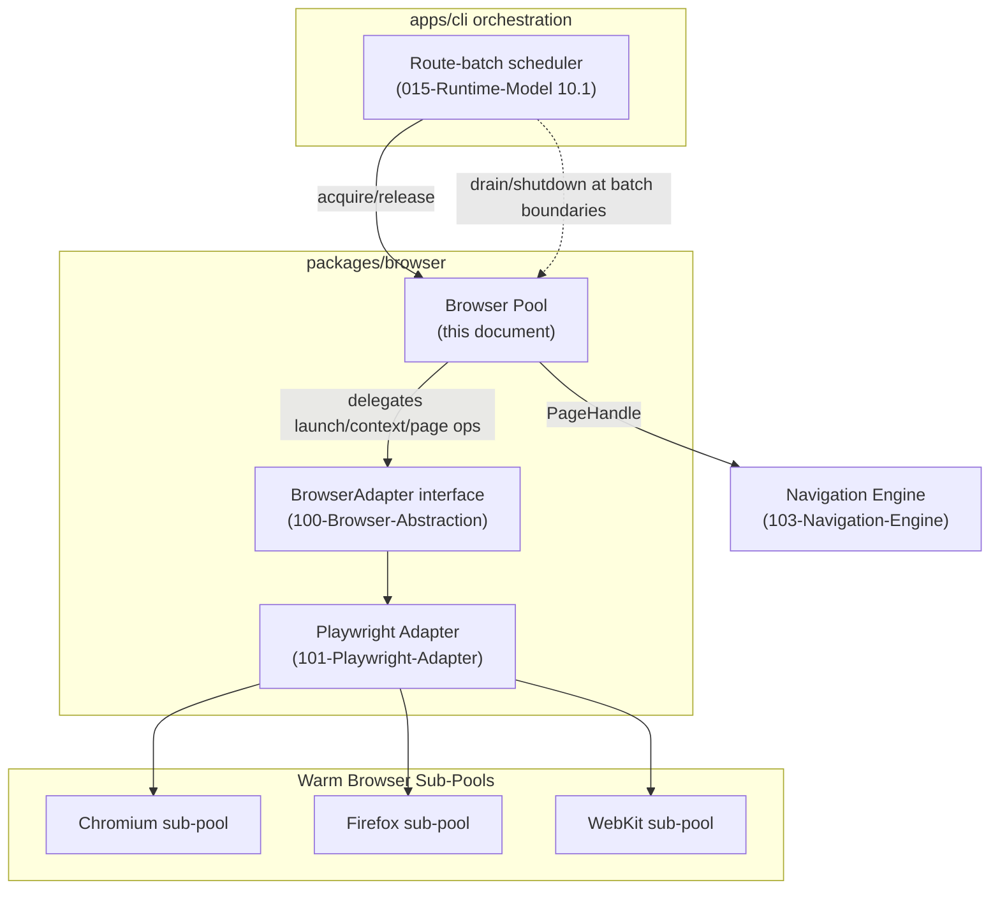
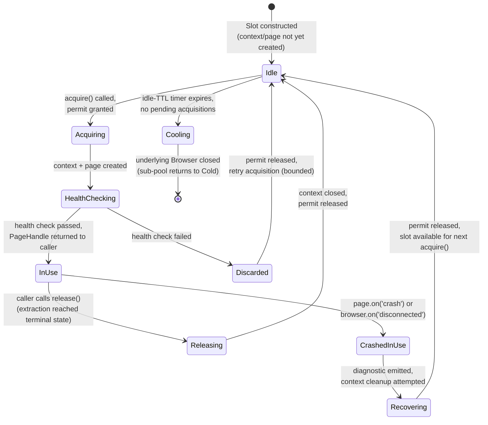
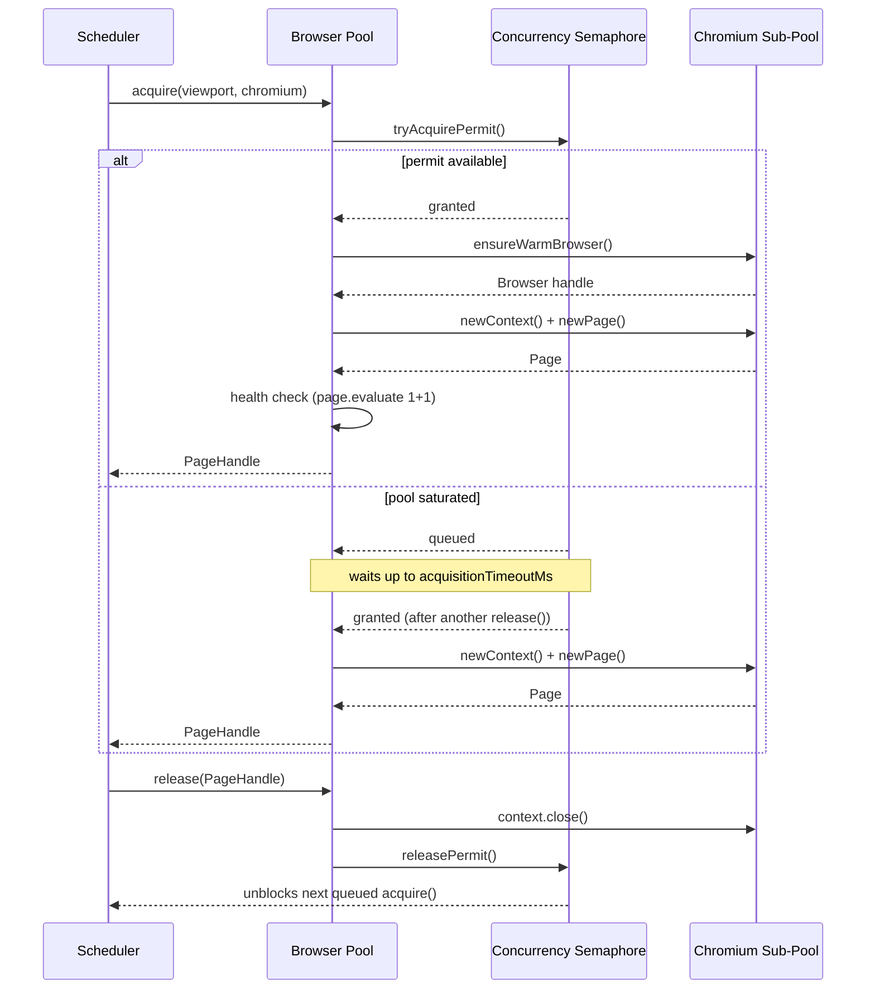

# 102 — Browser Pool

## 1. Title

**Critical CSS Extraction Engine — Browser Pool Design**

## 2. Version

| Field | Value |
|---|---|
| Document Version | 1.0.0 |
| Status | Accepted |
| Last Updated | 2026-07-09 |
| Owners | Core Architecture Working Group |
| Stability | Stable core model; sizing heuristics subject to refinement in Phase 14 (`docs/performance/`) |

## 3. Purpose

This document specifies the concrete design of the Browser Pool: the component inside the Browser Manager (`packages/browser`, per the module table in `BRIEF.md` Section 2.4) that owns the lifecycle of Playwright `Browser`, `BrowserContext`, and `Page` objects and hands out ready-to-navigate page handles to the orchestration layer. [015-Runtime-Model.md](../architecture/015-Runtime-Model.md) Section 8.2 introduces the pool's lifecycle states at the architecture level and explicitly defers a fuller treatment to this document; [ADR-0003-Playwright-As-Browser-Abstraction](../adr/ADR-0003-Playwright-As-Browser-Abstraction.md) commits to Playwright as the underlying library and sketches an initial acquire/release algorithm. This document is the implementation-grade specification that reconciles and extends both: the exact acquisition/release protocol, health-check and crash-recovery procedures, warm-up strategy, the interaction between pool sizing and the worker-thread/route-batching concurrency model from [015-Runtime-Model.md](../architecture/015-Runtime-Model.md) Section 8.3, backpressure behavior when the pool is saturated, and graceful drain/shutdown semantics.

Where [ADR-0003](../adr/ADR-0003-Playwright-As-Browser-Abstraction.md) answers "which library" and [015-Runtime-Model.md](../architecture/015-Runtime-Model.md) answers "in which process," this document answers "exactly what object-lifecycle state machine runs inside `packages/browser`, and what is the implementer's contract for calling `acquire()`/`release()` correctly." It is written at the level of detail needed to implement `packages/browser`'s pool module without re-deriving policy decisions already made upstream.

## 4. Audience

- Implementers of `packages/browser`'s pool module, who must translate this document's state machine and algorithms into working TypeScript/JavaScript against the Playwright API.
- Implementers of `apps/cli`'s orchestration layer ([011-Execution-Pipeline.md](../architecture/011-Execution-Pipeline.md)'s `BrowserAcquired`/`Navigated` states), who are the pool's primary caller and must understand its acquisition contract, failure modes, and backpressure signals to implement the `RetryingBrowserAcquisition` super-state correctly.
- Implementers of the Navigation Engine ([103-Navigation-Engine.md](./103-Navigation-Engine.md)), who receive `PageHandle`s from this pool and must understand what guarantees (isolation, freshness, health) those handles carry.
- CI/CD platform engineers sizing runner resources against this document's pool-sizing guidance and the concurrency model in [015-Runtime-Model.md](../architecture/015-Runtime-Model.md).
- Reviewers evaluating changes to pool sizing, crash-recovery policy, or shutdown sequencing.

Readers are assumed to be senior engineers comfortable with Playwright's `Browser`/`BrowserContext`/`Page` object model, finite state machines, and general resource-pooling patterns (connection pools, thread pools). This is not an introduction to pooling as a concept.

## 5. Prerequisites

- [015-Runtime-Model.md](../architecture/015-Runtime-Model.md) Section 8.2 (Browser Pool Lifecycle, the state diagram this document elaborates) and Section 8.3 (the three-axis concurrency model this document's sizing guidance must compose with).
- [ADR-0003-Playwright-As-Browser-Abstraction](../adr/ADR-0003-Playwright-As-Browser-Abstraction.md), including its acquire/release pseudocode (Algorithms section) and its Tradeoffs table, both of which this document extends rather than restates from scratch.
- [006-Design-Principles.md](../architecture/006-Design-Principles.md) Principle 1 (the Browser Is the Source of Truth, the reason a pool of real browsers exists at all) and Principle 6 (Fail-Fast Diagnostics, which governs how this document's crash/health-check failures are surfaced).
- [011-Execution-Pipeline.md](../architecture/011-Execution-Pipeline.md) Section 8.3 and 8.15 (the `BrowserAcquired` state and its retry super-state), which is this pool's primary consumer-side contract.
- Familiarity with Playwright's `Browser`, `BrowserContext`, and `Page` lifecycle and the `browser.on('disconnected')` / `page.on('crash')` event model.

## 6. Related Documents

- [015-Runtime-Model.md](../architecture/015-Runtime-Model.md) — the two-tier process model and three-axis concurrency taxonomy this pool's sizing must respect.
- [011-Execution-Pipeline.md](../architecture/011-Execution-Pipeline.md) — the `BrowserAcquired` state and `RetryingBrowserAcquisition` super-state that call into this pool.
- [ADR-0003-Playwright-As-Browser-Abstraction](../adr/ADR-0003-Playwright-As-Browser-Abstraction.md) — the library choice and initial acquire/release sketch this document formalizes.
- [006-Design-Principles.md](../architecture/006-Design-Principles.md) — Principles 1, 3, and 6.
- [100-Browser-Abstraction.md](./100-Browser-Abstraction.md) — the `BrowserAdapter` interface this pool is implemented behind, per ADR-0003 Implementation Notes item 5; this document assumes that seam exists and describes the pool as a consumer/implementer of it.
- [101-Playwright-Adapter.md](./101-Playwright-Adapter.md) — the concrete Playwright-specific adapter implementation that this pool's internals call into for actual `launch()`/`newContext()`/`newPage()` operations.
- [103-Navigation-Engine.md](./103-Navigation-Engine.md) — the primary consumer of the `PageHandle`s this pool issues; navigation-level timeout/retry policy is specified there, not here.
- [105-Viewport-Manager.md](./105-Viewport-Manager.md) — the source of the `ViewportProfile` values this pool's `acquire()` accepts and uses to parameterize `newContext()`.

## 7. Overview

A Browser Pool exists because launching a browser process is expensive relative to navigating a page within an already-running one. Playwright's own benchmarks and this project's own performance goals (per [015-Runtime-Model.md](../architecture/015-Runtime-Model.md) Section 14 and [ADR-0003](../adr/ADR-0003-Playwright-As-Browser-Abstraction.md) Algorithms) place browser cold-start in the hundreds-of-milliseconds-to-several-seconds range, while context/page creation against an already-warm browser is an order of magnitude cheaper. A route manifest with hundreds or thousands of entries (per `BRIEF.md` Section 2.9's wildcard route patterns) that paid the cold-start cost per route would be dominated by launch overhead rather than actual extraction work. The pool's entire reason to exist is to amortize that one expensive operation — `Browser` process launch — across many cheap operations — `BrowserContext`/`Page` acquisition — while preserving the correctness-critical guarantee that each route/viewport extraction runs against a cleanly isolated context (per [015-Runtime-Model.md](../architecture/015-Runtime-Model.md) Section 8.2's "`BrowserContext` is the isolation unit, not `Page`" property).

This document treats the pool as three nested resource layers, each with its own acquisition cost and its own reuse policy:

1. **`Browser` instances** — the most expensive to create, the most coarsely reused, held "warm" across many contexts and (ideally) across the lifetime of a CLI batch invocation.
2. **`BrowserContext`s** — the isolation unit; created per logical extraction unit (typically per route×viewport, though see Edge Cases for context-reuse exceptions), cheap relative to `Browser` launch but not free, and always torn down (never object-pooled across routes) by default to guarantee isolation.
3. **`Page`s** — created within a context, one per navigation; may be reset and reused within the same context for sequential same-viewport work when explicitly configured (see Section 8.4), but are never shared across concurrent extractions.

The pool exposes a small, explicit contract to its callers: `acquire(viewportProfile, engine) -> PageHandle` and `release(pageHandle) -> void`, plus lifecycle-management operations (`warmUp()`, `drain()`, `shutdown()`) that the CLI orchestrator invokes at batch start and end. Everything else — which `Browser` instance backs a given `PageHandle`, whether a context is fresh or reset, whether a health check ran before handing out the handle — is an internal pool concern hidden behind that contract, consistent with the `BrowserAdapter` seam established in [ADR-0003](../adr/ADR-0003-Playwright-As-Browser-Abstraction.md) Implementation Notes item 5.

## 8. Detailed Design

### 8.1 Pool Sizing Strategy: Fixed-Size vs. Elastic

**Statement of the choice.** The pool uses a **fixed-size ceiling with lazy, on-demand warm-up up to that ceiling**, not a fully elastic pool that grows and shrinks its `Browser`/`Context` counts in response to instantaneous load, and not a strictly eager pool that launches all capacity at startup before any work begins.

**Why not fully elastic.** An elastic pool that spins up additional `BrowserContext`s (or additional `Browser` processes) whenever the orchestrator's demand momentarily exceeds current capacity, and tears them down when demand subsides, sounds attractive for bursty workloads, but it conflicts with two things this project already treats as settled: first, [015-Runtime-Model.md](../architecture/015-Runtime-Model.md) Section 8.5 identifies Tier-2 (browser process) memory as the dominant, target-page-dependent memory cost in the whole system, and an elastic pool that grows in response to demand rather than a deliberately configured ceiling removes the single most direct lever ([015-Runtime-Model.md](../architecture/015-Runtime-Model.md) Section 14's "Scalability limits") an operator has for keeping a CI runner within its memory budget. Second, [006-Design-Principles.md](../architecture/006-Design-Principles.md) Principle 5 (Determinism) is easier to reason about, and easier to load-test, against a pool whose maximum concurrent browser-side resource usage is a static, known quantity rather than a function of transient demand spikes. A fixed ceiling, configured by the operator (`maxConcurrency`, matching the same knob referenced in [015-Runtime-Model.md](../architecture/015-Runtime-Model.md) Section 10.1's scheduling algorithm), makes the pool's worst-case resource footprint knowable in advance — a hard requirement for the "suitable for enterprise CI pipelines" acceptance criterion (`BRIEF.md` Section 2.18).

**Why not strictly eager (launch-everything-at-startup).** The alternative extreme — launching `maxConcurrency` full `Browser`/`Context`/`Page` triples at pool construction, before any route is known — was rejected because it pays the full warm-up cost even for batches smaller than `maxConcurrency` (a common case: a CI job re-extracting three changed routes out of a thousand-route manifest should not pay for a thousand-context warm-up), and because a per-`Browser`-instance sharding strategy (Section 8.2) benefits from knowing the actual engine/viewport mix of the incoming batch before committing to how many `Browser` processes of each engine to launch.

**The chosen middle ground.** The pool exposes an *optional* `warmUp(expectedConcurrency)` call (Section 8.5) that the CLI orchestrator may invoke once it has expanded the route manifest and knows the batch size, pre-launching a number of `Browser` instances bounded by `min(expectedConcurrency, maxConcurrency)`. Absent an explicit `warmUp()` call, the pool launches lazily on first `acquire()`, exactly as sketched in [ADR-0003](../adr/ADR-0003-Playwright-As-Browser-Abstraction.md)'s Algorithms section. This gives batch-aware callers (the common case, since `apps/cli` always expands the manifest before dispatching work, per [011-Execution-Pipeline.md](../architecture/011-Execution-Pipeline.md) Section 8.1) the option to eliminate the very first request's cold-start latency, while callers that do not know their batch size in advance (e.g., a future SSR middleware invoking the engine per-request, per `BRIEF.md` Section 2.10) still get correct, if slightly slower, lazy behavior on the first request.

**What this permits.**
- Configuring `maxConcurrency` per environment (lower on a memory-constrained CI runner, higher on a dedicated extraction host), with the pool enforcing it as a hard ceiling via a counting semaphore (Section 10.1).
- Calling `warmUp()` with a size smaller than `maxConcurrency` when the known batch is small, avoiding wasted launches.
- Growing the *number of `Browser` processes actually running* within `[1, maxConcurrency]` bounds dynamically based on the engine mix actually requested (Section 8.2), without that being "elastic" in the sense rejected above — this is bounded growth toward a static ceiling, not unbounded growth in response to load.

**What this forbids.**
- Raising the effective concurrency ceiling in response to queue depth or wait-time pressure without an explicit operator reconfiguration and restart (the "dynamic backpressure-driven `maxConcurrency` adjustment" idea is explicitly deferred; see [015-Runtime-Model.md](../architecture/015-Runtime-Model.md) Future Work's "memory-pressure backpressure signal" open question, which this document defers on identically).
- Silently exceeding `maxConcurrency` under any circumstance, including retry storms (Section 8.7) or plugin-driven `beforeLaunch` customization — the ceiling is enforced at the semaphore layer, beneath any policy layer that could otherwise be tempted to bypass it.

### 8.2 Browser-Instance Sharding by Engine

Per [ADR-0003](../adr/ADR-0003-Playwright-As-Browser-Abstraction.md)'s decision tree (Architecture section, "Decision Tree: Engine Selection per Extraction Mode"), a single pool instance may need to serve requests targeting different engines (Chromium, Firefox, WebKit) within the same batch, most commonly because Coverage/Hybrid mode forces Chromium while a CSSOM-only run may target any engine, or because a future multi-engine consensus mode (flagged as future work in [ADR-0001](../adr/ADR-0001-Browser-Is-Source-of-Truth.md) and [ADR-0003](../adr/ADR-0003-Playwright-As-Browser-Abstraction.md)) fans a single route out across all three. The pool therefore maintains **one independent sub-pool per engine key**, each with its own warm `Browser` instance(s), its own context-count accounting, and its own idle-TTL clock. `maxConcurrency` is enforced globally across all sub-pools combined (a single semaphore shared across engine keys), not per-engine, because the resource being bounded — host memory and CPU, per [015-Runtime-Model.md](../architecture/015-Runtime-Model.md) Section 14 — is a shared, engine-agnostic resource; a batch that happens to request only Chromium should be able to use the full `maxConcurrency` ceiling, not be capped at `maxConcurrency / 3` on the assumption that all three engines are equally likely.

### 8.3 Acquisition/Release Lifecycle

The pool's externally visible contract has exactly two steady-state operations, `acquire()` and `release()`, whose internals are specified precisely here because subtle mistakes here (returning a `Page` before its context is ready, releasing a context before in-flight `page.evaluate()` calls resolve) are exactly the class of bug this specification exists to prevent.

**`acquire(viewportProfile, engine)`** performs, in order:
1. Acquire a concurrency permit from the global semaphore (Section 10.1), blocking/queueing if the pool is at `maxConcurrency` (this is the backpressure point, elaborated in Section 8.6).
2. Resolve or launch the engine-keyed sub-pool's warm `Browser` instance (Section 8.2), running the `beforeLaunch` plugin hook exactly once per `Browser` launch (not per `acquire()` call) if this acquisition triggers a fresh launch — consistent with [011-Execution-Pipeline.md](../architecture/011-Execution-Pipeline.md) Section 8.3's placement of `beforeLaunch` before pool commitment.
3. Create a fresh `BrowserContext` on that `Browser`, parameterized by `viewportProfile` (dimensions, device scale factor, user agent, color scheme — per [ADR-0003](../adr/ADR-0003-Playwright-As-Browser-Abstraction.md) Algorithms and delegated in detail to [105-Viewport-Manager.md](./105-Viewport-Manager.md)).
4. Create a `Page` within that context.
5. Run a lightweight **health check** (Section 8.4) against the new `Page` before returning it, to catch a class of failure where context/page creation nominally succeeds but the underlying renderer is already unhealthy (rare, but observed in practice under host memory pressure).
6. Return a `PageHandle` — an opaque wrapper the pool uses internally to track which permit, context, and browser a given page belongs to, without exposing raw Playwright objects beyond what [103-Navigation-Engine.md](./103-Navigation-Engine.md) needs.

**`release(pageHandle)`** performs, in order:
1. Verify no in-flight operation is still pending against the page (the caller's contract, enforced defensively — see Edge Cases — is that `release()` is only called after the full extraction pipeline for that route/viewport has reached a terminal state per [011-Execution-Pipeline.md](../architecture/011-Execution-Pipeline.md)).
2. Close the `BrowserContext` (which implicitly closes all pages within it) — the default policy, chosen for isolation (Section 8.1's isolation-unit rationale); page-level reuse without a fresh context is an explicit opt-in (Section 8.9's Edge Cases discussion).
3. Decrement the engine-keyed sub-pool's active-context counter.
4. Release the concurrency permit back to the global semaphore, which may immediately unblock a queued `acquire()` (Section 8.6).
5. If the sub-pool's active-context counter reaches zero and the idle-TTL timer has not been disabled, start (or reset) an idle-TTL timer that, on expiry, closes the underlying `Browser` instance (Section 8.5's warm-pool teardown), returning that sub-pool to the `Cold` state per [015-Runtime-Model.md](../architecture/015-Runtime-Model.md) Section 8.2's diagram.

### 8.4 Health Checks and Crash Recovery

**Health check on acquisition.** Before returning a `PageHandle` from `acquire()`, the pool performs a minimal liveness probe: evaluating a trivial expression (e.g., `1 + 1`) via `page.evaluate()` under a short, fixed timeout (measured in tens of milliseconds, far shorter than any navigation timeout). This catches the case where the underlying `Browser` process has entered a degraded state (e.g., about to be killed by the OS under memory pressure) that has not yet surfaced as a hard `disconnected` event but already manifests as unresponsiveness. A failed health check at this point is treated as a **fresh acquisition failure**, not as a crash of an in-use page — the pool discards the just-created context/page, does not decrement any "in use" accounting beyond what was never incremented, and retries acquisition against the sub-pool once (launching a new `Browser` if the existing one appears unresponsive), before surfacing a `BrowserAcquisitionFailed` diagnostic to the caller if the retry also fails.

**Crash detection during use.** Once a `PageHandle` is in the caller's hands (mid-extraction, in [015-Runtime-Model.md](../architecture/015-Runtime-Model.md) Section 8.2's `InUse` state), the pool subscribes to Playwright's `page.on('crash')` event and the owning `browser.on('disconnected')` event for the lifetime of the handle. Per Chromium's site-isolation model (as characterized in [015-Runtime-Model.md](../architecture/015-Runtime-Model.md) Section 8.2, property 2), a page crash is isolated to that page/context; the pool's crash handler:
1. Marks the `PageHandle` as `Crashed` and immediately surfaces a `RendererCrashedError` diagnostic (attributed with route/viewport context, per [006-Design-Principles.md](../architecture/006-Design-Principles.md) Principle 6) to whichever `await` on that handle's pending operation is outstanding — this is what allows [011-Execution-Pipeline.md](../architecture/011-Execution-Pipeline.md)'s state machine to observe the crash as an attributable failure of whichever state (`Navigated`, `DomCollected`, etc.) was in progress, rather than a silent hang.
2. Cleans up the crashed context (Playwright's own object may already be in a torn-down state; the pool defensively calls `context.close()` with errors swallowed, since a double-close on an already-invalid handle is expected and not itself a new failure).
3. Releases the concurrency permit (the same as a normal `release()`'s step 4), since a crashed page is no longer consuming the resource it once was.
4. Does **not** automatically retry the crashed route/viewport itself — per [011-Execution-Pipeline.md](../architecture/011-Execution-Pipeline.md) Section 8.6's reasoning for `DomCollected` failures, retry-in-place risks operating against inconsistent state, and the correct recovery is a fresh `acquire()` from the orchestrator's own retry logic (`RetryingBrowserAcquisition`/`RetryingNavigation`), which this pool document treats as the caller's responsibility, not this component's.

**Browser-level disconnection.** If the `Browser` process itself disconnects (distinct from a single page crashing — this is the whole process going away, e.g., killed by the OS OOM-killer), every `PageHandle` currently checked out against that `Browser`'s contexts is marked `Crashed` via the same procedure above, the sub-pool's warm-`Browser` reference is cleared (returning that engine key to `Cold`), and any concurrency permits held by those handles are released. The next `acquire()` against that engine key triggers a fresh `Launching` transition.

### 8.5 Warm-Up Strategy

Three warm-up modes are supported, selectable via `ResolvedConfig`:

1. **Lazy (default).** No `Browser` is launched until the first `acquire()` call. Simplest, correct for all workloads, but the very first acquisition in a batch pays full cold-start latency.
2. **Explicit batch warm-up.** `apps/cli` calls `pool.warmUp(expectedConcurrency, engineHint)` once it has expanded the route manifest (per [011-Execution-Pipeline.md](../architecture/011-Execution-Pipeline.md) Section 8.1's `ConfigResolved` state) and before dispatching the first `acquire()`. This launches `min(expectedConcurrency, maxConcurrency)` `Browser` instance(s) for the dominant engine (or engines, if the manifest genuinely mixes engines) in parallel, so that by the time the route-batch scheduler ([015-Runtime-Model.md](../architecture/015-Runtime-Model.md) Section 10.1) begins issuing `acquire()` calls, warm capacity is already available.
3. **Persistent cross-invocation warm pool (future work).** [ADR-0003](../adr/ADR-0003-Playwright-As-Browser-Abstraction.md) Future Work flags "persistent, long-lived browser worker pools shared across CI job runs" as a research idea; this document's pool is designed to make that additive (a pool that attaches to an already-running, out-of-process `Browser` via Playwright's `connect()` API rather than `launch()`) but does not implement it — see Future Work below.

**Why explicit warm-up is opt-in rather than automatic.** Automatically warming up to `maxConcurrency` on every pool construction, regardless of actual batch size, was rejected for the same reason strict eager sizing was rejected in Section 8.1: it wastes launch cost on small batches and, more subtly, it removes the CLI orchestrator's ability to make an informed decision using information (the expanded route count) that the pool itself does not have at construction time.

### 8.6 Backpressure Under Saturation

When `acquire()` is called and the pool is already at `maxConcurrency` (all permits held), the caller's request enters a **FIFO wait queue** on the semaphore rather than failing immediately. This is a deliberate choice: [015-Runtime-Model.md](../architecture/015-Runtime-Model.md) Section 10.1's route-batch scheduler is explicitly designed around a "refill on completion" model that assumes `acquire()` calls beyond current capacity simply wait rather than error, and converting saturation into an immediate error would push the scheduler to implement its own queueing on top of the pool's, duplicating logic that belongs in one place.

Waiting is bounded, not indefinite: `acquire()` accepts an optional `acquisitionTimeoutMs` (surfaced up through `ResolvedConfig`, defaulting to a value large enough to tolerate normal queueing under expected `maxConcurrency` saturation, but finite). If the timeout elapses before a permit becomes available, `acquire()` rejects with a `PoolExhaustedTimeoutError`, which [011-Execution-Pipeline.md](../architecture/011-Execution-Pipeline.md)'s `BrowserAcquired` state treats as a transient failure eligible for `RetryingBrowserAcquisition` (Section 8.15 of that document). This bound exists specifically to satisfy REQ-554-style timeout protection (referenced throughout [015-Runtime-Model.md](../architecture/015-Runtime-Model.md)): a pool that queues forever under sustained overload converts a capacity problem into an availability problem for the whole batch, since a CLI process that never times out never reports progress or fails a build within a bounded wall-clock budget.

### 8.7 Retry Storms and Permit Accounting

A subtlety flagged in [015-Runtime-Model.md](../architecture/015-Runtime-Model.md) Section 12's Edge Cases (worker-thread and batch-retry interaction) applies directly to this pool: if many work units simultaneously hit `RetryingBrowserAcquisition` (e.g., because a shared `Browser` instance just crashed, per Section 8.4's browser-disconnection handling, invalidating many in-flight acquisitions at once), all of them re-enter `acquire()` at roughly the same time. The pool's semaphore-based backpressure (Section 8.6) already bounds how many can be *in flight* concurrently, but the *retry backoff* itself (per [011-Execution-Pipeline.md](../architecture/011-Execution-Pipeline.md) Section 10.1's jittered exponential backoff) is what prevents every one of those retries from re-attempting `acquire()` in the same instant and re-triggering a thundering-herd re-launch race. This pool document's responsibility is limited to ensuring that a `Browser` re-launch triggered by one retrying caller is **shared** — via a single in-flight "launching" promise per engine key that concurrent callers await rather than each independently calling `playwright[engine].launch()` — so that N simultaneous retries after a shared-browser crash result in exactly one re-launch, not N races to relaunch the same engine key.

### 8.8 Graceful Shutdown and Drain

The pool exposes `drain()` and `shutdown()` as distinct operations, mirroring the distinction between "stop accepting new work but let in-flight work finish" and "tear everything down now."

**`drain()`** stops the pool from granting new concurrency permits (new `acquire()` calls queue indefinitely, or immediately reject with a `PoolDrainingError` if a `failFastOnDrain` flag is set — used by the CLI when a batch is being cancelled) while allowing all currently checked-out `PageHandle`s to complete their `release()` naturally. `drain()` returns a promise that resolves once the last outstanding permit is released. This is the mechanism `apps/cli` uses at the end of a normal batch run: request a drain, await its completion (which happens as the last few in-flight routes finish), then proceed to `shutdown()`.

**`shutdown()`** unconditionally closes every warm `Browser` instance across every engine-keyed sub-pool, regardless of whether contexts are still checked out (this should only be reached after `drain()` has resolved in the normal path, but `shutdown()` itself does not wait — it is the forceful counterpart, used on SIGTERM/SIGINT or a fatal top-level error, matching [015-Runtime-Model.md](../architecture/015-Runtime-Model.md) Section 8.2's `Warm → ShuttingDown` transition triggered by "pool drain requested (CLI run complete, or SIGTERM)"). `shutdown()` also cancels any pending idle-TTL timers (Section 8.3, `release()` step 5) to avoid a timer firing against an already-closed `Browser`.

**Why two operations rather than one.** A single combined "stop" operation was considered and rejected because the CLI's two real-world triggers — "batch finished normally" and "process is being killed" — have genuinely different correctness requirements: the former must not corrupt in-flight extractions (their results are still being written to disk, per [015-Runtime-Model.md](../architecture/015-Runtime-Model.md) Section 8.5's streaming-output model, and abruptly closing their `Browser` mid-`page.evaluate()` would produce a `RendererCrashedError` for routes that were otherwise about to succeed cleanly), while the latter must complete quickly and unconditionally regardless of in-flight state, because a process handling SIGTERM has a bounded grace period before the OS sends SIGKILL.

## 9. Architecture

### 9.1 Component Placement



This diagram places the pool precisely within `packages/browser`, consuming the `BrowserAdapter` seam from [100-Browser-Abstraction.md](./100-Browser-Abstraction.md) (so the pool's own logic — sizing, health checks, backpressure, drain — is Playwright-agnostic, with only [101-Playwright-Adapter.md](./101-Playwright-Adapter.md) touching the concrete Playwright API), and handing `PageHandle`s onward to the Navigation Engine, which owns everything that happens *after* a page is acquired (Section 6, and see [103-Navigation-Engine.md](./103-Navigation-Engine.md)).

### 9.2 Pool Slot State Diagram



This is the per-slot lifecycle referenced in the task framing (idle → acquired → in-use → releasing → idle/crashed → recycled), expressed as a state diagram consistent with, and one level more granular than, [015-Runtime-Model.md](../architecture/015-Runtime-Model.md) Section 8.2's pool-wide lifecycle diagram — that document's diagram describes the pool's `Browser`-level states (`Cold`, `Warm`, `ShuttingDown`); this diagram describes a single concurrency slot's states within an already-warm pool. Both are accurate simultaneously at different granularities, exactly as [015-Runtime-Model.md](../architecture/015-Runtime-Model.md) itself is at a coarser granularity than [011-Execution-Pipeline.md](../architecture/011-Execution-Pipeline.md)'s per-work-unit state machine.

### 9.3 Acquire/Release Sequence Under Contention



## 10. Algorithms

### 10.1 Algorithm: Bounded Concurrency Permit Acquisition

**Problem statement.** Given a global ceiling `maxConcurrency` on simultaneously checked-out `PageHandle`s, and a stream of `acquire()`/`release()` calls potentially originating from multiple async call sites (and, per [015-Runtime-Model.md](../architecture/015-Runtime-Model.md) Section 8.4's pattern (a), potentially multiple worker threads in a future architecture), grant permits fairly (FIFO) and never exceed the ceiling, while bounding how long any single caller waits.

**Inputs.** `maxConcurrency: number`, a stream of `acquire(timeoutMs)` / `release()` calls.

**Outputs.** For each `acquire()` call: a granted permit (eventually) or a `PoolExhaustedTimeoutError`.

**Pseudocode.**
```text
class ConcurrencySemaphore:
    permits: number = maxConcurrency
    waitQueue: Queue<{resolve, reject, deadline}> = []

    function acquire(timeoutMs) -> Promise<void>:
        if permits > 0:
            permits -= 1
            return resolved()
        entry = { resolve, reject, deadline: now() + timeoutMs }
        waitQueue.push(entry)
        scheduleTimeout(entry, timeoutMs, () => {
            removeFromQueue(entry)
            entry.reject(PoolExhaustedTimeoutError)
        })
        return entry.promise

    function release() -> void:
        if waitQueue.isEmpty():
            permits += 1
        else:
            entry = waitQueue.shift()   // FIFO
            cancelTimeout(entry)
            entry.resolve()             // permit transferred directly, never incremented then re-decremented
```

**Time complexity.** `O(1)` amortized per `acquire()`/`release()` call given a queue with O(1) push/shift (a deque); `removeFromQueue` on timeout is `O(1)` if the queue entry retains a handle to its own position (a doubly linked list node), `O(n)` if implemented naively over an array — the reference implementation must use the linked-list form to keep timeout cancellation cheap under high queue depth.

**Memory complexity.** `O(w)` where `w` is the number of currently waiting callers, bounded in practice by how many work units the route-batch scheduler ([015-Runtime-Model.md](../architecture/015-Runtime-Model.md) Section 10.1) allows to be simultaneously pending against the pool — which that scheduler itself already bounds by not launching more `extractRoute()` calls than make sense relative to `maxConcurrency`, so `w` is typically small and transient in the reference architecture, never `O(routes)`.

**Failure cases.** A caller that acquires a permit and never releases it (a bug, or an unhandled exception path that skips `release()`) permanently leaks a permit and shrinks effective capacity for the remainder of the process's life; this is why `release()` must be called from a `finally`-equivalent block in every caller, and why the pool additionally exposes a diagnostic counter (permits granted vs. released) that the Reporter can surface if the two diverge over a batch run, catching leaks even when no single request times out.

**Optimization opportunities.** For very high-throughput scenarios (many short-lived acquisitions), the permit-transfer-on-release path (avoiding an increment followed immediately by a decrement for the queue-non-empty case) is already the optimized form shown above; a further refinement — batching multiple pending `release()`/`acquire()` pairs within the same microtask tick — is not needed at this pool's expected scale (bounded by realistic `maxConcurrency` values, typically tens, not thousands) and is not planned.

### 10.2 Algorithm: Engine-Keyed Sub-Pool Warm Browser Resolution with Shared In-Flight Launch

**Problem statement.** Given concurrent `acquire()` calls targeting the same engine key while no warm `Browser` currently exists for that key (either at cold start, or immediately after a crash per Section 8.4/8.7), ensure exactly one `launch()` call occurs, with all concurrent callers awaiting its single result, rather than each caller independently racing to launch.

**Inputs.** `engineKey: string`, concurrent calls to `ensureWarmBrowser(engineKey)`.

**Outputs.** A shared `Browser` handle, or a launch failure propagated identically to all waiters.

**Pseudocode.**
```text
inFlightLaunches: Map<engineKey, Promise<Browser>> = {}
warmBrowsers: Map<engineKey, Browser> = {}

function ensureWarmBrowser(engineKey) -> Promise<Browser>:
    if warmBrowsers.has(engineKey) and warmBrowsers.get(engineKey).isConnected():
        return resolved(warmBrowsers.get(engineKey))

    if inFlightLaunches.has(engineKey):
        return inFlightLaunches.get(engineKey)   // join the existing launch

    launchPromise = adapter.launch(engineKey, launchOptions)
        .then(browser => {
            warmBrowsers.set(engineKey, browser)
            inFlightLaunches.delete(engineKey)
            browser.on('disconnected', () => warmBrowsers.delete(engineKey))
            return browser
        })
        .catch(err => {
            inFlightLaunches.delete(engineKey)
            throw err
        })

    inFlightLaunches.set(engineKey, launchPromise)
    return launchPromise
```

**Time complexity.** `O(1)` for every caller beyond the one that actually triggers `adapter.launch()`; the launch itself is the same large-constant-factor cold-start cost characterized in [ADR-0003](../adr/ADR-0003-Playwright-As-Browser-Abstraction.md) Algorithms, paid exactly once regardless of how many concurrent callers are waiting on it.

**Memory complexity.** `O(1)` additional bookkeeping (one map entry per engine key with an in-flight launch), independent of the number of waiting callers, since all waiters share the same promise object rather than each holding independent state.

**Failure cases.** If the shared launch fails, every waiter's `.catch()` sees the same rejection; the pool must not silently retry the launch on behalf of all waiters transparently (that would hide N-fold retry amplification behind what looks like one failure) — instead, each waiter's own caller-side retry policy ([011-Execution-Pipeline.md](../architecture/011-Execution-Pipeline.md) Section 8.15's `RetryingBrowserAcquisition`) independently decides whether to retry, and a retry re-enters `ensureWarmBrowser()` fresh, which may itself coalesce again if multiple retries land concurrently.

**Optimization opportunities.** None required at expected scale; this pattern (promise-memoization for in-flight, idempotent async work) is a standard, already-optimal solution to the thundering-herd class of problem for a single shared resource.

## 11. Implementation Notes

- The pool must be implemented against the `BrowserAdapter` interface ([100-Browser-Abstraction.md](./100-Browser-Abstraction.md)), never against Playwright's `chromium`/`firefox`/`webkit` namespace objects directly, so that this document's algorithms (Sections 10.1, 10.2) remain library-agnostic and testable with a fake adapter (Section 15).
- `PageHandle` should be an opaque, pool-issued token (e.g., wrapping an internal UUID plus a reference to the underlying `Page`) rather than a raw `Page` re-export, so that the pool retains the ability to intercept every navigation-level operation for health-check and crash-attribution purposes without the Navigation Engine needing to cooperate explicitly on every call.
- The concurrency semaphore (Section 10.1) must be a single, pool-wide instance shared across all engine-keyed sub-pools (Section 8.2), not one semaphore per sub-pool, to correctly enforce the global `maxConcurrency` ceiling described in Section 8.2.
- Idle-TTL teardown (Section 8.3, `release()` step 5) timers must be cancelled, not merely ignored, on `shutdown()` (Section 8.8) to avoid a dangling `setTimeout` attempting to close an already-closed `Browser` and throwing an unhandled rejection during process exit.
- Health-check timeouts (Section 8.4) should be configurable but default to a value at least an order of magnitude smaller than the navigation timeout, so that a health-check failure is diagnosed as an acquisition problem quickly, rather than silently consuming a meaningful fraction of the caller's own timeout budget.
- The pool's diagnostic counters (permits granted/released, cold starts per engine key, crash count, health-check failure count) should be exposed through the same `Diagnostic`/Reporter channel used everywhere else in the system (per [006-Design-Principles.md](../architecture/006-Design-Principles.md) Principle 6), not as ad hoc internal metrics invisible to the Reporter.

## 12. Edge Cases

- **Context reuse for sequential same-viewport routes.** Section 8.3's default (`release()` always closes the context) is correctness-first; an opt-in `reuseContextForSameViewport` mode (referenced but not detailed in [015-Runtime-Model.md](../architecture/015-Runtime-Model.md) Section 8.2's `Releasing → PageAcquired` transition) resets a `Page` within the same context for the next route instead of closing/recreating the context, saving context-creation cost at the risk of `localStorage`/cookie state leaking between routes if the target application itself sets persistent state — this mode must be opt-in and documented as changing the isolation guarantee, never a silent default.
- **`acquire()` called after `drain()` has begun.** Per Section 8.8, this either queues (default) or rejects immediately with `PoolDrainingError` (if `failFastOnDrain` is set); implementers must ensure the choice is explicit per call, since a batch-cancellation scenario specifically wants the fail-fast behavior while a natural end-of-batch drain wants queued calls (there typically are none, since the scheduler should stop calling `acquire()` once it knows the batch is ending) to still be served correctly if any exist.
- **Health check itself timing out due to host-wide resource exhaustion, not a specific `Browser` problem.** If every engine key's health checks start failing simultaneously, this is a signal of host-level pressure (e.g., approaching `maxConcurrency`'s memory ceiling), and the pool should surface a distinct, aggregated `PoolDegradedDiagnostic` (rather than N independent per-acquisition diagnostics that obscure the systemic nature of the problem) once a configurable failure-rate threshold within a time window is crossed.
- **`browser.on('disconnected')` firing during `shutdown()` itself.** Since `shutdown()` deliberately closes every `Browser`, the resulting `disconnected` events are expected, not crashes; the pool must distinguish "disconnection because we asked for it" from "disconnection because it crashed" (e.g., via an internal `isShuttingDown` flag checked before treating a disconnection as a `RendererCrashedError`), otherwise every normal shutdown would spuriously emit crash diagnostics for every in-progress route, which is misleading and would train operators to ignore real crash diagnostics.
- **Warm-up requesting more capacity than `maxConcurrency`.** `warmUp(expectedConcurrency)` must clamp to `maxConcurrency` (Section 8.1) rather than either erroring or silently exceeding the ceiling; a batch known to be larger than the pool's configured ceiling is an entirely normal, expected case (per [015-Runtime-Model.md](../architecture/015-Runtime-Model.md) Section 10.1's scheduler, which is explicitly designed to process `R > C` routes over time, not all at once).
- **Cross-worker-thread pool sharing (pattern (a), deferred per [015-Runtime-Model.md](../architecture/015-Runtime-Model.md) Section 8.4).** This document's algorithms assume a single-process, potentially-multi-async-caller model (pattern (b)); if a future architecture adopts per-worker-thread independent browser connections, the global semaphore (Section 10.1) must be re-implemented as a cross-thread-safe primitive (e.g., backed by a `SharedArrayBuffer`-based counter with atomics, or coordinated through the main thread via message passing) rather than the in-process `Map`/`Queue` sketched in Section 10.1 and 10.2 — this is flagged explicitly so a future implementer does not assume today's algorithms port unchanged to that architecture.

## 13. Tradeoffs

| Decision | Why | Alternative Considered | Tradeoff Accepted |
|---|---|---|---|
| Fixed-size ceiling with lazy or explicit warm-up, not fully elastic sizing | Keeps worst-case resource footprint static and knowable, required for enterprise CI budgeting (`BRIEF.md` 2.18) | Fully elastic pool that grows/shrinks with instantaneous demand | Cannot absorb sudden demand spikes beyond `maxConcurrency` without queueing/backpressure; accepted because unbounded elastic growth directly threatens the Tier-2 memory budget characterized in [015-Runtime-Model.md](../architecture/015-Runtime-Model.md) |
| `BrowserContext` always closed on `release()` by default (no cross-route context reuse) | Preserves the isolation guarantee ([015-Runtime-Model.md](../architecture/015-Runtime-Model.md) Section 8.2 property 1) without requiring every caller to reason about state leakage | Default to context reuse for performance, opt-out for isolation | Pays a context-creation cost per route by default; accepted because a silent isolation violation (leaked `localStorage`/cookies) is a correctness bug per Principle 3/6, strictly worse than a recoverable performance cost |
| Shared in-flight launch promise per engine key (Section 10.2) rather than allowing concurrent redundant launches | Prevents thundering-herd re-launch storms after a shared-browser crash or at cold start under concurrent initial demand | Let every concurrent `acquire()` independently call `launch()` and use whichever resolves first, discarding the rest | Slightly more bookkeeping (a promise-memoization map) in exchange for avoiding wasted launch cost and resource contention from redundant simultaneous launches |
| Two-phase shutdown (`drain()` then `shutdown()`) rather than one combined stop operation | Matches the genuinely different correctness needs of "batch finished" versus "process being killed" | Single `close()` operation with a grace-period parameter | More API surface (two methods instead of one) for callers to understand, in exchange for callers being able to express intent precisely rather than approximating both cases with one timeout-based knob |
| Bounded `acquisitionTimeoutMs` on queued `acquire()` calls rather than unbounded waiting | Converts pool saturation into a diagnosable, retryable failure rather than an indefinite hang, required for REQ-554-style timeout protection | Let `acquire()` wait forever until a permit frees up | A misconfigured or overloaded batch will surface `PoolExhaustedTimeoutError`s rather than silently degrading to arbitrarily long wall-clock time, which is the intended, diagnosable failure mode |

## 14. Performance

- **CPU complexity.** The pool's own bookkeeping (semaphore operations, map lookups for engine-keyed sub-pools) is `O(1)` per `acquire()`/`release()` call; all meaningful CPU/wall-clock cost is inherent to Playwright's own `launch()`/`newContext()`/`newPage()` operations, characterized with large-constant-factor cold-start cost in [ADR-0003](../adr/ADR-0003-Playwright-As-Browser-Abstraction.md) Algorithms, which this pool amortizes but does not itself reduce.
- **Memory complexity.** Pool-internal bookkeeping is `O(engineKeys + waitingCallers)`, negligible; the dominant memory cost remains Tier-2 browser process memory, scaling with `O(maxConcurrency × avgContextMemoryFootprint)` exactly as characterized in [015-Runtime-Model.md](../architecture/015-Runtime-Model.md) Section 14, with this pool's `maxConcurrency` enforcement being the direct lever on that scaling.
- **Caching strategy.** Warm-`Browser` reuse (Section 8.2, 8.5) is this component's entire caching strategy: eliminate repeated cold-start cost by amortizing one `launch()` across many `acquire()`/`release()` cycles. The idle-TTL teardown (Section 8.3) is the counterbalancing mechanism that prevents warm browsers from being held indefinitely when genuinely idle, trading a future cold-start cost for a bounded, freed resource footprint during idle periods.
- **Parallelization opportunities.** The pool's entire purpose is enabling parallelization at the higher layers ([015-Runtime-Model.md](../architecture/015-Runtime-Model.md) Section 10.1's route-batch scheduler); within the pool itself, engine-keyed sub-pools already parallelize independently of each other (a Chromium launch and a Firefox launch, if both are needed by the same batch, proceed concurrently, each behind its own `ensureWarmBrowser()` promise per Section 10.2).
- **Incremental execution.** Not directly applicable at this layer; incrementality (skipping browser interaction entirely) is owned by the Cache Manager upstream of this pool, per [015-Runtime-Model.md](../architecture/015-Runtime-Model.md) Section 9.1's pipeline-stage table — this pool is only ever invoked on a cache miss.
- **Profiling guidance.** When diagnosing slow batches, distinguish time spent waiting on the concurrency semaphore (Section 10.1 — indicates `maxConcurrency` is the bottleneck, a sizing/config question) from time spent in `launch()`/`newContext()` themselves (indicates host-level browser-startup slowness, an infrastructure question) from time spent past `acquire()` returning (Navigation Engine's concern, per [103-Navigation-Engine.md](./103-Navigation-Engine.md)) — the Reporter's per-state timing (per [011-Execution-Pipeline.md](../architecture/011-Execution-Pipeline.md) Section 14) should keep these three attributions distinct.
- **Scalability limits.** `maxConcurrency` is the pool's single scalability lever, bounded above by host memory (per Tier-2 footprint) and below by whatever concurrency is needed to keep the route-batch scheduler's browser round trips saturating the available CPU while waiting on I/O — sizing guidance is necessarily host- and target-page-dependent and is deferred to empirical benchmarking (Phase 14, [015-Runtime-Model.md](../architecture/015-Runtime-Model.md) Future Work).

## 15. Testing

- **Unit tests.** The concurrency semaphore (Section 10.1) and shared in-flight launch (Section 10.2) algorithms must be tested against a fake `BrowserAdapter` with zero real browser involvement: assert permits never exceed `maxConcurrency` under concurrent synthetic load, assert exactly one `launch()` call occurs under N concurrent `ensureWarmBrowser()` calls, assert `PoolExhaustedTimeoutError` fires at the configured timeout and not before/after.
- **Integration tests.** Real Playwright-driven tests must exercise: successful `acquire()`/`release()` round trips against each engine; a deliberately crash-inducing fixture page to validate the `Crashed` → `Recovering` → `Idle` transition (Section 9.2) recovers a fresh, usable slot; a forced `browser.on('disconnected')` (e.g., by killing the underlying browser process directly) to validate whole-sub-pool recovery (Section 8.4).
- **Visual tests.** Not applicable to this component; the pool has no rendering-correctness surface of its own.
- **Stress tests.** Many concurrent `acquire()` calls (well beyond `maxConcurrency`) against a small pool to validate FIFO fairness, no permit leaks (Section 11's leak-detection diagnostic), and bounded aggregate wait time consistent with Section 10.1's complexity analysis; a dedicated crash-storm stress test that kills multiple `Browser` processes in rapid succession, validating Section 8.7's retry-storm mitigation actually bounds re-launch attempts.
- **Regression tests.** Any production incident involving a permit leak, a missed crash-attribution, or a shutdown hang should produce a permanent regression test reproducing the exact acquire/release/crash/shutdown sequence that triggered it.
- **Benchmark tests.** Cold-start latency per engine, warm-acquisition latency, and peak host memory at various `maxConcurrency` settings should be tracked as a standing benchmark suite (feeding [015-Runtime-Model.md](../architecture/015-Runtime-Model.md) Phase 14's `docs/performance/` sizing guidance), run against every Playwright version upgrade per [ADR-0003](../adr/ADR-0003-Playwright-As-Browser-Abstraction.md)'s regression-testing discipline.

## 16. Future Work

- **Persistent cross-invocation warm pools** (Section 8.5, mode 3), attaching to an already-running `Browser` via Playwright's `connect()` rather than `launch()`-ing fresh per CLI invocation, for CI environments running many short-lived jobs back-to-back — contingent on solving the state-leakage isolation concerns [ADR-0003](../adr/ADR-0003-Playwright-As-Browser-Abstraction.md) Future Work already flags for this idea.
- **Dynamic, memory-pressure-driven `maxConcurrency` adjustment**, revisiting the static-ceiling decision in Section 8.1 once [015-Runtime-Model.md](../architecture/015-Runtime-Model.md)'s own flagged open question (an adaptive backpressure signal from the pool back into the scheduler) is resolved; this document's ceiling remains static until that design lands.
- **Cross-worker-thread-safe semaphore implementation**, required if [015-Runtime-Model.md](../architecture/015-Runtime-Model.md) Section 8.4's pattern (a) (per-worker independent browser connections) is ever adopted, per this document's Edge Cases note.
- **Coordinated retry jitter across the pool's waiters**, extending [011-Execution-Pipeline.md](../architecture/011-Execution-Pipeline.md) Section 10.1's per-work-unit jitter with pool-level awareness of current queue depth, so that retry timing can adapt to observed saturation rather than being purely time-based.
- **Open question: should health checks (Section 8.4) be skipped for performance under known-healthy, freshly-launched browsers** (i.e., only health-check pages acquired from a `Browser` that has been warm for some time, not one just launched in the same `acquire()` call)? Current design health-checks unconditionally for simplicity and uniform diagnosability; this is flagged as a possible optimization once benchmark data quantifies the health check's actual overhead contribution.

## 17. References

- [015-Runtime-Model.md](../architecture/015-Runtime-Model.md)
- [011-Execution-Pipeline.md](../architecture/011-Execution-Pipeline.md)
- [006-Design-Principles.md](../architecture/006-Design-Principles.md)
- [ADR-0003-Playwright-As-Browser-Abstraction](../adr/ADR-0003-Playwright-As-Browser-Abstraction.md)
- [ADR-0001-Browser-Is-Source-of-Truth](../adr/ADR-0001-Browser-Is-Source-of-Truth.md)
- [100-Browser-Abstraction.md](./100-Browser-Abstraction.md)
- [101-Playwright-Adapter.md](./101-Playwright-Adapter.md)
- [103-Navigation-Engine.md](./103-Navigation-Engine.md)
- [105-Viewport-Manager.md](./105-Viewport-Manager.md)
- Playwright documentation, Browser/BrowserContext/Page lifecycle — https://playwright.dev/docs/api/class-browser
- Chrome DevTools Protocol documentation — https://chromedevtools.github.io/devtools-protocol/
- `BRIEF.md` Section 2.4 (Browser Manager module), Section 2.14 (Performance Optimizations), Section 2.18 (Acceptance Criteria)
