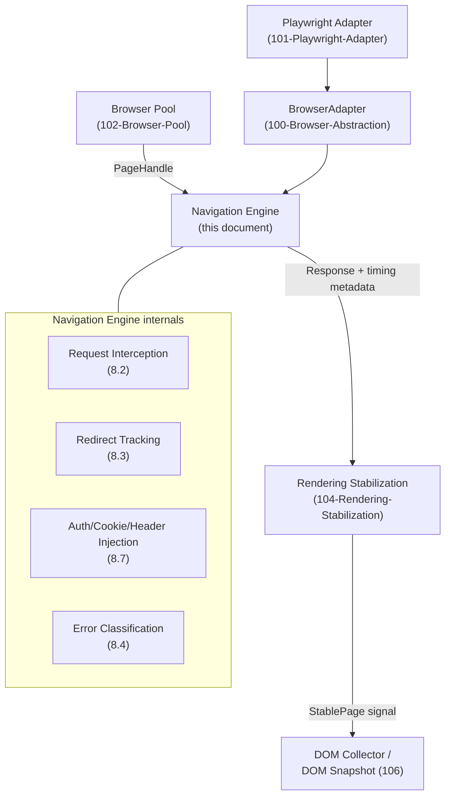

# 103 — Navigation Engine

## 1. Title

**Critical CSS Extraction Engine — Navigation Engine Design**

## 2. Version

| Field | Value |
|---|---|
| Document Version | 1.0.0 |
| Status | Accepted |
| Last Updated | 2026-07-09 |
| Owners | Core Architecture Working Group |
| Stability | Stable core model; stabilization policy taxonomy owned by the forthcoming `104-Rendering-Stabilization.md` |

## 3. Purpose

This document specifies the design of the Navigation Engine: the component (per the module table in `BRIEF.md` Section 2.4, "Navigation Engine — Page navigation, rendering stabilization") responsible for taking a `PageHandle` acquired from the Browser Pool ([102-Browser-Pool.md](./102-Browser-Pool.md)) and a target route, and producing a navigated, stable page ready for collection. It covers how a route is navigated to within a pooled `BrowserContext`, request interception for blocking non-essential resources, redirect handling, timeout and error handling, the boundary between navigation-level waiting strategies and full rendering-stabilization logic, authentication/cookie/header injection for gated routes, and cross-origin resource handling per `BRIEF.md` Section 2.16 (Security).

[011-Execution-Pipeline.md](../architecture/011-Execution-Pipeline.md) Sections 8.4–8.5 already specify the `Navigated` and `Stabilized` states at the state-machine level — entry/exit conditions, retry super-state behavior, and the soft-timeout-by-default policy for stabilization. This document does not re-derive those decisions; it specifies the mechanism inside the Navigation Engine that implements them: exactly what `page.goto()` call is issued, with what options, under what interception rules, and exactly what "waiting" means at the navigation layer as distinct from the deeper, application-signal-aware stabilization logic that [104-Rendering-Stabilization.md](./104-Rendering-Stabilization.md) (forthcoming, this same phase) owns in full.

## 4. Audience

- Implementers of the Navigation Engine (`packages/browser`'s navigation submodule, or a dedicated `packages/navigation` per the eventual package graph), who need the exact `page.goto()` invocation contract, interception rules, and error taxonomy.
- Implementers of [104-Rendering-Stabilization.md](./104-Rendering-Stabilization.md), who need to know precisely where navigation-level waiting ends and stabilization-policy waiting begins, since that boundary is this document's responsibility to define clearly.
- Implementers of SSR adapters (`BRIEF.md` Section 2.10) and enterprise/authenticated-route integrations, who need the auth/cookie/header injection contract this document specifies.
- Security reviewers evaluating cross-origin and network-restriction behavior against `BRIEF.md` Section 2.16.
- Reviewers evaluating changes to timeout, retry, or redirect-handling policy.

Readers are assumed to be senior engineers familiar with HTTP navigation semantics (redirects, status codes), Playwright's navigation lifecycle events (`load`, `domcontentloaded`, `networkidle`), and basic web authentication mechanisms (cookies, bearer tokens, custom headers). This is not an introduction to HTTP or browser navigation.

## 5. Prerequisites

- [102-Browser-Pool.md](./102-Browser-Pool.md) — the source of the `PageHandle` this engine navigates; in particular Section 8.3's acquisition contract and Section 8.4's crash-detection model, since a crash during navigation is this document's concern to detect and this pool's concern to recover from.
- [011-Execution-Pipeline.md](../architecture/011-Execution-Pipeline.md) Sections 8.4–8.5 (`Navigated`, `Stabilized` states) and Section 8.15 (retry super-states) — the state-machine contract this engine implements.
- [015-Runtime-Model.md](../architecture/015-Runtime-Model.md) Section 9.1's pipeline-stage table, which places "Navigation, rendering stabilization" partly in Tier 1 (issuing `page.goto()`, polling) and partly in Tier 2 (in-page readiness signals) — this document is the elaboration of that split for the navigation half.
- [ADR-0003-Playwright-As-Browser-Abstraction](../adr/ADR-0003-Playwright-As-Browser-Abstraction.md), including its Edge Cases note on Playwright's auto-waiting semantics reducing but not eliminating custom stabilization logic.
- [006-Design-Principles.md](../architecture/006-Design-Principles.md) Principle 1 (Browser Is the Source of Truth) and Principle 6 (Fail-Fast Diagnostics).
- `BRIEF.md` Section 2.16 (Security: cross-origin stylesheets, browser sandboxing, configurable network restrictions, timeout protection).

## 6. Related Documents

- [102-Browser-Pool.md](./102-Browser-Pool.md) — supplies the `PageHandle` this engine consumes.
- [104-Rendering-Stabilization.md](./104-Rendering-Stabilization.md) — owns the full stabilization-policy taxonomy (network-idle heuristics, custom application-signaled readiness, `requestAnimationFrame` settle counts, layout-shift-aware rescanning); this document only establishes the navigation-to-stabilization handoff boundary and a minimal default policy.
- [100-Browser-Abstraction.md](./100-Browser-Abstraction.md) — the `BrowserAdapter` seam this engine, like the pool, is implemented behind.
- [101-Playwright-Adapter.md](./101-Playwright-Adapter.md) — the concrete Playwright navigation primitives (`page.goto`, `page.route`, `page.setExtraHTTPHeaders`) this engine's adapter implementation calls.
- [105-Viewport-Manager.md](./105-Viewport-Manager.md) — supplies the `ViewportProfile` already applied at context-creation time by the pool; this engine does not re-apply viewport settings, only consumes the already-configured context.
- [106-DOM-Snapshot.md](./106-DOM-Snapshot.md) — the downstream consumer that begins once this engine reports `Stabilized`.
- [011-Execution-Pipeline.md](../architecture/011-Execution-Pipeline.md) — the state machine this engine's `Navigated`/`Stabilized` transitions implement.
- [015-Runtime-Model.md](../architecture/015-Runtime-Model.md) — Tier 1/Tier 2 placement of navigation and stabilization logic.
- [006-Design-Principles.md](../architecture/006-Design-Principles.md) — Principles 1 and 6.

## 7. Overview

Navigation is the first point at which the engine's abstract `WorkUnit` (a route string plus a viewport profile, per [011-Execution-Pipeline.md](../architecture/011-Execution-Pipeline.md) Section 8.1) becomes a concrete, live browser tab pointed at real content. It sits between two components this document treats as fixed boundaries: upstream, the Browser Pool ([102-Browser-Pool.md](./102-Browser-Pool.md)) has already handed over a health-checked `PageHandle` bound to an isolated `BrowserContext` configured with the target `ViewportProfile`; downstream, [104-Rendering-Stabilization.md](./104-Rendering-Stabilization.md) takes over once the Navigation Engine reports that the underlying HTTP navigation itself has completed, and drives the page toward an application-level "ready to collect" signal.

The Navigation Engine's own responsibilities, precisely bounded, are:

1. **Issue the navigation** (`page.goto(route)`) with a configured timeout and wait condition, under an optional **request interception** policy that can block non-essential resource categories (analytics, ad networks, and similar) for speed, per `BRIEF.md` Section 2.14's performance program.
2. **Inject authentication state** — cookies, custom headers, or bearer tokens — before navigation begins, for gated/authenticated routes, per `BRIEF.md` Section 2.10's SSR/enterprise integration surface.
3. **Handle redirects** transparently where they are benign (a route resolving through a 301/302 chain to its final URL) and diagnosably where they are not (redirect loops, cross-origin redirects that may need distinct security handling per Section 2.16).
4. **Classify and handle navigation errors** — DNS failure, connection refused, timeout, non-2xx/3xx final response — into the specific, attributable diagnostic types [011-Execution-Pipeline.md](../architecture/011-Execution-Pipeline.md) Section 8.4 expects `NavigationDiagnostic` to carry.
5. **Apply a minimal, navigation-level waiting strategy** (Playwright's own `domcontentloaded`/`load`/`networkidle` wait conditions) as the mechanism by which `page.goto()` itself resolves, explicitly distinct from — and a precondition for — the deeper stabilization policy owned by [104-Rendering-Stabilization.md](./104-Rendering-Stabilization.md).
6. **Handle cross-origin resource loading correctly** for the purposes of this stage: allowing cross-origin subresources (scripts, stylesheets, fonts) to load per normal browser behavior, while ensuring any interception/blocking policy (item 1) and any network-restriction configuration (`BRIEF.md` Section 2.16) is applied uniformly regardless of resource origin, and deferring cross-origin *stylesheet CSSOM access* restrictions (the `SecurityError` case) to the CSSOM Walker, which is a downstream, unrelated concern this document does not own.

This document's central architectural claim, elaborated in Section 8.5, is that **"navigation complete" and "page stable" are two different, sequential conditions**, and conflating them — treating Playwright's `networkidle` wait condition as sufficient proof that a modern, hydration-heavy single-page application is ready for DOM collection — is a correctness bug this document exists to prevent, consistent with the caution [ADR-0003](../adr/ADR-0003-Playwright-As-Browser-Abstraction.md) already raises about auto-waiting reducing, but not eliminating, custom stabilization logic.

## 8. Detailed Design

### 8.1 The Navigation Call

The Navigation Engine issues exactly one primary browser operation per route: `page.goto(url, { waitUntil, timeout })`. The `waitUntil` condition defaults to `domcontentloaded` rather than `load` or `networkidle`, for a reason that generalizes across the whole design: `domcontentloaded` fires once the initial HTML document has been parsed, without waiting for all subresources (images, some scripts) to finish loading, which is the earliest point at which it is *meaningful* to begin any waiting at all, and — critically — it hands control to [104-Rendering-Stabilization.md](./104-Rendering-Stabilization.md)'s policy engine as early as possible rather than letting Playwright's own coarser `load`/`networkidle` conditions silently absorb time that the stabilization policy should be accounting for explicitly and diagnosably.

**Why not default to `networkidle`.** `networkidle` (no network connections for 500ms) is tempting as a single-call "wait until basically done" solution, and is explicitly one of the strategies [104-Rendering-Stabilization.md](./104-Rendering-Stabilization.md) will offer as a *stabilization policy*, but using it as the *navigation* wait condition conflates the two layers this document is designed to keep separate: it silently absorbs application-specific settling time into what should be a fast, generic "did the page load" check, it produces misleading timing attribution (a slow `networkidle`-based `page.goto()` looks like a navigation problem in the Reporter's timing report, when [011-Execution-Pipeline.md](../architecture/011-Execution-Pipeline.md) Section 14 explicitly requires navigation and stabilization time to be attributed separately), and it fails outright on pages with genuinely continuous background network activity (polling, websockets, analytics beacons) — exactly the case [011-Execution-Pipeline.md](../architecture/011-Execution-Pipeline.md) Section 8.5 already flags as a reason stabilization timeout defaults to a soft, diagnosable failure rather than a hard one. Using `networkidle` as the *outer* navigation condition would turn that soft-failure-tolerant case into a hard `page.goto()` timeout at the wrong layer, with a worse diagnostic (a generic navigation timeout instead of an attributed stabilization-policy timeout).

**Why not default to `load`.** The `load` event (all subresources, including images, finished) is a reasonable middle ground but still couples navigation-level waiting to resource-loading behavior that is orthogonal to whether the *document* is ready for the DOM/CSSOM to be meaningfully queried — a page can have fully parsed, hydration-ready DOM and CSSOM well before a large hero image finishes downloading, and waiting for `load` in the navigation layer would needlessly delay handoff to stabilization for no correctness benefit specific to this engine's needs.

**Configurability.** `waitUntil` is nonetheless a configuration knob (`NavigationOptions.waitUntil`), not a hardcoded constant, because a subset of target applications may have pathological `domcontentloaded` timing (e.g., a page that streams HTML very slowly) where `load` is actually the more reliable navigation-layer signal; the default is `domcontentloaded` per the reasoning above, and operators overriding it should understand they are shifting time attribution between the navigation and stabilization layers, not changing correctness.

### 8.2 Request Interception

The Navigation Engine optionally installs a request-interception handler (via the `BrowserAdapter`'s equivalent of Playwright's `page.route()`) **before** calling `page.goto()`, so that interception rules are active for the very first request of the navigation, not retrofitted after some requests have already been dispatched.

**Categories of interception, per `BRIEF.md` Section 2.14's performance program:**

1. **Analytics/tracking beacons** (a configurable domain/pattern denylist — common analytics vendors, ad networks) — blocked by default in a `fast` preset, since they contribute zero CSS/DOM/layout signal relevant to critical CSS extraction and only add navigation latency and (per the `networkidle`-avoidance reasoning in Section 8.1) continuous background network noise that could otherwise interfere with stabilization heuristics that key off network quiescence.
2. **Non-critical media** (large images below the fold, video) — optionally blocked or throttled in aggressive performance presets, but **off by default**, because blocking image loads can, in some layout scenarios (e.g., an `` without explicit `width`/`height` attributes, or a CSS `background-image` used as a layout-affecting element in exotic cases), change layout geometry — and per [006-Design-Principles.md](../architecture/006-Design-Principles.md) Principle 3, an optimization that risks changing the very geometry the Visibility Engine depends on must never be a default; it is offered as an explicit, documented-tradeoff opt-in only.
3. **CSS and font resources are never blocked**, unconditionally, regardless of preset — blocking a stylesheet or web font would directly corrupt the CSSOM Walker's and Cascade Resolver's inputs, which is a correctness violation of Principle 1, not a mere performance/accuracy tradeoff; the interception rule set is therefore hardcoded to always allow the `stylesheet` and `font` resource types through, with only the configurable denylist able to affect `xhr`/`fetch`/`image`/`media`/`script`-from-known-analytics-domains categories.

**Why interception is off by default overall, with only analytics blocking on in the `fast` preset.** A completely aggressive-by-default interception policy was rejected because it reintroduces exactly the class of risk Principle 3 warns against: an approximation (guessing which resources are "safe" to block) applied by default rather than as an additive, opt-in layer over a correct baseline. The engine's default preset performs no interception at all — the safest, most rendering-faithful baseline — and only the explicitly-named `fast` (or similarly named) preset enables analytics/ad blocking, with every other category requiring an explicit, separately documented opt-in.

### 8.3 Redirect Handling

Playwright's `page.goto()` follows HTTP redirects transparently by default (the underlying browser engine handles the redirect chain natively), and the Navigation Engine relies on this rather than intercepting and re-issuing requests manually — consistent with Principle 1's "let the browser do browser things." The Navigation Engine's added responsibility is **attribution and policy on top of** that native behavior:

- After `page.goto()` resolves, the Navigation Engine reads `response.url()` (the final URL after all redirects) and compares it to the requested route; if they differ, this is recorded as a `RedirectDiagnostic` (informational severity by default) carrying the full redirect chain (available via `response.request().redirectedFrom()` chased to its root), so the Reporter can surface "route X actually resolved to Y" rather than this being silently invisible in the output artifact's provenance.
- A **redirect loop** (the browser engine's own redirect-loop detection firing, surfaced as a navigation error) is treated as a `NavigationError` of a specific `redirectLoop` subtype, attributable and retryable per Section 8.6's retry policy — retried in case it is a transient upstream misconfiguration, but likely to fail identically on retry, which is expected and acceptable given [011-Execution-Pipeline.md](../architecture/011-Execution-Pipeline.md) Section 8.15's bounded retry budget.
- A **cross-origin redirect** (the final resolved URL's origin differs from the route's originally requested origin) is recorded as a distinct `CrossOriginRedirectDiagnostic` and, in `strictSecurity` policy presets (see Section 8.7), may be configured to fail the work unit outright rather than merely warn — because a route manifest entry redirecting to an entirely different origin is either a misconfigured route or a potential indicator that the target application's routing has changed in a way the manifest (`BRIEF.md` Section 2.9) has not been updated to reflect, and per Principle 6, this ambiguity should be loud by default and fatal under strict policy.

### 8.4 Timeout and Error Classification

Every `page.goto()` call carries a mandatory, finite timeout (`NavigationOptions.timeoutMs`, defaulting to a conservative value large enough for typical production page loads but never `Infinity`), directly implementing the timeout-protection requirement referenced throughout [015-Runtime-Model.md](../architecture/015-Runtime-Model.md) and `BRIEF.md` Section 2.16. On failure, the Navigation Engine classifies the error into one of a small, closed set of `NavigationError` subtypes before propagating it to the [011-Execution-Pipeline.md](../architecture/011-Execution-Pipeline.md) state machine's `Navigated` state handler:

| Subtype | Cause | Retry-eligible? |
|---|---|---|
| `timeout` | `waitUntil` condition not reached within `timeoutMs` | Yes |
| `dnsFailure` | Hostname could not be resolved | Yes (transient DNS issues are real) |
| `connectionRefused` | TCP connection actively refused | Yes |
| `redirectLoop` | Browser-detected redirect loop | Yes (per Section 8.3, likely to recur but retried per uniform policy) |
| `httpError` | Final response status is 4xx/5xx | Configurable — see below |
| `crossOriginRedirectRejected` | Strict-security policy rejected a cross-origin redirect | No — this is a policy decision, not a transient condition |
| `pageCrashDuringNavigation` | `page.on('crash')` fired mid-navigation | Escalates to `BrowserAcquired`'s retry per [102-Browser-Pool.md](./102-Browser-Pool.md) Section 8.4, not a plain navigation retry |

**Why `httpError` retry-eligibility is configurable rather than fixed.** A 5xx response is plausibly transient (an upstream service blip) and reasonable to retry; a 404 is almost never transient (the route genuinely does not exist) and retrying it wastes the retry budget on a deterministic failure, violating the same "don't retry non-transient failures" principle [011-Execution-Pipeline.md](../architecture/011-Execution-Pipeline.md) Section 8.15 establishes for retry-scoping generally. The default policy retries 5xx and does not retry 4xx, but both thresholds are configurable per `ResolvedConfig`, since some target environments (e.g., a staging environment with flaky auth returning transient 401s) may want different classification.

### 8.5 The Navigation/Stabilization Handoff Boundary

This is the single most architecturally important decision in this document, and is stated explicitly rather than left implicit: **the Navigation Engine's responsibility ends, and [104-Rendering-Stabilization.md](./104-Rendering-Stabilization.md)'s responsibility begins, at the moment `page.goto()`'s configured `waitUntil` condition is satisfied.** Everything after that point — waiting for hydration, waiting for a custom application-signaled readiness event, waiting for layout to settle after client-side rendering, `requestAnimationFrame`-based settle-count heuristics — belongs entirely to the Rendering Stabilization module and is out of scope here, per that document's forthcoming ownership of the full `StabilizationPolicy` taxonomy referenced (but not detailed) in [011-Execution-Pipeline.md](../architecture/011-Execution-Pipeline.md) Section 8.5 and [015-Runtime-Model.md](../architecture/015-Runtime-Model.md) Section 9.1's pipeline table.

The Navigation Engine's only contribution to stabilization is: (a) choosing a `waitUntil` condition that hands off control early enough to be useful (Section 8.1's reasoning), and (b) exposing the `Response` object and navigation timing metadata (time-to-`domcontentloaded`, redirect chain, final status) to the Stabilization module as inputs it may use in its own heuristics (for example, a stabilization policy might reasonably want to know whether the navigation itself was unusually slow, as context for interpreting a subsequent settle-detection signal). The Navigation Engine does not itself implement `networkidle`-style waiting, `requestAnimationFrame` polling, or any DOM-inspection logic — introducing any of that here would duplicate ownership with [104-Rendering-Stabilization.md](./104-Rendering-Stabilization.md) and violate the single-ownership principle this whole documentation set relies on for avoiding drift between documents describing the same behavior.

### 8.6 Retry Policy

The Navigation Engine itself does not implement retry looping — per [011-Execution-Pipeline.md](../architecture/011-Execution-Pipeline.md) Section 8.15, retries are the orchestrator's `RetryingNavigation` super-state's responsibility, re-invoking the Navigation Engine's `navigate()` function fresh on each attempt against the *same* `PageHandle` (unless the underlying context has crashed, escalating to browser-acquisition retry). The Navigation Engine's contract with that retry logic is narrow and precise: `navigate()` must be **safely re-callable** against the same page — i.e., calling `page.goto()` again after a prior timeout must not leave the page in a state (a half-completed navigation, a dangling interception handler registered twice) that corrupts the next attempt. This requires the interception handler (Section 8.2) to be idempotently installable (checking whether a route handler is already registered before adding a duplicate) and requires any per-navigation state (redirect-chain tracking, Section 8.3) to be reset at the start of each `navigate()` call rather than accumulated across retries.

### 8.7 Authentication, Cookies, and Header Injection

For gated routes (`BRIEF.md` Section 2.10's SSR/enterprise integration surface implies authenticated route extraction is a real requirement), the Navigation Engine accepts an `AuthContext` parameter alongside the route, applied **before** `page.goto()` is called:

- **Cookies** are injected via the `BrowserContext`'s cookie-jar API (`context.addCookies()`), not per-page, consistent with [102-Browser-Pool.md](./102-Browser-Pool.md) Section 8.3's "use `browserContext`, not raw `page`, as the isolation unit" guidance from [ADR-0003](../adr/ADR-0003-Playwright-As-Browser-Abstraction.md) Implementation Notes item 4 — a route requiring authenticated cookies for a specific origin has those cookies scoped to that context, and the context is torn down on `release()` (per [102-Browser-Pool.md](./102-Browser-Pool.md) Section 8.3), so authenticated state never leaks into a subsequent, unrelated route's extraction.
- **Custom headers** (bearer tokens, API keys, custom auth schemes) are applied via the page/context's extra-HTTP-headers mechanism, set once before navigation and left in place for the duration of that page's navigation only.
- **Basic auth** (HTTP `WWW-Authenticate` challenge/response), where relevant, is supported via Playwright's dedicated HTTP-credentials context option rather than manually constructing an `Authorization` header, since the browser's native handling correctly manages the challenge/response handshake including for subresources.

**Why auth injection happens at the Navigation Engine layer rather than the Browser Pool layer.** `AuthContext` is a per-route-manifest-entry concept (`BRIEF.md` Section 2.9's route manifest could plausibly specify different auth requirements for different route patterns), while the Browser Pool's `acquire()` contract ([102-Browser-Pool.md](./102-Browser-Pool.md) Section 8.3) is parameterized only by `viewportProfile` and `engine` — deliberately narrow, general-purpose parameters that do not vary per route. Threading route-specific auth requirements through the pool's acquisition contract would couple a general-purpose resource-pooling component to route-manifest semantics it has no other reason to know about; applying auth at the Navigation Engine, which already receives the specific route being navigated, keeps that coupling local to the one component that actually needs it.

### 8.8 Cross-Origin Resource Handling

Per `BRIEF.md` Section 2.16's security requirements, this document's cross-origin concerns at the navigation layer are narrower than the CSSOM Walker's (which must handle `SecurityError` on `cssRules` access for CORS-blocked stylesheets — an out-of-scope, downstream concern per Section 7 above). At the navigation layer, cross-origin handling means:

- **Cross-origin subresources load normally** by default (scripts, stylesheets, fonts, images from third-party CDNs) — the Navigation Engine does not restrict cross-origin loading itself, since doing so would change rendering fidelity in violation of Principle 1; any restriction is a `configurable network restriction` (per `BRIEF.md` Section 2.16's exact phrasing) applied through the interception layer (Section 8.2) as an explicit opt-in denylist/allowlist, never a default.
- **Cross-origin navigation itself** (the route's target URL being on a different origin than some baseline, e.g., if a route manifest entry accidentally points at an external domain) is not specially restricted at this layer either — the Navigation Engine navigates wherever `page.goto()` is told to go; scoping which origins are legitimate targets for the route manifest is a Configuration Loader validation concern (out of scope here), not a Navigation Engine runtime concern.
- **Cross-origin redirects** (Section 8.3) are the one place this document does apply cross-origin-aware policy, because a redirect changing origin mid-navigation is a runtime event this engine directly observes and is well-positioned to flag, unlike a manifest-configuration-time cross-origin target, which a different component should catch earlier.

## 9. Architecture

### 9.1 Component Placement



### 9.2 Sequence Diagram — Navigation Attempt with Retry-on-Timeout

```mermaid
sequenceDiagram
    participant Orch as Orchestrator<br/>(011-Execution-Pipeline)
    participant Nav as Navigation Engine
    participant Auth as Auth Injector
    participant Ic as Interceptor
    participant Pg as Page (via PageHandle)
    participant Stab as Rendering Stabilization

    Orch->>Nav: navigate(pageHandle, route, authContext, navOptions)
    Nav->>Auth: applyCookiesAndHeaders(context, authContext)
    Auth-->>Nav: applied
    Nav->>Ic: installInterceptionRules(page, policy)
    Ic-->>Nav: installed (idempotent)
    Nav->>Pg: page.goto(route, {waitUntil: domcontentloaded, timeout: T1})

    alt navigation completes within T1
        Pg-->>Nav: Response (status, url, redirectChain)
        Nav->>Nav: classifyRedirects() (8.3)
        Nav-->>Orch: NavigationResult(success, Response, timingMetadata)
        Orch->>Stab: beginStabilization(pageHandle, NavigationResult)
        Stab-->>Orch: StablePage (or soft-timeout diagnostic)
    else timeout elapses
        Pg-->>Nav: TimeoutError
        Nav->>Nav: classify as NavigationError('timeout')
        Nav-->>Orch: NavigationResult(failure, NavigationError)
        Orch->>Orch: retryDecision() per 011-Execution-Pipeline 10.1
        alt retry budget remains
            Orch->>Nav: navigate(pageHandle, route, authContext, navOptions)<br/>[retry attempt 2]
            Note over Nav,Ic: interception re-check is idempotent;<br/>redirect-chain state reset (8.6)
            Nav->>Pg: page.goto(route, {waitUntil, timeout: T1})
            Pg-->>Nav: Response
            Nav-->>Orch: NavigationResult(success, Response, timingMetadata)
        else retry budget exhausted
            Orch-->>Orch: transition to Failed<br/>(RetryExhaustedDiagnostic)
        end
    end
```

This sequence diagram elaborates [011-Execution-Pipeline.md](../architecture/011-Execution-Pipeline.md) Section 9.1's sequence diagram's `Nav->>Nav: afterNavigation hook` / `Nav->>Nav: stabilize(policy)` steps with the internal detail this document owns, while explicitly showing the handoff to Rendering Stabilization (Section 8.5) as a distinct, separately-attributed step rather than folding it into "navigate."

### 9.3 Error Classification Flowchart

```mermaid
flowchart TD
    Start["page.goto() rejects or<br/>resolves with non-2xx/3xx"] --> Check{Failure type?}
    Check -->|Timeout elapsed| T["NavigationError.timeout<br/>(retryable)"]
    Check -->|DNS resolution failed| D["NavigationError.dnsFailure<br/>(retryable)"]
    Check -->|Connection refused| C["NavigationError.connectionRefused<br/>(retryable)"]
    Check -->|Redirect loop detected| R["NavigationError.redirectLoop<br/>(retryable)"]
    Check -->|Final status 4xx/5xx| H{Status class?}
    H -->|5xx| H5["NavigationError.httpError<br/>(retryable by default)"]
    H -->|4xx| H4["NavigationError.httpError<br/>(not retryable by default)"]
    Check -->|Cross-origin redirect, strict policy| X["NavigationError.crossOriginRedirectRejected<br/>(not retryable)"]
    Check -->|page.on('crash') fired| P["NavigationError.pageCrashDuringNavigation<br/>(escalates to browser-acquisition retry)"]

    T --> Emit["Emit attributed NavigationDiagnostic<br/>(route, elapsed time, subtype)"]
    D --> Emit
    C --> Emit
    R --> Emit
    H5 --> Emit
    H4 --> Emit
    X --> Emit
    P --> Escalate["Escalate to 102-Browser-Pool<br/>crash-recovery path"]
```

## 10. Algorithms

### 10.1 Algorithm: Navigation with Idempotent Interception Setup and Redirect-Chain Reset

**Problem statement.** Given a route, an `AuthContext`, and a navigation options bundle, perform a single navigation attempt such that the attempt is safely repeatable (per Section 8.6's retry contract) without leaking per-attempt state (duplicate interception handlers, stale redirect-chain data) across attempts.

**Inputs.** `pageHandle: PageHandle`, `route: string`, `authContext: AuthContext | null`, `navOptions: NavigationOptions` (`waitUntil`, `timeoutMs`, `interceptionPolicy`).

**Outputs.** `NavigationResult` — either `{ success: true, response, redirectChain, timingMetadata }` or `{ success: false, error: NavigationError }`.

**Pseudocode.**
```text
function navigate(pageHandle, route, authContext, navOptions) -> NavigationResult:
    page = pageHandle.page
    context = pageHandle.context

    // Reset any per-attempt state left over from a prior retry of this same route.
    redirectChainTracker.reset(pageHandle)

    if authContext != null:
        if authContext.cookies:
            context.addCookies(authContext.cookies)      // idempotent: same cookies re-applied safely
        if authContext.headers:
            page.setExtraHTTPHeaders(authContext.headers) // overwrites prior headers, not additive
        if authContext.httpCredentials:
            context.setHTTPCredentials(authContext.httpCredentials)

    if navOptions.interceptionPolicy != null and not pageHandle.interceptionInstalled:
        page.route('**/*', (route, request) => {
            if shouldBlock(request, navOptions.interceptionPolicy):
                route.abort()
            else:
                route.continue()
        })
        pageHandle.interceptionInstalled = true    // guards against double-registration on retry

    startTime = now()
    try:
        response = page.goto(route, {
            waitUntil: navOptions.waitUntil,
            timeout: navOptions.timeoutMs
        })
    catch (err):
        return NavigationResult.failure(classifyError(err, startTime, now()))

    redirectChain = redirectChainTracker.chase(response)
    timingMetadata = { elapsedMs: now() - startTime, waitUntilUsed: navOptions.waitUntil }

    if redirectChain.crossesOrigin and navOptions.securityPolicy == 'strict':
        return NavigationResult.failure(
            NavigationError.crossOriginRedirectRejected(redirectChain))

    return NavigationResult.success(response, redirectChain, timingMetadata)
```

**Time complexity.** `O(1)` navigation-engine-side bookkeeping per attempt, dominated entirely by the network-bound cost of `page.goto()` itself (which this algorithm does not, and cannot, bound below the target server's actual response latency); `redirectChainTracker.chase()` is `O(k)` where `k` is redirect-chain length, typically small (single digits) and bounded in practice by the browser engine's own redirect-loop detection.

**Memory complexity.** `O(k)` for the redirect chain retained for diagnostics; `O(1)` for all other per-attempt state, none of which is retained across attempts beyond the `interceptionInstalled` boolean flag (a correctness guard, not accumulating state).

**Failure cases.** If `authContext.cookies` targets a domain that does not match the route's origin, the browser silently ignores cookies scoped to a non-matching domain (standard cookie-scoping behavior) — this is not treated as an error by this algorithm, since it may be an intentional multi-domain auth scenario, but the Navigation Engine should log it as an informational diagnostic if the mismatch is detectable, so a misconfigured `AuthContext` is not silently ineffective without any trace. If `page.route()` registration itself throws (rare, typically indicating an already-closed page — a race with a concurrent crash), this propagates as a `NavigationError` classified under the `pageCrashDuringNavigation` subtype, since a page closing out from under an in-progress `navigate()` call is behaviorally the same failure class as a crash detected mid-navigation.

**Optimization opportunities.** For routes known (from a prior cache-hit-adjacent run, or from route-manifest metadata) to never require interception, skipping the `page.route()` registration entirely avoids a small fixed cost per navigation; this is already effectively achieved by `navOptions.interceptionPolicy == null` short-circuiting the registration, so no further optimization is required.

### 10.2 Algorithm: Redirect Chain Classification

**Problem statement.** Given a Playwright `Response` object representing the final response of a navigation that may have followed zero or more redirects, reconstruct the full chain and classify whether it stayed same-origin throughout, for use in Section 8.3's diagnostic and policy decisions.

**Inputs.** `response: Response` (Playwright object with `.request()` and `.request().redirectedFrom()` chain access).

**Outputs.** `RedirectChain { hops: string[], crossesOrigin: boolean, originalUrl: string, finalUrl: string }`.

**Pseudocode.**
```text
function chase(response) -> RedirectChain:
    hops = [response.url()]
    current = response.request()
    while current.redirectedFrom() != null:
        current = current.redirectedFrom()
        hops.unshift(current.url())

    originalUrl = hops[0]
    finalUrl = hops[hops.length - 1]
    originOf = url => new URL(url).origin
    crossesOrigin = originOf(originalUrl) != originOf(finalUrl)

    return RedirectChain(hops, crossesOrigin, originalUrl, finalUrl)
```

**Time complexity.** `O(k)` where `k` is the number of redirect hops, walking the `redirectedFrom()` linked structure once.

**Memory complexity.** `O(k)` for the retained hop list.

**Failure cases.** A malformed URL at any hop (extremely rare, since the browser engine itself validated each URL to navigate to it) would cause `new URL(url)` to throw; this is defensively caught and surfaced as a `RedirectChainParseError` informational diagnostic rather than failing the whole navigation result, since the navigation itself already succeeded by the time this classification runs — a parse error here should never retroactively fail an otherwise-successful navigation.

**Optimization opportunities.** None meaningful; `k` is bounded by the browser's own redirect-loop ceiling (typically around 20 hops in Chromium before it declares a loop), so this is already a small, bounded-cost operation.

## 11. Implementation Notes

- The Navigation Engine must be implemented against the `BrowserAdapter` interface ([100-Browser-Abstraction.md](./100-Browser-Abstraction.md)), exposing `navigate()` as an adapter-agnostic function, with only [101-Playwright-Adapter.md](./101-Playwright-Adapter.md) touching `page.goto`/`page.route`/`context.addCookies` directly — mirroring the same seam discipline established in [102-Browser-Pool.md](./102-Browser-Pool.md) Section 11.
- The `interceptionInstalled` guard (Section 10.1) must be stored on the `PageHandle` itself (not a Navigation-Engine-local map keyed by some other identifier), so that the guard's lifetime is automatically tied to the page's lifetime and cannot leak across a `release()`/`acquire()` cycle that hands out what is, to the caller, conceptually a "new" page.
- `NavigationDiagnostic`/`RedirectDiagnostic`/`CrossOriginRedirectDiagnostic` types must be defined in the shared diagnostics package (per [006-Design-Principles.md](../architecture/006-Design-Principles.md) Principle 6's Implementation Notes, "diagnostics types should be defined once in `packages/shared`"), not locally within the Navigation Engine's own module, so the Reporter can render them without a special-cased import.
- Because request interception (Section 8.2) must remain active across a retry (Section 8.6), and because Playwright's `page.route()` handlers persist across navigations within the same page by default, the idempotency guard is specifically about *not re-registering*, not about *removing and re-adding* — implementers should verify this matches the chosen adapter library's actual persistence semantics before assuming it needs no further handling.
- Timing metadata (Section 10.1's `timingMetadata`) must be threaded through to the Reporter's per-state timing report distinctly from stabilization timing, per [011-Execution-Pipeline.md](../architecture/011-Execution-Pipeline.md) Section 14's explicit requirement that `Navigated` and `Stabilized` be attributed separately even though both are nominally "Navigation Engine" work.

## 12. Edge Cases

- **Route resolves to a same-page anchor/hash navigation only.** Some SPA routing schemes resolve a "route" without a full document navigation (a hash change handled entirely client-side, no new `page.goto()`-observable navigation event). This is out of scope for the Navigation Engine to detect specially — the route manifest (`BRIEF.md` Section 2.9) is expected to encode the actual URL to be loaded via `page.goto()` for each entry; a manifest entry that is only reachable via client-side routing from another page is a route-manifest-authoring concern, not something this document's navigation logic special-cases.
- **`waitUntil: domcontentloaded` firing before any CSS-in-JS runtime library has injected its stylesheets.** This is explicitly expected and is exactly why [015-Runtime-Model.md](../architecture/015-Runtime-Model.md) Section 8.8 notes the reference implementation's CSSOM Walker waits on `Stabilized`, not raw `Navigated` — this document's early handoff (Section 8.1) is safe precisely because downstream consumers correctly wait for the *stabilization* signal, not the navigation signal, before querying the CSSOM; a consumer that mistakenly queried immediately after `Navigated` would under-collect, which is why this boundary (Section 8.5) is documented so explicitly.
- **Authentication token expiring mid-batch, across many routes reusing the same `AuthContext`.** Because auth is applied fresh at the start of every `navigate()` call (Section 10.1), a token that expires between routes is naturally re-applied (still expired) rather than silently reused from a stale in-page state; if the `AuthContext` itself is stale (the token was valid when the batch started but expired before route 500 of 1000), every subsequent route will fail navigation with an `httpError` (401/403) classified per Section 8.4 — this is correct, attributable behavior, but operators should be aware that a long-running batch against short-lived tokens requires an `AuthContext` refresh mechanism, which is a CLI-orchestration-level concern (refreshing and re-supplying `AuthContext` between batches or mid-batch) outside this document's scope.
- **Interception policy blocking a resource that a stabilization heuristic depends on.** If a future `104-Rendering-Stabilization.md` policy keys off network quiescence (a `networkidle`-style signal) and the interception policy (Section 8.2) has blocked a subset of requests, quiescence is reached artificially early — this is a real interaction between the two documents' concerns, flagged here explicitly so the Stabilization module's design accounts for it (e.g., by documenting that network-idle-based stabilization policies and aggressive interception presets are not recommended in combination) rather than the two documents silently disagreeing about what "quiet" means.
- **Cross-origin redirect in non-strict mode still needs to be visible somewhere.** Even when `crossOriginRedirectRejected` does not fire (non-strict policy), the `CrossOriginRedirectDiagnostic` (Section 8.3) must still be emitted at informational severity — a route silently resolving to a different origin than the manifest declares is exactly the kind of ambiguity Principle 6 requires to be loud even when it is not fatal.
- **Basic-auth challenge on a subresource, not the top-level navigation.** Playwright's `context.setHTTPCredentials()` (Section 8.7) applies context-wide, covering subresource challenges as well as the top-level document; a route whose top-level document is public but which loads a Basic-auth-gated cross-origin stylesheet requires the same `AuthContext` mechanism scoped appropriately — this is supported by the existing design without modification, since HTTP credentials are applied per-context, not per-request-type.

## 13. Tradeoffs

| Decision | Why | Alternative Considered | Tradeoff Accepted |
|---|---|---|---|
| `domcontentloaded` as default `waitUntil`, not `networkidle` or `load` | Hands off to Rendering Stabilization as early as meaningfully possible, keeping timing attribution clean and avoiding `networkidle`'s failure mode on continuously-polling pages | Default to `networkidle` for a simpler single-call "good enough" wait | Requires a genuinely capable downstream Stabilization module to catch what `networkidle` would have silently absorbed; accepted because that module is a first-class, dedicated component ([104-Rendering-Stabilization.md](./104-Rendering-Stabilization.md)), not a gap |
| Interception off by default; only analytics-blocking enabled in an explicit `fast` preset | Prevents an approximation-driven performance optimization from silently becoming the correctness baseline (Principle 3) | Aggressive default interception (block images, ads, analytics) for maximum default speed | Slower default navigation for the common case in exchange for a rendering-faithful baseline that never needs a "wait, why did extraction miss this rule" investigation traced back to a blocked resource |
| CSS/font resources unconditionally exempt from any interception policy | Blocking either would directly corrupt CSSOM Walker/Cascade Resolver inputs — a correctness violation, not a tradeoff | Allow interception policies to block CSS/fonts under an explicit opt-in for extreme performance scenarios | No opt-in exists for blocking these categories at all; accepted because no plausible use case justifies trading away this specific correctness guarantee, unlike images/analytics where a real, defensible tradeoff exists |
| Auth injection owned by the Navigation Engine, not the Browser Pool | Keeps route-manifest-specific concerns out of a general-purpose pooling component ([102-Browser-Pool.md](./102-Browser-Pool.md)) | Extend the pool's `acquire()` contract to accept per-route auth parameters | Slightly more plumbing (auth flows through an extra layer) in exchange for a cleaner separation of concerns between a general resource pool and route-specific navigation behavior |
| `httpError` retry-eligibility split by status class (5xx retryable, 4xx not, both configurable) | Avoids wasting retry budget on deterministic client-error failures while still recovering from plausibly-transient server errors | Uniform retry-eligibility for all non-2xx/3xx responses | Requires maintaining and documenting a status-class-aware policy table rather than one uniform rule; accepted because it directly prevents the "retrying a 404 three times" waste this document's retry-scoping philosophy (inherited from [011-Execution-Pipeline.md](../architecture/011-Execution-Pipeline.md) Section 8.15) explicitly warns against |

## 14. Performance

- **CPU complexity.** The Navigation Engine's own logic (Sections 10.1, 10.2) is `O(k)` in redirect-chain length, negligible; all meaningful latency is the network-bound cost of the navigation itself, which this document's design can shorten (via interception, Section 8.2) but not eliminate.
- **Memory complexity.** `O(k)` per in-flight navigation for redirect-chain tracking, released once the navigation result is returned; no per-navigation state persists beyond the `interceptionInstalled` guard already accounted for in [102-Browser-Pool.md](./102-Browser-Pool.md)'s per-`PageHandle` bookkeeping.
- **Caching strategy.** The Navigation Engine has no caching of its own — navigation always occurs on a cache miss, per [011-Execution-Pipeline.md](../architecture/011-Execution-Pipeline.md) Section 8.2's fingerprint short-circuit happening entirely upstream of this component; this document's only performance lever is reducing per-navigation cost (interception), not avoiding navigation altogether.
- **Parallelization opportunities.** Multiple `navigate()` calls proceed fully in parallel across different `PageHandle`s, bounded only by the Browser Pool's concurrency ceiling ([102-Browser-Pool.md](./102-Browser-Pool.md) Section 8.1); there is no meaningful intra-navigation parallelism (a single navigation is inherently a sequential HTTP request/response/redirect-chain process).
- **Incremental execution.** Not applicable directly; incrementality is a Cache Manager concern that determines whether this component is invoked at all for a given work unit.
- **Profiling guidance.** When a batch's `Navigated` state timing (per [011-Execution-Pipeline.md](../architecture/011-Execution-Pipeline.md) Section 14's per-state attribution) is elevated, first check whether interception is enabled and whether the blocked-resource categories are actually reducing request count as expected (a misconfigured denylist pattern that matches nothing provides no speedup); second, check redirect-chain length across routes, since an unexpectedly long redirect chain on many routes indicates a route-manifest or upstream-routing issue worth fixing at the source rather than tuning around.
- **Scalability limits.** This component's scalability is entirely a function of the Browser Pool's concurrency ceiling and the target server's own request-handling capacity under concurrent load from many simultaneous navigations — a target server that cannot handle `maxConcurrency` simultaneous requests will itself become the bottleneck, a scenario operators should account for when choosing `maxConcurrency` against a specific target environment's known capacity, not only against host-side memory constraints as covered in [102-Browser-Pool.md](./102-Browser-Pool.md) Section 14.

## 15. Testing

- **Unit tests.** Sections 10.1 and 10.2's algorithms should be tested against a fake `BrowserAdapter`/fake `Response` object: verify idempotent interception registration across simulated retries, verify redirect-chain reconstruction and cross-origin classification against synthetic hop sequences, verify error classification (Section 8.4's table) maps every simulated failure mode to the correct subtype and retry-eligibility.
- **Integration tests.** Real Playwright-driven tests against a fixture server that can be configured to: redirect N times (same-origin and cross-origin variants), return specific 4xx/5xx statuses, delay responses past a configured timeout, and require Basic auth/cookie-based auth — asserting the Navigation Engine produces the expected `NavigationResult`/`NavigationDiagnostic` in each case.
- **Visual tests.** Not directly applicable to navigation correctness in isolation, but a fixture with an interception policy enabled should be visually diffed against the same fixture with interception disabled, verifying that default (no-interception) extraction is visually identical to a full, unblocked render, and that `fast`-preset interception's visual impact (if any) is understood and accepted, not accidental.
- **Stress tests.** Many concurrent `navigate()` calls against a fixture server deliberately configured to be slow/flaky, verifying retry behavior (Section 8.6) and timeout enforcement (Section 8.4) hold correctly under contention, and that the idempotent-interception guard (Section 10.1) never double-registers under concurrent retries targeting different pages.
- **Regression tests.** Any production incident involving a missed stylesheet due to interception misconfiguration, an unexpected auth failure, or a redirect-related extraction gap should produce a permanent fixture-backed regression test.
- **Benchmark tests.** Measure per-navigation wall-clock time with interception on versus off across the standard fixture suite (`BRIEF.md` Section 2.15), quantifying the actual speedup analytics-blocking provides, to keep the `fast` preset's value proposition empirically grounded.

## 16. Future Work

- **Adaptive interception policies** that learn (within a single batch run) which resource categories are safe to block for a specific target application, rather than relying solely on a static, manually-configured denylist — flagged as a research direction, not committed.
- **Per-route auth-context refresh hooks**, formalizing the mid-batch token-expiry edge case (Section 12) into an explicit CLI-orchestration-level mechanism rather than leaving it as an operator responsibility.
- **Integration with `104-Rendering-Stabilization.md`'s eventual network-quiescence-aware policies**, to resolve the interception/stabilization interaction flagged in Section 12 with a documented, tested combination guide rather than an informal caution.
- **HTTP/2 and HTTP/3 push/preload-aware interception**, to ensure the interception layer's resource-category blocking correctly accounts for server-push and preload-hinted resources that may not appear as ordinary top-level requests.
- **Open question: should redirect-loop detection have an engine-independent, explicit hop-count ceiling configured by this engine** rather than relying entirely on the underlying browser engine's own (undocumented, engine-version-dependent) loop-detection threshold? Current design defers to browser-native detection per Principle 1; this is flagged for reconsideration if a specific browser engine's threshold proves too permissive or too strict for production use.

## 17. References

- [102-Browser-Pool.md](./102-Browser-Pool.md)
- [104-Rendering-Stabilization.md](./104-Rendering-Stabilization.md)
- [106-DOM-Snapshot.md](./106-DOM-Snapshot.md)
- [100-Browser-Abstraction.md](./100-Browser-Abstraction.md)
- [101-Playwright-Adapter.md](./101-Playwright-Adapter.md)
- [105-Viewport-Manager.md](./105-Viewport-Manager.md)
- [011-Execution-Pipeline.md](../architecture/011-Execution-Pipeline.md)
- [015-Runtime-Model.md](../architecture/015-Runtime-Model.md)
- [006-Design-Principles.md](../architecture/006-Design-Principles.md)
- [ADR-0003-Playwright-As-Browser-Abstraction](../adr/ADR-0003-Playwright-As-Browser-Abstraction.md)
- Playwright documentation, navigation and network events — https://playwright.dev/docs/navigations
- Playwright documentation, network interception (`page.route()`) — https://playwright.dev/docs/network
- `BRIEF.md` Section 2.10 (SSR Integration), Section 2.14 (Performance Optimizations), Section 2.16 (Security)
