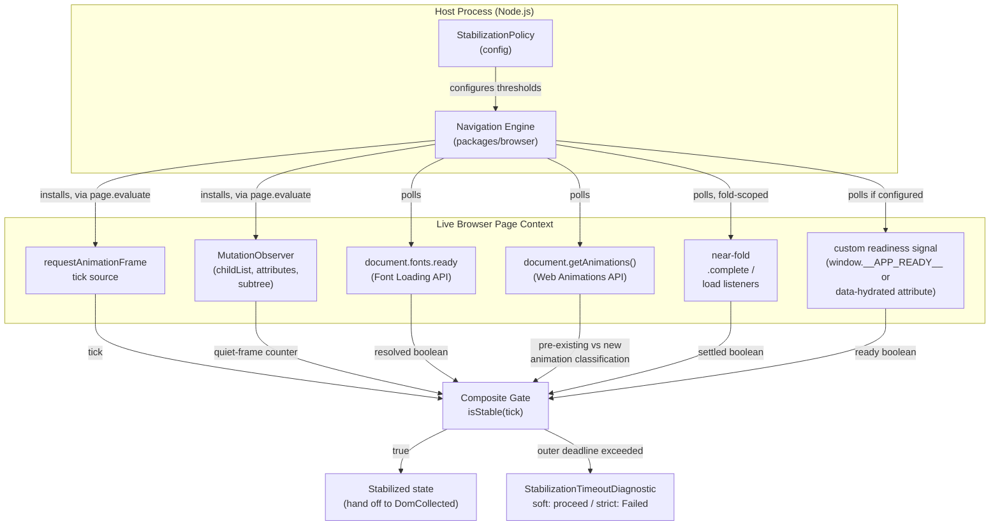
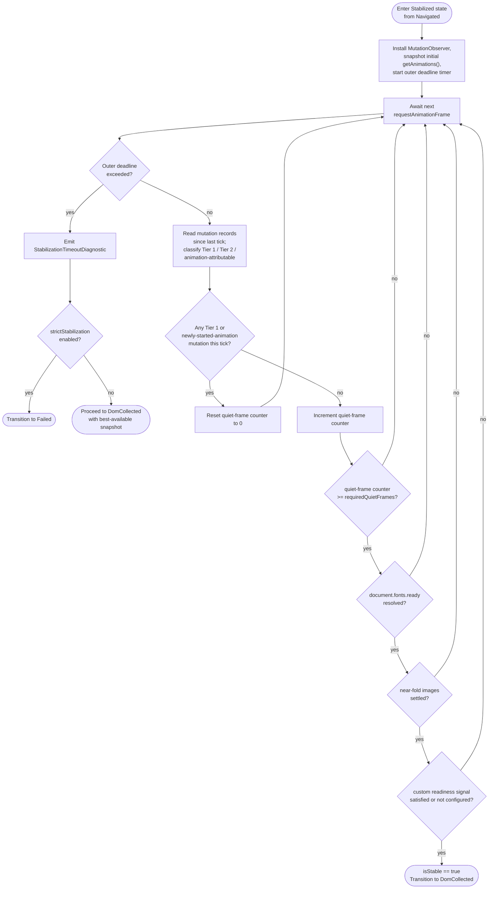

# 104 — Rendering Stabilization

## 1. Title

**Critical CSS Extraction Engine — Rendering Stabilization: Detecting "Done Enough to Snapshot"**

## 2. Version

| Field | Value |
|---|---|
| Document Version | 1.0.0 |
| Status | Accepted |
| Last Updated | 2026-07-09 |
| Owners | Browser Layer Working Group |
| Stability | Stable (Phase 3 design document; changes require RFC) |

## 3. Purpose

Every downstream decision the Engine makes — which nodes are visible, which CSS rules match, what the dependency graph looks like — is computed from a single point-in-time observation of a live page. [011-Execution-Pipeline.md](./011-Execution-Pipeline.md) names this observation point `Stabilized`, the state entered after `Navigated` and before `DomCollected`, and it documents the state's transition semantics (soft-timeout-by-default, `strictStabilization` opt-in escalation to `Failed`) precisely. What that document does not do — and what this document exists to do — is define **what "stabilized" actually means**, mechanically, for a real web page: which signals the Navigation Engine watches, in what combination, with what thresholds, and why a page that is still executing JavaScript, still loading web fonts, still lazily mounting images, or still running a CSS animation can or cannot be considered "done enough" to hand to the DOM Collector.

This is a harder problem than it appears at first glance because "done" is not a browser-observable boolean. `document.readyState === 'complete'` and the `load` event long predate single-page applications, lazy-loaded media, web-font-driven reflow, and JavaScript-hydrated server-rendered markup, and none of them correlate reliably with "the above-the-fold region has reached its final visual and structural state." A snapshot taken too early captures a DOM that has not yet hydrated, a layout that has not yet accounted for a web font's actual metrics, or images whose intrinsic dimensions have not yet resolved — any of which can silently shift what falls above the fold and therefore silently corrupt the entire extraction, in violation of [006-Design-Principles.md](./006-Design-Principles.md) Principle 1 (the browser must be a faithful, not a premature, source of truth). A snapshot taken "whenever the page looks idle enough" for an unbounded amount of time is equally unacceptable for a tool whose primary integration point is CI/CD (BRIEF.md Section 2.11): an extraction step with unbounded latency, or one that never terminates against a page with a legitimately continuous liveness signal (an infinite-scroll feed, a live ticker, a CSS animation with no natural end), breaks the build pipeline it is meant to serve.

This document specifies the **Stability Detection Algorithm**: a composite, multi-signal wait loop that the Navigation Engine runs between `Navigated` and `DomCollected`, the concrete implementation of the `Stabilized` state's entry procedure referenced but not detailed in [011-Execution-Pipeline.md](./011-Execution-Pipeline.md) Section 8.5. It documents each contributing signal (fonts, images, animations, hydration, third-party scripts), the composite algorithm that combines them into a single go/no-go decision, its complexity and failure modes, and the escape hatches (timeout, strict mode) that keep the Engine usable in production despite the fundamental undecidability of "is this page ever going to stop changing."

## 4. Audience

- Implementers of the Navigation Engine (`packages/browser` and the orchestration code invoked from [011-Execution-Pipeline.md](./011-Execution-Pipeline.md)'s `Stabilized` state), who need the exact signal set and combination logic to implement, not just the state-transition contract.
- Implementers of [103-Navigation-Engine.md](./103-Navigation-Engine.md)'s navigation primitives, since stabilization is the second half of that module's responsibility (navigate, then stabilize) and this document is that module's stabilization-specific design detail.
- Configuration schema authors, who need to know which stabilization knobs (timeout budgets, frame-count thresholds, custom readiness signals) must be exposed to end users per BRIEF.md Section 2.3's device-profile and configuration requirements.
- Plugin authors implementing `afterNavigation` hooks (per [ADR-0004-Plugin-Lifecycle-Model](../adr/ADR-0004-Plugin-Lifecycle-Model.md)), who may need to inject application-specific readiness signals (e.g., a custom `window.__APP_READY__` flag) into the stabilization decision.
- CI/CD platform engineers reasoning about worst-case extraction latency and about which classes of target application (infinite-scroll feeds, live dashboards) require explicit configuration overrides to extract successfully at all.

Readers should already understand [011-Execution-Pipeline.md](./011-Execution-Pipeline.md)'s state machine, particularly Section 8.5 (`Stabilized`) and Section 8.15 (retry super-states), and should be familiar with `requestAnimationFrame`, `MutationObserver`, the Font Loading API (`document.fonts`), and `IntersectionObserver` at the level of a working web platform engineer.

## 5. Prerequisites

- [011-Execution-Pipeline.md](./011-Execution-Pipeline.md) Section 8.4–8.6 (`Navigated`, `Stabilized`, `DomCollected` states) — this document specifies the internal procedure of the middle state.
- [103-Navigation-Engine.md](./103-Navigation-Engine.md) — the navigation primitive (`page.goto` and its wait-until options) that precedes stabilization and hands off a `PageHandle` to the procedure this document describes.
- [006-Design-Principles.md](./006-Design-Principles.md) Principle 1 (Browser Is Source of Truth), Principle 3 (Correctness Over Premature Optimization), and Principle 6 (Fail-Fast Diagnostics) — this document's soft-timeout-with-loud-diagnostic default is a direct application of Principles 3 and 6 to a problem domain (rendering completion) that Principle 1 already commits the Engine to observing live rather than approximating statically.
- [016-Data-Flow.md](./016-Data-Flow.md) Section 8.2 (Live Page → DOM Snapshot), since the `DomSnapshot`'s `capturedAt: LogicalTimestamp` field is produced at the exact moment this document's algorithm terminates successfully.
- Familiarity with the CSS Font Loading API, the `MutationObserver` API, `requestAnimationFrame`, and the general concept of "layout thrashing" / forced synchronous layout.

## 6. Related Documents

- [100-Browser-Abstraction.md](./100-Browser-Abstraction.md) — the abstract browser interface whose `page` object this document's signals are read from and whose engine-neutral capability surface constrains which signals (e.g., CDP-only APIs) are portable versus Chromium-specific.
- [101-Playwright-Adapter.md](./101-Playwright-Adapter.md) — the concrete Playwright APIs (`page.evaluate`, `page.waitForFunction`, `page.waitForLoadState`) this document's wait loop is implemented in terms of.
- [102-Browser-Pool.md](./102-Browser-Pool.md) — the pool that owns the `PageHandle`'s lifecycle; a stabilization timeout that escalates to `Failed` returns the page to the pool per that document's recycling policy.
- [103-Navigation-Engine.md](./103-Navigation-Engine.md) — the sibling document covering navigation proper; this document is its logical continuation.
- [105-Viewport-Manager.md](./105-Viewport-Manager.md) — stabilization runs once per viewport navigation (per [016-Data-Flow.md](./016-Data-Flow.md) Section 8.2's "one DOM Snapshot per viewport navigation" rule), and the Viewport Manager is what determines how many times this document's procedure runs per route.
- [106-DOM-Snapshot.md](./106-DOM-Snapshot.md) — the immediate consumer of a successful stabilization; the `DomSnapshot` capture described there assumes the page has already reached the state this document defines.
- [011-Execution-Pipeline.md](./011-Execution-Pipeline.md) — the state machine this document's algorithm is the internal procedure for.
- [016-Data-Flow.md](./016-Data-Flow.md) — the data shapes (`DomSnapshot.capturedAt`, `LogicalTimestamp`) whose values are determined by this document's termination point.
- [006-Design-Principles.md](./006-Design-Principles.md) — Principles 1, 3, and 6, cited throughout.
- W3C CSS Font Loading Module specification — governs `document.fonts.ready` and `FontFaceSet` status semantics referenced in Section 8.2.
- MDN `MutationObserver` and `requestAnimationFrame` references — the two primitives underlying the composite algorithm in Section 10.

## 7. Overview

"When is the page done enough to snapshot" decomposes into five independently-varying sub-problems, each contributing its own liveness signal:

1. **Web font loading (FOIT/FOUT).** A page using `@font-face` may render with a fallback font (FOUT: Flash of Unstyled Text) or with invisible text (FOIT: Flash of Invisible Text) until the real font finishes downloading and is applied, at which point line-wrapping and element heights can shift — sometimes enough to change what is above the fold.
2. **Lazy-loaded images shifting layout.** Native (`loading="lazy"`) and JavaScript-driven lazy loading defer image fetch until near-viewport; when the image's intrinsic dimensions differ from any placeholder/reserved space, its arrival shifts layout (a cumulative-layout-shift-causing event) after the initial paint.
3. **CSS animations/transitions still running.** A hero section fading in, a skeleton-loader pulsing, or a carousel auto-advancing are legitimate, ongoing paint activity that does not indicate the page is unready, but which can make "no visual change for N frames" an unreliable signal if measured naively.
4. **Hydration in SPA/SSR apps causing late DOM mutations.** React/Vue/Svelte hydration re-executes component logic against server-rendered markup, frequently mutating attributes, text content, and sometimes structure (conditional rendering resolving differently client-side) well after the initial HTML parse and even after the `load` event.
5. **Third-party scripts injecting content.** Analytics, chat widgets, ad slots, and consent banners frequently inject DOM nodes and stylesheets asynchronously, on their own schedule, unrelated to the host application's own readiness.

No single one of these problems has a browser-native "done" event. The Engine's answer, elaborated in Section 8, is to treat stabilization as an **empirically observed absence of layout-affecting change over a sliding window of animation frames**, corroborated by explicit, best-effort completion signals for the sub-problems that do have partial native signals (fonts, images), and bounded by a hard timeout that guarantees termination regardless of whether true stability is ever reached. This is the **Stability Window Algorithm**: wait for N consecutive `requestAnimationFrame` callbacks during which a `MutationObserver` (configured to watch attributes, subtree, and childList) reports zero layout-affecting mutations, while independently also waiting for `document.fonts.ready` and a configurable image-completion threshold, all within an outer deadline.

## 8. Detailed Design

### 8.1 The Core Signal: RAF-Gated Mutation Quiescence

**Why `requestAnimationFrame` frame-counting, not a fixed wall-clock delay.** A fixed delay (e.g., "wait 500ms after navigation") was the approach taken by early static critical-CSS tools' dynamic-content workarounds, and it is rejected here for the same reason Principle 3 rejects any approximation with a known failure mode: a fixed delay is too short for slow/loaded CI runners and pages with genuinely slower hydration, and too long (wasting CI wall-clock budget) for the common case of a page that settles in under 100ms. Counting consecutive animation frames with no layout-affecting mutation ties the wait to the browser's own rendering cadence rather than to wall-clock time, and — critically — it composes correctly with actual paint activity: `requestAnimationFrame` fires once per paint regardless of frame rate variance under CI load, so "N consecutive quiet frames" is a measure of *settled paint cycles*, not *elapsed milliseconds*.

**Why `MutationObserver`, not polling `document.body.innerHTML` or repeated `getBoundingClientRect()` snapshots.** `MutationObserver` is the browser's native, push-based mechanism for DOM change notification and, unlike polling a serialized DOM string or re-querying geometry every frame, it does not itself perturb layout (a repeated `getBoundingClientRect()` poll can force synchronous layout recalculation — "layout thrashing" — which is both a performance cost and, in pathological cases, capable of masking or introducing timing-dependent behavior in the very page being measured). `MutationObserver` fires only when something actually changed, giving the algorithm a direct, low-overhead quiescence signal.

**Configuring the observer to detect layout-affecting mutations specifically.** Not every DOM mutation affects layout (e.g., a `data-*` attribute used only for analytics tracking, or an `aria-live` region update for a screen reader that has no visual layout consequence). Observing *all* mutations indiscriminately over-counts and can make pages with high-frequency, layout-irrelevant mutation traffic (e.g., a page polling a `data-timestamp` attribute every 100ms for a "last updated" display) appear perpetually unstable. The reference configuration therefore uses a two-tier mutation classification:

- **Tier 1 (always layout-relevant):** `childList` mutations (nodes added/removed), `attributes` mutations on `class` and `style`, and any mutation to an element with a non-`static` `position` or an active CSS transition/animation.
- **Tier 2 (configurable, default excluded):** attribute mutations on an explicit ignore-list (`data-*` attributes by default, extensible via `StabilizationPolicy.ignoredMutationAttributes`), and mutations on elements matched by a configurable `ignoredMutationSelectors` list (for known-noisy third-party widget containers, per Section 12).

This tiering is deliberately conservative in the "always relevant" direction: `class`/`style` mutations are treated as layout-relevant unconditionally because determining whether a specific class/style change actually altered rendered geometry would require a synchronous layout read after every single mutation, which is precisely the layout-thrashing cost the `MutationObserver`-based design exists to avoid. A false positive (treating a layout-irrelevant `class` mutation as relevant) costs at most a few extra frames of waiting; a false negative (missing a layout-relevant mutation) risks silently capturing a pre-final DOM state, which Principle 1 treats as a correctness violation, not an acceptable tradeoff.

### 8.2 Font Loading Signal (FOIT/FOUT)

**The signal.** `document.fonts.ready` is a `Promise` that resolves once every currently-loading `FontFace` in the document's `FontFaceSet` has either loaded or failed. The stabilization procedure races this promise against the mutation-quiescence loop, treating font-loading completion as a **corroborating gate**, not a replacement for frame-counting: even after `document.fonts.ready` resolves, the browser still needs one or more paint cycles to actually apply the newly-available font and reflow text, which the RAF-gated mutation observer will independently detect as a burst of `style`/geometry-affecting mutations (line boxes changing height) — so waiting on `document.fonts.ready` alone, without the frame-counting loop that follows it, would risk snapshotting mid-reflow.

**Why this matters specifically for FOIT/FOUT.** Under `font-display: block` (the default in several frameworks' generated CSS, and the browser default for many years prior to `font-display` standardization), text using the custom font is invisible for up to 3 seconds (the FOIT "block period") before falling back to a system font — if the stability window's frame-counting alone happened to observe 30 quiet frames during that block period (plausible, since nothing is mutating while text is merely invisible), the Engine would confidently snapshot a page with invisible above-the-fold text and derive a `VisibilityAnnotatedNodeSet` (per [016-Data-Flow.md](./016-Data-Flow.md) Section 8.3) that is technically accurate for that instant but not representative of the page's actual settled state. Explicitly waiting on `document.fonts.ready` (bounded by the outer deadline, Section 8.6) closes this gap.

**What this does not solve.** A font that fails to load (network error, blocked by an ad blocker, or a deliberately slow/never-resolving `font-display: optional` scenario under certain browser heuristics) still resolves `document.fonts.ready` promptly (per spec, a failed load counts as "settled," not "pending"), so this signal correctly does not block indefinitely on font failure — it only guards against the case where the font legitimately is still in flight.

### 8.3 Image / Lazy-Load Signal

**The signal.** For every `` element (including those with `loading="lazy"`) within a configurable proximity of the fold (see [105-Viewport-Manager.md](./105-Viewport-Manager.md) for fold computation), the stabilization procedure checks `img.complete` and, for images not yet complete, attaches a one-shot `load`/`error` listener. A parallel check inspects CSS `background-image` declarations on above-fold elements via `getComputedStyle`, since background images do not participate in the `` element's native `complete` semantics at all and must be tracked by decode/paint proxy signals instead (a `background-image` cannot be waited on directly; the reference implementation instead treats a background-image load as covered indirectly by the mutation-quiescence loop's detection of the resulting paint, since there is no direct completion promise for CSS-level image loads).

**Why this is scoped to near-fold images, not the entire page.** BRIEF.md's entire premise (Section 2.1) is above-the-fold extraction; an image lazy-loaded far below the fold that has not yet begun fetching (correctly, by design, since it is nowhere near the viewport) must not block stabilization — doing so would make the algorithm's wait time scale with total page image count rather than with above-fold content, defeating the purpose of lazy-loading entirely and making every image-heavy page pathologically slow to extract. The Visibility Engine's fold computation (owned by [105-Viewport-Manager.md](./105-Viewport-Manager.md)) is consulted here specifically to scope this signal's blocking set.

**Why native lazy-loading is not force-triggered.** An alternative design considered was to force-load every image (e.g., by setting `loading="eager"` or scrolling through the whole page) before snapshotting, guaranteeing all images are settled. This is rejected: it would change the page's actual runtime behavior relative to what a real user experiences on initial load (a real user does not trigger below-fold lazy loads before scrolling), which conflicts with Principle 1's commitment to observing the browser's authentic behavior rather than a modified one. Only near-fold images — which a real user's initial viewport would trigger to load promptly regardless — are waited on.

### 8.4 Animation / Transition Signal

**The problem this signal exists to solve is the inverse of the others.** Fonts and images are things the algorithm waits *for*; CSS animations and transitions are things the algorithm must explicitly **not** wait for indefinitely, because a legitimately continuous animation (a pulsing skeleton loader, a marquee, a spinner) will keep the mutation observer detecting `style`/`transform`-affecting changes forever, and naive frame-counting logic would never see N consecutive quiet frames.

**The resolution: animation-aware mutation filtering plus a maximum-animation-wait ceiling.** The stabilization procedure queries `document.getAnimations()` (the Web Animations API, which enumerates all running CSS animations, transitions, and script-driven animations across the document) at each RAF tick. An element whose only detected mutations are attributable to an animation/transition already running *before* stabilization began (i.e., present in the very first `getAnimations()` snapshot taken at the start of the wait loop) is treated specially: its ongoing mutations do not reset the quiet-frame counter past a configurable `maxAnimationSettleFrames` ceiling (default: 2 seconds' worth of frames), on the theory that an animation still running unchanged after that ceiling is a steady-state visual effect (a spinner, a background pulse) rather than a one-time settling transition (a fade-in, a slide-in), and the Engine should snapshot the page in its steady state rather than waiting for an animation that will never end. A *newly started* animation/transition detected mid-wait (not present in the initial snapshot — e.g., a hover-triggered or intersection-triggered transition firing as a side effect of hydration) is treated as a normal layout-affecting mutation and does reset the quiet-frame counter, since a new transition starting mid-wait is evidence the page is still actively settling, not steady-state.

**Why this specific split (pre-existing vs. newly-started) rather than a global animation-ignore flag.** A simpler alternative — configuring the observer to ignore all animation-driven mutations unconditionally — was considered and rejected because it would also mask a genuinely unsettled one-time transition (e.g., a hero image's CSS `opacity` fade-in from `0` to `1` over 400ms) that legitimately changes the above-fold visual state and whose completion the Engine should wait for. The pre-existing/newly-started split is what allows the algorithm to distinguish "this animation is decorative and infinite" from "this animation is a one-time settle" without needing to parse `animation-iteration-count` or `transition-duration` values directly (which would edge toward a bespoke CSS-semantics reimplementation, in tension with Principle 2's spirit even though Principle 2 is stated specifically about selectors — the design intentionally stays within observed *behavior* via `getAnimations()`, a live browser API, rather than *declared* CSS values).

### 8.5 Hydration and Third-Party Script Signals

**Hydration.** SPA/SSR hydration is, from the Engine's observation point, indistinguishable in kind from any other burst of `childList`/`attributes` mutations — it is not a special-cased signal, it is simply what the RAF-gated mutation-quiescence loop (Section 8.1) is designed to wait out. What *is* special-cased is an optional, application-declared readiness hook: `StabilizationPolicy.customReadinessSelector` or `StabilizationPolicy.customReadinessGlobal` lets a target application declare (e.g., via a `window.__CRITICAL_CSS_READY__` boolean, or a `data-hydrated="true"` attribute set by the framework's hydration-complete callback) that hydration has explicitly finished, which the procedure polls for and treats as an additional required gate (see Section 10) alongside, not instead of, the mutation-quiescence loop — an application declaring itself "ready" one frame before it actually stops mutating is still caught by the frame-counting requirement.

**Why a custom readiness hook is supported at all, given Principle 1's preference for browser-observed truth over application-declared state.** This is a deliberate, narrow exception, not a violation: Principle 1 concerns *what CSS applies and what is visible*, which must always be browser-derived; *when the page is done changing* is not a CSS-cascade or visibility fact in the same sense — it is a liveness/scheduling fact about the target application, and the target application is frequently in the best position to know it (e.g., "I am intentionally deferring this expensive third-party widget's mount for 3 seconds to prioritize Core Web Vitals, and that widget is below the fold and irrelevant to critical CSS anyway"). The custom hook is additive corroboration, never a substitute for the frame-counting loop, precisely so that an inaccurate or overly-optimistic application-declared signal cannot by itself produce a premature snapshot.

**Third-party scripts.** No dedicated signal exists for third-party script injection specifically; it is handled entirely as ordinary mutation traffic, with one operational consequence documented in Edge Cases (Section 12): a third-party script that injects content on a delayed, non-deterministic schedule (e.g., a chat widget that mounts 4 seconds after `load`, following its own internal timer unrelated to page readiness) can force the stability window to either wait unnecessarily long (if it is scoped near the fold) or can be explicitly excluded via `ignoredMutationSelectors` once identified as a known-irrelevant offender — this is a configuration response to a real operational problem, not an algorithmic one, and is discussed further in Section 12.

### 8.6 Composite Decision and Outer Deadline

The five signals above feed a single composite gate, evaluated once per RAF tick:

```
isStable(tick) =
    mutationQuietFrames(tick) >= requiredQuietFrames
    AND fontsReady(tick) == true
    AND nearFoldImagesSettled(tick) == true
    AND (customReadinessSignal(tick) == true OR customReadinessSignal not configured)
```

The loop runs until `isStable` is true, or until an outer `stabilizationTimeoutMs` deadline (default 5000ms, configurable, mirroring the timeout-protection requirement in BRIEF.md Section 2.16) elapses first — at which point the procedure terminates with whatever state currently holds, emits a `StabilizationTimeoutDiagnostic` (per [011-Execution-Pipeline.md](./011-Execution-Pipeline.md) Section 8.5), and either proceeds (soft/default policy) or transitions the enclosing state machine to `Failed` (`strictStabilization` policy). This composite gate, and the outer deadline that bounds it, are together the Stability Window Algorithm specified formally in Section 10.

## 9. Architecture

### 9.1 Component View



This component view elaborates [011-Execution-Pipeline.md](./011-Execution-Pipeline.md) Section 9.1's sequence diagram's single `Nav->>Nav: stabilize(policy)` step into its constituent browser-side observers and the host-side composite gate that reads them. Every observer in `BrowserContext` is installed via `page.evaluate()`/`page.exposeFunction()`-style bridges (per [101-Playwright-Adapter.md](./101-Playwright-Adapter.md)) and reports back to the Navigation Engine through a small, JSON-serializable polling interface — consistent with [016-Data-Flow.md](./016-Data-Flow.md) Section 11's constraint that data crossing the Node↔browser IPC boundary be plain and serializable, not a live handle.

### 9.2 Stabilization Wait Loop — Flowchart with Timeout Escape



Two properties of this flowchart mirror properties already established in [011-Execution-Pipeline.md](./011-Execution-Pipeline.md) Section 9.2: the timeout escape (`CheckDeadline`) is checked at every tick, not only after quiet-frames are satisfied, so a page that never produces a single quiet frame (Section 11's "never stabilizes" failure mode) still terminates in bounded time; and the branch into `Failed` versus `ProceedAnyway` is externally configurable policy, not a hardcoded outcome, exactly matching the state-machine-level contract that document already specifies.

## 10. Algorithms

### 10.1 The Stability Window Algorithm

**Problem statement.** Given a navigated, live browser page whose DOM, layout, and paint state may still be changing due to font loading, image loading, animation, hydration, or third-party script injection, determine a point in time at which it is safe to treat the page's current state as representative of its settled, above-the-fold-relevant rendering — without waiting indefinitely, and without snapshotting prematurely.

**Inputs.**
- `page`: a live `PageHandle` (per [100-Browser-Abstraction.md](./100-Browser-Abstraction.md)), already navigated.
- `policy: StabilizationPolicy`, containing: `requiredQuietFrames: number` (default 6, i.e., roughly 100ms at 60fps), `stabilizationTimeoutMs: number` (default 5000), `maxAnimationSettleFrames: number` (default ~120, i.e., ~2s), `ignoredMutationAttributes: string[]` (default `["data-*"]`), `ignoredMutationSelectors: string[]` (default `[]`), `customReadinessSelector: string | null`, `customReadinessGlobal: string | null`, `strictStabilization: boolean` (default `false`), `nearFoldImageMarginPx: number` (default equal to one viewport height, per [105-Viewport-Manager.md](./105-Viewport-Manager.md)'s fold computation).

**Outputs.** `StabilizationResult { stable: boolean, elapsedFrames: number, elapsedMs: number, diagnostics: Diagnostic[] }`. `stable: false` accompanies a `StabilizationTimeoutDiagnostic` and is the trigger for the soft-proceed/strict-fail branch documented in [011-Execution-Pipeline.md](./011-Execution-Pipeline.md) Section 8.5.

**Pseudocode.**

```text
function stabilize(page, policy) -> StabilizationResult:
    deadline = now() + policy.stabilizationTimeoutMs
    quietFrames = 0
    elapsedFrames = 0
    diagnostics = []

    initialAnimations = page.evaluate(() => document.getAnimations().map(a => a.id))
    installMutationObserver(page, policy.ignoredMutationAttributes, policy.ignoredMutationSelectors)

    while true:
        await page.waitForNextAnimationFrame()   // one RAF tick
        elapsedFrames += 1

        if now() >= deadline:
            diagnostics.push(StabilizationTimeoutDiagnostic(elapsedFrames, quietFrames))
            return StabilizationResult(stable=false, elapsedFrames, elapsedMs=policy.stabilizationTimeoutMs, diagnostics)

        mutations = page.evaluate(() => drainPendingMutationRecords())
        currentAnimations = page.evaluate(() => document.getAnimations().map(a => a.id))
        newlyStartedAnimationIds = currentAnimations - initialAnimations

        relevant = classifyMutations(mutations, newlyStartedAnimationIds, policy)
        // classifyMutations returns true if any mutation is Tier 1,
        // or is attributable to a newly-started animation/transition
        // (see 8.4); mutations attributable only to a pre-existing
        // animation beyond policy.maxAnimationSettleFrames do not count.

        if relevant:
            quietFrames = 0
            continue

        quietFrames += 1
        if quietFrames < policy.requiredQuietFrames:
            continue

        fontsReady = page.evaluate(() => checkFontsReadyNonBlocking())
        if not fontsReady:
            continue   // do not reset quietFrames; fonts pending is a
                       // distinct gate, not a mutation-driven reset

        imagesSettled = page.evaluate(
            (marginPx) => checkNearFoldImagesSettled(marginPx),
            policy.nearFoldImageMarginPx)
        if not imagesSettled:
            continue

        if policy.customReadinessGlobal or policy.customReadinessSelector:
            customReady = page.evaluate(
                (g, s) => checkCustomReadiness(g, s),
                policy.customReadinessGlobal, policy.customReadinessSelector)
            if not customReady:
                continue

        return StabilizationResult(stable=true, elapsedFrames,
                                    elapsedMs=now() - (deadline - policy.stabilizationTimeoutMs),
                                    diagnostics)
```

**Time complexity.** O(F × M) where F is the number of animation frames elapsed before stability (bounded above by `stabilizationTimeoutMs / frameIntervalMs`, typically ≤ 300 frames at a 5-second timeout and 60fps) and M is the average number of mutation records per frame (typically small — single digits — for a settling page, but unbounded in pathological cases, see Section 11). Each iteration's `page.evaluate()` round trips carry a fixed per-call IPC overhead (per [015-Runtime-Model.md](./015-Runtime-Model.md)'s discussion of evaluation round-trip cost), which is why the reference implementation batches the mutation-drain, animation-check, font-check, and image-check into as few `page.evaluate()` calls per tick as possible rather than one call per signal — an optimization noted in Section 14.

**Memory complexity.** O(M_total) for the accumulated mutation records across the whole wait (drained and discarded each tick, so peak memory is O(M) per tick, not O(F × M) cumulative), plus O(1) for the frame/quiet counters and O(D) for the diagnostics list, D being small and bounded (at most one timeout diagnostic per stabilization attempt).

**Failure cases.** Detailed exhaustively in Section 11; the two structural failure classes are (a) the page never produces `requiredQuietFrames` consecutive quiet frames before the deadline (infinite scroll, live ticker, perpetually-reflowing widget), handled by the deadline escape, and (b) one of the corroborating gates (fonts, images, custom readiness) never resolves (a font that hangs mid-fetch due to a network proxy issue, a custom readiness global that is misconfigured and never set), also handled by the same deadline escape since the `while true` loop's only exit conditions are full stability or deadline expiry.

**Optimization opportunities.** (1) Batch all four per-tick browser-side checks (mutation drain, animation snapshot, font check, image check) into a single `page.evaluate()` call returning a composite object, reducing IPC round trips from up to 4×F to 1×F. (2) Skip the font/image/custom-readiness checks on ticks where `quietFrames < requiredQuietFrames`, since they cannot affect the outcome until the quiet-frame threshold is already met — the pseudocode above already reflects this ordering. (3) For batch runs extracting many routes, a warmed, cached compiled `MutationObserver` installation script can be reused across page navigations within the same browser context (per [102-Browser-Pool.md](./102-Browser-Pool.md)'s reuse model) rather than re-injected from source each time.

### 10.2 Mutation Classification

**Problem statement.** Given a batch of raw `MutationRecord`s observed in one animation frame, decide whether the batch contains at least one layout-affecting mutation, applying the Tier 1/Tier 2 split (Section 8.1) and the pre-existing/newly-started animation split (Section 8.4).

**Inputs.** `mutations: MutationRecord[]`, `newlyStartedAnimationIds: Set<string>`, `policy: StabilizationPolicy`.

**Outputs.** `boolean` — true if the batch should reset the quiet-frame counter.

**Pseudocode.**

```text
function classifyMutations(mutations, newlyStartedAnimationIds, policy) -> boolean:
    for m in mutations:
        if matchesIgnoredSelector(m.target, policy.ignoredMutationSelectors):
            continue
        if m.type == "childList":
            return true   // node added/removed is always Tier 1
        if m.type == "attributes":
            if m.attributeName in ["class", "style"]:
                if isAttributableToPreExistingAnimation(m.target, newlyStartedAnimationIds)
                   and animationAgeFrames(m.target) > policy.maxAnimationSettleFrames:
                    continue   // steady-state decorative animation, ignored
                return true
            if matchesIgnoredAttributePattern(m.attributeName, policy.ignoredMutationAttributes):
                continue
            return true   // any other attribute change defaults to Tier 1
    return false
```

**Time complexity.** O(m) where m is the number of mutation records in the batch — a single linear scan, short-circuiting on the first relevant mutation found.

**Memory complexity.** O(1) beyond the input batch itself.

**Failure cases.** A malformed or overly broad `ignoredMutationSelectors` entry (e.g., a selector matching the document's root element) can silently suppress genuinely relevant mutations; this is a configuration-correctness risk, not an algorithmic one, and is why `ignoredMutationSelectors` usage is logged at the diagnostic level (an `IgnoredMutationSelectorApplied` diagnostic per invocation that actually suppressed at least one mutation) so a misconfiguration is visible in the extraction trace rather than silently producing an early snapshot.

**Optimization opportunities.** Precompile `ignoredMutationSelectors` into a single combined selector string passed once to `Element.matches()` (per [006-Design-Principles.md](./006-Design-Principles.md) Principle 2 — even this bookkeeping-adjacent check delegates to the browser's native selector matching rather than any custom matching logic) rather than iterating the selector list per mutation target.

## 11. Implementation Notes

- The mutation observer must be installed with `{ childList: true, attributes: true, subtree: true, attributeOldValue: false }` at the document root, and, per Principle 1's Shadow DOM edge case (already documented in [006-Design-Principles.md](./006-Design-Principles.md)), a corresponding observer must be attached to every accessible open `shadowRoot` individually, since `MutationObserver` with `subtree: true` does not cross shadow boundaries — a page with meaningful shadow-DOM-encapsulated hydration activity (e.g., a design-system component library) would otherwise appear falsely stable.
- `page.waitForNextAnimationFrame()` should be implemented via a single persistent in-page `requestAnimationFrame` loop that increments a counter and exposes it for polling, rather than issuing a fresh `page.evaluate(() => new Promise(resolve => requestAnimationFrame(resolve)))` call per tick — the latter is correct but incurs one full IPC round trip per frame purely to arm the next frame's promise, doubling round-trip cost relative to a persistent counter that can be read alongside the other per-tick signals in a single batched call (Section 10.1 Optimization Opportunities).
- `document.fonts.ready`'s promise resolution must be observed via a one-time listener installed at the start of stabilization (not re-queried every tick, since once resolved it stays resolved) and cached in an in-page flag that the batched per-tick check simply reads — re-awaiting the same resolved promise repeatedly is harmless but wasteful.
- The near-fold image scope (Section 8.3) depends on the fold boundary, which is owned by [105-Viewport-Manager.md](./105-Viewport-Manager.md); the Navigation Engine must not compute its own independent fold heuristic for this purpose — it must consume the same `ViewportProfile`-derived fold value the Visibility Engine will later use, so that "near-fold" during stabilization and "above-fold" during collection are consistent by construction rather than by coincidence.
- `getAnimations()` is a relatively new Web Animations API surface; per [ADR-0003-Playwright-As-Browser-Abstraction](../adr/ADR-0003-Playwright-As-Browser-Abstraction.md)'s multi-engine ambition, its availability and exact return shape should be feature-detected per browser engine, with a documented degraded mode (treat all animation-attributable mutations as Tier 1, i.e., disable the steady-state-animation carve-out) on engines lacking full support, rather than throwing.
- All timing values in `StabilizationPolicy` should be part of the fingerprint input surface discussed in [006-Design-Principles.md](./006-Design-Principles.md)'s Fingerprint Computation algorithm only insofar as they can change *output*, not merely *latency*: a change to `stabilizationTimeoutMs` alone does not change a page's eventual settled DOM (assuming the page does settle before either the old or new timeout), so it should **not** be part of the cache fingerprint; a change to `requiredQuietFrames`, `ignoredMutationSelectors`, or `customReadinessGlobal`, however, *can* change which DOM state gets captured, and therefore must be part of the fingerprint. This distinction should be encoded explicitly in the config schema (e.g., a `cacheRelevant: boolean` flag per stabilization field) rather than left to implicit convention.

## 12. Edge Cases

- **Pages that never stabilize: infinite scroll.** An infinite-scroll feed that eagerly pre-fetches and mounts additional below-fold content on a timer (not solely on scroll) will continuously produce `childList` mutations even though the above-fold region has long since settled. Mitigation: scope the mutation observer's *relevance* determination (not its installation) to nodes within or near the fold boundary, using the same fold value as the image-settlement check (Section 8.3) — a mutation entirely below a configurable margin past the fold does not reset the quiet-frame counter. This is not enabled by default (it requires trusting that below-fold mutation truly cannot retroactively affect above-fold layout, which is not universally true — e.g., below-fold content insertion can change a shared ancestor's height in some layout modes) but is documented and available as `StabilizationPolicy.scopeMutationsToFold: boolean` for target applications known to have this pattern.
- **Pages that never stabilize: live tickers / real-time dashboards.** A stock ticker or live-updating dashboard with sub-second above-fold text updates has no natural "quiet" state at all within any reasonable timeout. For these, the deadline escape (Section 10.1) is not a fallback but the expected, primary termination path — the Engine snapshots at deadline with a `StabilizationTimeoutDiagnostic` recorded, and operators of such applications are expected to either accept the resulting "best effort" snapshot (non-strict mode, the correct default for this application class) or provide a `customReadinessSelector` scoped to a genuinely-static above-fold region (e.g., a page header that does not participate in the live-updating region) to get a more confident signal despite the live region's perpetual activity.
- **A page whose hydration never completes due to a client-side JavaScript error.** The mutation-quiescence loop will, in this case, correctly reach `requiredQuietFrames` (the broken page stops mutating because it crashed, not because it settled) and the fonts/images gates will likely also resolve — the Engine will confidently proceed with a DOM snapshot that reflects the server-rendered, never-hydrated markup. This is, from the stabilization algorithm's point of view, indistinguishable from a legitimately fast-settling static page, which is a known and accepted limitation: stabilization detects *absence of change*, not *presence of correctness*, and a broken hydration is a target-application defect that a JavaScript-error-monitoring plugin hook (a `afterNavigation` hook checking `page.on('pageerror')` events, per [ADR-0004](../adr/ADR-0004-Plugin-Lifecycle-Model.md)) is the appropriate mechanism to surface, not this algorithm.
- **`prefers-reduced-motion` and animation-driven stabilization.** A page respecting `prefers-reduced-motion: reduce` (an emulation dimension owned by [105-Viewport-Manager.md](./105-Viewport-Manager.md)'s device profiles) may skip CSS transitions/animations entirely under that media query, in which case the animation-classification logic in Section 8.4/10.2 has nothing to classify — this is not a failure mode, merely a simpler case, and is worth noting because a test fixture authored under standard motion preferences will exercise the animation-settling path in a way that the same fixture under reduced-motion emulation will not; both paths must be covered by the Testing plan (Section 15).
- **Third-party scripts with non-deterministic mount timing.** A chat widget or consent banner that mounts on an internal timer uncorrelated with page readiness (e.g., "always wait exactly 4 seconds after script load, regardless of anything else") will force the mutation-quiescence loop to reset repeatedly until that timer fires, potentially consuming most of the stabilization budget on a below-fold or visually-irrelevant widget. The `ignoredMutationSelectors` configuration (Section 8.1) is the sanctioned mitigation once such an offender is identified for a given target site, and the Reporter's diagnostics (an `IgnoredMutationSelectorApplied` diagnostic, per Implementation Notes) make repeated reliance on this escape hatch visible for review rather than silent.
- **Constructable stylesheets adopted asynchronously during stabilization.** A CSS-in-JS runtime that calls `document.adoptedStyleSheets = [...]` after an async chunk load completes mid-stabilization does not, by itself, fire any `MutationObserver` callback (adopting a stylesheet is not a DOM mutation) — it will only be caught by this algorithm indirectly, via the *rendering consequence* of the newly-adopted styles (a `style`/geometry-affecting mutation on the elements the new rules apply to). A CSS-in-JS library that adopts a stylesheet with no rendering-visible effect on already-rendered elements (e.g., rules for a component not yet mounted) will not be detected as unsettled by this algorithm at all; this is an accepted limitation flagged for the CSSOM Walker (which independently re-queries `document.adoptedStyleSheets` at collection time, per [016-Data-Flow.md](./016-Data-Flow.md) Section 8.4) to catch via its own post-stabilization, pre-collection re-check rather than something stabilization itself can detect.
- **Cross-origin iframes.** Content inside a cross-origin `<iframe>` is not observable via `MutationObserver` from the parent frame at all (a security boundary, not a bug), so an above-fold cross-origin iframe's internal settling (e.g., an embedded video player's UI chrome finishing its own load) is invisible to this algorithm; this must be surfaced as a documented, expected diagnostic (`CrossOriginFrameContentUnobservable`) rather than silently ignored, consistent with the cross-origin stylesheet precedent in [006-Design-Principles.md](./006-Design-Principles.md) Edge Cases.

## 13. Tradeoffs

| Decision | Why | Alternative Considered | Tradeoff Accepted |
|---|---|---|---|
| RAF-gated quiet-frame counting as the primary signal | Ties the wait to actual rendering cadence rather than wall-clock time; composes correctly under CI load variance | Fixed wall-clock delay after navigation | More complex implementation (frame counting, mutation classification) versus a single `setTimeout`; justified because a fixed delay has no safe universal value |
| `MutationObserver` over polling geometry/DOM string snapshots | Push-based, does not itself force synchronous layout (no thrashing); lower overhead | Repeated `getBoundingClientRect()` or `outerHTML` diffing per frame | Requires careful Tier 1/Tier 2 mutation classification logic rather than a simple string/geometry diff |
| Pre-existing vs. newly-started animation classification (Section 8.4) | Allows steady-state decorative animations (spinners, pulses) to not block stabilization indefinitely, while still waiting out genuine one-time settling transitions | Ignore all animation-driven mutations unconditionally | Risk of misclassifying a long one-time transition (longer than `maxAnimationSettleFrames`) as steady-state; mitigated by the ceiling being configurable per target application |
| Soft-timeout-by-default, `strictStabilization` opt-in for hard failure | Keeps the Engine usable against applications with inherently fuzzy or perpetual liveness (live tickers, infinite scroll) | Always fail on stabilization timeout | Non-strict mode can snapshot a genuinely under-settled page; the loud `StabilizationTimeoutDiagnostic` makes this visible rather than silent, per Principle 6 |
| Custom application-declared readiness signal as additive corroboration only | Lets applications communicate genuine internal readiness facts the browser cannot infer purely from DOM/paint observation | Rely solely on browser-observed signals, no application hook | A narrow, deliberate exception to preferring pure browser-observed truth; scoped so an inaccurate custom signal alone can never cause premature capture (frame-counting still gates) |
| Near-fold scoping for the image-settlement signal | Preserves the performance benefit of native lazy-loading; avoids pathological wait times on image-heavy pages | Wait for every image on the page to load | Below-fold images that could, in rare layout configurations, affect above-fold height are not waited on; accepted because native lazy-loading's entire premise already assumes this is safe for real users |

## 14. Performance

- **CPU complexity.** Bounded by O(F × M) as established in Section 10.1's Algorithms section; F is capped by the outer deadline (typically ≤ 300 frames at default settings) and M is typically small for a genuinely settling page. The dominant real-world cost is not CPU cycles spent classifying mutations but wall-clock time spent *waiting* for frames, which is why the per-tick IPC batching optimization (Section 10.1, Implementation Notes) matters more for latency than for CPU load.
- **Memory complexity.** O(1) steady-state per tick (mutation records are drained and discarded each frame); no unbounded accumulation across the wait loop's duration.
- **Caching strategy.** Stabilization itself is not cached — it must run once per viewport navigation regardless of cache state, because the Cache Manager's fingerprint short-circuit (per [011-Execution-Pipeline.md](./011-Execution-Pipeline.md) Section 8.2) occurs *before* `BrowserAcquired`/`Navigated`/`Stabilized` entirely; a cache hit skips stabilization by skipping the whole browser-bound chain, not by caching stabilization's own result independently.
- **Parallelization opportunities.** Stabilization for independent viewport-profile branches (per [016-Data-Flow.md](./016-Data-Flow.md) Section 9.2's fan-out) runs fully independently per branch, bounded only by [102-Browser-Pool.md](./102-Browser-Pool.md)'s concurrency limits; there is no cross-branch data dependency to exploit or protect against.
- **Incremental execution.** Not directly applicable — stabilization is inherently a per-navigation, non-incremental wait. A future incremental-extraction mode (BRIEF.md Section 2.17 Phase 9, [704-Incremental-Extraction.md](./700-Coverage-Mode.md) family, pending) could in principle skip re-stabilization for a route/viewport whose upstream content fingerprint is unchanged, but that is a cache-layer decision (skip the whole browser chain), not a stabilization-internal optimization.
- **Profiling guidance.** The Reporter's per-stage timing report (per [011-Execution-Pipeline.md](./011-Execution-Pipeline.md) Section 14) should record, specifically for the `Stabilized` state: total elapsed frames, which gate (mutation quiescence, fonts, images, custom readiness) was the last to resolve, and whether the deadline was hit — this level of attribution is what lets an operator distinguish "this route is slow because of a font" from "this route is slow because of a chat widget" without manual investigation.
- **Scalability limits.** At batch scale, the aggregate stabilization wall-clock cost across many concurrent work units is bounded by `stabilizationTimeoutMs` per unit times the number of units *not* served by [102-Browser-Pool.md](./102-Browser-Pool.md)'s concurrency ceiling — i.e., stabilization latency does not compound across a batch beyond the pool's own concurrency limit, but a systematically slow-to-stabilize site (e.g., one with a global 4-second third-party widget delay on every route) will make every route in that batch pay close to the full timeout, which is the primary motivation for the `ignoredMutationSelectors` escape hatch (Section 12) at scale.

## 15. Testing

- **Unit tests.** `classifyMutations` (Section 10.2) and `retryDecision`-style pure logic should be tested against synthetic `MutationRecord`-shaped fixtures covering: a `childList` addition, a `class` attribute change on an element with a pre-existing long-running animation past the ceiling, a `class` change on an element with a newly-started transition, an ignored `data-*` attribute change, and a mutation on an element matched by `ignoredMutationSelectors` — asserting the exact boolean outcome for each, without any browser involvement.
- **Integration tests.** Real-browser fixtures under `fixtures/` (extending the Section 2.15 fixture catalogue) should include: a page with a deliberately slow (`font-display: block`, artificially delayed via a fixture server) web font; a page with near-fold `loading="lazy"` images with intrinsic-dimension mismatches against placeholders; a page with a one-time fade-in transition on the hero element; a page with a perpetual CSS spinner animation; a hydration fixture (a minimal React SSR app with an artificial hydration delay); and a fixture with a simulated third-party widget that mounts on a fixed delayed timer. Each should assert the algorithm reaches `stable: true` within an expected frame-count range, and that the resulting `DomSnapshot`'s captured state matches the expected *settled* DOM (e.g., the fade-in element's final opacity, the lazy image's final dimensions), not an intermediate state.
- **Visual tests.** A dedicated visual-regression check should compare a screenshot taken at the moment stabilization reports `stable: true` against a screenshot taken after a generous fixed delay (a "known good, definitely settled" reference), for each fixture in the integration suite above — any pixel-level divergence indicates the algorithm captured a pre-final state and is a correctness bug in the algorithm or its default thresholds, not merely a flaky test.
- **Stress tests.** Run the algorithm against the never-stabilizing fixture class (a synthetic infinite-scroll fixture and a synthetic live-ticker fixture) under both default (soft) and `strictStabilization` policy, asserting: under soft policy, `stable: false` with a `StabilizationTimeoutDiagnostic` is produced within `stabilizationTimeoutMs + epsilon` wall-clock time (never meaningfully longer, verifying the deadline escape is honored precisely) and extraction proceeds; under strict policy, the enclosing work unit reaches `Failed` within the same bound.
- **Regression tests.** Golden-snapshot fixtures should pin the exact `elapsedFrames` value (within a tolerance band, since frame timing has minor inherent variance) for a small set of representative fixtures, so that a future change to default thresholds (`requiredQuietFrames`, `maxAnimationSettleFrames`) that shifts stabilization latency materially is caught as an intentional, reviewed change rather than silent drift.
- **Benchmark tests.** Measure wall-clock stabilization latency across the fixture catalogue (fast static page, font-heavy page, animation-heavy page, hydration-heavy page) to build the empirical latency profile referenced in Section 14's Performance discussion and in the forthcoming `../performance/005-Benchmarks.md`.

## 16. Future Work

- **Layout-shift-aware rescanning**, referenced as a "Should"-priority future capability in [011-Execution-Pipeline.md](./011-Execution-Pipeline.md) Section 8.5: using the native `LayoutShiftAttribution` data from the Layout Instability API (part of the Core Web Vitals CLS metric) as a more precise, browser-native replacement or corroboration for the current `MutationObserver`-based Tier 1 classification, since Layout Instability entries report *actual* layout shift magnitude directly rather than approximating it via attribute/childList mutation heuristics.
- **Mode-dependent stabilization strictness**, the open question explicitly deferred to this document from [011-Execution-Pipeline.md](./011-Execution-Pipeline.md) Section 16: should Coverage/Hybrid extraction modes, which are already paying the cost of a full paint cycle for coverage recording, default to a stricter stabilization policy than CSSOM-only mode? This document takes no position yet; it is flagged here for resolution in a follow-up RFC once empirical latency/accuracy data from the Testing plan's benchmark suite is available.
- **Coordinated stabilization budget across a multi-viewport batch**, analogous to the coordinated-retry-jitter future work in [011-Execution-Pipeline.md](./011-Execution-Pipeline.md) Section 16 — investigate whether a route known (from a prior run) to stabilize quickly on Desktop but slowly on Mobile (e.g., due to viewport-conditional image `srcset` selection) should be allowed an asymmetric per-viewport timeout budget rather than one global `stabilizationTimeoutMs` applied uniformly.
- **Automatic `ignoredMutationSelectors` discovery.** Rather than requiring operators to manually identify noisy third-party widgets (Section 12), investigate a diagnostic-only "training" mode that runs stabilization with a generous timeout, records which elements contributed the most quiet-frame resets, and suggests candidate `ignoredMutationSelectors` entries for human review — an assistive tool, not an automatic override, consistent with Principle 6's preference for visible, attributable decisions over silent heuristics.
- **Formal timing model validation.** Investigate whether the RAF-gated quiet-frame approach can be validated against real-user CrUX (Chrome User Experience Report) field data for a sample of target sites, to empirically ground the default `requiredQuietFrames`/`stabilizationTimeoutMs` values rather than the currently-chosen, reasoned-but-not-empirically-validated defaults.
- **Open question: should `getAnimations()`-based classification extend to Scroll-Timeline-driven animations** (CSS `animation-timeline: scroll()`), a newer specification not yet universally implemented across Playwright-supported engines? Current behavior treats these, where unsupported, identically to any other unrecognized animation source (conservatively Tier 1), which is safe but potentially overcautious on engines that do support the feature; revisit once engine support matures.

## 17. References

- [100-Browser-Abstraction.md](./100-Browser-Abstraction.md)
- [101-Playwright-Adapter.md](./101-Playwright-Adapter.md)
- [102-Browser-Pool.md](./102-Browser-Pool.md)
- [103-Navigation-Engine.md](./103-Navigation-Engine.md)
- [105-Viewport-Manager.md](./105-Viewport-Manager.md)
- [106-DOM-Snapshot.md](./106-DOM-Snapshot.md)
- [011-Execution-Pipeline.md](./011-Execution-Pipeline.md)
- [016-Data-Flow.md](./016-Data-Flow.md)
- [006-Design-Principles.md](./006-Design-Principles.md)
- [../adr/ADR-0003-Playwright-As-Browser-Abstraction.md](../adr/ADR-0003-Playwright-As-Browser-Abstraction.md)
- [../adr/ADR-0004-Plugin-Lifecycle-Model.md](../adr/ADR-0004-Plugin-Lifecycle-Model.md)
- W3C CSS Font Loading Module Level 3 — `document.fonts`, `FontFaceSet` — https://www.w3.org/TR/css-font-loading/
- W3C Web Animations Model — `document.getAnimations()` — https://www.w3.org/TR/web-animations-1/
- W3C DOM Standard — `MutationObserver` — https://dom.spec.whatwg.org/#mutationobserver
- W3C Layout Instability API (Core Web Vitals CLS) — https://wicg.github.io/layout-instability/
- Playwright documentation, `page.waitForFunction`, `page.evaluate` — https://playwright.dev/docs/api/class-page
- BRIEF.md Section 2.11 (CI/CD Pipeline), Section 2.16 (Security / timeout protection) — repository root
