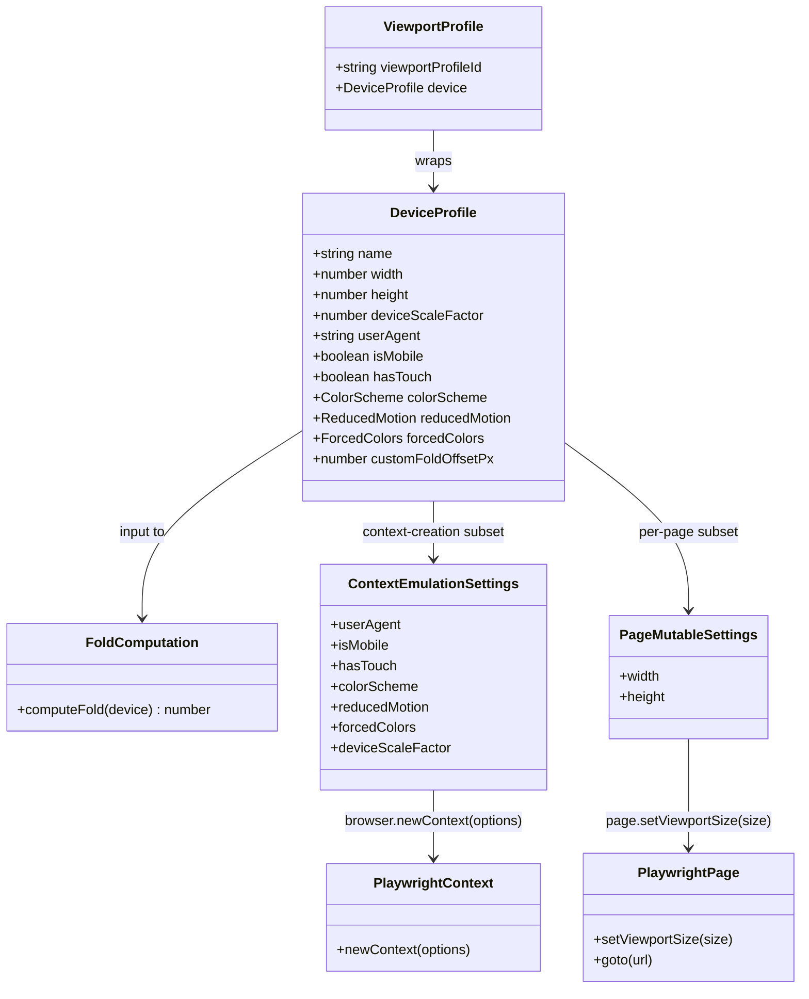
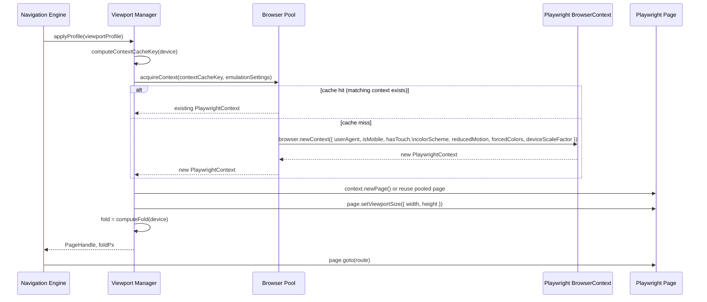
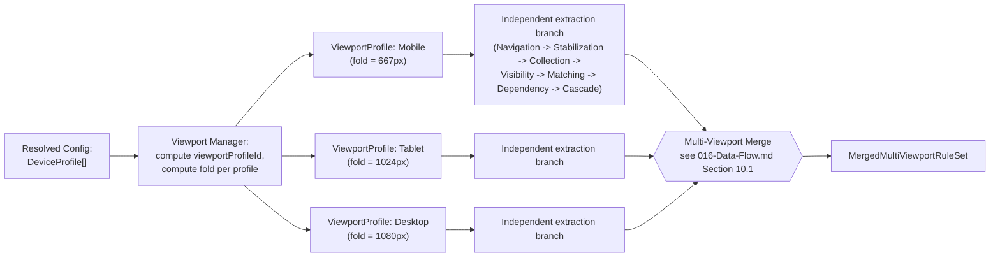

# 105 — Viewport Manager

## 1. Title

**Critical CSS Extraction Engine — Viewport Manager: Device Profiles, Fold Computation, and Multi-Viewport Feed**

## 2. Version

| Field | Value |
|---|---|
| Document Version | 1.0.0 |
| Status | Accepted |
| Last Updated | 2026-07-09 |
| Owners | Browser Layer Working Group |
| Stability | Stable (Phase 3 design document; changes require RFC) |

## 3. Purpose

BRIEF.md Section 2.6 mandates that the Engine "generate critical CSS independently for Mobile, Tablet, Desktop" and Section 2.4's module table assigns "Device profiles" as a top-level requirement (Section 2.3, item 4) distinct from raw viewport sizing. [016-Data-Flow.md](./016-Data-Flow.md) Section 9.2 already documents the *consequence* of this requirement at the data-flow level — an independent branch per `ViewportProfile`, sharing only the read-only CSSOM Rule List, converging at a single, explicitly-owned merge step — but it treats `ViewportProfile` as an opaque identifier threaded through the pipeline (`viewportProfileId: string`) without specifying what a profile actually *contains*, how it is authored and validated, how it is applied to a live browser page, or how the above-the-fold cutoff ("the fold") is computed from it. [104-Rendering-Stabilization.md](./104-Rendering-Stabilization.md) similarly depends on a fold boundary for its near-fold image-settlement signal without defining where that boundary comes from.

This document is the authority for that gap. It specifies: (1) the `ViewportProfile` and `DeviceProfile` data model — dimensions, device pixel ratio, user-agent string, touch emulation, and the extended emulation dimensions (`prefers-reduced-motion`, `prefers-color-scheme`, `forced-colors`) that BRIEF.md Section 2.4 groups under "Device profiles" as a superset of viewport sizing; (2) the fold computation algorithm, which resolves viewport height against an optional configurable custom fold offset; (3) how a `ViewportProfile` is mapped onto Playwright's concrete emulation surface (`page.setViewportSize`, `browser.newContext()` emulation options); and (4) how the Viewport Manager feeds the multi-viewport fan-out described in [016-Data-Flow.md](./016-Data-Flow.md), which owns the merge logic this document explicitly does not re-specify.

## 4. Audience

- Implementers of the Viewport Manager component (`packages/browser`, alongside [100-Browser-Abstraction.md](./100-Browser-Abstraction.md)'s abstraction layer), who need the concrete profile schema and its mapping to Playwright APIs.
- Implementers of [103-Navigation-Engine.md](./103-Navigation-Engine.md) and [104-Rendering-Stabilization.md](./104-Rendering-Stabilization.md), both of which consume the fold boundary this document defines as an input to their own algorithms (near-fold image scoping, visibility classification).
- Implementers of the (forthcoming) Visibility Engine (Phase 4, `200-Visibility-Engine-Overview.md` and family), the primary downstream consumer of the fold value for above-fold node classification.
- Configuration schema authors and CLI documentation authors, who need to expose device-profile configuration (BRIEF.md Section 2.3, item 4; Section 2.4's module table) to end users in a form consistent with this document's schema.
- Implementers of [016-Data-Flow.md](./016-Data-Flow.md)'s merge step, who need to understand how many `ViewportProfile`s a given invocation expands to and what distinguishes them, even though the merge algorithm itself is out of scope here.

Readers should already understand the multi-viewport fan-out/fan-in model in [016-Data-Flow.md](./016-Data-Flow.md) Section 9.2 and the state-machine sequencing in [011-Execution-Pipeline.md](./011-Execution-Pipeline.md), and should be comfortable with CSS media features (`prefers-reduced-motion`, `prefers-color-scheme`, `forced-colors`) and Playwright's browser-context emulation model.

## 5. Prerequisites

- BRIEF.md Section 2.6 (Multi-Viewport Strategy) — the requirement this document operationalizes.
- [016-Data-Flow.md](./016-Data-Flow.md) Section 8.2 ("one DOM Snapshot per viewport navigation"), Section 9.2 (fan-out/fan-in diagram), and Section 9.3/10.1 (merge step and algorithm) — the data-flow and merge context this document's profiles feed into, without duplicating the merge specification itself.
- [104-Rendering-Stabilization.md](./104-Rendering-Stabilization.md) Section 8.3 — the near-fold image-settlement signal that consumes this document's fold computation as an input.
- [103-Navigation-Engine.md](./103-Navigation-Engine.md) — the navigation sequencing into which viewport application (Section 8.2 below) is inserted, prior to `page.goto`.
- [006-Design-Principles.md](./006-Design-Principles.md) Principle 1 (Browser Is Source of Truth) and Principle 5 (Determinism of Output) — this document's emulation-application design and profile-identity scheme are direct applications of both.
- Familiarity with Playwright's `Browser.newContext(options)` emulation options (`viewport`, `deviceScaleFactor`, `userAgent`, `hasTouch`, `isMobile`, `colorScheme`, `reducedMotion`, `forcedColors`) and CSS Media Queries Level 5 (`prefers-reduced-motion`, `prefers-color-scheme`, `forced-colors`).

## 6. Related Documents

- [100-Browser-Abstraction.md](./100-Browser-Abstraction.md) — the engine-neutral browser interface this document's Playwright-specific mapping (Section 9.2) sits behind; a future non-Chromium or non-Playwright backend must be able to satisfy the same `ViewportProfile` contract through a different concrete mapping.
- [101-Playwright-Adapter.md](./101-Playwright-Adapter.md) — the concrete adapter implementing the mapping specified in Section 9.2.
- [102-Browser-Pool.md](./102-Browser-Pool.md) — governs whether a new browser context is created per viewport profile or an existing context/page is reconfigured; this document specifies *what* to apply, that document specifies *how contexts are provisioned* to apply it to.
- [103-Navigation-Engine.md](./103-Navigation-Engine.md) — viewport/emulation application is sequenced immediately before navigation in that document's control flow.
- [104-Rendering-Stabilization.md](./104-Rendering-Stabilization.md) — consumes this document's fold computation (Section 8.3) for near-fold image scoping.
- [106-DOM-Snapshot.md](./106-DOM-Snapshot.md) — the DOM Snapshot captured once per viewport navigation, correlated to a `viewportProfileId` this document defines.
- [016-Data-Flow.md](./016-Data-Flow.md) — owns the multi-viewport merge algorithm; this document forward-references it rather than duplicating it, per this document's explicit scope boundary (see Section 7).
- [006-Design-Principles.md](./006-Design-Principles.md) — Principles 1 and 5, cited throughout.
- BRIEF.md Section 2.6 (Multi-Viewport Strategy) and Section 2.3 item 4 (Device profiles) — the authoritative requirement source.
- CSS Media Queries Level 5 specification — governs `prefers-reduced-motion`, `prefers-color-scheme`, `forced-colors` semantics.
- Playwright documentation, `Browser.newContext()` — the concrete emulation API surface this document maps onto.

## 7. Overview

The Viewport Manager owns exactly one responsibility, split into three parts: **define** what a viewport/device profile is (Section 8.1), **apply** a given profile to a live browser page or context (Section 8.2), and **compute the fold** — the above-the-fold cutoff line — for a given profile (Section 8.3). It explicitly does **not** own selecting which viewport profiles are needed for the merge (a route-manifest/config-resolution concern, upstream), and it explicitly does **not** own the multi-viewport merge algorithm itself (owned by [016-Data-Flow.md](./016-Data-Flow.md) Section 10.1) — this document's Section 10.2 forward-references that algorithm precisely at the boundary where this document's output (per-viewport `CascadedRuleSet`s, produced by everything downstream of the fold this document computes) becomes that algorithm's input.

A `ViewportProfile`, in this document's model, is strictly more than a width and height. BRIEF.md Section 2.3 lists "Device profiles" as a requirement distinct from raw viewport sizing specifically because real-world above-the-fold rendering depends on a cluster of correlated device characteristics — a profile named `"Mobile"` is not just `375×667`; it typically also carries a 2x or 3x device pixel ratio (affecting `image-set()`/`srcset` resolution and therefore layout), a mobile user-agent string (affecting server-side or client-side responsive branching that inspects `navigator.userAgent`), and `isMobile`/`hasTouch` flags (affecting `@media (hover: hover)` / `@media (pointer: coarse)` matching and touch-specific CSS). Beyond the classic Mobile/Tablet/Desktop triad, a full device profile additionally captures **emulation dimensions** with no spatial component at all — `prefers-reduced-motion`, `prefers-color-scheme`, `forced-colors` — each of which can gate entire blocks of CSS via `@media` and therefore change which rules are critical, independent of viewport size. A page's dark-mode above-the-fold styles are a different rule set than its light-mode styles even at an identical 1920×1080 viewport; treating "viewport" and "device profile" as synonyms would silently miss this entire dimension of BRIEF.md's Section 2.3 requirement.

The fold — the Y-coordinate boundary past which content is not "above the fold" — is a single number derived from a profile's viewport height, optionally overridden by a configurable custom offset. It is deliberately kept simple and stated once, here, so that every downstream consumer ([104-Rendering-Stabilization.md](./104-Rendering-Stabilization.md)'s near-fold image scoping, and the forthcoming Visibility Engine's above-fold classification) reads the *same* value rather than each independently re-deriving an approximation — a direct instance of the "consistent by construction" principle already flagged in [104-Rendering-Stabilization.md](./104-Rendering-Stabilization.md) Implementation Notes.

## 8. Detailed Design

### 8.1 The `ViewportProfile` / `DeviceProfile` Data Model

**Design choice: `DeviceProfile` as the full emulation contract, `ViewportProfile` as its per-run identity wrapper.** Two related but distinct concepts are modeled separately:

```
DeviceProfile {
  name: string                          // "Mobile", "Tablet", "Desktop", or a custom name
  width: number                         // CSS pixels
  height: number                        // CSS pixels
  deviceScaleFactor: number             // device pixel ratio, e.g. 1, 2, 3
  userAgent: string | null              // null = use the browser engine's own default UA
  isMobile: boolean                     // affects viewport meta-tag interpretation, touch event synthesis
  hasTouch: boolean                     // affects `@media (pointer:), (hover:)` resolution
  colorScheme: "light" | "dark" | "no-preference"
  reducedMotion: "reduce" | "no-preference"
  forcedColors: "active" | "none"
  customFoldOffsetPx: number | null     // see 8.3; null = fold equals viewport height
}

ViewportProfile {
  viewportProfileId: string             // stable, deterministic identity (see below)
  device: DeviceProfile
}
```

**Why `name` is not the identity key.** Two profiles both named `"Mobile"` but differing in `customFoldOffsetPx` (e.g., one project's Mobile profile assumes a persistent bottom app bar reducing effective fold height, another's does not) must not collide. `viewportProfileId` is therefore a deterministic hash of the full `DeviceProfile` content (mirroring the fingerprinting discipline in [006-Design-Principles.md](./006-Design-Principles.md)'s Fingerprint Computation algorithm, and consistent with Principle 5's determinism requirement that identity never depend on incidental factors like array position or registration order), computed once at config-resolution time and threaded unchanged through every downstream `viewportProfileId`-keyed structure in [016-Data-Flow.md](./016-Data-Flow.md) (the `DomSnapshot`, `VisibilityAnnotatedNodeSet`, `MatchedRuleSet`, `CascadedRuleSet` all carry it). `name` remains a separate, human-readable, non-authoritative field used only in reports and CLI output.

**Why device pixel ratio and user-agent are part of the profile rather than global config.** BRIEF.md Section 2.3's "Device profiles" requirement exists precisely because these characteristics are correlated per real device class, not independent global settings a user tunes once — a project extracting for both a low-end-Android profile and a Retina-desktop profile in the same run needs `deviceScaleFactor` to vary *per branch*, exactly as `width`/`height` do. Modeling them as global configuration would make multi-DPR extraction impossible without a second full invocation, defeating the single-run multi-viewport fan-out this document exists to support.

**Why `reducedMotion`/`colorScheme`/`forcedColors` are enum-like string unions with an explicit "no-preference"/"none" default, not booleans.** These map directly onto the three-valued (or more) CSS media feature grammar (`prefers-reduced-motion: reduce | no-preference`, `prefers-color-scheme: light | dark`, `forced-colors: active | none`) rather than the Engine inventing its own boolean simplification — a boolean `darkMode: boolean` would be unable to express "no preference," a real, distinct value from both `light` and `dark` that some `@media` queries specifically test for via `(prefers-color-scheme: no-preference)` (in engines/OSes that support the value) or via the query's simple absence of a match. Preserving the CSS-native value space here is a small instance of Principle 1's broader commitment: the Engine's configuration surface should speak the browser's own vocabulary, not a lossy Engine-invented one.

**Default profile set.** The reference configuration ships three built-in `DeviceProfile`s satisfying BRIEF.md Section 2.6's named triad:

| Name | width×height | deviceScaleFactor | isMobile / hasTouch | userAgent |
|---|---|---|---|---|
| Mobile | 375×667 | 2 | true / true | mobile Safari/Chrome UA string |
| Tablet | 768×1024 | 2 | true / true | tablet UA string |
| Desktop | 1920×1080 | 1 | false / false | null (engine default) |

All three default to `colorScheme: "light"`, `reducedMotion: "no-preference"`, `forcedColors: "none"`, `customFoldOffsetPx: null`. These are overridable per-field (not only replaceable wholesale) via configuration, and additional profiles (e.g., a `"Mobile-Dark"` variant reusing Mobile's spatial dimensions with `colorScheme: "dark"`) are first-class, equally-weighted entries in the same `ViewportProfile[]` list — there is no structural distinction in the pipeline between a "spatial" viewport variant and an "emulation-only" variant; both fan out identically per [016-Data-Flow.md](./016-Data-Flow.md) Section 9.2.

### 8.2 Applying a Profile to a Live Page

**Two categories of emulation setting, applied at different lifecycle points.** Playwright (and CDP-based automation generally) distinguishes settings that must be fixed at **browser-context creation time** from settings that can be changed **per navigation** on an already-open page:

- **Context-creation-time settings:** `userAgent`, `isMobile`, `hasTouch`, `colorScheme`, `reducedMotion`, `forcedColors`, and (in most Playwright versions) the *initial* `deviceScaleFactor`. These are passed to `browser.newContext({...})` and cannot be mutated on an existing context.
- **Per-page-mutable settings:** `viewport` (width/height) alone, via `page.setViewportSize({ width, height })`, callable at any point on an already-open page without requiring a new context.

**Design choice: one browser context per distinct `DeviceProfile` combination of context-creation-time settings; `page.setViewportSize` reserved only for same-context width/height variation.** Because the majority of context-creation-time fields (UA, mobile/touch flags, color scheme, reduced motion, forced colors) differ across the Mobile/Tablet/Desktop triad and across any color-scheme variant, the common case requires a fresh context per `ViewportProfile` regardless — there is no meaningful optimization available by trying to reuse a context and mutate viewport size alone unless two profiles share every context-creation-time field and differ *only* in width/height (a real but narrower case, e.g., two custom breakpoint variants both meant to represent "Desktop" at slightly different widths with identical UA/touch/color-scheme settings). The Viewport Manager therefore exposes an `applyProfile(browser, device: DeviceProfile) -> PageHandle` operation that:

1. Computes a **context cache key** from the context-creation-time subset of `DeviceProfile` fields (excluding `width`, `height`, `customFoldOffsetPx`, which do not require a new context).
2. Delegates to [102-Browser-Pool.md](./102-Browser-Pool.md) to obtain either a fresh context (cache miss) or a pooled/reused context matching that key (cache hit, if the pool's reuse policy permits it for this workload), then opens or reuses a page within it.
3. Calls `page.setViewportSize({ width: device.width, height: device.height })` unconditionally on that page, since this call is idempotent and inexpensive even when the size is already correct — always calling it rather than conditionally checking current size avoids a class of subtle bugs where a reused page's viewport silently drifts from the requested profile due to an earlier caller's mutation.

**Why context-level settings are not simply re-applied per navigation via JavaScript emulation shims (e.g., overriding `navigator.userAgent` via `page.evaluate`).** `navigator.userAgent` and the various `prefers-*`/`forced-colors` media features are read by both first-party and third-party code, and by the browser's own internal layout/rendering decisions, in ways a JavaScript-level property override cannot faithfully replicate — overriding `navigator.userAgent` via script does not change what `@media (prefers-color-scheme: dark)` matches, because that media feature is resolved against the OS/browser-level color scheme setting the CDP `Emulation.setEmulatedMedia` command (which Playwright's `colorScheme`/`reducedMotion`/`forcedColors` context options wrap) actually controls. Using the native CDP/Playwright emulation surface rather than JavaScript shims is therefore a direct application of Principle 1: emulation must be a real, browser-level state change that the browser's own rendering and cascade machinery observes, not a superficial JavaScript-visible illusion that CSS media-query matching would see through.

**Sequencing relative to navigation.** Profile application (this section) occurs entirely before `Navigated` (per [011-Execution-Pipeline.md](./011-Execution-Pipeline.md) Section 8.4) — a page must be emulation-configured *before* `page.goto` is called, not after, because several of the settings (color scheme, reduced motion, forced colors, and any responsive-layout logic keyed off `navigator.userAgent` at page-load time) only take effect for content evaluated during or after navigation; applying them to an already-loaded page and then expecting existing rendered content to retroactively react is not guaranteed and, for some settings (initial responsive branching logic that runs once at load), simply incorrect.

### 8.3 Fold Computation

**The default rule: fold equals viewport height.** In the absence of a `customFoldOffsetPx` override, the fold Y-coordinate for a given `DeviceProfile` is simply `device.height` in CSS pixels — everything within `[0, device.height)` in the initial (unscrolled) viewport's coordinate space is above the fold; everything at or beyond `device.height` is not. This is the literal, browser-native definition of "the fold": the boundary of what is visible without scrolling, which is precisely `document.documentElement.clientHeight` (or the equivalent value derivable from the applied `DeviceProfile.height` minus any browser-chrome-consumed space, which does not apply in a headless/automated context since there is no visible browser chrome to subtract).

**The override: `customFoldOffsetPx`.** Real production sites frequently have a persistent, viewport-fixed element — a sticky header, a cookie-consent bar, a fixed bottom navigation bar on mobile — that visually consumes part of the nominal viewport without itself being "content" in the sense above-the-fold extraction cares about, or, conversely, a design intent that "above the fold" should be defined more conservatively (e.g., "the first 80% of viewport height, to be safe against slight nav-bar height variance across page loads") or more generously. `customFoldOffsetPx`, when set on a `DeviceProfile`, **replaces** the default `device.height` value outright as the fold Y-coordinate — it is not an additive adjustment to `device.height`, because the two most common real-world uses (a fixed header consuming N px from the top, requiring a smaller absolute fold value than raw viewport height; or a design team specifying an absolute "we care about the first 900px" number regardless of exact viewport height) are both most naturally expressed as a direct replacement value, and a replacement is strictly more expressive than an additive delta (an additive delta can be reconstructed by callers who want it, via `customFoldOffsetPx = device.height - headerHeightPx`, but a replacement cannot be reconstructed from a delta-only API without knowing `device.height` at config-authoring time, which is often the more awkward direction).

**Why the fold is a single scalar Y-coordinate, not a per-element or per-region concept.** BRIEF.md Section 2.5's Visibility Detection algorithm defines visibility as intersecting "the viewport/fold," treating them as substitutable in the common (unscrolled, no custom offset) case and as a single boundary value in the general case — this document does not introduce a more elaborate fold *shape* (e.g., a fold that varies by horizontal position, which could in principle matter for asymmetric layouts like a sidebar) because no requirement in BRIEF.md or [003-Requirements.md](../architecture/003-Requirements.md) calls for it, and introducing that complexity preemptively would violate Principle 3 (Correctness Over Premature Optimization is stated for performance, but its spirit — do not build speculative complexity ahead of a proven need — applies equally to speculative *feature* complexity). If a future requirement demands a non-uniform fold, it is a new, additive field on `DeviceProfile` (e.g., `foldRegion: Rect` instead of `customFoldOffsetPx: number`), not a breaking change to this document's existing scalar model.

**Formal computation.**

```
function computeFold(device: DeviceProfile) -> number:
    if device.customFoldOffsetPx is not null:
        return device.customFoldOffsetPx
    return device.height
```

This trivial function is nonetheless centralized (owned exclusively by the Viewport Manager, never re-derived independently by any consumer) precisely so that [104-Rendering-Stabilization.md](./104-Rendering-Stabilization.md)'s near-fold image scoping and the Visibility Engine's above-fold classification are guaranteed, by construction, to agree on the same numeric boundary for a given `ViewportProfile` — the single most important property this section establishes is not the formula's complexity (there is none) but its **singular ownership**.

### 8.4 Device Profiles Beyond Viewport Size

**`prefers-reduced-motion`.** When `device.reducedMotion == "reduce"`, the CDP-level emulation makes `@media (prefers-reduced-motion: reduce)` rules match live during that profile's navigation, which has two consequences relevant to earlier documents in this Phase: (a) the CSSOM Walker (Section 8.4 of [016-Data-Flow.md](./016-Data-Flow.md)) will observe a different active rule set than under `no-preference`, since author stylesheets frequently gate transition/animation-disabling rules behind this media feature; (b) [104-Rendering-Stabilization.md](./104-Rendering-Stabilization.md) Section 12's Edge Cases entry on `prefers-reduced-motion` notes that the animation-classification logic (Section 8.4 of that document) has a simpler job under `reduce`, since fewer or no animations will actually be running — this document is the source of that emulation setting, that document is a documented consumer of its effect.

**`prefers-color-scheme`.** `device.colorScheme` drives which of a site's light/dark `@media (prefers-color-scheme: ...)` rule blocks are active. A project wanting both light-mode and dark-mode critical CSS for the same spatial viewport (e.g., "Desktop-Light" and "Desktop-Dark") expresses this as two `DeviceProfile` entries identical in every spatial field and differing only in `colorScheme` — both fan out as fully independent `ViewportProfile` branches per [016-Data-Flow.md](./016-Data-Flow.md) Section 9.2, with no special-casing anywhere in the pipeline for "these two profiles are actually the same size."

**`forced-colors`.** Windows High Contrast Mode and similar OS-level forced-color-palette accessibility settings are exposed via CDP's forced-colors emulation and the `forced-colors: active` media feature; a project targeting accessibility compliance verification can define a `DeviceProfile` with `forcedColors: "active"` to extract critical CSS reflecting the constrained, browser-overridden color palette such users actually see, which is frequently a materially different active rule set (many sites define explicit `@media (forced-colors: active)` overrides).

**Why these are modeled as per-profile fields rather than a separate, second-class "accessibility mode" configuration surface bolted on afterward.** Treating `reducedMotion`/`colorScheme`/`forcedColors` as first-class fields on the same `DeviceProfile` struct as `width`/`height` (rather than, say, a separate `AccessibilityProfile` object combined orthogonally with a spatial profile) keeps the identity, fingerprinting, and fan-out model uniform: every `ViewportProfile` is "just a profile," full stop, regardless of which dimensions distinguish it from its siblings. An orthogonal combination model (N spatial profiles × M accessibility profiles, combined automatically) was considered and rejected because it would silently multiply the number of extraction branches ($N \times M$) as a side effect of adding an accessibility dimension, which is a correctness-relevant, potentially expensive default a user should opt into explicitly (by authoring the specific combined profiles they actually want) rather than have imposed combinatorially — consistent with Principle 3's aversion to implicit, unbounded cost multiplication.

## 9. Architecture

### 9.1 Viewport Profile Model



This class diagram makes explicit the split introduced in Section 8.2: `DeviceProfile` is the single conceptual unit an author configures, but it decomposes into two disjoint field subsets consumed at two different points in the Playwright API surface — a detail [100-Browser-Abstraction.md](./100-Browser-Abstraction.md)'s engine-neutral interface must preserve (as an abstract "apply this profile" operation) without leaking Playwright-specific lifecycle timing into the abstraction itself.

### 9.2 Profile Application Sequence



This sequence elaborates the `beforeLaunch`-adjacent portion of [011-Execution-Pipeline.md](./011-Execution-Pipeline.md) Section 9.1's sequence diagram (`CLI->>Browser: beforeLaunch hook, then acquire(viewportProfile)`), showing specifically what "acquire(viewportProfile)" means at the Viewport Manager's level of detail, and making explicit that the fold value is computed and handed to the Navigation Engine *before* navigation begins, so it is available to [104-Rendering-Stabilization.md](./104-Rendering-Stabilization.md)'s stabilization procedure from the very first frame it observes.

### 9.3 Multi-Viewport Feed Into the Fan-Out (Forward Reference)



This diagram is a deliberately thin forward-reference: the Viewport Manager's entire contribution to the multi-viewport strategy is the box labeled `VM` — producing a correctly-identified, fold-annotated `ViewportProfile` per configured `DeviceProfile` — and everything to the right of that box, including the merge step's internals, is the responsibility of [016-Data-Flow.md](./016-Data-Flow.md) Sections 9.2–10.1, which this document does not restate. The purpose of including this diagram here is solely to make the handoff boundary unambiguous: this document ends where a `ViewportProfile` (with its fold already computed) is handed to the per-branch extraction chain.

## 10. Algorithms

### 10.1 Context Cache Key Computation

**Problem statement.** Given a `DeviceProfile`, determine a key such that two profiles map to the same key if and only if they require identical browser-context-creation-time emulation settings, enabling [102-Browser-Pool.md](./102-Browser-Pool.md) to safely reuse a context across profiles that differ only in per-page-mutable fields (width/height) or in fields with no bearing on context creation (`customFoldOffsetPx`, `name`).

**Inputs.** `device: DeviceProfile`.

**Outputs.** `contextCacheKey: string`.

**Pseudocode.**

```text
function computeContextCacheKey(device: DeviceProfile) -> string:
    // Only the context-creation-time subset participates; width, height,
    // customFoldOffsetPx, and name are deliberately excluded.
    relevant = {
        userAgent: device.userAgent,
        isMobile: device.isMobile,
        hasTouch: device.hasTouch,
        colorScheme: device.colorScheme,
        reducedMotion: device.reducedMotion,
        forcedColors: device.forcedColors,
        deviceScaleFactor: device.deviceScaleFactor
    }
    return sha256(canonicalJsonStringify(relevant))
```

**Time complexity.** O(1) — a fixed, small number of fields, independent of profile count or page size.

**Memory complexity.** O(1) per key; O(P) for a pool tracking P distinct cache keys across all configured profiles, P typically single digits.

**Failure cases.** `canonicalJsonStringify` must sort object keys deterministically (mirroring the discipline in [006-Design-Principles.md](./006-Design-Principles.md)'s Fingerprint Computation algorithm) so that field-insertion order in the config file never affects the resulting key — a naive `JSON.stringify` without key sorting would violate Principle 5 by making two textually-different-but-semantically-identical config files produce different cache keys and therefore different (non-reused) contexts, a correctness-neutral but performance-relevant nondeterminism.

**Optimization opportunities.** Precompute and cache `contextCacheKey` once per `ViewportProfile` at config-resolution time (alongside `viewportProfileId` itself) rather than recomputing it on every `applyProfile` call within a batch run — both are pure functions of already-resolved, unchanging `DeviceProfile` data.

### 10.2 Profile Expansion and Fold Annotation

**Problem statement.** Given a resolved list of `DeviceProfile` configuration entries (from defaults, user config, or both merged), produce the `ViewportProfile[]` that seeds the multi-viewport fan-out described in [016-Data-Flow.md](./016-Data-Flow.md) Section 9.2, with each profile's identity and fold precomputed once.

**Inputs.** `devices: DeviceProfile[]`.

**Outputs.** `ViewportProfile[]`, each with `viewportProfileId` and an associated precomputed `foldPx` (carried alongside, not stored redundantly inside `DeviceProfile` itself, since fold is a derived, not authored, value).

**Pseudocode.**

```text
function expandViewportProfiles(devices: DeviceProfile[]) -> Array<{profile: ViewportProfile, foldPx: number}>:
    result = []
    seenIds = new Set()
    for device in devices:
        id = sha256(canonicalJsonStringify(device))
        if seenIds.has(id):
            emit Diagnostic(DuplicateViewportProfileWarning, device.name)
            continue   // do not silently extract the same branch twice
        seenIds.add(id)
        profile = ViewportProfile { viewportProfileId: id, device }
        fold = computeFold(device)
        result.push({ profile, foldPx: fold })
    return result
```

**Time complexity.** O(D) where D is the number of configured device profiles (typically 3–6, per [016-Data-Flow.md](./016-Data-Flow.md) Section 10.1's stated typical range for V), dominated by D hash computations, each O(1) in the size of a `DeviceProfile` record.

**Memory complexity.** O(D) for the output list and the `seenIds` deduplication set.

**Failure cases.** A genuine content-identical duplicate profile (two config entries that resolve to byte-identical `DeviceProfile` structures, e.g., through a config-authoring mistake such as accidentally listing "Desktop" twice) is caught by this function's deduplication and surfaced as a `DuplicateViewportProfileWarning` rather than silently causing the same branch to run twice — wasteful, but not incorrect, since the merge algorithm ([016-Data-Flow.md](./016-Data-Flow.md) Section 10.1) is itself idempotent under duplicate-but-identical branches (deduplication would occur again at the rule level), so this check exists purely for early, attributable diagnostics (Principle 6) and performance, not to prevent a correctness failure that would otherwise occur.

**Optimization opportunities.** None significant at typical D; this is a small, one-time, config-resolution-phase computation, not a per-route or per-navigation cost.

## 11. Implementation Notes

- The Viewport Manager should expose a single public entry point, `applyProfile(browser, viewportProfile) -> { page: PageHandle, foldPx: number }`, so that [103-Navigation-Engine.md](./103-Navigation-Engine.md)'s orchestration code has exactly one call site to reason about, and so that a future backend swap (per [ADR-0003-Playwright-As-Browser-Abstraction](../adr/ADR-0003-Playwright-As-Browser-Abstraction.md)) only requires reimplementing this one function's internals against a different browser-automation API, not touching call sites.
- `viewportProfileId` and `contextCacheKey` must both be computed once, at config-resolution time (the `ConfigResolved` state in [011-Execution-Pipeline.md](./011-Execution-Pipeline.md) Section 8.1), and threaded as already-resolved values into each `WorkUnit`, not recomputed inside the per-work-unit state machine — this keeps the state machine's `BrowserAcquired` state (Section 8.3 of that document) a pure consumer of already-known identity/cache-key values, consistent with that document's principle that `ConfigResolved` owns all pre-browser, host-side resolution work.
- `deviceScaleFactor` changes are, in most current Playwright versions, only reliably applied at context-creation time; implementers must verify this constraint against the specific Playwright version pinned by the repository (per [101-Playwright-Adapter.md](./101-Playwright-Adapter.md)) on every dependency upgrade, since a future Playwright release could relax this into a per-page-mutable setting, which would change Section 10.1's context-cache-key field set (removing `deviceScaleFactor` from the context-creation-time subset) and should be revisited as a documented, reviewed change to this document, not a silent implementation drift.
- The `forcedColors`/`reducedMotion`/`colorScheme` CDP emulation calls must be verified, per browser engine, for actual support: Chromium has the most complete CDP `Emulation.setEmulatedMedia` support for all three; WebKit/Firefox support (relevant to [ADR-0003](../adr/ADR-0003-Playwright-As-Browser-Abstraction.md)'s multi-engine ambition) should be feature-detected, with an explicit `UnsupportedEmulationDimensionWarning` diagnostic emitted (rather than a silent no-op) when a configured profile requests an emulation dimension the active engine cannot honor — this is a direct application of Principle 6 to a browser-engine capability gap.
- `page.setViewportSize` should be called after context/page acquisition but strictly before `page.goto`, exactly mirroring the constraint already stated in Section 8.2 for context-creation-time settings, so that any viewport-size-dependent initial JavaScript (e.g., a responsive framework's first-paint breakpoint detection) observes the correct size from the very first script execution during navigation, not a default size later resized out from under it.

## 12. Edge Cases

- **A viewport profile whose `customFoldOffsetPx` exceeds `device.height`.** This is a valid, if unusual, configuration (e.g., a deliberate choice to treat "above the fold" generously as the first 1200px even on a 900px-tall viewport, anticipating that most users scroll slightly before disengaging). `computeFold` (Section 8.3) does not clamp this value — it is passed through as authored — but the Reporter should emit an informational (non-blocking) diagnostic when `customFoldOffsetPx > device.height`, since it is a common enough authoring mistake (confusing "fold offset from top" with "additional scroll allowance") to warrant a visible, but non-fatal, sanity check.
- **A viewport profile with `width` or `height` of zero or negative.** Rejected outright at config-validation time (in the `ConfigResolved` state, before this document's logic ever runs), not handled defensively here — this document's algorithms assume already-validated, positive dimensions, consistent with [011-Execution-Pipeline.md](./011-Execution-Pipeline.md) Section 8.1's statement that schema validation is a pre-state-machine concern.
- **`isMobile: true` combined with a Desktop-sized viewport, or `isMobile: false` combined with a Mobile-sized viewport.** These are unusual but not forbidden combinations (e.g., testing a "request desktop site" scenario on a physically mobile device, or a tablet in an unusual orientation) — the Viewport Manager applies exactly what is configured without attempting to infer or correct an "expected" relationship between `isMobile` and spatial dimensions, since doing so would mean second-guessing explicit configuration in a way that could silently produce a different emulation than the one the operator actually intended, in tension with Principle 1's spirit of faithful, unmodified emulation.
- **Constructable stylesheets or CSS that itself queries `window.matchMedia` and conditionally injects/removes DOM in response to `prefers-reduced-motion`/`prefers-color-scheme` changes.** Since these values are fixed at context-creation time and do not change during a single profile's navigation/stabilization/collection lifecycle, any such JavaScript will observe a single, stable value throughout — this is a non-issue for a single profile's extraction, but is the exact mechanism by which two profiles differing only in `colorScheme` can produce genuinely different CSSOM Rule Lists (per [016-Data-Flow.md](./016-Data-Flow.md) Section 8.4's caveat about CSS-in-JS runtime injection varying across navigations), which is expected and already accounted for by that document's per-navigation (not global) CSSOM capture.
- **A shared browser context (per Section 8.2's context-cache-key reuse) whose page is reused across two profiles differing only in width/height, where the first profile's navigation left behind viewport-size-dependent global state** (e.g., a script that cached `window.innerWidth` in a module-level variable on first load and never re-reads it). `page.setViewportSize` correctly resizes the actual browser viewport, but cannot force already-executed, non-reactive application code to re-evaluate a value it cached — this is a genuine limitation of context/page reuse across same-context-key profiles, and the mitigating policy is that [102-Browser-Pool.md](./102-Browser-Pool.md)'s reuse policy should default to a **fresh page per profile within a reused context** (not a reused *page*), and reuse of an existing page across profiles should be an explicit, opt-in performance trade documented as carrying this risk, in that document's own Tradeoffs section.
- **Fold computation for a profile with `hasTouch: true` where the page renders a mobile-specific fixed bottom navigation bar via JavaScript after hydration, dynamically sized based on runtime feature detection.** Because this bar's height is not known until after hydration/stabilization completes, a purely static `customFoldOffsetPx` cannot precisely account for it; operators facing this pattern are expected to measure the bar's actual rendered height empirically (e.g., via a one-time manual inspection or a companion diagnostic script) and encode it as a `customFoldOffsetPx` constant, since the Viewport Manager's fold model (Section 8.3) is deliberately static and pre-computed, not a live, post-stabilization re-measurement — introducing the latter would require a second live-page query after stabilization specifically to re-derive fold, which is a real, if narrow, future-work candidate (Section 16).

## 13. Tradeoffs

| Decision | Why | Alternative Considered | Tradeoff Accepted |
|---|---|---|---|
| `DeviceProfile` bundles spatial and non-spatial (color-scheme, reduced-motion, forced-colors) emulation fields into one flat structure | Keeps every `ViewportProfile` uniform for identity, fingerprinting, and fan-out purposes regardless of which dimension distinguishes it | Orthogonal `SpatialProfile × AccessibilityProfile` combination model | Avoids implicit combinatorial branch multiplication (N×M), at the cost of requiring explicit authoring of every desired combination rather than automatic cross-product generation |
| `customFoldOffsetPx` replaces rather than adjusts `device.height` | Both common real-world uses (absolute "first N px" intent, and header-consuming-space intent) are more naturally expressed as a replacement value | Additive delta from viewport height | Operators computing a delta-based intent must do the subtraction themselves (`height - headerHeight`) rather than the Engine doing it for them |
| Context cache key excludes width/height/customFoldOffsetPx, enabling context reuse across profiles differing only in those fields | Reduces browser-context churn for common configurations (e.g., multiple custom-breakpoint Desktop variants) | One context per `ViewportProfile` unconditionally, no reuse | Reused-page-within-reused-context risk of stale cached JS state (Edge Cases); mitigated by defaulting to fresh-page-per-profile even within a reused context |
| Fold computed once, statically, from configuration, not re-measured live post-stabilization | Keeps fold a simple, centrally-owned, cheap function with no browser round trip and no dependency on stabilization having already run | Live re-measurement of a dynamically-sized fixed UI element's actual rendered height after stabilization | Cannot automatically account for runtime-determined fixed-UI height (Edge Cases' bottom-nav-bar case); operators must measure and encode such cases manually via `customFoldOffsetPx` |
| Non-spatial emulation settings (UA, touch, color-scheme, reduced-motion, forced-colors) applied via native CDP/Playwright context emulation, never via JavaScript property shims | Guarantees the browser's own cascade/media-query resolution observes genuine emulated state (Principle 1) | `page.evaluate` overrides of `navigator.userAgent` and similar JS-visible properties | Requires a fresh browser context per distinct context-creation-time combination, since these settings are fixed at context-creation time in the current Playwright API, rather than mutable per-page |

## 14. Performance

- **CPU complexity.** Profile expansion (Section 10.2) and context-cache-key computation (Section 10.1) are both O(D) in the number of configured device profiles, a small, fixed, config-resolution-time cost with no bearing on per-route or per-navigation performance; the fold computation itself (Section 8.3) is O(1).
- **Memory complexity.** O(D) for the resolved `ViewportProfile[]` list and its associated fold/cache-key annotations, held for the lifetime of a batch run; negligible relative to any single route's DOM/CSSOM snapshot memory (per [016-Data-Flow.md](./016-Data-Flow.md) Section 14).
- **Caching strategy.** The context-cache-key mechanism (Section 10.1) is this document's only caching concern, and it is a browser-resource-reuse optimization, not a content/output cache — it has no interaction with the Cache Manager's fingerprint-based extraction-result caching ([006-Design-Principles.md](./006-Design-Principles.md) Principle 8), which operates at a different layer entirely and already includes `viewportProfileId` as part of its fingerprint composite per that principle's algorithm.
- **Parallelization opportunities.** Distinct `ViewportProfile`s are, by construction (Section 9.3, [016-Data-Flow.md](./016-Data-Flow.md) Section 9.2), independent and safe to apply/navigate/extract in parallel, bounded by [102-Browser-Pool.md](./102-Browser-Pool.md)'s concurrency limits; profiles sharing a `contextCacheKey` introduce a soft coupling (they may contend for the same pooled context under a reuse-favoring pool policy), which is a pool-level scheduling concern, not a Viewport Manager correctness concern.
- **Incremental execution.** Not directly applicable to this document; profile definitions are static configuration, resolved once per invocation, with no incremental-recomputation dimension of their own. The `DeviceProfile` composite is, however, part of the Cache Manager's fingerprint input (per [006-Design-Principles.md](./006-Design-Principles.md)), so a change to any profile field correctly invalidates cached results for that profile's branch without needing any Viewport-Manager-specific incremental logic.
- **Profiling guidance.** Because context creation (`browser.newContext()`) carries a measurable fixed cost distinct from page navigation, the Reporter's per-stage timing (per [011-Execution-Pipeline.md](./011-Execution-Pipeline.md) Section 14) should distinguish "context acquisition" time from "navigation" time within the `BrowserAcquired` state's overall duration, so that a project with many context-cache-key-distinct profiles (many distinct UA/touch/color-scheme combinations) can see whether context churn, not navigation itself, dominates its batch latency.
- **Scalability limits.** The number of distinct context-cache-keys across all configured `DeviceProfile`s is the primary lever [102-Browser-Pool.md](./102-Browser-Pool.md) has for controlling peak concurrent browser-context memory footprint; a project configuring many profiles that all differ in some context-creation-time field (defeating reuse) scales its context-memory cost linearly with profile count, which is an expected, documented consequence of BRIEF.md Section 2.6's requirement, not a defect.

## 15. Testing

- **Unit tests.** `computeFold` (pure function, Section 8.3) should be tested against: default (no override) profiles at several heights; `customFoldOffsetPx` less than, equal to, and greater than `device.height`; and a `null` vs. explicit-zero distinction (a `customFoldOffsetPx` of `0` is a valid, if degenerate, "nothing is above the fold" configuration and must be honored, not treated as equivalent to `null`/unset). `computeContextCacheKey` and `expandViewportProfiles` (Section 10.1/10.2) should be tested for determinism under field-order permutation and for correct duplicate detection/diagnostic emission.
- **Integration tests.** Real-browser fixtures should assert: `page.setViewportSize` combined with a given `DeviceProfile` produces the expected `window.innerWidth`/`window.innerHeight` as observed from within the page; `@media (prefers-color-scheme: dark)` rules are correctly active/inactive for `colorScheme: "dark"` vs. `"light"` profiles against a fixture stylesheet using that media feature; equivalent assertions for `prefers-reduced-motion` and `forced-colors`; and that `navigator.userAgent` as observed in-page matches the configured `userAgent` string exactly.
- **Visual tests.** A fixture with visually distinct light/dark-mode above-fold styling should be screenshotted under both `colorScheme` values and asserted to differ, confirming the emulation setting has an actual rendering-visible effect, not merely a media-query-matching effect with no visual consequence in the fixture (a sanity check against a fixture authoring mistake, not the Engine's logic).
- **Stress tests.** A batch run configured with a large number (e.g., 20+) of distinct device profiles, deliberately spanning many distinct context-cache-keys, should be run against [102-Browser-Pool.md](./102-Browser-Pool.md)'s concurrency limits to validate that context churn does not exhaust available memory/file-descriptor limits and that the pool's eviction policy (owned by that document) behaves correctly under this document's worst-case cache-key cardinality.
- **Regression tests.** The default three-profile (Mobile/Tablet/Desktop) configuration's exact field values (Section 8.1's table) should be pinned in a golden-config test, so that a future change to the shipped defaults (e.g., updating a mobile UA string to track a new Chrome version) is a reviewed, intentional change visible in a diff, not silent drift that could shift cached fingerprints for every downstream user relying on the defaults.
- **Benchmark tests.** Measure `browser.newContext()` creation latency across the full context-creation-time field space (varying UA, touch, color-scheme, reduced-motion, forced-colors independently) to confirm the assumption in Performance that context-creation cost is a fixed, small constant independent of which specific emulation values are requested, and to catch a regression if any specific emulation combination proves disproportionately expensive on a given Playwright/browser-engine version.

## 16. Future Work

- **Live, post-stabilization fold re-measurement**, flagged in Edge Cases as a narrow but real gap: for pages with runtime-determined fixed UI (a bottom nav bar whose height depends on feature detection or content), a future capability could query `getBoundingClientRect()` on a configurably-identified fixed-position element after stabilization and derive an effective fold dynamically, rather than requiring the static `customFoldOffsetPx` to be measured and encoded manually. This would need careful integration with [104-Rendering-Stabilization.md](./104-Rendering-Stabilization.md)'s sequencing, since fold is currently available *before* stabilization begins (Section 9.2's sequence diagram) and a live re-measurement would invert that dependency.
- **Non-uniform fold shapes**, referenced in Section 8.3 as deliberately out of scope: revisit if a concrete requirement emerges for asymmetric above-fold regions (e.g., a persistent sidebar with a different effective fold than the main content column).
- **Automatic device-profile catalogs sourced from real-world device/browser usage data** (analogous to how Lighthouse/WebPageTest ship curated device-emulation presets derived from market-share data), rather than the current hand-authored default triad, to keep default UA strings and DPR values current without manual maintenance — tracked as a documentation/config-data maintenance concern, not an algorithmic one.
- **Coordinated context-cache-key reuse across a full CI batch, not just within a single route's multi-viewport fan-out**, extending Section 10.1's per-invocation cache key into a longer-lived, [102-Browser-Pool.md](./102-Browser-Pool.md)-owned cross-route context pool — flagged for joint resolution with that document.
- **`forced-colors` palette customization.** Currently this document models `forcedColors` as a binary `active`/`none` toggle, matching CDP's current emulation granularity; if browser engines expose finer-grained forced-color-palette emulation in the future (e.g., choosing among several high-contrast palettes rather than the OS default), `DeviceProfile.forcedColors` would need to grow beyond a simple enum — flagged as a forward-compatibility watch item, not an immediate need.
- **Open question: should `viewportProfileId` incorporate the Engine's own semantic version**, mirroring [006-Design-Principles.md](./006-Design-Principles.md)'s Fingerprint Computation algorithm's inclusion of `engineVersion`, so that an Engine upgrade that changes *how* a given `DeviceProfile` is applied (e.g., a Playwright upgrade changing default emulation behavior for an unspecified field) is reflected in profile identity and therefore correctly busts related caches? Current design keeps `viewportProfileId` a pure function of `DeviceProfile` content alone, relying on the Cache Manager's separate, already-versioned fingerprint to catch engine-version-driven changes at the cache layer instead; this split of responsibility is believed correct but not yet stress-tested against a real Engine version bump, and is flagged for revisit once the first substantive Engine version change occurs.

## 17. References

- [100-Browser-Abstraction.md](./100-Browser-Abstraction.md)
- [101-Playwright-Adapter.md](./101-Playwright-Adapter.md)
- [102-Browser-Pool.md](./102-Browser-Pool.md)
- [103-Navigation-Engine.md](./103-Navigation-Engine.md)
- [104-Rendering-Stabilization.md](./104-Rendering-Stabilization.md)
- [106-DOM-Snapshot.md](./106-DOM-Snapshot.md)
- [011-Execution-Pipeline.md](./011-Execution-Pipeline.md)
- [016-Data-Flow.md](./016-Data-Flow.md)
- [006-Design-Principles.md](./006-Design-Principles.md)
- [../adr/ADR-0003-Playwright-As-Browser-Abstraction.md](../adr/ADR-0003-Playwright-As-Browser-Abstraction.md)
- BRIEF.md Section 2.3 (High-Level Requirements, item 4: Device profiles), Section 2.4 (System Modules), Section 2.6 (Multi-Viewport Strategy) — repository root
- CSS Media Queries Level 5 — `prefers-reduced-motion`, `prefers-color-scheme`, `forced-colors` — https://www.w3.org/TR/mediaqueries-5/
- Playwright documentation, `Browser.newContext()` emulation options — https://playwright.dev/docs/api/class-browser#browser-new-context
- Playwright documentation, `Page.setViewportSize()` — https://playwright.dev/docs/api/class-page#page-set-viewport-size
- Chrome DevTools Protocol, `Emulation` domain — https://chromedevtools.github.io/devtools-protocol/tot/Emulation/
