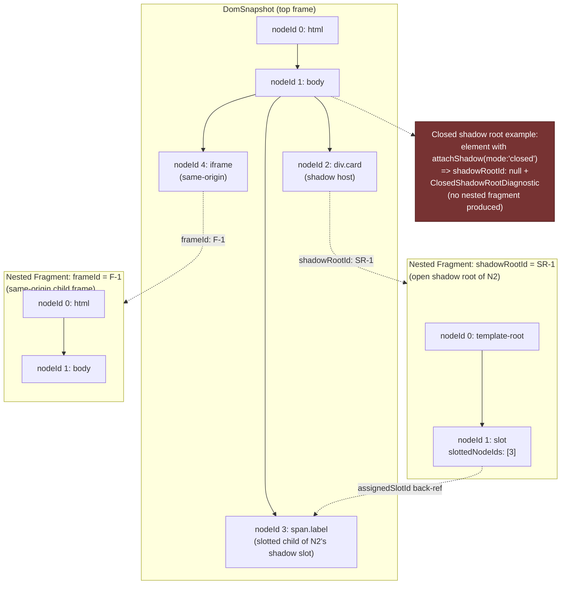
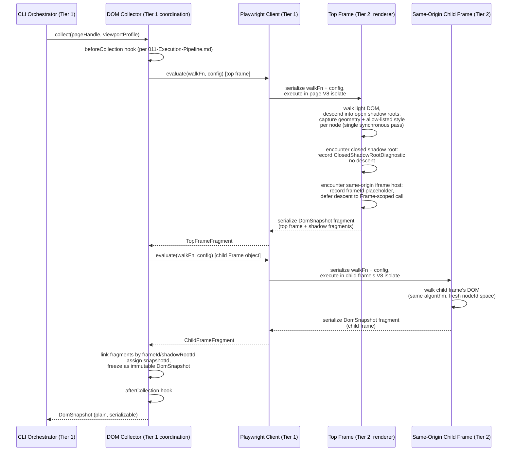

# 106 — DOM Snapshot

## 1. Title

**Critical CSS Extraction Engine — DOM Collector: Snapshot Mechanism and In-Page Enumeration Strategy**

## 2. Version

| Field | Value |
|---|---|
| Document Version | 1.0.0 |
| Status | Accepted |
| Last Updated | 2026-07-09 |
| Owners | Core Architecture Working Group |
| Stability | Stable (Phase 3 — Browser Layer; changes to the snapshot record shape require RFC, since [016-Data-Flow.md](../architecture/016-Data-Flow.md) and downstream Phase 4/5 consumers depend on it) |

## 3. Purpose

This document specifies the design of the **DOM Collector's snapshot mechanism**: the concrete procedure by which the engine walks the live DOM tree inside a browser-controlled renderer process and produces a `DomSnapshot` — a host-addressable, serializable record set — back in the Node.js host process. [016-Data-Flow.md](../architecture/016-Data-Flow.md) Section 8.2 already defines the *shape* of `DomNodeRecord` and `DomSnapshot` at the data-flow level; this document is the design authority for *how that shape is populated*: the walking algorithm, what is captured per node, how Shadow DOM and iframe boundaries are handled, why the walk is eager rather than lazy, and how the resulting structure is handed to the two pipeline stages that consume it — the Visibility Engine (Phase 4, forward-referenced) and, indirectly via correlation identifiers, the CSSOM Walker (Phase 5, forward-referenced).

This document exists as a standalone design document, distinct from [016-Data-Flow.md](../architecture/016-Data-Flow.md), for the same reason [011-Execution-Pipeline.md](../architecture/011-Execution-Pipeline.md) is distinct from [010-System-Overview.md](../architecture/010-System-Overview.md): the architecture documents establish *what* crosses each boundary and in *what order*; this document establishes the *algorithm* that produces one specific boundary-crossing artifact, at the level of detail an implementer needs to write `packages/collector`'s DOM-walking code correctly and a reviewer needs to evaluate whether a proposed change to that code preserves the engine's correctness and determinism guarantees.

## 4. Audience

- Implementers of `packages/collector`'s DOM Collector sub-module, who will write the `page.evaluate()`/`page.evaluateHandle()` payload that performs the walk described here.
- Implementers of the Visibility Engine (Phase 4, [200-Visibility-Engine-Overview.md](./200-Visibility-Engine-Overview.md), forward reference) and the CSSOM Walker (Phase 5, [300-CSSOM-Walker.md](./300-CSSOM-Walker.md), forward reference), who consume the `DomSnapshot` this document specifies and need to know precisely what guarantees it does and does not make about completeness, ordering, and Shadow DOM/iframe reachability.
- Reviewers evaluating proposed changes to the collection algorithm's performance characteristics (e.g., a proposal to lazily enumerate subtrees) against this document's chosen eager-batched design and its stated rationale.
- Senior engineers and autonomous coding agents implementing `packages/browser`'s `page.evaluate()` bridge utilities that this module depends on (see [015-Runtime-Model.md](../architecture/015-Runtime-Model.md) Section 10.2, "Cross-Boundary Call Batching").

Readers are assumed to be fluent in DOM APIs (`Node`, `Element`, `ShadowRoot`, `HTMLIFrameElement`), the distinction between open and closed Shadow DOM, and the two-tier process model of [015-Runtime-Model.md](../architecture/015-Runtime-Model.md). This is not an introduction to the DOM; it is a normative specification of one module's collection algorithm.

## 5. Prerequisites

- [006-Design-Principles.md](../architecture/006-Design-Principles.md) Principle 1 (The Browser Is the Source of Truth) — the DOM Collector's entire design is a direct instantiation of this principle: node enumeration, geometry, and computed style are read from a live browser, never approximated in Node.
- [006-Design-Principles.md](../architecture/006-Design-Principles.md) Principle 3 (Correctness Over Premature Optimization) and Principle 5 (Determinism of Output) — both directly constrain this document's choice of eager enumeration over lazy/streaming enumeration (see Section 9, Detailed Design).
- [011-Execution-Pipeline.md](../architecture/011-Execution-Pipeline.md) Section 8.6 (`DomCollected` state) — the control-flow position this document's algorithm occupies within the single-work-unit state machine.
- [015-Runtime-Model.md](../architecture/015-Runtime-Model.md) Section 8.1 (Two-Tier Process Boundary) and Section 10.2 (Cross-Boundary Call Batching) — this document's collection algorithm is a concrete instance of the `batchedEvaluate` pattern specified there, and the reader should understand why a single `page.evaluate()` round trip is preferred over many before reading Section 10 of this document.
- [016-Data-Flow.md](../architecture/016-Data-Flow.md) Section 8.2 (Live Page → DOM Snapshot) — the authoritative data-shape contract (`DomSnapshot`, `DomNodeRecord`) this document's algorithm must produce.
- Familiarity with the sibling Phase 3 design documents: [100-Browser-Abstraction.md](./100-Browser-Abstraction.md) (the `Page`/`ElementHandle` abstraction this module sits on top of), [101-Playwright-Adapter.md](./101-Playwright-Adapter.md) (the concrete Playwright bindings for `page.evaluate`/`page.evaluateHandle`), [102-Browser-Pool.md](./102-Browser-Pool.md) (the pool that supplies the `Page` this module operates against), [103-Navigation-Engine.md](./103-Navigation-Engine.md) (the navigation that must precede collection), and [104-Rendering-Stabilization.md](./104-Rendering-Stabilization.md) (the stability gate this module's entry condition depends on) and [105-Viewport-Manager.md](./105-Viewport-Manager.md) (the viewport context under which each snapshot is captured).

## 6. Related Documents

- [006-Design-Principles.md](../architecture/006-Design-Principles.md) — Principles 1, 3, 5, and the Edge Cases entries on Shadow DOM and Constructable Stylesheets, which this document operationalizes for the DOM-specific case.
- [011-Execution-Pipeline.md](../architecture/011-Execution-Pipeline.md) — Section 8.6 (`DomCollected`) and Section 8.7 (`VisibilityClassified`), the state-machine positions immediately surrounding this document's subject matter.
- [015-Runtime-Model.md](../architecture/015-Runtime-Model.md) — the process-boundary model this document's `page.evaluate()`/`page.evaluateHandle()` calls cross, and the batching discipline this document's algorithm follows.
- [016-Data-Flow.md](../architecture/016-Data-Flow.md) — the authoritative `DomSnapshot`/`DomNodeRecord` data-shape contract this document's algorithm is designed to populate correctly.
- [100-Browser-Abstraction.md](./100-Browser-Abstraction.md) — the `Page` abstraction that exposes the `evaluate`/`evaluateHandle` primitives this module calls.
- [101-Playwright-Adapter.md](./101-Playwright-Adapter.md) — the concrete Playwright implementation of those primitives, including serialization limits this document's design must respect.
- [102-Browser-Pool.md](./102-Browser-Pool.md) — supplies the `PageHandle` this module's collection runs against; pool lifecycle (page reuse, crash recovery) bounds this module's assumptions about page identity across calls.
- [103-Navigation-Engine.md](./103-Navigation-Engine.md) — must have completed navigation before this module's entry condition (per [011-Execution-Pipeline.md](../architecture/011-Execution-Pipeline.md) Section 8.6) is satisfied.
- [104-Rendering-Stabilization.md](./104-Rendering-Stabilization.md) — the stability signal this module's collection start depends on; collecting before stabilization risks an incomplete or actively-mutating tree, which this document's Edge Cases section addresses.
- [105-Viewport-Manager.md](./105-Viewport-Manager.md) — supplies the active `ViewportProfile` under which fold-relative geometry is meaningful; the DOM Snapshot itself is viewport-agnostic in its node structure but is always captured once per viewport navigation, per [016-Data-Flow.md](../architecture/016-Data-Flow.md) Section 8.2.
- [200-Visibility-Engine-Overview.md](./200-Visibility-Engine-Overview.md) (Phase 4, planned) — the primary consumer of this document's `DomSnapshot`, which overlays visibility annotations onto it without mutating it.
- [300-CSSOM-Walker.md](./300-CSSOM-Walker.md) (Phase 5, planned) — a peer, not a downstream consumer, of this document's snapshot; correlates to it only via the shared `snapshotId` correlation key, since CSSOM traversal has no DOM dependency (see Section 9, Architecture).

## 7. Overview

The DOM Collector's job, reduced to its essential contract, is: given a stabilized, navigated `Page` (per [104-Rendering-Stabilization.md](./104-Rendering-Stabilization.md)), produce exactly one `DomSnapshot` — a flat, host-addressable, plain-data enumeration of every reachable node in the page's DOM, including nodes inside accessible Shadow DOM subtrees, correlated by a stable `snapshotId` to the `CssomRuleList` captured from the same navigation (per [016-Data-Flow.md](../architecture/016-Data-Flow.md) Section 8.4). This document specifies the walking algorithm that produces that enumeration, the exact set of facts captured per node, and the treatment of four structurally significant boundaries the naive "just walk `document.body`" approach does not handle correctly: Shadow DOM (open and closed), slot assignment, iframe boundaries (same-origin and cross-origin), and the performance implications of eagerly materializing the entire reachable tree in one round trip.

Three design decisions dominate this document and are previewed here because they recur throughout every section below:

1. **Geometry and computed style are captured as part of the same walk that produces structural node identity, not as a separate pass.** A naive design might structurally enumerate the DOM first, then make a second `page.evaluate()` pass to query geometry/style per node. This document rejects that split: `getBoundingClientRect()` and the relevant `getComputedStyle()` properties are read in the *same* per-node visit as the node's tag name and attributes, because both facts are needed by the immediate downstream consumer (the Visibility Engine) and splitting them into two round trips would double the cross-boundary IPC cost for no correctness benefit (see [015-Runtime-Model.md](../architecture/015-Runtime-Model.md) Section 10.2's batching rationale, which this design follows directly).
2. **The walk is eager and batched into a single round trip per navigation, not lazy or streaming.** Section 9 justifies this at length; the short version is that Principle 3 (Correctness Over Premature Optimization) and Principle 5 (Determinism) both penalize a lazy design more than an eager one benefits from it, given this engine's actual access pattern (the Visibility Engine and Selector Matcher need geometry/structure for effectively the whole reachable tree, not a sparse, request-driven subset).
3. **Shadow DOM and iframe boundaries are treated as structurally distinct kinds of boundary, with different reachability guarantees, rather than being flattened into one uniform "nested content" concept.** A closed shadow root is *unreachable* by design (the DOM spec's own encapsulation guarantee) and must be recorded as an explicit, diagnosable gap, not silently skipped; a cross-origin iframe is *reachable in principle but access-restricted in practice* by the same-origin policy, which is a different failure mode requiring a different diagnostic. Conflating these into a single "couldn't get in there" case would lose information the Reporter (per [006-Design-Principles.md](../architecture/006-Design-Principles.md) Principle 6) needs to attribute correctly.

The remainder of this document works through the walking algorithm (Section 9), the per-node capture list (Section 8.2), the Shadow DOM/slot/iframe boundary handling (Section 8.3–8.5), the eager-vs-lazy tradeoff analysis (Section 8.6), and the handoff to the Visibility Engine and CSSOM Walker (Section 8.7), before presenting the Mermaid diagrams, algorithms, and standard closing sections required by [006-Design-Principles.md](../architecture/006-Design-Principles.md) Section 4.

## 8. Detailed Design

### 8.1 Entry Condition and Scope

Per [011-Execution-Pipeline.md](../architecture/011-Execution-Pipeline.md) Section 8.6, the `DomCollected` state is entered from `Stabilized`, after the `beforeCollection` plugin hook fires. The DOM Collector's precondition is therefore: a `Page` handle that has completed navigation and satisfied the configured `StabilizationPolicy` (per [104-Rendering-Stabilization.md](./104-Rendering-Stabilization.md)). The Collector does not itself wait for stability, re-check readiness, or retry navigation — those are the Navigation Engine's responsibilities, and conflating them here would violate the state-machine's separation of concerns established in [011-Execution-Pipeline.md](../architecture/011-Execution-Pipeline.md) Section 8.15's discussion of why retries are scoped per-state.

The Collector's scope for a single invocation is: one `Page`, one active `ViewportProfile` (per [105-Viewport-Manager.md](./105-Viewport-Manager.md)), producing exactly one `DomSnapshot`. As established in [016-Data-Flow.md](../architecture/016-Data-Flow.md) Section 8.2, a new `DomSnapshot` is captured per viewport navigation — the Collector never attempts to reuse a snapshot captured under a different viewport, because geometry (`getBoundingClientRect()`) is viewport-dependent even though DOM structure typically is not.

### 8.2 What Is Captured Per Node

The DOM Collector's in-page walk visits every reachable node (see Sections 8.3–8.5 for what "reachable" excludes) and, for each `Element` node, captures the following facts in a single visit — deliberately including both structural and geometric/style facts together, per the design decision previewed in Section 7:

- **Structural identity.** `tagName` (uppercased, per DOM spec convention, read directly from `element.tagName`), a stable within-snapshot `nodeId` (an integer assigned by walk order, not derived from any DOM-native identity that could collide across shadow boundaries — see Section 10.1), `parentNodeId`, and `childNodeIds` (populated as the walk completes each node's children, per the algorithm in Section 10.1).
- **Attributes.** `classList` (as a plain string array, from `element.classList`) and a flattened `attributes` record (`Record<string, string>`, from `element.attributes`, excluding attributes the configuration explicitly denies collecting — e.g., a large inlined `data-*` payload attribute that would bloat the snapshot for no extraction-relevant benefit; denial is opt-in per-attribute-name configuration, defaulting to "collect everything," consistent with Principle 3's bias toward completeness by default).
- **Geometry.** `boundingBox`, the `DOMRect` returned by `element.getBoundingClientRect()`, captured as four numbers (`x`, `y`, `width`, `height`) rather than the live `DOMRect` object, since the record must be plain-data-serializable across the Node↔browser IPC boundary (per [015-Runtime-Model.md](../architecture/015-Runtime-Model.md) Section 12's structured-clone constraint, and [016-Data-Flow.md](../architecture/016-Data-Flow.md) Section 11's "no live handles at rest" implementation note). Per [006-Design-Principles.md](../architecture/006-Design-Principles.md) Edge Cases ("Determinism under floating-point geometry"), each of the four numbers is rounded to a documented epsilon (default: 2 decimal places) at capture time, not left as raw floating-point output, so that the same page rendered twice on different hardware/GPU configurations does not silently break Principle 5's determinism guarantee downstream at the Visibility Engine.
- **Computed style, restricted to a fixed, documented allow-list.** The Collector does **not** capture the entire `CSSStyleDeclaration` returned by `getComputedStyle()` — doing so would mean serializing several hundred property values per node, the overwhelming majority of which no downstream consumer needs at this stage. Instead, a fixed allow-list of properties directly relevant to visibility classification and fold computation is captured: `display`, `visibility`, `opacity`, `position`, `transform`, `overflow`, `overflow-x`, `overflow-y`, `content-visibility`, `contain`, `zIndex`. This allow-list is owned by this document and by [200-Visibility-Engine-Overview.md](./200-Visibility-Engine-Overview.md) jointly — any Phase 4 requirement for an additional computed-style fact must be added here, at capture time, rather than the Visibility Engine reaching back into the page for a second `getComputedStyle()` round trip per node (which would defeat this document's batching rationale, Section 9).
- **Shadow/slot linkage.** `shadowRootId` (nullable; see Section 8.3), and, for nodes that are themselves `<slot>` elements or slotted children, `assignedSlotId`/`slottedNodeIds` (see Section 8.4).
- **Frame linkage.** `frameId` (nullable; see Section 8.5), identifying which frame — the top-level document or a specific same-origin child frame — a node belongs to, since a single `DomSnapshot` spans the top frame and every reachable same-origin subframe (Section 8.5).

Text nodes are **not** individually enumerated as `DomNodeRecord` entries. This is a deliberate scope decision: the extraction engine's decisions (visibility, selector matching) operate at the element granularity per the CSSOM's own rule-matching model (`Element.matches()` never matches a text node); representing text nodes would roughly double snapshot size for zero consumer benefit at this phase. If a future requirement (e.g., precise line-wrapping-aware fold computation) needs text-node-level geometry, it is scoped as Future Work (Section 16) rather than added speculatively now, consistent with Principle 3's "additive, benchmarked" performance-and-scope discipline.

### 8.3 Shadow DOM: Open Roots, Closed Roots, and Reachability

Per [006-Design-Principles.md](../architecture/006-Design-Principles.md) Edge Cases, "`Element.matches()` and `querySelectorAll` do not cross shadow boundaries by default," and the Collector's walk must explicitly descend into `shadowRoot` contexts rather than flattening shadow content into a synthetic light-DOM approximation.

**Open shadow roots.** When the walk encounters a shadow host (an element with a non-null `element.shadowRoot`, which is only non-null when the shadow root's `mode` was `"open"`), it treats the shadow root as a nested traversal root, recursively enumerating its children exactly as it would the light DOM, but recording the result as a linked, independently-addressable nested `DomSnapshot`-shaped fragment (per [016-Data-Flow.md](../architecture/016-Data-Flow.md) Section 8.2's "linked, not inlined" design). The shadow host's own `DomNodeRecord.shadowRootId` field is set to the nested fragment's identifier. This nesting, rather than inlining, is chosen for the same reason [016-Data-Flow.md](../architecture/016-Data-Flow.md) gives for shadow-root nesting generally: a page with many shadow roots (a common pattern in Web-Components-heavy design systems, one of the fixture categories in `BRIEF.md` Section 2.15) should not force every consumer to deep-copy or re-flatten a large combined tree merely to distinguish "this subtree is shadow-encapsulated" from "this subtree is light DOM."

**Closed shadow roots.** When `element.attachShadow({mode: 'closed'})` was used by the page's own script, `element.shadowRoot` is `null` from the perspective of any script running in the page's own global execution context — including the Collector's own injected `page.evaluate()` payload, which executes as ordinary page-context JavaScript and is bound by the same encapsulation the spec grants to any other script. **The Collector does not attempt to bypass this encapsulation.** This is a direct consequence of Principle 1: even though the Chrome DevTools Protocol's `DOM.getFlattenedDocument`/`DOM.describeNode` CDP methods *can*, via privileged devtools-level access, observe closed shadow roots that page-script cannot, using that privileged path would mean the Collector observes DOM structure a real page script (and, critically, a real browser's *rendering* of that structure for a real user) treats as inaccessible — and Principle 1 is about matching what the browser actually renders and what real page behavior actually sees, not about extracting the maximum theoretically observable structure via a debugging-only privilege escalation. A closed shadow host is therefore recorded with `shadowRootId: null` and an accompanying `ClosedShadowRootDiagnostic` (per [006-Design-Principles.md](../architecture/006-Design-Principles.md) Principle 6's fail-fast-diagnostics discipline) rather than either a silent gap or a privileged bypass. Content inside a closed shadow root is consequently **not** visible to the CSSOM Walker's selector matching either (`Element.matches()` cannot match into it from outside), which is self-consistent: the DOM Collector's declared blind spot and the Selector Matcher's declared blind spot are the same blind spot, for the same underlying reason, and the diagnostic surfaced here is what lets the Reporter explain "this component's content was not analyzed" coherently to an operator rather than as an unexplained gap in coverage.

**Why this is a "should," not a "must fully solve," per REQ-009.** [006-Design-Principles.md](../architecture/006-Design-Principles.md) Edge Cases and [016-Data-Flow.md](../architecture/016-Data-Flow.md) Section 12 both flag closed-shadow-root inaccessibility as an accepted, documented limitation rather than a defect to be engineered away — a design-system author who deliberately chooses `mode: 'closed'` has made an explicit encapsulation decision this engine has no legitimate authority to override.

### 8.4 Slot Assignment

Within an open shadow root, `<slot>` elements project light-DOM children into the shadow tree's render position without those children ever becoming shadow-tree descendants structurally. The Collector's walk captures this distinctly from ordinary parent/child structure, because both the Visibility Engine (Phase 4) and a future CSSOM matching pass (Phase 5) need to reason about a slotted node's *rendered* position (inside the shadow tree, for geometry/visibility purposes) independently of its *DOM tree* position (still a light-DOM child of the shadow host, for `Element.matches()` and CSS-inheritance purposes, since slotted content is styled by the light-DOM document's stylesheets by default, not by the shadow tree's own `<style>` unless `::slotted()` is used).

Concretely: when the walk visits a `<slot>` element, it records the slot's own `nodeId` as any other element's, plus `slottedNodeIds: number[]` — the `nodeId`s (in the light DOM's node-id space, per Section 8.3's separate-but-linked snapshot design) of the elements `slot.assignedNodes({flatten: false})` reports as currently assigned to it. Correspondingly, each slotted light-DOM element's own `DomNodeRecord` carries `assignedSlotId: number | null`, a back-reference into the shadow fragment's node-id space. This dual-linkage (slot → assigned nodes, assigned node → slot) lets a downstream consumer answer either "what renders inside this slot" or "where does this light-DOM node actually render" without re-querying the page, which matters because `assignedNodes()` is itself a live, in-page-only query — capturing both directions at snapshot time means neither direction requires a second round trip later.

**Why `{flatten: false}` and not `{flatten: true}`.** `flatten: true` would recursively resolve nested slot chains (a slot assigned to another slot) into their ultimate rendered leaf assignment, which discards the intermediate slotting structure. This document's design retains the unflattened, one-hop assignment per slot specifically so nested-slotting fixtures (a known pattern in complex design systems) remain reconstructable by a downstream consumer that needs the full chain, rather than only its resolved endpoint — consistent with Principle 3's preference for retaining full fidelity over discarding information for a marginal simplicity gain.

### 8.5 Iframe Boundaries

An `<iframe>` element is a boundary the Collector must classify, not merely traverse or skip uniformly, because same-origin and cross-origin iframes have fundamentally different reachability:

**Same-origin iframes.** `iframeElement.contentDocument` is non-null and accessible from the parent frame's script when the child frame is same-origin (or has relaxed `document.domain`, in legacy configurations this engine does not specifically special-case). In this case, the Collector's walk descends into the child frame's `document.body` exactly as it would a shadow root — recursively, producing a nested `DomSnapshot` fragment linked from the `<iframe>` host's `DomNodeRecord.frameId`. Playwright itself models each same-origin (and, separately, each cross-origin) child frame as its own `Frame` object with its own `evaluate()`/`evaluateHandle()` entry points (per [101-Playwright-Adapter.md](./101-Playwright-Adapter.md)), so in practice the Collector's per-frame walk is dispatched once per `Frame` the `Page` exposes, not achieved by reaching across a same-origin boundary from within a single frame's own evaluated function — this keeps the Collector's implementation uniform with how Playwright's own API surface already models frame boundaries, rather than the Collector reinventing frame traversal via raw `contentDocument` access from inside a single `page.evaluate()` payload (which is also possible for same-origin frames, but inconsistent with the `Frame`-object-per-frame model the rest of `packages/browser`'s abstraction, per [100-Browser-Abstraction.md](./100-Browser-Abstraction.md), is built around).

**Cross-origin iframes.** Per the same-origin policy, a cross-origin child frame's `contentDocument` is inaccessible from the parent frame's own script context — `iframeElement.contentDocument` returns `null` (or throws, depending on the access pattern) from the parent's perspective. Playwright's own `Frame` API, however, *can* still reach into a cross-origin frame's content, because Playwright drives the browser via the Chrome DevTools Protocol from outside any single frame's own JavaScript sandbox — CDP is not subject to the same-origin policy the way in-page script is. This creates a genuine design choice this document must resolve explicitly, not leave implicit:

**Decision: cross-origin iframes are traversed via Playwright's `Frame` API, not skipped, but are recorded with an explicit cross-origin provenance marker distinct from same-origin frame content.** The rationale is Principle 1: a real user's browser *does* render cross-origin iframe content, and that content genuinely occupies layout space and can affect above-the-fold visibility of the surrounding page (an embedded video player, a payment widget, an ad frame) — skipping cross-origin iframes outright would under-collect exactly the content Principle 1 exists to make the engine correctly account for. However, the *stylesheets* governing a cross-origin iframe's own internal content are the responsibility of that iframe's own extraction context, not this route's critical CSS output — this engine's critical CSS is for the *embedding* page's above-the-fold render, and a cross-origin iframe's internal CSS is out of this engine's jurisdiction (the embedding page has no way to inline or control it regardless). The Collector therefore does traverse into a cross-origin frame's DOM structure (for geometry/visibility purposes — the iframe's occupied space matters to the surrounding page's fold computation) but the CSSOM Walker (Phase 5, [300-CSSOM-Walker.md](./300-CSSOM-Walker.md)) explicitly does not attempt to walk a cross-origin frame's `document.styleSheets`, consistent with the same cross-origin `SecurityError` boundary already documented for cross-origin `<link>` stylesheets in [006-Design-Principles.md](../architecture/006-Design-Principles.md) Edge Cases and [016-Data-Flow.md](../architecture/016-Data-Flow.md) Section 8.4's `accessible: false` field. Each cross-origin-traversed node's `DomNodeRecord` carries `frameOrigin: "same-origin" | "cross-origin"`, so the Visibility Engine can use the geometry (fold-relevance is origin-independent) while the CSSOM Walker and Selector Matcher correctly treat cross-origin-frame content as out of scope for rule matching (there is no meaningful "critical CSS for a frame you don't control" concept in this engine's extraction model).

**Failure mode when even CDP-level cross-origin access is unavailable** (e.g., a target configured with strict site-isolation settings that also restrict CDP's own cross-process frame access, an unusual but real Chromium configuration) — the Collector records the iframe host node with `frameId: null` and an `InaccessibleFrameDiagnostic`, structurally identical in spirit to the closed-shadow-root diagnostic in Section 8.3: a boundary the engine could not cross, surfaced loudly rather than silently, per Principle 6.

### 8.6 Eager, Batched Enumeration — Not Lazy or Streaming

This document commits to **eager, single-round-trip enumeration of the entire reachable tree**, deliberately rejecting a lazy/streaming design (enumerate only the nodes a later stage actually requests, on demand, via many small `page.evaluate()` calls). This is the single most consequential architectural decision in this document, and it deserves its own subsection rather than being folded into Tradeoffs, because it determines the shape of the walking algorithm in Section 10.

**Why eager wins under this engine's actual access pattern.** The Visibility Engine (Phase 4) needs a boundingBox/computedStyle fact for effectively every element in the reachable tree, because visibility classification is not a sparse, selective query — it is a full classification pass over the whole tree (per [200-Visibility-Engine-Overview.md](./200-Visibility-Engine-Overview.md)'s forthcoming design, and per the `VisibilityAnnotatedNodeSet` shape in [016-Data-Flow.md](../architecture/016-Data-Flow.md) Section 8.3, which is "one annotation per `DomNodeRecord`," not a sparse subset). A lazy design's entire premise — avoid computing facts nobody asked for — does not apply when, in the overwhelmingly common case, everybody (the Visibility Engine, and transitively the Selector Matcher via the visibility-filtered candidate set) ends up asking for nearly the whole tree anyway. Under that access pattern, lazy enumeration's benefit (skip unrequested work) evaporates, while its costs remain in full: many more `page.evaluate()` round trips (one per lazily-requested subtree or node, each paying the fixed per-round-trip IPC/serialization overhead documented in [015-Runtime-Model.md](../architecture/015-Runtime-Model.md) Section 10.2), and — more seriously — a live-page-based lazy design risks observing a **different** tree state across successive lazy requests if anything on the page mutates between them (a background animation tick, a lazily-hydrating component), which directly threatens Principle 5's determinism guarantee: two lazy enumerations of the "same" snapshot, spread across multiple round trips, are not actually guaranteed to observe one coherent instant of the page's state the way a single synchronous, single-round-trip walk is.

**The eager design's one real cost, and why it is acceptable.** Eager enumeration pays the cost of materializing facts for nodes that might turn out to be entirely below the fold, deeply nested in a collapsed `<details>`, or otherwise never relevant to the final critical CSS. This is real, bounded overhead — but it is bounded by the size of the page's reachable DOM, which for the vast majority of real-world pages (excluding the deliberately pathological `fixtures/enterprise-huge/` category in `BRIEF.md` Section 2.15) is a few thousand nodes at most, and the per-node capture cost (a handful of property reads and one `getBoundingClientRect()` call) is cheap relative to the fixed per-round-trip overhead a lazy design would pay repeatedly instead. Section 14 (Performance) quantifies this tradeoff further; Section 13 (Tradeoffs) states it in table form alongside the alternative considered and rejected.

**What this decision does not mean.** Eager enumeration of the whole reachable tree in one round trip does not mean the Collector computes *derived* facts (visibility classification, fold membership) eagerly — those remain the Visibility Engine's job, operating on the eagerly-captured raw facts (geometry, computed style) as an overlay (per [016-Data-Flow.md](../architecture/016-Data-Flow.md) Section 8.3). The Collector's eagerness is scoped strictly to *raw structural and geometric enumeration*, not to pipeline-stage-crossing derived computation — conflating the two would violate the module-boundary discipline [006-Design-Principles.md](../architecture/006-Design-Principles.md) Principle 4 establishes for pluggable, non-overlapping module responsibility.

### 8.7 Handoff to the Visibility Engine and the CSSOM Walker

The completed `DomSnapshot` — including its linked shadow-root and iframe fragments — is returned from the Collector's single `page.evaluate()` call as a plain, JSON-serializable structure (per [015-Runtime-Model.md](../architecture/015-Runtime-Model.md) Section 12's structured-clone/serialization constraint) and becomes the read-only input to two independent downstream consumers, per [011-Execution-Pipeline.md](../architecture/011-Execution-Pipeline.md) Section 8.7–8.8 and [016-Data-Flow.md](../architecture/016-Data-Flow.md) Section 8.3–8.4:

**To the Visibility Engine (Phase 4, [200-Visibility-Engine-Overview.md](./200-Visibility-Engine-Overview.md)).** The Visibility Engine consumes the `DomSnapshot` directly as its sole structural input, producing a `VisibilityAnnotatedNodeSet` overlay keyed by `nodeId` (per [016-Data-Flow.md](../architecture/016-Data-Flow.md) Section 8.3) — it never re-queries the page for geometry or computed style itself; every fact it needs (`boundingBox`, `computedDisplay`, `computedVisibility`, `computedOpacity`, and the allow-listed style properties from Section 8.2) is already present on the `DomNodeRecord` this document's Collector produced. This is the direct payoff of Section 8.6's eager design: the Visibility Engine's entire classification pass is a pure, browser-independent, host-side computation over already-captured data, with zero additional `page.evaluate()` round trips.

**To the CSSOM Walker (Phase 5, [300-CSSOM-Walker.md](./300-CSSOM-Walker.md)).** Critically, the CSSOM Walker does **not** consume the `DomSnapshot` as a direct structural input at all — per [016-Data-Flow.md](../architecture/016-Data-Flow.md) Section 8.4 and [011-Execution-Pipeline.md](../architecture/011-Execution-Pipeline.md) Section 8.8, CSSOM traversal has no data dependency on DOM structure; it walks `document.styleSheets` independently. The relationship between this document's `DomSnapshot` and the future CSSOM Walker's `CssomRuleList` is **correlation, not consumption**: both are captured from the same navigated, stabilized page and share a `snapshotId` correlation key (per [016-Data-Flow.md](../architecture/016-Data-Flow.md) Section 8.4), which lets the Selector Matcher's later join step (Section 8.5 of that document) verify both structures originate from the same atomic page state — and lets a `StabilityViolationWarning` diagnostic (per [016-Data-Flow.md](../architecture/016-Data-Flow.md) Section 12) be raised if they do not. This document's Collector is therefore responsible for stamping every `DomSnapshot` it produces with a fresh `snapshotId` at capture time, and for ensuring that identifier is derived independently of wall-clock time (per Principle 5's ban on embedding timestamps in deterministic data), using the same monotonic `LogicalTimestamp`/fingerprint-derived scheme already established in [016-Data-Flow.md](../architecture/016-Data-Flow.md) Section 8.2.

## 9. Architecture

### 9.1 Snapshot Data Structure — Tree of Node Records

The diagram below shows the conceptual shape of one `DomSnapshot`, including a light-DOM subtree, a nested open-shadow fragment with slot assignment, and a nested same-origin iframe fragment. Dotted edges denote the "linked, not inlined" relationship from Section 8.3/8.5; solid edges denote ordinary parent/child structure within one fragment.



Two structural properties this diagram is designed to make visible: **(a)** node-id spaces are local to each fragment (`nodeId 0` exists independently in the top frame, the shadow fragment, and the iframe fragment — cross-fragment references are always made via a fragment identifier plus a local `nodeId`, never a globally unique id, which keeps each fragment independently serializable and avoids a single-global-namespace bottleneck during the walk); and **(b)** a closed shadow root produces no nested fragment at all — only a diagnostic — which is the structural encoding of Section 8.3's reachability decision.

### 9.2 Sequence Diagram — Evaluate-and-Serialize Round Trip

The following sequence diagram elaborates [015-Runtime-Model.md](../architecture/015-Runtime-Model.md) Section 8.1's two-tier process boundary for this specific module: one Collector-initiated `page.evaluate()` call (for the walk itself, batched per Section 8.6 and [015-Runtime-Model.md](../architecture/015-Runtime-Model.md) Section 10.2), plus the `Frame`-scoped calls needed to reach same-origin and cross-origin iframe content (Section 8.5), all converging into a single `DomSnapshot` returned to the orchestrator.



This diagram makes explicit a detail Section 8.5 states in prose: **the top-frame walk and each same-origin child-frame walk are separate `page.evaluate()`/`Frame.evaluate()` calls**, because Playwright models each frame as an independent execution context — the walk cannot reach across a frame boundary from within a single evaluated function, even for same-origin frames, without going through Playwright's own `Frame` object. This is *not* a violation of Section 8.6's "single round trip" eagerness principle at the level that principle actually matters (per-node round trips); it is one round trip **per frame**, which for the overwhelming majority of pages (zero or one same-origin iframe) is still a small, fixed, bounded number of round trips, not a per-node cost. Cross-origin frames follow the identical `Frame`-scoped call pattern (CDP-mediated, per Section 8.5), simply with the `frameOrigin: "cross-origin"` marker attached to the resulting fragment's nodes.

## 10. Algorithms

### 10.1 Algorithm: Single-Pass Recursive DOM Walk with Fragment Linking

**Problem statement.** Given a root node (a `Document`, a `ShadowRoot`, or, recursively, an already-visited shadow host/iframe host encountered mid-walk), produce a flat `DomNodeRecord[]` for that root's fragment, assigning stable local `nodeId`s by visitation order, capturing structural/geometric/style facts per node in the same visit, and recording explicit boundary markers (shadow linkage, slot linkage, frame linkage, or a diagnostic) wherever the walk cannot or should not descend further.

**Inputs.** `root: Document | ShadowRoot`, `config: CollectorConfig` (the attribute allow/deny list and the computed-style property allow-list from Section 8.2), `fragmentId: string` (identifies this fragment for cross-fragment linking).

**Outputs.** `DomSnapshotFragment { fragmentId, nodes: DomNodeRecord[], diagnostics: CollectorDiagnostic[] }`.

**Pseudocode.**

```text
function walkFragment(root, config, fragmentId) -> DomSnapshotFragment:
    nodes = []
    diagnostics = []
    nodeIdCounter = 0

    function visit(element, parentNodeId) -> number:
        nodeId = nodeIdCounter
        nodeIdCounter += 1

        rect = element.getBoundingClientRect()
        style = getComputedStyle(element)

        record = DomNodeRecord {
            nodeId: nodeId,
            tagName: element.tagName,
            classList: Array.from(element.classList),
            attributes: filterAttributes(element.attributes, config.attributeDenyList),
            boundingBox: roundToEpsilon(rect, config.geometryEpsilon),
            computedStyle: pickAllowListed(style, config.styleAllowList),
            parentNodeId: parentNodeId,
            childNodeIds: [],          // filled in after children are visited
            shadowRootId: null,
            frameId: null,
            assignedSlotId: null,
            slottedNodeIds: null,
        }
        nodes.push(record)

        // Shadow DOM handling (Section 8.3)
        if element.shadowRoot != null:
            shadowFragmentId = freshFragmentId()
            shadowFragment = walkFragment(element.shadowRoot, config, shadowFragmentId)
            record.shadowRootId = shadowFragmentId
            emitLinkedFragment(shadowFragment)     // returned alongside this fragment, not inlined
        else if elementLikelyHasClosedShadow(element):
            // Heuristic best-effort detection (e.g., a documented marker attribute
            // convention, or simply: cannot prove absence, so no diagnostic is emitted
            // unless the page signals a closed root explicitly via a known pattern).
            diagnostics.push(ClosedShadowRootDiagnostic(nodeId))

        // Slot handling (Section 8.4) — only meaningful when visiting inside a shadow fragment
        if element.tagName == "SLOT":
            assigned = element.assignedNodes({ flatten: false })
            record.slottedNodeIds = assigned.map(n => lookupLightDomNodeId(n))
            for lightNode in assigned:
                markAssignedSlot(lightNode, nodeId)   // back-reference, resolved post-walk

        // Iframe handling (Section 8.5)
        if element.tagName == "IFRAME":
            frameInfo = classifyFrameAccess(element)   // same-origin | cross-origin | inaccessible
            if frameInfo.kind == "inaccessible":
                diagnostics.push(InaccessibleFrameDiagnostic(nodeId))
            else:
                record.frameId = frameInfo.frameId     // resolved by a separate Frame-scoped call, Section 9.2
                // Note: actual frame content walk dispatched by the coordinator,
                // NOT recursed into here — Frame boundaries require a distinct
                // page.evaluate() call per Section 9.2, so this function only
                // records the placeholder linkage.

        childIds = []
        for child in element.children:    // Element children only; text nodes excluded, Section 8.2
            childIds.push(visit(child, nodeId))
        record.childNodeIds = childIds

        return nodeId

    rootChildren = (root instanceof Document) ? [root.documentElement] : Array.from(root.children)
    for child in rootChildren:
        visit(child, null)

    return DomSnapshotFragment { fragmentId, nodes, diagnostics }
```

**Time complexity.** `O(n)` in the number of elements `n` reachable within one fragment, since each element is visited exactly once and per-node work (`getBoundingClientRect()`, `getComputedStyle()` property selection, attribute filtering) is `O(1)` amortized (bounded by the fixed allow-list size, not by document size). Across `k` fragments (top frame plus every open-shadow-root and same-origin/cross-origin iframe fragment), total cost is `O(N)` where `N` is the sum of all fragments' element counts — i.e., linear in total reachable DOM size regardless of how it is distributed across shadow/frame boundaries.

**Memory complexity.** `O(N)` for the flat `nodes` arrays across all fragments, plus `O(d)` transient recursion-stack depth for the deepest shadow/DOM nesting chain (bounded in practice by realistic page structure, typically well under a few hundred).

**Failure cases.** A node detaching from the document mid-walk (a background script removing an element between the walk visiting its parent and attempting to visit it) causes `getBoundingClientRect()`/`getComputedStyle()` to return degenerate values (a zero-sized rect, or, in rare engine-specific cases, throw) rather than a coherent geometry fact; per [011-Execution-Pipeline.md](../architecture/011-Execution-Pipeline.md) Section 8.6, this failure class is **not** retried in place — it propagates as a `DomCollected`-state failure, and recovery is a full work-unit-level re-entry from `BrowserAcquired`, never a partial re-walk, for the determinism reasons that document's Section 8.6 already states. A pathologically deep or wide DOM (the `fixtures/enterprise-huge/` category) risks a single-fragment walk becoming a latency outlier; see Section 14 for the mitigation (chunked sub-batching, per [015-Runtime-Model.md](../architecture/015-Runtime-Model.md) Section 10.2's optimization note applied to this walk).

**Optimization opportunities.** The recursive `visit()` calls within one fragment execute synchronously inside the page's own V8 isolate and cannot themselves be parallelized without breaking the single-coherent-instant guarantee Section 8.6 relies on (parallel mutation-observing walks over a live, potentially-mutating tree would reintroduce exactly the determinism risk eager-single-pass walking exists to avoid); however, **independent fragments** (the top frame and each same-origin child frame) are already dispatched as independent `page.evaluate()`/`Frame.evaluate()` calls (Section 9.2) and could be issued concurrently from the Node host rather than sequentially, since they execute in genuinely separate V8 isolates with no shared mutable state — this is flagged as an implementation-level optimization in Section 11, not a change to the algorithm's shape.

### 10.2 Algorithm: Fragment Post-Processing — Slot Back-Reference Resolution

**Problem statement.** Because a `<slot>` element's `slottedNodeIds` (populated during the shadow fragment's own walk, Section 10.1) references light-DOM nodes visited in a *different* fragment (whose walk may not have completed, or even started, at the time the slot is visited, depending on walk order), the reverse back-reference (`assignedSlotId` on the light-DOM node) cannot always be set during the initial single-pass walk. This algorithm resolves that reverse linkage as a post-processing step over the completed set of fragments.

**Inputs.** `fragments: DomSnapshotFragment[]` (all fragments produced by Section 10.1, across the whole snapshot), `pendingSlotAssignments: Map<LightDomNodeRef, SlotNodeRef>` (accumulated during the walk via `markAssignedSlot`, Section 10.1).

**Outputs.** The same `fragments`, mutated in place to set each referenced light-DOM node's `assignedSlotId` — this is the one, tightly-scoped exception to the "immutable once returned" posture the final `DomSnapshot` otherwise has (per [016-Data-Flow.md](../architecture/016-Data-Flow.md) Section 8.2), justified identically to [016-Data-Flow.md](../architecture/016-Data-Flow.md) Section 8.6's documented exception for the Dependency Resolver's fixed-point accumulator: the mutation happens entirely within the Collector's own exclusive ownership window, before the `DomSnapshot` is frozen and handed downstream.

**Pseudocode.**

```text
function resolveSlotBackReferences(fragments, pendingSlotAssignments):
    fragmentsById = indexBy(fragments, f => f.fragmentId)
    for (lightRef, slotRef) in pendingSlotAssignments:
        targetFragment = fragmentsById.get(lightRef.fragmentId)
        targetNode = targetFragment.nodes[lightRef.nodeId]
        targetNode.assignedSlotId = slotRef.nodeId   // local to slotRef.fragmentId; caller retains both ids
    // fragments are now internally consistent; freeze after this call
```

**Time complexity.** `O(m)` where `m` is the number of slot assignments in the page — typically a small fraction of total node count `N`, since only actively slotted content participates.

**Memory complexity.** `O(m)` for the pending-assignment map, discarded once resolution completes.

**Failure cases.** A `slottedNodeIds` reference to a light-DOM node that was itself skipped by the walk (e.g., a slotted node inside an inaccessible cross-origin context, an unusual but spec-legal configuration) resolves to a dangling reference; the resolver must detect this (the referenced `fragmentId`/`nodeId` pair does not exist in `fragmentsById`) and record a `DanglingSlotAssignmentDiagnostic` rather than throwing or silently leaving a stale reference, consistent with this document's fail-fast posture throughout.

**Optimization opportunities.** None material at typical scale; `m` is bounded well below `N` in essentially all realistic fixtures, making this post-processing step a negligible fraction of total collection time relative to the walk itself.

## 11. Implementation Notes

- The walk function in Section 10.1 must be written as a single, self-contained closure with no free-variable dependencies on the Node host's scope beyond its explicit `config` parameter, because it is serialized across the Node↔browser boundary via Playwright's `page.evaluate(fn, arg)` — any accidental closure-captured reference to a Node-side object (a common mistake when a function is authored inline near other Collector logic) will fail to serialize or, worse, silently serialize `undefined`. This mirrors the general discipline already stated in [015-Runtime-Model.md](../architecture/015-Runtime-Model.md) Section 12.
- Per Section 9.2, the top-frame walk and each same-origin child-frame walk should be issued as concurrent (not sequential) `evaluate()`/`Frame.evaluate()` calls from the Collector's coordination code, since they target independent V8 isolates with no shared mutable state — this is a direct, low-risk instance of [015-Runtime-Model.md](../architecture/015-Runtime-Model.md) Section 8.3's Axis 3 reasoning ("parallel work inside the browser's own execution, not Node-side worker threads") applied at the frame-fragment granularity rather than the stylesheet granularity that document's own example uses.
- The computed-style allow-list from Section 8.2 must be defined once, in a shared location consumed by both the Collector (`packages/collector`) and [200-Visibility-Engine-Overview.md](./200-Visibility-Engine-Overview.md)'s implementation, so that a future Visibility Engine requirement for an additional property cannot be satisfied by that module silently issuing its own second `getComputedStyle()` round trip against the same page — any new required property must be added to this document's allow-list and to the Collector's capture logic, keeping the "one round trip, one authoritative source of computed-style facts" property intact.
- `elementLikelyHasClosedShadow()` in Section 10.1's pseudocode is deliberately named to signal that, in the general case, **there is no reliable in-page way to prove a closed shadow root exists** at all (that is the entire point of `mode: 'closed'`) — in practice, the Collector emits a `ClosedShadowRootDiagnostic` only when a documented, opt-in convention is detected (e.g., a marker attribute a design system's build tooling can be configured to emit on closed-shadow hosts) or when a plugin/configuration explicitly declares known closed-shadow-host selectors for a given target application. Absent such a signal, a closed shadow root is genuinely invisible to the Collector with no diagnostic at all, which must be documented to users as a fundamental limitation (Section 12), not silently treated as "no closed shadow roots exist on this page."
- Cross-origin frame classification (`classifyFrameAccess` in Section 10.1) should be implemented against Playwright's own `frame.isDetached()` and page-level frame-tree APIs ([101-Playwright-Adapter.md](./101-Playwright-Adapter.md)) rather than attempting to infer origin access purely from in-page `contentDocument` probing, since Playwright already tracks frame origin and lifecycle authoritatively at the CDP level.

## 12. Edge Cases

- **Closed shadow roots with no detectable marker.** As stated in Section 11, this is the one case in this document where the Collector cannot even guarantee a diagnostic is emitted — the absence of evidence is not evidence of absence. This must be documented prominently in user-facing configuration docs (Phase 3+ `docs/api/` and Phase 6+ CLI documentation) as a known, structural limitation consistent with genuine Shadow DOM encapsulation, not an engine defect.
- **Dynamically re-slotted content between the shadow fragment's walk and the light-DOM fragment's walk.** Because slot assignment can, in principle, change between visiting the `<slot>` element (which snapshots `assignedNodes()` at that instant) and visiting the light-DOM node it references (a different point in the same synchronous walk, but JavaScript execution inside a single `page.evaluate()` call is not preemptible by page-script mutation during that call — no other script can run mid-walk within one synchronous evaluated function), this scenario cannot actually occur *within* one fragment's walk; it can only occur *across* two fragments' separate walks (e.g., a shadow fragment walked, then, before the light-DOM fragment's walk begins, a requestAnimationFrame callback reassigns a slot). Given [104-Rendering-Stabilization.md](./104-Rendering-Stabilization.md)'s stability gate is expected to have already suppressed most such mutation by the time collection starts, this is treated as a rare `StabilityViolationWarning`-class case (per [016-Data-Flow.md](../architecture/016-Data-Flow.md) Section 12), not a routine occurrence requiring special-case handling in the walk algorithm itself.
- **An iframe whose `src` navigates to a same-origin document that itself contains further nested iframes, several levels deep.** The recursive per-frame dispatch pattern in Section 9.2 handles this correctly by construction (each `Frame` object Playwright exposes, at any depth, is walked identically), but implementers should be aware that pathologically deep iframe nesting multiplies the number of `Frame.evaluate()` round trips linearly with nesting depth, which is bounded in practice but worth surfacing in the Reporter's timing report (per [011-Execution-Pipeline.md](../architecture/011-Execution-Pipeline.md) Section 14) as "frame count" rather than being silently absorbed into generic "DOM collection" timing.
- **An iframe that has not finished its own navigation/stabilization by the time the parent frame's collection begins.** The Collector's entry condition (Section 8.1) is scoped to the top-level page's stability signal, per [104-Rendering-Stabilization.md](./104-Rendering-Stabilization.md); a same-origin child frame that is itself still loading at that instant produces a partial or empty fragment, which must be recorded as a `ChildFrameNotStableDiagnostic` rather than silently returning an incomplete node list indistinguishable from "this iframe legitimately has no content yet."
- **Extremely large `attributes` payloads (e.g., a `data-*` attribute holding a serialized JSON blob) inflating snapshot size disproportionately.** The attribute deny-list configuration (Section 8.2) exists specifically to let operators exclude known-large, extraction-irrelevant attributes; absent such configuration, the default is "collect everything," which is a deliberate correctness-over-optimization default per Principle 3 — operators are expected to tune the deny-list only after observing an actual performance problem (per Section 14's profiling guidance), not preemptively.
- **A node whose `getComputedStyle()` allow-listed properties include a CSS custom property fallback value that only resolves correctly relative to the node's actual position in the cascade at capture time.** Because computed style is read live, in-page, at walk time (Principle 1), this is not a concern the Collector itself needs to solve — it is exactly the guarantee Principle 1 provides "for free": whatever the browser resolves at that instant is definitionally correct, and the Collector's only responsibility is to capture it faithfully, not to re-derive or second-guess it.

## 13. Tradeoffs

| Decision | Why | Alternative Considered | Tradeoff Accepted |
|---|---|---|---|
| Eager, single-round-trip enumeration of the whole reachable tree (Section 8.6) | Matches the actual downstream access pattern (Visibility Engine needs facts for nearly the whole tree); avoids repeated round-trip overhead and the determinism risk of observing a mutating page across multiple lazy requests | Lazy/streaming enumeration, materializing only nodes a downstream consumer explicitly requests | Pays capture cost for nodes that may turn out irrelevant (below-fold, collapsed); bounded by realistic page size and accepted as cheap relative to per-round-trip overhead |
| Geometry and allow-listed computed style captured in the same visit as structural identity | Both facts are needed by the same immediate consumer (Visibility Engine); splitting into two passes doubles round-trip cost for no benefit | Two-pass design: structural walk first, geometry/style query second | Slightly larger per-node in-page computation per visit; negligible compared to the round-trip cost avoided |
| Closed shadow roots recorded as an explicit gap (diagnostic where detectable, silent limitation otherwise), never bypassed via privileged CDP access | Respects the encapsulation guarantee the page author deliberately chose; keeps the Collector's blind spot consistent with the Selector Matcher's blind spot | Use CDP's privileged `DOM.getFlattenedDocument` to observe closed shadow content anyway | Genuine, sometimes silent, coverage gap for closed-shadow-root content; accepted because Principle 1 is about matching real page-script-observable behavior, not maximizing theoretically observable structure |
| Cross-origin iframes traversed structurally (for geometry) but excluded from CSSOM/selector-matching scope | A cross-origin iframe genuinely occupies layout space affecting the embedding page's fold computation, but its internal CSS is outside this engine's jurisdiction regardless | Skip cross-origin iframes entirely, treating them as opaque boxes | Slightly more complex frame-classification logic; in exchange, fold computation for pages embedding third-party widgets (video players, payment iframes) is not silently wrong |
| Slot assignment captured bidirectionally and unflattened (`{flatten: false}`) at snapshot time | Preserves full nested-slotting fidelity for both directions of lookup without a second in-page query later | Capture only the flattened, fully-resolved assignment (`{flatten: true}`) | Slightly larger per-slot record (both directions, unflattened chain) in exchange for full-fidelity reconstruction of complex nested-slotting fixtures |
| Fragment-local `nodeId` spaces (not a single global id) with explicit fragment-identifier-qualified cross-references | Keeps each fragment independently serializable and walkable without a shared-namespace coordination bottleneck during a synchronous recursive walk | A single global node-id counter shared across the whole snapshot, including nested fragments | Downstream consumers must always resolve a `(fragmentId, nodeId)` pair, not a bare integer, adding one extra field to every cross-fragment reference |

## 14. Performance

- **CPU complexity.** Per Section 10.1, the walk is `O(N)` in total reachable element count across all fragments; per-node cost is dominated by `getBoundingClientRect()` and the allow-listed `getComputedStyle()` reads, both native browser operations whose individual cost is small but non-zero (`getComputedStyle()` can, in the worst case, force a synchronous style recalculation if the page's style state is dirty at call time — a well-known browser performance characteristic this document's design does not attempt to work around beyond relying on [104-Rendering-Stabilization.md](./104-Rendering-Stabilization.md)'s stability gate having already settled most such recalculation before collection begins).
- **Memory complexity.** `O(N)` in the Node host process once the completed `DomSnapshot` is returned (per [016-Data-Flow.md](../architecture/016-Data-Flow.md) Section 14's memory-model discussion); transient in-page memory during the walk itself is Tier 2 (renderer process) memory, not counted against the Node host's heap, consistent with [015-Runtime-Model.md](../architecture/015-Runtime-Model.md) Section 8.5's three-pool memory model.
- **Caching strategy.** The `DomSnapshot` itself is not independently cached — per [011-Execution-Pipeline.md](../architecture/011-Execution-Pipeline.md) Section 8.2, the Cache Manager's fingerprint-gated short-circuit occurs *before* any browser interaction at all, meaning a cache hit skips DOM collection entirely rather than caching and replaying a prior snapshot; there is therefore no separate snapshot-level cache to design here, by construction.
- **Parallelization opportunities.** As noted in Section 11, independent frame fragments (top frame, each same-origin child frame) can be dispatched concurrently rather than sequentially, since each executes in its own V8 isolate with no shared mutable state; within a single fragment's synchronous walk, no further parallelism is available or desirable, since parallel mutation-observing traversal of a single live tree would reintroduce the determinism risk Section 8.6 explains eager single-pass walking avoids.
- **Incremental execution.** This document's snapshot is captured fresh on every cache-miss extraction; no incremental/delta-snapshot mechanism exists in the current phase. [016-Data-Flow.md](../architecture/016-Data-Flow.md) Section 16 flags a future `DomSnapshotDelta` structure for a prospective incremental-extraction mode (Phase 9 roadmap) as an open design question this document's `nodeId`/`snapshotId` correlation discipline is intended to remain compatible with, without committing to it now.
- **Profiling guidance.** Because the walk executes inside the renderer process (Tier 2), Node-side CPU profiling of the Collector's coordination code will show near-zero time relative to wall-clock collection latency — consistent with [015-Runtime-Model.md](../architecture/015-Runtime-Model.md) Section 14's general guidance that a slow extraction with idle Node CPU indicates a Tier 2 bottleneck. Profiling the walk itself requires browser-side instrumentation (CDP `Performance`/`Profiler` domains) targeted at the specific `page.evaluate()`/`Frame.evaluate()` call sites this document's algorithm issues, distinguishing top-frame walk time from per-child-frame walk time (per Section 12's "surface frame count" edge case) so a slow extraction attributable to a deeply nested iframe structure is diagnosable rather than folded into an undifferentiated "DOM collection" timing bucket.
- **Scalability limits.** For the `fixtures/enterprise-huge/` category (`BRIEF.md` Section 2.15), a single-fragment walk over tens of thousands of elements is the primary scalability concern this document's design must remain robust to; Section 11's chunked sub-batching note (borrowed from [015-Runtime-Model.md](../architecture/015-Runtime-Model.md) Section 10.2's optimization guidance) is the mitigation path if a single such walk's `page.evaluate()` payload size or execution time becomes a measured latency outlier, to be validated empirically in Phase 14's benchmark suite rather than pre-optimized speculatively now.

## 15. Testing

- **Unit tests.** The fragment-linking and slot-back-reference-resolution logic (Section 10.2) should be unit-tested against synthetic, hand-constructed fragment sets (no real browser required), verifying: dangling-reference detection, correct bidirectional slot linkage, and idempotence of `resolveSlotBackReferences` when invoked twice against the same input (a defensive property, since the fixed-point-style mutation-then-freeze pattern must not silently double-apply if invoked more than once by a future refactor).
- **Integration tests.** Real-browser Playwright-driven tests must cover, at minimum: an open-shadow-root fixture with nested slotting (verifying `slottedNodeIds`/`assignedSlotId` bidirectional correctness), a same-origin iframe fixture (verifying frame-fragment linkage and correct `frameId` resolution), a cross-origin iframe fixture served from a genuinely different origin in the test harness (verifying the `frameOrigin: "cross-origin"` marker and that CSSOM-scope exclusion behavior downstream — validated jointly with [300-CSSOM-Walker.md](./300-CSSOM-Walker.md)'s own test suite once that phase begins — is consistent with this document's stated boundary), and a closed-shadow-root fixture with the documented marker-attribute convention (verifying the `ClosedShadowRootDiagnostic` fires).
- **Visual tests.** Not directly applicable to snapshot-structure correctness in isolation, but the ultimate arbiter (per [001-Vision.md](../architecture/001-Vision.md) Section 15, referenced transitively) that a captured `DomSnapshot`'s geometry is faithful is the downstream Visibility Engine's rendering-parity visual regression suite (Phase 4), which this document's snapshot feeds as raw input.
- **Stress tests.** Run the walk algorithm against `fixtures/enterprise-huge/` and a synthetic deep-shadow-nesting fixture (e.g., ten levels of nested open shadow roots) to validate the `O(N)` linear-scaling claim in Section 14 and to catch any accidental superlinear regression in fragment-linking overhead as nesting depth grows.
- **Regression tests.** Any change to the `DomNodeRecord` shape (adding/removing a captured field, changing the computed-style allow-list) must be accompanied by an update to this document, to [016-Data-Flow.md](../architecture/016-Data-Flow.md)'s canonical shape definition, and a golden-snapshot regression test against a fixed fixture set, per [016-Data-Flow.md](../architecture/016-Data-Flow.md) Section 15's general data-shape-change discipline.
- **Benchmark tests.** Track wall-clock collection time and Node-heap size of the resulting `DomSnapshot` across the fixture categories in `BRIEF.md` Section 2.15 (Tailwind, Bootstrap, Shadow DOM, huge enterprise stylesheets) as `N` (reachable element count) scales, to empirically validate Section 14's linear-scaling claims and establish the baseline this document's chunked-sub-batching mitigation would be triggered by.

## 16. Future Work

- **Text-node-level geometry capture**, deferred in Section 8.2, for a prospective future fold-computation refinement that needs line-wrapping-aware precision beyond element-level bounding boxes — flagged but explicitly not undertaken now, per Principle 3's "additive, benchmarked" discipline, since no current requirement demands it.
- **A reliable, general mechanism for detecting closed shadow roots without relying on an opt-in marker-attribute convention.** Section 11 acknowledges this is fundamentally difficult (arguably impossible in the general case, by the same-origin-policy-style design intent behind `mode: 'closed'`); this is flagged as an open research question rather than a committed roadmap item, and any future approach must be evaluated against Principle 1's constraint against privileged-access bypass before being considered.
- **`DomSnapshotDelta` structure for incremental extraction** (Phase 9 roadmap, per [016-Data-Flow.md](../architecture/016-Data-Flow.md) Section 16's forward reference), which would require this document's `nodeId`/`snapshotId`/fragment-identifier discipline to be extended with stable cross-run node identity — a nontrivial extension, since the current design deliberately treats `nodeId` as walk-order-derived and scoped to a single snapshot, not stable across separate captures of what might be "the same" page at two points in time.
- **Concurrent dispatch of independent frame-fragment walks**, noted as an implementation-level opportunity in Section 11 but not yet mandated — should be validated against real-world multi-iframe fixtures in Phase 14's benchmark suite before being adopted as a default rather than an optional tuning.
- **Open question: should the computed-style allow-list (Section 8.2) become configurable per-plugin** via the `beforeCollection` hook's typed patch/decision contract (per [006-Design-Principles.md](../architecture/006-Design-Principles.md) Principle 7), so that a plugin needing an additional style fact for a custom visibility heuristic does not require a core-engine document change every time — this needs resolution alongside the Plugin SDK documentation (Phase 12) and is flagged here so that document's authors are aware of the coupling.
- **Open question: should cross-origin iframe geometry contribute to fold computation identically to same-origin content**, or should a configuration flag allow operators to exclude third-party iframe-occupied space from fold-relevance calculations entirely (e.g., an ad frame that a site owner does not consider part of their own "critical" content, even though it visually occupies fold-relevant space)? Current design (Section 8.5) includes it unconditionally, consistent with Principle 1's "match what a real browser renders," but this is flagged for revisit once [200-Visibility-Engine-Overview.md](./200-Visibility-Engine-Overview.md)'s configuration surface is fully specified.

## 17. References

- [006-Design-Principles.md](../architecture/006-Design-Principles.md)
- [011-Execution-Pipeline.md](../architecture/011-Execution-Pipeline.md)
- [015-Runtime-Model.md](../architecture/015-Runtime-Model.md)
- [016-Data-Flow.md](../architecture/016-Data-Flow.md)
- [100-Browser-Abstraction.md](./100-Browser-Abstraction.md)
- [101-Playwright-Adapter.md](./101-Playwright-Adapter.md)
- [102-Browser-Pool.md](./102-Browser-Pool.md)
- [103-Navigation-Engine.md](./103-Navigation-Engine.md)
- [104-Rendering-Stabilization.md](./104-Rendering-Stabilization.md)
- [105-Viewport-Manager.md](./105-Viewport-Manager.md)
- [200-Visibility-Engine-Overview.md](./200-Visibility-Engine-Overview.md) (Phase 4, planned)
- [300-CSSOM-Walker.md](./300-CSSOM-Walker.md) (Phase 5, planned)
- WHATWG DOM Standard, Shadow Tree section (open vs. closed shadow roots, slot assignment) — https://dom.spec.whatwg.org/#shadow-trees
- WHATWG HTML Standard, `<iframe>` element and navigable/browsing-context model — https://html.spec.whatwg.org/multipage/iframe-embed-object.html
- W3C CSSOM View Module, `getBoundingClientRect()` — https://www.w3.org/TR/cssom-view-1/#dom-element-getboundingclientrect
- Chrome DevTools Protocol, `DOM` and `Page` domains (frame tree, flattened document) — https://chromedevtools.github.io/devtools-protocol/
- Playwright documentation, `Frame` object and cross-frame evaluation — https://playwright.dev/docs/api/class-frame
- `BRIEF.md` Section 2.4 (module table, DOM Collector row) and Section 4 (Global Rules) at repository root
