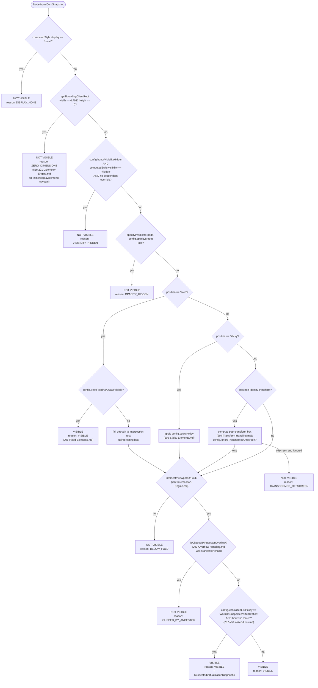
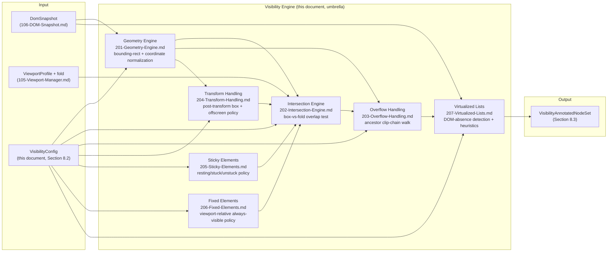

# 200 — Visibility Engine Overview

## 1. Title

**Critical CSS Extraction Engine — Visibility Engine: Above-the-Fold Classification Subsystem Overview**

## 2. Version

| Field | Value |
|---|---|
| Document Version | 1.0.0 |
| Status | Accepted |
| Last Updated | 2026-07-09 |
| Owners | Visibility Engine Working Group |
| Stability | Stable (Phase 4 design foundation; changes to the visibility predicate require RFC, since every sub-engine in this phase implements a piece of it) |

## 3. Purpose

BRIEF.md Section 2.4's module table assigns the Visibility Engine a deceptively short responsibility line: "Geometry, intersection, overflow, transforms." BRIEF.md Section 2.5's Visibility Detection algorithm expands this into a single predicate — a node is visible if it "intersects viewport/fold AND has non-zero dimensions AND not `display:none` AND not `visibility:hidden` (configurable) AND opacity handling configurable AND optionally ignores transformed-offscreen nodes" — and flags two forward-looking capabilities: an IntersectionObserver-assisted mode, and layout-shift-aware rescanning. This document is the umbrella specification for the subsystem that implements that predicate correctly, completely, and deterministically against the `DomSnapshot` produced by [106-DOM-Snapshot.md](./106-DOM-Snapshot.md) and the fold boundary computed by [105-Viewport-Manager.md](./105-Viewport-Manager.md).

The Visibility Engine is not a single algorithm; it is a composition of seven cooperating concerns, six of which are significant enough to warrant their own design documents in this same phase: geometric primitives ([201-Geometry-Engine.md](./201-Geometry-Engine.md)), viewport/fold intersection testing ([202-Intersection-Engine.md](./202-Intersection-Engine.md)), overflow/clipping propagation ([203-Overflow-Handling.md](./203-Overflow-Handling.md)), transform-aware positioning ([204-Transform-Handling.md](./204-Transform-Handling.md)), sticky-positioned elements ([205-Sticky-Elements.md](./205-Sticky-Elements.md)), fixed-positioned elements ([206-Fixed-Elements.md](./206-Fixed-Elements.md)), and virtualized-list content ([207-Virtualized-Lists.md](./207-Virtualized-Lists.md)). This document exists so that a reader arriving at any one of those six documents first has a map of how its narrow concern fits into the whole, and so that the visibility predicate itself — the thing every sub-engine ultimately contributes a term to — is stated once, canonically, rather than paraphrased six times with the risk of six subtly different paraphrases drifting apart.

## 4. Audience

- Implementers of `packages/collector`'s Visibility Engine sub-module (per [006-Design-Principles.md](../architecture/006-Design-Principles.md) Principle 4's module table), who need the composed shape of the visibility predicate before diving into any single sub-engine's implementation detail.
- Implementers of the six Phase 4 sub-engine documents listed above, who need this document's canonical predicate statement as the contract their own document's algorithm must satisfy a term of.
- Implementers of the CSSOM Walker and Selector Matcher (Phase 5, forward reference), who consume the Visibility Engine's output (`VisibilityAnnotatedNodeSet`) as a filter over candidate elements and need to understand what "visible" does and does not guarantee.
- Reviewers evaluating a proposed change to visibility semantics (e.g., a new configuration flag, a new CSS feature's interaction with the fold), who should use this document's decision tree and module-composition diagram as the reference point for where the change belongs.
- Senior engineers scoping future work on IntersectionObserver-assisted or layout-shift-aware visibility modes (Section 16), who need the current, synchronous-snapshot-based design's boundaries stated explicitly before proposing an alternative.

Readers should already be familiar with the `DomSnapshot` structure from [106-DOM-Snapshot.md](./106-DOM-Snapshot.md) (in particular, the allow-listed computed-style properties captured per node: `display`, `visibility`, `opacity`, `position`, `transform`, `overflow`/`overflow-x`/`overflow-y`, `content-visibility`, `contain`, `zIndex`), the fold-computation model in [105-Viewport-Manager.md](./105-Viewport-Manager.md), and the single-work-unit state machine's `VisibilityClassified` state in [011-Execution-Pipeline.md](../architecture/011-Execution-Pipeline.md) Section 8.7.

## 5. Prerequisites

- [006-Design-Principles.md](../architecture/006-Design-Principles.md) Principle 1 (The Browser Is the Source of Truth) and Principle 3 (Correctness Over Premature Optimization) — the Visibility Engine's entire design posture (compute from browser-observed facts, never approximate) is a direct instantiation of both.
- [011-Execution-Pipeline.md](../architecture/011-Execution-Pipeline.md) Section 8.7 (`VisibilityClassified` state) — the pipeline position this document's subsystem occupies.
- [105-Viewport-Manager.md](./105-Viewport-Manager.md) Section 8.3 (Fold Computation) — the single scalar fold value every visibility decision is tested against.
- [106-DOM-Snapshot.md](./106-DOM-Snapshot.md) Section 8.2 (What Is Captured Per Node) — the exact raw facts (`boundingBox`, the computed-style allow-list, shadow/slot/frame linkage) this subsystem operates on as its sole input; the Visibility Engine performs no additional browser round trips.
- BRIEF.md Section 2.5 ("Visibility Detection") — the authoritative requirement text this document operationalizes.
- Familiarity with the CSS Box Model, CSS Positioned Layout (`position: static | relative | absolute | fixed | sticky`), CSS Overflow (`overflow`, `overflow-x`/`overflow-y`, `content-visibility`), and CSS Transforms Level 1/2.

## 6. Related Documents

- [006-Design-Principles.md](../architecture/006-Design-Principles.md) — Principles 1, 3, and 5, which respectively justify browser-derived geometry, the correctness-first default configuration, and the determinism/epsilon discipline this document's predicate inherits.
- [011-Execution-Pipeline.md](../architecture/011-Execution-Pipeline.md) — Section 8.7's `VisibilityClassified` state and Section 8.8's concurrent `CssomWalked` dispatch, which together fix this subsystem's position in the pipeline.
- [105-Viewport-Manager.md](./105-Viewport-Manager.md) — the fold-computation authority this document's intersection tests consume as an input, never re-derive.
- [106-DOM-Snapshot.md](./106-DOM-Snapshot.md) — the `DomSnapshot`/`DomNodeRecord` structure this subsystem's sole input; Section 8.2's computed-style allow-list is the exact fact set this document's sub-engines are constrained to operate over.
- [201-Geometry-Engine.md](./201-Geometry-Engine.md) — bounding-rect semantics, coordinate-space normalization, and layout-thrashing avoidance underlying every geometric decision this document describes.
- [202-Intersection-Engine.md](./202-Intersection-Engine.md) — the viewport/fold intersection test itself, the second term of the visibility predicate.
- [203-Overflow-Handling.md](./203-Overflow-Handling.md) — clipping-ancestor propagation, the mechanism by which a geometrically-intersecting node can still be invisible.
- [204-Transform-Handling.md](./204-Transform-Handling.md) — the "optionally ignores transformed-offscreen nodes" clause of BRIEF.md Section 2.5, and general transform-aware bounding-box computation.
- [205-Sticky-Elements.md](./205-Sticky-Elements.md) — `position: sticky` classification, a case the plain intersection test misclassifies without special handling.
- [206-Fixed-Elements.md](./206-Fixed-Elements.md) — `position: fixed` classification, always-visible-relative-to-viewport regardless of document scroll position.
- [207-Virtualized-Lists.md](./207-Virtualized-Lists.md) — the interaction between visibility classification and virtualized/windowed list implementations that only render a viewport-sized subset of logical content.
- BRIEF.md Section 2.5 (Visibility Detection) and Section 2.4 (System Modules) — the authoritative requirement source.

## 7. Overview

### 7.1 The Canonical Visibility Predicate

BRIEF.md Section 2.5 states the predicate as a conjunction of four required terms plus two configurable terms. This document restates it once, formally, as the contract every sub-engine document implements a fragment of:

```
isVisible(node, viewportProfile, config) :=
      intersectsViewportOrFold(node, viewportProfile)          -- 202-Intersection-Engine.md
  AND hasNonZeroDimensions(node)                                -- 201-Geometry-Engine.md
  AND NOT isDisplayNone(node)                                   -- computed-style read, this document
  AND (config.honorVisibilityHidden ==> NOT isVisibilityHidden(node))   -- configurable, this document
  AND opacityPredicate(node, config.opacityMode)                -- configurable, this document
  AND (config.ignoreTransformedOffscreen ==> NOT isTransformedOffscreen(node))  -- 204-Transform-Handling.md
  AND NOT isClippedByAncestorOverflow(node)                     -- 203-Overflow-Handling.md
```

Two terms — `isClippedByAncestorOverflow` and the sticky/fixed special-casing inside `intersectsViewportOrFold` — are not named explicitly in BRIEF.md Section 2.5's prose but are load-bearing consequences of taking Principle 1 seriously: a node can have non-zero dimensions, no `display:none`, no `visibility:hidden`, full opacity, and untransformed geometry that nonetheless never renders because an ancestor clips it via `overflow: hidden` with a zero-height container, or because it is inside a virtualized list's unrendered window. Sections 7.2 and 7.3 below, and the six sub-engine documents, exist precisely because a literal, unelaborated reading of BRIEF.md's four-term conjunction under-specifies real-world visibility.

### 7.2 Decomposition Rationale — Why Six Sub-Engines, Not One Module

Each conjunction term above has a genuinely distinct algorithmic character, and BRIEF.md Section 2.4's module table's placement of "Geometry, intersection, overflow, transforms" as four nouns in one cell is, in this document's reading, an intentional signal that these are four separable concerns united only by feeding one predicate — not a single algorithm. This document adds three more separable concerns (sticky, fixed, virtualized lists) that the literal predicate text does not name but that BRIEF.md Section 2.15's fixture list ("Tailwind, Bootstrap... Container Queries... huge enterprise stylesheets") and general production-web reality both require the engine to handle without silently misclassifying:

- **Geometry** ([201-Geometry-Engine.md](./201-Geometry-Engine.md)) is a pure measurement concern — given a node, what is its box, in what coordinate space, and how is that measurement cached to avoid the layout-thrashing Principle 3 implicitly warns against (read-heavy code that triggers repeated synchronous layout is not "correct but slow," it is "correct but needlessly expensive," which Principle 3 treats as an additive-optimization target, not an excuse to skip).
- **Intersection** ([202-Intersection-Engine.md](./202-Intersection-Engine.md)) is a comparison concern — given a box and a fold boundary, do they overlap — and is where the classic geometric edge cases (partial overlap, zero-height fold, negative coordinates from scroll offset) live.
- **Overflow** ([203-Overflow-Handling.md](./203-Overflow-Handling.md)) is a propagation concern — visibility is not a per-node-in-isolation fact; it is a fact about a node *and its ancestor chain's clipping behavior*, which requires walking upward, not just reading one node's own box.
- **Transforms** ([204-Transform-Handling.md](./204-Transform-Handling.md)) is a coordinate-correction concern — `getBoundingClientRect()` already reflects applied transforms (a fact [201-Geometry-Engine.md](./201-Geometry-Engine.md) documents at length), but *deciding what to do* with a transform-relocated box (ignore it as offscreen, or count the pre-transform position) is a policy question with real correctness consequences BRIEF.md Section 2.5 explicitly flags as configurable.
- **Sticky** ([205-Sticky-Elements.md](./205-Sticky-Elements.md)) and **Fixed** ([206-Fixed-Elements.md](./206-Fixed-Elements.md)) are special-case concerns because both position schemes decouple a node's *current* `getBoundingClientRect()` value (which reflects wherever it happens to be at snapshot time, itself dependent on scroll position at capture) from its *steady-state, above-the-fold-relevant* rendering behavior — a sticky header not yet stuck, captured at scroll offset zero, still needs its critical CSS retained even though its momentary box may not be the one that matters once a user scrolls.
- **Virtualized lists** ([207-Virtualized-Lists.md](./207-Virtualized-Lists.md)) is a scope concern — the DOM Collector (per [106-DOM-Snapshot.md](./106-DOM-Snapshot.md)) can only enumerate nodes that exist in the DOM at snapshot time, and a virtualized list's off-window items simply do not exist as nodes at all, which means "is this item visible" is unanswerable for items the snapshot never saw, a fundamentally different failure mode than any of the preceding six concerns' "node exists, but is it visible" question.

Rejected alternative: a single monolithic `classifyVisibility(node)` function handling all seven concerns inline. This was rejected for the same reason [006-Design-Principles.md](../architecture/006-Design-Principles.md) Principle 4 rejects a monolithic extraction strategy — each concern has an independent evolution path (a future CSS feature affecting only overflow semantics, e.g. `overflow: clip` vs. `overflow: hidden` scroll-container distinctions, should not require touching transform-handling code), independent test fixtures (BRIEF.md Section 2.15's fixture categories map close to 1:1 onto these six documents), and independent complexity budgets worth reasoning about in isolation (Section 14 of each sub-document quantifies its own term's cost, which a single combined document would blur together).

### 7.3 Pipeline Position

The Visibility Engine occupies the `VisibilityClassified` state in [011-Execution-Pipeline.md](../architecture/011-Execution-Pipeline.md) Section 8.7, entered from `DomCollected` after the `afterCollection` hook, and its output joins with `CssomWalked`'s output at the `SelectorsMatched` state's entry (Section 8.9 of that document). Two properties of this placement matter for every sub-engine document in this phase:

1. **No browser round trip.** Per [106-DOM-Snapshot.md](./106-DOM-Snapshot.md) Section 8.7, "the Visibility Engine's entire classification pass is a pure, browser-independent, host-side computation over already-captured data, with zero additional `page.evaluate()` round trips." Every sub-engine document in this phase inherits this constraint: none of them may propose a design that requires querying the live page a second time. If a sub-engine's algorithm appears to need a fact not present in [106-DOM-Snapshot.md](./106-DOM-Snapshot.md) Section 8.2's capture list, the correct fix is to extend that capture list (a Phase 3 change, requiring RFC per that document's Stability header), not to add a second round trip here.
2. **Concurrency with the CSSOM Walker.** [011-Execution-Pipeline.md](../architecture/011-Execution-Pipeline.md) Section 8.8 dispatches `CssomWalked` concurrently with the `DomCollected → VisibilityClassified` chain, because CSSOM traversal has no data dependency on DOM structure or visibility. This means the Visibility Engine must not assume any CSSOM fact is available during its own classification pass — visibility is a property of the DOM/layout world alone, and any future temptation to let a sub-engine (e.g., Overflow Handling) special-case based on which CSS rule caused an `overflow: hidden` value, rather than the value itself, would introduce a false dependency this pipeline placement forbids.

### 7.4 Forward-Looking Modes

BRIEF.md Section 2.5 names two future capabilities this document scopes but does not specify: an **IntersectionObserver-assisted mode** and **layout-shift-aware rescanning**. Both are deferred to Section 16 (Future Work) because both would change the fundamental "single synchronous snapshot, zero additional round trips" constraint of Section 7.3 above — `IntersectionObserver` is inherently asynchronous and callback-driven, and layout-shift-aware rescanning implies re-running classification after a `DomSnapshot` has already been frozen, neither of which fits today's `VisibilityClassified`-as-a-pure-function-of-already-captured-data model. This document takes the position that the current synchronous-snapshot model is correct as a *default* (per Principle 3: it is the naive-correct baseline), and that both future modes are legitimate, *additive* enhancements layered on top of it, not replacements — consistent with how [006-Design-Principles.md](../architecture/006-Design-Principles.md) Principle 3 requires every optimization to be introduced.

## 8. Detailed Design

### 8.1 Node-Level vs. Ancestor-Chain-Level Decisions

A central design distinction threaded through every sub-engine document is between decisions that can be made by looking at one `DomNodeRecord` in isolation, and decisions that require walking its ancestor chain (already reconstructable from [106-DOM-Snapshot.md](./106-DOM-Snapshot.md)'s `parentNodeId` linkage, including across shadow-fragment boundaries per that document's Section 8.3). The predicate's first four terms — `display:none`, `visibility:hidden`, non-zero dimensions, and (for the non-transform case) intersection — are node-level; but `visibility:hidden` itself is technically an inherited property that a descendant can re-enable via an explicit `visibility: visible` override, and overflow-clipping is inherently an ancestor-chain property. [203-Overflow-Handling.md](./203-Overflow-Handling.md) is the document responsible for the ancestor-walk algorithm; this document's job is only to establish that the overall predicate is **not** decomposable into a single flat pass over nodes in isolation, and that any implementation attempting to flatten it into one pass without an ancestor-aware second phase will misclassify overflow-clipped and forced-visible-descendant cases.

### 8.2 Configuration Surface

The Visibility Engine's configurable terms (per BRIEF.md Section 2.5's explicit "configurable" flags) are consolidated into one `VisibilityConfig` object, since scattering equivalent-shaped boolean/enum flags across six sub-engine-specific config objects would violate [006-Design-Principles.md](../architecture/006-Design-Principles.md) Principle 5's determinism-by-construction spirit (a single canonical config object is easier to fingerprint completely — see [006-Design-Principles.md](../architecture/006-Design-Principles.md)'s Fingerprint Computation algorithm — than six independently-evolving ones a future contributor might forget to include in the composite hash):

```
VisibilityConfig {
  honorVisibilityHidden: boolean        // default true
  opacityMode: "ignore" | "treatZeroAsHidden" | "treatBelowThresholdAsHidden"
  opacityThreshold: number              // used only when opacityMode == "treatBelowThresholdAsHidden"; default 0
  ignoreTransformedOffscreen: boolean   // default false — see 204-Transform-Handling.md
  stickyPolicy: "restingPosition" | "assumeStuck" | "assumeUnstuck"   // see 205-Sticky-Elements.md
  treatFixedAsAlwaysVisible: boolean    // default true — see 206-Fixed-Elements.md
  virtualizedListPolicy: "windowOnly" | "warnOnSuspectedVirtualization"  // see 207-Virtualized-Lists.md
}
```

Every field here is owned, defined in detail, and defaulted by its respective sub-engine document; this document only establishes that they are collected under one umbrella object and that the umbrella object, not its individual fields, is what participates in the Cache Manager's fingerprint composite (per [006-Design-Principles.md](../architecture/006-Design-Principles.md) Principle 8), because a change to *any* field changes the extraction result and must invalidate the cache uniformly.

### 8.3 Output Contract — `VisibilityAnnotatedNodeSet`

Per [016-Data-Flow.md](../architecture/016-Data-Flow.md) Section 8.3 (as referenced from [106-DOM-Snapshot.md](./106-DOM-Snapshot.md) Section 8.7), the Visibility Engine's output is one annotation per `DomNodeRecord`, keyed by `nodeId` (and, transitively, by fragment identifier for shadow/frame fragments), never a sparse subset. This document fixes the annotation shape every sub-engine contributes to:

```
VisibilityAnnotation {
  nodeId: number
  fragmentId: string
  isVisible: boolean
  reason: VisibilityReasonCode          // e.g. "DISPLAY_NONE", "BELOW_FOLD", "CLIPPED_BY_ANCESTOR",
                                          // "TRANSFORMED_OFFSCREEN", "STICKY_RESTING_OFFSCREEN", "VISIBLE"
  contributingAncestorNodeId: number | null   // set when reason implicates an ancestor (overflow, inherited hidden)
}
```

The `reason` field is not cosmetic. Per [006-Design-Principles.md](../architecture/006-Design-Principles.md) Principle 6 (Fail-Fast Diagnostics), an operator inspecting why a given element's styles were dropped from the critical CSS output needs an attributable answer, not merely a boolean — this is the mechanism by which the Reporter's "matched/unmatched selector report" (BRIEF.md Section 2.12) can explain a selector's absence in terms a human can act on ("dropped because clipped by ancestor #42's `overflow: hidden`," not "dropped, no further detail").

## 9. Architecture

### 9.1 Visibility Decision Tree



This decision tree is the single authoritative sequencing of the predicate's terms. Ordering is deliberate, not incidental: cheap, node-local checks (`display`, dimensions, `visibility`, `opacity`) are evaluated before expensive, ancestor-walking or cross-referencing checks (overflow clipping, virtualization heuristics), so that the common case — an element that is simply `display:none` or trivially below the fold — short-circuits before paying for an ancestor walk. This ordering is revisited in [203-Overflow-Handling.md](./203-Overflow-Handling.md) Section 14 (Performance) as the specific justification for why overflow-clipping is the *last* structural check before the virtualization heuristic, rather than the first.

### 9.2 Sub-Engine Composition



Geometry is the shared substrate every other sub-engine consumes (arrows from `GE` fan out to `IE`, `OH`, `TH`), which is why [201-Geometry-Engine.md](./201-Geometry-Engine.md) is ordered first among the six sub-documents and is the only one this overview treats as a hard prerequisite for reading the other five (Section 5 above lists it, alongside the architecture documents, as a prerequisite for this document itself, since the decision tree in Section 9.1 cannot be understood without knowing what "the box" means in each of its branches).

## 10. Algorithms

### 10.1 Algorithm: Top-Level Visibility Classification Pass

**Problem statement.** Given a complete `DomSnapshot` (including linked shadow/frame fragments), a `ViewportProfile` with a precomputed fold, and a `VisibilityConfig`, produce a `VisibilityAnnotatedNodeSet` covering every node in every fragment, applying the decision tree of Section 9.1 to each.

**Inputs.** `snapshot: DomSnapshot`, `viewportProfile: ViewportProfile`, `foldPx: number` (from [105-Viewport-Manager.md](./105-Viewport-Manager.md)), `config: VisibilityConfig`.

**Outputs.** `VisibilityAnnotatedNodeSet` — one `VisibilityAnnotation` per `(fragmentId, nodeId)` pair across the whole snapshot.

**Pseudocode.**

```
function classifyVisibility(snapshot, viewportProfile, foldPx, config) -> VisibilityAnnotatedNodeSet:
    annotations = []
    geometryCache = GeometryEngine.buildCache(snapshot)   // 201-Geometry-Engine.md — batched, memoized

    for fragment in snapshot.allFragments():
        // Overflow handling requires ancestor-chain data; precompute per-fragment
        // clip-chain summaries once, not per node, per 203-Overflow-Handling.md Section 10.1
        clipChainIndex = OverflowHandling.buildClipChainIndex(fragment, geometryCache)

        for node in fragment.nodes:
            box = geometryCache.get(fragment.fragmentId, node.nodeId)

            if node.computedStyle.display == "none":
                annotations.push(annotation(node, false, "DISPLAY_NONE"))
                continue

            if box.width == 0 and box.height == 0:
                annotations.push(annotation(node, false, "ZERO_DIMENSIONS"))
                continue

            if config.honorVisibilityHidden and isEffectivelyVisibilityHidden(node, fragment):
                annotations.push(annotation(node, false, "VISIBILITY_HIDDEN"))
                continue

            if not opacityPredicate(node, config.opacityMode, config.opacityThreshold):
                annotations.push(annotation(node, false, "OPACITY_HIDDEN"))
                continue

            effectiveBox = box
            if node.computedStyle.position == "fixed" and config.treatFixedAsAlwaysVisible:
                annotations.push(annotation(node, true, "VISIBLE"))
                continue
            if node.computedStyle.position == "sticky":
                effectiveBox = StickyElements.resolveEffectiveBox(node, box, config.stickyPolicy)
            if hasNonIdentityTransform(node):
                effectiveBox = TransformHandling.resolvePostTransformBox(node, box)
                if config.ignoreTransformedOffscreen and TransformHandling.isOffscreen(effectiveBox, viewportProfile):
                    annotations.push(annotation(node, false, "TRANSFORMED_OFFSCREEN"))
                    continue

            if not IntersectionEngine.intersects(effectiveBox, viewportProfile, foldPx):
                annotations.push(annotation(node, false, "BELOW_FOLD"))
                continue

            clipResult = OverflowHandling.isClipped(node, effectiveBox, clipChainIndex)
            if clipResult.clipped:
                annotations.push(annotation(node, false, "CLIPPED_BY_ANCESTOR", clipResult.ancestorNodeId))
                continue

            annotations.push(annotation(node, true, "VISIBLE"))

        VirtualizedLists.annotateSuspectedGaps(fragment, annotations, config.virtualizedListPolicy)

    return VisibilityAnnotatedNodeSet(annotations)
```

**Time complexity.** `O(N)` for the per-node predicate evaluation across all `N` reachable nodes, since every branch of the decision tree performs `O(1)` work given a precomputed box (geometry lookup is `O(1)` amortized after the batched cache build — see [201-Geometry-Engine.md](./201-Geometry-Engine.md) Section 10), plus `O(N)` for `buildClipChainIndex` (a single ancestor-chain pass per fragment, detailed in [203-Overflow-Handling.md](./203-Overflow-Handling.md) Section 10.1). Total: `O(N)`.

**Memory complexity.** `O(N)` for the output `VisibilityAnnotatedNodeSet` (one fixed-size annotation per node) plus `O(N)` for the geometry cache and clip-chain index, both bounded by snapshot size, never by viewport size or fold value.

**Failure cases.** A node whose ancestor chain crosses a shadow-fragment or frame-fragment boundary (per [106-DOM-Snapshot.md](./106-DOM-Snapshot.md) Sections 8.3/8.5) must have its clip-chain walk correctly traverse into the parent fragment via the `shadowRootId`/`frameId` back-linkage; failing to do so is a documented edge case in [203-Overflow-Handling.md](./203-Overflow-Handling.md) Section 12, not handled inline here. A malformed `VisibilityConfig` (e.g., `opacityMode: "treatBelowThresholdAsHidden"` with no `opacityThreshold` supplied) must fail config validation upstream (at `ConfigResolved`, per [011-Execution-Pipeline.md](../architecture/011-Execution-Pipeline.md) Section 8.1), not downgrade silently to a default inside this pass.

**Optimization opportunities.** Per-fragment classification passes are independent of one another (no cross-fragment data dependency except the already-resolved `shadowRootId`/`frameId` linkage, which is read-only at this stage) and can be parallelized across worker threads for very large multi-fragment snapshots, consistent with [006-Design-Principles.md](../architecture/006-Design-Principles.md) Principle 3's "additive, benchmarked" performance-optimization discipline; canonical ordering of the resulting `VisibilityAnnotatedNodeSet` (keyed by `(fragmentId, nodeId)`, both stable identifiers) is trivially preserved regardless of parallel completion order, satisfying Principle 5.

### 10.2 Algorithm: Opacity Predicate Resolution

**Problem statement.** BRIEF.md Section 2.5 flags "opacity handling configurable" without specifying the exact semantics; this algorithm fixes the three supported modes.

**Inputs.** `node: DomNodeRecord`, `mode: "ignore" | "treatZeroAsHidden" | "treatBelowThresholdAsHidden"`, `threshold: number`.

**Outputs.** `boolean` — `true` if the node passes the opacity term of the predicate (i.e., is not disqualified by opacity).

**Pseudocode.**

```
function opacityPredicate(node, mode, threshold) -> boolean:
    opacity = node.computedStyle.opacity   // already captured per 106-DOM-Snapshot.md Section 8.2
    switch mode:
        case "ignore":
            return true
        case "treatZeroAsHidden":
            return opacity > 0
        case "treatBelowThresholdAsHidden":
            return opacity >= threshold
```

**Time complexity.** `O(1)`.

**Memory complexity.** `O(1)`.

**Failure cases.** `opacity` is a computed value already resolved by the browser to a number in `[0, 1]` (per the CSS Color specification's opacity clamping) at capture time in [106-DOM-Snapshot.md](./106-DOM-Snapshot.md); this function never receives an out-of-range or non-numeric value under normal operation, and treats any such value (a defect elsewhere in the pipeline, not an expected runtime condition here) as `opacity <= 0` defensively rather than throwing, to avoid a Visibility Engine internal-invariant violation cascading into a full work-unit failure for what is, at worst, a slightly conservative misclassification.

**Optimization opportunities.** None; this is a constant-time comparison already dominated by the surrounding per-node classification cost.

## 11. Implementation Notes

- The Visibility Engine should be implemented as a pure, host-side (Node.js) module operating entirely on the already-serialized `DomSnapshot`, with no dependency on `packages/browser` at all — this is the structural encoding of Section 7.3's "no browser round trip" constraint, and a lint rule (mirroring [006-Design-Principles.md](../architecture/006-Design-Principles.md) Implementation Notes' existing pattern for Principles 1/2) should forbid any import of Playwright/CDP-facing modules from this subsystem's package.
- `VisibilityReasonCode` should be defined once in `packages/shared` (per [006-Design-Principles.md](../architecture/006-Design-Principles.md) Implementation Notes' precedent for `Diagnostic` shapes) so the Reporter, the six sub-engine documents, and this document's decision tree all reference the same closed enumeration, preventing a sub-engine from inventing an undocumented reason code that the Reporter cannot render meaningfully.
- Each of the six sub-engine modules should expose a narrow, typed function signature (as sketched in Section 10.1's pseudocode) rather than being handed the entire `VisibilityConfig` and reaching into fields owned by sibling sub-engines — this mirrors [006-Design-Principles.md](../architecture/006-Design-Principles.md) Principle 7's plugin-boundary discipline applied internally: sub-engines are not plugins, but the same "narrow contract, no reaching into siblings' state" hygiene prevents this subsystem's internal coupling from growing unmanageable as six documents' implementations evolve independently.
- The decision tree's fixed evaluation order (Section 9.1) must be preserved exactly by the implementation; reordering checks for a perceived performance win (e.g., evaluating the overflow ancestor-walk before the cheap `display:none` check) would not change the final `isVisible` boolean for any single node in isolation, but would change measured performance characteristics documented in Section 14 and in each sub-engine's own Performance section, so any reordering proposal must be accompanied by updated benchmarks in every affected sub-document, not just this one.

## 12. Edge Cases

- **`display: contents`.** An element with `display: contents` generates no box of its own (`getBoundingClientRect()` returns a zero-sized rect at a degenerate position) while its children lay out exactly as if the element were absent from the box tree. A naive reading of the `ZERO_DIMENSIONS` branch would misclassify such an element as invisible, which is representationally correct (it truly has no box) but must not be conflated with genuine invisibility for the purpose of, e.g., overflow-chain walking, since a `display: contents` node must be skipped, not treated as a clipping ancestor, when its own descendants' clip-chain is being resolved. [201-Geometry-Engine.md](./201-Geometry-Engine.md) Section 8 documents this in full; this document notes only that the decision tree's `ZERO_DIMENSIONS` reason code is overloaded between "genuinely collapsed" and "`display: contents`, by design" and downstream consumers of `VisibilityAnnotatedNodeSet` should not assume `ZERO_DIMENSIONS` implies the CSS on that node is safely prunable, since a `display: contents` node can still be a valid selector-matching target whose *declared* properties (other than box-affecting ones) matter.
- **Shadow DOM and cross-fragment ancestor walks.** As noted in Section 10.1's Failure Cases, overflow-clip-chain walking and inherited `visibility: hidden` resolution must correctly traverse `shadowRootId`/`frameId` linkage from [106-DOM-Snapshot.md](./106-DOM-Snapshot.md); a slotted node's *rendered* ancestor chain (inside the shadow tree, per that document's Section 8.4) is not the same as its *light-DOM* ancestor chain, and overflow-clipping must be evaluated against the rendered chain, since that is what actually determines paint-time clipping.
- **Closed shadow roots and inaccessible frames.** Per [106-DOM-Snapshot.md](./106-DOM-Snapshot.md) Sections 8.3 and 8.5, content behind these boundaries never appears in the `DomSnapshot` at all; the Visibility Engine correctly has nothing to classify for such content, and this is not a Visibility Engine gap — it is an upstream, already-diagnosed (`ClosedShadowRootDiagnostic`/`InaccessibleFrameDiagnostic`) scope boundary this subsystem inherits without needing to re-flag.
- **`content-visibility: auto`.** A node with `content-visibility: auto` may have its layout box intentionally skipped by the browser itself for elements the browser determines are far from the viewport, which can make `getBoundingClientRect()` report a box the browser considers provisional or based on a `contain-intrinsic-size` placeholder rather than true rendered content dimensions. Per Principle 1, the Visibility Engine takes this browser-reported box at face value rather than second-guessing it — if the browser's own rendering pipeline treats this content as skip-eligible, that is itself a fact about what actually renders, consistent with how a real user's browser would treat the same content.
- **Nested cascading configuration interactions.** `config.ignoreTransformedOffscreen` and `config.honorVisibilityHidden` are independent flags; a transformed-and-offscreen node with `visibility: hidden` is disqualified by the cheaper `VISIBILITY_HIDDEN` check before the transform branch is ever reached (per the decision tree's ordering), so the reported `reason` will always be the *first* disqualifying term encountered, never a compound reason — this is a deliberate simplification (a node is either visible or not; the *first* sufficient reason for invisibility is reported, not an exhaustive list of every disqualifying term) consistent with [006-Design-Principles.md](../architecture/006-Design-Principles.md) Principle 6's requirement for attributable, not necessarily maximally exhaustive, diagnostics.
- **Zero-height viewport or degenerate fold.** [105-Viewport-Manager.md](./105-Viewport-Manager.md) Section 12 notes that `customFoldOffsetPx: 0` is a valid, if degenerate, configuration ("nothing is above the fold"). Under such a configuration, every node fails the intersection test and the Visibility Engine correctly reports `BELOW_FOLD` universally — this is not a Visibility Engine defect, it is the predicate behaving exactly as configured, and no special-casing is introduced here to second-guess an operator's explicit degenerate fold choice, mirroring [105-Viewport-Manager.md](./105-Viewport-Manager.md)'s own stated policy of not second-guessing explicit configuration.

## 13. Tradeoffs

| Decision | Why | Alternative Considered | Tradeoff Accepted |
|---|---|---|---|
| Decompose into seven sub-engines (geometry, intersection, overflow, transform, sticky, fixed, virtualized) under one umbrella document | Each concern has an independent evolution path, test fixture category, and complexity budget | One monolithic `classifyVisibility` module/document | More cross-referencing overhead across seven documents; mitigated by this overview's canonical predicate statement and composition diagrams |
| Consolidate all configurable flags into one `VisibilityConfig` fingerprinted as a unit | Keeps the Cache Manager's fingerprint composite (Principle 8) trivially complete | Per-sub-engine independent config objects | A change to any single field invalidates the cache for the whole subsystem's output, even if only one sub-engine's behavior actually changed — accepted because under-invalidation (a stale cache hit) is strictly worse than over-invalidation |
| Fixed CSS-native evaluation order (Section 9.1) for the decision tree | Cheap checks short-circuit before expensive ancestor walks; also gives a deterministic, single "first sufficient reason" diagnostic per node | Evaluate all terms and report a compound reason | Loses an exhaustive list of every disqualifying factor in favor of a single, attributable, cheaper-to-compute reason |
| Purely synchronous, single-snapshot classification (no IntersectionObserver, no rescanning) as the default and only currently-specified mode | Fits the "no additional browser round trip" pipeline constraint (Section 7.3) and is the naive-correct baseline Principle 3 requires before any async enhancement | Ship an IntersectionObserver-assisted mode as the default from the outset | Cannot natively account for post-snapshot layout shifts without a future, additive rescanning mode (Section 16) |

## 14. Performance

- **CPU complexity.** The top-level classification pass (Section 10.1) is `O(N)` in reachable node count across all fragments, matching [106-DOM-Snapshot.md](./106-DOM-Snapshot.md) Section 10.1's own `O(N)` walk cost — the Visibility Engine adds no asymptotic overhead beyond the DOM Collector's own linear enumeration cost, a direct consequence of the "zero additional round trips, pure host-side computation" design (Section 7.3).
- **Memory complexity.** `O(N)` for the `VisibilityAnnotatedNodeSet` output and the geometry/clip-chain caches, each bounded by snapshot size; no sub-engine introduces superlinear memory growth relative to node count (verified per-sub-engine in each document's own Performance section).
- **Caching strategy.** This subsystem produces no cache of its own beyond the intra-pass geometry cache detailed in [201-Geometry-Engine.md](./201-Geometry-Engine.md); its output participates in the Cache Manager's fingerprint-keyed extraction-result cache (per [006-Design-Principles.md](../architecture/006-Design-Principles.md) Principle 8) only insofar as `VisibilityConfig` is part of the fingerprint composite (Section 8.2 above) — a config change correctly busts the cache for the whole work unit, not merely a sub-component.
- **Parallelization opportunities.** Per-fragment classification is independent (Section 10.1's Optimization Opportunities); within one fragment, per-node classification is also independent given a precomputed geometry cache and clip-chain index, since no node's classification result depends on another node's *result* (only on already-computed, read-only geometry/ancestor facts) — this makes the classification pass itself trivially parallelizable across worker threads for very large fragments, bounded only by the up-front `O(N)` cache-build cost, which is inherently sequential per fragment (see [201-Geometry-Engine.md](./201-Geometry-Engine.md) Section 14 for why).
- **Incremental execution.** Not directly applicable at this subsystem's level; visibility classification is recomputed in full whenever its inputs (`DomSnapshot`, `ViewportProfile`, `VisibilityConfig`) are not already covered by a Cache Manager fingerprint hit at the work-unit level (per [006-Design-Principles.md](../architecture/006-Design-Principles.md) Principle 8) — there is no sub-work-unit-granularity incremental mode for visibility classification specifically, since it is cheap (`O(N)`, host-side, no I/O) relative to the browser-bound stages that dominate a work unit's wall-clock cost (per [011-Execution-Pipeline.md](../architecture/011-Execution-Pipeline.md) Section 14).
- **Profiling guidance.** Because this subsystem is pure host-side computation, standard Node.js CPU profiling (unlike the browser-round-trip-dominated stages [011-Execution-Pipeline.md](../architecture/011-Execution-Pipeline.md) Section 14 flags as harder to profile via Node-side tools alone) is directly meaningful here; profiling should distinguish the up-front cache/index-build cost (Section 10.1's `buildCache`/`buildClipChainIndex`) from the per-node predicate-evaluation cost, since the former is the more likely target of future optimization at very large `N` (per [201-Geometry-Engine.md](./201-Geometry-Engine.md) and [203-Overflow-Handling.md](./203-Overflow-Handling.md)'s own Performance sections).
- **Scalability limits.** At the `fixtures/enterprise-huge/` scale (BRIEF.md Section 2.15), the dominant cost is the linear-in-`N` cache/index build, not any single node's predicate evaluation; the practical scalability lever is therefore the same one [106-DOM-Snapshot.md](./106-DOM-Snapshot.md) Section 14 already identifies for DOM collection itself — total reachable node count — rather than anything specific to visibility logic.

## 15. Testing

- **Unit tests.** Each decision-tree branch (Section 9.1) must have a dedicated unit test using a synthetic `DomNodeRecord` fixture that isolates exactly one disqualifying term at a time (e.g., a node with `display:none` but otherwise fully visible geometry, confirming the `DISPLAY_NONE` short-circuit fires before any geometry check runs), plus tests confirming evaluation order (a node disqualified by two independent terms reports the earlier one per Section 9.1's fixed order).
- **Integration tests.** Full pipeline fixtures spanning BRIEF.md Section 2.15's categories (Tailwind, Bootstrap, Shadow DOM, Container Queries) must be run end-to-end through `DomCollected → VisibilityClassified` and assert the resulting `VisibilityAnnotatedNodeSet` matches a golden snapshot per fixture, catching regressions in the composed behavior of all six sub-engines together, not merely each in isolation.
- **Visual tests.** A fixture rendered at each of the default Mobile/Tablet/Desktop profiles (per [105-Viewport-Manager.md](./105-Viewport-Manager.md)) should be screenshotted with above-fold nodes highlighted (per BRIEF.md Section 2.12's "optional HTML visualization"), and a human/automated diff should confirm the highlighted region visually matches the configured fold — this is the primary defense against a correctness regression that unit/integration tests, which only inspect the annotation data structure, might miss.
- **Stress tests.** The `fixtures/enterprise-huge/` fixture (BRIEF.md Section 2.15) should be run through classification with a deliberately deep shadow/iframe nesting structure to validate the `O(N)` complexity claim empirically and to catch any accidental superlinear behavior introduced by a sub-engine's ancestor-walk logic.
- **Regression tests.** Golden `VisibilityAnnotatedNodeSet` snapshots per fixture (mirroring [006-Design-Principles.md](../architecture/006-Design-Principles.md)'s golden-CSS-snapshot regression discipline) must be maintained; any change to the decision tree's ordering, any sub-engine's algorithm, or any default `VisibilityConfig` value that alters a golden snapshot's output must be a reviewed, intentional change.
- **Benchmark tests.** Per [006-Design-Principles.md](../architecture/006-Design-Principles.md) Principle 3's "additive, benchmarked" requirement, any proposed parallelization of the per-fragment or per-node classification pass (Section 10.1's Optimization Opportunities) must include a benchmark against the sequential baseline on the enterprise-huge fixture, with an equivalence test confirming identical `VisibilityAnnotatedNodeSet` output regardless of execution order.

## 16. Future Work

- **IntersectionObserver-assisted mode**, per BRIEF.md Section 2.5. This would require the DOM Collector or a new collection sub-mode to attach `IntersectionObserver` instances during a live, extended observation window (rather than the current single-instant synchronous snapshot) and would fundamentally change the "zero additional round trips" constraint of Section 7.3 — scoped as a new, additive extraction mode layered on top of, not replacing, the current synchronous classification, requiring its own RFC and a new design document once concretely proposed.
- **Layout-shift-aware rescanning**, per BRIEF.md Section 2.5 and referenced in [011-Execution-Pipeline.md](../architecture/011-Execution-Pipeline.md) Section 8.5's discussion of REQ-108's "Should" priority. This would require the Navigation Engine/Stabilization policy to signal a layout-shift event (via the `LayoutShift` performance entry type) that triggers a second `VisibilityClassified` pass against a freshly re-collected `DomSnapshot`, with the Serializer reconciling two visibility passes' results — an open question is whether reconciliation should favor the first or second pass, or union both, flagged for resolution alongside a future `104-Rendering-Stabilization.md` revision.
- **Configurable disqualification-reason exhaustiveness.** Section 9's "first sufficient reason wins" simplification could be relaxed, behind a diagnostic-verbosity flag, into a mode that reports every disqualifying term for a node, useful for debugging a page with multiple overlapping visibility issues — deferred because no current requirement calls for it and it would add non-trivial complexity to every sub-engine's return contract.
- **Formal cross-sub-engine property-based testing**, generating randomized `DomNodeRecord` combinations (position scheme × overflow × transform × opacity) and asserting the composed decision tree never produces an internally inconsistent result (e.g., a node marked `VISIBLE` whose effective box provably does not intersect the fold under any interpretation), strengthening the golden-snapshot regression suite with broader coverage than hand-authored fixtures achieve alone.
- **Open question: should `VisibilityConfig` support per-selector or per-subtree overrides** (e.g., "always treat this specific component as visible regardless of geometry," a pattern some production sites might want for known-critical, geometrically-ambiguous widgets)? Current design treats `VisibilityConfig` as a single, page-global configuration; a future per-subtree override mechanism would need to integrate with the Plugin System's `customizeVisibility` hook (BRIEF.md Section 2.13) rather than growing the core config schema, and is flagged for resolution once the Plugin SDK (Phase 12) is specified.

## 17. References

- [006-Design-Principles.md](../architecture/006-Design-Principles.md)
- [011-Execution-Pipeline.md](../architecture/011-Execution-Pipeline.md)
- [105-Viewport-Manager.md](./105-Viewport-Manager.md)
- [106-DOM-Snapshot.md](./106-DOM-Snapshot.md)
- [201-Geometry-Engine.md](./201-Geometry-Engine.md)
- [202-Intersection-Engine.md](./202-Intersection-Engine.md)
- [203-Overflow-Handling.md](./203-Overflow-Handling.md)
- [204-Transform-Handling.md](./204-Transform-Handling.md)
- [205-Sticky-Elements.md](./205-Sticky-Elements.md)
- [206-Fixed-Elements.md](./206-Fixed-Elements.md)
- [207-Virtualized-Lists.md](./207-Virtualized-Lists.md)
- BRIEF.md Section 2.4 (System Modules), Section 2.5 (Visibility Detection), Section 2.12 (Diagnostics), Section 2.15 (Testing Strategy) — repository root
- CSS Box Model Module Level 3 (W3C) — governing `display`, box generation, and `display: contents` semantics
- CSS Positioned Layout Module Level 3 (W3C) — governing `position: sticky | fixed` semantics referenced throughout Section 9
- CSS Overflow Module Level 3/4 (W3C) — governing `overflow`, `content-visibility` semantics referenced in Section 12
- CSS Transforms Level 1/2 (W3C) — governing transform-to-box-geometry mapping referenced in Section 9
- `IntersectionObserver` API specification (W3C) — referenced in Section 16's Future Work
