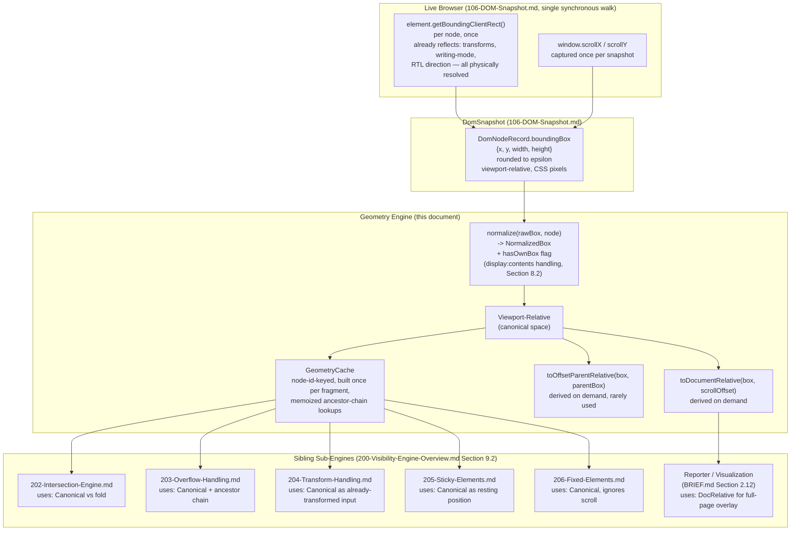

# 201 — Geometry Engine

## 1. Title

**Critical CSS Extraction Engine — Geometry Engine: Bounding-Rect Semantics, Coordinate Normalization, and Layout-Thrashing Avoidance**

## 2. Version

| Field | Value |
|---|---|
| Document Version | 1.0.0 |
| Status | Accepted |
| Last Updated | 2026-07-09 |
| Owners | Visibility Engine Working Group |
| Stability | Stable (Phase 4 design document; changes to the coordinate-space contract require RFC, since five sibling sub-engine documents depend on it) |

## 3. Purpose

[200-Visibility-Engine-Overview.md](./200-Visibility-Engine-Overview.md) Section 9.2 places the Geometry Engine at the base of the Visibility Engine's internal composition graph: every other sub-engine — Intersection ([202-Intersection-Engine.md](./202-Intersection-Engine.md)), Overflow ([203-Overflow-Handling.md](./203-Overflow-Handling.md)), Transforms ([204-Transform-Handling.md](./204-Transform-Handling.md)), Sticky ([205-Sticky-Elements.md](./205-Sticky-Elements.md)), and Fixed ([206-Fixed-Elements.md](./206-Fixed-Elements.md)) — consumes a "box" this document defines, not a raw `getBoundingClientRect()` call each makes independently. This document is the authority for what that box actually is: the precise semantics of `getBoundingClientRect()` (including its well-known quirks around zero-size elements, inline elements spanning multiple lines, and `display: contents`), the coordinate space it is expressed in versus the coordinate spaces other parts of the pipeline need (viewport-relative, document-relative, offset-parent-relative), how writing-mode and RTL layouts affect box interpretation, and — critically for performance — how geometry reads are batched and memoized across one classification pass so that the Visibility Engine's `O(N)` cost (per [200-Visibility-Engine-Overview.md](./200-Visibility-Engine-Overview.md) Section 14) is not silently inflated by redundant, thrashing-inducing layout reads.

Where [106-DOM-Snapshot.md](./106-DOM-Snapshot.md) Section 8.2 specifies *that* a `boundingBox` fact is captured per node during the single DOM-collection walk, this document specifies *what that fact means* and how the Visibility Engine's sub-engines are expected to consume, transform, and cache it without ever issuing a second `getBoundingClientRect()` call of their own — a constraint [200-Visibility-Engine-Overview.md](./200-Visibility-Engine-Overview.md) Section 7.3 already establishes at the subsystem level and this document operationalizes at the geometry-specific level.

## 4. Audience

- Implementers of the Geometry Engine sub-module within `packages/collector`'s Visibility Engine, who need the exact box-normalization and caching algorithm.
- Implementers of the five sibling sub-engine documents ([202](./202-Intersection-Engine.md)–[206](./206-Fixed-Elements.md)), all of which consume this document's `NormalizedBox` type and caching contract as an upstream dependency.
- Implementers of [106-DOM-Snapshot.md](./106-DOM-Snapshot.md)'s DOM Collector, who capture the raw `boundingBox` this document normalizes, and who need to understand what rounding/epsilon discipline that document's own Section 8.2 already applies, so this document does not silently re-apply a conflicting rounding rule.
- Reviewers evaluating a proposed change to geometry handling (e.g., adding a new coordinate space, or changing the epsilon), who should use this document's coordinate-transformation diagram and caching algorithm as the reference point.
- Senior engineers investigating a visibility-classification bug traceable to incorrect geometry (a common bug class in any layout-dependent system), who need this document's Edge Cases section as a first-pass diagnostic checklist.

Readers should already be familiar with `Element.getBoundingClientRect()`'s return shape (`x`, `y`, `width`, `height`, `top`, `right`, `bottom`, `left`), the CSS Box Model's distinction between content box, padding box, and border box (this document works exclusively with the border box, matching `getBoundingClientRect()`'s own semantics), and basic CSS Writing Modes concepts (block/inline direction, `writing-mode`, `direction`).

## 5. Prerequisites

- [200-Visibility-Engine-Overview.md](./200-Visibility-Engine-Overview.md) Section 7.1–7.3 — the canonical visibility predicate and the "no additional browser round trip" pipeline constraint this document's caching design directly serves.
- [006-Design-Principles.md](../architecture/006-Design-Principles.md) Principle 1 (Browser Is Source of Truth) — geometry is read, never approximated or recomputed via a parallel layout model.
- [006-Design-Principles.md](../architecture/006-Design-Principles.md) Principle 5 (Determinism of Output) and its Edge Cases entry "Determinism under floating-point geometry" — the epsilon/rounding discipline this document inherits and applies consistently.
- [106-DOM-Snapshot.md](./106-DOM-Snapshot.md) Section 8.2 — the exact raw capture: `boundingBox` as four rounded numbers (`x`, `y`, `width`, `height`), captured once per node during the single-pass walk, with no live `DOMRect` handle surviving past that walk (per that document's structured-clone constraint).
- [105-Viewport-Manager.md](./105-Viewport-Manager.md) Section 8.3 — the fold value this document's normalized boxes are ultimately compared against (by [202-Intersection-Engine.md](./202-Intersection-Engine.md), not by this document directly).
- Familiarity with `getBoundingClientRect()`'s viewport-relative coordinate contract, `offsetParent`/`offsetLeft`/`offsetTop` semantics, and the CSS Writing Modes Level 3/4 specification.

## 6. Related Documents

- [200-Visibility-Engine-Overview.md](./200-Visibility-Engine-Overview.md) — the umbrella document whose Section 9.2 composition diagram places this document as the shared substrate for every other Phase 4 sub-engine.
- [202-Intersection-Engine.md](./202-Intersection-Engine.md) — the primary consumer of this document's viewport-relative `NormalizedBox`, performing the box-vs-fold overlap test.
- [203-Overflow-Handling.md](./203-Overflow-Handling.md) — consumes this document's ancestor-box lookups (via the same geometry cache) to determine clip-region intersection along an ancestor chain.
- [204-Transform-Handling.md](./204-Transform-Handling.md) — consumes this document's box as the *already-transformed* starting point (since `getBoundingClientRect()` already reflects applied transforms, per Section 8.4 below) and computes further policy-driven adjustments on top of it.
- [205-Sticky-Elements.md](./205-Sticky-Elements.md) and [206-Fixed-Elements.md](./206-Fixed-Elements.md) — both consume this document's box as the "resting position" input to their own position-scheme-specific resolution logic.
- [106-DOM-Snapshot.md](./106-DOM-Snapshot.md) Section 8.2 and Section 10.1 — the raw capture algorithm and rounding discipline this document builds on without duplicating.
- [015-Runtime-Model.md](../architecture/015-Runtime-Model.md) Section 10.2 ("Cross-Boundary Call Batching") — the general batching principle this document's caching design is a specific instance of.
- [006-Design-Principles.md](../architecture/006-Design-Principles.md) — Principles 1, 3, and 5, and the floating-point-geometry Edge Case entry.
- BRIEF.md Section 2.5 (Visibility Detection) — the requirement text whose "non-zero dimensions" term this document is the primary authority for.

## 7. Overview

The Geometry Engine's contract, reduced to one sentence: given the raw `boundingBox` fact already captured per node in [106-DOM-Snapshot.md](./106-DOM-Snapshot.md)'s `DomSnapshot`, produce a `NormalizedBox` in a well-defined coordinate space for every node a sibling sub-engine asks about, computed at most once per node per classification pass, regardless of how many sibling sub-engines need it.

Three design commitments run through this entire document:

1. **All geometry is read, never computed independently.** This document does not reimplement layout. Every box value traces back to a single `getBoundingClientRect()` call made once, during [106-DOM-Snapshot.md](./106-DOM-Snapshot.md)'s single-pass walk. This document's job is normalization and caching of an already-observed fact, never derivation of a new one from CSS values (e.g., this document never computes a box from `width`/`height`/`margin` CSS property values the way a hand-rolled layout engine would — doing so would be exactly the "second, inevitably divergent, rendering engine" [006-Design-Principles.md](../architecture/006-Design-Principles.md) Principle 1 forbids).
2. **Viewport-relative is the canonical coordinate space; other spaces are derived, on demand, from it.** `getBoundingClientRect()` already returns viewport-relative coordinates (relative to the layout viewport's origin at the time of the call, accounting for current scroll position). Since [105-Viewport-Manager.md](./105-Viewport-Manager.md)'s fold is itself defined in viewport-relative terms (Section 8.3 of that document: "everything within `[0, device.height)` in the initial ... viewport's coordinate space"), viewport-relative is the coordinate space every visibility decision is ultimately made in, and this document treats it as canonical rather than treating document-relative coordinates (which would require adding scroll offset) as canonical and re-deriving viewport-relative on every read.
3. **Batch all reads before any hypothetical write.** Although the Visibility Engine's classification pass performs no DOM *writes* at all (it is a pure read pass over an already-frozen `DomSnapshot`, per [200-Visibility-Engine-Overview.md](./200-Visibility-Engine-Overview.md) Section 7.3), this document's caching discipline is stated in the classic "batch reads, batch writes, never interleave" layout-thrashing-avoidance vocabulary because the *real* batching risk in this pipeline is temporal, not read/write interleaving: [106-DOM-Snapshot.md](./106-DOM-Snapshot.md)'s single-pass walk already batches every `getBoundingClientRect()` call into one synchronous in-page pass (Section 8.6 of that document); this document's remaining job is to ensure the *host-side* consumers of that already-batched data (the five sibling sub-engines) do not each independently re-derive the same normalized value from the same raw fact, which would be redundant computation, not redundant layout — a distinct but analogous waste this document eliminates via memoization (Section 10).

## 8. Detailed Design

### 8.1 `getBoundingClientRect()` Semantics, Restated Precisely

`Element.getBoundingClientRect()` returns the smallest rectangle, in viewport-relative CSS pixel coordinates, that fully encloses the element's **border box** (per the CSS Box Model — this is distinct from the content box `clientWidth`/`clientHeight` would describe, and distinct from the margin box, which `getBoundingClientRect()` never includes). Its return shape is `{ x, y, width, height, top, right, bottom, left }`, where `x === left`, `y === top`, `right === x + width`, `bottom === y + height` — these are redundant views of the same four independent numbers (`x`, `y`, `width`, `height`), and this document's `NormalizedBox` type retains only the four independent values, reconstructing the rest on demand, to avoid a class of bug where a consumer mutates or receives a stale `right`/`bottom` inconsistent with an updated `width`/`height` (a real risk if this document's box type were designed as eight independently-stored fields rather than four with derived accessors).

**Why border box, not content box or margin box, and why this document does not offer a configurable choice.** The border box is what actually paints and what visually occupies space from a user's perspective — it is the box a user's eye registers as "this element is here." The content box excludes padding and border, which are visually part of the element's occupied footprint; the margin box includes margin, which is *not* part of the element's own visual footprint (margin is inter-element spacing, and two adjacent elements' margins can overlap/collapse in ways that make "margin box intersects the fold" a poor proxy for "this element's content is visible"). `getBoundingClientRect()`'s border-box choice is also the browser's own canonical answer to "what space does this occupy," which is decisive under Principle 1: this document does not introduce a configurable box-model choice because doing so would mean the Visibility Engine could disagree with the browser's own notion of occupied space, which has no principled justification once Principle 1 is taken seriously.

### 8.2 Zero-Size Elements

An element with `getBoundingClientRect()` reporting `width === 0` and `height === 0` typically indicates one of several distinct underlying conditions, which this document's normalization step does *not* attempt to disambiguate (disambiguation, where it matters for visibility classification, is [200-Visibility-Engine-Overview.md](./200-Visibility-Engine-Overview.md) Section 9.1's decision tree's job, using additional facts beyond geometry alone):

- **Genuinely collapsed content.** An empty `<div>` with no explicit `width`/`height`, no content, and no padding/border collapses to a zero-size box. This is unambiguously a zero-size element in the ordinary sense, and BRIEF.md Section 2.5's "non-zero dimensions" term correctly excludes it from visibility.
- **`display: none` subtrees.** An element with `display: none` (or a `display: none` ancestor) reports a zero-size box, but this case is already disqualified by the `DISPLAY_NONE` branch of [200-Visibility-Engine-Overview.md](./200-Visibility-Engine-Overview.md)'s decision tree *before* the geometry-based `ZERO_DIMENSIONS` branch is ever reached — this document's normalization must not assume a zero-size box implies `ZERO_DIMENSIONS` is the operative reason, since the decision tree's ordering (Section 9.1 of that document) already handles this distinction upstream of geometry.
- **`display: contents`.** As introduced in [200-Visibility-Engine-Overview.md](./200-Visibility-Engine-Overview.md) Section 12, an element with `display: contents` generates no box of its own at all — the element is removed from the box-generation tree while its children still generate boxes and lay out as if the `display: contents` element itself were absent. `getBoundingClientRect()` on such an element returns a degenerate, typically `{x: 0, y: 0, width: 0, height: 0}` rectangle that carries **no positional information whatsoever** (it is not "positioned at the origin," it is "not positioned, because it is not a box"). This document's `NormalizedBox` for a `display: contents` element carries an explicit `hasOwnBox: false` flag distinct from `width === 0 && height === 0` with `hasOwnBox: true` (a genuinely collapsed, positioned, zero-size box) — the distinction matters because [203-Overflow-Handling.md](./203-Overflow-Handling.md)'s ancestor-chain walk must skip over `display: contents` nodes entirely when constructing a clipping ancestor chain (a `display: contents` node cannot be a clipping ancestor, since it has no box within which to clip anything), whereas a genuinely collapsed zero-size box with `overflow: hidden` set on it *is* a valid, if degenerate, clipping ancestor for any absolutely-positioned descendant that escapes its collapsed dimensions.
- **Inline elements with no line boxes.** An inline element (`display: inline`) that currently generates zero line boxes — because it has no content and no non-collapsing inline-level children — also reports a zero-size aggregate box. This is behaviorally identical to the "genuinely collapsed content" case above and requires no special handling distinct from it.

**Why this document introduces `hasOwnBox` rather than overloading `width`/`height` semantics.** An earlier design considered representing `display: contents` as a box with `width: NaN, height: NaN` (a sentinel-value approach) rather than a separate boolean flag. This was rejected because `NaN` propagates through arithmetic in ways that silently corrupt downstream calculations (e.g., an intersection test computing an overlap area with `NaN` operands returns `NaN`, which is falsy in a boolean context in some but not all comparison operators depending on implementation, a footgun this document's design explicitly avoids) — an explicit `hasOwnBox: boolean` field forces every consumer to branch deliberately rather than accidentally propagate a poisoned numeric value.

### 8.3 Inline Elements Spanning Multiple Lines

An inline element whose content wraps across multiple lines (e.g., a `<span>` inside a paragraph that happens to break across two rendered lines) generates multiple **client rects** — one per line box it contributes to — accessible via `element.getClientRects()`, a related but distinct API from `getBoundingClientRect()`. `getBoundingClientRect()` returns the single bounding rectangle that encloses *all* of those individual line-box rects, which means: (a) its reported `width` can be as wide as the containing block, even though the element's actual rendered content only occupies a narrower region on each individual line; and (b) its reported box can span vertically across both lines, including the (typically empty) horizontal gap between the end of line one and the start of line two if the element's line boxes do not horizontally align.

**Design choice: use `getBoundingClientRect()`'s aggregate box for visibility classification, not `getClientRects()`'s per-line boxes, as the default.** The aggregate box is the correct choice for the *fold-intersection* question ("does any part of this element's rendered content appear above the fold") because if any individual line rect intersects the fold, the aggregate bounding box necessarily also intersects the fold (the aggregate box is a superset of the union of line rects in the relevant dimension) — so using the aggregate box for the intersection test in [202-Intersection-Engine.md](./202-Intersection-Engine.md) never produces a false negative. It can, in principle, produce a false positive in an extreme case: an inline element whose first line is far above the fold and whose second line is far below it, with a large intervening gap the aggregate box spans but no line rect actually occupies at the fold boundary itself — the aggregate box would report intersection with the fold even though no actual rendered content sits at that exact boundary. This is accepted as an intentional, documented conservative bias: BRIEF.md's Non-Goals explicitly prioritize correctness over premature optimization, and per [006-Design-Principles.md](../architecture/006-Design-Principles.md) Principle 3, a bias toward retaining slightly more CSS than strictly necessary (a false positive on visibility, keeping a rule that turns out not to be needed) is categorically preferable to a false negative (dropping a rule for content that actually renders above the fold, causing a flash-of-unstyled-content) — the entire product positioning in BRIEF.md Section 1 is built on this asymmetry.

**Why `getClientRects()` is not used even as a Future Work-flagged precision improvement without qualification.** A precise per-line-rect intersection test is not simply "more correct" in every sense — it would require the Intersection Engine to iterate the DOM Collector's captured rects per line, which [106-DOM-Snapshot.md](./106-DOM-Snapshot.md)'s current per-node capture model (one `boundingBox`, not an array of line rects) does not support, and adding it would mean capturing a variable-length, unbounded-cardinality fact per inline node (an element with heavily-wrapped text across many lines could contribute many line rects), a materially different and more expensive capture shape than the fixed four-number box this document's whole caching model assumes. This is flagged as a genuine, scoped Future Work item (Section 16), not adopted as the default.

### 8.4 Coordinate Space Normalization

Three coordinate spaces are relevant to this pipeline, and this document defines the canonical one plus the on-demand derivation of the other two:

- **Viewport-relative (canonical).** What `getBoundingClientRect()` returns directly: origin at the layout viewport's top-left corner *as of the moment of the call*, which for this pipeline means as of [106-DOM-Snapshot.md](./106-DOM-Snapshot.md)'s single synchronous walk — a single, coherent instant, per that document's Section 8.6 eagerness rationale. This is canonical because [105-Viewport-Manager.md](./105-Viewport-Manager.md)'s fold is defined in exactly this space.
- **Document-relative (derived on demand).** Equal to viewport-relative coordinates plus the scroll offset (`window.scrollX`/`window.scrollY`) captured at the same instant as the `boundingBox` reads. This space is useful for [203-Overflow-Handling.md](./203-Overflow-Handling.md)'s ancestor-chain reasoning when comparing a scrollable container's own scroll position against its children's positions, and for diagnostic/visualization purposes (BRIEF.md Section 2.12's optional HTML visualization highlighting above-fold nodes benefits from document-relative coordinates when overlaying markers on a full-page screenshot rather than a viewport-cropped one). `scrollX`/`scrollY` at capture time are therefore captured once per snapshot (not per node) by the DOM Collector alongside the per-node walk, and this document's `toDocumentRelative(box, scrollOffset)` function performs the addition on demand, never eagerly for every node (most sub-engines never need this space, per Section 8.4's "derived on demand" framing — computing it unconditionally for all N nodes would be pure waste for the common case).
- **Offset-parent-relative (derived on demand, rarely needed).** Equal to the difference between a node's viewport-relative box and its `offsetParent`'s viewport-relative box. This space is occasionally useful for reasoning about a `position: absolute`/`position: relative` element's positioning intent relative to its containing block, but per Section 8.1's decisive commitment to border-box, viewport-relative measurement as the visibility-classification currency, no sub-engine in this phase's core predicate actually requires offset-parent-relative coordinates for a visibility decision — it is retained in this document's API surface (Section 10.2) purely as a diagnostic/debugging convenience and as a hook for a plugin's `customizeVisibility` hook (BRIEF.md Section 2.13) that might reasonably want it, not because any core sub-engine consumes it.

```
NormalizedBox {
  x: number            // viewport-relative, CSS pixels, rounded per 106-DOM-Snapshot.md epsilon
  y: number
  width: number
  height: number
  hasOwnBox: boolean   // false for display:contents nodes (Section 8.2)
}
```

**Why transforms are not a fourth "space" in this list.** A common misconception is that "pre-transform" and "post-transform" geometry constitute two different coordinate spaces requiring separate normalization here. They do not, by construction: `getBoundingClientRect()` **already** returns the post-transform box — CSS transforms are resolved by the browser's own layout/paint pipeline before `getBoundingClientRect()` reports anything, so this document never sees, and never needs to compute, a "pre-transform" box at all. [204-Transform-Handling.md](./204-Transform-Handling.md) Section 8 explains this in more depth and clarifies exactly what work remains for that document given this fact (primarily: policy decisions about what to *do* with an already-correctly-computed post-transform box that happens to be offscreen, not any additional geometric computation).

### 8.5 Writing Modes and RTL Layouts

`getBoundingClientRect()`'s `x`/`y`/`width`/`height`/`top`/`right`/`bottom`/`left` values are **always** expressed in the standard, physical, left-to-right, top-to-bottom viewport coordinate system, **regardless of the element's own `writing-mode` or `direction` CSS values**. This is a load-bearing simplification for this document: an element with `writing-mode: vertical-rl` and text flowing top-to-bottom-then-right-to-left still reports a `getBoundingClientRect()` box whose `y`/`height` describe its physical vertical extent and `x`/`width` its physical horizontal extent, exactly as any other element's would — the browser has already resolved the writing-mode-dependent logical-to-physical mapping before this API reports anything, mirroring the transform case in Section 8.4 exactly: the browser does the hard work, this document consumes an already-physical-coordinate result.

**Consequence for the Intersection Engine.** Because [105-Viewport-Manager.md](./105-Viewport-Manager.md)'s fold is a physical, viewport-relative Y-coordinate (Section 8.3 of that document: a boundary in the standard top-to-bottom sense), and `getBoundingClientRect()` already reports physical coordinates regardless of writing mode, [202-Intersection-Engine.md](./202-Intersection-Engine.md)'s intersection test requires **no writing-mode-specific logic at all** — the physical-coordinate contract this document establishes is precisely what makes that simplicity possible downstream. This is stated explicitly here, rather than left implicit, because a naive first-principles reading of "vertical writing modes flip the block/inline axes" might lead an implementer to (incorrectly) special-case fold computation for vertical-writing-mode pages; this document forecloses that mistake by establishing that no such special-casing is needed, since the fold is physical and the geometry is physical.

**RTL (`direction: rtl`).** Similarly, `direction: rtl` affects the logical start/end mapping for inline-axis layout (text flows right-to-left, and logical "start" maps to physical right rather than physical left) but does not change `getBoundingClientRect()`'s physical coordinate contract — an RTL paragraph's bounding box is still reported with `x` as its physical left edge, `width` extending rightward, exactly as an LTR element's would be. The one place RTL genuinely matters to this document's design is **not** in geometry interpretation but in a documented non-goal: this document does not attempt to infer "logical start/end" semantics from physical coordinates for any purpose, because no requirement in BRIEF.md or [003-Requirements.md](../architecture/003-Requirements.md) calls for a logical-direction-aware fold or intersection test — the fold is, and remains, a physical top-to-bottom concept regardless of a page's `direction` value, consistent with [105-Viewport-Manager.md](./105-Viewport-Manager.md) Section 8.3's explicit rejection of a non-uniform, direction-dependent fold shape.

### 8.6 Batching and Memoization Within One Classification Pass

Although [106-DOM-Snapshot.md](./106-DOM-Snapshot.md)'s single-pass walk already performs the one, and only, `getBoundingClientRect()` call per node that this pipeline will ever make (Section 8.6 of that document), the **host-side** consumption of that already-captured data by five independent sibling sub-engines (per [200-Visibility-Engine-Overview.md](./200-Visibility-Engine-Overview.md) Section 9.2's composition diagram) creates a distinct, secondary batching concern this document owns: without a shared cache, each sub-engine's own logic might redundantly re-parse, re-round, or re-derive the same `NormalizedBox` from the same raw `DomNodeRecord.boundingBox` fact, and — more importantly — [203-Overflow-Handling.md](./203-Overflow-Handling.md)'s ancestor-chain walk needs *repeated* lookups of the same ancestor nodes' boxes across many descendants (a page with 500 descendants of one scrollable container performs 500 ancestor-chain walks, each needing that same container's box), which without memoization becomes an `O(N × D)` cost (`D` = average ancestor-chain depth) rather than the `O(N)` this document's caching makes possible.

**Design choice: build a single, immutable, node-id-keyed `GeometryCache` once per fragment, at the start of a classification pass, before any sub-engine runs.** This mirrors the classic "batch all reads before any write" layout-thrashing-avoidance pattern in spirit, even though (per Section 7's third commitment) there is no live-DOM read/write interleaving risk in this specific pass — the analogous risk here is *redundant host-side recomputation* across sub-engines and across repeated ancestor lookups, and the mitigation (build the full lookup table once, up front, before any consumer reads from it) is structurally the same discipline applied to a different resource (CPU cycles spent normalizing/rounding, not synchronous layout cycles).

```
GeometryCache {
  get(fragmentId: string, nodeId: number) -> NormalizedBox    // O(1) lookup, memoized at build time
  getAncestorChain(fragmentId: string, nodeId: number) -> NormalizedBox[]   // O(depth), built lazily, then memoized
}
```

The `getAncestorChain` operation is itself memoized per node the first time it is requested (typically by [203-Overflow-Handling.md](./203-Overflow-Handling.md)'s clip-chain index build), so that a shared ancestor prefix across many sibling descendants (a common tree shape: many leaf nodes sharing a long common ancestor path) is only walked once per *distinct* node, not once per *descendant that requests it* — this is the specific mechanism that keeps [200-Visibility-Engine-Overview.md](./200-Visibility-Engine-Overview.md) Section 10.1's overall `O(N)` complexity claim true in practice, not merely in the best case.

## 9. Architecture

### 9.1 Coordinate Space Transformation Diagram



This diagram makes explicit the single most important structural property of this document's design: **every arrow leaving the `GeometryEngine` subgraph toward a consumer originates from the cache, not from a fresh normalization call** — the five sibling sub-engines never re-invoke `normalize()` themselves, and never touch `RawBox` directly. This is the mechanism, not merely the intention, by which this document guarantees each node's geometry is normalized exactly once per classification pass regardless of how many sub-engines need it.

### 9.2 Cache Build Sequence

```mermaid
sequenceDiagram
    participant VE as Visibility Engine
    participant Geo as Geometry Engine
    participant Cache as GeometryCache
    participant Sub as Sibling Sub-Engines (Intersection, Overflow, Transform, Sticky, Fixed)

    VE->>Geo: buildCache(domSnapshot)
    loop for each fragment in snapshot
        loop for each node in fragment
            Geo->>Geo: normalize(node.boundingBox, node)
            Geo->>Cache: store(fragmentId, nodeId, normalizedBox)
        end
    end
    Geo-->>VE: GeometryCache (immutable for this pass)

    VE->>Sub: classify(node) [per node, per sub-engine as needed]
    Sub->>Cache: get(fragmentId, nodeId)
    Cache-->>Sub: NormalizedBox (O(1), already computed)

    Sub->>Cache: getAncestorChain(fragmentId, nodeId) [Overflow Handling only]
    alt chain already memoized
        Cache-->>Sub: cached ancestor NormalizedBox[]
    else first request for this node
        Cache->>Cache: walk parentNodeId links,
        collect boxes, memoize result
        Cache-->>Sub: ancestor NormalizedBox[]
    end
```

This sequence diagram elaborates [200-Visibility-Engine-Overview.md](./200-Visibility-Engine-Overview.md) Section 10.1's pseudocode line `geometryCache = GeometryEngine.buildCache(snapshot)`, showing that the cache build is a distinct, up-front phase completed in full before any sub-engine's per-node classification logic runs — never interleaved with it. This ordering is what makes the `O(1)` lookup guarantee in Section 8.6 above hold for every subsequent read, including the very first sub-engine's very first lookup.

## 10. Algorithms

### 10.1 Algorithm: Geometry Cache Construction

**Problem statement.** Given a complete `DomSnapshot` (potentially spanning multiple linked shadow/frame fragments), produce a `GeometryCache` providing `O(1)` amortized box lookup and memoized ancestor-chain retrieval for every node, computed via exactly one normalization pass, with no redundant work across fragments or across repeated sub-engine queries.

**Inputs.** `snapshot: DomSnapshot`.

**Outputs.** `GeometryCache` (immutable for the duration of one classification pass, per Section 8.6).

**Pseudocode.**

```
function buildCache(snapshot) -> GeometryCache:
    boxByKey = new Map()          // key: (fragmentId, nodeId) -> NormalizedBox
    ancestorChainMemo = new Map() // key: (fragmentId, nodeId) -> NormalizedBox[]

    for fragment in snapshot.allFragments():
        for node in fragment.nodes:
            box = normalize(node.boundingBox, node)
            boxByKey.set(key(fragment.fragmentId, node.nodeId), box)

    function normalize(rawBox, node) -> NormalizedBox:
        if node.tagName == "display-contents-marker":   // see 106-DOM-Snapshot.md capture convention
            return NormalizedBox { x: 0, y: 0, width: 0, height: 0, hasOwnBox: false }
        return NormalizedBox {
            x: rawBox.x, y: rawBox.y,
            width: rawBox.width, height: rawBox.height,
            hasOwnBox: true
        }
        // Note: rounding/epsilon already applied upstream in 106-DOM-Snapshot.md
        // Section 8.2; this function does not re-round, to avoid double-rounding
        // drift (a distinct, deliberately avoided determinism risk).

    function get(fragmentId, nodeId) -> NormalizedBox:
        return boxByKey.get(key(fragmentId, nodeId))     // O(1)

    function getAncestorChain(fragmentId, nodeId) -> NormalizedBox[]:
        cached = ancestorChainMemo.get(key(fragmentId, nodeId))
        if cached is not null:
            return cached                                  // O(1) on repeat calls

        chain = []
        currentId = nodeId
        while currentId is not null:
            parentId = lookupParentNodeId(fragmentId, currentId)  // crosses shadow/frame
                                                                    // boundaries per 106-DOM-Snapshot.md
                                                                    // Section 8.3/8.5 linkage
            if parentId is not null:
                chain.push(get(fragmentId, parentId))
            currentId = parentId

        ancestorChainMemo.set(key(fragmentId, nodeId), chain)
        return chain

    return GeometryCache { get, getAncestorChain }
```

**Time complexity.** Building `boxByKey` is `O(N)`, one normalization per node across all fragments (each normalization is `O(1)`, a fixed-field copy plus a conditional). `getAncestorChain`'s **amortized** cost across an entire classification pass is `O(N)` total, not `O(N × D)`: although a single, first-time call for a deep node costs `O(depth)`, memoization means any node whose ancestor chain shares a prefix with an already-resolved chain effectively reuses that prefix's already-materialized boxes via the `get()` calls within the walk (each individual `get()` is `O(1)`), and once a specific node's *own* full chain is memoized, every future request for that exact node's chain is `O(1)`. In the worst case (a snapshot where every node's ancestor-chain request is for a distinct node, which is the norm — every node has a different-terminating chain even if prefixes overlap), the aggregate cost across all `N` nodes' first-time chain walks is bounded by the sum of all node depths, which for a balanced tree of `N` nodes is `O(N log N)`, and for a pathologically deep, linear-chain tree (a `fixtures/enterprise-huge/`-style deeply nested table structure) is bounded by `O(N × D_max)` where `D_max` is the maximum depth — a real, documented worst case addressed further in Section 14.

**Memory complexity.** `O(N)` for `boxByKey` (one fixed-size `NormalizedBox` per node); `O(N)` worst case for `ancestorChainMemo` if every node's chain is eventually requested and memoized in full (each memoized chain is `O(depth)`, but the *total* across all memoized chains is bounded by the same sum-of-depths quantity as the time-complexity analysis above, not a naive `O(N × D_max)` if prefixes are shared — though the current design memoizes full chains per node rather than sharing chain-suffix storage across nodes, which is a documented, accepted simplification, see Section 13's Tradeoffs).

**Failure cases.** A node whose `parentNodeId` chain does not terminate (a malformed snapshot with a cycle, which should be structurally impossible given [106-DOM-Snapshot.md](./106-DOM-Snapshot.md)'s single-pass walk order, but is defensively guarded against here) must be detected via a bounded iteration count or a visited-set check within `getAncestorChain`, raising an internal-invariant-violation diagnostic rather than looping indefinitely — consistent with [011-Execution-Pipeline.md](../architecture/011-Execution-Pipeline.md) Section 8.11's treatment of post-collection internal invariants as bugs, not expected runtime conditions.

**Optimization opportunities.** A **suffix-sharing** ancestor-chain cache (storing chains as a linked structure where a node's chain is "its parent's already-memoized chain, plus one element" rather than a fully independent array per node) would reduce the worst-case memory bound from the current per-node-full-chain-copy design to a true `O(N)` regardless of tree shape, at the cost of a more complex cache data structure (a persistent/shared-tail list rather than a flat array per node); this is flagged as a concrete, benchmarked-before-adoption optimization candidate in Section 16, not adopted as the default per [006-Design-Principles.md](../architecture/006-Design-Principles.md) Principle 3's preference for a simpler, provably-correct baseline before a more complex, equivalence-proven optimization.

### 10.2 Algorithm: On-Demand Coordinate Space Derivation

**Problem statement.** Given a `NormalizedBox` in the canonical viewport-relative space, derive its document-relative or offset-parent-relative equivalent, without eagerly computing either for every node (per Section 8.4's "derived on demand" design).

**Inputs.** `box: NormalizedBox`, and either `scrollOffset: {x: number, y: number}` (for document-relative) or `parentBox: NormalizedBox` (for offset-parent-relative).

**Outputs.** A new `NormalizedBox` in the requested space.

**Pseudocode.**

```
function toDocumentRelative(box, scrollOffset) -> NormalizedBox:
    if not box.hasOwnBox:
        return box   // display:contents nodes have no meaningful position in any space
    return NormalizedBox {
        x: box.x + scrollOffset.x,
        y: box.y + scrollOffset.y,
        width: box.width,
        height: box.height,
        hasOwnBox: true
    }

function toOffsetParentRelative(box, parentBox) -> NormalizedBox:
    if not box.hasOwnBox or not parentBox.hasOwnBox:
        return box   // undefined relationship if either box is a non-box display:contents node
    return NormalizedBox {
        x: box.x - parentBox.x,
        y: box.y - parentBox.y,
        width: box.width,
        height: box.height,
        hasOwnBox: true
    }
```

**Time complexity.** `O(1)` per call; these are called on demand, not for every node, so their aggregate cost across a classification pass is `O(K)` where `K` is the (typically small, often zero) number of actual requests, not `O(N)`.

**Memory complexity.** `O(1)` per derived box; derived boxes are not cached by default (unlike the canonical `GeometryCache`), since Section 8.4 establishes that most sub-engines never request them, making a persistent cache for these derived spaces a premature optimization for facts requested rarely, if ever, in a typical run.

**Failure cases.** `toOffsetParentRelative` given a `parentBox` that is not actually an ancestor of `box`'s node (a caller error, not a data error) produces a mathematically well-defined but semantically meaningless result; this function performs no ancestry validation itself (that is the caller's responsibility, typically satisfied automatically when the caller obtained `parentBox` via `GeometryCache.getAncestorChain`), consistent with keeping this function a pure, minimal coordinate-arithmetic utility rather than a validating API.

**Optimization opportunities.** None significant; these are `O(1)` utility functions whose cost is negligible relative to any surrounding sub-engine logic.

## 11. Implementation Notes

- The `GeometryCache` must be treated as immutable for the duration of one classification pass; if a future rescanning mode (per [200-Visibility-Engine-Overview.md](./200-Visibility-Engine-Overview.md) Section 16's layout-shift-aware rescanning) is implemented, it must construct a **fresh** `GeometryCache` from a freshly re-collected `DomSnapshot`, never mutate an existing cache in place — this preserves the "single coherent instant" guarantee [106-DOM-Snapshot.md](./106-DOM-Snapshot.md) Section 8.6 already establishes for the underlying snapshot, extending it to this document's derived cache.
- `normalize()` must not re-round the already-epsilon-rounded values from [106-DOM-Snapshot.md](./106-DOM-Snapshot.md) Section 8.2; implementers should add a unit test asserting `normalize(rawBox, node).x === rawBox.x` bit-for-bit (not merely within a tolerance) to catch an accidental double-rounding regression, since double-rounding at two different epsilon values could itself reintroduce the exact determinism risk the single upstream rounding step was designed to eliminate.
- The `display-contents-marker` convention referenced in Section 10.1's pseudocode should be a documented, explicit field on `DomNodeRecord` (an addition to [106-DOM-Snapshot.md](./106-DOM-Snapshot.md) Section 8.2's capture list, e.g., `isDisplayContents: boolean`, set by reading `getComputedStyle(element).display === "contents"` during the same walk) rather than an inferred convention this document's normalization step guesses at from box shape alone — inferring "probably `display: contents`" from "box happens to be zero-sized" would be unreliable (a genuinely collapsed element is indistinguishable from a `display: contents` element by box shape alone) and is called out here as a required upstream capture-list amendment, not an acceptable heuristic to implement solely within this document's scope.
- Implementers should benchmark `getAncestorChain`'s amortized cost specifically against the `fixtures/enterprise-huge/` fixture (BRIEF.md Section 2.15), since that fixture is the one most likely to expose the pathological-depth worst case flagged in Section 10.1's Time Complexity analysis, before concluding the current flat-per-node-chain-copy design is adequate at production scale.

## 12. Edge Cases

- **`display: contents` ancestor-chain walking.** As established in Section 8.2 and reiterated in Section 10.1's implementation notes, a `display: contents` node must be skipped (not treated as a box-bearing ancestor) when [203-Overflow-Handling.md](./203-Overflow-Handling.md) constructs a clip-chain — this document's `hasOwnBox: false` flag is the exact signal that document's algorithm is expected to check and skip past, continuing to the *next* ancestor up the chain that does have its own box.
- **Elements with `visibility: collapse` on table rows/columns.** Per the CSS Tables specification, `visibility: collapse` applied to a `<tr>` or `<col>` removes the row/column's contribution to the table's layout entirely (distinct from `visibility: hidden`, which reserves layout space) — such an element's `getBoundingClientRect()` typically reports a zero-size box, behaviorally identical to a genuinely collapsed element from this document's perspective. This document does not special-case `visibility: collapse` distinctly from ordinary collapse, since the *box* is indistinguishable regardless of *which* CSS mechanism produced the collapse — any special-casing needed for correct downstream `visibility`-term handling (as opposed to geometry) belongs in [200-Visibility-Engine-Overview.md](./200-Visibility-Engine-Overview.md)'s decision tree, specifically its `visibility:hidden`-adjacent branch, not in this document.
- **Fractional device pixel ratios and sub-pixel rounding.** As referenced in Section 8.6's epsilon discussion (inherited from [106-DOM-Snapshot.md](./106-DOM-Snapshot.md)'s Edge Cases entry on floating-point geometry determinism), a `DeviceProfile` with a non-integer `deviceScaleFactor` (uncommon but not forbidden) can produce `getBoundingClientRect()` values with more visually-apparent sub-pixel noise than an integer-DPR profile; this document relies entirely on the upstream epsilon rounding already applied and introduces no additional DPR-specific handling, since the determinism guarantee is already fully discharged at the capture layer, not this normalization layer.
- **Zero-area boxes with non-zero position (a genuinely collapsed but positioned element).** A `<div style="width:0;height:0;position:absolute;top:50px;left:50px">` reports `{x: 50, y: 50, width: 0, height: 0}` — `hasOwnBox: true`, unlike the `display: contents` case, because this element *does* generate a box, it is simply zero-area. This distinction matters for [203-Overflow-Handling.md](./203-Overflow-Handling.md): such an element, despite having zero area, is still a theoretically valid (if maximally degenerate) `overflow` clipping ancestor for absolutely-positioned descendants that escape its zero-size bounds via negative margins or explicit repositioning, whereas a `display: contents` node structurally cannot be, regardless of any style property set on it.
- **Cross-fragment ancestor chains (Shadow DOM and iframes).** `getAncestorChain`'s `lookupParentNodeId` must correctly traverse from a slotted light-DOM node into its *rendered* shadow-tree ancestor chain (per [106-DOM-Snapshot.md](./106-DOM-Snapshot.md) Section 8.4's slot back-reference linkage) when overflow-clipping is the concern (clipping is a paint-time, rendered-position concept), while correctly using the *light-DOM* chain when a light-DOM-specific concern (unrelated to this document, but worth flagging as a boundary this document's `getAncestorChain` API alone does not resolve — it exposes both directions of linkage via the underlying `DomSnapshot`, and it is the caller's, i.e. [203-Overflow-Handling.md](./203-Overflow-Handling.md)'s, responsibility to request the correct chain for its specific question).
- **Very high aspect-ratio or degenerate one-dimensional boxes.** A horizontal `<hr>` with `height: 1px` and full container `width` is a legitimate, non-degenerate box by this document's model (`width > 0 and height > 0`) despite its extreme aspect ratio; this document applies no minimum-dimension threshold beyond the literal zero/non-zero test BRIEF.md Section 2.5 specifies, since introducing a minimum-size heuristic (e.g., "ignore boxes under 2px in either dimension as effectively invisible") would be an unrequested, undocumented approximation in tension with Principle 3.

## 13. Tradeoffs

| Decision | Why | Alternative Considered | Tradeoff Accepted |
|---|---|---|---|
| Use `getBoundingClientRect()`'s aggregate box for multi-line inline elements, not `getClientRects()`'s per-line boxes | Never produces a false negative on fold intersection; fits the existing fixed-shape `boundingBox` capture model | Per-line-rect precise intersection testing | Can produce a rare false positive (aggregate box spans a gap between two widely-separated line rects); accepted as consistent with the engine's stated correctness-over-precision bias |
| Border box (not content box or margin box), non-configurable | Matches the browser's own canonical "occupied space" notion and `getBoundingClientRect()`'s own default semantics | Configurable box-model choice | Removes a degree of user configurability some other visibility tools expose, in favor of a single, principled, Principle-1-consistent answer |
| Explicit `hasOwnBox: false` flag for `display: contents`, rather than a `NaN`/sentinel-value box | Forces deliberate branching in every consumer; avoids silent `NaN` propagation | Sentinel numeric values (e.g., `NaN` or `-1`) encoding "no box" | Requires every consumer (and this document's own derivation functions, Section 10.2) to explicitly check `hasOwnBox` rather than relying on ordinary numeric comparisons to "just work" |
| Build one immutable `GeometryCache` per classification pass, up front, before any sub-engine runs | Guarantees `O(1)` lookups and eliminates redundant cross-sub-engine recomputation | Let each sub-engine normalize/cache independently | Requires a coordination point (this document's `buildCache`) that all sub-engines must depend on, slightly increasing this document's centrality/blast-radius in the composition graph |
| Full-chain-per-node ancestor memoization (not suffix-sharing) | Simpler data structure, easier to reason about and test correctness of first | A persistent/shared-tail linked ancestor-chain structure | Worse worst-case memory bound on pathologically deep, low-branching-factor trees; flagged as a benchmarked-before-adoption optimization in Future Work rather than the default |
| Document-relative and offset-parent-relative spaces derived on demand, never eagerly cached | Avoids computing facts the overwhelming majority of classification passes never request | Eagerly compute and cache all three coordinate spaces for every node | A caller requesting the same derived box repeatedly within one pass recomputes it each time (cheap, `O(1)` per call, so this is accepted as negligible) |

## 14. Performance

- **CPU complexity.** `buildCache`'s primary pass is `O(N)` (Section 10.1); `getAncestorChain`'s amortized aggregate cost across a full classification pass is `O(N)` for typical, reasonably-balanced page structures, degrading toward `O(N × D_max)` only for pathologically deep, low-branching structures — a distinction significant enough to warrant its own stress-test category (Section 15) rather than being asymptotically glossed over.
- **Memory complexity.** `O(N)` for the primary box cache; up to `O(N × D_avg)` in the worst case for the full-chain-per-node ancestor memoization (Section 13's accepted tradeoff), where `D_avg` is average requested-chain depth — bounded in practice by realistic DOM nesting depth (typically well under a few hundred, per [106-DOM-Snapshot.md](./106-DOM-Snapshot.md) Section 10.1's own memory-complexity note on recursion-stack depth), making this a real but bounded cost, not an unbounded liability.
- **Caching strategy.** This document's `GeometryCache` is the caching strategy for its own concern; it does not participate in, and is entirely orthogonal to, the Cache Manager's fingerprint-keyed extraction-result cache (per [006-Design-Principles.md](../architecture/006-Design-Principles.md) Principle 8) — it exists only within the scope of one in-flight classification pass and is discarded once that pass completes, never persisted or reused across work units.
- **Parallelization opportunities.** `buildCache`'s primary per-node normalization pass (the `O(N)` loop building `boxByKey`) has no cross-node data dependency and is trivially parallelizable across worker threads for very large snapshots; `getAncestorChain`'s memoized walks have a genuine data dependency (a node's chain depends on its parent's already-being-resolved, though each individual `get()` call within a chain walk is itself just a map lookup), making that specific operation less straightforward to parallelize without careful synchronization around the shared `ancestorChainMemo` map — flagged as a secondary-priority optimization target relative to the primary normalization pass.
- **Incremental execution.** Not applicable within a single classification pass; a future incremental/rescanning mode (per [200-Visibility-Engine-Overview.md](./200-Visibility-Engine-Overview.md) Section 16) would need its own cache-invalidation-vs-rebuild policy, which this document does not currently specify, since the current design always rebuilds the cache fresh per pass (Section 11's Implementation Notes).
- **Profiling guidance.** Profiling should separately measure `buildCache`'s up-front normalization-loop cost versus the aggregate cost of all `getAncestorChain` calls across a pass, since the latter is the more likely source of a performance regression on deeply-nested fixtures and is the specific target Section 10.1's suffix-sharing optimization (Section 16) would address if profiling data justifies it.
- **Scalability limits.** For the `fixtures/enterprise-huge/` category specifically, `D_max` (maximum ancestor-chain depth) — not raw node count `N` alone — is the practical scalability variable to watch, since it is the one dimension along which this document's current design's complexity can degrade from linear toward the worse bound identified in Section 10.1; a page with many nodes but shallow, wide nesting remains comfortably `O(N)` in practice.

## 15. Testing

- **Unit tests.** `normalize()` must be tested against: an ordinary positioned element, a genuinely collapsed zero-size element, a `display: contents` marker (asserting `hasOwnBox: false`), and a bit-for-bit no-double-rounding assertion (per Implementation Notes). `toDocumentRelative`/`toOffsetParentRelative` must be tested for correct arithmetic and correct `hasOwnBox` propagation when either input lacks a box.
- **Integration tests.** Real-browser fixtures must assert: a multi-line-wrapped inline `<span>` fixture produces a `getBoundingClientRect()`-consistent aggregate box (cross-checked against the live browser's own reported value, not merely this document's arithmetic, per Principle 1); a `display: contents` fixture produces `hasOwnBox: false` end-to-end from real page capture through this document's normalization; an RTL-`direction` and a `writing-mode: vertical-rl` fixture both produce physical-coordinate boxes consistent with Section 8.5's no-special-casing claim, verified against real rendered screenshots.
- **Visual tests.** A fixture combining a transformed element, a multi-line inline element, and a writing-mode-altered element on one page, screenshotted with each element's `NormalizedBox` overlaid as a visible marker, should be visually inspected/diffed to confirm the box the Geometry Engine reports genuinely encloses the element's rendered appearance as a human would judge it.
- **Stress tests.** The `fixtures/enterprise-huge/` fixture, specifically constructed or selected to include a pathologically deep, low-branching-factor nested structure (e.g., a deeply nested legacy table layout), must be run through `buildCache`/`getAncestorChain` to empirically measure the degradation from `O(N)` toward `O(N × D_max)` flagged in Section 10.1, establishing a concrete benchmark baseline before any suffix-sharing optimization (Section 16) is considered.
- **Regression tests.** Golden `NormalizedBox` output for a fixed set of representative fixtures (ordinary elements, `display: contents`, multi-line inline, RTL, vertical writing-mode) must be pinned; any change to `normalize()`'s logic that alters a golden value must be a reviewed, intentional change, consistent with [006-Design-Principles.md](../architecture/006-Design-Principles.md)'s golden-snapshot regression discipline.
- **Benchmark tests.** Per Principle 3's "additive, benchmarked" requirement, the suffix-sharing ancestor-chain optimization (Section 16) must, if implemented, ship with a benchmark comparing its memory/time profile against the current flat-per-node-chain baseline on the enterprise-huge fixture, plus an equivalence test confirming identical `NormalizedBox[]` output for every node under both implementations.

## 16. Future Work

- **Suffix-sharing ancestor-chain cache**, flagged in Section 10.1 and Section 13, to improve the worst-case memory/time bound on pathologically deep, low-branching-factor page structures — deferred pending stress-test data (Section 15) confirming it is actually needed at realistic production scale, per Principle 3's discipline against premature optimization.
- **Per-line-rect precision for multi-line inline elements**, via `getClientRects()`, as an opt-in, higher-fidelity mode for pages where the aggregate-bounding-box conservative bias (Section 8.3) is empirically shown to retain meaningfully more CSS than necessary — would require a capture-model change in [106-DOM-Snapshot.md](./106-DOM-Snapshot.md) to support a variable-cardinality per-node geometric fact, a non-trivial change requiring its own RFC given that document's Stability header.
- **Live post-classification re-normalization for a future rescanning mode**, coordinated with [200-Visibility-Engine-Overview.md](./200-Visibility-Engine-Overview.md) Section 16's layout-shift-aware rescanning Future Work item — this document's cache-immutability design (Section 11) would need an explicit "build a second, independent cache from a second snapshot, then reconcile" protocol rather than any form of in-place cache mutation.
- **Configurable box-model choice (border box vs. content box) as a plugin-level override**, revisiting Section 8.1's currently non-configurable, principled default, should a future, concrete use case emerge (e.g., a plugin author with a specific, justified reason to reason about content-box-only intersection) — deferred because no current requirement calls for it, and Section 8.1's rationale against unconditional configurability remains sound absent a concrete counter-example.
- **Open question: should offset-parent-relative coordinate derivation be exposed to the Plugin System's `customizeVisibility` hook (BRIEF.md Section 2.13) as a first-class, documented capability**, given that this document currently retains it in the API surface (Section 8.4) without any core consumer actually requiring it? Current lean is "yes, once the Plugin SDK (Phase 12) formalizes hook input contracts," but this is not yet resolved and is flagged for revisit at that phase.

## 17. References

- [200-Visibility-Engine-Overview.md](./200-Visibility-Engine-Overview.md)
- [202-Intersection-Engine.md](./202-Intersection-Engine.md)
- [203-Overflow-Handling.md](./203-Overflow-Handling.md)
- [204-Transform-Handling.md](./204-Transform-Handling.md)
- [205-Sticky-Elements.md](./205-Sticky-Elements.md)
- [206-Fixed-Elements.md](./206-Fixed-Elements.md)
- [105-Viewport-Manager.md](./105-Viewport-Manager.md)
- [106-DOM-Snapshot.md](./106-DOM-Snapshot.md)
- [011-Execution-Pipeline.md](../architecture/011-Execution-Pipeline.md)
- [015-Runtime-Model.md](../architecture/015-Runtime-Model.md)
- [006-Design-Principles.md](../architecture/006-Design-Principles.md)
- BRIEF.md Section 2.5 (Visibility Detection), Section 2.12 (Diagnostics), Section 2.15 (Testing Strategy) — repository root
- CSS Box Model Module Level 3 (W3C) — border box, content box, margin box definitions
- CSSOM View Module (W3C) — `getBoundingClientRect()`, `getClientRects()` normative definitions
- CSS Writing Modes Level 3/4 (W3C) — logical-to-physical coordinate resolution referenced in Section 8.5
- CSS Transforms Level 1/2 (W3C) — referenced in Section 8.4's clarification that transforms are already resolved by the time geometry is read
- CSS Tables Module Level 3 (W3C) — `visibility: collapse` semantics referenced in Section 12
