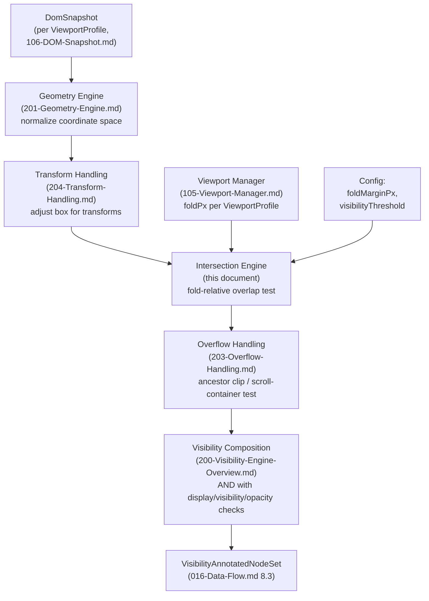
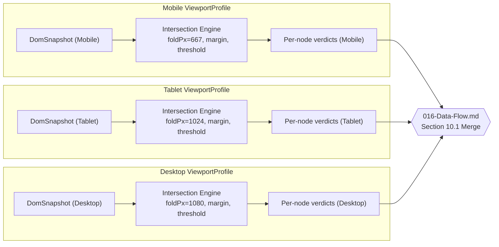
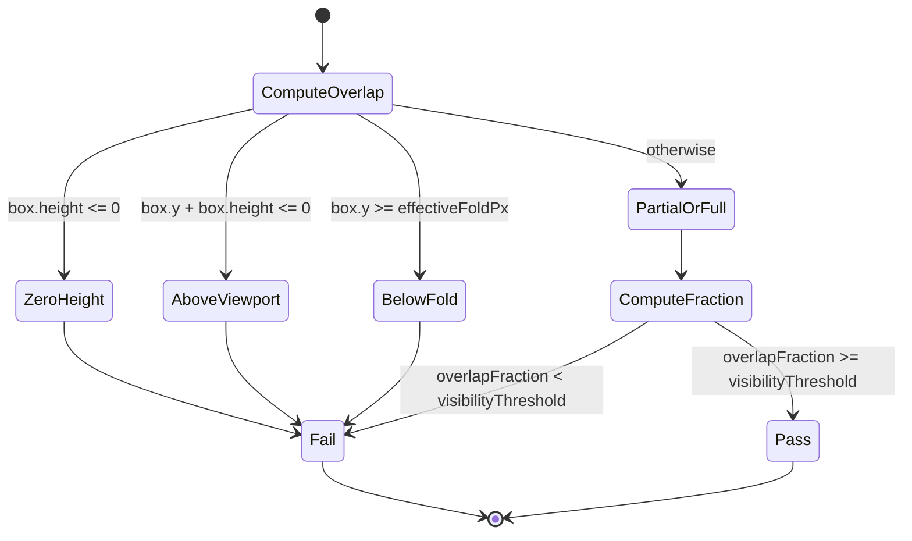

# 202 — Intersection Engine

## 1. Title

**Critical CSS Extraction Engine — Intersection Engine: Fold-Relative Rectangle Intersection, Partial-Visibility Thresholds, and Multi-Viewport Fold Testing**

## 2. Version

| Field | Value |
|---|---|
| Document Version | 1.0.0 |
| Status | Accepted |
| Last Updated | 2026-07-09 |
| Owners | Visibility Engine Working Group |
| Stability | Stable (Phase 4 design document; changes to the intersection contract require RFC, since [201-Geometry-Engine.md](./201-Geometry-Engine.md), [203-Overflow-Handling.md](./203-Overflow-Handling.md), and [200-Visibility-Engine-Overview.md](./200-Visibility-Engine-Overview.md) all depend on it) |

## 3. Purpose

BRIEF.md Section 2.5 defines the Visibility Detection algorithm as, in part, "intersects viewport/fold AND has non-zero dimensions AND ..." — a single conjunct that this document expands into a fully specified subsystem. [105-Viewport-Manager.md](./105-Viewport-Manager.md) Section 8.3 establishes the fold as a single scalar Y-coordinate, computed once per `ViewportProfile` and centrally owned so that every downstream consumer reads the same value. [106-DOM-Snapshot.md](./106-DOM-Snapshot.md) Section 8.2 establishes that every `DomNodeRecord` already carries a captured `boundingBox` (`x`, `y`, `width`, `height`, epsilon-rounded) from `getBoundingClientRect()`. Neither document specifies how those two facts — a node's bounding box and the fold's Y-coordinate — are combined into a pass/fail (or partial) intersection verdict.

This document is the authority for that combination. It specifies: (1) the core rectangle-intersection test against the fold boundary, expressed as an axis-aligned bounding-box (AABB) overlap computation; (2) the partial-intersection threshold model — whether a node crossing the fold boundary counts as "above the fold" if only a fraction of its area is above it, and how that fraction is computed and configured; (3) the configurable fold offset/margin, modeled analogously to the DOM `IntersectionObserver`'s `rootMargin`, allowing operators to treat content slightly below the literal fold as critical (a common desire, since users rarely disengage the instant they see zero pixels below the fold); (4) nested-scroll-container semantics — a node can be geometrically above the page's fold while being scrolled out of view within its own scrollable ancestor, a case this document flags as in scope for intersection testing against the *page* fold but explicitly out of scope for testing against a *container's* scroll position, which is [203-Overflow-Handling.md](./203-Overflow-Handling.md)'s jurisdiction; and (5) multi-viewport intersection, the fact that the same `DomNodeRecord` (captured once per viewport navigation, per [106-DOM-Snapshot.md](./106-DOM-Snapshot.md) Section 8.1) intersects the fold differently across the Mobile, Tablet, and Desktop branches of the fan-out described in [105-Viewport-Manager.md](./105-Viewport-Manager.md) Section 9.3, requiring the intersection verdict itself to be indexed per `viewportProfileId`, not computed once and reused.

## 4. Audience

- Implementers of the Visibility Engine's intersection sub-module (`packages/collector`, alongside [201-Geometry-Engine.md](./201-Geometry-Engine.md)'s coordinate-space normalization), who will write the pure, host-side function that consumes a `DomNodeRecord.boundingBox` and a `foldPx` value and produces an intersection verdict.
- Implementers of [203-Overflow-Handling.md](./203-Overflow-Handling.md), who consume this document's raw geometric intersection verdict as a precondition — a node must first geometrically intersect the fold before overflow/clipping is even worth evaluating, since a node that fails geometric intersection is already not visible above the fold regardless of any ancestor's overflow state.
- Implementers of [204-Transform-Handling.md](./204-Transform-Handling.md), which supplies this document's algorithm with a transform-adjusted bounding box (rather than a raw, untransformed one) as an input, per that document's post-transform coordinate normalization.
- Implementers of [206-Fixed-Elements.md](./206-Fixed-Elements.md) and [205-Sticky-Elements.md](./205-Sticky-Elements.md), both of which must special-case this document's intersection test because a `position: fixed` or a currently-stuck `position: sticky` element's effective on-screen position is not simply its captured `boundingBox` at snapshot time.
- Configuration schema authors exposing `foldMarginPx` and `visibilityThreshold` (Section 8.2) to end users, analogous to how `IntersectionObserver`'s `rootMargin`/`threshold` options are exposed to web developers.

Readers should already understand [105-Viewport-Manager.md](./105-Viewport-Manager.md)'s fold model (Section 8.3), [106-DOM-Snapshot.md](./106-DOM-Snapshot.md)'s per-node geometry capture (Section 8.2), and should have working familiarity with the DOM `IntersectionObserver` API's `rootMargin`/`threshold` semantics, since this document deliberately borrows and adapts that vocabulary rather than inventing new terminology.

## 5. Prerequisites

- [105-Viewport-Manager.md](./105-Viewport-Manager.md) Section 8.3 (Fold Computation) — the single scalar `foldPx` value this document's algorithms consume as an unchanging input per `ViewportProfile`.
- [106-DOM-Snapshot.md](./106-DOM-Snapshot.md) Section 8.2 (What Is Captured Per Node) — the `boundingBox` field this document's algorithms consume, including its epsilon-rounding discipline.
- [006-Design-Principles.md](../architecture/006-Design-Principles.md) Principle 1 (Browser Is Source of Truth) and Principle 5 (Determinism of Output) — this document's insistence on browser-captured geometry, and its epsilon/rounding discipline for stable pass/fail verdicts, are direct applications of both.
- [200-Visibility-Engine-Overview.md](./200-Visibility-Engine-Overview.md) — the umbrella document defining how the Intersection Engine composes with the Geometry Engine, Overflow Handling, Transform Handling, and the sticky/fixed/virtualization special cases into one overall visibility verdict per node.
- [201-Geometry-Engine.md](./201-Geometry-Engine.md) — supplies this document with normalized, coordinate-space-consistent bounding boxes; this document assumes that normalization has already happened and does not re-derive it.
- Familiarity with the DOM `IntersectionObserver` API, specifically its `rootMargin` and `threshold` options, which this document's `foldMarginPx` and `visibilityThreshold` deliberately mirror.

## 6. Related Documents

- [105-Viewport-Manager.md](./105-Viewport-Manager.md) — fold computation and per-`ViewportProfile` identity.
- [106-DOM-Snapshot.md](./106-DOM-Snapshot.md) — per-node geometry capture this document consumes.
- [200-Visibility-Engine-Overview.md](./200-Visibility-Engine-Overview.md) — the overall visibility pipeline this module is one stage of.
- [201-Geometry-Engine.md](./201-Geometry-Engine.md) — upstream coordinate normalization.
- [203-Overflow-Handling.md](./203-Overflow-Handling.md) — downstream clip/scroll-container resolution that qualifies this document's raw geometric verdict.
- [204-Transform-Handling.md](./204-Transform-Handling.md) — upstream transform-adjusted geometry.
- [205-Sticky-Elements.md](./205-Sticky-Elements.md) and [206-Fixed-Elements.md](./206-Fixed-Elements.md) — special-cased consumers whose effective position diverges from captured `boundingBox`.
- [207-Virtualized-Lists.md](./207-Virtualized-Lists.md) — a further special case in which a node's absence from the snapshot entirely (not merely its intersection verdict) is the relevant concern; forward-referenced in Edge Cases.
- [006-Design-Principles.md](../architecture/006-Design-Principles.md) — Principles 1, 3, 5.
- BRIEF.md Section 2.5 (Visibility Detection) and Section 2.6 (Multi-Viewport Strategy) — the authoritative requirement source.
- W3C Intersection Observer specification — the vocabulary (`rootMargin`, `threshold`) this document adapts.

## 7. Overview

The Intersection Engine answers exactly one question, for exactly one `(DomNodeRecord, ViewportProfile)` pair: **does this node's geometry intersect the fold boundary, and if the answer is not a clean yes/no, by how much?** It is deliberately narrow in scope. It does not decide whether a node is *painted* (that is [203-Overflow-Handling.md](./203-Overflow-Handling.md)'s job, resolving ancestor clipping), does not decide whether a node's `display`/`visibility`/`opacity` computed style makes it invisible regardless of geometry (that is [200-Visibility-Engine-Overview.md](./200-Visibility-Engine-Overview.md)'s composition layer), and does not decide how a transformed node's effective box differs from its untransformed `boundingBox` (that is [204-Transform-Handling.md](./204-Transform-Handling.md)'s job, upstream of this document). What it does own, fully, is the geometric intersection test itself: an axis-aligned rectangle-vs-halfplane overlap computation, a configurable margin that shifts the halfplane's boundary, a configurable threshold that converts a partial-overlap fraction into a pass/fail decision, and the requirement that this entire computation be repeated independently per `ViewportProfile`, never cached or shared across profiles even for a structurally identical node.

Three design decisions dominate this document:

1. **The fold is modeled as a halfplane, not a rectangle, and the intersection test is a 1-D interval overlap on the Y-axis, not a full 2-D rectangle intersection.** A viewport's horizontal extent does not constrain "above the fold" in this engine's model — BRIEF.md Section 2.5 and [105-Viewport-Manager.md](./105-Viewport-Manager.md) Section 8.3 both define the fold purely in terms of vertical scroll position, with no horizontal cutoff. A node that overflows the viewport horizontally (e.g., positioned at `x: 5000px`, still within the vertical fold band) is a real, if unusual, case this document does not exclude via the fold test — such a node might still fail visibility for other reasons ([200-Visibility-Engine-Overview.md](./200-Visibility-Engine-Overview.md)'s composed checks), but not via this document's fold-intersection logic specifically. This asymmetry is a deliberate simplification, revisited in Tradeoffs.
2. **Partial intersection is a first-class, configurable outcome, not an implicit "any overlap counts" default.** A node whose top 5% crosses above the fold boundary while its remaining 95% lies below is intersecting the fold in the strictest geometric sense, but including its full CSS in "critical" on that basis would be over-inclusive for the engine's actual purpose (minimizing the render-blocking critical CSS payload while preserving perceived first-paint fidelity). This document exposes a `visibilityThreshold` (default `0`, meaning "any overlap counts," matching `IntersectionObserver`'s default) that operators can raise to require a minimum overlap fraction.
3. **Fold margin is additive and signed, exactly mirroring `IntersectionObserver.rootMargin`'s single-value convention applied to the vertical axis.** A positive `foldMarginPx` extends the "above the fold" region downward past the literal fold line (treating some below-the-fold content as critical, a common product decision to avoid a visible content-then-restyle flash for content users see almost immediately after the fold); a negative value contracts it (a more conservative critical-CSS budget). This is distinct from, and composes with, [105-Viewport-Manager.md](./105-Viewport-Manager.md)'s `customFoldOffsetPx`, which replaces the fold's base value at the `DeviceProfile` level — `foldMarginPx` is a per-extraction-run tuning knob layered on top of whatever `foldPx` the Viewport Manager already computed, not a replacement for it.

## 8. Detailed Design

### 8.1 The Fold as a Halfplane

Given a `ViewportProfile`'s precomputed `foldPx` (per [105-Viewport-Manager.md](./105-Viewport-Manager.md) Section 8.3) and an optional `foldMarginPx` (Section 8.3 below), the **effective fold boundary** for a given extraction run is:

```
effectiveFoldPx = foldPx + foldMarginPx
```

Everything in the coordinate range `[0, effectiveFoldPx)`, measured in the same unscrolled, top-of-page viewport coordinate space that `getBoundingClientRect()` reports at the moment of capture (per [106-DOM-Snapshot.md](./106-DOM-Snapshot.md) Section 8.2), is "above the fold" for the purposes of this document's intersection test. There is no lower Y-bound — a node with a negative `y` (scrolled partially above the top of the viewport, or positioned via a negative margin) is treated identically to a node starting at `y = 0`: its intersection with `[0, effectiveFoldPx)` is computed the same way, per Section 9.1's algorithm, and a node entirely above `y = 0` (fully scrolled out of view above the viewport) does intersect the halfplane `[0, effectiveFoldPx)` under a naive interval-overlap test unless explicitly excluded — this is addressed directly in Section 8.2's overlap formula, which requires the node's rectangle to overlap the *closed, viewport-visible* band `[0, viewportHeight)` intersected with `[0, effectiveFoldPx)`, not merely the unbounded halfplane extending to negative infinity. This distinction matters: a node entirely scrolled above the top of the viewport (its `boundingBox.y + boundingBox.height <= 0`) is not "above the fold" in any meaningful sense — it is off-screen in the opposite direction — and must fail intersection, not pass it by virtue of technically being "less than the fold line."

**Why a halfplane bounded below at zero, not an unbounded halfplane.** BRIEF.md Section 2.5's visibility algorithm is stated in terms of intersecting "viewport/fold" — treating the viewport's top edge and the fold as jointly defining the relevant band, not the fold in isolation. A purely fold-bounded (unbounded above) test would incorrectly classify content scrolled above the viewport's top edge (already-passed, no-longer-visible content, relevant primarily to infinite-scroll or previously-visited anchor-scrolled pages captured mid-scroll — an edge case addressed further in Section 12) as "above the fold," which contradicts the intuitive and product meaning of the term entirely: such content is not something a user sees without scrolling *up*, and "above the fold" specifically means "visible without scrolling *at all*, from the initial scroll position," which [104-Rendering-Stabilization.md](../design/104-Rendering-Stabilization.md)/[106-DOM-Snapshot.md](./106-DOM-Snapshot.md)'s capture-time invariant (snapshot taken at initial, unscrolled position, per [106-DOM-Snapshot.md](./106-DOM-Snapshot.md) Section 8.1) already guarantees is the coordinate origin.

### 8.2 The Core Intersection Test and Overlap Fraction

Given a node's bounding box `box = {x, y, width, height}` and the effective fold boundary `effectiveFoldPx`, the intersection test computes the **vertical overlap** between the node's `[y, y + height)` interval and the visible-and-above-fold band `[0, effectiveFoldPx)`:

```
overlapStart = max(box.y, 0)
overlapEnd   = min(box.y + box.height, effectiveFoldPx)
overlapPx    = max(0, overlapEnd - overlapStart)
```

`overlapPx` is zero when the node's rectangle lies entirely below `effectiveFoldPx`, entirely above `0` (scrolled off the top), or has non-positive height. The **overlap fraction**, used for partial-intersection thresholding (Section 8.4), is:

```
overlapFraction = (box.height > 0) ? (overlapPx / box.height) : 0
```

A node passes the geometric intersection test when `overlapFraction >= visibilityThreshold` (default threshold `0`, meaning `overlapFraction > 0` in practice for any nonzero overlap, matching `IntersectionObserver`'s zero-threshold "any pixel counts" default — the boundary condition `overlapFraction == 0` with `visibilityThreshold == 0` is treated as a **fail**, since zero overlapping pixels is definitionally not an intersection, mirroring `IntersectionObserver`'s own documented behavior that a `ratio` of exactly `0` does not fire at `threshold: 0` unless the target transitions from non-intersecting to intersecting).

**Why overlap fraction is computed against the node's own height, not against `effectiveFoldPx` or viewport height.** Two plausible denominators exist for "what fraction is visible": the node's own height (answering "how much of *this element* is visible") or the visible band's height (answering "how much of *the fold region* does this element cover," an odd and rarely useful question for a single node). This document chooses the node's own height because the product question the threshold answers is "is enough of this specific element visible above the fold to justify including its styling as critical" — a large node (a full-page hero banner) with 200px visible above a 900px fold is proportionally mostly-invisible from that node's own perspective even though 200px is a large absolute number, and the fraction-of-self denominator captures that correctly where a fraction-of-fold denominator would not (200/900 would overstate a nearly-entirely-offscreen 4000px-tall element's visibility).

**Zero-height and zero-width nodes.** Per BRIEF.md Section 2.5's separate "has non-zero dimensions" conjunct, a node with `box.height === 0` (common for collapsed margins, empty inline elements, or elements with `display: contents` semantics not fully collapsed) is excluded from visibility by that separate conjunct in [200-Visibility-Engine-Overview.md](./200-Visibility-Engine-Overview.md)'s composition, not by this document's intersection math specifically — but this document's `overlapFraction` formula still defensively guards against a `box.height === 0` division by returning `0` rather than `NaN`, both for robustness and so that a caller who has not yet applied the separate non-zero-dimension check does not receive a poisoned `NaN` result that could silently propagate into a `NaN >= threshold` comparison (which is always `false` in every language's IEEE-754 semantics, incidentally the *safe* direction to fail, but the explicit `0` return removes the reliance on that incidental safety).

### 8.3 Configurable Fold Margin (`foldMarginPx`)

`foldMarginPx: number` (default `0`) shifts `effectiveFoldPx` as shown in Section 8.1's formula. It is deliberately modeled as a **single signed scalar**, not as the four-sided `rootMargin` string `IntersectionObserver` exposes (`"10px 20px 30px 40px"` for top/right/bottom/left), because this document's fold is already a one-dimensional (vertical-only) concept per Section 7's first design decision — a horizontal margin would have no boundary to offset, since there is no horizontal fold edge in this engine's model. Adopting `IntersectionObserver`'s full four-sided margin syntax merely to look familiar, when three of its four sides are inapplicable, was considered and rejected as needless surface-area that would invite misconfiguration (an operator setting a left/right margin that silently does nothing).

**Why additive, not multiplicative (e.g., `foldMarginPercent`).** An additive pixel margin composes predictably across viewport profiles of different heights (a `+80px` margin has a consistent, absolute, empirically-measurable meaning — "the height of our sticky header" — regardless of whether it is applied to a 667px-tall Mobile fold or a 1080px-tall Desktop fold), whereas a percentage margin's absolute effect would vary by profile in a way that is harder for an operator to reason about when the margin's real-world motivation (a fixed-height UI chrome element) is itself absolute, not proportional. Percentage-based margins are not precluded by this design — a future `foldMarginPercent` field could be added additively (Future Work, Section 16) — but the default, primary mechanism is pixel-based because the dominant real-world use case is fixed-height chrome.

**Interaction with `customFoldOffsetPx`.** [105-Viewport-Manager.md](./105-Viewport-Manager.md) Section 8.3 already provides `customFoldOffsetPx` as a *replacement* for `device.height` at the `DeviceProfile` authoring level. `foldMarginPx` is layered strictly on top of whatever `foldPx` results from that computation — `effectiveFoldPx = foldPx + foldMarginPx` holds regardless of whether `foldPx` came from `device.height` or from `customFoldOffsetPx`. The two knobs serve different authors and different lifecycles: `customFoldOffsetPx` is authored once, per device profile, as part of relatively stable device/viewport configuration; `foldMarginPx` is more often tuned per extraction run or per project as a critical-CSS-budget lever, independent of which device profiles are in use. Conflating them into one field would force an operator who wants "give me a slightly generous margin on every profile" to edit every `DeviceProfile` individually rather than set one global (or per-profile-overridable) `foldMarginPx`.

### 8.4 Partial-Intersection Threshold (`visibilityThreshold`)

`visibilityThreshold: number` (default `0`, range `[0, 1]`) is the minimum `overlapFraction` (Section 8.2) a node must reach to be classified as intersecting the fold. This directly mirrors `IntersectionObserver`'s `threshold` option, including the choice to express it as a fraction of the *target's* own size rather than the root's.

**Why the default is `0` ("any overlap counts") rather than some stricter default.** BRIEF.md Section 2.5 states visibility requires the node to "intersect viewport/fold," phrased as a binary condition with no partial-visibility carve-out mentioned in the brief's core algorithm description — the conservative, brief-literal default is therefore "any nonzero overlap is an intersection," and `visibilityThreshold` is an explicit, opt-in refinement layered on top of that literal reading, consistent with Principle 3 (Correctness Over Premature Optimization): the more inclusive default risks slightly over-including CSS (a node 2% visible above the fold contributes its full rule set to the critical payload) but never risks *excluding* content a real user would see, which is the safer error direction for a tool whose failure mode of under-inclusion (FOUC) is explicitly called out as worse than the failure mode of over-inclusion (a slightly larger critical CSS payload) throughout [006-Design-Principles.md](../architecture/006-Design-Principles.md) Principle 6's rationale for a fail-fast, err-generous-not-silent posture.

**Why the threshold does not have distinct configuration per node type, selector, or element category.** A threshold that varies by element (e.g., "require 50% visibility for images, but any overlap for headings") was considered, motivated by real product intuition (a barely-visible image sliver is rarely worth eagerly loading/styling, while a barely-visible heading's text is still meaningfully "there"). It is rejected at this layer as a **global, uniform** setting because per-element-category thresholds are exactly the kind of decision [006-Design-Principles.md](../architecture/006-Design-Principles.md) Principle 7 assigns to the Plugin System ("customize visibility"), not to the core Intersection Engine — a plugin's `afterCollection` hook can override or refine any individual node's classification after this document's uniform pass, without this document's core algorithm needing to grow a rule-matching or element-categorization capability it has no business owning (a direct instance of Principle 4's module-boundary discipline: the Intersection Engine computes geometry-derived facts; a plugin, not this module, encodes product-specific judgment about which categories of element deserve which threshold).

### 8.5 Nested Scroll Containers: Page Fold vs. Container Scroll Position

A node can be geometrically within `[0, effectiveFoldPx)` in page-viewport coordinates — the coordinate space `getBoundingClientRect()` reports, and the space this document's Section 8.2 test operates in — while simultaneously being scrolled out of its own scrollable ancestor's *visible* region. Consider a horizontally- or vertically-scrolling `<div style="overflow-y: scroll; height: 300px">` positioned entirely above the page fold, containing a tall list of items where only the first few are within the container's own `scrollTop`-relative visible window; items further down the list are, in DOM terms, still descendants positioned (via normal flow) far below the container's own top, and `getBoundingClientRect()` for such an item reports its **actual on-screen position**, which — critically — already reflects the container's current scroll offset, because `getBoundingClientRect()` is a live, rendered-position query, not a layout-flow-relative one. A list item scrolled below its container's visible window therefore already has a `boundingBox.y` that is large (likely at or past the container's own bottom edge, hence off-screen), which in turn already likely fails *this document's own* page-fold intersection test if the container itself is entirely above the fold and the item is scrolled below the container's bottom edge — **provided** the container's bottom edge is itself above `effectiveFoldPx`. If the container's bottom edge is at or below the fold (the container straddles the fold, or is entirely below it), an item's `getBoundingClientRect()`-reported position could coincidentally fall within `[0, effectiveFoldPx)` in page coordinates while the item is genuinely scrolled out of its own container's *visible* window and is therefore clipped by the container's own `overflow` box — invisible to a real user despite passing this document's raw geometric intersection test.

**This document's explicit scope boundary: it tests page-fold intersection using rendered position, and rendered position from `getBoundingClientRect()` already accounts for ancestor scroll offsets in the "is this node positioned within the fold band" sense — but it does not test whether the node is clipped out of visibility by an ancestor's `overflow` box.** That second test — "is this node's rendered position also within its scrollable ancestor's *visible, unclipped* window, after accounting for the ancestor's own `overflow` and `clip-path`" — is [203-Overflow-Handling.md](./203-Overflow-Handling.md)'s entire subject matter, not this document's. The two tests are complementary and both must pass for a node to be genuinely visible above the fold: this document's fold-intersection test (a node's rendered box overlaps the page's above-fold band) and [203-Overflow-Handling.md](./203-Overflow-Handling.md)'s ancestor-clip test (the node is not entirely clipped out by any ancestor's overflow/clip-path along the way). [200-Visibility-Engine-Overview.md](./200-Visibility-Engine-Overview.md) composes both as a logical AND, per its own composition algorithm.

**Why this document does not attempt to also resolve container-relative visibility itself.** Folding container-overflow resolution into this document's intersection test was considered and rejected because it would require this document to walk the ancestor chain and inspect computed `overflow`/`clip-path` values — work [203-Overflow-Handling.md](./203-Overflow-Handling.md) already owns, per [006-Design-Principles.md](../architecture/006-Design-Principles.md) Principle 4's pluggable, non-overlapping module responsibility — and because the two concerns have genuinely different failure/complexity profiles: fold intersection is O(1) arithmetic on one node's box, while overflow resolution is O(depth) ancestor-chain traversal per node (see [203-Overflow-Handling.md](./203-Overflow-Handling.md) Section 10.1's complexity analysis). Merging them into one function would obscure which cost belongs to which concern and make the cheap, common case (a node with no clipping ancestors, the overwhelming majority in most fixtures) pay for logic it never needs.

### 8.6 Multi-Viewport Intersection

A single `DomNodeRecord` (identified by its `nodeId` within one `DomSnapshot`, per [106-DOM-Snapshot.md](./106-DOM-Snapshot.md) Section 8.2) exists once per `DomSnapshot`, and — per [105-Viewport-Manager.md](./105-Viewport-Manager.md) Section 8.1 and [016-Data-Flow.md](../architecture/016-Data-Flow.md) Section 9.2 — **a new `DomSnapshot` is captured per `ViewportProfile`**, because geometry is viewport-dependent even when DOM structure is not. This document's intersection verdict is therefore never computed once for a "node" in the abstract; it is computed once per `(DomSnapshot, ViewportProfile)` pair, using that snapshot's own `boundingBox` values (captured under that profile's actual applied viewport, per [105-Viewport-Manager.md](./105-Viewport-Manager.md) Section 8.2) against that profile's own `effectiveFoldPx`.

The practical consequence: the *same* logical element (say, a hero image near the top of a page) can intersect the fold under the Mobile profile (`effectiveFoldPx = 667px`, and the element, styled to be nearly full-viewport-height on narrow screens, occupies most of that band) while failing intersection under Desktop (`effectiveFoldPx = 1080px`, but the same element, styled smaller and positioned lower in a different responsive layout, might sit entirely below 1080px if the page's desktop layout places substantial navigation/hero chrome above it) — or, just as plausibly, the reverse. There is no shortcut or shared computation across profiles here: each profile's branch of the fan-out (per [105-Viewport-Manager.md](./105-Viewport-Manager.md) Section 9.3) runs this document's intersection test entirely independently, on entirely independently-captured geometry, and the resulting per-profile `VisibilityAnnotatedNodeSet` overlays (per [016-Data-Flow.md](../architecture/016-Data-Flow.md) Section 8.3) are kept separate all the way through to [016-Data-Flow.md](../architecture/016-Data-Flow.md) Section 10.1's merge step, which is the only point where cross-profile combination happens, and which this document does not itself perform.

**Why this document does not attempt cross-profile inference or shortcutting** (e.g., "if a node fails intersection on Desktop, it is unlikely to pass on Mobile, skip re-testing"). Such an optimization would violate Principle 3 (Correctness Over Premature Optimization): responsive layouts routinely invert element ordering and visibility between breakpoints (a sidebar that is `order: -1` on mobile but positioned after main content on desktop, or an element with `display: none` on one breakpoint and `display: block` on another, entirely changing which node even has a meaningful non-zero-dimension box at all), so no correctness-preserving shortcut exists in the general case — the only sound approach is to run the full O(1)-per-node test independently per profile, which is cheap enough (Section 14) that no such shortcut is performance-motivated either.

## 9. Architecture

### 9.1 Intersection Engine Position in the Visibility Pipeline



This diagram places the Intersection Engine precisely between transform-adjusted geometry (upstream) and overflow/clip resolution (downstream), making explicit that this document's output is a *necessary but not sufficient* condition for final visibility: a node can pass this document's test and still be excluded by [203-Overflow-Handling.md](./203-Overflow-Handling.md) or by [200-Visibility-Engine-Overview.md](./200-Visibility-Engine-Overview.md)'s style-based checks.

### 9.2 Per-Profile Independence



No arrows cross between the Mobile, Tablet, and Desktop subgraphs above the merge boundary — this is the diagrammatic statement of Section 8.6's "no cross-profile shortcutting" design choice.

### 9.3 Rectangle-Intersection Test — State View



The three early-exit branches (`ZeroHeight`, `AboveViewport`, `BelowFold`) are not strictly necessary for correctness — the general `overlapPx`/`overlapFraction` formula in Section 8.2 already produces `0` for all three cases — but are shown here because a real implementation benefits from short-circuiting them explicitly (Section 14's performance discussion) and because they correspond to semantically distinct edge cases (Section 12) that a diagnostic layer may want to distinguish (e.g., "scrolled above viewport" vs. "below fold" are different facts worth surfacing separately in a debug visualization, per BRIEF.md Section 2.12's optional HTML visualization).

## 10. Algorithms

### 10.1 Algorithm: Fold-Relative Rectangle Intersection

**Problem statement.** Given a node's bounding box and a viewport profile's effective fold boundary, determine whether the node intersects the above-the-fold, above-the-viewport-top band, and to what overlap fraction.

**Inputs.** `box: {x, y, width, height}` (already transform-adjusted per [204-Transform-Handling.md](./204-Transform-Handling.md) and coordinate-normalized per [201-Geometry-Engine.md](./201-Geometry-Engine.md)), `foldPx: number` (from [105-Viewport-Manager.md](./105-Viewport-Manager.md)), `foldMarginPx: number` (default `0`), `visibilityThreshold: number` (default `0`).

**Outputs.** `IntersectionVerdict { intersects: boolean, overlapPx: number, overlapFraction: number }`.

**Pseudocode.**

```text
function testFoldIntersection(box, foldPx, foldMarginPx, visibilityThreshold) -> IntersectionVerdict:
    effectiveFoldPx = foldPx + foldMarginPx

    if box.height <= 0:
        return IntersectionVerdict { intersects: false, overlapPx: 0, overlapFraction: 0 }

    overlapStart = max(box.y, 0)
    overlapEnd   = min(box.y + box.height, effectiveFoldPx)
    overlapPx    = max(0, overlapEnd - overlapStart)

    overlapFraction = overlapPx / box.height

    intersects = overlapFraction >= visibilityThreshold and overlapPx > 0

    return IntersectionVerdict { intersects, overlapPx, overlapFraction }
```

**Time complexity.** `O(1)` per node — a fixed, small number of arithmetic operations independent of DOM size, viewport count, or ancestor depth.

**Memory complexity.** `O(1)` per verdict; `O(n)` across a full pass over `n` nodes in one `DomSnapshot`, dominated by storing one `IntersectionVerdict` per node in the `VisibilityAnnotatedNodeSet` overlay (per [016-Data-Flow.md](../architecture/016-Data-Flow.md) Section 8.3).

**Failure cases.** `box.height` or `box.width` being negative (should not occur from a well-formed `getBoundingClientRect()` result, but could occur from a misbehaving upstream transform in [204-Transform-Handling.md](./204-Transform-Handling.md)) is defensively treated identically to `box.height <= 0` — an immediate, non-intersecting verdict — rather than allowing a negative-height rectangle to produce a nonsensical negative `overlapPx` that would happen to satisfy `overlapPx > 0` incorrectly under certain sign combinations; this guard is a direct application of Principle 6 (Fail-Fast Diagnostics) in spirit, and should additionally raise a `MalformedGeometryWarning` (surfaced through the same diagnostics channel as [006-Design-Principles.md](../architecture/006-Design-Principles.md) Principle 6) rather than silently normalizing, since a negative dimension upstream is itself worth investigating.

**Optimization opportunities.** For a full-page pass over `n` nodes, the early-exit branches shown in Section 9.3's state diagram (`box.y + box.height <= 0`, `box.y >= effectiveFoldPx`) can be checked before computing `overlapFraction`'s division, avoiding a floating-point division for the (typically large) majority of nodes that are unambiguously above-viewport or below-fold on any real page — a page's DOM is usually dominated by far-below-the-fold content. This is a pure constant-factor optimization; it does not change the `O(1)`-per-node, `O(n)`-per-pass asymptotic bound.

### 10.2 Algorithm: Multi-Viewport Intersection Fan-Out

**Problem statement.** Given a set of `DomSnapshot`s, one per configured `ViewportProfile`, produce an independent `IntersectionVerdict` set per profile, with no cross-profile sharing of computation or results.

**Inputs.** `snapshots: Map<viewportProfileId, DomSnapshot>`, `profiles: Map<viewportProfileId, {foldPx, foldMarginPx, visibilityThreshold}>` (the latter two fields resolved from global config with optional per-profile override).

**Outputs.** `Map<viewportProfileId, Map<nodeId, IntersectionVerdict>>`.

**Pseudocode.**

```text
function computeAllIntersections(snapshots, profiles) -> Map<viewportProfileId, Map<nodeId, IntersectionVerdict>>:
    results = new Map()
    for (viewportProfileId, snapshot) in snapshots:
        config = profiles.get(viewportProfileId)
        perNodeVerdicts = new Map()
        for node in snapshot.allNodes():   // across all linked fragments, 106-DOM-Snapshot.md Section 10.1
            verdict = testFoldIntersection(
                node.boundingBox,
                config.foldPx,
                config.foldMarginPx,
                config.visibilityThreshold
            )
            perNodeVerdicts.set(node.nodeId, verdict)
        results.set(viewportProfileId, perNodeVerdicts)
    return results
```

**Time complexity.** `O(V * N)` where `V` is the number of viewport profiles (typically 3–6, per [105-Viewport-Manager.md](./105-Viewport-Manager.md) Section 10.2) and `N` is the average number of nodes per snapshot — linear in the total node count across all profiles, since each `(profile, node)` pair is visited exactly once and does `O(1)` work.

**Memory complexity.** `O(V * N)` for the full result set, held until [016-Data-Flow.md](../architecture/016-Data-Flow.md) Section 10.1's merge step consumes it; each profile's inner map can, in principle, be discarded immediately after that profile's downstream stages (Overflow, Cascade, Serialization) complete, per that document's fan-out/fan-in memory-lifetime discussion.

**Failure cases.** A `viewportProfileId` present in `profiles` but missing from `snapshots` (or vice versa) indicates a pipeline-sequencing defect upstream (a profile that failed to produce a `DomSnapshot` should have already surfaced as a `DomCollected`-state failure per [011-Execution-Pipeline.md](../architecture/011-Execution-Pipeline.md), not silently reach this function) — this function should assert the two maps have identical key sets and raise a fail-fast diagnostic rather than silently skip a mismatched profile.

**Optimization opportunities.** Because each profile's inner loop is fully independent (Section 8.6), the outer loop over `V` profiles is trivially parallelizable across worker threads without any synchronization, following the same per-fragment/per-frame concurrency opportunity already noted in [106-DOM-Snapshot.md](./106-DOM-Snapshot.md) Section 10.1's Optimization Opportunities for independent fragments.

## 11. Implementation Notes

- The Intersection Engine should be implemented as a pure, host-side (Node.js) function operating entirely on already-captured `DomNodeRecord` data — it requires no further `page.evaluate()` round trips, consistent with [106-DOM-Snapshot.md](./106-DOM-Snapshot.md) Section 8.7's design payoff that the Visibility Engine's classification pass is "a pure, browser-independent, host-side computation over already-captured data."
- `foldMarginPx` and `visibilityThreshold` should be resolvable at three levels — global default, per-`DeviceProfile` override, and (per Section 8.4's rejection of per-element thresholds) no finer granularity than per-profile — mirroring the override model [105-Viewport-Manager.md](./105-Viewport-Manager.md) Section 8.1 already establishes for individual `DeviceProfile` fields.
- The `IntersectionVerdict.overlapFraction` should be retained (not discarded once the boolean `intersects` is computed) in the `VisibilityAnnotatedNodeSet` overlay, because the Reporter's diagnostics (BRIEF.md Section 2.12) and a future visual debugger (Phase 13, `1004-Visualization.md`, planned) both benefit from being able to render "this element was 12% visible above the fold" rather than only a binary pass/fail, and recomputing the fraction later would require re-deriving from raw geometry rather than simply reading an already-stored fact.
- Implementers should apply the same floating-point epsilon/rounding discipline [106-DOM-Snapshot.md](./106-DOM-Snapshot.md) Section 8.2 already applies to captured `boundingBox` values when comparing `overlapFraction` against `visibilityThreshold` — a fraction of `0.4999999999` against a configured threshold of `0.5` should not flip a verdict due to floating-point noise from an epsilon-rounded but not otherwise quantized division; a small comparison epsilon (e.g., `1e-6`) is recommended for the `>=` comparison in Section 10.1's pseudocode.

## 12. Edge Cases

- **Content scrolled above the viewport top at capture time.** Per Section 8.1, a node with `box.y + box.height <= 0` fails intersection outright. This is expected to be rare given [106-DOM-Snapshot.md](./106-DOM-Snapshot.md)'s invariant that snapshots are captured at the initial, unscrolled scroll position — but is not impossible if a page's own script programmatically scrolls during stabilization (e.g., a "scroll to anchor" behavior triggered by a URL fragment), a case [104-Rendering-Stabilization.md](./104-Rendering-Stabilization.md)'s stabilization policy should ideally detect and either wait out or flag, since it changes the meaning of "the fold" for that particular navigation.
- **Zero-margin, zero-threshold node exactly touching the fold line (`box.y + box.height === effectiveFoldPx` exactly).** `overlapPx` computes to exactly `0` in this boundary case (the interval `[box.y, box.y+box.height)` and `[0, effectiveFoldPx)` share only their common boundary point, contributing zero length under the half-open-interval convention this document uses throughout) — this is intentionally a **fail**, consistent with `IntersectionObserver`'s own half-open-interval convention and avoiding an off-by-one-pixel inconsistency between "starts exactly at the fold" (should fail, nothing above it is visible) and "ends exactly at the fold" (this case).
- **Extremely tall nodes spanning the entire fold band and far beyond it** (e.g., a full-page background `<div>` with `height: 200vh`). Such a node will almost always pass intersection with a very small `overlapFraction` (its visible portion is a small fraction of its total height) — this is correct per Section 8.2's design rationale, but is worth flagging because such nodes are extremely common in real layouts (full-bleed background containers) and are exactly the case `visibilityThreshold` was designed to let operators filter out if their product judgment says a nearly-entirely-below-fold giant container's styling should not be treated as critical merely because a sliver of its top edge is visible.
- **Negative `foldMarginPx` exceeding `foldPx` itself**, producing a negative `effectiveFoldPx`. This is a valid, if extreme, configuration meaning "nothing is above the fold" — the algorithm in Section 10.1 handles it correctly without special-casing (every node's `overlapEnd` clamps to a value at or below `overlapStart`, yielding `overlapPx = 0` universally), but the Reporter should emit an informational diagnostic when `effectiveFoldPx <= 0`, mirroring [105-Viewport-Manager.md](./105-Viewport-Manager.md) Section 12's analogous sanity-check pattern for `customFoldOffsetPx` exceeding `device.height`.
- **`display: none` or `visibility: hidden` nodes with a nonzero cached `boundingBox`.** A `display: none` node's `getBoundingClientRect()` reports a fully collapsed, zero-dimension box (per browser layout semantics — a non-rendered node has no box at all), which this document's `box.height <= 0` guard already excludes correctly. A `visibility: hidden` node, by contrast, *does* retain its layout box (it occupies space, merely un-painted) and can therefore pass this document's geometric intersection test while still being correctly excluded from final visibility by [200-Visibility-Engine-Overview.md](./200-Visibility-Engine-Overview.md)'s separate `visibility` computed-style check — this document's intersection verdict for such a node is a true, correct geometric fact ("it does occupy fold-intersecting space") that a different, later stage correctly overrides for a different reason, which is the expected, by-design behavior, not a bug in either module.
- **`content-visibility: auto` nodes whose rendering the browser itself has skipped** (per the CSS Containment specification), potentially reporting an intrinsic-size-substituted `boundingBox` rather than the box the node would have if fully rendered. This is a genuine, currently unresolved interaction between this document's geometry-trusting design (Principle 1: trust what the browser reports) and a browser optimization that can itself misreport "true" rendered geometry for content it has chosen not to lay out — flagged here and cross-referenced from [201-Geometry-Engine.md](./201-Geometry-Engine.md), with a fuller resolution strategy left to that document and to Future Work (Section 16).
- **Virtualized list items absent from the snapshot entirely.** A windowed/virtualized list (React Window, react-virtualized, and similar patterns, per [207-Virtualized-Lists.md](./207-Virtualized-Lists.md), forward-referenced) may not render off-screen items into the DOM at all, meaning such items never produce a `DomNodeRecord` and never reach this document's intersection test in the first place — this is not a false-negative intersection verdict (this document is never even consulted for such nodes) but an entirely different failure mode (absence, not misclassification), fully out of this document's scope and owned by [207-Virtualized-Lists.md](./207-Virtualized-Lists.md).

## 13. Tradeoffs

| Decision | Why | Alternative Considered | Tradeoff Accepted |
|---|---|---|---|
| Fold modeled as a 1-D vertical halfplane, not a 2-D rectangle | Matches BRIEF.md Section 2.5's and [105-Viewport-Manager.md](./105-Viewport-Manager.md)'s purely vertical fold definition; simpler, `O(1)` test | Full 2-D viewport-rectangle intersection (bounding both horizontal and vertical extent) | Nodes overflowing horizontally are not excluded by this test alone; must rely on other checks if horizontal overflow is a concern |
| `foldMarginPx` as a single signed scalar, not a 4-sided `rootMargin`-style string | Three of four sides would be structurally meaningless given a vertical-only fold | Full `IntersectionObserver`-style 4-sided margin string, for API familiarity | Slight departure from `IntersectionObserver`'s literal syntax in exchange for a smaller, less misconfigurable surface |
| `visibilityThreshold` default `0` ("any overlap counts") | Errs toward inclusion; under-inclusion (FOUC) is the worse failure mode per [006-Design-Principles.md](../architecture/006-Design-Principles.md) | A stricter default (e.g., `0.1` or `0.5`) | Slightly larger default critical CSS payload for nodes barely crossing the fold |
| No per-element-category threshold configuration in this module | Keeps the Intersection Engine geometry-only; per-category product judgment belongs to the Plugin System (Principle 4/7) | Built-in element-category-aware thresholds (e.g., images vs. text) | Operators wanting per-category behavior must write a plugin rather than set a config flag |
| Intersection recomputed independently per `ViewportProfile`, never shared/inferred across profiles | Responsive layouts can invert visibility/ordering between breakpoints; no sound shortcut exists in general | Skip-on-similarity heuristics across profiles | Strictly more `page`-independent computation (cheap) than a heuristic that could be wrong |
| Overlap fraction denominator is the node's own height, not the fold band's height | Answers "how visible is this element" rather than "how much of the fold does this element cover" | Denominator = `effectiveFoldPx` (fold-band height) | A very tall node with a large absolute visible pixel count can still have a small, correctly-interpreted overlap fraction |

## 14. Performance

- **CPU complexity.** `O(1)` per `(node, profile)` pair (Section 10.1); `O(V * N)` for a full multi-viewport pass (Section 10.2), linear in total snapshot node count across all profiles — this is the cheapest stage in the Visibility Engine pipeline relative to [203-Overflow-Handling.md](./203-Overflow-Handling.md)'s `O(depth)`-per-node ancestor-chain walk.
- **Memory complexity.** `O(V * N)` for the full `IntersectionVerdict` map set; each verdict is a small, fixed-size record (one boolean, two floats), negligible relative to the `DomSnapshot` geometry and computed-style data it derives from.
- **Caching strategy.** No caching is needed or meaningful within a single extraction run — the computation is already `O(1)` per node, cheaper than any plausible cache lookup overhead. Across runs, the [006-Design-Principles.md](../architecture/006-Design-Principles.md) Principle 8 fingerprint-based Cache Manager already subsumes this stage entirely on a cache hit (the whole `VisibilityAnnotatedNodeSet`, including intersection verdicts, is part of the cached `ExtractionResult`), so this document defines no cache of its own.
- **Parallelization opportunities.** Trivially data-parallel across nodes within one profile (each node's test is independent) and across profiles (Section 10.2's Optimization Opportunities) — a worker-thread split by profile, or by node-range within a profile for very large `N`, both preserve correctness with zero coordination overhead, since the function is pure and side-effect-free.
- **Incremental execution.** Not independently incremental within this document's scope — a change to `foldMarginPx`/`visibilityThreshold` configuration, or to the underlying `DomSnapshot` geometry, requires recomputing all affected verdicts; there is no meaningful finer-grained incremental unit below "recompute for this `(snapshot, profile)` pair," and at `O(1)` per node this is already cheap enough that finer incrementality would not be worth its own bookkeeping overhead.
- **Profiling guidance.** Because this stage is `O(1)` per node and dwarfed in cost by [203-Overflow-Handling.md](./203-Overflow-Handling.md)'s ancestor-chain walks and by browser round-trip costs elsewhere in the pipeline (per [106-DOM-Snapshot.md](./106-DOM-Snapshot.md) Section 14's profiling guidance), profiling effort spent optimizing this specific module beyond the constant-factor early-exit branches in Section 10.1 is unlikely to move overall wall-clock time meaningfully; effort is better spent verifying correctness (Section 15) than micro-optimizing this stage further.
- **Scalability limits.** The only scalability lever specific to this document is `V` (viewport profile count) and `N` (nodes per snapshot), both already bounded and discussed in [105-Viewport-Manager.md](./105-Viewport-Manager.md) Section 14 and [106-DOM-Snapshot.md](./106-DOM-Snapshot.md) Section 14 respectively — this document introduces no new scalability constraint beyond inheriting those two.

## 15. Testing

- **Unit tests.** `testFoldIntersection` (Section 10.1) should be tested against: a node entirely above the fold (full pass, `overlapFraction === 1`), entirely below (`overlapFraction === 0`, fail), straddling the fold at various fractions, exactly touching the fold boundary (fail, per Section 12), entirely scrolled above the viewport top (fail), zero-height and negative-height inputs (fail, no `NaN`), positive and negative `foldMarginPx` values shifting the boundary as expected, and `visibilityThreshold` values of `0`, `0.5`, and `1` producing the expected pass/fail transitions at known overlap fractions.
- **Integration tests.** A real-browser fixture with elements deliberately positioned at known pixel offsets relative to a known viewport height should be captured via the full [106-DOM-Snapshot.md](./106-DOM-Snapshot.md) pipeline and verified to produce the expected `IntersectionVerdict` for each element, confirming the whole chain (capture → geometry normalization → intersection test) agrees with hand-computed expected values, not merely that the pure function in isolation is correct.
- **Visual tests.** A fixture rendered under Mobile, Tablet, and Desktop profiles, with a screenshot taken at each, should have its per-profile intersection verdicts cross-checked against a human-verifiable "is this element visible in this screenshot without scrolling" judgment, catching any systemic disagreement between this document's arithmetic model and actual rendered appearance.
- **Stress tests.** A fixture with a very large number of nodes (the `fixtures/enterprise-huge/` category, per BRIEF.md Section 2.15) run across all configured viewport profiles should be used to confirm the `O(V*N)` bound holds in practice and that no accidental `O(N^2)` behavior (e.g., from an inadvertent per-node ancestor walk mistakenly included in this module) has crept in.
- **Regression tests.** Golden-snapshot fixtures with known, pinned `IntersectionVerdict` outputs for representative layouts (including one with a straddling-the-fold hero element and one with a scrollable-container-nested list, exercising Section 8.5's boundary discussion) should be maintained so that any change to the core algorithm is a visible, reviewed diff.
- **Benchmark tests.** Measure wall-clock time for `computeAllIntersections` (Section 10.2) across the enterprise-huge fixture at increasing `V` (profile count) to confirm linear scaling and to establish a baseline that later Visibility Engine composition work ([200-Visibility-Engine-Overview.md](./200-Visibility-Engine-Overview.md)) can compare its own overhead against.

## 16. Future Work

- **Horizontal fold/viewport bounding**, revisiting Section 7's first design decision: if a concrete requirement emerges for excluding horizontally-overflowing content from visibility independent of other checks, this document's halfplane model would need to grow into a full 2-D rectangle intersection against the viewport's horizontal extent, not merely the fold's vertical one.
- **Percentage-based fold margin** (`foldMarginPercent`), as an additive alternative to `foldMarginPx` for operators whose mental model of margin is proportional rather than absolute (Section 8.3).
- **Post-stabilization live re-measurement of `overlapFraction` for animating or lazily-hydrating content**, coordinating with [105-Viewport-Manager.md](./105-Viewport-Manager.md) Section 16's analogous flagged future work on live fold re-measurement — currently this document trusts the single, snapshot-time geometry, and any post-snapshot layout shift is out of scope, consistent with [104-Rendering-Stabilization.md](../design/104-Rendering-Stabilization.md)'s stabilization gate being the sole guarantor of geometry stability at capture time.
- **`content-visibility: auto` geometry substitution**, flagged in Edge Cases as a currently unresolved interaction between browser rendering optimizations and this document's geometry-trusting model; a fuller investigation is needed jointly with [201-Geometry-Engine.md](./201-Geometry-Engine.md).
- **Per-node-category threshold plugin hook**, formalizing Section 8.4's rejected-for-now per-element-type threshold idea as an explicit, documented Plugin System extension point (`customizeVisibility`, per BRIEF.md Section 2.13) rather than leaving it as an unstated possibility.
- **Open question: should `IntersectionVerdict` be exposed as a public, stable API surface for the Plugin System's `afterCollection` hook to read and override**, or should plugins only see the final composed visibility boolean from [200-Visibility-Engine-Overview.md](./200-Visibility-Engine-Overview.md)? Current lean is that exposing the raw `overlapFraction` is valuable (it is the specific fact a per-category threshold plugin would need to make its own decision), to be formalized when [002-Plugin-API.md](../plugins/002-Plugin-API.md) is written.

## 17. References

- [105-Viewport-Manager.md](./105-Viewport-Manager.md)
- [106-DOM-Snapshot.md](./106-DOM-Snapshot.md)
- [200-Visibility-Engine-Overview.md](./200-Visibility-Engine-Overview.md)
- [201-Geometry-Engine.md](./201-Geometry-Engine.md)
- [203-Overflow-Handling.md](./203-Overflow-Handling.md)
- [204-Transform-Handling.md](./204-Transform-Handling.md)
- [205-Sticky-Elements.md](./205-Sticky-Elements.md)
- [206-Fixed-Elements.md](./206-Fixed-Elements.md)
- [207-Virtualized-Lists.md](./207-Virtualized-Lists.md)
- [006-Design-Principles.md](../architecture/006-Design-Principles.md)
- [016-Data-Flow.md](../architecture/016-Data-Flow.md)
- [011-Execution-Pipeline.md](../architecture/011-Execution-Pipeline.md)
- BRIEF.md Section 2.5 (Visibility Detection), Section 2.6 (Multi-Viewport Strategy), Section 2.12 (Diagnostics) — repository root
- W3C Intersection Observer specification — `rootMargin`, `threshold` semantics — https://www.w3.org/TR/intersection-observer/
- MDN, `Element.getBoundingClientRect()` — https://developer.mozilla.org/en-US/docs/Web/API/Element/getBoundingClientRect
