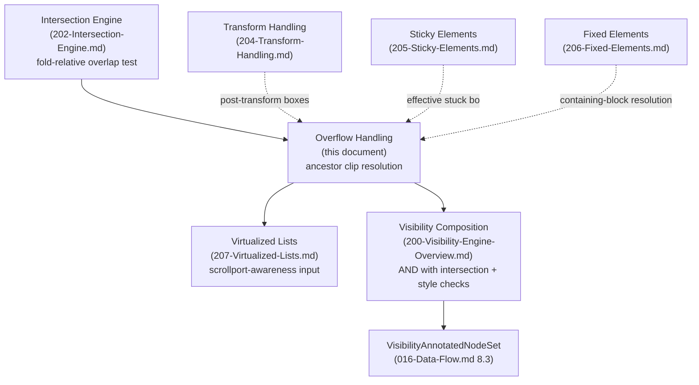
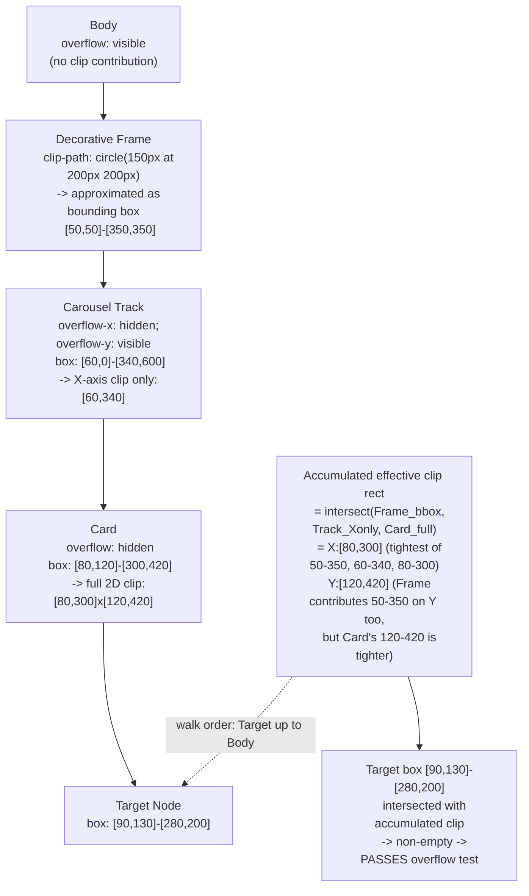
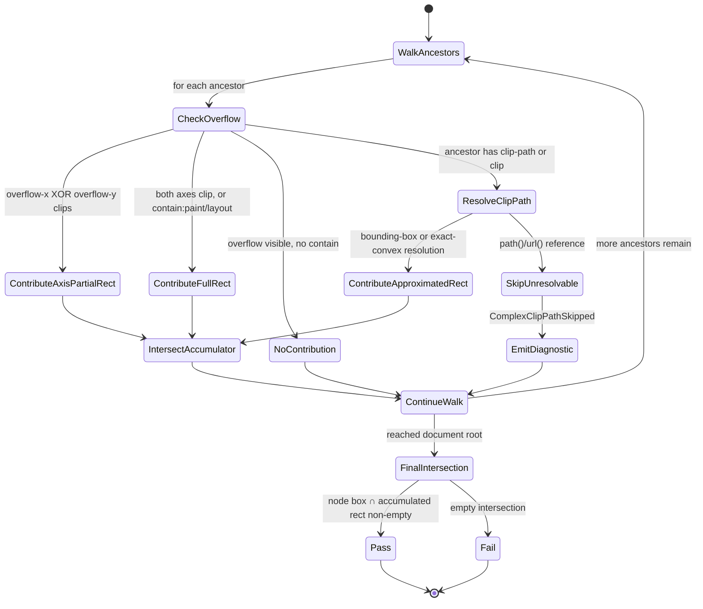

# 203 — Overflow Handling

## 1. Title

**Critical CSS Extraction Engine — Overflow Handling: Ancestor-Chain Clip Resolution, `clip-path` Approximation, and Scrollable-Container Offset Accounting**

## 2. Version

| Field | Value |
|---|---|
| Document Version | 1.0.0 |
| Status | Accepted |
| Last Updated | 2026-07-09 |
| Owners | Visibility Engine Working Group |
| Stability | Stable (Phase 4 design document; changes to the clip-resolution contract require RFC, since [200-Visibility-Engine-Overview.md](./200-Visibility-Engine-Overview.md), [205-Sticky-Elements.md](./205-Sticky-Elements.md), [206-Fixed-Elements.md](./206-Fixed-Elements.md), and [207-Virtualized-Lists.md](./207-Virtualized-Lists.md) all depend on it) |

## 3. Purpose

[202-Intersection-Engine.md](./202-Intersection-Engine.md) Section 8.5 draws an explicit scope boundary: its fold-relative rectangle test answers whether a node's *rendered position* overlaps the page's above-the-fold band, but it deliberately does not answer whether that node is actually *painted* at that position — a node can pass every geometric test in that document and still be entirely invisible to a real user because some ancestor between it and the document root clips it out via `overflow: hidden`, `overflow: scroll`/`auto` with the node scrolled outside the container's visible window, or a `clip-path`/`clip` region that excludes the node's box. BRIEF.md Section 2.5's Visibility Detection algorithm treats "intersects viewport/fold" as one conjunct among several, but it does not, on its own, capture the fact that intersection is a *necessary* rather than *sufficient* condition for real-world visibility once a document has more than one level of nested, potentially-scrolling, potentially-clipping containers — which essentially every production page does (sticky headers, modal dialogs, carousels, accordion panels, `overflow: hidden` card containers used purely for rounded-corner clipping, and virtualized-list viewports are all instances of the same underlying phenomenon).

This document is the authority for that gap. It specifies: (1) how to walk a node's ancestor chain and compute the *effective clip rectangle* imposed by every ancestor whose computed `overflow`/`overflow-x`/`overflow-y` is not `visible`, intersecting each ancestor's own clip contribution into a single running rectangle; (2) how `clip-path` (and the legacy `clip` property) narrow that effective clip region further, including this document's chosen approximation strategy for `clip-path`'s geometric shapes (`circle()`, `ellipse()`, `polygon()`, `inset()`) against the alternative of exact polygon-clipping math; (3) how a scrollable ancestor's current scroll offset (`scrollTop`/`scrollLeft`) must be accounted for separately from its clip rectangle, since a node can be geometrically positioned within a scrollable container's visible viewport-relative box while still being outside that *container's own* scrolled content window; and (4) the distinction between `overflow: clip` and `overflow: hidden` — nearly identical in their clipping effect but subtly different in that the former does not establish a scrollport (and therefore does not respond to `scroll-*` properties, programmatic scrolling, or scroll-snap participation the way `hidden` and `scroll`/`auto` do), a difference this document's model must not silently erase.

## 4. Audience

- Implementers of the Visibility Engine's overflow sub-module (`packages/collector`, alongside [201-Geometry-Engine.md](./201-Geometry-Engine.md) and [202-Intersection-Engine.md](./202-Intersection-Engine.md)), who will write the pure, host-side function that consumes a node's ancestor chain (already captured in the `DomSnapshot`, per [106-DOM-Snapshot.md](./106-DOM-Snapshot.md)) and produces a clip verdict.
- Implementers of [200-Visibility-Engine-Overview.md](./200-Visibility-Engine-Overview.md), which composes this document's clip verdict with [202-Intersection-Engine.md](./202-Intersection-Engine.md)'s fold-intersection verdict and the style-based `display`/`visibility`/`opacity` checks into one final visibility decision.
- Implementers of [204-Transform-Handling.md](./204-Transform-Handling.md), [205-Sticky-Elements.md](./205-Sticky-Elements.md), and [206-Fixed-Elements.md](./206-Fixed-Elements.md), each of which must reason about how this document's ancestor-chain clip walk interacts with a transformed, stuck, or fixed-position ancestor whose own clip contribution is not simply its static `boundingBox`.
- Implementers of [207-Virtualized-Lists.md](./207-Virtualized-Lists.md), for whom this document's scrollable-container-offset accounting (Section 8.4) is a close structural cousin of — but not a substitute for — that document's concern with items that never entered the DOM at all.
- Configuration schema authors exposing `clipPathApproximationMode` (Section 8.3) to end users, and Reporter/diagnostics authors who need to understand what a `ClippedByAncestorDiagnostic` or `ClipPathApproximated` diagnostic means when it appears in an extraction trace.

Readers should already understand [202-Intersection-Engine.md](./202-Intersection-Engine.md)'s fold-relative rectangle test in full, since this document explicitly picks up exactly where that document's Section 8.5 leaves off, and should have working familiarity with the CSS Overflow Module (`overflow`, `overflow-x`/`overflow-y`, `overflow: clip`, scrollport formation) and the CSS Shapes / Masking specifications governing `clip-path`.

## 5. Prerequisites

- [202-Intersection-Engine.md](./202-Intersection-Engine.md) Section 8.5 (Nested Scroll Containers) — the explicit scope boundary and forward reference this document resolves.
- [106-DOM-Snapshot.md](./106-DOM-Snapshot.md) Section 8.2 (What Is Captured Per Node) — this document depends on the `boundingBox` and the allow-listed computed-style properties (`overflow`, `overflow-x`, `overflow-y`, `contain`) already captured per node, and on `parentNodeId`/`childNodeIds` for ancestor-chain traversal.
- [201-Geometry-Engine.md](./201-Geometry-Engine.md) — supplies coordinate-space-normalized boxes; this document assumes normalization has already occurred, exactly as [202-Intersection-Engine.md](./202-Intersection-Engine.md) does.
- [006-Design-Principles.md](../architecture/006-Design-Principles.md) Principle 1 (Browser Is Source of Truth) and Principle 3 (Correctness Over Premature Optimization) — this document's approximation strategy for `clip-path` (Section 8.3) is a direct, explicit application of Principle 3's requirement that any approximation be additive, benchmarked, and toggleable against a correctness-preserving baseline.
- [200-Visibility-Engine-Overview.md](./200-Visibility-Engine-Overview.md) — the umbrella composition document this module's clip verdict feeds into.
- Familiarity with the CSS Overflow Module Level 3/4 (`overflow`, scrollport formation, `overflow: clip`) and CSS Masking Level 1 (`clip-path`, basic shapes: `inset()`, `circle()`, `ellipse()`, `polygon()`) specifications.

## 6. Related Documents

- [200-Visibility-Engine-Overview.md](./200-Visibility-Engine-Overview.md) — composes this document's clip verdict with intersection and style checks.
- [201-Geometry-Engine.md](./201-Geometry-Engine.md) — upstream coordinate normalization this document's boxes assume.
- [202-Intersection-Engine.md](./202-Intersection-Engine.md) — upstream, complementary fold-intersection test; Section 8.5 of that document forward-references this one.
- [204-Transform-Handling.md](./204-Transform-Handling.md) — a transformed ancestor's clip contribution must itself be expressed in post-transform coordinates, a dependency this document's ancestor walk takes as an upstream input.
- [205-Sticky-Elements.md](./205-Sticky-Elements.md) — a sticky ancestor's effective clip-relevant position can differ from its captured, unstuck `boundingBox`.
- [206-Fixed-Elements.md](./206-Fixed-Elements.md) — a `position: fixed` node escapes the normal containing-block chain, which changes which ancestors' `overflow` are even relevant to it (Section 8.6).
- [207-Virtualized-Lists.md](./207-Virtualized-Lists.md) — a related but distinct failure mode (absence from the DOM, not clipping of a present node).
- [106-DOM-Snapshot.md](./106-DOM-Snapshot.md) — per-node ancestor linkage and allow-listed computed-style capture this document's walk consumes.
- [006-Design-Principles.md](../architecture/006-Design-Principles.md) — Principles 1, 3, 5, 6.
- BRIEF.md Section 2.5 (Visibility Detection) — the authoritative requirement source.
- CSS Overflow Module Level 3/4 — governs `overflow`, `overflow: clip`, scrollport semantics.
- CSS Masking Level 1 — governs `clip-path`, basic shapes, and the deprecated `clip` property.

## 7. Overview

The Overflow Handling module answers one question, for exactly one `(DomNodeRecord, ViewportProfile)` pair, given that [202-Intersection-Engine.md](./202-Intersection-Engine.md) has already determined the node's rendered box overlaps the page's above-the-fold band: **is this node actually painted at that position, or does some ancestor's overflow box, `clip-path`, or `clip` region clip it out entirely (or partially) before it reaches the screen?** It is the second of the two complementary tests [202-Intersection-Engine.md](./202-Intersection-Engine.md) Section 8.5 identifies as jointly necessary for genuine above-the-fold visibility, and [200-Visibility-Engine-Overview.md](./200-Visibility-Engine-Overview.md) composes both as a logical AND.

Four design decisions dominate this document:

1. **Ancestor-chain clip resolution is a running-intersection accumulation, not a per-ancestor independent check.** A node is visible through a stack of nested overflow containers only if it survives the intersection of *every* ancestor's clip contribution, not merely the nearest one — a node can be fully within its immediate parent's overflow box while its grandparent's, narrower, box excludes it. Section 8.1 specifies this as a single accumulating rectangle intersection walked from the node up to the document root, mirroring the same "closest match wins locally, but every level constrains the final result" structure `getBoundingClientRect()` itself implicitly encodes for a non-clipped node's on-screen position.
2. **`clip-path` is resolved via an approximation strategy — a conservative bounding-box (or, for a documented subset of simple shapes, exact geometry) — not via general polygon-clipping mathematics.** Exact `clip-path` intersection for `polygon()` shapes is a nontrivial computational-geometry problem (general polygon-vs-rectangle clipping, e.g., Sutherland–Hodgman); this document chooses a tiered approximation strategy (Section 8.3) that is exact for axis-aligned shapes (`inset()`), exact-enough for simple convex shapes with a documented conservative fallback (`circle()`, `ellipse()`), and deliberately conservative (bounding-box only, never excluding a true partial match) for arbitrary `polygon()` — a direct, explicit instance of Principle 3's "additive, benchmarked, provably-equivalent-or-explicitly-conservative" discipline.
3. **Scrollable-ancestor offset is accounted for as a distinct sub-problem from clip-rectangle intersection, not folded into the same computation.** A scrolling container's clip *rectangle* (its own border-box, or padding-box under most browsers' scrollport definition) is fixed and viewport-relative; its *scroll offset* determines which portion of its (potentially much larger) content is currently positioned inside that fixed rectangle. Because `getBoundingClientRect()` already reports each descendant's on-screen position *after* all ancestor scroll offsets have been applied (per [202-Intersection-Engine.md](./202-Intersection-Engine.md) Section 8.5's own observation), this document's ancestor-chain walk does not need to separately re-derive scroll offsets to position a node — but it must still separately verify that a node's on-screen position falls within its scrolling ancestor's *current* scrollport rectangle, since a large scroll offset can position a node's rendered box entirely outside that rectangle even though the rendered box itself is computed correctly.
4. **`overflow: clip` and `overflow: hidden` produce the same clip-rectangle contribution to this document's algorithm, but are tagged with a distinct scrollport-formation flag that downstream consumers must respect.** Both prevent overflowing content from painting outside the container's box; `overflow: clip` additionally does not create a scrollport at all (no `scrollTo()`, no scrollbar, no `scroll` event, no scroll-snap participation), which matters to [207-Virtualized-Lists.md](./207-Virtualized-Lists.md) (a virtualization library relying on scroll events to swap rendered items cannot function inside an `overflow: clip` container, so `overflow: clip` container content is presumptively fully-rendered, not windowed) and to this document's own scroll-offset accounting (Section 8.4), which is a no-op for `overflow: clip` ancestors since they are, by definition, never scrolled.

## 8. Detailed Design

### 8.1 Ancestor-Chain Clip Rectangle Accumulation

**The model.** Starting from a candidate node `N` and walking `parentNodeId` links (per [106-DOM-Snapshot.md](./106-DOM-Snapshot.md) Section 8.2) up to the document root, every ancestor `A` whose computed `overflow`/`overflow-x`/`overflow-y` is not `visible` (i.e., `hidden`, `scroll`, `auto`, or `clip`) contributes a **clip rectangle** — `A`'s own rendered box, per its captured `boundingBox` — that the node's effective visible region must lie within. The accumulated effective clip rectangle after walking the full ancestor chain is the intersection of every contributing ancestor's clip rectangle:

```
effectiveClipRect = intersect(ancestor_1.clipRect, ancestor_2.clipRect, ..., ancestor_k.clipRect)
```

where `ancestor_1` is the nearest clipping ancestor and `ancestor_k` is the outermost. A node's final visibility-relevant box is then the intersection of its own `boundingBox` with `effectiveClipRect`; if that intersection is empty (zero area), the node is entirely clipped and fails this document's test regardless of what [202-Intersection-Engine.md](./202-Intersection-Engine.md) already concluded about fold intersection.

**Why intersection, not "nearest clipping ancestor wins."** A design that stopped at the nearest `overflow`-non-`visible` ancestor and ignored ancestors further up the chain would be unsound: consider a node fully within a 400×400px `overflow: hidden` inner card, itself positioned near the bottom-right corner of a 200×200px `overflow: hidden` outer container — the inner card's own clip rectangle does not exclude the node, but the outer container's does, and only the outer container's clip is actually paint-relevant to a real browser (browsers clip against every ancestor's overflow box simultaneously; painting is unaffected by which ancestor "is closer"). Stopping early would produce false-positive visibility verdicts for a real, common nested-container pattern (cards inside a clipped carousel track inside a clipped viewport, itself a three-deep chain in many carousel implementations).

**Why border-box, not padding-box, is used as the default clip-contributing rectangle.** The CSS Overflow specification technically defines the scrollport (and, by close analogy, the clipping box for non-scrolling `overflow: hidden`/`clip`) at the padding edge, not the border edge, meaning a border-width's worth of content technically could paint into the border area in some browser implementations under specific `overflow`/`border` combinations. This document defaults to the ancestor's full `boundingBox` (border-box, as captured by `getBoundingClientRect()`, per [106-DOM-Snapshot.md](./106-DOM-Snapshot.md) Section 8.2) as a deliberate, documented simplification rather than additionally capturing and subtracting each ancestor's border-width — the border-width discrepancy is sub-pixel-to-few-pixel in the overwhelming majority of real layouts and affects only content positioned in that narrow band, which is a Principle 3 "correctness over premature optimization" tradeoff made in the opposite direction from usual: here, the *simpler* model is chosen because the *more precise* model's benefit is judged negligible relative to its added per-ancestor capture cost (would require adding four more allow-listed computed-style properties per [106-DOM-Snapshot.md](./106-DOM-Snapshot.md) Section 8.2's capture list — `border-top-width`, `border-right-width`, `border-bottom-width`, `border-left-width` — solely for this edge case). This is flagged explicitly in Edge Cases and Future Work rather than silently assumed away.

**`contain: paint` and `contain: layout` as an additional, narrower clip source.** The CSS Containment specification's `contain: paint` establishes a clip boundary at the element's own padding-box independent of its `overflow` value — an element with `contain: paint` but `overflow: visible` still clips its descendants' paint at its own box, a case this document's ancestor walk must check `contain` (already an allow-listed captured property per [106-DOM-Snapshot.md](./106-DOM-Snapshot.md) Section 8.2) for, not merely `overflow`, or it will systematically under-clip content beneath a `contain: paint` ancestor whose author relied on `contain` rather than `overflow: hidden` specifically to get clipping without also creating a new stacking/scroll context.

### 8.2 Determining Which Ancestors Are "Clipping" Ancestors

An ancestor `A` contributes a clip rectangle to the walk in Section 8.1 if and only if:

```
A.computedOverflowX in {hidden, scroll, auto, clip}
  OR A.computedOverflowY in {hidden, scroll, auto, clip}
  OR A.computedContain includes "paint" or "layout"
```

**Why `overflow-x`/`overflow-y` are checked independently rather than only the shorthand `overflow`.** An ancestor with `overflow-x: hidden; overflow-y: visible` (a common pattern for horizontally-scrolling carousels that must not clip vertically-overflowing tooltips or dropdowns) clips only along one axis — this document's clip-rectangle contribution for such an ancestor must therefore itself be axis-partial: clamped on the X axis to the ancestor's box, but *unbounded* (extending to positive/negative infinity, effectively a no-op) on the Y axis. Modeling the shorthand `overflow` alone (which [106-DOM-Snapshot.md](./106-DOM-Snapshot.md) Section 8.2 also captures, but which the browser itself resolves into the two longhands for actual clipping behavior) would incorrectly clip both axes whenever either longhand requires clipping, producing false-negative visibility verdicts for the extremely common horizontal-carousel-with-vertical-overflow pattern.

**One notable, browser-observable subtlety: an ancestor with exactly one of `overflow-x`/`overflow-y` set to a clipping value and the other `visible` computes to `auto` (not `visible`) for the `visible` axis per the CSS Overflow specification's "if one is set to something other than visible, the other computes to auto" rule.** This document's captured `computedOverflowX`/`computedOverflowY` values, being read via `getComputedStyle()` per [106-DOM-Snapshot.md](./106-DOM-Snapshot.md) Section 8.2, already reflect this browser-resolved computed value (not the author's literal specified value) — a direct benefit of Principle 1: the engine never has to re-implement this specification rule itself, because the browser has already resolved it before this document's algorithm ever reads the value.

### 8.3 `clip-path` and `clip`: Approximation Strategy

**The problem.** `clip-path: polygon(...)` (and, more restrictively, `circle()`, `ellipse()`, `inset()`) defines an arbitrary geometric clip region on the element it is applied to (not, unlike `overflow`, specifically a clip on that element's *descendants*'s overflow — `clip-path` clips the element's own painted content, including itself, to the specified shape). Determining whether a target node's rectangular `boundingBox` genuinely, exactly intersects an ancestor's (or the node's own) `polygon()`-shaped clip region is a general rectangle-vs-polygon intersection problem — solvable exactly (e.g., via Sutherland–Hodgman clipping followed by an area computation), but nontrivial to implement correctly, and disproportionate in engineering cost relative to this module's actual purpose, which is a coarse-grained "is this node's critical CSS worth including" decision, not a pixel-accurate renderer.

**The chosen strategy: a three-tier approximation, exact where cheap, conservative where expensive.**

| `clip-path` shape function | Resolution strategy | Exactness |
|---|---|---|
| `inset(top right bottom left [round radius])` | Resolve directly to an axis-aligned rectangle (ignoring the optional `round` corner-radius term for the *clip test*, though not for rendering) and intersect exactly as an ordinary clip rectangle, per Section 8.1's model | Exact for the rectangular region; the rounded-corner shaving is ignored, a deliberately conservative simplification (see below) |
| `circle(radius at cx cy)` / `ellipse(rx ry at cx cy)` | Resolve to the shape's own axis-aligned bounding box (the smallest rectangle fully containing the circle/ellipse) and intersect that bounding box as the clip rectangle | Conservative (over-inclusive): a node's box can intersect the bounding box while never actually intersecting the circle/ellipse itself (e.g., a node entirely in one of the bounding box's four corners, outside the inscribed circle) |
| `polygon(x1 y1, x2 y2, ...)` | Resolve to the polygon's own axis-aligned bounding box (min/max of all vertex coordinates) and intersect that bounding box as the clip rectangle | Conservative (over-inclusive), for the same reason as `circle()`/`ellipse()`, generally with a wider margin of over-inclusion for highly non-convex or star-shaped polygons |
| `clip: rect(top, right, bottom, left)` (legacy, deprecated property, `position: absolute`/`fixed` elements only) | Resolve directly to an axis-aligned rectangle, intersected exactly | Exact |
| `path(...)` / `url(#svg-clip-path)` (SVG-referenced clip paths) | Not resolved geometrically at all; treated as a **non-clipping** ancestor for this document's purposes, with a `ComplexClipPathSkipped` diagnostic emitted | Deliberately unresolved (see below) |

**Why conservative-bounding-box, and never the reverse (aggressive/under-inclusive), for `circle()`/`ellipse()`/`polygon()`.** Per [006-Design-Principles.md](../architecture/006-Design-Principles.md) Principle 6's fail-fast, err-toward-inclusion posture (already established as the governing default in [202-Intersection-Engine.md](./202-Intersection-Engine.md) Section 8.4's `visibilityThreshold` default), an approximation that occasionally treats a genuinely-clipped node as visible (over-inclusion, resulting in a slightly larger critical CSS payload than strictly necessary) is the correct failure direction for this engine's stated worse-failure-mode ranking: an over-inclusive approximation cannot cause a FOUC-triggering omission, while an under-inclusive approximation (e.g., naively testing only the shape's centroid, or an inscribed rather than bounding rectangle) risks excluding a node's CSS that a real user does, in fact, see through a `clip-path`'s visible region — a strictly worse outcome. The bounding-box approximation is provably conservative in this sense for all CSS Masking Level 1 basic shapes, because every basic shape function's rendered region is, by construction, a subset of its own axis-aligned bounding box.

**Why `path()`/`url()`-referenced SVG clip paths are not resolved at all, rather than approximated.** An SVG `<clipPath>` element can itself be arbitrarily complex — nested shapes, `<use>` references, its own `clipPathUnits` coordinate system, potential animation — and computing even a bounding-box approximation would require the Collector to additionally traverse into SVG DOM structure and resolve SVG geometry, a distinct and substantially larger scope than this document's CSS-clip-path-focused algorithm. Rather than silently under-approximating (which risks the wrong failure direction per the paragraph above) or over-engineering a full SVG geometry resolver for a comparatively rare case, this document explicitly treats an ancestor with an unresolvable `path()`/`url()` clip-path as **contributing no clip at all** — the maximally conservative, always-inclusion-safe choice — while emitting a `ComplexClipPathSkipped` diagnostic (per [006-Design-Principles.md](../architecture/006-Design-Principles.md) Principle 6) so the gap is visible and attributable, not silently absorbed. A future, opt-in SVG-aware resolution mode is tracked in Future Work.

**Configurability: `clipPathApproximationMode`.** Because the bounding-box approximation for `circle()`/`ellipse()`/`polygon()` is *provably* over-inclusive but not exact, a configuration flag `clipPathApproximationMode: "bounding-box" | "exact-convex"` is exposed. The default, `"bounding-box"`, applies the table above uniformly. An opt-in `"exact-convex"` mode additionally resolves `circle()` and `ellipse()` exactly (both are convex, closed-form shapes for which an exact rectangle-vs-ellipse intersection test is cheap and well-known — testing whether any of a rectangle's four corners or edge-midpoints lie within the ellipse, plus the ellipse's own bounding-box overlap, is sufficient for a conservative-but-tighter exact test) while still falling back to bounding-box approximation for `polygon()`, whose exact rectangle-intersection test (general polygon clipping) remains the more expensive, not-yet-implemented tier — a design left as an explicit extension point (Future Work) rather than implemented in the initial version, per Principle 3's "additive" requirement: `"bounding-box"` remains the correctness-preserving-by-conservative-approximation default baseline against which `"exact-convex"` is benchmarked and validated before broader adoption.

### 8.4 Scrollable-Ancestor Offset Accounting

**The problem restated precisely.** [202-Intersection-Engine.md](./202-Intersection-Engine.md) Section 8.5 already establishes that `getBoundingClientRect()` reports a node's *current, already-scrolled* rendered position — so a node's `boundingBox` is never wrong about *where on screen* the node currently is, accounting for every ancestor's current scroll offset automatically, because that is simply what the browser's live layout produces. What Section 8.5 of that document explicitly leaves unresolved, and this document now resolves, is: given that correctly-scrolled position, is the node's rendered box also within its scrolling ancestor's *own clip rectangle* (Section 8.1) — i.e., is the node scrolled into the visible window of its container, or has the container's current scroll offset positioned the node outside that window (off the top, bottom, left, or right of the container's own fixed-size viewport)?

**Why this reduces to Section 8.1's ordinary clip-rectangle intersection, with no separate scroll-offset arithmetic required.** This is the key simplifying insight of this section: because `getBoundingClientRect()` already bakes in scroll offset for both the node and every scrolling ancestor between it and the viewport, a node scrolled out of its container's visible window has, definitionally, a rendered `boundingBox` that lies outside that container's own rendered `boundingBox` (the container's box does not move when its *content* scrolls — only the content's rendered position shifts). Section 8.1's ordinary ancestor-chain clip-rectangle intersection therefore *already* correctly excludes such a node, with zero additional scroll-specific logic: the scrolled-out list item's `boundingBox.y`, say, becomes large and negative or positions the item entirely below the container's own bottom edge, which fails the intersection test against the container's clip rectangle exactly as an `overflow: hidden`-clipped, non-scrolled node would. This document therefore does **not** introduce a separate "scroll offset accounting" algorithm distinct from Section 8.1's clip-rectangle walk — the walk, applied uniformly to every `overflow: hidden | scroll | auto | clip` ancestor regardless of whether that ancestor happens to currently be scrolled, already subsumes the scrollable-container case as a special instance of the general ancestor-clip problem.

**What this section's real contribution is, then: identifying that "scrollable ancestor" is not a structurally distinct case requiring its own algorithm, only a semantically distinct scenario worth naming explicitly** (for diagnostics, documentation, and Edge Cases purposes) because operators and future implementers, on first encountering this problem, tend to assume a separate scroll-offset-subtraction step is needed — a natural but incorrect intuition this document exists partly to correct. The one genuine subtlety this insight does *not* cover is captured in Section 12's Edge Cases: a snapshot captured at a *non-default* scroll position (per [106-DOM-Snapshot.md](./106-DOM-Snapshot.md)'s general invariant of capturing at the initial, unscrolled top-level page position, which says nothing about the initial scroll position of *nested* scrollable containers, which may not default to zero if, e.g., a page restores a previously-scrolled carousel position from `sessionStorage` before the snapshot is taken) changes what "visible above the fold" means for that container's content at capture time — this document faithfully reports what was actually rendered at capture time, per Principle 1, and does not attempt to normalize nested-container scroll position to a canonical "as if freshly loaded" state.

**`overflow: clip` ancestors are never scrolled, by definition, so this section is a no-op for them.** An `overflow: clip` container has no scrollport (Section 8.5) and therefore no `scrollTop`/`scrollLeft` state that can differ from zero — its clip-rectangle contribution (Section 8.1) is static for the lifetime of the page (barring layout changes that resize the container itself), which is one of the two concrete, algorithmically-relevant consequences of the `clip`/`hidden` distinction this document must preserve (the other being [207-Virtualized-Lists.md](./207-Virtualized-Lists.md)'s virtualization-compatibility consequence, Section 8.5 below).

### 8.5 `overflow: clip` vs. `overflow: hidden`: The Scrollport Distinction

Both `overflow: hidden` and `overflow: clip` prevent a container's overflowing content from painting outside its box — for the purposes of Section 8.1's clip-rectangle contribution, **they are treated identically**: both are members of the "clipping ancestor" set in Section 8.2's condition, and both contribute the same clip-rectangle geometry (the container's own `boundingBox`). Where they diverge, and where this document's data model must preserve the distinction rather than collapsing it, is in **scrollport formation**:

- `overflow: hidden` establishes a scrollport that is programmatically scrollable (`element.scrollTo()`, `element.scrollTop = n` both work and move the visible content window) even though no scrollbar is rendered and no user-initiated scroll gesture (wheel, touch, keyboard) is honored by default. This means an `overflow: hidden` container's content *can* be, and often is, deliberately scrolled by JavaScript (a common pattern for custom-styled "scrollable" regions that hide the native scrollbar while implementing their own scroll UI, or for programmatic carousel/slider implementations that never expose native scroll affordances at all).
- `overflow: scroll`/`overflow: auto` establish a scrollport that is both programmatically and (depending on device/input method and `auto`'s content-overflow condition) user-scrollable via native browser affordances.
- `overflow: clip` establishes **no scrollport at all** — `scrollTo()`/`scrollTop` assignment on a `overflow: clip` container is a no-op (per the CSS Overflow Level 3 specification), there is no scroll-snap participation, and no `scroll` event ever fires for it. Content beyond the container's box is simply never reachable by any scrolling mechanism; it is clipped, permanently and unconditionally, exactly at whatever position it laid out to.

**Why this document tags this distinction (`establishesScrollport: boolean`) on the clip-rectangle record rather than treating it as a cosmetic detail.** [207-Virtualized-Lists.md](./207-Virtualized-Lists.md) (forward-referenced) needs to know whether a given clipping container is a genuine, scroll-driven virtualization viewport (implying its off-screen children may be entirely absent from the DOM, requiring that document's distinct handling) or a static, `overflow: clip`-based visual-clipping container with no such possibility (implying any content not currently painted is guaranteed to be a pure clip-rectangle exclusion of an otherwise-fully-rendered subtree, resolvable entirely by this document's Section 8.1 algorithm with no risk of missing DOM nodes at all). Collapsing the two into one undifferentiated "clipping ancestor" concept would force that document to conservatively assume virtualization risk even beneath containers where it is structurally impossible, which is unnecessarily conservative and would degrade the precision of that document's own diagnostics.

### 8.6 Interaction with `position: fixed` and `position: sticky` Ancestors

A `position: fixed` element's containing block is the initial containing block (viewport) or, per newer specification behavior, the nearest ancestor with a `transform`, `filter`, `will-change`, or similarly containing-block-establishing property — but critically, **a `position: fixed` element is never clipped by an ordinary ancestor's `overflow: hidden`/`scroll`/`auto`/`clip` unless that ancestor is also the fixed element's actual containing block** (i.e., unless that ancestor itself establishes a new containing block via one of the properties above). This document's ancestor-chain walk (Section 8.1) must therefore stop accumulating clip contributions from *ordinary* (non-containing-block-establishing) overflow ancestors once it crosses a `position: fixed` node walking upward, and resume only from that node's actual containing-block ancestor onward — walking the full literal DOM-parent chain unconditionally, as a naive implementation of Section 8.1 might, would incorrectly clip fixed-position content (a fixed header, a fixed "back to top" button) against `overflow: hidden` containers the real browser's rendering never clips it against at all. [206-Fixed-Elements.md](./206-Fixed-Elements.md) owns the full specification of which ancestors qualify as a fixed element's containing block; this document's walk defers to that document's containing-block resolution as an input, applying Section 8.1's ordinary intersection logic only to the ancestors that resolution identifies as actually clip-relevant.

A similar, narrower caveat applies to `position: sticky`: while stuck, a sticky element's effective on-screen position differs from its unstuck flow position, but its clip relationship to ancestors *other than* its own nearest scrolling ancestor is otherwise ordinary — [205-Sticky-Elements.md](./205-Sticky-Elements.md) supplies this document with the sticky element's currently-effective `boundingBox` (stuck or unstuck, as applicable) as an upstream input, and this document's Section 8.1 walk operates on that already-resolved box without any sticky-specific logic of its own, a clean and deliberate division of responsibility consistent with [006-Design-Principles.md](../architecture/006-Design-Principles.md) Principle 4.

## 9. Architecture

### 9.1 Overflow Handling's Position in the Visibility Pipeline



This diagram places Overflow Handling immediately downstream of the Intersection Engine (consistent with [202-Intersection-Engine.md](./202-Intersection-Engine.md) Section 9.1's own diagram, which shows the identical arrow in the opposite direction), and shows it as both a consumer of Transform/Sticky/Fixed-resolved boxes and a supplier of scrollport-awareness information to Virtualized Lists — a document that itself sits, chronologically, earlier in the pipeline (a virtualized list's absent-item problem is a DOM Collection-time concern) but depends on this document's `establishesScrollport` classification (Section 8.5) to interpret what it finds.

### 9.2 Ancestor-Chain Clip Accumulation — Worked Example

The following diagram shows a concrete four-level nesting: a target node inside a `overflow: hidden` card, inside a horizontally-scrolling `overflow-x: hidden; overflow-y: visible` carousel track, inside a `clip-path: circle(...)` decorative frame, inside the page body — illustrating how each level narrows the accumulated clip rectangle, and where the circle's bounding-box approximation (Section 8.3) enters the computation.



This example deliberately combines all three mechanisms this document specifies — an axis-partial `overflow-x`-only clip (the carousel track), a full two-dimensional `overflow: hidden` clip (the card), and a `clip-path` bounding-box approximation (the decorative frame) — accumulating correctly into a single tightest-common rectangle via repeated intersection, exactly as Section 8.1 specifies, regardless of the order in which the three distinct clip *sources* (overflow, contain, clip-path) happen to occur along the ancestor chain.

### 9.3 Clip Resolution State Flow



## 10. Algorithms

### 10.1 Algorithm: Ancestor-Chain Clip Rectangle Resolution

**Problem statement.** Given a target node's ancestor chain (from `[106-DOM-Snapshot.md](./106-DOM-Snapshot.md)`'s captured `parentNodeId` links) up to the document root, compute the accumulated effective clip rectangle imposed by every clipping ancestor along that chain, and determine whether the target node's own box has a non-empty intersection with it.

**Inputs.** `node: DomNodeRecord`, `ancestors: DomNodeRecord[]` (ordered nearest-to-farthest, resolved by walking `parentNodeId` from `node` to the fragment root, then across `frameId`/`shadowRootId` links per [106-DOM-Snapshot.md](./106-DOM-Snapshot.md) Section 8.3/8.5 where applicable), `clipPathApproximationMode: "bounding-box" | "exact-convex"`.

**Outputs.** `OverflowVerdict { visible: boolean, effectiveClipRect: Rect, clippingAncestorIds: number[], diagnostics: CollectorDiagnostic[] }`.

**Pseudocode.**

```text
function resolveAncestorClip(node, ancestors, clipPathApproximationMode) -> OverflowVerdict:
    accumulated = Rect.INFINITE   // [-Infinity, +Infinity] on both axes
    clippingIds = []
    diagnostics = []

    for ancestor in ancestors:    // nearest to farthest
        contribution = null

        clipsX = ancestor.computedOverflowX in {"hidden", "scroll", "auto", "clip"}
        clipsY = ancestor.computedOverflowY in {"hidden", "scroll", "auto", "clip"}
        containsPaint = "paint" in ancestor.computedContain or "layout" in ancestor.computedContain

        if clipsX or clipsY or containsPaint:
            contribution = Rect.fromBox(ancestor.boundingBox)
            if clipsX and not clipsY and not containsPaint:
                contribution = contribution.unboundedOnAxis("y")
            else if clipsY and not clipsX and not containsPaint:
                contribution = contribution.unboundedOnAxis("x")
            // else: full 2D clip (both axes, or contain:paint/layout, which clips both)

        if ancestor.clipPath is not null:
            clipPathRect = resolveClipPathRect(ancestor.clipPath, ancestor.boundingBox,
                                                clipPathApproximationMode)
            if clipPathRect is UNRESOLVABLE:
                diagnostics.push(ComplexClipPathSkipped(ancestor.nodeId))
            else:
                contribution = (contribution == null) ? clipPathRect
                                                        : intersect(contribution, clipPathRect)

        if ancestor.legacyClipRect is not null:   // deprecated `clip: rect(...)`
            contribution = (contribution == null) ? ancestor.legacyClipRect
                                                    : intersect(contribution, ancestor.legacyClipRect)

        if contribution is not null:
            accumulated = intersect(accumulated, contribution)
            clippingIds.push(ancestor.nodeId)

        if accumulated.isEmpty():
            break   // short-circuit: already fully clipped, no ancestor can un-clip

    nodeRect = Rect.fromBox(node.boundingBox)
    finalIntersection = intersect(nodeRect, accumulated)

    return OverflowVerdict {
        visible: not finalIntersection.isEmpty(),
        effectiveClipRect: accumulated,
        clippingAncestorIds: clippingIds,
        diagnostics: diagnostics
    }
```

**Time complexity.** `O(depth)` per node, where `depth` is the number of ancestors between the node and the document (or fragment) root — each ancestor is visited exactly once, doing `O(1)` work (a constant number of comparisons and one rectangle intersection, itself `O(1)` for axis-aligned rectangles). Across a full pass over `n` nodes in one `DomSnapshot`, naive per-node ancestor walking gives `O(n * depth)`, which Section 10.2 below improves upon.

**Memory complexity.** `O(depth)` transient (the walk itself needs no more than the accumulator and the current ancestor); `O(n)` for the resulting `OverflowVerdict` set across a full snapshot pass.

**Failure cases.** An ancestor chain that cannot be fully resolved because it crosses an `InaccessibleFrameDiagnostic` or `ClosedShadowRootDiagnostic` boundary (per [106-DOM-Snapshot.md](./106-DOM-Snapshot.md) Sections 8.3/8.5) terminates the walk at that boundary — this document treats an unresolvable ancestor boundary conservatively (contributing no further clip beyond that point, i.e., treating everything beyond the boundary as `overflow: visible`), consistent with this document's general "unresolvable is treated as non-clipping" posture (Section 8.3's `path()`/`url()` handling) and Principle 6's requirement that the gap be surfaced (an existing diagnostic from the DOM Collector, not a new one this document introduces) rather than silently causing an incorrect exact-clip assumption.

**Optimization opportunities.** See Section 10.2 (memoization) and Section 14 (Performance) for the dominant practical optimization — reusing a shared-ancestor-prefix's accumulated clip rectangle across sibling/cousin nodes rather than re-walking from scratch per node.

### 10.2 Algorithm: Shared-Prefix Clip Memoization Across a Snapshot

**Problem statement.** Naively applying Section 10.1 independently to every node in a snapshot re-walks and re-intersects the same ancestor chain prefix for every descendant of a given clipping ancestor, which is wasteful: if a container `A` has 500 descendant nodes, `A`'s own clip contribution (and every one of `A`'s own ancestors' contributions) is identical for all 500 and is recomputed 500 times under a naive per-node application of Section 10.1. This algorithm restructures the computation as a single top-down tree traversal that computes each node's accumulated clip rectangle incrementally from its parent's already-computed value.

**Inputs.** `snapshot: DomSnapshot` (with its node tree, per [106-DOM-Snapshot.md](./106-DOM-Snapshot.md) Section 9.1), `clipPathApproximationMode`.

**Outputs.** `Map<nodeId, OverflowVerdict>`.

**Pseudocode.**

```text
function resolveAllClips(snapshot, clipPathApproximationMode) -> Map<nodeId, OverflowVerdict>:
    results = new Map()

    function visit(node, inheritedClipRect):
        // inheritedClipRect is the fully-accumulated clip from all ancestors
        // strictly above `node` (already intersected); computed once by the parent
        // call and passed down, never recomputed from the root for this node.
        ownContribution = computeOwnContribution(node, clipPathApproximationMode)
        effectiveClipRect = (ownContribution == null)
            ? inheritedClipRect
            : intersect(inheritedClipRect, ownContribution)

        nodeRect = Rect.fromBox(node.boundingBox)
        results.set(node.nodeId, OverflowVerdict {
            visible: not intersect(nodeRect, effectiveClipRect).isEmpty(),
            effectiveClipRect: effectiveClipRect,
            clippingAncestorIds: [...],   // accumulated alongside, omitted here for brevity
            diagnostics: [...]
        })

        // The clip rectangle THIS node passes to ITS OWN children is
        // effectiveClipRect further narrowed by this node's own overflow/clip-path
        // contribution as an ancestor-of-its-children (a node can simultaneously
        // be clipped by its ancestors AND itself clip its own descendants).
        childClipRect = effectiveClipRect   // already includes this node's own
                                              // overflow/clip-path contribution,
                                              // since computeOwnContribution covers
                                              // both "this node as a clip target"
                                              // and "this node as a clip source"
                                              // identically (same box, same properties)
        for child in node.children():
            visit(child, childClipRect)

    visit(snapshot.root, Rect.INFINITE)
    return results
```

**Time complexity.** `O(n)` total across the entire snapshot — each node is visited exactly once, and each visit does `O(1)` work (one contribution computation, one or two rectangle intersections), because the expensive part of Section 10.1's walk (accumulating over `depth` ancestors) is replaced by simply reading the already-accumulated value the parent's visit computed and passed down. This is a straightforward tree-DP (dynamic programming over the ancestor-chain structure) reformulation of Section 10.1's per-node recursive definition, exploiting the fact that `effectiveClipRect(node) = intersect(effectiveClipRect(parent), ownContribution(node))` is a strict recurrence with no cross-branch dependencies.

**Memory complexity.** `O(n)` for the result map; `O(depth)` transient recursion-stack depth, identical to Section 10.1's per-node walk, but paid once for the whole snapshot rather than once per node.

**Failure cases.** Identical to Section 10.1 (unresolvable frame/shadow boundaries, unresolvable `clip-path` shapes); this algorithm's tree-DP restructuring does not change any correctness property, only the traversal order and work-sharing.

**Optimization opportunities.** This algorithm already achieves the asymptotically optimal `O(n)` bound (each node must be visited at least once to determine its own visibility, and no node's clip computation can be skipped without knowing its ancestors' contributions, so `O(n)` is a lower bound as well) — the remaining opportunity is purely constant-factor: representing `Rect` as a flat four-number struct rather than an object with method-dispatch overhead, and short-circuiting a subtree's traversal entirely once `effectiveClipRect` becomes empty at some ancestor (every descendant of a fully-clipped-out ancestor is necessarily also fully clipped out, since intersection with an empty rectangle stays empty) — an optimization directly analogous to Section 10.1's per-node early-break, but applied at the subtree level here, potentially skipping large swaths of a deeply-nested, fully-hidden subtree (e.g., a closed accordion panel, a `display: none`-adjacent hidden tab panel that nonetheless has `overflow: hidden` ancestors) in `O(1)` rather than `O(subtree size)`.

## 11. Implementation Notes

- The Overflow Handling module should be implemented as a pure, host-side (Node.js) function operating entirely on already-captured `DomSnapshot` data, identically in spirit to [202-Intersection-Engine.md](./202-Intersection-Engine.md) Section 11's first implementation note — no further `page.evaluate()` round trips are required, since every fact this document's algorithm needs (`boundingBox`, `overflow`/`overflow-x`/`overflow-y`, `contain`, and — pending the extension noted in Section 12 — `clip-path`/`clip`) is either already part of [106-DOM-Snapshot.md](./106-DOM-Snapshot.md) Section 8.2's capture allow-list or must be added to it (see next note).
- **`clip-path` and the legacy `clip` property are not currently in [106-DOM-Snapshot.md](./106-DOM-Snapshot.md) Section 8.2's computed-style allow-list.** This document requires that list to be extended (a coordinated, cross-document change, flagged here rather than silently assumed) to include `clip-path` (captured as its serialized `CSSStyleDeclaration` string value, e.g., `"circle(150px at 200px 200px)"`, parsed host-side by this module rather than in-page, since parsing a CSS function's argument list is bookkeeping over an already browser-serialized string, not selector-matching, and therefore does not implicate [006-Design-Principles.md](../architecture/006-Design-Principles.md) Principle 2) and the legacy `clip` property. Implementers should treat this as a prerequisite change to `106-DOM-Snapshot.md`'s allow-list, landed alongside this module's implementation, not as an independent, optional enhancement.
- The shared-prefix memoization in Section 10.2 should be the default implementation; Section 10.1's per-node walk is retained in this document purely as the clearer specification of *what* the answer means per node, and as the golden-baseline implementation Section 10.2's optimized traversal is tested against (per [006-Design-Principles.md](../architecture/006-Design-Principles.md) Principle 3's "every fast path ships alongside, and is provably equivalent to, a naive-correct baseline").
- `clipPathApproximationMode` should default to `"bounding-box"` in every shipped configuration preset, with `"exact-convex"` available as an explicit opt-in; the Reporter should surface, per extraction run, a count of how many ancestors had their `clip-path` resolved via approximation (as opposed to exactly), so operators evaluating whether the more precise mode is worth enabling for their specific page have concrete, page-specific data rather than having to guess.
- The `establishesScrollport` flag (Section 8.5) should be computed once per clipping ancestor, alongside its clip-rectangle contribution, and included in the `OverflowVerdict.clippingAncestorIds`-adjacent metadata (as a parallel `Map<nodeId, boolean>` or an inline field on each clipping ancestor's own record) so that [207-Virtualized-Lists.md](./207-Virtualized-Lists.md) can consume it without re-deriving `overflow` classification itself.

## 12. Edge Cases

- **Border-box vs. padding-box clip boundary (Section 8.1).** As noted, this document's default clip rectangle is the ancestor's border-box, not its padding-box, which can very slightly over-include content technically clipped within the border's own width under some browser/`overflow`/`border-radius` combinations. This is an accepted, documented, sub-pixel-to-few-pixel-scale imprecision, not a correctness defect at this module's intended granularity (a rule-set inclusion decision, not a pixel-perfect renderer) — flagged in Future Work as a possible refinement, not fixed here.
- **`border-radius` on a clipping ancestor.** A rounded-corner `overflow: hidden` container clips content in its four corners more aggressively than its rectangular border-box would suggest (content positioned exactly in a rounded corner is visually clipped even though it is within the rectangular bounding box). This document's rectangle-based model does not account for `border-radius` at all — treating the clip region as the full rectangular box regardless of corner rounding — which is a deliberate, conservative (over-inclusive, never under-inclusive) simplification consistent with this document's general approximation philosophy (Section 8.3), extended by analogy to `border-radius` even though `border-radius` is not itself one of this document's primary subjects.
- **Ancestors with `overflow: hidden` combined with `will-change: transform` or a currently-applied CSS transition/animation on `clip-path` itself.** A `clip-path` value that is actively animating (a CSS transition or animation targeting the `clip-path` property) has a computed value at capture time that reflects only the instantaneous frame captured, per [104-Rendering-Stabilization.md](../design/104-Rendering-Stabilization.md)'s stabilization gate — this document, like [202-Intersection-Engine.md](./202-Intersection-Engine.md) Section 12's analogous note on general geometry, trusts the single, snapshot-time computed value and makes no attempt to reason about the animation's full value range; a node clipped out at capture time but destined to become visible mid-animation a few hundred milliseconds later is, under this document's model, classified as not-visible at the fold — a known, accepted limitation shared with the broader Visibility Engine's snapshot-time-only design.
- **`overflow: hidden` used purely for block-formatting-context establishment (the classic "clearfix" pattern), with no actual overflowing content.** Such an ancestor technically satisfies Section 8.2's clipping-ancestor condition and contributes a clip rectangle, but since no descendant actually overflows the container's box in this pattern (that is the entire point of the pattern — establishing a BFC to contain floats, not to visually clip anything), the clip contribution is a no-op in practice: the container's box already fully contains all its descendants' boxes by construction, so intersecting against it changes nothing. No special-casing is needed; this is noted only to reassure implementers that this extremely common pattern does not require, and does not receive, any different treatment.
- **`overflow: auto` that is not currently scrolling because content happens to fit.** `overflow: auto` computes identically to `overflow: scroll` for this document's clip-rectangle purposes (both are members of Section 8.2's clipping set) regardless of whether a scrollbar is actually rendered at a given moment — a container whose content currently fits within its box (no scrollbar shown) still, correctly, contributes a clip rectangle equal to its own box, which is a no-op in that moment but must not be skipped, since a later content change (or a different `ViewportProfile`'s different content flow) could make the same container genuinely overflow and clip.
- **A node with `clip-path: none` that inherits a clipping ancestor's `clip-path`.** `clip-path` is not an inherited property per the CSS specification; each node's own `clip-path` computed value is independent of any ancestor's — this document's per-ancestor walk (Section 10.1/10.2) already handles this correctly by construction, since each ancestor's `clipPath` field is read from that ancestor's own captured computed style, never propagated from a parent, but is worth stating explicitly since "inheritance" is a natural (incorrect) first assumption for a property that visually behaves in a chain-like, ancestor-affects-descendant way.
- **Interaction with [207-Virtualized-Lists.md](./207-Virtualized-Lists.md): a clipping ancestor that also happens to be a virtualization viewport.** This document's clip-rectangle resolution is entirely correct and sufficient for the subset of a virtualized list's currently-rendered items (they are real `DomNodeRecord`s with real boxes, and this document's algorithm classifies their visibility relative to the viewport's clip rectangle exactly as it would for any other scrollable container) — what this document cannot address, by design, is the *absence* of not-currently-rendered items from the snapshot entirely, which has nothing to do with clip-rectangle math and is [207-Virtualized-Lists.md](./207-Virtualized-Lists.md)'s exclusive concern.

## 13. Tradeoffs

| Decision | Why | Alternative Considered | Tradeoff Accepted |
|---|---|---|---|
| Ancestor-chain clip modeled as accumulating rectangle intersection, walked once per node (or shared via tree-DP) | Matches how browsers actually composite nested overflow/clip boxes; simple, closed-form, `O(depth)`-or-amortized-`O(1)`-per-node | Stop at nearest clipping ancestor only | Nearest-only is unsound for multi-level nested clipping, a common real-world pattern (cards-in-carousel-in-viewport) |
| `clip-path` resolved via bounding-box approximation by default, exact only for `inset()`/`clip` and optionally `circle()`/`ellipse()` | Avoids implementing general polygon-clipping geometry for a comparatively rare CSS feature relative to `overflow` itself | Exact polygon-vs-rectangle clipping (Sutherland–Hodgman or similar) for all shape functions | Occasional over-inclusion of nodes that are geometrically within a shape's bounding box but outside the shape itself — accepted because over-inclusion is the safe failure direction |
| `path()`/`url()`-referenced SVG clip paths treated as non-clipping, with a diagnostic, rather than approximated | Avoids scope creep into SVG geometry resolution for a narrow case | Bounding-box approximation extended to SVG-referenced paths too | A small number of pages using SVG clip-paths receive no clip contribution from those ancestors at all (maximally conservative, always inclusion-safe, but potentially further over-inclusive than the CSS-shape approximations) |
| Scrollable-ancestor offset accounting folded entirely into ordinary clip-rectangle intersection, with no separate algorithm | `getBoundingClientRect()` already bakes in scroll offset; a separate algorithm would duplicate logic Section 8.1 already provides | A dedicated scroll-offset-subtraction step, independent of clip-rectangle math | None significant — this is a genuine simplification with no correctness cost, only a documentation/explanation cost (the insight must be stated clearly so implementers do not build an unnecessary second mechanism) |
| `overflow: clip` and `overflow: hidden` given identical clip-rectangle contributions but a distinct `establishesScrollport` tag | Preserves the real, spec-defined behavioral difference for downstream consumers ([207-Virtualized-Lists.md](./207-Virtualized-Lists.md)) without duplicating clip logic for the two values | Treat `clip` and `hidden` as fully interchangeable throughout, including for virtualization-risk inference | Slightly more bookkeeping (one extra boolean per clipping ancestor) in exchange for correctly informing a downstream module's own, different concern |
| Default clip rectangle uses ancestor border-box, ignoring border-width and `border-radius` | Avoids capturing four additional per-node style properties for a sub-pixel-to-few-pixel edge case | Padding-box-precise clip rectangle, with border-width subtraction and corner-radius-aware clipping | Small, bounded over-inclusion in the narrow band/corners affected; judged not worth the added capture and computation cost at this module's intended granularity |

## 14. Performance

- **CPU complexity.** Naive per-node application of Section 10.1 is `O(n * depth)` for a full snapshot pass; the shared-prefix tree-DP reformulation in Section 10.2 reduces this to `O(n)` total, the asymptotically optimal bound, and is the recommended default implementation per Section 11.
- **Memory complexity.** `O(n)` for the resulting `OverflowVerdict` map, plus `O(depth)` transient recursion-stack depth during the Section 10.2 traversal — both negligible relative to the `DomSnapshot`'s own geometry/style storage, mirroring [202-Intersection-Engine.md](./202-Intersection-Engine.md) Section 14's analogous accounting.
- **Caching strategy.** No within-run cache beyond the Section 10.2 tree-DP's inherent work-sharing is needed; across runs, this stage's output is, like [202-Intersection-Engine.md](./202-Intersection-Engine.md)'s, entirely subsumed by the [006-Design-Principles.md](../architecture/006-Design-Principles.md) Principle 8 fingerprint-based `ExtractionResult` cache on a cache hit.
- **Parallelization opportunities.** Independent top-level subtrees (e.g., separate same-origin iframe fragments, per [106-DOM-Snapshot.md](./106-DOM-Snapshot.md) Section 8.5) can have Section 10.2's traversal run concurrently across worker threads with zero coordination, since each fragment's clip resolution is fully self-contained; within a single fragment, the tree-DP's parent-before-children data dependency makes fine-grained parallelization across individual nodes unproductive relative to its coordination overhead, though independent sibling subtrees beneath a shared, already-resolved ancestor could in principle be split across threads for very large, wide trees (an implementation-level opportunity, not a change to the algorithm's shape).
- **Incremental execution.** Not independently incremental within this document's scope, for the same reasons stated in [202-Intersection-Engine.md](./202-Intersection-Engine.md) Section 14 — a changed `DomSnapshot` requires a full recomputation, and at `O(n)` total cost this is already cheap enough that finer incrementality is not warranted.
- **Profiling guidance.** The `clip-path` resolution path (Section 8.3) is the one sub-computation in this document with a nontrivial constant factor (parsing a `clip-path` string, computing a bounding box or exact-convex intersection) relative to the otherwise `O(1)`-per-node rectangle-intersection dominant cost — profiling effort, if this module ever shows up as non-negligible in a wall-clock trace, should first check whether an unusually `clip-path`-heavy fixture (a decorative, shape-heavy design system) is driving the cost, before assuming the ancestor-walk itself is the bottleneck.
- **Scalability limits.** `depth` (maximum ancestor-chain length) is the one dimension this document introduces beyond what [202-Intersection-Engine.md](./202-Intersection-Engine.md) already bounds — pathologically deep nesting (hundreds of levels, a known anti-pattern but not impossible in generated markup) would degrade Section 10.1's naive per-node walk toward its `O(depth)` worst case, though Section 10.2's tree-DP reformulation is entirely insensitive to `depth` in its total-cost bound (only in its transient recursion-stack memory), making it the robust choice for pathological-depth fixtures as well as the common case.

## 15. Testing

- **Unit tests.** `resolveAncestorClip` (Section 10.1) and `resolveAllClips` (Section 10.2) should be tested for agreement on identical inputs (a property-based or exhaustive-fixture cross-check, since Section 10.2 is required to be provably equivalent to Section 10.1 per Principle 3), and independently tested against: a single clipping ancestor (full 2D), an axis-partial ancestor (`overflow-x` only), multiple nested clipping ancestors with progressively tighter boxes, a `clip-path: inset()` exact case, a `clip-path: circle()`/`polygon()` bounding-box-approximated case with a known false-positive (node within bounding box but outside the true shape) to confirm the approximation direction is the documented conservative one, a `path()`/`url()` case confirming `ComplexClipPathSkipped` is emitted and no clip is contributed, `contain: paint` without `overflow: hidden`, and `overflow: clip` vs. `overflow: hidden` producing identical clip rectangles but different `establishesScrollport` values.
- **Integration tests.** A real-browser fixture with a deliberately deep nested-overflow structure (mirroring Section 9.2's worked example) should be captured via the full [106-DOM-Snapshot.md](./106-DOM-Snapshot.md)/[202-Intersection-Engine.md](./202-Intersection-Engine.md) pipeline and this module's resolution verified against hand-computed expected clip rectangles and visibility verdicts, confirming the whole chain (capture → geometry → intersection → overflow) agrees, not merely the pure function in isolation.
- **Visual tests.** A fixture with content deliberately positioned partially inside and partially outside various clip-path shapes (circle, polygon) should be screenshotted and cross-checked against this module's verdicts, specifically to catalog and quantify how often the bounding-box approximation's over-inclusion actually occurs on realistic, non-adversarial shapes, informing whether `"exact-convex"` mode adoption guidance should be strengthened.
- **Stress tests.** A fixture with pathologically deep ancestor nesting (hundreds of levels, each a clipping `overflow: hidden` container) should validate that Section 10.2's tree-DP traversal remains linear in total node count and does not regress toward Section 10.1's naive `O(n * depth)` bound; a separate fixture with an extremely wide, shallow tree (many siblings, each with independent `clip-path` shapes) should validate constant-factor `clip-path` resolution cost does not dominate.
- **Regression tests.** Golden-snapshot fixtures pinning known clip-rectangle and visibility outcomes for representative nested-overflow, `clip-path`, and mixed `overflow-x`/`overflow-y` patterns (including the carousel-in-frame-in-body pattern from Section 9.2) should be maintained so any change to the accumulation or approximation logic surfaces as a visible, reviewed diff.
- **Benchmark tests.** Measure wall-clock time for `resolveAllClips` across the `fixtures/enterprise-huge/` category at varying maximum ancestor depth, confirming the `O(n)` bound holds in practice and establishing a baseline [200-Visibility-Engine-Overview.md](./200-Visibility-Engine-Overview.md)'s overall composition benchmark can compare its own overhead against, per [202-Intersection-Engine.md](./202-Intersection-Engine.md) Section 15's analogous benchmark discipline.

## 16. Future Work

- **Padding-box-precise clip rectangles with border-width and `border-radius` awareness**, resolving the two conservative simplifications flagged in Section 8.1 and Edge Cases, gated on capturing four additional border-width computed-style properties (and, for radius-aware clipping, four corner-radius properties plus the added geometric complexity of rounded-rectangle intersection) — deferred because the current rectangular, border-box model is judged sufficient at this module's intended granularity, but tracked as a concrete, well-scoped enhancement if a fixture category ever demonstrates it materially changes extraction correctness.
- **Exact rectangle-vs-polygon clipping for `clip-path: polygon()`**, extending `clipPathApproximationMode`'s `"exact-convex"` tier (currently `circle()`/`ellipse()` only) to arbitrary polygons via a general clipping algorithm (Sutherland–Hodgman or equivalent), benchmarked and validated against the existing bounding-box baseline per Principle 3 before promotion to any default configuration.
- **SVG-referenced (`path()`/`url()`) clip-path resolution**, extending the DOM Collector ([106-DOM-Snapshot.md](./106-DOM-Snapshot.md)) to additionally capture referenced `<clipPath>` SVG geometry and this document to resolve it into an approximated or exact rectangle, closing the currently-unresolved gap flagged in Section 8.3 and surfaced today only via the `ComplexClipPathSkipped` diagnostic.
- **Animated `clip-path`/`overflow` transition awareness**, coordinating with [104-Rendering-Stabilization.md](../design/104-Rendering-Stabilization.md)'s and [202-Intersection-Engine.md](./202-Intersection-Engine.md)'s shared, currently-accepted limitation of trusting only the single snapshot-time computed value — a future capability could sample multiple frames across a known transition/animation duration and take the union of visibility outcomes, at a meaningfully higher capture-cost tradeoff that would need its own RFC.
- **Nested-scrollable-container non-default initial scroll position detection**, flagged in Section 8.4's Edge Cases discussion — a diagnostic (not a behavior change) that flags when a scrollable ancestor's `scrollTop`/`scrollLeft` at capture time is nonzero, so operators can distinguish "this container was captured in its natural, freshly-loaded scroll state" from "this container's visible content at capture time depended on some prior scroll-restoring script," which affects how much confidence to place in that container's descendants' visibility verdicts.
- **Open question: should `establishesScrollport` and clip-rectangle resolution be exposed as public, stable facts on the `VisibilityAnnotatedNodeSet` overlay for the Plugin System's `afterCollection`/`customizeVisibility` hooks**, mirroring the open question [202-Intersection-Engine.md](./202-Intersection-Engine.md) Section 16 raises for `overlapFraction`? Current lean is yes, for the same reason: a plugin implementing custom, product-specific clipping judgment (e.g., "treat modal-dialog-hidden content as critical anyway, since it becomes visible on a common first interaction") needs the raw clip-rectangle facts this document computes, not merely the final composed boolean, to make an informed override — to be formalized alongside [202-Intersection-Engine.md](./202-Intersection-Engine.md)'s analogous open question when [002-Plugin-API.md](../plugins/002-Plugin-API.md) is written.

## 17. References

- [200-Visibility-Engine-Overview.md](./200-Visibility-Engine-Overview.md)
- [201-Geometry-Engine.md](./201-Geometry-Engine.md)
- [202-Intersection-Engine.md](./202-Intersection-Engine.md)
- [204-Transform-Handling.md](./204-Transform-Handling.md)
- [205-Sticky-Elements.md](./205-Sticky-Elements.md)
- [206-Fixed-Elements.md](./206-Fixed-Elements.md)
- [207-Virtualized-Lists.md](./207-Virtualized-Lists.md)
- [106-DOM-Snapshot.md](./106-DOM-Snapshot.md)
- [105-Viewport-Manager.md](./105-Viewport-Manager.md)
- [006-Design-Principles.md](../architecture/006-Design-Principles.md)
- [016-Data-Flow.md](../architecture/016-Data-Flow.md)
- BRIEF.md Section 2.5 (Visibility Detection), Section 2.12 (Diagnostics) — repository root
- CSS Overflow Module Level 3 — `overflow`, scrollport formation — https://www.w3.org/TR/css-overflow-3/
- CSS Overflow Module Level 4 — `overflow: clip` — https://www.w3.org/TR/css-overflow-4/
- CSS Masking Level 1 — `clip-path`, basic shapes — https://www.w3.org/TR/css-masking-1/
- CSS Shapes Module Level 1 — `circle()`, `ellipse()`, `polygon()`, `inset()` geometry definitions — https://www.w3.org/TR/css-shapes-1/
- CSS Containment Module Level 1 — `contain: paint`, `contain: layout` — https://www.w3.org/TR/css-contain-1/
- MDN, `Element.getBoundingClientRect()` — https://developer.mozilla.org/en-US/docs/Web/API/Element/getBoundingClientRect
- Sutherland, I. E., & Hodgman, G. W. (1974). "Reentrant Polygon Clipping." *Communications of the ACM* — the canonical exact polygon-clipping algorithm referenced in Future Work as the candidate for a future exact `polygon()` resolution tier.
