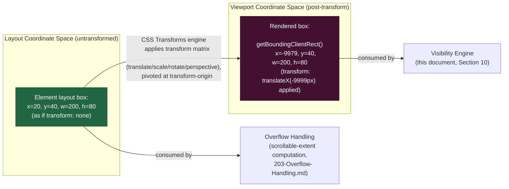
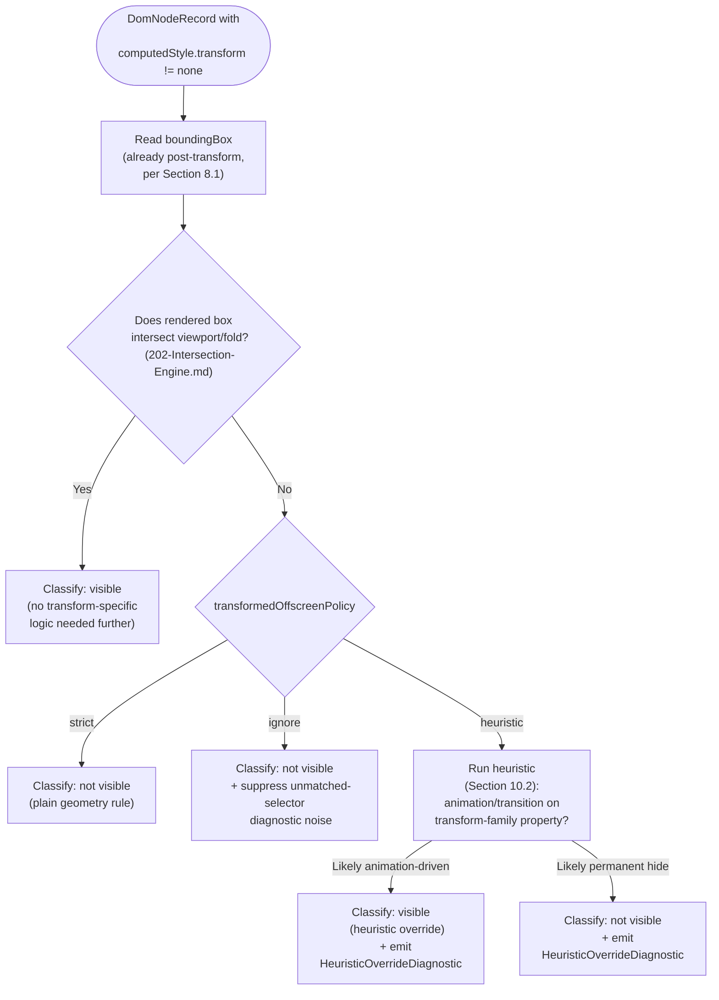

# 204 — Transform Handling

## 1. Title

**Critical CSS Extraction Engine — Visibility Engine: CSS Transform-Aware Geometry Resolution**

## 2. Version

| Field | Value |
|---|---|
| Document Version | 1.0.0 |
| Status | Accepted |
| Last Updated | 2026-07-09 |
| Owners | Visibility Engine Working Group |
| Stability | Stable (Phase 4 design document; changes require RFC) |

## 3. Purpose

BRIEF.md Section 2.5 (Core Algorithms — Visibility Detection) states that visibility is decided by whether a node "intersects viewport/fold AND has non-zero dimensions AND not `display:none` AND not `visibility:hidden` (configurable) AND opacity handling configurable AND optionally ignores transformed-offscreen nodes." Every clause in that sentence except the last one is specified elsewhere in this Phase — non-zero dimensions and viewport intersection in [201-Geometry-Engine.md](./201-Geometry-Engine.md) and [202-Intersection-Engine.md](./202-Intersection-Engine.md), `display`/`visibility`/`opacity` handling in [200-Visibility-Engine-Overview.md](./200-Visibility-Engine-Overview.md). The final clause — "optionally ignores transformed-offscreen nodes" — is this document's subject, and it is deceptively narrow-sounding for how much CSS transform semantics it actually implicates.

This document is the design authority for: (1) precisely how CSS transforms (`transform`, the individual `translate`/`scale`/`rotate` longhands, `perspective`, 3D transforms, and `transform-origin`) interact with the geometry APIs the [106-DOM-Snapshot.md](./106-DOM-Snapshot.md) Collector already captures (`getBoundingClientRect()`), including the subset of cases where the browser-reported rectangle does *not* already reflect the intuitively "correct" post-transform position; (2) the design and configuration surface of the "ignore transformed-offscreen nodes" option named in BRIEF.md Section 2.5, including why it exists, what problem it solves, and the correctness tradeoffs of each configuration value; and (3) a transform-aware bounding-box resolution procedure that the Visibility Engine's classification pass (owned by [200-Visibility-Engine-Overview.md](./200-Visibility-Engine-Overview.md)) invokes as one input to its overall pass/fail decision.

## 4. Audience

- Implementers of the Visibility Engine's classification pass (`packages/collector`'s visibility sub-module), who consume this document's resolved bounding-box semantics as an input alongside [201-Geometry-Engine.md](./201-Geometry-Engine.md)'s general geometry rules and [202-Intersection-Engine.md](./202-Intersection-Engine.md)'s fold-intersection test.
- Configuration schema authors who need to expose the "ignore transformed-offscreen nodes" toggle (and its variants, Section 8.4) in the public configuration surface.
- Implementers of [203-Overflow-Handling.md](./203-Overflow-Handling.md), [206-Fixed-Elements.md](./206-Fixed-Elements.md), and [207-Virtualized-Lists.md](./207-Virtualized-Lists.md), whose subject matter frequently co-occurs with transformed elements (a fixed header that is also translated for a slide-in animation; a virtualized list that positions rows via `transform: translateY()` rather than `top`) and who need to know which facts this document already resolves versus which remain their own concern.
- Senior engineers reviewing the correctness of geometry-derived visibility decisions against real-world CSS patterns that rely on transforms for both legitimate layout techniques and visually-hidden-but-accessible content patterns.

Readers should be familiar with [006-Design-Principles.md](../architecture/006-Design-Principles.md) Principle 1 (Browser Is Source of Truth), the CSS Transforms Level 1 and Level 2 specifications' distinction between the *layout box* and the *transformed rendering box*, and `getBoundingClientRect()`'s documented behavior under CSS transforms per the CSSOM View specification.

## 5. Prerequisites

- [006-Design-Principles.md](../architecture/006-Design-Principles.md) Principle 1 (The Browser Is the Source of Truth) — this document's entire design rests on trusting `getBoundingClientRect()` as browser-reported ground truth rather than attempting to compute transform matrices independently in Node.
- [006-Design-Principles.md](../architecture/006-Design-Principles.md) Principle 3 (Correctness Over Premature Optimization) and Principle 6 (Fail-Fast Diagnostics) — both directly shape the configuration design in Section 8.4.
- [106-DOM-Snapshot.md](./106-DOM-Snapshot.md) Section 8.2 — the per-node capture list, specifically the `boundingBox` field (from `getBoundingClientRect()`) and the computed-style allow-list, which already includes `transform` as a captured property; this document specifies how that captured data is *interpreted*, not how it is captured.
- [200-Visibility-Engine-Overview.md](./200-Visibility-Engine-Overview.md) — the overall visibility classification pipeline into which this document's transform resolution slots as one stage.
- [201-Geometry-Engine.md](./201-Geometry-Engine.md) — the general-purpose bounding-box and viewport-coordinate-space rules this document extends for the transformed case.
- [202-Intersection-Engine.md](./202-Intersection-Engine.md) — the fold-intersection test that consumes this document's resolved bounding box as its geometric input.
- Familiarity with the CSS Transforms Level 1/2 specification's layout-box vs. rendering-box distinction, and MDN/CSSOM View documentation for `Element.getBoundingClientRect()`.

## 6. Related Documents

- [006-Design-Principles.md](../architecture/006-Design-Principles.md) — Principles 1, 3, and 6, cited throughout.
- [106-DOM-Snapshot.md](./106-DOM-Snapshot.md) — the capture-time source of the `boundingBox` and `transform`-family computed-style facts this document interprets.
- [200-Visibility-Engine-Overview.md](./200-Visibility-Engine-Overview.md) — the overall visibility pass this document's resolution feeds.
- [201-Geometry-Engine.md](./201-Geometry-Engine.md) — general bounding-box/coordinate-space rules.
- [202-Intersection-Engine.md](./202-Intersection-Engine.md) — the fold-intersection test consuming this document's output.
- [203-Overflow-Handling.md](./203-Overflow-Handling.md) — clipping-ancestor interaction, relevant when a transformed element is also clipped by an `overflow: hidden` ancestor.
- [205-Sticky-Elements.md](./205-Sticky-Elements.md) — a sibling Phase 4 policy document facing an analogous "should current geometry override intent" question, discussed comparatively in Tradeoffs.
- [206-Fixed-Elements.md](./206-Fixed-Elements.md) — fixed-position elements are frequently also transformed (e.g., a fixed header with a `transform: translateY()` show/hide animation); that document's viewport-relative positioning model composes with this document's transform resolution.
- [207-Virtualized-Lists.md](./207-Virtualized-Lists.md) — virtualization libraries commonly position rows via `transform: translateY(Npx)` rather than `top`/`margin-top`, making this document's transform-aware geometry a direct dependency of that document's row-position resolution.
- BRIEF.md Section 2.5 (Core Algorithms — Visibility Detection) — the authoritative requirement source for the "optionally ignores transformed-offscreen nodes" behavior.
- CSS Transforms Level 1 specification (W3C) — governing the layout-box/rendering-box distinction.
- CSS Transforms Level 2 specification (W3C) — governing 3D transforms, `perspective`, `backface-visibility`, and the individual `translate`/`scale`/`rotate` properties.
- CSSOM View specification (W3C) — governing `getBoundingClientRect()` semantics.

## 7. Overview

CSS transforms present the Visibility Engine with a specific, well-bounded correctness hazard: they change *where an element is rendered* on screen without changing *where it participates in layout*. An element with `position: absolute; left: 0; top: 0; transform: translateX(-9999px)` occupies a layout box at `(0, 0)` — its parent's layout, any siblings' flow, any `overflow: auto` scrollable extent calculations that treat it as content — as if it had never moved. But paint places it 9,999 pixels to the left of that layout position, entirely off-screen. Conversely, an element positioned within the visible viewport by layout can be moved off-screen by a `transform`, or an element positioned off-screen by layout can be moved *into* the visible viewport by a `transform` (a common "slide-in from the right" pattern, `transform: translateX(120%)` animating to `translateX(0)`).

The central, load-bearing fact this document establishes first (Section 8.1) is that `getBoundingClientRect()` — the API [106-DOM-Snapshot.md](./106-DOM-Snapshot.md)'s Collector already calls per node — **already reports the post-transform, rendered position** in virtually every browser engine this project targets, for virtually every transform an author writes. This is not a coincidental convenience; it is a direct consequence of Principle 1: the Collector's captured `boundingBox` is, by construction, the same rectangle the browser itself uses internally to answer "where does this element's border box actually appear on screen," because `getBoundingClientRect()` is defined in terms of the *transformed* rendering box, not the *layout* box. The Visibility Engine therefore does not need to read `computedStyle.transform`, parse a `matrix3d(...)` string, and multiply it against the untransformed layout rectangle to determine on-screen position — the browser has already done exactly that arithmetic, correctly, for every transform function, transform origin, and nested transform-ancestor chain, and handed the answer back as four numbers.

What remains is narrower than "resolve transforms," and this document is organized around exactly that narrower remainder:

1. **The subtlety clause.** `getBoundingClientRect()` reflecting post-transform position is a strong default, not an unconditional guarantee — Section 8.2 documents the specific, real cases (mid-transition animation state at snapshot time, certain `backface-visibility`/3D-perspective compositing edge cases, and `will-change`-promoted layers) where the reported rectangle can diverge from the value an author or a later, differently-timed snapshot would expect, and what the Visibility Engine's obligation is in each case.
2. **The policy question.** Given that layout-invisible-but-DOM-present offscreen-via-transform content is real and common (both as an accessibility pattern — `transform: translateX(-9999px)` as a screen-reader-only technique predating `clip-path`/`.sr-only` conventions — and as an animation initial-state pattern), should its CSS be considered critical? Section 8.4 specifies the configurable option BRIEF.md Section 2.5 names, its default, and the tradeoffs of each setting.
3. **The resolution procedure.** Section 10 specifies the exact algorithm the Visibility Engine runs, its complexity, and its failure modes.

## 8. Detailed Design

### 8.1 Why `getBoundingClientRect()` Already Reflects Post-Transform Position

The CSS Transforms specification defines a two-stage model for any element with a `transform` value other than `none`: first, the element's layout box is computed exactly as if `transform` were `none` — its position, size, and contribution to its parent's flow, to sibling positioning, to scrollable overflow extents, and to `%`-based sizing calculations elsewhere on the page are entirely unaffected by any transform value. Second, a rendering-time transform is applied to that laid-out box for painting and hit-testing purposes only, pivoted around `transform-origin`, composed with any ancestor transforms, and producing the box's actual on-screen quad.

`getBoundingClientRect()` is specified against this second, rendering-time box — the CSSOM View specification defines it as returning "the smallest rectangle that contains the entire border area" *as rendered*, which every mainstream engine (Chromium/Blink, WebKit, Gecko) implements by running the same transform matrix the compositor uses for paint against the untransformed layout box, and returning the axis-aligned bounding rectangle of the resulting (possibly rotated or skewed) quad in viewport coordinates. This is why a `translateX(-9999px)`ed element's `getBoundingClientRect()` reports `x: -9999` (or thereabouts, offset by whatever its untransformed layout `x` was) — not `x: 0`, which is what a naive read of only `left`/`top`/computed-layout-position (ignoring `transform` entirely) would report.

**Why this matters architecturally.** It means the Visibility Engine, for the overwhelming majority of transformed elements, needs no transform-specific geometry code at all: [201-Geometry-Engine.md](./201-Geometry-Engine.md)'s general bounding-box handling and [202-Intersection-Engine.md](./202-Intersection-Engine.md)'s fold-intersection test, operating purely on the `boundingBox` field [106-DOM-Snapshot.md](./106-DOM-Snapshot.md)'s Collector already captured, are *already correct* for translated, scaled, rotated, and skewed elements, including elements nested inside a chain of transformed ancestors (each ancestor's transform composes into the final matrix the browser applies before `getBoundingClientRect()` reads it off). This is a direct, favorable consequence of Principle 1: because the fact-gathering primitive is a real browser API rather than a Node-side reimplementation of the CSS transform matrix math, the engine inherits correctness for the entire transform feature surface — 2D functions (`translate`, `scale`, `rotate`, `skew`, `matrix`), 3D functions (`translate3d`, `rotate3d`, `matrix3d`, `perspective`), the individual longhand properties (`translate`, `scale`, `rotate`, standardized in CSS Transforms Level 2 as independent properties composable with `transform` itself), and `transform-origin` — for free, without a single line of matrix code in this project's own codebase.

**What this document does not need to do, and explicitly does not do.** It does not parse `computedStyle.transform`'s matrix string. It does not implement 2D or 3D matrix multiplication. It does not track `transform-origin` offsets manually. Any design that did so would be a Principle 1 violation of exactly the kind [006-Design-Principles.md](../architecture/006-Design-Principles.md) forbids under "any 'visibility heuristic' implemented purely in terms of DOM tree position, without a real computed layout backing it" — transform matrix reimplementation is the geometric analogue of that forbidden pattern, and this document deliberately never proposes it.

### 8.2 The Subtlety Clause: Where the Default Does *Not* Hold

Three categories of case exist where `getBoundingClientRect()`'s post-transform value can diverge from what a naive mental model expects, or where the *timing* of the snapshot (not the geometry API itself) is the actual source of divergence. Each is treated distinctly because they require different handling.

**Case 1 — CSS animations/transitions mid-flight at snapshot time.** If an element has an active CSS transition or animation targeting `transform` (or any transform-adjacent property), and the DOM Collector's snapshot (per [106-DOM-Snapshot.md](./106-DOM-Snapshot.md) Section 8.6's single-synchronous-pass design) happens to execute while that animation is between its start and end keyframe, `getBoundingClientRect()` correctly reports the element's *actual current interpolated position at that instant* — which is neither the animation's start position nor its end position, but whatever point along the timing function the animation has reached. This is not a bug in `getBoundingClientRect()`; it is the browser correctly reporting an genuinely transient geometric state. The hazard is entirely a consequence of *when* the snapshot is taken relative to the animation's lifecycle, which is why this case is explicitly the responsibility of [104-Rendering-Stabilization.md](../design/104-Rendering-Stabilization.md)'s stabilization gate (Phase 3) rather than this document: that gate's animation-settlement heuristics exist precisely so that, by the time the DOM Collector's walk executes, transform-driven transitions have either completed or been given a deterministic, documented cutoff. This document's obligation is narrower — record, for the benefit of a downstream diagnostic, that an element's computed `transform` value differs from `none` and that a transition/animation *was* detected as targeting a transform-family property (a fact [104-Rendering-Stabilization.md](../design/104-Rendering-Stabilization.md) already surfaces), so that a visibility decision made against a mid-flight geometry state is at least attributable, per Principle 6, rather than silently trusted as final.

**Case 2 — 3D perspective, `backface-visibility`, and preserve-3d compositing edge cases.** Under CSS Transforms Level 2's 3D model, an element rotated past 90 degrees around a non-Z axis (e.g., `transform: rotateY(180deg)`) presents its "back face" toward the viewer. When the ancestor chain establishes `transform-style: preserve-3d` and the element itself has `backface-visibility: hidden`, the element is not painted at all in that orientation — but its *layout box and transformed rendering-box geometry are still well-defined and still reported correctly by `getBoundingClientRect()`*; what changes is paint visibility, not geometry. This is analogous to `visibility: hidden` (handled generally by [200-Visibility-Engine-Overview.md](./200-Visibility-Engine-Overview.md), not this document) rather than a transform-geometry anomaly, but it is easy to conflate the two, so this document states explicitly: **a hidden-backface element's `getBoundingClientRect()` remains geometrically accurate; the paint-suppression fact must be read from `backface-visibility` computed style, not inferred from geometry.** A second, genuinely engine-variable edge case exists around deeply nested `preserve-3d` contexts combined with `perspective` values applied at different levels of the ancestor chain: historically, some browser engines (particularly older WebKit/Blink versions before full spec-conformant 3D rendering context flattening was implemented) exhibited measurable divergence in how nested 3D contexts composed, occasionally producing a `getBoundingClientRect()` result that did not exactly match a hand-computed matrix composition. This project's position (per Principle 1) is that whatever the pinned browser engine ([101-Playwright-Adapter.md](./101-Playwright-Adapter.md)) reports for `getBoundingClientRect()` in such a case *is* the ground truth for this engine's purposes — there is no more-authoritative independent computation to fall back to, and any residual engine-specific 3D-compositing quirk is inherited as-is, exactly as any other Principle-1-derived fact would be.

**Case 3 — `will-change: transform` and compositing-layer promotion.** `will-change: transform` (and, implicitly, an active transform animation) is a hint that causes the browser to promote an element to its own compositor layer ahead of any actual transform being applied, purely for paint-performance reasons. This promotion is a paint/compositing implementation detail with **no effect on layout geometry or on `getBoundingClientRect()`'s reported value** — a `will-change: transform` element with no active transform reports exactly the same bounding box it would without the hint. The reason this case is documented here at all, rather than dismissed as irrelevant, is that it is a common source of *false suspicion* during implementation and debugging: an engineer investigating an apparent geometry discrepancy who spots `will-change: transform` in an element's stylesheet may incorrectly hypothesize that compositing promotion is the cause, when the actual cause (if any exists) lies elsewhere (most often, Case 1's mid-animation timing). This document records the negative result explicitly so implementers do not spend investigation time re-deriving it.

### 8.3 The Layout Box vs. the Rendered Box

The distinction underlying all of Section 8.1–8.2 is worth naming precisely, because [203-Overflow-Handling.md](./203-Overflow-Handling.md) and [206-Fixed-Elements.md](./206-Fixed-Elements.md) both need to reason about it too: an element's **layout box** is the rectangle its untransformed dimensions and position occupy for the purposes of parent flow, sibling positioning, and — critically for [203-Overflow-Handling.md](./203-Overflow-Handling.md) — an ancestor's `scrollHeight`/`scrollWidth` computation. An element's **rendered box** (what `getBoundingClientRect()` reports) is the transformed quad's axis-aligned bounding rectangle in viewport coordinates. These two boxes are identical when `transform` is `none` (or resolves to the identity matrix) and can differ arbitrarily otherwise. A scrollable ancestor's scrollable overflow extent is computed from descendants' **layout boxes**, not their rendered boxes — meaning a `transform: translateX(-9999px)` child does not shrink or otherwise affect its scroll container's scrollable area (it occupies layout space at its untransformed position), while for the Visibility Engine's own purposes (is this content presently painted within the viewport) the rendered box, not the layout box, is the relevant fact. This is precisely why the Visibility Engine's transform-aware resolution (Section 10) reads `getBoundingClientRect()`, and precisely why [203-Overflow-Handling.md](./203-Overflow-Handling.md)'s own overflow-ancestor geometry, when it needs "does this content contribute to scrollable extent," must consult layout-box facts rather than assuming rendered-box equivalence.

### 8.4 The Configurable Option: "Ignore Transformed-Offscreen Nodes"

**The problem this option addresses.** A node whose *layout* position is on-screen but whose *rendered* position (per Section 8.1's already-correct `getBoundingClientRect()`) is off-screen or off-fold is, under the plain visibility algorithm in BRIEF.md Section 2.5 ("visible if... intersects viewport/fold"), correctly classified as not visible — its CSS would not be included in the critical set. This is the *default*, correctness-preserving behavior (Principle 1: the browser says it's not rendered there, so it isn't), and requires no special transform-specific logic beyond what Section 8.1 already establishes for free. The configurable option exists for a narrower, deliberately opt-in scenario: some site authors use `transform: translateX(-9999px)` (or the older, closely related `position: absolute; left: -9999px` pattern, though that pattern is a pure-layout offscreen technique already handled correctly by ordinary geometry, not a transform case at all) specifically to keep content in the accessibility tree and screen-reader-navigable while visually hiding it — a technique that predates, and is functionally similar to, the modern `.sr-only`/`clip: rect(0,0,0,0)` convention. Such content is deliberately, permanently off-screen by design intent, not a mid-animation transient (Section 8.2's Case 1) and not a layout bug. The question BRIEF.md Section 2.5 poses by naming this option is: should this deliberately-hidden-but-DOM-present content's CSS be considered critical?

**Why a configurable option, not a fixed policy, is the right shape for this decision.** Unlike the transform-geometry resolution in Section 8.1 (where Principle 1 dictates a single correct answer — trust the browser's rendered-box report), "should transformed-offscreen content's CSS be critical" is not a geometry question with one correct answer; it is a **product-intent question** with genuinely different correct answers for different sites and different critical-CSS goals. A site using the technique for screen-reader-only skip-navigation links has content that will *never* become visually on-screen during normal use (the transform is not animated, not scroll-triggered, not interaction-triggered — it is permanent) — for such content, the strict "not intersecting the fold, so not critical" answer is arguably exactly correct: excluding this CSS from the critical bundle does not risk a flash-of-unstyled-content for any real visual-viewport user, since the content is never meant to be visually rendered at all, and a screen-reader user's experience does not depend on CSS load timing the way a sighted user's above-the-fold paint does. Conversely, a site using an off-screen transform as an *animation initial state* (e.g., `transform: translateX(-100%)` on a drawer/sidebar component that slides in on a user action, or a carousel slide waiting its turn) has content that is currently off-screen but is one interaction or one animation cycle away from becoming visible — treating it identically to the accessibility case would risk excluding CSS that a real user will, in fact, need painted correctly within the interaction window this critical CSS is meant to cover. These two cases are geometrically indistinguishable at snapshot time (both report an off-fold `getBoundingClientRect()`) and only distinguishable by product intent this engine cannot infer from geometry or computed style alone — which is exactly why a fixed policy cannot be "correct" in the way Section 8.1's browser-delegated geometry resolution is, and why BRIEF.md Section 2.5 correctly scopes this as a configuration decision rather than an algorithmic one.

**The configuration surface.** The option is modeled as an enum on the Visibility Engine's configuration, `transformedOffscreenPolicy`, with three values:

```
transformedOffscreenPolicy: "strict" | "ignore" | "heuristic"
```

- **`"strict"` (default).** Apply Section 8.1's plain geometry rule with no special-casing: a node whose resolved rendered box does not intersect the viewport/fold is not visible, full stop, regardless of whether the offscreen positioning was achieved via `transform`, `position`+negative-offset, or any other mechanism. This is the safest default because it requires zero additional heuristic logic, is trivially consistent with every other geometry-derived visibility decision the engine makes, and never under-excludes content that is genuinely off-screen for any reason — it is the "no surprises" choice, and it is what a plain reading of BRIEF.md Section 2.5's core rule ("visible if... intersects viewport/fold") already produces without the option engaged at all.
- **`"ignore"`.** Nodes classified as transformed-offscreen by the detection procedure in Section 10 are excluded from the visible set unconditionally and additionally excluded from the "unmatched selector" diagnostic noise the Reporter would otherwise surface for their associated rules (per [006-Design-Principles.md](../architecture/006-Design-Principles.md) Section 2.12) — this value exists specifically for operators who have already determined, out of band, that their site's transformed-offscreen content is exclusively the accessibility-technique category (Section 8.4's first scenario) and want the Reporter's diagnostics to stop flagging it as a borderline case. Note that under `"strict"`, the *visibility outcome* (excluded from critical CSS) is already identical to `"ignore"` for genuinely off-fold content — `"ignore"` differs from `"strict"` in diagnostic verbosity and in explicitly documenting the operator's intent, not in the underlying pass/fail geometry decision, which is why this value is a thin, low-risk configuration rather than a distinct code path.
- **`"heuristic"`.** Applies a documented, narrow heuristic (Section 10.2) to distinguish the animation-initial-state case from the permanent-accessibility-hiding case using signals available at snapshot time — presence of a `transition`/`animation` computed-style property targeting a transform-family property (already captured, per Case 1 discussion in Section 8.2, as a Rendering-Stabilization fact) and, secondarily, ARIA/accessibility-tree markers absent for the element (a positive absence-of-signal, not a positive confirmation) — and, when the heuristic concludes "likely animation-driven, not permanently hidden," treats the node as visible for critical-CSS purposes despite its off-fold snapshot-time geometry. This value is explicitly labeled a heuristic (not a definitive determination) in both the configuration name and its documentation, consistent with Principle 3's requirement that any correctness-trading fast/approximate path be additive, opt-in, and clearly distinguished from the correctness-preserving default — `"heuristic"` is never the default value precisely because it is the one value in this enum that can produce a false positive (including CSS for content that in fact never becomes visible) or a false negative (excluding CSS for content that does), where `"strict"` and `"ignore"` can only ever under-include (a safe failure direction: missing CSS causes a FOUC that is visibly wrong and gets caught in QA, whereas over-including CSS is merely a missed optimization, not a correctness defect — see Tradeoffs).

**Why "replace, don't blend" was chosen for the enum shape (rather than, say, a boolean toggle plus a separate confidence threshold).** An earlier design considered a single boolean `ignoreTransformedOffscreen: boolean` plus a numeric `heuristicConfidenceThreshold: number` as two independent knobs. This was rejected because the two knobs are not actually independent in practice — a boolean-true-plus-threshold-zero configuration is behaviorally identical to the unconditional `"ignore"` value above, and a boolean-false configuration is identical to `"strict"` regardless of the threshold value, meaning most of the boolean × threshold configuration space is either redundant or nonsensical. A three-valued enum makes every reachable configuration state an explicitly named, independently documented, independently testable value, consistent with the general preference (seen also in [105-Viewport-Manager.md](./105-Viewport-Manager.md) Section 8.1's rejection of boolean color-scheme flags in favor of CSS-native enums) for configuration surfaces that mirror the actual decision space rather than an arbitrary parameterization of it.

## 9. Architecture

### 9.1 Layout Box vs. Rendered Box



This diagram is the visual counterpart of Section 8.3: the same element produces two distinct rectangles, consumed by two distinct downstream modules for two distinct purposes, and the Visibility Engine's job — this document's entire scope — is exclusively about the right-hand (rendered) box.

### 9.2 Transform Resolution Decision Flow



## 10. Algorithms

### 10.1 Algorithm: Transform-Aware Bounding Box Resolution

**Problem statement.** Given a `DomNodeRecord` (per [106-DOM-Snapshot.md](./106-DOM-Snapshot.md) Section 8.2, already carrying a captured `boundingBox` and a `computedStyle.transform` value), determine the rectangle the Visibility Engine should use for fold-intersection testing, and classify whether the node is "transformed-offscreen" for the purposes of Section 8.4's policy branch.

**Inputs.** `node: DomNodeRecord` (with `boundingBox: {x, y, width, height}` and `computedStyle: {transform, ...}` per the allow-list), `fold: number` (per [105-Viewport-Manager.md](./105-Viewport-Manager.md) Section 8.3), `viewportWidth: number`.

**Outputs.** `{ renderedBox: Rect, isTransformedOffscreen: boolean }`.

**Pseudocode.**

```text
function resolveTransformAwareBoundingBox(node, fold, viewportWidth) -> ResolvedBox:
    // Step 1: the rendered box IS the captured boundingBox — no matrix math
    // needed, per Section 8.1. This is the single most important line in
    // this algorithm: it is intentionally almost a no-op.
    renderedBox = node.boundingBox

    // Step 2: determine whether this box's off-fold/off-viewport status
    // is attributable to a transform, for diagnostic and policy purposes.
    // This does NOT change the geometric fact from Step 1; it only labels it.
    hasNonIdentityTransform = (node.computedStyle.transform != "none")

    intersectsFold = rectIntersects(renderedBox, {x: 0, y: 0, width: viewportWidth, height: fold})

    isTransformedOffscreen = hasNonIdentityTransform AND (not intersectsFold)

    return {
        renderedBox: renderedBox,
        isTransformedOffscreen: isTransformedOffscreen
    }
```

**Time complexity.** `O(1)` per node — a string comparison, a rectangle-intersection test (itself `O(1)`, four comparisons), and no matrix operations whatsoever. Across `n` nodes in a snapshot, `O(n)` total, dominated entirely by the per-node classification pass [200-Visibility-Engine-Overview.md](./200-Visibility-Engine-Overview.md) already runs for every other visibility criterion — this algorithm adds no asymptotic cost beyond what the overall classification pass already pays.

**Memory complexity.** `O(1)` additional per node (one boolean flag); `O(n)` in aggregate across a snapshot, already accounted for in [200-Visibility-Engine-Overview.md](./200-Visibility-Engine-Overview.md)'s `VisibilityAnnotatedNodeSet` overlay shape.

**Failure cases.** If `node.boundingBox` reflects a mid-animation transient state (Section 8.2 Case 1), this algorithm faithfully computes `isTransformedOffscreen` against that transient state — it has no mechanism to detect or correct for animation timing, by design, since that responsibility belongs to [104-Rendering-Stabilization.md](../design/104-Rendering-Stabilization.md)'s upstream stabilization gate. If a node's `transform` computed-style value is `none` but an ancestor's transform is non-`none`, `hasNonIdentityTransform` for *this* node is `false` even though its rendered box position was, in fact, affected by the ancestor's transform (composed into `getBoundingClientRect()` correctly per Section 8.1) — this is intentional, not a bug: the `isTransformedOffscreen` flag is meant to answer "is *this element's own* transform declaration relevant to its offscreen status" for Section 8.4's policy purposes (an accessibility-hiding pattern is authored on the element itself, not inherited from an unrelated ancestor's unrelated transform), and conflating ancestor-caused and self-caused offscreen-ness would make the `"heuristic"` policy's animation-detection signal (which checks *this* element's own `transition`/`animation` properties) meaningless.

**Optimization opportunities.** None beyond what [200-Visibility-Engine-Overview.md](./200-Visibility-Engine-Overview.md)'s overall single-pass classification already provides; this algorithm's `O(1)` per-node cost is already negligible relative to the fold-intersection test it composes with.

### 10.2 Algorithm: Heuristic Classification for `transformedOffscreenPolicy: "heuristic"`

**Problem statement.** Given a node classified as `isTransformedOffscreen` by Section 10.1, and only when `transformedOffscreenPolicy == "heuristic"`, decide whether the node's CSS should nonetheless be treated as critical, using only snapshot-time signals (no runtime interaction simulation, consistent with this engine's static-snapshot model).

**Inputs.** `node: DomNodeRecord` (with `computedStyle` including `transition`, `animation` per an extended allow-list this policy value requires — see Implementation Notes), `stabilizationFacts: AnimationDetectionResult` (from [104-Rendering-Stabilization.md](../design/104-Rendering-Stabilization.md), already computed during the Phase 3 stabilization gate, per that document's animation-classification logic).

**Outputs.** `{ treatAsVisible: boolean, confidence: "high" | "low", diagnostic: HeuristicOverrideDiagnostic }`.

**Pseudocode.**

```text
function classifyTransformedOffscreenIntent(node, stabilizationFacts) -> HeuristicResult:
    targetsTransformProperty = stabilizationFacts.animatedProperties.includes("transform")
                                OR stabilizationFacts.animatedProperties.includes("translate")
                                OR stabilizationFacts.animatedProperties.includes("scale")
                                OR stabilizationFacts.animatedProperties.includes("rotate")

    hasExplicitAccessibilityMarker = node.attributes["aria-hidden"] == "true"
        // Note: aria-hidden="true" is a positive signal AGAINST animation-driven
        // intent — it usually indicates deliberate exclusion from the
        // accessibility tree too, which is a different pattern from the
        // screen-reader-only "visually hidden but AX-tree-present" technique
        // this policy is meant to address. Its presence here is a
        // strong negative signal for "treat as visible."

    if hasExplicitAccessibilityMarker:
        return { treatAsVisible: false, confidence: "high",
                  diagnostic: HeuristicOverrideDiagnostic(node.nodeId, "aria-hidden present") }

    if targetsTransformProperty:
        return { treatAsVisible: true, confidence: "high",
                  diagnostic: HeuristicOverrideDiagnostic(node.nodeId, "transform-targeting transition/animation detected") }

    // No animation signal, no explicit AX-hiding marker: default to the
    // conservative, strict-equivalent outcome rather than guessing further.
    return { treatAsVisible: false, confidence: "low",
              diagnostic: HeuristicOverrideDiagnostic(node.nodeId, "no distinguishing signal; defaulted to not-visible") }
```

**Time complexity.** `O(1)` per node (a small, fixed number of attribute/property lookups already captured at snapshot time — no additional browser round trip).

**Memory complexity.** `O(1)` per node for the `HeuristicOverrideDiagnostic` record; `O(h)` in aggregate where `h` is the number of transformed-offscreen nodes actually evaluated under this policy, typically a small fraction of total node count.

**Failure cases.** A site using a transform-driven initial-hidden-state pattern *without* an active CSS `transition`/`animation` (e.g., a component whose initial `transform: translateX(-100%)` is removed entirely via a class-toggle with no `transition` declared, animated instead by a JavaScript-driven `requestAnimationFrame` loop manually interpolating `transform` values) will not be detected by `targetsTransformProperty`, since no CSS `transition`/`animation` targets `transform` in that pattern — this is a known, documented false negative of the heuristic (the node is classified `confidence: "low", treatAsVisible: false`), and is precisely why this policy value is opt-in and explicitly labeled non-definitive rather than promoted as a general solution.

**Optimization opportunities.** The `stabilizationFacts` lookup is already computed once per node during Phase 3 and passed through, not recomputed here — this algorithm is a pure, cheap consumer of already-available data, with no independent optimization surface of its own.

## 11. Implementation Notes

- The `computedStyle` allow-list captured by [106-DOM-Snapshot.md](./106-DOM-Snapshot.md) Section 8.2 already includes `transform`; implementers of the `"heuristic"` policy value must extend that allow-list (a config-gated extension, not a default addition, since `transition`/`animation` computed-style strings are more verbose than the existing allow-listed properties and should not be captured unconditionally for every node when the default `"strict"` policy never consults them) with `transition-property`/`animation-name` or their shorthand equivalents, coordinated with [104-Rendering-Stabilization.md](../design/104-Rendering-Stabilization.md)'s existing animated-property detection to avoid capturing the same fact twice via two different mechanisms.
- `transform-origin` never needs to be read or interpreted by this module directly (Section 8.1) — it is already folded into the browser's `getBoundingClientRect()` computation. A common implementation mistake is to add defensive `transform-origin`-aware adjustment code "just in case" the captured `boundingBox` seems wrong; per Section 8.1, if the captured value seems wrong, the root cause is virtually always Section 8.2's timing/animation category, not a `transform-origin` handling gap in this module.
- The `"ignore"` and `"heuristic"` policy values' diagnostics (`HeuristicOverrideDiagnostic`, and the diagnostic-suppression behavior of `"ignore"`) must flow through the same `Result<T, Diagnostic[]>` shape [006-Design-Principles.md](../architecture/006-Design-Principles.md) Principle 6 mandates generally, surfaced through the Reporter (Section 2.12 of BRIEF.md) as a distinct diagnostic category (`transformedOffscreenOverrides`) so an operator auditing a critical CSS run can see exactly which nodes were affected by this document's policy branch, independent of the overall matched/unmatched selector report.
- Determinism (Principle 5): `resolveTransformAwareBoundingBox` (Section 10.1) is a pure function of already-captured, already-rounded (per [106-DOM-Snapshot.md](./106-DOM-Snapshot.md) Section 8.2's epsilon-rounding discipline) snapshot data, so it inherits the same determinism guarantee the snapshot itself provides — no additional rounding or stability concern is introduced by this module.

## 12. Edge Cases

- **`transform: none` explicitly set to override an inherited... wait, transform does not inherit.** `transform` is a non-inherited property; an element with no `transform` declared of its own is unaffected by an ancestor's `transform` for the purposes of `hasNonIdentityTransform` (Section 10.1), even though its *rendered position* is still affected by the ancestor's transform (correctly reflected in its own `getBoundingClientRect()`, per composition). Implementers must not assume `hasNonIdentityTransform: false` implies "this node's rendered box equals its layout box" — it only implies "this node did not itself declare a transform."
- **Zero-area transforms** (`scale(0)`, or a `matrix()` with a zero determinant) collapse the rendered box to zero width/height at a single point. `getBoundingClientRect()` correctly reports a degenerate (zero-area) rectangle in this case, which the general "non-zero dimensions" visibility criterion (BRIEF.md Section 2.5, owned by [200-Visibility-Engine-Overview.md](./200-Visibility-Engine-Overview.md)) already excludes — this document's `isTransformedOffscreen` flag and the zero-dimensions criterion are independent, non-conflicting checks that can both be true simultaneously, and either is independently sufficient to exclude the node.
- **Negative `scale()` values** (e.g., `scaleX(-1)`, a common horizontal-flip technique) produce a mirrored rendering; `getBoundingClientRect()` still reports a well-formed, non-negative-width axis-aligned bounding rectangle (the browser always normalizes to a valid rect regardless of the sign of the underlying scale factor), so no special handling is required here beyond Section 8.1's general trust in the browser-reported value.
- **`perspective` set on an ancestor without any 3D `transform` on the element itself.** `perspective` alone, absent a 3D transform function on a descendant, has no rendering effect and no `getBoundingClientRect()` impact — this is a non-issue, noted here only to preempt a plausible but incorrect implementation concern that `perspective` requires its own handling path.
- **Elements inside a `content-visibility: auto` subtree that is currently in its "skipped" rendering state, combined with a transform.** Per the CSS Containment specification, a skipped `content-visibility: auto` subtree's descendants have their layout suppressed (relevant to [200-Visibility-Engine-Overview.md](./200-Visibility-Engine-Overview.md) generally), and `getBoundingClientRect()` on such a descendant reports a degenerate or stale value depending on engine version — this is explicitly out of this document's scope (it is a `content-visibility` interaction, tracked by the Visibility Engine Overview document) but is flagged here because a transformed element inside a skipped subtree could otherwise be mistaken for a transform-geometry anomaly during debugging, when the actual cause is containment-driven layout suppression.
- **Shadow-DOM-crossing transform composition.** A transform on a light-DOM slotted element interacts with any transform on its shadow-tree slot ancestor exactly as an ordinary ancestor-descendant transform composition would (per [106-DOM-Snapshot.md](./106-DOM-Snapshot.md) Section 8.4's slot-projection model) — rendering position composes across the shadow boundary the same way it composes across ordinary DOM nesting, and `getBoundingClientRect()` on the slotted element already reflects the fully composed result; no shadow-DOM-specific transform logic is required.
- **`:has()` or container-query rules that themselves depend on a transformed element's post-transform size** — out of scope for this document; transforms never affect layout size (Section 8.1), so no container query or `:has()` selector can observe a transform's effect through layout-dependent matching; any apparent such dependency is actually a `transition`/`animation`-driven class toggle interacting with the selector, not a transform-geometry interaction per se.

## 13. Tradeoffs

| Decision | Why | Alternative Considered | Tradeoff Accepted |
|---|---|---|---|
| Trust `getBoundingClientRect()` as already-transformed, with zero independent matrix computation | Direct application of Principle 1; inherits full browser-engine correctness for the entire CSS Transforms feature surface for free | Reimplement 2D/3D matrix composition in Node against captured `transform` string + `transform-origin` | Reimplementation would be a permanent maintenance liability tracking an evolving spec (Transforms Level 2, individual `translate`/`scale`/`rotate` properties) and a direct Principle 1 violation; rejected outright, not merely deprioritized |
| Default `transformedOffscreenPolicy` is `"strict"` (no special-casing) | Safest default: never masks a genuinely-offscreen element as visible; consistent with every other geometry-derived decision the engine makes | Default to `"ignore"` or `"heuristic"` | Some accessibility-technique CSS is excluded from critical CSS by default (a missed micro-optimization, not a correctness risk, since that content is not visually rendered above the fold in the default case anyway) |
| `"heuristic"` policy value exists but is never the default | Serves real animation-initial-state use cases without silently changing behavior for the majority of users who never encounter this ambiguity | Omit the heuristic option entirely; only offer `"strict"`/`"ignore"` | Sites relying on transform-driven, transition-based initial-hidden animation states must explicitly opt in and accept the documented false-negative risk (Section 10.2) rather than getting correct-by-default handling |
| `isTransformedOffscreen` is computed from the element's own `transform` declaration only, not the composed ancestor chain's effect | Keeps the flag meaningful as an author-intent signal for Section 8.4's policy branch, distinguishing "this element deliberately positions itself offscreen" from "this element is offscreen because an ancestor happens to be" | Compute the flag from whether *any* transform in the ancestor chain contributed to the offscreen position | An ancestor-driven offscreen case (e.g., a whole off-fold section wrapped in a transformed container) is always classified `isTransformedOffscreen: false` for the descendant even though its own offscreen-ness is real, geometrically — this is acceptable because the plain `"strict"` policy's geometric visibility outcome (excluded from critical CSS) is identical regardless of this flag's value; the flag only changes *diagnostic labeling and heuristic eligibility*, not the underlying visibility decision |
| No runtime interaction/animation simulation to resolve ambiguity (e.g., actually playing the animation forward to its end state and re-measuring) | Consistent with this engine's static-snapshot extraction model (per [106-DOM-Snapshot.md](./106-DOM-Snapshot.md) Section 8.6's single-coherent-instant guarantee); simulating interaction is a fundamentally different extraction paradigm | Simulate the transition/animation to completion (`page.evaluate` forcing `transitionend`/`animationend`, or seeking `Animation.currentTime`) before re-measuring | Rejected as a default because it would require the engine to know, generically, which interaction (hover, click, focus, scroll) triggers which animation — a much larger, currently out-of-scope feature; flagged as Future Work (Section 16), not implemented here |

## 14. Performance

- **CPU complexity.** Section 10.1's core resolution is `O(1)` per node, `O(n)` per snapshot, contributing no measurable overhead beyond the Visibility Engine's existing single-pass classification cost (per [200-Visibility-Engine-Overview.md](./200-Visibility-Engine-Overview.md)). Section 10.2's heuristic evaluation is likewise `O(1)` per evaluated node and is only invoked for the (typically small) subset of nodes already flagged `isTransformedOffscreen`.
- **Memory complexity.** `O(1)` additional per-node state (one boolean flag, plus an optional diagnostic record for the minority of nodes actually flagged); negligible relative to the `DomSnapshot`'s own per-node memory footprint (per [106-DOM-Snapshot.md](./106-DOM-Snapshot.md) Section 14).
- **Caching strategy.** This module has no caching concerns of its own; it is a pure, stateless function of already-captured, already-fingerprint-relevant `DomSnapshot` data. A change to `transformedOffscreenPolicy` in configuration is already part of the extraction-mode/config fingerprint composite per [006-Design-Principles.md](../architecture/006-Design-Principles.md) Principle 8's fingerprinting algorithm (any policy value is config, and config is a fingerprint input), so no separate cache-invalidation logic is required here.
- **Parallelization opportunities.** Per-node resolution (Section 10.1) is embarrassingly parallel across nodes within a single snapshot, and the Visibility Engine's overall classification pass (which this module's logic is embedded in) is expected to already exploit that parallelism generically, per [200-Visibility-Engine-Overview.md](./200-Visibility-Engine-Overview.md); this document introduces no additional serialization constraint.
- **Incremental execution.** Not independently applicable; this module's output is entirely determined by already-fingerprinted snapshot and config inputs, and therefore participates transparently in the Cache Manager's incremental caching (Principle 8) without any module-specific incremental logic.
- **Profiling guidance.** Because this module's cost is dominated by the `O(1)`-per-node checks it composes with the already-required fold-intersection test, profiling should never show this module as a distinct hotspot; if it does, the likely cause is an unintended re-evaluation loop (e.g., accidentally re-invoking `resolveTransformAwareBoundingBox` per candidate selector match rather than once per node) rather than an inherent cost in the algorithm itself.
- **Scalability limits.** None specific to this module; it scales identically to, and is subsumed by, the overall Visibility Engine's node-count scalability characteristics (per [200-Visibility-Engine-Overview.md](./200-Visibility-Engine-Overview.md)).

## 15. Testing

- **Unit tests.** `resolveTransformAwareBoundingBox` (Section 10.1) against fixtures covering: no transform; `translateX`/`translateY`/`translate3d` on- and off-fold; `scale()` including zero and negative values; `rotate()` producing a rendered box wider/taller than the untransformed layout box; `matrix()`/`matrix3d()` arbitrary composition; nested ancestor-transform composition (descendant with no own transform, ancestor transformed); each of the three `transformedOffscreenPolicy` values against an identical off-fold-transformed fixture, asserting the correct `treatAsVisible` outcome and diagnostic emission per value.
- **Integration tests.** Real-browser fixtures asserting that a `translateX(-9999px)` element's captured `boundingBox` (from the actual [106-DOM-Snapshot.md](./106-DOM-Snapshot.md) Collector, not a mocked value) matches the expected off-screen coordinates exactly, confirming the Section 8.1 claim empirically against the pinned browser engine version, not merely asserted from specification text.
- **Visual tests.** A fixture pair — one with a permanently `transform`-hidden accessibility-technique element, one with a `transition`-driven initial-hidden drawer component — screenshotted before and after a simulated trigger, used to sanity-check that the `"heuristic"` policy's classification aligns with actual subsequent visual behavior in at least the fixture's specific pattern (a regression guard against the heuristic drifting from its intended target pattern, not a guarantee of general correctness, consistent with Section 10.2's documented non-definitive status).
- **Stress tests.** A synthetic fixture with several thousand transformed elements (a subset off-fold, a subset on-fold, mixed 2D/3D transforms) to confirm Section 10.1's `O(n)` per-snapshot cost holds at scale and introduces no disproportionate overhead relative to a control fixture with no transforms at all.
- **Regression tests.** Golden-snapshot fixtures per [006-Design-Principles.md](../architecture/006-Design-Principles.md) Testing guidance, specifically extended with a `transforms/` fixture category (translate/scale/rotate/3d/backface-visibility/will-change) whose expected critical CSS output is pinned and diffed on every change to this module or to the pinned browser engine version.
- **Benchmark tests.** Confirm Section 14's "no measurable overhead beyond the existing classification pass" claim with a before/after benchmark comparing the Visibility Engine's total classification time on a transform-heavy fixture against an equivalent transform-free fixture of identical node count.

## 16. Future Work

- **Runtime interaction simulation to resolve genuine ambiguity**, flagged in Tradeoffs: a future mode could, for elements flagged `isTransformedOffscreen` under `"heuristic"` with `confidence: "low"`, attempt a bounded, configurable simulation (dispatching a synthetic `mouseenter`/`click`/`focus` event, or forcing an `Animation` to its end state via the Web Animations API) and re-measuring, rather than relying solely on static computed-style signals — a substantial scope expansion requiring careful interaction with [104-Rendering-Stabilization.md](../design/104-Rendering-Stabilization.md)'s existing settlement model, tracked as an open research question, not a committed roadmap item.
- **JavaScript-driven transform animation detection.** Section 10.2's documented false-negative case (transform interpolated via `requestAnimationFrame` rather than CSS transitions/animations) could potentially be narrowed by sampling `getBoundingClientRect()` across two closely-spaced snapshot instants and detecting motion — but this conflicts with [106-DOM-Snapshot.md](./106-DOM-Snapshot.md) Section 8.6's single-synchronous-pass, single-coherent-instant design principle, and would need to be scoped as an explicitly separate, opt-in secondary measurement pass, not a modification to the primary snapshot mechanism.
- **Cross-referencing `isTransformedOffscreen` nodes against the accessibility tree via CDP's `Accessibility` domain**, rather than the current attribute-only (`aria-hidden`) heuristic signal in Section 10.2, to more reliably distinguish the accessibility-technique pattern from the animation-initial-state pattern using the browser's own computed accessibility semantics rather than a raw-attribute proxy for them.
- **Per-project heuristic tuning.** Section 10.2's heuristic is currently a fixed, non-configurable decision tree; a future iteration could expose its signal weights or add project-specific override lists (explicit selectors always treated as visible or always treated as hidden, bypassing the heuristic) for operators with well-understood, idiosyncratic transform patterns.
- **Open question:** should `transformedOffscreenPolicy` be promotable to a per-selector or per-plugin override (via the `customizeVisibility` plugin hook named in BRIEF.md Section 2.13) rather than a single global engine-wide setting? Current design keeps it global for simplicity and determinism; revisiting this is deferred until the Plugin System (Phase 12) is fully specified, per the precedent set in [006-Design-Principles.md](../architecture/006-Design-Principles.md) Future Work regarding plugin-affecting fingerprint scope.

## 17. References

- [006-Design-Principles.md](../architecture/006-Design-Principles.md)
- [105-Viewport-Manager.md](./105-Viewport-Manager.md)
- [106-DOM-Snapshot.md](./106-DOM-Snapshot.md)
- [200-Visibility-Engine-Overview.md](./200-Visibility-Engine-Overview.md)
- [201-Geometry-Engine.md](./201-Geometry-Engine.md)
- [202-Intersection-Engine.md](./202-Intersection-Engine.md)
- [203-Overflow-Handling.md](./203-Overflow-Handling.md)
- [205-Sticky-Elements.md](./205-Sticky-Elements.md)
- [206-Fixed-Elements.md](./206-Fixed-Elements.md)
- [207-Virtualized-Lists.md](./207-Virtualized-Lists.md)
- [104-Rendering-Stabilization.md](./104-Rendering-Stabilization.md)
- BRIEF.md Section 2.5 (Core Algorithms — Visibility Detection) — repository root
- CSS Transforms Level 1 specification (W3C) — https://www.w3.org/TR/css-transforms-1/
- CSS Transforms Level 2 specification (W3C) — https://www.w3.org/TR/css-transforms-2/
- CSSOM View specification (W3C), `getBoundingClientRect()` — https://www.w3.org/TR/cssom-view-1/
- CSS Containment specification (W3C), `content-visibility` — https://www.w3.org/TR/css-contain-2/
- Web Animations API specification (W3C) — referenced in Future Work regarding animation-state simulation
