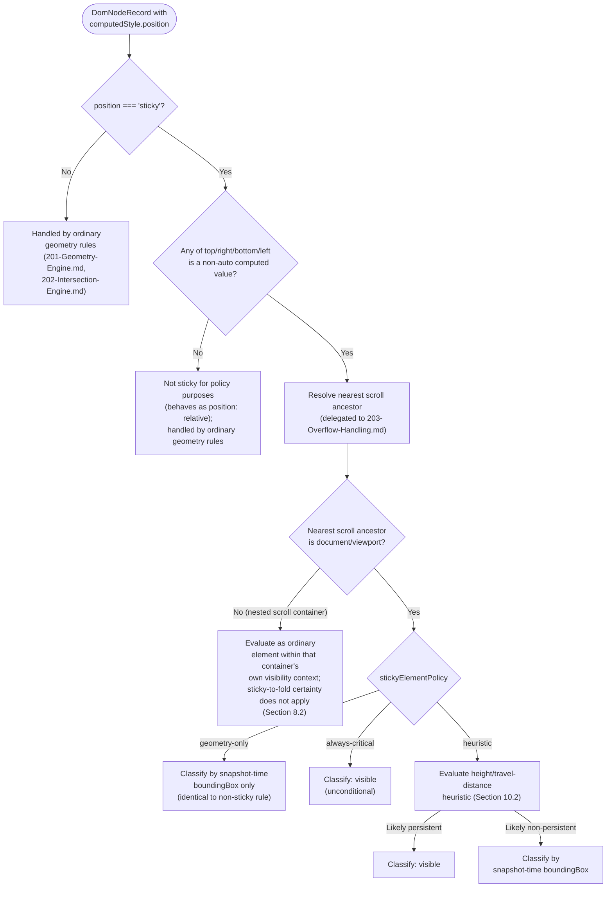
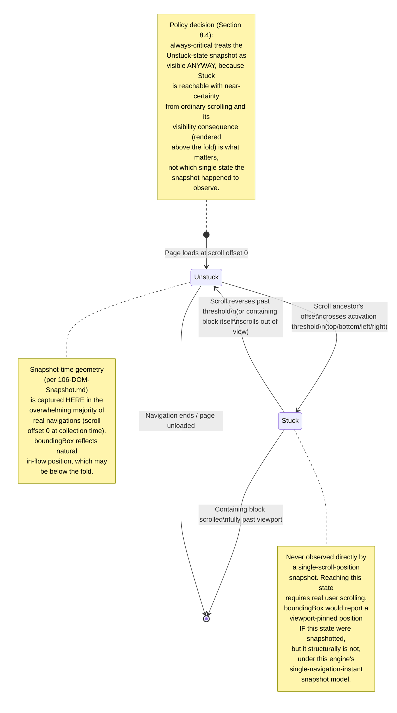

# 205 — Sticky Elements

## 1. Title

**Critical CSS Extraction Engine — Visibility Engine: `position: sticky` Detection and Fold-Certainty Policy**

## 2. Version

| Field | Value |
|---|---|
| Document Version | 1.0.0 |
| Status | Accepted |
| Last Updated | 2026-07-09 |
| Owners | Visibility Engine Working Group |
| Stability | Stable (Phase 4 design document; changes require RFC) |

## 3. Purpose

BRIEF.md Section 2.5's visibility algorithm is defined against a single, static snapshot: a node is visible if its geometry, at the moment of capture, intersects the viewport/fold. `position: sticky` is the one common, mainstream CSS positioning scheme that makes "geometry at the moment of capture" a systematically misleading proxy for "will this content actually render above the fold during real use." A sticky header captured before the user has scrolled reports the same layout-flow position an ordinary `position: static` element would — its stickiness has not yet activated, because activation depends on a scroll offset the static snapshot does not include. Yet that same header is, in the overwhelming majority of real deployments, *guaranteed* to become fixed to the top of the viewport the instant the user scrolls even one pixel, and will then remain visually present, above the fold, for the remainder of the session. A visibility engine that only reads snapshot-time geometry will classify this header exactly as it would classify any other unremarkable, non-sticky, in-flow element — and in doing so will systematically under-classify a category of element that experienced engineers building this system already know, from priors about how the web is actually built, to be near-certain fold content.

This document is the design authority for how the Visibility Engine detects `position: sticky` elements, resolves the sticky containing-block and nearest-scroll-ancestor relationship that governs when a sticky element actually activates, computes and interprets the `top`/`bottom`/`left`/`right` offset thresholds that drive that activation, and — the central policy question this document exists to answer — decides whether a sticky element should be treated as always-above-fold regardless of its current, snapshot-time scroll-relative geometry, given its near-certainty of intersecting the fold during real user interaction.

## 4. Audience

- Implementers of the Visibility Engine's classification pass (`packages/collector`'s visibility sub-module), who consume this document's sticky-detection and policy-resolution logic as one branch of the overall visibility decision, alongside [201-Geometry-Engine.md](./201-Geometry-Engine.md), [202-Intersection-Engine.md](./202-Intersection-Engine.md), and [204-Transform-Handling.md](./204-Transform-Handling.md).
- Configuration schema authors exposing the sticky-element policy (Section 8.4) in the public configuration surface.
- Implementers of [206-Fixed-Elements.md](./206-Fixed-Elements.md), whose subject matter (`position: fixed`) is the geometrically simpler, already-permanently-viewport-relative sibling of this document's subject and is explicitly contrasted against it in Section 8.1 and Tradeoffs.
- Implementers of [203-Overflow-Handling.md](./203-Overflow-Handling.md), since sticky positioning's activation is defined relative to a *scroll container*, which may be the document viewport or may be a nested `overflow: auto`/`scroll` ancestor — this document's containing-block resolution (Section 8.2) is a direct consumer of that document's scroll-ancestor identification logic.
- Senior engineers reviewing whether the "always-critical" policy this document recommends as default is an acceptable, bounded approximation under Principle 3 (Correctness Over Premature Optimization), given that it is, unlike [204-Transform-Handling.md](./204-Transform-Handling.md)'s browser-delegated geometry resolution, a genuine engine-authored heuristic rather than a pure application of browser-reported fact.

Readers should be familiar with [006-Design-Principles.md](../architecture/006-Design-Principles.md) Principles 1 and 3, the CSS Position specification's definition of `position: sticky` and its containing-block/scroll-ancestor model, and `getComputedStyle()`'s reporting of computed (not resolved/used) `position` and offset values.

## 5. Prerequisites

- [006-Design-Principles.md](../architecture/006-Design-Principles.md) Principle 1 (The Browser Is the Source of Truth) — governs Section 8.1's detection mechanism (read `position` from `getComputedStyle()`, never infer stickiness from class names or heuristic DOM position).
- [006-Design-Principles.md](../architecture/006-Design-Principles.md) Principle 3 (Correctness Over Premature Optimization) — the central tension this document resolves: the default policy (Section 8.4) is a deliberate, bounded exception to "correctness over approximation" because static-snapshot geometry is provably not the relevant notion of correctness for this element category (Section 8.1).
- [106-DOM-Snapshot.md](./106-DOM-Snapshot.md) Section 8.2 — the `computedStyle` allow-list capture mechanism this document extends with `position` and the four offset properties.
- [200-Visibility-Engine-Overview.md](./200-Visibility-Engine-Overview.md) — the overall visibility classification pipeline into which this document's sticky-resolution slots as one branch.
- [202-Intersection-Engine.md](./202-Intersection-Engine.md) — the fold-intersection test this document's policy branch can override.
- [203-Overflow-Handling.md](./203-Overflow-Handling.md) — the scroll-ancestor/overflow-container model this document's containing-block resolution (Section 8.2) depends on.
- Familiarity with the CSS Position specification's `position: sticky` section, including its containing-block definition and the "sticky-positioning first available position" algorithm browsers implement internally.

## 6. Related Documents

- [006-Design-Principles.md](../architecture/006-Design-Principles.md) — Principles 1, 3, and 6, cited throughout.
- [106-DOM-Snapshot.md](./106-DOM-Snapshot.md) — the capture-time source of the `position` and offset computed-style facts this document interprets.
- [200-Visibility-Engine-Overview.md](./200-Visibility-Engine-Overview.md) — the overall visibility pass this document's resolution feeds.
- [201-Geometry-Engine.md](./201-Geometry-Engine.md) — general bounding-box/coordinate-space rules, relevant to the snapshot-time (unstuck) geometry this document contrasts against the always-critical policy.
- [202-Intersection-Engine.md](./202-Intersection-Engine.md) — the fold-intersection test consuming this document's resolved visibility decision.
- [203-Overflow-Handling.md](./203-Overflow-Handling.md) — the nearest-scroll-ancestor identification this document's containing-block resolution depends on; a sticky element nested inside a scrollable card list activates relative to that card's scroll container, not the document viewport, and this document defers that ancestor lookup to that document's logic rather than reimplementing it.
- [204-Transform-Handling.md](./204-Transform-Handling.md) — a sibling Phase 4 document facing an analogous "should engine-authored intent override snapshot-time geometry" question for a different feature (transforms); Section 13 compares the two documents' policy designs directly.
- [206-Fixed-Elements.md](./206-Fixed-Elements.md) — `position: fixed`'s simpler, unconditional viewport-relative model, contrasted against sticky's conditional, scroll-dependent model throughout this document.
- [207-Virtualized-Lists.md](./207-Virtualized-Lists.md) — virtualized list headers are sometimes implemented via sticky positioning (a "sticky section header" pattern within a virtualized scroll region); that document's row-visibility model composes with this document's sticky-detection logic for that specific pattern.
- BRIEF.md Section 2.5 (Core Algorithms — Visibility Detection) — the visibility algorithm this document's policy branch extends.
- CSS Position specification (W3C), `position: sticky` — the authoritative definition of sticky containing-block resolution and offset semantics.

## 7. Overview

`position: sticky` is, by specification, a hybrid of `position: relative` and `position: fixed`: an element with `position: sticky` participates in normal document flow exactly as a `position: relative` element would (occupying layout space at its natural in-flow position, contributing to its parent's height, and — critically — being the box whose geometry `getBoundingClientRect()` reports when the element is *not currently stuck*) until its nearest scroll-ancestor's scroll offset causes the element's flow-position edge (the one named by whichever of `top`/`right`/`bottom`/`left` is set) to cross the corresponding edge of its **sticky containing block** — at which point the browser switches the element to a fixed-relative-to-the-scroll-container position, clamped so the named offset is respected, and it remains in that "stuck" state until scrolling would otherwise carry it back past the threshold in the opposite direction.

This document's core observation, and the reason it exists as a distinct Phase 4 document rather than being folded into general geometry handling, is: **a static, single-scroll-position snapshot (per [106-DOM-Snapshot.md](./106-DOM-Snapshot.md) Section 8.6's single-coherent-instant design) can only ever observe one of these two states — stuck or unstuck — for a given sticky element, and for the single most common real-world sticky pattern (a header or navigation bar with `top: 0` inside a scroll ancestor at least as tall as the viewport), the snapshot is taken at scroll offset zero, before any scrolling has occurred, meaning the element is captured in its unstuck, natural-flow state.** If that natural-flow position happens to be below the fold (a sticky sub-navigation bar positioned partway down a long page, for instance, sitting below a large hero image that itself exceeds the fold height), a purely snapshot-geometry-driven visibility decision classifies it as not visible — technically correct about the literal pixel state at scroll-offset zero, and yet almost certainly wrong about what matters for critical CSS's actual purpose: a real user scrolling even slightly will cause this element to detach from flow and render fixed at the top of the viewport, squarely above the fold, for the remainder of their scroll session. Excluding its CSS risks a real, visible flash-of-unstyled-content the moment the element becomes stuck — precisely the failure mode [006-Design-Principles.md](../architecture/006-Design-Principles.md) Principle 6 treats as maximally severe.

This document is organized around three questions, in order: (1) how does the Visibility Engine reliably *detect* that an element is sticky and identify the containing block/scroll-ancestor relationship that governs its activation (Section 8.1–8.2); (2) what do the `top`/`bottom`/`left`/`right` offset thresholds mean, and how are they read (Section 8.3); and (3) given detection, what is the *policy* — should a detected sticky element be treated as always-above-fold, evaluated purely on its snapshot-time (unstuck) geometry, or resolved by some intermediate heuristic (Section 8.4), and why.

## 8. Detailed Design

### 8.1 Detecting `position: sticky`

**Detection mechanism: read `computedStyle.position` directly, per Principle 1.** The Visibility Engine determines whether a node is sticky exclusively by inspecting the `position` value already present in [106-DOM-Snapshot.md](./106-DOM-Snapshot.md) Section 8.2's captured computed-style allow-list — `computedStyle.position === "sticky"`. This is deliberately the *only* detection mechanism considered; alternatives such as pattern-matching class names (`.sticky-header`, `.js-sticky`), inspecting for the presence of a `top`/`bottom` value alone (which `position: relative` and `position: absolute` elements can also declare, with entirely different semantics), or scanning for known sticky-library markup conventions (a common temptation, since several popular sticky-polyfill libraries predate broad native `position: sticky` support and leave distinguishing DOM/class artifacts) are all rejected outright as Principle 1 violations of the same character [006-Design-Principles.md](../architecture/006-Design-Principles.md) already forbids for visibility heuristics generally: any heuristic keyed on authored class names or library conventions is a static-analysis proxy for a fact the browser's own computed style already reports authoritatively and unambiguously.

**Why this needs no extension of the existing capture mechanism beyond adding `position` and the four offset properties to the allow-list.** [106-DOM-Snapshot.md](./106-DOM-Snapshot.md) Section 8.2 already captures a fixed allow-list of computed-style properties for every node (`display`, `visibility`, `opacity`, `position`, `transform`, `overflow`, `overflow-x`, `overflow-y`, `content-visibility`, `contain`, `zIndex`) — `position` is already present. This document requires only that the allow-list additionally include `top`, `right`, `bottom`, `left` (the four offset properties whose *computed*, not *used*, values are needed for Section 8.3's threshold interpretation) — a small, bounded extension consistent with that document's stated ownership model ("any Phase 4 requirement for an additional computed-style fact must be added here, at capture time").

### 8.2 The Sticky Containing Block and Nearest Scroll Ancestor

A sticky element's activation threshold is defined relative to two distinct reference boxes, and conflating them is the most common source of incorrect sticky-geometry reasoning:

**The sticky containing block.** Per the CSS Position specification, a sticky element's containing block is computed identically to a `position: relative` element's containing block — the padding box of its nearest block-level (or, more precisely, nearest ancestor that establishes a containing block per the general CSS containing-block rules) ancestor. This is the box whose edges the `top`/`right`/`bottom`/`left` offsets are measured against once the element is stuck.

**The nearest scroll ancestor (nearest ancestor with a scrolling box).** Separately, and more consequentially for this document's fold-relevance analysis, sticky positioning only activates relative to scrolling of the element's **nearest ancestor that establishes a scroll container** — which is the document viewport itself in the common case (no intervening `overflow: auto`/`scroll`/`hidden` ancestor between the sticky element and the root), but is a nested scrollable ancestor whenever one intervenes (a sticky section header inside a scrollable card panel, a common pattern this document shares with [207-Virtualized-Lists.md](./207-Virtualized-Lists.md)). This document does not reimplement scroll-ancestor identification independently: it delegates to [203-Overflow-Handling.md](./203-Overflow-Handling.md)'s existing nearest-scroll-ancestor resolution (that document's authoritative logic for identifying, per node, the nearest ancestor whose `overflow` computed value establishes a scrolling box), consuming its result as an input rather than duplicating the walk.

**Why the scroll-ancestor identity changes this document's fold-relevance conclusion.** The entire premise in Section 7 — "a sticky header will almost certainly become stuck and visible above the fold during real use" — holds unconditionally only when the nearest scroll ancestor *is* the document/viewport scroll container, because that is the scroll gesture BRIEF.md's fold concept (per [105-Viewport-Manager.md](./105-Viewport-Manager.md) Section 8.3, itself a viewport-relative concept) is actually about. A sticky element whose nearest scroll ancestor is a small, nested `overflow: auto` panel becomes stuck only relative to scrolling *within that panel*, which is a materially weaker and less certain signal: the panel itself might never be scrolled by a given user, might not be above the fold at all (in which case its internal sticky behavior is irrelevant to this engine's above-the-fold extraction goal regardless of whether it activates), or might be a small utility widget where "stuck" behavior is real but visually inconsequential to the page's overall above-the-fold rendering. Section 8.4's policy therefore branches on scroll-ancestor identity, not merely on `position: sticky` detection alone.

### 8.3 Offset Thresholds: `top`, `bottom`, `left`, `right`

Each of the four offset properties, when set to a used value other than `auto`, independently establishes an edge along which the element resists scrolling past the corresponding edge of its sticky containing block. `top: 0` (by far the dominant real-world pattern for header/navigation use cases) means: once the element's flow-position top edge would scroll above the containing block's top edge (offset by any additional margin), the browser instead pins the element's top edge at exactly `0px` from the viewport-relative top of its containing block's scrolling context, holding it there for as long as the containing block itself remains in view. `bottom` establishes the symmetric behavior for a bottom-anchored sticky element (a "sticky footer" or a bottom-anchored call-to-action bar); `left`/`right` establish the same behavior for horizontal scroll containers (relevant to horizontally-scrolling tables with sticky first columns, a pattern also potentially co-occurring with [207-Virtualized-Lists.md](./207-Virtualized-Lists.md)'s virtualization subject matter).

**Reading the computed value, not the specified value.** [106-DOM-Snapshot.md](./106-DOM-Snapshot.md)'s capture mechanism reads `getComputedStyle()`, which resolves percentage and `auto` values into pixel or keyword computed values per the CSS cascade's normal resolution — this document's threshold interpretation operates on that already-resolved computed value, never re-parsing the author's original CSS text (consistent with Principle 1 and Principle 2's shared prohibition on reimplementing browser-owned resolution logic). A `top: auto` value (the property's initial value, meaning "this edge does not participate in sticky positioning") is distinguished explicitly from `top: 0` — an element with `position: sticky` but all four offsets `auto` is, per specification, sticky in name only and behaves identically to `position: relative` in practice, never actually sticking to anything; this document's detection logic (Section 10.1) treats such an element as **not sticky for policy purposes**, despite `computedStyle.position === "sticky"` being true, because it has no active offset and therefore no activation behavior to reason about at all.

**Multiple simultaneous offsets.** An element may declare both `top` and `bottom` (or `left` and `right`) simultaneously, a valid but less common pattern used to make an element stick at the top while scrolling down and at the bottom while scrolling up within a single bounded scroll range shorter than the element's own natural travel distance — this document's detection and policy logic (Section 10) treats "any one of the four offsets is a non-`auto` computed value" as sufficient to classify the element as sticky-with-active-offset, without needing to fully resolve the interaction of multiple simultaneous offsets, since Section 8.4's policy question ("should this be always-critical") does not depend on which specific edge or edges are active — only on whether the element has *some* active sticky behavior relative to a fold-relevant scroll ancestor.

### 8.4 The Policy Decision: Always-Critical vs. Geometry-Only vs. Configurable Heuristic

This is the section BRIEF.md Section 2.5's framing anticipates directly: the visibility algorithm's plain reading ("intersects viewport/fold... AND has non-zero dimensions...") is a geometry-only rule, and this document must decide whether sticky elements are a documented, deliberate exception to it.

**Option A — Geometry-only (no special-casing; identical to the plain rule).** A sticky element is classified purely by its snapshot-time (necessarily unstuck, at scroll-offset zero for the overwhelming majority of navigations, per Section 7) geometry, exactly as any other in-flow element would be. **Rejected as the default** because it produces the exact false-negative failure mode Section 7 describes for the single most common sticky pattern in production use — sticky headers and navigation bars whose natural in-flow position is below the fold but whose stuck position is, by design, always at the very top of the viewport. A tool whose stated purpose (BRIEF.md Section 1, "accurately extracts only the CSS required to render above-the-fold content") is undermined by a documented, common, easily-anticipated failure mode is a worse tool than one that accepts a narrower, well-understood approximation in exchange for avoiding it. This option remains available as an explicit configuration value (`"geometry-only"`) for operators who have a specific, understood reason to want it (Section 8.4's Tradeoffs table), but it is not the default.

**Option B — Always-critical (the chosen default).** Any element classified as sticky-with-active-offset (Section 8.3) **and** whose nearest scroll ancestor is the document/viewport scroll container (Section 8.2) is treated as visible/above-fold unconditionally, regardless of its snapshot-time geometry — its CSS, and the CSS of its descendants down to the same visibility-classification depth every other visible node receives, is included in the critical set. **Why this is the default.** The asymmetry in failure costs, already established as a recurring theme across this Phase's documents (see [204-Transform-Handling.md](./204-Transform-Handling.md) Section 13's identical reasoning for its own default), applies with unusual force here: a false negative (excluding a sticky header's CSS because it happened to be below the fold at scroll-offset zero) produces a visible, real, common flash-of-unstyled-content the instant *any* user scrolls even slightly — arguably the single highest-frequency real-world trigger condition this engine could get wrong, since scrolling is close to a universal first interaction on any page taller than one viewport. A false positive (including a sticky element's CSS when, in some unusual configuration, it never actually becomes visible above the fold — e.g., its sticky containing block itself never scrolls into view, discussed in Edge Cases) merely means slightly more CSS was included than strictly necessary: a missed optimization, not a rendering defect. Given this asymmetry, and given that `position: sticky` with an active offset relative to the viewport scroll container is, empirically, an extremely reliable signal of deliberate persistent-visibility intent (unlike [204-Transform-Handling.md](./204-Transform-Handling.md)'s transformed-offscreen case, where the same geometric signature genuinely has two common, opposite-intent real-world causes), this document's default resolves the ambiguity decisively toward inclusion rather than toward a configurable heuristic, in explicit contrast to the transform case.

**Option C — Configurable heuristic (available, not default).** A third value, `"heuristic"`, narrows Option B's blanket "any active-offset sticky element with a viewport-relative scroll ancestor" rule with additional signals intended to reduce false positives for edge cases Option B's blanket rule over-includes — specifically, an element's own `boundingBox` height relative to viewport height (an element whose natural in-flow height already exceeds the fold, such that "stuck" behavior is largely moot because it was already going to occupy fold-relevant space regardless), and whether the sticky containing block itself has a bounded height shorter than the element's travel distance (a case discussed in Edge Cases where sticky behavior is real but the containing block scrolls out of view quickly, limiting the practical duration of stuck-visibility). This option exists because Option B, while a safe default, is a coarser rule than some operators with detailed knowledge of their own site's layout may want; it is not the default because its added precision comes at the cost of the exact false-negative risk Option B exists to eliminate, and Principle 3's discipline (approximations must be additive, opt-in, and clearly distinguished from the correctness/safety-preserving default) applies here just as it does for [204-Transform-Handling.md](./204-Transform-Handling.md)'s analogous heuristic value.

**The configuration surface.**

```
stickyElementPolicy: "always-critical" | "geometry-only" | "heuristic"
```

Default: `"always-critical"`.

**Why this default differs from [204-Transform-Handling.md](./204-Transform-Handling.md)'s default (`"strict"`, i.e., trust snapshot geometry) despite both documents facing a structurally similar "snapshot geometry may not reflect real user experience" question.** The two cases differ in exactly the dimension that matters for choosing a default: transformed-offscreen elements have **two common, genuinely opposite-intent real-world patterns** sharing one geometric signature (permanent accessibility-hiding vs. animation-initial-state), so no single default can be correct for both without additional signal — hence [204-Transform-Handling.md](./204-Transform-Handling.md) defaults to the geometry-literal, no-guessing answer. Sticky elements with an active offset and a viewport-relative scroll ancestor have **one overwhelmingly dominant real-world pattern** (persistent header/nav/CTA content meant to remain visible) with only narrow, identifiable exceptions (Edge Cases) — so a default that resolves toward the dominant pattern, rather than toward the literal-but-usually-wrong snapshot geometry, is the better bet precisely because the ambiguity that forced [204-Transform-Handling.md](./204-Transform-Handling.md) toward caution does not exist here in the same proportion.

## 9. Architecture

### 9.1 Sticky Detection and Policy Resolution Flow



### 9.2 Sticky/Unstuck State Machine Relative to Scroll Position

The following state diagram models a single sticky element's two possible rendered states as a function of scroll offset, and maps each state — plus the static-snapshot's inherent inability to observe both — onto this document's visibility decision.



This diagram makes the document's central argument structural rather than merely rhetorical: the snapshot mechanism is, by design ([106-DOM-Snapshot.md](./106-DOM-Snapshot.md) Section 8.6), a single-instant observation, and a single instant of a two-state, scroll-driven system cannot observe both states. The `always-critical` policy's justification is precisely that the *unobserved* state (Stuck) is the state whose visibility consequence this engine's extraction goal actually cares about, and that state is reachable with near-certainty via the single most common user action on any scrollable page.

## 10. Algorithms

### 10.1 Algorithm: Sticky Detection and Fold-Certainty Classification

**Problem statement.** Given a `DomNodeRecord` and the scroll-ancestor resolution already performed by [203-Overflow-Handling.md](./203-Overflow-Handling.md), determine whether the node is a policy-relevant sticky element (sticky, with an active offset, relative to the viewport scroll container) and, if so, what visibility outcome `stickyElementPolicy` produces.

**Inputs.** `node: DomNodeRecord` (with `computedStyle.position`, `computedStyle.top/right/bottom/left`), `nearestScrollAncestor: ScrollAncestorRef` (from [203-Overflow-Handling.md](./203-Overflow-Handling.md)), `policy: "always-critical" | "geometry-only" | "heuristic"`, `snapshotBoundingBox: Rect`, `fold: number`, `viewportWidth: number`.

**Outputs.** `{ isPolicyRelevantSticky: boolean, visible: boolean, reason: string }`.

**Pseudocode.**

```text
function classifySticky(node, nearestScrollAncestor, policy, snapshotBoundingBox, fold, viewportWidth) -> StickyClassification:
    if node.computedStyle.position != "sticky":
        return { isPolicyRelevantSticky: false, visible: null, reason: "not-sticky" }
        // caller falls through to ordinary geometry rules (201/202)

    hasActiveOffset = (node.computedStyle.top != "auto")
                    OR (node.computedStyle.right != "auto")
                    OR (node.computedStyle.bottom != "auto")
                    OR (node.computedStyle.left != "auto")

    if not hasActiveOffset:
        return { isPolicyRelevantSticky: false, visible: null, reason: "sticky-with-no-active-offset" }
        // behaves as position: relative; caller falls through to ordinary geometry rules

    if nearestScrollAncestor.kind != "document-viewport":
        return { isPolicyRelevantSticky: false, visible: null, reason: "nested-scroll-container" }
        // Section 8.2: fold-certainty argument does not hold; evaluate within
        // that container's own context (delegated elsewhere, e.g. 207-Virtualized-Lists.md
        // for the virtualization-specific case)

    // At this point: sticky, active offset, viewport-relative scroll ancestor.
    if policy == "geometry-only":
        intersects = rectIntersects(snapshotBoundingBox, {x: 0, y: 0, width: viewportWidth, height: fold})
        return { isPolicyRelevantSticky: true, visible: intersects, reason: "geometry-only-policy" }

    if policy == "always-critical":
        return { isPolicyRelevantSticky: true, visible: true, reason: "always-critical-policy" }

    if policy == "heuristic":
        return classifyStickyHeuristic(node, snapshotBoundingBox, fold, viewportWidth)
```

**Time complexity.** `O(1)` per node — a small, fixed number of computed-style comparisons and one rectangle-intersection test in the `geometry-only` branch. Across `n` nodes, `O(n)` total, dominated entirely by the classification pass the Visibility Engine already runs per node (per [200-Visibility-Engine-Overview.md](./200-Visibility-Engine-Overview.md)); this algorithm's cost is not separately significant.

**Memory complexity.** `O(1)` per node for the classification result; `O(s)` in aggregate where `s` is the number of sticky elements in a snapshot, typically small (headers, navs, occasional sticky sidebars/CTAs — rarely more than single digits per page).

**Failure cases.** If `nearestScrollAncestor` resolution (delegated to [203-Overflow-Handling.md](./203-Overflow-Handling.md)) itself fails or returns an ambiguous result (e.g., a scroll ancestor whose own `overflow` computed value is borderline — `overflow: clip` combined with a scrollable-in-practice configuration, an edge case that document owns), this algorithm degrades to treating the node as `"nested-scroll-container"` (the conservative branch) rather than risking an incorrect `"document-viewport"` classification that would trigger the always-critical policy on a false premise — a deliberate bias toward the less-aggressive outcome when upstream ancestor resolution is uncertain.

**Optimization opportunities.** None beyond the `O(1)` per-node cost already stated; this is a small, cheap decision tree layered on already-captured, already-resolved data.

### 10.2 Algorithm: Heuristic Refinement for `stickyElementPolicy: "heuristic"`

**Problem statement.** Given a node already classified as policy-relevant sticky (Section 10.1), and only under the `"heuristic"` policy value, narrow the blanket always-critical outcome using signals that indicate the sticky behavior is unlikely to produce meaningful, sustained above-fold visibility in practice.

**Inputs.** `node: DomNodeRecord`, `snapshotBoundingBox: Rect`, `fold: number`, `viewportWidth: number`, `stickyContainingBlockHeight: number` (resolved per Section 8.2, the padding-box height of the nearest block-level ancestor).

**Outputs.** `{ visible: boolean, confidence: "high" | "low", reason: string }`.

**Pseudocode.**

```text
function classifyStickyHeuristic(node, snapshotBoundingBox, fold, viewportWidth) -> HeuristicResult:
    // Signal 1: an element already at least as tall as the fold occupies
    // fold-relevant space regardless of sticky behavior — its stuck/unstuck
    // distinction is largely moot for above-fold purposes.
    if snapshotBoundingBox.height >= fold:
        return { visible: true, confidence: "high",
                 reason: "element height already exceeds fold; sticky behavior moot" }

    // Signal 2: a containing block shorter than roughly one viewport height
    // limits how long the element can remain visibly stuck before its
    // containing block itself scrolls out of view — weak evidence against
    // "persistent, always-critical" framing, but not conclusive on its own.
    if stickyContainingBlockHeight < fold:
        return { visible: false, confidence: "low",
                 reason: "sticky containing block shorter than fold; limited stuck-visibility duration" }

    // Default: the dominant real-world pattern (persistent header/nav/CTA)
    // applies; treat as visible, matching the always-critical default's
    // reasoning for the common case.
    return { visible: true, confidence: "high",
             reason: "dominant pattern: persistent sticky header/nav/CTA" }
```

**Time complexity.** `O(1)` per node, using already-captured or already-resolved geometry facts (no additional browser round trip).

**Memory complexity.** `O(1)` per node.

**Failure cases.** The `stickyContainingBlockHeight < fold` signal (Signal 2) is a weak, non-definitive heuristic: a sticky containing block shorter than the fold is entirely compatible with a real, sustained-visibility use case (e.g., a sticky "buy now" bar within a shorter-than-viewport product-summary section that itself sits mid-page — the bar sticks for the section's scroll duration, which may still meaningfully overlap real user dwell time) — this is a documented, accepted false negative under the `"heuristic"` policy, consistent with this policy value's explicitly non-default, opt-in status (Section 8.4).

**Optimization opportunities.** None significant; the heuristic's inputs are already-available, already-cheap facts.

## 11. Implementation Notes

- The `computedStyle` allow-list extension required by this document (`top`, `right`, `bottom`, `left`, in addition to the already-present `position`) should be added unconditionally to [106-DOM-Snapshot.md](./106-DOM-Snapshot.md) Section 8.2's default allow-list, not gated behind a sticky-specific configuration flag — unlike [204-Transform-Handling.md](./204-Transform-Handling.md)'s `transition`/`animation` extension (gated behind the non-default `"heuristic"` policy value there), these four offset properties are needed for the *default* (`"always-critical"`) policy's detection logic here, and detection must run unconditionally for every node to find sticky elements in the first place.
- The nearest-scroll-ancestor resolution (Section 8.2, Section 10.1) must be computed once per node by [203-Overflow-Handling.md](./203-Overflow-Handling.md)'s shared logic and passed into this module's classification function, never independently re-walked by this module — duplicating that ancestor walk here would violate the module-boundary discipline [006-Design-Principles.md](../architecture/006-Design-Principles.md) Principle 4 establishes, and would risk the two modules' scroll-ancestor conclusions silently diverging.
- The `always-critical` policy's visibility override must still compose correctly with the *other* visibility criteria this document does not own — `display: none`, `visibility: hidden`, zero dimensions, and (per [204-Transform-Handling.md](./204-Transform-Handling.md)) transformed-offscreen status all remain independently sufficient to exclude a node regardless of its sticky classification; `always-critical` overrides only the fold-intersection geometry check specifically, not the full visibility criteria conjunction owned by [200-Visibility-Engine-Overview.md](./200-Visibility-Engine-Overview.md). A `display: none` sticky header (e.g., toggled visible only above a certain breakpoint via a media query this profile's viewport does not match) must remain classified not-visible despite this document's policy.
- The Reporter (per [006-Design-Principles.md](../architecture/006-Design-Principles.md) Section 2.12 / Principle 6) must surface every `always-critical`-policy-driven inclusion as a distinct diagnostic category (`stickyElementPolicyOverrides`), analogous to [204-Transform-Handling.md](./204-Transform-Handling.md)'s `transformedOffscreenOverrides`, so an operator auditing a run can see precisely which nodes' CSS was included on the basis of this document's policy rather than literal snapshot-time geometry — this transparency is what allows an operator who disagrees with the default, for a specific element, to override it via the `customizeVisibility` plugin hook (BRIEF.md Section 2.13) with full visibility into what the default would otherwise have decided.

## 12. Edge Cases

- **A sticky element whose containing block never actually scrolls into the viewport at all** (e.g., a sticky sidebar widget nested deep within a page section that itself never appears above the fold for any realistic scroll depth users actually reach) — the `always-critical` default still includes its CSS unconditionally, which is a genuine, accepted over-inclusion (Section 8.4's stated tradeoff: false positives cost only optimization headroom, not correctness) rather than a defect; the `"heuristic"` policy's Signal 2 (Section 10.2) partially, imperfectly mitigates this specific pattern but is not guaranteed to catch it.
- **A sticky element with `display: none` at the profile's active viewport width but `position: sticky` declared unconditionally** (a common responsive pattern: a sticky mobile-only bottom bar hidden via `@media` on desktop profiles) — correctly excluded regardless of this document's policy, per the Implementation Notes' composition rule; this document's detection logic still runs (reading `computedStyle.position`) but the `display: none` criterion, owned by [200-Visibility-Engine-Overview.md](./200-Visibility-Engine-Overview.md), independently excludes the node before or after this document's override is applied, whichever composition order the overall pass uses.
- **Sticky positioning inside Shadow DOM.** A sticky element inside an open shadow root (per [106-DOM-Snapshot.md](./106-DOM-Snapshot.md) Section 8.3) is detected and classified identically to a light-DOM sticky element — `getComputedStyle()` and scroll-ancestor resolution both operate correctly across the shadow boundary for open roots, and this document introduces no shadow-DOM-specific branching. A sticky element inside a *closed* shadow root inherits that document's already-documented blind spot (undetectable, surfaced via `ClosedShadowRootDiagnostic`) — this document adds no new closed-shadow-DOM concern beyond what [106-DOM-Snapshot.md](./106-DOM-Snapshot.md) already states.
- **Sticky elements combined with CSS transforms** (a sticky header that is also `transform`-animated for a hide/reveal-on-scroll-direction effect, a genuinely common pattern). This document's policy and [204-Transform-Handling.md](./204-Transform-Handling.md)'s policy are evaluated as independent, composable checks by [200-Visibility-Engine-Overview.md](./200-Visibility-Engine-Overview.md) — a sticky element that is also transformed off-fold at snapshot time is subject to both documents' logic, and the overall visibility outcome is whichever composition rule the overview document specifies (recommended: `always-critical`'s override should take precedence over a `"strict"`-policy transform exclusion when both apply to the same node, since the sticky pattern's near-certainty argument is stronger evidence of eventual visibility than the transform case's inherently ambiguous signal — flagged explicitly here as a cross-document composition rule [200-Visibility-Engine-Overview.md](./200-Visibility-Engine-Overview.md) must state authoritatively).
- **A sticky element nested inside another sticky element** (nested sticky headers, a pattern seen in some table-of-contents/section-navigation designs where an outer sticky section header and an inner sticky sub-header both activate at different scroll depths). Each sticky element is classified entirely independently by this document's algorithm — there is no special joint-nesting logic, and both may independently resolve to `visible: true` under `always-critical`, which is the correct outcome (both are, in fact, independently likely to become visible above the fold at different points in the scroll sequence).
- **`position: sticky` on a table-related display type** (`display: table-row-group`, etc.) where sticky positioning has historically had inconsistent cross-engine support for certain table-internal display types. Per Principle 1, this document defers entirely to whatever the pinned browser engine ([101-Playwright-Adapter.md](./101-Playwright-Adapter.md)) actually does — if the engine does not apply sticky behavior to a given table-internal display type, `computedStyle.position` will still report `"sticky"` (since `position` is set regardless of whether the browser's layout engine honors it for that box type), and this document's detection would still flag it for policy purposes even though no rendering engine will visibly enforce stickiness. This is a narrow, low-frequency false positive under `always-critical`, accepted for the same reason as the general over-inclusion tradeoff (Section 8.4), and not specifically special-cased, since doing so would require this document to encode per-engine table-layout stickiness support matrices — exactly the kind of static-approximation reimplementation Principle 1/2 forbid.
- **Sticky elements whose offset properties use CSS custom properties or `calc()` expressions.** `getComputedStyle()` resolves these to a final pixel value before this document's logic ever sees them (per Principle 1, resolution is the browser's job); no special handling is needed, and an unresolved/invalid `calc()` expression (a genuine authoring error) resolves per the browser's own error-recovery behavior for computed style, which this document inherits as-is.

## 13. Tradeoffs

| Decision | Why | Alternative Considered | Tradeoff Accepted |
|---|---|---|---|
| Default policy is `always-critical`, not `geometry-only` | The single-instant snapshot structurally cannot observe the Stuck state (Section 9.2), and the Stuck state is the near-certain, common-case outcome for viewport-relative sticky headers/navs; false negatives here are a common, high-visibility FOUC risk | `geometry-only` as default, matching [204-Transform-Handling.md](./204-Transform-Handling.md)'s `"strict"` default philosophy | Some CSS is included for sticky elements that, in narrow real configurations (Edge Cases), never actually become visible above the fold — an accepted, bounded over-inclusion, not a correctness defect |
| Policy differs from [204-Transform-Handling.md](./204-Transform-Handling.md)'s default direction despite structural similarity | Sticky-with-viewport-scroll-ancestor has one dominant real-world intent pattern; transformed-offscreen has two common, opposite-intent patterns sharing one geometric signature | Adopt an identical default philosophy across both documents for consistency's sake | Consistency-for-its-own-sake was rejected in favor of a default calibrated to each feature's actual real-world ambiguity profile — a deliberate, documented asymmetry, not an oversight |
| Nested-scroll-container sticky elements are excluded from the always-critical override (Section 8.2, 10.1) | The fold-certainty argument depends on the scroll gesture being the page's own viewport scroll, which nested scroll containers do not guarantee | Apply `always-critical` uniformly regardless of scroll-ancestor identity | Sticky elements inside nested scroll panels fall back to ordinary geometry rules and may be under-classified if such a panel's sticky content is, in a specific site's design, still highly likely to be seen — an accepted narrower default scope, revisitable via the `"heuristic"` policy or plugin override |
| `"heuristic"` policy exists but is not default | Serves operators wanting tighter precision than the blanket rule, without changing the safe default for everyone else | Omit the heuristic value; only offer `always-critical`/`geometry-only` | Operators who want tighter precision must explicitly opt in and accept the heuristic's documented false-negative risk (Section 10.2) |
| No live re-scroll-and-remeasure to directly observe the Stuck state | Consistent with the engine's static single-navigation-instant snapshot model (per [106-DOM-Snapshot.md](./106-DOM-Snapshot.md) Section 8.6); scrolling and re-snapshotting would be a fundamentally different, more expensive extraction model | Programmatically scroll the page to trigger the Stuck state, re-run `getBoundingClientRect()`, and use that directly instead of a policy-based inference | Rejected as a default because it doubles (at minimum) the navigation/collection cost per route/viewport and reintroduces exactly the kind of speculative complexity Principle 3 cautions against for a fact the `always-critical` policy already infers reliably at zero additional browser round trips; flagged as Future Work (Section 16) as an optional, higher-fidelity alternative mode |

## 14. Performance

- **CPU complexity.** Section 10.1's detection and policy resolution is `O(1)` per node, `O(n)` per snapshot; Section 10.2's heuristic refinement (only invoked under the non-default `"heuristic"` policy, and only for nodes already classified sticky-with-active-offset) is likewise `O(1)` per evaluated node. Neither adds measurable overhead beyond the Visibility Engine's existing per-node classification pass.
- **Memory complexity.** `O(1)` additional per-node state (a classification result and, for the minority of nodes actually policy-overridden, a diagnostic record); negligible relative to the snapshot's overall per-node footprint.
- **Caching strategy.** No module-specific caching; `stickyElementPolicy` is part of the extraction configuration and therefore already part of the Cache Manager's fingerprint composite per [006-Design-Principles.md](../architecture/006-Design-Principles.md) Principle 8 — a policy change correctly invalidates cached results without any additional logic here.
- **Parallelization opportunities.** Per-node sticky classification is embarrassingly parallel across nodes, subsumed by the Visibility Engine's overall classification-pass parallelism; this document introduces no additional serialization constraint. It does introduce a data dependency on [203-Overflow-Handling.md](./203-Overflow-Handling.md)'s scroll-ancestor resolution completing first for a given node, which that document's own architecture must sequence correctly relative to this one.
- **Incremental execution.** Not independently applicable; output is a pure function of already-fingerprinted snapshot and configuration data.
- **Profiling guidance.** This module's cost should never appear as a distinct hotspot; if profiling shows otherwise, the likely cause is redundant re-invocation of the scroll-ancestor resolution per sticky node rather than reuse of an already-computed per-node ancestor lookup.
- **Scalability limits.** None specific to this module; the number of sticky elements on a typical page is small (single digits to low tens), and this module's cost scales with that count, not with total node count, beyond the initial `O(1)` `position` check every node already receives as part of the general classification pass.

## 15. Testing

- **Unit tests.** `classifySticky` (Section 10.1) against fixtures covering: non-sticky elements (fall-through); sticky with all offsets `auto` (inert); sticky with `top: 0` and a viewport-relative scroll ancestor, snapshot geometry both above- and below-fold, under each of the three policy values; sticky nested inside an `overflow: auto` panel (nested-scroll-container branch); multiple simultaneous offsets (`top` + `bottom`). `classifyStickyHeuristic` (Section 10.2) against fixtures exercising both signals independently and in combination.
- **Integration tests.** Real-browser fixtures asserting: a `position: sticky; top: 0` header's `computedStyle.position` and offset values are captured correctly by the actual [106-DOM-Snapshot.md](./106-DOM-Snapshot.md) Collector; a live scroll-and-remeasure control test (used only for test verification, not as part of the production pipeline) confirming that the fixture's sticky header does, in fact, transition from Unstuck to Stuck geometry upon scrolling, validating that the fixture itself correctly represents the real-world pattern this document's policy is designed around.
- **Visual tests.** Before/after screenshots of a sticky-header fixture at scroll offset 0 and after a simulated scroll, used to confirm the fixture's stuck-state visual appearance matches the CSS this document's `always-critical` policy would have included, as a sanity check that the policy's assumption ("the stuck-state rendering is what the included CSS needs to support") holds for the fixture.
- **Stress tests.** A fixture with many (10+) sticky elements at varying nesting depths, mixed viewport-relative and nested-scroll-container ancestors, mixed offset combinations, confirming this module's `O(n)` cost holds and that scroll-ancestor resolution reuse (not re-computation) is verified via instrumentation counting actual ancestor-walk invocations.
- **Regression tests.** A `sticky/` golden-fixture category (viewport-relative sticky header below fold at scroll 0; nested-scroll-container sticky; sticky-with-transform composition; sticky-with-display-none-at-breakpoint) with pinned expected critical CSS output, diffed on every change to this module, to [203-Overflow-Handling.md](./203-Overflow-Handling.md)'s scroll-ancestor logic, or to the pinned browser engine version.
- **Benchmark tests.** Confirm this module introduces no measurable overhead versus a control fixture with an equal node count and no sticky elements, per Section 14's complexity claims.

## 16. Future Work

- **Optional live scroll-and-remeasure mode**, flagged in Tradeoffs: a higher-fidelity, opt-in extraction mode that actually scrolls the page programmatically to trigger and directly measure the Stuck state, rather than inferring visibility via policy — would require careful integration with [104-Rendering-Stabilization.md](./104-Rendering-Stabilization.md)'s stabilization model (post-scroll re-settlement) and a second snapshot round trip, and is deferred pending demonstrated demand, consistent with Principle 3's "additive, benchmarked" discipline for any correctness-adjacent feature addition.
- **Cross-reference with `IntersectionObserver`-based detection**, noted as a general future direction in BRIEF.md Section 2.5 ("Future: IntersectionObserver-assisted mode") — a live-page `IntersectionObserver` watching the sticky element's own sentinel boundary could, in principle, directly and cheaply signal stuck/unstuck transitions during an interactive extraction session, offering a middle ground between this document's static-policy inference and full scroll simulation; tracked as a candidate mechanism for the future live-remeasure mode above.
- **Per-selector override list**, mirroring [204-Transform-Handling.md](./204-Transform-Handling.md)'s equivalent future-work item: allow operators to explicitly force `always-critical`/`geometry-only` for specific selectors via the `customizeVisibility` plugin hook, overriding the global `stickyElementPolicy` default for known-exceptional elements without changing the engine-wide default.
- **Refining the heuristic's Signal 2 (containing-block-height threshold)** with empirical calibration against a corpus of real-world sticky-pattern fixtures, rather than the current fixed comparison against the fold value alone, once a sufficiently large fixture corpus (per BRIEF.md Section 2.15's testing strategy) is available.
- **Open question:** should the always-critical override's scope include not just the sticky element's own matched rules but also a bounded set of descendant rules needed for its *stuck-state* rendering specifically (e.g., a `box-shadow` or `background` rule gated behind a `.is-stuck` class a scroll-listener JavaScript toggles at the real stuck transition, which this engine's static extraction cannot observe triggering)? Current design treats the sticky element and its descendants identically to any other visible node for CSS-matching purposes, with no special "stuck-state-only" rule augmentation; whether JavaScript-toggled stuck-state classes need their own detection and inclusion mechanism (distinct from this document's geometry-driven policy) is flagged as an open question for coordination with the CSSOM Walker (Phase 5) and Dependency Resolution (Phase 7) documents, neither of which currently has a mechanism for inferring "this class is toggled at the sticky-activation boundary."

## 17. References

- [006-Design-Principles.md](../architecture/006-Design-Principles.md)
- [106-DOM-Snapshot.md](./106-DOM-Snapshot.md)
- [105-Viewport-Manager.md](./105-Viewport-Manager.md)
- [200-Visibility-Engine-Overview.md](./200-Visibility-Engine-Overview.md)
- [201-Geometry-Engine.md](./201-Geometry-Engine.md)
- [202-Intersection-Engine.md](./202-Intersection-Engine.md)
- [203-Overflow-Handling.md](./203-Overflow-Handling.md)
- [204-Transform-Handling.md](./204-Transform-Handling.md)
- [206-Fixed-Elements.md](./206-Fixed-Elements.md)
- [207-Virtualized-Lists.md](./207-Virtualized-Lists.md)
- [104-Rendering-Stabilization.md](./104-Rendering-Stabilization.md)
- BRIEF.md Section 2.5 (Core Algorithms — Visibility Detection) — repository root
- CSS Position specification (W3C), `position: sticky` — https://www.w3.org/TR/css-position-3/#sticky-pos
- CSSOM View specification (W3C), `getBoundingClientRect()` and scroll-container semantics — https://www.w3.org/TR/cssom-view-1/
- IntersectionObserver specification (W3C) — referenced in Future Work regarding live stuck/unstuck detection
