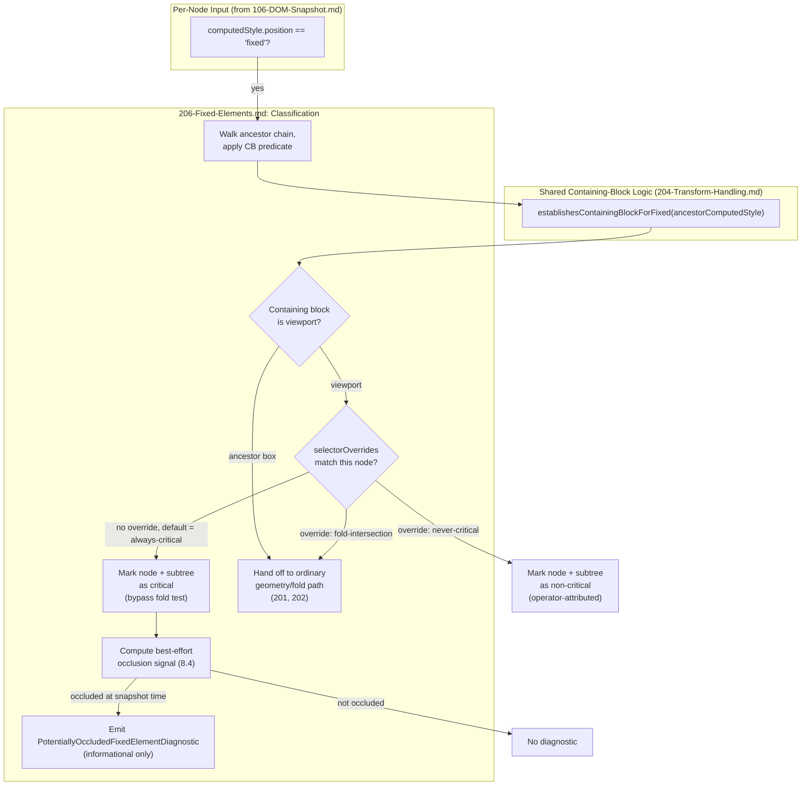
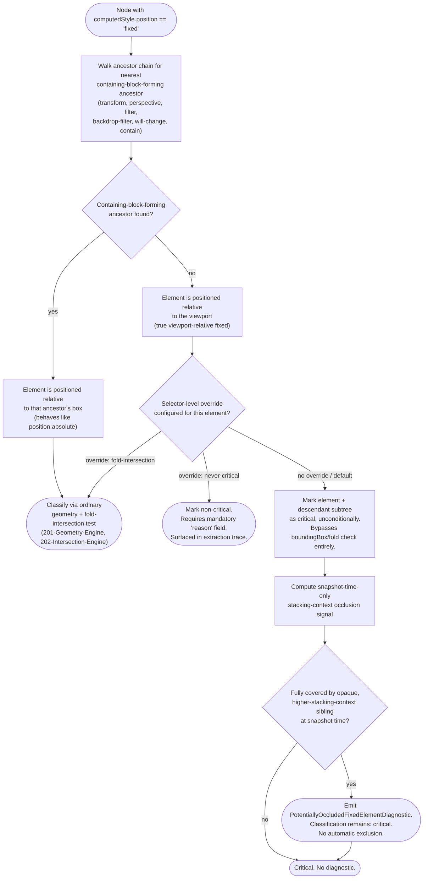

# 206 — Fixed Elements

## 1. Title

**Critical CSS Extraction Engine — Fixed-Position Elements: Viewport-Relative Visibility, Containing-Block Exceptions, and the Always-Critical Default**

## 2. Version

| Field | Value |
|---|---|
| Document Version | 1.0.0 |
| Status | Accepted |
| Last Updated | 2026-07-09 |
| Owners | Visibility Engine Working Group |
| Stability | Stable (Phase 4 design document; changes require RFC) |

## 3. Purpose

BRIEF.md Section 2.5's Visibility Detection algorithm defines visibility as intersecting "the viewport/fold," a rule that is unambiguous for elements participating in normal flow — an element is above the fold if its `getBoundingClientRect()` places it within `[0, foldPx)` of the *unscrolled* initial viewport. `position: fixed` elements break the premise that geometry observed at snapshot time is representative of geometry as the user scrolls: a fixed header, a cookie-consent banner, a "back to top" button, or a persistent chat-widget launcher is, by CSS specification, positioned relative to its *containing block* rather than to any ancestor's scroll offset, and in the common case that containing block is the initial containing block (the viewport itself). Because the viewport does not move when the document scrolls, a `position: fixed` element that is visible in the unscrolled snapshot remains visible — at the same screen coordinates — no matter how far the user scrolls. It is, for practical purposes, permanently above the fold for the entire duration of the user's visit to the page, not merely for the first paint.

This has a direct, load-bearing consequence for critical CSS extraction: the CSS required to render a fixed header correctly is CSS the user needs for the *entire session*, not merely for the initial above-the-fold paint. Treating a fixed header's styles as "not critical" because the header's `getBoundingClientRect()` happens to report a `y` coordinate that some naive fold-intersection check misclassifies (a real risk explored in Section 8.2) would produce a specific, highly visible defect class: an unstyled or partially-styled header/banner/widget flashing into its correct state after the full stylesheet loads, precisely in the region of the page a user's eye is *most* likely to be resting on at first paint. This document specifies the Engine's policy for `position: fixed` elements: a **conservative, opt-out, always-critical default**, the containing-block computation that determines when "fixed" does not mean "viewport-relative" (a frequently mis-implemented CSS specification nuance), the interaction between this default and stacking-context/`z-index` occlusion, and the configuration surface that lets an operator override the default for a specific, well-understood site.

This document builds directly on [201-Geometry-Engine.md](./201-Geometry-Engine.md) (which owns `getBoundingClientRect()`-based geometry and the general above-fold intersection test this document's policy overrides for one specific `position` value), [204-Transform-Handling.md](./204-Transform-Handling.md) (which owns the containing-block-formation rules for `transform`, since `position: fixed`'s containing-block exception is triggered by the same CSS properties that document's transform-offscreen analysis already has to reason about), and [205-Sticky-Elements.md](./205-Sticky-Elements.md) (the closest sibling case, `position: sticky`, whose viewport-relative behavior is conditional and scroll-dependent rather than unconditional).

## 4. Audience

- Implementers of the Visibility Engine's per-node classification pass ([200-Visibility-Engine-Overview.md](./200-Visibility-Engine-Overview.md)), who must special-case `position: fixed` nodes rather than running them through the ordinary fold-intersection path unmodified.
- Implementers of [201-Geometry-Engine.md](./201-Geometry-Engine.md) and [204-Transform-Handling.md](./204-Transform-Handling.md), whose containing-block and transform-detection logic this document's containing-block exception (Section 8.2) directly depends on and must stay consistent with.
- Configuration schema authors exposing the opt-out surface (Section 8.5) to end users.
- Plugin authors implementing `beforeCollection`/`afterCollection` hooks ([ADR-0004-Plugin-Lifecycle-Model](../adr/ADR-0004-Plugin-Lifecycle-Model.md)) who want to override the always-critical default for specific fixed elements (e.g., an occluded fixed element a plugin author knows is dead CSS).
- Reviewers evaluating whether a proposed visibility-classification change correctly preserves the "fixed is always critical by default" guarantee this document establishes as a normative policy, not merely an implementation detail.

Readers should already understand CSS's containing-block model (CSS Positioned Layout Module), the CSS Transforms Module's containing-block side effects, stacking contexts (CSS Positioning §9.9 / the CSS3 `z-index` model), and the visibility classification pipeline described in [200-Visibility-Engine-Overview.md](./200-Visibility-Engine-Overview.md).

## 5. Prerequisites

- [200-Visibility-Engine-Overview.md](./200-Visibility-Engine-Overview.md) — the overall classification pipeline this document's fixed-element special case is inserted into.
- [201-Geometry-Engine.md](./201-Geometry-Engine.md) — the general `getBoundingClientRect()`-based fold-intersection test this document's policy short-circuits for `position: fixed` nodes.
- [204-Transform-Handling.md](./204-Transform-Handling.md) — the containing-block-formation rules (`transform`, `will-change: transform`, `filter`, `backdrop-filter`, `perspective`) this document's containing-block exception (Section 8.2) is defined in terms of.
- [205-Sticky-Elements.md](./205-Sticky-Elements.md) — the closest sibling design, contrasted throughout this document (Section 8.1, Tradeoffs).
- [106-DOM-Snapshot.md](./106-DOM-Snapshot.md) Section 8.2 — the `computedStyle` allow-list (`position`, `transform`, `contain`, `zIndex`, and others) captured per node, which this document's classification logic reads directly rather than re-querying the page.
- [006-Design-Principles.md](../architecture/006-Design-Principles.md) Principle 1 (Browser Is Source of Truth), Principle 3 (Correctness Over Premature Optimization), and Principle 6 (Fail-Fast Diagnostics) — this document's conservative-default, opt-out-only policy is a direct application of Principle 3 to a case where an incorrect default (treating fixed elements as non-critical) has an unusually visible, unusually bad failure mode.
- [ADR-0004-Plugin-Lifecycle-Model](../adr/ADR-0004-Plugin-Lifecycle-Model.md) — the hook contract through which the opt-out mechanism (Section 8.5) and occlusion-override mechanism (Section 8.4) are exposed to operators and plugin authors.
- Familiarity with the CSS Positioned Layout Module (containing-block definitions), CSS Transforms Module Level 1/2 (`transform`, `will-change`, `filter`, `perspective` containing-block side effects), and CSS stacking-context rules.

## 6. Related Documents

- [200-Visibility-Engine-Overview.md](./200-Visibility-Engine-Overview.md) — the pipeline this document's classification rule is a named exception within.
- [201-Geometry-Engine.md](./201-Geometry-Engine.md) — the geometry primitives (`getBoundingClientRect()`, viewport rect) this document reads rather than reimplements.
- [202-Intersection-Engine.md](./202-Intersection-Engine.md) — the general fold-intersection test that `position: fixed` nodes bypass, per this document's policy.
- [203-Overflow-Handling.md](./203-Overflow-Handling.md) — clipping-ancestor analysis, relevant to whether a fixed element nested inside an `overflow: hidden` container is actually visible despite its viewport-relative position.
- [204-Transform-Handling.md](./204-Transform-Handling.md) — containing-block formation via `transform`/`will-change`/`filter`, the source of this document's Section 8.2 exception.
- [205-Sticky-Elements.md](./205-Sticky-Elements.md) — `position: sticky`'s conditional, scroll-dependent viewport relationship, contrasted with fixed's unconditional one.
- [106-DOM-Snapshot.md](./106-DOM-Snapshot.md) — the per-node computed-style capture this document's classification reads.
- [006-Design-Principles.md](../architecture/006-Design-Principles.md) — Principles 1, 3, 6.
- [ADR-0004-Plugin-Lifecycle-Model](../adr/ADR-0004-Plugin-Lifecycle-Model.md) — hook contracts for the opt-out/override surface.
- CSS Positioned Layout Module Level 3 (W3C) — containing-block definitions, `position: fixed` semantics.
- CSS Transforms Module Level 1 (W3C) — the containing-block side effect of `transform`/`perspective` on descendant fixed-position elements.
- CSS Positioning §9.9 / CSS2.1 Appendix E — stacking context and `z-index` ordering rules.

## 7. Overview

`position: fixed` removes an element from normal flow and positions it relative to its **containing block**, which — per the CSS Positioned Layout Module — is the initial containing block (approximately, the viewport) **unless** an ancestor establishes a containing block for fixed-position descendants, which happens when that ancestor has any of: a `transform`/`translate`/`rotate`/`scale` value other than `none`, a `will-change` value naming `transform`, `perspective`, or `filter`, a `filter`/`backdrop-filter` value other than `none`, or (per newer specification text) a non-`none` `contain` value including `layout`, `paint`, `strict`, or `content`. This is one of the more frequently mis-implemented corners of the CSS specification, including by production libraries: a "fixed" element nested under a container with an active CSS transform does not track the viewport at all — it tracks that ancestor's box, scrolling and transforming along with it exactly as `position: absolute` would. Treating every `position: fixed` node as unconditionally viewport-relative, without checking every ancestor for a containing-block-forming property, produces confidently wrong visibility classifications for a real and not-uncommon pattern (modal/drawer libraries frequently wrap fixed-position children inside a `transform`-animated root to enable hardware-accelerated open/close transitions).

Given a correctly viewport-relative fixed element, this document's core policy decision is: **treat it, and every CSS rule matching it or its descendants, as critical by default**, regardless of where its `getBoundingClientRect()` places it relative to the computed fold. This is a deliberate widening of the fold concept for exactly one `position` value, justified in Section 8.3, and it is the opposite of a narrowing optimization — it exists because the failure mode of *excluding* a genuinely-always-visible element's styles is far worse (a persistently broken, unstyled header for the entire session) than the failure mode of *including* a fixed element's styles that turns out to be occluded or disabled at runtime (a few extra, harmless bytes of critical CSS). Two further refinements are layered onto that default: an occlusion analysis (Section 8.4) that lets an operator explicitly acknowledge and override a *known*, verified-dead fixed element (one permanently hidden behind an opaque, higher-stacking-context sibling), and a configuration-driven opt-out (Section 8.5) that disables the always-critical policy per-selector or globally for operators who have measured and accepted the tradeoff.

## 8. Detailed Design

### 8.1 Why Fixed Is Different From Sticky, and From Ordinary Flow

`position: fixed`'s relationship to the viewport is **unconditional and scroll-invariant**: at every scroll offset, a correctly viewport-relative fixed element occupies the same screen-space rectangle it occupied in the unscrolled snapshot (module a `top`/`left`/`right`/`bottom` value expressed relative to the containing block, which does not itself change as the document scrolls). This is fundamentally different from [205-Sticky-Elements.md](./205-Sticky-Elements.md)'s `position: sticky`, whose viewport relationship is **conditional on scroll position** — a sticky element behaves as an ordinary in-flow element until its scroll-triggered threshold is crossed, at which point it "sticks" within the bounds of its nearest scrolling ancestor, and it can scroll entirely out of view again once that ancestor's box itself scrolls past. Sticky elements therefore genuinely require a scroll-position-aware classification (that document's subject); fixed elements do not — there is no scroll position at which a correctly viewport-relative fixed element is *not* at the position observed in the snapshot, which is precisely why this document can commit to a static, snapshot-time-computed default rather than a scroll-simulation-dependent one.

This distinction matters for cost, too: because fixed-element visibility is scroll-invariant, no additional browser round trips or scroll simulation are required to classify it — the single DOM/CSSOM snapshot already taken (per [106-DOM-Snapshot.md](./106-DOM-Snapshot.md)) contains everything needed. Sticky elements, by contrast, may require the Visibility Engine to reason about a *range* of scroll offsets, a materially more expensive analysis this document deliberately does not need.

### 8.2 The Containing-Block Exception

**The rule, precisely.** A `position: fixed` element's containing block is the viewport (the initial containing block) unless some ancestor in its containing-block chain establishes a containing block for fixed-position descendants. Per the CSS Transforms Module and current CSS Positioned Layout Module text, an ancestor establishes such a containing block if it has, as a **computed** (not merely specified) value:

- `transform` other than `none` (including any individual transform property — `translate`, `rotate`, `scale` — other than its initial value, per CSS Transforms Level 2's individual-transform-properties addendum),
- `perspective` other than `none`,
- `filter` other than `none`,
- `backdrop-filter` other than `none`,
- `will-change` naming any property that would itself establish a containing block if set directly (most commonly `will-change: transform` or `will-change: filter`),
- `contain` with a value including `layout`, `paint`, `strict`, or `content`.

**Why this must be checked against every ancestor, not just the immediate parent.** The containing-block search for a fixed-position element walks up the ancestor chain looking for the *nearest* ancestor satisfying the containing-block-forming criteria above (falling back to the initial containing block if none is found) — not merely the immediate parent. A fixed element three levels below a `transform`-animated modal root, with two ordinary `<div>`s in between, is still contained by that modal root, not by the viewport; a check that only inspects the immediate parent would misclassify it as viewport-relative and apply the always-critical default incorrectly.

**Why this logic is not reimplemented independently in this document.** [204-Transform-Handling.md](./204-Transform-Handling.md) already owns the containing-block-formation predicate (`establishesContainingBlockForFixed(computedStyle): boolean`) as part of its own transform-offscreen and containing-block analysis, because the identical predicate governs `position: absolute` containing-block resolution as well (a superset case that document already handles). This document's fixed-element classifier calls that shared predicate rather than maintaining a second, parallel implementation — a direct application of avoiding divergent reimplementations of the same CSS fact, in the spirit of [006-Design-Principles.md](../architecture/006-Design-Principles.md) Principle 2's rationale (never maintain two independent sources of truth for a single browser-defined semantic, even where Principle 2 itself is stated specifically about selectors).

**Consequence: a "transform-contained" fixed element is reclassified as an ordinary positioned descendant.** Once the containing-block walk determines a fixed element's containing block is some ancestor box rather than the viewport, this document's always-critical policy (Section 8.3) **does not apply** — the element is handed to the ordinary geometry/fold-intersection path ([201-Geometry-Engine.md](./201-Geometry-Engine.md), [202-Intersection-Engine.md](./202-Intersection-Engine.md)) exactly as if it were `position: absolute` relative to that ancestor, because that is its actual, spec-defined behavior. This reclassification is the single most important behavioral fork in this document, and it is why "detect a containing-block-forming ancestor" must run *before* any fold-intersection or always-critical decision is made, not after.

### 8.3 The Always-Critical Default for Viewport-Relative Fixed Elements

**The policy.** For a `position: fixed` element whose containing block is confirmed (per Section 8.2) to be the viewport, the Visibility Engine marks the element, and every CSS rule matched against it or any of its descendants (per the downstream Selector Matcher, Phase 6), as **critical**, independent of the element's `getBoundingClientRect().y` value relative to the computed fold ([105-Viewport-Manager.md](./105-Viewport-Manager.md) Section 8.3).

**Why this cannot be delegated to the ordinary fold-intersection test.** A naive application of the ordinary rule ("visible if `boundingBox` intersects `[0, foldPx)`") would, in the *common* case, actually produce the *correct* answer for a fixed header: a header rendered at `top: 0` with modest height is trivially within `[0, foldPx)` in the unscrolled snapshot, and the ordinary test would classify it as above-fold without needing a special case at all. The special case exists for the cases where the ordinary test would get it wrong:

1. **A fixed element positioned at the *bottom* of the viewport** (`position: fixed; bottom: 0`) — a "back to top" button, a mobile app-install banner, a cookie-consent bar anchored to the bottom. Its `boundingBox.y` in the unscrolled snapshot is close to `device.height`, at or near the fold boundary — for a bottom-anchored element whose height is a meaningful fraction of the viewport, part or all of its box can fall at or past the computed fold, causing the ordinary intersection test to classify it (or part of it) as below-fold, which is wrong: this element is visible on every scroll position of the user's session, identically to a top-anchored header.
2. **A fixed element with `visibility: hidden` or `display: none` at snapshot time, made visible by later, non-mutating script action** (e.g., a chat widget launcher that is present in the DOM and `position: fixed` from first paint, but whose containing library toggles `opacity`/`transform` on user scroll past a threshold, entirely via `class` mutation the [104-Rendering-Stabilization.md](./104-Rendering-Stabilization.md) stabilization window should already have settled before snapshot — this specific sub-case is therefore largely already resolved upstream, but is noted here because a widget that intentionally delays its own fixed-position mount until after the stabilization window (an edge case, Section 12) can still slip through).
3. **A fixed element whose `boundingBox` is nominally within `[0, foldPx)` but whose fold-relative *classification* an operator might otherwise be tempted to skip as an optimization** — this is the case this document's policy exists to foreclose *by design*, not merely to correct: even where the ordinary test happens to agree, this document commits to the special case unconditionally so that the correctness of the outcome does not depend on which specific `top`/`bottom`/`left`/`right` values a given site's header happens to use. A policy that is "usually right by coincidence, and specifically checked for the case it would be wrong" is a worse design than a policy that is "always right by construction," per [006-Design-Principles.md](../architecture/006-Design-Principles.md) Principle 3.

**Why "critical" extends to the fixed element's descendants, not just the fixed element itself.** A fixed header is rarely a leaf node — it typically contains a logo, navigation links, a search box, each with their own matched rules. Marking only the fixed element's own matched rules as critical while leaving its descendants to the ordinary fold-intersection test (which, applied to a descendant of a fixed-positioned ancestor, is measuring the descendant's own `getBoundingClientRect()` — itself computed relative to the *same* viewport-relative position, so in practice usually correct for direct visual descendants) would be redundant with, not contradictory to, this policy in the common case, but the Engine states the rule at the subtree level explicitly rather than relying on that coincidence, for the same "correct by construction, not by accident" reasoning as point 3 above. The precise mechanism (subtree-scoped critical marking) is specified in Section 10.1.

### 8.4 Stacking-Context Occlusion: Should an Invisible Fixed Element Override the Default?

A `position: fixed` element can be present, viewport-relative, and geometrically within the viewport rectangle, yet still be **visually occluded** — rendered behind an opaque sibling or ancestor in a higher stacking context, such that no pixel of the fixed element is actually painted to the screen at any point during a real user's session. This is a genuinely distinct failure mode from "off-screen": the element is on-screen, in z-order terms, "under" something else.

**Why this document does not, by default, attempt to detect and exclude occluded fixed elements.** Determining true paint-time occlusion is a substantially harder problem than fold-intersection: it requires reasoning about the full stacking-context tree (per CSS2.1 Appendix E's algorithm — the order in which positioned elements, elements with non-auto `z-index`, and elements establishing new stacking contexts via `opacity < 1`, `transform`, `filter`, `will-change`, `isolation: isolate`, etc. are painted), the opacity/paint-coverage of every element painted after the fixed element in that order, and, since a fixed element's occluding sibling could itself be toggled by script at runtime (a modal that closes, revealing the header beneath it), a single static snapshot cannot even in principle prove *permanent* occlusion — only occlusion *at the instant of the snapshot*, which is a much weaker and less useful guarantee. Attempting this analysis and getting it wrong in the false-positive direction (incorrectly concluding an element is permanently occluded when it is only occluded transiently, e.g., behind a modal that is open at snapshot time but closed most of the time) would silently drop critical CSS for an element a user genuinely needs styled at some point in the session — exactly the failure mode Section 8.3 exists to prevent, reintroduced through a different mechanism.

**The resolution: occlusion does not override the always-critical default automatically; it is exposed as a diagnostic, and overridable only by explicit operator action.** The Visibility Engine computes a best-effort, snapshot-time-only occlusion signal (Section 10.2) purely for **reporting** purposes: if a fixed element's full `boundingBox` is covered, at snapshot time, by an opaque, higher-stacking-context sibling occupying an equal or larger `z-index`-ordered painting position, the Reporter emits an informational `PotentiallyOccludedFixedElementDiagnostic` naming the element and its matched selectors. This diagnostic does **not**, by itself, change the element's critical classification. An operator who reviews this diagnostic and independently confirms (through means outside this Engine's automated reasoning — manual review, product knowledge of a genuinely dead/disabled banner) that the element is permanently, unconditionally occluded can suppress its critical classification via the explicit opt-out mechanism in Section 8.5, scoped to that specific selector — the Engine never makes this judgment call unilaterally.

**Why this is the correct division of labor, not merely a cop-out.** This mirrors the general shape of [006-Design-Principles.md](../architecture/006-Design-Principles.md) Principle 6 (Fail-Fast Diagnostics): an ambiguous, correctness-sensitive judgment is surfaced loudly and attributably rather than resolved silently by a heuristic that could be wrong in either direction. It also mirrors [104-Rendering-Stabilization.md](./104-Rendering-Stabilization.md)'s treatment of custom readiness signals (Section 8.5 of that document): a fact the Engine cannot safely determine purely from browser-observable state at a single instant is treated as additive information for a human decision-maker, never as an automatic override of a correctness-preserving default.

### 8.5 The Opt-Out Configuration Surface

For operators who have measured the cost of the always-critical default (Section 14) against their specific site and determined it is not worth paying for a specific fixed element — most commonly, a fixed element that is legitimately, verifiably dead weight (a disabled feature flag's leftover banner, an occluded element per Section 8.4's diagnostic, or a fixed element the operator has independently confirmed via analytics never renders for the segment of users this extraction run targets) — the Engine exposes a configuration surface, `VisibilityPolicy.fixedElementOverrides`, structured as:

```
FixedElementOverridePolicy {
  defaultTreatment: "always-critical" | "fold-intersection"   // global default, "always-critical" out of the box
  selectorOverrides: Array<{
    selector: string,               // matched via Element.matches(), per Principle 2
    treatment: "always-critical" | "fold-intersection" | "never-critical",
    reason: string                  // required, free-text, surfaced in the extraction trace
  }>
}
```

**Why a `reason` field is mandatory, not optional.** An override that silently excludes a fixed element's styles from the critical set is exactly the kind of decision [006-Design-Principles.md](../architecture/006-Design-Principles.md) Principle 6 requires be attributable — a future engineer investigating a flash-of-unstyled-header regression must be able to find, in the extraction trace, not just *that* an override fired, but *why* a human decided it was safe. A mandatory, non-empty `reason` string is a low-cost, high-value forcing function for that attributability, consistent with the mandatory-diagnostic-attribution pattern already established for `ignoredMutationSelectors` in [104-Rendering-Stabilization.md](./104-Rendering-Stabilization.md) Section 12.

**Why `defaultTreatment` is global but selector-level overrides exist as an escape hatch, rather than the reverse (opt-in per-selector).** BRIEF.md's Non-Goals and [006-Design-Principles.md](../architecture/006-Design-Principles.md) Principle 3 together dictate that the *safe* behavior (always-critical) must be what happens automatically and by default, and any narrowing away from safety must be an explicit, deliberate, attributed action — never the reverse, where an operator would need to remember to opt a specific header *into* safety. This ordering (safe default, narrow opt-out) is the same shape as [104-Rendering-Stabilization.md](./104-Rendering-Stabilization.md)'s soft-timeout-by-default / `strictStabilization`-opt-in policy and [016-Data-Flow.md](../architecture/016-Data-Flow.md)'s general posture toward configurable-but-safe-by-default behavior.

**`fold-intersection` as a per-selector override, not only `never-critical`.** A three-valued override (rather than a simple boolean always/never) exists because some operators may want a specific fixed element (one they have verified is *not* containing-block-affected and *not* occluded, but simply want treated identically to an ordinary element) to fall back to the standard fold test rather than being unconditionally critical or unconditionally excluded — e.g., a debug-only fixed element intentionally excluded from production critical CSS analysis but still desired to participate in ordinary visibility reasoning for other diagnostic purposes.

## 9. Architecture

### 9.1 Fixed-Element Classification Component View



### 9.2 Fixed-Element Visibility Decision Tree



This decision tree is the normative specification of this document's behavior: note that the occlusion branch (bottom half) never feeds back into an exclusion decision on its own — the only path to non-critical classification for a viewport-relative fixed element is the explicit, human-attributed `never-critical` override at the top, consistent with Section 8.4's division of labor between automated diagnosis and human decision.

## 10. Algorithms

### 10.1 Algorithm: Fixed-Element Classification and Subtree Marking

**Problem statement.** Given a `DomSnapshot` (per [106-DOM-Snapshot.md](./106-DOM-Snapshot.md)) and a `FixedElementOverridePolicy`, identify every node whose computed `position` is `fixed`, determine whether each is truly viewport-relative (Section 8.2) or ancestor-contained (behaves as `position: absolute`), and mark the appropriate subtree as critical, non-critical, or delegated-to-ordinary-classification accordingly.

**Inputs.** `snapshot: DomSnapshot` (all fragments, per [106-DOM-Snapshot.md](./106-DOM-Snapshot.md) Section 9.1's fragment-linking model), `policy: FixedElementOverridePolicy`.

**Outputs.** `FixedElementClassification[]`, one entry per fixed-position node: `{ nodeId, viewportRelative: boolean, treatment: "always-critical" | "fold-intersection" | "never-critical", occluded: boolean }`.

**Pseudocode.**

```text
function classifyFixedElements(snapshot, policy) -> FixedElementClassification[]:
    results = []

    for fragment in snapshot.fragments:
        for node in fragment.nodes:
            if node.computedStyle.position != "fixed":
                continue

            // Walk the containing-block chain within this fragment.
            // A fixed element's containing-block search does not cross
            // shadow-root or same-origin-iframe fragment boundaries in
            // the ordinary case; per-fragment traversal is therefore
            // sufficient (see Implementation Notes for the one exception).
            ancestor = lookupParent(node, fragment)
            viewportRelative = true
            while ancestor != null:
                if establishesContainingBlockForFixed(ancestor.computedStyle):
                    // Delegates to 204-Transform-Handling.md's shared predicate.
                    viewportRelative = false
                    break
                ancestor = lookupParent(ancestor, fragment)

            if not viewportRelative:
                results.push({ nodeId: node.nodeId, viewportRelative: false,
                                treatment: "fold-intersection", occluded: false })
                continue   // handled entirely by 201/202's ordinary path

            override = findMatchingOverride(node, policy.selectorOverrides)
            treatment = override?.treatment ?? policy.defaultTreatment  // "always-critical" out of the box

            occluded = false
            if treatment == "always-critical":
                occluded = computeSnapshotTimeOcclusion(node, fragment)
                if occluded:
                    emitDiagnostic(PotentiallyOccludedFixedElementDiagnostic(node.nodeId))

            results.push({ nodeId: node.nodeId, viewportRelative: true,
                            treatment, occluded })

            if treatment == "always-critical" or treatment == "never-critical":
                markSubtree(node, fragment, criticality = (treatment == "always-critical"))
            // "fold-intersection" treatment leaves the subtree for the
            // ordinary Visibility Engine pass to classify normally.

    return results

function markSubtree(node, fragment, criticality):
    setCriticalFlag(node, criticality)
    for childId in node.childNodeIds:
        child = lookupNode(childId, fragment)
        setCriticalFlag(child, criticality)
        markSubtree(child, fragment, criticality)   // recurse; does not cross into
                                                       // nested shadow/iframe fragments,
                                                       // which are classified independently
                                                       // per their own linked fragment's
                                                       // top-level nodes
```

**Time complexity.** `O(F × A)` for the containing-block walk, where `F` is the number of fixed-position nodes in the snapshot (typically a handful — a page rarely has more than two or three `position: fixed` elements) and `A` is the average ancestor-chain depth per fixed node (bounded by DOM depth, typically well under 50). Subtree marking is `O(S)` per fixed element, where `S` is subtree size; across all fixed elements, this is bounded by `O(N)` total (no node is marked more than a small constant number of times in practice, since fixed elements rarely nest inside one another). Overall: `O(F × A + N)`, dominated by `N` (total snapshot size) for any realistic page, making this pass negligible relative to the DOM Collector's own `O(N)` walk ([106-DOM-Snapshot.md](./106-DOM-Snapshot.md) Section 10.1).

**Memory complexity.** `O(F)` for the classification result list; `O(1)` additional working memory per containing-block walk (no accumulation beyond the current ancestor pointer).

**Failure cases.** A fixed element whose ancestor chain cannot be fully resolved because it crosses a closed-shadow-root boundary (per [106-DOM-Snapshot.md](./106-DOM-Snapshot.md) Section 8.3, a closed shadow root is unreachable) is conservatively treated as viewport-relative (the safer of the two possible errors, per Section 8.3's overall bias) with an accompanying diagnostic noting the incomplete containing-block walk. `establishesContainingBlockForFixed` itself failing (e.g., an unrecognized future CSS property with containing-block-forming semantics not yet added to the shared predicate) is a [204-Transform-Handling.md](./204-Transform-Handling.md)-owned failure mode, propagated here unchanged.

**Optimization opportunities.** Since most pages have very few `position: fixed` elements, this pass's cost is dominated by fixed-cost bookkeeping, not by algorithmic complexity; the one meaningful optimization is precomputing, once per snapshot, a fast lookup of which nodes establish a containing block for fixed descendants (a single `O(N)` pass populating a boolean per node from the already-captured `computedStyle` allow-list), turning each fixed element's ancestor walk into a chain of `O(1)` lookups rather than repeated predicate evaluation.

### 10.2 Algorithm: Snapshot-Time-Only Occlusion Signal

**Problem statement.** Given a viewport-relative fixed element's `boundingBox` and the full set of other nodes in the same viewport-coordinate space, determine, as a best-effort, non-authoritative signal, whether the fixed element's entire box is visually covered by an opaque sibling or unrelated element painted later in stacking order.

**Inputs.** `fixedNode: DomNodeRecord`, `allNodes: DomNodeRecord[]` (same fragment and any fragments sharing the same viewport coordinate space), `stackingOrder: nodeId[]` (paint order, derived per CSS2.1 Appendix E from `position`, `z-index`, and stacking-context-forming properties — computed once per snapshot, shared with other Phase 4 documents that need paint order, e.g., overlap analysis in [203-Overflow-Handling.md](./203-Overflow-Handling.md)).

**Outputs.** `boolean` — `true` if a best-effort occlusion is detected; always an under-approximation (false negatives are acceptable and expected; false positives are avoided by construction, see Failure Cases).

**Pseudocode.**

```text
function computeSnapshotTimeOcclusion(fixedNode, allNodes, stackingOrder) -> boolean:
    fixedPaintIndex = indexOf(stackingOrder, fixedNode.nodeId)
    candidateOccluders = [
        n for n in allNodes
        if indexOf(stackingOrder, n.nodeId) > fixedPaintIndex   // painted after -> potentially on top
        and boxFullyContains(n.boundingBox, fixedNode.boundingBox)
        and isOpaque(n.computedStyle)   // opacity == 1, no transparent background,
                                          // background-color alpha == 1, per allow-listed style
    ]
    return candidateOccluders.length > 0
```

**Time complexity.** `O(N)` per fixed element (a linear scan of candidate occluders), `O(F × N)` total across all fixed elements in a snapshot; negligible given `F` is small in practice.

**Memory complexity.** `O(1)` beyond the input arrays already resident from the snapshot.

**Failure cases.** This signal cannot detect occlusion by an element that becomes opaque or repositioned only via later script action (a modal opened by a user interaction after the snapshot), nor can it detect *partial* occlusion (a fixed banner half-covered by a sibling) as full occlusion, by design — the `boxFullyContains` check requires the candidate occluder's box to fully contain the fixed element's box, a deliberately conservative (under-approximating) criterion chosen specifically so this signal never reports a false positive that could be mistaken for a safe automatic-exclusion signal (reinforcing Section 8.4's "informational only" framing).

**Optimization opportunities.** `stackingOrder` is computed once per snapshot and shared across every Phase 4 document needing paint order (this document, and overlap-detection use cases in [203-Overflow-Handling.md](./203-Overflow-Handling.md)); this algorithm's only marginal cost is the linear occluder scan, itself prunable by a coarse spatial index (a grid or R-tree over `boundingBox` values) for pages with very large numbers of candidate elements, though at typical DOM sizes a naive `O(N)` scan is already well within budget (Section 14).

## 11. Implementation Notes

- The containing-block ancestor walk (Section 10.1) must use the same `computedStyle` allow-list already captured by the DOM Collector ([106-DOM-Snapshot.md](./106-DOM-Snapshot.md) Section 8.2: `position`, `transform`, `contain`, and — per this document's dependency — `filter`, `backdrop-filter`, `perspective`, and `will-change` must be added to that allow-list if not already present, since the Collector's allow-list as originally specified for Phase 3 purposes did not anticipate this document's specific containing-block predicate; this is flagged as a required, backward-compatible addition to that document's Section 8.2 allow-list, not a new round trip to the page).
- `establishesContainingBlockForFixed` must be implemented exactly once, in [204-Transform-Handling.md](./204-Transform-Handling.md)'s package/module, and imported by this document's classification logic — duplicating the predicate here would create exactly the kind of divergence risk [006-Design-Principles.md](../architecture/006-Design-Principles.md) exists to prevent.
- The containing-block ancestor walk does not, by default, cross from a same-origin iframe's fragment into its parent frame's fragment, or vice versa, because a fixed-position element's containing block is always resolved within its own document's containing-block chain — a fixed element inside an iframe is fixed relative to *that iframe's* viewport (its content window), not the top-level page's viewport, which is itself the correct, spec-defined behavior and requires no special handling beyond ensuring the walk terminates at the fragment boundary rather than erroneously continuing into the parent document's node list.
- `markSubtree`'s recursion must respect the same fragment-boundary discipline established in [106-DOM-Snapshot.md](./106-DOM-Snapshot.md) Section 8.3/8.5: a fixed element's shadow-DOM or iframe descendants (linked, not inlined, fragments) are not automatically walked by this document's subtree-marking pass; each linked fragment's own top-level nodes must be independently fed through this same classification if they themselves establish `position: fixed` context, or inherit the parent's critical marking if the fragment linkage itself is treated as "part of the same visual subtree" — this is an integration detail for [200-Visibility-Engine-Overview.md](./200-Visibility-Engine-Overview.md)'s overall fragment-traversal orchestration, not a defect in this document's algorithm, but implementers must not assume `childNodeIds` alone reaches shadow/iframe content.
- `selectorOverrides` matching (Section 8.5) uses `Element.matches()`-equivalent evaluation against the live page during collection (or, if evaluated host-side against the snapshot, must use the same browser-derived match semantics captured at collection time), per [006-Design-Principles.md](../architecture/006-Design-Principles.md) Principle 2 — selector overrides are never evaluated via a custom, host-side selector parser.
- The `PotentiallyOccludedFixedElementDiagnostic` and any `never-critical` override application must both be recorded in the extraction trace with the specific `nodeId`, matched selector(s), and (for overrides) the operator-supplied `reason` string, feeding the Reporter per [006-Design-Principles.md](../architecture/006-Design-Principles.md) Principle 6.

## 12. Edge Cases

- **A fixed element with zero-size dimensions at snapshot time, later resized by script or CSS transition (e.g., a chat bubble that starts as a 0×0 launcher icon and expands to a full panel on hover/click).** The always-critical policy still applies to the launcher's own matched rules — the rules governing its expanded state (often gated behind a `.open`/`.expanded` class per Tier-1 mutation classification in [104-Rendering-Stabilization.md](./104-Rendering-Stabilization.md)) are captured because the CSSOM Walker (Phase 5) matches selectors against the DOM structurally, independent of current geometry; a class-gated rule not yet applied at snapshot time is still present in the CSSOM and, if the widget's root is correctly marked critical-by-subtree, its class-toggle-relevant rules remain reachable through ordinary selector matching, not through this document's geometry-based logic at all. This document's scope is strictly the visibility/criticality *classification*, not rule matching, which is out of scope here (see [400-Selector-Matching.md](./400-Selector-Matching.md), Phase 6).
- **A fixed element nested inside an `overflow: hidden` ancestor that itself does not establish a containing block for fixed descendants.** Per CSS semantics, `overflow: hidden` alone (without `contain`, `transform`, etc.) does not affect a `position: fixed` descendant's containing block — the fixed element remains viewport-relative and is not subject to the ancestor's clipping at all, since a fixed-positioned box escapes its non-containing-block ancestors' overflow clipping entirely (this is a well-known, frequently-surprising CSS behavior: `overflow: hidden` does not "trap" `position: fixed` children the way it traps `position: static`/`relative` children). This document's containing-block walk correctly does not treat `overflow: hidden` as containing-block-forming, consistent with the CSS specification; [203-Overflow-Handling.md](./203-Overflow-Handling.md)'s clipping-ancestor analysis is therefore explicitly not consulted for viewport-relative fixed elements, and that document's Prerequisites/Related Documents should cross-reference this exception.
- **`position: fixed` combined with `display: none` at snapshot time.** An element that is both `position: fixed` and `display: none` renders nothing and generates no box at all; this document's classification pass should short-circuit before the containing-block walk for any node whose `computedStyle.display == "none"`, deferring entirely to the ordinary display:none exclusion already handled by [200-Visibility-Engine-Overview.md](./200-Visibility-Engine-Overview.md)'s baseline visibility predicate (per BRIEF.md Section 2.5) — a `display: none` fixed element's matched rules are not automatically critical merely because a future script toggle could reveal it, mirroring the Engine's general non-goal of speculative "what-if-toggled" critical CSS inclusion outside this document's specific fixed-position carve-out.
- **Multiple stacked fixed elements sharing the same edge** (e.g., a fixed header and a fixed sub-navigation bar directly beneath it, both `top`-anchored). Both are independently classified as always-critical viewport-relative fixed elements per this document's algorithm; there is no special "fixed-element stacking" logic beyond the ordinary per-node containing-block walk and per-node occlusion check — each is evaluated independently, and their mutual proximity has no bearing on either one's classification.
- **A fixed element that only becomes `position: fixed` conditionally, via a media query** (e.g., `position: static` on desktop, `position: fixed` on a narrow viewport, common for mobile bottom-navigation patterns). Because classification runs per `ViewportProfile` (per [105-Viewport-Manager.md](./105-Viewport-Manager.md)'s multi-viewport fan-out), the element is correctly classified as always-critical only within the viewport branches where the media query actually resolves its `position` to `fixed`; the Desktop branch, observing `position: static`, runs the element through ordinary flow-based visibility classification entirely, and the two branches' independently-critical rule sets are reconciled at the merge step owned by [016-Data-Flow.md](../architecture/016-Data-Flow.md) Section 10.1, not by this document.
- **`position: fixed` inside a Constructable-Stylesheet-styled Shadow DOM component, where the containing-block-forming ancestor is a shadow host outside the shadow root.** The containing-block walk (Section 10.1) must be able to cross from a shadow root's fragment into its host's containing light-DOM fragment when searching for a containing-block-forming ancestor, since containing-block resolution is a document-rendering concept that does cross shadow boundaries (unlike `Element.matches()`/`querySelectorAll`, which do not) — implementers must not conflate this document's ancestor walk with the Selector Matcher's shadow-encapsulation boundary; they are different boundaries governed by different specifications, and conflating them would incorrectly treat every shadow-root-nested fixed element as automatically viewport-relative regardless of the shadow host's own ancestor chain.
- **Future CSS: `position: fixed` inside a `@scope`-limited context, or inside newer layout primitives not yet covered by the shared containing-block predicate.** As with [204-Transform-Handling.md](./204-Transform-Handling.md)'s own Future Work items, any newly standardized property with containing-block-forming semantics must be added to the shared predicate this document depends on; until then, an unrecognized future property is conservatively *not* treated as containing-block-forming (the element remains classified viewport-relative and always-critical), which is the safer of the two possible errors per this document's overall bias, but is flagged for periodic specification-drift review.

## 13. Tradeoffs

| Decision | Why | Alternative Considered | Tradeoff Accepted |
|---|---|---|---|
| Always-critical default for viewport-relative fixed elements, bypassing fold-intersection entirely | Fixed elements are visible for the entire session, not just initial paint; excluding their CSS risks a persistently broken header/banner, a highly visible defect | Run fixed elements through the ordinary fold-intersection test like any other node | Some critical CSS bytes are spent on fixed elements whose exact `boundingBox` might have passed the ordinary test anyway (no real loss) or on elements later found to be occluded (Section 8.4's accepted cost) |
| Containing-block ancestor walk before any criticality decision | Spec-correct behavior: a transform-contained "fixed" element is not viewport-relative at all and must not receive the always-critical treatment | Treat every `position: fixed` node as unconditionally viewport-relative | Requires implementing and maintaining the containing-block predicate (shared with 204-Transform-Handling.md) rather than a one-line `position === "fixed"` check |
| Occlusion computed only as an informational diagnostic, never an automatic exclusion | A single-snapshot occlusion signal cannot prove *permanent* occlusion; auto-excluding on a possibly-transient signal risks the exact failure mode the always-critical default exists to prevent | Automatically exclude fixed elements detected as fully occluded at snapshot time | Operators must manually review and act on occlusion diagnostics rather than getting automatic size savings; judged acceptable per Principle 6's preference for attributable human decisions over silent heuristics |
| Mandatory `reason` field on every selector-level override | Makes every narrowing-from-safety decision attributable in the extraction trace, aiding future debugging of flash-of-unstyled-content regressions | Optional or absent justification field | Minor authoring friction for operators configuring overrides |
| Safe-by-default / narrow-opt-out policy shape (global default = always-critical, per-selector escape hatch) rather than opt-in-per-selector | Ensures a newly added fixed element on a site is automatically protected without requiring the operator to remember to configure it | Opt-in: operators must explicitly mark which fixed elements are critical | Sites with many legitimately-safe-to-exclude fixed elements pay a byte cost by default until explicitly tuned; judged the correct direction of default given the asymmetry of failure severity |

## 14. Performance

- **CPU complexity.** `O(F × A + N)` per snapshot for classification (Section 10.1) and `O(F × N)` for the occlusion signal (Section 10.2), both dominated in practice by the already-necessary `O(N)` full-snapshot traversal the Visibility Engine performs regardless (per [200-Visibility-Engine-Overview.md](./200-Visibility-Engine-Overview.md)); the marginal cost this document's logic adds is negligible relative to the DOM Collector's own walk cost ([106-DOM-Snapshot.md](./106-DOM-Snapshot.md) Section 10.1) because `F` (fixed-element count) is small for virtually all real-world pages.
- **Memory complexity.** `O(F)` for classification results and the shared `stackingOrder` array (`O(N)`, already computed once per snapshot and shared across Phase 4 consumers, not duplicated by this document).
- **Caching strategy.** Fixed-element classification is a pure function of a given `DomSnapshot` plus the resolved `FixedElementOverridePolicy`; per [006-Design-Principles.md](../architecture/006-Design-Principles.md) Principle 8, both are already part of the Cache Manager's fingerprint composite (the snapshot transitively through the HTML/CSS content hash, the policy as an explicit config field that must be added to the fingerprint schema per that principle's guidance on fields that can change output), so a cache hit correctly skips recomputation of this document's logic entirely.
- **Parallelization opportunities.** Per-fixed-element classification (Section 10.1) is embarrassingly parallel across the (typically few) fixed elements in a snapshot, though at typical `F` values the fixed per-call overhead of dispatching parallel work would exceed any benefit; this is therefore run as an ordinary sequential pass within the larger Visibility Engine traversal, not specially parallelized.
- **Incremental execution.** Not applicable at the level of a single extraction run; incremental behavior is fully inherited from the Cache Manager's fingerprint-level reuse (previous bullet) — there is no finer-grained, sub-snapshot incremental mode for this specific classification pass.
- **Profiling guidance.** Because `F` is small, this pass should essentially never appear as a measurable contributor in a timing profile; if it does (e.g., a pathological page with hundreds of `position: fixed` elements, which itself would be a code-smell worth flagging to the operator via a distinct diagnostic), the containing-block ancestor walk's `O(A)` per-element cost is the first place to look, mitigated by the precomputed containing-block-forming-ancestor lookup noted in Section 10.1's Optimization Opportunities.
- **Scalability limits.** This document's logic does not meaningfully affect the Engine's overall scalability envelope; its cost scales with `F`, not with total DOM size `N`, and `F` does not grow with page complexity in the way `N` does.

## 15. Testing

- **Unit tests.** `establishesContainingBlockForFixed` (owned by [204-Transform-Handling.md](./204-Transform-Handling.md) but exercised here) against synthetic computed-style fixtures covering each containing-block-forming property individually and in combination; `classifyFixedElements` against synthetic `DomSnapshot` fixtures covering: a top-anchored fixed header, a bottom-anchored fixed banner whose box straddles the fold boundary, a fixed element nested under a `transform`-animated ancestor (must reclassify as ordinary), a fixed element with a `never-critical` override and a `reason` string, and a fixed element with no override under each of `always-critical`/`fold-intersection` global defaults.
- **Integration tests.** Real-browser fixtures: a fixed header fixture with the header's CSS deliberately deferred/loaded late, verifying the critical CSS output includes the header's rules regardless of its `boundingBox` relative to the fold; a bottom-anchored cookie-banner fixture verifying inclusion despite a `boundingBox.y` near or past the computed fold; a modal-library fixture with a `transform`-animated root containing nested "fixed" children, verifying those children are classified via the ordinary path, not always-critical.
- **Visual tests.** Screenshot comparison confirming that a page rendered with only the critical CSS subset produces a pixel-correct fixed header/banner at first paint, for both a top-anchored and bottom-anchored fixture, contrasted against a control run where the always-critical policy is disabled (expected to show a visible defect), demonstrating the policy's real-world effect.
- **Stress tests.** A synthetic fixture with an unusually large number (50+) of `position: fixed` elements (a pathological but constructible case) to validate the classification pass's linear scaling assumption (Section 14) and to validate that the Reporter's diagnostic volume (occlusion diagnostics, override attributions) remains legible rather than overwhelming at that scale.
- **Regression tests.** Golden-snapshot fixtures for each containing-block-forming property (`transform`, `perspective`, `filter`, `backdrop-filter`, `will-change`, `contain`) individually, pinning the exact classification outcome, so a future change to the shared predicate in [204-Transform-Handling.md](./204-Transform-Handling.md) that inadvertently changes this document's fixed-element outcomes is caught as a reviewed, cross-document regression.
- **Benchmark tests.** Measure classification pass wall-clock time across the fixture catalogue's largest DOM (the `fixtures/enterprise-huge/` category per BRIEF.md Section 2.15) to confirm the `O(F × A + N)` complexity claim holds in practice and that this pass remains a negligible fraction of total Visibility Engine time.

## 16. Future Work

- **Multi-scroll-position, script-aware occlusion analysis.** A more sophisticated (and substantially more expensive) analysis could simulate a small number of representative scroll positions and user-interaction states (e.g., "modal open," "modal closed") to build a more confident, less snapshot-time-limited occlusion signal than Section 10.2's single-instant heuristic — flagged as a research idea, not a committed roadmap item, pending evidence that the current informational-diagnostic approach is insufficient in practice.
- **Automatic detection of media-query-conditional fixed positioning**, surfacing a dedicated diagnostic when an element's `position` value differs across `ViewportProfile` branches (Section 12's media-query edge case), to make this pattern more discoverable to operators than the current implicit per-branch handling.
- **Integration with the Layout Instability API** (already flagged as future work in [104-Rendering-Stabilization.md](./104-Rendering-Stabilization.md) Section 16) to detect fixed elements whose position or size changes materially post-stabilization due to a delayed widget mount, which the current stabilization-then-snapshot model may miss if the delay exceeds the stabilization window but the operator has not configured `customReadinessSelector` to catch it.
- **A richer `FixedElementOverridePolicy` supporting time-boxed or A/B-test-scoped overrides**, letting an operator declare an override valid only for a specific extraction run/route context rather than globally, relevant for organizations running frequent experiments that toggle fixed-element presence.
- **Open question: should the always-critical policy extend, with equal unconditionality, to elements whose containing block is an ancestor other than the viewport but which are nonetheless visually "fixed-like" for the user** (e.g., a `transform`-contained fixed element inside a container that itself never scrolls, such as a full-height flex layout with no overflow) — current behavior correctly defers to the ordinary fold-intersection path per spec semantics (Section 8.2), but a future usability study of real sites using this pattern could reveal a second-order special case worth documenting explicitly, rather than relying solely on the ordinary path's geometry-based correctness.

## 17. References

- [200-Visibility-Engine-Overview.md](./200-Visibility-Engine-Overview.md)
- [201-Geometry-Engine.md](./201-Geometry-Engine.md)
- [202-Intersection-Engine.md](./202-Intersection-Engine.md)
- [203-Overflow-Handling.md](./203-Overflow-Handling.md)
- [204-Transform-Handling.md](./204-Transform-Handling.md)
- [205-Sticky-Elements.md](./205-Sticky-Elements.md)
- [105-Viewport-Manager.md](./105-Viewport-Manager.md)
- [106-DOM-Snapshot.md](./106-DOM-Snapshot.md)
- [104-Rendering-Stabilization.md](./104-Rendering-Stabilization.md)
- [016-Data-Flow.md](../architecture/016-Data-Flow.md)
- [006-Design-Principles.md](../architecture/006-Design-Principles.md)
- [ADR-0004-Plugin-Lifecycle-Model](../adr/ADR-0004-Plugin-Lifecycle-Model.md)
- CSS Positioned Layout Module Level 3 (W3C) — containing-block definitions, `position: fixed` — https://www.w3.org/TR/css-position-3/
- CSS Transforms Module Level 1 (W3C) — containing-block side effects of `transform`/`perspective` — https://www.w3.org/TR/css-transforms-1/
- CSS Transforms Module Level 2 (W3C) — individual transform properties (`translate`, `rotate`, `scale`) and their containing-block implications — https://www.w3.org/TR/css-transforms-2/
- CSS Filter Effects Module Level 1 (W3C) — `filter`/`backdrop-filter` containing-block side effects — https://www.w3.org/TR/filter-effects-1/
- CSS Containment Module Level 2 (W3C) — `contain: layout | paint | strict | content` containing-block implications — https://www.w3.org/TR/css-contain-2/
- CSS2.1 Appendix E — stacking-context and paint-order algorithm — https://www.w3.org/TR/CSS21/zindex.html
- BRIEF.md Section 2.5 (Visibility Detection), Section 4 (Global Rules) — repository root
