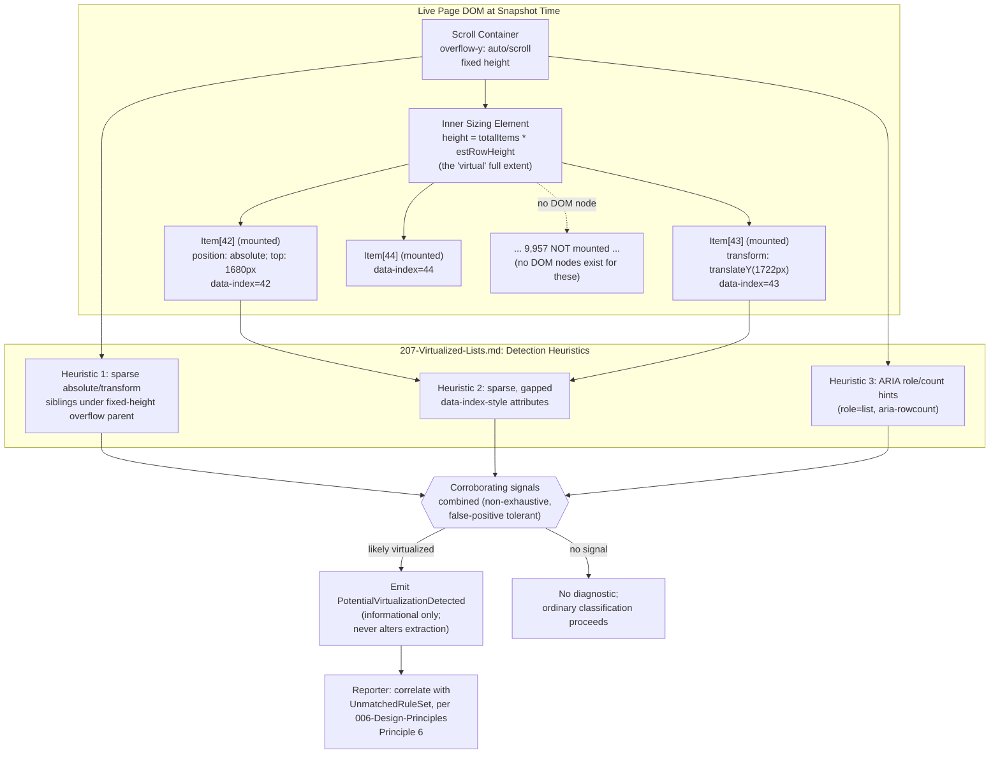
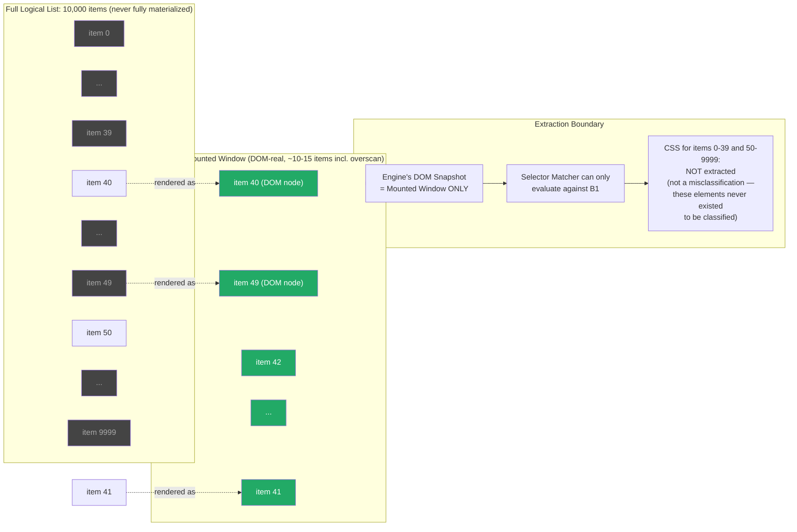

# 207 — Virtualized Lists

## 1. Title

**Critical CSS Extraction Engine — Virtualized/Windowed Lists: Detection Heuristics, the Fundamental DOM-Completeness Limitation, and Force-Render Mitigation**

## 2. Version

| Field | Value |
|---|---|
| Document Version | 1.0.0 |
| Status | Accepted |
| Last Updated | 2026-07-09 |
| Owners | Visibility Engine Working Group |
| Stability | Stable (Phase 4 design document; changes require RFC) |

## 3. Purpose

[006-Design-Principles.md](../architecture/006-Design-Principles.md) Principle 1 commits the Engine to deriving every extraction decision from what the browser actually renders. That commitment has an unavoidable corollary: the Engine can only ever reason about nodes that actually exist in the DOM at snapshot time (per [106-DOM-Snapshot.md](./106-DOM-Snapshot.md)). Virtualized (windowed) list libraries — `react-window`, `react-virtualized`, TanStack Virtual, Vue Virtual Scroller, Angular CDK's `cdk-virtual-scroll-viewport`, and the many bespoke implementations of the same pattern — are engineered specifically to violate the naive assumption that "the DOM reflects the full content of the page": they intentionally keep only a small window of list items mounted in the DOM at any moment (typically the items intersecting the scrollable container's visible region, plus a configurable overscan margin), synthesizing the illusion of a much longer list through absolute positioning or CSS transforms on a container whose total height is set to the *full* list's estimated extent. An item that would render if the user scrolled — item 500 of a 10,000-item feed — simply does not exist as a DOM node until that scroll happens, and no amount of clever traversal of the snapshot the DOM Collector already captured can produce a `DomNodeRecord` for it, because there is nothing in the live page for `getBoundingClientRect()` or `getComputedStyle()` to observe. This is not a bug in the Engine's collection logic; it is the mechanism working exactly as the virtualization library designed it to work, for the correct and valuable performance reason virtualization exists in the first place (avoiding thousands of mounted DOM nodes for a long list).

This document addresses the resulting gap in the Engine's above-the-fold coverage for virtualized regions. It specifies: (1) heuristics — explicitly non-exhaustive — for *detecting* that a given container is likely a virtualized list, so the Engine can attribute a coverage gap to a known, explicable cause rather than an unexplained one; (2) the fundamental limitation this document's title names directly: the Engine cannot invent CSS for content that does not exist in the DOM, and any temptation to approximate or guess such CSS is explicitly rejected as inconsistent with BRIEF.md's Non-Goals; (3) mitigations available today — operator/framework-author guidance, and an optional `beforeCollection`/`afterCollection` plugin hook (per [ADR-0004-Plugin-Lifecycle-Model](../adr/ADR-0004-Plugin-Lifecycle-Model.md)) that can force-render additional list items prior to snapshot, entirely under operator control and entirely consistent with Principle 1 because the force-rendered items are still real, browser-rendered DOM at the moment of capture, not a fabrication.

## 4. Audience

- Implementers of the Visibility Engine ([200-Visibility-Engine-Overview.md](./200-Visibility-Engine-Overview.md)) and DOM Collector ([106-DOM-Snapshot.md](./106-DOM-Snapshot.md)), who need to understand why virtualization is a structural, not merely a visibility-classification, limitation and where the detection heuristics in this document are consulted in the pipeline.
- Implementers of the Reporter ([006-Design-Principles.md](../architecture/006-Design-Principles.md) Principle 6, Section 2.12 of BRIEF.md), who must surface virtualization-detection diagnostics as an explicable, attributed gap rather than a silent shortfall in coverage.
- Plugin authors and framework-integration authors (React/Vue/Angular SSR adapters, Section 2.10 of BRIEF.md) implementing the force-render mitigation hook (Section 8.5) for a specific virtualization library.
- Documentation authors producing operator-facing guidance (Section 8.4) for teams whose above-the-fold content includes a virtualized list — the single most actionable audience for this document, since the mitigation that matters most in practice is informing framework authors and site operators of the limitation, not engine code.
- Reviewers evaluating any proposal that would have the Engine "guess" or synthesize CSS for virtualized-away content — this document is the normative reference such a proposal must be checked against and, per Section 8.3, rejected against.

Readers should understand the general shape of windowing/virtualization libraries (a scroll container of fixed height with `overflow: auto`/`scroll`, an inner spacer element sized to the full (virtual) list extent, and a sparse set of absolutely-positioned or `transform`-translated item elements representing only the currently-visible window), and should already be familiar with [200-Visibility-Engine-Overview.md](./200-Visibility-Engine-Overview.md)'s classification pipeline and [106-DOM-Snapshot.md](./106-DOM-Snapshot.md)'s snapshot-completeness guarantees (and their limits).

## 5. Prerequisites

- [006-Design-Principles.md](../architecture/006-Design-Principles.md) Principle 1 (Browser Is Source of Truth) and the Non-Goals in BRIEF.md Section 2.2 ("Do not compromise correctness for premature optimization") — the two normative anchors this entire document is built around: the Engine observes only what the browser renders, and it does not fabricate plausible-looking output to paper over a gap.
- [106-DOM-Snapshot.md](./106-DOM-Snapshot.md) — the snapshot mechanism whose completeness (and, specifically, incompleteness with respect to virtualized-away content) this document's limitation is a direct consequence of.
- [104-Rendering-Stabilization.md](./104-Rendering-Stabilization.md) Section 8.1, Section 12 ("Pages that never stabilize: infinite scroll") — the closely related but distinct problem of *continuously mounting* below-fold content, contrasted with this document's subject (a *fixed*, small, currently-visible window that does not grow on its own).
- [ADR-0004-Plugin-Lifecycle-Model](../adr/ADR-0004-Plugin-Lifecycle-Model.md) — the `beforeCollection`/`afterCollection` hook contract this document's force-render mitigation (Section 8.5) is implemented through.
- [200-Visibility-Engine-Overview.md](./200-Visibility-Engine-Overview.md) — the classification pipeline this document's detection heuristics feed diagnostics into, without altering the pipeline's core visibility logic.
- [203-Overflow-Handling.md](./203-Overflow-Handling.md) — clipping-ancestor and scrollable-container analysis, since virtualized lists are, definitionally, built on a scrollable overflow container this document's detection heuristics inspect.
- Familiarity with the general architecture of `react-window`, `react-virtualized`, TanStack Virtual (formerly `react-virtual`), or an equivalent windowing library in any framework, at the level of "how does it keep the DOM small while faking a long scrollable list."

## 6. Related Documents

- [200-Visibility-Engine-Overview.md](./200-Visibility-Engine-Overview.md) — the overall classification pipeline this document's detection heuristics and diagnostics attach to.
- [106-DOM-Snapshot.md](./106-DOM-Snapshot.md) — the snapshot-completeness contract this document's central limitation is defined against.
- [104-Rendering-Stabilization.md](./104-Rendering-Stabilization.md) — the sibling "content that isn't there yet" problem (infinite scroll, lazy mounting) and its different resolution (deadline-bounded waiting, not force-rendering).
- [203-Overflow-Handling.md](./203-Overflow-Handling.md) — scrollable-container/clipping-ancestor analysis this document's detection heuristics build on.
- [206-Fixed-Elements.md](./206-Fixed-Elements.md) — a sibling Phase 4 document addressing a different kind of "what the snapshot alone cannot tell you" problem, useful as a contrast in how differently this document's "cannot observe, will not guess" posture compares to that document's "always assume critical by default" posture — the two documents make opposite defaults precisely because the underlying uncertainty is different in kind (Section 13 elaborates).
- [ADR-0004-Plugin-Lifecycle-Model](../adr/ADR-0004-Plugin-Lifecycle-Model.md) — the hook contract implementing Section 8.5's mitigation.
- [006-Design-Principles.md](../architecture/006-Design-Principles.md) — Principle 1, Principle 3, Principle 6, and BRIEF.md's Non-Goals, all cited throughout.
- BRIEF.md Section 2.2 (Non-Goals) — the authoritative source for "do not compromise correctness for premature optimization," which this document interprets as "do not guess CSS for content that does not exist."
- react-window, react-virtualized, and TanStack Virtual project documentation — the concrete library patterns this document's heuristics are calibrated against.

## 7. Overview

A virtualized list, viewed from outside the library's internals, has a recognizable and fairly consistent DOM shape across implementations, despite differing APIs: an **outer scroll container** with an explicit, fixed pixel or percentage height and `overflow-y: auto` or `overflow-y: scroll`; an **inner sizing element** (sometimes literally a spacer `<div>`, sometimes the scroll container's own `scrollHeight` set via a large explicit height) whose height is set to the estimated total height of the *entire* virtual list — item count times estimated item height, or a running sum of measured heights — regardless of how many items are actually mounted; and a **sparse set of item elements**, each absolutely positioned (`position: absolute; top: <offset>px`) or transform-positioned (`transform: translateY(<offset>px)`) within that inner sizing element, each representing exactly one currently-visible-or-near-visible list item, and each commonly carrying an index-correlated attribute (`data-index`, `data-item-index`, `aria-rowindex`, or a library-specific equivalent) used internally by the library to reconcile which DOM node currently represents which logical item as the window shifts.

At DOM-snapshot time (per [106-DOM-Snapshot.md](./106-DOM-Snapshot.md)), the Engine observes exactly this: a handful of item elements, correctly styled, correctly classified for visibility (an item currently within the visible window and within the fold is, correctly, above-fold; the Engine's ordinary geometry/fold-intersection logic per [201-Geometry-Engine.md](./201-Geometry-Engine.md)/[202-Intersection-Engine.md](./202-Intersection-Engine.md) handles this case with no special-casing needed) — but it has no way to know, or to be told by the DOM itself, that 9,994 further items *would* exist if the user scrolled, because those items genuinely do not exist anywhere the browser (or the Engine, which observes only what the browser observes, per Principle 1) can see them. If those not-yet-rendered items would, upon rendering, use CSS classes not otherwise present anywhere in the currently-rendered window (e.g., a list where every 10th item has a distinct "featured" class, and the currently-mounted window happens to contain no featured item), the CSS rules for that class are absent from the extracted critical CSS entirely — not misclassified as non-critical, but genuinely never observed as a candidate at all, because the Selector Matcher (Phase 6) only ever evaluates selectors against elements that exist in the snapshot.

This document's structure follows directly from that framing: Section 8.1 specifies detection heuristics for surfacing this situation as a known, attributed gap; Section 8.2 states the fundamental limitation precisely and forecloses any temptation to work around it via guessing; Section 8.3 connects that foreclosure explicitly to BRIEF.md's Non-Goals; Sections 8.4–8.5 specify the two mitigations the Engine actually offers — documentation/guidance, and an opt-in force-render plugin hook.

## 8. Detailed Design

### 8.1 Detection Heuristics

**Why detection matters even though the Engine cannot fix the underlying gap.** Detecting a likely-virtualized container does not let the Engine extract CSS for content it cannot see — that is impossible by construction (Section 8.2) — but it does let the Engine surface an explicit, attributed diagnostic (`PotentialVirtualizationDetected`) rather than leaving an operator to wonder, after a production flash-of-unstyled-content report for item 500 of a feed, why the Engine's coverage report showed nothing unusual. This is the same Principle 6 (Fail-Fast Diagnostics) posture already applied to closed shadow roots and inaccessible iframes in [106-DOM-Snapshot.md](./106-DOM-Snapshot.md): an unavoidable blind spot must be a *loud*, attributable blind spot, never a silent one.

**Heuristic 1: sparse, absolutely-positioned or transform-positioned siblings under a common parent, where the parent (or an ancestor) has a fixed height and `overflow: auto`/`scroll`.** This is the single strongest and most broadly applicable signal, because it captures the structural mechanism virtualization is built on regardless of which specific library produced it. Concretely, the heuristic looks for a node `P` such that:

- `P.computedStyle.overflowY` is `auto` or `scroll` (per the allow-listed computed-style facts already captured by [106-DOM-Snapshot.md](./106-DOM-Snapshot.md) Section 8.2, extended per [203-Overflow-Handling.md](./203-Overflow-Handling.md) with scrollable-container detection this heuristic reuses rather than reimplements), and `P`'s `boundingBox.height` is a small fraction of some descendant's total layout extent (the classic virtualization "small viewport window, huge virtual content" ratio);
- `P` has a single child (or a small, fixed number of children) whose `computedStyle.position` is `relative` or `static` but whose own height is unusually large relative to `P`'s own height (the inner sizing/spacer element candidate) — or, in libraries that skip an explicit spacer and instead set `scrollHeight` directly via a large min-height, this sub-signal is optional, not required;
- that sizing element's direct children (the candidate item elements) are predominantly `position: absolute` (with distinct, mostly-monotonically-increasing `top` values, extractable from computed `top`/`transform` values already visible via the same computed-style facts) or carry a non-identity `transform: translate(...)`/`translate3d(...)` value, **and** the number of such children is small relative to what a reasonable estimate of the sizing element's total virtual extent (its height divided by an observed average item height) would predict — i.e., a large discrepancy between "how many items *could* fit in the claimed total height" and "how many item elements are actually present."

**Heuristic 2: sparse `data-index`-style attributes with non-contiguous or gapped values.** Independent of the geometric signal above, the Engine's per-node attribute capture ([106-DOM-Snapshot.md](./106-DOM-Snapshot.md) Section 8.2's `attributes` record) already includes any `data-*` attributes present (subject to the configurable deny-list). A sibling group where most elements carry a `data-index` (or `data-item-index`, `data-virtuoso-index`, `aria-rowindex`, or similarly named/patterned attribute — the heuristic matches a small, documented, extensible list of known attribute-name conventions used by the major libraries plus a generic `data-*index*` pattern fallback) whose numeric values, when sorted, form a contiguous run **starting well above zero**, or whose values are contiguous but whose count is far smaller than an independently observable "total items" hint (e.g., an `aria-setsize`/`aria-rowcount` attribute on the scroll container, or a visible "Showing 42 of 10,000 results" text node — the latter not itself parsed by this heuristic, but noted as a common human-readable corroborating signal an operator reviewing the diagnostic can use), is a strong independent corroborating signal for virtualization, distinguishable from an ordinary, complete, non-virtualized list (which would show `data-index` values `0..N-1` contiguous from zero, matching its actual, complete item count).

**Heuristic 3: ARIA role hints.** Libraries that follow accessibility best practices frequently apply `role="list"`/`role="listbox"`/`role="grid"` to the scroll container and `role="listitem"`/`role="row"`/`role="option"` to items, sometimes paired with `aria-rowcount`/`aria-setsize` attributes stating the *logical* total count independent of how many DOM nodes are currently mounted — a direct, explicit, machine-readable corroborating signal when present (not universally present, since not every virtualization implementation is accessibility-annotated, which is why this is a corroborating heuristic and not the primary one).

**Why these heuristics are explicitly non-exhaustive, and why that is stated as policy, not merely as an implementation caveat.** No structural, purely DOM-observable heuristic can *prove* virtualization is occurring, because the same structural pattern (sparse absolutely-positioned children under a scrollable, fixed-height parent) can, in principle, describe a deliberately small, complete list of five items laid out unusually, or a custom, non-virtualized carousel component using absolute positioning for an unrelated visual effect. Conversely, a virtualization implementation using none of the common conventions (an unusual custom implementation using `overflow: hidden` with manual scroll-offset compensation via `scrollLeft`/`scrollTop` manipulation instead of `transform`, for instance) can evade every heuristic listed here entirely. This document therefore treats detection as a **best-effort, false-positive-tolerant, false-negative-expected** signal whose only consequence is a diagnostic, never a behavioral change to extraction itself (Section 8.2) — a design deliberately mirroring the informational-only occlusion signal in [206-Fixed-Elements.md](./206-Fixed-Elements.md) Section 8.4, for the identical underlying reason: an ambiguous, unproven structural inference must never silently drive a correctness-affecting decision, only an attributable diagnostic.

### 8.2 The Fundamental Limitation, Stated Precisely

**The Engine can extract CSS only for selectors that match at least one element present in the DOM snapshot it actually captured.** This is not a limitation specific to virtualization — it is a restatement of Principle 1 and of how the Selector Matcher (Phase 6, [400-Selector-Matching.md](./400-Selector-Matching.md)) fundamentally operates: `Element.matches()` and `querySelectorAll()` operate against the DOM that exists, and there is no browser-native operation, and by design no Engine-native approximation, that can evaluate a selector against a hypothetical element that has not been created. Virtualization is simply the most common, most consequential real-world scenario in which this limitation actually bites: it is a deliberate, popular, performance-motivated pattern that guarantees a large fraction of a list's logical content is, at any given moment, genuinely absent from the DOM — not merely hidden, not merely off-screen with `display: none`, but structurally nonexistent as far as any DOM query is concerned.

**Consequence: any CSS rule that applies exclusively to a virtualized-away item's distinguishing feature is absent from extraction, with no exception.** If a virtualized list's items are rendered by a shared component and every item in the currently-mounted window happens to use the same visual variant (no "featured," "highlighted," "error," or "sold out" variant currently visible), the CSS for those unrendered variants is not extracted, is not flagged as "matched but excluded," and does not appear anywhere in the `MatchedRuleSet`/`UnmatchedRuleSet` diagnostic reports in a way that specifically calls out "this selector would have matched a virtualized item" — from the Selector Matcher's point of view, a selector that matches zero elements in the snapshot is indistinguishable from a selector that is simply unused on the page entirely; both report as "unmatched." This absence-of-attribution gap is itself explicitly closed by this document's detection heuristics (Section 8.1): the `PotentialVirtualizationDetected` diagnostic exists precisely to give an operator reviewing an unmatched-selector report a specific, plausible causal hypothesis ("this selector might be unmatched because of virtualization, not because it's genuinely dead CSS") for selectors whose owning stylesheet or class-naming pattern correlates with a detected virtualized container's item component.

**Why the Engine does not attempt to statically enumerate the virtualized library's full item set from its data source.** A conceivable alternative — inspect the virtualization library's internal state (its item array, item count, or data source) via framework-specific introspection (React DevTools hooks, Vue's internal reactivity graph, a library-specific imperative API) and use that to reconstruct what *would* render for arbitrary indices — is explicitly rejected as a general-purpose Engine capability. It would require the Engine to understand framework- and library-specific internals (violating the framework-agnostic posture implicit throughout BRIEF.md's Section 2.4 module table, which has no "framework introspection" module), and, more fundamentally, it would mean synthesizing DOM structure and computed style for elements that were never actually rendered by the browser — a direct violation of Principle 1, since "what class names and structure item 500 would have" is a *guess* based on extrapolating from rendered items' patterns, not an observation of anything the browser has done. The one Engine-sanctioned way to observe item 500 is to make the browser actually render it (Section 8.5) — never to infer its shape from the outside.

### 8.3 Explicit Tie-Back to BRIEF.md's Non-Goals

BRIEF.md Section 2.2 states the Non-Goals plainly: "Do not compromise correctness for premature optimization." This document reads that Non-Goal as directly governing the virtualization case, via the following chain of reasoning, stated here because it is the single most important normative commitment in this document and must not be left implicit:

1. A tool that "guessed" plausible CSS for virtualized-away content — for instance, by matching every selector in the stylesheet against a synthesized, hypothetical DOM built by cloning a rendered item's structure and substituting index-dependent text — would produce output that is *usually* close enough to be unnoticed, and *occasionally* wrong in ways a real production incident would surface (a selector that happens to correlate with index parity, a conditional class the Engine's cloned-item heuristic does not know to vary, a `nth-child`-style selector whose behavior across a hypothetical 10,000-item range the Engine cannot verify without actually rendering that many items).
2. This is precisely the shape of failure this project exists to displace: Section 2.1 and [001-Vision.md](../architecture/001-Vision.md) frame the entire project's reason to exist as rejecting exactly this class of plausible-but-unverified approximation, which is how static-analysis-based predecessor tools accumulated their reputation for unreliable output (per [006-Design-Principles.md](../architecture/006-Design-Principles.md) Principle 1's rationale).
3. Therefore, the correct response to "the Engine cannot see virtualized-away content" is **not** "approximate it anyway, because some coverage is better than none" — it is **exactly the response this document specifies**: extract accurately for what is actually observable, make the gap loudly attributable (Section 8.1), and offer the operator/framework author a real, browser-verified way to close the gap if they choose to (Sections 8.4–8.5). A smaller, verifiably-correct critical CSS payload that is honest about its coverage gap is strictly preferable, under this project's stated values, to a larger, unverified payload that merely *looks* more complete.

This is also the reason this document's posture differs so sharply from [206-Fixed-Elements.md](./206-Fixed-Elements.md)'s always-critical-by-default policy for `position: fixed` elements, despite both documents addressing "the Engine isn't sure what's really needed": in the fixed-element case, the element *exists* in the DOM and its geometry is fully, accurately observable — the uncertainty is purely about a *policy interpretation* of unambiguous, fully-observed facts (does viewport-relative-and-present mean "always needed"?), and defaulting to inclusion costs a small, bounded amount of extra CSS with no correctness risk. In the virtualization case, the uncertain content **does not exist to be observed at all** — there is no bounded, small set of "maybe-needed" rules to conservatively include, because the space of what a not-yet-rendered item's markup and classes could be is, in the general case, unbounded and library-specific. Defaulting to "guess broadly" here has no natural bounded form the way "mark this fixed header critical" does; it would mean either fabricating structure (rejected, per Section 8.2) or including the entire stylesheet defensively (which defeats the purpose of critical CSS extraction and is exactly the kind of "premature-optimization-avoidance taken to an absurd extreme" this project's Non-Goals do not actually call for — the Non-Goal is about not sacrificing correctness for speed, not about maximizing conservatism regardless of cost). The only sound response, given genuinely absent information, is to be honest about the gap rather than to compensate for it with an unverifiable guess.

### 8.4 Mitigation: Documentation and Guidance for Framework Authors and Operators

**The primary, lowest-risk mitigation is not code — it is documentation.** Because the fundamental limitation (Section 8.2) cannot be engineered away, the highest-leverage response available to this project is ensuring that operators integrating a virtualized list into an above-the-fold region understand, before they hit a production surprise, that: (a) only the currently-mounted window's styles will be captured; (b) if the list's items have visual variants that are unlikely to appear in the very first, unscrolled render (a "featured" badge that appears on item 47 of a feed that only shows items 1–10 initially), those variants' CSS will not be in the critical bundle and must be shipped via the non-critical stylesheet exactly as any legitimately below-the-fold CSS would be — which is, in fact, the *correct*, not merely tolerable, outcome for genuinely below-the-fold variants, and only becomes a problem if the operator's intent was for that variant to be usable immediately, above the fold, which requires the force-render mitigation (Section 8.5) instead.

**Concrete guidance content (for the forthcoming operator-facing documentation this design authorizes, tracked separately from this RFC-style design document per BRIEF.md's `docs/` layout distinguishing `design/` from operator guides).** The guidance should instruct framework/library authors and site operators to: identify which visual variants of a virtualized list's items are expected to be visible without any user interaction (i.e., genuinely above-the-fold on first paint, which for a virtualized list is normally just "whichever items happen to be first" — usually a small, predictable, low-variance set); verify, via the Engine's `PotentialVirtualizationDetected` diagnostic and the accompanying unmatched-selector report, whether any above-the-fold-relevant variant's CSS appears to be missing; and, if so, either restructure the list's initial data so a representative sample of variants appears within the default first-render window (the cheapest fix, requiring no Engine feature at all — simply ensuring the CI extraction run's fixture data includes an item of each critical variant in position 1–10), or use the force-render hook (Section 8.5) if restructuring the fixture data is impractical.

**Why this is listed as the primary mitigation despite being "just documentation."** Consistent with [104-Rendering-Stabilization.md](./104-Rendering-Stabilization.md) Section 12's treatment of live-ticker/infinite-scroll pages (where the "primary, expected" resolution path is operator awareness and configuration, not an algorithmic fix), this document treats guidance as a first-class mitigation, not a fallback admission of defeat — because the underlying problem (Section 8.2) has no algorithmic fix, the actually-effective interventions are almost entirely on the operator/fixture-data side, and pretending otherwise by over-investing in Engine-side heuristics would misallocate effort relative to where the real leverage is.

### 8.5 Mitigation: Force-Render via `beforeCollection`/`afterCollection` Plugin Hook

**The mechanism.** For operators who need genuine, browser-verified coverage of additional virtualized items beyond whatever the natural initial render happens to include — for instance, a design system with ten visual variants of a list item, where an operator wants critical CSS coverage for all ten regardless of which specific items a given route's data happens to render first — the Engine exposes this capability entirely through the existing, general-purpose plugin lifecycle (per [ADR-0004-Plugin-Lifecycle-Model](../adr/ADR-0004-Plugin-Lifecycle-Model.md)), not through a new, virtualization-specific hook. A plugin implementing `beforeCollection` receives the stage-scoped context defined by that ADR (a read-only view of the stabilized page reference, per that document's Implementation Notes item 1) and can, within that hook, drive the live `Page` (via whatever narrow capability the hook contract exposes — see the caveat below) to programmatically scroll the virtualized container through a configured range, forcing the library's own, real, unmodified windowing logic to mount additional items exactly as it would for an actual scrolling user, before returning control to the orchestrator, which then proceeds to `DomCollected` and captures a snapshot that includes every item the plugin caused to mount.

**Why this is fully consistent with Principle 1 despite "forcing" rendering that a real first-time visitor would not naturally trigger before scrolling.** The critical distinction is between *fabricating* DOM (rejected, Section 8.2) and *causing the real library, running unmodified in a real browser, to render real DOM it is fully capable of rendering under its own normal operation* — a programmatic scroll event is not different in kind from a user's scroll event as far as the virtualization library's own reconciliation logic is concerned; the library cannot tell the difference, and does not need to, because the resulting DOM nodes are exactly what it would have produced for a real user reaching that scroll position. This is the same category of narrow, deliberate exception already established in [104-Rendering-Stabilization.md](./104-Rendering-Stabilization.md) Section 8.5 for custom application-declared readiness signals: the Engine is not overriding or second-guessing the browser's rendering, it is *driving* the browser through additional, legitimate states, each of which is independently, fully browser-observed once reached.

**Why this must be an explicit, opt-in plugin action, not a default Engine behavior.** Force-rendering additional list items has real costs (Section 14) and real risks of *changing the very thing being measured* if done carelessly — over-aggressively scrolling a virtualized container during collection could itself perturb [104-Rendering-Stabilization.md](./104-Rendering-Stabilization.md)'s stability window if collection and stabilization are not carefully sequenced (see Implementation Notes), and could capture item variants that are not actually relevant to any real above-the-fold scenario, bloating the critical CSS payload for no benefit — precisely the class of risk [006-Design-Principles.md](../architecture/006-Design-Principles.md) Principle 3 requires be an explicit, additive, opt-in choice rather than a silent default. An operator who does not need this capability pays zero cost for its existence; an operator who does need it accepts the specific, understood tradeoff of a slightly longer collection phase in exchange for genuine coverage.

**Scope discipline: this hook drives real interaction, it does not become a general "run arbitrary page automation" escape hatch.** Per [ADR-0004-Plugin-Lifecycle-Model](../adr/ADR-0004-Plugin-Lifecycle-Model.md)'s own Edge Cases discussion (Section 12 of that document: "a plugin needs to run logic conceptually outside any of the six defined stages... intentionally not exposed as a seventh generic hook"), this document does not propose expanding the plugin surface with virtualization-specific primitives; it documents an existing, general capability (`beforeCollection`'s access to the page reference, narrowly scoped per that ADR's sandboxing model) being applied to this specific, common use case, and recommends (as forthcoming `docs/plugins/003-Plugin-Examples.md` content, out of scope for this design document) a reference implementation pattern: scroll the detected virtualized container's `scrollTop` in configured increments, waiting one `requestAnimationFrame` (or a short, bounded settle window, reusing the frame-quiescence primitive already specified in [104-Rendering-Stabilization.md](./104-Rendering-Stabilization.md) Section 8.1 at a much smaller scale) between increments, up to a configured maximum number of increments or a configured maximum elapsed time, then restoring `scrollTop` to its original (typically zero) value before returning control — restoring scroll position matters so the subsequent DOM snapshot's *geometry* reflects the original, intended initial-paint scroll state, even though the container now has additional, previously-unmounted items present in the DOM (most virtualization libraries, on scrolling back to the top, retain recently-mounted items for some configured overscan/cache window rather than immediately unmounting them, which is what makes this pattern work in practice — see Edge Cases for the case where a library does not retain them).

## 9. Architecture

### 9.1 Virtualized List Structural Pattern and Detection Signal Flow



### 9.2 Rendered-vs-Total-Items Relationship and the Extraction Boundary



This diagram makes the document's central point structural rather than merely prose-stated: the "Extraction Boundary" is not a policy choice the Engine could relax by trying harder — it is the literal boundary of what a `page.evaluate()`-driven DOM walk ([106-DOM-Snapshot.md](./106-DOM-Snapshot.md) Section 10.1) can ever observe, and every item outside the currently-mounted window (grey, in the diagram) is not merely "classified as non-critical" but genuinely absent from the data structure the Visibility Engine and Selector Matcher operate over.

### 9.3 Force-Render Mitigation Sequence

```mermaid
sequenceDiagram
    participant Orch as Orchestrator
    participant Plugin as Force-Render Plugin<br/>(beforeCollection hook)
    participant PW as Playwright Page
    participant Lib as Virtualization Library<br/>(unmodified, in-page)

    Orch->>Orch: Stabilized state reached (104-Rendering-Stabilization.md)
    Orch->>Plugin: beforeCollection(context)
    Plugin->>PW: evaluate: set scrollContainer.scrollTop += increment
    PW->>Lib: native scroll event fires
    Lib->>Lib: real windowing logic mounts newly-visible items,<br/>unmounts far-scrolled-past items<br/>(unmodified library behavior)
    Plugin->>PW: waitForNextAnimationFrame() x N (bounded settle)
    Note over Plugin,PW: repeat increment loop up to<br/>maxIncrements or maxElapsedMs
    Plugin->>PW: evaluate: scrollContainer.scrollTop = originalScrollTop
    PW->>Lib: scroll event fires again; library re-mounts<br/>items for restored position<br/>(retains recently-mounted items per its own cache/overscan policy)
    Plugin-->>Orch: patch: { forceRenderedIndices: [40..127] } (diagnostic-only patch)
    Orch->>Orch: proceed to DomCollected;<br/>snapshot now includes every item<br/>the library mounted during the loop,<br/>subject to its own retention policy
```

## 10. Algorithms

### 10.1 Algorithm: Virtualization Detection Scoring

**Problem statement.** Given a `DomSnapshot` (per [106-DOM-Snapshot.md](./106-DOM-Snapshot.md)), identify candidate containers likely to be virtualized list viewports, combining the three heuristics of Section 8.1 into a single, bounded, non-authoritative confidence signal suitable for driving a diagnostic, never an extraction-behavior change.

**Inputs.** `snapshot: DomSnapshot`, `config: VirtualizationDetectionPolicy` (containing the recognized `data-*index*` attribute-name patterns, ARIA role list, and score thresholds — all overridable, since library conventions evolve).

**Outputs.** `VirtualizationCandidate[]`, each `{ containerNodeId, confidenceScore: number, signals: string[] }`.

**Pseudocode.**

```text
function detectVirtualizedContainers(snapshot, config) -> VirtualizationCandidate[]:
    candidates = []

    for fragment in snapshot.fragments:
        for node in fragment.nodes:
            if not isScrollableOverflowContainer(node):
                // Reuses 203-Overflow-Handling.md's existing scrollable-
                // container predicate rather than reimplementing it.
                continue

            children = lookupChildren(node, fragment)
            score = 0
            signals = []

            // Heuristic 1: sparse absolute/transform-positioned descendants
            // under an inner sizing element whose height implies far more
            // items than are actually mounted.
            sizingCandidate = findLikelySizingElement(children)
            if sizingCandidate != null:
                itemEls = lookupChildren(sizingCandidate, fragment)
                positioned = itemEls.filter(e =>
                    e.computedStyle.position in ["absolute"]
                    or hasNonIdentityTransform(e.computedStyle.transform))
                if positioned.length > 0 and positioned.length == itemEls.length:
                    estimatedTotalItems = estimateFromSizingHeight(sizingCandidate, positioned)
                    if estimatedTotalItems > positioned.length * config.sparsityRatioThreshold:
                        score += config.weights.sparsePositionedChildren
                        signals.push("sparse-positioned-children")

            // Heuristic 2: sparse, gapped data-index-style attributes
            indexAttrs = children.map(c => extractIndexLikeAttribute(c, config.indexAttributePatterns))
                                  .filter(v => v != null)
            if indexAttrs.length > 0:
                sorted = indexAttrs.sort()
                isContiguous = allConsecutive(sorted)
                startsAboveZero = sorted[0] > 0
                if isContiguous and (startsAboveZero or hasCountHint(node) and
                                      indexAttrs.length < countHintValue(node)):
                    score += config.weights.gappedIndexAttributes
                    signals.push("gapped-index-attributes")

            // Heuristic 3: ARIA role/count hints
            if node.attributes["role"] in config.recognizedListRoles:
                score += config.weights.ariaRoleHint
                signals.push("aria-role-hint")
                if node.attributes["aria-rowcount"] or node.attributes["aria-setsize"]:
                    score += config.weights.ariaCountHint
                    signals.push("aria-count-hint")

            if score >= config.detectionThreshold:
                candidates.push({ containerNodeId: node.nodeId, confidenceScore: score, signals })

    return candidates
```

**Time complexity.** `O(N)` overall — a single pass over all nodes for the outer scrollable-container check, with `O(C)` inner work per candidate container (`C` being that container's typically-small child count), giving `O(N + Σ C)` which is bounded by `O(N)` since `Σ C ≤ N`.

**Memory complexity.** `O(K)` for the candidate list, `K` being the (typically very small — usually zero, one, or a handful) number of scrollable containers on a page, negligible relative to `O(N)` snapshot memory.

**Failure cases.** A false positive (a genuinely complete, small list that happens to use absolute positioning for styling reasons unrelated to virtualization) produces a diagnostic with no actual coverage gap behind it — harmless, since the diagnostic is informational only (Section 8.1). A false negative (a virtualization implementation using none of the recognized conventions) produces no diagnostic and, critically, is not distinguishable from "no virtualization present at all" from the Engine's point of view — this is an accepted, structural limitation of a heuristic-based detector, stated explicitly rather than hidden, per Section 8.1's "non-exhaustive by policy" framing.

**Optimization opportunities.** `isScrollableOverflowContainer` and the general scroll-container enumeration are already computed once by [203-Overflow-Handling.md](./203-Overflow-Handling.md) for its own overlap/clipping analysis; this algorithm should consume that document's already-computed scrollable-container list rather than re-deriving it, avoiding duplicate `O(N)` passes over the snapshot.

### 10.2 Algorithm: Force-Render Scroll-and-Settle Loop

**Problem statement.** Given a detected (or operator-identified) virtualized container and a configured index/scroll range to force-mount, drive the live page's scroll position through that range in bounded increments, allowing the real virtualization library to mount additional items, then restore the original scroll position, all within a bounded time budget.

**Inputs.** `page: PageHandle`, `containerSelector: string`, `policy: ForceRenderPolicy` containing `targetScrollRangePx: [number, number]` or `targetIndexRange: [number, number]` (translated to a scroll range via an estimated or measured item height), `incrementPx: number`, `settleFramesPerIncrement: number` (default small, e.g., 2–3, deliberately much smaller than [104-Rendering-Stabilization.md](./104-Rendering-Stabilization.md)'s full stabilization window since this is a narrow, single-purpose settle, not general page stabilization), `maxElapsedMs: number`.

**Outputs.** `ForceRenderResult { mountedIndices: number[], elapsedMs: number, diagnostics: Diagnostic[] }`.

**Pseudocode.**

```text
function forceRenderVirtualizedItems(page, containerSelector, policy) -> ForceRenderResult:
    deadline = now() + policy.maxElapsedMs
    originalScrollTop = page.evaluate(sel => document.querySelector(sel).scrollTop, containerSelector)
    mountedIndices = new Set()
    diagnostics = []

    currentTarget = policy.targetScrollRangePx[0]
    while currentTarget <= policy.targetScrollRangePx[1]:
        if now() >= deadline:
            diagnostics.push(ForceRenderTimeoutDiagnostic(currentTarget, policy.targetScrollRangePx))
            break

        page.evaluate((sel, top) => { document.querySelector(sel).scrollTop = top },
                       containerSelector, currentTarget)

        for i in range(policy.settleFramesPerIncrement):
            page.waitForNextAnimationFrame()

        visibleIndices = page.evaluate(sel => extractDataIndexAttributes(sel), containerSelector)
        for idx in visibleIndices:
            mountedIndices.add(idx)

        currentTarget += policy.incrementPx

    // Restore original position; library's own retention/overscan policy
    // determines how many force-mounted items remain present afterward.
    page.evaluate((sel, top) => { document.querySelector(sel).scrollTop = top },
                   containerSelector, originalScrollTop)
    for i in range(policy.settleFramesPerIncrement):
        page.waitForNextAnimationFrame()

    finalMounted = page.evaluate(sel => extractDataIndexAttributes(sel), containerSelector)
    if finalMounted.length < mountedIndices.size:
        diagnostics.push(RetentionPolicyDroppedItemsDiagnostic(mountedIndices.size, finalMounted.length))

    return ForceRenderResult(mountedIndices: Array.from(mountedIndices),
                              elapsedMs: policy.maxElapsedMs - (deadline - now()),
                              diagnostics)
```

**Time complexity.** `O(R / incrementPx × settleFramesPerIncrement)` round trips, where `R` is the configured scroll range; bounded above by `maxElapsedMs`, mirroring [104-Rendering-Stabilization.md](./104-Rendering-Stabilization.md)'s outer-deadline discipline (Section 10.1 of that document) applied at a much smaller scale and for a narrower, single-plugin purpose rather than whole-page stabilization.

**Memory complexity.** `O(M)` for `mountedIndices`, `M` being the number of distinct items observed across the scroll loop — bounded by the configured range divided by average item height, a small, operator-controlled number, not the full virtual list size.

**Failure cases.** The library's own overscan/retention policy may unmount items faster than the plugin scrolls past them if `incrementPx` is too large relative to the library's overscan margin, causing `mountedIndices` (the union observed *during* the loop) to diverge from what is actually present in the *final* snapshot after scroll restoration — this is why the algorithm separately checks `finalMounted.length` against the running union and emits `RetentionPolicyDroppedItemsDiagnostic` when they diverge, so an operator tuning `incrementPx`/overscan configuration together can see the effect directly rather than being surprised by a smaller-than-expected final snapshot. A `containerSelector` that does not resolve, or that resolves to a non-scrollable element, is a configuration error surfaced as a hard plugin-hook failure per [ADR-0004-Plugin-Lifecycle-Model](../adr/ADR-0004-Plugin-Lifecycle-Model.md)'s failure-policy mechanism, not silently ignored.

**Optimization opportunities.** Rather than scrolling in small, uniform increments across the entire configured range, an operator who knows the exact target indices they need (e.g., "I need one item of each of these five known CSS-variant classes, and I know representative index values for each from the data source") can configure a small, discrete `targetIndexRange` list instead of a continuous range, converting this from an `O(R / incrementPx)` sweep into `O(|targetIndices|)` discrete jumps — each still followed by a short settle, but avoiding the sweep's redundant intermediate positions. This discrete-jump mode is the recommended configuration for the common case (a known, small set of variants to cover) and is documented as the preferred pattern over a full continuous sweep, which is reserved for exploratory/diagnostic use.

## 11. Implementation Notes

- The `PotentialVirtualizationDetected` diagnostic must carry enough structural information (the container's `nodeId`, the specific heuristic signals that fired, and the class names/tag names observed among the currently-mounted items) for the Reporter to cross-reference it against the `UnmatchedRuleSet` report (per [006-Design-Principles.md](../architecture/006-Design-Principles.md) Principle 6) and surface a combined, actionable hint such as "N unmatched selectors share a stylesheet source with a detected virtualized list's item component; some of these may be virtualized-away, not dead, CSS" — this correlation is a Reporter-side responsibility (Phase 13, `1004-Visualization.md`/`1005-Debug-UI.md`, forward reference) building on this document's raw diagnostic, not something this document's detection pass computes itself.
- The force-render plugin hook (Section 8.5/10.2) must run and complete entirely within the `beforeCollection` hook's own timeout budget (per [ADR-0004-Plugin-Lifecycle-Model](../adr/ADR-0004-Plugin-Lifecycle-Model.md)'s per-plugin `timeoutMs`), which implies the plugin's own `maxElapsedMs` configuration should be set comfortably below the hook-level timeout, not equal to or exceeding it — a plugin that races its own internal deadline against the hook framework's external deadline risks being killed mid-scroll-restoration, potentially leaving the page's scroll position in a force-rendered, not-yet-restored state at snapshot time; implementers should structure the loop so the restoration step (the final, most important step for snapshot correctness) is attempted even under internal time pressure, prioritizing it over squeezing in one more increment.
- Because the force-render loop runs during `beforeCollection`, strictly after [104-Rendering-Stabilization.md](./104-Rendering-Stabilization.md)'s `Stabilized` state has already been entered (per [ADR-0004-Plugin-Lifecycle-Model](../adr/ADR-0004-Plugin-Lifecycle-Model.md)'s Architecture diagram ordering `afterNavigation → beforeCollection`), the scroll manipulation this document specifies does not need to re-run the *entire* stabilization algorithm — only its own narrow, bounded settle window (Section 10.2's `settleFramesPerIncrement`) — but implementers must be aware that force-rendering additional items is itself a source of new DOM mutations, and if a plugin's settle window is too short, the DOM Collector's subsequent walk ([106-DOM-Snapshot.md](./106-DOM-Snapshot.md)) could observe a force-rendered item mid-mount (e.g., before an async image inside it has begun loading) — this is a real, if narrow, risk, and conservative default `settleFramesPerIncrement` values (favoring a few extra frames over too few) are recommended.
- `extractIndexLikeAttribute`'s recognized attribute-name pattern list (Section 10.1) should be maintained as an explicit, documented, versioned configuration default (not hardcoded and unextendable), since virtualization libraries' specific attribute-naming conventions are not standardized and change or add new libraries over time; this list is analogous in spirit to [104-Rendering-Stabilization.md](./104-Rendering-Stabilization.md)'s `ignoredMutationSelectors` — an evolving, operator-extensible allow-list rather than a fixed enum.
- Detection (Section 10.1) should run as part of the ordinary Visibility Engine pass, reusing already-captured per-node facts, and must not itself trigger any additional `page.evaluate()` round trips — it is a purely host-side, post-hoc analysis of the already-captured `DomSnapshot`, consistent with [106-DOM-Snapshot.md](./106-DOM-Snapshot.md)'s single-round-trip eagerness rationale (Section 8.6 of that document).

## 12. Edge Cases

- **A virtualization library that does not use `data-index`-style attributes at all and does not use ARIA roles**, relying purely on internal, unexposed bookkeeping (e.g., a bespoke implementation using only closures/component state with no DOM-visible index correlation). Only Heuristic 1 (structural: sparse positioned children under a scrollable, fixed-height parent with an implied-vs-actual item count mismatch) can fire; if the implementation additionally avoids a distinct inner sizing element (setting `scrollHeight` via some other mechanism, e.g., a large `min-height` directly on the scroll container itself), even Heuristic 1's mismatch-detection sub-signal may fail to find a clean "sizing element" candidate, and detection may produce no diagnostic at all — an accepted false negative per Section 8.1's explicit non-exhaustiveness policy, with no algorithmic remedy beyond expanding the heuristic set as new patterns are identified (Future Work).
- **A genuinely small, complete list (20 items, all mounted) that happens to use `position: absolute` for a deliberate overlapping-card visual effect**, unrelated to virtualization. Heuristic 1's sparsity-ratio check (`estimatedTotalItems > positioned.length * sparsityRatioThreshold`) is specifically designed to avoid firing here: with all items present, the "estimated total" computed from the sizing element's height and the "actual mounted count" are equal (or close), and the ratio check does not exceed threshold — this is the primary defense against this specific false-positive shape, though a pathological sizing-element height (an author-error oversized container with only a few actual items) could still trigger a low-confidence false positive, which remains harmless per the diagnostic-only policy.
- **A virtualized list nested inside another virtualized list** (a virtualized grid of virtualized rows, or a virtualized list where each item is itself a horizontally virtualized carousel) — detection runs independently per scrollable container per Section 10.1's per-node iteration, so both the outer and inner virtualized containers are independently detected and independently diagnosed; there is no special nested-virtualization handling, and the force-render mitigation (Section 8.5), if used, would need to be configured (and run) for each level independently by the operator/plugin author, a real but manageable authoring complexity increase this document does not attempt to automate away.
- **Force-rendering interacts with `content-visibility: auto`** (a CSS-native, browser-level virtualization-adjacent primitive, distinct from JavaScript-library virtualization, that skips rendering work for off-screen content but does *not* remove elements from the DOM the way JavaScript virtualization does). Elements skipped via `content-visibility: auto` remain structurally present in the DOM and are therefore fully visible to the DOM Collector's walk regardless of their rendering-skip state — `content-visibility: auto` is consequently **not** the subject of this document's detection heuristics or force-render mitigation at all, since there is no DOM-completeness gap to mitigate; it is, however, relevant to [201-Geometry-Engine.md](./201-Geometry-Engine.md)/[204-Transform-Handling.md](./204-Transform-Handling.md)'s geometry-computation concerns (a `content-visibility: auto` element's `getBoundingClientRect()` may report its most-recently-rendered size rather than an up-to-date one), which those documents address, not this one; this distinction is flagged here specifically to prevent a future contributor from conflating the two mechanisms.
- **A force-render plugin misconfigured with a `targetScrollRangePx` exceeding the container's actual scrollable extent.** `page.evaluate` setting `scrollTop` beyond `scrollHeight - clientHeight` is clamped by the browser to the maximum valid scroll offset, which is benign — the loop's increments beyond that point simply produce no further newly-mounted items, and the algorithm terminates normally at `maxElapsedMs` or the configured range's end, whichever comes first, with `mountedIndices` correctly reflecting only what was actually observed; no special-casing is required beyond documenting that an overlong configured range wastes time budget rather than causing an error.
- **Server-side rendering (SSR) of the initial virtualized window, combined with client-side hydration that changes which items are mounted.** If an SSR-rendered virtualized list's server-rendered window differs from its post-hydration client-rendered window (a real possibility if server and client estimate item heights differently, or if the client immediately scrolls to restore a saved scroll position on mount), the DOM snapshot — captured after [104-Rendering-Stabilization.md](./104-Rendering-Stabilization.md)'s stabilization, i.e., after hydration settles — correctly reflects the post-hydration window, not the SSR window; this is the expected, correct behavior (Principle 1: observe what the browser actually shows after settling, not an intermediate SSR artifact), but is worth noting because an operator debugging a coverage gap by inspecting server-rendered HTML source may see a different item window than what the Engine actually captured and reported on.

## 13. Tradeoffs

| Decision | Why | Alternative Considered | Tradeoff Accepted |
|---|---|---|---|
| Detection heuristics are diagnostic-only, never behavior-altering | An unproven structural inference must never silently drive a correctness-affecting extraction decision | Automatically widen critical-CSS inclusion (e.g., include the entire owning stylesheet) whenever virtualization is detected | Operators must manually act on the diagnostic (via guidance or force-render) rather than getting automatic, if imprecise, broader coverage |
| No framework-introspection-based reconstruction of virtualized-away items | Avoids fabricating DOM/CSS for content never actually rendered by the browser, per Principle 1 and BRIEF.md's Non-Goals | Use React DevTools hooks / Vue internals / library-specific APIs to enumerate the full item set and synthesize hypothetical markup | Coverage gap remains for any variant not naturally or force-rendered; judged the correct tradeoff given the fabrication risk |
| Force-render mitigation via the existing, general `beforeCollection` hook rather than a new virtualization-specific plugin API | Keeps the plugin surface small and curated, per [ADR-0004-Plugin-Lifecycle-Model](../adr/ADR-0004-Plugin-Lifecycle-Model.md)'s stated preference for evaluating new capabilities against existing hooks before adding new ones | A dedicated `forceRenderVirtualizedList()` first-class Engine API | Plugin authors must write more of the scroll-and-settle logic themselves (though a reference implementation is planned, per Section 8.5) rather than configuring a single built-in option |
| Documentation/guidance treated as the primary, first-listed mitigation | The underlying limitation has no algorithmic fix; the highest-leverage intervention is operator/fixture-data awareness, not Engine code | Present the force-render hook as the primary/default recommended fix | Some operators may skip documentation and be surprised by the gap before discovering the force-render option; mitigated by the diagnostic (Section 8.1) surfacing the issue proactively |
| Detection heuristics reuse [203-Overflow-Handling.md](./203-Overflow-Handling.md)'s scrollable-container analysis rather than independently re-deriving it | Avoids duplicate `O(N)` passes and, per [006-Design-Principles.md](../architecture/006-Design-Principles.md) Principle 2's spirit, avoids maintaining two independent notions of "what counts as a scrollable container" | Independent, self-contained scrollable-container detection within this document | Creates a dependency ordering requirement (this document's detection pass must run after or alongside that document's analysis) rather than being fully standalone |

## 14. Performance

- **CPU complexity.** Detection (Section 10.1) is `O(N)`, dominated by the already-necessary full-snapshot traversal the Visibility Engine performs regardless; its marginal cost is negligible. Force-rendering (Section 10.2), when invoked, adds `O(R / incrementPx)` additional `page.evaluate()`/RAF round trips, each carrying the fixed per-round-trip IPC overhead documented in [015-Runtime-Model.md](../architecture/015-Runtime-Model.md) Section 10.2 — this is a real, operator-visible latency addition to the collection phase, proportional to the configured scroll range and increment granularity, not to total DOM/page size.
- **Memory complexity.** Detection: `O(K)` for candidates, negligible. Force-rendering: `O(M)` for the mounted-indices tracking set, `M` bounded by the configured range, not by total virtual list size; the resulting `DomSnapshot` itself grows by however many additional items the force-render loop caused to be (and remain, post-restoration, per the library's retention policy) mounted — a real, bounded increase in snapshot size proportional to the operator's configured range, which is the direct, accepted cost of choosing this mitigation.
- **Caching strategy.** A force-render policy configuration is a correctness-relevant input (it changes which DOM state gets captured, per [006-Design-Principles.md](../architecture/006-Design-Principles.md)'s Fingerprint Computation algorithm's distinction between latency-only and output-affecting fields) and must therefore be included in the Cache Manager's fingerprint composite — a change to `targetScrollRangePx`/`targetIndexRange` must invalidate cached extraction results for the affected route/viewport, exactly analogous to [104-Rendering-Stabilization.md](./104-Rendering-Stabilization.md) Implementation Notes' treatment of `requiredQuietFrames`/`ignoredMutationSelectors` as cache-relevant fields.
- **Parallelization opportunities.** Detection is embarrassingly parallel across candidate containers (typically few, so not meaningfully beneficial to parallelize in practice). Force-rendering across multiple independent virtualized containers on the same page *could* in principle be interleaved (scroll container A, then B, then A again) to overlap settle-wait time, but the reference design (Section 10.2) processes one container at a time sequentially for simplicity and to avoid cross-container mutation interference during the same settle window; flagged as a future optimization if multi-virtualized-container pages prove common enough to warrant it (Section 16).
- **Incremental execution.** Fully inherited from the Cache Manager's fingerprint-level reuse (previous bullet); no finer-grained incremental mode specific to detection or force-rendering exists.
- **Profiling guidance.** The Reporter's per-stage timing (per [011-Execution-Pipeline.md](../architecture/011-Execution-Pipeline.md) Section 14) should attribute force-render plugin time distinctly from the DOM Collector's own walk time, since a force-render plugin configured with an overly generous scroll range is a common, easily-diagnosed source of collection-phase latency bloat that is otherwise easy to misattribute to the Collector itself.
- **Scalability limits.** Detection's cost does not meaningfully affect the Engine's scalability envelope (bounded by `O(N)`, already paid). Force-rendering's cost scales with configured range and is the primary operator-controlled lever determining how much this mitigation costs per route per CI run; operators force-rendering large ranges across many routes in a large batch should expect a proportional, and potentially significant, increase in total batch wall-clock time, which is why the discrete-jump mode (Section 10.2 Optimization Opportunities) is the recommended default configuration pattern over a full continuous sweep.

## 15. Testing

- **Unit tests.** `detectVirtualizedContainers` (Section 10.1) against synthetic `DomSnapshot` fixtures covering: a canonical `react-window`-shaped structure (sparse absolute children, `data-index` gapped attributes), a canonical TanStack-Virtual-shaped structure (transform-positioned children), a complete non-virtualized list of absolutely-positioned decorative cards (must not fire, or must fire at low confidence below threshold), and a list with ARIA `role="list"`/`aria-rowcount` hints but no other signal (must fire via Heuristic 3 alone). `forceRenderVirtualizedItems`'s pure logic (increment/deadline bookkeeping, retention-mismatch detection) tested with a mocked page-evaluation layer.
- **Integration tests.** Real-browser fixtures using actual `react-window`, `react-virtualized`, and TanStack Virtual instances (extending the fixture catalogue per BRIEF.md Section 2.15) with a list whose items include multiple visual variants distributed across the index range: assert that, without force-rendering, only the naturally-initial-window's variants' CSS is extracted and a `PotentialVirtualizationDetected` diagnostic is emitted; assert that, with a force-render plugin configured to cover a specific index range, CSS for variants within that range is correctly extracted, and CSS for variants entirely outside the force-rendered range remains absent (proving the mitigation's precision, not just its existence).
- **Visual tests.** For a force-rendered fixture, screenshot comparison of the page rendered with the resulting critical CSS subset, scrolled to a force-rendered index position, confirming the previously-uncovered variant now renders correctly without a flash-of-unstyled-content — the direct, user-visible validation of the mitigation's purpose.
- **Stress tests.** A fixture with a very large virtual list (100,000+ logical items) and an aggressively large `targetScrollRangePx`, verifying the force-render loop correctly terminates at `maxElapsedMs` rather than attempting to sweep the entire virtual extent, and that `RetentionPolicyDroppedItemsDiagnostic` fires correctly when `incrementPx` is deliberately misconfigured to exceed the library's overscan retention margin.
- **Regression tests.** Golden-snapshot fixtures pinning the exact `PotentialVirtualizationDetected` confidence score and signal list for each of the canonical library fixtures, so a future change to detection heuristic weights or thresholds is a reviewed, visible change, not silent drift affecting which sites get flagged.
- **Benchmark tests.** Measure force-render loop wall-clock cost as a function of configured range and `incrementPx`/`settleFramesPerIncrement` across the three canonical library fixtures, to build the empirical cost model referenced in Section 14 and to detect if any specific library's reconciliation logic is disproportionately slow to settle after a programmatic scroll (informing recommended default `settleFramesPerIncrement` values per library, documented in the forthcoming plugin examples).

## 16. Future Work

- **Expanding the detection heuristic set as new virtualization patterns and libraries emerge.** This document's three heuristics are calibrated against the currently-dominant libraries (`react-window`, `react-virtualized`, TanStack Virtual, and structurally similar implementations in other frameworks); a periodic review process, tracked as a documentation-maintenance concern rather than an algorithmic one, should keep the recognized attribute-name and structural patterns current.
- **A "recommended coverage" advisor** that, given a detected virtualized container and the site's design-system CSS, attempts to identify *which* selectors in the owning stylesheet are plausibly item-variant-related (via class-naming or source-file correlation, not via DOM matching) and are currently unmatched, to make the manual "which variants am I missing" step in Section 8.4's guidance workflow more automated — explicitly an assistive, human-reviewed tool, not an automatic decision-maker, consistent with this document's overall posture (mirroring the analogous assistive-tool future-work item in [104-Rendering-Stabilization.md](./104-Rendering-Stabilization.md) Section 16 for `ignoredMutationSelectors` discovery).
- **Parallelized, interleaved force-rendering across multiple independent virtualized containers on the same page**, flagged in Performance as a possible optimization if multi-container pages prove common in practice.
- **Investigate whether the Coverage extraction strategy (Phase 9, [700-Coverage-Mode.md](./700-Coverage-Mode.md), forward reference) provides any complementary signal for virtualization-affected pages** — Coverage mode observes actually-painted style rule usage across a real paint cycle, which is fundamentally the same DOM-presence-bound limitation this document describes (Coverage cannot observe rules for elements that never existed either), but a hybrid workflow that runs Coverage mode *during* a force-render sweep could, in principle, provide additional cross-verification confidence for the force-rendered items' captured styles, beyond what CSSOM-only extraction provides — flagged as a research question for the Hybrid mode's future evolution, not a committed feature.
- **Open question: should the Engine ship first-class, built-in reference plugin implementations for the top 2–3 virtualization libraries** (rather than leaving the force-render hook as a documented pattern operators implement themselves), given how common the pattern is expected to be across the fixture catalogue and real-world usage? Current lean is that first-class library-specific plugins belong in a community/ecosystem package layer analogous to SSR framework adapters (BRIEF.md Section 2.10), not the core engine, to avoid the core engine acquiring dependencies on or intimate knowledge of specific third-party UI libraries — to be revisited once real-world adoption data indicates whether operators are consistently reimplementing the same pattern themselves.

## 17. References

- [200-Visibility-Engine-Overview.md](./200-Visibility-Engine-Overview.md)
- [201-Geometry-Engine.md](./201-Geometry-Engine.md)
- [202-Intersection-Engine.md](./202-Intersection-Engine.md)
- [203-Overflow-Handling.md](./203-Overflow-Handling.md)
- [204-Transform-Handling.md](./204-Transform-Handling.md)
- [205-Sticky-Elements.md](./205-Sticky-Elements.md)
- [206-Fixed-Elements.md](./206-Fixed-Elements.md)
- [104-Rendering-Stabilization.md](./104-Rendering-Stabilization.md)
- [106-DOM-Snapshot.md](./106-DOM-Snapshot.md)
- [011-Execution-Pipeline.md](../architecture/011-Execution-Pipeline.md)
- [015-Runtime-Model.md](../architecture/015-Runtime-Model.md)
- [006-Design-Principles.md](../architecture/006-Design-Principles.md)
- [ADR-0004-Plugin-Lifecycle-Model](../adr/ADR-0004-Plugin-Lifecycle-Model.md)
- BRIEF.md Section 2.2 (Non-Goals), Section 2.4 (System Modules), Section 2.13 (Plugin System Hooks) — repository root
- react-window documentation — https://github.com/bvaughn/react-window
- react-virtualized documentation — https://github.com/bvaughn/react-virtualized
- TanStack Virtual documentation — https://tanstack.com/virtual/latest
- WAI-ARIA Authoring Practices Guide — `role="listbox"`/`role="grid"`, `aria-rowcount`, `aria-setsize` — https://www.w3.org/WAI/ARIA/apg/
- CSS Containment Module Level 2 (W3C) — `content-visibility: auto`, contrasted in Edge Cases with JavaScript-library virtualization — https://www.w3.org/TR/css-contain-2/
