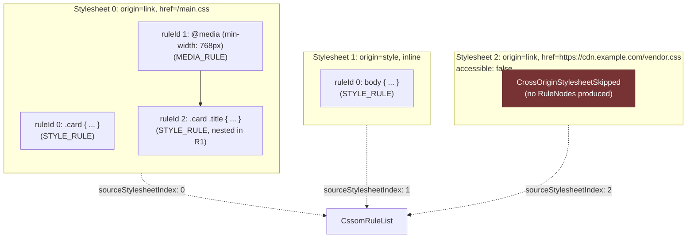
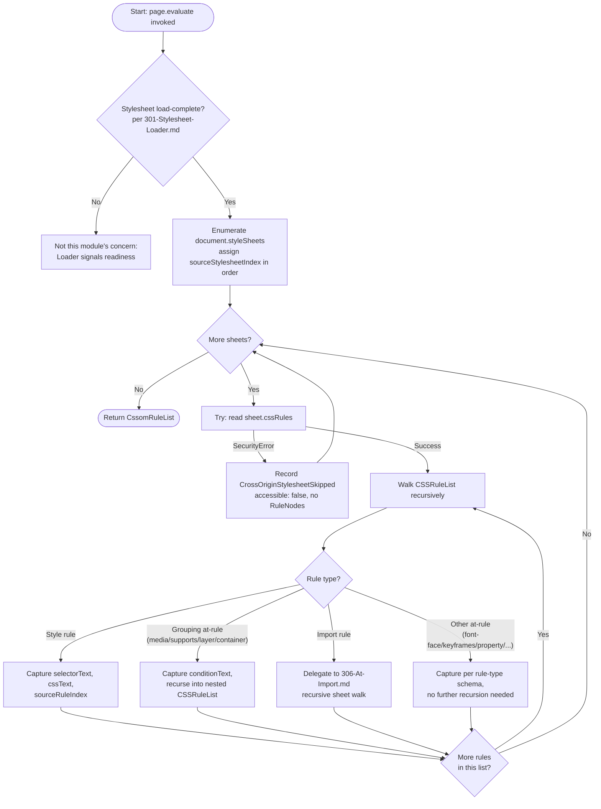
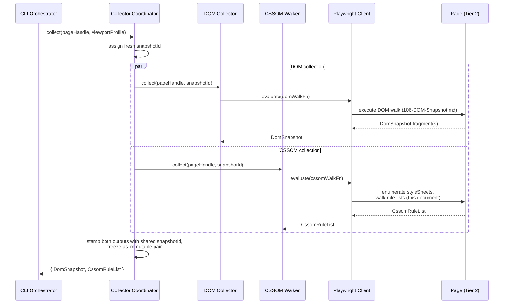

# 300 — CSSOM Walker

## 1. Title

**Critical CSS Extraction Engine — CSSOM Walker: Stylesheet Tree Traversal and In-Memory Rule Enumeration**

## 2. Version

| Field | Value |
|---|---|
| Document Version | 1.0.0 |
| Status | Accepted |
| Last Updated | 2026-07-09 |
| Owners | Core Architecture Working Group |
| Stability | Stable (Phase 5 — CSSOM; changes to the `CssomRuleList`/`RuleNode` record shape require RFC, since [400-Selector-Matching.md](./400-Selector-Matching.md) and the entire Dependency Resolution phase depend on it) |

## 3. Purpose

This document specifies the design of the **CSSOM Walker**, the module responsible for traversing `document.styleSheets` — and, recursively, every nested `CSSRule` reachable from each stylesheet — inside a live, browser-controlled page context, and producing an in-memory, host-addressable **rule tree** that is handed downstream to the Selector Matcher (Phase 6, [400-Selector-Matching.md](./400-Selector-Matching.md), forward-referenced) for `Element.matches()`-based rule matching.

The CSSOM Walker's entire reason for existing, and the discipline that governs every decision in this document, is stated most sharply in the negative: **this module never parses CSS text.** It does not tokenize, does not build an AST from raw stylesheet source, and does not maintain any independent understanding of CSS syntax. Every fact the Walker reports — a rule's selector text, its declaration block, its position in an `@media`/`@supports`/`@layer` nesting chain — is read directly off `CSSRule` objects the browser has already parsed, validated, and normalized as part of loading the page. The Walker's job is object-graph traversal, not language processing. This is a direct, load-bearing instantiation of [ADR-0001-Browser-Is-Source-of-Truth](../adr/ADR-0001-Browser-Is-Source-of-Truth.md) and [ADR-0002-No-Custom-Selector-Parser](../adr/ADR-0002-No-Custom-Selector-Parser.md), and this document treats those two ADRs, together with [006-Design-Principles.md](../architecture/006-Design-Principles.md) Principles 1 and 2, as non-negotiable constraints rather than background context.

This document is the design authority for *how* the rule tree is populated: the traversal algorithm over `StyleSheetList` and nested `CSSRuleList`s, the exact facts captured per rule node, the handling of same-origin versus cross-origin stylesheet access, the distinction between `<style>`-authored and `<link>`-authored sheets, and the preservation of source order — the single ordering property the rest of the pipeline (Cascade Resolver, Serializer) depends on for correct cascade resolution. It does not cover stylesheet *discovery* or *load-completion timing* — that is [301-Stylesheet-Loader.md](./301-Stylesheet-Loader.md)'s subject — nor does it cover the recursive structure of specific at-rule types (`@media`, `@supports`, `@layer`, `@import`), which are each given their own design document ([303-Media-Rules.md](./303-Media-Rules.md), [304-Supports-Rules.md](./304-Supports-Rules.md), [305-Cascade-Layers.md](./305-Cascade-Layers.md), [306-At-Import.md](./306-At-Import.md)) and their own rule-tree node shapes layered on top of the generic tree this document specifies. The generic tree-shape contract itself — the common `RuleNode` envelope every at-rule-specific node extends — is specified in [302-Rule-Tree.md](./302-Rule-Tree.md), which this document treats as a sibling contract document in the same way [106-DOM-Snapshot.md](./106-DOM-Snapshot.md) treats [016-Data-Flow.md](../architecture/016-Data-Flow.md)'s `DomSnapshot` shape as an externally-owned contract it populates rather than defines.

## 4. Audience

- Implementers of `packages/collector`'s CSSOM Walker sub-module, who will write the `page.evaluate()` payload that performs the stylesheet traversal described here.
- Implementers of the Selector Matcher (Phase 6, [400-Selector-Matching.md](./400-Selector-Matching.md), forward reference), who consume the rule tree this document produces and need to know precisely what ordering, cross-origin, and completeness guarantees it does and does not make.
- Implementers of the at-rule-specific Phase 5 documents ([303](./303-Media-Rules.md)–[307](./307-Constructable-Stylesheets.md)), who extend this document's generic traversal with type-specific handling for their respective `CSSRule` subtypes.
- Reviewers evaluating proposed changes to traversal performance (e.g., parallelizing per-stylesheet traversal) against this document's stated ordering and determinism guarantees.
- Senior engineers and autonomous coding agents implementing the `page.evaluate()` bridge utilities in `packages/browser` this module depends on.

Readers are assumed to be fluent in the CSSOM specification's object model (`StyleSheetList`, `CSSStyleSheet`, `CSSRuleList`, `CSSRule` and its subtypes: `CSSStyleRule`, `CSSMediaRule`, `CSSSupportsRule`, `CSSLayerBlockRule`, `CSSImportRule`, `CSSFontFaceRule`, `CSSKeyframesRule`, etc.), the same-origin policy as it applies to stylesheet access, and the two-tier process model established in [015-Runtime-Model.md](../architecture/015-Runtime-Model.md). This is not an introduction to CSSOM; it is a normative specification of one module's traversal algorithm.

## 5. Prerequisites

- [006-Design-Principles.md](../architecture/006-Design-Principles.md) Principle 1 (The Browser Is the Source of Truth) and Principle 2 (Never Implement a Custom Selector Parser) — this document's entire design is a direct instantiation of both: rule discovery and selector text are read from the browser's own parsed CSSOM, never re-parsed or re-derived.
- [006-Design-Principles.md](../architecture/006-Design-Principles.md) Principle 5 (Determinism of Output) — directly constrains this document's insistence on source-order preservation (Section 8.4).
- [ADR-0001-Browser-Is-Source-of-Truth](../adr/ADR-0001-Browser-Is-Source-of-Truth.md) and [ADR-0002-No-Custom-Selector-Parser](../adr/ADR-0002-No-Custom-Selector-Parser.md) — the formal decision records this document operationalizes.
- [106-DOM-Snapshot.md](./106-DOM-Snapshot.md) — the sibling Phase 3 document specifying the DOM Collector's snapshot mechanism; Section 8.7 of that document establishes that the CSSOM Walker is a **peer**, not a downstream consumer, of the `DomSnapshot`, correlated only via a shared `snapshotId`. This document assumes that relationship as given.
- [015-Runtime-Model.md](../architecture/015-Runtime-Model.md) Section 8.1 (Two-Tier Process Boundary) and Section 10.2 (Cross-Boundary Call Batching) — the traversal described here is a concrete instance of the same batched-`page.evaluate()` pattern [106-DOM-Snapshot.md](./106-DOM-Snapshot.md) uses for DOM enumeration.
- [016-Data-Flow.md](../architecture/016-Data-Flow.md) Section 8.4 (Live Page → CSSOM Rule List) — the authoritative data-shape contract this document's algorithm must produce, corresponding to `CssomRuleList`.
- Familiarity with [100-Browser-Abstraction.md](./100-Browser-Abstraction.md), [101-Playwright-Adapter.md](./101-Playwright-Adapter.md), [102-Browser-Pool.md](./102-Browser-Pool.md), [103-Navigation-Engine.md](./103-Navigation-Engine.md), and [104-Rendering-Stabilization.md](./104-Rendering-Stabilization.md), the Phase 3 documents establishing the `Page` this module operates against and the stability gate its entry condition depends on.

## 6. Related Documents

- [006-Design-Principles.md](../architecture/006-Design-Principles.md) — Principles 1, 2, and 5, and the Edge Cases entries on cross-origin stylesheets, constructable stylesheets, and nested CSS, all of which this document operationalizes for the CSSOM-traversal case.
- [ADR-0001-Browser-Is-Source-of-Truth](../adr/ADR-0001-Browser-Is-Source-of-Truth.md), [ADR-0002-No-Custom-Selector-Parser](../adr/ADR-0002-No-Custom-Selector-Parser.md) — formal decision records this document is bound by.
- [106-DOM-Snapshot.md](./106-DOM-Snapshot.md) — the upstream Phase 3 sibling document; establishes the correlation-not-consumption relationship and the `snapshotId` scheme this document reuses (Section 9.3).
- [301-Stylesheet-Loader.md](./301-Stylesheet-Loader.md) — governs *when* stylesheets are discovered and considered load-complete, a precondition this document's traversal depends on but does not itself implement.
- [302-Rule-Tree.md](./302-Rule-Tree.md) — the generic `RuleNode` envelope contract this document's traversal populates.
- [303-Media-Rules.md](./303-Media-Rules.md), [304-Supports-Rules.md](./304-Supports-Rules.md), [305-Cascade-Layers.md](./305-Cascade-Layers.md), [306-At-Import.md](./306-At-Import.md), [307-Constructable-Stylesheets.md](./307-Constructable-Stylesheets.md) — sibling Phase 5 documents specifying type-specific traversal for their respective at-rules, all built on this document's generic recursion.
- [400-Selector-Matching.md](./400-Selector-Matching.md) (Phase 6, forward reference) — the primary consumer of the rule tree this document produces.
- [016-Data-Flow.md](../architecture/016-Data-Flow.md) — the authoritative `CssomRuleList` data-shape contract.
- [015-Runtime-Model.md](../architecture/015-Runtime-Model.md) — the process-boundary and batching model this document's `page.evaluate()` calls follow.

## 7. Overview

The CSSOM Walker's contract, reduced to its essential form, is: given a stabilized, navigated `Page` whose stylesheets have finished loading (per [301-Stylesheet-Loader.md](./301-Stylesheet-Loader.md)), enumerate every `CSSStyleSheet` reachable from `document.styleSheets`, recursively walk every rule inside each sheet — including rules nested inside `@media`, `@supports`, `@layer`, and other grouping at-rules — and produce a `CssomRuleList`: a flat, host-addressable, plain-data enumeration of `RuleNode`s that preserves the exact source order the browser itself would use when resolving the cascade.

Three design decisions dominate this document and recur throughout every section below:

1. **The Walker only ever reads properties the browser has already computed; it never re-derives them from text.** `selectorText`, `cssText`, `media.mediaText`, `conditionText` — every one of these is a getter on a browser-parsed `CSSRule` object. The Walker's traversal function reads these getters and copies their values into plain-data records; it does not run `postcss`, `css-tree`, or any hand-written tokenizer over any of them, even for informational or diagnostic purposes inside the decision path (see Implementation Notes for the narrow, non-decisional exception this shares with [006-Design-Principles.md](../architecture/006-Design-Principles.md)'s own carve-out for diagnostic formatting).
2. **Cross-origin stylesheet access failure is a first-class, diagnosed outcome, not an exception to be caught and silently discarded.** A cross-origin `<link>` stylesheet without permissive CORS headers exposes a `CSSStyleSheet` object whose `.cssRules` getter throws a `SecurityError` when read from page script — this is standard, spec-mandated CSSOM behavior, not a bug the Walker works around. Section 8.3 and Section 12 (Edge Cases) specify exactly how this surfaces as a `CrossOriginStylesheetSkipped` diagnostic.
3. **Source order — both across stylesheets and across rules within a stylesheet — is preserved as an explicit, indexed property of every `RuleNode`, never reconstructed later from insertion order or iteration order of an intermediate collection.** This is a direct consequence of [006-Design-Principles.md](../architecture/006-Design-Principles.md) Principle 5's Canonical Ordering algorithm, which keys its comparator on `sourceStylesheetIndex` and `sourceRuleIndex` — values this document's Walker is the sole producer of.

The remainder of this document works through the traversal algorithm (Section 8), stylesheet discovery boundaries and access restrictions (Section 8.3), `<style>` versus `<link>` provenance (Section 8.5), ordering guarantees (Section 8.4), the handoff to the Selector Matcher (Section 8.6), followed by the Mermaid diagrams, algorithms, and standard closing sections required by [006-Design-Principles.md](../architecture/006-Design-Principles.md) Section 4.

## 8. Detailed Design

### 8.1 Entry Condition and Scope

Per [011-Execution-Pipeline.md](../architecture/011-Execution-Pipeline.md)'s state machine (extended in this phase to add a `CssomCollected` state parallel to `DomCollected`), the CSSOM Walker's precondition is a `Page` handle that has completed navigation, satisfied the configured `StabilizationPolicy` (per [104-Rendering-Stabilization.md](./104-Rendering-Stabilization.md)), and — critically, and specifically to this module — reached the load-completion condition [301-Stylesheet-Loader.md](./301-Stylesheet-Loader.md) defines for all discoverable stylesheets. The Walker does not itself wait for stylesheet load completion, retry on a sheet that is mid-load, or poll `document.styleSheets` for changes; those concerns belong entirely to the Stylesheet Loader, and this document's traversal assumes it is invoked exactly once, after that precondition holds, against a CSSOM that is not concurrently mutating.

The Walker's scope for a single invocation is: one `Page` (or, for cross-origin same-origin-accessible iframes reachable per [106-DOM-Snapshot.md](./106-DOM-Snapshot.md) Section 8.5, one `Frame`), producing exactly one `CssomRuleList`. Unlike the DOM Snapshot, which is captured once per viewport navigation because geometry is viewport-dependent, the CSSOM Walker's output is largely viewport-independent in *content* (the same rules exist regardless of viewport) but the Walker is still invoked once per navigation to preserve the "same atomic page state" correlation guarantee established in [106-DOM-Snapshot.md](./106-DOM-Snapshot.md) Section 8.7 — a rule tree captured from a stale navigation must never be paired with a `DomSnapshot` from a different one, even if the two happen to be textually identical, because pairing them silently would defeat the `snapshotId` correlation mechanism that exists specifically to catch that class of mistake.

### 8.2 What Is Captured Per Rule

The Walker's traversal visits every reachable `CSSRule` (see Section 8.3 for what "reachable" excludes) and, for each rule, captures a `RuleNode` with the following facts, all read directly from browser-provided getters:

- **Structural identity.** A stable within-tree `ruleId` (assigned by traversal order, analogous to [106-DOM-Snapshot.md](./106-DOM-Snapshot.md)'s `nodeId` scheme), `parentRuleId` (null for top-level rules, set for rules nested inside a grouping at-rule), and `childRuleIds` (populated for rules whose type has a `CSSRuleList`, e.g., `CSSMediaRule.cssRules`).
- **Ordering.** `sourceStylesheetIndex` (the rule's owning stylesheet's position in the flattened, ordered stylesheet enumeration — Section 8.4) and `sourceRuleIndex` (the rule's position within its immediate parent's `CSSRuleList`, read directly from the list's own iteration order, which the CSSOM specification guarantees is document/insertion order). These two fields are the exact inputs [006-Design-Principles.md](../architecture/006-Design-Principles.md)'s Canonical Ordering algorithm sorts on downstream.
- **Rule type.** `ruleType`, a discriminant read from `CSSRule.type` (or, preferably, from an `instanceof` check against the specific `CSSRule` subtype constructor, which is more forward-compatible than the numeric `type` constant per Implementation Notes) — `STYLE_RULE`, `MEDIA_RULE`, `SUPPORTS_RULE`, `LAYER_BLOCK_RULE`, `IMPORT_RULE`, `FONT_FACE_RULE`, `KEYFRAMES_RULE`, `PAGE_RULE`, `PROPERTY_RULE`, `COUNTER_STYLE_RULE`, `CONTAINER_RULE`, or `UNKNOWN_RULE` (a forward-compatibility escape hatch, see Edge Cases).
- **Selector-bearing rules** (`CSSStyleRule` and its descendants): `selectorText`, read verbatim from `rule.selectorText` — the browser's own serialization of the (possibly nested-CSS-resolved, per [006-Design-Principles.md](../architecture/006-Design-Principles.md) Edge Cases) selector, never split, tokenized, or re-parsed by this module. Comma-separated selector lists are retained as a single string; any need to reason about individual branches of a list is the Selector Matcher's concern (per [006-Design-Principles.md](../architecture/006-Design-Principles.md) Principle 2's carve-out for delimiter-based, non-semantic splitting), not this module's.
- **Declaration-bearing rules:** `cssText` of the rule's `style` declaration block (`CSSStyleDeclaration.cssText`), captured as an opaque string. The Walker does not enumerate individual property/value pairs at this stage — that granularity is deferred to the Selector Matcher and Cascade Resolver, which need it only for rules that actually match a collected DOM node, and computing it eagerly for every rule (including the majority that will not match) would be pure waste under [006-Design-Principles.md](../architecture/006-Design-Principles.md) Principle 3's cost/benefit framing (contrast with [106-DOM-Snapshot.md](./106-DOM-Snapshot.md) Section 8.6's opposite conclusion for DOM geometry, where nearly every node *is* needed downstream — the two modules reach different eagerness conclusions because their downstream access patterns differ).
- **Grouping at-rule condition text.** For `CSSMediaRule`, `mediaText`; for `CSSSupportsRule`, `conditionText`; for `CSSContainerRule`, `containerQuery`/`containerName` (engine-support permitting) — each read verbatim as browser-serialized text and handed untouched to the respective type-specific design document ([303-Media-Rules.md](./303-Media-Rules.md), [304-Supports-Rules.md](./304-Supports-Rules.md)) for evaluation, again per Principle 2: evaluating whether a media condition currently matches is delegated to `window.matchMedia()`, never to a hand-rolled media-query parser.
- **Provenance.** `ownerStylesheetId`, linking back to the owning `CSSStyleSheet`'s record (Section 8.5) — every `RuleNode`, however deeply nested inside grouping at-rules, carries this so a rule's ultimate source (`<style>` tag, `<link>` sheet, `@import`ed sheet, or constructable stylesheet) is always recoverable without re-walking the tree.

### 8.3 Same-Origin Versus Cross-Origin Stylesheet Access

The single most consequential access restriction the Walker must handle is the CSSOM specification's same-origin enforcement on `CSSStyleSheet.cssRules` (and the equivalent restriction on `CSSStyleSheet.rules`, its legacy alias). A `<link rel="stylesheet">` referencing a cross-origin URL produces a `CSSStyleSheet` object that *is* present in `document.styleSheets` — its existence, `href`, and `media` attribute are always observable — but whose `.cssRules` getter throws a `SecurityError` unless the response was served with a permissive `Access-Control-Allow-Origin` header (loaded in `crossorigin` mode) or the resource is same-origin.

**Decision: the Walker probes accessibility per stylesheet before attempting a full rule walk, and treats a thrown `SecurityError` as an expected, diagnosed outcome, not a traversal-aborting failure.** Concretely, the traversal wraps each top-level `sheet.cssRules` access in a try/catch; a caught `SecurityError` (or, in some engines, a `DOMException` with `name === 'SecurityError'`) produces a `RuleNode`-less entry in the stylesheet-level provenance record: `{ stylesheetId, href, accessible: false, reason: 'cross-origin' }`, plus a `CrossOriginStylesheetSkipped` diagnostic attributing exactly which sheet, by URL, could not be read. This is the same diagnostic shape [106-DOM-Snapshot.md](./106-DOM-Snapshot.md) Section 8.3 uses for closed shadow roots and inaccessible cross-origin iframes: a structurally distinct, explicitly named boundary, not a silently empty result. No `RuleNode`s are produced for an inaccessible sheet's contents, because there is nothing to produce — the browser itself will not disclose them to any page script, including the Walker's own injected `page.evaluate()` payload, which is bound by the identical restriction real page script would face (a direct corollary of Principle 1: this module observes what a real page's own script could observe, not what a privileged debugging channel could observe, mirroring [106-DOM-Snapshot.md](./106-DOM-Snapshot.md) Section 8.3's closed-shadow-root reasoning precisely).

**Why not use the CDP `CSS.getStyleSheetText` domain to bypass this restriction.** The Chrome DevTools Protocol's CSS domain can retrieve a cross-origin stylesheet's text via a privileged, devtools-level channel that is not subject to the same-origin policy the way in-page script is — mirroring the closed-shadow-root bypass option [106-DOM-Snapshot.md](./106-DOM-Snapshot.md) Section 8.3 explicitly rejects. This document rejects it for the identical reason: using it would mean the Walker "sees" rules that no real page script sees and that, critically, the real page's own cascade computation for a genuine end user's session did not derive from an in-page-readable source either — the CSSOM's cross-origin restriction is not an implementation accident, it is the specification's deliberate content-isolation boundary, and a critical-CSS extractor that silently reads through it is, by construction, extracting CSS whose presence in the final "critical" bundle the origin serving the embedding page had no way to audit or consent to at the CSSOM level. If a future requirement specifically needs cross-origin sheet content (e.g., a documented, explicit "trusted third-party stylesheet" allowlist mode), that is scoped as Future Work (Section 15), introduced via its own ADR, and gated behind explicit opt-in configuration — never the traversal default.

**Sub-case: cross-origin sheet loaded with CORS.** When a cross-origin `<link>` is fetched with `crossorigin="anonymous"` (or `"use-credentials"`) and the response carries a matching `Access-Control-Allow-Origin` header, the browser grants full `.cssRules` access identically to a same-origin sheet — from the Walker's perspective this is indistinguishable from a same-origin sheet and requires no special-casing; the try/catch simply does not throw, and `accessible: true` is recorded with no diagnostic.

### 8.4 Ordering Preservation

`document.styleSheets` is a live `StyleSheetList`, and the CSSOM specification guarantees its iteration order matches the sheets' document order — i.e., the order `<link>` and `<style>` elements appear in the document, interleaved correctly regardless of tag type. The Walker's `sourceStylesheetIndex` is assigned by a single, sequential pass over `document.styleSheets` at traversal start, in exactly that order, and is never reassigned or re-sorted afterward. Within a sheet, `CSSRuleList.item(i)`/array-like indexed access is, likewise, guaranteed document/insertion order by spec, and `sourceRuleIndex` is assigned identically by sequential enumeration.

**Why this matters disproportionately for this module specifically.** Source order is not merely a nice-to-have property for readability of intermediate output — it is the single ordering signal the Cascade Resolver (Phase 7, forward reference) needs to break specificity ties correctly per the CSS Cascade specification's "last rule wins" tiebreak rule, and it is the exact key [006-Design-Principles.md](../architecture/006-Design-Principles.md)'s Canonical Ordering algorithm sorts the final output on. If the Walker's traversal introduced *any* reordering relative to the browser's own document order — for instance, by collecting rules into a `Set` or `Map` keyed by selector text and losing insertion order, or by parallelizing per-stylesheet traversal without re-threading results back into stylesheet order — every downstream cascade decision that depends on tiebreak-by-source-order would silently diverge from the real browser's own cascade computation, which is precisely the failure mode Principle 1 exists to prevent. Section 10 makes explicit that any future parallelization of this module's traversal (an optimization opportunity Section 14 flags) must reassemble results into stylesheet-index order before they leave the module boundary, exactly mirroring [006-Design-Principles.md](../architecture/006-Design-Principles.md)'s own stated pattern for the Serializer.

### 8.5 `<style>` Tag Versus `<link>` Stylesheet Provenance

Both `<style>` and `<link rel="stylesheet">` elements produce a `CSSStyleSheet` object reachable via `document.styleSheets`, and — critically — **the Walker's traversal logic is identical for both**, because `CSSStyleSheet.cssRules` behaves the same regardless of how the sheet was authored into the document; the CSSOM does not expose a different rule-list shape for inline versus linked sheets. Provenance is nonetheless recorded, because it matters to downstream consumers other than the Walker itself:

- The Dependency Resolver (Phase 7) and Reporter (per [006-Design-Principles.md](../architecture/006-Design-Principles.md) Principle 6) need to attribute matched/unmatched rules back to a human-meaningful source ("this rule came from `styles/main.css`" versus "this rule came from an inline `<style>` block at line 42 of the HTML document") for diagnostics to be actionable.
- The Serializer (Phase 8) needs to know whether a sheet's origin is disableable/cacheable at the asset level (a `<link>` sheet corresponds to a cacheable network asset; an inline `<style>` block's content is inseparable from the HTML document itself) when deciding how critical CSS should be delivered back to the page (inlined `<style>` injection versus a reference to an existing cacheable asset).

Concretely, each stylesheet-level record (the parent of a sheet's `RuleNode`s, specified fully in [302-Rule-Tree.md](./302-Rule-Tree.md)) carries `origin: 'link' | 'style' | 'import' | 'constructable'` and, for `'link'`, the resolved `href`. This is populated by a simple discriminant on `sheet.ownerNode`: if `ownerNode` is an `HTMLLinkElement`, `origin` is `'link'`; if `HTMLStyleElement`, `'style'`; if `ownerNode` is `null` and the sheet is reachable only via another sheet's `CSSImportRule.styleSheet`, `origin` is `'import'` (see [306-At-Import.md](./306-At-Import.md) for the recursive walk this implies); if the sheet is reachable only via `document.adoptedStyleSheets`, `origin` is `'constructable'` (see [307-Constructable-Stylesheets.md](./307-Constructable-Stylesheets.md)). None of this discrimination requires parsing anything — `ownerNode`'s type and the enumeration source a sheet was discovered through are both directly observable object-graph facts.

### 8.6 Handoff to the Selector Matcher

The completed `CssomRuleList` — a flat array of stylesheet-level provenance records, each owning a flat array of `RuleNode`s in traversal (= source) order, with `parentRuleId`/`childRuleIds` links reconstructing the nesting structure on demand — is returned from the Walker's `page.evaluate()` call(s) as a plain, JSON-serializable structure and becomes the read-only input to the Selector Matcher (Phase 6, [400-Selector-Matching.md](./400-Selector-Matching.md)).

Consistent with [106-DOM-Snapshot.md](./106-DOM-Snapshot.md) Section 8.7's precedent for the DOM Collector, the Walker stamps its output with the same `snapshotId` correlation key shared with the `DomSnapshot` from the same navigation, so the Selector Matcher's join step can verify both structures originate from one atomic page state, and so a `StabilityViolationWarning` can be raised if a stale pairing is ever attempted. The Walker itself has no data dependency on the `DomSnapshot` — traversal of `document.styleSheets` requires no DOM node identity at all — which is exactly why [106-DOM-Snapshot.md](./106-DOM-Snapshot.md) describes the relationship between the two modules as "correlation, not consumption," a characterization this document affirms from the CSSOM side as well as the DOM side.

## 9. Architecture

### 9.1 Rule Tree Structure



This diagram mirrors [106-DOM-Snapshot.md](./106-DOM-Snapshot.md) Section 9.1's diagram deliberately: both show a flat, index-addressed structure with explicit, diagnosed gaps rather than silent omissions, reinforcing that the two modules follow the same architectural pattern for structurally similar reasons (Principle 1's insistence on observing exactly what the browser exposes, no more and no less).

### 9.2 Walk Algorithm Flowchart



### 9.3 Sequence Diagram — Correlation with the DOM Snapshot



The "par" block above is a deliberate architectural statement: because the CSSOM Walker has no data dependency on the `DomSnapshot` (Section 8.6), the two collections are independent `page.evaluate()` round trips that may be dispatched concurrently rather than sequentially, recovering wall-clock time without any correctness risk — concurrency here does not threaten Principle 5's determinism guarantee the way concurrent *mutating* DOM walks would, because both evaluations are read-only snapshots of the same already-stabilized page state.

## 10. Algorithms

### 10.1 Algorithm: Recursive Rule-List Walk with Stable Index Assignment

**Problem statement.** Given the ordered `StyleSheetList` of an already-load-complete document, produce a flat `RuleNode[]` per stylesheet that preserves source order at every nesting level, correctly classifies each rule's type, and explicitly diagnoses any sheet whose `cssRules` cannot be read.

**Inputs.** `page: Page` (already navigated, stabilized, and stylesheet-load-complete per [301-Stylesheet-Loader.md](./301-Stylesheet-Loader.md)), `snapshotId: string` (shared correlation key).

**Outputs.** `CssomRuleList { snapshotId, stylesheets: StylesheetRecord[] }`, where each `StylesheetRecord` is `{ stylesheetId, sourceStylesheetIndex, origin, href, accessible, rules: RuleNode[], diagnostics: CollectorDiagnostic[] }`.

**Pseudocode.**

```text
function walkCssom(snapshotId) -> CssomRuleList:
    stylesheetRecords = []
    sheetIndex = 0

    for sheet in document.styleSheets:      // spec-guaranteed document order
        record = StylesheetRecord {
            stylesheetId: freshId(),
            sourceStylesheetIndex: sheetIndex,
            origin: classifyOrigin(sheet.ownerNode),
            href: sheet.href,
            accessible: true,
            rules: [],
            diagnostics: [],
        }
        sheetIndex += 1

        try:
            ruleList = sheet.cssRules       // throws SecurityError if cross-origin, no CORS
        catch SecurityError:
            record.accessible = false
            record.diagnostics.push(CrossOriginStylesheetSkipped(sheet.href))
            stylesheetRecords.push(record)
            continue

        ruleIdCounter = 0
        function walkRuleList(rules, parentRuleId) -> number[]:
            childIds = []
            for rule in rules:               // spec-guaranteed insertion order
                ruleId = ruleIdCounter
                ruleIdCounter += 1

                node = RuleNode {
                    ruleId: ruleId,
                    parentRuleId: parentRuleId,
                    sourceStylesheetIndex: record.sourceStylesheetIndex,
                    sourceRuleIndex: ruleIdCounter - 1,
                    ruleType: classifyRuleType(rule),   // instanceof checks, Section 11
                    childRuleIds: [],
                }

                populateTypeSpecificFields(node, rule)   // selectorText / cssText / conditionText
                                                           // per Section 8.2 — no text parsing

                if hasNestedRuleList(rule):                // CSSMediaRule, CSSSupportsRule,
                                                            // CSSLayerBlockRule, CSSContainerRule
                    node.childRuleIds = walkRuleList(rule.cssRules, ruleId)
                else if rule.type == IMPORT_RULE:
                    delegateToImportWalk(node, rule, record)   // 306-At-Import.md

                record.rules.push(node)
                childIds.push(ruleId)
            return childIds

        walkRuleList(ruleList, null)
        stylesheetRecords.push(record)

    return CssomRuleList { snapshotId, stylesheets: stylesheetRecords }
```

**Time complexity.** `O(r)` where `r` is the total number of `CSSRule` objects reachable across all accessible stylesheets, since each rule is visited exactly once and per-rule work (property reads, type classification) is `O(1)` amortized. Enumerating `document.styleSheets` itself is `O(s)` where `s` is the sheet count, `s ≤ r`. Total: `O(s + r) = O(r)`.

**Memory complexity.** `O(r)` for the flat `rules` arrays across all stylesheet records, plus `O(d)` transient recursion-stack depth for the deepest at-rule nesting chain (bounded in practice — deeply nested `@media`-inside-`@supports`-inside-`@layer` chains are rare and shallow in real stylesheets).

**Failure cases.** A `SecurityError` on `sheet.cssRules` is the expected, handled failure mode (Section 8.3). An unexpected exception during per-rule field population (e.g., an engine-specific quirk on an unusual rule subtype) is *not* silently swallowed — it propagates as a `CssomWalkError` diagnostic attributing the specific stylesheet and rule index, consistent with [006-Design-Principles.md](../architecture/006-Design-Principles.md) Principle 6, and does not abort traversal of *other* sheets (per-sheet isolation, analogous to per-plugin isolation in Principle 7). A stylesheet that mutates concurrently with the walk (a page script calling `insertRule`/`deleteRule` mid-traversal) is an explicit non-goal — per Section 8.1, the Walker assumes a stabilized, non-mutating CSSOM for the duration of one invocation; if [104-Rendering-Stabilization.md](./104-Rendering-Stabilization.md)'s stability policy is insufficiently strict for a given page (rare, but possible for pages with animation-driven style injection), the resulting `RuleNode[]` may be observably inconsistent, and this is treated as a stabilization-policy gap to fix upstream, not something this module compensates for internally.

**Optimization opportunities.** Per-stylesheet traversal is embarrassingly parallel *within a single V8 isolate* using cooperative scheduling (there is no true multi-threading inside one page context, but independent sheets have no data dependency on each other and could be interleaved); more significantly, if a page has multiple same-origin frames, each frame's stylesheet walk is dispatched as an independent `Frame.evaluate()` call exactly as [106-DOM-Snapshot.md](./106-DOM-Snapshot.md) Section 9.2 describes for DOM collection, and those per-frame calls can be issued concurrently from the Node host. Section 14 quantifies the expected payoff.

### 10.2 Algorithm: Rule Type Classification

**Problem statement.** Given a `CSSRule` object, determine its `ruleType` discriminant reliably across browser engines and CSS specification versions, including rule types not yet known to this module's implementation.

**Inputs.** `rule: CSSRule`.

**Outputs.** `ruleType: RuleTypeDiscriminant` (an enum including an `UNKNOWN_RULE` escape value).

**Pseudocode.**

```text
function classifyRuleType(rule) -> RuleTypeDiscriminant:
    // Prefer instanceof checks over the numeric CSSRule.type constant:
    // CSSRule.type is a legacy numeric enum that CSS Nesting/newer specs
    // have stopped extending; instanceof against the concrete interface
    // is the browser-maintained, forward-compatible source of truth.
    if rule instanceof CSSStyleRule: return STYLE_RULE
    if rule instanceof CSSMediaRule: return MEDIA_RULE
    if rule instanceof CSSSupportsRule: return SUPPORTS_RULE
    if rule instanceof CSSLayerBlockRule: return LAYER_BLOCK_RULE
    if rule instanceof CSSLayerStatementRule: return LAYER_STATEMENT_RULE
    if rule instanceof CSSImportRule: return IMPORT_RULE
    if rule instanceof CSSFontFaceRule: return FONT_FACE_RULE
    if rule instanceof CSSKeyframesRule: return KEYFRAMES_RULE
    if rule instanceof CSSPageRule: return PAGE_RULE
    if typeof CSSPropertyRule !== 'undefined' and rule instanceof CSSPropertyRule:
        return PROPERTY_RULE
    if typeof CSSContainerRule !== 'undefined' and rule instanceof CSSContainerRule:
        return CONTAINER_RULE
    if typeof CSSCounterStyleRule !== 'undefined' and rule instanceof CSSCounterStyleRule:
        return COUNTER_STYLE_RULE
    // Unknown to this module's compiled-in type list: a future CSS
    // specification's rule type, or a non-standard/experimental rule.
    return UNKNOWN_RULE
```

**Time complexity.** `O(1)` per rule (bounded number of `instanceof` checks, independent of document size).

**Memory complexity.** `O(1)`.

**Failure cases.** `UNKNOWN_RULE` is not an error — it is the designed fallback for forward compatibility (Edge Cases, Section 12). An `UNKNOWN_RULE` node still captures `cssText` verbatim (the one place this module retains raw, unparsed text as a fallback fact) so that a future module version, or a diagnostic report, can at least surface *what* was skipped even without type-specific structured fields.

**Optimization opportunities.** The `instanceof` chain can be reordered by empirical frequency (style rules and media rules dominate real stylesheets) to shorten the average-case check count; this is a micro-optimization with negligible measured impact relative to the fixed `page.evaluate()` round-trip cost and is not prioritized.

## 11. Implementation Notes

- The ESLint import-ban described in [006-Design-Principles.md](../architecture/006-Design-Principles.md) Implementation Notes (no `css-tree`, `postcss` selector-decision APIs) applies to `packages/collector`'s CSSOM Walker code paths identically to how it applies to `packages/matcher`. The one permitted exception, mirroring Principle 2's own carve-out, is: a CSS pretty-printer or syntax-highlighter may be used in the Reporter (never in the Walker itself) purely to render `cssText`/`selectorText` for human-readable diagnostic output, never to make an extraction decision.
- `classifyRuleType`'s `instanceof` approach must be defensive against a rule's constructor being an unfamiliar subclass in a browser engine this project has not yet validated (per [ADR-0003-Playwright-As-Browser-Abstraction](../adr/ADR-0003-Playwright-As-Browser-Abstraction.md)'s multi-engine ambition) — the `UNKNOWN_RULE` fallback exists specifically so a WebKit- or Gecko-specific rule subtype does not throw or silently misclassify.
- Per-stylesheet `stylesheetId` and per-rule `ruleId` must be generated deterministically (sequential counters scoped to one traversal invocation), never via `Math.random()` or non-deterministic object identity hashing, consistent with [006-Design-Principles.md](../architecture/006-Design-Principles.md) Principle 5.
- The `href` field for `origin: 'link'` sheets should be the *resolved, absolute* URL (`sheet.href`, which the browser already resolves relative to the document's base URL), not the raw attribute value from the `<link>` element, so that diagnostics and the Reporter's stylesheet-contribution report (Section 2.12 of `BRIEF.md`) can deduplicate and cross-reference reliably regardless of how the URL was originally authored (relative, protocol-relative, absolute).
- This module's `page.evaluate()` payload should be written as a single self-contained function with no closures over Node-side state (per [015-Runtime-Model.md](../architecture/015-Runtime-Model.md)'s serialization constraints), identical in spirit to the DOM Collector's walk function in [106-DOM-Snapshot.md](./106-DOM-Snapshot.md) Section 10.1.

## 12. Edge Cases

- **Cross-origin stylesheets without CORS.** Covered exhaustively in Section 8.3; surfaces as `CrossOriginStylesheetSkipped`, never a silent empty rule list — this is the flagship edge case this document's design most directly addresses, per [006-Design-Principles.md](../architecture/006-Design-Principles.md) Edge Cases.
- **Constructable stylesheets (`document.adoptedStyleSheets`).** Per [006-Design-Principles.md](../architecture/006-Design-Principles.md) Edge Cases, adopted stylesheets may not appear in `document.styleSheets` at all — they are attached via a document's or shadow root's `adoptedStyleSheets` property, a structurally separate enumeration surface. This document's traversal explicitly enumerates `document.adoptedStyleSheets` (and, recursing into shadow roots discovered via [106-DOM-Snapshot.md](./106-DOM-Snapshot.md)'s DOM walk, each shadow root's own `adoptedStyleSheets`) as an additional discovery source with `origin: 'constructable'`, rather than assuming `document.styleSheets` is exhaustive. Full detail is deferred to [307-Constructable-Stylesheets.md](./307-Constructable-Stylesheets.md); this document commits only to the discovery-source enumeration, not the full recursive semantics of shared/adopted-across-multiple-roots sheets.
- **Nested CSS.** Per [006-Design-Principles.md](../architecture/006-Design-Principles.md) Edge Cases, native CSS nesting is resolved to flattened `selectorText` by the browser at the CSSOM level; the Walker reads that already-resolved text and never attempts to interpret nesting syntax itself, which would require selector-grammar parsing and thus violate Principle 2.
- **`@import` cycles and deep chains.** An `@import`ed sheet can itself `@import` another sheet; a pathological (or accidental) cycle is possible. This document delegates the recursive-descent and cycle-detection concerns entirely to [306-At-Import.md](./306-At-Import.md), and this document's `walkCssom` only commits to the fact that `CSSImportRule.styleSheet` is itself a full `CSSStyleSheet` object subject to the identical same-origin/`cssRules` access rules as a top-level sheet.
- **`@layer` statement rules with no block (`@layer name;`).** A bare layer-ordering statement (`CSSLayerStatementRule`) has no nested `CSSRuleList` and no `selectorText`/`cssText` in the usual sense — it declares layer order only. The Walker classifies it as `LAYER_STATEMENT_RULE` (Section 10.2) and captures only its `nameList`; full cascade-layer semantics belong to [305-Cascade-Layers.md](./305-Cascade-Layers.md).
- **Vendor-prefixed or experimental rule types.** Handled by the `UNKNOWN_RULE` fallback (Section 10.2); `cssText` is retained verbatim so nothing is silently lost, but no structured fields are populated, and downstream consumers must treat `UNKNOWN_RULE` nodes as opaque, non-matchable (the Selector Matcher will not attempt `Element.matches()` against something that is not a style rule).
- **A stylesheet with zero rules.** A syntactically valid but empty `<style></style>` or an empty `.css` file produces a `StylesheetRecord` with `rules: []` and `accessible: true` — this is not an error or a diagnostic-worthy condition, merely an unremarkable empty result.
- **Disabled stylesheets (`sheet.disabled === true`).** A stylesheet can be programmatically or declaratively (`<link disabled>`) disabled, meaning the browser does not apply its rules to rendering even though the sheet and its rules remain fully enumerable via `.cssRules`. The Walker still walks a disabled sheet's rules (Principle 1: correctness requires knowing what *would* apply if enabled, and a disabled sheet could be enabled by page script before the fold is finalized) but records `disabled: true` on the `StylesheetRecord` so the Cascade Resolver can decide, per its own design, whether disabled-sheet rules should be excluded from the active cascade by default.
- **Shadow-DOM-scoped stylesheets via `<style>` inside a shadow root.** A `<style>` element authored directly inside an open shadow root (as opposed to a constructable stylesheet adopted into it) is enumerable via that shadow root's own document-fragment-scoped stylesheet list, not the top-level `document.styleSheets`. The Walker's discovery step must therefore recurse into every open shadow root discovered by [106-DOM-Snapshot.md](./106-DOM-Snapshot.md)'s DOM walk (correlated by `shadowRootId`) to find shadow-scoped `<style>` sheets, exactly mirroring that document's own shadow-recursion pattern.

## 13. Tradeoffs

| Decision | Primary Cost Accepted | Primary Benefit Gained | Chosen Because |
|---|---|---|---|
| Never parse CSS text, read only browser-provided getters | Cannot recover facts the CSSOM does not expose as a getter (e.g., original raw source formatting/whitespace) | Zero selector/declaration-syntax divergence risk; automatic support for every CSS feature the browser itself supports | Direct corollary of Principle 1/2; a parser would be a second, drifting implementation |
| Treat cross-origin access failure as a diagnosed skip, not a bypassed restriction | Genuinely cannot extract critical CSS contributed by an inaccessible cross-origin sheet, even if it visually matters | Matches exactly what a real page's own script (and thus real rendering behavior an extractor should mirror) can observe; no privileged-channel divergence | Principle 1: the CSSOM's cross-origin restriction is spec-mandated content isolation, not an accidental limitation to engineer around |
| Preserve source order via explicit indices, not implicit collection order | Slightly more bookkeeping per rule (two integer fields) versus letting array position imply order | Cascade tiebreaking and Canonical Ordering (Principle 5) have a stable, explicit key immune to future refactors of intermediate collection types | An implicit-order bug here would silently corrupt cascade correctness downstream, the worst possible failure class per Principle 6 |
| Defer per-declaration property/value enumeration to later stages | The Walker's own output is less immediately useful for property-level diagnostics without a second pass | Avoids eagerly computing declaration-level detail for the majority of rules that will never match any collected DOM node | Principle 3: correctness does not require eagerness here, unlike DOM geometry in [106-DOM-Snapshot.md](./106-DOM-Snapshot.md), because the access pattern differs |
| `instanceof`-based rule type classification over the legacy `CSSRule.type` numeric constant | Requires per-engine feature-detection guards for newer rule interfaces (`CSSContainerRule`, etc.) that may not exist in all supported engines | Forward-compatible with new CSS Rule interfaces without a hardcoded numeric mapping that specs have stopped extending | The numeric `type` enum is effectively frozen in modern specs; `instanceof` tracks the browser's own interface additions |

## 14. Performance

- **CPU complexity.** `O(r)` in total reachable `CSSRule` count across all accessible stylesheets and frames, per Section 10.1; dominated by the fixed per-rule property-read cost, which is small and constant relative to the fixed `page.evaluate()` round-trip overhead ([015-Runtime-Model.md](../architecture/015-Runtime-Model.md) Section 10.2). For the `fixtures/enterprise-huge/` stylesheet category (`BRIEF.md` Section 2.15), `r` can reach tens of thousands of rules; the linear algorithm remains tractable, but Section 14's benchmark discipline (per [006-Design-Principles.md](../architecture/006-Design-Principles.md) Principle 3) requires this case to be explicitly profiled, not merely assumed fine by asymptotic analysis alone.
- **Memory complexity.** `O(r)` for the flat `RuleNode` collections; `cssText`/`selectorText` strings dominate memory footprint for large stylesheets, since these are retained verbatim rather than being re-derived from a more compact intermediate form — an explicit, accepted tradeoff (Section 13) in favor of zero re-parsing risk.
- **Caching strategy.** The CSSOM Walker's output participates in the same fingerprint-keyed incremental cache described in [006-Design-Principles.md](../architecture/006-Design-Principles.md) Principle 8: if the resolved CSS asset content (post-bundling) is fingerprint-identical to a prior run, the entire walk can be skipped and the prior `CssomRuleList` reused, since the Walker's output is a pure function of stylesheet content plus browser engine version (a same-origin sheet's parsed rule structure does not depend on anything else). This is a stronger cache-hit condition than the DOM Collector enjoys, because CSSOM structure is viewport-independent (Section 8.1) while DOM geometry is not.
- **Parallelization opportunities.** Per-stylesheet traversal within one frame's `page.evaluate()` call executes synchronously in one V8 isolate (no true parallelism available there); however, per-frame traversal (same-origin child frames) is independently dispatchable and, per [106-DOM-Snapshot.md](./106-DOM-Snapshot.md) Section 9.2's identical observation for DOM collection, can be issued concurrently from the Node host with no correctness risk, since separate frames' CSSOM traversals share no mutable state.
- **Incremental execution.** Beyond whole-run fingerprint caching, a finer-grained incremental mode is plausible future work (Section 15): if only one stylesheet asset changed between runs, re-walking only that sheet and splicing its `RuleNode`s back into an otherwise-cached tree at the correct `sourceStylesheetIndex` position is theoretically sound (Principle 3's "provably equivalent fast path" bar) but is not implemented in the initial design, which caches at the whole-`CssomRuleList` granularity only.
- **Profiling guidance.** As with [106-DOM-Snapshot.md](./106-DOM-Snapshot.md) Section 14's guidance, profiling should prioritize the `page.evaluate()` round-trip count and serialization payload size over Node-side CPU time — a stylesheet with tens of thousands of rules produces a correspondingly large serialized payload crossing the structured-clone boundary, which is the more likely bottleneck than the traversal loop itself.
- **Scalability limits.** The practical ceiling is governed by the structured-clone serialization limit for a single `page.evaluate()` return value ([101-Playwright-Adapter.md](./101-Playwright-Adapter.md)); for pathologically large stylesheets, chunked/batched retrieval (splitting the walk into multiple smaller `page.evaluate()` calls, one per stylesheet or per N rules) is the mitigation, mirroring [106-DOM-Snapshot.md](./106-DOM-Snapshot.md) Section 10.1's identical optimization note for oversized DOM trees.

## 15. Testing

- **Unit tests.** `classifyRuleType`'s `instanceof` chain must be tested against constructed instances of every supported `CSSRule` subtype (using a real browser context, per Principle 1 — never a mocked `CSSRule`-shaped object, which would itself violate the "browser is source of truth" discipline even in a test). `walkCssom`'s ordering guarantee must be unit-tested by asserting `sourceStylesheetIndex`/`sourceRuleIndex` monotonically match a fixture document's authored order.
- **Integration tests.** A fixture page with a deliberately cross-origin, CORS-blocked `<link>` stylesheet must produce exactly one `CrossOriginStylesheetSkipped` diagnostic naming that sheet's URL, and zero `RuleNode`s from it, verifying Section 8.3 end-to-end — this is the CSSOM-side analogue of the identical fixture-driven test [106-DOM-Snapshot.md](./106-DOM-Snapshot.md) Section 15 specifies for closed shadow roots.
- **Visual tests.** Not directly applicable to this module in isolation (the Walker produces no visual output), but the fixture categories in `BRIEF.md` Section 2.15 (Tailwind, Bootstrap, CSS Modules, Shadow DOM, Container Queries, Nested CSS, huge enterprise stylesheets) must each be walked without error or omission as a precondition for the Visual Regression suite that exercises the full pipeline downstream.
- **Stress tests.** The `fixtures/enterprise-huge/` stylesheet fixture (tens of thousands of rules across many `@media`/`@supports` nesting levels) must be walked within a documented time/memory budget; a stress test asserts both the budget and the correctness of `sourceStylesheetIndex`/`sourceRuleIndex` ordering at that scale, since ordering bugs are more likely to surface under deep nesting and high rule counts than in small fixtures.
- **Regression tests.** Golden-snapshot fixtures capturing the full serialized `CssomRuleList` for each fixture category serve as the primary regression suite; any change to the Walker that alters a golden snapshot's rule count, ordering, or type classification without an accompanying, reviewed rationale is treated as a regression by default, per [006-Design-Principles.md](../architecture/006-Design-Principles.md) Testing guidance.
- **Benchmark tests.** Any proposed optimization (e.g., concurrent per-frame dispatch, chunked retrieval for oversized sheets) must include a benchmark on the enterprise-huge fixture comparing against the naive sequential baseline, plus an equivalence test proving identical `RuleNode` output, per Principle 3's benchmarked-and-provably-equivalent requirement.

## 16. Future Work

- Investigate a finer-grained incremental cache keyed per-stylesheet-asset-fingerprint (Section 14's "Incremental execution" note), splicing a single changed sheet's re-walked rules into an otherwise-cached tree, rather than invalidating the whole `CssomRuleList` on any single asset change.
- Explore an explicit, opt-in "trusted cross-origin allowlist" mode (Section 8.3) that uses CDP-level access for specifically configured, operator-trusted cross-origin origins, formalized via its own ADR rather than as a default traversal behavior.
- Evaluate whether `CSSRule.type`'s eventual full deprecation across engines warrants dropping the numeric-constant fallback entirely in favor of `instanceof`-only classification once all supported target engines (per [ADR-0003](../adr/ADR-0003-Playwright-As-Browser-Abstraction.md)) have shipped the relevant interfaces.
- Research whether WPT (Web Platform Tests) CSSOM conformance fixtures can be adapted as a continuous cross-engine verification suite for this module's traversal, analogous to the WPT-derived selector conformance idea flagged in [006-Design-Principles.md](../architecture/006-Design-Principles.md) Future Work.
- Open question: should `disabled` stylesheets (Edge Cases) be excluded from the Walker's output entirely by default, with an opt-in flag to include them, rather than the current default of always including them with a `disabled` marker? Current lean is "always include, let the Cascade Resolver decide," to avoid the Walker making a decision that belongs one layer up the pipeline, but this should be revisited once the Cascade Resolver's design ([500-Dependency-Resolution-Overview.md](../design/500-Dependency-Resolution-Overview.md), Phase 7, planned) is concrete.
- Consider whether shadow-DOM-scoped `<style>` discovery (Edge Cases) should be unified with the constructable-stylesheet discovery path in [307-Constructable-Stylesheets.md](./307-Constructable-Stylesheets.md) into one general "per-root stylesheet enumeration" abstraction, rather than two structurally similar but separately specified discovery mechanisms.

## 17. References

- [006-Design-Principles.md](../architecture/006-Design-Principles.md)
- [ADR-0001-Browser-Is-Source-of-Truth](../adr/ADR-0001-Browser-Is-Source-of-Truth.md)
- [ADR-0002-No-Custom-Selector-Parser](../adr/ADR-0002-No-Custom-Selector-Parser.md)
- [106-DOM-Snapshot.md](./106-DOM-Snapshot.md)
- [301-Stylesheet-Loader.md](./301-Stylesheet-Loader.md)
- [302-Rule-Tree.md](./302-Rule-Tree.md)
- [303-Media-Rules.md](./303-Media-Rules.md)
- [304-Supports-Rules.md](./304-Supports-Rules.md)
- [305-Cascade-Layers.md](./305-Cascade-Layers.md)
- [306-At-Import.md](./306-At-Import.md)
- [307-Constructable-Stylesheets.md](./307-Constructable-Stylesheets.md)
- [400-Selector-Matching.md](./400-Selector-Matching.md)
- [015-Runtime-Model.md](../architecture/015-Runtime-Model.md)
- [016-Data-Flow.md](../architecture/016-Data-Flow.md)
- CSSOM specification (W3C) — governing `StyleSheetList`, `CSSStyleSheet`, `CSSRuleList`, and all `CSSRule` subtypes referenced throughout this document
- CSS Cascade Layers specification (W3C) — governing `CSSLayerBlockRule`/`CSSLayerStatementRule`, referenced in Section 8.2 and Section 12
- CSS Nesting specification (W3C) — governing browser-resolved `selectorText` for nested rules, referenced in Section 12
- HTML specification, "Fetching and processing a resource" / cross-origin resource sharing — governing the `SecurityError` behavior on cross-origin `.cssRules` access, referenced in Section 8.3
- Section 2.4, 2.16 ("System Modules", "Security") and Section 4 ("Global Rules") of the Documentation Agent Brief, the authoritative source for all requirements and constraints cited in this document
