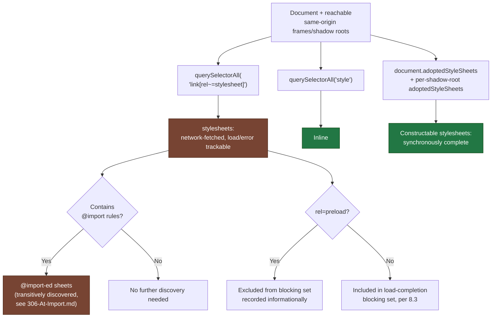
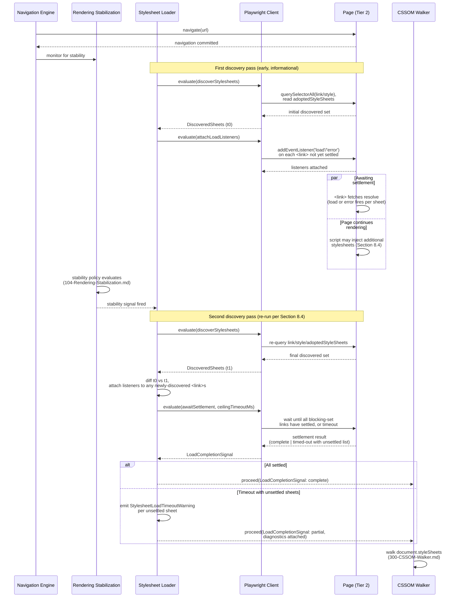

# 301 — Stylesheet Loader

## 1. Title

**Critical CSS Extraction Engine — Stylesheet Loader: Discovery, Load-Completion Detection, and Timing Coordination**

## 2. Version

| Field | Value |
|---|---|
| Document Version | 1.0.0 |
| Status | Accepted |
| Last Updated | 2026-07-09 |
| Owners | Core Architecture Working Group |
| Stability | Stable (Phase 5 — CSSOM; changes to the load-completion signal contract require RFC, since [300-CSSOM-Walker.md](./300-CSSOM-Walker.md)'s entry precondition depends on it) |

## 3. Purpose

This document specifies the **Stylesheet Loader**: the mechanism by which the engine discovers every stylesheet a page will actually apply, and determines the point at which it is safe to say "all discoverable stylesheets have finished loading" — the precondition the CSSOM Walker ([300-CSSOM-Walker.md](./300-CSSOM-Walker.md)) requires before it walks `document.styleSheets`. This document is not the traversal algorithm itself (that is [300-CSSOM-Walker.md](./300-CSSOM-Walker.md)'s subject); it is the *discovery and timing* layer beneath it — the answer to "what stylesheets exist, and how do we know when they're all ready to be walked."

Four distinct stylesheet-origin categories must be discovered, each with different timing semantics: `<link rel="stylesheet">` elements (network-fetched, asynchronous, individually trackable via `load`/`error` events), inline `<style>` elements (synchronously parsed as part of HTML parsing, no network round trip), `@import`-ed sheets (network-fetched but nested one level inside another sheet's parse, with load-completion semantics this document surfaces but [306-At-Import.md](./306-At-Import.md) specifies in full at the at-rule level), and dynamically-injected stylesheets — either a `<link>`/`<style>` element inserted into the DOM by page script after initial page load, or a stylesheet attached via `document.adoptedStyleSheets` (constructable stylesheets, detailed fully in [307-Constructable-Stylesheets.md](./307-Constructable-Stylesheets.md), but relevant here because they arrive with no "load" event at all — they are synchronously available the instant they are adopted).

This document also specifies preload/print/media-conditional `<link>` handling — cases where a `<link>` tag is present in markup but is not, by design, meant to apply to the current rendering context (a `rel="preload"` resource hint, a `media="print"` sheet, a `media="(min-width: 1200px)"` sheet that does not match the current viewport) — and the coordination point between this module's load-completion signal and [104-Rendering-Stabilization.md](../design/104-Rendering-Stabilization.md)'s broader rendering-stability gate, which the CSSOM Walker's invocation ultimately depends on jointly with this document's signal.

## 4. Audience

- Implementers of `packages/collector`'s Stylesheet Loader sub-module, who will write the discovery enumeration and the `page.evaluate()`/event-listening logic that produces the load-completion signal this document specifies.
- Implementers of the CSSOM Walker ([300-CSSOM-Walker.md](./300-CSSOM-Walker.md)), whose entry precondition is this document's load-completion signal.
- Implementers of the Navigation Engine and Rendering Stabilization module ([103-Navigation-Engine.md](./103-Navigation-Engine.md), [104-Rendering-Stabilization.md](./104-Rendering-Stabilization.md)), who need to understand where this module's signal sits relative to their own broader stability gate.
- Reviewers evaluating proposed changes to timing/wait strategy against this document's stated correctness requirements (never walk a partially-loaded CSSOM) and performance requirements (never wait longer than necessary).
- Senior engineers and autonomous coding agents extending discovery to new stylesheet origin categories introduced by future CSS/HTML specification features.

Readers are assumed to be fluent in the resource-loading model of `<link>`/`<style>` elements, the `load`/`error` events on `HTMLLinkElement`, `document.readyState`, the `media` attribute's role in conditional stylesheet application, and the two-tier process model of [015-Runtime-Model.md](../architecture/015-Runtime-Model.md).

## 5. Prerequisites

- [006-Design-Principles.md](../architecture/006-Design-Principles.md) Principle 1 (The Browser Is the Source of Truth) and Principle 6 (Fail-Fast Diagnostics) — this document's load-completion signal must be derived from real, browser-observable loading state, and any stylesheet that fails to load or times out must be surfaced loudly, never silently ignored.
- [300-CSSOM-Walker.md](./300-CSSOM-Walker.md) — the downstream consumer of this document's load-completion signal; this document assumes that document's traversal algorithm and cross-origin-access handling as given, and focuses purely on the "is it safe to walk yet" question that precedes it.
- [106-DOM-Snapshot.md](./106-DOM-Snapshot.md) — establishes the DOM Collector's own entry-condition pattern (waiting on [104-Rendering-Stabilization.md](../design/104-Rendering-Stabilization.md)'s stability signal); this document's load-completion gate is conceptually parallel but stylesheet-specific, and Section 8.6 below discusses precisely how the two relate without duplicating either.
- [103-Navigation-Engine.md](./103-Navigation-Engine.md) and [104-Rendering-Stabilization.md](../design/104-Rendering-Stabilization.md) — the broader navigation/stability machinery this document's signal is one input into, conceptually, without this document needing to re-derive that machinery's own design.
- [015-Runtime-Model.md](../architecture/015-Runtime-Model.md) Section 8.1 (Two-Tier Process Boundary) — the process-boundary model this document's event-listening and polling logic operates within.

## 6. Related Documents

- [300-CSSOM-Walker.md](./300-CSSOM-Walker.md) — the primary downstream consumer of this document's load-completion signal; Section 8.1 of that document explicitly defers "wait for load completion" responsibility to this document.
- [306-At-Import.md](./306-At-Import.md) — the at-rule-level specification of `@import` traversal; this document covers only `@import` *discovery and load-timing*, not its recursive rule-tree structure.
- [307-Constructable-Stylesheets.md](./307-Constructable-Stylesheets.md) — the full specification of `adoptedStyleSheets` semantics; this document covers only their discovery-timing implications (they have none, by design — Section 8.5).
- [104-Rendering-Stabilization.md](../design/104-Rendering-Stabilization.md) — the broader rendering-stability gate this document's signal is conceptually coordinated with (cross-referenced per this document's assignment, without needing to be read in full: this document treats it as a black-box stability signal it composes with, not a dependency it re-specifies).
- [103-Navigation-Engine.md](./103-Navigation-Engine.md) — the module whose navigation-completion event precedes this document's discovery pass.
- [006-Design-Principles.md](../architecture/006-Design-Principles.md) — Principles 1 and 6, both directly governing this document's design.
- [016-Data-Flow.md](../architecture/016-Data-Flow.md) — where this document's load-completion signal is expected to surface as a gating condition in the overall pipeline's state machine.

## 7. Overview

The Stylesheet Loader answers a question that sounds simple and is not: **when has a page finished loading all the stylesheets it is going to apply?** A naive answer — "wait for the `load` event on the `Window`" — is both too weak (it says nothing about stylesheets injected by script after `load` fires, which are common in component-hydration architectures) and, in the more common failure direction, unnecessarily strong for the CSSOM Walker's actual need (the window `load` event waits for every subresource — images, fonts, iframes — not just stylesheets, needlessly delaying extraction). This document commits to a stylesheet-specific completion signal, built from first principles on top of the concrete, per-resource loading primitives the browser exposes, rather than borrowing a coarser signal that happens to usually be "good enough."

Three design decisions dominate this document:

1. **Discovery is a live re-enumeration performed at multiple points, not a one-time scan.** Because dynamically-injected stylesheets (Section 8.4) can appear after the page's initial parse — a common pattern for component libraries, CSS-in-JS runtimes, and lazy-hydrated widgets — a single discovery pass immediately after navigation would systematically under-discover on exactly the class of modern, JavaScript-heavy pages this engine's fixture list (`BRIEF.md` Section 2.15: Styled Components, Emotion) targets. This document's discovery step is therefore re-run, cheaply, at the point [104-Rendering-Stabilization.md](../design/104-Rendering-Stabilization.md)'s broader stability signal fires, immediately before the CSSOM Walker is invoked — not merely once at navigation start.
2. **Load-completion is tracked per discovered `<link>` stylesheet individually, via `load`/`error` events (or a synchronous-availability check for already-complete sheets), and the aggregate signal is "all currently-discovered, render-relevant `<link>` sheets have individually settled" — not a fixed timeout, and not a single coarse signal.** A fixed timeout either wastes time (most sheets load well under the timeout) or risks walking a genuinely-incomplete CSSOM (a slow sheet on a slow network) — both outcomes this document's design explicitly rejects in favor of an event-driven, per-resource completion model with a documented ceiling timeout only as a fail-safe (Section 8.3), consistent with [006-Design-Principles.md](../architecture/006-Design-Principles.md) Principle 6's "attributable, specific" failure requirement.
3. **Non-applying `<link>` sheets (preload, print, non-matching media query) are discovered but explicitly excluded from the load-completion gate's blocking set, while still being recorded with their non-applying status for the CSSOM Walker and Reporter to reason about correctly.** Blocking extraction on a `media="print"` sheet's load would be both pointless (it will never affect the on-screen critical CSS this engine produces) and a real-world performance problem, since some pages intentionally defer non-critical print/preload stylesheets and a naive "wait for everything with `rel=stylesheet`-adjacent semantics" gate would wait on resources by design not prioritized by the page's own author.

The remainder of this document works through the discovery algorithm and its origin-category breakdown (Section 8), the load-completion signal's construction (Section 8.3), the sequence of events across a real navigation (Section 9.2), followed by the Mermaid diagrams, algorithms, and standard closing sections required by [006-Design-Principles.md](../architecture/006-Design-Principles.md) Section 4.

## 8. Detailed Design

### 8.1 Discovery Sources Enumerated

The Stylesheet Loader's discovery pass enumerates stylesheets from five structurally distinct sources, each requiring different discovery logic:

1. **`<link rel="stylesheet">` elements**, discovered via `document.querySelectorAll('link[rel="stylesheet"], link[rel~="stylesheet"]')` across the top-level document and every same-origin frame/open-shadow-root reachable per [106-DOM-Snapshot.md](./106-DOM-Snapshot.md)'s DOM walk (a `<link>` can legally live inside a shadow root as of the HTML spec's shadow-root-scoped stylesheet allowances). Each discovered element is cross-referenced against `document.styleSheets`/the relevant root's stylesheet list to determine whether a corresponding `CSSStyleSheet` object already exists (meaning the sheet has already been parsed by the browser, though — critically, per Section 8.3 — parsed is not the same as *applied/settled*, since a `<link>`'s associated `CSSStyleSheet` object is created synchronously at parse time but the element's `load` event fires only once the resource fetch and parse both complete).
2. **Inline `<style>` elements**, discovered identically via `document.querySelectorAll('style')` across all reachable roots. These require no load-completion tracking at all (Section 8.2) — they are synchronously available as soon as HTML parsing produces the element, since their content is inline text, not a network resource.
3. **`@import`-ed sheets**, discovered *transitively* — not by a top-level DOM query, since `@import` is a CSS-level construct with no corresponding DOM element, but by inspecting `CSSImportRule.styleSheet` on any already-discovered sheet's top-level rules. This document treats `@import` discovery as a recursive dependency of `<link>`/`<style>` discovery (an imported sheet is always reachable by walking outward from *some* directly-discovered sheet) and delegates the recursive walk itself to [306-At-Import.md](./306-At-Import.md), while this document owns only the timing question: an `@import`ed sheet's `styleSheet` property is `null` until that nested fetch also completes, which this document's completion signal (Section 8.3) accounts for by treating `@import` completion as a dependency of its owning `<link>`/`<style>` sheet's own completion, not a separately tracked top-level resource.
4. **Dynamically-injected stylesheets**, i.e., any `<link rel="stylesheet">` or `<style>` element inserted into the DOM by page script after the Stylesheet Loader's initial discovery pass. Handled by re-running discovery at the point [104-Rendering-Stabilization.md](../design/104-Rendering-Stabilization.md)'s stability signal fires (Section 8.4), rather than by maintaining a live `MutationObserver` for the entire navigation lifetime — a deliberate, bounded-cost choice explained in Section 8.4.
5. **Constructable stylesheets** (`document.adoptedStyleSheets` / a shadow root's `adoptedStyleSheets`), discovered by enumerating those properties directly. These require no load-completion tracking whatsoever (Section 8.5): a `CSSStyleSheet` constructed via `new CSSStyleSheet()` and populated via `replaceSync()`/`replace()` is synchronously complete the moment it is adopted (`replace()` is the one asynchronous variant, and even then, the sheet is not adopted/discoverable via `adoptedStyleSheets` in a partially-populated state — adoption itself is atomic with respect to content).

### 8.2 Inline `<style>` Elements: No Load-Completion Tracking Needed

Inline `<style>` element content is part of the HTML document's own byte stream — the browser's HTML parser constructs the `HTMLStyleElement` and its associated `CSSStyleSheet` synchronously as part of ordinary document parsing, with no separate network fetch and therefore no `load`/`error` event lifecycle distinct from the document's own parse. By the time such an element is reachable via `document.querySelectorAll('style')` at all, its stylesheet is fully parsed and its rules are already walkable. This document's discovery step therefore includes inline `<style>` sheets in the *discovered set* (so the CSSOM Walker knows they exist and can attribute `origin: 'style'`, per [300-CSSOM-Walker.md](./300-CSSOM-Walker.md) Section 8.5) but never in the *blocking set* the load-completion signal (Section 8.3) waits on — waiting on something that is by construction already complete would be a pure, needless timing cost.

### 8.3 The Load-Completion Signal

**Statement.** The Stylesheet Loader's load-completion signal resolves when every currently-discovered, render-relevant `<link>` stylesheet (Section 8.1, category 1) has individually settled — either fired its `load` event, fired its `error` event, or was already synchronously complete at discovery time (a sheet whose `CSSStyleSheet.cssRules` access does not throw and whose owning `<link>`'s `sheet` property is already non-null at discovery time, which occurs for sheets that finished loading before the Stylesheet Loader's discovery pass even ran) — subject to the media-query/print/preload exclusions of Section 8.6, and bounded by a configurable ceiling timeout as a fail-safe.

**Why per-resource events over a coarser signal.** The `window.load` event fires only once *every* subresource (images, fonts, iframes, stylesheets — everything) has settled, which is both too broad (unnecessary latency waiting on resources irrelevant to CSSOM completeness) and, for pages with `` or deliberately deferred below-the-fold media, potentially never-firing-soon in a way that would make this engine's extraction latency hostage to resources it has no interest in. Per-`<link>`-element `load`/`error` listening is precise: it tracks exactly the resources whose absence would produce an incomplete or wrong CSSOM Walker result, and nothing else.

**Why event-driven with a fail-safe timeout, not a fixed wait.** A fixed wait (e.g., "sleep 500ms after navigation") either wastes time on the common case (most stylesheets load in well under 500ms on a reasonably fast connection) or, worse, produces a false-positive "complete" signal on a slow network or a large stylesheet, silently causing the CSSOM Walker to walk a `document.styleSheets` list still missing entries — a correctness violation with no attributable diagnostic, which Principle 6 treats as a defect class equal to a crash. Event-driven completion has no such gap: the signal genuinely reflects browser-observed load state. The fail-safe ceiling timeout (default: configurable, per-navigation, documented in the Configuration Loader's schema) exists only to bound worst-case extraction latency against a stylesheet that never loads at all (a broken URL producing neither `load` nor `error` in some edge-case network conditions, or a resource behind an infinite-redirect loop) — when the ceiling is hit, this is **not** treated as silent success; it produces a `StylesheetLoadTimeoutWarning` diagnostic per unsettled sheet (per Principle 6) and the CSSOM Walker proceeds against whatever CSSOM state exists at that point, with the resulting extraction explicitly marked as potentially incomplete in the `ExtractionResult`'s diagnostics, never silently marked as a clean success.

**Composition with per-element `error` events.** A stylesheet that fails to load (404, CORS preflight failure for a `crossorigin`-attributed link, network error) fires `error`, not `load` — and this document treats `error` as a settled state for the *purpose of not blocking the completion signal* (the resource will never load; waiting further would only delay extraction without benefit) while simultaneously emitting a `StylesheetLoadFailedDiagnostic` naming the failed URL, distinguishing this from the cross-origin-CORS-successful-load-but-unreadable-`cssRules` case [300-CSSOM-Walker.md](./300-CSSOM-Walker.md) Section 8.3 handles — that case is a sheet that *did* load (fires `load`, not `error`) but whose *rules* are inaccessible; this document's concern is strictly the load lifecycle, upstream of and orthogonal to that later rule-access restriction.

### 8.4 Dynamically-Injected Stylesheets

Modern component architectures — CSS-in-JS runtimes (Styled Components, Emotion, per `BRIEF.md` Section 2.15's fixture list), lazily-hydrated widgets, third-party embed scripts — routinely insert `<style>` or `<link>` elements into the DOM well after the initial HTML parse completes, sometimes in direct response to a script executing after `DOMContentLoaded`, sometimes streamed in incrementally as components hydrate.

**Decision: discovery is re-run once, at the point [104-Rendering-Stabilization.md](../design/104-Rendering-Stabilization.md)'s broader stability signal fires, immediately before invoking the CSSOM Walker — not continuously tracked via a live `MutationObserver` spanning the whole navigation.** The alternative considered — attaching a `MutationObserver` at navigation start and continuously tracking every `<style>`/`<link>` insertion/removal for the navigation's full duration — was rejected for two reasons. First, it couples this module's lifetime to the entire navigation lifecycle rather than a single, bounded discovery-and-wait operation invoked once per extraction, complicating the module's own state management for a benefit ([104-Rendering-Stabilization.md](../design/104-Rendering-Stabilization.md)'s own stability signal already exists specifically to answer "has the page stopped meaningfully changing," which subsumes "have new stylesheets stopped appearing" for any page whose stability policy is correctly configured). Second, and more fundamentally: if new stylesheets are *still* being injected after [104-Rendering-Stabilization.md](../design/104-Rendering-Stabilization.md) considers the page stable, that is itself a signal the stability policy is mis-tuned for this page (a stability policy that fires while script-driven style injection is still ongoing is, by definition, not actually observing a stable page) — a problem this document's job is to surface via diagnostics (an `UnexpectedLateStylesheetDiagnostic` if the CSSOM Walker's subsequent walk observes stylesheet count changes between this document's discovery pass and the Walker's own invocation, a narrow defensive check), not to silently work around by re-implementing continuous mutation tracking that duplicates [104-Rendering-Stabilization.md](../design/104-Rendering-Stabilization.md)'s own responsibility.

**Consequence.** The single re-run of discovery immediately preceding CSSOM Walker invocation, composed with an already-fired stability signal, is the design's complete answer to "how are dynamically-injected stylesheets discovered": by the time stability has fired, script-driven injection is assumed (per the stability policy's own contract) to have settled, and this document's one-time-per-invocation (but not one-time-per-navigation) discovery pass captures whatever the final, stable DOM contains.

### 8.5 Constructable Stylesheets: No Timing Coordination Needed

As stated in Section 8.1 category 5, a `CSSStyleSheet` reachable via `document.adoptedStyleSheets` (or a shadow root's) is, by the Constructable Stylesheets specification's own design, atomically complete at the moment it becomes observable through that property — there is no intermediate "adopted but still loading" state to coordinate with, because `replaceSync()` is synchronous by definition and even the asynchronous `replace()` variant's Promise resolution is what makes the sheet's *content* available; the sheet does not appear in `adoptedStyleSheets` in a partially-populated state before that resolution. This document's discovery pass therefore includes constructable stylesheets with zero load-completion special-casing — they simply are or are not yet present in the relevant `adoptedStyleSheets` array at the moment discovery runs, and if a script adopts a new constructable stylesheet after this document's discovery pass but before [104-Rendering-Stabilization.md](../design/104-Rendering-Stabilization.md)'s stability fires, that is exactly the "dynamically injected" case Section 8.4 already handles via the single re-run timing. Full semantic detail (sharing one sheet across multiple roots, `replace()` versus `replaceSync()`) belongs to [307-Constructable-Stylesheets.md](./307-Constructable-Stylesheets.md); this document commits only to the timing conclusion that no waiting is required.

### 8.6 Preload, Print, and Media-Conditional `<link>` Tags

A `<link>` element can be present with `rel="stylesheet"` semantics that do not mean "apply to the current render" in the way a plain `<link rel="stylesheet" href="main.css">` does:

- **`rel="preload"` with `as="style"`.** A resource hint, not a stylesheet application at all — the browser fetches the resource eagerly (for later use, typically by a subsequently-injected `<link rel="stylesheet">` referencing the same URL, or by script) but does **not** create a `CSSStyleSheet`/apply it to rendering purely from the preload hint. This document's discovery query explicitly excludes `link[rel="preload"]` from the blocking set (it is not a stylesheet in the CSSOM sense at all, and it would never appear in `document.styleSheets`), though it is recorded informationally (a preloaded-but-not-yet-applied resource can be a useful diagnostic signal for the Reporter, e.g., "this stylesheet was preloaded but never applied," a potential author mistake worth surfacing per Principle 6's spirit, though not a hard error).
- **`media="print"` (or any media query that does not match the current, active `ViewportProfile` per [105-Viewport-Manager.md](../design/105-Viewport-Manager.md)).** The `<link>` element and its `CSSStyleSheet` object both exist and are fully walkable by the CSSOM Walker — the browser parses a non-matching-media sheet's rules regardless of whether the media query currently matches, since the query is re-evaluated dynamically (a `media="print"` sheet becomes "active" the moment the user prints, without a page reload). This document's completion signal *does* wait for such a sheet's `load`/`error` event exactly as for any other `<link>` (the resource is still fetched by the browser regardless of current media applicability, so waiting costs nothing extra and skipping it would risk the CSSOM Walker seeing a not-yet-loaded sheet if the media condition happens to become relevant mid-extraction in some future multi-condition use case). What *does* change is downstream: the CSSOM Walker records the sheet's `media` attribute (per [300-CSSOM-Walker.md](./300-CSSOM-Walker.md) Section 8.2's `mediaText`-style capture pattern, generalized to the stylesheet level, not only `@media` at-rules) so [303-Media-Rules.md](./303-Media-Rules.md) and the Cascade Resolver can correctly exclude non-matching-media sheets' rules from the active, current-viewport critical CSS while still making them discoverable for diagnostics/reporting and for other viewport profiles in a multi-viewport run (per `BRIEF.md` Section 2.6) where the same sheet might apply under a different profile.

**Why the exclusion is scoped to `rel="preload"` only, not `media`-mismatched links.** Excluding `media`-mismatched `<link>` sheets from the *blocking set* was considered (a `media="print"` sheet's load timing plausibly never needs to block on-screen critical CSS extraction) but rejected in favor of the simpler, uniformly-correct rule "wait for every `rel=stylesheet` `<link>` regardless of its `media` attribute, exclude only true non-stylesheet resource hints." The rejected alternative's complexity (media-query evaluation logic living inside the *timing* gate, duplicating logic [303-Media-Rules.md](./303-Media-Rules.md) already owns at the rule level) was judged to outweigh its marginal latency benefit, particularly since most pages have few if any `media="print"`-scoped `<link>` sheets and the resources are typically small relative to a page's primary stylesheet.

## 9. Architecture

### 9.1 Discovery Source Classification



### 9.2 Sequence Diagram — Discovery and Load-Completion Detection



This diagram makes the two-pass discovery structure explicit: an early pass (informational, and to attach listeners as early as possible so no `load`/`error` event is missed between discovery and listener attachment) and a final pass gated on the stability signal, whose diff against the first pass is exactly how dynamically-injected stylesheets (Section 8.4) are captured without a continuously-running observer.

### 9.3 Coordination with Rendering Stabilization

```mermaid
flowchart LR
    subgraph StabilityGate["104-Rendering-Stabilization.md scope"]
        direction TB
        S1[Layout-shift quiescence]
        S2[Network-idle heuristics]
        S3[Animation-frame quiescence]
        S4[Configurable custom signals]
    end

    subgraph LoaderGate["301-Stylesheet-Loader.md scope
(this document)"]
        direction TB
        L1[Per-link load/error settlement]
        L2[Discovery re-run diff]
        L3[Ceiling timeout fail-safe]
    end

    StabilityGate -- "stability fired" --> LoaderGate
    LoaderGate -- "load-completion signal" --> Walker[300-CSSOM-Walker.md
entry precondition]

    style StabilityGate fill:#234,stroke:#123,color:#fff
    style LoaderGate fill:#243,stroke:#132,color:#fff
```



The two gates are deliberately non-overlapping in scope: [104-Rendering-Stabilization.md](../design/104-Rendering-Stabilization.md) answers "has the page's *rendering* (layout, paint, script-driven mutation) settled," a broad, page-general question this document does not re-answer; this document answers the narrower, stylesheet-specific question of "have the currently-relevant stylesheet network fetches settled," composing with — never duplicating — the broader signal. The CSSOM Walker's actual entry precondition is the conjunction of both.

## 10. Algorithms

### 10.1 Algorithm: Stylesheet Discovery Enumeration

**Problem statement.** Given a `Page` (and its reachable same-origin frames/shadow roots), enumerate every stylesheet-origin-category resource (Section 8.1) currently present, classified by origin and blocking-set membership.

**Inputs.** `page: Page`, `roots: DiscoveryRoot[]` (top document plus every same-origin frame/open-shadow-root, correlated with [106-DOM-Snapshot.md](./106-DOM-Snapshot.md)'s DOM walk).

**Outputs.** `DiscoveredSheets { linkSheets: LinkSheetRef[], styleSheets: StyleSheetRef[], adoptedSheets: AdoptedSheetRef[] }`, where each `LinkSheetRef` carries `{ elementRef, href, rel, media, settled: boolean, inBlockingSet: boolean }`.

**Pseudocode.**

```text
function discoverStylesheets(roots) -> DiscoveredSheets:
    linkSheets = []
    styleSheets = []
    adoptedSheets = []

    for root in roots:                                  // top doc + same-origin frames/shadow roots
        for link in root.querySelectorAll('link'):
            relTokens = link.rel.split(/\s+/)
            if 'stylesheet' not in relTokens:
                if 'preload' in relTokens and link.as == 'style':
                    linkSheets.push(LinkSheetRef {
                        elementRef: refOf(link), href: link.href, rel: 'preload',
                        media: link.media, settled: false, inBlockingSet: false,
                    })
                continue    // not a stylesheet-applying link at all

            isAlreadySettled = (link.sheet != null)     // sheet property non-null => load already fired
            linkSheets.push(LinkSheetRef {
                elementRef: refOf(link), href: link.href, rel: 'stylesheet',
                media: link.media, settled: isAlreadySettled, inBlockingSet: true,
            })

        for styleEl in root.querySelectorAll('style'):
            styleSheets.push(StyleSheetRef { elementRef: refOf(styleEl) })  // always settled

        for sheet in root.adoptedStyleSheetsOf():        // document.adoptedStyleSheets or
                                                            // shadowRoot.adoptedStyleSheets
            adoptedSheets.push(AdoptedSheetRef { sheetRef: refOf(sheet) })  // always settled

    return DiscoveredSheets { linkSheets, styleSheets, adoptedSheets }
```

**Time complexity.** `O(l + s + a)` where `l`, `s`, `a` are the counts of `<link>`, `<style>`, and adopted-stylesheet entries respectively across all discovery roots — a single linear pass per root, dominated by the DOM query cost already paid by [106-DOM-Snapshot.md](./106-DOM-Snapshot.md)'s own traversal (in practice, this document's discovery query can be fused into that same walk as an optimization, see Section 14).

**Memory complexity.** `O(l + s + a)` for the returned reference arrays; element references are lightweight handles, not full node records.

**Failure cases.** A `<link>` with a malformed or empty `rel` attribute is treated conservatively as non-stylesheet (excluded from both discovery categories) rather than guessed at — this is a deliberate under-inclusion in favor of not blocking on a resource whose intent is genuinely ambiguous, with the ambiguity itself recorded as a low-severity diagnostic if `href` is present and points to a `.css`-suffixed URL (a heuristic *hint* for the Reporter only, never used to alter blocking-set membership, consistent with Principle 1/2's ban on heuristic-driven decisions replacing browser-observable facts).

**Optimization opportunities.** Discovery across many same-origin frames can be parallelized identically to [106-DOM-Snapshot.md](./106-DOM-Snapshot.md) Section 9.2's per-frame dispatch pattern; within one root, the query cost is already minimal relative to the subsequent network-wait cost and is not a meaningful optimization target on its own.

### 10.2 Algorithm: Load-Completion Await with Ceiling Timeout

**Problem statement.** Given the blocking-set subset of `DiscoveredSheets.linkSheets`, produce a completion signal that resolves once every blocking-set entry has settled (`load` or `error` fired, or was already settled at discovery time), or once a configured ceiling timeout elapses, whichever comes first — and in the timeout case, attribute exactly which entries remain unsettled.

**Inputs.** `blockingSet: LinkSheetRef[]`, `ceilingTimeoutMs: number` (from `CollectorConfig`, per [006-Design-Principles.md](../architecture/006-Design-Principles.md)'s configuration-schema conventions).

**Outputs.** `LoadCompletionSignal { status: 'complete' | 'partial', unsettled: LinkSheetRef[] }`.

**Pseudocode.**

```text
function awaitSettlement(blockingSet, ceilingTimeoutMs) -> LoadCompletionSignal:
    alreadySettled = blockingSet.filter(s => s.settled)
    pending = blockingSet.filter(s => !s.settled)

    if pending.isEmpty():
        return LoadCompletionSignal { status: 'complete', unsettled: [] }

    settledPromises = pending.map(ref =>
        new Promise((resolve) => {
            addEventListenerOnce(ref.elementRef, 'load', () => resolve(ref))
            addEventListenerOnce(ref.elementRef, 'error', () => {
                emitDiagnostic(StylesheetLoadFailedDiagnostic(ref.href))
                resolve(ref)      // settled-as-failed still counts as settled, Section 8.3
            })
        })
    )

    raceResult = raceWithTimeout(Promise.all(settledPromises), ceilingTimeoutMs)

    if raceResult.timedOut:
        stillPending = pending.filter(ref => !ref.hasSettledSince)
        for ref in stillPending:
            emitDiagnostic(StylesheetLoadTimeoutWarning(ref.href, ceilingTimeoutMs))
        return LoadCompletionSignal { status: 'partial', unsettled: stillPending }

    return LoadCompletionSignal { status: 'complete', unsettled: [] }
```

**Time complexity.** `O(p)` where `p` is the pending-set size, for listener attachment and promise bookkeeping; the actual wall-clock wait is bounded by `min(max(individual load times), ceilingTimeoutMs)`, not by any per-sheet serial cost — all pending sheets are awaited concurrently via `Promise.all`, matching the browser's own concurrent-fetch behavior for multiple `<link>` resources.

**Memory complexity.** `O(p)` for the pending promise set and associated listeners.

**Failure cases.** The `ceilingTimeoutMs` fail-safe firing is, by design, not itself an unrecoverable error — it produces a `partial` completion status with attributed diagnostics (Section 8.3), and the pipeline's overall severity policy (per [006-Design-Principles.md](../architecture/006-Design-Principles.md) Principle 6, "engine defines diagnostic severity taxonomy; CI configuration maps taxonomy to pass/fail") decides whether a `partial` signal should fail a CI run outright or merely annotate the resulting `ExtractionResult`. A page that removes a pending `<link>` element from the DOM before it settles (rare, but possible via script) will never fire `load`/`error` for that reference; this is treated identically to a timeout for that specific entry — the `raceWithTimeout` ceiling still bounds total wait time, and the removed link's promise simply never resolves before the ceiling, producing the same `StylesheetLoadTimeoutWarning` outcome rather than a hang.

**Optimization opportunities.** For pages with a very large `<link>` count (uncommon, but possible with certain build tooling that emits many small per-component stylesheets rather than one bundle), listener attachment cost is linear and cheap; the dominant cost remains genuine network latency, which this algorithm cannot and should not attempt to optimize away — its only lever is the ceiling timeout's tuning, which is a configuration concern, not an algorithmic one.

## 11. Implementation Notes

- The "already settled at discovery time" check (`link.sheet != null`) must be read at the exact moment of the discovery pass, not cached from an earlier check, since a sheet can transition from unsettled to settled between two discovery passes (Section 9.2's two-pass structure) — implementers must re-evaluate `link.sheet` freshly on the second pass rather than reusing the first pass's boolean.
- Listener attachment (`addEventListenerOnce`) must occur inside the same `page.evaluate()` call that performs discovery, immediately after querying each `<link>`, to close the race window between "element discovered" and "listener attached" during which a fast-loading resource's `load` event could fire and be missed. This mirrors the general cross-boundary batching discipline of [015-Runtime-Model.md](../architecture/015-Runtime-Model.md) Section 10.2.
- The ceiling timeout default should be documented in the Configuration Loader's schema (forward reference to the Configuration Loader module, `BRIEF.md` Section 2.4) as a per-navigation, overridable value, with a conservative default (e.g., several seconds) chosen to comfortably exceed typical stylesheet load times on a throttled/CI-representative network profile, per the project's stated CI-integration goals (`BRIEF.md` Section 2.11).
- `StylesheetLoadFailedDiagnostic` and `StylesheetLoadTimeoutWarning` must share the same DTO base shape as the diagnostics defined in [006-Design-Principles.md](../architecture/006-Design-Principles.md) Principle 6's discussion (`Result<T, Diagnostic[]>`), living in `packages/shared` alongside `CrossOriginStylesheetSkipped` and the DOM Collector's own diagnostic types, so the Reporter renders all of them uniformly.
- Implementers should be careful to distinguish this document's `StylesheetLoadFailedDiagnostic` (a `<link>` resource failed to fetch at all) from [300-CSSOM-Walker.md](./300-CSSOM-Walker.md)'s `CrossOriginStylesheetSkipped` (a resource fetched successfully but whose *rules* are inaccessible due to same-origin policy) — these are adjacent but distinct failure modes at different pipeline stages, and conflating their diagnostic types would harm the Reporter's ability to attribute root cause correctly.

## 12. Edge Cases

- **A `<link>` stylesheet that is disabled via the `disabled` IDL attribute or `<link disabled>`.** Per [300-CSSOM-Walker.md](./300-CSSOM-Walker.md) Edge Cases, a disabled sheet is still walked but flagged; this document's concern is narrower — a disabled `<link>` still fetches its resource (disabling affects application, not fetching) and therefore is still part of the load-completion blocking set identically to an enabled sheet.
- **A `<link>` with `href` pointing to a data: URL.** No network fetch occurs; the browser resolves and parses the stylesheet synchronously (or near-synchronously) and `link.sheet` is typically already non-null by the time script can observe it, making this indistinguishable in practice from an "already settled at discovery time" `<link>`, requiring no special-case beyond the existing `link.sheet != null` check.
- **`@import` inside an inline `<style>` element.** Even though the owning `<style>` element itself requires no load-completion tracking (Section 8.2), an `@import` rule inside it *does* trigger a genuine network fetch for the imported sheet. This document's blocking-set logic must therefore include `@import`-triggered fetches discovered transitively (Section 8.1 category 3) even when their syntactic parent is an inline `<style>`, not only when the parent is a `<link>` — the blocking set is keyed on "does this require a network fetch," not on "is the syntactic origin a `<link>`."
- **A cross-origin `<link>` stylesheet without CORS.** This document's load-completion tracking is indifferent to this case — the resource still fires `load` (a cross-origin stylesheet without CORS headers still successfully loads and applies to rendering via the browser's normal, non-script-visible application path; only *script-level* `.cssRules` access is restricted, per [300-CSSOM-Walker.md](./300-CSSOM-Walker.md) Section 8.3). This document's blocking set therefore correctly waits for such a sheet's `load` event exactly as for any other `<link>`, and the subsequent `SecurityError`-on-`.cssRules` handling is entirely [300-CSSOM-Walker.md](./300-CSSOM-Walker.md)'s downstream concern, not this document's.
- **A `<link rel="stylesheet">` with no `href` at all (malformed markup).** Never fires `load` or `error` in a way this document can rely on; treated as a zero-network-cost, immediately-"error"-classified entry at discovery time (browsers typically do not attempt a fetch for an empty/missing `href`), avoiding an unnecessary wait on a resource that was never going to load.
- **Redirect chains and slow CDNs.** Handled entirely by the ceiling-timeout fail-safe (Section 8.3, Section 10.2) — this document does not attempt to detect or short-circuit redirect chains specifically; from this module's perspective, a slow-but-eventually-successful load and a slow-and-never-resolving load are indistinguishable until either `load` fires or the ceiling elapses.
- **Multiple `<link>` elements pointing to the identical `href` (a common, harmless duplication).** Each is discovered and tracked independently — the browser deduplicates the underlying network fetch (HTTP cache), but each `<link>` element still gets its own `CSSStyleSheet` object and its own `load` event, and this document's per-element tracking naturally handles this without special-casing, at the cost of (harmless) redundant bookkeeping.
- **Speculative future case: `<link rel="stylesheet" blocking="render">`** (the HTML Render-Blocking spec's explicit render-blocking attribute) does not change this document's discovery or completion-tracking logic at all — render-blocking behavior affects when the browser *paints*, not when the `CSSStyleSheet` object becomes walkable, so this document's `load`/`error`-based signal remains the correct and sufficient completion criterion regardless of the attribute's presence.

## 13. Tradeoffs

| Decision | Primary Cost Accepted | Primary Benefit Gained | Chosen Because |
|---|---|---|---|
| Per-`<link>` event-driven completion over `window.load` | More implementation complexity (per-element listener bookkeeping) than a single window-level event | Precisely scoped wait — no needless latency from unrelated subresources (images, fonts, iframes) | `window.load` conflates stylesheet readiness with unrelated resource readiness; this engine only needs the former |
| Event-driven with ceiling-timeout fail-safe over a fixed wait | Requires listener attachment machinery rather than a simple `sleep()` | No false-positive "complete" signal on slow networks; no wasted latency on the common fast-load case | Principle 6: a fixed wait either wastes time or silently risks correctness with no attributable signal either way |
| Two-pass discovery (early + stability-gated re-run) over a continuous `MutationObserver` | Cannot detect a stylesheet injected and then removed entirely between the two passes (a narrow, rare case) | Bounded-cost, simpler module lifecycle that composes with, rather than duplicates, [104-Rendering-Stabilization.md](../design/104-Rendering-Stabilization.md)'s own responsibility | A continuously-running observer for the whole navigation lifetime is unnecessary complexity given the stability signal already exists to answer "has script-driven change settled" |
| `error` events treated as "settled" for blocking-set purposes | A failed stylesheet's absence is never retried by this module | Extraction latency is never held hostage to a resource that will never load | Waiting indefinitely on a resource that fired `error` (a definitive terminal signal) has no possible correctness benefit |
| Excluding `rel="preload"` from the blocking set but including `media`-mismatched `<link>` sheets | Slightly inconsistent-looking rule ("some non-applying resources block, some don't") without a single unifying "does it apply to current media" test | Correct blocking-set membership without duplicating [303-Media-Rules.md](./303-Media-Rules.md)'s media-evaluation logic inside the timing gate | Preload is not a stylesheet in the CSSOM sense at all (a categorical distinction); media-mismatch is a rule-level concern this document defers rather than reimplements |

## 14. Performance

- **CPU complexity.** Discovery is `O(l + s + a)` per Section 10.1; load-completion await is `O(p)` bookkeeping plus a wall-clock wait bounded by `min(network latency, ceilingTimeoutMs)`, per Section 10.2 — the module's own CPU cost is negligible relative to the network-bound wait it coordinates.
- **Memory complexity.** `O(l + s + a)` for discovered references plus `O(p)` for pending-promise bookkeeping during the await phase; both are small relative to the DOM/CSSOM snapshot sizes [106-DOM-Snapshot.md](./106-DOM-Snapshot.md) and [300-CSSOM-Walker.md](./300-CSSOM-Walker.md) subsequently produce.
- **Caching strategy.** This module's own output (a `LoadCompletionSignal`, a transient timing artifact) is not itself fingerprint-cached under [006-Design-Principles.md](../architecture/006-Design-Principles.md) Principle 8 — caching applies to the *content* the CSSOM Walker subsequently produces, not to the timing coordination that precedes it; a cache hit at the whole-extraction level (Principle 8) skips this module's execution entirely for a given navigation, which is the relevant caching interaction, not a cache internal to this module.
- **Parallelization opportunities.** Discovery across multiple same-origin frames parallelizes identically to [106-DOM-Snapshot.md](./106-DOM-Snapshot.md)'s per-frame dispatch (Section 9.2); within one frame, all pending `<link>` settlement awaits already proceed concurrently via `Promise.all` (Section 10.2), matching the browser's own natural concurrent-fetch behavior — there is no serial bottleneck to parallelize further within a single frame's wait.
- **Incremental execution.** If [006-Design-Principles.md](../architecture/006-Design-Principles.md) Principle 8's fingerprint indicates unchanged CSS assets and unchanged HTML, the entire navigation — and therefore this module's discovery/wait cycle — is skipped via cache reuse; this module has no finer-grained incremental mode of its own, since load timing is inherently a fresh-navigation concern with no meaningful "diff" against a prior run's timing.
- **Profiling guidance.** The dominant, and usually only, cost worth profiling is wall-clock wait time on the slowest blocking-set `<link>`; if this module is a measured bottleneck, the fix is almost always upstream (bundling/reducing stylesheet count, enabling HTTP/2 multiplexing, CDN latency) rather than anything internal to this module's own logic, which is deliberately minimal.
- **Scalability limits.** The practical ceiling is the `ceilingTimeoutMs` configuration value itself, trading worst-case extraction latency against correctness-on-slow-network risk; CI environments with representative network throttling (a common practice for realistic performance testing) should tune this value explicitly rather than relying on a default tuned for typical broadband conditions.

## 15. Testing

- **Unit tests.** `discoverStylesheets`'s classification logic must be unit-tested against fixture markup covering every `rel` token combination (`stylesheet`, `preload`+`as=style`, unrelated `rel` values, missing `rel`), asserting correct blocking-set membership per Section 10.1's pseudocode.
- **Integration tests.** A fixture page with a deliberately slow (artificially delayed via a test-only network throttle) `<link>` stylesheet must produce a `complete` `LoadCompletionSignal` when the delay is under the configured ceiling, and a `partial` signal with an attributed `StylesheetLoadTimeoutWarning` when the delay exceeds it — verifying Section 8.3/10.2 end-to-end against real (throttled, not mocked) network behavior, per Principle 1.
- **Visual tests.** Not directly applicable to this module in isolation; its correctness is validated transitively by the CSSOM Walker's own golden-snapshot tests never observing a truncated `document.styleSheets` list when this module reports `complete`.
- **Stress tests.** A fixture page with a large number (hundreds) of small `<link>` stylesheets (simulating unbundled, per-component CSS output from certain build tools) must be discovered and awaited within a documented time/memory budget, verifying the `Promise.all`-based concurrent-await scales linearly and does not introduce quadratic listener-management overhead.
- **Regression tests.** A fixture page that dynamically injects a `<style>` element via script shortly after initial load (simulating a CSS-in-JS runtime) must have that dynamically-injected sheet present in the final `DiscoveredSheets` set used by the CSSOM Walker — a regression here (the dynamic sheet silently missing from extraction) is exactly the failure mode Section 8.4's two-pass design exists to prevent, and is treated as a golden-snapshot regression if it recurs.
- **Benchmark tests.** Any proposed change to the discovery/await strategy (e.g., fusing discovery into the DOM Collector's own walk, per Section 14's optimization note) must include a benchmark comparing total time-to-CSSOM-Walker-invocation against the current two-pass baseline, plus a correctness-equivalence test confirming identical discovered-sheet sets, per Principle 3's benchmarked-and-equivalent discipline.

## 16. Future Work

- Investigate fusing this module's discovery query into [106-DOM-Snapshot.md](./106-DOM-Snapshot.md)'s own DOM walk (both already traverse the same reachable-roots set) as a single combined `page.evaluate()` payload, reducing round-trip count — deferred for now to keep the two modules' concerns cleanly separated during initial implementation, per [006-Design-Principles.md](../architecture/006-Design-Principles.md) Principle 4's module-boundary discipline, but flagged as a plausible, provably-equivalent optimization once both modules' implementations stabilize.
- Explore whether the Render-Blocking HTML attribute (`blocking="render"`) could be surfaced as an additional diagnostic-only signal (distinguishing render-blocking from non-render-blocking stylesheets in the Reporter's stylesheet-contribution report), even though, per Edge Cases, it does not affect this module's completion-signal logic itself.
- Research whether a Resource Timing API-based approach (`PerformanceResourceTiming` entries for stylesheet fetches) could supplement or partially replace per-element `load`/`error` listeners, potentially simplifying cross-frame listener attachment by querying a single performance-entries buffer instead of attaching per-element handlers.
- Revisit the two-pass discovery design (Section 8.4) if a future fixture category reveals pages that inject stylesheets in tight loops spanning the entire stability-detection window, which could produce a discovery race the current design's narrow `UnexpectedLateStylesheetDiagnostic` check would only detect after the fact rather than prevent — a continuous, but resource-bounded (e.g., rate-limited), observer-based hybrid could be considered.
- Open question: should the ceiling timeout be adaptive (e.g., derived from an initial fast-loading-sheet baseline observed early in the wait) rather than a single static configuration value, to better balance latency against correctness across highly variable network conditions in different CI environments? Current lean is "static, explicit, operator-configured," for determinism and predictability (Principle 5's spirit extended to timing behavior, even though timing itself is explicitly not part of the deterministic output payload), to be revisited if adaptive timeout data from production usage suggests static configuration is a poor fit.

## 17. References

- [300-CSSOM-Walker.md](./300-CSSOM-Walker.md)
- [306-At-Import.md](./306-At-Import.md)
- [307-Constructable-Stylesheets.md](./307-Constructable-Stylesheets.md)
- [104-Rendering-Stabilization.md](../design/104-Rendering-Stabilization.md)
- [103-Navigation-Engine.md](./103-Navigation-Engine.md)
- [105-Viewport-Manager.md](../design/105-Viewport-Manager.md)
- [106-DOM-Snapshot.md](./106-DOM-Snapshot.md)
- [006-Design-Principles.md](../architecture/006-Design-Principles.md)
- [015-Runtime-Model.md](../architecture/015-Runtime-Model.md)
- [016-Data-Flow.md](../architecture/016-Data-Flow.md)
- HTML specification, "Processing model" for `<link>`/`<style>` elements and the `load`/`error` event lifecycle — governing the completion signal this document relies on
- HTML specification, Render-Blocking attribute (`blocking="render"`) — referenced in Edge Cases
- CSS Object Model specification (W3C) — governing `CSSStyleSheet`, `adoptedStyleSheets`, and `CSSImportRule.styleSheet` semantics referenced throughout
- Resource Hints specification (W3C), `rel="preload"` — governing the preload-exclusion logic in Section 8.6
- Constructable Stylesheets specification (W3C) — governing the synchronous-completeness guarantee referenced in Section 8.5
- Section 2.4, 2.15, 2.16 ("System Modules", "Testing Strategy" fixtures, "Security") of the Documentation Agent Brief, the authoritative source for all requirements and constraints cited in this document
