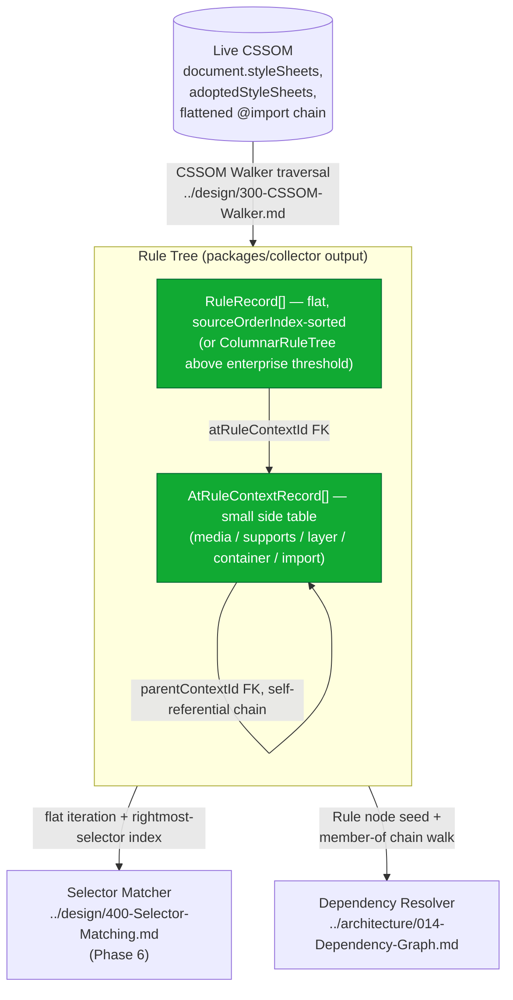
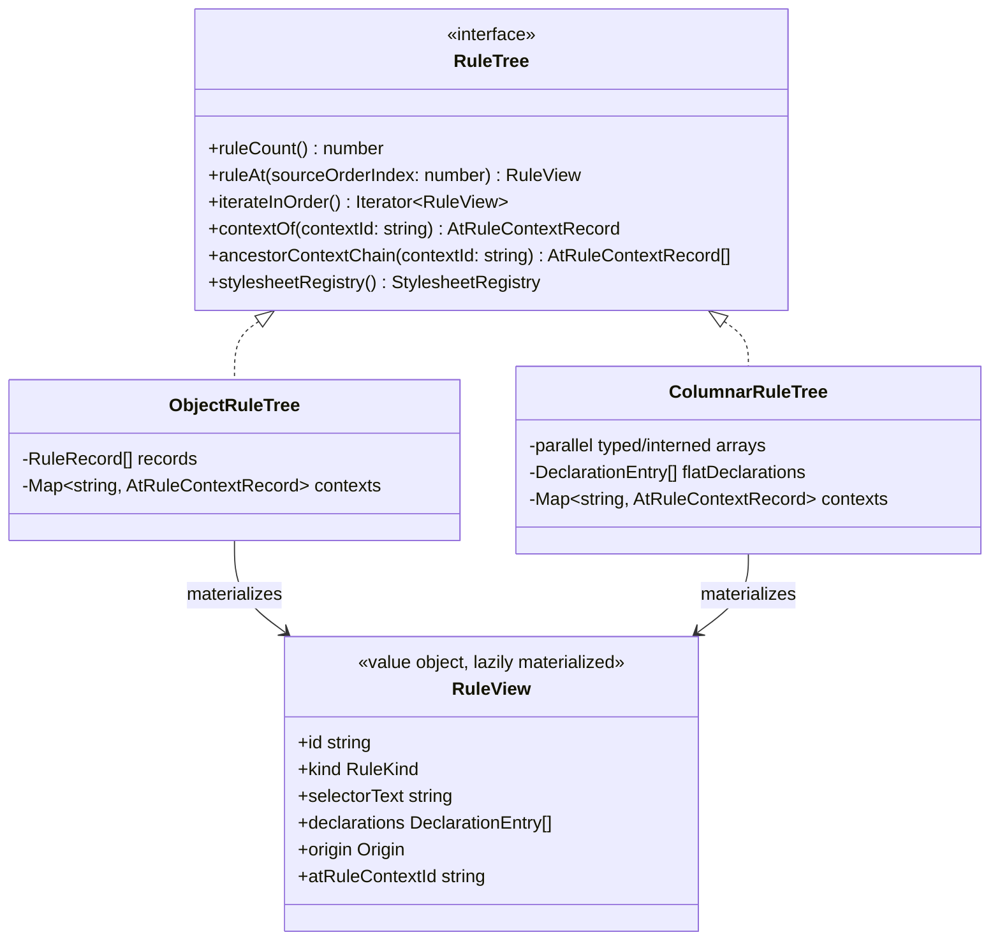
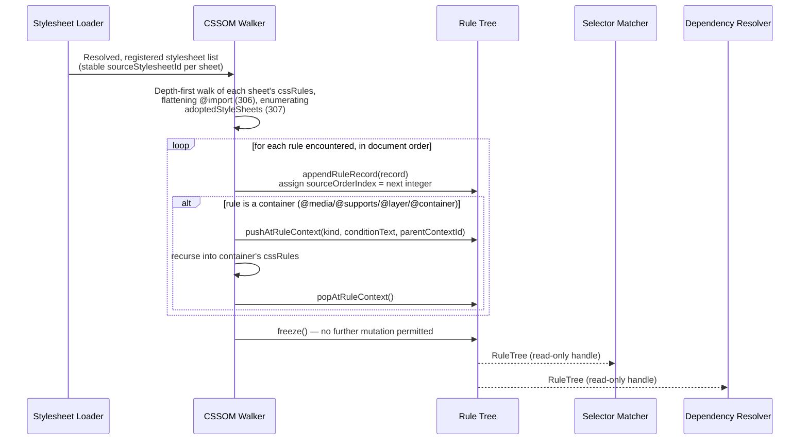

# 302 — Rule Tree

## 1. Title

**Critical CSS Extraction Engine — Rule Tree: Internal Representation of Traversed CSSOM Rules**

## 2. Version

| Field | Value |
|---|---|
| Document Version | 1.0.0 |
| Status | Draft — Phase 5 (CSSOM) |
| Last Updated | 2026-07-09 |
| Owners | Core Architecture Working Group |
| Stability | Core schema stable; nesting-context specifics deferred to sibling documents (Section 6) |

## 3. Purpose

This document specifies the **Rule Tree** — the in-memory data structure produced by the CSSOM Walker (`../design/300-CSSOM-Walker.md`, forward reference) as it traverses `document.styleSheets` (and adopted stylesheets, see `../design/307-Constructable-Stylesheets.md`, forward reference) for a page under extraction. The Rule Tree is the single normalized representation of "every CSS rule that exists in this page, in browser-reported order, together with enough structural context to know where it came from and what conditions govern whether it applies." Every downstream module in Phase 6 and Phase 7 — the Selector Matcher (`../design/400-Selector-Matching.md`, forward reference) and the Dependency Resolver (`../architecture/014-Dependency-Graph.md`) — consumes this structure rather than re-walking the live CSSOM themselves.

This document answers three questions with binding architectural weight:

1. **What shape does the Rule Tree take** — a flat, indexed list of rule records, or a tree that mirrors CSSOM nesting (stylesheet → at-rule → rule)? Section 8.2 makes and defends a concrete choice: a **flat, indexed rule list with structural back-references**, not a literal nested tree, despite the name "Rule Tree" (retained for continuity with the roadmap's file name and the intuitive mental model contributors already have from the CSSOM itself).
2. **What does each rule record contain** — selector text, declaration block, source stylesheet, source-order index, and containing at-rule context — and how is that context represented without duplicating the detailed at-rule semantics that `../design/303-Media-Rules.md`, `../design/304-Supports-Rules.md`, and `../design/305-Cascade-Layers.md` (forward references) own.
3. **How does this scale** to enterprise stylesheets with tens of thousands of rules, in both CPU and memory terms, while remaining a load-bearing input to two latency-sensitive downstream consumers (Selector Matcher, Dependency Resolver).

This document is scoped to the **rule-level structural representation**. It does not specify how `@media`/`@supports`/`@container` conditions are evaluated (owned by 303/304 respectively), how cascade layer order is resolved (owned by 305), how `@import` is flattened into the traversal (owned by `../design/306-At-Import.md`, forward reference), or how the CSSOM is walked mechanically (owned by `../design/300-CSSOM-Walker.md`, forward reference, which produces the Rule Tree as its output artifact). This document specifies the **artifact itself**: its schema, its memory layout, and the design rationale for representing it the way it is represented.

## 4. Audience

- Implementers of the CSSOM Walker (`packages/collector`, per [007-Repository-Structure.md](../architecture/007-Repository-Structure.md)), who produce the Rule Tree.
- Implementers of the Selector Matcher (`packages/matcher`) and Dependency Resolver (`packages/dependency-graph`), the two primary consumers of the Rule Tree, who need to know its exact schema and iteration cost characteristics before designing their own indexing layers on top of it.
- Authors of `../design/303-Media-Rules.md`, `../design/304-Supports-Rules.md`, `../design/305-Cascade-Layers.md`, `../design/306-At-Import.md`, and `../design/307-Constructable-Stylesheets.md`, all of whom extend this document's `AtRuleContext` model with construct-specific semantics.
- Senior engineers evaluating the memory/CPU tradeoffs of this representation against alternative designs (nested tree, per-stylesheet sharded structures) before Phase 5 implementation begins.

Readers are assumed to be senior engineers comfortable with the CSSOM specification's `CSSRule` type hierarchy (`CSSStyleRule`, `CSSMediaRule`, `CSSSupportsRule`, `CSSLayerBlockRule`, `CSSImportRule`, etc.), with basic data-structure tradeoff analysis (array-of-structs vs. struct-of-arrays, pointer-chasing vs. flat-index access), and with the project's foundational commitments in [006-Design-Principles.md](../architecture/006-Design-Principles.md). This is not an introduction to the CSSOM.

## 5. Prerequisites

- [006-Design-Principles.md](../architecture/006-Design-Principles.md) — Principle 1 (Browser Is Source of Truth) and Principle 5 (Determinism of Output) directly constrain this document's schema and traversal-order guarantees.
- [014-Dependency-Graph.md](../architecture/014-Dependency-Graph.md) — the runtime dependency graph that consumes the Rule Tree's `Rule` records as its seed-adjacent input; Section 8.5 of that document assumes the Rule Tree's `origin` and `memberOf` fields exist in exactly the shape this document defines them.
- `../design/300-CSSOM-Walker.md` (forward reference, sibling document) — the traversal algorithm that produces the Rule Tree; this document assumes that traversal visits stylesheets and at-rules in browser-reported document order and does not re-derive that guarantee.
- Familiarity with the CSSOM specification's `CSSStyleSheet.cssRules`, `CSSRuleList`, and the `CSSRule` subtype hierarchy.

## 6. Related Documents

- [006-Design-Principles.md](../architecture/006-Design-Principles.md)
- [014-Dependency-Graph.md](../architecture/014-Dependency-Graph.md) — Section 8.1's `Rule` node kind and `origin`/`memberOf` fields are direct consumers of this document's schema
- `../design/300-CSSOM-Walker.md` (forward reference) — produces the Rule Tree
- `../design/301-Stylesheet-Loader.md` (forward reference) — resolves and loads the stylesheet objects the CSSOM Walker traverses to build this structure
- `../design/303-Media-Rules.md` (forward reference) — extends `AtRuleContext` with `@media` condition representation and viewport-dependent applicability
- `../design/304-Supports-Rules.md` (forward reference) — extends `AtRuleContext` with `@supports` condition representation
- `../design/305-Cascade-Layers.md` (forward reference) — extends `AtRuleContext` with cascade layer membership and ordering
- `../design/306-At-Import.md` (forward reference) — specifies how `@import`-linked stylesheets are flattened into a single traversal producing one Rule Tree, rather than one Rule Tree per stylesheet
- `../design/307-Constructable-Stylesheets.md` (forward reference) — specifies how `adoptedStyleSheets` are enumerated and merged into the same Rule Tree
- `../design/400-Selector-Matching.md` (forward reference, Phase 6) — the Selector Matcher, primary consumer of the flat rule list for `Element.matches()` dispatch
- [ADR-0001-Browser-Is-Source-of-Truth](../adr/ADR-0001-Browser-Is-Source-of-Truth.md)
- [ADR-0002-No-Custom-Selector-Parser](../adr/ADR-0002-No-Custom-Selector-Parser.md)

## 7. Overview

Every CSS rule the engine ever reasons about — whether it becomes part of the critical CSS output or is discarded as unmatched — passes through the Rule Tree at least once. The CSSOM Walker discovers rules by walking `document.styleSheets` (plus adopted stylesheets and flattened `@import` chains), and for each rule it encounters, it produces one **Rule Record**. The complete ordered collection of Rule Records, together with a small side-table of **At-Rule Context Records** describing the conditional/layered/imported context each rule sits inside, constitutes the Rule Tree.

The name "Rule Tree" is inherited from the roadmap file name (`302-Rule-Tree.md`) and from the intuitive mental model every contributor already carries from having looked at `document.styleSheets` in a browser console — that model *is* a tree: stylesheets contain rules, some rules (`CSSMediaRule`, `CSSSupportsRule`, `CSSLayerBlockRule`) contain further rules, recursively. Section 8.2 makes the case, in detail, that the engine's internal representation should **not** literally be that recursive tree of objects, despite the natural mental model, and should instead be a flat array of Rule Records where nesting is represented as *metadata on each leaf record* rather than as actual parent-child object pointers. This is the single most consequential design decision in this document, and it is made deliberately, not by default — the name "Rule Tree" survives as the conceptual/roadmap name for the artifact, while its concrete implementation is a flat, indexed structure.

The chapter is organized as follows: Section 8 specifies the Rule Record and At-Rule Context Record schemas, defends the flat-vs-nested decision, and covers memory layout for enterprise-scale stylesheets. Section 9 diagrams the structure and its place in the pipeline. Section 10 specifies the two governing algorithms owned by this document: Rule Tree construction order and index-based lookup. Sections 11 onward cover implementation notes, edge cases, tradeoffs, performance, testing, and future work.

## 8. Detailed Design

### 8.1 The Rule Record

Every rule discovered during traversal — regardless of whether it is a plain `CSSStyleRule`, a `CSSPageRule`, a `CSSFontFaceRule`, a `CSSKeyframeRule` inside a `CSSKeyframesRule`, or any other leaf rule type — is normalized into a **Rule Record** with the following fields:

| Field | Type | Description |
|---|---|---|
| `id` | `string` | Stable, deterministic identifier derived from `(stylesheetIndex, ruleIndexPath)` — never a random UUID, per Principle 5 in [006-Design-Principles.md](../architecture/006-Design-Principles.md) |
| `kind` | `RuleKind` | Discriminant: `'style' \| 'page' \| 'font-face' \| 'keyframes' \| 'keyframe' \| 'property' \| 'counter-style' \| 'font-feature-values' \| ...` (extensible; see Edge Cases) |
| `selectorText` | `string \| null` | Browser-reported `selectorText` for selector-bearing rule kinds (`'style'`); `null` for at-rules that do not carry a selector (e.g., `'font-face'`) |
| `declarationBlock` | `DeclarationEntry[]` | An ordered list of `{ property: string, value: string, important: boolean }` triples, read via `CSSStyleDeclaration` indexed access (`declaration[i]`, `declaration.getPropertyPriority(name)`) — never via regex over `cssText` (Principle 2 boundary; see Implementation Notes) |
| `sourceStylesheetId` | `string` | Stable identifier for the owning `CSSStyleSheet` object, assigned by `../design/301-Stylesheet-Loader.md`'s stylesheet registry, not a raw array index (see Section 8.3 on why stylesheet identity is itself indirected) |
| `sourceOrderIndex` | `number` | A single monotonically increasing integer, unique across the *entire* Rule Tree, reflecting depth-first, document-order traversal position — this is the field Selector Matcher and Serializer (via [006-Design-Principles.md](../architecture/006-Design-Principles.md)'s Canonical Ordering algorithm) sort by |
| `atRuleContextId` | `string \| null` | Foreign key into the At-Rule Context table (Section 8.4); `null` for rules with no containing conditional/layer/import context (top-level rules in a plain stylesheet) |
| `origin` | `{ stylesheetIndex: number, ruleIndexPath: number[] }` | The browser-reported positional coordinates: which stylesheet (by traversal-time ordinal) and the path of `cssRules` indices from the stylesheet root down to this rule (e.g., `[2, 0, 5]` means "third top-level rule's first nested rule's sixth nested rule") — retained for cross-checking against [014-Dependency-Graph.md](../architecture/014-Dependency-Graph.md)'s `origin` field, which this document's `origin` is the direct source of |

`DeclarationEntry[]` deliberately preserves declaration order and the `!important` flag per property, because both are semantically load-bearing for the eventual Cascade Resolver and Serializer stages, even though the Rule Tree itself does not resolve cascade — it only records browser-observed facts (Principle 1).

### 8.2 Design Decision: Flat Indexed List, Not a Nested Tree

**Statement of the decision.** The Rule Tree's primary storage structure is a single flat array, `RuleRecord[]`, ordered by `sourceOrderIndex`, plus a separate flat array, `AtRuleContextRecord[]`, that rule records reference by ID rather than nest inside. Nesting — "this rule is inside this `@media` block, which is inside this `@layer` block" — is represented as a **linear chain of context references** (each `AtRuleContextRecord` optionally points to a `parentContextId`), not as literal parent-child pointers between rule objects.

**Why.** Three independent reasons converge on this choice:

1. **Consumption pattern mismatch with tree traversal.** The two primary consumers — Selector Matcher and Dependency Resolver — do not need to walk "into" nested structure recursively as their primary access pattern. The Selector Matcher's core operation (Phase 6) is "for each above-fold candidate element, evaluate `element.matches(rule.selectorText)` for some subset of rules, filtered by whether the rule's containing context currently applies" — this is fundamentally an iteration over a flat candidate list with a context-applicability predicate attached, not a depth-first tree walk. A literal nested tree would force every consumer to either recursively descend the tree on every query (repeated, redundant traversal cost) or flatten it themselves as a first step (duplicating the work this document exists to do once).
2. **Determinism and canonical ordering (Principle 5).** [006-Design-Principles.md](../architecture/006-Design-Principles.md)'s Canonical Ordering algorithm sorts rules by `(sourceStylesheetIndex, sourceRuleIndex)` as a flat total order. A nested tree structure has no native "flat total order" — producing one requires an explicit flattening pass (an in-order or pre-order traversal) every time canonical order is needed. Storing the flat order as the *primary* representation means canonical order is a property the structure has by construction (the array literally is in that order), not a derived property recomputed by every consumer.
3. **Memory locality at enterprise scale (Section 8.5).** A nested tree of JavaScript objects — each `CSSMediaRule`-equivalent node holding an array of child nodes, each child potentially another container — produces a pointer-chasing object graph with a live object count proportional to total nesting depth × rule count, and V8's garbage collector must trace that entire live object graph on every major GC pass for the duration of the extraction run. A flat array of plain records (or, in the streaming/large-stylesheet path, a struct-of-arrays layout, see Section 8.5) is a single contiguous allocation (or a small, bounded number of typed-array-backed columns) that GC can scan far more cheaply, and that is far more amenable to the incremental/windowed construction strategy required for the "tens of thousands of rules" enterprise case.

**Alternatives considered.**

- **A literal nested tree mirroring CSSOM structure** (stylesheet node → at-rule container nodes → leaf rule nodes, each holding a `children: Node[]` array). This is the "obvious" choice given the name and given that it mirrors `document.styleSheets` directly. Rejected as the *primary* representation for the three reasons above, but not rejected as a concept entirely — Section 8.4's At-Rule Context chain *is* effectively a (much smaller, much shallower) tree, because at-rule nesting depth is bounded and small (rarely more than 3-4 levels: e.g., `@layer` → `@media` → `@supports` → rule) even when rule *count* is enormous. The nested-tree cost problem is a problem of nesting a large number of *leaf* rules under a comparatively small number of container nodes — so nesting is retained exactly where it is cheap (the small number of at-rule containers) and eliminated exactly where it is expensive (the large number of leaf rules).
- **One flat array per stylesheet, keyed by stylesheet, rather than one global flat array.** Rejected as the primary structure because the Selector Matcher's dominant query pattern ("all rules whose selector could possibly match this element, across every stylesheet") is cross-stylesheet, and per-stylesheet sharding would force a merge step before every such query; per-stylesheet sharding is, however, retained as an *internal implementation detail* of parallel construction (Section 10.1) and is reconciled into the single global array before being handed to consumers, preserving Principle 5's single-canonical-order guarantee.
- **A relational/columnar (struct-of-arrays) layout from the outset** (parallel arrays: `selectorTexts: string[]`, `stylesheetIds: string[]`, etc., indexed by a shared integer rule ID, rather than an array of `RuleRecord` objects). This is not rejected — it is the recommended layout for the large-stylesheet path specifically (Section 8.5) — but it is not adopted as the *universal* default because it meaningfully hurts code readability and ergonomics for the common case (most pages have a few hundred to a few thousand rules, where object-per-record ergonomics dominate and the columnar layout's cache-locality benefit is not yet the bottleneck). The engine therefore supports both layouts behind the same logical `RuleTree` interface (Section 9.2), selecting the columnar layout automatically above a configurable rule-count threshold.

**Tradeoffs accepted.** Because nesting is represented via context *references* rather than object containment, any consumer that genuinely wants "all rules directly inside this specific `@media` block" (as opposed to "all rules, filtered by an applicability predicate") must perform an index lookup (context ID → list of rule IDs referencing it) rather than a direct child-array traversal. This is mitigated by maintaining a reverse index (`contextId → RuleRecord[]`) lazily, built on first access and cached for the duration of the extraction run — an O(n) one-time cost amortized across however many times a consumer needs "children of context X," which in practice is rare relative to "all rules, filtered."

### 8.3 Stylesheet Identity Indirection

`sourceStylesheetId` is a stable identifier from `../design/301-Stylesheet-Loader.md`'s stylesheet registry rather than a raw traversal-time array index into `document.styleSheets`, for a reason specific to Principle 5: `document.styleSheets`' array order can, in principle, be affected by dynamic stylesheet insertion/removal during a page's lifecycle (a `<link>` element inserted by a third-party script after initial load, for instance), and if the Rule Tree captured only a raw index, two Rule Trees constructed from the "same" page state at slightly different wall-clock moments could assign different indices to the same logical stylesheet, breaking determinism guarantees that downstream caching (Cache Manager, [006-Design-Principles.md](../architecture/006-Design-Principles.md) Principle 8) depends on. The Stylesheet Loader assigns IDs based on stable identity (resolved URL for `<link>`-sourced sheets, a content-hash-derived synthetic ID for inline `<style>` and constructed stylesheets — see `../design/307-Constructable-Stylesheets.md`), and the Rule Tree stores that stable ID, retaining the raw traversal-time index only inside `origin.stylesheetIndex` for diagnostic/debugging purposes, never as a lookup key.

### 8.4 The At-Rule Context Table

Rather than nesting rules inside at-rule container objects, the Rule Tree maintains a separate, small table of **At-Rule Context Records**:

| Field | Type | Description |
|---|---|---|
| `id` | `string` | Stable ID, deterministically derived from `(sourceStylesheetId, containerRuleIndexPath, containerKind)` |
| `kind` | `AtRuleContextKind` | `'media' \| 'supports' \| 'layer' \| 'container' \| 'import'` |
| `parentContextId` | `string \| null` | The immediately enclosing context, forming the (short, shallow) context chain — `null` if this context sits at the top level of its stylesheet |
| `conditionText` | `string \| null` | Raw, browser-reported condition text (e.g., `mediaText` for `'media'`, `conditionText` for `'supports'`) — construct-specific evaluation is delegated entirely to the sibling documents; this document stores the text verbatim and nothing more |
| `layerName` | `string \| null` | Populated only for `kind: 'layer'`; see `../design/305-Cascade-Layers.md` for anonymous-layer naming rules |

This table is intentionally thin. It exists so that a `RuleRecord.atRuleContextId` can be resolved to "what conditions/layers govern this rule" without every `RuleRecord` duplicating condition text for every rule inside a large `@media` block (a single `@media (min-width: 768px) { ... 500 rules ... }` block stores its `mediaText` exactly once in one `AtRuleContextRecord`, referenced by 500 `RuleRecord.atRuleContextId` foreign keys, rather than 500 copies of the same string). The construct-specific interpretation of `conditionText` — evaluating it against `window.matchMedia`, `CSS.supports()`, or resolving layer order — is explicitly out of scope here and owned by 303/304/305 respectively; this document's contract with those documents is exactly this table's schema and the guarantee that `parentContextId` chains are walkable to reconstruct full nesting context (e.g., a rule inside `@layer base { @media (min-width: 768px) { ... } }` has an `atRuleContextId` pointing at the `'media'` context record, whose `parentContextId` points at the `'layer'` context record).

### 8.5 Memory Layout for Enterprise-Scale Stylesheets

The brief's testing fixtures explicitly include "huge enterprise stylesheets" (tens of thousands of rules — a large design-system bundle plus vendor CSS plus legacy overrides is a realistic real-world case that can exceed 30,000-50,000 individual style rules). At this scale, naive object-per-rule construction has measurable cost:

- **Object overhead.** A JavaScript object with even a handful of string/array-valued fields carries meaningful per-object memory overhead (property backing store, hidden class pointer, etc.) in V8. At 50,000 rules, an array of 50,000 individually-allocated `RuleRecord` objects, each holding a `DeclarationEntry[]` sub-array of its own, is a large, deeply-referenced object graph.
- **GC pressure during a single extraction run.** Because the Rule Tree is fully live for the duration of one route/viewport extraction (it feeds both the Selector Matcher and the Dependency Resolver, which run after it), it cannot be incrementally discarded mid-run; it is a large, long-lived allocation that increases minor/major GC pause cost proportionally to live object count for the run's duration.
- **Serialization cost for cross-context transfer.** Per [006-Design-Principles.md](../architecture/006-Design-Principles.md)'s Principle 1 consequence that most decisional logic runs *inside* a live page context via `page.evaluate()`-style bridges, the Rule Tree (or the raw CSSOM facts it is built from) must cross the Node-host/browser-context serialization boundary at least once. A deeply nested object graph with many small objects serializes (via the automation protocol's structured-clone-equivalent) far less efficiently than a small number of larger, flatter payloads.

**Chosen mitigation: automatic columnar (struct-of-arrays) layout above a configurable rule-count threshold.** Rather than one `RuleRecord[]` of object instances, the large-stylesheet path represents the same logical schema as a set of parallel, primitive-typed arrays — conceptually:

```
class ColumnarRuleTree {
  selectorText: (string | null)[]
  declarationBlockStart: Int32Array   // index into a shared flat declarations array
  declarationBlockLength: Int32Array
  sourceStylesheetId: string[]        // interned, deduplicated string pool
  sourceOrderIndex: Int32Array
  atRuleContextId: (string | null)[]
  // declarations stored once, flat, referenced by (start, length) pairs:
  flatDeclarations: DeclarationEntry[]
}
```

This is not a premature optimization in violation of Principle 3 in [006-Design-Principles.md](../architecture/006-Design-Principles.md): it is introduced as an **additive, benchmarked, toggleable layer** behind the same `RuleTree` read interface (Section 9.2) that the object-per-record layout implements, selected automatically once rule count crosses a threshold determined by benchmarking against the `fixtures/enterprise-huge/` fixture (per [007-Repository-Structure.md](../architecture/007-Repository-Structure.md)), and both layouts are provably equivalent in the facts they expose — the columnar layout is a different encoding of the identical schema, not an approximation of it. String fields with high duplication (`sourceStylesheetId`, repeated across thousands of rules from the same stylesheet) are interned through a small string pool rather than stored redundantly per rule, which is the single highest-leverage memory reduction at enterprise scale, since stylesheet-identifier repetition scales linearly with rule count while the pool itself scales with (small) stylesheet count.

### 8.6 How the Rule Tree Feeds Downstream Consumers

**Selector Matcher (Phase 6, `../design/400-Selector-Matching.md`).** The Selector Matcher's primary read pattern against the Rule Tree is: iterate `RuleRecord[]` (or the columnar equivalent) in `sourceOrderIndex` order, build a rightmost-simple-selector index (per [006-Design-Principles.md](../architecture/006-Design-Principles.md) Principle 3's permitted "superset filter" indexing) keyed off `selectorText`, and for each above-fold candidate element, look up candidate rules through that index before ever calling `element.matches()`. The flat structure is precisely what makes this indexing pass a single linear scan rather than a recursive tree walk; the `atRuleContextId` foreign key lets the matcher defer context-applicability evaluation (is this rule's `@media`/`@supports`/`@layer` context even active for the current viewport/browser) to a cheap secondary filter joined against the At-Rule Context table, rather than requiring context evaluation to be threaded through every level of a recursive descent.

**Dependency Resolver ([014-Dependency-Graph.md](../architecture/014-Dependency-Graph.md)).** The Dependency Resolver's `Rule` node kind (Section 8.1 of that document) is constructed directly from a matched `RuleRecord`: the graph's `origin` field is populated verbatim from this document's `origin`, and the graph's `member-of` annotation (Section 8.4 of that document) is populated by walking this document's `atRuleContextId` → `parentContextId` chain to produce the ordered list of ancestor block IDs the Dependency Resolver needs for cascade-layer-ordering purposes — this document's At-Rule Context table is the direct source of truth the Dependency Resolver reads to populate that annotation, which is why Section 8.4's chain-walkability guarantee is load-bearing for a document outside this one.

## 9. Architecture

### 9.1 Structural Diagram



### 9.2 The `RuleTree` Read Interface

Both storage layouts (object-per-record, columnar) implement the same logical read contract, so consumers are insulated from the Section 8.5 layout decision:



`RuleView` is a lazily materialized value object — for the object-backed layout it is nearly free (the underlying `RuleRecord` already *is* shaped this way), while for the columnar layout it is assembled on demand from the parallel arrays at the moment a consumer actually needs a full-shape record, keeping the columnar layout's benefit (compact storage, cheap bulk scans) while still presenting an ergonomic per-rule object to code that wants one.

### 9.3 Construction Sequence



The `freeze()` step is deliberate: once construction completes, the Rule Tree is treated as immutable for the remainder of the extraction run, which is what allows both the Selector Matcher and the Dependency Resolver to safely build their own derived indexes over it (e.g., the Selector Matcher's rightmost-selector index) without any risk of the underlying data shifting mid-run — a direct enabler of the memoization permitted by Principle 3 in [006-Design-Principles.md](../architecture/006-Design-Principles.md).

## 10. Algorithms

### 10.1 Algorithm: Rule Tree Construction (Depth-First Context-Tracked Traversal)

**Problem statement.** Given a registry of resolved stylesheets (each a live `CSSStyleSheet` object reference), produce a single flat, `sourceOrderIndex`-ordered `RuleRecord[]` and its accompanying `AtRuleContextRecord[]` table, such that document order is preserved exactly as the browser reports it and every rule's containing at-rule context chain is correctly attributed.

**Inputs.** `stylesheets: RegisteredStylesheet[]` (from `../design/301-Stylesheet-Loader.md`, each with a stable `sourceStylesheetId` and a live `CSSStyleSheet` handle); a `browserContext` for in-page CSSOM access.

**Outputs.** `RuleTree` (Section 9.2's interface, backed by either storage layout).

**Pseudocode.**

```text
function buildRuleTree(stylesheets, browserContext) -> RuleTree:
    ruleRecords = []
    contexts = Map<string, AtRuleContextRecord>()
    nextOrderIndex = 0

    function walkRuleList(rules: CSSRuleList, stylesheetId, indexPath: number[], parentContextId: string | null):
        for i, rule in enumerate(rules):
            currentPath = indexPath + [i]
            if rule.kind is container-like (media, supports, layer-block, container):
                contextId = makeContextId(stylesheetId, currentPath, rule.kind)
                contexts[contextId] = AtRuleContextRecord(
                    id: contextId,
                    kind: rule.kind,
                    parentContextId: parentContextId,
                    conditionText: rule.conditionText,   // e.g. mediaText, verbatim
                    layerName: rule.kind == 'layer' ? resolveLayerName(rule) : null
                )
                walkRuleList(rule.cssRules, stylesheetId, currentPath, contextId)  // recurse into container
            elif rule.kind == 'import':
                // Flattening delegated to 306-At-Import.md; this walker treats an
                // already-flattened import target's rule list as if it were inline
                // at this position, per that document's contract.
                importedRules = resolveImportTarget(rule)  // see 306
                walkRuleList(importedRules, stylesheetId, currentPath, parentContextId)
            else:
                record = makeRuleRecord(
                    id: makeRuleId(stylesheetId, currentPath),
                    kind: rule.kind,
                    selectorText: rule.selectorText ?? null,
                    declarationBlock: extractDeclarations(rule.style),  // indexed CSSStyleDeclaration access
                    sourceStylesheetId: stylesheetId,
                    sourceOrderIndex: nextOrderIndex++,
                    atRuleContextId: parentContextId,
                    origin: { stylesheetIndex: stylesheets.indexOf(stylesheetId), ruleIndexPath: currentPath }
                )
                ruleRecords.append(record)

    for sheet in stylesheets:  // in stable registry order, per 301-Stylesheet-Loader.md
        walkRuleList(sheet.cssRules, sheet.sourceStylesheetId, [], null)

    tree = (ruleRecords.length > COLUMNAR_THRESHOLD)
        ? ColumnarRuleTree.from(ruleRecords, contexts)
        : ObjectRuleTree.from(ruleRecords, contexts)
    tree.freeze()
    return tree
```

**Time complexity.** `O(R + C)` where `R` is total rule count (leaf + container rules) across all stylesheets and `C` is total declaration count across all rules (declaration extraction is itself linear in property count per rule). This is a single depth-first pass; no rule is visited more than once. Container recursion depth is bounded by at-rule nesting depth, which is small in practice (Section 8.2) and does not materially affect asymptotic complexity, only constant-factor call-stack depth.

**Memory complexity.** `O(R + C)` for the resulting flat structures, plus `O(k)` transient stack depth for the recursion where `k` is maximum nesting depth (bounded, small). This is asymptotically identical to a nested-tree representation's memory cost for the *data itself* — the Section 8.2 argument is about constant-factor object overhead and access-pattern cost, not asymptotic complexity, which is why Section 8.2 frames its justification in terms of GC pressure and locality rather than Big-O.

**Failure cases.** A `cssRules` access throwing `SecurityError` on a cross-origin, non-CORS-permitted stylesheet (must be caught per Principle 6 in [006-Design-Principles.md](../architecture/006-Design-Principles.md) and surfaced as a `CrossOriginStylesheetSkipped` diagnostic rather than aborting the entire walk — see Edge Cases); a stylesheet mutated concurrently with traversal (mitigated by the DOM-snapshot stabilization guarantee this document assumes from the Navigation Engine, per [001-Vision.md](../architecture/001-Vision.md)); an `@import` cycle (delegated to `306-At-Import.md`'s cycle-guard contract, forward reference — this algorithm assumes `resolveImportTarget` never returns a rule list that would cause `walkRuleList` to recurse into itself).

**Optimization opportunities.** Per-stylesheet traversal is independent (no cross-stylesheet mutable state is touched during a single sheet's walk except appending to the shared `ruleRecords` array and `nextOrderIndex` counter), so traversal of distinct stylesheets can be parallelized across worker threads with results merged by a final, deterministic re-sort on `(sourceStylesheetId registry order, ruleIndexPath)` before `sourceOrderIndex` is finally assigned — this mirrors the merge strategy in [006-Design-Principles.md](../architecture/006-Design-Principles.md)'s Canonical Ordering algorithm and its "sort can be partitioned by stylesheet and merged in O(n)" optimization note.

### 10.2 Algorithm: Ancestor Context Chain Resolution

**Problem statement.** Given a `RuleRecord.atRuleContextId`, produce the ordered list of `AtRuleContextRecord`s from the immediate containing context up to the top-level (a rule inside `@layer base { @media (min-width: 768px) { ... } }` should yield `[mediaContext, layerContext]`), for consumption by 303/304/305's applicability evaluators and by the Dependency Resolver's `member-of` population (Section 8.6).

**Inputs.** `contextId: string | null`; the `contexts: Map<string, AtRuleContextRecord>` table.

**Outputs.** `AtRuleContextRecord[]`, ordered innermost-first.

**Pseudocode.**

```text
function ancestorContextChain(contextId, contexts) -> AtRuleContextRecord[]:
    chain = []
    current = contextId
    while current != null:
        record = contexts.get(current)
        assert record != null  // invariant: every non-null contextId resolves; violation is a construction bug
        chain.append(record)
        current = record.parentContextId
    return chain
```

**Time complexity.** `O(d)` where `d` is nesting depth for a single call; `O(d)` is small and bounded in practice (Section 8.2). If called once per rule across the whole tree without memoization, worst case `O(R * d)`; memoized per distinct `contextId` (bounded by total context count, which is far smaller than `R`), effectively `O(unique contexts × average depth)`, a small constant relative to `R`.

**Memory complexity.** `O(d)` per call for the returned chain; `O(unique contexts)` for the memoization cache if used.

**Failure cases.** A dangling `parentContextId` that does not resolve in the `contexts` map is a construction invariant violation (a bug in Algorithm 10.1, not a runtime input error) and should fail loudly (assertion failure surfaced as a diagnostic) rather than silently truncate the chain, consistent with Principle 6.

**Optimization opportunities.** Because the context table is small and immutable after `freeze()` (Section 9.3), the full chain for every distinct `contextId` can be precomputed once, eagerly, immediately after construction, and cached — trading a small, bounded amount of eager work for zero repeated chain-walking cost during the (much hotter) Selector Matcher and Dependency Resolver passes that follow.

## 11. Implementation Notes

- `extractDeclarations` (Section 10.1) must use indexed `CSSStyleDeclaration` access (`declaration.item(i)` / `declaration[i]`, `declaration.getPropertyValue(name)`, `declaration.getPropertyPriority(name)`) rather than regex-splitting `declaration.cssText`, for the same non-decisional-vs-decisional reasoning already established in [014-Dependency-Graph.md](../architecture/014-Dependency-Graph.md)'s Implementation Notes regarding `var()` token extraction — reading declaration structure through the browser's own API surface is squarely within Principle 1, whereas parsing `cssText` by hand risks subtly diverging from browser-normalized serialization (e.g., shorthand expansion, color normalization) in ways a regex would not anticipate.
- `makeRuleId` and `makeContextId` (Section 10.1) must be pure functions of their structural inputs only (`sourceStylesheetId`, `ruleIndexPath`, `kind`) — never incorporating `nextOrderIndex` or any other traversal-time counter — so that re-running construction against an unchanged page produces byte-identical IDs, a precondition for the Cache Manager's fingerprint-based reuse (Principle 8, [006-Design-Principles.md](../architecture/006-Design-Principles.md)) to be sound when applied to any diagnostic artifact that embeds these IDs (e.g., the Reporter's dependency-graph visualization, [014-Dependency-Graph.md](../architecture/014-Dependency-Graph.md) Section 11).
- The `COLUMNAR_THRESHOLD` (Section 8.5) should be exposed as a configuration value, not hardcoded, and its default should be set from benchmark data against `fixtures/enterprise-huge/` (per [007-Repository-Structure.md](../architecture/007-Repository-Structure.md)) rather than an arbitrary round number — Phase 14 (`docs/performance/003-Rule-Indexing.md`, planned) should record the chosen default and the benchmark that justified it.
- Because the Rule Tree crosses the Node-host/browser-context boundary (Section 8.5's serialization-cost concern), the CSSOM Walker should assemble Rule Records inside the browser context via a single batched `page.evaluate()` call per stylesheet (or per worker-parallelized stylesheet group) rather than one round trip per rule, directly analogous to the batched-discovery optimization already established in [014-Dependency-Graph.md](../architecture/014-Dependency-Graph.md) Section 10.1.
- `freeze()` (Section 9.3) should be a real, enforced immutability boundary (e.g., `Object.freeze` on the backing arrays for the object-layout path, and a read-only typed-array view for the columnar path) rather than a documentation-only convention, since downstream memoization (Selector Matcher's rightmost-selector index, Dependency Resolver's per-node discovery memoization) is only sound if the Rule Tree truly cannot mutate after construction.

## 12. Edge Cases

- **Rules with no `selectorText`.** At-rules like `@font-face`, `@page` (in its bare form), `@property`, and `@counter-style` do not carry a CSS selector; `selectorText` is `null` for these `RuleKind`s by design, and the Selector Matcher must treat `null` `selectorText` as "not a candidate for `element.matches()` at all," never as an empty-string selector (which would have different, incorrect matching semantics).
- **`CSSKeyframeRule` inside `CSSKeyframesRule`.** Individual keyframe steps (`0%`, `50%`, `to`) are themselves rule-like objects with a `keyText` rather than a `selectorText`; they are represented as `kind: 'keyframe'` records with `selectorText: null` and a construct-specific `keyText` field (not shown in the core schema table, treated as kind-specific extension data), and are attributed to an `atRuleContextId` pointing at a synthetic context-like entry for their parent `@keyframes` block so the same chain-walking machinery (Section 10.2) works uniformly — this mechanism is used by [014-Dependency-Graph.md](../architecture/014-Dependency-Graph.md)'s `Keyframes` node discovery, which is a Dependency Resolver concern layered on top of this document's structural facts, not this document's own concern.
- **Cross-origin stylesheets throwing on `cssRules` access.** Per Principle 6 in [006-Design-Principles.md](../architecture/006-Design-Principles.md), a `SecurityError` on `cssRules` access must produce a `CrossOriginStylesheetSkipped` diagnostic and an explicit "gap" in the Rule Tree for that stylesheet (the stylesheet is registered by `../design/301-Stylesheet-Loader.md` and appears in the stylesheet registry, but contributes zero `RuleRecord`s), never a silent empty contribution indistinguishable from "this stylesheet legitimately has zero rules."
- **Constructable stylesheets shared across multiple shadow roots.** A single `CSSStyleSheet` instance can be adopted by more than one shadow root via `adoptedStyleSheets` (per `../design/307-Constructable-Stylesheets.md`, forward reference); this document's traversal must not double-count that stylesheet's rules once per adopting root — each distinct `CSSStyleSheet` object contributes exactly one set of `RuleRecord`s regardless of adoption fan-out, and adoption-site information (which shadow roots use this sheet) is tracked separately as a property of the stylesheet registry entry, not duplicated into the Rule Tree's per-rule schema.
- **Nested CSS producing browser-flattened `selectorText`.** Per Principle 1 and 2 and consistent with [006-Design-Principles.md](../architecture/006-Design-Principles.md)'s Edge Cases entry on nested CSS, a nested rule's `selectorText` as reported by the CSSOM is already the browser's fully-resolved, flattened selector (e.g., `&:hover` nested under `.card` resolves to `.card:hover` in the reported `selectorText`); this document's construction algorithm reads that resolved text verbatim and performs no selector-syntax interpretation of its own, so CSS Nesting support is, from this document's perspective, a non-event — it is handled entirely upstream by the browser's own CSSOM normalization.
- **Enormous single declaration blocks (utility-class frameworks).** Frameworks like Tailwind can produce tens of thousands of single-declaration rules; this is precisely the case the columnar layout (Section 8.5) targets, and it is called out explicitly here because it is a *qualitatively different* shape from "enterprise CSS" in the traditional sense (few rules, many declarations each) — the Rule Tree's schema handles both shapes uniformly, but the memory-layout decision in Section 8.5 is tuned primarily against the "many rules, few declarations each" utility-class shape, which is the more memory-pressure-dominant case for `RuleRecord` object overhead specifically (declaration count matters less than rule *count* for the object-overhead argument in Section 8.5).
- **Future CSS specifications introducing new at-rule kinds.** `AtRuleContextKind` (Section 8.4) and `RuleKind` (Section 8.1) are both explicitly open, string-discriminated enums rather than closed to a fixed set at the type level in the abstract schema sense, so that a future CSS specification's new at-rule type can be added as a new discriminant value without a breaking schema change — consumers that do not recognize a given `kind` value are expected to treat it as an unknown-but-structurally-valid record (skip it for selector matching, surface a diagnostic note for the Reporter) rather than crashing, per the general fail-fast-but-not-fail-catastrophically posture established in [006-Design-Principles.md](../architecture/006-Design-Principles.md) Principle 6.

## 13. Tradeoffs

| Decision | Why | Alternative Considered | Tradeoff Accepted |
|---|---|---|---|
| Flat, indexed `RuleRecord[]` instead of a literal nested tree mirroring CSSOM structure | Matches the dominant flat-iteration/index-lookup access pattern of both consumers; makes canonical order a structural property, not a derived one; better GC/locality characteristics at enterprise scale | Nested tree of container objects, each with a `children` array, directly mirroring `document.styleSheets` | Reconstructing "children of context X" requires an index lookup rather than direct child-array access; mitigated by a lazily-built reverse index |
| At-rule context stored in a separate side table referenced by foreign key, rather than duplicated per rule | Avoids duplicating condition text/layer name across every rule inside a large conditional block; keeps the hot rule-record schema small | Denormalized schema with condition text copied onto every `RuleRecord` | An extra indirection (context lookup) on any code path that needs full context, in exchange for materially smaller hot-path record size |
| Automatic columnar layout above a configurable rule-count threshold, rather than one universal layout | Object-per-record ergonomics dominate for typical page sizes; columnar layout's benefit only matters at enterprise scale, where it is decisive | Always use columnar layout; always use object layout | Two code paths behind one interface (Section 9.2) to maintain, versus a single, simpler, but non-scaling or non-ergonomic universal layout |
| `sourceStylesheetId` as a stable registry-assigned identifier, not a raw traversal-time array index | Raw indices can shift under dynamic stylesheet insertion/removal, breaking Principle 5's determinism guarantee across repeated runs | Use `document.styleSheets` array index directly | Requires a small stylesheet-registry indirection layer (owned by `301-Stylesheet-Loader.md`) that must be kept in sync with the Rule Tree's expectations |
| Declaration extraction via indexed `CSSStyleDeclaration` API, never regex over `cssText` | Consistent with Principle 2's non-decisional-parsing carve-out; avoids divergence from browser-normalized serialization | Regex/string-split over `cssText` for speed | Slightly more verbose extraction code (iterating declaration indices) versus a one-line string split, in exchange for correctness robustness against shorthand/normalization edge cases |

## 14. Performance

- **CPU complexity.** Construction is `O(R + C)` (Section 10.1) — linear in total rule and declaration count, dominated in practice by the cost of crossing the browser/host boundary (batched `page.evaluate()` round trips) rather than by in-memory processing once data has crossed that boundary, consistent with the profiling guidance already established in [006-Design-Principles.md](../architecture/006-Design-Principles.md) and [014-Dependency-Graph.md](../architecture/014-Dependency-Graph.md).
- **Memory complexity.** `O(R + C)` for either storage layout; the columnar layout (Section 8.5) reduces the *constant factor* substantially at enterprise scale (string interning, elimination of per-object overhead) without changing asymptotic complexity.
- **Caching strategy.** The fully-constructed, frozen Rule Tree for a given stylesheet set is itself a candidate for reuse across viewport passes within a single route extraction, since stylesheet content (and therefore the Rule Tree's structural facts) does not change between Mobile/Tablet/Desktop passes for the same route — only which rules end up in the Selector Matcher's *matched seed set* changes per viewport (owned by `../design/303-Media-Rules.md`'s viewport-dependent applicability, Section 3 of that document). This mirrors the viewport-invariant-subgraph reuse idea flagged as a research direction in [014-Dependency-Graph.md](../architecture/014-Dependency-Graph.md) Future Work, and this document treats it as a natural extension of the same principle at the Rule Tree layer rather than at the dependency-graph layer.
- **Parallelization opportunities.** Per-stylesheet traversal is independent and parallelizable across worker threads (Section 10.1's optimization note); the final merge into a single canonical `sourceOrderIndex` ordering is a cheap, deterministic reconciliation step, not a bottleneck.
- **Incremental execution.** Because construction is proportional to total stylesheet size (not filtered to any seed set — unlike the Dependency Resolver's deliberately seed-driven incrementality, [014-Dependency-Graph.md](../architecture/014-Dependency-Graph.md) Section 8.5), the Rule Tree's own construction cost does not shrink just because a page's above-fold content is small; incrementality at this layer instead comes from cross-run caching (previous point) and from the Incremental Extraction work planned in Phase 9 (`docs/design/704-Incremental-Extraction.md`, not yet written), which may allow reusing a previously-constructed Rule Tree keyed on a stylesheet-content fingerprint independent of route/viewport.
- **Profiling guidance.** Profile the browser/host boundary crossing first (number and payload size of `page.evaluate()` calls during construction) before profiling in-process JavaScript execution time, consistent with [014-Dependency-Graph.md](../architecture/014-Dependency-Graph.md) Section 14's guidance for the analogous concern in dependency resolution; secondarily, profile GC pause frequency/duration during construction against the `fixtures/enterprise-huge/` fixture specifically to validate the columnar-layout threshold's chosen value.
- **Scalability limits.** The practical ceiling is governed by total stylesheet byte size and rule count driving both serialization cost across the automation-protocol boundary and in-process memory; the columnar layout materially raises this ceiling relative to a naive object-per-rule design but does not eliminate the underlying linear scaling — extremely large stylesheets (hundreds of thousands of rules, an unusual but not impossible enterprise case) remain a candidate for the streaming/windowed construction strategy noted in Future Work.

## 15. Testing

- **Unit tests.** `buildRuleTree`'s traversal ordering, `atRuleContextId` attribution, and `origin` field correctness should be tested against synthetic, in-memory CSSOM-shaped fixtures (mocked `CSSRuleList`/`CSSRule` objects) covering: flat rules, single-level nesting, multi-level nesting (`@layer` inside `@media` inside `@supports`), and the keyframe/font-face/property at-rule kinds — with no real browser dependency, mirroring the isolation strategy already used for `FixedPointResolver` in [014-Dependency-Graph.md](../architecture/014-Dependency-Graph.md) Section 15.
- **Integration tests.** Real Playwright-driven construction against fixtures engineered to exercise: deeply nested at-rules, cross-origin stylesheets (verifying the `CrossOriginStylesheetSkipped` diagnostic path), constructable stylesheets adopted by multiple shadow roots (verifying no double-counting), and CSS Nesting syntax (verifying that reported `selectorText` is the browser-flattened form) — asserting on the resulting `RuleRecord[]`/`AtRuleContextRecord[]` shape directly, not merely on downstream serialized output.
- **Visual tests.** Not directly applicable at this structural layer in isolation; correctness of the Rule Tree is ultimately validated transitively through the same rendering-parity visual regression suite that validates the whole pipeline (per [001-Vision.md](../architecture/001-Vision.md) Section 15), since an incorrectly attributed context or a dropped rule manifests as a visible rendering divergence downstream.
- **Stress tests.** A dedicated `fixtures/enterprise-huge/` variant with 50,000+ single-declaration utility-class rules must be exercised to (a) verify the columnar layout activates at the configured threshold, (b) benchmark construction wall-clock time and peak memory against the object-layout baseline on a smaller comparable fixture, and (c) verify GC pause characteristics remain acceptable per the profiling guidance in Section 14.
- **Regression tests.** Any production bug in traversal ordering, context attribution, or declaration extraction gains a permanent fixture + golden-Rule-Tree-snapshot regression test (a serialized dump of `RuleRecord[]`/`AtRuleContextRecord[]` for a known-good fixture), consistent with the golden-snapshot philosophy established across this documentation set (e.g., [014-Dependency-Graph.md](../architecture/014-Dependency-Graph.md) Section 15).
- **Benchmark tests.** `benchmarks/` (per [007-Repository-Structure.md](../architecture/007-Repository-Structure.md)) should track construction throughput (rules/second) and peak memory for both storage layouts across a range of fixture sizes, establishing the empirical basis for the `COLUMNAR_THRESHOLD` default noted in Implementation Notes.

## 16. Future Work

- **Streaming/windowed construction for extremely large stylesheets.** For stylesheets whose rule count is large enough that even the columnar layout's full in-memory materialization becomes a concern (a case beyond the currently-targeted "tens of thousands of rules" scale), investigate a windowed construction strategy that constructs and hands off the Rule Tree in chunks to the Selector Matcher, rather than materializing the entire structure before any consumer begins work — this would require the Selector Matcher's indexing strategy to also support incremental ingestion, a cross-cutting change deferred pending evidence this scale is actually encountered in practice.
- **Cross-route Rule Tree caching keyed on stylesheet-content fingerprint**, independent of the Cache Manager's whole-extraction fingerprint (Principle 8, [006-Design-Principles.md](../architecture/006-Design-Principles.md)) — if the same shared stylesheet bundle is reused across many routes in a route manifest (Section 2.9 of `BRIEF.md`), the Rule Tree for that bundle could in principle be constructed once and reused, with only the Selector Matcher's per-route matched-seed-set computation varying; this is noted as a research direction pending Phase 10 caching work (`docs/design/800-Cache-Overview.md`, planned).
- **Automated schema-conformance fixtures for future CSS at-rule kinds** — as new at-rules are standardized, a lightweight process for extending `RuleKind`/`AtRuleContextKind` without breaking existing consumers (per the open-enum design in Edge Cases) should be formalized, potentially via a WPT-derived fixture set analogous to the one proposed for selector conformance in [006-Design-Principles.md](../architecture/006-Design-Principles.md) Future Work.
- **Open question: should the reverse index ("children of context X") be a first-class, eagerly-built part of the frozen Rule Tree rather than a lazily-built cache?** Current lean is lazy (Section 8.2), since the dominant consumer access pattern does not need it, but this should be revisited once Phase 5 implementation and Phase 8 (Serialization, which may want to reconstruct human-readable nested output) provide real usage data.
- **Open question: is a fourth storage layout (e.g., a typed-array-backed, wasm-friendly layout) warranted for a future high-throughput CI batch-extraction mode**, where thousands of routes are processed in the same process and Rule Tree construction cost is amortized differently than in the single-route developer-workflow case this document primarily optimizes for? Flagged for Phase 14 performance research rather than committed here.

## 17. References

- [006-Design-Principles.md](../architecture/006-Design-Principles.md)
- [014-Dependency-Graph.md](../architecture/014-Dependency-Graph.md)
- `../design/300-CSSOM-Walker.md` (forward reference, Phase 5)
- `../design/301-Stylesheet-Loader.md` (forward reference, Phase 5)
- `../design/303-Media-Rules.md` (forward reference, Phase 5)
- `../design/304-Supports-Rules.md` (forward reference, Phase 5)
- `../design/305-Cascade-Layers.md` (forward reference, Phase 5)
- `../design/306-At-Import.md` (forward reference, Phase 5)
- `../design/307-Constructable-Stylesheets.md` (forward reference, Phase 5)
- `../design/400-Selector-Matching.md` (forward reference, Phase 6)
- [ADR-0001-Browser-Is-Source-of-Truth](../adr/ADR-0001-Browser-Is-Source-of-Truth.md)
- [ADR-0002-No-Custom-Selector-Parser](../adr/ADR-0002-No-Custom-Selector-Parser.md)
- W3C CSS Object Model (CSSOM) specification — `CSSStyleSheet`, `CSSRuleList`, `CSSRule` type hierarchy — https://www.w3.org/TR/cssom-1/
- W3C CSS Nesting Module — browser-side selector flattening referenced in Edge Cases — https://www.w3.org/TR/css-nesting-1/
- V8 memory management documentation — GC pause cost as a function of live object graph size, referenced in Section 8.5's memory-layout rationale
